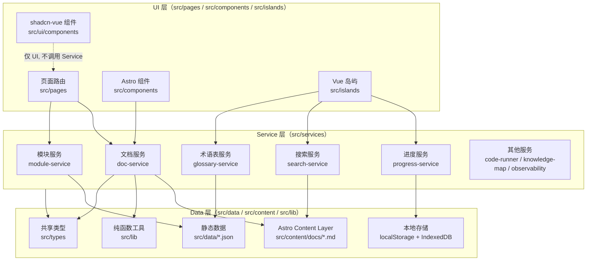

# FANDEX-web 架构文档

本文件是 FANDEX-web 项目的权威架构参考，描述三层架构、目录组织、依赖关系与扩展指南。任何涉及跨层调用、新增模块或调整目录结构的变更，须先对照本文档评估影响范围。

## 项目概览

FANDEX-web 是一个基于 Astro 7 静态站点生成（SSG）+ Vue 3 岛屿架构的计算机科学自学平台，1995 篇文档覆盖 51 个学习模块。项目遵循「内容即数据」的核心理念：所有学习内容以 Markdown 文件形式存放在 `src/content/docs/`，由 Astro Content Layer 加载，经 Service 层封装后供 UI 层消费。

### 核心设计目标

| 目标         | 实现策略                                                                  |
| :----------- | :------------------------------------------------------------------------ |
| 零运行时开销 | 静态站点生成（SSG），构建期完成所有渲染与索引生成                         |
| 按需水合     | Vue 3 岛屿架构，仅交互组件水合，`client:load` / `client:visible` 分级加载 |
| 类型安全     | TypeScript 严格模式，禁止 `any`，Service 层统一类型导出                   |
| 可维护性     | 三层架构（UI / Service / Data）强制分层，禁止跨层直接访问                 |
| 可扩展性     | 模块化目录结构，新增模块 / 文档 / 组件均有规范路径                        |
| 性能预算     | Lighthouse 性能预算门禁，Bundle 体积分析，关键资源预连接                  |

## 三层架构

FANDEX-web 严格遵循三层架构分层规则，每一层有明确职责与依赖边界。下图展示各层之间的依赖流向：



### 分层规则

#### UI 层

- **职责**：界面交互与展示，处理用户输入与视图渲染
- **路径**：`src/pages/`、`src/components/`、`src/islands/`、`src/ui/components/`
- **依赖规则**：
  - 允许调用 `src/services/index.ts` 导出的 Service API
  - 允许引用 `src/types/` 中的共享类型
  - 允许引用 `src/ui/components/` 中的 shadcn-vue 组件
  - **禁止**直接调用 `getCollection` 等 Astro Data 层 API
  - **禁止**直接访问 `localStorage` / `IndexedDB`（须通过 Service 层）
  - **禁止**在 UI 层编写业务逻辑

#### Service 层

- **职责**：承载全部业务逻辑，对 UI 层暴露领域 API，对内调用 Data 层完成数据存取
- **路径**：`src/services/`
- **统一入口**：`src/services/index.ts`（UI 层唯一允许导入的 Service 文件）
- **依赖规则**：
  - 允许调用 Data 层（Content Layer、静态数据、Storage、纯函数工具）
  - 允许引用 `src/types/` 与 `src/lib/` 中的纯函数
  - **禁止**包含 JSX、模板或任何视图代码
  - **禁止**直接操作 DOM（`document`、`window` 等浏览器 API）
  - **禁止**模块间循环依赖

#### Data 层

- **职责**：数据存取与底层交互
- **路径**：
  - `src/content/docs/` — Markdown 文档源（Astro Content Layer 自动加载）
  - `src/data/` — 静态 JSON 数据（roadmap、learning-paths、glossary、cheatsheets）
  - `src/data/storage/` — IndexedDB 存储仓库（progress-repository、exercise-repository）
  - `src/lib/` — 无副作用纯函数工具（modules、progress、code-runner 等）
  - `src/types/` — 共享 TypeScript 类型定义
- **依赖规则**：
  - 仅被 Service 层调用
  - 不允许反向引用 UI 或 Service 层
  - `src/lib/` 中的工具函数必须是纯函数，无副作用

## 目录结构

```
FANDEX-Web/
├── .changeset/                  # Changesets 版本管理配置
│   ├── config.json              # Changesets 主配置
│   └── README.md                # Changesets 流程说明
├── .github/                     # GitHub 配置
│   ├── workflows/               # CI/CD 工作流
│   │   ├── ci.yml               # 主流水线（lint/type-check/test/build/qa/lighthouse/deploy）
│   │   ├── changeset.yml        # PR changeset 检测
│   │   ├── codeql.yml           # 代码安全扫描
│   │   └── content-update.yml   # 内容更新工作流
│   ├── ISSUE_TEMPLATE/          # Issue 模板
│   ├── codeql/                  # CodeQL 配置
│   ├── CODEOWNERS               # 代码所有者规则
│   └── PULL_REQUEST_TEMPLATE.md # PR 模板
├── docs/                        # 项目文档
│   ├── architecture.md          # 架构文档（本文件）
│   ├── contributing.md          # 贡献指南
│   ├── design-system.md         # 设计系统
│   ├── CHANGELOG.md             # 变更日志
│   ├── content-engineering-spec.md  # 内容工程规范
│   └── content-upgrade-playbook.md  # 内容升级手册
├── public/                      # 静态资源
│   ├── fonts/                   # 字体文件
│   ├── workers/                 # Web Worker 脚本
│   ├── favicon.svg              # 站点图标
│   ├── robots.txt               # 爬虫规则
│   └── sw.js                    # Service Worker
├── reports/                     # 构建报告（git 跟踪）
│   ├── baseline/                # 基线性能数据
│   └── bundle-stats.html        # Bundle 体积可视化
├── scripts/                     # 构建与维护脚本
│   ├── analyze-bundle.mjs       # Bundle 体积分析
│   ├── build-glossary-index.mjs # 术语索引构建
│   ├── build-search-index.mjs   # 搜索索引构建
│   ├── content-audit.mjs        # 内容质量审计
│   └── qa-check.mjs             # 发布前质量检查
└── src/
    ├── components/              # Astro 组件（UI 层 - 服务器端渲染）
    ├── config/
    │   └── runtime.ts           # 运行时配置（站点 URL、CDN、超时等）
    ├── content/
    │   └── docs/                # Markdown 文档源（按模块组织，51 个模块目录）
    ├── content.config.ts        # Astro Content Layer 配置
    ├── data/                    # 静态数据与存储层（Data 层）
    │   ├── api/                 # 外部 API 适配层
    │   ├── cheatsheets/         # 速查表数据
    │   ├── glossary/            # 术语表数据
    │   ├── storage/             # IndexedDB 存储仓库
    │   ├── glossary.json        # 术语聚合索引
    │   ├── learning-paths.json  # 学习路径
    │   └── roadmap.json         # 学习路线
    ├── islands/                 # Vue 岛屿组件（UI 层 - 客户端水合）
    ├── lib/                     # 纯函数工具库（Data 层）
    ├── pages/                   # 页面路由（UI 层）
    ├── plugins/                 # Astro 插件（remark/rehype）
    ├── services/                # Service 层（业务逻辑）
    │   ├── index.ts             # Service 层统一入口
    │   ├── doc-service.ts       # 文档查询与导航
    │   ├── module-service.ts    # 模块查询
    │   ├── progress-service.ts  # 学习进度
    │   ├── search-service.ts    # 全文搜索
    │   └── ...                  # 其他服务
    ├── styles/                  # 全局样式
    │   ├── tokens.css           # Design Tokens
    │   ├── tailwind.css         # Tailwind v4 入口
    │   └── ...                  # 其他样式
    ├── types/                   # 共享类型定义（Data 层）
    ├── ui/
    │   ├── components/          # shadcn-vue 组件库
    │   └── composables/         # Vue 组合式函数
    ├── utils/                   # 通用工具函数
    └── workers/                 # Web Worker
        ├── code-runner-worker.ts # 代码运行沙箱
        └── search-worker.ts     # Fuse.js 模糊搜索
```

## 依赖关系矩阵

下表展示各模块的依赖与被依赖关系，用于评估变更影响范围。`→` 表示「依赖于」。

### Service 层依赖矩阵

| Service                 | 依赖（→）                                                            | 被依赖（←）                               |
| :---------------------- | :------------------------------------------------------------------- | :---------------------------------------- |
| `doc-service`           | Content Layer、`lib/modules`、`types/doc`                            | UI 层（pages、components）                |
| `module-service`        | `lib/modules`、`types/module`                                        | `doc-service`、UI 层                      |
| `tag-service`           | `doc-service`、`types/doc`                                           | UI 层                                     |
| `glossary-service`      | `data/glossary.json`、`types/glossary`                               | UI 层、`doc-service`                      |
| `progress-service`      | `data/storage/progress-repository`、`lib/progress`、`types/progress` | UI 层（islands）、`learning-path-service` |
| `learning-path-service` | `data/learning-paths.json`、`progress-service`、`types`              | UI 层                                     |
| `search-service`        | `workers/search-worker`、Pagefind、`types/search`                    | UI 层（SearchDialog）                     |
| `code-runner-service`   | `workers/code-runner-worker`、`lib/code-runner`、`types`             | UI 层（CodeRunner）                       |
| `knowledge-map-service` | `doc-service`、`module-service`、`types`                             | UI 层（KnowledgeMap）                     |
| `observability-service` | `localStorage`、`lib`、`types`                                       | UI 层（PerformanceMonitor）               |

### 关键约束

- **禁止反向依赖**：Data 层不得引用 Service 或 UI 层
- **禁止跨层访问**：UI 层不得直接调用 `getCollection` 或 `localStorage`
- **禁止循环依赖**：Service 之间如需互调，须通过显式 `import`，并通过 `index.ts` 统一对外暴露
- **类型共享**：所有跨层传递的数据结构须在 `src/types/` 中定义

## 扩展指南

### 新增文档

1. 在 `src/content/docs/<module>/` 下创建 `.md` 文件
2. 在文件头添加 frontmatter（参见 `docs/contributing.md` 的 frontmatter 规范）
3. 在 `src/lib/modules.ts` 中确认模块定义与前置依赖
4. 运行 `npm run lint:docs` 与 `npm run build` 验证

### 新增模块

1. 在 `src/content/docs/` 下创建模块目录
2. 在 `src/lib/modules.ts` 中注册模块定义（id、title、icon、category、prerequisites）
3. 在 `src/data/roadmap.json` 中将模块加入对应 Phase
4. 如有学习路径，在 `src/data/learning-paths.json` 中关联
5. 创建模块首页 `src/pages/[module]/index.astro`（如需自定义）
6. 运行 `npm run build` 验证模块可被 Service 层正确加载

### 新增 Service

1. 在 `src/services/` 下创建 `<feature>-service.ts`
2. 实现 Service 函数，输入参数与返回值均须类型化
3. 在 `src/services/index.ts` 中导出（这是 UI 层唯一允许的入口）
4. 如需共享类型，在 `src/types/` 中定义
5. 添加单元测试 `src/services/<feature>-service.test.ts`
6. 运行 `npm run test` 与 `npm run type-check` 验证

### 新增 shadcn-vue 组件

1. 通过 `npx shadcn-vue@latest add <component>` 添加，配置参见 `components.json`
2. 组件将生成至 `src/ui/components/<component>/`
3. 在 `src/ui/components/<component>/index.ts` 中确认导出
4. 在 `src/ui/components/index.ts` 中按需聚合导出
5. UI 层通过 `import { Button } from '@/ui/components'` 引用

### 新增 Vue 岛屿

1. 在 `src/islands/` 下创建 `.vue` 文件
2. 在 Astro 页面中通过 `client:load` 或 `client:visible` 指令引入
3. 岛屿内的业务逻辑须通过 `src/services/index.ts` 调用
4. 严禁在岛屿内直接访问 `localStorage` 或 `getCollection`

### 新增 Design Token

1. 在 `src/styles/tokens.css` 中添加 Token（须同时考虑亮色与暗色模式）
2. 令牌命名遵循 `--fandex-<category>-<variant>` 规范
3. 在组件中通过 `var(--fandex-<token>)` 引用
4. 如需 Tailwind 工具类映射，在 `src/styles/tailwind.css` 中通过 `@theme` 注册

## 技术栈版本

| 类别     | 技术                         | 版本        | 说明                                 |
| :------- | :--------------------------- | :---------- | :----------------------------------- |
| 框架     | Astro                        | 7.x         | 静态站点生成，岛屿架构               |
| 交互     | Vue                          | 3.5.x       | Composition API，按需水合            |
| 样式     | Tailwind CSS                 | 4.x         | CSS-first 配置，Vite 插件            |
| 组件库   | shadcn-vue（基于 radix-vue） | 1.x         | 可复制粘贴的组件库，源码归项目所有   |
| 搜索     | Pagefind                     | 2.x         | 构建期静态搜索索引                   |
| 模糊搜索 | Fuse.js                      | 7.x         | Web Worker 内运行的离线兜底搜索      |
| 数学渲染 | KaTeX                        | 7.x         | 通过 remark-math + rehype-katex 集成 |
| 图表     | Mermaid                      | 11.x（CDN） | 知识地图渲染，按需加载               |
| 代码高亮 | Shiki                        | 内置        | 双主题（github-light / github-dark） |
| 测试     | Vitest                       | 4.x         | 单元测试，V8 覆盖率                  |
| 代码质量 | Husky + lint-staged          | 9.x / 17.x  | Pre-commit 钩子                      |
| 格式化   | Prettier                     | 3.x         | 含 prettier-plugin-astro             |
| 文档格式 | remark-cli                   | 12.x        | Markdown 格式检查                    |
| 性能审计 | Lighthouse CI                | 0.15.x      | 性能预算门禁                         |
| 版本管理 | Changesets                   | 2.x         | PR 驱动的版本与 CHANGELOG 管理       |
| 构建分析 | rollup-plugin-visualizer     | 7.x         | Bundle 体积可视化                    |
| 运行时   | Node.js                      | 22 LTS      | CI 与本地开发统一版本                |

## 参考文档

- [贡献指南](./contributing.md) — 内容贡献流程、质量基准、提交规范
- [设计系统](./design-system.md) — Design Tokens、组件库、双主题机制
- [变更日志](./CHANGELOG.md) — 版本演进记录
- [内容工程规范](./content-engineering-spec.md) — 文档内容撰写规范
- [Astro 官方文档](https://astro.build)
- [shadcn-vue 官方文档](https://shadcn-vue.com)
