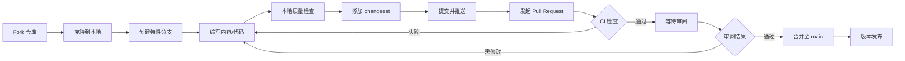

# FANDEX-web 贡献指南

感谢你对 FANDEX 项目的关注。本指南详述内容贡献流程、质量基准、提交规范与审阅机制，确保每一份贡献都能高效合并并保持高水准。本文件是仓库根目录 `CONTRIBUTING.md` 的扩展版本，更详细地覆盖工程化要求。

## 贡献流程

FANDEX-web 采用 Fork + PR 的标准开源协作模式，所有变更通过 Pull Request 合并至 `main` 分支。

### 整体流程



### 详细步骤

#### 1. Fork 与克隆

点击 GitHub 仓库右上角「Fork」按钮将仓库复制到个人账户，然后克隆至本地：

```bash
git clone https://github.com/<your-username>/FANDEX-web.git
cd FANDEX-web
npm install
```

#### 2. 创建特性分支

分支命名遵循 `<type>/<scope>-<brief>` 格式：

```bash
git checkout -b feat/svg-module-filters
git checkout -b fix/search-dialog-keyboard
git checkout -b docs/agent-memory-section
```

允许的 type：

| type       | 适用场景                 |
| :--------- | :----------------------- |
| `feat`     | 新功能、新文档模块       |
| `fix`      | Bug 修复、文档勘误       |
| `docs`     | 仅文档变更               |
| `style`    | 仅格式调整（不影响内容） |
| `refactor` | 重构（无功能变化）       |
| `perf`     | 性能优化                 |
| `test`     | 测试相关变更             |
| `chore`    | 构建、CI、依赖等杂项     |

#### 3. 编写内容或代码

- 文档内容存放在 `src/content/docs/<module>/` 下
- 业务逻辑须遵循三层架构（参见 [架构文档](./architecture.md)）
- 代码风格须通过 ESLint 与 Prettier 检查

#### 4. 本地质量检查

提交前必须在本地运行以下检查，确保与 CI 一致：

```bash
# 格式检查
npm run format:check

# 文档格式检查
npm run lint:docs

# 类型检查
npm run type-check

# 单元测试
npm run test

# 构建（约 3-5 分钟）
npm run build

# 发布前质量检查（需先构建）
npm run qa
```

#### 5. 添加 Changeset

如本次变更属于以下任意情形，须添加 changeset 声明：

- 新增功能或文档模块（minor）
- 错误修复或文档勘误（patch）
- 破坏性变更（major）

```bash
npm run changeset
```

详细流程参见 [.changeset/README.md](../.changeset/README.md)。

#### 6. 提交并发起 PR

提交信息遵循 Conventional Commits 规范（详见下文），推送分支后在 GitHub 上发起 Pull Request，按 PR 模板填写变更说明与测试清单。

## 内容质量基准

每一篇贡献文档须满足以下 12 项质量基准，审阅者将逐项核对：

### 准确性与可读性

1. **技术准确**：所有技术内容基于官方文档或权威资料，代码示例经过验证可运行
2. **零基础友好**：不假设读者已有先修知识，首次出现的专业术语给出简要解释
3. **中英空格**：中英文之间、中文与数字之间必须加半角空格
4. **中文标点**：统一使用中文标点（代码与链接除外）

### 结构规范

5. **统一结构**：文档遵循「学习目标 → 前置知识 → 核心概念 → 动手实践 → 常见错误与排查 → 自测题 → 下一步」结构
6. **标题层级**：不超过三级（H1 / H2 / H3），H4 仅在极必要时使用，标题层级连续不跳级
7. **末尾链接**：文档末尾包含「下一步」章节，链接到相关进阶文档

### 代码示例

8. **语言标注**：代码块必须标注语言类型（如 `sql`、`bash`、`python`、`typescript`）
9. **关键注释**：关键行必须有中文注释
10. **预期输出**：非简单代码块应附带预期输出（以注释形式）
11. **常见错误**：每篇文档至少包含一个常见错误的示例与解决方法

### 自测与禁用项

12. **自测题**：文档包含至少 1 个自测题或嵌入式自检点，并提供答案

### 禁止事项

- 禁止使用 emoji（包括 Unicode emoji 与短代码形式）
- 禁止使用 ASCII 艺术字（如文本框图、字符画）
- 禁止在标题中使用特殊符号装饰
- 禁止使用纯大写字母表示强调（应使用加粗或斜体）
- 禁止过度依赖 Markdown 表格展示技术概念或操作步骤（表格仅适用于纯数据对比）

## frontmatter 字段规范

每篇文档须在文件头添加 frontmatter，字段定义如下：

```yaml
---
title: '文档标题' # 必填，文档显示标题
description: '文档描述' # 必填，SEO 与卡片摘要，建议 60-80 字
pubDate: 2026-07-18 # 必填，发布日期（YYYY-MM-DD）
updatedDate: 2026-07-18 # 可选，最近更新日期
module: 'agent' # 必填，所属模块 id（参见 src/lib/modules.ts）
category: 'eng-infra' # 必填，所属分类（dev-tool/dev-lang/db/cs/eng-infra/data-tech）
difficulty: 'intermediate' # 可选，难度（beginner/intermediate/advanced）
prerequisites: # 可选，前置文档 slug 列表
  - 'agent/概述与架构'
  - 'agent/LLM基础'
tags: # 可选，标签
  - 'MCP'
  - '协议'
related: # 可选，相关文档 slug 列表
  - 'agent/MCP传输'
  - 'agent/MCP应用'
author: 'fanquanpp' # 可选，作者 GitHub 用户名
---
```

### 字段校验规则

- `title` 不得与同模块下其他文档重复
- `module` 必须在 `src/lib/modules.ts` 中已注册
- `prerequisites` 与 `related` 中的 slug 必须实际存在
- `pubDate` 不得晚于当前日期
- `tags` 每个标签长度 2-10 字符，避免过长

## 提交规范

### Conventional Commits

提交信息遵循 [Conventional Commits](https://www.conventionalcommits.org/zh-hans/) 规范：

```
<type>(<scope>): <subject>

<body>

<footer>
```

#### type 取值

| type       | 说明                   |
| :--------- | :--------------------- |
| `feat`     | 新功能                 |
| `fix`      | Bug 修复               |
| `docs`     | 文档变更               |
| `style`    | 代码格式（不影响功能） |
| `refactor` | 重构                   |
| `perf`     | 性能优化               |
| `test`     | 测试                   |
| `build`    | 构建系统或依赖         |
| `ci`       | CI 配置                |
| `chore`    | 杂项                   |
| `revert`   | 回滚                   |

#### scope 取值

`scope` 标识变更范围，建议使用模块名或目录名：

- `feat(agent): 新增 MCP 资源与提示文档`
- `fix(search): 修复 Fuse.js 阈值导致结果过多`
- `docs(css): 补充容器查询章节示例`
- `ci(changeset): 调整 PR 检测逻辑`

#### subject 要求

- 使用简体中文
- 不超过 50 字符
- 不使用句号结尾
- 不使用 emoji
- 描述「做了什么」而非「做了什么修复了什么」

#### body 与 footer

- `body` 说明变更动机与影响范围，每行不超过 72 字符
- `footer` 用于标注 BREAKING CHANGE 或关联 Issue：`Closes #123`

### 示例

```
feat(agent): 新增 MCP 资源与提示文档

补充 MCP 协议中 Resources 与 Prompts 两个原语的完整说明，
覆盖资源订阅、提示模板、参数化提示等高级用法。

新增 2 篇文档：
- agent/MCP资源与提示.md
- agent/构建MCP服务器.md（更新关联字段）

Closes #142
```

## 代码风格

### Prettier

项目根目录 `.prettierrc` 定义统一格式化规则，pre-commit 钩子会自动格式化暂存文件。手动格式化：

```bash
npm run format
```

### ESLint 与 TypeScript

- TypeScript 严格模式，禁止 `any` 与 `unknown` 类型
- 所有异步函数必须通过 `try-catch` 包裹
- 模块设计遵循单一职责原则
- 业务逻辑必须中文工程级注释

### Markdown 格式

通过 remark-cli 检查文档格式：

```bash
npm run lint:docs          # 检查
npm run lint:docs:fix      # 自动修复
```

配置文件 `.remarkrc.js` 启用 `remark-preset-lint-consistent` 预设。

## 测试要求

### 单元测试

- Service 层与 `src/lib/` 中的纯函数须配套单元测试
- 测试文件与被测文件同目录，命名为 `<name>.test.ts`
- 使用 Vitest，禁止引入 Jest 兼容层
- 覆盖率报告通过 `npm run test:coverage` 生成，目标 80% 以上

### 测试编写规范

```typescript
// 正确：清晰的描述与断言
describe('getDocsByModule', () => {
  it('应返回指定模块下的所有文档，按 order 排序', async () => {
    const docs = await getDocsByModule('agent');
    expect(docs.length).toBeGreaterThan(0);
    expect(docs[0].slug).toBe('agent/概述与架构');
  });

  it('当模块不存在时应返回空数组', async () => {
    const docs = await getDocsByModule('non-existent');
    expect(docs).toEqual([]);
  });
});
```

### 构建验证

提交前必须运行 `npm run build` 确保构建通过。构建过程包含：

- Glossary 索引生成
- 搜索索引生成
- Astro 静态站点构建
- Pagefind 索引生成（需在 build 后）

## 审阅流程

### 审阅者

PR 合并须至少 1 名 CODEOWNERS 审阅者批准（参见 `.github/CODEOWNERS`）。涉及以下变更须额外审阅：

- 三层架构调整：须架构维护者审阅
- CI/CD 配置：须 DevOps 维护者审阅
- 安全相关变更：须安全维护者审阅

### 审阅标准

审阅者按以下维度评估 PR：

| 维度      | 检查项                                                    |
| :-------- | :-------------------------------------------------------- |
| 架构合规  | 是否遵循三层架构？是否跨层访问？                          |
| 类型安全  | 是否引入 `any`？类型是否完整？                            |
| 内容质量  | 是否满足 12 项质量基准？frontmatter 是否完整？            |
| 测试覆盖  | 是否新增单元测试？覆盖率是否下降？                        |
| 性能影响  | 是否影响 LCP / CLS / TBT？Bundle 体积是否增长？           |
| 提交规范  | 提交信息是否符合 Conventional Commits？分支命名是否规范？ |
| Changeset | 是否包含 changeset（如需要）？                            |

### 修改与合并

- 审阅者通过 `request changes` 要求作者修改，作者修改后须重新请求审阅
- 通过审阅后，维护者使用 `Squash and merge` 合并至 `main`
- 合并后 CI 自动触发部署，约 12 分钟后线上版本更新

## CI 检查项

每个 PR 须通过以下 CI 检查方可合并（参见 `.github/workflows/ci.yml`）：

| 阶段       | 检查内容                                             |
| :--------- | :--------------------------------------------------- |
| lint       | remark 文档格式 + Prettier 代码格式                  |
| type-check | `astro check` 类型检查                               |
| unit-test  | Vitest 单元测试 + 覆盖率                             |
| build      | 完整构建 + Bundle 体积分析                           |
| e2e-test   | 关键路由冒烟测试                                     |
| qa-check   | 多维度质量检查（文件审计 / Web 架构 / SEO）          |
| lighthouse | 性能预算门禁（LCP ≤ 2.5s / CLS ≤ 0.1 / TBT ≤ 200ms） |

## 行为准则

所有贡献者须遵守 [CODE_OF_CONDUCT.md](../CODE_OF_CONDUCT.md) 中的行为准则，保持友善、尊重、专业的协作氛围。

## 反馈渠道

- 内容错误：提交 Issue（使用 bug_report 模板）
- 功能建议：提交 Issue（使用 feature_request 模板）
- 内容改进：提交 Issue（使用 content_improvement 模板）
- 安全漏洞：参见 [SECURITY.md](../SECURITY.md) 私密反馈

感谢你的贡献。
