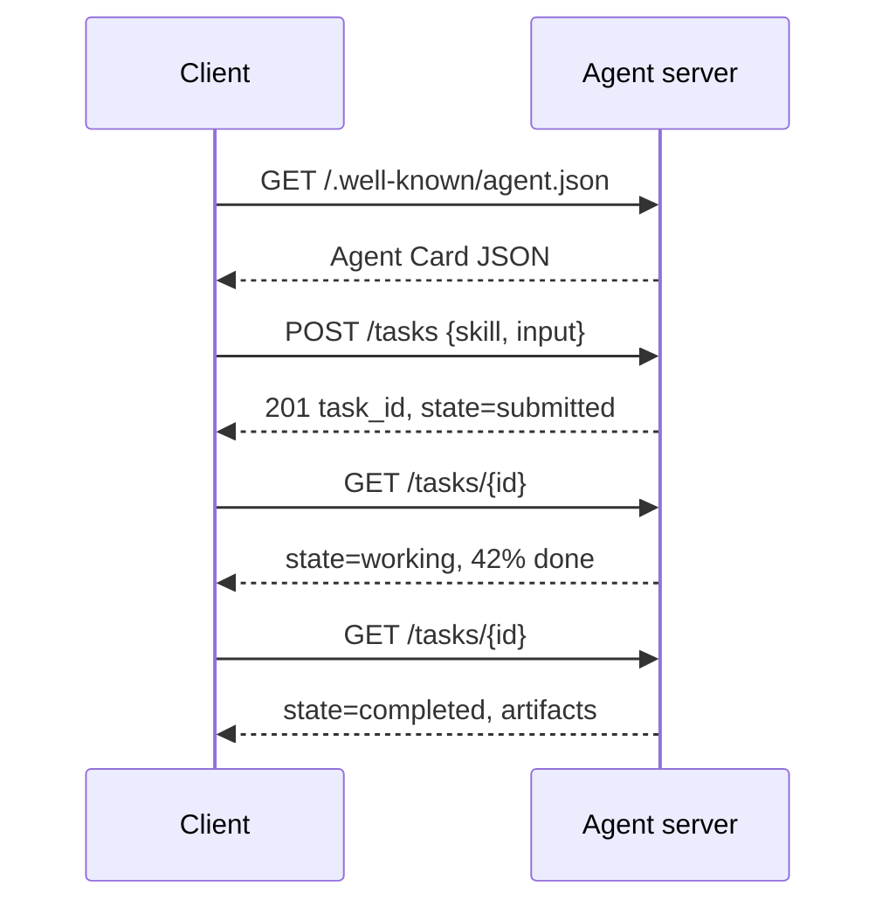

# A2A — Agent 到 Agent 协议

> Google 于 2025 年 4 月宣布 A2A；到 2026 年 4 月，规范位于 https://a2a-protocol.org/latest/specification/，150+ 组织支持它。A2A 是 MCP (Lesson 13) 的水平补充：MCP 是垂直的（Agent ↔ 工具），A2A 是对等的（Agent ↔ Agent）。它定义了 Agent Card（发现）、带制品的任务（文本、结构化数据、视频）、不透明任务生命周期和认证。生产系统越来越多地将 MCP 与 A2A 配对。Google Cloud 在 2025-2026 年间将 A2A 支持引入 Vertex AI Agent Builder。

**类型：** 学习 + 构建
**语言：** Python (stdlib, `http.server`, `json`)
**前置条件：** Phase 16 · 04 (原语模型)
**时间：** ~75 分钟

## 问题

你的 Agent 需要调用另一个系统上的另一个 Agent。怎么做？你可以暴露一个 HTTP 端点，定义一个定制的 JSON Schema，并希望另一边能理解它。每对 Agent 都变成一个定制集成。

A2A 就是那个调用的通用线路协议。标准发现、标准任务模型、标准传输、标准制品。就像 HTTP+REST 但 Agent 是一等公民。

## 概念

### 四个要素

**Agent Card。** 位于 `/.well-known/agent.json` 的 JSON 文档，描述 Agent：名称、技能、端点、支持的模态、认证要求。发现通过读取 Card 进行。

```
GET https://agent.example.com/.well-known/agent.json
→ {
    "name": "code-review-agent",
    "skills": ["review-python", "review-typescript"],
    "endpoints": {
      "tasks": "https://agent.example.com/tasks"
    },
    "auth": {"type": "bearer"},
    "modalities": ["text", "structured"]
  }
```

**Task。** 工作单元。一个异步、有状态的对象，具有生命周期：`submitted → working → completed / failed / canceled`。客户端发送任务，轮询或订阅更新。

**Artifact。** 任务产生的结果类型。文本、结构化 JSON、图像、视频、音频。制品是类型化的，所以不同模态是一等公民。

**不透明生命周期。** A2A 不规定远程 Agent *如何*解决任务。客户端看到状态转换和制品；实现可以自由使用任何框架。

### MCP/A2A 分工

- **MCP** (Lesson 13)：Agent ↔ 工具。Agent 通过 JSON-RPC 读写工具服务器。默认无状态。
- **A2A**：Agent ↔ Agent。对等协议；双方都是具有自己推理的 Agent。

生产多 Agent 系统两者都用。A2A 对等端在其一侧调用 MCP 工具。分工保持两个关注点清晰。

### 发现流程



或使用流式：SSE 订阅 `/tasks/{id}/events` 获取推送更新。

### 认证

A2A 支持三种常见模式：

- **Bearer token** — OAuth2 或不透明。
- **mTLS** — 双向 TLS；组织互相证明身份。
- **签名请求** — 对有效载荷的 HMAC。

认证在 Agent Card 中声明；客户端发现并遵守。

### 2026 年 4 月 150+ 组织

企业采用推动了 A2A 的规模。头条：A2A 成为企业 Agent 系统跨越信任边界的方式。Google Cloud 发布了 Vertex AI Agent Builder A2A 支持；Microsoft Agent Framework 支持它；大多数主要框架 (LangGraph, CrewAI, AutoGen) 都发布 A2A 适配器。

### A2A 在哪里胜出

- **跨组织调用。** A 公司的 Agent 调用 B 公司的 Agent。没有 A2A，每对都是定制契约。
- **异构框架。** LangGraph Agent 调用 CrewAI Agent 调用自定义 Python Agent。A2A 标准化。
- **类型化制品。** 视频结果、结构化 JSON、音频——都是一等公民。
- **长时间运行的任务。** 不透明生命周期 + 轮询使数小时长的任务变得简单。

### A2A 在哪里困难

- **延迟敏感的微调用。** A2A 的生命周期是异步的。亚毫秒的 Agent 到 Agent 不适合；使用直接 RPC。
- **紧密耦合的进程内 Agent。** 如果两个 Agent 运行在同一 Python 进程中，A2A 的 HTTP 往返是杀鸡用牛刀。
- **小团队。** 规范开销是真实的；仅内部的 Agent 可能不需要这种正式性。

### A2A vs ACP, ANP, NLIP

2024-2026 年间出现了几个相关规范：

- **ACP** (IBM/Linux 基金会) — A2A 的前身，范围更窄。
- **ANP** (Agent Network Protocol) — 侧重对等发现，去中心化优先。
- **NLIP** (Ecma 自然语言交互协议, 2025 年 12 月标准化) — 自然语言内容类型。

截至 2026 年 4 月，A2A 是采用最广泛的对等协议。参见 arXiv:2505.02279 (Liu 等人, "A Survey of Agent Interoperability Protocols") 了解比较。

## 构建它

`code/main.py` 使用 `http.server` 和 JSON 实现了一个 A2A 最小服务器和客户端。服务器：

- 暴露 `/.well-known/agent.json`，
- 接受 `POST /tasks`，
- 管理任务状态，
- 在 `GET /tasks/{id}` 上返回制品。

客户端：

- 获取 Agent Card，
- 提交任务，
- 轮询直到完成，
- 读取制品。

运行：

```
python3 code/main.py
```

脚本在后台线程启动服务器，然后对它运行客户端。你看到完整流程：发现、提交、轮询、制品。

## 使用它

`outputs/skill-a2a-integrator.md` 设计 A2A 集成：Agent Card 内容、任务 Schema、认证选择、流式 vs 轮询。

## 发布它

检查清单：

- **锁定规范版本。** A2A 仍在演进；Agent Card 应声明协议版本。
- **幂等任务创建。** 重复提交（网络重试）应产生一个任务。
- **制品 Schema。** 声明 Agent 返回什么形状；消费者应验证。
- **速率限制 + 认证。** A2A 面向公众；应用标准 Web 安全。
- **失败任务死信。** 随时间检查模式以发现反复出现的失败类型。

## 练习

1. 运行 `code/main.py`。确认客户端发现服务器并接收正确的制品。
2. 向服务器添加第二个技能（例如，"summarize"）。更新 Agent Card。编写一个根据任务类型选择技能的客户端。
3. 实现 SSE 流式端点：`/tasks/{id}/events` 发出状态变化。客户端需要做什么不同？
4. 阅读 A2A 规范 (https://a2a-protocol.org/latest/specification/)。识别规范要求的三个此演示未实现的东西。
5. 比较 A2A (Agent Card 发现) 与 MCP (通过 `listTools` 的服务器端能力列表)。自描述 Agent 和能力探测之间的权衡是什么？

## 关键术语

| 术语             | 人们怎么说              | 实际含义                                                       |
| ---------------- | ----------------------- | -------------------------------------------------------------- |
| A2A              | "Agent 到 Agent"        | Agent 跨系统调用其他 Agent 的对等协议。Google 2025。           |
| Agent Card       | "Agent 的名片"          | 位于 `/.well-known/agent.json` 的 JSON，描述技能、端点、认证。 |
| Task             | "工作单元"              | 带生命周期的异步有状态对象；完成时产生制品。                   |
| Artifact         | "结果"                  | 类型化输出：文本、结构化 JSON、图像、视频、音频。一等媒体。    |
| 不透明生命周期   | "如何解决是 Agent 的事" | 客户端看到状态转换；服务器自由选择框架/工具。                  |
| 发现             | "找到 Agent"            | `GET /.well-known/agent.json` 返回 Card。                      |
| MCP vs A2A       | "工具 vs 对等"          | MCP：垂直 Agent ↔ 工具。A2A：水平 Agent ↔ Agent。              |
| ACP / ANP / NLIP | "兄弟协议"              | 相邻规范；A2A 是 2026 年采用最广泛的。                         |

## 延伸阅读

- [A2A specification](https://a2a-protocol.org/latest/specification/) — 规范规范
- [Google Developers Blog — A2A announcement](https://developers.googleblog.com/en/a2a-a-new-era-of-agent-interoperability/) — 2025 年 4 月发布博文
- [A2A GitHub repo](https://github.com/a2aproject/A2A) — 参考实现和 SDK
- [Liu et al. — A Survey of Agent Interoperability Protocols](https://arxiv.org/html/2505.02279v1) — MCP, ACP, A2A, ANP 比较
