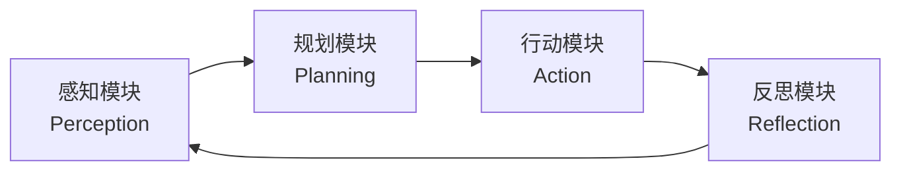
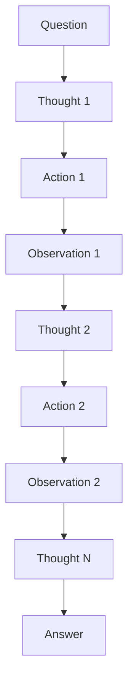

## 1. Agent 核心模块总览

AI Agent 的智能行为由四大核心模块协同驱动：**感知（Perception）**、**规划（Planning）**、**行动（Action）**、**反思（Reflection）**。它们构成一个闭环，使 Agent 能够持续感知环境、制定策略、执行操作并自我改进。



| 模块     | 核心职责           | 输入            | 输出       |
| :------- | :----------------- | :-------------- | :--------- |
| **感知** | 接收和理解环境信息 | 多模态输入      | 结构化特征 |
| **规划** | 制定行动策略       | 目标 + 状态     | 执行计划   |
| **行动** | 执行具体操作       | 执行计划        | 执行结果   |
| **反思** | 评估结果并自我改进 | 执行结果 + 目标 | 改进策略   |

## 2. 感知模块（Perception）

感知模块是 Agent 与外部世界的接口，负责将原始输入转化为 Agent 可以理解和处理的结构化信息。

### 2.1 多模态输入处理

现代 Agent 需要处理文本、图像、音频、视频等多种输入模态：

```python
from typing import Union, List
from dataclasses import dataclass
from enum import Enum

class ModalityType(Enum):
    TEXT = "text"
    IMAGE = "image"
    AUDIO = "audio"
    VIDEO = "video"
    STRUCTURED = "structured"  # JSON、表格等

@dataclass
class PerceptionInput:
    """感知输入数据结构"""
    modality: ModalityType
    content: Union[str, bytes]
    metadata: dict = None

class MultiModalPerceptor:
    """多模态感知器"""

    def __init__(self, llm_client):
        self.llm = llm_client
        self.preprocessors = {
            ModalityType.TEXT: self._preprocess_text,
            ModalityType.IMAGE: self._preprocess_image,
            ModalityType.AUDIO: self._preprocess_audio,
        }

    async def perceive(self, inputs: List[PerceptionInput]) -> dict:
        """处理多模态输入，返回统一的结构化表示"""
        processed = []
        for inp in inputs:
            preprocessor = self.preprocessors.get(inp.modality)
            if preprocessor:
                result = await preprocessor(inp)
                processed.append(result)

        # 融合多模态信息
        fused = await self._fuse_modalities(processed)
        return fused

    async def _preprocess_text(self, inp: PerceptionInput) -> dict:
        """文本预处理：分词、意图识别、实体提取"""
        prompt = f"""分析以下文本，提取关键信息：
        文本：{inp.content}

        请返回 JSON 格式：
        {{
            "intent": "用户意图",
            "entities": ["实体1", "实体2"],
            "key_facts": ["关键事实1", "关键事实2"],
            "sentiment": "情感倾向"
        }}"""
        response = await self.llm.chat(prompt)
        return {"modality": "text", "extracted": response}

    async def _preprocess_image(self, inp: PerceptionInput) -> dict:
        """图像预处理：目标检测、OCR、场景理解"""
        import base64
        b64 = base64.b64encode(inp.content).decode()
        response = await self.llm.chat_with_image(
            prompt="描述图像内容，提取关键信息",
            image_base64=b64
        )
        return {"modality": "image", "extracted": response}

    async def _preprocess_audio(self, inp: PerceptionInput) -> dict:
        """音频预处理：语音转文字、声纹识别"""
        # 使用 Whisper 等模型转录
        transcript = await self._transcribe(inp.content)
        return {"modality": "audio", "extracted": transcript}

    async def _fuse_modalities(self, processed: list) -> dict:
        """融合多模态信息为统一表示"""
        fusion_prompt = "请整合以下多模态信息，生成统一的理解：\n"
        for item in processed:
            fusion_prompt += f"\n[{item['modality']}] {item['extracted']}\n"

        fused = await self.llm.chat(fusion_prompt)
        return {
            "perception": fused,
            "raw_modalities": processed,
            "timestamp": self._get_timestamp()
        }
```

### 2.2 特征提取与状态构建

感知模块需要从原始输入中提取关键特征，构建 Agent 的内部状态表示：

```python
@dataclass
class AgentState:
    """Agent 内部状态"""
    user_intent: str           # 用户意图
    context: dict              # 上下文信息
    available_tools: list      # 可用工具列表
    constraints: list          # 约束条件
    priority: float            # 优先级

class FeatureExtractor:
    """特征提取器"""

    def extract_state(self, perception: dict, memory: dict) -> AgentState:
        """从感知结果和记忆中构建 Agent 状态"""
        return AgentState(
            user_intent=self._extract_intent(perception),
            context=self._build_context(perception, memory),
            available_tools=self._match_tools(perception),
            constraints=self._extract_constraints(perception),
            priority=self._compute_priority(perception)
        )

    def _extract_intent(self, perception: dict) -> str:
        """提取用户意图"""
        # 基于规则 + LLM 的混合意图识别
        intent_map = {
            "查询": ["查", "搜索", "找", "获取"],
            "操作": ["创建", "删除", "修改", "执行"],
            "分析": ["分析", "比较", "评估", "总结"],
        }
        text = perception.get("perception", "")
        for intent, keywords in intent_map.items():
            if any(kw in text for kw in keywords):
                return intent
        return "general"

    def _build_context(self, perception: dict, memory: dict) -> dict:
        """构建上下文：合并感知信息和历史记忆"""
        return {
            "current_input": perception,
            "recent_history": memory.get("recent", []),
            "relevant_facts": memory.get("relevant", []),
            "user_preferences": memory.get("preferences", {})
        }
```

## 3. 规划模块（Planning）

规划模块是 Agent 的"大脑"，负责将目标分解为可执行的步骤序列。

### 3.1 Chain-of-Thought（CoT）

Chain-of-Thought 让 LLM 通过逐步推理解决复杂问题，是 Agent 规划的基础能力：

```python
class ChainOfThoughtPlanner:
    """CoT 规划器"""

    COT_PROMPT = """你是一个智能规划器。请通过逐步推理来解决以下问题。

问题：{question}

请按以下格式思考：
思考1：分析问题的第一步
思考2：基于第一步的推理
...
结论：最终答案

开始推理："""

    async def plan(self, question: str) -> dict:
        """使用 CoT 进行规划"""
        prompt = self.COT_PROMPT.format(question=question)
        response = await self.llm.chat(prompt)

        return {
            "reasoning_chain": self._parse_thoughts(response),
            "conclusion": self._extract_conclusion(response),
            "confidence": self._estimate_confidence(response)
        }

    def _parse_thoughts(self, response: str) -> list:
        """解析思考链"""
        thoughts = []
        for line in response.split("\n"):
            line = line.strip()
            if line.startswith("思考") or line.startswith("Thought"):
                thoughts.append(line)
        return thoughts
```

### 3.2 Plan-and-Solve

Plan-and-Solve 将规划与执行分离，先生成完整计划再逐步执行，适合复杂多步任务：

````python
@dataclass
class PlanStep:
    """计划步骤"""
    step_id: int
    description: str
    tool: str = None
    tool_args: dict = None
    dependencies: list = None  # 依赖的前置步骤
    status: str = "pending"    # pending / running / done / failed

class PlanAndSolvePlanner:
    """Plan-and-Solve 规划器"""

    PLAN_PROMPT = """你是一个任务规划专家。请将以下任务分解为具体的执行步骤。

任务：{task}

可用工具：{tools}

请按以下 JSON 格式输出计划：
```json
{{
    "steps": [
        {{
            "step": 1,
            "description": "步骤描述",
            "tool": "工具名称（如不需要则为 null）",
            "args": {{}},
            "depends_on": []
        }}
    ]
}}
```"""

    async def create_plan(self, task: str, tools: list) -> list:
        """创建执行计划"""
        tool_descriptions = "\n".join(
            [f"- {t['name']}: {t['description']}" for t in tools]
        )
        prompt = self.PLAN_PROMPT.format(
            task=task,
            tools=tool_descriptions
        )
        response = await self.llm.chat(prompt)
        plan_data = self._parse_plan(response)

        return [
            PlanStep(
                step_id=s["step"],
                description=s["description"],
                tool=s.get("tool"),
                tool_args=s.get("args", {}),
                dependencies=s.get("depends_on", []),
            )
            for s in plan_data["steps"]
        ]

    async def execute_plan(self, plan: list, executor) -> dict:
        """逐步执行计划"""
        results = {}
        for step in plan:
            # 检查依赖是否完成
            if not self._dependencies_met(step, results):
                step.status = "failed"
                continue

            step.status = "running"
            try:
                if step.tool:
                    result = await executor.execute(
                        tool_name=step.tool,
                        args=step.tool_args
                    )
                else:
                    result = await self.llm.chat(step.description)

                results[step.step_id] = result
                step.status = "done"
            except Exception as e:
                results[step.step_id] = {"error": str(e)}
                step.status = "failed"

        return results

    def _dependencies_met(self, step: PlanStep, results: dict) -> bool:
        """检查步骤依赖是否满足"""
        if not step.dependencies:
            return True
        return all(
            dep_id in results and results[dep_id].get("error") is None
            for dep_id in step.dependencies
        )
````

### 3.3 自适应规划

Agent 需要根据执行反馈动态调整计划：

```python
class AdaptivePlanner:
    """自适应规划器 - 根据执行反馈动态调整"""

    async def replan(self, original_plan: list, failed_step: PlanStep,
                     error: str, executor) -> list:
        """基于失败信息重新规划"""
        replan_prompt = f"""原计划执行到第 {failed_step.step_id} 步时失败。

原计划：
{self._format_plan(original_plan)}

失败步骤：{failed_step.description}
错误信息：{error}

请生成修正后的计划，从失败步骤开始调整。"""

        new_plan = await self.llm.chat(replan_prompt)
        return self._parse_plan(new_plan)
```

## 4. 行动模块（Action）

行动模块负责执行规划模块输出的具体操作，包括工具调用、API 请求和函数执行。

### 4.1 工具调用引擎

```python
from typing import Callable, Any
import inspect

@dataclass
class ToolDefinition:
    """工具定义"""
    name: str
    description: str
    func: Callable
    parameters: dict  # JSON Schema

class ActionExecutor:
    """行动执行器"""

    def __init__(self):
        self.tools: dict[str, ToolDefinition] = {}
        self.execution_log = []

    def register_tool(self, name: str, description: str,
                      func: Callable, parameters: dict):
        """注册工具"""
        self.tools[name] = ToolDefinition(
            name=name,
            description=description,
            func=func,
            parameters=parameters
        )

    async def execute(self, tool_name: str, args: dict) -> Any:
        """执行工具调用"""
        if tool_name not in self.tools:
            raise ValueError(f"工具 '{tool_name}' 不存在")

        tool = self.tools[tool_name]

        # 参数验证
        self._validate_args(tool, args)

        # 执行并记录
        try:
            result = await self._safe_execute(tool.func, args)
            self.execution_log.append({
                "tool": tool_name,
                "args": args,
                "result": result,
                "status": "success"
            })
            return result
        except Exception as e:
            self.execution_log.append({
                "tool": tool_name,
                "args": args,
                "error": str(e),
                "status": "failed"
            })
            raise

    async def _safe_execute(self, func: Callable, args: dict) -> Any:
        """安全执行函数，支持同步和异步"""
        if inspect.iscoroutinefunction(func):
            return await func(**args)
        return func(**args)

    def _validate_args(self, tool: ToolDefinition, args: dict):
        """验证参数是否符合 Schema"""
        required = tool.parameters.get("required", [])
        for param in required:
            if param not in args:
                raise ValueError(
                    f"工具 '{tool.name}' 缺少必需参数: {param}"
                )

    def get_tool_schemas(self) -> list:
        """获取所有工具的 JSON Schema（用于 Function Calling）"""
        return [
            {
                "type": "function",
                "function": {
                    "name": tool.name,
                    "description": tool.description,
                    "parameters": tool.parameters
                }
            }
            for tool in self.tools.values()
        ]
```

### 4.2 API 调用封装

```python
import httpx

class APICaller:
    """API 调用封装器"""

    def __init__(self, base_url: str, headers: dict = None):
        self.base_url = base_url
        self.default_headers = headers or {}

    async def call(self, method: str, endpoint: str,
                   params: dict = None, body: dict = None,
                   timeout: float = 30.0) -> dict:
        """发起 API 请求"""
        url = f"{self.base_url}{endpoint}"

        async with httpx.AsyncClient(timeout=timeout) as client:
            response = await client.request(
                method=method.upper(),
                url=url,
                params=params,
                json=body,
                headers=self.default_headers
            )
            response.raise_for_status()
            return response.json()

    async def call_with_retry(self, method: str, endpoint: str,
                              max_retries: int = 3, **kwargs) -> dict:
        """带重试的 API 调用"""
        for attempt in range(max_retries):
            try:
                return await self.call(method, endpoint, **kwargs)
            except httpx.HTTPStatusError as e:
                if e.response.status_code == 429:
                    # 限流，指数退避
                    wait = 2 ** attempt
                    await asyncio.sleep(wait)
                elif e.response.status_code >= 500:
                    # 服务端错误，重试
                    continue
                else:
                    raise
        raise RuntimeError(f"API 调用失败，已重试 {max_retries} 次")
```

## 5. 反思模块（Reflection）

反思模块使 Agent 具备自我评估和改进能力，是实现持续学习的关键。

### 5.1 自我评估

````python
@dataclass
class ReflectionResult:
    """反思结果"""
    success: bool
    score: float           # 0-1 评分
    issues: list           # 发现的问题
    improvements: list     # 改进建议
    lessons: list          # 经验教训

class Reflector:
    """反思模块"""

    REFLECTION_PROMPT = """请对以下 Agent 执行结果进行反思评估。

原始目标：{goal}
执行计划：{plan}
执行结果：{result}
预期结果：{expected}

请从以下维度评估：
1. 目标达成度（0-1）
2. 执行过程中发现的问题
3. 可以改进的地方
4. 从中得到的经验教训

以 JSON 格式返回：
```json
{{
    "success": true/false,
    "score": 0.0-1.0,
    "issues": ["问题1", "问题2"],
    "improvements": ["改进1", "改进2"],
    "lessons": ["教训1", "教训2"]
}}
```"""

    async def reflect(self, goal: str, plan: list,
                      result: dict, expected: str = None) -> ReflectionResult:
        """执行反思评估"""
        prompt = self.REFLECTION_PROMPT.format(
            goal=goal,
            plan=self._format_plan(plan),
            result=result,
            expected=expected or "未指定"
        )
        response = await self.llm.chat(prompt)
        data = self._parse_reflection(response)

        return ReflectionResult(
            success=data["success"],
            score=data["score"],
            issues=data["issues"],
            improvements=data["improvements"],
            lessons=data["lessons"]
        )
````

### 5.2 错误修正

```python
class ErrorCorrector:
    """错误修正器"""

    async def correct(self, error: Exception, context: dict,
                      executor) -> dict:
        """基于错误信息自动修正"""
        correction_prompt = f"""执行过程中出现错误，请分析原因并提供修正方案。

错误类型：{type(error).__name__}
错误信息：{str(error)}
执行上下文：{context}

请提供：
1. 错误原因分析
2. 修正方案
3. 修正后的参数"""

        response = await self.llm.chat(correction_prompt)
        correction = self._parse_correction(response)

        # 尝试执行修正方案
        if correction.get("retry_with_args"):
            try:
                result = await executor.execute(
                    tool_name=context["tool"],
                    args=correction["retry_with_args"]
                )
                return {"corrected": True, "result": result}
            except Exception as e:
                return {"corrected": False, "new_error": str(e)}

        return {"corrected": False, "reason": "无法自动修正"}
```

### 5.3 记忆回溯

```python
class MemoryRecaller:
    """记忆回溯器 - 从历史经验中检索相关教训"""

    async def recall_similar(self, current_task: str,
                             memory_store) -> list:
        """回溯与当前任务相似的历史经验"""
        # 语义检索相似任务
        similar = await memory_store.search(
            query=current_task,
            top_k=5,
            filter={"type": "reflection"}
        )

        lessons = []
        for item in similar:
            if item.get("lessons"):
                lessons.extend(item["lessons"])

        return list(set(lessons))  # 去重

    async def apply_lessons(self, plan: list,
                            lessons: list) -> list:
        """将历史教训应用到当前计划"""
        if not lessons:
            return plan

        apply_prompt = f"""请根据以下历史经验教训，优化当前执行计划。

当前计划：{plan}
历史教训：{lessons}

返回优化后的计划。"""

        optimized = await self.llm.chat(apply_prompt)
        return self._parse_plan(optimized)
```

## 6. ReAct 模式

ReAct（Reasoning + Acting）是 Agent 最经典的执行范式，将推理和行动交替进行。

### 6.1 ReAct 原理



| 阶段            | 描述                     | 示例                          |
| :-------------- | :----------------------- | :---------------------------- |
| **Thought**     | 推理当前状态，决定下一步 | "我需要先查询用户余额"        |
| **Action**      | 执行具体操作             | 调用 `query_balance(user_id)` |
| **Observation** | 观察执行结果             | "余额为 1000 元"              |
| **Answer**      | 生成最终回答             | "您的账户余额为 1000 元"      |

### 6.2 ReAct 实现

```python
from enum import Enum
import json

class ReActStepType(Enum):
    THOUGHT = "thought"
    ACTION = "action"
    OBSERVATION = "observation"
    ANSWER = "answer"

@dataclass
class ReActStep:
    """ReAct 步骤"""
    step_type: ReActStepType
    content: str
    tool_name: str = None
    tool_args: dict = None
    observation: Any = None

class ReActAgent:
    """ReAct Agent 实现"""

    REACT_PROMPT = """你是一个使用 ReAct 模式的智能助手。

可用工具：
{tools}

对于每个步骤，请按以下格式输出：
Thought: 你的推理过程
Action: 工具名称[参数JSON]

当你有足够信息回答时，输出：
Thought: 我的推理过程
Answer: 最终答案

问题：{question}

{history}"""

    def __init__(self, llm_client, executor: ActionExecutor,
                 max_iterations: int = 10):
        self.llm = llm_client
        self.executor = executor
        self.max_iterations = max_iterations

    async def run(self, question: str) -> dict:
        """执行 ReAct 循环"""
        history = ""
        trajectory = []

        for i in range(self.max_iterations):
            # 生成 Thought + Action
            prompt = self.REACT_PROMPT.format(
                tools=self._format_tools(),
                question=question,
                history=history
            )
            response = await self.llm.chat(prompt)

            step = self._parse_step(response)
            trajectory.append(step)

            if step.step_type == ReActStepType.ANSWER:
                return {
                    "answer": step.content,
                    "trajectory": trajectory,
                    "iterations": i + 1
                }

            # 执行 Action
            if step.tool_name:
                try:
                    observation = await self.executor.execute(
                        tool_name=step.tool_name,
                        args=step.tool_args or {}
                    )
                    obs_step = ReActStep(
                        step_type=ReActStepType.OBSERVATION,
                        content=str(observation),
                        observation=observation
                    )
                    trajectory.append(obs_step)
                    history += f"\nObservation: {observation}"
                except Exception as e:
                    history += f"\nObservation: 执行失败 - {str(e)}"

            history += f"\n{response}"

        return {
            "answer": "达到最大迭代次数，未能得出结论",
            "trajectory": trajectory,
            "iterations": self.max_iterations
        }

    def _parse_step(self, response: str) -> ReActStep:
        """解析 LLM 输出为 ReAct 步骤"""
        if "Answer:" in response:
            answer = response.split("Answer:")[-1].strip()
            return ReActStep(
                step_type=ReActStepType.ANSWER,
                content=answer
            )

        # 解析 Action
        tool_name = None
        tool_args = None
        thought = ""

        for line in response.split("\n"):
            line = line.strip()
            if line.startswith("Thought:"):
                thought = line.replace("Thought:", "").strip()
            elif line.startswith("Action:"):
                action_str = line.replace("Action:", "").strip()
                # 解析 ToolName[args]
                if "[" in action_str:
                    tool_name = action_str[:action_str.index("[")]
                    args_str = action_str[action_str.index("[")+1:action_str.rindex("]")]
                    try:
                        tool_args = json.loads(args_str)
                    except json.JSONDecodeError:
                        tool_args = {"raw": args_str}
                else:
                    tool_name = action_str

        return ReActStep(
            step_type=ReActStepType.ACTION,
            content=thought,
            tool_name=tool_name,
            tool_args=tool_args
        )

    def _format_tools(self) -> str:
        """格式化工具列表"""
        lines = []
        for tool in self.executor.tools.values():
            lines.append(f"- {tool.name}: {tool.description}")
            if tool.parameters.get("properties"):
                for param, info in tool.parameters["properties"].items():
                    lines.append(f"    - {param}: {info.get('description', '')}")
        return "\n".join(lines)
```

### 6.3 ReAct 与纯推理/纯行动的对比

```python
class ComparisonDemo:
    """对比三种模式的 Agent 行为"""

    # 纯推理（CoT Only）- 只思考不行动
    COT_ONLY = """
    Question: 北京今天天气如何？
    Thought: 我需要知道北京今天的天气，但我无法获取实时数据。
    Thought: 我可以根据常识推测，但可能不准确。
    Answer: 我无法获取实时天气数据，建议查看天气应用。
    """

    # 纯行动（Act Only）- 只行动不推理
    ACT_ONLY = """
    Question: 北京今天天气如何？
    Action: get_weather[{"city": "北京"}]
    Observation: 晴，25°C，湿度40%
    Answer: 晴，25°C，湿度40%
    # 问题：没有推理过程，无法判断结果是否合理
    """

    # ReAct - 推理与行动交替
    REACT = """
    Question: 北京今天适合户外运动吗？
    Thought: 需要先了解北京今天的天气状况，包括温度、湿度、空气质量等。
    Action: get_weather[{"city": "北京"}]
    Observation: 晴，25°C，湿度40%，AQI 65
    Thought: 天气晴朗，温度适宜，湿度适中，但AQI为65属于良，
             对敏感人群可能略有影响。综合判断适合户外运动，
             但建议敏感人群注意防护。
    Answer: 北京今天天气晴朗，温度25°C，湿度适中，
            整体适合户外运动。AQI为65（良），
            敏感人群建议佩戴口罩或减少剧烈运动。
    """
```

| 模式      | 推理能力 | 行动能力 | 可解释性 | 适用场景     |
| :-------- | :------- | :------- | :------- | :----------- |
| **CoT**   | 强       | 无       | 强       | 纯推理任务   |
| **Act**   | 无       | 强       | 弱       | 简单工具调用 |
| **ReAct** | 强       | 强       | 强       | 复杂多步任务 |

## 7. 模块协同实战

### 7.1 完整 Agent 循环

```python
class FullAgent:
    """整合四大模块的完整 Agent"""

    def __init__(self, llm_client):
        self.perceptor = MultiModalPerceptor(llm_client)
        self.planner = PlanAndSolvePlanner(llm_client)
        self.executor = ActionExecutor()
        self.reflector = Reflector(llm_client)
        self.recaller = MemoryRecaller()
        self.memory_store = None  # 外部注入

    async def run(self, user_input: str, goal: str = None) -> dict:
        """执行完整的 Agent 循环"""
        # 1. 感知
        perception = await self.perceptor.perceive([
            PerceptionInput(
                modality=ModalityType.TEXT,
                content=user_input
            )
        ])

        # 2. 回溯历史经验
        lessons = await self.recaller.recall_similar(
            goal or user_input, self.memory_store
        )

        # 3. 规划
        plan = await self.planner.create_plan(
            task=goal or user_input,
            tools=self.executor.get_tool_schemas()
        )

        # 应用历史教训
        if lessons:
            plan = await self.recaller.apply_lessons(plan, lessons)

        # 4. 行动
        results = await self.planner.execute_plan(plan, self.executor)

        # 5. 反思
        reflection = await self.reflector.reflect(
            goal=goal or user_input,
            plan=plan,
            result=results
        )

        # 6. 存储经验
        if self.memory_store and reflection.lessons:
            await self.memory_store.store({
                "task": goal or user_input,
                "reflection": reflection,
                "type": "reflection"
            })

        return {
            "perception": perception,
            "plan": plan,
            "results": results,
            "reflection": reflection
        }
```

## 8. 小结

| 模块      | 关键技术                        | 核心价值               |
| :-------- | :------------------------------ | :--------------------- |
| **感知**  | 多模态处理、特征提取、状态构建  | 准确理解环境和用户意图 |
| **规划**  | CoT、Plan-and-Solve、自适应规划 | 制定有效的行动策略     |
| **行动**  | 工具调用、API 封装、安全执行    | 可靠地执行具体操作     |
| **反思**  | 自我评估、错误修正、记忆回溯    | 持续学习和自我改进     |
| **ReAct** | 推理-行动交替循环               | 平衡推理深度与执行效率 |
