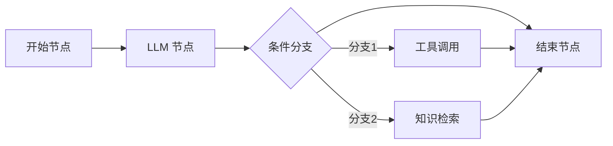

## 1. Agent 框架概述

Agent 框架是构建 AI Agent 应用的开发工具包，提供模型接入、工具集成、记忆管理、流程编排等核心能力，让开发者无需从零实现 Agent 基础设施。

### 1.1 框架核心能力

| 能力         | 描述                    | 重要性 |
| :----------- | :---------------------- | :----- |
| **模型抽象** | 统一不同 LLM 的调用接口 | 关键   |
| **工具集成** | 定义和调用外部工具/API  | 关键   |
| **流程编排** | 控制 Agent 的执行流程   | 关键   |
| **记忆管理** | 短期/长期记忆存储       | 重要   |
| **RAG 支持** | 检索增强生成            | 重要   |
| **可观测性** | 追踪和调试 Agent 行为   | 重要   |

## 2. LangChain / LangGraph

### 2.1 LangChain 简介

LangChain 是最流行的 LLM 应用开发框架，提供模块化的组件和丰富的集成：

```python
# LangChain 基础使用
from langchain_openai import ChatOpenAI
from langchain_core.prompts import ChatPromptTemplate
from langchain_core.output_parsers import StrOutputParser

# 创建 LLM
llm = ChatOpenAI(model="gpt-4o", temperature=0)

# 创建链（LCEL 语法）
prompt = ChatPromptTemplate.from_messages([
    ("system", "你是一个{role}。"),
    ("human", "{input}")
])

chain = prompt | llm | StrOutputParser()

# 执行
result = chain.invoke({"role": "Python 专家", "input": "解释装饰器"})
print(result)
```

### 2.2 LangChain Agent

```python
from langchain_openai import ChatOpenAI
from langchain.agents import create_tool_calling_agent, AgentExecutor
from langchain_core.prompts import ChatPromptTemplate
from langchain.tools import tool

# 定义工具
@tool
def search_web(query: str) -> str:
    """搜索互联网获取信息"""
    # 实际实现调用搜索 API
    return f"搜索结果: {query} 的相关信息..."

@tool
def calculate(expression: str) -> str:
    """计算数学表达式"""
    try:
        return str(eval(expression))
    except Exception as e:
        return f"计算错误: {e}"

# 创建 Agent
tools = [search_web, calculate]
llm = ChatOpenAI(model="gpt-4o")

prompt = ChatPromptTemplate.from_messages([
    ("system", "你是一个智能助手，可以使用工具来帮助用户。"),
    ("human", "{input}"),
    ("placeholder", "{agent_scratchpad}"),
])

agent = create_tool_calling_agent(llm, tools, prompt)
agent_executor = AgentExecutor(agent=agent, tools=tools, verbose=True)

# 执行
result = agent_executor.invoke({"input": "2024年世界杯冠军是谁？他们的主场进球数是多少？"})
```

### 2.3 LangGraph

LangGraph 是 LangChain 团队推出的**状态图框架**，适合构建复杂的多步骤 Agent：

```python
from langgraph.graph import StateGraph, END
from typing import TypedDict, Annotated
import operator

# 定义状态
class AgentState(TypedDict):
    messages: Annotated[list, operator.add]
    current_step: str
    retry_count: int

# 定义节点
def research_node(state: AgentState) -> AgentState:
    """研究节点：搜索和收集信息"""
    # 执行搜索逻辑
    return {
        "messages": ["已完成信息收集"],
        "current_step": "research_done"
    }

def analyze_node(state: AgentState) -> AgentState:
    """分析节点：分析收集到的信息"""
    return {
        "messages": ["已完成信息分析"],
        "current_step": "analyze_done"
    }

def generate_node(state: AgentState) -> AgentState:
    """生成节点：生成最终回答"""
    return {
        "messages": ["已生成最终回答"],
        "current_step": "generate_done"
    }

# 条件路由
def should_retry(state: AgentState) -> str:
    if state["retry_count"] > 3:
        return "generate"
    if state["current_step"] == "analyze_done":
        return "generate"
    return "research"

# 构建图
graph = StateGraph(AgentState)
graph.add_node("research", research_node)
graph.add_node("analyze", analyze_node)
graph.add_node("generate", generate_node)

graph.add_edge("research", "analyze")
graph.add_conditional_edges("analyze", should_retry)
graph.add_edge("generate", END)

graph.set_entry_point("research")
app = graph.compile()

# 执行
result = app.invoke({
    "messages": [],
    "current_step": "start",
    "retry_count": 0
})
```

## 3. CrewAI

### 3.1 CrewAI 简介

CrewAI 是一个**角色驱动的多 Agent 框架**，通过定义 Agent 角色和任务来组织协作：

```python
from crewai import Agent, Task, Crew, Process
from crewai_tools import SerperDevTool, ScrapeWebsiteTool

# 定义工具
search_tool = SerperDevTool()
scrape_tool = ScrapeWebsiteTool()

# 定义 Agent（角色）
researcher = Agent(
    role='高级研究分析师',
    goal='发现并分析AI领域的最新趋势和技术突破',
    backstory="""你是一位经验丰富的技术研究员，
    擅长从海量信息中提取关键洞察。你的分析总是深入且准确。""",
    tools=[search_tool, scrape_tool],
    verbose=True,
    allow_delegation=False
)

writer = Agent(
    role='技术内容作家',
    goal='将复杂的技术概念转化为清晰易懂的文章',
    backstory="""你是一位获奖的科技作家，
    擅长将技术内容写得既专业又有趣。""",
    verbose=True,
    allow_delegation=True
)

# 定义任务
research_task = Task(
    description="""研究2024年AI Agent领域的最新进展，
    重点关注：1) 新的架构模式 2) 主要框架更新 3) 行业应用案例""",
    expected_output='一份详细的研究报告，包含关键发现和数据支撑',
    agent=researcher
)

write_task = Task(
    description="""基于研究报告，撰写一篇关于AI Agent最新进展的技术文章，
    要求：1) 结构清晰 2) 包含代码示例 3) 面向开发者读者""",
    expected_output='一篇3000字的技术文章，Markdown格式',
    agent=writer
)

# 组建 Crew
crew = Crew(
    agents=[researcher, writer],
    tasks=[research_task, write_task],
    process=Process.sequential  # 顺序执行
)

# 执行
result = crew.kickoff()
print(result)
```

### 3.2 CrewAI 流程模式

| 模式                   | 描述           | 适用场景               |
| :--------------------- | :------------- | :--------------------- |
| `Process.sequential`   | 任务按顺序执行 | 有明确依赖关系的流水线 |
| `Process.hierarchical` | 管理者分配任务 | 复杂项目需要协调       |
| 自定义流程             | 通过回调控制   | 需要特殊逻辑的场景     |

## 4. AutoGen

### 4.1 AutoGen 简介

AutoGen 是微软推出的多 Agent 对话框架，支持 Agent 间的**群聊和协作**：

```python
import autogen

# 配置 LLM
config_list = [
    {"model": "gpt-4o", "api_key": "your-api-key"}
]

llm_config = {
    "config_list": config_list,
    "temperature": 0
}

# 创建 Agent
assistant = autogen.AssistantAgent(
    name="Assistant",
    llm_config=llm_config,
    system_message="你是一个有帮助的AI助手。"
)

user_proxy = autogen.UserProxyAgent(
    name="User",
    human_input_mode="TERMINATE",
    max_consecutive_auto_reply=3,
    code_execution_config={
        "work_dir": "coding",
        "use_docker": False
    }
)

# 发起对话
user_proxy.initiate_chat(
    assistant,
    message="请帮我写一个Python脚本，分析CSV文件中的数据并生成可视化图表。"
)
```

### 4.2 AutoGen 群聊

```python
# 创建多个专业 Agent
planner = autogen.AssistantAgent(
    name="Planner",
    system_message="你是一个项目规划师，负责制定开发计划。",
    llm_config=llm_config
)

coder = autogen.AssistantAgent(
    name="Coder",
    system_message="你是一个Python开发者，负责编写代码。",
    llm_config=llm_config
)

reviewer = autogen.AssistantAgent(
    name="Reviewer",
    system_message="你是一个代码审查专家，负责检查代码质量。",
    llm_config=llm_config
)

# 群聊
groupchat = autogen.GroupChat(
    agents=[user_proxy, planner, coder, reviewer],
    messages=[],
    max_round=12
)

manager = autogen.GroupChatManager(
    groupchat=groupchat,
    llm_config=llm_config
)

user_proxy.initiate_chat(
    manager,
    message="开发一个命令行待办事项应用"
)
```

## 5. Dify

### 5.1 Dify 简介

Dify 是一个**开源的 LLM 应用开发平台**，提供可视化的 Agent 编排界面：

**核心特性**：

- 可视化工作流编排
- 内置 RAG 引擎
- 丰富的工具插件
- 多模型支持
- API 一键发布

### 5.2 Dify 工作流模式



### 5.3 Dify API 调用

```python
import requests

# Dify API 调用示例
API_BASE = "https://api.dify.ai/v1"
API_KEY = "your-api-key"

response = requests.post(
    f"{API_BASE}/chat-messages",
    headers={
        "Authorization": f"Bearer {API_KEY}",
        "Content-Type": "application/json"
    },
    json={
        "inputs": {},
        "query": "帮我分析这段代码的性能问题",
        "response_mode": "streaming",
        "conversation_id": "",
        "user": "user-123"
    }
)

for line in response.iter_lines():
    if line:
        print(line.decode('utf-8'))
```

## 6. Semantic Kernel

### 6.1 简介

Semantic Kernel 是微软推出的 SDK，支持 C#、Python 和 Java：

```python
from semantic_kernel import Kernel
from semantic_kernel.connectors.ai.open_ai import OpenAIChatCompletion
from semantic_kernel.core_plugins import TimePlugin

# 创建内核
kernel = Kernel()

# 添加 AI 服务
kernel.add_service(OpenAIChatCompletion(
    service_id="gpt-4o",
    ai_model_id="gpt-4o"
))

# 添加插件
kernel.add_plugin(TimePlugin(), "time")

# 创建函数
from semantic_kernel.functions import kernel_function

@kernel_function(description="计算两个数的和")
def add(a: int, b: int) -> int:
    return a + b

kernel.add_function(plugin_name="math", function=add)

# 调用
result = await kernel.invoke_prompt(
    "现在几点了？计算 3+5 的结果。"
)
```

## 7. 框架对比与选型

### 7.1 功能对比

| 特性           | LangChain | LangGraph | CrewAI | AutoGen | Dify | Semantic Kernel |
| :------------- | :-------- | :-------- | :----- | :------ | :--- | :-------------- |
| **单 Agent**   | 支持      | 支持      | 支持   | 支持    | 支持 | 支持            |
| **多 Agent**   | 有限      | 支持      | 支持   | 支持    | 有限 | 有限            |
| **可视化编排** | 不支持    | 不支持    | 不支持 | 不支持  | 支持 | 不支持          |
| **状态管理**   | 有限      | 完善      | 有限   | 有限    | 完善 | 有限            |
| **RAG 内置**   | 支持      | 支持      | 有限   | 有限    | 支持 | 有限            |
| **工具生态**   | 丰富      | 丰富      | 中等   | 中等    | 丰富 | 中等            |
| **学习曲线**   | 中等      | 较高      | 低     | 中等    | 低   | 中等            |
| **语言支持**   | Python/JS | Python/JS | Python | Python  | API  | C#/Python/Java  |

### 7.2 选型建议

| 场景              | 推荐框架               | 理由              |
| :---------------- | :--------------------- | :---------------- |
| **快速原型**      | CrewAI / Dify          | 上手快、配置少    |
| **复杂工作流**    | LangGraph              | 状态图、灵活控制  |
| **多 Agent 协作** | CrewAI / AutoGen       | 原生多 Agent 支持 |
| **企业应用**      | Dify / Semantic Kernel | 可视化、合规性    |
| **研究实验**      | LangChain + LangGraph  | 灵活、可定制      |
| **.NET 生态**     | Semantic Kernel        | 原生 C# 支持      |

## 8. 自定义 Agent 框架设计

### 8.1 最小 Agent 框架

```python
from abc import ABC, abstractmethod
from typing import Any, Callable
import json

class Tool:
    """工具基类"""
    def __init__(self, name: str, description: str, func: Callable):
        self.name = name
        self.description = description
        self.func = func

    def run(self, **kwargs) -> Any:
        return self.func(**kwargs)

    def to_schema(self) -> dict:
        return {
            "type": "function",
            "function": {
                "name": self.name,
                "description": self.description,
                "parameters": {
                    "type": "object",
                    "properties": {
                        k: {"type": "string", "description": v}
                        for k, v in self.func.__annotations__.items()
                        if k != "return"
                    }
                }
            }
        }

class Agent:
    """简易 Agent 框架"""
    def __init__(self, llm, tools: list[Tool], system_prompt: str = ""):
        self.llm = llm
        self.tools = {t.name: t for t in tools}
        self.system_prompt = system_prompt
        self.history = []

    def run(self, user_input: str, max_steps: int = 5) -> str:
        self.history.append({"role": "user", "content": user_input})

        for _ in range(max_steps):
            # 调用 LLM
            response = self.llm.chat(
                messages=self.history,
                tools=[t.to_schema() for t in self.tools.values()]
            )

            # 如果没有工具调用，返回结果
            if not response.tool_calls:
                self.history.append({"role": "assistant", "content": response.content})
                return response.content

            # 处理工具调用
            self.history.append(response.to_dict())
            for tool_call in response.tool_calls:
                tool = self.tools[tool_call.function.name]
                result = tool.run(**json.loads(tool_call.function.arguments))
                self.history.append({
                    "role": "tool",
                    "tool_call_id": tool_call.id,
                    "content": str(result)
                })

        return "达到最大步骤数限制"
```

## 9. 小结

选择 Agent 框架时需考虑：

1. **任务复杂度**：简单任务用 CrewAI/Dify，复杂流程用 LangGraph
2. **团队技术栈**：Python 选 LangChain/CrewAI，C# 选 Semantic Kernel
3. **部署需求**：需要可视化选 Dify，纯代码选 LangGraph
4. **多 Agent 需求**：CrewAI 和 AutoGen 是首选
5. **长期维护**：LangChain 生态最完善，社区支持最好

框架只是工具，理解 Agent 的核心原理比掌握框架 API 更重要。建议先用简单框架入门，再根据需求迁移到更强大的方案。
