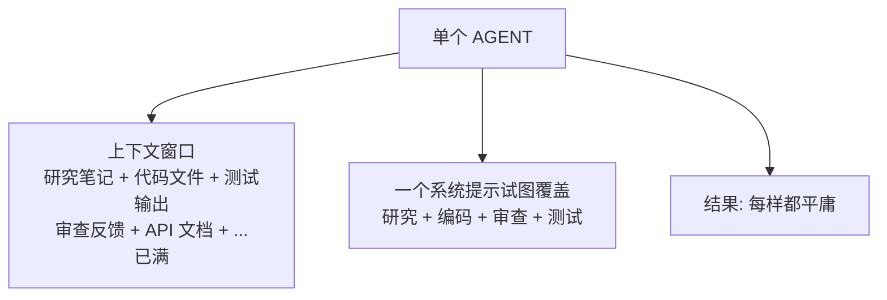
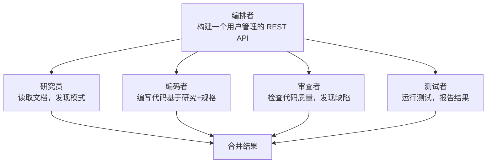
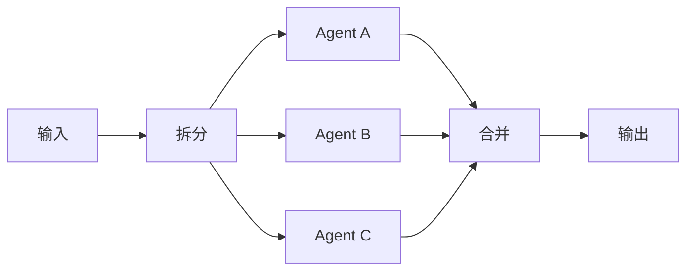
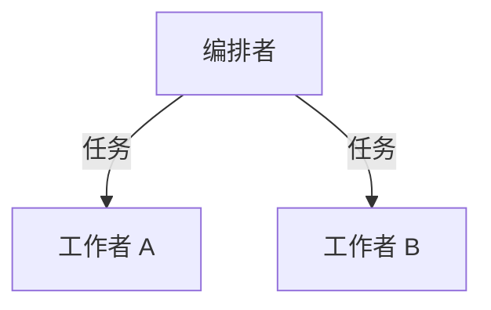
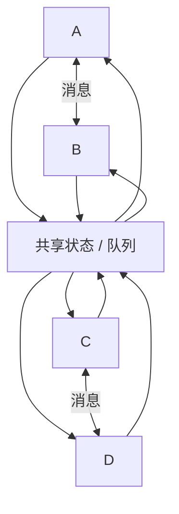

# 为何多Agent?

> 一个 Agent 遇到瓶颈时，明智之举不是更大的 Agent，而是更多的 Agent。

**类型：** 学习
**语言：** TypeScript
**前置条件：** Phase 14 (Agent 工程)
**时间：** ~60 分钟

## 学习目标

- 识别单 Agent 天花板（上下文溢出、混合专业能力、串行瓶颈），并解释何时拆分为多个 Agent 是正确的选择
- 比较编排模式（流水线、并行扇出、监督者、层级），并为给定的任务结构选择合适的模式
- 设计一个具有清晰角色边界、共享状态和通信契约的多 Agent 系统
- 分析多 Agent 复杂性（延迟、成本、调试难度）与单 Agent 简洁性之间的权衡

## 问题

你在 Phase 14 中构建了一个单 Agent。它能工作。它能读取文件、运行命令、调用 API、推理结果。然后你把它指向一个真实的代码库：200 个文件、三种语言、依赖基础设施的测试，以及需要先研究外部 API 再写代码的需求。

Agent 崩溃了。不是因为 LLM 不聪明，而是因为任务超出了一个 Agent 循环能处理的范围。上下文窗口被文件内容填满。Agent 忘记了 40 次工具调用之前读过的内容。它试图同时做研究员、程序员和审查员，结果三样都做不好。

这就是单 Agent 天花板。每当任务需要以下条件时你就会碰到它：

- **超出单个窗口的上下文量** — 读取 50 个文件就会超过 200k token
- **不同阶段需要不同专业能力** — 研究需要的提示与代码生成不同
- **可以并行执行的工作** — 为什么顺序读三个文件而不是同时读？

## 概念

### 单 Agent 天花板

单个 Agent 就是一个循环、一个上下文窗口、一个系统提示。想象一下：



三件事会出问题：

1. **上下文饱和** — 工具结果不断堆积。到第 30 轮时，Agent 已经消耗了 150k token 的文件内容、命令输出和先前的推理。第 5 轮的关键细节丢失了。

2. **角色混乱** — 一个说"你是研究员、程序员、审查员和测试员"的系统提示，会产生一个半研究、半编码、永远完不成审查的 Agent。

3. **串行瓶颈** — Agent 读文件 A，然后文件 B，然后文件 C。三次串行 LLM 调用。三次串行工具执行。没有并行。

### 多 Agent 解决方案

拆分工作。给每个 Agent 一个任务、一个上下文窗口、一个针对该任务调优的系统提示：



每个 Agent 拥有：

- 一个专注的系统提示（"你是代码审查员。你唯一的任务是发现缺陷。"）
- 自己的上下文窗口（不被其他 Agent 的工作污染）
- 清晰的输入/输出契约（接收研究笔记，输出代码）

### 真实系统示例

**Claude Code 子 Agent** — 当 Claude Code 用 `Task` 生成子 Agent 时，它创建一个带有范围化任务的子 Agent。父 Agent 保持上下文清洁。子 Agent 做专注的工作并返回摘要。

**Devin** — 运行一个规划 Agent、一个编码 Agent 和一个浏览器 Agent。规划者将工作分解为步骤。编码者写代码。浏览器研究文档。每个都有独立的上下文。

**多 Agent 编码团队 (SWE-bench)** — SWE-bench 上表现最好的系统使用一个研究员读取代码库、一个规划者设计修复、一个编码者实现。单 Agent 系统得分更低。

**ChatGPT Deep Research** — 并行生成多个搜索 Agent，每个探索不同角度，然后综合结果。

### 光谱

多 Agent 不是二元的。它是一个光谱：

简单 ──────────────────────────────────────────── 复杂

**单 Agent** — 1 个循环，1 个上下文。适合简单任务。

**子 Agent** — 父 Agent 为聚焦的子任务生成子 Agent。父 Agent 维护计划，子 Agent 汇报。这就是 Claude Code 的做法。

**流水线** — Agent 按顺序运行。Agent A 的输出成为 Agent B 的输入。适合分阶段工作流：研究 -> 编码 -> 审查 -> 测试。阶段式，显式角色。

**团队** — Agent 通过共享消息总线并行运行。每个有角色。编排者协调。适合同时需要不同技能的场景。

**群体** — 许多相同或近似相同的 Agent 共享状态。没有固定的编排者。Agent 从队列中获取工作。适合高吞吐量并行任务。N 个对等体，涌现行为。

### 四种多 Agent 模式

#### 模式 1：流水线

```
输入 ──▶ Agent A ──▶ Agent B ──▶ Agent C ──▶ 输出
          (研究)      (编码)      (审查)
```

每个 Agent 转换数据并向前传递。推理简单。一个阶段的失败会阻塞其余阶段。

#### 模式 2：扇出 / 扇入



将工作分配给并行 Agent，然后合并结果。适合可分解为独立子任务的工作。

#### 模式 3：编排者-工作者



一个智能编排者决定做什么、委派给工作者、综合结果。编排者本身也是一个 Agent，拥有生成工作者的工具。

#### 模式 4：对等群体



没有中央编排者。Agent 点对点通信。决策从交互中涌现。更难调试，但可以扩展到许多 Agent。

### 何时不使用多 Agent

多 Agent 增加了复杂性。Agent 之间的每条消息都是一个潜在的故障点。调试从"读一个对话"变成了"追踪五个 Agent 间的消息"。

**保持单 Agent 的场景：**

- 任务适合一个上下文窗口（工作数据不超过 ~100k token）
- 不同阶段不需要不同的系统提示
- 串行执行已经够快
- 任务足够简单，拆分带来的开销超过价值

**复杂性成本：**

- 每个 Agent 边界都是一个有损压缩步骤：Agent A 的完整上下文被摘要为给 Agent B 的消息
- 协调逻辑（谁做什么、何时做、按什么顺序）本身就是一个 bug 来源
- 延迟增加：N 个 Agent 意味着至少 N 次串行 LLM 调用，如果需要来回通信则更多
- 成本倍增：每个 Agent 独立消耗 token

经验法则：如果一个任务少于 20 次工具调用且适合 100k token，保持单 Agent。

## 构建它

### 步骤 1：过载的单 Agent

下面是一个试图做所有事情的单 Agent。它有一个庞大的系统提示和一个容纳研究、代码和审查的上下文窗口：

```typescript
type AgentResult = {
  content: string;
  tokensUsed: number;
  toolCalls: number;
};

async function singleAgentApproach(task: string): Promise<AgentResult> {
  const systemPrompt = `You are a full-stack developer. You must:
1. Research the requirements
2. Write the code
3. Review the code for bugs
4. Write tests
Do ALL of these in a single conversation.`;

  const contextWindow: string[] = [];
  let totalTokens = 0;
  let totalToolCalls = 0;

  const research = await fakeLLMCall(systemPrompt, `Research: ${task}`);
  contextWindow.push(research.output);
  totalTokens += research.tokens;
  totalToolCalls += research.calls;

  const code = await fakeLLMCall(
    systemPrompt,
    `Given this research:\n${contextWindow.join('\n')}\n\nNow write code for: ${task}`
  );
  contextWindow.push(code.output);
  totalTokens += code.tokens;
  totalToolCalls += code.calls;

  const review = await fakeLLMCall(
    systemPrompt,
    `Given all previous context:\n${contextWindow.join('\n')}\n\nReview the code.`
  );
  contextWindow.push(review.output);
  totalTokens += review.tokens;
  totalToolCalls += review.calls;

  return {
    content: contextWindow.join('\n---\n'),
    tokensUsed: totalTokens,
    toolCalls: totalToolCalls,
  };
}
```

这种方法的问题：

- 上下文窗口随每个阶段增长。到审查步骤时，它包含研究笔记和代码和先前的推理。
- 系统提示是通用的。无法为每个阶段调优。
- 没有任何并行执行。

### 步骤 2：专家 Agent

现在拆分它。每个 Agent 一个任务：

```typescript
type SpecialistAgent = {
  name: string;
  systemPrompt: string;
  run: (input: string) => Promise<AgentResult>;
};

function createSpecialist(name: string, systemPrompt: string): SpecialistAgent {
  return {
    name,
    systemPrompt,
    run: async (input: string) => {
      const result = await fakeLLMCall(systemPrompt, input);
      return {
        content: result.output,
        tokensUsed: result.tokens,
        toolCalls: result.calls,
      };
    },
  };
}

const researcher = createSpecialist(
  'researcher',
  'You are a technical researcher. Read documentation, find patterns, and summarize findings. Output only the facts needed for implementation.'
);

const coder = createSpecialist(
  'coder',
  'You are a senior TypeScript developer. Given requirements and research notes, write clean, tested code. Nothing else.'
);

const reviewer = createSpecialist(
  'reviewer',
  'You are a code reviewer. Find bugs, security issues, and logic errors. Be specific. Cite line numbers.'
);
```

每个专家有专注的提示。每个获得干净的上下文窗口，只包含它需要的输入。

### 步骤 3：通过消息协调

用显式消息传递将专家连接起来：

```typescript
type AgentMessage = {
  from: string;
  to: string;
  content: string;
  timestamp: number;
};

async function multiAgentApproach(task: string): Promise<AgentResult> {
  const messages: AgentMessage[] = [];
  let totalTokens = 0;
  let totalToolCalls = 0;

  const researchResult = await researcher.run(task);
  messages.push({
    from: 'researcher',
    to: 'coder',
    content: researchResult.content,
    timestamp: Date.now(),
  });
  totalTokens += researchResult.tokensUsed;
  totalToolCalls += researchResult.toolCalls;

  const coderInput = messages
    .filter((m) => m.to === 'coder')
    .map((m) => `[From ${m.from}]: ${m.content}`)
    .join('\n');

  const codeResult = await coder.run(coderInput);
  messages.push({
    from: 'coder',
    to: 'reviewer',
    content: codeResult.content,
    timestamp: Date.now(),
  });
  totalTokens += codeResult.tokensUsed;
  totalToolCalls += codeResult.toolCalls;

  const reviewerInput = messages
    .filter((m) => m.to === 'reviewer')
    .map((m) => `[From ${m.from}]: ${m.content}`)
    .join('\n');

  const reviewResult = await reviewer.run(reviewerInput);
  messages.push({
    from: 'reviewer',
    to: 'orchestrator',
    content: reviewResult.content,
    timestamp: Date.now(),
  });
  totalTokens += reviewResult.tokensUsed;
  totalToolCalls += reviewResult.toolCalls;

  return {
    content: messages.map((m) => `[${m.from} -> ${m.to}]: ${m.content}`).join('\n\n'),
    tokensUsed: totalTokens,
    toolCalls: totalToolCalls,
  };
}
```

每个 Agent 只接收发给它的消息。没有上下文污染。研究员 50k token 的文档阅读永远不会进入审查员的上下文。

### 步骤 4：比较

```typescript
async function compare() {
  const task = 'Build a rate limiter middleware for an Express.js API';

  console.log('=== 单 Agent ===');
  const single = await singleAgentApproach(task);
  console.log(`Tokens: ${single.tokensUsed}`);
  console.log(`Tool calls: ${single.toolCalls}`);

  console.log('\n=== 多 Agent ===');
  const multi = await multiAgentApproach(task);
  console.log(`Tokens: ${multi.tokensUsed}`);
  console.log(`Tool calls: ${multi.toolCalls}`);
}
```

多 Agent 版本使用更多总 token（三个 Agent，三次独立的 LLM 调用），但每个 Agent 的上下文保持清洁。每个阶段的质量提升，因为系统提示是专业化的。

## 使用它

本课程产生一个可复用的提示，用于决定何时使用多 Agent。参见 `outputs/prompt-multi-agent-decision.md`。

## 练习

1. 添加第四个专家：一个"测试员"Agent，接收编码者的代码和审查员的反馈，然后编写测试
2. 修改流水线，使审查员可以将反馈发回编码者进行修订循环（最多 2 轮）
3. 将串行流水线转换为扇出：并行运行研究员和"需求分析师"Agent，然后合并它们的输出再传给编码者

## 关键术语

| 术语                          | 人们怎么说             | 实际含义                                                                          |
| ----------------------------- | ---------------------- | --------------------------------------------------------------------------------- |
| Swarm（群体）                 | "AI Agent 的蜂群思维"  | 一组具有共享状态且无固定领导者的对等 Agent。行为从局部交互中涌现。                |
| Orchestrator（编排者）        | "老板 Agent"           | 一个工具包括生成和管理其他 Agent 的 Agent。它规划和委派，但可能不做实际工作。     |
| Coordinator（协调者）         | "交通警察"             | 一个非 Agent 组件（通常只是代码，不是 LLM），根据规则在 Agent 之间路由消息。      |
| Consensus（共识）             | "Agent 们达成一致"     | 多个 Agent 必须在继续之前达成协议的协议。用于解决冲突输出。                       |
| Emergent behavior（涌现行为） | "Agent 们自己搞明白了" | 从 Agent 交互中产生的系统级模式，但不是显式编程的。可能有用也可能有害。           |
| Fan-out / fan-in（扇出/扇入） | "Agent 的 Map-Reduce"  | 将任务分配给并行 Agent（扇出），然后合并它们的结果（扇入）。                      |
| Message passing（消息传递）   | "Agent 之间互相说话"   | Agent 之间的通信机制：从一个 Agent 发送到另一个的结构化数据，替代共享上下文窗口。 |

## 延伸阅读

- [The Landscape of Emerging AI Agent Architectures](https://arxiv.org/abs/2409.02977) - 多 Agent 模式综述
- [AutoGen: Enabling Next-Gen LLM Applications](https://arxiv.org/abs/2308.08155) - 微软的多 Agent 对话框架
- [Claude Code subagents documentation](https://docs.anthropic.com/en/docs/claude-code) - Claude Code 如何用 Task 委派
- [CrewAI documentation](https://docs.crewai.com/) - 基于角色的多 Agent 框架
