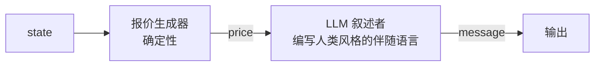

# 协商与讨价还价

> Agent 协商资源、价格、任务分配和条款。2026 年基准集很明确：NegotiationArena (arXiv:2402.05863) 显示 LLM 可以通过人格操纵（"绝望"）改善收益约 20%；"Measuring Bargaining Abilities" (arXiv:2402.15813) 显示买方比卖方更难且规模无帮助——他们的 **OG-Narrator**（确定性报价生成器 + LLM 叙述者）将成交率从 26.67% 推到 88.88%；大规模自主协商竞赛 (arXiv:2503.06416) 运行了约 180k 次协商，发现**隐藏思维链**的 Agent 通过向对手隐藏推理而获胜；Bhattacharya 等人 2025 在哈佛协商项目指标上排名 Llama-3 最有效、Claude-3 最激进、GPT-4 最公平。本课程实现合同网协议（FIPA 祖先, Lesson 02）、连接 LLM 风格的买方/卖方、运行 OG-Narrator 风格的分解，并测量每种结构选择如何改变成交率。

**类型：** 学习 + 构建
**语言：** Python (stdlib)
**前置条件：** Phase 16 · 02 (FIPA-ACL遗产), Phase 16 · 09 (并行群体网络)
**时间：** ~75 分钟

## 问题

两个 Agent 需要就价格达成一致。让它们自己用纯语言提示，2024-2026 年的 LLM 以惊人低的比率成交（arXiv:2402.15813 中约 27% 在紧密参数化的讨价还价中）。规模不能修复它：GPT-4 在结构上不比 GPT-3.5 更擅长讨价还价；它更擅长讨价还价的*语言*。

根本问题是 LLM 混淆了两个工作——决定报价和叙述报价。OG-Narrator 分离了这些：确定性报价生成器计算数值移动；LLM 只叙述。成交率跳到约 89%。

这反映了经典多 Agent 发现：将机制与通信层解耦获胜。合同网协议 (FIPA, 1996; Smith, 1980) 是参考任务市场机制。将 LLM 插入叙述槽位，你就得到一个现代 LLM 驱动的任务市场。

## 概念

### 合同网，一段话概括

Smith 1980 年的合同网协议：**管理者**广播**征求提案 (cfp)**；**竞标者**用包含其报价的**提议**消息响应；管理者选择获胜者并向获胜者发送**接受提议**，向失败者发送**拒绝提议**。获胜者执行工作。可选消息：**拒绝**（竞标者拒绝提议）。FIPA 将此编码为 `fipa-contract-net` 交互协议。

### 为什么 OG-Narrator 胜出

"Measuring Bargaining Abilities of Language Models" (arXiv:2402.15813) 观察到：

- LLM 经常违反讨价还价规则（以荒谬价格报价、忽略对方的 ZOPA）。
- 它们锚定不佳（接受糟糕的首报价；以象征性而非战略性的金额还价）。
- 仅规模不能修复这些。更大的模型产生更合理的语言但有相似的策略错误。

OG-Narrator 分解：



报价生成器是经典协商策略：Rubinstein 讨价还价模型、Zeuthen 策略或简单的以牙还牙。LLM 叙述。消息包含确定性价格和自然语言框架。

成交率跳跃因为：

- 价格保持在讨价还价区域内。
- 锚点是战略性的，不是情绪性的。
- LLM 做它擅长的事：写作。

### NegotiationArena 发现

arXiv:2402.05863 提供了规范基准。头条发现：

- LLM 可以通过采用人格（"我急于在本周五前卖掉这个"）改善收益约 20%——人格操纵是真正的策略。
- 公平/合作的 Agent 被对抗性 Agent 利用；防御需要显式反姿态。
- 对称配对在约 40% 的基准场景上收敛到不公平结果。

这不是"LLM 是糟糕的谈判者。"这是"LLM 太像人类地谈判，包括可利用的部分。"

### 思维链隐藏

大规模自主协商竞赛 (arXiv:2503.06416) 跨多种 LLM 策略运行了约 180k 次协商。获胜者向对手隐藏了推理：

- 如果 Agent 在公开可见的草稿本上打印"我只会出到 $75；我的保留价是 $70"，对手就读到了。
- 获胜者私下计算策略；输出通道只包含报价和最低要求的叙述。

这是经典博弈论 (Aumann 1976 关于理性和信息) 的 2026 年回响：揭示你的私人估值会损失收益。LLM 不会直觉这一点，并愉快地在推理追踪中输入它们的保留价，这些追踪对对手变得可见。

工程要点：分离私人草稿本上下文和公开消息上下文。不是可选的。

### Bhattacharya 等人 2025 — 模型排名

在哈佛协商项目指标（原则性协商、BATNA 尊重、利益互惠）上：

- **Llama-3** 在达成交易方面最有效（成交率 + 收益）。
- **Claude-3** 是最激进的谈判者（高锚点、晚让步）。
- **GPT-4** 是最公平的（跨配对的收益方差最小）。

这是 2025 年的快照。重点不是哪个模型在 2026 年 4 月获胜——而是不同基础模型有持久的协商风格。异构集成 (Lesson 15) 将此作为多样性来源。

### 通过合同网 + LLM 进行任务分配

合同网对 LLM 多 Agent 的现代重用：

1. 管理 Agent 将任务分解为单元。
2. 向工作者 Agent 广播带任务描述的 `cfp`。
3. 每个工作者返回报价：`(price, eta, confidence)`，其中 price 可以是 token、计算单元或美元。
4. 管理者选择获胜者（单个或多个，取决于任务）并授予。
5. 被拒绝的工作者可以竞标其他任务。

这可以很好地扩展到 100+ 工作者，因为协调是广播-响应，不是同步聊天。用于生产：Microsoft Agent Framework 的编排模式、一些 LangGraph 实现。

### 叙述 vs 机制规则

跨所有 2024-2026 协商基准，一致的工程规则是：

> 让 LLM 叙述。不要让 LLM 计算报价。

如果报价需要是数字（价格、ETA、数量），从协商状态确定性生成，让 LLM 产生框架。如果报价需要是提议结构（任务分解、角色分配），让 LLM 起草，但在发送前对照 Schema 和约束检查验证。

## 构建它

`code/main.py` 实现：

- `ContractNetManager`, `ContractNetTask`, `Bid` — 管理者 + 竞标者，广播 cfp，收集提议，授予。
- `og_narrator_bargain(state, rng)` — OG-Narrator 买方：确定性 Zeuthen 风格向中点让步。
- `seller_response(state, rng)` — 确定性卖方还价策略（两种风格的结构基础事实）。
- `naive_llm_bargain(state, rng)` — 模拟全 LLM 讨价还价者：高方差选择价格，经常在 ZOPA 之外。
- 测量：1000 次试验的成交率，每次试验采样新的保留价。

运行：

```
python3 code/main.py
```

预期输出：朴素 LLM 成交率约 65-75%；OG-Narrator 成交率约 85-95%；15-25 个百分点的差距是分解报价生成和叙述的结构优势。加上一个三个竞标者和一个任务的合同网任务市场分配示例。

## 使用它

`outputs/skill-bargainer-designer.md` 设计讨价还价协议：谁生成报价（确定性或 LLM）、谁叙述、私人草稿本如何与公开消息分离、以及如何监控成交率。

## 发布它

生产讨价还价检查清单：

- **分离草稿本。** 私有状态永远不到达对手的上下文。这是不可协商的。
- **确定性报价生成。** 价格、数量、ETA：计算，不要提示。
- **验证所有传入报价**对照 Schema。在协议边界拒绝 ZOPA 外的报价。
- **限制轮次。** 最多 3-5 轮；死锁时升级到调解者。
- **持续测量成交率和收益方差。** 下降的成交率是症状——通常是提示漂移或对手方攻击。
- **记录所有被拒绝的提议**带确定性理由。对于合同网管理者，失败的竞标者需要理解原因。

## 练习

1. 运行 `code/main.py`。确认 OG-Narrator 在成交率上击败朴素 LLM。差距多少？
2. 实现**基于人格的收益改善** (arXiv:2402.05863) — 买方仅在叙述中采用"本周急于购买"的人格，报价生成器不变。成交率或收益变化吗？
3. 实现思维链**隐藏**：维护不传递给对手的私人草稿本字符串。如果你意外泄露它（通过交换通道模拟）会怎样？
4. 将合同网扩展为带保留价的 N 竞标者拍卖。当所有出价超过保留价时，管理者如何在最低价格和最高质量之间决定？你选择哪个授予规则，为什么？
5. 阅读 Bhattacharya 等人 2025 关于哈佛协商项目指标。实现两种不同风格的讨价还价者（激进 vs 公平）。在对称和不对称配对下测量收益方差。

## 关键术语

| 术语                | 人们怎么说            | 实际含义                                                               |
| ------------------- | --------------------- | ---------------------------------------------------------------------- |
| 合同网              | "任务市场"            | Smith 1980, FIPA 1996。cfp + propose + accept/reject。规范的任务市场。 |
| ZOPA                | "可能协议区"          | 买方最大值和卖方最小值之间的重叠。之外的报价无法成交。                 |
| BATNA               | "协商协议的最佳替代"  | 如果这笔交易失败你的退路。设定你的保留价。                             |
| OG-Narrator         | "报价生成器 + 叙述者" | 分解：确定性报价，LLM 叙述。                                           |
| Zeuthen 策略        | "风险最小化让步"      | 基于风险限制让步的经典报价生成器。                                     |
| Rubinstein 讨价还价 | "交替报价均衡"        | 带折现的无限期讨价还价博弈论模型。                                     |
| CoT 隐藏            | "隐藏你的推理"        | arXiv:2503.06416 的获胜者保持私人草稿本；公开通道只显示报价。          |
| 人格操纵            | "情绪姿态"            | arXiv:2402.05863：绝望/紧迫人格约 20% 收益增益。                       |

## 延伸阅读

- [NegotiationArena](https://arxiv.org/abs/2402.05863) — 基准；人格操纵和利用发现
- [Measuring Bargaining Abilities of Language Models](https://arxiv.org/abs/2402.15813) — OG-Narrator 和买方比卖方更难的结果
- [Large-Scale Autonomous Negotiation Competition](https://arxiv.org/abs/2503.06416) — 约 180k 次协商；思维链隐藏获胜
- [LLM-Stakeholders Interactive Negotiation (NeurIPS 2024)](https://proceedings.neurips.cc/paper_files/paper/2024/file/984dd3db213db2d1454a163b65b84d08-Paper-Datasets_and_Benchmarks_Track.pdf) — 带秘密效用的多方可评分游戏
- [Smith 1980 — The Contract Net Protocol](https://ieeexplore.ieee.org/document/1675516) — 经典机制, IEEE Transactions on Computers
