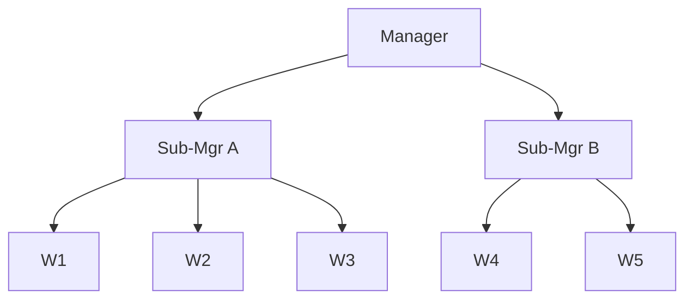

# 层级架构及其失败模式

> 层级是嵌套的监督者。经理Agent管理子经理，子经理管理工作者。CrewAI的`Process.hierarchical`是教科书版本：`manager_llm`动态委托任务并验证输出。LangGraph的等价物是`create_supervisor(create_supervisor(...))`。当任务是真实组织架构图时，这是自然模式。它也是最可能坍缩为管理循环的模式 — 经理Agent分配工作不当、误读子输出或无法达成共识。顺序通常击败它。

**类型：** 学习 + 构建
**语言：** Python（标准库）
**前置条件：** Phase 16 · 05（监督者模式）
**时间：** ~60分钟

## 问题所在

一旦监督者模式理解了，自然的下一步是"如果工作者本身也是监督者呢？"团队有子团队；公司有部门的部门。层级架构镜像这一点。

问题在于：LLM经理与人类经理不同。人类经理对其下属知道什么有稳定的先验。LLM经理每轮从其上下文中的任何内容重新推理组织。该上下文中的微小漂移，整个树就错误分配工作。

## 核心概念

### 形状

每个内部节点规划、委托和综合。只有叶子做工作。

### 闪光点

- **清晰的组织映射。** 如果真实任务是部门化的（"法律审查文档、财务审查文档、工程审查文档，然后为高管总结"），层级是显式的。
- **局部摘要。** 每个子经理在顶层经理看到之前综合其团队的输出。顶层经理看到三个子经理摘要，不是十五个工作者输出。

### 崩溃点

2026年事后分析不断发现的三种失败模式：

1. **任务分配错误。** 经理阅读目标，幻觉一个分解，并委托给错误的子经理。因为子经理忠实地在给定的内容上工作，错误只在顶层综合时浮出 — 距离人类本可以捕获它的地方隔了一层。
2. **输出误读。** 子经理返回"无法验证声明X。"顶层经理总结为"声明X未确认。"含义在每一层漂移。
3. **共识循环。** 两个子经理不同意；顶层经理要求他们协调；他们重新向下委托；工作者重新运行；子经理返回略有不同的答案；循环。CrewAI的`Process.hierarchical`用步数限制防范这一点，但限制本身现在是一个超参数。

### 决定性问题

顺序（线性管道）vs层级：你的任务是否真的有独立子团队，还是假装成树的一个线性流？如果是后者，使用顺序。如果是前者，使用层级但预算显式协调规则。

### CrewAI的实现

`Process.hierarchical`在专业crew上连接一个经理LLM。经理：

- 接收顶层任务，
- 将子任务分配给crew，
- 评估crew输出，
- 决定是接受、重新委托还是迭代。

### LangGraph的实现

LangGraph使用嵌套的`create_supervisor`调用。内部监督者有自己的图；外部监督者将内部图视为不透明节点。这比CrewAI更干净用于调试（你可以分别步进每个图），但更难表达树的动态重塑。

## 实践

`code/main.py`运行3级层级：

- 顶层经理：将任务拆分为"工程"和"法律"分支，
- 工案子经理：拆分为"前端"和"后端"工作者，
- 法律子经理：一个工作者。

演示对比了快乐路径（所有人都同意）vs**扰动路径**，其中顶层经理的分解将"法律"错误标记为"财务"，并观察错误级联 — 子经理忠实地做财务工作，顶层综合器报告财务发现，原始法律问题无人回答。

## 交付

`outputs/skill-hierarchy-fitness.md`评估给定任务是否应使用层级、顺序或扁平监督者。输入：任务描述、组织结构、协调预算。输出：模式推荐以及需要防范的具体失败模式。

## 练习

1. 运行 `code/main.py` 并比较快乐vs扰动路径。需要多少层经理传递，顶层输出才完全偏离用户问题？
2. 添加第三层（顶层 -> 子 -> 子子 -> 工作者）。测量随着深度增长，扰动路径自我纠正vs完全偏离的频率。
3. 在每个子经理处实现一个"金丝雀"工作者，始终被问及原始用户问题不变。使用金丝雀答案检测分解漂移。当金丝雀与综合答案不一致时，经理应如何反应？
4. 阅读CrewAI的`Process.hierarchical`文档。识别CrewAI应用的一个具体护栏（步数限制、manager_llm约束）并描述它针对什么失败模式。
5. 比较嵌套LangGraph监督者与CrewAI层级。哪个使共识循环更便宜地检测？

## 关键术语

| 术语       | 人们怎么说       | 实际含义                                                       |
| ---------- | ---------------- | -------------------------------------------------------------- |
| 层级       | "组织架构图模式" | 监督者之上的监督者；只有叶子做工作。                           |
| 经理LLM    | "老板"           | 在内部节点分解、分配和验证的LLM。                              |
| 分解漂移   | "老板丢了主线"   | 顶层经理的拆分不再覆盖原始问题。                               |
| 共识循环   | "无休止的会议"   | 子经理不同意；顶层重新委托；工作者重新运行；循环直到预算耗尽。 |
| 深度2上限  | "不要超过2层"    | 经验护栏：3+层坍缩可观测性。                                   |
| 金丝雀问题 | "每层的基准真相" | 始终被问及原始查询不变的工作者，用于检测漂移。                 |
| 来源链     | "谁说了什么"     | 从每个综合追溯到产生它的叶子输出的追踪。                       |

## 延伸阅读

- [CrewAI introduction — Process.hierarchical](https://docs.crewai.com/en/introduction) — 带经理LLM的教科书层级
- [LangGraph supervisor reference](https://reference.langchain.com/python/langgraph-supervisor) — 通过`create_supervisor`的嵌套监督者
- [Anthropic engineering — Research system](https://www.anthropic.com/engineering/multi-agent-research-system) — 为什么Anthropic故意选择扁平监督者而非层级
- [Cemri et al. — Why Do Multi-Agent LLM Systems Fail?](https://arxiv.org/abs/2503.13657) — MAST分类法；关于协调失败的部分记录了分解漂移
