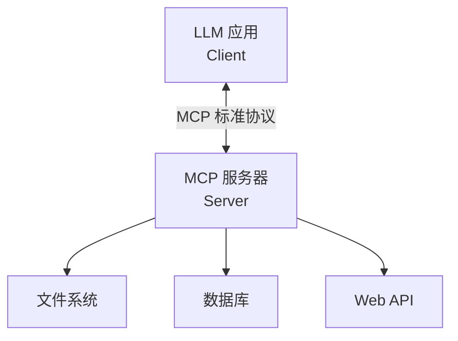

## 1. Function Calling 原理

Function Calling 是 LLM 与外部世界交互的核心机制，使 Agent 能够调用工具完成 LLM 自身无法完成的任务。

### 1.1 工作流程

```
用户请求 → LLM 判断是否需要工具 → 生成工具调用参数
    → 执行工具 → 返回结果 → LLM 生成最终回答
```

### 1.2 核心概念

| 概念                | 描述                       |
| :------------------ | :------------------------- |
| **Tool Definition** | 描述工具的名称、参数和功能 |
| **Tool Call**       | LLM 输出的工具调用请求     |
| **Tool Result**     | 工具执行后返回的结果       |
| **Parallel Calls**  | LLM 可同时调用多个工具     |

### 1.3 Function Calling vs Prompt-based 工具调用

| 方式                 | 原理          | 优点         | 缺点               |
| :------------------- | :------------ | :----------- | :----------------- |
| **Function Calling** | 模型原生支持  | 可靠、结构化 | 模型需支持         |
| **Prompt-based**     | 提示词解析    | 通用性强     | 不可靠、格式不稳定 |
| **ReAct**            | 思考-行动循环 | 可解释       | Token 消耗大       |

## 2. 工具定义

### 2.1 OpenAI Tools API

```python
from openai import OpenAI
import json

client = OpenAI()

# 定义工具
tools = [
    {
        "type": "function",
        "function": {
            "name": "get_weather",
            "description": "获取指定城市的当前天气信息",
            "parameters": {
                "type": "object",
                "properties": {
                    "city": {
                        "type": "string",
                        "description": "城市名称，如'北京'、'上海'"
                    },
                    "unit": {
                        "type": "string",
                        "enum": ["celsius", "fahrenheit"],
                        "description": "温度单位"
                    }
                },
                "required": ["city"]
            }
        }
    },
    {
        "type": "function",
        "function": {
            "name": "search_web",
            "description": "搜索互联网获取信息",
            "parameters": {
                "type": "object",
                "properties": {
                    "query": {
                        "type": "string",
                        "description": "搜索关键词"
                    },
                    "num_results": {
                        "type": "integer",
                        "description": "返回结果数量",
                        "default": 5
                    }
                },
                "required": ["query"]
            }
        }
    }
]

# 工具实现
def get_weather(city: str, unit: str = "celsius") -> dict:
    """实际调用天气 API"""
    # 模拟实现
    return {
        "city": city,
        "temperature": 25 if unit == "celsius" else 77,
        "condition": "晴天",
        "humidity": 45
    }

def search_web(query: str, num_results: int = 5) -> list:
    """实际调用搜索 API"""
    return [{"title": f"搜索结果 {i+1}", "url": f"https://example.com/{i}"} for i in range(num_results)]

# 工具映射
tool_map = {
    "get_weather": get_weather,
    "search_web": search_web
}
```

### 2.2 完整 Agent 循环

```python
def run_agent(user_message: str, max_steps: int = 5) -> str:
    messages = [
        {"role": "system", "content": "你是一个智能助手，可以使用工具帮助用户。"},
        {"role": "user", "content": user_message}
    ]

    for step in range(max_steps):
        response = client.chat.completions.create(
            model="gpt-4o",
            messages=messages,
            tools=tools,
            tool_choice="auto"  # auto | required | none | 指定工具
        )

        msg = response.choices[0].message
        messages.append(msg.to_dict())

        # 检查是否有工具调用
        if msg.tool_calls:
            for tool_call in msg.tool_calls:
                func_name = tool_call.function.name
                func_args = json.loads(tool_call.function.arguments)

                print(f"[步骤 {step+1}] 调用工具: {func_name}({func_args})")

                # 执行工具
                result = tool_map[func_name](**func_args)

                # 将结果添加到消息
                messages.append({
                    "role": "tool",
                    "tool_call_id": tool_call.id,
                    "content": json.dumps(result, ensure_ascii=False)
                })
        else:
            return msg.content

    return "达到最大步骤数限制"

# 使用
answer = run_agent("北京今天天气怎么样？适合户外运动吗？")
print(answer)
```

### 2.3 工具定义最佳实践

```python
#  好的工具定义
{
    "name": "get_stock_price",
    "description": "获取指定股票代码的实时价格信息，包括当前价格、涨跌幅和成交量",
    "parameters": {
        "type": "object",
        "properties": {
            "symbol": {
                "type": "string",
                "description": "股票代码，如 'AAPL'（苹果）、'GOOGL'（谷歌）"
            }
        },
        "required": ["symbol"]
    }
}

#  差的工具定义
{
    "name": "stock",
    "description": "获取股票信息",  # 描述太模糊
    "parameters": {
        "type": "object",
        "properties": {
            "s": {"type": "string"}  # 参数名不清晰，缺少描述
        }
    }
}
```

**设计原则**：

1. 名称使用动词开头（`get_`、`search_`、`create_`）
2. 描述要具体，包含输入输出格式
3. 参数提供示例值
4. 合理设置 `required` 和 `default`
5. 使用 `enum` 约束可选值

## 3. MCP 协议

### 3.1 MCP 简介

MCP（Model Context Protocol）是 Anthropic 提出的**开放协议**，标准化了 LLM 与外部工具/数据源的交互方式：



### 3.2 MCP 服务器实现

```python
from mcp.server import Server
from mcp.types import Tool, TextContent

app = Server("weather-server")

@app.list_tools()
async def list_tools() -> list[Tool]:
    return [
        Tool(
            name="get_weather",
            description="获取指定城市的天气信息",
            inputSchema={
                "type": "object",
                "properties": {
                    "city": {"type": "string", "description": "城市名称"}
                },
                "required": ["city"]
            }
        )
    ]

@app.call_tool()
async def call_tool(name: str, arguments: dict) -> list[TextContent]:
    if name == "get_weather":
        city = arguments["city"]
        weather_data = get_weather(city)
        return [TextContent(type="text", text=json.dumps(weather_data))]
    raise ValueError(f"Unknown tool: {name}")

# 运行服务器
if __name__ == "__main__":
    import asyncio
    asyncio.run(app.run())
```

### 3.3 MCP 核心概念

| 概念         | 描述                | 类比      |
| :----------- | :------------------ | :-------- |
| **Resource** | 提供数据给 LLM 读取 | GET 请求  |
| **Tool**     | LLM 可调用的函数    | POST 请求 |
| **Prompt**   | 预定义的提示模板    | API 端点  |

## 4. RAG（检索增强生成）

### 4.1 RAG 原理

RAG 通过**检索相关文档**来增强 LLM 的回答质量，解决知识过时和幻觉问题：

```
用户问题 → 向量化 → 检索相关文档 → 拼接上下文 → LLM 生成回答
```

### 4.2 基础 RAG 实现

```python
from langchain_openai import OpenAIEmbeddings, ChatOpenAI
from langchain_community.vectorstores import Chroma
from langchain_text_splitters import RecursiveCharacterTextSplitter
from langchain_core.prompts import ChatPromptTemplate

# 1. 文档加载和切分
text_splitter = RecursiveCharacterTextSplitter(
    chunk_size=500,
    chunk_overlap=50,
    separators=["\n\n", "\n", "。", "！", "？", ".", " "]
)

docs = text_splitter.create_documents([
    "AI Agent 是能够自主感知环境、做出决策并执行动作的智能系统...",
    "ReAct 架构将推理和行动交织进行，是最经典的 Agent 模式...",
    # ... 更多文档
])

# 2. 创建向量数据库
embeddings = OpenAIEmbeddings(model="text-embedding-3-small")
vectorstore = Chroma.from_documents(docs, embeddings)

# 3. 创建检索器
retriever = vectorstore.as_retriever(
    search_type="mmr",  # 最大边际相关性
    search_kwargs={"k": 5, "fetch_k": 10}
)

# 4. RAG 链
llm = ChatOpenAI(model="gpt-4o")

rag_prompt = ChatPromptTemplate.from_messages([
    ("system", """基于以下上下文回答问题。如果上下文中没有相关信息，
    请说明"根据现有资料无法回答"。

    上下文:
    {context}"""),
    ("human", "{question}")
])

def format_docs(docs):
    return "\n\n".join(doc.page_content for doc in docs)

rag_chain = (
    {"context": retriever | format_docs, "question": RunnablePassthrough()}
    | rag_prompt
    | llm
    | StrOutputParser()
)

# 使用
answer = rag_chain.invoke("什么是 ReAct 架构？")
```

### 4.3 高级 RAG 技术

| 技术                | 描述                 | 效果                  |
| :------------------ | :------------------- | :-------------------- |
| **Query Rewriting** | 改写用户查询         | 提高检索召回率        |
| **HyDE**            | 用假设文档检索       | 解决查询-文档语义鸿沟 |
| **Re-ranking**      | 对检索结果重排序     | 提高相关性            |
| **Multi-query**     | 生成多个查询         | 提高覆盖率            |
| **Self-RAG**        | 自我判断是否需要检索 | 减少无关检索          |
| **Graph RAG**       | 基于知识图谱检索     | 提供结构化关联        |

```python
# Query Rewriting 示例
rewrite_prompt = ChatPromptTemplate.from_messages([
    ("system", "请将用户的问题改写为更适合检索的查询。输出3个不同的改写版本。"),
    ("human", "{question}")
])

# Multi-query RAG
from langchain_core.runnables import RunnableParallel

multi_query_chain = (
    {"question": RunnablePassthrough()}
    | RunnableParallel({
        "query1": (lambda x: x["question"]),
        "query2": rewrite_chain,
    })
    # 分别检索并合并结果
)
```

## 5. 向量数据库

### 5.1 常用向量数据库

| 数据库       | 类型     | 特点              | 适用场景   |
| :----------- | :------- | :---------------- | :--------- |
| **Chroma**   | 嵌入式   | 轻量、Python 原生 | 开发测试   |
| **FAISS**    | 库       | Meta 开源、高性能 | 大规模检索 |
| **Milvus**   | 分布式   | 云原生、可扩展    | 生产环境   |
| **Pinecone** | 云服务   | 全托管、免运维    | 快速上线   |
| **Weaviate** | 独立服务 | 支持 GraphQL      | 语义搜索   |
| **Qdrant**   | 独立服务 | Rust 实现、高性能 | 高性能需求 |

### 5.2 Embedding 模型选择

| 模型                   | 维度 | 性能         | 价格            |
| :--------------------- | :--- | :----------- | :-------------- |
| text-embedding-3-small | 1536 | 好           | $0.02/1M tokens |
| text-embedding-3-large | 3072 | 很好         | $0.13/1M tokens |
| bge-large-zh-v1.5      | 1024 | 中文优秀     | 免费（本地）    |
| gte-Qwen2              | 1536 | 中英双语优秀 | 免费（本地）    |

## 6. 知识库构建

### 6.1 文档处理流水线

```python
from langchain_community.document_loaders import (
    PyPDFLoader,
    TextLoader,
    UnstructuredMarkdownLoader,
    DirectoryLoader
)
from langchain_text_splitters import RecursiveCharacterTextSplitter

# 1. 加载文档
pdf_loader = DirectoryLoader(
    "./docs",
    glob="**/*.pdf",
    loader_cls=PyPDFLoader
)
md_loader = DirectoryLoader(
    "./docs",
    glob="**/*.md",
    loader_cls=UnstructuredMarkdownLoader
)

pdf_docs = pdf_loader.load()
md_docs = md_loader.load()
all_docs = pdf_docs + md_docs

# 2. 添加元数据
for doc in all_docs:
    doc.metadata["source_type"] = "pdf" if doc.metadata["source"].endswith(".pdf") else "md"

# 3. 切分
splitter = RecursiveCharacterTextSplitter(
    chunk_size=500,
    chunk_overlap=50,
    length_function=len,
    separators=["\n## ", "\n### ", "\n\n", "\n", "。", " "]
)
chunks = splitter.split_documents(all_docs)

# 4. 存入向量数据库
vectorstore = Chroma.from_documents(
    documents=chunks,
    embedding=OpenAIEmbeddings(),
    persist_directory="./chroma_db"
)
```

### 6.2 知识库维护

```python
# 增量更新
def update_knowledge_base(new_docs_path: str):
    """增量添加新文档到知识库"""
    loader = DirectoryLoader(new_docs_path)
    new_docs = loader.load()
    chunks = splitter.split_documents(new_docs)

    # 添加到已有向量库
    vectorstore.add_documents(chunks)

# 删除过期文档
def delete_documents(source: str):
    """删除指定来源的文档"""
    ids = vectorstore.get(where={"source": source})["ids"]
    vectorstore.delete(ids)
```

## 7. 小结

工具使用是 Agent 区别于普通 LLM 的核心能力：

1. **Function Calling** 是最可靠的工具调用方式，优先使用模型原生支持
2. **MCP 协议**正在成为工具集成的标准，值得关注和采用
3. **RAG** 解决了 LLM 知识过时和幻觉问题，是 Agent 知识获取的关键
4. **向量数据库**选型需考虑规模、性能和运维成本
5. **知识库构建**需要关注文档切分策略和增量更新机制
