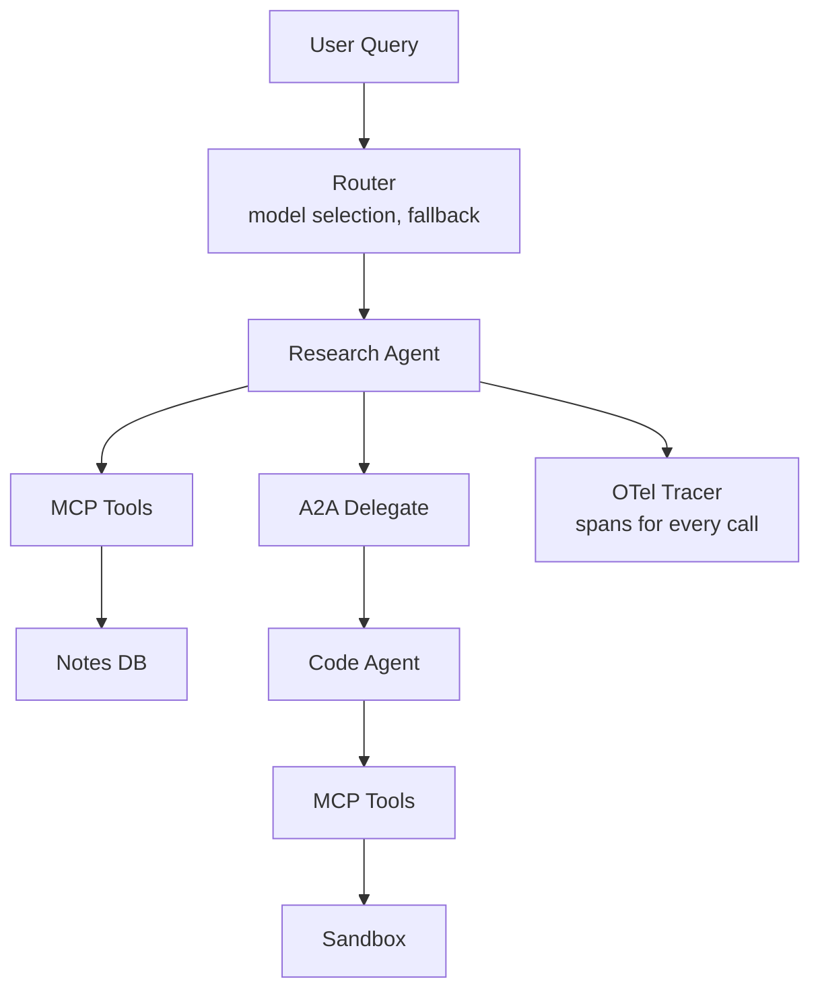

# 工具生态项目 — 发布完整MCP+A2A+路由+可观测性栈

> Phase 13命名了原语。本课将它们组装成一个可工作的系统。你构建一个研究Agent，使用MCP调用工具，使用A2A委托子任务给专业Agent，通过路由层选择模型，并通过OpenTelemetry发出追踪。这是Phase 13中每个概念的集成测试。

**类型：** 项目
**语言：** Python（标准库，完整集成栈）
**前置条件：** Phase 13所有课程
**时间：** ~120分钟

## 学习目标

- 将MCP服务器、A2A客户端、路由器和追踪器集成到单个可工作系统。
- 端到端追踪请求：用户查询 -> 路由器 -> LLM -> MCP工具 -> A2A委托 -> 结果。
- 测量完整栈的延迟、成本和token使用。
- 识别集成陷阱：命名空间冲突、认证不匹配、追踪间隙。

## 问题所在

单独的原语工作正常。组合它们时，现实世界问题出现：

- MCP工具命名在A2A委托后冲突。
- 路由器选择不支持A2A委托所需函数调用的模型。
- 追踪span在MCP-A2A边界处断裂。
- 认证不匹配：MCP使用OAuth 2.1，A2A使用Bearer token，路由器需要两者。

本课构建一个集成这些的完整系统，以便你看到并修复每个集成问题。

## 核心概念

### 系统架构

### 集成点

1. **路由器 + MCP。** 路由器选择模型；MCP工具通过客户端的函数调用接口调用。路由器需要知道哪些模型支持函数调用。

2. **MCP + A2A。** 研究Agent使用MCP获取笔记，使用A2A委托代码执行。两个协议共存；工具是MCP，Agent是A2A。

3. **A2A + 路由器。** A2A委托的Agent也需要LLM调用。路由器必须处理嵌套路由。

4. **追踪 + 一切。** 每个MCP调用、A2A委托和路由器决策发出span。追踪跨协议边界连续。

5. **认证 + 一切。** MCP使用OAuth 2.1，A2A使用Bearer token。系统需要两者。

### 集成陷阱

- **命名空间冲突。** 两个MCP服务器暴露 `search`。路由器必须加前缀。
- **追踪传播。** A2A委托必须携带 `trace_id`，使子Agent的span出现在同一追踪中。
- **模型能力不匹配。** 路由器选择不支持函数调用的模型；MCP工具调用失败。
- **认证层叠。** MCP token不适用于A2A。系统需要分开的凭证。
- **错误传播。** A2A Agent失败；错误必须传播回MCP客户端作为工具错误。

### 延迟预算

完整栈的端到端延迟：

- 路由器决策：<10ms
- LLM调用：500ms-3s
- MCP工具调用：100ms-1s
- A2A委托：1s-30s（取决于子Agent）
- 追踪开销：<5ms per span

总延迟：2s-35s，取决于任务复杂性。

### 成本归因

每次调用归因给：

- 用户（谁发起了请求）
- 会话（哪个对话）
- 任务（什么工作单元）
- 协议（MCP vs A2A）

这允许细粒度成本分析。

## 实践

`code/main.py` 实现完整的集成栈：

1. 一个笔记MCP服务器（来自第07课）。
2. 一个代码运行器A2A Agent（来自第19课）。
3. 一个路由器（来自第21课），带有回退链。
4. 一个追踪器（来自第20课），发出OTLP JSON。
5. 一个研究Agent，协调一切。

运行它以看到完整的请求流：用户查询 -> 路由器 -> LLM -> MCP笔记搜索 -> A2A代码委托 -> 结果组装 -> 追踪输出。

## 交付

本课产生 `outputs/skill-tool-ecosystem-integrator.md`。给定一组MCP服务器、A2A Agent和路由规则，该技能生成集成计划，命名每个集成陷阱和修复。

## 练习

1. 运行 `code/main.py`。追踪一个完整的请求从用户查询到最终响应。识别每个协议转换。

2. 添加一个第二个MCP服务器（例如，文件系统）并观察命名空间冲突。用前缀解决它。

3. 在A2A委托中实现追踪传播。子Agent的span应出现在与父Agent相同的追踪中。

4. 测量完整栈的延迟。识别瓶颈。优化它。

5. 设计一个生产部署：哪些组件水平扩展，哪些是有状态的，认证如何工作？

## 关键术语

| 术语                      | 人们怎么说     | 实际含义                        |
| ------------------------- | -------------- | ------------------------------- |
| Integration stack         | "完整系统"     | MCP + A2A + 路由器 + 追踪器组合 |
| Trace propagation         | "跨协议追踪"   | 跨MCP/A2A边界携带trace_id       |
| Namespace conflict        | "工具名冲突"   | 两个服务器暴露相同工具名        |
| Auth cascade              | "多协议认证"   | MCP OAuth + A2A Bearer分开      |
| Latency budget            | "时间分配"     | 每个组件的端到端延迟分配        |
| Cost attribution          | "成本分组"     | 按用户/会话/任务/协议的LLM成本  |
| Model capability mismatch | "错误模型选择" | 路由器选择不支持函数调用的模型  |
| Error propagation         | "跨协议错误"   | A2A错误作为MCP工具错误传播      |
| Integration pitfall       | "组合bug"      | 单独工作但组合时断裂的东西      |
| End-to-end test           | "完整流程测试" | 跨所有协议的请求                |

## 延伸阅读

- [Anthropic — Building effective agents](https://www.anthropic.com/research/building-effective-agents) — Agent架构模式
- [LangChain — Agent architectures](https://python.langchain.com/docs/concepts/agents/) — 多协议Agent组合
- [CrewAI — Multi-agent patterns](https://docs.crewai.com/concepts/agents) — Agent间委托模式
- [OpenTelemetry — Distributed tracing](https://opentelemetry.io/docs/concepts/signals/traces/) — 跨服务追踪
- [MCP — Ecosystem overview](https://modelcontextprotocol.io/ecosystem) — 服务器、客户端和工具
