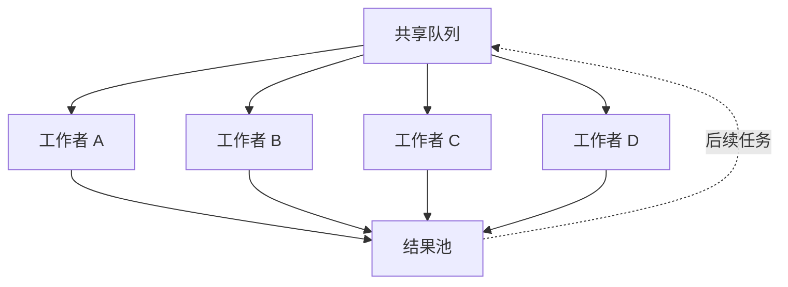

# 并行 / 群体 / 网络化架构

> 与监督者对比：没有中央决策者。Agent 读取共享事件总线，异步获取工作，写回结果。LangGraph 明确支持"群体架构"用于去中心化、动态环境。Matrix (arXiv:2511.21686) 将控制流和数据流都表示为通过分布式队列传递的序列化消息，以消除编排者瓶颈。权衡是明确的：用确定性和可追溯性换取可扩展性。群体适合有许多独立子问题的任务；不适合需要单一连贯计划的任务。

**类型：** 学习 + 构建
**语言：** Python (stdlib, `threading`, `queue`)
**前置条件：** Phase 16 · 05 (监督者模式), Phase 16 · 04 (原语模型)
**时间：** ~75 分钟

## 问题

监督者扩展到几个工作者。几百个呢？监督者本身成为瓶颈：关于谁做什么的每个决策都通过一个 Agent。一个慢的计划步骤会停滞整个系统。

群体架构翻转了设计。不是中央规划者分派工作，而是工作者从共享队列获取工作。"协调"被烘焙到事件总线语义中。没有编排者；系统扩展直到队列成为瓶颈。

## 概念

### 形状



没有编排者。每个工作者重复：拉取任务、处理、写入结果（可选地入队后续任务）。

### 群体何时适合

- **许多独立任务。** 抓取、转换、分类。任务之间不互相依赖。
- **可变时长工作。** 如果某些任务需要 100ms 而其他需要 10s，群体自动平衡负载——快的工作者拉取下一个任务。监督者必须预判时长。
- **吞吐量优先于确定性。** 你关心总完成时间，不是严格排序。

### 群体何时失败

- **有序工作流。** 如果步骤 3 需要步骤 2 的输出，群体可能步骤 2 完成前就触发步骤 3。
- **全局计划任务。** 复杂研究问题受益于规划者。一群研究者产生独立的事实，不是连贯的报告。
- **调试。** 没有中央日志和异步工作，复现 bug 代价高昂。

### Matrix (arXiv:2511.21686)

Matrix 是 2025 年将群体推到自然结论的论文：控制流和数据流都是分布式队列上的序列化消息。没有中央协调者。容错来自消息持久性。可扩展性是消息代理的问题，不是系统的。

贡献：一个编程模型，多 Agent 协调是"这个 Agent 订阅什么消息主题？"而不是"监督者接下来选择哪个 Agent？"这使得系统看起来像一个发布/订阅事件网格。

### LangGraph 的群体架构

LangGraph 2025 文档明确将"群体架构"描述为多 Agent 模式之一：Agent 是节点，但边形成带环的有向图，任何节点都可以从池中激活。工作者按条件从可用工作中选择，而不是由监督者分配。

### 失败模式：饥饿和热点

如果所有工作者都拉取最快的可用任务，长时间运行的任务永远不会被选中，直到它们是唯一剩下的。经典的队列饥饿。

缓解措施：

- 带显式老化的优先级队列（随等待时间增加优先级）。
- 工作者专业化：某些工作者只接受"长"任务。
- 背压：限制进入队列的快速任务数量。

### 基于内容路由的链接

群体自然地与基于内容的路由 (Lesson 22) 配对。不是通用队列，而是每种消息类型一个队列。专业工作者只订阅其类型。这是可扩展到数千 Agent 的消息总线架构的基础。

## 构建它

`code/main.py` 实现了从共享 `queue.Queue` 拉取的 4 个工作者线程群体。任务有可变时长（一些快，一些慢）。演示对比：

- **串行基线：** 一个工作者串行处理所有任务。
- **固定分配：** 每个任务预分配给特定工作者（监督者风格）。
- **群体：** 工作者从共享队列拉取。

群体自动平衡负载；固定分配在分配的任务慢时让快的工作者空闲。

运行：

```
python3 code/main.py
```

输出显示每个工作者的任务计数（群体分配不均匀但最优）和挂钟时间。

## 使用它

`outputs/skill-swarm-fit.md` 评估任务应该使用群体还是监督者。输入：任务独立性、时长方差、排序要求、可调试性需求。

## 发布它

检查清单：

- **带老化的优先级队列。** 防止长任务饥饿。
- **工作者幂等性。** 如果工作者在运行中途崩溃，任务可能被拉取多次。工作者必须幂等。
- **持久队列。** 生产环境使用 Kafka、Redis Streams 或数据库支持的队列。`queue.Queue` 仅在内存中。
- **每个任务的可观测性。** 每个任务有追踪 ID；每个工作者用它记录开始/结束。
- **背压。** 如果队列增长快于工作者排空，减慢生产者。

## 练习

1. 运行 `code/main.py`。群体在可变时长工作负载上比串行快多少？比固定分配快多少？
2. 添加优先级队列变体（使用 `queue.PriorityQueue`）。按任务"重要性"字段分配优先级。观察低优先级任务在持续负载下是否饥饿。
3. 实现热点检测器：当任何工作者处理了比最慢工作者多 3 倍的任务时记录日志。这表明任务时长分布有什么特点？
4. 阅读 Matrix 论文 (arXiv:2511.21686) 摘要和第 3 节。识别 Matrix 接受的一个具体权衡（可扩展性增益）和放弃的一个（可追溯性、确定性）。
5. 将群体演示转换为使用 `(task_type, payload)` 元组的 `queue.Queue`，工作者只订阅特定类型。当任务异构时什么路由规则有意义？

## 关键术语

| 术语        | 人们怎么说         | 实际含义                                                 |
| ----------- | ------------------ | -------------------------------------------------------- |
| 群体架构    | "去中心化 Agent"   | 工作者从共享队列拉取；没有中央编排者。                   |
| 事件总线    | "Agent 订阅主题"   | 按类型或内容将任务路由到工作者的消息代理。               |
| 饥饿        | "任务永远不运行"   | 低优先级任务因高优先级工作持续到达而从未被选中。         |
| 热点        | "一个工作者淹没了" | 一个工作者获得大部分任务的负载不平衡。                   |
| 背压        | "减慢生产者"       | 当队列填满时向上游发出停止生产的信号机制。               |
| 幂等工作者  | "安全重跑"         | 任务处理两次产生相同结果。因为工作者可能中途崩溃而需要。 |
| 持久队列    | "崩溃后存活"       | 由磁盘或复制存储支持的队列；工作者崩溃时任务不丢失。     |
| Matrix 框架 | "全消息传递群体"   | 数据和控制流都是分布式队列上的序列化消息。               |

## 延伸阅读

- [LangGraph workflows and agents — Swarm Architecture](https://docs.langchain.com/oss/python/langgraph/workflows-agents) — 显式群体支持
- [Matrix — A Decentralized Framework for Multi-Agent Systems](https://arxiv.org/abs/2511.21686) — 全消息传递群体
- [Anthropic engineering — why supervisor not swarm in Research](https://www.anthropic.com/engineering/multi-agent-research-system) — 为什么特定生产系统明确选择监督者而非群体
- [AutoGen v0.4 actor-model docs](https://microsoft.github.io/autogen/stable/) — 事件驱动 Actor 重写，比 v0.2 的 GroupChat 更接近群体
