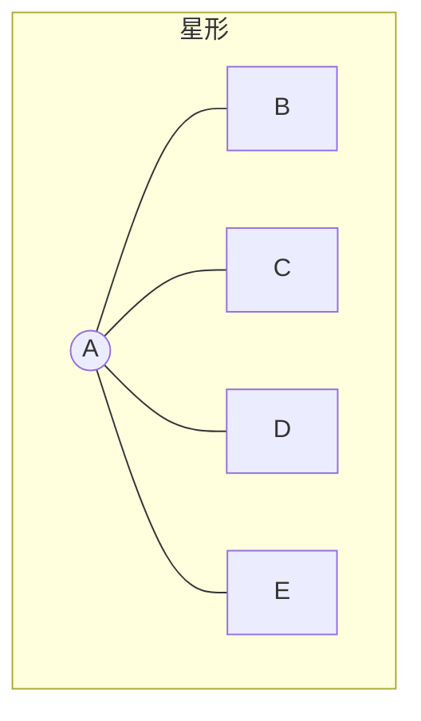
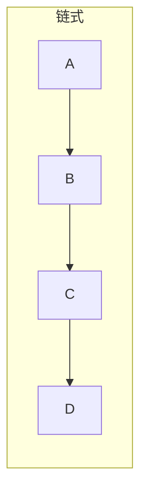
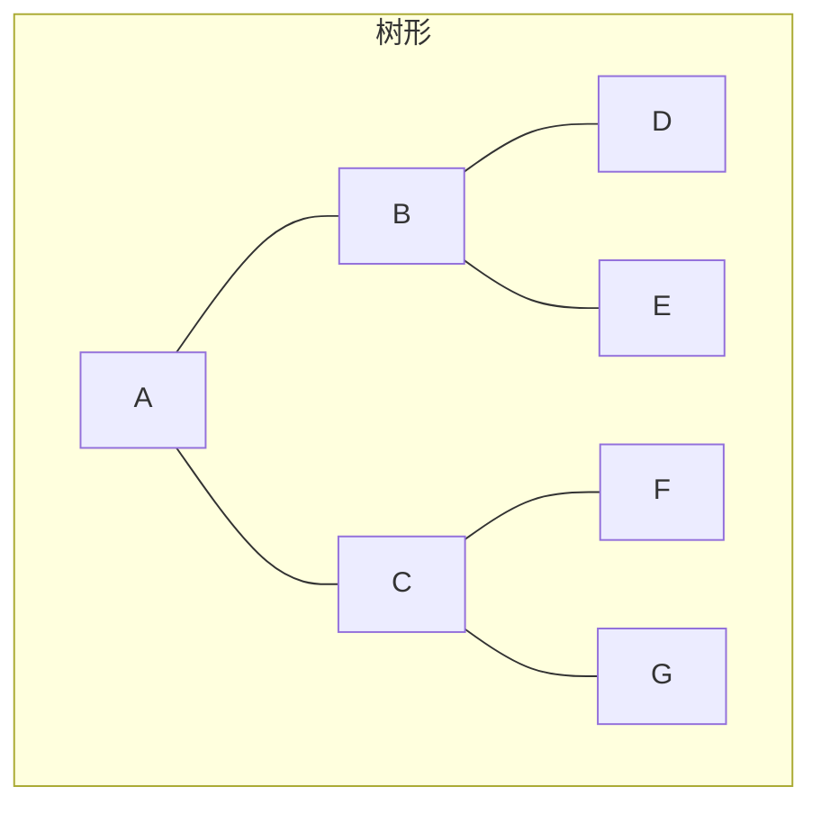
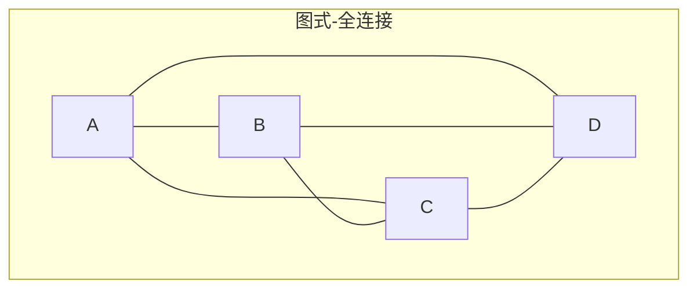

# 投票、自一致性与辩论拓扑

> 最便宜的聚合：采样 N 个独立 Agent，多数投票。Wang 等人 2022 年的自一致性用一个模型采样 N 次做到了。多 Agent 用**异构** Agent 扩展它以逃离单一文化——不同模型、不同提示、不同温度、不同上下文。超越多数投票，辩论拓扑很重要：MultiAgentBench (arXiv:2503.01935, ACL 2025) 评估了星形/链式/树形/图式协调，发现**图式最适合研究**，约 4 个 Agent 后有"协调税"。AgentVerse (ICLR 2024) 记录了两种涌现模式——志愿行为和从众行为——从众既是特性（找到共识）也是风险（群体思维, Lesson 24）。本课程映射拓扑空间，构建每种变体，并测量协调税。

**类型：** 学习 + 构建
**语言：** Python (stdlib)
**前置条件：** Phase 16 · 07 (心智社会与辩论), Phase 16 · 14 (共识与BFT)
**时间：** ~75 分钟

## 问题

辩论可以提高准确性 (Du 等人, arXiv:2305.14325)。它也可以降低准确性。辩论是否有帮助取决于四个结构选择：

1. 谁和谁交流（拓扑）。
2. 多少轮（Du 2023：轮次和 Agent 独立重要）。
3. Agent 是否异构（不同基础模型打破单一文化）。
4. 是否存在对抗性声音（钢铁侠论证 vs 稻草人论证）。

将"运行 5 个 Agent 并投票"螺栓式加到任务上的团队通常比单 Agent 回退。失败不是随机的。它们追踪拓扑和异构性。本课程就是拓扑地图。

## 概念

### 自一致性，单模型基线

Wang 等人 2022 ("Self-Consistency Improves Chain of Thought Reasoning") 在 temperature > 0 时采样同一模型 N 次并对推理路径答案多数投票。GSM8K 上的结果：N=40 采样比单次贪婪解码有实质性增益。自一致性是多 Agent 投票的单 Agent 前身。

限制：自一致性使用一个基础模型。错误按构造相关。如果模型有系统性偏差，所有 N 个样本共享它。

### 多 Agent 投票，异构扩展

用 N 个*不同* Agent 替换 N 个样本。不同基础模型 (Claude, GPT, Llama)、不同提示、不同工具访问。好处：不相关错误。成本：不同 Agent 花费不同；协调它们增加开销。

2026 年异构辩论的规范名称是 **A-HMAD** — 对抗性异构多 Agent 辩论。不是普遍采用的，但论文用该术语指"不同模型辩论，减少单一文化崩溃的相关错误。"

### 四种拓扑









星形：一个中心，所有其他只与中心交流。等同于无回通道的监督者-工作者。
链式：线性，每个 Agent 看到前一个的输出。流水线式。
树形：层次化，用于层次化 Agent 系统 (Lesson 06)。
图式：任意对任意。包括全连接团和任意 DAG。

### 协调税 (MultiAgentBench)

MultiAgentBench (MARBLE, ACL 2025, arXiv:2503.01935) 在包括研究、编码和规划的任务套件上对星形、链式、树形、图式进行基准测试。关键测量结果：

- **图式**拓扑在研究任务上胜出。信息任意流动；Agent 可以互相批评。
- **星形**在快速回答的事实任务上胜出。中心过滤和整合。
- **链式**在逐步流水线（分阶段精炼）上胜出。
- **协调税**在图式拓扑约 4 个 Agent 后出现。挂钟时间和 token 成本增长快于质量。

4 Agent 上限是经验性的，不是根本性的。它反映了 2026 年 LLM 上下文容量：每个 Agent 的上下文被同伴输出填满，添加第 N+1 个 Agent 的边际价值在每个人都能看到每个人后下降。

### 多 Agent 辩论策略 ("Should we be going MAD?")

arXiv:2311.17371 是 2023 年 MAD 策略综述。被他人复现的关键发现：与自一致性*结构相似*的 MAD 变体（独立采样 + 聚合）在使用相同预算时通常不如自一致性。MAD 在 Agent 真正异构且辩论有对抗性结构（一个 Agent 反驳）时帮助最大。

### AgentVerse 涌现模式

AgentVerse (ICLR 2024) 记录了即使没有显式设计也从多 Agent 辩论中涌现的两种行为：

- **志愿。** Agent 主动提供帮助（"我可以做下一步"）。有用：它将工作分配给子任务中最有能力的 Agent。
- **从众。** Agent 调整立场以匹配批评者，即使批评者是错的。这是辩论中等价的谄媚 (Lesson 14)。

从众是为什么"辩论直到同意"奖励霸凌者的原因。有限轮次加独立法官可以缓解。

### 异构性：真正推动准确性的旋钮

2024-2026 年实用文献中的模式：将 N 个 Agent 中的一个换成不同基础模型比将 N 增加 1 带来更大的准确性提升。直觉是单一文化——每个新的独立错误源比额外的相关样本更有价值。

在极限情况下，异构性胜过数量。三个不同模型在大多数有清晰真实答案的任务上击败五个同模型副本。

### 陪审团方法

Sibyl 框架（在 Minsky-LLM 文献中引用）形式化了一个"陪审团"——一小群专业化 Agent 通过每阶段投票精炼答案。与朴素多数投票不同，陪审团有角色：一个交叉质询、一个提供上下文、一个评分合理性。陪审团方法是朴素投票（便宜、单一文化倾向）和完整 MAD（昂贵、从众倾向）之间的中间点。

### 投票加辩论何时占优

- 问题有真实答案（事实、数学、代码行为）。投票收敛有意义。
- Agent 可以访问不同来源或工具（异构性可用）。
- 轮次有限（通常 2-3）且有独立法官或验证者。
- 预算允许 3-5 个 Agent。超过 5-7 在图式拓扑上，协调税占主导。

### 投票加辩论何时有害

- 问题是意见型的。Agent 收敛到看起来最自信的答案，不是最正确的。
- 所有 Agent 共享基础模型。单一文化使共识无意义。
- 轮次无限制。从众每次都赢。
- 任务简单。N=5 自一致性的单 Agent 更便宜且同样准确。

## 构建它

`code/main.py` 实现：

- `run_star(agents, hub, question)` — 中心轮询每个工作者，聚合。
- `run_chain(agents, question)` — 顺序精炼。
- `run_tree(root, children, question)` — 带深度-2 聚合的层次化。
- `run_graph(agents, question, rounds)` — 全对全辩论，有限轮次。
- 脚本化异构性拨盘：每个 Agent 有 `error_bias` 指示其系统性错误。
- 测量线束，在 N=3, 5, 7 运行每种拓扑并报告 (accuracy, total_tokens, wallclock_simulated)。

运行：

```
python3 code/main.py
```

预期输出：topology × N → (accuracy, tokens, latency) 的表格。图式在 N=3-5 的研究风格任务上胜出；星形在快速事实任务上胜出；图式在 N=7 显示协调税（延迟膨胀快于准确性）。

## 使用它

`outputs/skill-topology-picker.md` 是一个技能，读取任务描述并推荐拓扑（星形/链式/树形/图式）、N（Agent 数量）、异构性配置（使用的基础模型）和轮次限制。

## 发布它

对于任何集成：

- 从**一个强基础模型的 N=5 自一致性**开始。这是便宜的基线。
- 如果准确性重要，升级到**N=3 异构投票**。测量增量。
- 只有当任务有结构（研究、多步骤）且有限轮次可行时，才升级到**辩论拓扑**。
- 始终记录少数簇。当少数持续正确时，你有一个多样性信号。
- 与准确性一起基准测试挂钟时间和 token。"10 倍成本的更好准确性"是商业决策。

## 练习

1. 运行 `code/main.py`。绘制图式拓扑的协调税曲线：accuracy vs N, tokens vs N。曲线在什么 N 处拐折？
2. 实现 A-HMAD：三个具有故意不同偏差的 Agent。全相同偏差基线与 A-HMAD 在 Lesson 14 的单一文化攻击上比较如何？
3. 在图式拓扑中添加"法官"角色，不投票，只评分最终共识。这是否改变了涌现的从众行为？
4. 阅读 AgentVerse 论文 (ICLR 2024)。识别你的实现表现出哪种涌现行为最强。你能通过提示改变引出相反行为吗？
5. 阅读 MultiAgentBench (arXiv:2503.01935) 第 4 节（拓扑实验）。使用你的线束从论文中复现一个任务的"图式胜出研究"结果。

## 关键术语

| 术语     | 人们怎么说        | 实际含义                                                         |
| -------- | ----------------- | ---------------------------------------------------------------- |
| 自一致性 | "采样 N 次，投票" | Wang 2022。单模型，N 次 temperature>0 采样，推理路径上多数投票。 |
| 异构性   | "不同模型"        | 不同基础模型或提示族的集成。打破单一文化。                       |
| MAD      | "多 Agent 辩论"   | Agent 经多轮交换批评的通用术语。参见 Du 2023。                   |
| A-HMAD   | "对抗性异构 MAD"  | 强调不同模型 + 对抗性结构的 MAD 变体。                           |
| 拓扑     | "谁和谁交流"      | 星形、链式、树形、图式。决定信息流。                             |
| 协调税   | "收益递减"        | 图式上约 4 个 Agent 后，成本增长快于质量。                       |
| 志愿行为 | "主动帮助"        | AgentVerse 涌现模式：Agent 主动提出做一步。                      |
| 从众行为 | "压力下同意"      | AgentVerse 涌现模式：Agent 与批评者对齐。                        |
| 陪审团   | "小型专业小组"    | Sibyl 风格的带角色集成（质询者、上下文、评分者）。               |

## 延伸阅读

- [Wang et al. — Self-Consistency Improves Chain of Thought Reasoning](https://arxiv.org/abs/2203.11171) — 单模型基线
- [Du et al. — Improving Factuality and Reasoning via Multiagent Debate](https://arxiv.org/abs/2305.14325) — Agent 和轮次都独立重要
- [MultiAgentBench / MARBLE](https://arxiv.org/abs/2503.01935) — 拓扑基准，图式最适合研究，链式适合流水线
- [Should we be going MAD?](https://arxiv.org/abs/2311.17371) — MAD 策略综述；发现在等预算下 MAD 通常输给自一致性
- [AgentVerse (ICLR 2024)](https://proceedings.iclr.cc/paper_files/paper/2024/file/578e65cdee35d00c708d4c64bce32971-Paper-Conference.pdf) — 志愿和从众涌现模式
