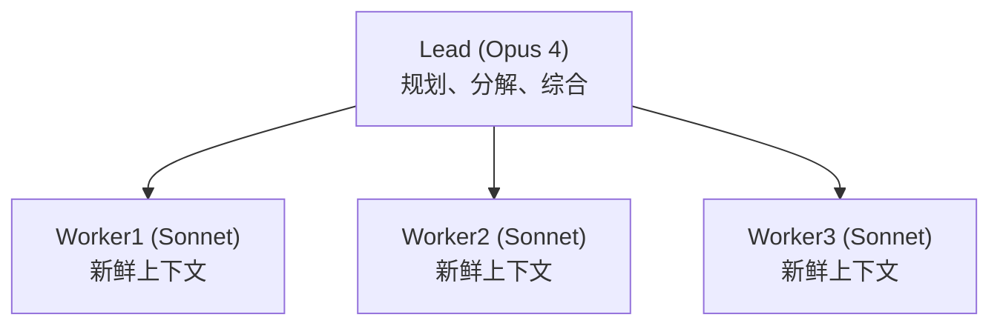

# 监督者/编排者-工作者模式

> 一个领导Agent规划和委托；专业工作者在并行上下文中执行并汇报。这是Anthropic研究系统（Claude Opus 4作为领导，Sonnet 4作为子Agent）背后的模式，在内部研究评估上测量为比单Agent Opus 4高+90.2%。Anthropic的工程文章报告BrowseComp上80%的方差仅由token使用解释 — 多Agent获胜主要是因为每个子Agent获得一个新鲜的上下文窗口。本课从原语构建监督者模式，并涵盖2026年生产部署的工程经验。

**类型：** 学习 + 构建
**语言：** Python（标准库，`threading`）
**前置条件：** Phase 16 · 04（原语模型）
**时间：** ~75分钟

## 问题所在

研究是单Agent系统失败的原型任务。你问"2023到2026年间多Agent系统有什么变化？"单个Agent顺序阅读五篇论文，用其文本填充一半上下文，然后必须一起推理所有论文。到第五篇时它忘记了第一篇。它无法并行化。

监督者模式修复了这一点：一个领导Agent规划搜索，将每个子问题委托给一个工作者，并综合。每个工作者为自己的狭窄问题获得自己的200k token窗口。领导永远看不到原始论文 — 只有工作者摘要。

Anthropic的生产研究系统报告在内部研究评估上比单个Opus 4高+90.2%。同一文章指出BrowseComp方差的80%仅由*token使用*解释。每个子Agent的新鲜上下文是主要机制。

## 核心概念

### 模式

领导从不阅读原始材料。工作者在领导综合之前从不看到彼此的工作。每个箭头是一个带有狭窄工件的handoff。

### 为什么它获胜

三个机制：

1. **每个子Agent的新鲜上下文。** 探索"FIPA-ACL遗产"的工作者不携带领导花费在规划上的40k token。它为一个问题获得200k窗口。
2. **通过提示专业化。** 领导的提示是"分解和综合"，不是"研究"。每个工作者的提示是狭窄的："找出X中什么变化了。"聚焦的提示产生聚焦的输出。
3. **并行性。** 工作者并发运行。挂钟时间大约是`max(worker_times) + plan + synthesis`，不是`sum(worker_times)`。

### 工程经验（Anthropic 2025）

Anthropic文章列出了几条仍然与2026年相关的生产经验：

- **按查询复杂度缩放工作量。** 简单查询：一个Agent，3-10次工具调用。复杂查询：10+个Agent。领导必须估计这一点，不是调用者。
- **先宽后窄。** 先分解为广泛的子问题，然后如果答案值得深度，每个子问题生成更多工作者。
- **彩虹部署。** Agent是长时间运行且有状态的。传统蓝绿部署不起作用。Anthropic使用彩虹：新版本渐进推出，同时旧版本排空。
- **Token使用主导。** 多Agent大约是单Agent的15倍token。仅在任务价值证明成本合理时运行它。

### LangGraph的转变

LangGraph最初发布了一个带有高级`create_supervisor`辅助的`langgraph-supervisor`库。2025年LangChain将推荐移至通过工具调用直接实现监督者模式，因为工具调用对*监督者看到什么*（上下文工程）提供更多控制。库仍然工作；文档现在推荐工具调用形式。

### 失败模式

- **领导幻觉计划。** 如果领导生成的子问题没有分解真实问题，工作者在错误目标上做精确研究。
- **工作者过度探索。** 没有显式范围边界，工作者漂移超出其分配的子问题并污染综合步骤。
- **综合冲突。** 两个工作者返回矛盾的事实。领导必须重新询问（添加一轮）或明确记录分歧。静默选择一方是最差的失败：用户永远不知道发生了分歧。

### 何时监督者是错误的

- **顺序任务。** 如果第2步确实需要第1步的输出，并行性什么也买不到。使用管道（CrewAI Sequential、LangGraph线性图）。
- **简单查询。** 单Agent更快更便宜地处理它们。在生成工作者之前使用领导的"缩放工作量"检查。
- **严格确定性。** 监督者使用LLM选择的委托。当审计/重放比适应性更重要时，静态图更好。

## 实践

`code/main.py`使用`threading`实现三个并行工作者的监督者。领导将查询分解为子问题，工作者在每个子问题上并发运行，领导综合。无真实LLM — 工作者被脚本化以模拟获取和摘要。

关键结构：

- `Lead.plan(query)` 将查询拆分为3个子问题。
- `Worker.run(sub_q)` 返回假摘要（在生产中可以是任何使用工具的Agent）。
- `Lead.run(query)` 在线程中启动工作者，join，并综合。

## 交付

`outputs/skill-supervisor-designer.md`接收用户查询并产生监督者模式设计：领导系统提示、工作者角色、子问题分解规则和综合模板。

## 练习

1. 运行 `code/main.py`，然后修改领导生成5个工作者而不是3个。观察挂钟效果。在此演示中，什么工作者数量下生成开销超过并行节省？
2. 实现工作者超时：杀死运行超过0.5秒的任何工作者，让领导综合剩余结果。你需要什么可观测性来知道工作者被切断了？
3. 在领导的综合中添加冲突检测步骤：如果两个工作者返回矛盾答案，领导记录分歧而不是选择一个。你如何在不调用LLM的情况下检测矛盾？
4. 阅读Anthropic的研究系统工程文章。列出此玩具演示需要采用才能在生产中运行的三项实践。
5. 比较LangGraph的`create_supervisor`（遗留）vs新的工具调用推荐。哪个对监督者看到什么提供更好的控制？为什么Anthropic在综合中明确只传递子答案而不是原始工作者上下文？

## 关键术语

| 术语          | 人们怎么说            | 实际含义                                                        |
| ------------- | --------------------- | --------------------------------------------------------------- |
| 监督者        | "领导Agent"           | 规划、委托和综合的编排Agent。不做工作本身。                     |
| 工作者        | "子Agent"             | 由监督者以狭窄范围和自己的上下文窗口调用的聚焦Agent。           |
| 编排者-工作者 | "监督者模式"          | 同一东西，不同名称。2026年文献两者都用。                        |
| 新鲜上下文    | "干净窗口"            | 工作者的上下文从其系统提示和分配的问题开始，不是领导的历史。    |
| 彩虹部署      | "渐进推出"            | 长时间运行的有状态Agent需要版本化排空和替换，不是蓝绿。         |
| Token主导     | "上下文是变量"        | 研究评估方差的80%来自总token使用，不是模型选择，根据Anthropic。 |
| 缩放工作量    | "Agent数量匹配复杂度" | 领导估计查询难度，相应生成1 vs 10+工作者。                      |
| 综合冲突      | "工作者不同意"        | 两个工作者返回矛盾事实；领导必须浮出分歧，不是静默选择一个。    |

## 延伸阅读

- [Anthropic engineering — How we built our multi-agent research system](https://www.anthropic.com/engineering/multi-agent-research-system) — 监督者模式的生产参考
- [LangGraph workflows and agents](https://docs.langchain.com/oss/python/langgraph/workflows-agents) — 工具调用监督者现在是推荐形式
- [LangGraph supervisor reference](https://reference.langchain.com/python/langgraph-supervisor) — 遗留辅助，2026年仍在生产中使用
- [OpenAI cookbook — Orchestrating Agents: Routines and Handoffs](https://developers.openai.com/cookbook/examples/orchestrating_agents) — 基于handoff的监督者变体
