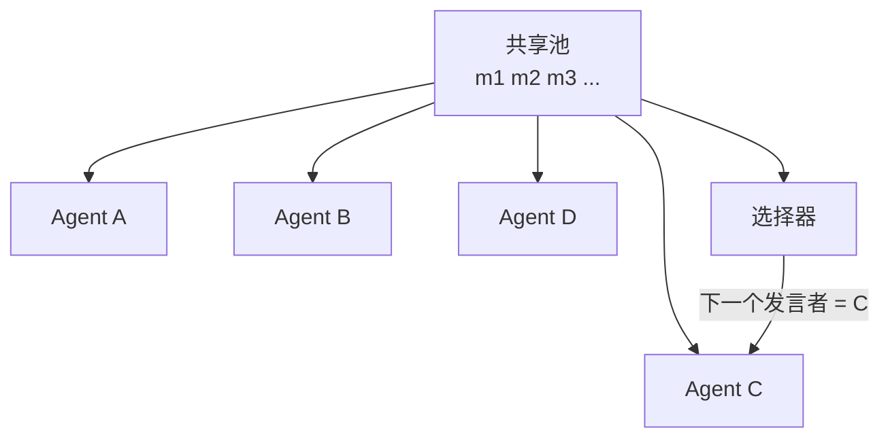

# 群聊与发言者选择

> AutoGen GroupChat 和 AG2 GroupChat 在 N 个 Agent 之间共享一个对话；选择器函数（LLM、轮询或自定义）选择下一个发言者。这是涌现式多 Agent 对话的原型——Agent 不知道自己在静态图中的角色，它们只是对共享池做出反应。AutoGen v0.2 的 GroupChat 语义在 AG2 分支中保留；AutoGen v0.4 将其重写为事件驱动 Actor 模型。Microsoft 于 2026 年 2 月将 AutoGen 置于维护模式，并与 Semantic Kernel 合并为 Microsoft Agent Framework (RC 2026 年 2 月)。GroupChat 原语在 AG2 和 Microsoft Agent Framework 中都存活——学一次，到处用。

**类型：** 学习 + 构建
**语言：** Python (stdlib)
**前置条件：** Phase 16 · 04 (原语模型)
**时间：** ~60 分钟

## 问题

静态图 (LangGraph) 在工作流已知时很好。真实对话不是静态的：有时编码者问审查员，有时问研究员，有时问作者。硬编码每个可能的交接会产生边爆炸。你想要*Agent 对共享池做出反应*，由某个函数决定谁下一个发言。

这正是 AutoGen GroupChat 所做的。

## 概念

### 形状



每个 Agent 看到每条消息。每轮调用选择器函数选择下一个发言者。

### 三种选择器风格

**轮询。** 固定循环。确定性。按 N 线性扩展但忽略上下文——即使主题是法律审查，编码者也获得发言权。

**LLM 选择。** 调用 LLM 读取最近的池并返回最佳下一个发言者。上下文感知但慢：每轮增加一次 LLM 调用。AutoGen 的默认。

**自定义。** 带有任何你想要的逻辑的 Python 函数。典型：LLM 选择带回退规则（例如，"编码者之后总是给验证者发言权"）。

### ConversableAgent API

```
agent = ConversableAgent(
    name="coder",
    system_message="You write Python.",
    llm_config={...},
)
chat = GroupChat(agents=[coder, reviewer, tester], messages=[])
manager = GroupChatManager(groupchat=chat, llm_config={...})
```

`GroupChatManager` 持有选择器。当 Agent 完成一轮时，管理器调用选择器，返回下一个 Agent。循环继续直到终止条件。

### 终止

三种常见模式：

- **最大轮次。** 总轮次的硬上限。
- **"TERMINATE" 令牌。** Agent 可以发出哨兵消息；管理器在出现一个时停止。
- **目标达成检查。** 轻量级验证者每轮运行，完成时停止聊天。

### AutoGen → AG2 分裂和 Microsoft Agent Framework 合并

2025 年初，Microsoft 开始围绕事件驱动 Actor 模型对 AutoGen (v0.4) 进行重大重写。社区将 AutoGen v0.2 的 GroupChat 语义分支为 AG2，保留了早期采用者已集成的 API。

2026 年 2 月，Microsoft 宣布 AutoGen 进入维护模式，事件驱动 Actor 模型合并到 **Microsoft Agent Framework** (RC 2026 年 2 月，现已与 Semantic Kernel 合并)。GroupChat 概念在两条路径中都存活；实现细节不同。AG2 是 v0.2 兼容代码的首选上游。

### 群聊何时适合

- **涌现式对话。** 你不想预连线每个可能的下一个发言者。
- **角色混合任务。** 编码者问研究员，研究员问档案员，档案员问回编码者。流不是 DAG。
- **探索性问题解决。** 想象"头脑风暴会议"，不是"装配线"。

### 何时失败

- **严格确定性。** LLM 选择器可能不一致。相同提示，不同运行，不同下一个发言者。
- **谄媚级联。** Agent 服从说话最自信的人。显式对抗提示。
- **上下文膨胀。** 每个 Agent 读取每条消息；10 轮后上下文巨大。使用投影 (Lesson 15) 来限定视图。
- **热门发言者。** 一个 Agent 主导对话，因为选择器偏向其专业。引入发言者平衡作为选择器特性。

### 群聊 vs 监督者

相同原语，不同默认：

- 监督者：一个 Agent 规划，其他执行。选择器是"问规划者做什么。"
- 群聊：所有 Agent 是对等的；选择器是共享池上的函数。

两者都使用 Lesson 04 的四个原语。群聊默认为 LLM 选择的编排和全池共享状态。

## 构建它

`code/main.py` 用 stdlib 从头实现 GroupChat。三个 Agent（编码者、审查者、管理者），轮询和 LLM 选择变体，以及在 `TERMINATE` 令牌上终止。

演示打印对话转录以及两种变体的选择器决策追踪。

运行：

```
python3 code/main.py
```

## 使用它

`outputs/skill-groupchat-selector.md` 为给定任务配置 GroupChat 选择器——轮询 vs LLM 选择 vs 自定义，以及使用什么选择器输入（最近消息、Agent 专业、轮次计数）。

## 发布它

检查清单：

- **最大轮次上限。** 始终设置。典型任务 10-20 轮。
- **发言者平衡指标。** 追踪每个 Agent 的轮次；不平衡超过阈值时告警。
- **终止令牌。** `TERMINATE` 或专用验证者 Agent。
- **投影或限定内存。** 约 10 条消息后，考虑给每个 Agent 限定视图以防止上下文膨胀。
- **选择器日志。** 对于 LLM 选择变体，记录选择器的输入和选择。否则调试不可能。

## 练习

1. 运行 `code/main.py`。比较轮询 vs LLM 选择下的对话。哪个 Agent 在每种模式下主导？
2. 在选择器中添加"每个 Agent 最大发言次数"规则。它如何影响转录？
3. 实现目标达成终止：当审查者返回"approved"时停止。它在轮次上限前多久触发？
4. 阅读 AutoGen 稳定文档关于 GroupChat (https://microsoft.github.io/autogen/stable/user-guide/core-user-guide/design-patterns/group-chat.html)。识别 `GroupChatManager` 使用的默认选择器。
5. 阅读 AG2 仓库 (https://github.com/ag2ai/ag2) 并比较其 v0.2 GroupChat 与 v0.4 事件驱动版本。v0.4 添加了什么具体属性（吞吐量、容错、可组合性）？

## 关键术语

| 术语             | 人们怎么说             | 实际含义                                          |
| ---------------- | ---------------------- | ------------------------------------------------- |
| GroupChat        | "一个聊天室里的 Agent" | 共享消息池 + 选择器函数。AutoGen / AG2 原语。     |
| 发言者选择       | "谁下一个说话"         | 选择下一个 Agent 的函数。轮询、LLM 选择或自定义。 |
| GroupChatManager | "会议主持人"           | 拥有选择器并循环轮次的 AutoGen 组件。             |
| ConversableAgent | "基础 Agent"           | AutoGen 基类；可以发送和接收消息的 Agent。        |
| 终止令牌         | "'停止'词"             | 结束聊天的哨兵字符串（通常是 `TERMINATE`）。      |
| 热门发言者       | "一个 Agent 主导"      | 选择器持续选择同一 Agent 的失败模式。             |
| 上下文膨胀       | "池无限增长"           | 每个 Agent 读取每条先前消息；上下文随轮次增长。   |
| 投影             | "限定视图"             | 共享池中角色特定的视图，防止上下文膨胀。          |

## 延伸阅读

- [AutoGen group chat docs](https://microsoft.github.io/autogen/stable/user-guide/core-user-guide/design-patterns/group-chat.html) — 参考实现
- [AG2 repo](https://github.com/ag2ai/ag2) — 社区 AutoGen v0.2 延续
- [Microsoft Agent Framework docs](https://microsoft.github.io/agent-framework/) — 合并后的继任者, RC 2026 年 2 月
- [AutoGen v0.4 release notes](https://microsoft.github.io/autogen/stable/) — 事件驱动 Actor 模型重写详情
