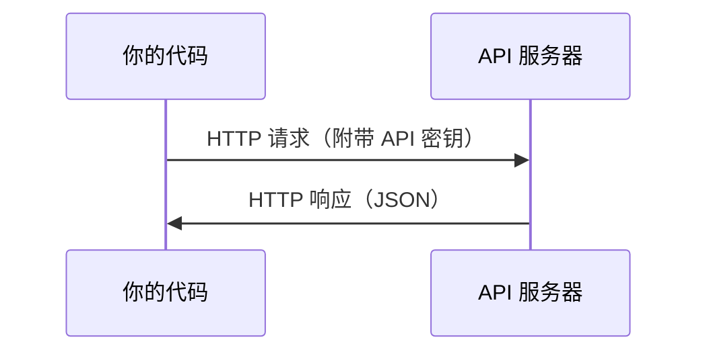

# API 与密钥

> 每个 AI API 的工作方式都一样：发送请求，获取响应。细节会变，模式不变。

**类型：** 构建
**语言：** Python, TypeScript
**前置条件：** 阶段 0，第 01 课
**预计时间：** ~30 分钟

## 学习目标

- 使用环境变量和 `.env` 文件安全存储 API 密钥
- 使用 Anthropic Python SDK 和原始 HTTP 调用 LLM API
- 比较 SDK 方式和原始 HTTP 的请求/响应格式以便调试
- 识别和处理常见 API 错误，包括认证和速率限制

## 问题所在

从阶段 11 开始，你将调用 LLM API（Anthropic、OpenAI、Google）。在阶段 13-16 中，你将构建循环调用这些 API 的 Agent。你需要了解 API 密钥的工作原理、如何安全存储，以及如何发起第一次 API 调用。

## 核心概念



每个 API 调用包含：

1. 一个端点（URL）
2. 一个 API 密钥（认证）
3. 一个请求体（你想要什么）
4. 一个响应体（你得到什么）

## 动手构建

### 第 1 步：安全存储 API 密钥

永远不要把 API 密钥写在代码里。使用环境变量。

```bash
export ANTHROPIC_API_KEY="sk-ant-..."
export OPENAI_API_KEY="sk-..."
```

或者使用 `.env` 文件（将其添加到 `.gitignore`）：

```
ANTHROPIC_API_KEY=sk-ant-...
OPENAI_API_KEY=sk-...
```

### 第 2 步：第一次 API 调用（Python）

```python
import anthropic

client = anthropic.Anthropic()

response = client.messages.create(
    model="claude-sonnet-4-20250514",
    max_tokens=256,
    messages=[{"role": "user", "content": "What is a neural network in one sentence?"}]
)

print(response.content[0].text)
```

### 第 3 步：第一次 API 调用（TypeScript）

```typescript
import Anthropic from '@anthropic-ai/sdk';

const client = new Anthropic();

const response = await client.messages.create({
  model: 'claude-sonnet-4-20250514',
  max_tokens: 256,
  messages: [{ role: 'user', content: 'What is a neural network in one sentence?' }],
});

console.log(response.content[0].text);
```

### 第 4 步：原始 HTTP（不使用 SDK）

```python
import os
import urllib.request
import json

url = "https://api.anthropic.com/v1/messages"
headers = {
    "Content-Type": "application/json",
    "x-api-key": os.environ["ANTHROPIC_API_KEY"],
    "anthropic-version": "2023-06-01",
}
body = json.dumps({
    "model": "claude-sonnet-4-20250514",
    "max_tokens": 256,
    "messages": [{"role": "user", "content": "What is a neural network in one sentence?"}],
}).encode()

req = urllib.request.Request(url, data=body, headers=headers, method="POST")
with urllib.request.urlopen(req) as resp:
    result = json.loads(resp.read())
    print(result["content"][0]["text"])
```

这就是 SDK 底层做的事情。理解原始 HTTP 调用有助于调试。

## 实际应用

对于本课程：

| API                | 何时需要                  | 免费额度       |
| ------------------ | ------------------------- | -------------- |
| Anthropic (Claude) | 阶段 11-16（Agent, 工具） | 注册送 $5 额度 |
| OpenAI             | 阶段 11（对比）           | 注册送 $5 额度 |
| Hugging Face       | 阶段 4-10（模型, 数据集） | 免费           |

你不需要现在就设置所有 API。在课程需要时再配置即可。

## 交付成果

本课程产出：

- `outputs/prompt-api-troubleshooter.md` - 诊断常见 API 错误

## 练习

1. 获取一个 Anthropic API 密钥并完成第一次 API 调用
2. 尝试原始 HTTP 版本，比较响应格式与 SDK 版本的差异
3. 故意使用错误的 API 密钥，阅读错误信息

## 关键术语

| 术语       | 通俗说法               | 实际含义                                        |
| ---------- | ---------------------- | ----------------------------------------------- |
| API key    | "API 的密码"           | 标识你的账户并授权请求的唯一字符串              |
| Rate limit | "被限流了"             | 每分钟/小时的最大请求数，防止滥用并确保公平使用 |
| Token      | "一个词"（API 语境下） | 计费单位：输入和输出 token 分别计算和收费       |
| Streaming  | "实时响应"             | 逐字获取响应，而不是等待完整响应                |
