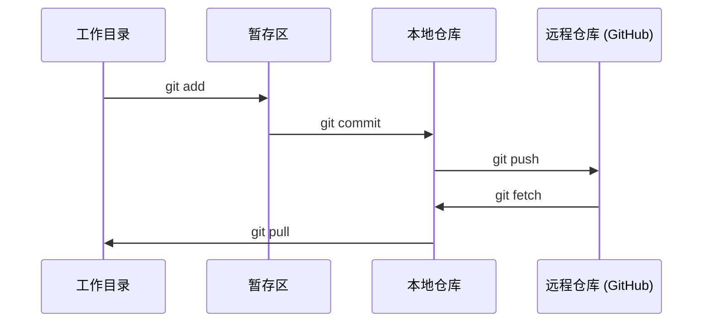

# Git 与协作

> 版本控制不是可选的。你的每一次实验、每一个模型、每一节课的代码都需要被追踪。

**类型：** 学习
**语言：** --
**前置条件：** 阶段 0，第 01 课
**预计时间：** ~30 分钟

## 学习目标

- 配置 Git 身份并使用 add、commit、push 的日常工作流
- 创建和合并分支，进行隔离实验而不破坏主分支
- 编写 `.gitignore` 排除模型检查点和大文件
- 使用 `git log` 浏览提交历史，了解项目演进

## 问题所在

你将在 20 个阶段中编写数百个代码文件。没有版本控制，你会丢失工作成果、破坏无法撤销的内容，也无法与他人协作。

Git 是工具。GitHub 是代码存放的地方。本课程涵盖你所需的内容，仅此而已。

## 核心概念



记住三件事：

1. 经常保存（`git commit`）
2. 推送到远程（`git push`）
3. 用分支做实验（`git checkout -b experiment`）

## 动手构建

### 第 1 步：配置 Git

```bash
git config --global user.name "Your Name"
git config --global user.email "you@example.com"
```

### 第 2 步：日常工作流

```bash
git status
git add file.py
git commit -m "Add perceptron implementation"
git push origin main
```

### 第 3 步：分支实验

```bash
git checkout -b experiment/new-optimizer

# ... 修改代码，提交 ...

git checkout main
git merge experiment/new-optimizer
```

### 第 4 步：使用本课程仓库

```bash
git clone https://github.com/rohitg00/ai-engineering-from-scratch.git
cd ai-engineering-from-scratch

git checkout -b my-progress
# 完成课程，提交你的代码
git push origin my-progress
```

## 实际应用

对于本课程，你只需要这些命令：

| 命令                     | 使用时机                 |
| ------------------------ | ------------------------ |
| `git clone`              | 获取课程仓库             |
| `git add` + `git commit` | 保存你的工作             |
| `git push`               | 备份到 GitHub            |
| `git checkout -b`        | 尝试新内容而不破坏主分支 |
| `git log --oneline`      | 查看你做了什么           |

就是这样。本课程不需要 rebase、cherry-pick 或 submodules。

## 练习

1. 克隆本仓库，创建名为 `my-progress` 的分支，创建一个文件，提交并推送
2. 创建一个 `.gitignore`，排除模型检查点文件（`.pt`, `.pth`, `.safetensors`）
3. 使用 `git log --oneline` 查看本仓库的提交历史，了解课程是如何添加的

## 关键术语

| 术语   | 通俗说法   | 实际含义                                     |
| ------ | ---------- | -------------------------------------------- |
| Commit | "保存"     | 项目在某一时刻的完整快照                     |
| Branch | "副本"     | 一个指向某次提交的指针，随着你的工作向前移动 |
| Merge  | "合并代码" | 将一个分支的变更应用到另一个分支             |
| Remote | "云端"     | 托管在其他地方的仓库副本（GitHub, GitLab）   |
