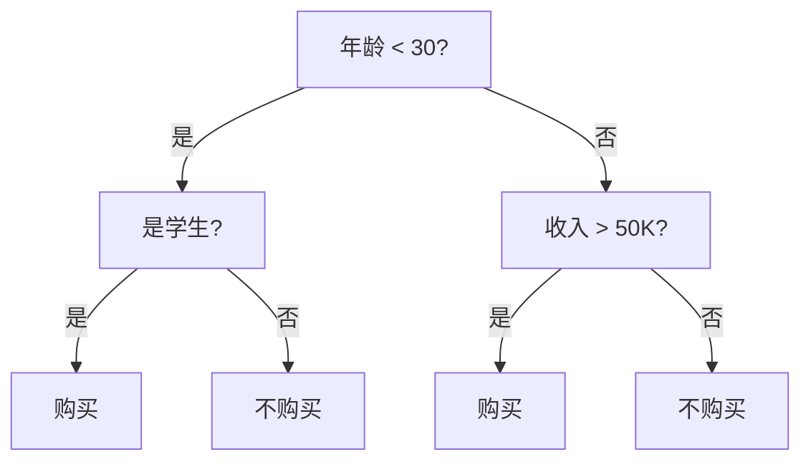

# 决策树与随机森林

> 决策树通过一系列是非问题分割数据。随机森林通过组合多棵树来减少过拟合。

**类型:** 构建
**语言:** Python
**前置条件:** Phase 2 第1-3课
**时间:** ~90 分钟

## 学习目标

- 使用信息增益（或基尼不纯度）作为分裂准则从零实现决策树
- 解释为什么单棵决策树容易过拟合，以及随机森林如何通过装袋和特征随机性来缓解
- 从零实现随机森林，并展示其泛化性能优于单棵树
- 分析特征重要性并解释决策路径

## 问题

你想根据年龄、收入和学生身份预测某人是否会购买产品。逻辑回归画一条直线来分隔类别。但如果决策边界是阶梯形的呢？如果年龄<30且是学生，购买。如果年龄>=30且收入>50K，购买。否则不购买。逻辑回归很难捕捉这些基于规则的、非线性的模式。

决策树天生处理这种问题。它们通过一系列是非问题分割数据，创建一个流程图式的模型。每个内部节点问一个问题，每个叶节点给出一个预测。

单棵树容易过拟合——它不断分裂直到每个叶节点纯净，记住训练数据。随机森林通过训练许多树并让它们投票来解决这个问题。

## 概念

### 决策树结构



- **根节点**：整个数据集，第一个分裂
- **内部节点**：基于特征的二元分裂
- **叶节点**：最终预测（分类的多数类，回归的均值）
- **深度**：从根到最远叶的最长路径

### 分裂准则：如何选择最佳分裂

在每个节点，算法搜索所有特征和所有可能的分裂点，选择"最佳"的那个。"最佳"意味着子集尽可能纯净。

**基尼不纯度**（分类默认）：

```
Gini = 1 - sum(p_k^2)
```

其中p_k是节点中类别k的比例。纯节点（所有样本同类）的基尼=0。均匀分布的基尼最大。

**信息增益**（基于熵）：

```
Entropy = -sum(p_k * log2(p_k))
InfoGain = Entropy(parent) - weighted_avg(Entropy(children))
```

信息增益衡量分裂后不确定性减少了多少。选择最大化信息增益的分裂。

**方差减少**（回归）：

```
VarReduction = Var(parent) - weighted_avg(Var(children))
```

对于回归树，选择最大化方差减少的分裂。

### 递归分裂算法

```
function build_tree(data):
    if 所有样本同类 or 深度达到最大 or 样本数太少:
        return 叶节点(多数类)

    best_split = 找到最佳分裂(数据)

    left_data, right_data = 分裂数据(best_split)

    left_child = build_tree(left_data)
    right_child = build_tree(right_data)

    return 内部节点(best_split, left_child, right_child)
```

### 过拟合问题

不加限制的决策树会持续分裂直到每个叶节点纯净。这完美记忆训练数据但在新数据上失败。

控制过拟合的方法：

- **最大深度**：限制树的深度
- **最小样本分裂**：节点必须有多少样本才能分裂
- **最小样本叶**：叶节点必须有多少样本
- **剪枝**：先构建完整树，然后移除对验证集没有帮助的分裂

### 装袋（Bootstrap Aggregating）

随机森林使用装袋来创建多样性：

1. 从训练数据中有放回地抽取一个bootstrap样本（大小=n的随机子集）
2. 在bootstrap样本上训练一棵决策树
3. 重复B次（通常100-500棵树）
4. 预测：分类用多数投票，回归用平均

为什么有放回？每个bootstrap样本包含约63.2%的唯一训练样本。剩下的36.8%（袋外样本）自然形成验证集。

### 随机森林 = 装袋 + 特征随机性

仅装袋不够。如果有一个非常强的特征，每棵树都会在顶部选择它，树之间高度相关。相关树的集成不能显著减少方差。

随机森林在每个分裂只考虑m个随机选择的特征（而不是全部p个特征）：

- 分类：m = sqrt(p)
- 回归：m = p/3

这种特征随机性确保树是不同的。不同的树做出不同的错误，平均时抵消。

### 特征重要性

随机森林提供两种特征重要性度量：

**基于不纯度的重要性**：每个特征在所有树中引起的平均不纯度减少。

**排列重要性**：随机打乱一个特征的值，测量准确率下降多少。大幅下降意味着该特征很重要。

## 动手构建

### 步骤1：从零实现决策树

```python
import random
import math
from collections import Counter

class DecisionTreeNode:
    def __init__(self, feature=None, threshold=None, left=None, right=None, value=None):
        self.feature = feature
        self.threshold = threshold
        self.left = left
        self.right = right
        self.value = value


class DecisionTree:
    def __init__(self, max_depth=5, min_samples_split=2):
        self.max_depth = max_depth
        self.min_samples_split = min_samples_split
        self.root = None

    def gini(self, y):
        counts = Counter(y)
        n = len(y)
        return 1.0 - sum((count / n) ** 2 for count in counts.values())

    def information_gain(self, y, left_y, right_y):
        parent_entropy = self.gini(y)
        n = len(y)
        n_left, n_right = len(left_y), len(right_y)
        weighted_child = (n_left / n) * self.gini(left_y) + (n_right / n) * self.gini(right_y)
        return parent_entropy - weighted_child

    def find_best_split(self, X, y):
        best_gain = -1
        best_feature = None
        best_threshold = None
        n_features = len(X[0])

        for feature_idx in range(n_features):
            values = sorted(set(row[feature_idx] for row in X))
            for i in range(len(values) - 1):
                threshold = (values[i] + values[i + 1]) / 2
                left_idx = [j for j in range(len(y)) if X[j][feature_idx] <= threshold]
                right_idx = [j for j in range(len(y)) if X[j][feature_idx] > threshold]
                if not left_idx or not right_idx:
                    continue
                left_y = [y[j] for j in left_idx]
                right_y = [y[j] for j in right_idx]
                gain = self.information_gain(y, left_y, right_y)
                if gain > best_gain:
                    best_gain = gain
                    best_feature = feature_idx
                    best_threshold = threshold

        return best_feature, best_threshold, best_gain

    def build_tree(self, X, y, depth=0):
        counts = Counter(y)
        majority_class = counts.most_common(1)[0][0]

        if depth >= self.max_depth or len(y) < self.min_samples_split or len(counts) == 1:
            return DecisionTreeNode(value=majority_class)

        feature, threshold, gain = self.find_best_split(X, y)

        if gain <= 0:
            return DecisionTreeNode(value=majority_class)

        left_idx = [i for i in range(len(y)) if X[i][feature] <= threshold]
        right_idx = [i for i in range(len(y)) if X[i][feature] > threshold]

        left_X = [X[i] for i in left_idx]
        left_y = [y[i] for i in left_idx]
        right_X = [X[i] for i in right_idx]
        right_y = [y[i] for i in right_idx]

        left_child = self.build_tree(left_X, left_y, depth + 1)
        right_child = self.build_tree(right_X, right_y, depth + 1)

        return DecisionTreeNode(feature=feature, threshold=threshold,
                                left=left_child, right=right_child)

    def fit(self, X, y):
        self.root = self.build_tree(X, y)
        return self

    def predict_one(self, x, node=None):
        if node is None:
            node = self.root
        if node.value is not None:
            return node.value
        if x[node.feature] <= node.threshold:
            return self.predict_one(x, node.left)
        else:
            return self.predict_one(x, node.right)

    def predict(self, X):
        return [self.predict_one(x) for x in X]

    def accuracy(self, X, y):
        preds = self.predict(X)
        return sum(p == t for p, t in zip(preds, y)) / len(y)
```

### 步骤2：从零实现随机森林

```python
class RandomForest:
    def __init__(self, n_trees=100, max_depth=5, min_samples_split=2, max_features=None):
        self.n_trees = n_trees
        self.max_depth = max_depth
        self.min_samples_split = min_samples_split
        self.max_features = max_features
        self.trees = []

    def bootstrap_sample(self, X, y):
        n = len(y)
        indices = [random.randint(0, n - 1) for _ in range(n)]
        return [X[i] for i in indices], [y[i] for i in indices]

    def fit(self, X, y):
        self.trees = []
        n_features = len(X[0])
        m = self.max_features or int(math.sqrt(n_features))

        for t in range(self.n_trees):
            X_sample, y_sample = self.bootstrap_sample(X, y)
            tree = DecisionTree(max_depth=self.max_depth,
                                min_samples_split=self.min_samples_split)
            tree.fit(X_sample, y_sample)
            self.trees.append(tree)
            if (t + 1) % 25 == 0:
                print(f"  Trained {t + 1}/{self.n_trees} trees")

        return self

    def predict(self, X):
        all_preds = [[tree.predict_one(x) for tree in self.trees] for x in X]
        return [Counter(preds).most_common(1)[0][0] for preds in all_preds]

    def accuracy(self, X, y):
        preds = self.predict(X)
        return sum(p == t for p, t in zip(preds, y)) / len(y)

    def feature_importance(self, X, y, n_features):
        baseline = self.accuracy(X, y)
        importances = []
        for f in range(n_features):
            X_perm = [row[:] for row in X]
            col = [row[f] for row in X_perm]
            random.shuffle(col)
            for i in range(len(X_perm)):
                X_perm[i][f] = col[i]
            perm_acc = self.accuracy(X_perm, y)
            importances.append(baseline - perm_acc)
        total = sum(importances) or 1
        return [imp / total for imp in importances]
```

### 步骤3：训练和比较

```python
random.seed(42)
N = 300
X = []
y = []

for _ in range(N // 3):
    X.append([random.gauss(0, 1), random.gauss(0, 1)])
    y.append(0)
for _ in range(N // 3):
    X.append([random.gauss(3, 1), random.gauss(0, 1)])
    y.append(1)
for _ in range(N // 3):
    X.append([random.gauss(1.5, 1), random.gauss(3, 1)])
    y.append(2)

combined = list(zip(X, y))
random.shuffle(combined)
X, y = zip(*combined)
X, y = list(X), list(y)

split = int(0.8 * N)
X_train, X_test = X[:split], X[split:]
y_train, y_test = y[:split], y[split:]

print("=== Single Decision Tree ===")
tree = DecisionTree(max_depth=5)
tree.fit(X_train, y_train)
print(f"Train accuracy: {tree.accuracy(X_train, y_train):.4f}")
print(f"Test accuracy:  {tree.accuracy(X_test, y_test):.4f}")

print("\n=== Random Forest (50 trees) ===")
forest = RandomForest(n_trees=50, max_depth=5)
forest.fit(X_train, y_train)
print(f"Train accuracy: {forest.accuracy(X_train, y_train):.4f}")
print(f"Test accuracy:  {forest.accuracy(X_test, y_test):.4f}")

print("\n=== Feature Importance (Permutation) ===")
importances = forest.feature_importance(X_test, y_test, n_features=2)
for i, imp in enumerate(importances):
    print(f"  Feature {i}: {imp:.4f}")
```

## 实际使用

```python
from sklearn.tree import DecisionTreeClassifier, plot_tree
from sklearn.ensemble import RandomForestClassifier
from sklearn.datasets import load_iris
from sklearn.model_selection import train_test_split
from sklearn.metrics import accuracy_score, classification_report
import numpy as np

iris = load_iris()
X_tr, X_te, y_tr, y_te = train_test_split(iris.data, iris.target, test_size=0.3, random_state=42)

dt = DecisionTreeClassifier(max_depth=3, random_state=42)
dt.fit(X_tr, y_tr)
print(f"Decision Tree accuracy: {accuracy_score(y_te, dt.predict(X_te)):.4f}")

rf = RandomForestClassifier(n_estimators=100, max_depth=5, random_state=42)
rf.fit(X_tr, y_tr)
print(f"Random Forest accuracy: {accuracy_score(y_te, rf.predict(X_te)):.4f}")

print(f"\nFeature importances:")
for name, imp in zip(iris.feature_names, rf.feature_importances_):
    print(f"  {name}: {imp:.4f}")
```

## 练习

1. 在相同数据上训练深度为3、5、10和不限制的决策树。绘制训练准确率vs测试准确率。在什么深度过拟合开始？
2. 实现回归决策树（使用方差减少作为分裂准则，叶节点预测均值）。在波士顿房价数据集上测试。
3. 比较随机森林中树的数量：10、50、100、200、500。绘制测试准确率vs树的数量。什么时候收益递减？

## 关键术语

| 术语          | 人们怎么说           | 实际含义                                       |
| ------------- | -------------------- | ---------------------------------------------- |
| 决策树        | "是非问题流程图"     | 递归分割特征空间的模型，每个节点测试一个特征   |
| 基尼不纯度    | "混合程度"           | 衡量节点中类别混合程度，0=纯，高=混合          |
| 信息增益      | "分裂后不确定性减少" | 父节点熵减去子节点加权平均熵                   |
| 装袋          | "bootstrap聚合"      | 有放回抽样训练多个模型，平均预测减少方差       |
| 随机森林      | "很多树投票"         | 每次分裂随机选择特征子集的装袋决策树集成       |
| 特征重要性    | "哪个特征最关键"     | 衡量特征对模型预测贡献多少的分数               |
| 剪枝          | "修剪树"             | 移除对验证集没有帮助的分裂，减少过拟合         |
| Bootstrap样本 | "有放回抽样"         | 从数据集中有放回地随机抽取与原始大小相同的样本 |
