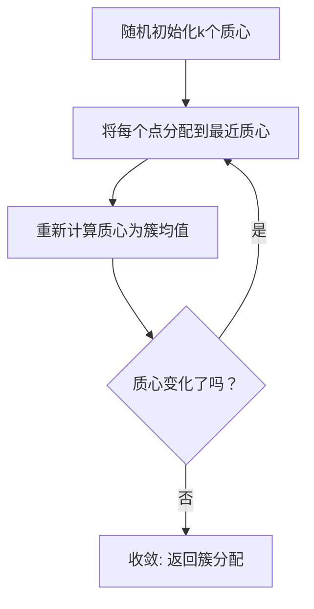

# 无监督学习

> 无监督学习在没有标签的数据中发现隐藏结构，包括聚类和降维。

**类型:** 构建
**语言:** Python
**前置条件:** Phase 2 第1-6课
**时间:** ~90 分钟

## 学习目标

- 从零实现K-Means聚类，并解释初始化和收敛准则
- 使用特征值分解从零实现PCA降维
- 使用肘部法则和轮廓系数选择聚类数量
- 解释何时使用无监督学习与监督学习

## 问题

你有10,000个客户购买历史，但没有标签。你想发现自然分组——高端买家、折扣猎人、偶尔购物者——以便定向营销。没有人告诉你谁属于哪个组。你必须从数据中找到结构。

这是无监督学习。没有标签，没有"正确答案"。算法发现数据中的模式、分组和结构。

## 概念

### 聚类 vs 降维

无监督学习有两个主要分支：

**聚类**：将数据点分组为簇，使同组点相似，不同组点不同。K-Means、层次聚类、DBSCAN。

**降维**：将高维数据压缩到低维，同时保留重要结构。PCA、t-SNE、UMAP。

### K-Means聚类

K-Means将数据分成k个簇，每个簇由其中心（质心）代表。



算法保证收敛，但可能收敛到局部最优。初始化很重要。

**K-Means++初始化**：选择初始质心使其彼此远离：

1. 随机选择第一个质心
2. 对于每个后续质心，选择离已有质心最远的点（按概率）

### 选择k：肘部法则和轮廓系数

**肘部法则**：对k=1到k=10运行K-Means，绘制簇内平方和(WCSS) vs k。"肘部"（WCSS下降速度突然减缓的地方）是好的k值。

**轮廓系数**：对每个点，衡量它与自己簇的相似度vs最近其他簇的相似度。范围[-1, 1]。接近1表示点在正确的簇中。

### 主成分分析(PCA)

PCA找到数据方差最大的方向，将数据投影到这些方向上。


步骤：

1. 标准化数据（零均值，单位方差）
2. 计算协方差矩阵 C = (1/n) _ X^T _ X
3. 计算C的特征值和特征向量
4. 按特征值降序排列特征向量
5. 选择前k个特征向量作为主成分
6. 投影：X_pca = X \* V_k

特征值告诉你每个主成分解释了多少方差。前几个主成分通常捕获大部分信息。

### 其他聚类算法

**DBSCAN**：基于密度的聚类。不需要指定k。找到密集区域，将稀疏区域标记为噪声。可以处理任意形状的簇。

**层次聚类**：构建簇的树状图。可以是自底向上（聚合）或自顶向下（分裂）。不需要预先指定k。

## 动手构建

```python
import random
import math

class KMeans:
    def __init__(self, k=3, max_iters=100, init='kmeans++'):
        self.k = k
        self.max_iters = max_iters
        self.init = init
        self.centroids = None
        self.labels = None

    def _distance(self, x1, x2):
        return math.sqrt(sum((a - b) ** 2 for a, b in zip(x1, x2)))

    def _init_centroids(self, X):
        if self.init == 'random':
            indices = random.sample(range(len(X)), self.k)
            return [X[i][:] for i in indices]
        else:  # kmeans++
            centroids = [random.choice(X)[:]]
            for _ in range(1, self.k):
                distances = []
                for x in X:
                    min_dist = min(self._distance(x, c) for c in centroids)
                    distances.append(min_dist ** 2)
                total = sum(distances)
                probs = [d / total for d in distances]
                r = random.random()
                cumsum = 0
                for i, p in enumerate(probs):
                    cumsum += p
                    if cumsum >= r:
                        centroids.append(X[i][:])
                        break
            return centroids

    def fit(self, X):
        self.centroids = self._init_centroids(X)
        for iteration in range(self.max_iters):
            self.labels = []
            for x in X:
                distances = [self._distance(x, c) for c in self.centroids]
                self.labels.append(distances.index(min(distances)))

            new_centroids = []
            for k in range(self.k):
                cluster_points = [X[i] for i in range(len(X)) if self.labels[i] == k]
                if cluster_points:
                    centroid = [sum(p[j] for p in cluster_points) / len(cluster_points)
                               for j in range(len(X[0]))]
                else:
                    centroid = self.centroids[k]
                new_centroids.append(centroid)

            converged = all(
                self._distance(old, new) < 1e-6
                for old, new in zip(self.centroids, new_centroids)
            )
            self.centroids = new_centroids
            if converged:
                print(f"  Converged at iteration {iteration}")
                break
        return self

    def predict(self, X):
        return [min(range(self.k), key=lambda k: self._distance(x, self.centroids[k])) for x in X]

    def wcss(self, X):
        total = 0
        for i, x in enumerate(X):
            total += self._distance(x, self.centroids[self.labels[i]]) ** 2
        return total

    def silhouette_score(self, X):
        scores = []
        for i in range(len(X)):
            same_cluster = [j for j in range(len(X)) if self.labels[j] == self.labels[i] and j != i]
            if not same_cluster:
                scores.append(0)
                continue
            a = sum(self._distance(X[i], X[j]) for j in same_cluster) / len(same_cluster)
            other_clusters = set(self.labels) - {self.labels[i]}
            b = min(
                sum(self._distance(X[i], X[j]) for j in range(len(X)) if self.labels[j] == c) /
                max(1, sum(1 for j in range(len(X)) if self.labels[j] == c))
                for c in other_clusters
            )
            scores.append((b - a) / max(a, b))
        return sum(scores) / len(scores)


class PCA:
    def __init__(self, n_components=2):
        self.n_components = n_components
        self.components = None
        self.explained_variance_ratio = None
        self.mean = None
        self.std = None

    def fit(self, X):
        n = len(X)
        d = len(X[0])
        self.mean = [sum(X[i][j] for i in range(n)) / n for j in range(d)]
        self.std = []
        for j in range(d):
            var = sum((X[i][j] - self.mean[j]) ** 2 for i in range(n)) / n
            self.std.append(var ** 0.5 if var > 0 else 1)

        X_std = [[(X[i][j] - self.mean[j]) / self.std[j] for j in range(d)] for i in range(n)]

        cov = [[0.0] * d for _ in range(d)]
        for i in range(d):
            for j in range(d):
                cov[i][j] = sum(X_std[k][i] * X_std[k][j] for k in range(n)) / n

        eigenvalues, eigenvectors = self._eigendecomposition(cov)

        idx = sorted(range(len(eigenvalues)), key=lambda i: eigenvalues[i], reverse=True)
        eigenvalues = [eigenvalues[i] for i in idx]
        eigenvectors = [eigenvectors[i] for i in idx]

        self.components = eigenvectors[:self.n_components]
        total_var = sum(eigenvalues)
        self.explained_variance_ratio = [ev / total_var for ev in eigenvalues[:self.n_components]]
        return self

    def _eigendecomposition(self, A):
        n = len(A)
        eigenvalues = [1.0] * n
        eigenvectors = [[1.0 if i == j else 0.0 for j in range(n)] for i in range(n)]

        for _ in range(100):
            Q, R = self._qr_decomposition(A)
            A = self._matmul(R, Q)
            eigenvectors = self._matmul(eigenvectors, Q)

        eigenvalues = [A[i][i] for i in range(n)]
        return eigenvalues, [[eigenvectors[j][i] for j in range(n)] for i in range(n)]

    def _qr_decomposition(self, A):
        n = len(A)
        Q = [[0.0] * n for _ in range(n)]
        R = [[0.0] * n for _ in range(n)]
        cols = [[A[i][j] for i in range(n)] for j in range(n)]

        ortho = []
        for j in range(n):
            v = cols[j][:]
            for u in ortho:
                dot = sum(v[k] * u[k] for k in range(n))
                for k in range(n):
                    v[k] -= dot * u[k]
            norm = math.sqrt(sum(x ** 2 for x in v))
            if norm > 1e-10:
                v = [x / norm for x in v]
            ortho.append(v)

        for i in range(n):
            for j in range(n):
                Q[i][j] = ortho[j][i]
                if j >= i:
                    R[i][j] = sum(A[k][j] * ortho[i][k] for k in range(n))

        return Q, R

    def _matmul(self, A, B):
        n = len(A)
        m = len(B[0])
        p = len(B)
        C = [[0.0] * m for _ in range(n)]
        for i in range(n):
            for j in range(m):
                C[i][j] = sum(A[i][k] * B[k][j] for k in range(p))
        return C

    def transform(self, X):
        X_std = [[(X[i][j] - self.mean[j]) / self.std[j] for j in range(len(X[0]))] for i in range(len(X))]
        result = []
        for x in X_std:
            point = [sum(x[j] * self.components[c][j] for j in range(len(x))) for c in range(self.n_components)]
            result.append(point)
        return result

    def fit_transform(self, X):
        self.fit(X)
        return self.transform(X)


random.seed(42)
N = 300
X = []
true_labels = []
centers = [(0, 0), (5, 5), (-5, 5)]
for label, (cx, cy) in enumerate(centers):
    for _ in range(100):
        X.append([random.gauss(cx, 1.5), random.gauss(cy, 1.5)])
        true_labels.append(label)

print("=== K-Means Clustering ===")
print("\nElbow Method:")
for k in range(1, 8):
    km = KMeans(k=k, max_iters=100)
    km.fit(X)
    print(f"  k={k}: WCSS={km.wcss(X):.2f}")

print("\nSilhouette Scores:")
for k in range(2, 7):
    km = KMeans(k=k, max_iters=100)
    km.fit(X)
    print(f"  k={k}: Silhouette={km.silhouette_score(X):.4f}")

km_best = KMeans(k=3, max_iters=100)
km_best.fit(X)
print(f"\nBest k=3: WCSS={km_best.wcss(X):.2f}")

print("\n=== PCA ===")
pca = PCA(n_components=2)
X_pca = pca.fit_transform(X)
print(f"Explained variance ratio: {pca.explained_variance_ratio}")
print(f"Total variance explained: {sum(pca.explained_variance_ratio):.4f}")
```

## 实际使用

```python
from sklearn.cluster import KMeans as SklearnKMeans
from sklearn.decomposition import PCA as SklearnPCA
from sklearn.preprocessing import StandardScaler
from sklearn.metrics import silhouette_score
from sklearn.datasets import load_iris
import numpy as np

iris = load_iris()
X = StandardScaler().fit_transform(iris.data)

km = SklearnKMeans(n_clusters=3, random_state=42, n_init=10)
labels = km.fit_predict(X)
print(f"K-Means silhouette: {silhouette_score(X, labels):.4f}")

pca = SklearnPCA(n_components=2)
X_pca = pca.fit_transform(X)
print(f"PCA explained variance: {pca.explained_variance_ratio_}")
print(f"Total: {sum(pca.explained_variance_ratio_):.4f}")
```

## 练习

1. 生成非球形簇（如两个同心圆）。K-Means失败。实现DBSCAN并展示它成功。
2. 在64维手写数字数据集上运行PCA。需要多少个主成分才能解释95%的方差？
3. 使用PCA将数据降到2维，然后运行K-Means。与在原始高维空间上运行K-Means比较。

## 关键术语

| 术语     | 人们怎么说   | 实际含义                                       |
| -------- | ------------ | ---------------------------------------------- |
| 聚类     | "分组"       | 将相似数据点分组，使组内相似、组间不同         |
| K-Means  | "k个中心"    | 迭代分配点到最近质心并更新质心的聚类算法       |
| 肘部法则 | "找拐点"     | 绘制WCSS vs k，选择WCSS下降速度减缓处的k值     |
| 轮廓系数 | "簇内vs簇外" | 衡量点与自己簇的相似度vs最近其他簇的相似度     |
| PCA      | "找主方向"   | 找到数据方差最大的方向，将数据投影到这些方向   |
| 降维     | "压缩数据"   | 减少特征数量同时保留重要信息                   |
| DBSCAN   | "密度聚类"   | 基于密度的聚类，不需要指定簇数，能发现任意形状 |
