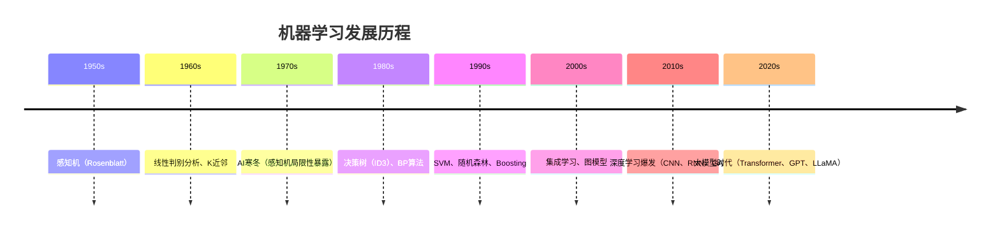

## 1. 机器学习基本概念

机器学习（Machine Learning）是人工智能的核心分支，通过**从数据中自动学习规律**，使计算机无需显式编程即可完成特定任务。

### 1.1 形式化定义

给定训练数据集 $\mathcal{D} = \{(\mathbf{x}_1, y_1), (\mathbf{x}_2, y_2), \ldots, (\mathbf{x}_n, y_n)\}$，机器学习的目标是从假设空间 $\mathcal{H}$ 中寻找最优函数 $h^* \in \mathcal{H}$，使得期望风险最小化：

$$h^* = \arg\min_{h \in \mathcal{H}} \mathbb{E}_{(\mathbf{x}, y) \sim P} [L(h(\mathbf{x}), y)]$$

其中 $L$ 为损失函数，$P$ 为数据分布。由于真实分布未知，我们用**经验风险**近似：

$$h^* \approx \arg\min_{h \in \mathcal{H}} \frac{1}{n} \sum_{i=1}^{n} L(h(\mathbf{x}_i), y_i)$$

### 1.2 核心术语

| 术语               | 符号                  | 说明                                    |
| :----------------- | :-------------------- | :-------------------------------------- |
| 特征（Feature）    | $\mathbf{x}$          | 输入变量，$\mathbf{x} \in \mathbb{R}^d$ |
| 标签（Label）      | $y$                   | 输出变量（监督学习）                    |
| 样本（Sample）     | $(\mathbf{x}_i, y_i)$ | 一条训练数据                            |
| 假设（Hypothesis） | $h(\mathbf{x})$       | 学习到的映射函数                        |
| 损失函数           | $L(\hat{y}, y)$       | 单个预测的误差度量                      |
| 代价函数           | $J(\theta)$           | 所有样本的平均损失                      |
| 参数               | $\theta$              | 模型需要学习的量                        |
| 超参数             | —                     | 需要人为设定的量                        |

## 2. 学习范式分类

### 2.1 监督学习（Supervised Learning）

从**带标签**的数据中学习输入到输出的映射：

$$f: \mathbf{X} \rightarrow Y$$

| 子类型 | 输出类型 | 典型算法              | 应用         |
| :----- | :------- | :-------------------- | :----------- |
| 分类   | 离散值   | SVM、决策树、逻辑回归 | 垃圾邮件识别 |
| 回归   | 连续值   | 线性回归、随机森林    | 房价预测     |

### 2.2 无监督学习（Unsupervised Learning）

从**无标签**的数据中发现隐含结构：

| 子类型   | 目标     | 典型算法        | 应用       |
| :------- | :------- | :-------------- | :--------- |
| 聚类     | 分组     | K-Means、DBSCAN | 客户分群   |
| 降维     | 压缩     | PCA、t-SNE      | 数据可视化 |
| 关联规则 | 发现关系 | Apriori         | 购物篮分析 |
| 生成模型 | 学习分布 | GMM、VAE        | 数据生成   |

### 2.3 半监督学习（Semi-Supervised Learning）

利用少量**有标签**数据和大量**无标签**数据：

```
有标签数据: 100条 (标注成本高)
无标签数据: 10000条 (容易获取)

策略:
  1. 自训练（Self-Training）：用有标签数据训练，预测无标签数据，高置信度加入训练集
  2. 协同训练（Co-Training）：两个分类器互相标注
  3. 图方法：基于数据相似度构建图，标签在图上传播
```

### 2.4 强化学习（Reinforcement Learning）

智能体通过与环境交互获得**奖励**来学习最优策略：

$$\pi^* = \arg\max_{\pi} \mathbb{E}\left[\sum_{t=0}^{\infty} \gamma^t r_t\right]$$

| 要素              | 说明               |
| :---------------- | :----------------- |
| 状态 $s$          | 环境的当前描述     |
| 动作 $a$          | 智能体的行为       |
| 奖励 $r$          | 环境的反馈信号     |
| 策略 $\pi$        | 状态到动作的映射   |
| 折扣因子 $\gamma$ | 未来奖励的衰减系数 |

## 3. 机器学习工作流程

### 3.1 完整流程


### 3.2 数据预处理

| 步骤       | 方法                                         | 说明           |
| :--------- | :------------------------------------------- | :------------- |
| 缺失值处理 | 均值/中位数/众数填充、删除                   | 保证数据完整性 |
| 异常值检测 | 3σ原则、IQR方法                              | 避免极端值干扰 |
| 数据标准化 | Z-Score：$z = \frac{x - \mu}{\sigma}$        | 消除量纲影响   |
| 数据归一化 | Min-Max：$x' = \frac{x - \min}{\max - \min}$ | 映射到[0,1]    |
| 编码       | One-Hot、Label Encoding                      | 处理类别变量   |

### 3.3 数据集划分

$$\text{数据集} = \text{训练集}(60\sim80\%) + \text{验证集}(10\sim20\%) + \text{测试集}(10\sim20\%)$$

- **训练集**：用于模型学习参数
- **验证集**：用于超参数调优和模型选择
- **测试集**：用于最终性能评估（只用一次）

**交叉验证**：K折交叉验证将数据分为K份，轮流作为验证集：

$$\text{CV Score} = \frac{1}{K} \sum_{i=1}^{K} \text{Score}_i$$

## 4. 偏差-方差权衡

### 4.1 误差分解

模型的泛化误差可分解为：

$$\text{泛化误差} = \text{偏差}^2 + \text{方差} + \text{噪声}$$

| 组成             | 定义                     | 说明                         |
| :--------------- | :----------------------- | :--------------------------- |
| 偏差（Bias）     | 预测值与真实值的偏离     | 模型拟合能力不足（欠拟合）   |
| 方差（Variance） | 预测值随训练集变化的波动 | 模型对数据过于敏感（过拟合） |
| 噪声（Noise）    | 数据本身的误差           | 不可约减的误差               |

### 4.2 欠拟合与过拟合

| 问题   | 表现                       | 原因       | 解决方案                 |
| :----- | :------------------------- | :--------- | :----------------------- |
| 欠拟合 | 训练集和测试集误差都高     | 模型太简单 | 增加特征、使用更复杂模型 |
| 过拟合 | 训练集误差低、测试集误差高 | 模型太复杂 | 正则化、增加数据、早停   |

### 4.3 正则化

通过在代价函数中添加惩罚项来限制模型复杂度：

**L1正则化（Lasso）**：

$$J_{L1}(\theta) = J(\theta) + \lambda \sum_{j=1}^{d} |\theta_j|$$

- 产生**稀疏解**，可用于特征选择
- 使部分参数恰好为零

**L2正则化（Ridge）**：

$$J_{L2}(\theta) = J(\theta) + \lambda \sum_{j=1}^{d} \theta_j^2$$

- 使参数趋向**较小的值**
- 防止某个参数过大

**弹性网络（Elastic Net）**：

$$J_{EN}(\theta) = J(\theta) + \lambda_1 \sum |\theta_j| + \lambda_2 \sum \theta_j^2$$

## 5. 机器学习发展历程


