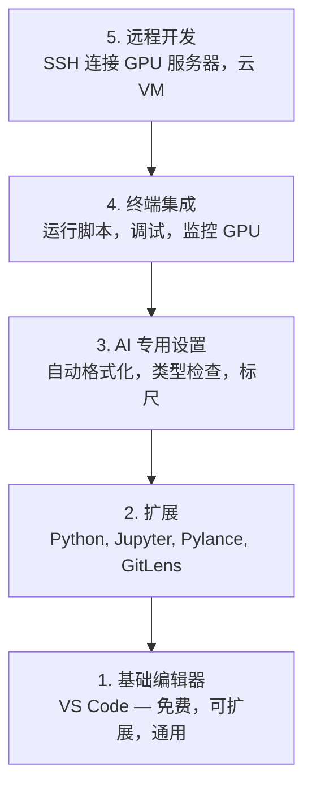

# 编辑器配置

> 你的编辑器是你的副驾驶。配置一次，让它不再碍事，开始发挥作用。

**类型：** 构建
**语言：** --
**前置条件：** 阶段 0，第 01 课
**预计时间：** ~20 分钟

## 学习目标

- 安装 VS Code 及 Python、Jupyter、代码检查和 Remote SSH 等必备扩展
- 配置格式化保存、类型检查和笔记本输出滚动等 AI 工作流设置
- 设置 Remote SSH，像本地一样编辑和调试远程 GPU 机器上的代码
- 评估编辑器替代方案（Cursor、Windsurf、Neovim）及其在 AI 工作中的取舍

## 问题所在

你将在编辑器中度过数千小时，编写 Python、运行笔记本、调试训练循环、SSH 连接到 GPU 服务器。一个配置不当的编辑器会让每次会话都充满摩擦：没有自动补全、没有类型提示、没有内联错误、手动格式化，以及笨拙的终端工作流。

正确的配置只需 20 分钟。跳过它则每天浪费 20 分钟。

## 核心概念

AI 工程编辑器配置需要五样东西：



## 动手构建

### 第 1 步：安装 VS Code

VS Code 是推荐的编辑器。它免费，在所有操作系统上运行，有一流的 Jupyter 笔记本支持，扩展生态覆盖了 AI 工作所需的一切。

从 [code.visualstudio.com](https://code.visualstudio.com/) 下载。

从终端验证：

```bash
code --version
```

如果在 macOS 上找不到 `code`，打开 VS Code，按 `Cmd+Shift+P`，输入 "Shell Command"，选择 "Install 'code' command in PATH"。

### 第 2 步：安装必备扩展

在 VS Code 中打开集成终端（`Ctrl+`` ` 或 `` Cmd+` ``），安装 AI 工作所需的核心扩展：

```bash
code --install-extension ms-python.python
code --install-extension ms-python.vscode-pylance
code --install-extension ms-toolsai.jupyter
code --install-extension eamodio.gitlens
code --install-extension ms-vscode-remote.remote-ssh
code --install-extension ms-python.debugpy
code --install-extension ms-python.black-formatter
code --install-extension charliermarsh.ruff
```

每个扩展的作用：

| 扩展            | 原因                                    |
| --------------- | --------------------------------------- |
| Python          | 语言支持，虚拟环境检测，运行/调试       |
| Pylance         | 快速类型检查，自动补全，导入解析        |
| Jupyter         | 在 VS Code 内运行笔记本，变量浏览器     |
| GitLens         | 查看谁改了什么，内联 git blame          |
| Remote SSH      | 像本地一样打开远程 GPU 服务器上的文件夹 |
| Debugpy         | Python 逐步调试                         |
| Black Formatter | 保存时自动格式化，风格一致              |
| Ruff            | 快速代码检查，捕获常见错误              |

本课程 `code/.vscode/extensions.json` 文件包含完整的推荐列表。当你打开项目文件夹时，VS Code 会提示你安装它们。

### 第 3 步：配置设置

从本课程的 `code/.vscode/settings.json` 复制设置，或通过 `Settings > Open Settings (JSON)` 手动应用。

AI 工作的关键设置：

```jsonc
{
  "python.analysis.typeCheckingMode": "basic",
  "editor.formatOnSave": true,
  "editor.rulers": [88, 120],
  "notebook.output.scrolling": true,
  "files.autoSave": "afterDelay",
}
```

为什么这些很重要：

- **类型检查设为 basic**：在运行前捕获错误的参数类型。节省调试张量形状不匹配和错误 API 参数的时间。
- **保存时格式化**：再也不用考虑格式。Black 帮你处理。
- **88 和 120 标尺**：Black 在 88 处换行。120 标尺显示文档字符串和注释何时太长。
- **笔记本输出滚动**：训练循环打印数千行。没有滚动，输出面板会爆炸。
- **自动保存**：你会忘记保存。你的训练脚本会运行过时的代码。自动保存防止这种情况。

### 第 4 步：终端集成

VS Code 的集成终端是你运行训练脚本、监控 GPU 和管理环境的地方。

正确配置：

```jsonc
{
  "terminal.integrated.defaultProfile.osx": "zsh",
  "terminal.integrated.defaultProfile.linux": "bash",
  "terminal.integrated.fontSize": 13,
  "terminal.integrated.scrollback": 10000,
}
```

常用快捷键：

| 操作     | macOS            | Linux/Windows    |
| -------- | ---------------- | ---------------- |
| 切换终端 | `` Ctrl+` ``     | `` Ctrl+` ``     |
| 新终端   | `Ctrl+Shift+`` ` | `Ctrl+Shift+`` ` |
| 分割终端 | `Cmd+\`          | `Ctrl+\`         |

分割终端很有用：一个运行脚本，一个用 `nvidia-smi -l 1` 或 `watch -n 1 nvidia-smi` 监控 GPU。

### 第 5 步：远程开发（SSH 连接 GPU 服务器）

这是 AI 工作中最重要的扩展。你将在远程机器上运行训练（云 VM、实验室服务器、Lambda、Vast.ai）。Remote SSH 让你打开远程文件系统、编辑文件、运行终端和调试，就像一切都在本地一样。

设置：

1. 安装 Remote SSH 扩展（已在第 2 步完成）。
2. 按 `Ctrl+Shift+P`（或 `Cmd+Shift+P`），输入 "Remote-SSH: Connect to Host"。
3. 输入 `user@your-gpu-box-ip`。
4. VS Code 自动在远程机器上安装其服务器组件。

设置免密访问，配置 SSH 密钥：

```bash
ssh-keygen -t ed25519 -C "your-email@example.com"
ssh-copy-id user@your-gpu-box-ip
```

将主机添加到 `~/.ssh/config` 以方便使用：

```
Host gpu-box
    HostName 203.0.113.50
    User ubuntu
    IdentityFile ~/.ssh/id_ed25519
    ForwardAgent yes
```

现在 `Remote-SSH: Connect to Host > gpu-box` 即可立即连接。

## 替代方案

### Cursor

[cursor.com](https://cursor.com) 是一个内置 AI 代码生成的 VS Code 分支。它使用相同的扩展生态和设置格式。如果你使用 Cursor，本课程的所有内容仍然适用。导入相同的 `settings.json` 和 `extensions.json`。

### Windsurf

[windsurf.com](https://windsurf.com) 是另一个 AI 优先的 VS Code 分支。同样的情况：相同的扩展，相同的设置格式，相同的 Remote SSH 支持。

### Vim/Neovim

如果你已经在使用 Vim 或 Neovim 并且很高效，继续使用。AI Python 工作的最低配置：

- **pyright** 或 **pylsp** 用于类型检查（通过 Mason 或手动安装）
- **nvim-lspconfig** 用于语言服务器集成
- **jupyter-vim** 或 **molten-nvim** 用于类笔记本执行
- **telescope.nvim** 用于文件/符号搜索
- **none-ls.nvim** 配合 black 和 ruff 用于格式化/代码检查

如果你还没有使用 Vim，现在不要开始。学习曲线会与学习 AI 工程竞争。使用 VS Code。

## 实际应用

有了这个配置，你的日常工作流是：

1. 在 VS Code 中打开项目文件夹（或通过 Remote SSH 连接到 GPU 服务器）。
2. 在编辑器中编写 Python，享受自动补全、类型提示和内联错误。
3. 使用 Jupyter 扩展内联运行笔记本。
4. 使用集成终端运行训练脚本、`uv pip install` 和 GPU 监控。
5. 提交前用 GitLens 审查变更。

## 练习

1. 安装 VS Code 和第 2 步中列出的所有扩展
2. 将本课程的 `settings.json` 复制到你的 VS Code 配置中
3. 打开一个 Python 文件，验证 Pylance 显示类型提示，Black 保存时格式化
4. 如果你有远程机器的访问权限，设置 Remote SSH 并在远程打开一个文件夹

## 关键术语

| 术语           | 通俗说法         | 实际含义                                                                       |
| -------------- | ---------------- | ------------------------------------------------------------------------------ |
| LSP            | "自动补全引擎"   | Language Server Protocol：编辑器从语言特定服务器获取类型信息、补全和诊断的标准 |
| Pylance        | "Python 插件"    | 微软的 Python 语言服务器，使用 Pyright 进行类型检查和 IntelliSense             |
| Remote SSH     | "在服务器上工作" | VS Code 扩展，在远程机器上运行轻量级服务器并将 UI 流式传输到本地编辑器         |
| Format on save | "自动美化"       | 编辑器在每次保存时运行格式化工具（Black, Ruff），使代码风格始终一致            |
