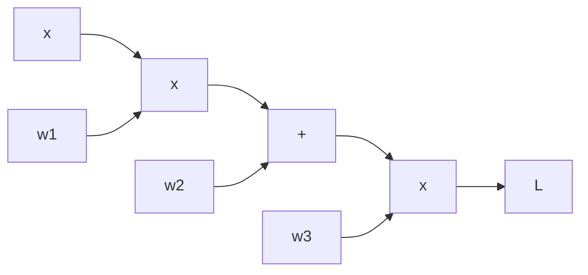

# 链式法则与自动微分

> 反向传播不是魔法。它是链式法则，系统地应用于计算图。

**类型：** 构建
**语言：** Python
**前置条件：** 阶段 1，第 04 课（机器学习微积分）
**预计时间：** ~120 分钟

## 学习目标

- 使用链式法则手动计算复合函数的梯度
- 构建计算图并执行前向传播和反向传播
- 实现 `Value` 类，支持自动微分（micrograd 风格）
- 使用 `Value` 类从零构建并训练 MLP

## 问题所在

PyTorch 的 `loss.backward()` 是怎么工作的？它不是查表。它不是符号推导。它是自动微分：系统地将链式法则应用于计算图。

如果你不理解自动微分，你就无法：

- 调试梯度问题（梯度消失/爆炸）
- 实现自定义操作
- 理解为什么某些操作很贵而其他操作很便宜
- 阅读优化器源代码

本课程从零构建自动微分引擎。到最后，你将理解 `loss.backward()` 的每一步。

## 核心概念

### 链式法则回顾

如果 `L = f(g(h(x)))`，则：

```
dL/dx = dL/df * df/dg * dg/dh * dh/dx
```

从输出到输入，逐层乘以局部导数。这就是反向传播。

### 计算图

计算图将计算表示为有向无环图（DAG）。节点是操作，边是数据流。



前向传播：从左到右，计算每个节点的值。
反向传播：从右到左，使用链式法则计算每个节点的梯度。

### 前向模式 vs 反向模式

| 模式     | 方向      | 每次传播计算       | 适用于                     |
| -------- | --------- | ------------------ | -------------------------- |
| 前向模式 | 输入→输出 | 一个输入的梯度     | 输入少、输出多             |
| 反向模式 | 输出→输入 | 一个输出的所有梯度 | 输出少、输入多（神经网络） |

神经网络有数百万参数（输入）和单个损失值（输出）。反向模式只需要一次传播就能计算所有梯度。这就是为什么深度学习使用反向传播。

## 动手构建

### Value 类（micrograd）

```python
class Value:
    """支持自动微分的标量值"""

    def __init__(self, data, _children=(), _op=""):
        self.data = data
        self.grad = 0.0
        self._backward = lambda: None
        self._prev = set(_children)
        self._op = _op

    def __add__(self, other):
        other = other if isinstance(other, Value) else Value(other)
        out = Value(self.data + other.data, (self, other), "+")

        def _backward():
            self.grad += out.grad
            other.grad += out.grad
        out._backward = _backward
        return out

    def __mul__(self, other):
        other = other if isinstance(other, Value) else Value(other)
        out = Value(self.data * other.data, (self, other), "*")

        def _backward():
            self.grad += other.data * out.grad
            other.grad += self.data * out.grad
        out._backward = _backward
        return out

    def __pow__(self, other):
        assert isinstance(other, (int, float))
        out = Value(self.data ** other, (self,), f"**{other}")

        def _backward():
            self.grad += other * (self.data ** (other - 1)) * out.grad
        out._backward = _backward
        return out

    def relu(self):
        out = Value(max(0, self.data), (self,), "ReLU")

        def _backward():
            self.grad += (out.data > 0) * out.grad
        out._backward = _backward
        return out

    def backward(self):
        """反向传播：计算所有节点的梯度"""
        topo = []
        visited = set()

        def build_topo(v):
            if v not in visited:
                visited.add(v)
                for child in v._prev:
                    build_topo(child)
                topo.append(v)
        build_topo(self)

        self.grad = 1.0
        for v in reversed(topo):
            v._backward()

    def __neg__(self):
        return self * (-1)

    def __sub__(self, other):
        return self + (-other)

    def __repr__(self):
        return f"Value(data={self.data}, grad={self.grad})"
```

### 使用 Value 类

```python
# 前向传播
x = Value(2.0)
w = Value(3.0)
b = Value(1.0)

y = w * x + b  # y = 3*2 + 1 = 7
y.backward()

print(f"y = {y.data}")       # 7.0
print(f"dy/dw = {w.grad}")   # 2.0 (x 的值)
print(f"dy/dx = {x.grad}")   # 3.0 (w 的值)
print(f"dy/db = {b.grad}")   # 1.0
```

### 从零构建 MLP

```python
class Neuron:
    def __init__(self, nin):
        self.w = [Value(np.random.randn()) for _ in range(nin)]
        self.b = Value(np.random.randn())

    def __call__(self, x):
        act = sum((wi * xi for wi, xi in zip(self.w, x)), self.b)
        return act.relu()

class Layer:
    def __init__(self, nin, nout):
        self.neurons = [Neuron(nin) for _ in range(nout)]

    def __call__(self, x):
        return [n(x) for n in self.neurons]

class MLP:
    def __init__(self, nin, nouts):
        sz = [nin] + nouts
        self.layers = [Layer(sz[i], sz[i+1]) for i in range(len(nouts))]

    def __call__(self, x):
        for layer in self.layers:
            x = layer(x)
        return x[0] if len(x) == 1 else x

# 创建并训练
model = MLP(2, [4, 4, 1])

# 训练数据
xs = [[Value(0), Value(0)], [Value(0), Value(1)],
      [Value(1), Value(0)], [Value(1), Value(1)]]
ys = [Value(0), Value(1), Value(1), Value(0)]  # XOR

for epoch in range(100):
    # 前向传播
    losses = [(model(x) - y) ** 2 for x, y in zip(xs, ys)]
    total_loss = sum(losses[1:], losses[0])

    # 反向传播
    total_loss.backward()

    # 更新参数
    lr = 0.1
    for p in model.parameters():
        p.data -= lr * p.grad
        p.grad = 0.0

    if epoch % 20 == 0:
        print(f"Epoch {epoch}: loss = {total_loss.data:.4f}")
```

## 实际应用

| 概念        | AI 中的位置                       |
| ----------- | --------------------------------- |
| 链式法则    | 每一次反向传播                    |
| 计算图      | PyTorch/TensorFlow 的核心抽象     |
| 反向模式 AD | `loss.backward()`                 |
| 拓扑排序    | 确保梯度按正确顺序计算            |
| 梯度累积    | `_backward` 中的 `+=`（不是 `=`） |

## 练习

1. 用 Value 类计算 `f(x) = x^3 + 2x^2 - 5x + 1` 在 x=2 处的梯度，与解析解对比
2. 在 Value 类中添加 `tanh` 和 `sigmoid` 操作
3. 用 MLP 学习 AND 门和 OR 门，观察与 XOR 的难度差异
4. 修改 MLP 使用 sigmoid 而不是 ReLU，观察训练行为的变化
