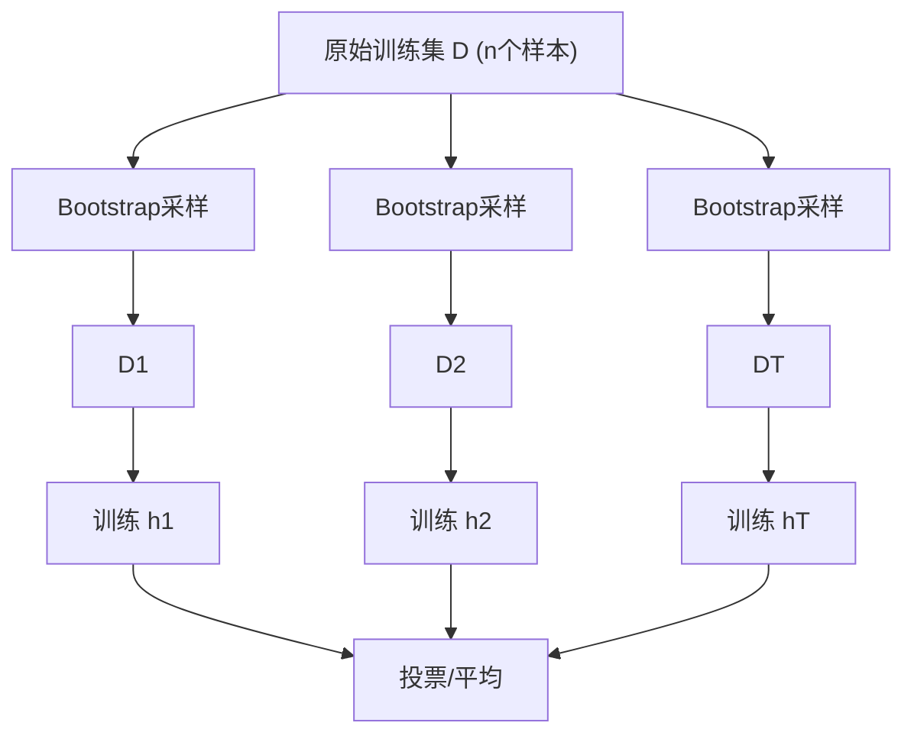

## 1. 集成学习原理

集成学习通过**组合多个基学习器**来获得比单一学习器更好的性能。

### 1.1 核心思想

$$\text{强学习器} = \text{组合}(\text{多个弱学习器})$$

**理论保证**：如果每个弱学习器的准确率略高于随机猜测（$\epsilon < 0.5$），则随着弱学习器数量增加，集成的错误率指数下降：

$$P(\text{error}) \leq \exp\left(-\frac{2T\gamma^2}{1}\right)$$

其中 $\gamma = 0.5 - \epsilon$ 为优势度，$T$ 为基学习器数量。

### 1.2 多样性来源

| 来源     | 方法          | 代表算法      |
| :------- | :------------ | :------------ |
| 数据扰动 | Bootstrap采样 | Bagging       |
| 特征扰动 | 随机特征子集  | Random Forest |
| 算法扰动 | 不同算法/参数 | 异质集成      |
| 标签扰动 | 样本权重调整  | Boosting      |

## 2. Bagging与随机森林

### 2.1 Bagging

**Bootstrap Aggregating**：通过有放回采样生成多个子训练集，分别训练基学习器，最后投票/平均。



**采样比例**：每个Bootstrap样本约包含 $63.2\%$ 的原始样本：

$$P(\text{样本被选中}) = 1 - \left(1 - \frac{1}{n}\right)^n \xrightarrow{n \to \infty} 1 - e^{-1} \approx 0.632$$

**Out-of-Bag（OOB）估计**：未被采样的 $36.8\%$ 样本可作为验证集，无需额外划分。

### 2.2 随机森林

在Bagging基础上增加**特征随机性**：

| 参数                | 说明                 | 典型值                            |
| :------------------ | :------------------- | :-------------------------------- |
| `n_estimators`      | 树的数量             | 100~500                           |
| `max_features`      | 每次分裂考虑的特征数 | $\sqrt{d}$（分类）/ $d/3$（回归） |
| `max_depth`         | 树的最大深度         | 不限制或较大值                    |
| `min_samples_split` | 分裂最小样本数       | 2~10                              |

**特征重要性**：

$$\text{Importance}(j) = \frac{1}{T}\sum_{t=1}^{T} \sum_{\text{node using } j} \Delta \text{Gini}(j)$$

## 3. Boosting框架

### 3.1 Boosting原理

Boosting 通过**序列训练**基学习器，每个新学习器重点关注前一轮的错误样本：

```
h1 → 评估 → 更新样本权重 → h2 → 评估 → 更新样本权重 → h3 → ... → 组合
```

### 3.2 AdaBoost

**指数损失函数**：

$$L(y, f(\mathbf{x})) = \exp(-y f(\mathbf{x}))$$

**算法流程**：

1. 初始化样本权重 $w_i^{(1)} = 1/n$
2. 对于 $t = 1, 2, \ldots, T$：
   - 用权重 $w^{(t)}$ 训练弱学习器 $h_t$
   - 计算加权错误率：$\epsilon_t = \sum_{i} w_i^{(t)} I(h_t(\mathbf{x}_i) \neq y_i)$
   - 计算学习器权重：$\alpha_t = \frac{1}{2}\ln\frac{1-\epsilon_t}{\epsilon_t}$
   - 更新样本权重：$w_i^{(t+1)} = w_i^{(t)} \exp(-\alpha_t y_i h_t(\mathbf{x}_i))$
   - 归一化权重

**最终预测**：

$$H(\mathbf{x}) = \text{sign}\left(\sum_{t=1}^{T} \alpha_t h_t(\mathbf{x})\right)$$

### 3.3 GBDT

**梯度提升决策树**：用负梯度近似残差，每棵树拟合当前模型的负梯度：

$$r_{ti} = -\frac{\partial L(y_i, f(\mathbf{x}_i))}{\partial f(\mathbf{x}_i)}\bigg|_{f=f_{t-1}}$$

**回归（MSE损失）**：负梯度恰好等于残差 $r_{ti} = y_i - f_{t-1}(\mathbf{x}_i)$

**学习率收缩**：

$$f_t(\mathbf{x}) = f_{t-1}(\mathbf{x}) + \nu \cdot h_t(\mathbf{x})$$

$\nu \in (0, 1]$ 为学习率，通常取 $0.01 \sim 0.3$。

## 4. XGBoost

### 4.1 目标函数

XGBoost 在损失函数中加入**正则化项**：

$$\text{Obj}^{(t)} = \sum_{i=1}^{n} L(y_i, \hat{y}_i^{(t-1)} + f_t(\mathbf{x}_i)) + \Omega(f_t)$$

正则化项：

$$\Omega(f) = \gamma T + \frac{1}{2}\lambda \|\mathbf{w}\|^2$$

其中 $T$ 为叶节点数，$\mathbf{w}$ 为叶节点权重。

### 4.2 二阶泰勒展开

$$\text{Obj}^{(t)} \approx \sum_{i=1}^{n} \left[g_i f_t(\mathbf{x}_i) + \frac{1}{2}h_i f_t^2(\mathbf{x}_i)\right] + \Omega(f_t)$$

其中：

$$g_i = \partial_{\hat{y}^{(t-1)}} L(y_i, \hat{y}^{(t-1)}), \quad h_i = \partial^2_{\hat{y}^{(t-1)}} L(y_i, \hat{y}^{(t-1)})$$

### 4.3 最优分裂

叶节点最优权重：

$$w_j^* = -\frac{G_j}{H_j + \lambda}$$

分裂增益：

$$\text{Gain} = \frac{1}{2}\left[\frac{G_L^2}{H_L + \lambda} + \frac{G_R^2}{H_R + \lambda} - \frac{(G_L+G_R)^2}{H_L+H_R+\lambda}\right] - \gamma$$

### 4.4 XGBoost特性

| 特性     | 说明                  |
| :------- | :-------------------- |
| 二阶优化 | 利用二阶导数更精确    |
| 正则化   | L1+L2正则化防止过拟合 |
| 列采样   | 类似RF的特征随机      |
| 稀疏感知 | 自动处理缺失值        |
| 并行化   | 特征粒度并行          |
| 缓存优化 | 缓存感知访问模式      |

## 5. LightGBM

### 5.1 核心创新

**GOSS（Gradient-based One-Side Sampling）**：

- 保留大梯度样本（对学习贡献大）
- 随机丢弃小梯度样本
- 对小梯度样本乘以放大系数 $\frac{1-a}{b}$

$$\text{方差增益} = \frac{1}{n}\left(\frac{(\sum_{x_i \in A_l} g_i + \frac{1-a}{b}\sum_{x_i \in B_l} g_i)^2}{n_l^A + \frac{1-a}{b}n_l^B}\right)$$

**EFB（Exclusive Feature Bundling）**：

- 将互斥特征（很少同时非零）捆绑为一个特征
- 减少特征数量，加速训练

### 5.2 Leaf-wise vs Level-wise

| 策略                 | 说明               | 优点       | 缺点               |
| :------------------- | :----------------- | :--------- | :----------------- |
| Level-wise (XGBoost) | 层级生长           | 不易过拟合 | 低效（不必要分裂） |
| Leaf-wise (LightGBM) | 叶节点最大增益优先 | 更高效     | 可能过拟合         |

### 5.3 三大框架对比

| 维度       | XGBoost    | LightGBM  | CatBoost   |
| :--------- | :--------- | :-------- | :--------- |
| 树生长策略 | Level-wise | Leaf-wise | Level-wise |
| 特征直方图 | 支持       | 默认      | 支持       |
| 类别特征   | 需编码     | 原生支持  | 原生支持   |
| 缺失值处理 | 自动       | 自动      | 自动       |
| 训练速度   | 中         | 快        | 慢         |
| 内存占用   | 高         | 低        | 中         |
| 过拟合风险 | 中         | 较高      | 低         |
| 适用场景   | 通用       | 大数据    | 类别特征多 |
