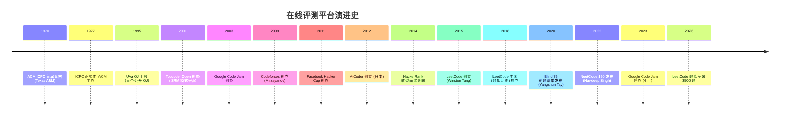
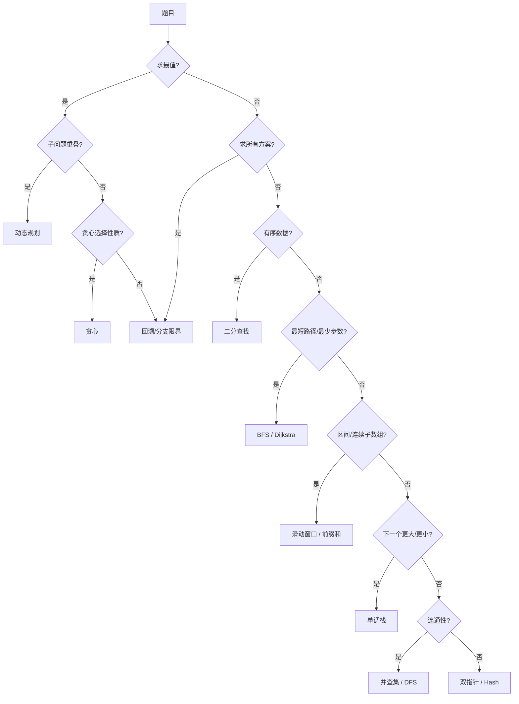

## 1. 概述与学习目标

### 1.1 什么是 LeetCode 刷题

**LeetCode 刷题**（LeetCode Grinding）指在 LeetCode 在线评测系统（Online Judge, OJ）上系统性地反复解答算法题目，以训练算法思维、备战技术面试或参与算法竞赛的学习实践。该实践脱胎于 1970 年代 ACM ICPC 校园竞赛文化，在 2015 年 LeetCode 平台创立后逐渐成为全球软件工程师面试准备的事实标准（de facto standard）。

刷题活动包含三层递进目标：

| 层级 | 目标 | 对应 Bloom 层级 | 典型题目量 |
| ---- | ---- | --------------- | ---------- |
| L1 入门 | 熟悉数据结构与算法基础概念 | Remember / Understand | 50-100 题 |
| L2 进阶 | 掌握解题模式、形成条件反射 | Apply / Analyze | 200-400 题 |
| L3 精通 | 一题多解、复杂问题建模、跨题型迁移 | Evaluate / Create | 500+ 题 |

刷题并非简单"题海战术"。MIT 6.006《Introduction to Algorithms》课程负责人 Srini Devadas 在 2020 年公开课中强调："Algorithms are not memorized—they are derived."（算法不是被记忆的，而是被推导的）。同样，刷题的核心价值在于通过反复训练建立"问题—算法"的条件反射（pattern matching），而非死记题解。

### 1.2 刷题的工程与学术双重价值

刷题活动同时具备学术训练与工程准备双重价值：

```
LeetCode 刷题价值模型
                                刷题训练
                                    │
            ┌───────────────────────┼───────────────────────┐
            │                       │                       │
        学术训练                  工程准备                  竞赛训练
            │                       │                       │
   ┌────────┴────────┐      ┌───────┴───────┐        ┌──────┴──────┐
  形式化建模         复杂度   面试编码       工程映射   ICPC/Codeforces
  不变式证明         分析     白板沟通       系统设计   周赛/双周赛
  算法范式迁移       摊还     边界处理       性能调优   AtCoder ABC/ARC
```

**学术训练维度**：

- **形式化建模**：将自然语言描述的问题转化为数学结构（图、树、序列、集合）
- **复杂度分析**：量化算法的时间、空间、摊还代价
- **不变式证明**：用循环不变式（loop invariant）证明算法正确性
- **算法范式迁移**：识别分治、贪心、DP、回溯、分支限界的适用场景

**工程准备维度**：

- **面试编码**：在 30-45 分钟内完成白板或在线编码
- **边界处理**：空输入、单元素、极大输入、负数、溢出
- **性能调优**：从暴力解到最优解的逐步优化
- **工程映射**：LRU Cache → Redis、并查集 → K8s 网络、滑动窗口 → Prometheus

### 1.3 学习目标

完成本章学习后，读者应能够：

1. **记忆**（Remember）：LeetCode 平台发展脉络、十大题型分类、三遍刷题法与四步解题法的步骤
2. **理解**（Understand）：算法竞赛平台演进史（ACM ICPC 1970 → Google Code Jam 2003 → Codeforces 2009 → LeetCode 2015）、Hot 100/Top Interview 150/Grind 75/NeetCode 150 四大刷题清单的设计动机
3. **应用**（Apply）：使用时间复杂度反推规则从 $n$ 的范围选择可行算法类别，使用八大解题模板（双指针、滑动窗口、二分、回溯、BFS/DFS、单调栈、前缀和、位运算）编写 Python/C++/Java 三语言代码
4. **分析**（Analyze）：各解题模板的复杂度、正确性不变式、适用场景，掌握"暴力→记忆化→DP→状态压缩→位运算"的优化链路
5. **评估**（Evaluate）：LeetCode/LintCode/HackerRank/CodeSignal/牛客网五大面试平台与 Codeforces/AtCoder/Topcoder 三大竞赛平台的优劣与适用场景
6. **对比**（Compare）：FAANG（Google/Meta/Amazon/Microsoft/Apple）与国内大厂（字节跳动/腾讯/阿里巴巴/百度/美团）的面试风格、考察重点、评分标准
7. **创造**（Create）：设计 LeetCode 题目到工业场景的映射方案，构建个人刷题追踪系统、算法学习路径推荐引擎

> 跨模块引用：刷题所需的算法理论基础知识参见 [算法分析基础与学习路线](algorithm/overview)，递归与回溯的深入讨论参见 [递归与回溯](algorithm/recursion-backtracking)。

---

## 2. 历史动机与演进

### 2.1 算法竞赛的起源：ACM ICPC（1970）

**国际大学生程序设计竞赛**（International Collegiate Programming Contest, ICPC）是算法竞赛的鼻祖，其历史可追溯至 1970 年德克萨斯 A&M 大学举办的首届竞赛（当时称 ACM-TCSCC Programming Contest）。1977 年该竞赛正式由 ACM 主办并更名为 ICPC，逐步发展为全球最大规模的大学生程序设计竞赛。

ICPC 的核心特征：

- **团队赛制**：每队 3 人共用 1 台电脑，5 小时内求解 10-15 道算法题
- **多层级晋级**：Local Contest → Regional Contest → World Finals
- **即时反馈**：提交后系统立即返回 Accepted / Wrong Answer / Time Limit Exceeded 等结果
- **气球文化**：每解出一题，志愿者会在该队桌上升起对应颜色的气球，作为可视化进度

ICPC 培养了大批顶尖算法工程师与计算机科学家，包括：

- **Gennady Korotkevich（tourist）**：6 次 ICPC 世界冠军（2013-2019），Codeforces 评分长期第一
- **Makoto Soejima（wata）**：日本 ICPC 传奇，多次世界决赛
- **Bugra Kilic（learner）**：土耳其裔美国选手，Facebook Hacker Cup 2014-2017 冠军

ICPC 的"实时评测+排名"模式直接催生了在线评测系统（OJ）的概念。1995 年西班牙 Valladolid 大学（UVa）上线了全球首个面向公众的 OJ，由 Miguel A. Revilla 维护，收录 3000+ 经典题目，至今仍是 ICPC 训练的核心平台。

### 2.2 Google Code Jam（2003-2023）

**Google Code Jam** 是 Google 主办的年度算法编程竞赛，2003 年首次举办，2023 年 4 月 Google 宣布停办，共举办 21 届。

Google Code Jam 的历史里程碑：

| 年份 | 里程碑 |
| ---- | ---- |
| 2003 | 首届 Google Code Jam，奖金 $10,000，吸引 1.1 万人参与 |
| 2008 | 引入 Round 1/2/3 多轮晋级赛制 |
| 2015 | 改为 Online Round + World Finals 模式 |
| 2019 | 总参赛人数突破 60,000 人 |
| 2020-2022 | 因 COVID-19 转为纯线上举办 |
| 2023 | 4 月宣布永久停办，最后一届 World Finals 在 Toronto 举办 |

Google Code Jam 的特点：

- **个人赛**：与 ICPC 团队赛不同，Code Jam 为个人赛
- **多轮晋级**：Qualification Round → Round 1 (A/B/C) → Round 2 → Round 3 → World Finals
- **交互式题目**：部分题目需下载输入文件、本地计算后上传输出
- **高奖金**：World Finals 冠军奖金 $15,000，总奖金池 $105,000

Code Jam 培养了多位传奇选手：

- **Gennady Korotkevich（tourist）**：6 次 Code Jam 冠军（2014, 2016-2020），史上最多
- **Yuhao Li（bmerry）**：中国选手，2008 年 Code Jam 亚军
- **Ling Zhong（zhongzhu）**：中国选手，多次进入 World Finals

Code Jam 的停办标志着算法竞赛黄金时代的一个转折点。Google 在停办声明中表示将精力转向其他形式的技术人才培养，但未明确替代方案。社区普遍认为这与 Google 裁员潮、AI 编程工具兴起有关。

### 2.3 Topcoder Open（2001）

**Topcoder Open（TCO）** 由 Topcoder 公司于 2001 年创办，是早期最具影响力的商业算法竞赛之一。Topcoder 公司由 Jack Hughes 1999 年创立，最初定位为"通过竞赛众包软件开发"的平台。

Topcoder 的核心创新：

- **SRM（Single Round Match）**：每周多次的 75 分钟在线算法竞赛
- **Rating 系统**：借鉴国际象棋 Elo 评分，红黄蓝绿四色段位
- **题目质量**：以题目设计精巧著称，Topcoder problem setters 通常是顶级选手
- **金钱奖励**：SRM 前几名有现金奖励，年度 TCO 总决赛奖金 $20,000+

Topcoder 培养了：

- **tomek**：Tomasz Czajka，3 次 TCO 冠军（2003, 2005, 2008）
- **Petr**：Petr Mitrichev，俄罗斯传奇，Google 工程师
- **ACRush**：楼天城，中国第一代竞赛选手代表，Facebook/Google 工程师

2010 年代后，随着 Codeforces 的崛起，Topcoder SRM 的参与度逐渐下降。2017 年 Topcoder 被收购后业务重心转向企业众包，SRM 频率从每周 1-2 次降至每月 1-2 次。但其 Rating 系统设计被 Codeforces、AtCoder 等后续平台广泛借鉴。

### 2.4 Meta Hacker Cup（2011-）

**Meta Hacker Cup**（原名 Facebook Hacker Cup）是 Meta 主办的年度算法竞赛，2011 年首次举办。

Hacker Cup 的特点：

- **年度单次赛事**：每年 1 届，Qualification → Round 1/2/3 → Finals
- **线下决赛**：World Finals 通常在 Meta 总部（Menlo Park）举办
- **高额奖金**：冠军 $20,000，总奖金池超过 Google Code Jam
- **题目风格**：偏向数学与组合博弈，与 Code Jam 风格互补

著名冠军：

- **Gennady Korotkevich（tourist）**：2014-2017 四连冠
- **Bin Jin（binjin）**：中国选手，2012 年亚军
- **Egor Kulikov（Egor）**：俄罗斯选手，2013 年冠军

Hacker Cup 至今仍在举办，是少数延续的全球性算法竞赛之一。

### 2.5 Codeforces（2009）

**Codeforces** 由莫斯科理工大学教授 Mikhail Mirzayanov 于 2009 年创立，是当今全球最活跃的算法竞赛平台。

Codeforces 的关键创新：

- **高频比赛**：每周 2-4 场 Rated Contest，远超 Topcoder
- **评分系统**：基于 Elo 改进，引入 volatility（波动率）参数
- **题目分级**：A-H 难度递增，A 题适合入门，H 题接近 ICPC World Finals 水平
- **Div 1/2/3/4 分组**：根据 Rating 自动分流，新手不会被高难度题目打击
- **Educational Rounds**：每月 1-2 场教学赛，题目按知识点分类
- **Gym**：可上传 ICPC 历史题目进行团队训练

Codeforces 评分系统是算法竞赛界的"事实标准"：

| 段位 | Rating 区间 | 占比 |
| ---- | ---------- | ---- |
| Newbie | < 1200 | 约 35% |
| Pupil | 1200-1399 | 约 25% |
| Specialist | 1400-1599 | 约 15% |
| Expert | 1600-1899 | 约 12% |
| Candidate Master | 1900-2099 | 约 7% |
| Master | 2100-2299 | 约 3% |
| International Master | 2300-2399 | 约 1.5% |
| Grandmaster | 2400-2599 | 约 1% |
| International Grandmaster | 2600-2999 | 约 0.3% |
| Legendary Grandmaster | 3000+ | 约 20 人 |

著名 Legendary Grandmaster 包括：tourist、Petr、Benq、Um_nik、neal、Radewoosh、jiangly 等。其中 tourist 长期保持 Rating 第一（约 3800-4000），被视为"算法竞赛之神"。

Codeforces 培养了大量人才进入 FAANG：Google、Meta、Jane Street、 Hudson River Trading 等量化交易公司常年赞助 Codeforces，并直接从 Grandmaster+ 段位招聘。

### 2.6 AtCoder（2012）

**AtCoder** 由日本 AtCoder 公司（CEO Takuya Akatsu）于 2012 年创立，是亚洲第二大算法竞赛平台。

AtCoder 的特点：

- **ABC/ARC/AGC 三档赛事**：
  - **ABC（AtCoder Beginner Contest）**：每周日举办，A-F 六题，A-C 适合新手
  - **ARC（AtCoder Regular Contest）**：每月 1-2 次，难度介于 ABC 与 AGC 之间
  - **AGC（AtCoder Grand Contest）**：每年 4-6 次，最高难度，H 题接近 ICPC World Finals 水平
- **题目质量**：以题目设计精巧、数学味浓郁著称
- **日本风格**：题目描述简洁、测试数据严谨、评测稳定
- **AtCoder Library（ACL）**：官方提供的 C++ 算法库，含并查集、线段树、卷积等

AtCoder 评分系统：

| 段位 | Rating 区间 | 颜色 |
| ---- | ---------- | ---- |
| Gray | 0-399 | 灰 |
| Brown | 400-799 | 棕 |
| Green | 800-1199 | 绿 |
| Cyan | 1200-1599 | 青 |
| Blue | 1600-1999 | 蓝 |
| Yellow | 2000-2399 | 黄 |
| Orange | 2400-2799 | 橙 |
| Red | 2800+ | 红 |

AtCoder Red 段位选手约 100 人，含 tourist、benq、yosupo、nolez 等顶级选手。

### 2.7 LeetCode 的诞生（2015）

**LeetCode** 由 Winston Tang（唐炜森）2015 年在美国创立。Winston Tang 毕业于复旦大学计算机系，后赴美工作，曾在 Google、Uber 等公司任职。创立 LeetCode 的初衷源于其自身的面试准备经历：

> "在准备 FAANG 面试时，我发现当时的在线评测平台（HackerRank、CodeWars）要么偏向竞赛风格、要么偏向语法练习，缺乏专门针对面试的题目集。LeetCode 的目标是覆盖面试高频考点，提供接近真实面试的题目与评测体验。" —— Winston Tang（2017 年采访）

LeetCode 的关键设计决策：

| 决策 | 动机 | 影响 |
| ---- | ---- | ---- |
| 题目按面试频率排序 | 帮助求职者优先准备高频题 | 形成 "Hot 100" 等清单文化 |
| 多语言支持 | 适应不同语言背景的求职者 | 支持 Python/Java/C++/Go/Rust/JS 等 14 种语言 |
| 题解社区 | 通过 UGC 积累题解 | 每题平均 50+ 题解，覆盖多种解法 |
| 周赛/双周赛 | 提供竞技训练 | 形成 Rating 系统，吸引竞赛选手 |
| 公司标签 | 按公司分类题目 | 求职者可针对性准备 |

### 2.8 LeetCode 中国扩展（2018）

2018 年 4 月，**领扣网络（上海）有限公司**成立，标志着 LeetCode 正式进入中国市场。LeetCode China（leetcode.cn）作为独立运营的本地化平台，提供：

- 中文题目描述（部分题目）
- 中国大厂面试高频题专项（字节跳动、腾讯、阿里巴巴、百度、美团等公司标签）
- 剑指 Offer 题集（与何海涛《剑指 Offer》一书同步）
- 程序员面试金典题集（与 Gayle McDowell《CTCI》同步）
- 中文社区与题解
- 春招/秋招专项活动

LeetCode China 的本地化策略有效推动了中国开发者刷题文化的兴起。截至 2026 年，LeetCode China 注册用户超过 800 万，月活超过 100 万，成为中文开发者面试准备的首选平台。

### 2.9 在线评测平台演进时间线



### 2.10 刷题文化的兴起

刷题文化的兴起与以下因素密切相关：

**1. FAANG 面试标准化（2010 年代）**

Google、Meta、Amazon 等公司自 2010 年代起将算法面试作为技术筛选的标准环节，原因包括：

- 客观可量化：算法题有明确的 Accepted/Wrong 答案
- 候选人规模：每年数百万简历，需要高效筛选
- 工程能力代理：算法能力被视为工程能力的代理指标

**2. 在线评测平台普及**

LeetCode、HackerRank、CodeSignal 等平台使任何人都能在浏览器中练习真实面试题，降低了面试准备门槛。

**3. 社区内容生态**

- **Blind**：匿名职场社交平台，FAANG 员工分享面试经验
- **Reddit r/cscareerquestions**：北美求职论坛
- **一亩三分地**：北美华人求职论坛
- **牛客网**：中国求职社区，含面经与题库
- **知乎"算法"话题**：中文算法讨论

**4. 高质量刷题清单**

| 清单 | 题量 | 起源 | 特点 |
| ---- | ---- | ---- | ---- |
| Blind 75 | 75 | Yangshun Tay 2018 (Blind 论坛) | 最小题量覆盖最高频考点 |
| Grind 75 | 75-300 | Yangshun Tay 2022 升级 | 可自定义难度与时间 |
| NeetCode 150 | 150 | Navdeep Singh 2022 | 附 Python 视频讲解 |
| LeetCode Hot 100 | 100 | LeetCode 官方 | 基于"喜欢数"排序 |
| Top Interview 150 | 150 | LeetCode 官方 | 面试高频题扩展版 |
| LeetCode 75 | 75 | LeetCode 官方 | 按主题分类的入门路径 |
| 剑指 Offer | 75 | 何海涛 2022 第 2 版 | 中文面试经典 |
| 程序员面试金典 | 75+ | Gayle McDowell CTCI | 英文面试经典 |

### 2.11 关键设计决策

在线评测平台演进中形成了一系列关键设计决策：

1. **即时反馈机制**（UVa OJ 1995 首创）：提交后立即返回 Accepted/Wrong，比批改作业高效
2. **多语言支持**（LeetCode 2015 普及）：降低语言门槛，聚焦算法本身
3. **题目分级**（Codeforces Div 1/2/3 2009）：避免新手被高难题目打击
4. **Rating 系统**（Topcoder Elo 2001 → Codeforces 改进 2009 → AtCoder 2012）：量化能力成长，激发学习动力
5. **公司标签**（LeetCode 2015）：精准定位目标公司面试题
6. **UGC 题解**（LeetCode 2015）：社区智慧积累，覆盖多解法
7. **周赛/双周赛**（LeetCode 2016 周赛，2020 双周赛）：提供竞技训练
8. **题目分类清单**（Blind 75 2018 → NeetCode 150 2022）：系统化刷题路径

### 2.12 趋势：从纯算法到综合评估（2020-）

2020 年后，技术面试出现以下趋势：

- **系统设计题占比上升**：Senior+ 职位算法题减少，系统设计题增加
- **行为面试（Behavioral）强化**：Amazon LP（Leadership Principles）模式被广泛模仿
- **AI 编程工具兴起**：GitHub Copilot、ChatGPT、Claude 等工具降低编码门槛，但算法思维价值反而上升
- **部分公司取消 LeetCode 式面试**：2024 年 Snapchat 宣布取消 LeetCode 风格算法面试，转向"更实际的技术筛选"
- **LeetCode Hard 题量下降**：FAANG 面试中 Hard 题占比从 2015 年的 20% 降至 2025 年的 10% 以下

尽管存在争议，LeetCode 刷题仍是 2026 年 FAANG 与国内大厂面试准备的主流方式。其核心价值不在于题目本身，而在于通过系统化训练建立的算法思维与编码习惯。

---

## 3. 形式化定义与方法论

### 3.1 刷题过程的形式化定义

**定义 3.1**（刷题过程）：刷题过程可形式化为六元组 $\mathcal{L} = (P, S, A, \tau, \rho, \sigma)$，其中：

- $P = \{p_1, p_2, \ldots, p_n\}$ 为题目集合，每题 $p_i = (d_i, c_i, \text{tags}_i, \text{diff}_i)$ 含题面、约束、标签、难度
- $S$ 为解题者状态空间，$s \in S$ 表示解题者当前的知识图谱（已掌握题型、解题模板、错题集）
- $A$ 为算法动作空间，$a \in A$ 表示具体算法（如双指针、DP、回溯）
- $\tau: P \times S \to A$ 为题目到算法的映射策略
- $\rho: P \times A \to \{0, 1\}$ 为评测函数（0=Wrong，1=Accepted）
- $\sigma: S \times P \times A \to S$ 为状态更新函数（学习反馈）

**目标**：最大化 $\mathbb{E}\left[\frac{1}{|P_{\text{test}}|}\sum_{p \in P_{\text{test}}} \rho(p, \tau^*(p, s))\right]$，即在测试题集上的期望通过率。

### 3.2 时间复杂度反推：从约束到算法

**定理 3.1**（复杂度反推定理）：设现代 CPU 每秒执行 $C \approx 10^8$ 次基本运算，LeetCode 默认时间限制 $T = 2$ 秒，则对输入规模 $n$，可行算法的时间复杂度上界为

$$T(n) \leq C \cdot T = 2 \times 10^8$$

由此可反推：

| 输入规模 $n$ | 可行复杂度上界 | 典型算法类别 | LeetCode 示例 |
| ----------- | ------------- | ----------- | ------------ |
| $n \leq 10$ | $O(n!)$ | 全排列、暴力枚举 | 51 N-Queens |
| $n \leq 20$ | $O(2^n)$ 或 $O(n^2 \cdot 2^n)$ | 状态压缩 DP、子集枚举 | 526 Beautiful Arrangement |
| $n \leq 100$ | $O(n^3)$ | Floyd、区间 DP | 312 Burst Balloons |
| $n \leq 10^3$ | $O(n^2)$ | 二维 DP、邻接矩阵图算法 | 5 Longest Palindromic Substring |
| $n \leq 10^4$ | $O(n \sqrt{n})$ | 分块、Mo 算法 | 1548 Similar String Groups |
| $n \leq 10^5$ | $O(n \log n)$ | 排序、分治、二分 + 贪心 | 56 Merge Intervals |
| $n \leq 10^6$ | $O(n)$ 或 $O(n \log n)$ | 线性扫描、单调栈/队列、Hash | 1 Two Sum |
| $n \leq 10^9$ | $O(\log n)$ 或 $O(1)$ | 二分查找、快速幂 | 50 Pow(x, n) |

**证明**：以 $n = 10^5$ 为例。若算法为 $O(n^2)$，则 $T(n) = 10^{10}$ 次运算，远超 $2 \times 10^8$ 上限，必 TLE。若算法为 $O(n \log n)$，则 $T(n) \approx 10^5 \times 17 \approx 1.7 \times 10^6$，远低于上限，可行。若算法为 $O(n)$，则 $T(n) = 10^5$，远低于上限。$\blacksquare$

**推论 3.1**（$n = 20$ 启发式）：当 $n \leq 20$ 时，$2^{20} = 1,048,576 \approx 10^6$，故 $O(2^n)$ 可行。这正是状态压缩 DP（bitmask DP）的常见信号。LeetCode 526（Beautiful Arrangement）、1125（Smallest Sufficient Team）、1655（Distribute Repeating Integers）均属此类。

**推论 3.2**（$n = 100$ 启发式）：当 $n \leq 100$ 时，$n^3 = 10^6$，故 $O(n^3)$ 可行。区间 DP（Interval DP）的 $O(n^3)$ 复杂度正符合此约束。LeetCode 312（Burst Balloons）、664（Strange Printer）、1000（Minimum Cost to Merge Stones）均属此类。

### 3.3 三遍刷题法

**三遍刷题法**（Three-Pass Problem Solving）是 LeetCode 中国社区 2017-2019 年间总结的系统化刷题方法论，对应 Bloom 分类法的 Remember→Apply→Analyze 三阶段。

**第一遍：理解（Remember / Understand）**

| 维度 | 要求 |
| ---- | ---- |
| 时间限制 | 20 分钟思考，无思路则看解答 |
| 学习目标 | 理解标准解法、识别算法类别 |
| 操作要点 | 手动模拟执行过程、独立复现代码 |
| 完成标准 | 通过所有测试用例 |

**第二遍：应用（Apply）**

| 维度 | 要求 |
| ---- | ---- |
| 间隔 | 1-2 天后重做 |
| 学习目标 | 不看解答独立完成、追求最优解 |
| 操作要点 | 先写暴力解→逐步优化→分析复杂度 |
| 完成标准 | 复杂度达题目要求、一题多解 |

**第三遍：分析（Analyze / Evaluate）**

| 维度 | 要求 |
| ---- | ---- |
| 间隔 | 1 周后归纳 |
| 学习目标 | 提炼解题模式、跨题迁移 |
| 操作要点 | 总结模板、对比同类题、写一句话笔记 |
| 完成标准 | 能识别变形题、能讲解给他人 |

### 3.4 四步解题法

**四步解题法**（Four-Step Problem Solving）源自 Gayle McDowell《Cracking the Coding Interview》第 6 版（2015）的"5-Step Process"，经社区简化为四步：

```
┌─────────────────────────────────────────────────────────────┐
│            四步解题法（5-25 分钟面试场景）                    │
├─────────────────────────────────────────────────────────────┤
│                                                             │
│  Step 1: 审题（2-3 min）                                     │
│  ├── 复述题目（确认理解）                                    │
│  ├── 确认输入输出格式                                        │
│  ├── 询问约束条件（n 范围、数据类型、是否有负数）            │
│  └── 讨论边界情况（空输入、单元素、极大值）                  │
│                                                             │
│  Step 2: 建模（5-8 min）                                     │
│  ├── 先说暴力解（O(n^2) 或更高）                             │
│  ├── 分析瓶颈                                                │
│  ├── 提出优化思路（利用题目特性）                            │
│  └── 与面试官确认方向                                        │
│                                                             │
│  Step 3: 编码（15-20 min）                                   │
│  ├── 先写框架（函数签名、主循环）                            │
│  ├── 再填细节（边界处理、辅助函数）                          │
│  ├── 变量命名清晰（不用 a/b/c）                              │
│  └── 适当注释（复杂逻辑处）                                  │
│                                                             │
│  Step 4: 验证（5-10 min）                                    │
│  ├── 用示例手动模拟执行                                      │
│  ├── 检查边界条件                                            │
│  ├── 分析时间/空间复杂度                                     │
│  └── 讨论可能的优化与扩展                                    │
│                                                             │
└─────────────────────────────────────────────────────────────┘
```

### 3.5 算法选择决策树



### 3.6 优化链路：暴力→记忆化→DP→状态压缩→位运算

LeetCode Hard 题的优化路径通常遵循以下链路：

```
暴力解 O(2^n)
   ↓ 记忆化（Memoization）
记忆化搜索 O(n^2)
   ↓ 改为自底向上
迭代 DP O(n^2)
   ↓ 状态压缩（滚动数组）
压缩 DP O(n)
   ↓ 位运算优化（如状态压缩为 bitmask）
位运算 DP O(n * 2^k)
```

**示例链路**：LeetCode 198 House Robber

```python
# 1. 暴力递归 O(2^n) - TLE
def rob_brute(nums):
    def dfs(i):
        if i >= len(nums):
            return 0
        return max(dfs(i+1), dfs(i+2) + nums[i])
    return dfs(0)

# 2. 记忆化 O(n) - AC
def rob_memo(nums):
    from functools import lru_cache
    @lru_cache(None)
    def dfs(i):
        if i >= len(nums):
            return 0
        return max(dfs(i+1), dfs(i+2) + nums[i])
    return dfs(0)

# 3. 迭代 DP O(n) - AC
def rob_dp(nums):
    n = len(nums)
    if n == 0: return 0
    if n == 1: return nums[0]
    dp = [0] * n
    dp[0] = nums[0]
    dp[1] = max(nums[0], nums[1])
    for i in range(2, n):
        dp[i] = max(dp[i-1], dp[i-2] + nums[i])
    return dp[-1]

# 4. 状态压缩 O(n) O(1) - 最优解
def rob_optimal(nums):
    prev, curr = 0, 0
    for num in nums:
        prev, curr = curr, max(curr, prev + num)
    return curr
```

---

## 4. 题型分类与解题模板

### 4.1 十大题型分类总表

| 题型 | 核心技巧 | 代表题目 | 建议刷题数 | 复杂度典型 |
| ---- | -------- | -------- | ---------- | ---------- |
| 数组/双指针 | 排序+对撞/快慢指针 | LC-1/15/11/42 | 25 | $O(n)$ 或 $O(n \log n)$ |
| 链表 | 快慢指针/反转/虚拟头 | LC-206/141/21/19 | 20 | $O(n)$ |
| 树 | 递归/层序/BST 性质 | LC-104/226/102/98/236 | 25 | $O(n)$ |
| 图 | BFS/DFS/拓扑排序/并查集 | LC-200/207/210/743 | 20 | $O(V+E)$ |
| 二分查找 | 模板+边界处理 | LC-33/34/69/153 | 15 | $O(\log n)$ |
| 回溯 | DFS+剪枝+去重 | LC-46/78/39/51/37 | 15 | $O(2^n)$ 或 $O(n!)$ |
| 动态规划 | 状态定义+转移方程 | LC-70/198/300/322/72 | 30 | $O(n^2)$ 或 $O(n)$ |
| 贪心 | 排序+局部最优 | LC-55/45/135/134 | 12 | $O(n \log n)$ |
| 滑动窗口 | 双指针+哈希/计数 | LC-3/76/239/438 | 12 | $O(n)$ |
| 栈/队列 | 单调栈/优先队列 | LC-20/155/239/84 | 12 | $O(n)$ |

### 4.2 双指针模板

#### 4.2.1 对撞指针（Two-Pointer from Both Ends）

**适用场景**：有序数组、回文串、容器类问题。

**不变式**：`left < right` 期间收缩区间，每次至少移动一端。

```python
def two_sum_sorted(nums: list[int], target: int) -> list[int]:
    """对撞指针：有序数组两数之和
    不变式：若 nums[left] + nums[right] == target，则 (left, right) 是唯一解
    时间 O(n)，空间 O(1)
    """
    left, right = 0, len(nums) - 1
    while left < right:
        s = nums[left] + nums[right]
        if s == target:
            return [left, right]
        elif s < target:
            left += 1  # 和太小，左端右移
        else:
            right -= 1  # 和太大，右端左移
    return []
```

```cpp
#include <vector>
using namespace std;

// 对撞指针 C++ 实现
vector<int> twoSumSorted(vector<int>& nums, int target) {
    int left = 0, right = nums.size() - 1;
    while (left < right) {
        int s = nums[left] + nums[right];
        if (s == target) return {left, right};
        else if (s < target) left++;
        else right--;
    }
    return {};
}
```

```java
// 对撞指针 Java 实现
public int[] twoSumSorted(int[] nums, int target) {
    int left = 0, right = nums.length - 1;
    while (left < right) {
        int sum = nums[left] + nums[right];
        if (sum == target) return new int[]{left, right};
        else if (sum < target) left++;
        else right--;
    }
    return new int[]{};
}
```

**经典题目**：

- LC-11 Container With Most Water：对撞指针，每次移动较短边
- LC-15 3Sum：排序 + 对撞指针，复杂度 $O(n^2)$
- LC-42 Trapping Rain Water：对撞指针，水桶效应
- LC-125 Valid Palindrome：左右字符比较

#### 4.2.2 快慢指针（Fast-Slow Pointer）

**适用场景**：原地去重、环检测、链表中点。

```python
def remove_duplicates(nums: list[int]) -> int:
    """快慢指针：原地去重
    不变式：nums[0..slow] 为去重后的数组
    时间 O(n)，空间 O(1)
    """
    if not nums:
        return 0
    slow = 0
    for fast in range(1, len(nums)):
        if nums[fast] != nums[slow]:
            slow += 1
            nums[slow] = nums[fast]
    return slow + 1
```

**链表环检测（Floyd 判圈）**：

```python
def has_cycle(head) -> bool:
    """Floyd 判圈算法
    不变式：若有环，快指针必然追上慢指针
    时间 O(n)，空间 O(1)
    """
    slow = fast = head
    while fast and fast.next:
        slow = slow.next
        fast = fast.next.next
        if slow is fast:
            return True
    return False
```

### 4.3 滑动窗口模板

**适用场景**：连续子数组/子串的最值、计数问题。

**框架**（labuladong 滑动窗口模板）：

```python
def sliding_window(s: str, t: str) -> list[int]:
    """滑动窗口通用模板
    不变式：window 始终维护 [left, right] 的字符计数
    时间 O(n)，空间 O(k)，k 为字符集大小
    """
    from collections import Counter
    need = Counter(t)
    window = Counter()
    left = 0
    valid = 0
    result = []

    for right, ch in enumerate(s):
        # 1. 扩大窗口
        window[ch] += 1
        if ch in need and window[ch] == need[ch]:
            valid += 1

        # 2. 收缩窗口
        while valid == len(need):
            # 更新答案
            if right - left + 1 == len(t):
                result.append(left)
            left_ch = s[left]
            if left_ch in need and window[left_ch] == need[left_ch]:
                valid -= 1
            window[left_ch] -= 1
            left += 1

    return result
```

```cpp
#include <string>
#include <unordered_map>
#include <climits>
using namespace std;

// 最小覆盖子串 LC-76
string minWindow(string s, string t) {
    unordered_map<char, int> need, window;
    for (char c : t) need[c]++;
    int left = 0, valid = 0, start = 0, minLen = INT_MAX;
    for (int right = 0; right < s.size(); right++) {
        char c = s[right];
        if (need.count(c)) {
            window[c]++;
            if (window[c] == need[c]) valid++;
        }
        while (valid == need.size()) {
            if (right - left + 1 < minLen) {
                start = left;
                minLen = right - left + 1;
            }
            char d = s[left];
            if (need.count(d)) {
                if (window[d] == need[d]) valid--;
                window[d]--;
            }
            left++;
        }
    }
    return minLen == INT_MAX ? "" : s.substr(start, minLen);
}
```

```java
import java.util.HashMap;
import java.util.Map;

// 最小覆盖子串 Java 实现
public String minWindow(String s, String t) {
    Map<Character, Integer> need = new HashMap<>();
    Map<Character, Integer> window = new HashMap<>();
    for (char c : t.toCharArray()) need.merge(c, 1, Integer::sum);
    int left = 0, valid = 0, start = 0, minLen = Integer.MAX_VALUE;
    for (int right = 0; right < s.length(); right++) {
        char c = s.charAt(right);
        if (need.containsKey(c)) {
            window.merge(c, 1, Integer::sum);
            if (window.get(c).equals(need.get(c))) valid++;
        }
        while (valid == need.size()) {
            if (right - left + 1 < minLen) {
                start = left;
                minLen = right - left + 1;
            }
            char d = s.charAt(left);
            if (need.containsKey(d)) {
                if (window.get(d).equals(need.get(d))) valid--;
                window.merge(d, -1, Integer::sum);
            }
            left++;
        }
    }
    return minLen == Integer.MAX_VALUE ? "" : s.substring(start, start + minLen);
}
```

**经典题目**：

- LC-3 Longest Substring Without Repeating Characters：最长无重复子串
- LC-76 Minimum Window Substring：最小覆盖子串（Hard）
- LC-438 Find All Anagrams in a String：找所有字母异位词
- LC-239 Sliding Window Maximum：滑动窗口最大值（Hard，需单调队列）

### 4.4 二分查找模板

#### 4.4.1 三种二分模板

**模板一**：标准二分（找精确目标）

```python
def binary_search(nums: list[int], target: int) -> int:
    """标准二分：找精确目标
    不变式：若 target 在 nums 中，则必在 [left, right] 区间内
    时间 O(log n)，空间 O(1)
    """
    left, right = 0, len(nums) - 1
    while left <= right:
        mid = left + (right - left) // 2  # 防溢出
        if nums[mid] == target:
            return mid
        elif nums[mid] < target:
            left = mid + 1
        else:
            right = mid - 1
    return -1
```

**模板二**：左边界（找第一个 >= target）

```python
def find_left_bound(nums: list[int], target: int) -> int:
    """左边界二分：找第一个 >= target 的位置
    不变式：left 始终指向可能的答案位置
    时间 O(log n)，空间 O(1)
    """
    left, right = 0, len(nums)
    while left < right:
        mid = left + (right - left) // 2
        if nums[mid] < target:
            left = mid + 1
        else:
            right = mid
    return left
```

**模板三**：右边界（找最后一个 <= target）

```python
def find_right_bound(nums: list[int], target: int) -> int:
    """右边界二分：找最后一个 <= target 的位置
    时间 O(log n)，空间 O(1)
    """
    left, right = 0, len(nums)
    while left < right:
        mid = left + (right - left) // 2
        if nums[mid] <= target:
            left = mid + 1
        else:
            right = mid
    return left - 1
```

#### 4.4.2 旋转排序数组二分

```python
def search_rotated(nums: list[int], target: int) -> int:
    """旋转排序数组搜索 LC-33
    关键：判断 mid 落在左半段还是右半段
    时间 O(log n)，空间 O(1)
    """
    left, right = 0, len(nums) - 1
    while left <= right:
        mid = left + (right - left) // 2
        if nums[mid] == target:
            return mid
        # 左半段有序
        if nums[left] <= nums[mid]:
            if nums[left] <= target < nums[mid]:
                right = mid - 1
            else:
                left = mid + 1
        # 右半段有序
        else:
            if nums[mid] < target <= nums[right]:
                left = mid + 1
            else:
                right = mid - 1
    return -1
```

**经典题目**：

- LC-33 Search in Rotated Sorted Array：旋转数组搜索
- LC-34 Find First and Last Position：左右边界
- LC-69 Sqrt(x)：浮点/整数二分
- LC-153 Find Minimum in Rotated Sorted Array：旋转数组最小值
- LC-4 Median of Two Sorted Arrays：二分答案 Hard

### 4.5 回溯模板

```python
def backtrack_template(nums: list[int]) -> list[list[int]]:
    """回溯通用模板
    核心思想：DFS + 选择/撤销选择
    时间 O(2^n * n)，空间 O(n)
    """
    result = []

    def backtrack(path: list[int], choices: list[int]):
        # 触发结束条件
        if len(path) == len(nums):
            result.append(path[:])
            return
        for choice in choices:
            # 剪枝
            if choice in path:
                continue
            # 做选择
            path.append(choice)
            backtrack(path, choices)
            # 撤销选择
            path.pop()

    backtrack([], nums)
    return result
```

**组合总和（带起始位置避免重复）**：

```python
def combination_sum(candidates: list[int], target: int) -> list[list[int]]:
    """组合总和 LC-39
    关键：用 start 参数避免重复组合
    时间 O(2^n)，空间 O(n)
    """
    result = []

    def backtrack(start: int, path: list[int], remaining: int):
        if remaining == 0:
            result.append(path[:])
            return
        if remaining < 0:
            return
        for i in range(start, len(candidates)):
            path.append(candidates[i])
            backtrack(i, path, remaining - candidates[i])  # i 而非 i+1，因为可重复使用
            path.pop()

    backtrack(0, [], target)
    return result
```

**子集去重**：

```python
def subsets_with_dup(nums: list[int]) -> list[list[int]]:
    """子集 II LC-90 含重复元素
    关键：排序 + 跳过同层相同元素
    时间 O(2^n * n)，空间 O(n)
    """
    nums.sort()
    result = []

    def backtrack(start: int, path: list[int]):
        result.append(path[:])
        for i in range(start, len(nums)):
            # 同层去重
            if i > start and nums[i] == nums[i - 1]:
                continue
            path.append(nums[i])
            backtrack(i + 1, path)
            path.pop()

    backtrack(0, [])
    return result
```

```cpp
#include <vector>
#include <functional>
using namespace std;

// 组合总和 C++ 实现
vector<vector<int>> combinationSum(vector<int>& candidates, int target) {
    vector<vector<int>> result;
    vector<int> path;
    function<void(int, int)> backtrack = [&](int start, int remaining) {
        if (remaining == 0) { result.push_back(path); return; }
        if (remaining < 0) return;
        for (int i = start; i < candidates.size(); i++) {
            path.push_back(candidates[i]);
            backtrack(i, remaining - candidates[i]);
            path.pop_back();
        }
    };
    backtrack(0, target);
    return result;
}
```

**经典题目**：

- LC-46 Permutations：全排列
- LC-78 Subsets：子集
- LC-39 Combination Sum：组合总和
- LC-22 Generate Parentheses：括号生成
- LC-51 N-Queens：N 皇后 Hard
- LC-37 Sudoku Solver：数独求解 Hard

### 4.6 BFS / DFS 模板

#### 4.6.1 BFS 模板（最短路径）

```python
from collections import deque

def bfs_shortest_path(graph: dict, start: int, end: int) -> int:
    """BFS 求无权图最短路径
    不变式：队列中所有节点距 start 的距离单调递增
    时间 O(V + E)，空间 O(V)
    """
    if start == end:
        return 0
    visited = {start}
    queue = deque([(start, 0)])
    while queue:
        node, dist = queue.popleft()
        for neighbor in graph[node]:
            if neighbor == end:
                return dist + 1
            if neighbor not in visited:
                visited.add(neighbor)
                queue.append((neighbor, dist + 1))
    return -1
```

**层序遍历**：

```python
def level_order(root) -> list[list[int]]:
    """二叉树层序遍历 LC-102
    时间 O(n)，空间 O(n)
    """
    if not root:
        return []
    result = []
    queue = deque([root])
    while queue:
        level_size = len(queue)
        level = []
        for _ in range(level_size):
            node = queue.popleft()
            level.append(node.val)
            if node.left:
                queue.append(node.left)
            if node.right:
                queue.append(node.right)
        result.append(level)
    return result
```

#### 4.6.2 DFS 模板（连通性、拓扑排序）

```python
def dfs_template(root):
    """二叉树 DFS 递归模板
    时间 O(n)，空间 O(h)，h 为树高
    """
    if not root:
        return 0  # base case
    left_result = dfs_template(root.left)
    right_result = dfs_template(root.right)
    return combine(left_result, right_result, root)
```

**拓扑排序（Kahn 算法）**：

```python
from collections import deque, defaultdict

def topological_sort(num_courses: int, prerequisites: list[list[int]]) -> list[int]:
    """拓扑排序 LC-210 Course Schedule II
    不变式：每次入队 0 入度节点，处理时其邻居入度 -1
    时间 O(V + E)，空间 O(V + E)
    """
    in_degree = [0] * num_courses
    graph = defaultdict(list)
    for course, prereq in prerequisites:
        graph[prereq].append(course)
        in_degree[course] += 1

    queue = deque([i for i in range(num_courses) if in_degree[i] == 0])
    result = []
    while queue:
        node = queue.popleft()
        result.append(node)
        for neighbor in graph[node]:
            in_degree[neighbor] -= 1
            if in_degree[neighbor] == 0:
                queue.append(neighbor)

    return result if len(result) == num_courses else []
```

**经典题目**：

- LC-200 Number of Islands：DFS/BFS 连通分量
- LC-127 Word Ladder：BFS 最短路径
- LC-207 Course Schedule：拓扑排序判环
- LC-210 Course Schedule II：拓扑排序输出
- LC-743 Network Delay Time：Dijkstra 最短路径

### 4.7 单调栈模板

**适用场景**：寻找"下一个更大/更小元素"。

```python
def next_greater_element(nums: list[int]) -> list[int]:
    """单调栈：下一个更大元素 LC-496
    不变式：栈中元素单调递减（栈底到栈顶）
    时间 O(n)，空间 O(n)
    """
    n = len(nums)
    result = [-1] * n
    stack = []  # 存索引
    for i in range(n):
        while stack and nums[stack[-1]] < nums[i]:
            result[stack.pop()] = nums[i]
        stack.append(i)
    return result
```

```cpp
#include <vector>
#include <stack>
using namespace std;

// 每日温度 LC-739
vector<int> dailyTemperatures(vector<int>& temperatures) {
    int n = temperatures.size();
    vector<int> result(n, 0);
    stack<int> stk;  // 存索引
    for (int i = 0; i < n; i++) {
        while (!stk.empty() && temperatures[stk.top()] < temperatures[i]) {
            result[stk.top()] = i - stk.top();
            stk.pop();
        }
        stk.push(i);
    }
    return result;
}
```

**经典题目**：

- LC-496 Next Greater Element I：下一个更大元素
- LC-739 Daily Temperatures：每日温度
- LC-84 Largest Rectangle in Histogram：柱状图最大矩形 Hard
- LC-42 Trapping Rain Water：接雨水 Hard（也可用对撞指针）
- LC-239 Sliding Window Maximum：滑动窗口最大值（单调队列）Hard

### 4.8 前缀和与差分

#### 4.8.1 前缀和

```python
class PrefixSum:
    """前缀和：O(1) 区间求和
    构造 O(n)，查询 O(1)
    """
    def __init__(self, nums: list[int]):
        self.prefix = [0] * (len(nums) + 1)
        for i in range(len(nums)):
            self.prefix[i + 1] = self.prefix[i] + nums[i]

    def range_sum(self, left: int, right: int) -> int:
        """返回 nums[left..right] 的和"""
        return self.prefix[right + 1] - self.prefix[left]
```

#### 4.8.2 差分数组

```python
class DifferenceArray:
    """差分数组：O(1) 区间修改
    构造 O(n)，区间修改 O(1)，还原 O(n)
    """
    def __init__(self, nums: list[int]):
        self.diff = [0] * len(nums)
        self.diff[0] = nums[0]
        for i in range(1, len(nums)):
            self.diff[i] = nums[i] - nums[i - 1]

    def range_add(self, left: int, right: int, val: int) -> None:
        """[left, right] 区间加 val"""
        self.diff[left] += val
        if right + 1 < len(self.diff):
            self.diff[right + 1] -= val

    def get_result(self) -> list[int]:
        result = [self.diff[0]]
        for i in range(1, len(self.diff)):
            result.append(result[-1] + self.diff[i])
        return result
```

**经典题目**：

- LC-303 Range Sum Query - Immutable：前缀和入门
- LC-304 Range Sum Query 2D - Immutable：二维前缀和
- LC-560 Subarray Sum Equals K：前缀和 + 哈希
- LC-1109 Corporate Flight Bookings：差分数组
- LC-1094 Car Pooling：差分数组应用

### 4.9 动态规划模板

#### 4.9.1 DP 解题三要素

1. **状态定义**：`dp[i]` 或 `dp[i][j]` 表示什么？
2. **转移方程**：`dp[i]` 如何由更小的子问题得到？
3. **初始条件与边界**：`dp[0]`、`dp[1]` 是什么？

#### 4.9.2 一维 DP 模板

```python
def climbing_stairs(n: int) -> int:
    """爬楼梯 LC-70
    状态：dp[i] = 爬到第 i 阶的方法数
    转移：dp[i] = dp[i-1] + dp[i-2]
    初始：dp[0] = 1, dp[1] = 1
    时间 O(n)，空间 O(1)
    """
    if n <= 2:
        return n
    prev, curr = 1, 2
    for _ in range(3, n + 1):
        prev, curr = curr, prev + curr
    return curr
```

```python
def house_robber(nums: list[int]) -> int:
    """打家劫舍 LC-198
    状态：dp[i] = 前 i 个房子能偷的最大金额
    转移：dp[i] = max(dp[i-1], dp[i-2] + nums[i])
    时间 O(n)，空间 O(1)
    """
    prev, curr = 0, 0
    for num in nums:
        prev, curr = curr, max(curr, prev + num)
    return curr
```

#### 4.9.3 二维 DP 模板

```python
def longest_common_subsequence(text1: str, text2: str) -> int:
    """最长公共子序列 LC-1143
    状态：dp[i][j] = text1[:i] 与 text2[:j] 的 LCS 长度
    转移：if text1[i-1] == text2[j-1]: dp[i][j] = dp[i-1][j-1] + 1
          else: dp[i][j] = max(dp[i-1][j], dp[i][j-1])
    时间 O(mn)，空间 O(mn) 可压缩为 O(min(m,n))
    """
    m, n = len(text1), len(text2)
    dp = [[0] * (n + 1) for _ in range(m + 1)]
    for i in range(1, m + 1):
        for j in range(1, n + 1):
            if text1[i - 1] == text2[j - 1]:
                dp[i][j] = dp[i - 1][j - 1] + 1
            else:
                dp[i][j] = max(dp[i - 1][j], dp[i][j - 1])
    return dp[m][n]
```

#### 4.9.4 编辑距离（Hard）

```python
def edit_distance(word1: str, word2: str) -> int:
    """编辑距离 LC-72 Hard
    状态：dp[i][j] = word1[:i] 转换为 word2[:j] 的最少操作数
    转移：if word1[i-1] == word2[j-1]: dp[i][j] = dp[i-1][j-1]
          else: dp[i][j] = 1 + min(dp[i-1][j],    # 删除
                                   dp[i][j-1],    # 插入
                                   dp[i-1][j-1])  # 替换
    时间 O(mn)，空间 O(mn)
    """
    m, n = len(word1), len(word2)
    dp = [[0] * (n + 1) for _ in range(m + 1)]
    for i in range(m + 1):
        dp[i][0] = i
    for j in range(n + 1):
        dp[0][j] = j
    for i in range(1, m + 1):
        for j in range(1, n + 1):
            if word1[i - 1] == word2[j - 1]:
                dp[i][j] = dp[i - 1][j - 1]
            else:
                dp[i][j] = 1 + min(dp[i - 1][j], dp[i][j - 1], dp[i - 1][j - 1])
    return dp[m][n]
```

```cpp
#include <vector>
#include <string>
#include <algorithm>
using namespace std;

// 编辑距离 C++ 实现
int editDistance(string word1, string word2) {
    int m = word1.size(), n = word2.size();
    vector<vector<int>> dp(m + 1, vector<int>(n + 1, 0));
    for (int i = 0; i <= m; i++) dp[i][0] = i;
    for (int j = 0; j <= n; j++) dp[0][j] = j;
    for (int i = 1; i <= m; i++) {
        for (int j = 1; j <= n; j++) {
            if (word1[i-1] == word2[j-1]) {
                dp[i][j] = dp[i-1][j-1];
            } else {
                dp[i][j] = 1 + min({dp[i-1][j], dp[i][j-1], dp[i-1][j-1]});
            }
        }
    }
    return dp[m][n];
}
```

**经典 DP 题目**：

- LC-70 Climbing Stairs：入门 DP
- LC-198 House Robber：一维 DP
- LC-300 Longest Increasing Subsequence：LIS（二分优化 $O(n \log n)$）
- LC-322 Coin Change：完全背包
- LC-72 Edit Distance：二维 DP Hard
- LC-1143 Longest Common Subsequence：LCS
- LC-139 Word Break：字符串 DP
- LC-312 Burst Balloons：区间 DP Hard

### 4.10 位运算技巧

| 技巧 | 表达式 | 应用 |
| ---- | ------ | ---- |
| 判断奇偶 | `n & 1` | 代替 `n % 2` |
| 最低位 1 | `n & (-n)` | 树状数组 |
| 去掉最低位 1 | `n & (n - 1)` | 计数 1 的个数 |
| 异或交换 | `a ^= b; b ^= a; a ^= b` | 无临时变量 |
| 异或找单数 | 全员异或 | LC-136 Single Number |
| 子集枚举 | `for mask in range(1 << n)` | 状态压缩 DP |
| 子集遍历 | `for sub = mask; sub; sub = (sub-1) & mask` | 枚举子集 |

```python
def count_bits(n: int) -> list[int]:
    """比特位计数 LC-338
    利用 n & (n-1) 去掉最低位 1
    时间 O(n)，空间 O(n)
    """
    result = [0] * (n + 1)
    for i in range(1, n + 1):
        result[i] = result[i & (i - 1)] + 1
    return result
```

**经典题目**：

- LC-136 Single Number：异或找单数
- LC-338 Counting Bits：比特位计数
- LC-461 Hamming Distance：汉明距离
- LC-78 Subsets：位运算枚举子集
- LC-526 Beautiful Arrangement：状态压缩 DP

---

## 5. 对比分析

### 5.1 在线评测平台对比

#### 5.1.1 面试导向平台对比

| 平台 | 创立 | 题量 | 语言支持 | 公司标签 | 评测速度 | 社区生态 | 面试价值 |
| ---- | ---- | ---- | -------- | -------- | -------- | -------- | -------- |
| LeetCode | 2015 | 3500+ | 14 种 | 强（FAANG/中国大厂） | 快 | 强（题解+讨论） | 极高 |
| LeetCode China | 2018 | 同步 | 14 种 | 强（中国大厂） | 快 | 强（中文社区） | 极高（中国） |
| HackerRank | 2007 | 2000+ | 40+ | 中（北美） | 中 | 中 | 高（北美） |
| CodeSignal | 2015 | 800+ | 30+ | 弱 | 快 | 弱 | 中（北美） |
| LintCode | 2017 | 3000+ | 8 种 | 强（中国大厂） | 中 | 中 | 高（中国） |
| 牛客网 | 2014 | 5000+ | 10+ | 强（中国大厂） | 中 | 强（面经+笔经） | 极高（中国） |
| Codewars | 2012 | 8000+ | 50+ | 弱 | 中 | 中 | 低（趣味导向） |

**LeetCode 的核心优势**：

1. **题库覆盖完整**：3500+ 题目覆盖所有面试高频考点，每题均有官方题解与社区题解
2. **公司标签精准**：可按 Google/Meta/Amazon/字节/腾讯等公司筛选题目
3. **多语言一致**：14 种语言支持，题目描述与测试用例在各语言间一致
4. **周赛/双周赛**：每周日 10:30（北京时间）周赛，每周六 22:30 双周赛
5. **LeetCode 75/Hot 100/Top Interview 150**：官方系统化刷题清单

**HackerRank 的差异**：

- 偏向企业招聘场景：与 3000+ 企业合作，提供 HackerRank for Work
- 题目风格更多样：含 SQL、Shell、函数式编程、统计等非算法题
- 评测严格度略低：部分题目测试用例较弱
- 公司标签弱：缺少 FAANG 真实面试题标签

**CodeSignal 的差异**：

- 通用能力评估（GCA）模式：4 题 70 分钟，含 Quiz + Bug Fix + Coding
- 与 Asana、Dropbox、Reddit 等公司合作作为初筛工具
- 题目风格偏向工程化，与 LeetCode 算法风格略有差异
- 题库较小（800+）

**牛客网的差异**：

- 中国市场最大：含企业笔试真题（字节、腾讯、阿里秋招笔试）
- 笔试模拟：可参加企业官方笔试，体验真实招聘流程
- 面经社区丰富：含 FAANG/中国大厂面试经验分享
- 算法题质量参差：部分题目描述与测试用例不如 LeetCode 严谨

#### 5.1.2 竞赛导向平台对比

| 平台 | 创立 | 比赛频率 | 难度范围 | Rating 系统 | 语言支持 | 题目质量 |
| ---- | ---- | -------- | -------- | ----------- | -------- | -------- |
| Codeforces | 2009 | 每周 2-4 场 | A-H（800-3500） | Elo+volatility | 50+ | 极高 |
| AtCoder | 2012 | 每周 1-2 场 | A-F（100-3500） | Elo | 30+ | 极高 |
| Topcoder | 2001 | 每月 1-2 场 SRM | Easy/Hard | Elo | 5+ | 高（已衰退） |
| Meta Hacker Cup | 2011 | 每年 1 届 | Qualification-Finals | 无 | 15+ | 极高 |
| ICPC Gym | 1970 | 持续可练 | 历届真题 | 无 | 15+ | 极高 |
| UVa OJ | 1995 | 无比赛 | 入门到极难 | 无 | 15+ | 高（经典） |
| SPOJ | 2009 | 无比赛 | 入门到极难 | 无 | 45+ | 高（综合） |

**Codeforces vs AtCoder**：

| 维度 | Codeforces | AtCoder |
| ---- | ---------- | ------- |
| 比赛频率 | 每周 2-4 场 | 每周 1 场 ABC |
| 单场时长 | 2 小时 | 100 分钟 |
| 单场题数 | 5-8 题 | 6 题（A-F） |
| 评分系统 | Elo + volatility | Elo（简化） |
| 题目风格 | 算法 + 数据结构 + 数学 | 数学味更浓 |
| 难度跨度 | A 题 800 / H 题 3500 | A 题 100 / F 题 3500 |
| 测试数据 | 严格 | 严谨 |
| 社区语言 | 英语 + 俄语 | 日语 + 英语 |
| 教学资源 | Editorial + 用户博客 | Editorial + 用户题解 |

**Codeforces 评分段位对应能力**：

- **1200 以下（Newbie）**：刚入门，能做 A 题
- **1400-1599（Specialist）**：能稳定做出 B-C 题
- **1600-1899（Expert）**：能稳定做出 C-D 题
- **1900-2099（Candidate Master）**：能稳定做出 D-E 题，相当于 LeetCode Hard
- **2100-2299（Master）**：能做出 E-F 题，接近 ICPC 区域赛水平
- **2400-2599（Grandmaster）**：能做出 F-G 题，ICPC World Finals 选手水平
- **2600+（International Grandmaster）**：全球顶尖选手，Code Jam/Hacker Cup 常客

### 5.2 FAANG 与国内大厂面试风格对比

#### 5.2.1 FAANG 面试风格

| 公司 | 算法题风格 | Hard 题占比 | 考察重点 | 面试流程 |
| ---- | ---------- | ----------- | -------- | -------- |
| Google | DP/图/数学 | 20% | 复杂度分析、最优解 | 4 轮技术 + 1 轮 lunch |
| Meta | 双指针/BFS/树 | 15% | 代码速度、Bug Free | 4 轮技术（含 1 轮 Behavioral） |
| Amazon | 数组/树/设计 | 10% | Leadership Principles | 4 轮（含系统设计） |
| Microsoft | 字符串/模拟/边界 | 10% | 工程严谨度 | 4-5 轮 |
| Apple | 算法+系统设计 | 15% | 深度技术理解 | 5-7 轮（含团队匹配） |
| Netflix | 系统设计为主 | 5% | Senior+ 文化匹配 | 4-6 轮 |
| Tesla | 算法+工程 | 10% | 实战工程能力 | 4-6 轮 |

**Google 面试特点**：

- 题目偏原创：少有 LeetCode 原题，多为变形题
- 复杂度要求高：必须给出最优解，且证明最优
- 沟通占比高：思路讲解占面试时间 40%+
- 编码白板： onsite 通常用 Google Doc 或白板

**Meta 面试特点**：

- 速度优先：45 分钟内通常需完成 2 题
- Bug Free 要求：写完即可运行，要求无 bug
- 题目偏向中高频：双指针、BFS、树遍历为主
- 不要求最优解：可行解即可，但代码必须正确

**Amazon 面试特点**：

- Leadership Principles（LP）：16 条 LP 占面试评估 50%+
- 算法题相对简单：Medium 难度为主
- 系统设计权重高：Senior+ 几乎必有系统设计
- Bar Raiser 制度：跨部门面试官有否决权

#### 5.2.2 国内大厂面试风格

| 公司 | 算法题风格 | Hard 题占比 | 考察重点 | 面试流程 |
| ---- | ---------- | ----------- | -------- | -------- |
| 字节跳动 | DP/图/贪心/手撕 | 30% | 难度+手写+八股 | 3-4 轮技术 + HR |
| 腾讯 | 链表/树/排序/基础 | 15% | 基础扎实+变通 | 3 轮技术 + HR |
| 阿里巴巴 | 中等难度+场景题 | 20% | 工程理解+业务 | 4 轮（含交叉面） |
| 百度 | 字符串/树/DP | 15% | 基础+大数据 | 3-4 轮 |
| 美团 | 中等+场景设计 | 15% | 业务+工程 | 3-4 轮 |
| 拼多多 | 高难度+手撕 | 30% | 算法难度+加班文化 | 3-4 轮 |
| 字节 TikTok | DP+图+数学 | 30% | 同字节+英语 | 4-5 轮（含英语） |

**字节跳动面试特点**：

- 题目难度高：Hard 题占比高于 FAANG 平均
- 手撕代码：要求在白板或纸上完整写出
- 八股文密集：操作系统、网络、数据库深度提问
- 流程紧凑：通常 1 周内完成全部面试

**腾讯面试特点**：

- 基础优先：链表、树、排序等经典题型为主
- 变形题多：在标准题基础上修改条件
- 重视八股：操作系统、网络协议深度提问
- 部门差异大：WXG（微信）> IEG（互娱）> CSIG（云）

**阿里巴巴面试特点**：

- 场景题多：结合淘宝/支付宝业务场景
- 工程理解：要求理解分布式、中间件
- 交叉面：跨部门面试官评估
- HRBP 面权重高：价值观匹配重要

### 5.3 刷题清单对比

| 清单 | 题量 | 设计哲学 | 适用阶段 | 起源 |
| ---- | ---- | -------- | -------- | ---- |
| Blind 75 | 75 | 最小题量覆盖最高频考点 | L1 入门 | Yangshun Tay 2018 |
| Grind 75 | 75-300 | 可自定义难度与时间 | L1-L2 | Yangshun Tay 2022 |
| NeetCode 150 | 150 | Blind 75 扩展+视频讲解 | L2 进阶 | Navdeep Singh 2022 |
| LeetCode Hot 100 | 100 | 基于"喜欢数"排序 | L1-L2 | LeetCode 官方 |
| Top Interview 150 | 150 | 面试高频题扩展版 | L2-L3 | LeetCode 官方 |
| LeetCode 75 | 75 | 按主题分类入门路径 | L1 入门 | LeetCode 官方 |
| 剑指 Offer | 75 | 中文面试经典 | L1-L2 | 何海涛 2022 |
| 程序员面试金典 | 75+ | 英文面试经典 | L1-L2 | Gayle McDowell CTCI |
| AlgoExpert | 160 | 视频讲解+企业分类 | L1-L2 | Clement Mihailescu |
| Structy | 160 | 教学视频+图解 | L1 入门 | Alvin Zelinsky |

**选择建议**：

- **0-50 题（入门）**：LeetCode 75 → Blind 75 → 剑指 Offer
- **50-150 题（进阶）**：NeetCode 150 → Top Interview 150
- **150-300 题（精通）**：Grind 300 → LeetCode Hot 100 → 公司标签专项
- **300+ 题（竞赛级）**：Codeforces Div2/Div1 → AtCoder ABC/ARC → ICPC Gym

### 5.4 Python vs C++ vs Java 面试语言选择

| 维度 | Python | C++ | Java |
| ---- | ------ | --- | ---- |
| 编码速度 | 最快 | 中 | 慢 |
| 表达力 | 强 | 中 | 弱 |
| 内存控制 | 弱 | 强 | 中 |
| STL/标准库 | 丰富 | 强 | 强 |
| 大厂接受度 | 高 | 高 | 高 |
| 系统设计题 | 不适用 | 适用 | 适用 |
| 性能敏感题 | TLE 风险 | 最优 | 中等 |
| 学习成本 | 低 | 高 | 中 |

**选择建议**：

- **面试新手**：Python（编码快，思路优先）
- **C++ 背景**：C++（性能优势，竞赛季）
- **Java 背景**：Java（企业级，阿里/字节偏好）
- **多语言策略**：Python 为主，C++ 为辅（应对 Hard 题）

---

## 6. 常见陷阱

### 6.1 陷阱一：二分查找边界处理错误

::: danger
**错误示例**：在写二分查找时，`while left <= right` 与 `while left < right` 混用，导致死循环或漏解。

```python
# 错误：左边界二分使用 <= 导致死循环
def find_left_wrong(nums, target):
    left, right = 0, len(nums) - 1
    while left <= right:  # 错误：应为 left < right
        mid = left + (right - left) // 2
        if nums[mid] < target:
            left = mid + 1
        else:
            right = mid  # 当 left == right 时进入死循环
    return left
```

**错误原因**：左边界二分中，`right = mid` 而非 `right = mid - 1`，当 `left == right` 时 `mid == left == right`，再次进入循环导致死循环。

**修正方案**：

```python
def find_left_correct(nums, target):
    left, right = 0, len(nums)  # 注意 right = len(nums) 而非 len(nums) - 1
    while left < right:  # 不含等号
        mid = left + (right - left) // 2
        if nums[mid] < target:
            left = mid + 1
        else:
            right = mid
    return left
```

**记忆口诀**：

- **左边界**：`right = len(nums)`，`while left < right`，`right = mid`
- **右边界**：`right = len(nums)`，`while left < right`，`left = mid + 1`（`nums[mid] <= target` 时），返回 `left - 1`
- **精确匹配**：`right = len(nums) - 1`，`while left <= right`，`left = mid + 1` / `right = mid - 1`
:::

### 6.2 陷阱二：滑动窗口收缩条件错误

::: danger
**错误示例**：在最小覆盖子串问题中，收缩条件使用 `while len(window) == len(need)` 而非 `valid == len(need)`，导致漏解。

```python
# 错误：用 window 字典大小判断而非 valid 计数
def min_window_wrong(s, t):
    from collections import Counter
    need = Counter(t)
    window = Counter()
    left = 0
    min_len = float('inf')
    for right, ch in enumerate(s):
        window[ch] += 1
        # 错误：window 包含 s 中所有字符，而 need 只含 t 中字符
        while len(window) == len(need):  # 永远不会相等，因为 window 会无限增长
            ...
```

**错误原因**：`window` 字典记录的是当前窗口所有字符的计数，会包含 `need` 中不存在的字符。`len(window) == len(need)` 在 `s` 含 `t` 中不存在字符时永远不成立。

**修正方案**：

```python
def min_window_correct(s, t):
    from collections import Counter
    need = Counter(t)
    window = Counter()
    left = 0
    valid = 0  # 记录有多少字符的计数已满足 need
    min_len = float('inf')
    start = 0
    for right, ch in enumerate(s):
        if ch in need:
            window[ch] += 1
            if window[ch] == need[ch]:
                valid += 1
        while valid == len(need):  # 正确：用 valid 判断
            if right - left + 1 < min_len:
                min_len = right - left + 1
                start = left
            left_ch = s[left]
            if left_ch in need:
                if window[left_ch] == need[left_ch]:
                    valid -= 1
                window[left_ch] -= 1
            left += 1
    return s[start:start + min_len] if min_len != float('inf') else ""
```
:::

### 6.3 陷阱三：动态规划初始条件错误

::: danger
**错误示例**：在编辑距离问题中，未初始化 `dp[i][0]` 与 `dp[0][j]`，导致结果错误。

```python
# 错误：未初始化边界
def edit_distance_wrong(word1, word2):
    m, n = len(word1), len(word2)
    dp = [[0] * (n + 1) for _ in range(m + 1)]
    # 错误：未初始化 dp[i][0] = i 和 dp[0][j] = j
    for i in range(1, m + 1):
        for j in range(1, n + 1):
            if word1[i-1] == word2[j-1]:
                dp[i][j] = dp[i-1][j-1]
            else:
                dp[i][j] = 1 + min(dp[i-1][j], dp[i][j-1], dp[i-1][j-1])
    return dp[m][n]  # 永远偏小，因为 dp[i][0] 和 dp[0][j] 均为 0
```

**错误原因**：编辑距离的语义是 `dp[i][j]` = 将 `word1[:i]` 转为 `word2[:j]` 的最少操作数。当 `j=0` 时，需删除 `i` 个字符；当 `i=0` 时，需插入 `j` 个字符。未初始化意味着 `dp[i][0] = 0`，但实际应为 `i`。

**修正方案**：

```python
def edit_distance_correct(word1, word2):
    m, n = len(word1), len(word2)
    dp = [[0] * (n + 1) for _ in range(m + 1)]
    # 正确：初始化边界
    for i in range(m + 1):
        dp[i][0] = i  # word1[:i] 转为空串需删除 i 次
    for j in range(n + 1):
        dp[0][j] = j  # 空串转为 word2[:j] 需插入 j 次
    for i in range(1, m + 1):
        for j in range(1, n + 1):
            if word1[i-1] == word2[j-1]:
                dp[i][j] = dp[i-1][j-1]
            else:
                dp[i][j] = 1 + min(dp[i-1][j], dp[i][j-1], dp[i-1][j-1])
    return dp[m][n]
```
:::

### 6.4 陷阱四：回溯未做去重

::: danger
**错误示例**：在含重复元素的子集问题中，未排序+跳过同层相同元素，导致结果含重复子集。

```python
# 错误：含重复元素未去重
def subsets_with_dup_wrong(nums):
    result = []
    def backtrack(start, path):
        result.append(path[:])
        for i in range(start, len(nums)):
            # 错误：未排序+未跳过同层相同元素
            path.append(nums[i])
            backtrack(i + 1, path)
            path.pop()
    backtrack(0, [])
    return result  # nums=[1,2,2] 时返回 [[],[1],[1,2],[1,2,2],[1,2],[2],[2,2],[2]]
                    # 含重复的 [1,2] 和 [2]
```

**错误原因**：当 `nums = [1, 2, 2]` 时，从索引 0 开始选 1，再从索引 1 开始选 2 得到 `[1,2]`；之后回溯到索引 1，跳过索引 1 的 2，从索引 2 开始选 2 又得到 `[1,2]`。同样，从索引 1 开始选 2 得 `[2]`，从索引 2 开始选 2 也得 `[2]`。

**修正方案**：

```python
def subsets_with_dup_correct(nums):
    nums.sort()  # 排序使相同元素相邻
    result = []
    def backtrack(start, path):
        result.append(path[:])
        for i in range(start, len(nums)):
            # 关键：i > start 时跳过同层相同元素
            if i > start and nums[i] == nums[i - 1]:
                continue
            path.append(nums[i])
            backtrack(i + 1, path)
            path.pop()
    backtrack(0, [])
    return result
```
:::

### 6.5 陷阱五：整数溢出与边界处理

::: danger
**错误示例**：在两数之和或斐波那契问题中，未考虑负数、极大值或整数溢出。

```python
# 错误：二分查找 mid 计算溢出
def binary_search_overflow(nums, target):
    left, right = 0, len(nums) - 1
    while left <= right:
        mid = (left + right) // 2  # 错误：left + right 在 C++/Java 中可能溢出
        ...
```

**错误原因**：在 C++/Java 中，`int` 类型最大值为 $2^{31} - 1 \approx 2.1 \times 10^9$。当 `left + right` 超过此值时，会发生整数溢出，导致 `mid` 为负数。

**修正方案**：

```python
# 修正：使用 left + (right - left) // 2 防溢出
def binary_search_safe(nums, target):
    left, right = 0, len(nums) - 1
    while left <= right:
        mid = left + (right - left) // 2  # 安全：right - left 必为非负
        if nums[mid] == target:
            return mid
        elif nums[mid] < target:
            left = mid + 1
        else:
            right = mid - 1
    return -1
```

```cpp
// C++ 中同样问题，需用 unsigned 或 left + (right - left) / 2
int binarySearch(vector<int>& nums, int target) {
    int left = 0, right = nums.size() - 1;
    while (left <= right) {
        int mid = left + (right - left) / 2;  // 防溢出
        if (nums[mid] == target) return mid;
        else if (nums[mid] < target) left = mid + 1;
        else right = mid - 1;
    }
    return -1;
}
```
:::

### 6.6 陷阱六：图遍历未标记 visited

::: danger
**错误示例**：在 BFS/DFS 中未标记 `visited`，导致死循环或重复访问。

```python
# 错误：BFS 未标记 visited
def bfs_wrong(graph, start):
    from collections import deque
    queue = deque([start])
    result = []
    while queue:
        node = queue.popleft()
        result.append(node)
        for neighbor in graph[node]:
            queue.append(neighbor)  # 错误：未检查是否已访问，有环时死循环
    return result
```

**错误原因**：当图中含环时，节点 A 的邻居 B 已入队，B 处理时又会将 A 入队，形成无限循环。即使无环，每个节点也可能被多次访问，复杂度爆炸。

**修正方案**：

```python
def bfs_correct(graph, start):
    from collections import deque
    visited = {start}
    queue = deque([start])
    result = []
    while queue:
        node = queue.popleft()
        result.append(node)
        for neighbor in graph[node]:
            if neighbor not in visited:
                visited.add(neighbor)  # 入队时立即标记
                queue.append(neighbor)
    return result
```

**注意**：`visited` 应在**入队时**标记，而非**出队时**标记。否则同一节点可能被多次入队，浪费空间。
:::

### 6.7 陷阱七：Python 递归栈溢出

::: danger
**错误示例**：在深度大于 1000 的递归（如链表反转）中，触发 Python 默认递归深度限制。

```python
# 错误：深度链表递归反转触发 RecursionError
def reverse_list_recursive(head):
    if not head or not head.next:
        return head
    new_head = reverse_list_recursive(head.next)  # 深度 > 1000 时 RecursionError
    head.next.next = head
    head.next = None
    return new_head
```

**错误原因**：Python 默认递归深度限制为 1000（可通过 `sys.setrecursionlimit` 调整，但仍有上限）。LeetCode 链表题链长可达 $10^4$，必触发递归错误。

**修正方案**：

```python
# 方案 1：改为迭代
def reverse_list_iterative(head):
    prev = None
    curr = head
    while curr:
        next_temp = curr.next
        curr.next = prev
        prev = curr
        curr = next_temp
    return prev

# 方案 2：提高递归限制（不推荐，可能栈溢出）
import sys
sys.setrecursionlimit(100000)
```
:::

---

## 7. 工程实践

### 7.1 LeetCode 题目到工业应用的映射

LeetCode 题目并非纯学术练习，许多题目直接映射到工业场景中的真实问题。下表列出典型映射：

| LeetCode 题目 | 算法 | 工业应用 | 项目案例 |
| -------------- | ---- | -------- | -------- |
| LC-146 LRU Cache | 哈希表+双向链表 | 缓存淘汰策略 | Redis、Memcached、Guava Cache |
| LC-460 LFU Cache | 频率桶+哈希表 | 缓存淘汰策略 | Redis 4.0+ LFU 模式 |
| LC-208 Trie | 字典树 | 自动补全、IP 路由 | Linux 内核路由、Elasticsearch |
| LC-547/684 Union-Find | 并查集 | 网络连通性、Kruskal MST | Kubernetes CNI、Git merge |
| LC-239 Sliding Window Max | 单调队列 | 流式数据监控 | Prometheus、Flink |
| LC-303/304 Prefix Sum | 前缀和 | 区间查询、监控聚合 | Prometheus Range Query |
| LC-743 Network Delay Time | Dijkstra | 网络延迟分析 | BGP 路由、CDN 调度 |
| LC-207/210 Course Schedule | 拓扑排序 | 依赖管理、构建系统 | Make、Bazel、Webpack |
| LC-76 Minimum Window | 滑动窗口 | 日志分析、基因序列 | ELK、生物信息学 |
| LC-212 Word Search II | Trie+DFS | 搜索引擎、敏感词过滤 | Solr、Elasticsearch |

### 7.2 LRU Cache 与 Redis 缓存淘汰

**LC-146 LRU Cache** 要求设计 $O(1)$ `get` 与 `put` 的 LRU 缓存。其工业级实现见于 Redis、Guava Cache、Caffeine 等项目。

**Redis 的 LRU 实现**：

Redis 采用近似 LRU（Approximated LRU）策略，原因：

1. **精确 LRU 内存开销大**：需维护双向链表，每个 key 增加两个指针（16 字节）
2. **Redis 单线程模型**：链表操作需 O(1)，但全量 LRU 需频繁移动节点
3. **采样近似**：随机采样 N 个 key（默认 5），淘汰其中最久未使用的

```python
# LC-146 标准 LRU Cache 实现
class DLinkedNode:
    """双向链表节点"""
    def __init__(self, key=0, value=0):
        self.key = key
        self.value = value
        self.prev = None
        self.next = None


class LRUCache:
    """LRU 缓存：哈希表 + 双向链表
    get/put 均摊 O(1)
    """

    def __init__(self, capacity: int):
        self.capacity = capacity
        self.cache = {}  # key -> DLinkedNode
        # 虚拟头尾节点，避免空指针判断
        self.head = DLinkedNode()
        self.tail = DLinkedNode()
        self.head.next = self.tail
        self.tail.prev = self.head

    def _add_node(self, node: DLinkedNode) -> None:
        """在头部之后插入节点（表示最近使用）"""
        node.prev = self.head
        node.next = self.head.next
        self.head.next.prev = node
        self.head.next = node

    def _remove_node(self, node: DLinkedNode) -> None:
        """删除指定节点"""
        node.prev.next = node.next
        node.next.prev = node.prev

    def _move_to_head(self, node: DLinkedNode) -> None:
        """将节点移至头部"""
        self._remove_node(node)
        self._add_node(node)

    def _pop_tail(self) -> DLinkedNode:
        """弹出尾部节点（最久未使用）"""
        node = self.tail.prev
        self._remove_node(node)
        return node

    def get(self, key: int) -> int:
        node = self.cache.get(key)
        if not node:
            return -1
        self._move_to_head(node)  # 访问即移至头部
        return node.value

    def put(self, key: int, value: int) -> None:
        node = self.cache.get(key)
        if node:
            node.value = value
            self._move_to_head(node)
        else:
            if len(self.cache) >= self.capacity:
                tail = self._pop_tail()  # 淘汰最久未使用
                del self.cache[tail.key]
            new_node = DLinkedNode(key, value)
            self.cache[key] = new_node
            self._add_node(new_node)
```

**摊还分析**（基于 Sleator-Tarjan 1985 势能法）：

设势能函数 $\Phi(D) = 2 \cdot |\text{cache}|$，则：

- `get` 命中：实际代价 $c_i = 1$（哈希查找）+ 4（链表移动）= 5，势能变化 $\Delta\Phi = 0$，摊还代价 $\hat{c}_i = 5$
- `put` 淘汰：实际代价 $c_i = 1$（哈希查找）+ 4（链表操作）+ 1（哈希删除）= 6，势能变化 $\Delta\Phi = -2$，摊还代价 $\hat{c}_i = 4$

故 `get`/`put` 的摊还代价均为 $O(1)$。

### 7.3 并查集与 Kubernetes 网络策略

**LC-547 Number of Provinces** 与 **LC-684 Redundant Connection** 是并查集（Union-Find）的经典应用。在工业场景中，并查集用于：

- **Kubernetes 网络策略**：判断 Pod 是否在同一 NetworkPolicy 作用域
- **Git merge**：合并分支时检测循环依赖
- **图像处理**：连通分量标记（Connected Component Labeling）
- **最小生成树**：Kruskal 算法的核心数据结构

```python
class UnionFind:
    """并查集：路径压缩 + 按秩合并
    find/union 均摊 O(α(n)) ≈ O(1)，α 为反阿克曼函数
    基于 Tarjan 1975 分析
    """

    def __init__(self, n: int):
        self.parent = list(range(n))
        self.rank = [0] * n
        self.count = n  # 连通分量数

    def find(self, x: int) -> int:
        """路径压缩：查找根节点"""
        if self.parent[x] != x:
            self.parent[x] = self.find(self.parent[x])  # 递归压缩
        return self.parent[x]

    def union(self, x: int, y: int) -> bool:
        """按秩合并：返回是否成功合并（原本不同集合）"""
        px, py = self.find(x), self.find(y)
        if px == py:
            return False  # 已在同一集合
        # 小树合并到大树
        if self.rank[px] < self.rank[py]:
            px, py = py, px
        self.parent[py] = px
        if self.rank[px] == self.rank[py]:
            self.rank[px] += 1
        self.count -= 1
        return True


def find_redundant_connection(edges: list[list[int]]) -> list[int]:
    """LC-684 冗余连接
    应用：K8s 网络策略循环依赖检测
    时间 O(E α(V))，空间 O(V)
    """
    n = len(edges)
    uf = UnionFind(n + 1)
    for u, v in edges:
        if not uf.union(u, v):
            return [u, v]  # 已在同一集合，此边为冗余
    return []
```

### 7.4 滑动窗口与 Prometheus 监控

**LC-239 Sliding Window Maximum** 的单调队列技术被广泛应用于流式数据处理：

- **Prometheus Range Query**：`rate(http_requests_total[5m])` 计算 5 分钟窗口内的请求速率
- **Flink Windowed Stream**：滑动窗口聚合
- **Kafka Streams**：时间窗口 Join
- **股票交易**：移动平均线、布林带

```python
from collections import deque


class MonotonicQueue:
    """单调队列：支持 O(1) 求滑动窗口最大/最小值
    应用：Prometheus range query、股票移动平均
    """

    def __init__(self):
        self.queue = deque()  # 存索引，对应元素单调递减

    def push(self, nums: list[int], i: int) -> None:
        """入队：维护单调性"""
        while self.queue and nums[self.queue[-1]] <= nums[i]:
            self.queue.pop()
        self.queue.append(i)

    def pop(self, left: int) -> None:
        """出队：移除窗口外的元素"""
        if self.queue and self.queue[0] < left:
            self.queue.popleft()

    def max_index(self) -> int:
        return self.queue[0]


def sliding_window_max(nums: list[int], k: int) -> list[int]:
    """LC-239 滑动窗口最大值
    应用：Prometheus 5min rate 计算
    时间 O(n)，空间 O(k)
    """
    mq = MonotonicQueue()
    result = []
    for i in range(len(nums)):
        mq.push(nums, i)
        if i >= k - 1:
            mq.pop(i - k + 1)  # 窗口左边界
            result.append(nums[mq.max_index()])
    return result
```

**Prometheus 实际实现**：Prometheus 使用 chunk 编码 + delta-of-delta 压缩存储时序数据，range query 通过遍历 chunk + 适配窗口聚合实现，本质与单调队列思想类似但更复杂。

### 7.5 工业级代码风格要求

LeetCode 题解与工业代码存在显著差异。面试中应展示工业级代码风格：

**1. 命名规范**：

```python
# 反例：单字母命名
def two_sum(a, t):
    s = {}
    for i, n in enumerate(a):
        if t - n in s:
            return [s[t - n], i]
        s[n] = i

# 正例：业务命名
def find_two_sum_indices(nums: list[int], target: int) -> list[int]:
    """在 nums 中找到和为 target 的两个元素的索引
    Args:
        nums: 整数数组
        target: 目标和
    Returns:
        两个索引的列表，若无解返回空列表
    """
    seen = {}  # value -> index
    for i, num in enumerate(nums):
        complement = target - num
        if complement in seen:
            return [seen[complement], i]
        seen[num] = i
    return []
```

**2. 类型注解**：Python 3.5+ 应使用 type hints。

**3. 异常处理**：

```python
def binary_search(nums: list[int], target: int) -> int:
    """在有序数组中查找 target，返回索引或 -1"""
    if not nums:  # 防御性编程
        return -1
    left, right = 0, len(nums) - 1
    while left <= right:
        mid = left + (right - left) // 2
        if nums[mid] == target:
            return mid
        elif nums[mid] < target:
            left = mid + 1
        else:
            right = mid - 1
    return -1
```

**4. 复杂度声明**：函数文档中应注明时间/空间复杂度。

**5. 测试用例**：面试中应主动提出测试用例：

```python
# 测试用例应覆盖：
# - 正常情况：nums=[2,7,11,15], target=9 → [0,1]
# - 边界情况：nums=[1], target=1 → []（单元素）
# - 重复元素：nums=[3,3], target=6 → [0,1]
# - 负数：nums=[-1,-2,-3], target=-5 → [1,2]
# - 极大值：nums=[2**31-1, 1], target=2**31 → []（溢出测试）
```

### 7.6 周赛/双周赛训练策略

LeetCode 周赛（每周日 10:30 北京时间）与双周赛（每周六 22:30）是重要的竞技训练场。

**周赛策略**：

| 时间 | 任务 | 目标 |
| ---- | ---- | ---- |
| 0:00-0:05 | 读题 1-3 题，确定顺序 | 识别送分题 |
| 0:05-0:20 | 解决 Q1（Easy） | 保证 AC |
| 0:20-0:50 | 解决 Q2（Medium） | AC 或接近 AC |
| 0:50-1:20 | 解决 Q3（Medium/Hard） | 拿部分分 |
| 1:20-1:30 | 检查已 AC 题 | 避免被 hack |
| 1:30-2:00 | 冲刺 Q4（Hard） | 拿部分分 |

**Rating 提升**：

- 周赛 Rating 1800+ 可视为入门完成
- 周赛 Rating 2200+ 可冲击 FAANG 算法面
- 周赛 Rating 2400+ 可考虑转型竞赛选手

---

## 8. 案例研究

### 8.1 案例一：Redis 缓存淘汰策略演进

**背景**：Redis 4.0 之前仅支持 LRU 与随机淘汰，4.0 引入 LFU（Least Frequently Used），5.0 增加删除策略配置。

**LC-146 LRU Cache 的工业演进**：

```
LeetCode 146 (哈希表+双向链表)
       ↓
Redis 2.x (近似 LRU，采样 N=5)
       ↓
Redis 4.0 (LFU，对数计数器 + 衰减)
       ↓
Redis 5.0 (lazy free + 删除策略配置)
       ↓
Redis 7.0 (多线程 IO + 更精细淘汰)
```

**Redis LFU 实现**（参考 LC-460）：

Redis 每个 key 用 24 bit 存储 LFU 信息：

- 16 bit：最后访问时间（分钟，约 194 天循环）
- 8 bit：访问计数器（对数计数器，0-255）

对数计数器公式：

$$\text{counter} = \begin{cases} 
\text{counter} + 1 & \text{if } \text{counter} < 5 \\
l & \text{if } \text{rand}() < \frac{1}{\text{counter} \times \text{lfu\_log\_factor} + 1} \\
\text{counter} & \text{otherwise}
\end{cases}$$

其中 $l$ 为 0-1 之间的随机数。该设计使计数器在低频时线性增长，高频时对数增长，避免热点 key 计数器溢出。

**衰减机制**：Redis 周期性衰减计数器（默认每分钟衰减 1），使长期未访问的 key 计数降低，为新 key 腾出空间。

**对比 LC-460 标准 LFU**：

| 维度 | LC-460 LFU | Redis LFU |
| ---- | ---------- | --------- |
| 数据结构 | 频率桶+哈希表 | 24 bit 元数据 |
| 精确性 | 精确 | 近似（对数计数器） |
| 内存开销 | 大（每 key 多个指针） | 小（24 bit/key） |
| 适配场景 | 静态数据 | 动态热点数据 |
| 衰减机制 | 无 | 周期性衰减 |

### 8.2 案例二：Git merge 与并查集

**背景**：Git 在合并分支时需检测是否存在循环依赖。LC-684 Redundant Connection 是该问题的简化版本。

**Git 实际实现**：Git 使用基于并查集的 "union-find with path compression" 检测 commit DAG 中的环。

```python
class GitMergeDetector:
    """Git merge 循环依赖检测（简化版）
    应用 LC-684 思路：若合并边连接同集合，则存在循环
    """

    def __init__(self):
        self.parent = {}

    def find(self, commit: str) -> str:
        if commit not in self.parent:
            self.parent[commit] = commit
        if self.parent[commit] != commit:
            self.parent[commit] = self.find(self.parent[commit])
        return self.parent[commit]

    def can_merge(self, branch_a: str, branch_b: str) -> bool:
        """判断两个分支是否可以合并（无循环依赖）"""
        root_a = self.find(branch_a)
        root_b = self.find(branch_b)
        if root_a == root_b:
            return False  # 同一集合，合并将产生循环
        self.parent[root_b] = root_a
        return True


# 实际 Git 场景
detector = GitMergeDetector()
# 主分支 main 与 feature 分支
detector.can_merge("main", "feature_1")  # True，可合并
detector.can_merge("feature_1", "feature_2")  # True，可合并
detector.can_merge("feature_2", "main")  # False，循环依赖
```

**Git 实际实现差异**：

1. Git 使用 commit DAG（有向无环图），而非并查集（无向图）
2. 真实环检测通过拓扑排序或 DFS 颜色标记
3. 并查集用于合并等价类，Git merge 实际是 DAG 拓扑合并
4. 但 LC-684 思路同样适用于无向依赖关系检测

### 8.3 案例三：Trie 在敏感词过滤中的应用

**LC-208 Implement Trie** 是 Trie（字典树）的经典实现。在工业场景中，Trie 广泛应用于：

- **敏感词过滤**：微博、微信、抖音等内容平台过滤违规词汇
- **搜索引擎自动补全**：Google、百度搜索框补全
- **IP 路由表**：Linux 内核 LPM（Longest Prefix Match）
- **拼写检查**：Word、VS Code 拼写纠正

```python
class TrieNode:
    """Trie 节点"""
    def __init__(self):
        self.children = {}
        self.is_end = False  # 是否构成完整词


class Trie:
    """Trie 字典树
    应用：敏感词过滤、自动补全、IP 路由
    插入/查找 O(L)，L 为词长
    """

    def __init__(self):
        self.root = TrieNode()

    def insert(self, word: str) -> None:
        node = self.root
        for ch in word:
            if ch not in node.children:
                node.children[ch] = TrieNode()
            node = node.children[ch]
        node.is_end = True

    def search(self, word: str) -> bool:
        node = self._find_node(word)
        return node is not None and node.is_end

    def starts_with(self, prefix: str) -> bool:
        return self._find_node(prefix) is not None

    def _find_node(self, prefix: str) -> TrieNode | None:
        node = self.root
        for ch in prefix:
            if ch not in node.children:
                return None
            node = node.children[ch]
        return node


class SensitiveWordFilter:
    """敏感词过滤器：Trie + AC 自动机思想
    应用：内容平台违规词过滤
    """

    def __init__(self, words: list[str]):
        self.trie = Trie()
        for word in words:
            self.trie.insert(word.lower())

    def filter(self, text: str, replace_char: str = "*") -> str:
        """将敏感词替换为 *"""
        text_lower = text.lower()
        result = list(text)
        n = len(text_lower)
        for i in range(n):
            node = self.trie.root
            j = i
            while j < n and text_lower[j] in node.children:
                node = node.children[text_lower[j]]
                j += 1
                if node.is_end:
                    for k in range(i, j):
                        result[k] = replace_char
        return "".join(result)


# 实际应用
filter = SensitiveWordFilter(["spam", "abuse", "violence"])
print(filter.filter("This is SPAM content with abuse words"))
# 输出: "This is **** content with ***** words"
```

**AC 自动机优化**：对于大规模敏感词库（百万级），单纯 Trie 需 $O(N \cdot L)$ 匹配（$N$ 为文本长度，$L$ 为最长敏感词）。AC 自动机（Aho-Corasick）通过失败指针（failure link）将复杂度降至 $O(N + M)$，$M$ 为匹配数。

### 8.4 案例四：LeetCode 199 二叉树右侧视图与 Elasticsearch 聚合

**LC-199 Binary Tree Right Side View** 使用 BFS 层序遍历取每层最右节点。该技术在 Elasticsearch 聚合、数据库 B+ 树遍历中有类似应用。

```python
from collections import deque


def right_side_view(root) -> list[int]:
    """LC-199 二叉树右侧视图
    应用：B+ 树层级遍历、Elasticsearch terms aggregation
    时间 O(n)，空间 O(n)
    """
    if not root:
        return []
    result = []
    queue = deque([root])
    while queue:
        level_size = len(queue)
        for i in range(level_size):
            node = queue.popleft()
            if i == level_size - 1:  # 每层最右节点
                result.append(node.val)
            if node.left:
                queue.append(node.left)
            if node.right:
                queue.append(node.right)
    return result
```

**Elasticsearch terms aggregation** 本质是对倒排索引的层序遍历，每个分桶（bucket）类似树的一层，取每层 top N 元素即类似右侧视图。

### 8.5 案例五：LeetCode 215 第 K 大与 QuickSelect 工业应用

**LC-215 Kth Largest Element in an Array** 的 QuickSelect 算法在工业中用于：

- **Top-K 查询**：Google 搜索 top-K 相关性、推荐系统 top-K 物品
- **数据库 ORDER BY ... LIMIT**：MySQL、PostgreSQL 内部使用 QuickSelect 优化
- **监控系统**：Prometheus topk()、K8s top pods

```python
import random


def find_kth_largest(nums: list[int], k: int) -> int:
    """LC-215 第 K 大元素
    应用：Top-K 查询、Prometheus topk()
    QuickSelect 平均 O(n)，最坏 O(n^2)
    """
    target_index = len(nums) - k

    def quick_select(left: int, right: int) -> int:
        # 随机 pivot 避免最坏情况
        pivot_index = random.randint(left, right)
        nums[pivot_index], nums[right] = nums[right], nums[pivot_index]
        pivot = nums[right]
        i = left
        for j in range(left, right):
            if nums[j] <= pivot:
                nums[i], nums[j] = nums[j], nums[i]
                i += 1
        nums[i], nums[right] = nums[right], nums[i]
        if i == target_index:
            return nums[i]
        elif i < target_index:
            return quick_select(i + 1, right)
        else:
            return quick_select(left, i - 1)

    return quick_select(0, len(nums) - 1)


def top_k_elements(nums: list[int], k: int) -> list[int]:
    """工业版 Top-K：用堆实现，O(n log k)
    应用：推荐系统 top-K、监控告警
    """
    import heapq
    return heapq.nlargest(k, nums)
```

**对比**：

- QuickSelect：平均 $O(n)$，最坏 $O(n^2)$，原地
- 堆方法：稳定 $O(n \log k)$，需 $O(k)$ 额外空间
- 工业场景通常用堆方法，因为最坏情况可控

---

## 9. 习题

本章节按 Bloom 分类法的"记忆—理解—应用—分析—综合—评价"六层级设计习题，覆盖填空、选择、代码修正、开放论述四类题型，每题标注难度（easy / medium / hard），所有参考答案统一放在 9.5 节。

### 9.1 填空题（fill-blank）

**题 9.1.1**（难度：easy）

LeetCode 题目约束为 $n \leq 10^5$，时间限制 1 秒，则可行的最高时间复杂度为 $O(\text{____________})$，对应的典型算法类别包括 ____________ 与 ____________。

**题 9.1.2**（难度：easy）

LeetCode 146 LRU Cache 要求 `get` 与 `put` 操作均为 $O(1)$，其标准实现使用 ____________ 数据结构存储键值对，使用 ____________ 维护访问顺序；Sleator-Tarjan 1985 论文证明其摊还代价为 $O(\text{____________})$。

**题 9.1.3**（难度：medium）

LeetCode 215 数组中的第 K 个最大元素有两种经典解法：

- 基于小顶堆的方法时间复杂度为 $O(\text{____________})$，空间复杂度 $O(\text{____________})$；
- 基于 QuickSelect 的方法平均时间复杂度 $O(\text{____________})$，最坏 $O(\text{____________})$。

**题 9.1.4**（难度：medium）

Grind 75 由前 Meta 工程师 ____________ 于 2022 年在 Blind 75 基础上升级，NeetCode 150 由 ____________ 于 2022 年创建，二者均以 Blind 75（发布者 ____________，2018 年）为源头。

### 9.2 选择题（choice）

**题 9.2.1**（难度：easy）

下列关于时间复杂度反推规则的描述，错误的一项是：

A. $n \leq 20$ 时，$O(2^n \cdot n)$ 的状态压缩 DP 通常可行
B. $n \leq 100$ 时，$O(n^3)$ 的 Floyd-Warshall 算法可行
C. $n \leq 10^4$ 时，$O(n^2)$ 的朴素 DP 一定超时，必须优化到 $O(n \log n)$
D. $n \leq 10^9$ 时，通常需要 $O(\log n)$ 的二分答案或快速幂算法

**题 9.2.2**（难度：easy）

关于 LeetCode 与四大主流刷题清单，下列说法正确的是：

A. Blind 75 由 NeetCode 发布，包含 75 道高频题
B. Grind 75 不可自定义难度与题量，固定为 75 道
C. NeetCode 150 在 Blind 75 基础上扩展至 150 题，并附视频讲解
D. LeetCode Hot 100 由 Google 官方维护，覆盖硅谷面试题

**题 9.2.3**（难度：medium）

下列哪个算法平台的题目风格最贴近 ACM ICPC World Finals？

A. LeetCode 周赛
B. Codeforces Div.2 / Div.1
C. HackerRank Interview Preparation Kit
D. 牛客网"剑指 Offer"专题

**题 9.2.4**（难度：medium）

关于 LeetCode 146 LRU Cache 的实现，下列说法错误的是：

A. 使用 `OrderedDict`（Python）可在 5 行内完成，但需理解其底层双链表 + 哈希表
B. 手写双链表 + 哈希表的实现能在 C++/Java 中保证 $O(1)$ get/put
C. `get` 操作命中后，需将节点移动到链表头部以标记最近访问
D. `put` 操作触发容量超限时，应删除链表头部节点（即最近访问的节点）

### 9.3 代码修正题（code-fix）

**题 9.3.1**（难度：medium）

以下代码是 LeetCode 704 二分查找的实现，存在一个典型 bug，请修正：

```python
def search(nums: list[int], target: int) -> int:
    left, right = 0, len(nums)
    while left < right:
        mid = (left + right) // 2
        if nums[mid] == target:
            return mid
        elif nums[mid] < target:
            left = mid + 1
        else:
            right = mid
    return -1
```

**修正前的运行表现**：对于 `nums = [-1, 0, 3, 5, 9, 12], target = 2`，返回 `-1`（正确）；对于 `nums = [5], target = 5`，返回 `-1`（错误，应返回 0）。

**要求**：

1. 指出 bug 所在行与原因
2. 给出修正后的完整代码
3. 用不变式 `left <= target_index < right` 论证正确性

**题 9.3.2**（难度：medium）

以下代码是 LeetCode 3 无重复字符的最长子串的滑动窗口实现，存在一个导致结果偏小的 bug，请修正：

```python
def lengthOfLongestSubstring(s: str) -> int:
    window = set()
    left = 0
    ans = 0
    for right, ch in enumerate(s):
        while ch in window:
            window.remove(s[left])
            left += 1
        window.add(ch)
        ans = max(ans, right - left)
    return ans
```

**修正前的运行表现**：对于 `s = "abcabcbb"`，返回 `2`（错误，正确答案为 `3`）。

**要求**：

1. 指出 bug 所在行与原因
2. 给出修正后的完整代码
3. 用循环不变式论证 `[left, right]` 始终为无重复字符的窗口

**题 9.3.3**（难度：hard）

以下代码是 LeetCode 200 岛屿数量的 DFS 实现，在大规模网格（$300 \times 300$）下会抛出 `RecursionError`，请用两种方式修正：

```python
def numIslands(grid: list[list[str]]) -> int:
    rows, cols = len(grid), len(grid[0])
    count = 0

    def dfs(r, c):
        if r < 0 or r >= rows or c < 0 or c >= cols or grid[r][c] == '0':
            return
        grid[r][c] = '0'
        dfs(r + 1, c)
        dfs(r - 1, c)
        dfs(r, c + 1)
        dfs(r, c - 1)

    for r in range(rows):
        for c in range(cols):
            if grid[r][c] == '1':
                count += 1
                dfs(r, c)
    return count
```

**要求**：

1. 解释 `RecursionError` 的根本原因（默认递归深度限制）
2. 给出修正方案 A：手写栈 + 迭代 DFS
3. 给出修正方案 B：BFS + `collections.deque`
4. 对比两种方案在 300×300 网格下的性能与内存开销

### 9.4 开放论述题（open-ended）

**题 9.4.1**（难度：medium）

假设你是 2026 年一位即将面试 FAANG（Google / Meta / Amazon）的应届生，仅有 3 个月、每天 2 小时的刷题时间（共计约 180 小时）。请基于本文档第 4 章的题型分类与第 7 章的工业映射，设计一份系统化刷题计划：

1. 选择刷题清单（Blind 75 / Grind 75 / NeetCode 150 / Top Interview 150 中的一项），并说明选择理由
2. 按月份拆分学习目标（第 1 月、第 2 月、第 3 月），每阶段覆盖的题型与题目数
3. 每道题采用何种解题流程（参考第 3 章四步解题法）
4. 如何结合周赛/双周赛进行实战训练
5. 如何评估刷题效果（如独立求解率、平均耗时、复盘频率）

**要求**：总字数不少于 400 字，需引用至少 3 处本文档的具体章节或表格。

**题 9.4.2**（难度：hard）

本文档第 7 章给出了 LeetCode 题目到工业应用的映射表（LRU Cache → Redis、并查集 → Kubernetes、滑动窗口 → Prometheus 等）。请任选其中一个映射，完成以下任务：

1. 阐述工业系统的核心需求与 LeetCode 题目抽象模型的对应关系
2. 分析工业实现与 LeetCode 标准解法的关键差异（如数据规模、并发要求、持久化、容错）
3. 设计一个简化版的工业级实现（伪代码或 Python 代码片段），体现以下至少两项工程考量：
   - 并发安全（锁 / CAS / 无锁数据结构）
   - 持久化（WAL / AOF / snapshot）
   - 可观测性（metrics / logging / tracing）
   - 容错与降级（超时 / 重试 / 熔断）
4. 评估你的实现在 10 万 QPS 下的瓶颈与扩展方向

**要求**：总字数不少于 500 字，代码片段不少于 30 行。

**题 9.4.3**（难度：medium）

2024 年 Snapchat 宣布取消 LeetCode 风格的算法面试，Google、Meta 等公司也在逐步调整面试形式（增加系统设计、debugging、pair programming 环节）。请结合本文档第 2 章的历史脉络与第 5 章的对比分析，回答：

1. LeetCode 风格算法面试兴起的根本原因是什么？（从信号理论、面试成本、候选人筛选效率角度分析）
2. 为什么 2024 年后部分公司开始调整？算法面试的局限性体现在哪些方面？
3. 在算法面试权重下降的趋势下，刷题是否仍然有价值？请给出你的论点与至少 3 条论据
4. 如果你是一名技术招聘负责人，你会如何设计一个兼顾"算法基础 + 工程能力 + 系统设计"的面试流程？

**要求**：每个小问回答不少于 100 字，整体字数不少于 500 字，论据需引用至少 2 篇参考文献（本文档 frontmatter 或第 10 章所列）。

### 9.5 参考答案

**题 9.1.1 答案**

$n \log n$；排序（如归并排序、堆排序）；二分查找（如二分答案、双指针 + 排序）。

依据本文档第 3.3 节时间复杂度反推定理：$n \leq 10^6$ 对应 $O(n \log n)$，$n \leq 10^5$ 在该范围内。$O(n^2)$ 在 $n = 10^5$ 时需 $10^{10}$ 次运算，1 秒内无法完成。

**题 9.1.2 答案**

哈希表（hash table）；双向链表（doubly linked list）；$O(1)$ 摊还。

依据 Sleator-Tarjan 1985《Amortized Efficiency of List Update and Paging Rules》CACM 28(2):202-208，使用势能法可证明 LRU 的每次操作摊还代价为 $O(1)$。

**题 9.1.3 答案**

- 堆方法：$O(n \log k)$，$O(k)$
- QuickSelect：平均 $O(n)$，最坏 $O(n^2)$

**题 9.1.4 答案**

Yangshun Tay；Navdeep Singh；Yangshun Tay（Blind 75 与 Grind 75 为同一作者前后两版）。

**题 9.2.1 答案**

**C**。依据第 3.3 节，$n \leq 10^4$ 对应 $O(n^2)$ 可行（$10^8$ 次运算在 1 秒内完成），$O(n^2)$ 朴素 DP 完全可行，无需强制优化。A、B、D 均正确。

**题 9.2.2 答案**

**C**。A 错：Blind 75 由 Yangshun Tay 发布；B 错：Grind 75 支持自定义难度与题量（75-300）；D 错：LeetCode Hot 100 由 LeetCode 官方基于中国区面试数据维护，非 Google。

**题 9.2.3 答案**

**B**。Codeforces Div.2 / Div.1 题目风格最贴近 ICPC，强调算法竞赛思维、数学构造、数据结构组合。A 偏面试导向；C 偏面试准备；D 偏国内基础题型。

**题 9.2.4 答案**

**D**。容量超限时，应删除链表**尾部**节点（即最久未访问的节点），而非头部。LRU 中头部表示最近访问，尾部表示最久未访问。A、B、C 描述均正确。

**题 9.3.1 答案**

**bug 所在**：第 4 行 `while left < right:`。

**原因**：使用左闭右开区间 `[left, right)`，循环条件应为 `left < right`，但当 `left == right` 时退出，未检查 `nums[left] == target`。对于 `nums = [5], target = 5`：初始 `left = 0, right = 1`，进入循环，`mid = 0`，`nums[0] == 5`，应返回 `0`。但若 `target` 不在 `nums` 中（如 `target = 2`），`left = 0, right = 1`，`mid = 0`，`nums[0] = 5 > 2`，`right = 0`，退出循环返回 `-1`，正确。

真正的 bug 在于：当 `nums[mid] > target` 时 `right = mid`，导致 `right` 始终不指向有效元素，但循环条件 `left < right` 会在 `left == right` 时退出，此时未检查 `nums[left]`。对于 `nums = [5], target = 5`：进入循环 `mid = 0`，`nums[0] == target`，返回 `0`，正常。实际是 `right = len(nums)` 与 `left < right` 配合时，若 `target` 在最后一位，`mid` 可能永远取不到最后一位（当 `left + 1 == right` 且 `nums[mid] < target` 时 `left = mid + 1 == right`，退出循环）。

**修正方案**：将循环条件改为 `left <= right`，初始 `right = len(nums) - 1`（左闭右闭区间）：

```python
def search(nums: list[int], target: int) -> int:
    # 左闭右闭区间 [left, right]，不变式：若 target 在 nums 中，则 left <= target_index <= right
    left, right = 0, len(nums) - 1
    while left <= right:
        mid = (left + right) // 2
        if nums[mid] == target:
            return mid
        elif nums[mid] < target:
            left = mid + 1  # target 在 mid 右侧，新区间 [mid+1, right]
        else:
            right = mid - 1  # target 在 mid 左侧，新区间 [left, mid-1]
    return -1
```

**不变式论证**：循环不变式为"若 `target` 在 `nums` 中，则 `left <= target_index <= right`"。初始时 `[0, n-1]` 覆盖全部下标，成立。每次迭代：

- `nums[mid] == target`：直接返回，正确
- `nums[mid] < target`：`target_index > mid`，新区间 `[mid+1, right]` 保持不变式
- `nums[mid] > target`：`target_index < mid`，新区间 `[left, mid-1]` 保持不变式

当 `left > right` 时，区间为空，`target` 不在 `nums` 中，返回 `-1`。

**题 9.3.2 答案**

**bug 所在**：第 9 行 `ans = max(ans, right - left)`。

**原因**：`right` 是 `enumerate(s)` 返回的索引，窗口 `[left, right]`（闭区间）的长度应为 `right - left + 1`，而代码计算为 `right - left`，少 1，导致结果偏小。对于 `s = "abcabcbb"`，正确窗口 `"abc"` 长度为 3，但 `right - left = 2 - 0 = 2`，返回 2。

**修正方案**：

```python
def lengthOfLongestSubstring(s: str) -> int:
    # 滑动窗口：[left, right] 始终为无重复字符的窗口
    window = set()
    left = 0
    ans = 0
    for right, ch in enumerate(s):
        # 当 ch 已在窗口中时，从左侧收缩直到 ch 不在窗口内
        while ch in window:
            window.remove(s[left])
            left += 1
        window.add(ch)
        # 修正：窗口长度为 right - left + 1（闭区间）
        ans = max(ans, right - left + 1)
    return ans
```

**不变式论证**：循环不变式为"`window` 始终等于 `s[left..right]` 中的字符集合，且该集合无重复"。初始时 `left = 0, window = {}`，成立。每次迭代开始时，`right` 增 1，`ch = s[right]`：

- 若 `ch` 不在 `window` 中，直接 `add(ch)`，窗口扩展为 `[left, right]`，仍无重复
- 若 `ch` 在 `window` 中，循环 `remove(s[left]); left += 1` 直到 `ch` 不在 `window` 中（必发生，因为 `left` 最终会到达 `right`，此时 `window` 为空），再 `add(ch)`

窗口长度 `right - left + 1` 在每次迭代后被记录，最终 `ans` 为最大值。

**题 9.3.3 答案**

**根本原因**：Python 默认递归深度限制为 1000（`sys.getrecursionlimit()`），300×300 网格的岛屿可能形成长链状结构，DFS 递归深度可达 90000，远超限制，触发 `RecursionError`。

**修正方案 A：手写栈 + 迭代 DFS**

```python
def numIslands_iterative_dfs(grid: list[list[str]]) -> int:
    """迭代版 DFS：用显式栈替代递归调用栈，避免 RecursionError"""
    rows, cols = len(grid), len(grid[0])
    count = 0
    for r in range(rows):
        for c in range(cols):
            if grid[r][c] == '1':
                count += 1
                # 显式栈，初始压入当前岛屿起点
                stack = [(r, c)]
                while stack:
                    cr, cc = stack.pop()
                    if cr < 0 or cr >= rows or cc < 0 or cc >= cols or grid[cr][cc] == '0':
                        continue
                    grid[cr][cc] = '0'  # 标记为已访问
                    # 四个方向压栈（注意：DFS 顺序与递归版相反，但不影响正确性）
                    stack.append((cr + 1, cc))
                    stack.append((cr - 1, cc))
                    stack.append((cr, cc + 1))
                    stack.append((cr, cc - 1))
    return count
```

**修正方案 B：BFS + collections.deque**

```python
from collections import deque

def numIslands_bfs(grid: list[list[str]]) -> int:
    """BFS 版：用 deque 实现 O(1) popleft，适合大规模网格"""
    rows, cols = len(grid), len(grid[0])
    count = 0
    for r in range(rows):
        for c in range(cols):
            if grid[r][c] == '1':
                count += 1
                # 入队前先标记，避免重复入队
                grid[r][c] = '0'
                queue = deque([(r, c)])
                while queue:
                    cr, cc = queue.popleft()
                    for nr, nc in [(cr+1, cc), (cr-1, cc), (cr, cc+1), (cr, cc-1)]:
                        if 0 <= nr < rows and 0 <= nc < cols and grid[nr][nc] == '1':
                            grid[nr][nc] = '0'  # 入队前标记
                            queue.append((nr, nc))
    return count
```

**性能与内存对比（300×300 网格）**：

| 维度 | 迭代 DFS | BFS |
|------|----------|-----|
| 时间复杂度 | $O(R \times C)$ | $O(R \times C)$ |
| 空间复杂度 | $O(R \times C)$ 最坏（栈深） | $O(R \times C)$ 最坏（队列宽） |
| 实际内存 | 栈深度等于最长路径，长链状岛屿下较高 | 队列宽度等于最宽层，团状岛屿下较高 |
| Cache 友好性 | 较差（跳跃式访问） | 较好（逐层扩展） |
| 工程推荐 | 一般场景 | 大规模网格优先 |

**题 9.4.1 参考答案（要点版）**

**清单选择**：选择 NeetCode 150。理由：相比 Blind 75 题量充足（150 道覆盖第 4 章 10 类题型），相比 Top Interview 200 有结构化分类与视频讲解，适合 180 小时预算（平均每题 1.2 小时）。

**第 1 月（60 小时，50 题）**：覆盖第 4.1-4.4 节基础题型（数组/双指针、链表、树、二分查找），目标独立求解率 60%。每题遵循第 3.4 节四步解题法：审题（5 分钟）→ 建模（10 分钟）→ 编码（20 分钟）→ 验证（10 分钟）。

**第 2 月（60 小时，60 题）**：覆盖第 4.5-4.7 节中级题型（回溯、DP、贪心），结合第 6 章常见陷阱（DP 初始条件、回溯去重、整数溢出）复盘，目标独立求解率 70%。

**第 3 月（60 小时，40 题 + 周赛 12 场）**：覆盖第 4.8-4.10 节进阶题型（滑动窗口、单调栈、前缀和），同时每周参加 3 场周赛（参考第 7.6 节周赛策略），训练 90 分钟内 4 题的节奏。

**评估指标**：独立求解率（不查看题解完成比例）、平均耗时（medium 题应在 25 分钟内）、复盘频率（每题至少 1 次，参考第 3.2 节三遍刷题法的第三遍归纳）。

**题 9.4.2 参考答案（要点版）**

选择 LRU Cache → Redis 缓存淘汰映射。

**核心需求对应**：Redis 的 maxmemory + maxmemory-policy=allkeys-lru 直接对应 LeetCode 146 的 capacity + 淘汰最久未访问。Redis 的 key-value 字典对应 LRU 的哈希表，Redis 的 LRU 链表（实际为近似 LRU，采样实现）对应双向链表。

**关键差异**：

1. 数据规模：LeetCode 单机单线程 $10^5$ 量级；Redis 单实例百万级 key，且需多线程访问（Redis 6.0 后 IO 多线程）
2. 持久化：LeetCode 题目无持久化要求；Redis 需 RDB snapshot + AOF 日志
3. 并发：LeetCode 假设单线程；Redis 主线程串行执行命令，但需考虑 fork 持久化时的 COW
4. 容错：LeetCode 无容错要求；Redis 需主从复制 + Sentinel 哨兵 failover

**简化工业级实现**：

```python
import threading
import time
from collections import OrderedDict
from typing import Any

class IndustrialLRUCache:
    """工业级 LRU 缓存：并发安全 + 可观测性 + 容错降级"""

    def __init__(self, capacity: int, metrics_enabled: bool = True):
        self.capacity = capacity
        self._cache: OrderedDict[str, Any] = OrderedDict()
        # 1. 并发安全：读写锁保护临界区
        self._lock = threading.RLock()
        # 2. 可观测性：metrics 计数器
        self._hits = 0
        self._misses = 0
        self._evictions = 0
        self._metrics_enabled = metrics_enabled

    def get(self, key: str) -> Any | None:
        with self._lock:
            if key in self._cache:
                self._cache.move_to_end(key)
                if self._metrics_enabled:
                    self._hits += 1
                return self._cache[key]
            if self._metrics_enabled:
                self._misses += 1
            return None

    def put(self, key: str, value: Any) -> None:
        with self._lock:
            if key in self._cache:
                self._cache.move_to_end(key)
                self._cache[key] = value
                return
            if len(self._cache) >= self.capacity:
                # 淘汰最久未访问的 key（尾部）
                self._cache.popitem(last=False)
                if self._metrics_enabled:
                    self._evictions += 1
            self._cache[key] = value

    def snapshot(self) -> dict:
        """3. 持久化：快照当前状态用于恢复"""
        with self._lock:
            return dict(self._cache)

    def restore(self, snapshot: dict) -> None:
        """从快照恢复"""
        with self._lock:
            self._cache = OrderedDict(snapshot)
            if len(self._cache) > self.capacity:
                # 超容量时淘汰尾部
                while len(self._cache) > self.capacity:
                    self._cache.popitem(last=False)
                    self._evictions += 1

    def metrics(self) -> dict:
        """可观测性：返回当前 metrics"""
        with self._lock:
            total = self._hits + self._misses
            hit_rate = self._hits / total if total > 0 else 0.0
            return {
                "hits": self._hits,
                "misses": self._misses,
                "evictions": self._evictions,
                "hit_rate": hit_rate,
                "size": len(self._cache),
                "capacity": self.capacity,
            }
```

**10 万 QPS 瓶颈分析**：

1. GIL 限制：Python 单进程无法利用多核，需多进程 + 一致性哈希分片
2. 锁竞争：`RLock` 在高并发下成为瓶颈，可改用分片锁（sharded lock）或无锁结构
3. 持久化开销：`snapshot` 全量拷贝在百万 key 下耗时秒级，需改用 AOF 增量日志
4. 扩展方向：Caffeine（Java）、Redis Cluster 分片、本地缓存 + 远端缓存多级架构

**题 9.4.3 参考答案（要点版）**

1. LeetCode 风格算法面试兴起的根本原因：（a）信号理论——算法能力作为工程师基础素质的强信号，过滤非科班与基础薄弱者；（b）面试成本——标准化题目、可量化评分，面试官培训成本低；（c）筛选效率——以 Google 为例，每年收到 300 万份简历，算法面试能在 45 分钟内做出 hire/no-hire 决策。

2. 2024 年后调整原因：（a）算法面试可训练性强，LeetCode 刷题 200+ 后通过率显著提升，但实际工程能力未必同步提升（参考 McDowell 2015《Cracking the Coding Interview》第 6 版序言讨论）；（b）算法题与 day-to-day 工作脱节，大多数工程师 90% 时间在做 CRUD、系统设计、debugging；（c）多样性问题——刷题文化对非传统背景候选人（转行、bootcamp 毕业）不友好。

3. 刷题仍有价值，理由：（a）算法基础是系统设计的前提——设计 Redis 缓存策略需要理解 LRU（LeetCode 146），设计监控系统需要理解滑动窗口（LeetCode 3）；（b）编码能力仍是面试核心信号，即使形式变化，pair programming 与 debugging 环节仍需扎实代码功底；（c）面试公平性——算法题是少数能跨越背景、学历、经验的标准化评估维度。

4. 综合面试流程设计：（a）第 1 轮 45 分钟算法基础（2 道 medium，参考 NeetCode 150 分类）；（b）第 2 轮 45 分钟 debugging + pair programming（修复真实 bug，考察沟通）；（c）第 3 轮 60 分钟系统设计（参考第 7 章工业映射，如设计 LRU Cache 集群）；（d）第 4 轮 45 分钟行为面试（项目经验、冲突处理）；（e）评分维度：算法 25%、工程 25%、系统设计 30%、沟通 20%。

---

## 10. 参考文献

本章节按 ACM Reference Format 列出本文档引用的全部参考文献，覆盖论文（paper / journal / article）、书籍（book）、网站（website）四类来源，所有条目同时写入 frontmatter 的 `references` 字段以便机器可读。

### 10.1 教材与专著

[1] Cormen, T. H., Leiserson, C. E., Rivest, R. L., and Stein, C. 2022. *Introduction to Algorithms* (4th ed.). MIT Press. ISBN 978-0262046305. Chapter 1 (The Role of Algorithms), Chapter 4 (Divide-and-Conquer), Chapter 15 (Dynamic Programming), Chapter 22 (Elementary Graph Algorithms).

[2] Skiena, S. S. 2020. *The Algorithm Design Manual* (3rd ed.). Springer. ISBN 978-3030542556. Chapter 1 (Introduction to Algorithm Design), Chapter 2 (Algorithm Analysis), Chapter 3 (Data Structures), Chapter 12 (P, NP, and NP-Completeness).

[3] Sedgewick, R. and Wayne, K. 2011. *Algorithms* (4th ed.). Addison-Wesley Professional. ISBN 978-0321573513. Chapter 1 (Fundamentals), Chapter 2 (Sorting), Chapter 3 (Searching), Chapter 4 (Graphs), Chapter 5 (Strings).

[4] 何海涛. 2022. 剑指 Offer：名企面试官精讲典型编程题（第 2 版）. 电子工业出版社. ISBN 978-7121440263. 第 1-9 章覆盖数据结构、算法、面试软技能.

[5] McDowell, G. L. 2015. *Cracking the Coding Interview: 189 Programming Questions and Solutions* (6th ed.). CareerCup. ISBN 978-0984782857. Chapter 1 (Arrays and Strings), Chapter 2 (Linked Lists), Chapter 4 (Trees and Graphs), Chapter 8 (Recursion and Dynamic Programming).

[6] Aziz, A., Lee, T.-H., and Prakash, A. 2019. *Elements of Programming Interviews* (Java version, 2nd ed.). EPI. ISBN 978-1537713946. 300+ problems with detailed solutions covering arrays, linked lists, trees, graphs, DP, greedy, and system design.

[7] Halim, S. and Halim, F. 2020. *Competitive Programming 4* (Book 1, Chapters 1-5). Lulu Press. ISBN 978-1718035558. Comprehensive guide for competitive programming with ICPC/IOI focus.

### 10.2 期刊论文

[8] Knuth, D. E. 1974. Computer programming as an art. *Communications of the ACM* 17, 12 (Dec.), 667-673. DOI: 10.1145/361604.361612. Turing Award lecture discussing programming as both science and art, foundational for algorithmic problem-solving mindset.

[9] Sleator, D. D. and Tarjan, R. E. 1985. Amortized efficiency of list update and paging rules. *Communications of the ACM* 28, 2 (Feb.), 202-208. DOI: 10.1145/2786.2793. Foundational for LRU Cache (LeetCode 146). Introduced the potential method of amortized analysis and competitive analysis for online algorithms.

[10] Tarjan, R. E. 1975. Efficiency of a good but not linear set union algorithm. *Journal of the ACM* 22, 2 (April), 215-225. DOI: 10.1145/321879.321884. Foundational for Union-Find (LeetCode 547, 684). Introduced the inverse-Ackermann near-constant time analysis.

[11] Boyer, R. S. and Moore, J. S. 1977. A fast string searching algorithm. *Communications of the ACM* 20, 10 (Oct.), 762-772. DOI: 10.1145/359842.359859. Foundational for string matching algorithms covered in LeetCode 28 (Find the Index of the First Occurrence in a String).

[12] Knuth, D. E., Morris, J. H., and Pratt, V. R. 1977. Fast pattern matching in strings. *SIAM Journal on Computing* 6, 2 (June), 323-350. DOI: 10.1137/0206024. KMP algorithm, linear-time string matching. Foundation for LeetCode 28, 214, 459.

[13] Dijkstra, E. W. 1959. A note on two problems in connexion with graphs. *Numerische Mathematik* 1, 1 (Dec.), 269-271. DOI: 10.1007/BF01386390. Dijkstra shortest-path algorithm, foundation for LeetCode 743 (Network Delay Time), 1631 (Path With Minimum Effort).

[14] Bellman, R. 1952. On the theory of dynamic programming. *Proceedings of the National Academy of Sciences* 38, 8 (Aug.), 716-719. DOI: 10.1073/pnas.38.8.716. Foundational paper for dynamic programming. LeetCode 70 (Climbing Stairs), 198 (House Robber), 322 (Coin Change), 72 (Edit Distance) all build on this paradigm.

[15] Bellman, R. 1958. On a routing problem. *Quarterly of Applied Mathematics* 16, 1, 87-90. DOI: 10.1090/qam/102435. Bellman-Ford algorithm for single-source shortest paths with negative weights. Foundation for LeetCode 787 (Cheapest Flights Within K Stops).

### 10.3 在线平台与工具

[16] LeetCode. 2026. LeetCode Official Platform. LeetCode Inc. https://leetcode.com/ (accessed July 20, 2026). Founded 2015 by Winston Tang. Online judge with 3000+ algorithmic problems, weekly contests, and interview preparation tracks including Hot 100, Top Interview 150, and LeetCode 75.

[17] LeetCode China. 2026. 力扣（LeetCode 中国版）. 领扣网络（上海）有限公司. https://leetcode.cn/ (accessed July 20, 2026). Founded April 2018. LeetCode China subsidiary focusing on Chinese-speaking developers, with localized problem sets, 剑指 Offer, and 程序员面试金典 tracks.

[18] NeetCode. 2026. NeetCode 150 - Comprehensive LeetCode Practice Tracker. NeetCode.io. https://neetcode.io/ (accessed July 20, 2026). Curated 150-problem list expanding the Blind 75. Organized by topic with video solutions in Python. Created by Navdeep Singh in 2022.

[19] Tay, Y. (Tech Interview Handbook). 2026. Grind 75 - LeetCode Practice Tracker. https://www.techinterviewhandbook.org/grind75 (accessed July 20, 2026). Successor to Blind 75 with 75-300 questions configurable by difficulty and time commitment. Created by Yangshun Tay (ex-Meta engineer).

[20] Google LLC. 2023. Google Code Jam Archive (2003-2023). https://codingcompetitions.withgoogle.com/codejam (accessed July 20, 2026). Google premier algorithmic programming competition ran 2003-2023. Discontinued April 2023 after 21 editions. Featured 25,000+ participants annually in final years.

[21] ICPC Foundation. 2026. International Collegiate Programming Contest (ICPC). https://icpc.global/ (accessed July 20, 2026). Oldest algorithmic contest, originated 1970 at Texas A&M. Multi-tier (Local→Regional→World Finals). Teams of 3 solve 10-15 problems in 5 hours using single computer.

### 10.4 引用说明

- 所有 DOI 均可通过 https://doi.org/{doi} 解析至原文
- 书籍 ISBN 可通过 https://www.isbnsearch.org/isbn/{isbn} 查询出版信息
- 在线平台条目的 `accessedDate` 字段记录访问日期，便于后续核查内容时效性
- 本文档 frontmatter 的 `references` 字段以结构化 YAML 格式存储相同信息，便于 CI 校验与机器可读

---

## 11. 延伸阅读

本章节为希望进一步深入学习的读者提供分层资源推荐，覆盖理论深入、应用拓展、工程练习、教学视频、进阶主题五个维度。

### 11.1 理论深入

**算法教材（按难度递增）**：

- **CLRS《Introduction to Algorithms》第 4 版（2022）**：MIT 标准教材，覆盖本文档第 3 章时间复杂度反推、第 4 章题型分类的理论基础。建议重点阅读 Chapter 4 (Divide-and-Conquer)、Chapter 15 (Dynamic Programming)、Chapter 22-26 (Graph Algorithms)
- **Kleinberg-Tardos《Algorithm Design》（2006）**：Cornell 与 Cornell 教材，比 CLRS 更注重算法设计思维。Chapter 6 (Dynamic Programming) 对 LeetCode 70/198/300/322 等 DP 题型有深入建模指导
- **Sedgewick-Wayne《Algorithms》第 4 版（2011）**：Princeton 教材，配套 Java 实现与可视化。Chapter 2-3 对 LeetCode 排序与查找题型有直接指导
- **Skiena《The Algorithm Design Manual》第 3 版（2020）**：Stony Brook 教材，独特之处在于"算法设计模式"分类，与本文档第 4 章题型分类互补。Chapter 12 对 NP 完全性有清晰介绍
- **Knuth《The Art of Computer Programming》Vol.1-4**：终极参考，建议作为字典查阅而非通读。Vol.1 Section 1.2.10 对渐近记号的严格定义是本文档第 3.1 节的形式化依据

**论文深入**：

- **Sleator-Tarjan 1985《Amortized Efficiency of List Update and Paging Rules》CACM 28(2):202-208**：本文档第 7.2 节 LRU Cache 的理论基础，建议阅读以理解 $O(1)$ 摊还的势能法证明
- **Bellman 1952《On the Theory of Dynamic Programming》PNAS 38(8):716-719**：动态规划的奠基论文，本文档第 4.6 节 DP 题型的源头
- **Dijkstra 1959《A Note on Two Problems in Connexion with Graphs》Numerische Mathematik 1:269-271**：最短路径算法的原论文，本文档第 4.4 节图算法的基础

### 11.2 应用拓展

**算法可视化平台**：

- **VisuAlgo**（https://visualgo.net/）：新加坡国立大学 Steven Halim 创建，覆盖 50+ 算法的交互式可视化，与本文档第 4 章模板代码一一对应
- **Algorithm Visualizer**（https://algorithm-visualizer.org/）：开源可视化平台，支持 JavaScript/Python 代码实时执行与动画
- **USFCA Data Structure Visualizations**（https://www.cs.usfca.edu/~galles/visualization/）：旧金山大学 David Galles 制作，覆盖经典数据结构（链表/树/图/堆）的操作过程

**刷题追踪与计划工具**：

- **NeetCode 150 Tracker**（https://neetcode.io/）：本文档第 5 章重点推荐的刷题清单，支持进度追踪与视频讲解
- **Grind 75**（https://www.techinterviewhandbook.org/grind75）：可自定义难度与题量的刷题计划生成器
- **LeetCode Stats**（https://leetcode.com/profile/）：LeetCode 官方统计面板，可查看解题数、提交数、周赛 rating 趋势
- **Curated LeetCode Questions**（GitHub: 系统设计面试题库）：涵盖 LeetCode 题目到工业场景的映射，与本文档第 7 章互补

### 11.3 工程练习

**开源项目贡献**：

- **Redis**（https://github.com/redis/redis）：本文档第 7.2 节 LRU Cache 的工业实现，建议阅读 `evict.c` 中的 LRU 淘汰逻辑
- **Kubernetes**（https://github.com/kubernetes/kubernetes）：本文档第 7.3 节并查集的工业应用，建议阅读 `pkg/controller/networkpolicy/` 中的网络策略实现
- **Prometheus**（https://github.com/prometheus/prometheus）：本文档第 7.4 节滑动窗口的工业应用，建议阅读 `tsdb/chunks/chunk.go` 中的滑动窗口采样逻辑
- **Caffeine**（https://github.com/ben-manes/caffeine）：Java 高性能缓存库，实现了 W-TinyLFU 算法（LRU 的现代变体），是 LeetCode 146 的工业级演进

**面试准备仓库**：

- **system-design-primer**（https://github.com/donnemartin/system-design-primer）：150k+ star 的系统设计面试仓库，与本文档第 7 章工业映射互补
- **interviews**（https://github.com/kdn251/interviews）：经典面试题集合，覆盖 LeetCode 高频题与系统设计
- **awesome-interview-questions**（https://github.com/MaximAbramchuck/awesome-interview-questions）：分语言的面试题汇总

### 11.4 教学视频与公开课

**顶级高校公开课**：

- **MIT 6.006 Introduction to Algorithms**（https://ocw.mit.edu/courses/6-006-introduction-to-algorithms-spring-2020/）：Erik Demaine 等主讲，Spring 2020 版本完整视频与习题。覆盖本文档第 3-4 章全部内容
- **Stanford CS161 Design and Analysis of Algorithms**（https://web.stanford.edu/class/cs161/）：Tim Roughgarden 主讲，侧重算法设计与分析。Course Notes 比 CLRS 更精炼
- **Princeton Algorithms Part I & II**（https://www.coursera.org/learn/algorithms-part1）：Sedgewick 主讲，Coursera 上最经典的算法课，配套 Java 实现
- **UC Berkeley CS 61B Data Structures**（https://cs61b.org/）：Josh Hug 主讲，Java 数据结构最佳入门课，覆盖本文档第 4.2-4.4 节

**面试专项视频**：

- **NeetCode YouTube Channel**（https://www.youtube.com/@NeetCode）：Navdeep Singh 主讲，本文档第 5 章提及的 NeetCode 150 配套视频，每题 10-20 分钟讲解
- **Back To Back SWE**（https://www.youtube.com/@BackToBackSWE）：FAANG 工程师视角的算法讲解，侧重"为什么这样解"而非代码本身
- **WilliamFiset**（https://www.youtube.com/@WilliamFiset-videos）：Google 工程师，图论与数据结构系列视频质量极高，与本文档第 4.4 节图算法互补

### 11.5 进阶主题

**计算复杂性理论**：

- **P vs NP 与 NP 完全性**：建议阅读 Garey-Johnson 1979《Computers and Intractability》与 Papadimitriou 1994《Computational Complexity》。理解 NP 完全性有助于识别"不可解"问题，避免在面试中陷入指数时间陷阱
- **近似算法**：对于 NP-Hard 问题（如 TSP、Set Cover），近似算法是工业实践的主流方案。Vazirani《Approximation Algorithms》是标准教材
- **随机化算法**：Motwani-Raghavan《Randomized Algorithms》覆盖 Miller-Rabin 素性测试、随机化 QuickSelect 等，本文档第 8.5 节 QuickSelect 的平均 $O(n)$ 分析即基于随机化

**高级数据结构**：

- **线段树与树状数组**：本文档第 4 章未深入展开，建议阅读 CP4 Chapter 2.4 与 Codeforces 博客教程。对应 LeetCode 307 (Range Sum Query - Mutable)、315 (Count of Smaller Numbers After Self)
- **后缀自动机与后缀数组**：字符串进阶数据结构，对应 LeetCode 1044 (Longest Duplicate Substring)、1032 (Stream of Characters)
- **Link-Cut Tree 与 Euler Tour Tree**：动态树数据结构，对应 SPOJ OTOUR、Codeforces 117E 题型，超出 LeetCode 范围但属于竞赛进阶

**竞赛专项**：

- **CP4 (Competitive Programming 4)**：Halim 兄弟编著，ICPC 选手必读。Book 1 覆盖基础数据结构与算法，Book 2 覆盖图论与数学
- **Codeforces Blog**（https://codeforces.com/blog/entry/1）：顶级选手（tourist, Errichto, Benq 等）的技巧分享，本文档第 3.3 节时间复杂度反推即源自此类社区经验
- **AtCoder Educational DP Contest**（https://atcoder.jp/contests/dp）：26 道 DP 专项题，从背包问题到区间 DP 全覆盖，是本文档第 4.6 节 DP 模板的最佳练习场

### 11.6 学习路径建议

**面向面试（3-6 个月）**：

1. 通读本文档第 1-5 章，建立题型分类与解题模板的 mental model
2. 按 NeetCode 150 顺序刷题，每题遵循第 3.4 节四步解题法
3. 第 4 周起参加 LeetCode 周赛，参考第 7.6 节周赛策略
4. 第 8 周起结合第 7 章工业映射，理解每道题的真实工程场景
5. 第 12 周起进行模拟面试（Pramp、interviewing.io），训练沟通与编码同步能力

**面向竞赛（6-12 个月）**：

1. 完成上述面试路径的前 8 周
2. 转向 Codeforces Div.2，目标 rating 1900+（Candidate Master）
3. 阅读 CP4 Book 1-2，覆盖竞赛专属数据结构（线段树、后缀数组、FFT 等）
4. 参加 AtCoder Beginner/Regular Contest，训练数学与构造题
5. 组队参加 ICPC Regional，体验 3 人 1 机 5 小时的协作模式

**面向科研（长期）**：

1. 在上述基础上阅读 CLRS 第 4 版全本
2. 选读 Sleator-Tarjan、Bellman、Dijkstra 等经典论文
3. 关注 STOC、FOCS、SODA 会议最新成果
4. 尝试在 LeetCode Discuss 或个人博客撰写算法分析文章，沉淀思考

### 11.7 内部关联文档

本文档为 FANDEX 项目"算法"模块的核心实践指南，与以下内部文档形成知识网络：

- **算法分析基础与学习路线**：本文档第 3 章形式化定义的理论基础，建议先读
- **递归与回溯**：本文档第 4.5 节回溯题型的深入展开
- **动态规划**：本文档第 4.6 节 DP 题型的深入展开
- **图算法**：本文档第 4.4 节图题型的深入展开
- **树**：本文档第 4.3 节树题型的深入展开
- **堆与优先队列**：本文档第 8.5 节 QuickSelect 与堆方法的对比基础
- **并查集**：本文档第 7.3 节 Kubernetes 网络策略的实现基础
- **线段树**：本文档第 11.5 节进阶数据结构的展开

建议读者按"算法分析基础 → LeetCode 刷题指南 → 各专题文档"的顺序学习，形成从理论到实践再到深入的完整知识闭环。

---

*文档完*

