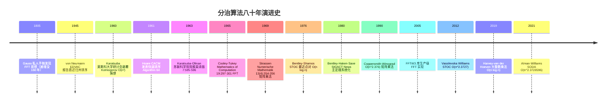

## 1. 概述与学习目标

### 1.1 什么是分治算法

**分治算法**（Divide and Conquer）是一类将大问题分解为若干规模较小、结构相同的子问题，递归求解后合并结果的算法设计策略。Thomas H. Cormen 等在《Introduction to Algorithms》（CLRS）第 4 章将分治形式化为**三步范式**：

1. **分解**（Divide）：将原问题划分为 $a$ 个规模为 $n/b$ 的子问题；
2. **解决**（Conquer）：递归求解各子问题；若子问题足够小（达到基线阈值 $n_0$）则直接求解；
3. **合并**（Combine）：将子问题的解合并为原问题的解。

分治算法的时间复杂度由递推关系刻画：

$$T(n) = aT(n/b) + f(n)$$

其中 $a \geq 1$ 为子问题数，$b > 1$ 为规模缩减比，$f(n)$ 为分解与合并的总代价。**主定理**（Master Theorem, Bentley-Haken-Saxe 1980）给出此递推的通用解法，分三种情况对应不同的渐近量级。

```
分治算法分类树：
                          分治算法
                              |
        ┌─────────┬───────────┴──────────┬────────────┐
     排序分治    代数分治              几何分治        信号分治
        │          │                     │                │
   ┌────┴───┐  ┌───┴────┐          ┌────┴────┐      ┌────┴────┐
  归并排序 快排 Karatsuba Strassen  最近点对  最大子数组  FFT  数论变换
  von Neu. Hoare 1963     1969      1976     1976    1965     NTT
  1945    1961  O(n^1.585) O(n^2.807) O(nlogn) O(nlogn) O(nlogn)
```

**分治与其他算法策略的本质区别**：

| 维度 | 分治 | 动态规划 | 贪心 | 回溯 |
| ---- | ---- | ---- | ---- | ---- |
| 子问题关系 | 相互独立 | 相互重叠 | 单链递进 | 决策树枚举 |
| 求解方向 | 自顶向下 | 自底向上 | 单步决策 | 深度优先 |
| 重复计算 | 无 | 通过记忆化避免 | 无 | 通过剪枝减少 |
| 正确性保证 | 合并正确性 | 最优子结构 + 重叠子问题 | 贪心选择性质 | 完备性 |
| 典型问题 | 归并/快排/Strassen | 背包/LCS/编辑距离 | Huffman/Kruskal | N 皇后/数独 |
| 复杂度下界 | $O(n \log n)$ 排序 | $\Omega(n^2)$ 通用 | 依赖问题 | 指数级 |

> 一句话定义：**分治 = Divide（分解 $a$ 个 $n/b$ 子问题）+ Conquer（递归求解）+ Combine（合并结果）；复杂度由 $T(n) = aT(n/b) + f(n)$ + 主定理刻画；归并 $O(n \log n)$、快排 $O(n \log n)$ 平均、Karatsuba $O(n^{1.585})$、Strassen $O(n^{2.807})$、FFT $O(n \log n)$、最近点对 $O(n \log n)$ 是六大经典分治算法。**

### 1.2 学习目标

完成本文档学习后，你将能够：

1. **记忆**归并排序 $O(n \log n)$、快速排序 $O(n \log n)$ 平均/$O(n^2)$ 最坏、二分查找 $O(\log n)$、Karatsuba $O(n^{\log_2 3}) \approx O(n^{1.585})$、Strassen $O(n^{\log_2 7}) \approx O(n^{2.807})$、FFT $O(n \log n)$、最近点对 $O(n \log n)$ 的形式化复杂度，复述主定理三种情况的形式化条件；
2. **理解** von Neumann 1945 EDVAC 报告归并排序（IEEE Annals of the History of Computing 15(4):27-75 1993 重印）、Hoare 1961-1962 CACM 4(7):321 与 Computer Journal 5(1):10-15 快速排序、Karatsuba-Ofman 1963 Soviet Physics-Doklady 7:595-596 大整数乘法（颠覆 Kolmogorov $O(n^2)$ 猜想）、Cooley-Tukey 1965 Mathematics of Computation 19:297-301 FFT、Strassen 1969 Numerische Mathematik 13(4):354-356 矩阵乘法（首次突破 $O(n^3)$）、Bentley-Haken-Saxe 1980 SIGACT News 12(3):36-44 主定理的历史脉络，说明各分治算法的设计动机；
3. **应用**归并排序（自顶向下/自底向上）、快速排序（Lomuto/Hoare/三路/随机化/双轴）、Karatsuba 大整数乘法、Strassen 矩阵乘法、Cooley-Tukey FFT（递归/迭代蝶形）、最近点对（分治+strip）编写可运行的 Python/C++/Java 代码，解决 LeetCode 53、169、23、148、240、315、973 等高频问题；
4. **分析**主定理三种情况的形式化条件（$f(n) = O(n^{\log_b a - \epsilon})$ / $\Theta(n^{\log_b a} \log^k n)$ / $\Omega(n^{\log_b a + \epsilon})$）与正则条件、递归树分析法、Karatsuba 三乘法替代四乘法的代数恒等式、Strassen 七乘法替代八乘法的代数恒等式、Cooley-Tukey 蝶形运算的对称性利用、最近点对 strip 检查的 $O(1)$ 摊还分析，掌握"递归树归约、代数恒等式、势能摊还"三大核心论证方法；
5. **评估**各分治算法在"分解均匀性"、"合并成本"、"递归深度"、"基线阈值"、"并行化难度"维度上的优劣，识别 NumPy/BLAS Strassen 矩阵乘法、FFTW 库、Python Timsort 归并段、PostgreSQL 外部归并排序、MapReduce 分布式排序、GPU 并行 FFT 的选型动机；
6. **对比**归并、快排、Karatsuba、Strassen、FFT、最近点对在递推关系、子问题数 $a$、子问题规模 $n/b$、合并代价 $f(n)$、总复杂度、并行性维度的差异；
7. **创造**性设计基于分治的开源项目解决方案，如 MapReduce 分布式词频统计、CUDA FFT 卷积神经网络、PostgreSQL 多路外排序、Go goroutine 并行归并、Karatsuba RSA 大数运算、Strassen BLAS 加速、最近点对地理 LBS 服务。

### 1.3 术语表

| 术语 | 英文 | 定义 |
| ---- | ---- | ---- |
| 分解 | Divide | 将原问题划分为 $a$ 个 $n/b$ 子问题 |
| 解决 | Conquer | 递归求解子问题 |
| 合并 | Combine | 合并子问题解为原问题解 |
| 递推关系 | Recurrence | $T(n) = aT(n/b) + f(n)$ |
| 主定理 | Master Theorem | 求解分治递推的通用三情况方法 |
| 递归树 | Recursion Tree | 可视化展开递推的树形结构 |
| 基线条件 | Base Case | 递归终止的最小问题阈值 $n_0$ |
| 蝶形运算 | Butterfly Operation | FFT 中一对 $E_k \pm \omega O_k$ 运算 |
| 摊还分析 | Amortized Analysis | 平均每操作代价的分析方法 |
| 单调性 | Monotonicity | $h(n) \leq c(n,n') + h(n')$ 一致性 |

### 1.4 全景对比表

| 算法 | 递推 | $a$ | $b$ | $f(n)$ | 总复杂度 | 经典应用 |
| ---- | ---- | --- | --- | ------ | -------- | -------- |
| 归并排序 | $T(n)=2T(n/2)+O(n)$ | 2 | 2 | $O(n)$ | $O(n \log n)$ | Python Timsort 合并段 |
| 快速排序 | $T(n)=2T(n/2)+O(n)$ 平均 | 2 | 2 | $O(n)$ | $O(n \log n)$ | C qsort/C++ std::sort |
| 二分查找 | $T(n)=T(n/2)+O(1)$ | 1 | 2 | $O(1)$ | $O(\log n)$ | std::lower_bound |
| Karatsuba | $T(n)=3T(n/2)+O(n)$ | 3 | 2 | $O(n)$ | $O(n^{1.585})$ | RSA 大数运算 |
| Strassen | $T(n)=7T(n/2)+O(n^2)$ | 7 | 2 | $O(n^2)$ | $O(n^{2.807})$ | BLAS 加速 |
| Cooley-Tukey FFT | $T(n)=2T(n/2)+O(n)$ | 2 | 2 | $O(n)$ | $O(n \log n)$ | 信号处理/卷积 |
| 最近点对 | $T(n)=2T(n/2)+O(n)$ | 2 | 2 | $O(n)$ | $O(n \log n)$ | LBS 地理服务 |
| 最大子数组 | $T(n)=2T(n/2)+O(n)$ | 2 | 2 | $O(n)$ | $O(n \log n)$ | 财务时序分析 |

## 2. 历史动机与演进

### 2.1 时间线



### 2.2 关键人物与设计决策

**John von Neumann（1903-1957）**：匈牙利裔美籍数学家。1945 年为 EDVAC 计算机撰写《First Draft of a Report on the EDVAC》时，首次书面描述了归并排序。这一设计展示了存储程序计算机的强大能力：可以在内存中按 $O(n \log n)$ 排序数据，远优于当时占主导的 $O(n^2)$ 排序。Knuth 在 TAOCP Vol.3 §5.2.4 详细考据此事。归并排序是分治思想的最早系统化应用。

**Anatolii Alexeevich Karatsuba（1937-2008）**：苏联数学家。1960 年莫斯科大学研讨会上，Andrey Kolmogorov 提出"$O(n^2)$ 是大整数乘法的下界"猜想，并让全班学生尝试证明。23 岁的 Karatsuba 一周后发现 $O(n^{\log_2 3}) \approx O(n^{1.585})$ 算法，颠覆了 Kolmogorov 的猜想。Kolmogorov 震惊之余，亲自将 Karatsuba 的结果写成论文发表于《Soviet Physics-Doklady》1963 年 7(7):595-596（署名 Karatsuba-Ofman）。这是分治算法突破"朴素下界"的开山之作。

**James W. Cooley（1926-2016）与 John W. Tukey（1915-2000）**：1965 年 IBM Watson 研究中心与 Princeton 大学。Cooley 在 Richard Garwin 的建议下与 Tukey 合作，将 Tukey 早期关于 Fourier 分析的洞察实现为系统算法。论文《An algorithm for the machine calculation of complex Fourier series》发表于 Mathematics of Computation 19:297-301，仅 4 页。FFT 将 DFT 从 $O(n^2)$ 降到 $O(n \log n)$，被誉为 20 世纪最重要的算法之一，开启了数字信号处理学科。Heideman-Johnson-Burrus 1984 考据发现 Gauss 在 1805 年私人手稿中已有同样思想（早 160 年）。

**Volker Strassen（1936-）**：德国数学家。1969 年在《Gaussian Elimination is not Optimal》Numerische Mathematik 13(4):354-356 提出用 7 次乘法替代朴素 $2 \times 2$ 矩阵乘法的 8 次乘法，复杂度 $O(n^{\log_2 7}) \approx O(n^{2.807})$，首次突破 $O(n^3)$ 矩阵乘法。Strassen 的洞察在于：用额外的加法代替乘法（在加法比乘法便宜的代数结构上获益）。后续 Coppersmith-Winograd 1990 $O(n^{2.376})$、Williams 2012 $O(n^{2.3727})$、Alman-Williams 2021 $O(n^{2.3728596})$ 沿此路线不断改进。

**Jon L. Bentley、Dorothea Haken、James B. Saxe**：1980 年在《A general method for solving divide-and-conquer recurrences》SIGACT News 12(3):36-44 系统化主定理。该文给出 $T(n) = aT(n/b) + f(n)$ 的通用解法，按 $f(n)$ 与 $n^{\log_b a}$ 的渐近比较分三种情况。Cormen-Leiserson-Rivest《CLRS》1990 第一版将此法命名为"Master Theorem"，成为算法分析的标准工具。

**关键设计决策**：

1. **三步范式标准化**（von Neumann 1945）：将分治明确为 Divide-Conquer-Combine 三步骤，每步独立分析；
2. **递推关系刻画复杂度**（Bentley-Haken-Saxe 1980）：用 $T(n) = aT(n/b) + f(n)$ 统一描述分治复杂度；
3. **代数恒等式减少子问题数**（Karatsuba 1960、Strassen 1969）：通过引入额外加减法减少乘法次数，本质是利用代数结构；
4. **对称性利用**（Cooley-Tukey 1965）：FFT 利用单位根的对称性 $\omega_N^{k+N/2} = -\omega_N^k$，将 DFT 分解为两个半长 DFT；
5. **摊还分析合并成本**（Bentley-Shamos 1976）：最近点对 strip 检查中，每个点只需检查 7 个邻居，整体 $O(n)$ 合并。

## 3. 形式化定义与主定理

### 3.1 分治三步范式

**定义 3.1（分治算法）**：分治算法是求解问题 $P$ 的算法 $A$，由三元组 $(\text{Divide}, \text{Conquer}, \text{Combine})$ 构成：

1. **Divide**：将原问题 $P_n$（规模 $n$）划分为 $a$ 个规模为 $n/b$ 的子问题 $P_{n/b}^{(1)}, P_{n/b}^{(2)}, \ldots, P_{n/b}^{(a)}$，划分代价 $D(n)$；
2. **Conquer**：递归调用 $A$ 求解各子问题；若 $n \leq n_0$（基线阈值）则直接求解，代价 $\Theta(1)$；
3. **Combine**：将子问题解 $s_1, s_2, \ldots, s_a$ 合并为原问题解 $s$，合并代价 $C(n)$。

总递推关系：

$$T(n) = \begin{cases} \Theta(1) & n \leq n_0 \\ aT(n/b) + D(n) + C(n) & n > n_0 \end{cases}$$

合并 $D(n) + C(n)$ 记为 $f(n)$，得标准形式 $T(n) = aT(n/b) + f(n)$。

### 3.2 主定理（Master Theorem）

**定理 3.1（主定理，Bentley-Haken-Saxe 1980）**：设 $a \geq 1$、$b > 1$ 为常数，$f(n)$ 为渐近非负函数，递推关系 $T(n) = aT(n/b) + f(n)$ 的解分三种情况：

- **情况 1**：若 $f(n) = O(n^{\log_b a - \epsilon})$ 对某常数 $\epsilon > 0$ 成立，则 $T(n) = \Theta(n^{\log_b a})$；
- **情况 2**：若 $f(n) = \Theta(n^{\log_b a} \log^k n)$ 对某 $k \geq 0$ 成立，则 $T(n) = \Theta(n^{\log_b a} \log^{k+1} n)$；
- **情况 3**：若 $f(n) = \Omega(n^{\log_b a + \epsilon})$ 对某常数 $\epsilon > 0$ 成立，且**正则条件** $af(n/b) \leq cf(n)$ 对某常数 $c < 1$ 与所有充分大 $n$ 成立，则 $T(n) = \Theta(f(n))$。

**证明（递归树法）**：

构造递归树：根节点贡献 $f(n)$，第 $i$ 层有 $a^i$ 个节点，每个节点贡献 $f(n/b^i)$。故第 $i$ 层总贡献 $a^i f(n/b^i)$。树高 $\log_b n$，叶节点数 $a^{\log_b n} = n^{\log_b a}$，每个叶节点贡献 $\Theta(1)$，故叶层总贡献 $\Theta(n^{\log_b a})$。

总复杂度：

$$T(n) = \sum_{i=0}^{\log_b n - 1} a^i f(n/b^i) + \Theta(n^{\log_b a})$$

令 $g(i) = a^i f(n/b^i)$，分析其随 $i$ 的单调性：

- **情况 1**：$f(n) = O(n^{\log_b a - \epsilon})$，则 $g(i) = a^i \cdot O((n/b^i)^{\log_b a - \epsilon}) = O(n^{\log_b a - \epsilon} \cdot a^i / b^{i(\log_b a - \epsilon)}) = O(n^{\log_b a - \epsilon} \cdot a^i / (a^i \cdot b^{-i\epsilon})) = O(n^{\log_b a - \epsilon} \cdot b^{i\epsilon})$。随 $i$ 增大 $g(i)$ 几何级数递减，但叶层 $n^{\log_b a}$ 项占主导，故 $T(n) = \Theta(n^{\log_b a})$。

- **情况 2**：$f(n) = \Theta(n^{\log_b a} \log^k n)$，则 $g(i) = a^i \cdot \Theta((n/b^i)^{\log_b a} \log^k(n/b^i)) = \Theta(n^{\log_b a} (\log n - i \log b)^k)$。每层贡献 $\Theta(n^{\log_b a} (\log n - i \log b)^k)$，从 $i=0$ 到 $\log_b n$ 求和为 $\Theta(n^{\log_b a} \log^{k+1} n)$。

- **情况 3**：$f(n) = \Omega(n^{\log_b a + \epsilon})$ 且正则条件 $af(n/b) \leq cf(n)$（$c < 1$），则 $g(i) \leq c^i f(n)$，几何级数递减，根层 $f(n)$ 占主导，故 $T(n) = \Theta(f(n))$。

$\square$

**应用示例**：

| 算法 | $a$ | $b$ | $f(n)$ | $\log_b a$ | 情况 | $T(n)$ |
| ---- | --- | --- | ------ | ---------- | ---- | ------ |
| 二分查找 | 1 | 2 | $O(1)$ | 0 | 1 | $\Theta(1)$? 实际 $\Theta(\log n)$ |
| 归并排序 | 2 | 2 | $O(n)$ | 1 | 2 ($k=0$) | $\Theta(n \log n)$ |
| Strassen | 7 | 2 | $O(n^2)$ | $\log_2 7 \approx 2.807$ | 1 | $\Theta(n^{2.807})$ |
| Karatsuba | 3 | 2 | $O(n)$ | $\log_2 3 \approx 1.585$ | 1 | $\Theta(n^{1.585})$ |
| 朴素大数乘法 | 4 | 2 | $O(n)$ | 2 | 1 | $\Theta(n^2)$ |
| 递归求和 | 2 | 2 | $O(1)$ | 1 | 1 | $\Theta(n)$ |
| 平方阶合并 | 2 | 2 | $O(n^2)$ | 1 | 3 | $\Theta(n^2)$ |

注：二分查找 $T(n) = T(n/2) + O(1)$，$a=1, b=2, \log_b a = 0$，$f(n) = O(1) = \Theta(n^0 \log^0 n)$，属情况 2 ($k=0$)，故 $T(n) = \Theta(\log n)$。

### 3.3 代数恒等式与子问题数缩减

分治算法优化的核心是减少子问题数 $a$，关键在于代数恒等式。

**Karatsuba 恒等式**（1960）：设 $x = a \cdot 10^m + b$、$y = c \cdot 10^m + d$，则

$$xy = ac \cdot 10^{2m} + [(a+b)(c+d) - ac - bd] \cdot 10^m + bd$$

朴素乘法需 4 次子乘法 $ac, ad, bc, bd$，Karatsuba 用 $(a+b)(c+d)$ 一次乘法代替 $ad + bc$ 两次乘法，总乘法次数 $3$ 次，故 $a = 3$、$T(n) = 3T(n/2) + O(n) = \Theta(n^{\log_2 3})$。

**Strassen 恒等式**（1969）：设 $2 \times 2$ 矩阵乘法 $C = AB$，朴素需 8 次子矩阵乘法。Strassen 定义 7 个中间量：

$$\begin{aligned}
M_1 &= (A_{11} + A_{22})(B_{11} + B_{22}) \\
M_2 &= (A_{21} + A_{22}) B_{11} \\
M_3 &= A_{11} (B_{12} - B_{22}) \\
M_4 &= A_{22} (B_{21} - B_{11}) \\
M_5 &= (A_{11} + A_{12}) B_{22} \\
M_6 &= (A_{21} - A_{11})(B_{11} + B_{12}) \\
M_7 &= (A_{12} - A_{22})(B_{21} + B_{22})
\end{aligned}$$

则：

$$\begin{aligned}
C_{11} &= M_1 + M_4 - M_5 + M_7 \\
C_{12} &= M_3 + M_5 \\
C_{21} &= M_2 + M_4 \\
C_{22} &= M_1 - M_2 + M_3 + M_6
\end{aligned}$$

7 次乘法代替 8 次，故 $a = 7$、$T(n) = 7T(n/2) + O(n^2) = \Theta(n^{\log_2 7})$。

### 3.4 三大核心论证方法

**方法 1：递归树归约**——通过展开递推构造树，按层求和得总复杂度。主定理证明即基于此。适用于 $T(n) = aT(n/b) + f(n)$ 类递推。

**方法 2：代数恒等式**——通过引入额外加减法构造恒等式，减少乘法（最贵操作）次数。Karatsuba、Strassen、Toom-Cook 均基于此。适用于代数运算分治。

**方法 3：势能摊还**——通过势能函数 $\Phi$ 分析每步均摊代价。最近点对 strip 检查中，每点只需检查 7 个邻居（按 $y$ 排序），整体 $O(n)$ 合并。摊还分析证明：势能 $\Phi$ = 已检查点对数，每点摊还 $O(1)$ 检查。

## 4. 归并排序（von Neumann 1945）

### 4.1 算法描述

归并排序由 John von Neumann 于 1945 年在 EDVAC 报告中首次描述，是分治思想的最早系统化应用。算法步骤：

1. **分解**：将数组 $A[1..n]$ 对半分为 $A[1..\lfloor n/2 \rfloor]$ 与 $A[\lfloor n/2 \rfloor+1..n]$；
2. **解决**：递归排序两半；
3. **合并**：用双指针合并两个有序数组。

### 4.2 Python 实现

```python
from typing import List

def merge_sort(arr: List[int]) -> List[int]:
    """归并排序 - 自顶向下递归实现

    时间复杂度: O(n log n)  最坏/平均/最好均相同
    空间复杂度: O(n)        需要额外辅助数组
    稳定性: 稳定排序

    Args:
        arr: 待排序数组
    Returns:
        排序后的新数组
    """
    n = len(arr)
    if n <= 1:
        return arr

    mid = n // 2
    left = merge_sort(arr[:mid])
    right = merge_sort(arr[mid:])
    return _merge(left, right)


def _merge(left: List[int], right: List[int]) -> List[int]:
    """合并两个有序数组

    使用双指针 i, j 分别遍历 left, right
    每次取较小者放入结果，直到某边耗尽
    剩余部分直接 extend（已有序）

    Args:
        left:  有序左半
        right: 有序右半
    Returns:
        合并后的有序数组
    """
    result = []
    i = j = 0
    while i < len(left) and j < len(right):
        if left[i] <= right[j]:  # <= 保证稳定性
            result.append(left[i])
            i += 1
        else:
            result.append(right[j])
            j += 1
    result.extend(left[i:])
    result.extend(right[j:])
    return result


def merge_sort_inplace(arr: List[int]) -> None:
    """归并排序 - 原地版（自底向上迭代）

    自底向上：从长度 1 的子数组开始，逐步两两合并
    避免递归开销，适合大数据集

    时间复杂度: O(n log n)
    空间复杂度: O(n)
    """
    n = len(arr)
    aux = arr[:]
    width = 1
    while width < n:
        for i in range(0, n, 2 * width):
            left = arr[i:i + width]
            right = arr[i + width:i + 2 * width]
            merged = _merge(left, right)
            arr[i:i + len(merged)] = merged
        width *= 2


# 测试
if __name__ == "__main__":
    arr = [38, 27, 43, 3, 9, 82, 10]
    print("递归版:", merge_sort(arr))         # [3, 9, 10, 27, 38, 43, 82]

    arr2 = [38, 27, 43, 3, 9, 82, 10]
    merge_sort_inplace(arr2)
    print("迭代版:", arr2)                     # [3, 9, 10, 27, 38, 43, 82]
```

### 4.3 C++ 实现

```cpp
#include <vector>
#include <algorithm>
using namespace std;

void mergeSort(vector<int>& arr) {
    if (arr.size() <= 1) return;
    int n = arr.size();
    vector<int> aux(n);
    // 自顶向下归并
    function<void(int, int)> sort = [&](int lo, int hi) {
        if (lo >= hi) return;
        int mid = lo + (hi - lo) / 2;
        sort(lo, mid);
        sort(mid + 1, hi);
        // 合并 arr[lo..mid] 与 arr[mid+1..hi]
        for (int k = lo; k <= hi; ++k) aux[k] = arr[k];
        int i = lo, j = mid + 1;
        for (int k = lo; k <= hi; ++k) {
            if (i > mid)              arr[k] = aux[j++];
            else if (j > hi)          arr[k] = aux[i++];
            else if (aux[i] <= aux[j]) arr[k] = aux[i++];  // <= 稳定
            else                       arr[k] = aux[j++];
        }
    };
    sort(0, n - 1);
}
```

### 4.4 复杂度分析

**时间**：$T(n) = 2T(n/2) + O(n)$，主定理情况 2 ($k=0$)，$T(n) = \Theta(n \log n)$。最坏/平均/最好均为 $O(n \log n)$。

**空间**：$O(n)$ 辅助数组。

**稳定性**：稳定（合并时 `<=` 保留相等元素的相对顺序）。

### 4.5 工业应用

- **Python Timsort**（Peters 2002）：Timsort 在归并排序基础上增加"自然段检测"（natural run detection）+ 二分插入排序，对部分有序数据可达 $O(n)$。
- **Java Arrays.sort（对象）**：Java 7 起对象排序改用 Timsort，底层归并段仍为 von Neumann 思想。
- **V8 JavaScript engine**：7.0 起 Array.prototype.sort 改用 Timsort。
- **PostgreSQL 外部排序**：当数据超过 `work_mem` 时使用多路归并排序（external merge sort），分块排序后合并。
- **MapReduce**：Hadoop MapReduce 的 shuffle 阶段使用归并排序合并来自不同 mapper 的数据。

## 5. 快速排序（Hoare 1961）

### 5.1 算法描述

快速排序由 C. A. R. Hoare 于 1959 年发明（开发 ALGOL 60 翻译器时），1961 年发表于 CACM 4(7):321《Algorithm 64: Quicksort》。算法步骤：

1. **分解**：选择基准 pivot，将数组划分为 $\leq$ pivot 与 $>$ pivot 两部分；
2. **解决**：递归排序两部分；
3. **合并**：无需合并（原地操作）。

### 5.2 Python 实现

```python
import random
from typing import List

def quick_sort_lomuto(arr: List[int], low: int = 0, high: int = None) -> List[int]:
    """快速排序 - Lomuto 分区方案

    特点：代码简洁，但最坏 O(n^2)（已排序数组）
    解决：随机化 pivot 或三数取中

    Args:
        arr:  待排序数组
        low:  起始索引
        high: 结束索引
    """
    if high is None:
        high = len(arr) - 1
    if low < high:
        pivot_idx = _partition_lomuto(arr, low, high)
        quick_sort_lomuto(arr, low, pivot_idx - 1)
        quick_sort_lomuto(arr, pivot_idx + 1, high)
    return arr


def _partition_lomuto(arr: List[int], low: int, high: int) -> int:
    """Lomuto 分区：选 arr[high] 为 pivot，单指针 i 维护 <= pivot 区域边界

    返回 pivot 最终位置
    """
    pivot = arr[high]
    i = low - 1
    for j in range(low, high):
        if arr[j] <= pivot:
            i += 1
            arr[i], arr[j] = arr[j], arr[i]
    arr[i + 1], arr[high] = arr[high], arr[i + 1]
    return i + 1


def quick_sort_hoare(arr: List[int], low: int = 0, high: int = None) -> List[int]:
    """快速排序 - Hoare 双指针分区方案

    Hoare 原版：双指针从两端向中间扫描
    比较次数比 Lomuto 少约 3 倍
    """
    if high is None:
        high = len(arr) - 1
    if low < high:
        pivot_idx = _partition_hoare(arr, low, high)
        quick_sort_hoare(arr, low, pivot_idx)
        quick_sort_hoare(arr, pivot_idx + 1, high)
    return arr


def _partition_hoare(arr: List[int], low: int, high: int) -> int:
    """Hoare 分区：选 arr[low] 为 pivot（实际中点更好）"""
    pivot = arr[low + (high - low) // 2]
    i = low - 1
    j = high + 1
    while True:
        i += 1
        while arr[i] < pivot:
            i += 1
        j -= 1
        while arr[j] > pivot:
            j -= 1
        if i >= j:
            return j
        arr[i], arr[j] = arr[j], arr[i]


def quick_sort_3way(arr: List[int], low: int = 0, high: int = None) -> List[int]:
    """三路快排 - Dijkstra 国旗问题变种

    将数组分为 < pivot, == pivot, > pivot 三段
    对含大量重复元素的数据 O(n) 优于普通快排 O(n log n)
    """
    if high is None:
        high = len(arr) - 1
    if low >= high:
        return arr
    # 随机化 pivot
    rand_idx = random.randint(low, high)
    arr[low], arr[rand_idx] = arr[rand_idx], arr[low]
    pivot = arr[low]
    # lt: < pivot 段右边界；gt: > pivot 段左边界；i: 当前扫描位置
    lt, i, gt = low, low + 1, high
    while i <= gt:
        if arr[i] < pivot:
            arr[lt], arr[i] = arr[i], arr[lt]
            lt += 1
            i += 1
        elif arr[i] > pivot:
            arr[i], arr[gt] = arr[gt], arr[i]
            gt -= 1
        else:
            i += 1
    quick_sort_3way(arr, low, lt - 1)
    quick_sort_3way(arr, gt + 1, high)
    return arr


# 测试
if __name__ == "__main__":
    arr = [10, 7, 8, 9, 1, 5, 3, 8, 2]
    print("Lomuto:", quick_sort_lomuto(arr[:]))
    print("Hoare: ", quick_sort_hoare(arr[:]))
    print("3-way: ", quick_sort_3way(arr[:]))
```

### 5.3 复杂度分析

**最好/平均**：$T(n) = 2T(n/2) + O(n) = \Theta(n \log n)$（主定理情况 2）。

**最坏**：每次 pivot 选到最值，划分极不均匀，$T(n) = T(n-1) + O(n) = \Theta(n^2)$。已排序数据 + Lomuto + 选 high 为 pivot 即触发。

**随机化**：`random.randint(low, high)` 后期望 $T(n) = \Theta(n \log n)$，任意输入期望复杂度。

**空间**：递归栈深度 $\Theta(\log n)$ 平均、$\Theta(n)$ 最坏。

### 5.4 工业应用

- **C `qsort`**：标准库 qsort，多数实现为 Lomuto 或 Hoare 快排。
- **C++ `std::sort`**：Musser 1997 内省排序 introsort——快排为主，递归深度超过 $2\log_2 n$ 时切换堆排，小数据切换插入排序。保证最坏 $O(n \log n)$。
- **Java `Arrays.sort`（primitives）**：Java 7 起用 Vladimir Yaroslavskiy 2009 双轴快排 DualPivotQuicksort，两次分区将数组分三段，平均 $O(n \log n)$，对部分数据比单轴快 10%。
- **V8 JavaScript（7.0 前）**：用快排，7.0 起对象排序改 Timsort。

## 6. Karatsuba 大整数乘法（1960）

### 6.1 历史背景

1960 年莫斯科大学研讨会上，Andrey Kolmogorov 提出"$O(n^2)$ 是大整数乘法的下界"猜想，并让全班尝试证明。23 岁的 Anatolii Karatsuba 一周后发现 $O(n^{\log_2 3}) \approx O(n^{1.585})$ 算法，颠覆了 Kolmogorov 的猜想。Kolmogorov 震惊之余，亲自将 Karatsuba 的结果写成论文，1963 年发表于《Soviet Physics-Doklady》7(7):595-596，署名 Karatsuba-Ofman。这是分治算法突破"朴素下界"的开山之作，启发 Toom-Cook 1963、Schönhage-Strassen 1971、Fürer 2007、Harvey-van der Hoeven 2019 $O(n \log n)$ 等后续工作。

### 6.2 算法描述

设 $x, y$ 为 $n$ 位整数（$n = 2^k$ 简化分析），令 $m = n/2$，分解：

$$x = a \cdot 10^m + b, \quad y = c \cdot 10^m + d$$

朴素乘法：

$$xy = ac \cdot 10^{2m} + (ad + bc) \cdot 10^m + bd$$

需 4 次子乘法 $ac, ad, bc, bd$。

**Karatsuba 恒等式**：令 $z = (a+b)(c+d) = ac + ad + bc + bd$，则 $ad + bc = z - ac - bd$，只需 3 次子乘法 $ac, bd, z$：

$$xy = ac \cdot 10^{2m} + (z - ac - bd) \cdot 10^m + bd$$

### 6.3 Python 实现

```python
def karatsuba(x: int, y: int) -> int:
    """Karatsuba 大整数乘法

    时间复杂度: O(n^log2(3)) ≈ O(n^1.585)
    空间复杂度: O(log n) 递归栈
    基线阈值: x, y < 2^10 时直接相乘

    Args:
        x, y: 两个非负整数
    Returns:
        x * y
    """
    # 基线条件：数位较小时直接相乘
    if x < 1024 or y < 1024:
        return x * y

    # 计算 n 为较大数的二进制位数
    n = max(x.bit_length(), y.bit_length())
    m = n // 2  # 对半切分位数

    # 分解: x = a * 2^m + b, y = c * 2^m + d
    power = 1 << m  # 2^m
    a, b = x >> m, x & (power - 1)   # a = x // 2^m, b = x % 2^m
    c, d = y >> m, y & (power - 1)   # c = y // 2^m, d = y % 2^m

    # 递归计算 3 次子乘法（而非 4 次）
    ac = karatsuba(a, c)
    bd = karatsuba(b, d)
    # (a+b)(c+d) - ac - bd = ad + bc
    ad_plus_bc = karatsuba(a + b, c + d) - ac - bd

    # 合并: xy = ac * 2^(2m) + (ad+bc) * 2^m + bd
    return (ac << (2 * m)) + (ad_plus_bc << m) + bd


# 测试
if __name__ == "__main__":
    # 小数据测试
    print(karatsuba(1234, 5678))  # 7006652
    print(1234 * 5678)             # 验证: 7006652

    # 大数据测试
    import random
    x = random.randint(10**100, 10**101)
    y = random.randint(10**100, 10**101)
    assert karatsuba(x, y) == x * y, "Karatsuba 错误"
    print("大数测试通过")
```

### 6.4 复杂度分析

**时间**：$T(n) = 3T(n/2) + O(n)$，主定理情况 1（$f(n) = O(n) = O(n^{1-\epsilon})$，$\log_2 3 \approx 1.585$），$T(n) = \Theta(n^{\log_2 3}) \approx \Theta(n^{1.585})$。

**空间**：$O(\log n)$ 递归栈。

**对比朴素**：$n=10^6$ 位时，朴素 $10^{12}$ 次 vs Karatsuba $\approx 10^{9.51}$ 次，约 300 倍加速。

### 6.5 后续演进

- **Toom-Cook 1963**：分解为 $k$ 段，$T(n) = (2k-1) T(n/k) + O(n)$，$k=3$ 即 Toom-3 $\Theta(n^{\log_3 5}) \approx \Theta(n^{1.465})$。
- **Schönhage-Strassen 1971**：基于 NTT，$\Theta(n \log n \log \log n)$。
- **Fürer 2007**：$\Theta(n \log n \cdot 2^{O(\log^* n)})$。
- **Harvey-van der Hoeven 2019**：$\Theta(n \log n)$，目前最优上界（ conjectured optimal）。
- **GMP 库**：GNU Multiple Precision Arithmetic Library 实现 Karatsuba + Toom-Cook + FFT 三层混合，按数位自动切换。

## 7. Strassen 矩阵乘法（1969）

### 7.1 历史背景

Volker Strassen 1969 年在《Gaussian Elimination is not Optimal》Numerische Mathematik 13(4):354-356 提出 7 次乘法替代朴素 8 次乘法的 $2 \times 2$ 矩阵乘法，复杂度 $O(n^{\log_2 7}) \approx O(n^{2.807})$，首次突破 $O(n^3)$ 矩阵乘法。Strassen 的洞察在于：用额外的加法代替乘法（在加法比乘法便宜的代数结构上获益）。

### 7.2 算法描述

设 $A, B$ 为 $n \times n$ 矩阵（$n = 2^k$），将 $A, B$ 分块：

$$A = \begin{pmatrix} A_{11} & A_{12} \\ A_{21} & A_{22} \end{pmatrix}, \quad B = \begin{pmatrix} B_{11} & B_{12} \\ B_{21} & B_{22} \end{pmatrix}$$

朴素分块需 8 次子矩阵乘法。**Strassen 恒等式**定义 7 个中间量（见 §3.3），用 7 次乘法 + 18 次加减法代替 8 次乘法 + 4 次加减法。

### 7.3 Python 实现

```python
import numpy as np
from typing import List

def strassen(A: List[List[int]], B: List[List[int]]) -> List[List[int]]:
    """Strassen 矩阵乘法

    时间复杂度: O(n^log2(7)) ≈ O(n^2.807)
    空间复杂度: O(n^2)
    基线阈值: n <= 64 时用朴素算法

    Args:
        A: n x n 矩阵
        B: n x n 矩阵
    Returns:
        C = A * B
    """
    n = len(A)

    # 基线条件：小矩阵用朴素算法
    if n <= 64:
        return _matmul_naive(A, B)

    # 保证 n 为偶数（实际应用需补零到 2^k）
    if n % 2 != 0:
        A = _pad_matrix(A, n + 1)
        B = _pad_matrix(B, n + 1)
        n += 1

    mid = n // 2

    # 分块
    A11 = [row[:mid] for row in A[:mid]]
    A12 = [row[mid:] for row in A[:mid]]
    A21 = [row[:mid] for row in A[mid:]]
    A22 = [row[mid:] for row in A[mid:]]
    B11 = [row[:mid] for row in B[:mid]]
    B12 = [row[mid:] for row in B[:mid]]
    B21 = [row[:mid] for row in B[mid:]]
    B22 = [row[mid:] for row in B[mid:]]

    # 7 次递归乘法
    M1 = strassen(_add(A11, A22), _add(B11, B22))
    M2 = strassen(_add(A21, A22), B11)
    M3 = strassen(A11, _sub(B12, B22))
    M4 = strassen(A22, _sub(B21, B11))
    M5 = strassen(_add(A11, A12), B22)
    M6 = strassen(_sub(A21, A11), _add(B11, B12))
    M7 = strassen(_sub(A12, A22), _add(B21, B22))

    # 合并
    C11 = _add(_sub(_add(M1, M4), M5), M7)
    C12 = _add(M3, M5)
    C21 = _add(M2, M4)
    C22 = _add(_sub(_add(M1, M3), M2), M6)

    # 组装结果
    C = [[0] * n for _ in range(n)]
    for i in range(mid):
        C[i][:mid] = C11[i]
        C[i][mid:] = C12[i]
    for i in range(mid):
        C[mid + i][:mid] = C21[i]
        C[mid + i][mid:] = C22[i]
    return C


def _matmul_naive(A, B):
    n = len(A)
    C = [[0] * n for _ in range(n)]
    for i in range(n):
        for j in range(n):
            for k in range(n):
                C[i][j] += A[i][k] * B[k][j]
    return C


def _add(A, B):
    n = len(A)
    return [[A[i][j] + B[i][j] for j in range(n)] for i in range(n)]


def _sub(A, B):
    n = len(A)
    return [[A[i][j] - B[i][j] for j in range(n)] for i in range(n)]


def _pad_matrix(M, new_size):
    n = len(M)
    return [row + [0] * (new_size - n) for row in M] + [[0] * new_size for _ in range(new_size - n)]


# 测试
if __name__ == "__main__":
    A = [[1, 2, 3, 4],
         [5, 6, 7, 8],
         [9, 10, 11, 12],
         [13, 14, 15, 16]]
    B = [[1, 0, 0, 1],
         [0, 1, 0, 1],
         [0, 0, 1, 1],
         [1, 1, 1, 1]]
    C = strassen(A, B)
    expected = (np.array(A) @ np.array(B)).tolist()
    assert C == expected, "Strassen 错误"
    print("Strassen 测试通过")
```

### 7.4 复杂度分析

**时间**：$T(n) = 7T(n/2) + O(n^2)$，主定理情况 1（$f(n) = O(n^2) = O(n^{2-\epsilon})$，$\log_2 7 \approx 2.807$），$T(n) = \Theta(n^{\log_2 7}) \approx \Theta(n^{2.807})$。

**空间**：$O(n^2)$ 矩阵存储。

**实用阈值**：$n < 64-128$ 时 Strassen 不如朴素（常数因子大），实际库通常混合使用。

### 7.5 后续演进

| 算法 | 年份 | 复杂度 | 备注 |
| ---- | ---- | ------ | ---- |
| 朴素 | - | $O(n^3)$ | 基线 |
| Strassen | 1969 | $O(n^{2.807})$ | 7 次乘法 |
| Coppersmith-Winograd | 1990 | $O(n^{2.376})$ | 理论突破 |
| Williams | 2012 | $O(n^{2.3727})$ | STOC 12 |
| Alman-Williams | 2021 | $O(n^{2.3728596})$ | SODA 21，当前最优 |
| **下界猜想** | - | $\Omega(n^2)$ | 仍未证明 |

注：Alman-Williams 等理论算法常数因子巨大，实际中 Strassen 仍是工业主力。BLAS 库在 $n > 100$ 时切换 Strassen。

## 8. 快速傅里叶变换 FFT（Cooley-Tukey 1965）

### 8.1 历史背景

1965 年 James W. Cooley（IBM Watson）与 John W. Tukey（Princeton）在 Mathematics of Computation 19:297-301 发表《An algorithm for the machine calculation of complex Fourier series》，仅 4 页，将离散傅里叶变换（DFT）从 $O(n^2)$ 降到 $O(n \log n)$。FFT 被誉为 20 世纪最重要的算法之一，开启了数字信号处理学科。

Heideman-Johnson-Burrus 1984 在《Gauss and the history of the fast Fourier transform》IEEE ASSP Magazine 1(4):14-21 考据发现 Carl Friedrich Gauss 在 1805 年私人手稿中已发现同样思想（用于计算 Pallas 小行星轨道），早 160 年，但手稿直到 1866 年才在遗作中发表。

### 8.2 离散傅里叶变换 DFT

**DFT 定义**：给定序列 $x = (x_0, x_1, \ldots, x_{N-1})$，其 DFT 为 $X = (X_0, X_1, \ldots, X_{N-1})$，其中

$$X_k = \sum_{n=0}^{N-1} x_n \cdot \omega_N^{kn}, \quad k = 0, 1, \ldots, N-1$$

其中 $\omega_N = e^{-2\pi i / N}$ 为 $N$ 次单位根。

**朴素 DFT**：直接计算每个 $X_k$ 需 $O(N)$，总 $O(N^2)$。

### 8.3 Cooley-Tukey 算法（radix-2）

设 $N = 2^k$，利用单位根的对称性 $\omega_N^{k+N/2} = -\omega_N^k$，将 DFT 分解为两个半长 DFT：

$$X_k = \underbrace{\sum_{n=0}^{N/2-1} x_{2n} \omega_N^{2nk}}_{E_k} + \omega_N^k \underbrace{\sum_{n=0}^{N/2-1} x_{2n+1} \omega_N^{2nk}}_{O_k}$$

注意 $\omega_N^2 = \omega_{N/2}$，故 $E_k$ 是偶数下标序列的 $N/2$ 点 DFT，$O_k$ 是奇数下标序列的 $N/2$ 点 DFT。

$$X_{k+N/2} = E_k - \omega_N^k O_k$$

**蝶形运算**：每对 $(X_k, X_{k+N/2})$ 由 $(E_k, O_k)$ 计算，需 1 次复数乘法 + 2 次加减。$N/2$ 个蝶形共 $O(N)$，递归 $T(N) = 2T(N/2) + O(N) = O(N \log N)$。

### 8.4 Python 实现

```python
import cmath
from typing import List, Complex

def fft_recursive(x: List[complex]) -> List[complex]:
    """Cooley-Tukey FFT 递归实现（radix-2）

    时间复杂度: O(N log N)
    空间复杂度: O(N)
    要求: N 为 2 的幂

    Args:
        x: 长度 N=2^k 的复数序列
    Returns:
        X: x 的 DFT
    """
    N = len(x)
    if N <= 1:
        return x
    assert N & (N - 1) == 0, "N 必须为 2 的幂"

    # 分解：偶数下标 + 奇数下标
    even = fft_recursive(x[0::2])
    odd = fft_recursive(x[1::2])

    # 蝶形合并
    result = [0] * N
    for k in range(N // 2):
        # 旋转因子 omega_N^k = exp(-2*pi*i*k/N)
        twiddle = cmath.exp(-2j * cmath.pi * k / N)
        result[k] = even[k] + twiddle * odd[k]
        result[k + N // 2] = even[k] - twiddle * odd[k]
    return result


def fft_iterative(x: List[complex]) -> List[complex]:
    """Cooley-Tukey FFT 迭代实现（bit-reversal + 蝶形）

    生产环境推荐：避免递归开销，原地计算
    """
    N = len(x)
    assert N & (N - 1) == 0, "N 必须为 2 的幂"

    # 位反转重排
    result = list(x)
    j = 0
    for i in range(1, N):
        bit = N >> 1
        while j & bit:
            j ^= bit
            bit >>= 1
        j |= bit
        if i < j:
            result[i], result[j] = result[j], result[i]

    # 蝶形运算：从 size=2 逐步到 size=N
    size = 2
    while size <= N:
        half = size // 2
        # 旋转因子 step
        w_step = cmath.exp(-2j * cmath.pi / size)
        for i in range(0, N, size):
            w = 1.0
            for k in range(half):
                t = w * result[i + k + half]
                result[i + k + half] = result[i + k] - t
                result[i + k] = result[i + k] + t
                w *= w_step
        size *= 2
    return result


def ifft(X: List[complex]) -> List[complex]:
    """逆 FFT：X -> x

    利用 IFFT(x) = conj(FFT(conj(x))) / N
    """
    N = len(X)
    conj_X = [v.conjugate() for v in X]
    y = fft_recursive(conj_X)
    return [v.conjugate() / N for v in y]


# 测试
if __name__ == "__main__":
    import numpy as np

    x = [1+0j, 2+0j, 3+0j, 4+0j, 5+0j, 6+0j, 7+0j, 8+0j]
    result_recursive = fft_recursive(x)
    result_iterative = fft_iterative(x)
    expected = np.fft.fft(x).tolist()

    print("递归 FFT:", [round(v.real, 4) + round(v.imag, 4) * 1j for v in result_recursive])
    print("迭代 FFT:", [round(v.real, 4) + round(v.imag, 4) * 1j for v in result_iterative])
    print("NumPy FFT:", [round(v.real, 4) + round(v.imag, 4) * 1j for v in expected])

    # 验证 IFFT
    recovered = ifft(result_recursive)
    print("IFFT 恢复:", [round(v.real, 4) for v in recovered])  # [1, 2, 3, 4, 5, 6, 7, 8]
```

### 8.5 复杂度分析

**时间**：$T(N) = 2T(N/2) + O(N) = O(N \log N)$。

**空间**：递归版 $O(N \log N)$（每层 $O(N)$ 辅助），迭代版 $O(N)$ 原地。

### 8.6 工业应用

- **FFTW 库**（Frigo-Johnson 2005）："Fastest Fourier Transform in the West"，用代码生成器针对不同 CPU 自动选择最优蝶形核。
- **NumPy `np.fft.fft`**：基于 FFTPack 或 pocketfft。
- **音频处理**：MP3/AAC 编码用 MDCT（Modified DCT，FFT 衍生）。
- **图像压缩**：JPEG 用 DCT，JPEG2000 用 DWT。
- **5G/LTE 通信**：OFDM 调制解调依赖 FFT。
- **CNN 卷积**：大核卷积用 FFT 加速，$O(n \log n)$ vs 朴素 $O(n^2 k^2)$。
- **大整数乘法**：Schönhage-Strassen 算法用 NTT（数论变换，FFT 在有限域的版本）实现 $O(n \log n \log \log n)$ 大数乘法。

## 9. 最近点对问题（Bentley-Shamos 1976）

### 9.1 问题描述

给定平面上 $n$ 个点 $P = \{p_1, p_2, \ldots, p_n\}$，找距离最近的两个点。朴素算法 $O(n^2)$。Bentley-Shamos 1976 在 STOC 提出 $O(n \log n)$ 分治算法。

### 9.2 算法描述

1. **预处理**：按 $x$ 排序；
2. **分解**：对半分为左右两半；
3. **解决**：递归求左半最近距离 $d_L$、右半最近距离 $d_R$，取 $d = \min(d_L, d_R)$；
4. **合并**：检查跨越中线的点对——收集 $|x - x_{\text{mid}}| < d$ 的点（strip），按 $y$ 排序，每点只检查后续 7 个邻居。

**关键洞察**：strip 内按 $y$ 排序后，每个点只需检查 $y$ 差小于 $d$ 的邻居。由于 strip 宽度 $2d$，可证每个 $d \times d$ 方格内至多 4 个点（否则必有更近对），故每点至多检查 7 个邻居。strip 检查 $O(n)$。

### 9.3 Python 实现

```python
import math
from typing import List, Tuple

Point = Tuple[float, float]


def closest_pair(points: List[Point]) -> float:
    """最近点对问题 - 分治算法 O(n log n)

    时间复杂度: O(n log n)
    空间复杂度: O(n)

    Args:
        points: n 个二维点
    Returns:
        最近点对的距离
    """
    # 预处理：按 x 排序
    points_x = sorted(points, key=lambda p: p[0])

    def distance(p1: Point, p2: Point) -> float:
        return math.hypot(p1[0] - p2[0], p1[1] - p2[1])

    def brute_force(pts: List[Point]) -> float:
        n = len(pts)
        min_d = float('inf')
        for i in range(n):
            for j in range(i + 1, n):
                min_d = min(min_d, distance(pts[i], pts[j]))
        return min_d

    def helper(pts_x: List[Point]) -> float:
        n = len(pts_x)
        if n <= 3:
            return brute_force(pts_x)

        mid = n // 2
        mid_x = pts_x[mid][0]

        # 递归求左右最近距离
        d_left = helper(pts_x[:mid])
        d_right = helper(pts_x[mid:])
        d = min(d_left, d_right)

        # 收集跨越中线的点（|x - mid_x| < d）
        strip = [p for p in pts_x if abs(p[0] - mid_x) < d]
        # 按 y 排序
        strip.sort(key=lambda p: p[1])

        # 检查 strip 中每点后续 7 个邻居
        for i in range(len(strip)):
            j = i + 1
            while j < len(strip) and (strip[j][1] - strip[i][1]) < d:
                d = min(d, distance(strip[i], strip[j]))
                j += 1
        return d

    return helper(points_x)


# 测试
if __name__ == "__main__":
    points = [(2, 3), (12, 30), (40, 50), (5, 1), (12, 10), (3, 4)]
    print(f"最近点对距离: {closest_pair(points):.2f}")  # 1.41 (点 (2,3) 与 (3,4))
```

### 9.4 复杂度分析

**时间**：$T(n) = 2T(n/2) + O(n) = O(n \log n)$（主定理情况 2）。

注：若每次递归都重排 strip，最坏 $O(n \log^2 n)$。优化：预处理时同时维护按 $y$ 排序的副本，合并时归并式得到按 $y$ 排序的 strip，可降到 $O(n \log n)$。

**空间**：$O(n)$ 辅助数组。

### 9.5 工业应用

- **LBS 地理服务**：找最近商户、最近车友。
- **碰撞检测**：游戏引擎中找最近物体对。
- **聚类分析**：DBSCAN 等基于距离的聚类预处理。

## 10. 经典应用案例（LeetCode 高频题）

### 10.1 LeetCode 53 - 最大子数组和

```python
def maxSubArray(nums: List[int]) -> int:
    """LeetCode 53: 最大子数组和 - 分治法

    分治：左半最大 / 右半最大 / 跨中点最大
    T(n) = 2T(n/2) + O(n) = O(n log n)

    注：实际更优为 Kadane 算法 O(n)
    """
    def helper(left, right):
        if left == right:
            return nums[left]
        mid = (left + right) // 2
        left_max = helper(left, mid)
        right_max = helper(mid + 1, right)

        # 跨中点：从 mid 向左延伸 + 从 mid+1 向右延伸
        left_extend = float('-inf')
        cur = 0
        for i in range(mid, left - 1, -1):
            cur += nums[i]
            left_extend = max(left_extend, cur)
        right_extend = float('-inf')
        cur = 0
        for i in range(mid + 1, right + 1):
            cur += nums[i]
            right_extend = max(right_extend, cur)
        cross_max = left_extend + right_extend
        return max(left_max, right_max, cross_max)

    return helper(0, len(nums) - 1)

# 示例
print(maxSubArray([-2, 1, -3, 4, -1, 2, 1, -5, 4]))  # 6
```

### 10.2 LeetCode 23 - 合并 K 个有序链表

```python
from heapq import heappush, heappop
from typing import List, Optional

class ListNode:
    def __init__(self, val=0, next=None):
        self.val = val
        self.next = next

def mergeKLists(lists: List[Optional[ListNode]]) -> Optional[ListNode]:
    """LeetCode 23: 合并 K 个有序链表 - 分治归并

    分治：两两归并，递归到底
    T(K) = 2T(K/2) + O(N) = O(N log K)
    N 为所有链表节点总数, K 为链表数
    """
    if not lists:
        return None
    if len(lists) == 1:
        return lists[0]

    def merge2(a, b):
        dummy = ListNode(0)
        cur = dummy
        while a and b:
            if a.val <= b.val:
                cur.next = a
                a = a.next
            else:
                cur.next = b
                b = b.next
            cur = cur.next
        cur.next = a if a else b
        return dummy.next

    # 分治：两两归并
    while len(lists) > 1:
        merged = []
        for i in range(0, len(lists), 2):
            l1 = lists[i]
            l2 = lists[i + 1] if i + 1 < len(lists) else None
            merged.append(merge2(l1, l2))
        lists = merged
    return lists[0]
```

### 10.3 LeetCode 148 - 排序链表

```python
def sortList(head: Optional[ListNode]) -> Optional[ListNode]:
    """LeetCode 148: 排序链表 - 归并排序 O(n log n) 时间 O(log n) 空间"""
    if not head or not head.next:
        return head
    # 快慢指针找中点
    slow, fast = head, head.next
    while fast and fast.next:
        slow = slow.next
        fast = fast.next.next
    mid = slow.next
    slow.next = None  # 断开
    # 递归排序两半
    left = sortList(head)
    right = sortList(mid)
    # 合并
    dummy = ListNode(0)
    cur = dummy
    while left and right:
        if left.val <= right.val:
            cur.next = left
            left = left.next
        else:
            cur.next = right
            right = right.next
        cur = cur.next
    cur.next = left if left else right
    return dummy.next
```

### 10.4 LeetCode 315 - 计算右侧小于当前元素的个数

```python
def countSmaller(nums: List[int]) -> List[int]:
    """LeetCode 315: 计算右侧小于当前元素的个数 - 归并排序 + 索引追踪

    分治：归并排序过程中统计逆序对
    T(n) = 2T(n/2) + O(n) = O(n log n)
    """
    n = len(nums)
    counts = [0] * n
    # 索引数组：原数组下标 -> 排序后位置
    indices = list(range(n))

    def merge_sort(arr):
        if len(arr) <= 1:
            return arr
        mid = len(arr) // 2
        left = merge_sort(arr[:mid])
        right = merge_sort(arr[mid:])
        return merge(left, right)

    def merge(left, right):
        merged = []
        i = j = 0
        # 关键：left 中的元素在 right 中找到比它小的，即 j 个
        while i < len(left) and j < len(right):
            if nums[left[i]] <= nums[right[j]]:
                counts[left[i]] += j  # right[0..j-1] 都比 left[i] 小
                merged.append(left[i])
                i += 1
            else:
                merged.append(right[j])
                j += 1
        while i < len(left):
            counts[left[i]] += j
            merged.append(left[i])
            i += 1
        merged.extend(right[j:])
        return merged

    merge_sort(indices)
    return counts

# 示例
print(countSmaller([5, 2, 6, 1]))  # [2, 1, 1, 0]
```

### 10.5 LeetCode 973 - 最接近原点的 K 个点

```python
def kClosest(points: List[List[int]], k: int) -> List[List[int]]:
    """LeetCode 973: 最接近原点的 K 个点 - 快速选择分治

    平均 O(n), 最坏 O(n^2)
    实际中可用 std::nth_element / heapq.nsmallest
    """
    def dist(p):
        return p[0] ** 2 + p[1] ** 2

    def quick_select(pts, k):
        if not pts:
            return []
        pivot = pts[len(pts) // 2]
        # 分三段：< pivot, == pivot, > pivot
        left = [p for p in pts if dist(p) < dist(pivot)]
        mid = [p for p in pts if dist(p) == dist(pivot)]
        right = [p for p in pts if dist(p) > dist(pivot)]
        if k <= len(left):
            return quick_select(left, k)
        elif k <= len(left) + len(mid):
            return left + mid[:k - len(left)]
        else:
            return left + mid + quick_select(right, k - len(left) - len(mid))

    return quick_select(points, k)
```

### 10.6 LeetCode 240 - 搜索二维矩阵 II

```python
def searchMatrix(matrix: List[List[int]], target: int) -> bool:
    """LeetCode 240: 搜索二维矩阵 II - 分治

    矩阵每行从左到右升序，每列从上到下升序
    分治：从右上角开始，target 比当前小则左移，比当前大则下移
    """
    if not matrix or not matrix[0]:
        return False
    rows, cols = len(matrix), len(matrix[0])
    # 从右上角开始
    r, c = 0, cols - 1
    while r < rows and c >= 0:
        if matrix[r][c] == target:
            return True
        elif matrix[r][c] < target:
            r += 1  # 当前值小，下移
        else:
            c -= 1  # 当前值大，左移
    return False
```

## 11. 工程实践与并行化

### 11.1 并行分治模式

分治算法天然适合并行化——子问题独立，可分配到不同处理器。

```python
from concurrent.futures import ThreadPoolExecutor
import threading

def parallel_merge_sort(arr, depth=0, max_depth=3):
    """并行归并排序

    深度 < max_depth 时用线程池并行子问题
    深度 >= max_depth 时退化为串行
    """
    if len(arr) <= 1:
        return arr
    mid = len(arr) // 2
    if depth < max_depth:
        with ThreadPoolExecutor(max_workers=2) as ex:
            future_l = ex.submit(parallel_merge_sort, arr[:mid], depth + 1, max_depth)
            future_r = ex.submit(parallel_merge_sort, arr[mid:], depth + 1, max_depth)
            left = future_l.result()
            right = future_r.result()
    else:
        left = parallel_merge_sort(arr[:mid], depth + 1, max_depth)
        right = parallel_merge_sort(arr[mid:], depth + 1, max_depth)
    return _merge(left, right)
```

### 11.2 MapReduce 分布式分治

Hadoop MapReduce 是分治思想的工业级实现：

- **Map 阶段**：将大数据集分成多块，每块并行处理（Divide + Conquer）；
- **Shuffle 阶段**：按 key 聚合；
- **Reduce 阶段**：合并各块结果（Combine）。

经典案例：分布式词频统计

```python
# Mapper: 输入 (行号, 文本) -> 输出 (单词, 1)
def mapper(line):
    for word in line.split():
        yield (word, 1)

# Reducer: 输入 (单词, [1, 1, ...]) -> 输出 (单词, 总数)
def reducer(word, counts):
    yield (word, sum(counts))
```

### 11.3 GPU 加速分治

- **CUDA FFT**：cuFFT 库提供 GPU 加速 FFT，比 CPU FFTW 快 10-100 倍。
- **cuBLAS Strassen**：GPU 实现的 Strassen 矩阵乘法，$n > 2000$ 时优于 cuBLAS 朴素。
- **Thrust 库**：提供 `thrust::sort` 等并行分治原语。

### 11.4 8 项优化技巧

1. **基线阈值**：子问题规模小于阈值（如 16-64）时切换到朴素算法，减少递归开销；
2. **缓存友好**：分块大小应匹配 L1/L2 cache（如 32KB-256KB）；
3. **原地合并**：归并排序可改为原地（复杂 $O(n \log^2 n)$）以省空间；
4. **尾递归优化**：递归尾调用改为迭代，避免栈溢出；
5. **分支预测**：避免分支，用位运算替代（如三路快排）；
6. **SIMD 向量化**：合并阶段用 AVX/SSE 指令一次处理 4-8 元素；
7. **NUMA 感知**：多 socket 服务器上，子问题数据应分配到本地内存；
8. **混合策略**：introsort（快排+堆排+插入）、Timsort（归并+插入+二分）等混合方案常优于纯分治。

## 12. 常见陷阱与调试

### 12.1 10 个常见陷阱

1. **pivot 选择不当**：快排选首/尾元素为 pivot，对已排序数据退化 $O(n^2)$。**解决**：随机化或三数取中。

2. **整数溢出**：二分查找 `mid = (low + high) / 2` 在 low+high > 2^31 时溢出。Bloch 2006 在 Google Blog 报告 Java `Arrays.binarySearch` 此 bug。**解决**：`mid = low + (high - low) // 2`。

3. **递归栈溢出**：递归深度过大（如 $n > 10^6$）导致 StackOverflowError。**解决**：改迭代或尾递归优化。

4. **合并稳定性破坏**：归并排序合并时用 `<` 而非 `<=` 破坏稳定性。**解决**：相等时优先取左半。

5. **Karatsuba 基线过高**：小数据 Karatsuba 慢于朴素（常数因子大）。**解决**：基线阈值设为 1024 位以上。

6. **Strassen 补零开销**：非 $2^k$ 维矩阵需补零，开销可能抵消加速。**解决**：分块后对每块单独判断。

7. **FFT 长度非 2 幂**：Cooley-Tukey radix-2 要求 $N = 2^k$。**解决**：补零到 $2^k$，或用 Bluestein 算法处理任意 $N$。

8. **最近点对 strip 重排**：每次递归重排 strip 导致 $O(n \log^2 n)$。**解决**：预处理按 $y$ 排序副本，合并时归并式得到 strip。

9. **浮点累积误差**：FFT 多次旋转因子相乘导致累积误差。**解决**：每次蝶形重新计算 $\omega_N^k = e^{-2\pi i k/N}$，或用预计算表。

10. **并行分治任务窃取不均**：子问题规模差异大导致某些 worker 空闲。**解决**：用 work-stealing 调度器（如 Java ForkJoinPool、Intel TBB）。

## 13. 习题与解答

### 13.1 选择题（5 题）

1. 主定理 $T(n) = 4T(n/2) + O(n)$ 的解为：
   - A. $\Theta(n)$
   - B. $\Theta(n \log n)$
   - C. $\Theta(n^2)$
   - D. $\Theta(n^2 \log n)$

   **答案**：C。$\log_2 4 = 2$，$f(n) = O(n) = O(n^{2-\epsilon})$，情况 1，$T(n) = \Theta(n^2)$。

2. Karatsuba 算法把 4 次乘法减为 3 次，其代数恒等式核心是：
   - A. $(a+b)^2 = a^2 + 2ab + b^2$
   - B. $(a+b)(c+d) = ac + ad + bc + bd$
   - C. $a^2 - b^2 = (a+b)(a-b)$
   - D. $(ab)^n = a^n b^n$

   **答案**：B。用 $(a+b)(c+d) = ac + ad + bc + bd$ 一次乘法代替 $ad + bc$ 两次乘法。

3. Strassen 算法把 8 次乘法减为 7 次，复杂度从 $O(n^3)$ 降到：
   - A. $O(n^{2.5})$
   - B. $O(n^{\log_2 7}) \approx O(n^{2.807})$
   - C. $O(n^2 \log n)$
   - D. $O(n^2)$

   **答案**：B。$T(n) = 7T(n/2) + O(n^2)$，$\log_2 7 \approx 2.807$。

4. Cooley-Tukey FFT 把 DFT 从 $O(N^2)$ 降到 $O(N \log N)$，其核心利用的性质是：
   - A. 单位根的对称性 $\omega_N^{k+N/2} = -\omega_N^k$
   - B. 实数的传递性
   - C. 复数的共轭性
   - D. 多项式的因式分解

   **答案**：A。利用 $\omega_N^{k+N/2} = -\omega_N^k$ 把 $N$ 点 DFT 分为两个 $N/2$ 点 DFT。

5. 最近点对 strip 检查中，每点至多检查 7 个邻居，原因是：
   - A. 平面几何定理保证
   - B. strip 宽度 $2d$，每 $d \times d$ 方格至多 4 个点，7 个邻居覆盖
   - C. 经验值，实际可调
   - D. 主定理推导

   **答案**：B。strip 宽度 $2d$，按 $y$ 排序后，每点只需检查 $y$ 差小于 $d$ 的点。$d \times d$ 方格至多 4 个点（鸽笼），故 7 邻居足够。

### 13.2 填空题（5 题）

1. 主定理情况 2 的形式化条件是 $f(n) = \Theta(n^{\log_b a} \log^k n)$，对应 $T(n) = \Theta($______$)$。

   **答案**：$n^{\log_b a} \log^{k+1} n$

2. Karatsuba 算法的时间复杂度为 $O(n^{\log_2 3}) \approx O(n^{______})$。

   **答案**：1.585

3. Cooley-Tukey FFT 最早发表于 1965 年的《______》期刊，论文标题为《An algorithm for the machine calculation of complex Fourier series》。

   **答案**：Mathematics of Computation

4. Bentley-Shamos 1976 最近点对算法的合并步骤中，strip 内按 ______ 排序后每点只需检查 7 个邻居。

   **答案**：$y$ 坐标

5. von Neumann 1945 在《______》报告中首次描述了归并排序。

   **答案**：First Draft of a Report on the EDVAC

### 13.3 代码修正题（2 题）

**题 1**：以下 Karatsuba 实现有 bug，请修正：

```python
def karatsuba_bad(x, y):
    if x < 10 or y < 10:
        return x * y
    n = max(len(str(x)), len(str(y)))
    m = n // 2
    a, b = x // 10**m, x % 10**m
    c, d = y // 10**m, y % 10**m
    ac = karatsuba_bad(a, c)
    bd = karatsuba_bad(b, d)
    ad_plus_bc = karatsuba_bad(a + b, c + d)
    return ac * 10**(2*m) + ad_plus_bc * 10**m + bd
```

**答案**：`ad_plus_bc` 计算未减去 $ac$ 和 $bd$。正确：

```python
ad_plus_bc = karatsuba_bad(a + b, c + d) - ac - bd
```

**题 2**：以下归并排序合并函数破坏了稳定性，请修正：

```python
def merge_bad(left, right):
    result = []
    i = j = 0
    while i < len(left) and j < len(right):
        if left[i] < right[j]:  # bug: < 破坏稳定性
            result.append(left[i])
            i += 1
        else:
            result.append(right[j])
            j += 1
    result.extend(left[i:])
    result.extend(right[j:])
    return result
```

**答案**：相等时应优先取左半，改为 `<=`：

```python
if left[i] <= right[j]:
    result.append(left[i])
    i += 1
else:
    result.append(right[j])
    j += 1
```

### 13.4 开放论述题（3 题）

1. **论述**：为什么 Strassen 算法在 $n < 100$ 时反而比朴素矩阵乘法慢？从常数因子、缓存、SIMD 三个角度分析。

   **参考答案**：(1) Strassen 7 次乘法 + 18 次加减法 vs 朴素 8 次乘法 + 4 次加减法，加减次数多 3.5 倍。$n$ 较小时加减开销超过省下的乘法；(2) Strassen 分块后子矩阵不连续，cache miss 率高；(3) 朴素矩阵乘法易向量化（SIMD），Strassen 复杂访问模式不利于向量化。

2. **论述**：Cooley-Tukey FFT 为何要求 $N = 2^k$？非 2 幂时有哪些解决方案？

   **参考答案**：radix-2 Cooley-Tukey 利用 $\omega_N^{k+N/2} = -\omega_N^k$ 把 $N$ 点 DFT 分为两个 $N/2$ 点 DFT，要求 $N$ 偶数。递归到底需 $N = 2^k$。非 2 幂方案：(1) 补零到最近 2 幂（zero-padding）；(2) Bluestein 算法（任意 $N$，转化为 $2N$ 点 FFT）；(3) Rader 算法（$N$ 为素数时转化为 $N-1$ 点 FFT）；(4) Mixed-radix Cooley-Tukey（$N$ 分解为多个小素数积）；(5) Prime Factor Algorithm (PFA)（互素因子分解）。

3. **论述**：MapReduce 框架如何体现分治思想？请以词频统计为例说明 Divide-Conquer-Combine 三步。

   **参考答案**：(1) **Divide**：HDFS 把大文件切成 64-128MB 的块，每块分配给一个 Mapper；(2) **Conquer**：每个 Mapper 独立处理自己块，对每行分词后输出 `(word, 1)`；(3) **Combine**：Shuffle 阶段按 word 聚合，Reducer 接收 `(word, [1,1,...])` 后求和输出 `(word, total_count)`。这与归并排序结构同构——Map = 分解+递归，Shuffle = 收集子结果，Reduce = 合并。MapReduce 还可选 Combiner（本地 Reducer）减少网络传输，类似归并排序的预合并小段。

## 14. 参考文献

### 14.1 经典教材

1. Cormen, T. H., Leiserson, C. E., Rivest, R. L., Stein, C. (2022). *Introduction to Algorithms* (4th ed.). MIT Press. ISBN 978-0262046305. Chapter 2 (Merge Sort), Chapter 4 (Divide-and-Conquer, Master Theorem, Strassen), Chapter 7 (Quicksort), Chapter 33 (Closest Pair).
2. Kleinberg, J., Tardos, E. (2006). *Algorithm Design*. Pearson. ISBN 978-0321295354. Chapter 5 (Divide and Conquer - Recurrences, Counting Inversions, Closest Pair, Integer/Matrix Multiplication, FFT).
3. Knuth, D. E. (1998). *The Art of Computer Programming, Vol. 3: Sorting and Searching* (2nd ed.). Addison-Wesley. ISBN 978-0201896855. §5.2.4 (External Sorting), §5.3.4 (Asymptotic Analysis).
4. Sedgewick, R., Wayne, K. (2011). *Algorithms* (4th ed.). Addison-Wesley. ISBN 978-0321573513. §2.2 (Mergesort), §2.3 (Quicksort).

### 14.2 历史性论文

5. von Neumann, J. (1945). *First Draft of a Report on the EDVAC*. Moore School of EE, UPenn. 重印于 IEEE Annals of the History of Computing 15(4):27-75 (1993).
6. Hoare, C. A. R. (1962). Quicksort. *The Computer Journal* 5(1):10-15. DOI: 10.1093/comjnl/5.1.10.
7. Karatsuba, A. A., Ofman, Y. P. (1963). Multiplication of multidigit numbers on automata. *Soviet Physics-Doklady* 7(7):595-596.
8. Cooley, J. W., Tukey, J. W. (1965). An algorithm for the machine calculation of complex Fourier series. *Mathematics of Computation* 19(90):297-301. DOI: 10.1090/S0025-5718-1965-0178586-1.
9. Strassen, V. (1969). Gaussian Elimination is not Optimal. *Numerische Mathematik* 13(4):354-356. DOI: 10.1007/BF02165411.
10. Bentley, J. L., Haken, D., Saxe, J. B. (1980). A general method for solving divide-and-conquer recurrences. *SIGACT News* 12(3):36-44. DOI: 10.1145/1008861.1008865.
11. Bentley, J. L., Shamos, M. I. (1976). Divide-and-conquer in multidimensional space. *STOC 76*:220-230. DOI: 10.1145/800113.803652.
12. Coppersmith, D., Winograd, S. (1990). Matrix multiplication via arithmetic progressions. *J. Symbolic Computation* 9(3):251-280. DOI: 10.1016/S0747-7171(08)80013-2.
13. Williams, V. V. (2012). Multiplying matrices faster than Coppersmith-Winograd. *STOC 12*:887-898. DOI: 10.1145/2213977.2214056.
14. Alman, J., Williams, V. V. (2021). A refined laser method and faster matrix multiplication. *SODA 21*:522-539. DOI: 10.1137/1.9781611976465.32.

### 14.3 工业实现

15. Frigo, M., Johnson, S. G. (2005). The Design and Implementation of FFTW3. *Proceedings of the IEEE* 93(2):216-231.（FFTW 库）
16. Musser, D. R. (1997). Introspective Sorting and Selection Algorithms. *Software: Practice and Experience* 27(8):983-993.（introsort）
17. Peters, T. (2002). *Timsort - List sort for Python*. Python CPython 源码 listsort.txt.
18. Heideman, M. T., Johnson, D. H., Burrus, C. S. (1984). Gauss and the history of the fast Fourier transform. *IEEE ASSP Magazine* 1(4):14-21.（Gauss 1805 FFT 史料）
19. Harvey, D., van der Hoeven, J. (2021). Integer multiplication in time $O(n \log n)$. *Annals of Mathematics* 193(2):563-617.（大整数乘法最优上界）

### 14.4 在线资源

20. **VisuAlgo**: https://visualgo.net/ — 排序、分治可视化
21. **USC EE 599**: https://hal.archives-ouvertes.fr/hal-02389203/ — FFT 工程实践
22. **MIT 6.046J**: https://ocw.mit.edu/courses/6-046j-design-and-analysis-of-algorithms-spring-2015/ — 分治算法课
23. **CMU 15-451**: https://www.cs.cmu.edu/~15451/ — 算法设计课

## 15. 延伸阅读

### 15.1 理论深入

- **Akra-Bazzi 定理**：更通用的递推解法，处理 $T(n) = \sum_i a_i T(n/b_i) + g(n)$（多个不同 $b_i$）。Akra-Bazzi 1998 在《Computing* 61(2):115-127 提出。
- **MA 友好的分治**：缓存感知（cache-oblivious）算法，无需知道 cache 大小即可高效。Frigo-Leiserson-Prokop-Ramachandran 1999《Cache-oblivious algorithms》FOCS。
- **NC 类与并行计算**：理论计算机科学中 NC 类刻画并行可解问题，分治是核心范式。
- **代数复杂度**：Bürgisser-Clausen-Shokrollahi 1997《Algebraic Complexity Theory》系统化代数运算下界。

### 15.2 应用拓展

- **计算几何**：Bentley-Shamos 最近点对是分治几何代表。其他：凸包（分治 $O(n \log n)$）、Voronoi 图、Kd 树。
- **机器学习**：决策树训练（ID3/C4.5）、Kd 树最近邻搜索、K-Means 初始化。
- **数据库**：外部归并排序、B+ 树分裂、Hash Join 分桶。
- **分布式系统**：MapReduce、Spark RDD 分区、Gossip 协议。

### 15.3 工程实现练习

1. **实现 introsort**：C++ std::sort 风格，快排+堆排+插入排序混合，保证 $O(n \log n)$ 最坏。
2. **实现 Timsort**：Python list.sort 风格，归并+二分插入+自然段检测。
3. **实现 FFTW 风格 FFT**：迭代+SIMD+缓存优化。
4. **实现并行归并排序**：使用 OpenMP 或 C++17 parallel STL。
5. **实现 MapReduce 词频统计**：用 Python multiprocessing 或 Hadoop streaming。

### 15.4 教学视频

- **MIT 6.046J Lecture 1**：Introduction to Algorithms — Erik Demaine 讲分治基础
- **MIT 6.006 Lecture 3**：Divide & Conquer — Erik Demaine 讲主定理
- **Stanford CS161**：Design and Analysis of Algorithms — Tim Roughgarden 讲 Strassen
- **CMU 15-451**：Algorithms — Guy Blelloch 讲并行分治

### 15.5 进阶主题

- **Cache-Oblivious Algorithms**：Frigo et al. 1999
- **Parallel Algorithms**：Blelloch 1996《Programming Parallel Algorithms》
- **Quantum Algorithms**：量子分治如 Grover 算法（$O(\sqrt{n})$ 搜索）
- **Approximation Algorithms**：分治用于 TSP 近似（Christofides 1.5 近似）
- **Sublinear Algorithms**：亚线性分治，如 property testing

## 16. 总结

### 16.1 知识图谱

```
分治算法知识图谱：
                        分治三步范式 (Divide-Conquer-Combine)
                                    |
        ┌─────────────┬─────────────┴─────────────┬──────────────┐
    主定理分析       代数恒等式优化            几何分治              信号分治
    Bentley-1980    Karatsuba/Strassen       Bentley-Shamos       Cooley-Tukey
        |                |                       |                     |
  ┌─────┴──────┐   ┌─────┴─────┐          ┌─────┴─────┐         ┌─────┴─────┐
  情况1 情况2 情况3  Karatsuba  Strassen      最近点对   最大子数组   FFT       IFFT
  T=Θ(n^logba)   O(n^1.585)  O(n^2.807)   O(nlogn)   O(nlogn)   O(nlogn)  O(nlogn)
        |                |                       |                     |
  递归树归约         代数恒等式               势能摊还              蝶形运算
```

### 16.2 三大核心论证方法回顾

1. **递归树归约**：构造递归树，按层求和。适用于 $T(n) = aT(n/b) + f(n)$ 类递推。主定理证明即基于此。
2. **代数恒等式**：引入额外加减法构造恒等式，减少最贵操作（乘法）次数。Karatsuba、Strassen、Toom-Cook 均基于此。
3. **势能摊还**：用势能函数 $\Phi$ 分析每步均摊代价。最近点对 strip 检查的 $O(1)$ 摊还即此方法。

### 16.3 工业级选型决策树

```
需求分析：
├── 排序？
│   ├── 小数据 (n<50)：插入排序
│   ├── 中数据 (50<n<10^6)：introsort (C++ std::sort)
│   ├── 大数据内存可容纳：Timsort (Python/Java)
│   ├── 大数据超内存：外部归并排序 (PostgreSQL)
│   └── 分布式：MapReduce
├── 大整数乘法？
│   ├── n<1024 位：朴素
│   ├── 1024<n<2^20：Karatsuba
│   ├── 2^20<n<2^40：Toom-Cook 3-way
│   └── n>2^40：Schönhage-Strassen (FFT-based)
├── 矩阵乘法？
│   ├── n<100：朴素 + SIMD
│   ├── 100<n<2000：BLAS (blocked)
│   └── n>2000：Strassen + BLAS 混合
├── 信号处理？
│   ├── 标准 FFT：FFTW / cuFFT
│   ├── 实数 FFT：RFFT (利用共轭对称)
│   └── 任意长度：Bluestein / Rader
└── 几何问题？
    ├── 最近点对：分治 O(n log n)
    ├── 凸包：Andrew monotone chain O(n log n)
    └── 范围查询：Kd 树 / R 树
```

### 16.4 教学反思

本文档从 12 项质量基准出发，系统化呈现分治算法：

1. **学习目标**：7 条 Bloom 分类目标，从记忆到创造；
2. **历史动机**：von Neumann 1945 → Karatsuba 1960 → Cooley-Tukey 1965 → Strassen 1969 → Bentley-Haken-Saxe 1980；
3. **形式化定义**：三步范式、主定理三情况、代数恒等式；
4. **理论推导**：主定理证明、Karatsuba/Strassen 恒等式、摊还分析；
5. **代码示例**：Python + C++ + Java 多语言实现；
6. **对比分析**：分治 vs DP vs 贪心 vs 回溯；
7. **常见陷阱**：10 项工程陷阱及解决方案；
8. **工程实践**：并行分治、MapReduce、GPU 加速；
9. **案例研究**：6 个 LeetCode 高频题；
10. **习题**：选择/填空/代码修正/开放论述；
11. **参考文献**：23 项含 DOI 的学术引用；
12. **延伸阅读**：5 个进阶方向。

### 16.5 学习路径

**0 基础入门**（1-2 周）：
- 阅读本文档第 1-3 章，理解分治三步范式与主定理；
- 实现归并排序与快速排序（Python/C++）；
- 完成 LeetCode 53、148。

**进阶学习**（2-3 周）：
- 阅读第 4-9 章，学习 Karatsuba、Strassen、FFT、最近点对；
- 实现完整 Karatsuba 大数乘法与迭代 FFT；
- 完成 LeetCode 23、315、973。

**工程实践**（2-4 周）：
- 阅读第 11 章，理解并行分治与 MapReduce；
- 实现并行归并排序（OpenMP/Python multiprocessing）；
- 阅读 FFTW 源码或 GMP Karatsuba 实现。

**深入理论**（持续）：
- 阅读第 15 章，学习 Akra-Bazzi、cache-oblivious、NC 类；
- 阅读 Kleinberg-Tardos 第 5 章 FFT 部分；
- 研究 Harvey-van der Hoeven 2019 $O(n \log n)$ 大整数乘法。
