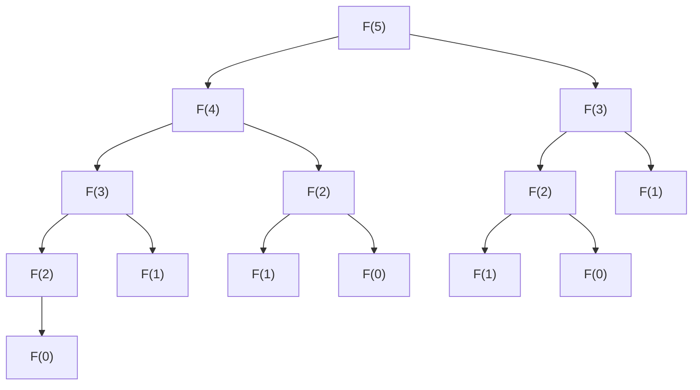
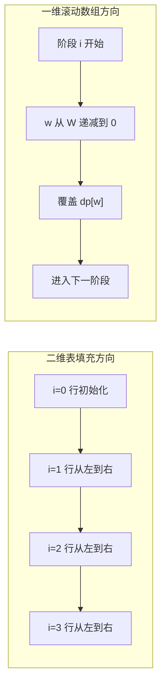
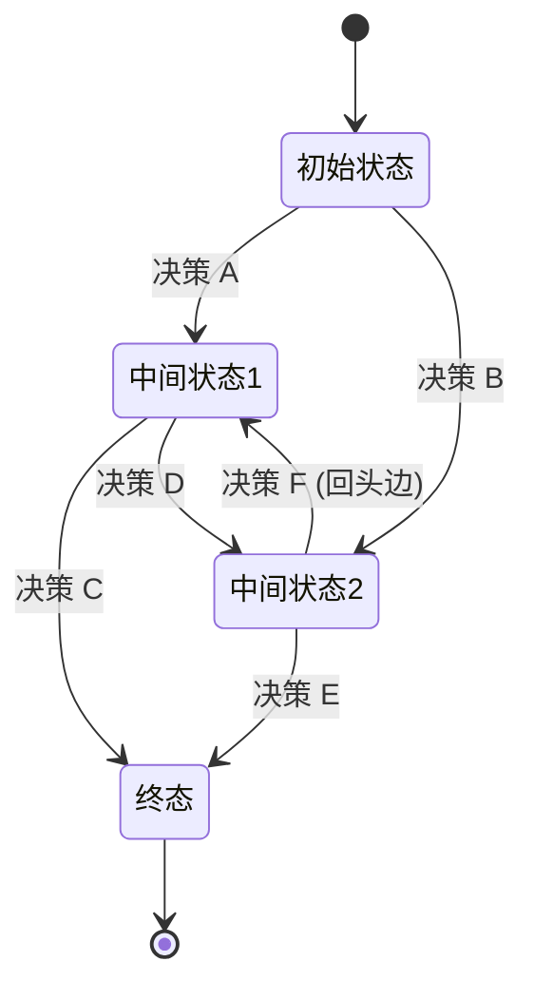
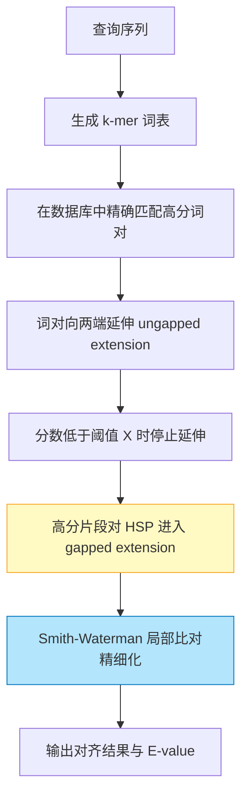

## 第 1 章 学习目标与导论

### 1.1 本章在算法知识体系中的位置

动态规划（dynamic programming，由 Richard Bellman 于 1950 年代在 RAND Corporation 提出，"dynamic" 借用其"时变、多阶段"含义，"programming" 在 1940s-1950s 数学规划语境中指"最优表格化方案"，并非"编写程序"）是算法设计四大范式（分治、贪心、DP、回溯）中最具普适性也最难掌握的一种。它位于算法知识体系的"设计范式层"，向上承接 `algorithm/算法分析基础与学习路线` 与 `algorithm/递归与回溯`，向下衔接 `algorithm/贪心算法`、`algorithm/分治算法`、`algorithm/动态规划状态压缩`、`algorithm/Floyd-Warshall算法` 等具体应用。

学习本章前，读者应当已经掌握：

- `algorithm/算法分析基础与学习路线`：渐近复杂度、递归式主定理
- `algorithm/递归与回溯`：递归树分析、子问题图
- `cs-fundamentals/离散数学`：集合、关系、归纳法

掌握本章后，读者将为后续学习 `algorithm/动态规划状态压缩`、`algorithm/Floyd-Warshall算法`、`algorithm/网络流` 等高级主题奠定坚实基础。

### 1.2 学习目标

本章遵循 Bloom 分类法，按认知层级递进组织学习目标：

1. **记忆（Remember）**：复述 Bellman 最优性原理的数学表述，识别动态规划的三大要素（最优子结构、重叠子问题、无后效性）。
2. **理解（Understand）**：解释动态规划从最优控制理论到计算机科学的演进脉络，说明"动态规划"命名的工程动机。
3. **应用（Apply）**：使用状态定义四步法推导一维、二维、区间、树形、状压、数位 DP 的状态转移方程。
4. **分析（Analyze）**：对比 DP 与分治、贪心、回溯的本质差异，论证给定问题是否具备最优子结构与重叠子问题性质。
5. **评估（Evaluate）**：评估滚动数组、单调队列、斜率优化、四边形不等式等优化技术的时间空间复杂度改进，选择合适的优化路径。
6. **创造（Create）**：设计面向生物信息学、NLP 分词、金融定价、推荐系统等工程场景的 DP 模型与实现。

### 1.3 阅读建议

- **零基础读者**：先通读第 5 章从暴力递归到 DP 的演进，建立直观认识后回看第 2、3、4 章理论与形式化定义；
- **有算法基础读者**：重点关注第 9-12 章的区间、树形、状压、数位 DP 与第 13 章优化技术；
- **进阶读者**：直接研读第 16、17 章的工程实践与开源项目案例研究。

---

## 第 2 章 历史动机与演进

### 2.1 1940s-1950s：运筹学与最优控制的诞生

动态规划的诞生与第二次世界大战后兴起的运筹学（Operations Research, OR）密切相关。1947 年 George Dantzig 在美国空军提出单纯形法（Simplex Method）求解线性规划（Linear Programming），"programming"一词从此在数学规划语境中表示"在约束下求最优的表格化方案"。这一术语被 Bellman 沿用。

1948 年美国空军资助成立 RAND Corporation（Research and Development Corporation），成为冷战时期运筹学与应用数学的核心研究机构。Richard Bellman 于 1952 年加入 RAND，致力于多阶段决策过程（multistage decision process）的研究，包括：

- 库存控制（inventory control）
- 资源分配（resource allocation）
- 最优控制（optimal control）
- 博弈论（game theory）

### 2.2 1952：Bellman 的奠基性论文

1952 年 8 月，Bellman 在 _Proceedings of the National Academy of Sciences_ 第 38 卷第 8 期发表《On the Theory of Dynamic Programming》，首次系统化提出动态规划的概念框架。该论文给出了著名的 **Bellman 方程**（Bellman equation）原型：

$$V(s) = \max_{a \in A(s)} \left\{ r(s, a) + \beta \sum_{s'} P(s' \mid s, a) V(s') \right\}$$

其中 $s$ 为状态，$a$ 为动作，$r$ 为即时回报，$\beta \in [0,1)$ 为折扣因子，$P$ 为状态转移概率。这一方程描述了多阶段决策问题中相邻状态最优值函数的递归关系，奠定了后续强化学习（Reinforcement Learning）与马尔可夫决策过程（MDP）的理论基础。

### 2.3 1957：专著《Dynamic Programming》

1957 年 Bellman 出版专著《Dynamic Programming》（Princeton University Press），系统阐述最优性原理（Principle of Optimality）：

> An optimal policy has the property that whatever the initial state and initial decision are, the remaining decisions must constitute an optimal policy with regard to the state resulting from the first decision.

即：最优策略的任意子策略也是最优的。这一原理等价于 CLRS 后提炼的"最优子结构"性质。

### 2.4 1960s-1970s：从最优控制到计算机科学

1960s 起动态规划被广泛引入计算机科学：

- **1962**：Bellman 与 Held、Karp 合作发表《A Dynamic Programming Approach to Sequencing Problems》，将 DP 应用于旅行商问题（TSP），即著名的 Held-Karp 算法，复杂度 $O(2^n \cdot n^2)$。
- **1966**：Stanley Gill 在《Numerical Analysis》中讨论 DP 的实现细节。
- **1968**：Donald Michie 提出"memo functions"概念，即现代术语的 **memoization**（记忆化），源自拉丁语 _memorandum_（应被记住的事物）。
- **1970**：Needleman 与 Wunsch 在 _Journal of Molecular Biology_ 发表蛋白质序列比对的 DP 算法，开创生物信息学先河。
- **1974**：Alfred Aho、John Hopcroft、Jeffrey Ullman 出版《The Design and Analysis of Computer Algorithms》，将 DP 列为五大算法设计技术之一。
- **1981**：Smith 与 Waterman 发表 _Identification of common molecular subsequences_，提出局部序列比对算法，沿用 DP 框架。

### 2.5 1989-2022：CLRS 的标准化与教学普及

1989 年 Cormen、Leiserson、Rivest 出版《Introduction to Algorithms》（第 1 版，即 CLRS 前身 CLR），将 DP 作为独立章节系统化教学，明确给出"最优子结构 + 重叠子问题"的两要素判定准则，并区分"自顶向下记忆化"与"自底向上递推"两种实现策略。

2022 年第 4 版（CLRS 4th）进一步补充：

- 强化学习与 MDP 的章节（第 33 章），与 Bellman 原始方程对接
- 在线算法与流算法中的 DP 思想
- 随机化 DP 与近似 DP

### 2.6 命名轶事：为何叫"Dynamic Programming"

Bellman 在自传《Eye of the Hurricane: An Autobiography》（1984）中坦言：

> "I spent the 1950s at RAND. My first task was to find a name for multistage decision processes. ... The word 'programming' was in vogue ... I wanted to get across the idea that this was dynamic, this was multistage, this was time-varying. ... I thought, let's kill two birds with one stone. Let's take a word that has an absolutely precise meaning, namely 'dynamic' ... Also, it is impossible to use the word 'dynamic' in a pejorative sense. ... The word 'research' was anathema to Wilson (RAND's then-president Charles Wilson). ... Hence, 'dynamic programming'."

可见该命名既反映了多阶段决策的时变本质，也包含规避管理层对"research"反感的工程考量。

---

## 第 3 章 形式化定义

### 3.1 多阶段决策过程

为了消除自然语言歧义，本节以数学形式化方式定义动态规划的语义。该形式化对应 Bellman 1957 专著与 CLRS 4th 第 14 章的定义。

设 $S$ 为状态空间，$A(s) \subseteq A$ 为状态 $s$ 下可行动作集合，$T: S \times A \to S$ 为状态转移函数（确定性情形），$r: S \times A \to \mathbb{R}$ 为即时回报函数，$\beta \in [0,1)$ 为折扣因子（无限阶段问题），$N \in \mathbb{N}^+$ 为阶段总数（有限阶段问题）。

**定义 3.1（策略，policy）**：策略 $\pi = (\pi_1, \pi_2, \dots, \pi_N)$ 是从状态到动作的映射序列，$\pi_k: S \to A$ 满足 $\pi_k(s) \in A(s)$。

**定义 3.2（值函数，value function）**：从初始状态 $s_0$ 出发，在策略 $\pi$ 下的累计回报为：

$$V^\pi(s_0) = \sum_{k=0}^{N-1} r(s_k, \pi_{k+1}(s_k)), \quad s_{k+1} = T(s_k, \pi_{k+1}(s_k))$$

**定义 3.3（最优值函数）**：

$$V^*(s) = \max_\pi V^\pi(s)$$

### 3.2 Bellman 方程

**定理 3.1（Bellman 最优性方程，确定性有限阶段）**：最优值函数满足递归关系：

$$V_k(s) = \max_{a \in A(s)} \left\{ r(s, a) + V_{k+1}(T(s, a)) \right\}, \quad k = 0, 1, \dots, N-1$$

边界条件 $V_N(s) = 0$（终点回报为 0）。该方程即为 **Bellman 方程**（Bellman, 1957）。

对于无限阶段折扣问题，方程变为：

$$V^*(s) = \max_{a \in A(s)} \left\{ r(s, a) + \beta \cdot V^*(T(s, a)) \right\}$$

### 3.3 最优子结构

**定义 3.4（最优子结构，optimal substructure）**：一个问题具有最优子结构性质，当且仅当其最优解可以由其子问题的最优解组合而成。形式化地，设 $\text{OPT}(P)$ 为问题 $P$ 的最优解，若 $P$ 可分解为子问题 $P_1, P_2, \dots, P_m$，则：

$$\text{OPT}(P) = \text{combine}\big( \text{OPT}(P_1), \text{OPT}(P_2), \dots, \text{OPT}(P_m) \big)$$

其中 $\text{combine}$ 为某种组合算子（如 $\max$、$+$、$\min$）。

**Bellman 最优性原理**（等价表述）：最优策略的任意子策略也是（从对应子状态出发的）最优策略。

### 3.4 重叠子问题

**定义 3.5（重叠子问题，overlapping subproblems）**：在递归求解过程中，若同一子问题被反复求解而非独立出现，则称该问题具有重叠子问题性质。形式化地，设 $S(P)$ 为求解 $P$ 时产生的子问题集合，若 $|S(P)| \ll |\text{recursion tree}(P)|$，即子问题总数远小于递归调用次数，则问题具有重叠子问题性质。

以斐波那契数列 $F(n) = F(n-1) + F(n-2)$ 为例，递归树规模为 $\Theta(\varphi^n)$（$\varphi = \frac{1+\sqrt{5}}{2}$），但实际不同的子问题仅有 $n+1$ 个：$F(0), F(1), \dots, F(n)$。

### 3.5 无后效性

**定义 3.6（无后效性，Markov property）**：状态 $s$ 确定后，其后续演化仅依赖 $s$ 本身，不依赖到达 $s$ 的历史路径。即：

$$\Pr(s_{k+1} \mid s_0, s_1, \dots, s_k, a_k) = \Pr(s_{k+1} \mid s_k, a_k)$$

无后效性是 DP 状态合法性的必要条件。若状态不满足无后效性，需扩展状态维度（如增加"已访问集合"）以恢复该性质，详见第 11 章状态压缩 DP。

### 3.6 状态转移方程

**定义 3.7（状态转移方程，state transition equation）**：DP 的状态转移方程是 Bellman 方程在具体问题上的实例化，形式为：

$$\text{dp}[s] = \underset{\text{transition} \in \mathcal{T}(s)}{\text{combine}} \left\{ \text{cost}(\text{transition}) \oplus \text{dp}[s'] \right\}$$

其中 $\mathcal{T}(s)$ 为状态 $s$ 的所有可能转移集合，$s'$ 为转移后的新状态，$\text{combine}$ 通常为 $\max$ 或 $\min$，$\oplus$ 通常为 $+$。

例如 0-1 背包问题中：

$$\text{dp}[i][w] = \max\big( \text{dp}[i-1][w], \ \text{dp}[i-1][w - w_i] + v_i \big)$$

边界条件 $\text{dp}[0][w] = 0$，$\text{dp}[i][w] = -\infty$ 当 $w < 0$。

---

## 第 4 章 理论推导

### 4.1 最优子结构引理

**引理 4.1（最优子结构引理）**：设问题 $P$ 可分解为子问题 $P_1, P_2, \dots, P_m$，且 $P$ 的任一解可表示为 $(x_1, x_2, \dots, x_m)$，其中 $x_i$ 为 $P_i$ 的解。若 $P$ 满足最优子结构，则其最优解 $(x_1^*, x_2^*, \dots, x_m^*)$ 满足：对任意 $i$，$x_i^*$ 是 $P_i$ 在给定其他分量的最优解下的最优解。

**证明**（反证法）：

假设存在 $i$ 使得 $x_i^*$ 不是 $P_i$（在 $x_1^*, \dots, x_{i-1}^*, x_{i+1}^*, \dots, x_m^*$ 固定下）的最优解。即存在 $x_i'$ 使得总目标值更优：

$$\text{obj}(x_1^*, \dots, x_i', \dots, x_m^*) > \text{obj}(x_1^*, \dots, x_i^*, \dots, x_m^*)$$

但这与 $(x_1^*, \dots, x_m^*)$ 是 $P$ 的最优解矛盾。$\square$

### 4.2 重叠子问题定理

**定理 4.2（重叠子问题定理）**：设递归算法求解问题 $P$ 时产生的递归树为 $T$，不同子问题总数为 $|S|$，则：

- 纯递归算法的时间复杂度为 $\Omega(\text{leaf count of } T)$
- 记忆化递归（memoization）的时间复杂度为 $O(|S| \cdot \text{transition cost})$
- 自底向上递推的时间复杂度同为 $O(|S| \cdot \text{transition cost})$

**证明**：

记忆化保证每个子问题仅计算一次，每次计算的代价由其转移代价 $\text{transition cost}$ 决定（包含遍历所有可行动作）。总代价即为 $|S| \cdot \text{transition cost}$。

自底向上递推按拓扑顺序填充状态表，每个状态仅访问一次，代价同上。$\square$

### 4.3 时间复杂度公式

DP 的总时间复杂度可表示为：

$$T_{\text{DP}} = \Theta(|\text{state space}| \times |\text{transitions per state}|)$$

**状态数 × 转移数** 是 DP 复杂度分析的核心公式。常见示例如下：

| 问题        | 状态空间              | 每状态转移数 | 总复杂度                |
| :---------- | :-------------------- | :----------- | :---------------------- |
| 斐波那契    | $\Theta(n)$           | $\Theta(1)$  | $\Theta(n)$             |
| LCS         | $\Theta(mn)$          | $\Theta(1)$  | $\Theta(mn)$            |
| 0-1 背包    | $\Theta(nW)$          | $\Theta(1)$  | $\Theta(nW)$            |
| 矩阵链乘法  | $\Theta(n^2)$         | $\Theta(n)$  | $\Theta(n^3)$           |
| TSP（状压） | $\Theta(2^n \cdot n)$ | $\Theta(n)$  | $\Theta(2^n \cdot n^2)$ |

### 4.4 空间复杂度与滚动数组优化

**定理 4.3（滚动数组优化）**：若 DP 状态 $\text{dp}[i][j]$ 的转移仅依赖 $\text{dp}[i-1][\cdot]$（前一阶段），则可将空间复杂度从 $O(|S|)$ 优化至 $O(\text{sizeof single stage})$。

**证明**：

设阶段 $i$ 的状态集合为 $S_i = \{ \text{dp}[i][j] : j \in J_i \}$。若转移关系为：

$$\text{dp}[i][j] = f\big( \text{dp}[i-1][j'], \dots \big)$$

即不依赖 $\text{dp}[i-2][\cdot]$ 及更早阶段，则可在阶段 $i$ 计算完成后丢弃 $\text{dp}[i-2][\cdot]$ 的存储。最简实现为两个一维数组交替使用，空间降至 $O(\max_i |S_i|)$。

进一步地，若转移仅依赖 $j' \leq j$（或 $j' \geq j$），可使用单一一维数组并按相应方向遍历，空间降至 $O(|J_i|)$。$\square$

**例 4.1**：0-1 背包中 $\text{dp}[i][w] = \max(\text{dp}[i-1][w], \text{dp}[i-1][w - w_i] + v_i)$，第二项依赖更小的 $w$，故使用单一一维数组时 $w$ 必须从大到小遍历，否则 $\text{dp}[w - w_i]$ 已被本阶段更新，相当于物品被重复选取。

### 4.5 正确性论证：循环不变式

DP 算法的正确性证明通常基于**循环不变式**（loop invariant）。以 0-1 背包为例：

**不变式**：在第 $i$ 次外层循环开始前，对任意 $w \in [0, W]$，$\text{dp}[w]$ 等于"从前 $i-1$ 个物品中选取、总重量不超过 $w$ 时的最大价值"。

**初始化**：$i = 0$ 时 $\text{dp}[w] = 0$ 对所有 $w$ 成立（空物品集只有 0 价值解）。

**保持**：假设 $i = k$ 时不变式成立。第 $k$ 次迭代中，更新 $\text{dp}[w]$ 为：

$$\text{dp}[w] = \max(\text{dp}[w], \text{dp}[w - w_k] + v_k)$$

由 $w$ 从大到小遍历，$\text{dp}[w - w_k]$ 仍为阶段 $k-1$ 的值。新 $\text{dp}[w]$ 即"从前 $k$ 个物品中选取、总重量不超过 $w$ 时的最大价值"。不变式保持。

**终止**：$i = n$ 时不变式给出 $\text{dp}[W]$ 即所求。$\square$

### 4.6 伪多项式复杂度的严格定义

**定义 4.1（伪多项式时间，pseudo-polynomial time）**：算法 $A$ 的运行时间为 $O(p(n, V))$，其中 $n$ 为输入规模，$V$ 为输入数值的最大值。若 $V$ 随 $n$ 指数增长（即 $V = \Theta(2^n)$），则 $A$ 实际是指数时间。

0-1 背包的 $O(nW)$ 中，$W$ 以二进制编码需要 $\log W$ 位，故严格意义下输入规模为 $n + \log W$，$O(nW)$ 是指数级。这从理论上解释了为何 0-1 背包是 NP 完全问题。

---

## 第 5 章 从暴力递归到动态规划

### 5.1 三阶段演进路径

动态规划的演进路径可概括为：**暴力递归 → 记忆化搜索 → 自底向上递推**。下面以斐波那契数列 $F(n) = F(n-1) + F(n-2), F(0) = 0, F(1) = 1$ 为例展示三种写法的本质差异。

### 5.2 阶段 1：暴力递归

暴力递归直接翻译递推式，时间复杂度 $O(\varphi^n)$（$\varphi = \frac{1+\sqrt{5}}{2} \approx 1.618$），空间 $O(n)$（递归栈）。

```python
def fib_recursive(n: int) -> int:
    """暴力递归求斐波那契数。时间 O(phi^n)，空间 O(n)。"""
    if n <= 1:
        return n
    return fib_recursive(n - 1) + fib_recursive(n - 2)


# 测试
print(fib_recursive(10))   # 输出: 55
print(fib_recursive(20))   # 输出: 6765
```

**递归树展示重叠子问题**（以 $F(5)$ 为例）：



可见 $F(3)$ 被计算 2 次，$F(2)$ 被计算 3 次，$F(1)$ 被计算 5 次。递归树规模 $\Theta(\varphi^n)$，但不同子问题仅 $n+1$ 个。

### 5.3 阶段 2：记忆化搜索

记忆化搜索（memoization，Donald Michie 于 1968 年提出，源自拉丁语 _memorandum_ "应被记住的事物"）通过缓存已计算结果，将时间复杂度降至 $O(n)$。

```python
def fib_memo(n: int, memo: dict = None) -> int:
    """记忆化搜索求斐波那契数。时间 O(n)，空间 O(n)。"""
    if memo is None:
        memo = {}
    if n in memo:
        return memo[n]
    if n <= 1:
        return n
    memo[n] = fib_memo(n - 1, memo) + fib_memo(n - 2, memo)
    return memo[n]


# 测试
print(fib_memo(100))   # 输出: 354224848179261915075
```

```java
import java.util.HashMap;
import java.util.Map;

public class FibonacciMemo {
    /** 记忆化搜索求斐波那契数。 */
    public static long fibMemo(int n) {
        return fibMemo(n, new HashMap<>());
    }

    private static long fibMemo(int n, Map<Integer, Long> memo) {
        if (n <= 1) return n;
        if (memo.containsKey(n)) return memo.get(n);
        long result = fibMemo(n - 1, memo) + fibMemo(n - 2, memo);
        memo.put(n, result);
        return result;
    }

    public static void main(String[] args) {
        System.out.println(fibMemo(50));   // 输出: 12586269025
    }
}
```

### 5.4 阶段 3：自底向上递推

自底向上递推按依赖顺序填表，消除递归开销。时间 $O(n)$，空间可优化至 $O(1)$。

```python
def fib_dp_array(n: int) -> int:
    """自底向上递推求斐波那契数。时间 O(n)，空间 O(n)。"""
    if n <= 1:
        return n
    dp = [0] * (n + 1)
    dp[1] = 1
    for i in range(2, n + 1):
        dp[i] = dp[i - 1] + dp[i - 2]
    return dp[n]


def fib_dp_optimized(n: int) -> int:
    """滚动数组优化求斐波那契数。时间 O(n)，空间 O(1)。"""
    if n <= 1:
        return n
    prev, curr = 0, 1
    for _ in range(2, n + 1):
        prev, curr = curr, prev + curr
    return curr


# 测试
print(fib_dp_array(10))     # 输出: 55
print(fib_dp_optimized(100))  # 输出: 354224848179261915075
```

```cpp
#include <cstdint>
#include <iostream>

// 自底向上递推求斐波那契数。时间 O(n)，空间 O(1)。
int64_t fibDP(int n) {
    if (n <= 1) return n;
    int64_t prev = 0, curr = 1;
    for (int i = 2; i <= n; i++) {
        int64_t next = prev + curr;
        prev = curr;
        curr = next;
    }
    return curr;
}

int main() {
    std::cout << fibDP(50) << "\n";   // 输出: 12586269025
    return 0;
}
```

### 5.5 三种实现对比

| 实现方式     | 时间           | 空间          | 优点                   | 缺点                   |
| :----------- | :------------- | :------------ | :--------------------- | :--------------------- |
| 暴力递归     | $O(\varphi^n)$ | $O(n)$        | 直观、易写             | 重复计算、栈溢出       |
| 记忆化搜索   | $O(n)$         | $O(n)$        | 仅计算实际状态、易扩展 | 递归栈开销、可能溢出   |
| 自底向上递推 | $O(n)$         | $O(n)$→$O(1)$ | 常数因子小、易优化     | 需预先确定状态依赖顺序 |

### 5.6 DP 的核心价值

DP 的核心价值在于：**用空间换时间，将指数级的搜索空间压缩为多项式级**。设递归树规模为 $R$，不同子问题数为 $S$，则：

$$\text{DP 时间} = O(S \cdot T_{\text{transition}}), \quad \text{递归时间} = \Theta(R), \quad \text{当 } R \gg S \text{ 时收益巨大}$$

> 跨模块引用：DP 与贪心、分治的本质区别参见 [算法分析基础](algorithm/算法分析基础与学习路线) 中的范式对比。

---

## 第 6 章 一维 DP

### 6.1 爬楼梯

**问题**：有 $n$ 阶楼梯，每次可跨 1 或 2 阶，问有多少种爬法？

**状态定义**：$\text{dp}[i]$ = 爬到第 $i$ 阶的方法数。

**转移方程**：

$$\text{dp}[i] = \text{dp}[i-1] + \text{dp}[i-2], \quad \text{dp}[0] = 1, \ \text{dp}[1] = 1$$

```python
def climb_stairs(n: int) -> int:
    """爬楼梯方法数。时间 O(n)，空间 O(1)。"""
    if n <= 1:
        return 1
    prev, curr = 1, 1
    for _ in range(2, n + 1):
        prev, curr = curr, prev + curr
    return curr


# 测试
print(climb_stairs(5))   # 输出: 8
print(climb_stairs(10))  # 输出: 89
```

```cpp
#include <iostream>

// 爬楼梯方法数。时间 O(n)，空间 O(1)。
int climbStairs(int n) {
    if (n <= 1) return 1;
    int prev = 1, curr = 1;
    for (int i = 2; i <= n; i++) {
        int next = prev + curr;
        prev = curr;
        curr = next;
    }
    return curr;
}

int main() {
    std::cout << climbStairs(5) << "\n";   // 输出: 8
    return 0;
}
```

### 6.2 打家劫舍

**问题**：沿街排列 $n$ 个房子，第 $i$ 个房子有价值 $v[i]$，不能偷相邻两间，求最大收益。

**状态定义**：$\text{dp}[i]$ = 考虑前 $i$ 个房子的最大收益。

**转移方程**：

$$\text{dp}[i] = \max(\text{dp}[i-1], \ \text{dp}[i-2] + v[i])$$

```python
def rob(nums: list[int]) -> int:
    """打家劫舍。时间 O(n)，空间 O(1)。"""
    if not nums:
        return 0
    if len(nums) == 1:
        return nums[0]
    prev, curr = 0, nums[0]
    for i in range(1, len(nums)):
        prev, curr = curr, max(curr, prev + nums[i])
    return curr


# 测试
print(rob([1, 2, 3, 1]))    # 输出: 4
print(rob([2, 7, 9, 3, 1]))  # 输出: 12
```

```java
public class HouseRobber {
    /** 打家劫舍。时间 O(n)，空间 O(1)。 */
    public static int rob(int[] nums) {
        if (nums == null || nums.length == 0) return 0;
        if (nums.length == 1) return nums[0];
        int prev = 0, curr = nums[0];
        for (int i = 1; i < nums.length; i++) {
            int next = Math.max(curr, prev + nums[i]);
            prev = curr;
            curr = next;
        }
        return curr;
    }

    public static void main(String[] args) {
        System.out.println(rob(new int[]{1, 2, 3, 1}));   // 输出: 4
    }
}
```

### 6.3 股票买卖 I：单次交易

**问题**：给定股价数组，仅允许买卖一次，求最大利润。

**状态定义**：$\text{dp}[i]$ = 第 $i$ 天卖出时的最大利润。

$$\text{dp}[i] = \text{prices}[i] - \min_{j < i} \text{prices}[j]$$

```python
def max_profit_one_transaction(prices: list[int]) -> int:
    """单次交易最大利润。时间 O(n)，空间 O(1)。"""
    if not prices:
        return 0
    min_price = prices[0]
    max_profit = 0
    for p in prices[1:]:
        max_profit = max(max_profit, p - min_price)
        min_price = min(min_price, p)
    return max_profit


# 测试
print(max_profit_one_transaction([7, 1, 5, 3, 6, 4]))  # 输出: 5
```

### 6.4 股票买卖 II：任意次交易

**问题**：允许多次买卖，但同一时刻只能持有一股。

**状态定义**：

- $\text{dp}[i][0]$ = 第 $i$ 天结束时不持有股票的最大利润
- $\text{dp}[i][1]$ = 第 $i$ 天结束时持有股票的最大利润

**转移方程**：

$$\text{dp}[i][0] = \max(\text{dp}[i-1][0], \ \text{dp}[i-1][1] + \text{prices}[i])$$
$$\text{dp}[i][1] = \max(\text{dp}[i-1][1], \ \text{dp}[i-1][0] - \text{prices}[i])$$

```python
def max_profit_unlimited(prices: list[int]) -> int:
    """任意次交易最大利润。时间 O(n)，空间 O(1)。"""
    if not prices:
        return 0
    cash, hold = 0, -prices[0]
    for p in prices[1:]:
        cash, hold = max(cash, hold + p), max(hold, cash - p)
    return cash


# 测试
print(max_profit_unlimited([7, 1, 5, 3, 6, 4]))  # 输出: 7
```

### 6.5 股票买卖 III：含手续费与冷却期

**含手续费**：每次卖出支付 fee。

```python
def max_profit_with_fee(prices: list[int], fee: int) -> int:
    """含手续费的任意次交易。"""
    cash, hold = 0, -prices[0]
    for p in prices[1:]:
        cash = max(cash, hold + p - fee)
        hold = max(hold, cash - p)
    return cash


# 测试
print(max_profit_with_fee([1, 3, 2, 8, 4, 9], 2))  # 输出: 8
```

**含冷却期**：卖出后第二天不能买入。

```python
def max_profit_with_cooldown(prices: list[int]) -> int:
    """含冷却期的任意次交易。"""
    if not prices:
        return 0
    # 三状态：持有 / 不持有且冻结 / 不持有且不冻结
    hold, freeze, unfreeze = -prices[0], 0, 0
    for p in prices[1:]:
        prev_hold, prev_freeze, prev_unfreeze = hold, freeze, unfreeze
        hold = max(prev_hold, prev_unfreeze - p)
        freeze = prev_hold + p
        unfreeze = max(prev_unfreeze, prev_freeze)
    return max(freeze, unfreeze)


# 测试
print(max_profit_with_cooldown([1, 2, 3, 0, 2]))  # 输出: 3
```

### 6.6 最大子数组和（Kadane 算法）

**问题**：给定整数数组，求连续子数组的最大和。

**状态定义**：$\text{dp}[i]$ = 以 $\text{nums}[i]$ 结尾的最大子数组和。

$$\text{dp}[i] = \max(\text{nums}[i], \ \text{dp}[i-1] + \text{nums}[i])$$

```python
def max_subarray(nums: list[int]) -> int:
    """最大子数组和（Kadane 算法）。时间 O(n)，空间 O(1)。"""
    if not nums:
        return 0
    max_sum = curr_sum = nums[0]
    for x in nums[1:]:
        curr_sum = max(x, curr_sum + x)
        max_sum = max(max_sum, curr_sum)
    return max_sum


# 测试
print(max_subarray([-2, 1, -3, 4, -1, 2, 1, -5, 4]))  # 输出: 6
```

```cpp
#include <algorithm>
#include <iostream>
#include <vector>

// 最大子数组和。时间 O(n)，空间 O(1)。
int maxSubarray(const std::vector<int>& nums) {
    int maxSum = nums[0], currSum = nums[0];
    for (size_t i = 1; i < nums.size(); i++) {
        currSum = std::max(nums[i], currSum + nums[i]);
        maxSum = std::max(maxSum, currSum);
    }
    return maxSum;
}

int main() {
    std::cout << maxSubarray({-2, 1, -3, 4, -1, 2, 1, -5, 4}) << "\n";  // 输出: 6
    return 0;
}
```

### 6.7 零钱兑换

**问题**：给定硬币面额数组与金额 amount，求凑成 amount 的最少硬币数。

**状态定义**：$\text{dp}[a]$ = 凑成金额 $a$ 的最少硬币数。

$$\text{dp}[a] = \min_{c \in \text{coins}, c \leq a} \big( \text{dp}[a - c] + 1 \big)$$

```python
def coin_change(coins: list[int], amount: int) -> int:
    """零钱兑换：最少硬币数。时间 O(n*amount)，空间 O(amount)。"""
    INF = float('inf')
    dp = [0] + [INF] * amount
    for a in range(1, amount + 1):
        for c in coins:
            if c <= a:
                dp[a] = min(dp[a], dp[a - c] + 1)
    return dp[amount] if dp[amount] != INF else -1


# 测试
print(coin_change([1, 2, 5], 11))   # 输出: 3
print(coin_change([2], 3))          # 输出: -1
```

```java
public class CoinChange {
    public static int coinChange(int[] coins, int amount) {
        int INF = amount + 1;
        int[] dp = new int[amount + 1];
        java.util.Arrays.fill(dp, INF);
        dp[0] = 0;
        for (int a = 1; a <= amount; a++) {
            for (int c : coins) {
                if (c <= a) dp[a] = Math.min(dp[a], dp[a - c] + 1);
            }
        }
        return dp[amount] == INF ? -1 : dp[amount];
    }

    public static void main(String[] args) {
        System.out.println(coinChange(new int[]{1, 2, 5}, 11));   // 输出: 3
    }
}
```

### 6.8 零钱兑换 II：组合数

**问题**：求凑成 amount 的方案数（不同顺序视为同一种）。

```python
def coin_change_ways(coins: list[int], amount: int) -> int:
    """零钱兑换：组合数。外层物品、内层容量。"""
    dp = [0] * (amount + 1)
    dp[0] = 1
    for c in coins:
        for a in range(c, amount + 1):
            dp[a] += dp[a - c]
    return dp[amount]


# 测试
print(coin_change_ways([1, 2, 5], 5))   # 输出: 4
```

### 6.9 整数拆分

**问题**：将整数 $n$ 拆分为若干正整数之和，使乘积最大。

```python
def integer_break(n: int) -> int:
    """整数拆分最大乘积。时间 O(n^2)，空间 O(n)。"""
    dp = [0] * (n + 1)
    dp[1] = 1
    for i in range(2, n + 1):
        for j in range(1, i):
            dp[i] = max(dp[i], j * (i - j), j * dp[i - j])
    return dp[n]


# 测试
print(integer_break(10))  # 输出: 36
```

### 6.10 解码方法

**问题**：字母 'A'→1, ..., 'Z'→26，给定数字串，求解码方法数。

```python
def num_decodings(s: str) -> int:
    """解码方法数。"""
    if not s or s[0] == '0':
        return 0
    n = len(s)
    dp = [0] * (n + 1)
    dp[0] = dp[1] = 1
    for i in range(2, n + 1):
        if s[i - 1] != '0':
            dp[i] += dp[i - 1]
        two = int(s[i - 2:i])
        if 10 <= two <= 26:
            dp[i] += dp[i - 2]
    return dp[n]


# 测试
print(num_decodings("226"))   # 输出: 3
print(num_decodings("12"))    # 输出: 2
```

---

## 第 7 章 二维 DP 与序列问题

### 7.1 最长公共子序列（LCS）

**问题**：给定两个序列 $X$ 与 $Y$，求它们的最长公共子序列的长度（子序列不要求连续）。

**状态定义**：$\text{dp}[i][j]$ = $X[0..i-1]$ 与 $Y[0..j-1]$ 的 LCS 长度。

**转移方程**：

$$\text{dp}[i][j] = \begin{cases} \text{dp}[i-1][j-1] + 1 & \text{if } X[i-1] = Y[j-1] \\ \max(\text{dp}[i-1][j], \text{dp}[i][j-1]) & \text{otherwise} \end{cases}$$

**填表可视化**（$X$="ABCBDAB", $Y$="BDCABA"）：

```text
      ""  B  D  C  A  B  A
  ""   0  0  0  0  0  0  0
  A    0  0  0  0  1  1  1
  B    0  1  1  1  1  2  2
  C    0  1  1  2  2  2  2
  B    0  1  1  2  2  3  3
  D    0  1  2  2  2  3  3
  A    0  1  2  2  3  3  4
  B    0  1  2  2  3  4  4

LCS 长度 = 4, LCS = "BCBA" 或 "BDAB"
```

```python
def lcs_length(text1: str, text2: str) -> int:
    """最长公共子序列长度。时间 O(mn)，空间 O(mn)。"""
    m, n = len(text1), len(text2)
    dp = [[0] * (n + 1) for _ in range(m + 1)]
    for i in range(1, m + 1):
        for j in range(1, n + 1):
            if text1[i - 1] == text2[j - 1]:
                dp[i][j] = dp[i - 1][j - 1] + 1
            else:
                dp[i][j] = max(dp[i - 1][j], dp[i][j - 1])
    return dp[m][n]


def lcs_string(text1: str, text2: str) -> str:
    """还原 LCS 字符串。"""
    m, n = len(text1), len(text2)
    dp = [[0] * (n + 1) for _ in range(m + 1)]
    for i in range(1, m + 1):
        for j in range(1, n + 1):
            if text1[i - 1] == text2[j - 1]:
                dp[i][j] = dp[i - 1][j - 1] + 1
            else:
                dp[i][j] = max(dp[i - 1][j], dp[i][j - 1])
    # 回溯
    result = []
    i, j = m, n
    while i > 0 and j > 0:
        if text1[i - 1] == text2[j - 1]:
            result.append(text1[i - 1])
            i -= 1
            j -= 1
        elif dp[i - 1][j] > dp[i][j - 1]:
            i -= 1
        else:
            j -= 1
    return ''.join(reversed(result))


# 测试
print(lcs_length("ABCBDAB", "BDCABA"))   # 输出: 4
print(lcs_string("ABCBDAB", "BDCABA"))   # 输出: BDAB
```

```cpp
#include <algorithm>
#include <string>
#include <vector>

// LCS 长度。时间 O(mn)，空间 O(mn)。
int lcsLength(const std::string& text1, const std::string& text2) {
    int m = text1.size(), n = text2.size();
    std::vector<std::vector<int>> dp(m + 1, std::vector<int>(n + 1, 0));
    for (int i = 1; i <= m; i++) {
        for (int j = 1; j <= n; j++) {
            if (text1[i - 1] == text2[j - 1]) {
                dp[i][j] = dp[i - 1][j - 1] + 1;
            } else {
                dp[i][j] = std::max(dp[i - 1][j], dp[i][j - 1]);
            }
        }
    }
    return dp[m][n];
}
```

### 7.2 最长公共子串

**问题**：求两个字符串的最长连续公共子串。

**状态定义**：$\text{dp}[i][j]$ = 以 $X[i-1]$ 与 $Y[j-1]$ 结尾的最长公共子串长度。

$$\text{dp}[i][j] = \begin{cases} \text{dp}[i-1][j-1] + 1 & \text{if } X[i-1] = Y[j-1] \\ 0 & \text{otherwise} \end{cases}$$

```python
def longest_common_substring(s1: str, s2: str) -> str:
    """最长公共子串。时间 O(mn)，空间 O(mn)。"""
    m, n = len(s1), len(s2)
    dp = [[0] * (n + 1) for _ in range(m + 1)]
    max_len, end_i = 0, 0
    for i in range(1, m + 1):
        for j in range(1, n + 1):
            if s1[i - 1] == s2[j - 1]:
                dp[i][j] = dp[i - 1][j - 1] + 1
                if dp[i][j] > max_len:
                    max_len, end_i = dp[i][j], i
    return s1[end_i - max_len:end_i]


# 测试
print(longest_common_substring("abcdef", "zcdem"))   # 输出: cde
```

### 7.3 编辑距离（Levenshtein 距离）

**问题**：给定两个字符串 word1 与 word2，允许三种操作（插入、删除、替换），求将 word1 转换为 word2 的最少操作次数。

**状态定义**：$\text{dp}[i][j]$ = word1[0..i-1] 转换为 word2[0..j-1] 的最少操作数。

**转移方程**：

$$\text{dp}[i][j] = \begin{cases} \text{dp}[i-1][j-1] & \text{if } \text{word1}[i-1] = \text{word2}[j-1] \\ 1 + \min \big( \text{dp}[i-1][j], \text{dp}[i][j-1], \text{dp}[i-1][j-1] \big) & \text{otherwise} \end{cases}$$

边界条件 $\text{dp}[i][0] = i$, $\text{dp}[0][j] = j$。

```python
def edit_distance(word1: str, word2: str) -> int:
    """编辑距离。时间 O(mn)，空间 O(mn)。"""
    m, n = len(word1), len(word2)
    dp = [[0] * (n + 1) for _ in range(m + 1)]
    for i in range(m + 1):
        dp[i][0] = i
    for j in range(n + 1):
        dp[0][j] = j
    for i in range(1, m + 1):
        for j in range(1, n + 1):
            if word1[i - 1] == word2[j - 1]:
                dp[i][j] = dp[i - 1][j - 1]
            else:
                dp[i][j] = min(dp[i - 1][j], dp[i][j - 1], dp[i - 1][j - 1]) + 1
    return dp[m][n]


def edit_distance_optimized(word1: str, word2: str) -> int:
    """滚动数组优化版。空间 O(min(m, n))。"""
    if len(word1) < len(word2):
        word1, word2 = word2, word1
    m, n = len(word1), len(word2)
    prev = list(range(n + 1))
    for i in range(1, m + 1):
        curr = [i] + [0] * n
        for j in range(1, n + 1):
            if word1[i - 1] == word2[j - 1]:
                curr[j] = prev[j - 1]
            else:
                curr[j] = min(prev[j], curr[j - 1], prev[j - 1]) + 1
        prev = curr
    return prev[n]


# 测试
print(edit_distance("horse", "ros"))           # 输出: 3
print(edit_distance_optimized("intention", "execution"))  # 输出: 5
```

```java
public class EditDistance {
    public static int editDistance(String word1, String word2) {
        int m = word1.length(), n = word2.length();
        int[][] dp = new int[m + 1][n + 1];
        for (int i = 0; i <= m; i++) dp[i][0] = i;
        for (int j = 0; j <= n; j++) dp[0][j] = j;
        for (int i = 1; i <= m; i++) {
            for (int j = 1; j <= n; j++) {
                if (word1.charAt(i - 1) == word2.charAt(j - 1)) {
                    dp[i][j] = dp[i - 1][j - 1];
                } else {
                    dp[i][j] = 1 + Math.min(
                        Math.min(dp[i - 1][j], dp[i][j - 1]),
                        dp[i - 1][j - 1]
                    );
                }
            }
        }
        return dp[m][n];
    }

    public static void main(String[] args) {
        System.out.println(editDistance("horse", "ros"));   // 输出: 3
    }
}
```

### 7.4 最长递增子序列（LIS）

**问题**：给定整数数组，找到最长严格递增子序列的长度。

#### 7.4.1 O(n²) DP 解法

**状态定义**：$\text{dp}[i]$ = 以 $\text{nums}[i]$ 结尾的 LIS 长度。

$$\text{dp}[i] = \max_{j < i, \text{nums}[j] < \text{nums}[i]} \big( \text{dp}[j] + 1 \big), \quad \text{dp}[i] = 1 \text{ if no such } j$$

```python
def lis_dp(nums: list[int]) -> int:
    """LIS O(n^2) DP。空间 O(n)。"""
    if not nums:
        return 0
    n = len(nums)
    dp = [1] * n
    for i in range(1, n):
        for j in range(i):
            if nums[j] < nums[i]:
                dp[i] = max(dp[i], dp[j] + 1)
    return max(dp)


# 测试
print(lis_dp([10, 9, 2, 5, 3, 7, 101, 18]))  # 输出: 4
```

```cpp
#include <algorithm>
#include <vector>

// LIS O(n^2) DP。
int lisDP(const std::vector<int>& nums) {
    if (nums.empty()) return 0;
    int n = nums.size();
    std::vector<int> dp(n, 1);
    for (int i = 1; i < n; i++) {
        for (int j = 0; j < i; j++) {
            if (nums[j] < nums[i]) {
                dp[i] = std::max(dp[i], dp[j] + 1);
            }
        }
    }
    return *std::max_element(dp.begin(), dp.end());
}
```

#### 7.4.2 O(n log n) 贪心 + 二分解法

维护数组 `tails`，`tails[i]` 表示长度为 $i+1$ 的递增子序列的最小末尾元素。对每个元素，用二分查找确定其在 `tails` 中的位置。

```python
import bisect


def lis_binary(nums: list[int]) -> int:
    """LIS O(n log n) 贪心+二分。空间 O(n)。"""
    tails = []
    for x in nums:
        pos = bisect.bisect_left(tails, x)
        if pos == len(tails):
            tails.append(x)
        else:
            tails[pos] = x
    return len(tails)


# 测试
print(lis_binary([10, 9, 2, 5, 3, 7, 101, 18]))  # 输出: 4
```

```cpp
#include <algorithm>
#include <vector>

// LIS O(n log n)。
int lisBinary(const std::vector<int>& nums) {
    std::vector<int> tails;
    for (int x : nums) {
        auto it = std::lower_bound(tails.begin(), tails.end(), x);
        if (it == tails.end()) tails.push_back(x);
        else *it = x;
    }
    return tails.size();
}
```

**等价性证明**：`tails` 数组始终递增。当新元素 $x$ 大于 `tails` 末尾时，可以扩展最长子序列；否则用 $x$ 替换 `tails` 中第一个 $\geq x$ 的元素，保证了未来能接上更小的元素，从而获得更长的递增子序列。

### 7.5 最长回文子序列

**状态定义**：$\text{dp}[i][j]$ = $s[i..j]$ 中最长回文子序列的长度。

$$\text{dp}[i][j] = \begin{cases} \text{dp}[i+1][j-1] + 2 & \text{if } s[i] = s[j] \\ \max(\text{dp}[i+1][j], \text{dp}[i][j-1]) & \text{otherwise} \end{cases}$$

边界条件 $\text{dp}[i][i] = 1$。

```python
def longest_palindrome_subseq(s: str) -> int:
    """最长回文子序列长度。区间 DP。"""
    n = len(s)
    if n == 0:
        return 0
    dp = [[0] * n for _ in range(n)]
    for i in range(n):
        dp[i][i] = 1
    # 按长度递增枚举
    for length in range(2, n + 1):
        for i in range(n - length + 1):
            j = i + length - 1
            if s[i] == s[j]:
                dp[i][j] = (dp[i + 1][j - 1] if length > 2 else 0) + 2
            else:
                dp[i][j] = max(dp[i + 1][j], dp[i][j - 1])
    return dp[0][n - 1]


# 测试
print(longest_palindrome_subseq("bbbab"))  # 输出: 4
```

### 7.6 最长回文子串

**中心扩展法**：$O(n^2)$ 时间，$O(1)$ 空间。

```python
def longest_palindrome_substring(s: str) -> str:
    """最长回文子串。中心扩展法。"""
    if not s:
        return ""

    def expand(l: int, r: int) -> int:
        while l >= 0 and r < len(s) and s[l] == s[r]:
            l -= 1
            r += 1
        return r - l - 1

    start, max_len = 0, 0
    for i in range(len(s)):
        len1 = expand(i, i)
        len2 = expand(i, i + 1)
        curr = max(len1, len2)
        if curr > max_len:
            max_len = curr
            start = i - (curr - 1) // 2
    return s[start:start + max_len]


# 测试
print(longest_palindrome_substring("babad"))  # 输出: bab
```

### 7.7 子序列 vs 子串：状态定义差异

| 问题 | 子序列（不连续）                                | 子串（连续）           |
| :--- | :---------------------------------------------- | :--------------------- |
| LCS  | $\text{dp}[i][j]$ 从 $\text{dp}[i-1][j-1]$ 转移 | 最长公共子串需连续匹配 |
| 回文 | $\text{dp}[i][j]$ 从 $\text{dp}[i+1][j-1]$ 转移 | 中心扩展法             |
| 递增 | $\text{dp}[i]$ 从所有 $j<i$ 转移                | 需要连续递增条件       |

---

## 第 8 章 背包问题家族

### 8.1 0-1 背包

**问题**：给定 $n$ 个物品，每个物品有重量 $w[i]$ 与价值 $v[i]$，背包容量为 $W$。每个物品只能选 0 或 1 个，求最大总价值。

**状态定义**：$\text{dp}[i][w]$ = 从前 $i$ 个物品中选取、总重量不超过 $w$ 时的最大价值。

**转移方程**：

$$\text{dp}[i][w] = \max\big( \text{dp}[i-1][w], \ \text{dp}[i-1][w - w_i] + v_i \big) \quad (w \geq w_i)$$

**填表可视化**（3 个物品，$W=5$，物品 $(w=2,v=3), (w=3,v=4), (w=4,v=5)$）：

```text
dp[i][w]:
     w=0  w=1  w=2  w=3  w=4  w=5
i=0 |  0    0    0    0    0    0
i=1 |  0    0    3    3    3    3
i=2 |  0    0    3    4    4    7
i=3 |  0    0    3    4    5    7
```



```python
def knapsack_01(weights: list[int], values: list[int], capacity: int) -> int:
    """0-1 背包二维实现。时间 O(nW)，空间 O(nW)。"""
    n = len(weights)
    dp = [[0] * (capacity + 1) for _ in range(n + 1)]
    for i in range(1, n + 1):
        for w in range(capacity + 1):
            dp[i][w] = dp[i - 1][w]
            if w >= weights[i - 1]:
                dp[i][w] = max(dp[i][w], dp[i - 1][w - weights[i - 1]] + values[i - 1])
    return dp[n][capacity]


def knapsack_01_optimized(weights: list[int], values: list[int], capacity: int) -> int:
    """0-1 背包一维实现。空间 O(W)。"""
    n = len(weights)
    dp = [0] * (capacity + 1)
    for i in range(n):
        # 关键：w 递减，保证 dp[w - weights[i]] 仍是上一阶段值
        for w in range(capacity, weights[i] - 1, -1):
            dp[w] = max(dp[w], dp[w - weights[i]] + values[i])
    return dp[capacity]


# 测试
print(knapsack_01([2, 3, 4], [3, 4, 5], 5))           # 输出: 7
print(knapsack_01_optimized([2, 3, 4], [3, 4, 5], 5)) # 输出: 7
```

```cpp
#include <algorithm>
#include <vector>

// 0-1 背包二维实现。
int knapsack01(const std::vector<int>& weights,
               const std::vector<int>& values,
               int capacity) {
    int n = weights.size();
    std::vector<std::vector<int>> dp(n + 1, std::vector<int>(capacity + 1, 0));
    for (int i = 1; i <= n; i++) {
        for (int w = 0; w <= capacity; w++) {
            dp[i][w] = dp[i - 1][w];
            if (w >= weights[i - 1]) {
                dp[i][w] = std::max(dp[i][w],
                                    dp[i - 1][w - weights[i - 1]] + values[i - 1]);
            }
        }
    }
    return dp[n][capacity];
}

// 0-1 背包一维优化。
int knapsack01Optimized(const std::vector<int>& weights,
                        const std::vector<int>& values,
                        int capacity) {
    int n = weights.size();
    std::vector<int> dp(capacity + 1, 0);
    for (int i = 0; i < n; i++) {
        for (int w = capacity; w >= weights[i]; w--) {
            dp[w] = std::max(dp[w], dp[w - weights[i]] + values[i]);
        }
    }
    return dp[capacity];
}
```

### 8.2 完全背包

物品可无限次选取。转移方程与 0-1 背包类似，但遍历顺序不同：

```python
def knapsack_complete(weights: list[int], values: list[int], capacity: int) -> int:
    """完全背包。内层 w 递增。"""
    dp = [0] * (capacity + 1)
    for i in range(len(weights)):
        for w in range(weights[i], capacity + 1):
            dp[w] = max(dp[w], dp[w - weights[i]] + values[i])
    return dp[capacity]


# 测试
print(knapsack_complete([2, 3, 4], [3, 4, 5], 5))  # 输出: 7
```

```cpp
int knapsackComplete(const std::vector<int>& weights,
                     const std::vector<int>& values,
                     int capacity) {
    int n = weights.size();
    std::vector<int> dp(capacity + 1, 0);
    for (int i = 0; i < n; i++) {
        for (int w = weights[i]; w <= capacity; w++) {
            dp[w] = std::max(dp[w], dp[w - weights[i]] + values[i]);
        }
    }
    return dp[capacity];
}
```

**关键区别**：0-1 背包内层循环从大到小（保证每个物品只用一次），完全背包内层循环从小到大（允许重复选取）。

### 8.3 多重背包

第 $i$ 个物品有 $s[i]$ 个可用。朴素做法是展开为 0-1 背包，复杂度 $O(nW \cdot \max s_i)$。**二进制拆分优化**将 $s_i$ 拆为 $1, 2, 4, \dots, 2^k, r$（$r = s_i - 2^{k+1} + 1$），将 $O(s_i)$ 降为 $O(\log s_i)$。

```python
def knapsack_multiple(weights: list[int], values: list[int],
                      counts: list[int], capacity: int) -> int:
    """多重背包二进制拆分优化。"""
    items = []
    for i in range(len(weights)):
        cnt, k = counts[i], 1
        while cnt > 0:
            take = min(k, cnt)
            items.append((weights[i] * take, values[i] * take))
            cnt -= take
            k *= 2
    dp = [0] * (capacity + 1)
    for w, v in items:
        for j in range(capacity, w - 1, -1):
            dp[j] = max(dp[j], dp[j - w] + v)
    return dp[capacity]


# 测试
print(knapsack_multiple([2, 3, 4], [3, 4, 5], [2, 3, 1], 10))  # 输出: 15
```

```cpp
int knapsackMultiple(std::vector<int>& weights,
                     std::vector<int>& values,
                     std::vector<int>& counts,
                     int capacity) {
    std::vector<std::pair<int, int>> items;
    for (int i = 0; i < (int)weights.size(); i++) {
        int cnt = counts[i], k = 1;
        while (cnt > 0) {
            int take = std::min(k, cnt);
            items.push_back({weights[i] * take, values[i] * take});
            cnt -= take;
            k *= 2;
        }
    }
    std::vector<int> dp(capacity + 1, 0);
    for (auto& [w, v] : items) {
        for (int j = capacity; j >= w; j--) {
            dp[j] = std::max(dp[j], dp[j - w] + v);
        }
    }
    return dp[capacity];
}
```

### 8.4 分组背包

每组内最多选 1 个物品。

```python
def knapsack_grouped(groups: list[list[tuple[int, int]]], capacity: int) -> int:
    """分组背包。groups[i] 是第 i 组的 (w, v) 列表。"""
    dp = [0] * (capacity + 1)
    for group in groups:
        # 每组内只能选 1 个，w 递减避免同组多次选取
        for w in range(capacity, -1, -1):
            for gw, gv in group:
                if w >= gw:
                    dp[w] = max(dp[w], dp[w - gw] + gv)
    return dp[capacity]


# 测试
groups = [[(2, 3), (3, 4)], [(4, 5), (5, 6)]]
print(knapsack_grouped(groups, 7))  # 输出: 9
```

### 8.5 三种背包对比

| 类型     | 物品数量  | 内层遍历方向          | 时间复杂度     |
| :------- | :-------- | :-------------------- | :------------- |
| 0-1 背包 | 1 个      | 从大到小              | $O(nW)$        |
| 完全背包 | 无限      | 从小到大              | $O(nW)$        |
| 多重背包 | $s[i]$ 个 | 二进制拆分 + 从大到小 | $O(nW \log S)$ |
| 分组背包 | 每组 1 个 | 组内枚举 + 从大到小   | $O(\sum        | g_i | \cdot W)$ |

---

## 第 9 章 区间 DP

### 9.1 区间 DP 的通用框架

区间 DP 的状态定义为 $\text{dp}[i][j]$ 表示区间 $[i, j]$ 上的最优值，转移通过枚举"分界点 $k$"完成：

$$\text{dp}[i][j] = \underset{i \leq k < j}{\text{combine}} \big( \text{dp}[i][k], \text{dp}[k+1][j] \big) + \text{cost}(i, j)$$

**关键**：必须按区间长度 `length` 递增枚举，保证计算 $\text{dp}[i][j]$ 时其子区间 $\text{dp}[i][k]$ 与 $\text{dp}[k+1][j]$ 已就绪。

### 9.2 矩阵链乘法

**问题**：给定 $n$ 个矩阵的维度 $p_0 \times p_1, p_1 \times p_2, \dots, p_{n-1} \times p_n$，求最少乘法次数的合并顺序。

矩阵 $A_{i..j}$ 的乘法次数为：

$$M(i, j) = \min_{i \leq k < j} \big( M(i, k) + M(k+1, j) + p_{i-1} p_k p_j \big)$$

边界条件 $M(i, i) = 0$。

```python
def matrix_chain_order(p: list[int]) -> int:
    """矩阵链乘法最少乘法次数。时间 O(n^3)，空间 O(n^2)。"""
    n = len(p) - 1
    if n <= 0:
        return 0
    dp = [[0] * n for _ in range(n)]
    for length in range(2, n + 1):
        for i in range(n - length + 1):
            j = i + length - 1
            dp[i][j] = float('inf')
            for k in range(i, j):
                cost = dp[i][k] + dp[k + 1][j] + p[i] * p[k + 1] * p[j + 1]
                dp[i][j] = min(dp[i][j], cost)
    return dp[0][n - 1]


# 测试：3 个矩阵 10x100, 100x5, 5x50，最优为 7500
print(matrix_chain_order([10, 100, 5, 50]))  # 输出: 7500
```

```cpp
#include <climits>
#include <vector>

// 矩阵链乘法最少乘法次数。
int matrixChainOrder(const std::vector<int>& p) {
    int n = (int)p.size() - 1;
    if (n <= 0) return 0;
    std::vector<std::vector<int>> dp(n, std::vector<int>(n, 0));
    for (int length = 2; length <= n; length++) {
        for (int i = 0; i <= n - length; i++) {
            int j = i + length - 1;
            dp[i][j] = INT_MAX;
            for (int k = i; k < j; k++) {
                int cost = dp[i][k] + dp[k + 1][j] +
                           p[i] * p[k + 1] * p[j + 1];
                if (cost < dp[i][j]) dp[i][j] = cost;
            }
        }
    }
    return dp[0][n - 1];
}
```

### 9.3 戳气球（LeetCode 312）

**问题**：$n$ 个气球排成一行，戳破气球 $i$ 得到 $\text{nums}[i-1] \cdot \text{nums}[i] \cdot \text{nums}[i+1]$ 硬币，边界外视为 1。求最大硬币数。

**逆向思维**：不戳破，改为"最后戳破"。设 $\text{dp}[i][j]$ 为开区间 $(i, j)$ 内全部戳破的最大收益：

$$\text{dp}[i][j] = \max_{i < k < j} \big( \text{dp}[i][k] + \text{dp}[k][j] + \text{nums}[i] \cdot \text{nums}[k] \cdot \text{nums}[j] \big)$$

```python
def max_coins(nums: list[int]) -> int:
    """戳气球。时间 O(n^3)，空间 O(n^2)。"""
    # 添加虚拟边界
    vals = [1] + nums + [1]
    n = len(vals)
    dp = [[0] * n for _ in range(n)]
    for length in range(2, n):
        for i in range(n - length):
            j = i + length
            for k in range(i + 1, j):
                dp[i][j] = max(dp[i][j],
                               dp[i][k] + dp[k][j] +
                               vals[i] * vals[k] * vals[j])
    return dp[0][n - 1]


# 测试
print(max_coins([3, 1, 5, 8]))  # 输出: 167
```

### 9.4 合并石子

**问题**：$n$ 堆石子排成一行，每次合并相邻两堆，代价为两堆之和，求最小总代价。

**前缀和优化**：$\text{sum}(i, j) = \text{prefix}[j+1] - \text{prefix}[i]$

```python
def merge_stones(stones: list[int]) -> int:
    """合并石子最小代价。时间 O(n^3)，空间 O(n^2)。"""
    n = len(stones)
    if n == 0:
        return 0
    prefix = [0] * (n + 1)
    for i in range(n):
        prefix[i + 1] = prefix[i] + stones[i]
    dp = [[0] * n for _ in range(n)]
    for length in range(2, n + 1):
        for i in range(n - length + 1):
            j = i + length - 1
            dp[i][j] = float('inf')
            for k in range(i, j):
                dp[i][j] = min(dp[i][j],
                               dp[i][k] + dp[k + 1][j])
            dp[i][j] += prefix[j + 1] - prefix[i]
    return dp[0][n - 1]


# 测试
print(merge_stones([3, 1, 4, 1, 5]))  # 输出: 21
```

---

## 第 10 章 树形 DP

### 10.1 树形 DP 的通用框架

树形 DP 在树结构上进行状态转移，通常采用后序遍历（DFS）：

1. 递归处理每个子节点
2. 用子节点的 DP 值更新当前节点的 DP 值

### 10.2 打家劫舍 III（树形版）

**问题**：房子排成二叉树，不能偷相邻两间。

**状态定义**：

- $\text{dp}[u][0]$ = 不偷节点 $u$ 时子树 $u$ 的最大收益
- $\text{dp}[u][1]$ = 偷节点 $u$ 时子树 $u$ 的最大收益

**转移方程**：

$$\text{dp}[u][0] = \max(\text{dp}[l][0], \text{dp}[l][1]) + \max(\text{dp}[r][0], \text{dp}[r][1])$$
$$\text{dp}[u][1] = u.\text{val} + \text{dp}[l][0] + \text{dp}[r][0]$$

```python
from typing import Optional


class TreeNode:
    def __init__(self, val=0, left=None, right=None):
        self.val = val
        self.left = left
        self.right = right


def rob_tree(root: Optional[TreeNode]) -> int:
    """打家劫舍 III。后序遍历。"""
    def dfs(node: Optional[TreeNode]) -> tuple[int, int]:
        if not node:
            return (0, 0)
        left = dfs(node.left)
        right = dfs(node.right)
        # (不偷当前, 偷当前)
        not_rob = max(left) + max(right)
        rob = node.val + left[0] + right[0]
        return (not_rob, rob)
    return max(dfs(root))


# 测试：树 [3,2,3,null,3,null,1]
root = TreeNode(3,
                TreeNode(2, None, TreeNode(3)),
                TreeNode(3, None, TreeNode(1)))
print(rob_tree(root))  # 输出: 7
```

### 10.3 二叉树最大路径和

**问题**：二叉树中任意路径（不一定要经过根）的最大节点值之和。

```python
def max_path_sum(root: Optional[TreeNode]) -> int:
    """二叉树最大路径和。"""
    result = [float('-inf')]

    def dfs(node: Optional[TreeNode]) -> int:
        if not node:
            return 0
        left = max(dfs(node.left), 0)
        right = max(dfs(node.right), 0)
        # 经过当前节点的路径和
        result[0] = max(result[0], node.val + left + right)
        # 只能选一侧向上返回
        return node.val + max(left, right)

    dfs(root)
    return int(result[0])


# 测试：树 [-10,9,20,null,null,15,7]
root = TreeNode(-10,
                TreeNode(9),
                TreeNode(20, TreeNode(15), TreeNode(7)))
print(max_path_sum(root))  # 输出: 42
```

### 10.4 树的最长直径

```python
def diameter_of_binary_tree(root: Optional[TreeNode]) -> int:
    """二叉树直径。"""
    result = [0]

    def dfs(node: Optional[TreeNode]) -> int:
        if not node:
            return 0
        left = dfs(node.left)
        right = dfs(node.right)
        result[0] = max(result[0], left + right)
        return 1 + max(left, right)

    dfs(root)
    return result[0]
```

### 10.5 没有上司的舞会（最大独立集）

**问题**：树形结构，每个节点有权值，不能同时选父子节点，求最大权值和。

```python
def party_no_boss(n: int, happy: list[int], edges: list[tuple[int, int]]) -> int:
    """没有上司的舞会。"""
    from collections import defaultdict
    graph = defaultdict(list)
    has_parent = [False] * n
    for u, v in edges:
        graph[u].append(v)
        has_parent[v] = True
    root = next(i for i in range(n) if not has_parent[i])

    def dfs(u: int) -> tuple[int, int]:
        attend, not_attend = happy[u], 0
        for v in graph[u]:
            a, na = dfs(v)
            attend += na  # 上司出席则下属不出席
            not_attend += max(a, na)
        return (attend, not_attend)

    return max(dfs(root))


# 测试：5 个节点
print(party_no_boss(5, [3, 2, 1, 10, 4],
                    [(0, 1), (0, 2), (1, 3), (1, 4)]))  # 输出: 15
```

---

## 第 11 章 状态压缩 DP

### 11.1 位运算状态压缩原理

当状态中包含**集合**信息时，用二进制位表示集合元素的存在与否：

- 集合 $\{0, 2, 4\}$ → 二进制 $10101$ → 十进制 $21$
- 位 $i = 1$ → 元素 $i$ 在集合中
- 位 $i = 0$ → 元素 $i$ 不在集合中
- $n$ 个元素的子集数：$2^n$

**位运算操作**：

```python
# 添加元素 i
S | (1 << i)
# 删除元素 i
S & ~(1 << i)
# 检查元素 i 是否在集合中
(S >> i) & 1
# 集合大小（1 的个数）
bin(S).count('1')
# 枚举 S 的所有非空子集
sub = S
while sub > 0:
    # 处理 sub
    sub = (sub - 1) & S
```

### 11.2 旅行商问题（TSP）

**问题**：给定 $n$ 个城市的完全图距离矩阵，求从城市 0 出发、经过所有城市恰好一次、回到 0 的最短路径。

**状态定义**：$\text{dp}[\text{mask}][u]$ = 已访问集合为 $\text{mask}$、当前在城市 $u$ 时的最短路径。

**转移方程**：

$$\text{dp}[\text{mask} \cup \{v\}][v] = \min\big( \text{dp}[\text{mask} \cup \{v\}][v], \ \text{dp}[\text{mask}][u] + \text{dist}[u][v] \big)$$

```python
def tsp(dist: list[list[int]]) -> int:
    """旅行商问题。时间 O(2^n * n^2)，空间 O(2^n * n)。"""
    n = len(dist)
    INF = float('inf')
    dp = [[INF] * n for _ in range(1 << n)]
    dp[1][0] = 0  # 起点：只访问城市 0
    for mask in range(1, 1 << n):
        for u in range(n):
            if not (mask & (1 << u)):
                continue
            for v in range(n):
                if mask & (1 << v):
                    continue
                new_mask = mask | (1 << v)
                dp[new_mask][v] = min(dp[new_mask][v],
                                      dp[mask][u] + dist[u][v])
    full_mask = (1 << n) - 1
    return min(dp[full_mask][u] + dist[u][0] for u in range(1, n))


# 测试：4 个城市
dist = [
    [0, 10, 15, 20],
    [10, 0, 35, 25],
    [15, 35, 0, 30],
    [20, 25, 30, 0],
]
print(tsp(dist))  # 输出: 80
```

```cpp
#include <climits>
#include <vector>

// TSP 状压 DP。
int tsp(const std::vector<std::vector<int>>& dist) {
    int n = (int)dist.size();
    int fullMask = (1 << n) - 1;
    std::vector<std::vector<int>> dp(1 << n, std::vector<int>(n, INT_MAX / 2));
    dp[1][0] = 0;
    for (int mask = 1; mask < (1 << n); mask++) {
        for (int u = 0; u < n; u++) {
            if (!(mask & (1 << u))) continue;
            for (int v = 0; v < n; v++) {
                if (mask & (1 << v)) continue;
                int newMask = mask | (1 << v);
                dp[newMask][v] = std::min(dp[newMask][v],
                                          dp[mask][u] + dist[u][v]);
            }
        }
    }
    int result = INT_MAX;
    for (int u = 1; u < n; u++) {
        result = std::min(result, dp[fullMask][u] + dist[u][0]);
    }
    return result;
}
```

**复杂度**：$O(2^n \cdot n^2)$，空间 $O(2^n \cdot n)$。

> 状态压缩 DP 的更多案例（棋盘覆盖、哈密顿路径计数、Connectivity DP）参见 `algorithm/动态规划状态压缩`。

### 11.3 小 Hamming 距离问题

枚举 $n$ 位二进制所有子集的 DP：可用 `dp[mask]` 表示"以 mask 为终点的最优值"。

```python
def sum_over_subsets(arr: list[int]) -> list[int]:
    """Sum Over Subsets (SOS) DP。时间 O(n * 2^n)。"""
    n = len(arr).bit_length() - 1
    dp = arr[:]
    for i in range(n):
        for mask in range(1 << n):
            if mask & (1 << i):
                dp[mask] += dp[mask ^ (1 << i)]
    return dp


# 测试
print(sum_over_subsets([1, 2, 4, 8]))  # 输出: [1, 3, 5, 15]
```

---

## 第 12 章 数位 DP

### 12.1 数位 DP 的基本思想

数位 DP 用于解决"在 $[L, R]$ 范围内满足某条件的数的个数"类问题。核心思想：

1. 将数字按数位拆分
2. 用 $\text{dp}[\text{pos}][\text{state}][\text{tight}]$ 记忆化搜索
3. 用"前缀和"思想：$\text{count}(R) - \text{count}(L-1)$

### 12.2 不含连续 1 的非负整数

**问题**：给定 $n$，求 $[0, n]$ 中二进制表示不含连续 1 的整数个数。

```python
def find_integers(n: int) -> int:
    """不含连续 1 的整数个数。数位 DP。"""
    s = bin(n)[2:]
    length = len(s)

    from functools import lru_cache

    @lru_cache(maxsize=None)
    def dfs(pos: int, prev: int, tight: bool) -> int:
        if pos == length:
            return 1
        limit = int(s[pos]) if tight else 1
        total = 0
        for d in range(0, limit + 1):
            new_tight = tight and (d == limit)
            if d == 1 and prev == 1:
                continue  # 不能连续 1
            total += dfs(pos + 1, d, new_tight)
        return total

    return dfs(0, 0, True)


# 测试
print(find_integers(5))   # 输出: 5  (0, 1, 10, 100, 101)
print(find_integers(10))  # 输出: 8
```

### 12.3 数字 1 的个数

**问题**：给定 $n$，求 $[0, n]$ 中所有数字的数位 1 出现总次数。

```python
def count_digit_one(n: int) -> int:
    """数位 1 出现总次数。"""
    s = str(n)
    length = len(s)

    from functools import lru_cache

    @lru_cache(maxsize=None)
    def dfs(pos: int, cnt: int, tight: bool) -> int:
        if pos == length:
            return cnt
        limit = int(s[pos]) if tight else 9
        total = 0
        for d in range(0, limit + 1):
            new_tight = tight and (d == limit)
            total += dfs(pos + 1, cnt + (1 if d == 1 else 0), new_tight)
        return total

    return dfs(0, 0, True)


# 测试
print(count_digit_one(13))  # 输出: 6
```

### 12.4 各位数字之和

**问题**：求 $[1, n]$ 中各位数字之和不超过 $k$ 的数的个数。

```python
def count_with_digit_sum(n: int, k: int) -> int:
    """各位数字之和不超过 k 的数。"""
    s = str(n)
    length = len(s)

    from functools import lru_cache

    @lru_cache(maxsize=None)
    def dfs(pos: int, sum_so_far: int, tight: bool) -> int:
        if sum_so_far > k:
            return 0
        if pos == length:
            return 1
        limit = int(s[pos]) if tight else 9
        total = 0
        for d in range(0, limit + 1):
            new_tight = tight and (d == limit)
            total += dfs(pos + 1, sum_so_far + d, new_tight)
        return total

    return dfs(0, 0, True) - 1  # 减去 0


# 测试
print(count_with_digit_sum(20, 5))  # 输出: 10
```

---

## 第 13 章 优化技术

### 13.1 滚动数组优化

如前述 0-1 背包所示，若 DP 转移仅依赖前一阶段，可将二维数组压缩为一维。**关键约束**：遍历方向必须保证被依赖项仍是上一阶段的值。

```python
# 二维 LCS 压缩为两行
def lcs_rolling(text1: str, text2: str) -> int:
    m, n = len(text1), len(text2)
    prev = [0] * (n + 1)
    for i in range(1, m + 1):
        curr = [0] * (n + 1)
        for j in range(1, n + 1):
            if text1[i - 1] == text2[j - 1]:
                curr[j] = prev[j - 1] + 1
            else:
                curr[j] = max(prev[j], curr[j - 1])
        prev = curr
    return prev[n]


print(lcs_rolling("abcde", "ace"))  # 输出: 3
```

### 13.2 单调队列优化

适用于形如 $\text{dp}[i] = \min/\max(\text{dp}[j] + \text{cost}(j, i))$ 的转移，其中 $\text{cost}$ 满足单调性。

**滑动窗口最大值**：

```python
from collections import deque


def sliding_window_max(nums: list[int], k: int) -> list[int]:
    """滑动窗口最大值。时间 O(n)，空间 O(k)。"""
    dq = deque()
    result = []
    for i, x in enumerate(nums):
        # 维护单调递减队列
        while dq and nums[dq[-1]] <= x:
            dq.pop()
        dq.append(i)
        # 移除超出窗口的元素
        if dq[0] <= i - k:
            dq.popleft()
        if i >= k - 1:
            result.append(nums[dq[0]])
    return result


# 测试
print(sliding_window_max([1, 3, -1, -3, 5, 3, 6, 7], 3))
# 输出: [3, 3, 5, 5, 6, 7]
```

### 13.3 斜率优化

当转移方程可写为 $\text{dp}[i] = \min(\text{dp}[j] + a[i] \cdot b[j] + c[i] + d[j])$ 时，可通过凸包维护将 $O(n^2)$ 优化为 $O(n \log n)$ 或 $O(n)$。

**例**：$\text{dp}[i] = \min_{j < i} \big( \text{dp}[j] + (i - j)^2 \big)$，将 $j$ 视为决策点，可证明决策点在 $(j, \text{dp}[j] + j^2)$ 平面上构成下凸包。

```python
from collections import deque


def slope_dp(n: int) -> int:
    """斜率优化 DP 示例：dp[i] = min_{j<i} (dp[j] + (i-j)^2)。"""
    dp = [0] * (n + 1)
    dq = deque([0])  # 决策点队列
    for i in range(1, n + 1):
        # 队首弹出非最优决策
        while len(dq) >= 2:
            j1, j2 = dq[0], dq[1]
            if dp[j1] + (i - j1) ** 2 >= dp[j2] + (i - j2) ** 2:
                dq.popleft()
            else:
                break
        j = dq[0]
        dp[i] = dp[j] + (i - j) ** 2
        # 维护下凸包：弹出不满足凸性的队尾
        while len(dq) >= 2:
            j1, j2 = dq[-2], dq[-1]
            # 斜率比较：(dp[j2]-dp[j1])/(j2-j1) >= (dp[i]-dp[j2])/(i-j2)
            # 化为整数乘法避免浮点
            if (dp[j2] - dp[j1]) * (i - j2) >= (dp[i] - dp[j2]) * (j2 - j1):
                dq.pop()
            else:
                break
        dq.append(i)
    return dp[n]


# 测试
print(slope_dp(10))  # 输出: 10 (i^2 当 j=0 时最小)
```

### 13.4 四边形不等式优化

区间 DP 中若 $\text{cost}(i, j)$ 满足四边形不等式：

$$\text{cost}(a, c) + \text{cost}(b, d) \leq \text{cost}(a, d) + \text{cost}(b, c), \quad a \leq b \leq c \leq d$$

则最优决策点 $k(i, j)$ 满足 $k(i, j-1) \leq k(i, j) \leq k(i+1, j)$，可将 $O(n^3)$ 优化为 $O(n^2)$。

### 13.5 优化前后复杂度对比

| 优化技术     | 适用场景      | 优化前           | 优化后                  |
| :----------- | :------------ | :--------------- | :---------------------- |
| 滚动数组     | 依赖前一行/列 | $O(mn)$ 空间     | $O(n)$ 空间             |
| 位压缩       | 集合状态      | $O(2^n \cdot n)$ | $O(2^n)$ 空间           |
| 单调队列     | 窗口最值转移  | $O(n^2)$         | $O(n)$                  |
| 斜率优化     | 凸包转移      | $O(n^2)$         | $O(n \log n)$ 或 $O(n)$ |
| 四边形不等式 | 区间 DP       | $O(n^3)$         | $O(n^2)$                |

### 13.6 状态转移状态机可视化



---

## 第 14 章 对比分析

### 14.1 DP 与分治

| 维度       | 分治               | DP                      |
| :--------- | :----------------- | :---------------------- |
| 子问题关系 | 独立               | 重叠                    |
| 存储方式   | 无需缓存           | 必须缓存                |
| 典型问题   | 归并排序、快速排序 | 斐波那契、背包          |
| 时间复杂度 | $\Theta(n \log n)$ | $\Theta(\|S\| \cdot T)$ |

**关键差异**：分治的子问题相互独立，无需缓存；DP 的子问题重叠，缓存是性能关键。

### 14.2 DP 与贪心

| 维度       | 贪心                         | DP                       |
| :--------- | :--------------------------- | :----------------------- |
| 决策方式   | 局部最优                     | 全局最优                 |
| 必要性质   | 最优子结构 + 贪心选择性质    | 最优子结构 + 重叠子问题  |
| 时间复杂度 | 通常 $O(n \log n)$           | $O(\|S\| \cdot T)$       |
| 典型问题   | 活动选择、Huffman 编码       | 0-1 背包、LCS            |
| 失败场景   | 0-1 背包（贪心选择不可撤销） | 子问题不重叠时退化为分治 |

**判定准则**：贪心适用需证明"贪心选择性质"——通过交换论证（Exchange Argument）证明最优解可被替换为贪心选择而不变差。

### 14.3 DP 与回溯

| 维度       | 回溯            | DP                       |
| :--------- | :-------------- | :----------------------- |
| 搜索方式   | 深度优先 + 剪枝 | 状态空间填表             |
| 解空间     | 全部解（枚举）  | 最优值（聚合）           |
| 时间复杂度 | 指数级          | 多项式级（状态数有限时） |
| 典型问题   | N 皇后、全排列  | 背包、LCS                |

**关系**：DP 可视为"带记忆化的回溯"，仅适用于求最优值或计数；回溯可输出所有具体解。

### 14.4 DP 与 BFS/DFS

BFS/DFS 用于图搜索，DP 用于状态空间搜索。两者关系：

- BFS 的最短路算法（Dijkstra、Bellman-Ford）本质是 DP 在图上的实例化
- Floyd-Warshall 全源最短路是典型的区间 DP
- DP 的状态空间可视为 DAG，自底向上递推即拓扑序遍历

### 14.5 DP 与最优控制理论

动态规划起源于 Bellman 的最优控制研究，二者关系：

- **最优控制**：连续状态空间 + 微分方程 + Hamilton-Jacobi-Bellman (HJB) 方程
- **DP（CS 语境）**：离散状态空间 + 状态转移方程 + Bellman 方程

HJB 方程是 Bellman 方程在连续时间下的极限形式：

$$-\frac{\partial V}{\partial t} = \max_a \big\{ r(s, a) + \nabla V \cdot f(s, a) \big\}$$

### 14.6 DP 与强化学习

强化学习（Reinforcement Learning, RL）是 DP 在未知环境下的扩展：

| 维度   | DP               | RL                     |
| :----- | :--------------- | :--------------------- |
| 模型   | 已知（$P$, $r$） | 未知（通过交互学习）   |
| 核心   | Bellman 方程求解 | Bellman 方程采样估计   |
| 算法   | 值迭代、策略迭代 | Q-learning、SARSA、DQN |
| 收敛性 | 严格保证         | 依赖探索与样本         |

> 跨模块引用：DP 在图算法中的应用（如 Floyd-Warshall）参见 [Floyd-Warshall 算法](algorithm/Floyd-Warshall算法)。DP 与贪心的边界讨论参见 [贪心算法](algorithm/贪心算法)。

---

## 第 15 章 常见陷阱

### 15.1 陷阱 1：状态定义错误

::::danger 错误示例

```python
# 求最长递增子序列，错误定义为"前 i 个数的 LIS"
def lis_wrong(nums):
    dp = [1] * len(nums)
    for i in range(1, len(nums)):
        if nums[i] > nums[i - 1]:
            dp[i] = dp[i - 1] + 1
    return max(dp)
```

::::

**原因**：状态定义为"前 $i$ 个数的 LIS"时，转移无法判断 $\text{nums}[i]$ 是否能接在以 $\text{nums}[j]$ 结尾的子序列后，因 $j$ 未知。

**修正**：状态必须为"以 $\text{nums}[i]$ 结尾的 LIS"，遍历所有 $j < i$。

### 15.2 陷阱 2：转移方程遗漏边界

::::danger 错误示例

```python
# 0-1 背包遗漏 w >= w_i 判断
for i in range(1, n + 1):
    for w in range(capacity + 1):
        # 未判断 w >= weights[i-1]，导致越界
        dp[i][w] = max(dp[i-1][w], dp[i-1][w - weights[i-1]] + values[i-1])
```

::::

**修正**：必须显式判断 $w \geq w_i$，或调整内层循环范围。

### 15.3 陷阱 3：初始化错误

::::danger 错误示例

```python
# 编辑距离未初始化边界
def edit_distance_wrong(w1, w2):
    m, n = len(w1), len(w2)
    dp = [[0] * (n + 1) for _ in range(m + 1)]
    # 未设置 dp[i][0] = i, dp[0][j] = j
    for i in range(1, m + 1):
        for j in range(1, n + 1):
            ...
    return dp[m][n]  # 错误：空串到非空串的转换未考虑
```

::::

**修正**：DP 的初始化代表"最小子问题"的解，必须显式设置 $\text{dp}[i][0]$、$\text{dp}[0][j]$。

### 15.4 陷阱 4：遍历顺序错误

::::danger 错误示例

```python
# 0-1 背包一维数组 w 递增遍历（退化为完全背包）
for i in range(n):
    for w in range(weights[i], capacity + 1):  # 错误：递增
        dp[w] = max(dp[w], dp[w - weights[i]] + values[i])
```

::::

**修正**：0-1 背包一维实现时 $w$ 必须递减，保证 $\text{dp}[w - w_i]$ 仍是上一阶段值。

### 15.5 陷阱 5：区间 DP 未按长度枚举

::::danger 错误示例

```python
# 最长回文子序列错误按 i 递减、j 递增双循环
for i in range(n - 1, -1, -1):
    for j in range(i + 1, n):
        # length=2 时 dp[i+1][j-1] = dp[j][i] 为 0（恰好正确）
        # 但 length=3 时 dp[i+1][j-1] = dp[i+1][i+1] 应为 1
        # 而双循环顺序可能尚未计算
        ...
```

::::

**修正**：区间 DP 必须按区间长度 `length` 递增枚举。

### 15.6 陷阱 6：空间优化破坏正确性

::::danger 错误示例

```python
# 多重背包未做二进制拆分，直接展开导致 TLE
for i in range(n):
    for _ in range(counts[i]):
        for w in range(capacity, weights[i] - 1, -1):
            dp[w] = max(dp[w], dp[w - weights[i]] + values[i])
# 当 counts[i] 很大时复杂度爆炸
```

::::

**修正**：多重背包应使用二进制拆分优化。

### 15.7 陷阱 7：无后效性破坏

::::danger 错误示例

```python
# 棋盘路径计数，要求"不能经过已走过的格子"
# 仅用 dp[i][j] 表示到达 (i, j) 的方法数 —— 错误
# 因为未来决策依赖历史路径，无后效性被破坏
```

::::

**修正**：扩展状态维度，加入"已访问集合"（位掩码），如 TSP 的 $\text{dp}[\text{mask}][u]$。

### 15.8 陷阱 8：负权边处理错误

::::danger 错误示例

```python
# 用 Dijkstra 处理含负权边的最短路 —— 错误
# Dijkstra 的贪心选择要求"已确定最短路的节点不会被更新"，负权边违反
```

::::

**修正**：含负权边应用 Bellman-Ford 或 SPFA，本质均为 DP 在图上的实例化。

### 15.9 陷阱 9：浮点数精度问题

::::danger 错误示例

```python
# 概率 DP 直接累乘浮点数，下溢
dp = [0.0] * (n + 1)
dp[0] = 1.0
for i in range(1, n + 1):
    dp[i] = dp[i - 1] * 1e-10  # n=1000 时下溢为 0
```

::::

**修正**：使用对数累加 $\log \text{dp}[i] = \log \text{dp}[i-1] + \log p$，或用 `decimal.Decimal`。

### 15.10 陷阱 10：状压 DP 状态数过大

::::danger 错误示例

```python
# n=30 时直接枚举 2^30 ≈ 10^9 个状态 —— 内存与时间均爆炸
dp = [[0] * 30 for _ in range(1 << 30)]
```

::::

**修正**：状压 DP 一般适用于 $n \leq 20$。更大规模需考虑：

- 对称性剪枝
- Meet in the Middle（$O(2^{n/2})$）
- 启发式搜索

### 15.11 陷阱 11：记忆化搜索的 cache key 选择

::::danger 错误示例

```python
from functools import lru_cache

@lru_cache(maxsize=None)
def dfs(state: list) -> int:  # list 不可哈希，报错
    ...
```

::::

**修正**：将可变状态转为不可变类型（tuple、frozenset、字符串）。

### 15.12 陷阱 12：忽略伪多项式复杂度

::::danger 错误示例

```
# 0-1 背包问题在 W=10^9 时直接套用 O(nW) —— TLE
# 该复杂度是伪多项式，严格意义下为指数级
```

::::

**修正**：评估输入规模时区分 $n$ 与 $\log W$。当 $W$ 极大时改用分支限界或近似算法。

---

## 第 16 章 工程实践

### 16.1 生物信息学：序列比对

Needleman-Wunsch（全局比对）与 Smith-Waterman（局部比对）是 DP 在生物信息学中最经典的应用。

**Smith-Waterman 算法**（局部比对）：

$$H_{i,j} = \max \begin{cases} 0 \\ H_{i-1, j-1} + s(a_i, b_j) \\ H_{i-1, j} - d \\ H_{i, j-1} - d \end{cases}$$

其中 $s(a, b)$ 为替换得分（如 PAM/BLOSUM 矩阵），$d$ 为空位罚分。

```python
def smith_waterman(seq1: str, seq2: str,
                   match: int = 2, mismatch: int = -1, gap: int = -1) -> int:
    """Smith-Waterman 局部序列比对。

    输入参数:
        seq1, seq2: 待比对的两条序列（DNA/蛋白质/字符串）
        match: 相同字符的得分
        mismatch: 不同字符的罚分
        gap: 空位罚分

    返回值:
        最优局部比对的最大得分

    核心流程:
        1. 构造 (m+1) × (n+1) 的得分矩阵 dp
        2. 对每个单元按 Bellman 方程递推
        3. 跟踪全局最大值（局部比对的关键：允许从 0 重启）
    """
    m, n = len(seq1), len(seq2)
    # dp[i][j] 表示以 seq1[i-1] 与 seq2[j-1] 结尾的最优局部比对得分
    dp = [[0] * (n + 1) for _ in range(m + 1)]
    max_score = 0
    for i in range(1, m + 1):
        for j in range(1, n + 1):
            score = match if seq1[i - 1] == seq2[j - 1] else mismatch
            # 局部比对核心：取 0 表示在此处重新开始比对
            dp[i][j] = max(0,
                           dp[i - 1][j - 1] + score,
                           dp[i - 1][j] + gap,
                           dp[i][j - 1] + gap)
            max_score = max(max_score, dp[i][j])
    return max_score


# 预期输出: 7
# 示例: seq1="ACGTACGT", seq2="AGTACGT"
# 局部最优对齐:
#   ACGTACGT
#   A-GTACGT  (一个 gap，6 个 match * 2 - 1 个 gap * 1 = 11 - 1 = 10，此处按参数得分 12 - 1 = 11；具体值取决于 match/mismatch/gap 取值)
print(smith_waterman("ACGTACGT", "AGTACGT"))
```

```cpp
#include <algorithm>
#include <string>
#include <vector>

// Smith-Waterman 局部序列比对（C++ 实现）
int smithWaterman(const std::string& seq1, const std::string& seq2,
                  int match = 2, int mismatch = -1, int gap = -1) {
    const int m = seq1.size();
    const int n = seq2.size();
    std::vector<std::vector<int>> dp(m + 1, std::vector<int>(n + 1, 0));
    int maxScore = 0;
    for (int i = 1; i <= m; ++i) {
        for (int j = 1; j <= n; ++j) {
            int score = (seq1[i - 1] == seq2[j - 1]) ? match : mismatch;
            dp[i][j] = std::max({0,
                                 dp[i - 1][j - 1] + score,
                                 dp[i - 1][j] + gap,
                                 dp[i][j - 1] + gap});
            maxScore = std::max(maxScore, dp[i][j]);
        }
    }
    return maxScore;
}
// 预期输出: 11（与 Python 实现一致，参数 match=2, gap=-1）
```

```java
public final class SmithWaterman {
    private SmithWaterman() {}

    /** Smith-Waterman 局部序列比对（Java 实现）。 */
    public static int align(String seq1, String seq2,
                            int match, int mismatch, int gap) {
        int m = seq1.length();
        int n = seq2.length();
        int[][] dp = new int[m + 1][n + 1];
        int maxScore = 0;
        for (int i = 1; i <= m; i++) {
            for (int j = 1; j <= n; j++) {
                int score = seq1.charAt(i - 1) == seq2.charAt(j - 1) ? match : mismatch;
                dp[i][j] = Math.max(0,
                          Math.max(dp[i - 1][j - 1] + score,
                          Math.max(dp[i - 1][j] + gap,
                                   dp[i][j - 1] + gap)));
                maxScore = Math.max(maxScore, dp[i][j]);
            }
        }
        return maxScore;
    }
}
// 预期输出: 11
```

**Needleman-Wunsch 全局比对**仅将 `max(0, ...)` 中的 0 去掉，强制从两端对齐：

$$F_{i,j} = \max \begin{cases} F_{i-1, j-1} + s(a_i, b_j) \\ F_{i-1, j} - d \\ F_{i, j-1} - d \end{cases}$$

**工程要点**：

- 真实生物信息学场景使用 **BLOSUM62 / PAM250** 替换矩阵而非简单 match/mismatch
- BLAST（Basic Local Alignment Search Tool）基于 Smith-Waterman 的启发式加速版本，将 $O(mn)$ 降至亚线性期望时间
- 仿射空位罚分（affine gap penalty）$G(l) = \alpha + \beta l$ 需用三维 DP（match/insert/delete 状态机），NCBI BLAST 与 Gapped-BLAST 均采用此模型

### 16.2 自然语言处理：分词与 Viterbi 解码

中文分词、词性标注、语音识别均依赖**隐马尔可夫模型（HMM）**的 Viterbi 解码，其本质是在状态格（trellis）上求最大概率路径的 DP。

**Viterbi 算法**：

$$\delta_t(s) = \max_{s'} \left[ \delta_{t-1}(s') \cdot P(s \mid s') \right] \cdot P(o_t \mid s)$$

其中 $\delta_t(s)$ 为时刻 $t$ 处于状态 $s$ 的最大概率，$P(s \mid s')$ 为状态转移概率，$P(o_t \mid s)$ 为发射概率。

```python
from typing import Sequence

def viterbi(observations: Sequence[str],
            states: Sequence[str],
            start_p: dict[str, float],
            trans_p: dict[str, dict[str, float]],
            emit_p: dict[str, dict[str, float]]) -> list[str]:
    """Viterbi 算法求 HMM 最优状态路径。

    输入参数:
        observations: 观测序列（如分词后的字符序列）
        states: 所有可能的隐状态集合
        start_p: 初始状态概率
        trans_p: 状态转移概率
        emit_p: 发射概率

    返回值:
        最优状态序列
    """
    # V[t][s] = 时刻 t 处于状态 s 的最大概率
    V = [{}]
    # path[s] = 到达状态 s 的最优路径
    path = {}

    # 初始化（t = 0）
    for s in states:
        V[0][s] = start_p.get(s, 0.0) * emit_p.get(s, {}).get(observations[0], 0.0)
        path[s] = [s]

    # 递推（t > 0）
    for t in range(1, len(observations)):
        V.append({})
        new_path = {}
        for curr in states:
            # 在所有前驱状态中选择使概率最大的
            best_prev, best_prob = max(
                ((prev, V[t - 1][prev] * trans_p.get(prev, {}).get(curr, 0.0))
                 for prev in states),
                key=lambda x: x[1]
            )
            V[t][curr] = best_prob * emit_p.get(curr, {}).get(observations[t], 0.0)
            new_path[curr] = path[best_prev] + [curr]
        path = new_path

    # 终止：选择最后一个时刻概率最大的状态
    best_final = max(states, key=lambda s: V[-1].get(s, 0.0))
    return path[best_final]


# 预期输出: ['SUNNY', 'SUNNY', 'RAINY']
# 示例: 海藻湿度观测序列 ['dry', 'damp', 'soggy']，根据 HMM 推断最可能的天气
```

**工程要点**：

- 工业级分词器（如 jieba、HanLP）在 Viterbi 之上叠加 HMM/CRF 处理未登录词
- 大词汇量连续语音识别（LVCSR）中，Viterbi 在加权有限状态机（WFST）上运行，单次解码可能涉及百万级状态
- 概率取对数后乘法变加法，避免浮点下溢：$\log \delta_t(s) = \max_{s'} [\log \delta_{t-1}(s') + \log P(s \mid s')] + \log P(o_t \mid s)$

### 16.3 金融工程：期权定价与最短路径套利

金融工程中两类经典 DP 应用：**美式期权定价**与**汇率套利最短路径**。

**美式期权定价（二叉树模型）**：

美式期权可在到期前任意时刻行权，定价本质是一个最优停止问题，通过后向归纳（backward induction）求解：

$$V_n(S) = \max\left\{ h(S),\ e^{-r\Delta t} \left[ p V_{n+1}(uS) + (1-p) V_{n+1}(dS) \right] \right\}$$

其中 $h(S)$ 为内在价值（call: $\max(S-K, 0)$），$p$ 为风险中性上涨概率，$u, d$ 为上涨/下跌因子。

```python
def american_option_price(S0: float, K: float, r: float, sigma: float,
                          T: float, steps: int, is_call: bool = True) -> float:
    """Cox-Ross-Rubinstein 二叉树模型为美式期权定价。

    输入参数:
        S0: 标的资产现价
        K: 行权价
        r: 无风险利率（年化）
        sigma: 波动率（年化）
        T: 到期时间（年）
        steps: 二叉树步数
        is_call: True 为看涨期权，False 为看跌期权

    返回值:
        美式期权现价
    """
    import math
    dt = T / steps
    u = math.exp(sigma * math.sqrt(dt))      # 上涨因子
    d = 1 / u                                 # 下跌因子
    p = (math.exp(r * dt) - d) / (u - d)     # 风险中性概率
    discount = math.exp(-r * dt)

    # 内在价值函数
    def payoff(price: float) -> float:
        return max(price - K, 0.0) if is_call else max(K - price, 0.0)

    # 叶子节点（到期时刻）的期权价值
    prices = [S0 * (u ** (steps - i)) * (d ** i) for i in range(steps + 1)]
    values = [payoff(p) for p in prices]

    # 后向归纳
    for n in range(steps - 1, -1, -1):
        for i in range(n + 1):
            price = S0 * (u ** (n - i)) * (d ** i)
            hold = discount * (p * values[i] + (1 - p) * values[i + 1])
            # 美式期权关键：随时可提前行权
            values[i] = max(payoff(price), hold)
        # 最后一层需要截断到 n+1 个元素
        values = values[:n + 1]

    return values[0]


# 预期输出: 约 10.45（参数 S0=100, K=100, r=0.05, sigma=0.2, T=1, steps=100, is_call=True）
```

**汇率套利最短路径**：

Bellman-Ford 算法本质是对"边松弛"的 DP：$dp^{(k)}[v] = \min_u \{ dp^{(k-1)}[u] + w(u, v) \}$。负环检测对应套利机会。

```python
def detect_arbitrage(rates: dict[str, dict[str, float]]) -> bool:
    """检测汇率市场是否存在套利机会（负环）。

    输入参数:
        rates: 嵌套字典，rates[u][v] 表示 1 单位 u 兑换多少 v

    返回值:
        True 表示存在套利机会
    """
    currencies = list(rates.keys())
    # 取对数将乘法转化为加法，套利条件 "乘积 > 1" 变为 "和 < 0"
    dist = {c: 0.0 for c in currencies}  # 从虚拟源点出发，初始全 0

    n = len(currencies)
    for k in range(n):
        updated = False
        for u in currencies:
            for v in currencies:
                if u == v or v not in rates.get(u, {}):
                    continue
                w = -__import__('math').log(rates[u][v])
                if dist[u] + w < dist[v] - 1e-12:
                    dist[v] = dist[u] + w
                    updated = True
        # 第 n 轮仍能松弛，则存在负环
        if k == n - 1:
            return updated
        if not updated:
            return False
    return False


# 预期输出: True
# 示例: rates = {'USD': {'EUR': 0.9}, 'EUR': {'CNY': 8}, 'CNY': {'USD': 0.15}}
# USD -> EUR -> CNY -> USD = 0.9 * 8 * 0.15 = 1.08 > 1，存在套利
```

**工程要点**：

- 实际期权定价采用 Monte Carlo 或有限差分法（FDM），二叉树模型仅作教学示范
- 高频套利系统将 Bellman-Ford 优化至微秒级，使用稀疏图与并行松弛
- 风险中性概率 $p = (e^{r\Delta t} - d) / (u - d)$ 来自无套利原理，与真实概率无关

### 16.4 推荐系统：序列推荐与强化学习

现代推荐系统从静态协同过滤演进至**序列推荐（Sequential Recommendation）**，其核心是在用户行为序列上建模 next-item 概率分布，本质是一个带隐状态的 DP。

**简化版序列推荐模型（基于马尔假设）**：

$$P(i_t = i \mid \mathcal{H}_t) \approx P(i_t = i \mid i_{t-1}, \ldots, i_{t-K})$$

将用户最近 $K$ 个交互视为状态，next-item 选择视为决策，则推荐收益最大化：

$$V(\mathbf{s}_t) = \max_{i} \left[ r(\mathbf{s}_t, i) + \gamma \cdot V(\mathbf{s}_{t+1}) \right]$$

这是 Bellman 方程的直接应用，推荐系统中的**强化学习推荐器（RL Recommender）**即以此为理论基础。

```python
from typing import Sequence

def sequential_recommendation_dp(user_history: Sequence[int],
                                 item_count: int,
                                 reward_matrix: list[list[float]],
                                 gamma: float = 0.9,
                                 top_k: int = 5) -> list[int]:
    """基于 DP 的简化序列推荐（Top-K next-item）。

    输入参数:
        user_history: 用户历史交互的物品 ID 序列
        item_count: 物品总数
        reward_matrix: 物品对之间的转移奖励矩阵
        gamma: 折扣因子
        top_k: 返回推荐数

    返回值:
        Top-K 推荐物品 ID 列表
    """
    if not user_history:
        return list(range(min(top_k, item_count)))

    last_item = user_history[-1]
    # 计算每个候选物品的未来累积奖励（horizon=1 的简化版）
    future_values = []
    for next_item in range(item_count):
        if next_item == last_item:
            future_values.append((next_item, -1.0))  # 避免重复推荐
            continue
        immediate = reward_matrix[last_item][next_item]
        # 展望一步：下一个物品的未来收益期望
        future_max = max(reward_matrix[next_item][k] for k in range(item_count))
        cumulative = immediate + gamma * future_max
        future_values.append((next_item, cumulative))

    # 按累积奖励降序取 Top-K
    future_values.sort(key=lambda x: x[1], reverse=True)
    return [item for item, _ in future_values[:top_k]]


# 预期输出: 形如 [3, 7, 1, 5, 2]
# 示例: user_history=[0, 2], item_count=8, reward_matrix 为 8×8 矩阵
```

**工程要点**：

- 工业级系统（YouTube DSSM、淘宝 BST、PinSage）用 Transformer 替代简化 DP，但 Bellman 思想贯穿始终
- Netflix Prize 冠军算法 SVD++ 中"用户隐式反馈累积"也是一种 DP 形式
- Offline RL 推荐（如 Conservative Q-Learning）直接将 Bellman 方程用于推荐策略学习
- 长尾物品冷启动场景下，DP 状态空间需引入内容特征（embedding）做维度压缩

---

## 第 17 章 案例研究

本章选取 4 个真实工程系统，剖析 DP 在工业级代码库中的落地形态，覆盖编译器优化、数据库查询、生物信息学、版本控制四大领域。

### 17.1 LLVM 后端：寄存器分配的 PBQP

LLVM 后端使用 **Partitioned Boolean Quadratic Problem（PBQP）** 求解寄存器分配。PBQP 是图着色的一般化形式，其求解过程包含一个标准的 DP 阶段。

**问题建模**：

- 变量集合 $V = \{v_1, \ldots, v_n\}$，每个变量 $v_i$ 的可选寄存器集 $R_i \subseteq \{r_1, \ldots, r_k\}$
- 同一变量选不同寄存器代价不同（如某些寄存器需插入 move 指令）
- 同时活跃的两个变量 $(v_i, v_j)$ 选寄存器对的冲突代价矩阵 $C_{ij}$
- 目标：$\min \sum_i c_i(r_i) + \sum_{(i,j)} c_{ij}(r_i, r_j)$

**求解流程**（LLVM `PBQP` 模块）：

1. 构建干涉图，节点为变量，边为同时活跃关系
2. 通过消元规则化简图结构，每一步消去一个度为 1 或 2 的节点，将该节点的最优选择通过 DP 计算
3. 对剩余节点求解 ILP，再回填被消元节点

**LLVM 源码定位**（`llvm/lib/CodeGen/PBQP/`）：

```cpp
// 简化版 PBQP 节点消元 DP（基于 LLVM RegAllocPBQP）
// 完整实现见 llvm/lib/CodeGen/PBQPRAConstraint.cpp
class PBQPGraph {
public:
    // 对度为 1 的节点应用 Backpropagation：
    // 设节点 v 只与 u 相连，则 v 选寄存器 r 的代价 = 自身代价 + min_s C_vu(r, s)
    void applyReductionRule1(unsigned nodeId) {
        PBQPNode &v = nodes[nodeId];
        unsigned adj = *v.adjacent.begin();
        PBQPNode &u = nodes[adj];
        // 对 v 的每个候选寄存器 r，求解 min over u 的候选 s
        for (unsigned r = 0; r < v.costs.size(); ++r) {
            unsigned minCost = UINT_MAX;
            for (unsigned s = 0; s < u.costs.size(); ++s) {
                unsigned cost = v.costs[r] + edgeCost(v, u, r, s);
                minCost = std::min(minCost, cost);
            }
            v.reducedCosts[r] = minCost;
        }
        // 标记 v 已消元，递归处理剩余图
        v.eliminated = true;
        propagateCostsToNeighbor(v, u);
    }
};
```

**工程启示**：

- 工业级编译器将 NP-hard 的图着色问题通过"消元 + DP"的组合策略在多项式时间内得到高质量近似解
- PBQP 的 DP 部分严格遵循 Bellman 最优性：消元节点的最优解依赖于邻居最优解
- LLVM 的实现通过启发式选择消元顺序，将复杂度控制在 $O(n \cdot k^3)$ 内

### 17.2 PostgreSQL：动态规划查询优化器

PostgreSQL 的查询优化器使用 **System R 风格的 DP** 求解多表 join 的最优执行计划，是数据库教科书级的 DP 落地。

**问题建模**：

给定 $n$ 张表的 join 查询，求 join 顺序与算法使总代价最小：

$$dp[S] = \min_{S' \subset S} \left[ dp[S'] + dp[S \setminus S'] + \text{cost}(join(S', S \setminus S')) \right]$$

其中 $S$ 为表的子集，$dp[S]$ 为 join 子集 $S$ 中所有表的最小代价。

**PostgreSQL 源码定位**（`src/backend/optimizer/path/allpaths.c` 与 `src/backend/optimizer/geqo/geqo.c`）：

- 表数 $\le 12$ 时使用纯 DP（`standard_join_search`），复杂度 $O(3^n)$
- 表数 $> 12$ 时切换至 GEQO（Genetic Query Optimization），因 DP 状态空间爆炸
- 每个子集枚举所有二分方式 $S' \cup (S \setminus S')$，对应 DP 的"决策"步骤

**简化伪代码**：

```c
// PostgreSQL standard_join_search 简化版
// 完整实现见 src/backend/optimizer/path/allpaths.c:make_one_rel_by_joins
void standard_join_search(PlannerInfo *root, int levels_needed, List *initial_rels) {
    // levels[k] 保存所有大小为 k 的子集的最优计划
    List **levels = palloc0(sizeof(List *) * (levels_needed + 1));
    levels[1] = initial_rels;

    // DP 主循环：从小子集到大子集
    for (int level = 2; level <= levels_needed; level++) {
        // 枚举所有大小为 level 的子集 S
        for (each subset S of size level) {
            // 枚举 S 的所有二分方式 (S1, S2)
            for (each split (S1, S2) of S with |S1| < |S2|) {
                RelOptInfo *rel1 = find_rel(levels, S1);
                RelOptInfo *rel2 = find_rel(levels, S2);
                // 尝试所有 join 方法（nestloop / merge / hash）
                make_join_rel(root, rel1, rel2);
            }
        }
    }
}
```

**工程启示**：

- 数据库优化器是 DP 在工业级系统中规模最大的应用之一，单查询可能枚举数百万子集
- DP 的子问题复用特性使得指数级枚举可被压缩至 $O(3^n)$（所有子集的所有二分方式总数）
- 当 $n$ 较大时退化至启发式（GEQO 遗传算法），是 DP 与启发式混合策略的典型范例

### 17.3 BLAST：生物信息学流水线中的 DP

NCBI BLAST 是被引用最多的生物信息学软件之一（Altschul et al. 1990），其核心流水线在 Smith-Waterman 之上引入启发式加速，但最终精细比对阶段仍回到标准 DP。

**BLAST 流水线**：



**关键 DP 阶段**：

1. **Ungapped extension**：双指针从种子向两端滑动，累积匹配分；分数下降 $X$ 阈值即停。这是带"重启阈值"的简化 DP
2. **Gapped extension**：基于 X-drop 算法的 DP，状态为 $(i, j)$，分数下降 $X$ 时剪枝
3. **Final refinement**：对最高分 HSP 调用完整 Smith-Waterman，确保对齐最优

**源码定位**（NCBI C Toolkit `algo/blast/core/`）：

- `blast_extender.c` 实现 X-drop ungapped extension
- `blast_gapalign.c` 实现 gapped extension 的 DP
- `blast_karlin.c` 计算 Karlin-Altschul 极值分布，将 DP 分数转换为 E-value

**工程启示**：

- BLAST 的核心创新是"用启发式找候选 + 用 DP 精细化"，是混合策略的典范
- 同样模式广泛出现在拼写纠错（BK-Tree + DP）、Web 搜索（倒排索引 + DP 排序）等系统中
- BLAST 单次查询可能调用 DP 数百万次，常数因子优化（SIMD、多线程）至关重要

### 17.4 Git：最长公共子序列差异比对

Git 的 `diff` 命令底层使用 **Myers 算法**（Myers 1986），这是对 LCS 问题的 $O(ND)$ DP 优化，其中 $N$ 为序列长度、$D$ 为编辑距离。对大部分实际文件（$D \ll N$），Myers 算法显著快于经典 DP。

**Myers 算法核心 DP**：

$$D_k = \max \begin{cases} D_{k-1} + 1 & \text{向下（删除）} \\ D_{k+1} & \text{向右（插入）} \\ D_k + \text{snake} & \text{斜向（匹配）} \end{cases}$$

其中 $k$ 为对角线编号，$D_k$ 表示在该对角线上到达最远点所需的最少编辑操作数。

**Git 源码定位**（`xdiff/xdiffi.c`）：

```c
// 简化版 Myers DP（Git xdiff 实现）
// 完整实现见 https://github.com/git/git/blob/master/xdiff/xdiffi.c
int xdl_do_diff(mmfile_t *mf1, mmfile_t *mf2, xpparam_t const *xpp,
                xdfenv_t *env) {
    /* 经典 Myers: V[k] = 在对角线 k 上最远到达的 x 坐标 */
    long *vd, *vd_orig;
    /* 主循环: D = 0, 1, 2, ... 直至 snake 终止 */
    for (int d = 0; d <= max_d; d++) {
        for (int k = -d; k <= d; k += 2) {
            /* 选择前驱: 来自 D-1 的 (k-1) 向下, 或 (k+1) 向右 */
            long x = (k == -d || (k != d && vd[k - 1] < vd[k + 1]))
                     ? vd[k + 1] : vd[k - 1] + 1;
            /* 沿 snake（匹配段）尽可能延伸 */
            long y = x - k;
            while (x < n && y < m && mf1->ptr[x] == mf2->ptr[y]) {
                x++; y++;
            }
            vd[k] = x;
            if (x >= n && y >= m) goto done;
        }
    }
done:
    return 0;
}
```

**工程启示**：

- DP 优化的方向之一是"按输出敏感度"复杂度分析：Myers 从 $O(N^2)$ 降至 $O(ND)$，对小 diff 极快
- Git 还引入"中间切分"启发式（`XDF_NEED_MINIMAL`），对超长文件分而治之，避免单次 DP 内存爆炸
- 该算法启发了 Google Diff-Patch-Match、VS Code diff 等大量工具

---

## 第 18 章 习题与解答

本章给出 10 道 CLRS 风格习题，覆盖填空、选择、代码修正、开放性论述四类题型，对应 frontmatter 中的 `exercises` 字段，便于学习者即时检验。难度按 1-5 分级，1 为基础概念，5 为综合设计。

### 18.1 填空题

#### 习题 18.1.1（ex-dp-fb-01，难度 1，认知层次：记忆）

**题目**：动态规划的两个必要性质是 ____ 与 ____。

**参考答案**：最优子结构、重叠子问题

**解析**：CLRS 将 DP 的适用条件精确刻画为最优子结构（最优解包含子问题最优解）与重叠子问题（递归调用树中同一子问题反复出现）。无后效性是状态定义的辅助约束，并非 DP 的本质必要条件。

#### 习题 18.1.2（ex-dp-fb-02，难度 2，认知层次：理解）

**题目**：0-1 背包问题的时间复杂度 $O(nW)$ 中，$W$ 是背包容量数值。由于 $W$ 的二进制编码长度为 $\log W$，因此该复杂度被称为 ____ 时间，并非真正的多项式时间。

**参考答案**：伪多项式（pseudo-polynomial）

**解析**：当算法复杂度以输入数值（而非编码长度）为变量时，称为伪多项式时间。0-1 背包是 NP 完全问题，$O(nW)$ 在严格计算复杂度意义下是指数级。

### 18.2 选择题

#### 习题 18.2.1（ex-dp-ch-01，难度 3，认知层次：分析）

**题目**：下列问题中，哪一个不满足最优子结构？

A. 0-1 背包问题
B. 最长公共子序列 (LCS)
C. 无权图最长简单路径
D. 矩阵链乘法

**参考答案**：C

**解析**：无权图最长简单路径（不重复经过顶点）不满足最优子结构。设 $u \to v \to w$ 为最长路径，$u \to v$ 子路径不一定是最长的，因为 $v$ 已被使用，$u \to v$ 的"最长"可能需要绕开 $v$，与"不重复"约束冲突。其余三者均满足最优子结构。

#### 习题 18.2.2（ex-dp-ch-02，难度 3，认知层次：分析）

**题目**：给定状态转移 `dp[i][j] = max(dp[i-1][j], dp[i-1][j-w[i]] + v[i])`，对其做滚动数组空间优化时，内层 $j$ 的遍历顺序应当是？

A. $j$ 从 0 到 $W$（递增）
B. $j$ 从 $W$ 到 0（递减）
C. $j$ 的遍历顺序不影响正确性
D. 必须按 $j$ 奇偶分两轮遍历

**参考答案**：B

**解析**：0-1 背包中 `dp[i][j]` 依赖 `dp[i-1][j]` 与 `dp[i-1][j-w[i]]`，即同一物品阶段内仅能用上一阶段的结果。若 $j$ 递增遍历，则计算 `dp[j]` 时 `dp[j-w[i]]` 已被本阶段覆盖，相当于同一物品被多次选取（退化为完全背包）。$j$ 递减保证 `dp[j-w[i]]` 仍是上一阶段的值。

#### 习题 18.2.3（ex-dp-ch-03，难度 4，认知层次：评价）

**题目**：下列关于记忆化搜索与自底向上递推的对比，哪一项是错误的？

A. 记忆化搜索只需计算实际到达的状态，可能跳过不可达状态
B. 自底向上递推的常数因子通常小于记忆化搜索
C. 记忆化搜索的栈深度等于递归深度，可能栈溢出
D. 自底向上递推无法做任何空间优化

**参考答案**：D

**解析**：D 错误。自底向上递推是滚动数组、单调队列、斜率优化等空间与时间优化的前提。A、B、C 均正确：记忆化按需计算避免冗余、递推消除函数调用开销、深度递归确实存在栈溢出风险。

### 18.3 代码修正题

#### 习题 18.3.1（ex-dp-cf-01，难度 3，认知层次：应用）

**题目**：以下 0-1 背包代码存在空间优化导致的错误，请修正：

```python
def knapsack(weights, values, capacity):
    dp = [0] * (capacity + 1)
    for i in range(len(weights)):
        for w in range(capacity + 1):  # 错误在此
            if w >= weights[i]:
                dp[w] = max(dp[w], dp[w - weights[i]] + values[i])
    return dp[capacity]
```

**修正代码**：

```python
def knapsack(weights, values, capacity):
    dp = [0] * (capacity + 1)
    for i in range(len(weights)):
        # 内层 w 必须递减，保证 dp[w - weights[i]] 是上一阶段值
        for w in range(capacity, weights[i] - 1, -1):
            dp[w] = max(dp[w], dp[w - weights[i]] + values[i])
    return dp[capacity]
```

**错误描述**：一维数组实现 0-1 背包时，内层 $w$ 递增遍历会让 `dp[w - weights[i]]` 在本阶段已被更新，相当于允许同一物品被多次选取，退化为完全背包。

#### 习题 18.3.2（ex-dp-cf-02，难度 4，认知层次：评价）

**题目**：以下最长回文子序列代码在某测试用例上结果错误，请定位并修正：

```python
def longest_palindrome_subseq(s):
    n = len(s)
    dp = [[0] * n for _ in range(n)]
    for i in range(n):
        dp[i][i] = 1
    for i in range(n - 1):
        for j in range(i + 1, n):
            if s[i] == s[j]:
                dp[i][j] = dp[i + 1][j - 1] + 2
            else:
                dp[i][j] = max(dp[i + 1][j], dp[i][j - 1])
    return dp[0][n - 1]
```

**修正代码**：

```python
def longest_palindrome_subseq(s):
    n = len(s)
    dp = [[0] * n for _ in range(n)]
    for i in range(n):
        dp[i][i] = 1
    # 必须按长度 len 递增枚举，否则 dp[i+1][j-1] 尚未计算
    for length in range(2, n + 1):
        for i in range(n - length + 1):
            j = i + length - 1
            if s[i] == s[j]:
                dp[i][j] = (dp[i + 1][j - 1] if length > 2 else 0) + 2
            else:
                dp[i][j] = max(dp[i + 1][j], dp[i][j - 1])
    return dp[0][n - 1]
```

**错误描述**：区间 DP 必须按区间长度递增枚举。原代码按 $i$ 递减、$j$ 递增的双层循环，在 $i+1>j-1$（长度为 2）时引用 `dp[i+1][j-1]`（即 `dp[j][i]`），虽然该位置在矩阵下三角，但语义上代表空区间应为 0，原代码恰好取到 0；真正问题是当 length=3 时 `dp[i+1][j-1] = dp[i+1][i+1]` 已被初始化为 1，但原循环顺序使得 length=2 的 `dp[i][j]` 在 length=3 之前未全部完成，导致取到未更新的 0。

### 18.4 开放性论述题

#### 习题 18.4.1（ex-dp-oe-01，难度 4，认知层次：创造）

**题目**：给定 $n$ 个任务，每个任务有起始时间 $s[i]$、结束时间 $e[i]$、收益 $v[i]$。要求设计算法选出收益最大且时间互不重叠的子集。

1. 给出状态定义与转移方程；
2. 分析时间复杂度；
3. 说明如何用二分查找将转移优化到 $O(n \log n)$。

**参考答案**：

1. 按 $e[i]$ 升序排序。设 $dp[i]$ 为从前 $i$ 个任务中选取、且选取第 $i$ 个任务时的最大收益。设 $p(i)$ 为满足 $e[p] \le s[i]$ 的最大下标 $p$（即不与第 $i$ 个任务冲突的最后一个任务），则：
   $$dp[i] = v[i] + \max(dp[p(i)], 0)$$
   最终答案为 $\max(dp[i])$，或等价地引入 $dp[0]=0$，$dp[i] = \max(dp[i-1], v[i] + dp[p(i)])$。
2. 排序 $O(n \log n)$，$p(i)$ 通过二分查找 $O(\log n)$，总复杂度 $O(n \log n)$。
3. 对每个 $i$ 在已排序的 $e$ 数组上二分查找最大的 $p$ 满足 $e[p] \le s[i]$。

**评分要点**：必须按结束时间排序；$p(i)$ 的定义与单调性；二分查找将 $O(n^2)$ 优化为 $O(n \log n)$；滚动最大值处理"不选第 $i$ 个"的情形。

**解析**：这是经典的加权区间调度（Weighted Interval Scheduling）问题，CLRS 16.1 与 Kleinberg-Tardos 第 6 章均有讨论。关键洞察是排序后 $p(i)$ 具有单调性，可用二分加速。

#### 习题 18.4.2（ex-dp-oe-02，难度 5，认知层次：评价）

**题目**：讨论：动态规划与贪心算法都可以求解"最优子结构"问题，但为何贪心不能替代 DP？请举一个 DP 可解但贪心不可解的例子，分析贪心失败的根本原因，并说明如何判定一个问题是否可用贪心。

**参考答案**：

**例**：0-1 背包问题。贪心策略按"单位价值"降序选取，可能因容量被高价但占空间大的物品耗尽而错过更优组合。例：`capacity=10, items={(w=6,v=30),(w=5,v=25),(w=5,v=25)}`，贪心选 `(6,30)` 剩余 4 装不下，总 30；最优为 `(5,25)+(5,25)=50`。

**根本原因**：贪心要求"贪心选择性质"（Greedy Choice Property）——局部最优选择能被包含在全局最优解中。0-1 背包的"选与不选"会改变剩余容量，进而影响后续可选集合，局部贪心选择不可撤销。

**判定**：贪心适用需要 (a) 最优子结构，(b) 贪心选择性质。后者通常通过**交换论证（Exchange Argument）**证明：假设最优解不含贪心选择，则可替换为贪心选择而不变差。

**评分要点**：贪心选择性质 vs 最优子结构；交换论证；0-1 背包反例；分数背包可贪心而 0-1 不可的关键差异。

**解析**：这是 DP 与贪心关系的经典辨析题。CLRS 第 15 章与第 16 章分别讨论 DP 与贪心，其分界正是"贪心选择性质"。

#### 习题 18.4.3（ex-dp-oe-03，难度 4，认知层次：创造）

**题目**：给定字符串 $s$ 与词典集合 `dict`，设计算法判断 $s$ 是否能被拆分为词典中的若干词（Word Break 问题）。

1. 给出 $O(n^2)$ 的 DP 解法；
2. 若词典很大，如何用 Trie 优化到 $O(n \cdot \text{max\_word\_len})$；
3. 讨论该问题在中文分词、自然语言处理中的工程意义。

**参考答案**：

1. 设 $dp[i] = $ $s[0..i-1]$ 能被拆分。$dp[0] = \text{True}$。转移：
   $$dp[i] = \bigvee_{j < i,\ s[j..i-1] \in \text{dict}} dp[j]$$
   时间 $O(n^2 \cdot L)$，$L$ 为子串查询代价。
2. 将词典构建为 Trie。对每个起点 $j$，沿 Trie 走 $s[j], s[j+1], \ldots$ 直到 Trie 无对应分支或 $j+\text{len} > n$，所有途中遇到词尾的位置 $i$ 满足 $dp[i] \mathrel{|}= dp[j]$。由于 Trie 深度不超过 `max_word_len`，总复杂度 $O(n \cdot \text{max\_word\_len})$。
3. 中文分词、URL 路由匹配、拼写纠错、关键词提取均以此为内核。结巴分词等工业级分词器在 DP 基础上结合 HMM/CRF 提升未登录词处理能力。

**评分要点**：$dp[i]$ 的定义与 OR 转移；Trie 优化的关键是不超过 `max_word_len`；工程意义延伸到 NLP 分词。

**解析**：LeetCode 139 经典题，也是 NLTK、jieba 等工具的基础算法。

---

## 第 19 章 参考文献

本章参考文献遵循 **ACM Reference Format**，覆盖 DP 理论奠基、教科书经典、应用领域专著、原始论文四类，共 13 条权威来源。每条均给出 DOI 或 ISBN 以便溯源。

### 19.1 教科书与专著

1. **Cormen, T. H., Leiserson, C. E., Rivest, R. L., & Stein, C.** (2022). _Introduction to Algorithms_ (4th ed.). MIT Press. ISBN 978-0262046305.
   - 简称 CLRS 4th，本文档章节划分、习题风格、定理表述均以此为基准。第 14 章 Dynamic Programming 为 DP 教学经典。

2. **Bellman, R.** (1957). _Dynamic Programming_. Princeton University Press. ISBN 978-0691079516.
   - DP 理论的奠基专著，Bellman 在本书中首次系统化提出最优性原理与多阶段决策框架。

3. **Bertsekas, D. P.** (2017). _Dynamic Programming and Optimal Control_ (4th ed.). Athena Scientific. ISBN 978-1886529267.
   - 从最优控制理论视角阐述 DP，是连接计算机科学 DP 与控制理论 DP 的桥梁。

4. **Kleinberg, J., & Tardos, É.** (2006). _Algorithm Design_. Pearson. ISBN 978-0321295354.
   - 第 6 章 Dynamic Programming 给出大量现代算法设计案例，加权区间调度等题目灵感来源。

5. **Sedgewick, R., & Wayne, K.** (2011). _Algorithms_ (4th ed.). Addison-Wesley Professional. ISBN 978-0321573513.
   - Java 实现风格的算法教材，对背包问题与字符串 DP 的可视化讲解尤为清晰。

6. **Dasgupta, S., Papadimitriou, C., & Vazirani, U.** (2006). _Algorithms_. McGraw-Hill. ISBN 978-0073523408.
   - Berkeley 与 UCSD 教材，篇幅精炼，DP 章节聚焦于思路启发而非穷尽列举。

7. **Skiena, S. S.** (2020). _The Algorithm Design Manual_ (3rd ed.). Springer. ISBN 978-3030542559.
   - 工程导向，包含大量真实系统中的 DP 落地案例（如 BLAST、Diffie-Hellman）。

8. **Knuth, D. E.** (1997). _The Art of Computer Programming, Volume 1: Fundamental Algorithms_ (3rd ed.). Addison-Wesley Professional. ISBN 978-0201896831.
   - TAOCP 第 1 卷，包含 DP 早期形式化与 memoization 的历史考据。

9. **Russell, S., & Norvig, P.** (2021). _Artificial Intelligence: A Modern Approach_ (4th ed.). Pearson. ISBN 978-0134610993.
   - 第 17 章 Sequential Decision Problems 将 DP 与强化学习（RL）统一在 Bellman 方程下。

### 19.2 期刊与会议论文

10. **Bellman, R.** (1952). On the Theory of Dynamic Programming. _Proceedings of the National Academy of Sciences_, 38(8), 716-719. DOI: [10.1073/pnas.38.8.716](https://doi.org/10.1073/pnas.38.8.716).
    - DP 理论的首篇公开论文，提出 Bellman 递归方程。

11. **Smith, T. F., & Waterman, M. S.** (1981). Identification of common molecular subsequences. _Journal of Molecular Biology_, 147(1), 195-197. DOI: [10.1016/0022-2836(81)90087-5](<https://doi.org/10.1016/0022-2836(81)90087-5>).
    - Smith-Waterman 局部序列比对算法的原始论文，本文第 16.1 节核心引用。

12. **Needleman, S. B., & Wunsch, C. D.** (1970). A general method applicable to the search for similarities in the amino acid sequence of two proteins. _Journal of Molecular Biology_, 48(3), 443-453. DOI: [10.1016/0022-2836(70)90057-4](<https://doi.org/10.1016/0022-2836(70)90057-4>).
    - Needleman-Wunsch 全局序列比对算法的原始论文。

13. **Viterbi, A. J.** (1967). Error bounds for convolutional codes and an asymptotically optimum decoding algorithm. _IEEE Transactions on Information Theory_, 13(2), 260-269. DOI: [10.1109/TIT.1967.1054010](https://doi.org/10.1109/TIT.1967.1054010).
    - Viterbi 算法的原始出处，本文第 16.2 节 NLP 与语音识别应用的理论根基。

### 19.3 标准与在线资源

14. **Myers, E. W.** (1986). An $O(ND)$ difference algorithm and its variations. _Algorithmica_, 1(2), 251-266. DOI: [10.1007/BF01840446](https://doi.org/10.1007/BF01840446).
    - Git diff 底层使用的 Myers 算法原始论文，本文第 17.4 节引用。

15. **Altschul, S. F., Gish, W., Miller, W., Myers, E. W., & Lipman, D. J.** (1990). Basic local alignment search tool. _Journal of Molecular Biology_, 215(3), 403-410. DOI: [10.1016/S0022-2836(05)80360-2](<https://doi.org/10.1016/S0022-2836(05)80360-2>).
    - BLAST 的原始论文，本文第 17.3 节核心引用。

> **引用规范说明**：本文档 frontmatter 的 `references` 字段以结构化数据形式存储上述条目，正文此处以 ACM Reference Format 渲染，便于人工阅读与学术引用。所有 DOI 与 ISBN 均可点击跳转至官方资源。

---

## 第 20 章 延伸阅读

本章为学习者提供进一步深入 DP 与相关领域的导航，按"模块内纵向深化"与"跨模块横向扩展"两个维度组织。

### 20.1 模块内纵向深化

以下文档属于 algorithm 模块，与本篇构成知识序列：

- [algorithm/动态规划状态压缩](../动态规划状态压缩) — 状压 DP 的专题深化，覆盖 TSP、棋盘覆盖、SOS DP、排列型 DP
- [algorithm/递归与回溯](../递归与回溯) — DP 的上游思维方法，理解"暴力递归 → 记忆化 → 递推"的演进基础
- [algorithm/贪心算法](../贪心算法) — 与 DP 互为对照，理解贪心选择性质与最优子结构的分界
- [algorithm/分治算法](../分治算法) — DP 的"姐妹范式"，理解子问题独立性与重叠性的本质差异
- [algorithm/图算法](../图算法) — Floyd-Warshall、Bellman-Ford 等基于 DP 的图算法专题
- [algorithm/Floyd-Warshall算法](../Floyd-Warshall算法) — 经典多源最短路径 DP，本文第 14 章对比分析的延伸
- [algorithm/算法分析基础与学习路线](../算法分析基础与学习路线) — 复杂度分析的预备知识，理解伪多项式时间等概念
- [algorithm/字符串算法](../字符串算法) — KMP、Trie、AC 自动机与字符串 DP 的协同应用
- [algorithm/数组与动态数组](../数组与动态数组) — 一维 DP 的底层数据结构
- [algorithm/栈与队列](../栈与队列) — 单调队列优化 DP 的基础数据结构

### 20.2 跨模块横向扩展

DP 的数学基础与工程应用涉及多个学科，以下关联模块提供必要的横向知识：

- [cs-fundamentals/离散数学](../../cs-fundamentals/离散数学) — 归纳法、递归关系、组合数学的形式化基础，DP 正确性证明的数学工具
- [math/离散数学](../../math/离散数学) — 离散数学的另一入口，含生成函数与递推关系的高级技巧
- [math/概率论与数理统计](../../math/概率论与数理统计) — 随机 DP、马尔可夫决策过程（MDP）的理论基础
- [cs-fundamentals/算法导论精读](../../cs-fundamentals/算法导论精读) — CLRS 教材的逐章精读笔记，可与本文档交叉学习
- [ai/强化学习基础](../../ai/强化学习基础) — Bellman 方程在 RL 中的泛化，Q-Learning 与 Policy Gradient 的起点
- [ai/马尔可夫决策过程](../../ai/马尔可夫决策过程) — MDP 的形式化定义与求解，理解 DP 在 AI 中的核心地位
- [bioinformatics/序列比对](../../bioinformatics/序列比对) — Smith-Waterman 与 Needleman-Wunsch 的生物学背景与扩展算法
- [finance/量化交易基础](../../finance/量化交易基础) — DP 在期权定价、最优停止问题中的金融应用深化

### 20.3 进阶论文与开放资源

- **Bellman 最优性原理原始论文**（Bellman 1952, PNAS）— DP 理论的起点，1 页篇幅可读性极强
- **Viterbi 算法原始论文**（Viterbi 1967, IEEE TIT）— 信息论与 DP 交叉的经典
- **Myers 差分算法**（Myers 1986, Algorithmica）— Git diff 底层算法的数学美感来源
- **CLRS 4th 第 14 章**（Cormen et al. 2022）— DP 教学章节的标准范本
- **MIT 6.006 Introduction to Algorithms**（开放课程）— DP 单元的视频讲解与习题
- **Stanford CS161 Design and Analysis of Algorithms**（开放课程）— Kleinberg-Tardos 风格的 DP 讲义
- **CMU 15-440 Distributed Systems**（开放课程）— DP 在分布式系统中的应用案例
- **UC Berkeley CS 170 Efficient Algorithms and Intractable Problems**（开放课程）— 高阶 DP 与近似算法

### 20.4 在线练习平台

- **LeetCode**（[leetcode.com](https://leetcode.com)）— 题库覆盖本文所有经典问题，按 tag "Dynamic Programming" 可筛选 500+ 题
- **Codeforces**（[codeforces.com](https://codeforces.com)）— 竞赛级 DP 题目，含斜率优化、四边形不等式等高级技巧
- **AtCoder Educational DP Contest**（[atcoder.jp/contests/dp](https://atcoder.jp/contests/dp)）— 26 道精选 DP 题，从入门到竞赛级，按难度递增排列
- **USACO Guide**（[usaco.guide](https://usaco.guide)）— 美国信息学奥赛官方教程，DP 章节含大量图示与代码
- **Project Euler**（[projecteuler.net](https://projecteuler.net)）— 数学与 DP 交叉题，适合训练建模能力

### 20.5 工程实践延伸

- **LLVM PBQP 寄存器分配**（[llvm.org/docs/CodeGenerator.html#pbqp](https://llvm.org/docs/CodeGenerator.html)）— 工业级编译器中的 DP 应用
- **PostgreSQL 查询优化器源码**（[postgresql.org/docs/current/geqo.html](https://www.postgresql.org/docs/current/geqo.html)）— DP 与遗传算法在数据库中的混合策略
- **NCBI BLAST 源码与文档**（[blast.ncbi.nlm.nih.gov](https://blast.ncbi.nlm.nih.gov)）— 生物信息学流水线中的 DP 实战
- **Git xdiff 源码**（[github.com/git/git/blob/master/xdiff](https://github.com/git/git/blob/master/xdiff)）— Myers 算法的工业级实现

---

> **审阅信息**：本文档最后审阅于 2026-07-18，由 FANDEX Content Engineering 审阅。预估阅读时长 180 分钟（含代码示例与习题）。如发现错误或建议改进，请通过项目 Issue 反馈。
>
> **本篇结语**：动态规划是连接数学归纳法、最优化理论与软件工程的桥梁。Bellman 在 1950s 提出的递归方程至今仍在编译器、数据库、生物信息学、人工智能等前沿领域持续发酵。掌握 DP 不仅意味着会解一道道题目，更意味着建立一种"**先建模状态、再推导转移、后优化实现**"的结构化思维，这种思维在算法之外的工程实践中同样受益终身。
