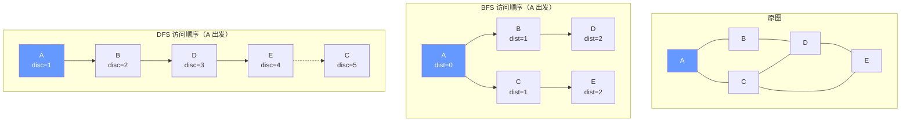
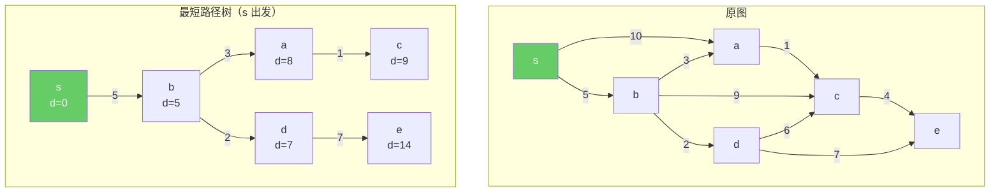
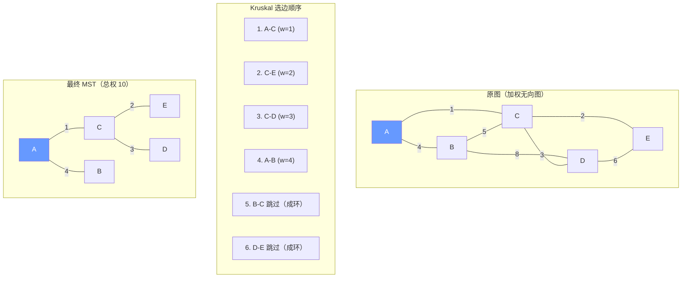
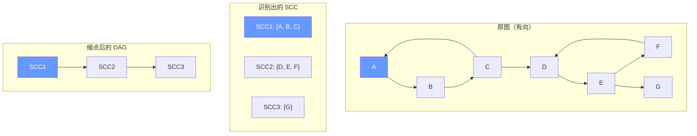
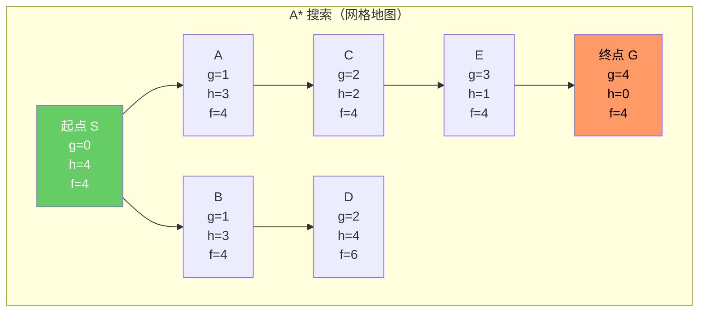
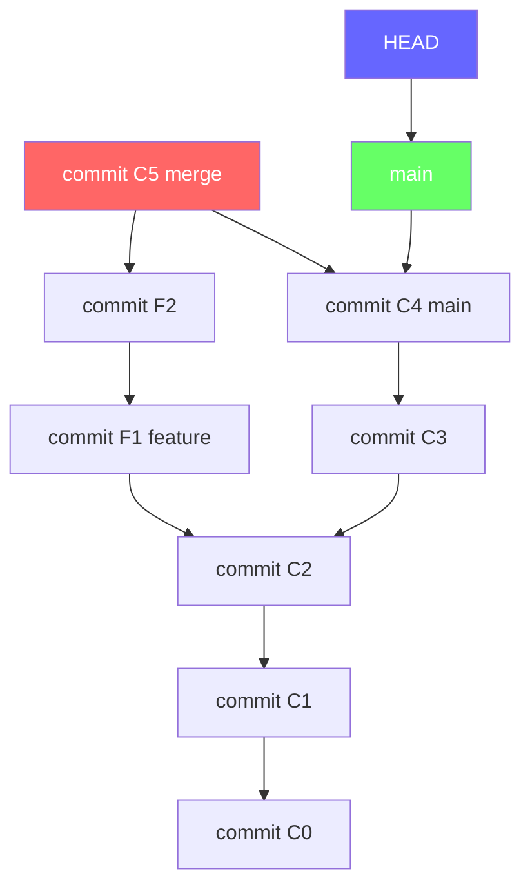

## 第 1 章 学习目标与导论

### 1.1 本章在算法知识体系中的位置

图（graph，源自希腊语 "graphos"，意为"书写、绘制"，由 James Joseph Sylvester 于 1878 年首次引入英语数学词汇，意为"由顶点与边绘制的关系结构"）是计算机科学中最重要、最具表达力的数据结构之一。它位于算法知识体系的"关系层"，向上承接搜索算法与动态规划，向下衔接网络流、字符串自动机与离散数学中的图论。

学习本章前，读者应当已经掌握：

- `algorithm/算法分析基础与学习路线`：渐近记号、最坏/平均复杂度分析
- `algorithm/搜索算法`：BFS/DFS 在树与状态空间上的基本框架
- `math/离散数学`：集合、关系、二元关系、等价关系与偏序关系

掌握本章后，读者将为后续学习 `algorithm/网络流`、`algorithm/字符串算法`（后缀自动机、AC 自动机的图结构）、`algorithm/动态规划`（DAG 上的 DP）等高级主题奠定坚实基础。

### 1.2 学习目标

本章遵循 Bloom 分类法，按认知层级递进组织学习目标：

1. **记忆（Remember）**：复述图的形式化定义 $G = (V, E)$ 与有向图、无向图、加权图、二分图的形式化区别。
2. **理解（Understand）**：解释邻接矩阵与邻接表的代数表示，说明其在稠密图与稀疏图场景下的性能权衡。
3. **应用（Apply）**：使用 BFS 与 DFS 实现连通分量、环检测、二分图判定与拓扑排序。
4. **分析（Analyze）**：对比 Dijkstra、Bellman-Ford、Floyd-Warshall 算法的正确性证明（Loop Invariant 与最优子结构），识别其适用前提。
5. **评估（Evaluate）**：评估 Kruskal 与 Prim 算法的 Cut 性质并选择适合稀疏图与稠密图的 MST 实现；评估 Tarjan 与 Kosaraju 的工程取舍。
6. **创造（Create）**：设计基于图模型的工程方案，如社交网络分析、路由算法、依赖解析与推荐系统。

### 1.3 阅读建议

- **零基础读者**：先通读第 3、4、5 章，建立形式化定义与遍历直觉后回看第 2 章历史动机；
- **有数据结构基础读者**：重点关注第 6、7、9 章的正确性证明与复杂度分析；
- **进阶读者**：直接研读第 10、14 章的进阶算法与案例研究。

## 第 2 章 历史动机与演进

### 2.1 1736：Euler 与哥尼斯堡七桥问题

图论的诞生可追溯至 1736 年，瑞士数学家 Leonhard Euler（1707-1783）发表《Solutio problematis ad geometriam situs pertinentis》求解著名的"哥尼斯堡七桥问题"。普雷格尔河将哥尼斯堡（今俄罗斯加里宁格勒）分为两岸与两岛，其间由七座桥连接。市民们试图寻找一条路径，每座桥恰好走一次后回到起点。

Euler 的关键洞察是：**桥的具体长度与地理位置无关，仅"哪两块陆地由几座桥连接"这一拓扑关系决定问题可解性**。他将每块陆地抽象为顶点（vertex，源自拉丁语 "vertere"，意为"转动"，原指角的顶点，欧几里得几何中用于描述多边形的角点），每座桥抽象为边（edge，源自古英语 "ecg"，意为"刀刃、边界"），得到一个 4 顶点 7 边的多重图。

Euler 证明了：存在"每条边恰好经过一次的回路"（后称欧拉回路）当且仅当图中每个顶点的度数均为偶数。哥尼斯堡图所有顶点度数均为奇数，故无解。这一论证标志着图论与拓扑学的诞生，Euler 也因此被称为"图论之父"。

### 2.2 1857-1847：Cayley 与 Kirchhoff 的树与矩阵谱

1857 年英国数学家 Arthur Cayley（1821-1895）在研究有机化学同分异构体计数时，系统化了"树"（tree）的概念，给出 Cayley 公式：$n$ 个标记顶点的不同树共有 $n^{n-2}$ 棵。这一结果奠定了组合图论的基础。

1847 年德国物理学家 Gustav Kirchhoff（1824-1887）在研究电路网络时提出了**基尔霍夫矩阵树定理**：图 $G$ 的生成树数量等于其 Laplacian 矩阵 $\mathbf{L}$ 任意余子式的值。这是图论与线性代数深度结合的里程碑，预示了后来谱图理论（spectral graph theory）的发展。

### 2.3 1936-1930s：Konig 与图论公理化

匈牙利数学家 Denes Konig（1884-1944）于 1936 年出版《Theorie der endlichen und unendlichen Graphen》，这是第一部图论专著，标志着图论成为独立数学分支。Konig 系统化了图论的基本概念、定理与证明方法，并梳理了 Euler 至 1930s 的图论成果，包括 Kuratowski 平面图判定定理、Menger 定理、Hall 婚姻定理等。

同期 Paul Erdos（1913-1996）开创了**极值图论**与**随机图论**。他与 Alfred Renyi 于 1959 年提出 ER 随机图模型 $G(n, p)$，研究"几乎必然"性质与相变现象（如连通性阈值 $p = \ln n / n$）。这一工作深刻影响了 20 世纪后期的网络科学与复杂系统研究。

### 2.4 1956-1959：Kruskal、Prim 与 Dijkstra 的最优化算法

第二次世界大战后，运筹学兴起推动了图优化算法的发展。

- **1956 年**，Joseph Bernard Kruskal（1928-2010）在 Bell 实验室发表论文《On the shortest spanning subtree of a graph and the traveling salesman problem》，提出 Kruskal 最小生成树算法：按边权排序后逐步加入不形成环的边。其同事 Robert Clay Prim（1921-2021）于 1957 年提出改进算法（Prim 算法），从一个顶点出发逐步扩展。两者均基于 Cut 性质。

- **1959 年**，荷兰数学家 Edsger Wybe Dijkstra（1930-2002）在 Numerische Mathematik 发表《A note on two problems in connexion with graphs》，提出最短路径算法。据 Dijkstra 本人在 2001 年的一次访谈中回忆，他在阿姆斯特丹的一家咖啡馆里花 20 分钟构思了该算法，目的是展示 ARMAC 计算机的能力。这一算法因其简洁高效而成为计算机科学中最广为引用的算法之一。

- **1958 年**，Richard Bellman（1920-1984）发表 Bellman-Ford 算法（亦称 Bellman-Ford-Moore 算法），动态规划思想在图论中的典型应用，支持负权边与负环检测。

### 2.5 1962-1972：Floyd-Warshall 与 Tarjan 的线性算法

1962 年 Robert Floyd（1936-2001）与 Stephen Warshall（1935-2007）分别独立提出全源最短路径算法（Floyd-Warshall），基于动态规划的中转点枚举。同年发表《Algorithm 97: Shortest path》。

1972 年 Robert Endre Tarjan（1948-）发表《Depth-first search and linear graph algorithms》，系统证明了 DFS 的线性时间复杂度，并基于此给出了强连通分量（SCC）、双连通分量、割点与桥的线性识别算法。Tarjan 的工作使"图论算法的复杂度从 $O(V^2)$ 进入 $O(V + E)$ 时代"，他因此获 1986 年图灵奖。同期 Sambasiva Rao Kosaraju（1947-）于 1978 年提出 Kosaraju SCC 算法，两次 DFS 完成识别。

### 2.6 1998：PageRank 与图论的现代复兴

1998 年斯坦福大学博士生 Larry Page 与 Sergey Brin 提出 PageRank 算法（Page et al. 1999），将网页超链接结构建模为有向图，通过随机游走的平稳分布度量网页"重要性"。PageRank 成为 Google 搜索引擎的奠基技术，标志着图算法在大规模工业场景中的成功应用。

此后图算法在社交网络（朋友推荐、社区发现）、生物信息学（蛋白质相互作用网络）、推荐系统（知识图谱）、区块链（DAG 共识）等领域持续扩展。2000s 后图神经网络（GNN）的兴起进一步深化了图算法与机器学习的融合。

## 第 3 章 形式化定义与图论基础

### 3.1 图的形式化定义

为了消除自然语言的歧义，本节以数学形式化方式定义图的语义。该形式化对应 Bondy & Murty (2008) 与 CLRS 4th 第 20 章的约定。

**定义 3.1（图）**：图（graph）是一个有序三元组 $G = (V, E, \varphi)$，其中：

- $V$ 是有限非空集合，称为**顶点集**（vertex set），元素称为顶点（vertex）；
- $E$ 是有限集合，称为**边集**（edge set），元素称为边（edge）；
- $\varphi: E \to \mathcal{P}_2(V)$ 是关联函数，将每条边映射为顶点集的二元子集（无向图）或顶点的有序对（有向图）。

为简化记号，通常省略 $\varphi$，直接将边表示为 $e = (u, v)$。当 $V$ 与 $E$ 有限时，记 $|V| = n$、$|E| = m$。

**定义 3.2（有向图与无向图）**：

- **无向图**（undirected graph）：$E \subseteq \binom{V}{2}$，边 $e = \{u, v\}$ 是无序对，表示 $u$ 与 $v$ 互为邻居。
- **有向图**（directed graph / digraph）：$E \subseteq V \times V$，边 $e = (u, v)$ 是有序对，称为从 $u$ 指向 $v$ 的弧（arc），$u$ 为尾（tail）、$v$ 为头（head）。

**定义 3.3（加权图）**：加权图（weighted graph）是图 $G = (V, E)$ 配以权函数 $w: E \to \mathbb{R}$。对于无向图，$w(\{u, v\}) = w(\{v, u\})$；对于有向图，$w(u, v)$ 与 $w(v, u)$ 可不同。权可表示距离、代价、容量、概率等。

**定义 3.4（二分图）**：图 $G = (V, E)$ 称为二分图（bipartite graph），若存在 $V$ 的划分 $V = A \dot\cup B$，使得 $E \subseteq A \times B$（即所有边跨过 $A$、$B$ 两部分）。

**定理 3.1（二分图判定）**：图 $G$ 是二分图当且仅当 $G$ 不含奇环。

**证明**：$\Rightarrow$：若 $G$ 含奇环 $v_0 v_1 \dots v_{2k} v_0$，沿环交替着色，$v_0$ 与 $v_{2k}$ 同色但二者相邻，矛盾。$\Leftarrow$：对每个连通分量做 BFS，按层奇偶着色，无奇环保证相邻顶点不同色。

### 3.2 路径、回路与连通性

**定义 3.5（路径）**：图 $G$ 中的**路径**（path）是顶点序列 $v_0, v_1, \dots, v_k$，使得对任意 $0 \leq i < k$，$(v_i, v_{i+1}) \in E$。路径长度为 $k$（边数），加权长度为 $\sum_{i=0}^{k-1} w(v_i, v_{i+1})$。

**定义 3.6（简单路径与回路）**：

- **简单路径**（simple path）：所有顶点互不相同；
- **回路/环**（cycle）：$v_0 = v_k$ 且 $k \geq 1$，且除首尾外顶点互不相同（简单环）；
- **欧拉路径/回路**：经过每条边恰好一次的路径/回路；
- **Hamilton 路径/回路**：经过每个顶点恰好一次的路径/回路。

**定义 3.7（连通性）**：

- 无向图中 $u$ 与 $v$ **连通**（connected），若存在 $u$ 到 $v$ 的路径。连通关系是 $V$ 上的等价关系，其等价类称为**连通分量**（connected component）。
- 有向图中 $u$ **可达** $v$（reachable），若存在 $u$ 到 $v$ 的有向路径。$u$ 与 $v$ **强连通**（strongly connected），若互相可达。强连通关系是等价关系，其等价类称为**强连通分量**（strongly connected component, SCC）。

### 3.3 生成树与生成森林

**定义 3.8（生成树）**：连通无向图 $G = (V, E)$ 的**生成树**（spanning tree，"spanning" 源自古英语 "spannan"，意为"伸展、跨越"，指覆盖所有顶点的树结构）是子图 $T = (V, E_T)$，其中 $E_T \subseteq E$、$|E_T| = |V| - 1$、$T$ 是树（无环连通）。

非连通图的对应概念为**生成森林**（spanning forest），每个连通分量各有一棵生成树。

**定义 3.9（最小生成树）**：加权图 $G = (V, E, w)$ 的**最小生成树**（minimum spanning tree, MST）$T^*$ 满足：

$$T^* = \arg\min_{T \text{ 是 } G \text{ 的生成树}} \sum_{e \in T} w(e)$$

**定理 3.2（MST 唯一性）**：若 $G$ 中所有边权互不相同，则 MST 唯一。

### 3.4 邻接矩阵与邻接表的代数表示

**定义 3.10（邻接矩阵）**：图 $G = (V, E)$（$|V| = n$）的邻接矩阵 $\mathbf{A} \in \{0, 1\}^{n \times n}$（或 $\mathbb{R}^{n \times n}$ 用于加权图）定义为：

$$\mathbf{A}_{ij} = \begin{cases} 1, & (v_i, v_j) \in E \\ 0, & \text{otherwise} \end{cases}$$

加权图的邻接矩阵中 $\mathbf{A}_{ij} = w(v_i, v_j)$（无边时取 $\infty$ 或 $0$ 视约定）。

**代数性质**：

- 无向图的 $\mathbf{A}$ 对称：$\mathbf{A} = \mathbf{A}^\top$；
- $\mathbf{A}^k_{ij}$ 表示从 $v_i$ 到 $v_j$ 长度恰为 $k$ 的路径数；
- 度数矩阵 $\mathbf{D} = \text{diag}(\deg(v_1), \dots, \deg(v_n))$；
- Laplacian 矩阵 $\mathbf{L} = \mathbf{D} - \mathbf{A}$，其特征值与图的连通性、扩张性密切相关；
- 二分图的判定：$\mathbf{A}$ 经适当置换相似于 $\begin{pmatrix} 0 & \mathbf{B} \\ \mathbf{B}^\top & 0 \end{pmatrix}$。

**定义 3.11（邻接表）**：邻接表（adjacency list）将每个顶点 $v$ 映射到其邻居列表 $\text{Adj}(v) = \{u \mid (v, u) \in E\}$。形式上，邻接表是函数 $\text{Adj}: V \to \mathcal{P}(V)$。

**存储复杂度对比**：

| 表示方法   | 空间            | 查询 $(u, v) \in E$ | 遍历邻居     | 适用场景           |
| :--------- | :-------------- | :------------------ | :----------- | :----------------- |
| 邻接矩阵   | $\Theta(V^2)$   | $O(1)$              | $O(V)$       | 稠密图、频繁查询边 |
| 邻接表     | $\Theta(V + E)$ | $O(\deg(u))$        | $O(\deg(u))$ | 稀疏图、遍历为主   |
| 链式前向星 | $\Theta(V + E)$ | $O(\deg(u))$        | $O(\deg(u))$ | 竞赛场景、内存紧凑 |

## 第 4 章 图的表示方法与存储

### 4.1 邻接矩阵实现

```python
# 邻接矩阵实现（Python）：稠密图场景
class GraphMatrix:
    """邻接矩阵表示的加权图

    适用于稠密图（E = Theta(V^2)）与频繁查询边存在的场景。
    空间复杂度 Theta(V^2)，查询边存在 O(1)，遍历邻居 O(V)。
    """
    def __init__(self, n: int, directed: bool = False):
        # n: 顶点数；directed: 是否有向
        self.n = n
        self.directed = directed
        # 初始化为 0 表示无边；权值非 0 表示有边
        self.adj = [[0] * n for _ in range(n)]

    def add_edge(self, u: int, v: int, w: int = 1) -> None:
        """添加边 (u, v)，权为 w"""
        self.adj[u][v] = w
        if not self.directed:
            self.adj[v][u] = w

    def has_edge(self, u: int, v: int) -> bool:
        """O(1) 查询边是否存在"""
        return self.adj[u][v] != 0

    def neighbors(self, u: int) -> list:
        """遍历 u 的所有邻居，O(V)"""
        return [v for v in range(self.n) if self.adj[u][v] != 0]
```

```cpp
// 邻接矩阵实现（C++）：稠密图场景
#include <vector>
class GraphMatrix {
    int n;
    bool directed;
    std::vector<std::vector<int>> adj;
public:
    GraphMatrix(int n, bool dir = false)
        : n(n), directed(dir), adj(n, std::vector<int>(n, 0)) {}

    void addEdge(int u, int v, int w = 1) {
        adj[u][v] = w;
        if (!directed) adj[v][u] = w;
    }

    bool hasEdge(int u, int v) const {
        return adj[u][v] != 0;
    }

    int weight(int u, int v) const {
        return adj[u][v];
    }
};
```

### 4.2 邻接表实现

```python
# 邻接表实现（Python）：稀疏图场景
from collections import defaultdict

class GraphList:
    """邻接表表示的加权图

    适用于稀疏图（E = O(V)）与遍历为主的场景。
    空间复杂度 Theta(V + E)，查询边存在 O(deg(u))，遍历邻居 O(deg(u))。
    """
    def __init__(self, n: int, directed: bool = False):
        self.n = n
        self.directed = directed
        # 每个顶点维护 (邻居, 权值) 列表
        self.adj = [[] for _ in range(n)]

    def add_edge(self, u: int, v: int, w: int = 1) -> None:
        self.adj[u].append((v, w))
        if not self.directed:
            self.adj[v].append((u, w))

    def neighbors(self, u: int) -> list:
        """O(deg(u)) 遍历邻居"""
        return self.adj[u]

    def has_edge(self, u: int, v: int) -> bool:
        """O(deg(u)) 查询边存在"""
        return any(node == v for node, _ in self.adj[u])
```

```cpp
// 邻接表实现（C++）：稀疏图场景
#include <vector>
#include <utility>
class GraphList {
    int n;
    bool directed;
    std::vector<std::vector<std::pair<int, int>>> adj;
public:
    GraphList(int n, bool dir = false) : n(n), directed(dir), adj(n) {}

    void addEdge(int u, int v, int w = 1) {
        adj[u].emplace_back(v, w);
        if (!directed) adj[v].emplace_back(u, w);
    }

    const std::vector<std::pair<int, int>>& neighbors(int u) const {
        return adj[u];
    }
};
```

```java
// 邻接表实现（Java）：稀疏图场景
import java.util.*;

public class GraphList {
    private int n;
    private boolean directed;
    private List<List<int[]>> adj;

    public GraphList(int n, boolean directed) {
        this.n = n;
        this.directed = directed;
        this.adj = new ArrayList<>();
        for (int i = 0; i < n; i++) adj.add(new ArrayList<>());
    }

    public void addEdge(int u, int v, int w) {
        adj.get(u).add(new int[]{v, w});
        if (!directed) adj.get(v).add(new int[]{u, w});
    }

    public List<int[]> neighbors(int u) {
        return adj.get(u);
    }
}
```

### 4.3 链式前向星实现

链式前向星是竞赛场景常用的紧凑表示，本质是用数组模拟邻接表的链表。

```cpp
// 链式前向星实现（C++）：内存紧凑，竞赛常用
#include <cstring>
const int MAXN = 100010;
const int MAXM = 200010;

int head[MAXN];           // head[u] = u 的第一条边在 edges 数组中的下标
int nxt[MAXM];            // nxt[i] = 与 edges[i] 同起点的下一条边
int to[MAXM];             // edges[i] 的终点
int weight[MAXM];         // edges[i] 的权值
int edgeCnt = 0;          // 当前边数

void init() {
    std::memset(head, -1, sizeof(head));
    edgeCnt = 0;
}

void addEdge(int u, int v, int w) {
    to[edgeCnt] = v;
    weight[edgeCnt] = w;
    nxt[edgeCnt] = head[u];       // 新边指向原 head
    head[u] = edgeCnt++;          // 更新 head
}

// 遍历 u 的所有出边
void traverse(int u) {
    for (int e = head[u]; e != -1; e = nxt[e]) {
        int v = to[e];
        int w = weight[e];
        // 处理边 (u, v, w)
    }
}
```

### 4.4 表示方法选择

| 场景                     | 邻接矩阵   | 邻接表    | 链式前向星 |
| :----------------------- | :--------- | :-------- | :--------- |
| 稠密图 $E = \Theta(V^2)$ | 推荐       | 浪费指针  | 不适用     |
| 稀疏图 $E = O(V)$        | 浪费空间   | 推荐      | 推荐       |
| 频繁查询边存在           | $O(1)$     | $O(\deg)$ | $O(\deg)$  |
| Floyd-Warshall           | 必须用矩阵 | 需转换    | 需转换     |
| Dijkstra/BFS/DFS         | 可用       | 推荐      | 推荐       |
| 内存受限（竞赛）         | 不推荐     | 可用      | 最优       |
| 需要快速删除边           | $O(1)$     | $O(\deg)$ | $O(\deg)$  |

### 4.5 图的输入与构建示例

```python
# 标准输入构建无向加权图
def build_undirected_graph():
    """从标准输入读取 n 个顶点、m 条边构建无向加权图

    输入格式：
    第一行：n m
    后续 m 行：u v w（顶点编号从 0 开始）
    """
    n, m = map(int, input().split())
    g = GraphList(n, directed=False)
    for _ in range(m):
        u, v, w = map(int, input().split())
        g.add_edge(u, v, w)
    return g
```

## 第 5 章 图的遍历：BFS 与 DFS

### 5.1 广度优先搜索（BFS）

广度优先搜索（Breadth-First Search, BFS，由 E. F. Moore (1959) 与 C. Y. Lee (1961) 独立提出，分别用于迷宫寻路与电路布线，名称反映其"逐层扩展"的搜索特征）按距离递增顺序访问顶点，是计算无权图最短路径的基础。

**算法 5.1（BFS）**：

```python
from collections import deque

def bfs(n, graph, start):
    """广度优先搜索

    输入：顶点数 n、邻接表 graph、起始顶点 start
    输出：dist 数组（从 start 到各顶点的最短边数）、prev 数组（前驱）
    时间复杂度：O(V + E)
    """
    dist = [-1] * n
    prev = [-1] * n
    dist[start] = 0
    q = deque([start])
    while q:
        u = q.popleft()
        for v, _ in graph[u]:
            if dist[v] == -1:        # 未访问
                dist[v] = dist[u] + 1
                prev[v] = u
                q.append(v)
    return dist, prev
```

```cpp
#include <queue>
#include <vector>
// BFS（C++ 实现）
std::vector<int> bfs(int n, std::vector<std::vector<std::pair<int,int>>>& graph, int start) {
    std::vector<int> dist(n, -1);
    std::vector<int> prev(n, -1);
    std::queue<int> q;
    dist[start] = 0;
    q.push(start);
    while (!q.empty()) {
        int u = q.front(); q.pop();
        for (auto& [v, w] : graph[u]) {
            if (dist[v] == -1) {
                dist[v] = dist[u] + 1;
                prev[v] = u;
                q.push(v);
            }
        }
    }
    return dist;
}
```

### 5.2 BFS 正确性证明（Loop Invariant）

**定理 5.1（BFS 正确性）**：BFS 结束时，`dist[v]` 等于从 `start` 到 `v` 的最短边数（无权最短路）。

**证明**（基于 Loop Invariant）：

**Loop Invariant**：在 BFS 主循环的每次迭代开始时，队列 `q` 中的顶点按 `dist` 非递减顺序排列，且对每个已访问顶点 $v$（`dist[v] != -1`），`dist[v]` 等于 `start` 到 $v$ 的最短边数 $\delta(s, v)$。

**初始化**：初始时 `q = [start]`、`dist[start] = 0 = δ(s, s)`，不变式成立。

**保持**：设当前弹出顶点为 $u$，其 `dist[u] = d`。对 $u$ 的每个未访问邻居 $v$，设 `dist[v] = d + 1`。需证 $\delta(s, v) = d + 1$：

- $\delta(s, v) \leq \delta(s, u) + 1 = d + 1$（$s \to u \to v$ 是一条长度 $d + 1$ 的路径）；
- 若 $\delta(s, v) < d + 1$，则存在长度 $\leq d$ 的路径 $s \to v$，但 $u$ 是当前队列中 `dist` 最小的未处理顶点（不变式保证队列非递减），故 $v$ 应已被某个 `dist < d` 的顶点松弛，与 $v$ 未访问矛盾。
- 故 $\delta(s, v) = d + 1$，不变式保持。

**终止**：所有顶点被处理后，`dist[v] = δ(s, v)` 对所有 $v$ 成立。

**复杂度**：每个顶点入队出队各一次（$O(V)$），每条边在无向图中被两端各遍历一次（$O(E)$），总计 $O(V + E)$。

### 5.3 深度优先搜索（DFS）

深度优先搜索（Depth-First Search, DFS，由 Charles Pierre Tremaux (19th century) 在迷宫求解中提出，Tarjan (1972) 形式化并证明其线性时间复杂度，名称反映其"深入到底"的搜索特征）沿一条路径深入到底再回溯，是环检测、拓扑排序、SCC 的基础。

**算法 5.2（DFS 递归实现）**：

```python
def dfs_recursive(n, graph, start):
    """DFS 递归实现

    输出：visited 数组、discovery/finish 时间戳
    时间复杂度：O(V + E)
    """
    WHITE, GRAY, BLACK = 0, 1, 2
    color = [WHITE] * n
    disc = [0] * n
    finish = [0] * n
    timer = [0]

    def dfs(u):
        timer[0] += 1
        disc[u] = timer[0]
        color[u] = GRAY
        for v, _ in graph[u]:
            if color[v] == WHITE:
                dfs(v)
        color[u] = BLACK
        timer[0] += 1
        finish[u] = timer[0]

    dfs(start)
    return disc, finish
```

**算法 5.3（DFS 迭代实现）**：

```python
def dfs_iterative(n, graph, start):
    """DFS 迭代实现，避免递归栈溢出

    注意：栈中需记录"下一个待访问邻居的下标"才能模拟递归回溯
    """
    visited = [False] * n
    order = []
    # 栈元素：(顶点, 下一个邻居下标)
    stack = [(start, 0)]
    visited[start] = True
    while stack:
        u, idx = stack[-1]
        if idx < len(graph[u]):
            stack[-1] = (u, idx + 1)
            v, _ = graph[u][idx]
            if not visited[v]:
                visited[v] = True
                stack.append((v, 0))
        else:
            stack.pop()
            order.append(u)
    return order
```

```cpp
#include <vector>
#include <stack>
// DFS 迭代实现（C++）
std::vector<int> dfsIterative(int n, std::vector<std::vector<std::pair<int,int>>>& graph, int start) {
    std::vector<bool> visited(n, false);
    std::vector<int> order;
    std::stack<std::pair<int, int>> stk;   // (顶点, 下一个邻居下标)
    stk.push({start, 0});
    visited[start] = true;
    while (!stk.empty()) {
        auto& [u, idx] = stk.top();
        if (idx < (int)graph[u].size()) {
            int v = graph[u][idx].first;
            idx++;
            if (!visited[v]) {
                visited[v] = true;
                stk.push({v, 0});
            }
        } else {
            stk.pop();
            order.push_back(u);
        }
    }
    return order;
}
```

### 5.4 DFS 边的分类

DFS 遍历中，每条边 $(u, v)$ 根据发现时的顶点颜色分为四类：

| 边类型                 | 定义                                 | 意义                 |
| :--------------------- | :----------------------------------- | :------------------- |
| 树边（tree edge）      | $v$ 为白色，DFS 递归进入 $v$         | 构成 DFS 森林        |
| 回边（back edge）      | $v$ 为灰色（正在递归栈中）           | 表示存在环           |
| 前向边（forward edge） | $v$ 为黑色且 $v$ 是 $u$ 的后代       | 非树边，跳过中间节点 |
| 横叉边（cross edge）   | $v$ 为黑色且 $v$ 非 $u$ 的祖先或后代 | 连接不同 DFS 子树    |

**定理 5.2（无向图 DFS 边分类）**：无向图 DFS 中只存在树边与回边，无前向边与横叉边。

**证明**：考虑无向边 $(u, v)$，DFS 先到达其一（设为 $u$）。若 $v$ 未访问，则为树边；若 $v$ 已访问，因 $v$ 与 $u$ 邻接，$v$ 必在 $u$ 之前已被 DFS 完成或正在递归。若 $v$ 已完成（黑色），则 $u$ 必在 $v$ 的子树中（否则 $v$ 完成前会经 $(v, u)$ 访问 $u$），矛盾。故 $v$ 必为灰色，$(u, v)$ 为回边。

### 5.5 DFS 时间戳与括号化定理

DFS 为每个顶点 $u$ 记录发现时间 $\text{disc}[u]$ 与完成时间 $\text{finish}[u]$。

**定理 5.3（括号化定理）**：对任意两顶点 $u, v$，区间 $[\text{disc}[u], \text{finish}[u]]$ 与 $[\text{disc}[v], \text{finish}[v]]$ 要么不相交，要么一个包含另一个；后者成立当且仅当一个是另一个的祖先。

**推论 5.1（白色路径定理）**：$v$ 是 $u$ 的后代当且仅当在发现 $u$ 时刻，存在从 $u$ 到 $v$ 的全白色顶点路径。

### 5.6 应用：连通分量、环检测、二分图判定

```python
def connected_components(n, graph):
    """计算无向图连通分量

    时间复杂度：O(V + E)
    """
    visited = [False] * n
    components = []
    for s in range(n):
        if not visited[s]:
            comp = []
            stack = [s]
            visited[s] = True
            while stack:
                u = stack.pop()
                comp.append(u)
                for v, _ in graph[u]:
                    if not visited[v]:
                        visited[v] = True
                        stack.append(v)
            components.append(comp)
    return components
```

```python
def has_cycle_undirected(n, graph):
    """无向图环检测（DFS）"""
    visited = [False] * n
    def dfs(u, parent):
        visited[u] = True
        for v, _ in graph[u]:
            if not visited[v]:
                if dfs(v, u):
                    return True
            elif v != parent:
                return True
        return False
    for s in range(n):
        if not visited[s]:
            if dfs(s, -1):
                return True
    return False
```

```python
def is_bipartite(n, graph):
    """二分图判定（BFS 染色法）

    返回 True 当且仅当图不含奇环
    """
    color = [-1] * n
    from collections import deque
    for s in range(n):
        if color[s] == -1:
            color[s] = 0
            q = deque([s])
            while q:
                u = q.popleft()
                for v, _ in graph[u]:
                    if color[v] == -1:
                        color[v] = color[u] ^ 1
                        q.append(v)
                    elif color[v] == color[u]:
                        return False
    return True
```

### 5.7 BFS 与 DFS 可视化对比

下图展示同一图在 BFS 与 DFS 下的访问顺序差异：



## 第 6 章 最短路径算法

### 6.1 问题定义

**单源最短路径（SSSP）问题**：给定加权有向图 $G = (V, E, w)$ 与源点 $s \in V$，求 $s$ 到所有 $v \in V$ 的最短路径长度 $\delta(s, v) = \min_{p: s \to v} \sum_{e \in p} w(e)$。

**全源最短路径（APSP）问题**：对所有顶点对 $(u, v)$ 求 $\delta(u, v)$。

**最优子结构**：若 $s \to v$ 的最短路径为 $s \to u \to v$，则 $s \to u$ 也是最短路径。这是 Dijkstra 与 Bellman-Ford 共同的基础。

### 6.2 松弛操作

所有最短路径算法的核心都是**松弛**（relaxation）操作：

$$\text{Relax}(u, v, w): \quad \text{if } \text{dist}[u] + w(u, v) < \text{dist}[v] \text{ then } \text{dist}[v] \leftarrow \text{dist}[u] + w(u, v)$$

```python
def relax(dist, prev, u, v, w):
    """松弛边 (u, v, w)，返回是否成功松弛"""
    if dist[u] + w < dist[v]:
        dist[v] = dist[u] + w
        prev[v] = u
        return True
    return False
```

**收敛性质**：若 $u$ 的最短路已确定（`dist[u] = δ(s, u)`），且 $(u, v) \in E$，则松弛 $(u, v)$ 后 `dist[v] = δ(s, v)`（或更早达到）。

### 6.3 Dijkstra 算法

Dijkstra 算法基于贪心策略，要求所有边权非负。

**算法 6.1（Dijkstra 朴素实现）**：

```python
def dijkstra_naive(n, graph, start):
    """Dijkstra 朴素实现（邻接矩阵）

    时间复杂度：O(V^2)
    适用：稠密图、V 较小
    """
    INF = float('inf')
    dist = [INF] * n
    prev = [-1] * n
    visited = [False] * n
    dist[start] = 0
    for _ in range(n):
        # 选 dist 最小的未访问顶点
        u = -1
        for i in range(n):
            if not visited[i] and (u == -1 or dist[i] < dist[u]):
                u = i
        if u == -1 or dist[u] == INF:
            break
        visited[u] = True
        for v, w in graph[u]:
            if not visited[v] and dist[u] + w < dist[v]:
                dist[v] = dist[u] + w
                prev[v] = u
    return dist, prev
```

**算法 6.2（Dijkstra 堆优化）**：

```python
import heapq

def dijkstra_heap(n, graph, start):
    """Dijkstra 堆优化实现（邻接表 + 二叉堆）

    时间复杂度：O((V + E) log V)
    适用：稀疏图、大规模图
    关键：lazy deletion 模式跳过过期堆条目
    """
    INF = float('inf')
    dist = [INF] * n
    prev = [-1] * n
    dist[start] = 0
    pq = [(0, start)]              # (距离, 顶点)
    while pq:
        d, u = heapq.heappop(pq)
        if d > dist[u]:            # lazy deletion：跳过过期条目
            continue
        for v, w in graph[u]:
            nd = d + w
            if nd < dist[v]:
                dist[v] = nd
                prev[v] = u
                heapq.heappush(pq, (nd, v))
    return dist, prev
```

```cpp
#include <vector>
#include <queue>
#include <climits>
// Dijkstra 堆优化实现（C++）
std::vector<long long> dijkstra(int n, std::vector<std::vector<std::pair<int,int>>>& graph, int start) {
    const long long INF = LLONG_MAX / 4;
    std::vector<long long> dist(n, INF);
    std::vector<int> prev(n, -1);
    dist[start] = 0;
    // 优先队列：(距离, 顶点)，小根堆
    std::priority_queue<std::pair<long long,int>,
                        std::vector<std::pair<long long,int>>,
                        std::greater<>> pq;
    pq.push({0, start});
    while (!pq.empty()) {
        auto [d, u] = pq.top(); pq.pop();
        if (d > dist[u]) continue;          // lazy deletion
        for (auto& [v, w] : graph[u]) {
            long long nd = d + w;
            if (nd < dist[v]) {
                dist[v] = nd;
                prev[v] = u;
                pq.push({nd, v});
            }
        }
    }
    return dist;
}
```

```java
// Dijkstra 堆优化实现（Java）
import java.util.*;

public class Dijkstra {
    public static long[] dijkstra(int n, List<List<int[]>> graph, int start) {
        final long INF = Long.MAX_VALUE / 4;
        long[] dist = new long[n];
        int[] prev = new int[n];
        Arrays.fill(dist, INF);
        Arrays.fill(prev, -1);
        dist[start] = 0;
        // 小根堆：(距离, 顶点)
        PriorityQueue<long[]> pq = new PriorityQueue<>((a, b) -> Long.compare(a[0], b[0]));
        pq.offer(new long[]{0, start});
        while (!pq.isEmpty()) {
            long[] top = pq.poll();
            long d = top[0];
            int u = (int) top[1];
            if (d > dist[u]) continue;       // lazy deletion
            for (int[] e : graph.get(u)) {
                int v = e[0], w = e[1];
                long nd = d + w;
                if (nd < dist[v]) {
                    dist[v] = nd;
                    prev[v] = u;
                    pq.offer(new long[]{nd, v});
                }
            }
        }
        return dist;
    }
}
```

### 6.4 Dijkstra 正确性证明（贪心选择性质）

**定理 6.1（Dijkstra 贪心选择性质）**：设所有边权非负，当顶点 $u$ 被从优先队列中取出时，`dist[u] = δ(s, u)`。

**证明**（反证法）：设 $u$ 是第一个被取出但 `dist[u] > δ(s, u)` 的顶点。设 $s \to u$ 的真实最短路径为 $s = v_0 \to v_1 \to \dots \to v_k = u$。沿该路径存在第一个"未访问"顶点 $v_i$（$v_0 = s$ 已访问），则 $v_{i-1}$ 已访问，`dist[v_{i-1}] = δ(s, v_{i-1})`（因 $u$ 是第一个违反性质的顶点）。

松弛 $(v_{i-1}, v_i)$ 后 `dist[v_i] = δ(s, v_{i-1}) + w(v_{i-1}, v_i) = δ(s, v_i)`。又因边权非负，$\delta(s, v_i) \leq \delta(s, u) < \text{dist}[u]$（最后一步用 $u$ 违反性质）。但 $v_i$ 在 $u$ 之前应被取出（`dist[v_i] < dist[u]`），与 $u$ 被先取出矛盾。

**推论 6.1**：Dijkstra 算法终止时，对所有 $v \in V$，`dist[v] = δ(s, v)`。

### 6.5 为何 Dijkstra 不能处理负权边

```python
# Dijkstra 负权失效反例
# 顶点：A=0, B=1, C=2
# 边：A->B(1), A->C(4), B->C(-3)
# 正确答案：dist[A]=0, dist[B]=1, dist[C]=-2
# Dijkstra 输出：dist[A]=0, dist[B]=1, dist[C]=4（错误）

graph = [[(1, 1), (2, 4)], [(2, -3)], []]
dist, _ = dijkstra_heap(3, graph, 0)
# dist = [0, 1, 4]，但正确答案是 [0, 1, -2]
```

**失效机制**：Dijkstra 取出 $C$ 时（`dist[C] = 4`）将其标记"已访问"，但 $B$ 到 $C$ 的负权边本可使 `dist[C] = 1 + (-3) = -2 < 4`。负权边破坏了"已访问顶点不会被后续松弛"的贪心选择性质。

### 6.6 Bellman-Ford 算法

Bellman-Ford 通过对所有边执行 $V - 1$ 轮松弛，支持负权边与负环检测。

**算法 6.3（Bellman-Ford）**：

```python
def bellman_ford(n, edges, start):
    """Bellman-Ford 算法

    输入：顶点数 n、边列表 [(u, v, w)]、源点 start
    输出：(dist 数组, 是否存在负环)
    时间复杂度：O(V * E)
    空间复杂度：O(V)
    """
    INF = float('inf')
    dist = [INF] * n
    prev = [-1] * n
    dist[start] = 0
    # 第 k 轮松弛后，dist[v] = 至多经过 k 条边的最短路径长度
    for _ in range(n - 1):
        updated = False
        for u, v, w in edges:
            if dist[u] != INF and dist[u] + w < dist[v]:
                dist[v] = dist[u] + w
                prev[v] = u
                updated = True
        if not updated:             # 提前终止优化
            break
    # 第 V 轮：若仍能松弛，则存在负环
    has_neg_cycle = False
    for u, v, w in edges:
        if dist[u] != INF and dist[u] + w < dist[v]:
            has_neg_cycle = True
            break
    return dist, has_neg_cycle
```

```cpp
#include <vector>
#include <tuple>
// Bellman-Ford（C++）
std::pair<std::vector<long long>, bool> bellmanFord(
    int n, std::vector<std::tuple<int,int,int>>& edges, int start) {
    const long long INF = LLONG_MAX / 4;
    std::vector<long long> dist(n, INF);
    std::vector<int> prev(n, -1);
    dist[start] = 0;
    for (int i = 0; i < n - 1; i++) {
        bool updated = false;
        for (auto& [u, v, w] : edges) {
            if (dist[u] != INF && dist[u] + w < dist[v]) {
                dist[v] = dist[u] + w;
                prev[v] = u;
                updated = true;
            }
        }
        if (!updated) break;
    }
    bool hasNegCycle = false;
    for (auto& [u, v, w] : edges) {
        if (dist[u] != INF && dist[u] + w < dist[v]) {
            hasNegCycle = true;
            break;
        }
    }
    return {dist, hasNegCycle};
}
```

### 6.7 Bellman-Ford 正确性证明

**定理 6.2（Bellman-Ford 正确性）**：若图中无负环，则 $V - 1$ 轮松弛后 `dist[v] = δ(s, v)` 对所有从 $s$ 可达的 $v$ 成立。

**证明**（基于路径长度归纳）：

**不变式**：第 $k$ 轮松弛后，`dist[v]` 等于从 $s$ 到 $v$ 最多经过 $k$ 条边的最短路径长度。

**归纳基础**：$k = 0$ 时 `dist[s] = 0`、其余为 $\infty$，对应"0 条边路径"。

**归纳步骤**：设第 $k - 1$ 轮已得到所有"最多 $k - 1$ 条边"的最短路。对每条边 $(u, v)$ 松弛时，若 $u$ 的最短路已确定（至多 $k - 1$ 条边），则 `dist[v] = min(dist[v], dist[u] + w(u, v))` 即为"至多 $k$ 条边"的最短路（最后一条边是 $(u, v)$）。

**上界**：无负环时，最短路径是简单路径（无重复顶点），最多 $V - 1$ 条边，故 $V - 1$ 轮足够。

**负环检测**：若第 $V$ 轮仍能松弛，则存在长度 $\geq V$ 的更短路径，必含重复顶点，即负环。

### 6.8 SPFA（队列优化 Bellman-Ford）

SPFA（Shortest Path Faster Algorithm）只对发生松弛的顶点的出边进行松弛，平均性能优于 Bellman-Ford。

```python
from collections import deque

def spfa(n, graph, start):
    """SPFA 算法（队列优化 Bellman-Ford）

    时间复杂度：平均 O(E)，最坏 O(V * E)
    负环检测：维护 cnt[v] = s 到 v 的最短路边数，cnt[v] >= V 时存在负环
    """
    INF = float('inf')
    dist = [INF] * n
    in_queue = [False] * n
    cnt = [0] * n              # 记录最短路边数
    dist[start] = 0
    in_queue[start] = True
    q = deque([start])
    has_neg_cycle = False
    while q and not has_neg_cycle:
        u = q.popleft()
        in_queue[u] = False
        for v, w in graph[u]:
            if dist[u] + w < dist[v]:
                dist[v] = dist[u] + w
                cnt[v] = cnt[u] + 1
                if cnt[v] >= n:                 # 边数 >= V，存在负环
                    has_neg_cycle = True
                    break
                if not in_queue[v]:
                    q.append(v)
                    in_queue[v] = True
    return dist, has_neg_cycle
```

### 6.9 Floyd-Warshall 全源最短路径

**算法 6.4（Floyd-Warshall）**：

**DP 状态**：$d^{(k)}[i][j]$ = 从 $i$ 到 $j$ 仅经过中间顶点 $\{0, 1, \dots, k-1\}$ 的最短路径长度。

**转移方程**：

$$d^{(k)}[i][j] = \min\left( d^{(k-1)}[i][j],\ d^{(k-1)}[i][k] + d^{(k-1)}[k][j] \right)$$

**空间优化**：因 $d^{(k)}$ 仅依赖 $d^{(k-1)}$，可用二维数组滚动，甚至原地更新（注意 $k$ 必须是最外层循环）。

```python
def floyd_warshall(n, graph):
    """Floyd-Warshall 全源最短路径

    时间复杂度：O(V^3)
    空间复杂度：O(V^2)
    支持负权边，可检测负环（对角线 < 0）
    """
    INF = float('inf')
    dist = [[INF] * n for _ in range(n)]
    for i in range(n):
        dist[i][i] = 0
    for u in range(n):
        for v, w in graph[u]:
            dist[u][v] = min(dist[u][v], w)
    for k in range(n):
        for i in range(n):
            for j in range(n):
                if dist[i][k] + dist[k][j] < dist[i][j]:
                    dist[i][j] = dist[i][k] + dist[k][j]
    # 负环检测：若 dist[i][i] < 0 则存在经过 i 的负环
    has_neg_cycle = any(dist[i][i] < 0 for i in range(n))
    return dist, has_neg_cycle
```

```cpp
#include <vector>
// Floyd-Warshall（C++）
std::pair<std::vector<std::vector<long long>>, bool> floydWarshall(
    int n, std::vector<std::vector<std::pair<int,int>>>& graph) {
    const long long INF = LLONG_MAX / 4;
    std::vector<std::vector<long long>> dist(n, std::vector<long long>(n, INF));
    for (int i = 0; i < n; i++) dist[i][i] = 0;
    for (int u = 0; u < n; u++) {
        for (auto& [v, w] : graph[u]) {
            dist[u][v] = std::min(dist[u][v], (long long)w);
        }
    }
    for (int k = 0; k < n; k++) {
        for (int i = 0; i < n; i++) {
            for (int j = 0; j < n; j++) {
                if (dist[i][k] + dist[k][j] < dist[i][j]) {
                    dist[i][j] = dist[i][k] + dist[k][j];
                }
            }
        }
    }
    bool hasNegCycle = false;
    for (int i = 0; i < n; i++) {
        if (dist[i][i] < 0) { hasNegCycle = true; break; }
    }
    return {dist, hasNegCycle};
}
```

### 6.10 Floyd-Warshall 正确性证明

**定理 6.3（Floyd-Warshall 正确性）**：算法终止时 `dist[i][j] = δ(i, j)`（若无负环）。

**证明**（基于 $d^{(k)}$ 的归纳定义）：

**归纳基础**：$d^{(0)}[i][j] = w(i, j)$（直接边权，无边时为 $\infty$）。

**归纳步骤**：设 $d^{(k-1)}[i][j]$ 已正确表示"仅经过 $\{0, \dots, k-2\}$"的最短路。考虑 $d^{(k)}[i][j]$：

- 若 $i \to j$ 的最短路（限定中间顶点 $\subseteq \{0, \dots, k-1\}$）不经过 $k$，则 $d^{(k)}[i][j] = d^{(k-1)}[i][j]$。
- 若经过 $k$，则路径可分解为 $i \to k \to j$，两段均仅经过 $\{0, \dots, k-2\}$（因 $k$ 在两段之间只出现一次，否则可去除环路），故 $d^{(k)}[i][j] = d^{(k-1)}[i][k] + d^{(k-1)}[k][j]$。
- 取两者较小值，即转移方程。

**终止**：$k = V$ 时 $d^{(V)}[i][j]$ = 任意中间顶点的最短路 = 真实最短路。

### 6.11 最短路径算法对比

| 算法                     | 时间复杂度                 | 空间     | 负权边 | 负环检测 | 适用场景       |
| :----------------------- | :------------------------- | :------- | :----- | :------- | :------------- |
| Dijkstra（朴素）         | $O(V^2)$                   | $O(V)$   | 否     | 否       | 稠密图         |
| Dijkstra（堆）           | $O((V+E) \log V)$          | $O(V+E)$ | 否     | 否       | 稀疏图、非负权 |
| Dijkstra（Fibonacci 堆） | $O(V \log V + E)$          | $O(V+E)$ | 否     | 否       | 理论最优       |
| Bellman-Ford             | $O(V E)$                   | $O(V)$   | 是     | 是       | 含负权         |
| SPFA                     | 平均 $O(E)$，最坏 $O(V E)$ | $O(V)$   | 是     | 是       | 随机数据       |
| Floyd-Warshall           | $O(V^3)$                   | $O(V^2)$ | 是     | 是       | 全源、$V$ 较小 |

### 6.12 A* 算法

A* 是带启发式的最短路径算法，在路径搜索（地图导航、游戏 AI）中广泛应用。

**评估函数**：$f(n) = g(n) + h(n)$，其中 $g(n)$ 是从源点到 $n$ 的实际代价，$h(n)$ 是从 $n$ 到目标的启发式估计。

**可采纳性**：当 $h(n) \leq h^*(n)$（$h^*$ 是真实最短代价）时，A* 保证最优性。

```python
import heapq

def astar(n, graph, start, goal, heuristic):
    """A* 算法

    输入：顶点数 n、邻接表 graph、起点 start、终点 goal、启发式函数 heuristic
    输出：(最短距离, 路径)
    要求：heuristic 必须可采纳（不高估真实代价）才能保证最优性
    """
    INF = float('inf')
    g = [INF] * n              # g[v] = start 到 v 的实际最短代价
    prev = [-1] * n
    g[start] = 0
    pq = [(heuristic(start), 0, start)]   # (f, g, 顶点)
    while pq:
        f, gu, u = heapq.heappop(pq)
        if u == goal:                       # 到达目标
            # 重建路径
            path = []
            v = goal
            while v != -1:
                path.append(v)
                v = prev[v]
            return gu, path[::-1]
        if gu > g[u]:                        # lazy deletion
            continue
        for v, w in graph[u]:
            gv = gu + w
            if gv < g[v]:
                g[v] = gv
                prev[v] = u
                heapq.heappush(pq, (gv + heuristic(v), gv, v))
    return INF, []
```

### 6.13 最短路径树可视化

下图展示从源点 $s$ 出发的最短路径树（SPT）结构：



## 第 7 章 最小生成树

### 7.1 Cut 性质

**定义 7.1（割）**：图 $G = (V, E)$ 的**割**（cut）是顶点集的一个划分 $(S, V \setminus S)$，其中 $S \subseteq V$、$S \neq \emptyset$、$S \neq V$。横切该割的边集为 $\delta(S) = \{ (u, v) \in E \mid u \in S, v \notin S \}$。

**定理 7.1（Cut 性质）**：对任意割 $(S, V \setminus S)$，若横切边 $e$ 是 $\delta(S)$ 中权值最小的边，且所有横切边权值互不相同，则 $e$ 必属于 $G$ 的任意一棵 MST。

**证明**：设 $T$ 是一棵不含 $e$ 的 MST。则 $T \cup \{e\}$ 含环 $C$，$C$ 必含另一横切边 $e'$（环穿过割的次数为偶数）。因 $w(e) < w(e')$，用 $e$ 替换 $e'$ 得到 $T' = T - \{e'\} + \{e\}$，$w(T') < w(T)$，与 $T$ 是 MST 矛盾。

Cut 性质是 Kruskal 与 Prim 算法的共同基础。

### 7.2 Kruskal 算法

Kruskal 算法按边权递增顺序逐步加入不形成环的边，依赖并查集高效判环。

**算法 7.1（Kruskal）**：

```python
class UnionFind:
    """并查集（Union-Find）实现

    支持 path compression 与 union by rank 优化
    单次操作均摊复杂度 O(alpha(V))，其中 alpha 是反 Ackermann 函数
    """
    def __init__(self, n):
        self.parent = list(range(n))
        self.rank = [0] * n

    def find(self, x):
        # 路径压缩
        if self.parent[x] != x:
            self.parent[x] = self.find(self.parent[x])
        return self.parent[x]

    def union(self, x, y):
        """合并 x、y 所在集合，返回是否成功（成功=True，已在同集合=False）"""
        px, py = self.find(x), self.find(y)
        if px == py:
            return False
        # union by rank
        if self.rank[px] < self.rank[py]:
            px, py = py, px
        self.parent[py] = px
        if self.rank[px] == self.rank[py]:
            self.rank[px] += 1
        return True


def kruskal(n, edges):
    """Kruskal 最小生成树算法

    输入：顶点数 n、边列表 [(u, v, w)]
    输出：(MST 总权值, MST 边列表)
    时间复杂度：O(E log E)，主导项为排序
    """
    edges_sorted = sorted(edges, key=lambda e: e[2])
    uf = UnionFind(n)
    mst_weight = 0
    mst_edges = []
    for u, v, w in edges_sorted:
        if uf.union(u, v):
            mst_weight += w
            mst_edges.append((u, v, w))
            if len(mst_edges) == n - 1:
                break
    return mst_weight, mst_edges
```

```cpp
#include <vector>
#include <algorithm>
// Kruskal（C++）
struct DSU {
    std::vector<int> parent, rank_;
    DSU(int n) : parent(n), rank_(n, 0) {
        for (int i = 0; i < n; i++) parent[i] = i;
    }
    int find(int x) {
        return parent[x] == x ? x : parent[x] = find(parent[x]);
    }
    bool unite(int x, int y) {
        int px = find(x), py = find(y);
        if (px == py) return false;
        if (rank_[px] < rank_[py]) std::swap(px, py);
        parent[py] = px;
        if (rank_[px] == rank_[py]) rank_[px]++;
        return true;
    }
};

long long kruskal(int n, std::vector<std::tuple<int,int,int>>& edges) {
    std::sort(edges.begin(), edges.end(),
              [](const auto& a, const auto& b) { return std::get<2>(a) < std::get<2>(b); });
    DSU dsu(n);
    long long total = 0;
    int cnt = 0;
    for (auto& [u, v, w] : edges) {
        if (dsu.unite(u, v)) {
            total += w;
            if (++cnt == n - 1) break;
        }
    }
    return total;
}
```

### 7.3 Kruskal 正确性证明

**定理 7.2（Kruskal 正确性）**：Kruskal 算法终止时输出的边集构成一棵 MST。

**证明**（基于 Cut 性质归纳）：

设 Kruskal 依次加入边 $e_1, e_2, \dots, e_{n-1}$。维护不变式：第 $k$ 步后，已加入边集 $T_k = \{e_1, \dots, e_k\}$ 是某棵 MST 的子集。

**基础**：$T_0 = \emptyset$ 是任意 MST 的子集。

**归纳**：设 $T_{k-1}$ 是某 MST $T^*$ 的子集。考虑 $e_k = (u, v)$，加入时 $u, v$ 在 $T_{k-1}$ 中不连通。设 $S$ 为 $u$ 在 $T_{k-1}$ 中的连通分量，则 $e_k$ 横切割 $(S, V \setminus S)$。Kruskal 按 weight 递增选择，故 $e_k$ 是 $\delta(S)$ 中尚未被考虑的边里权值最小的。

需证 $e_k \in T^*$：若 $e_k \notin T^*$，由 Cut 性质（边权互异假设下），$T^*$ 中应含 $\delta(S)$ 的最小横切边 $e'$，且 $w(e') \leq w(e_k)$。但 $e'$ 必然在 $e_k$ 之前被 Kruskal 考虑过，且 $e'$ 加入时其两端不连通（否则 $T_{k-1}$ 中已有 $S$ 外的连通分量，矛盾），故 Kruskal 应已加入 $e'$ 而非 $e_k$，矛盾。

### 7.4 Prim 算法

Prim 算法从一个顶点出发逐步扩展 MST，依赖优先队列维护跨切边。

**算法 7.2（Prim 堆优化）**：

```python
import heapq

def prim(n, graph, start=0):
    """Prim 最小生成树算法（堆优化）

    输入：顶点数 n、邻接表 graph、起始顶点 start
    输出：(MST 总权值, MST 边列表)
    时间复杂度：O(E log V)
    """
    INF = float('inf')
    in_mst = [False] * n
    min_edge = [INF] * n          # min_edge[v] = 跨切集中到 v 的最小权
    min_edge[start] = 0
    prev = [-1] * n
    pq = [(0, start)]              # (权值, 顶点)
    mst_weight = 0
    mst_edges = []
    while pq:
        w, u = heapq.heappop(pq)
        if in_mst[u]:
            continue
        in_mst[u] = True
        mst_weight += w
        if prev[u] != -1:
            mst_edges.append((prev[u], u, w))
        for v, wuv in graph[u]:
            if not in_mst[v] and wuv < min_edge[v]:
                min_edge[v] = wuv
                prev[v] = u
                heapq.heappush(pq, (wuv, v))
    return mst_weight, mst_edges
```

```cpp
#include <vector>
#include <queue>
// Prim 算法（C++）
long long prim(int n, std::vector<std::vector<std::pair<int,int>>>& graph, int start = 0) {
    std::vector<bool> inMst(n, false);
    std::vector<long long> minEdge(n, LLONG_MAX / 4);
    minEdge[start] = 0;
    std::priority_queue<std::pair<long long,int>,
                        std::vector<std::pair<long long,int>>,
                        std::greater<>> pq;
    pq.push({0, start});
    long long total = 0;
    while (!pq.empty()) {
        auto [w, u] = pq.top(); pq.pop();
        if (inMst[u]) continue;
        inMst[u] = true;
        total += w;
        for (auto& [v, wuv] : graph[u]) {
            if (!inMst[v] && (long long)wuv < minEdge[v]) {
                minEdge[v] = wuv;
                pq.push({wuv, v});
            }
        }
    }
    return total;
}
```

### 7.5 Prim 正确性证明

**定理 7.3（Prim 正确性）**：Prim 算法终止时输出的边集构成一棵 MST。

**证明**（基于 Cut 性质）：

维护不变式：第 $k$ 步后，已加入边集 $T_k$ 是一棵树，且是某棵 MST 的子集。

设当前 $T_k$ 覆盖的顶点集为 $S$。Prim 选择横切割 $(S, V \setminus S)$ 的最小权边 $e$。由 Cut 性质，$e$ 属于任意 MST。故 $T_{k+1} = T_k \cup \{e\}$ 仍是某 MST 的子集，且仍为树（加入横切边不形成环）。

终止时 $T_{n-1}$ 含 $n - 1$ 条边且为树，必为 MST。

### 7.6 Boruvka 算法（简介）

Boruvka (1926) 是最早的 MST 算法，比 Kruskal 早 30 年。每轮每个连通分量同时选择其最小跨切边，加入并合并。时间 $O(E \log V)$，适合分布式计算。

### 7.7 MST 算法对比

| 算法                 | 时间复杂度                  | 数据结构      | 适用场景     |
| :------------------- | :-------------------------- | :------------ | :----------- |
| Kruskal              | $O(E \log E) = O(E \log V)$ | 排序 + 并查集 | 稀疏图       |
| Prim（朴素）         | $O(V^2)$                    | 数组          | 稠密图       |
| Prim（堆）           | $O(E \log V)$               | 优先队列      | 稀疏图、通用 |
| Prim（Fibonacci 堆） | $O(E + V \log V)$           | Fibonacci 堆  | 理论最优     |
| Boruvka              | $O(E \log V)$               | 并查集        | 分布式       |

### 7.8 MST 可视化



## 第 8 章 拓扑排序与 DAG

### 8.1 DAG 与拓扑序

**定义 8.1（DAG）**：有向无环图（Directed Acyclic Graph, DAG）是不含环的有向图。

**定义 8.2（拓扑排序）**：DAG $G = (V, E)$ 的拓扑排序（topological sort）是 $V$ 的线性序 $v_1, v_2, \dots, v_n$，使得对任意 $(v_i, v_j) \in E$，$i < j$。

**定理 8.1**：DAG 存在拓扑排序当且仅当它是无环的。

### 8.2 Kahn 算法（BFS 入度法）

```python
from collections import deque

def topological_sort_kahn(n, graph):
    """Kahn 拓扑排序（BFS 入度法）

    输入：顶点数 n、邻接表 graph
    输出：拓扑序（若存在），否则 None
    时间复杂度：O(V + E)
    """
    in_degree = [0] * n
    for u in range(n):
        for v, _ in graph[u]:
            in_degree[v] += 1
    # 初始入度为 0 的顶点入队
    q = deque([i for i in range(n) if in_degree[i] == 0])
    order = []
    while q:
        u = q.popleft()
        order.append(u)
        for v, _ in graph[u]:
            in_degree[v] -= 1
            if in_degree[v] == 0:
                q.append(v)
    if len(order) != n:
        return None                # 存在环
    return order
```

```cpp
#include <vector>
#include <queue>
// Kahn 拓扑排序（C++）
std::vector<int> topologicalSortKahn(int n, std::vector<std::vector<std::pair<int,int>>>& graph) {
    std::vector<int> inDegree(n, 0);
    for (int u = 0; u < n; u++) {
        for (auto& [v, w] : graph[u]) inDegree[v]++;
    }
    std::queue<int> q;
    for (int i = 0; i < n; i++) {
        if (inDegree[i] == 0) q.push(i);
    }
    std::vector<int> order;
    while (!q.empty()) {
        int u = q.front(); q.pop();
        order.push_back(u);
        for (auto& [v, w] : graph[u]) {
            if (--inDegree[v] == 0) q.push(v);
        }
    }
    if ((int)order.size() != n) return {};     // 存在环
    return order;
}
```

### 8.3 DFS 后序逆序法

```python
def topological_sort_dfs(n, graph):
    """DFS 后序逆序拓扑排序

    关键观察：DAG 的 DFS 完成时间逆序即为合法拓扑序
    时间复杂度：O(V + E)
    """
    WHITE, GRAY, BLACK = 0, 1, 2
    color = [WHITE] * n
    order = []
    has_cycle = False

    def dfs(u):
        nonlocal has_cycle
        color[u] = GRAY
        for v, _ in graph[u]:
            if color[v] == WHITE:
                dfs(v)
            elif color[v] == GRAY:
                has_cycle = True        # 检测到回边，存在环
        color[u] = BLACK
        order.append(u)                 # 后序追加

    for s in range(n):
        if color[s] == WHITE:
            dfs(s)
    if has_cycle:
        return None
    return order[::-1]                  # 后序逆序
```

### 8.4 DAG 上的最长/最短路径

DAG 上的最短/最长路径可在 $O(V + E)$ 内求解，无需 Dijkstra 或 Bellman-Ford。

```python
def dag_shortest_path(n, graph, start):
    """DAG 单源最短路径

    时间复杂度：O(V + E)
    支持负权边（无负环即 DAG 无环）
    """
    INF = float('inf')
    order = topological_sort_kahn(n, graph)
    if order is None:
        return None                     # 非 DAG
    dist = [INF] * n
    dist[start] = 0
    for u in order:
        if dist[u] == INF:
            continue
        for v, w in graph[u]:
            if dist[u] + w < dist[v]:
                dist[v] = dist[u] + w
    return dist


def dag_longest_path(n, graph, start):
    """DAG 单源最长路径

    技巧：边权取负后求最短路径，再取反
    """
    neg_graph = [[(v, -w) for v, w in adj] for adj in graph]
    dist = dag_shortest_path(n, neg_graph, start)
    if dist is None:
        return None
    return [-d if d != float('inf') else float('inf') for d in dist]
```

### 8.5 AOV 网与 AOE 网

**AOV 网（Activity On Vertex）**：顶点表示活动，边表示先后关系。拓扑排序确定执行顺序。

**AOE 网（Activity On Edge）**：边表示活动，顶点表示事件。关键路径分析：

- 最早发生时间 $V_e[v]$：从源点到 $v$ 的最长路径长度；
- 最迟发生时间 $V_l[v]$：不延误工期的最晚时间，$V_l[v] = \min_{(v, u) \in E}(V_l[u] - w(v, u))$；
- 关键活动：$V_e[u] + w(u, v) = V_l[v]$ 的活动 $(u, v)$。

```python
def critical_path(n, graph, source, sink):
    """AOE 网关键路径算法

    输出：关键活动列表
    """
    order = topological_sort_kahn(n, graph)
    if order is None:
        return None
    INF = float('inf')
    # 正向计算 Ve
    Ve = [0] * n
    for u in order:
        for v, w in graph[u]:
            if Ve[u] + w > Ve[v]:
                Ve[v] = Ve[u] + w
    # 逆向计算 Vl
    Vl = [INF] * n
    Vl[sink] = Ve[sink]
    for u in reversed(order):
        for v, w in graph[u]:
            if Vl[v] - w < Vl[u]:
                Vl[u] = Vl[v] - w
    # 关键活动
    critical = []
    for u in range(n):
        for v, w in graph[u]:
            if Ve[u] + w == Vl[v]:
                critical.append((u, v, w))
    return critical
```

## 第 9 章 强连通分量与双连通性

### 9.1 Tarjan SCC 算法

Tarjan 算法基于 DFS，利用 `dfn`（发现时间）与 `low`（能回溯到的最早祖先）识别强连通分量。

**核心定义**：

- $\text{dfn}[u]$：$u$ 的 DFS 发现时间戳；
- $\text{low}[u]$：$u$ 经至多一条回边或横叉边能到达的、仍在栈中的最早祖先的 `dfn`。

$$\text{low}[u] = \min\begin{cases} \text{dfn}[u] & \\ \text{dfn}[v] & \text{若 } (u, v) \text{ 是回边且 } v \text{ 在栈中} \\ \text{low}[v] & \text{若 } (u, v) \text{ 是树边} \end{cases}$$

**判定条件**：当 $\text{dfn}[u] = \text{low}[u]$ 时，$u$ 是其所在 SCC 的根，弹出栈中 $u$ 之上的所有顶点构成一个 SCC。

```python
def tarjan_scc(n, graph):
    """Tarjan 强连通分量算法

    输入：顶点数 n、邻接表 graph
    输出：SCC 列表（每个 SCC 是顶点列表）
    时间复杂度：O(V + E)
    空间复杂度：O(V)
    """
    dfn = [0] * n
    low = [0] * n
    on_stack = [False] * n
    stack = []
    sccs = []
    timer = [0]

    def dfs(u):
        timer[0] += 1
        dfn[u] = low[u] = timer[0]
        stack.append(u)
        on_stack[u] = True
        for v in graph[u]:
            if dfn[v] == 0:                 # 树边
                dfs(v)
                low[u] = min(low[u], low[v])
            elif on_stack[v]:               # 回边或横叉边（v 在栈中）
                low[u] = min(low[u], dfn[v])
        # 若 u 是 SCC 根，弹出栈中 u 及其之上顶点
        if dfn[u] == low[u]:
            scc = []
            while True:
                v = stack.pop()
                on_stack[v] = False
                scc.append(v)
                if v == u:
                    break
            sccs.append(scc)

    for i in range(n):
        if dfn[i] == 0:
            dfs(i)
    return sccs
```

```cpp
#include <vector>
#include <stack>
// Tarjan SCC（C++）
class TarjanSCC {
    int n;
    std::vector<std::vector<int>> graph;
    std::vector<int> dfn, low;
    std::vector<bool> onStack;
    std::stack<int> stk;
    std::vector<std::vector<int>> sccs;
    int timer = 0;
public:
    TarjanSCC(int n, std::vector<std::vector<int>>& g)
        : n(n), graph(g), dfn(n, 0), low(n, 0), onStack(n, false) {}

    void dfs(int u) {
        dfn[u] = low[u] = ++timer;
        stk.push(u);
        onStack[u] = true;
        for (int v : graph[u]) {
            if (dfn[v] == 0) {
                dfs(v);
                low[u] = std::min(low[u], low[v]);
            } else if (onStack[v]) {
                low[u] = std::min(low[u], dfn[v]);
            }
        }
        if (dfn[u] == low[u]) {
            std::vector<int> scc;
            int v;
            do {
                v = stk.top(); stk.pop();
                onStack[v] = false;
                scc.push_back(v);
            } while (v != u);
            sccs.push_back(scc);
        }
    }

    std::vector<std::vector<int>> run() {
        for (int i = 0; i < n; i++) {
            if (dfn[i] == 0) dfs(i);
        }
        return sccs;
    }
};
```

### 9.2 Tarjan SCC 正确性证明

**定理 9.1（Tarjan SCC 正确性）**：Tarjan 算法终止时输出的每个分量恰是一个 SCC。

**证明**：

**关键引理**：$u$ 与 $v$ 强连通当且仅当 $u$ 与 $v$ 在同一棵 DFS 树中且 $u$ 可达 $v$、$v$ 可达 $u$（通过树边、回边、横叉边的组合，但回溯到祖先必经回边或栈中横叉边）。

**判定条件证明**：当 `dfn[u] = low[u]` 时，$u$ 无法回溯到更早的栈中顶点，说明 $u$ 是其 SCC 中 `dfn` 最小的顶点（即 DFS 树中最浅的顶点）。此时栈中 $u$ 之上的所有顶点 $w$ 满足 $\text{low}[w] \geq \text{dfn}[u]$，即 $w$ 至多能回溯到 $u$，故 $w$ 与 $u$ 在同一 SCC 中。

反之，若 $w$ 与 $u$ 在同一 SCC，则 $w$ 可达 $u$ 且 $u$ 可达 $w$。$w$ 到 $u$ 的路径必经某条回边或栈中横叉边回到 $u$ 的祖先链上，故 $\text{low}[w] \leq \text{dfn}[u]$。又 $\text{dfn}[u] \leq \text{dfn}[w]$（$u$ 是祖先），故 $\text{low}[w] = \text{dfn}[u]$，$w$ 在 $u$ 的 SCC 中。

**复杂度**：每个顶点被访问一次，每条边被遍历常数次，总计 $O(V + E)$。

### 9.3 Kosaraju 算法

Kosaraju 算法通过两次 DFS 完成 SCC 识别：第一次在原图求后序逆序，第二次在反图按后序逆序遍历。

```python
def kosaraju_scc(n, graph):
    """Kosaraju 强连通分量算法

    时间复杂度：O(V + E)
    空间复杂度：O(V + E)（需存储反图）
    """
    # 第一次 DFS：原图后序
    visited = [False] * n
    order = []
    def dfs1(u):
        visited[u] = True
        for v, _ in graph[u]:
            if not visited[v]:
                dfs1(v)
        order.append(u)
    for i in range(n):
        if not visited[i]:
            dfs1(i)
    # 构建反图
    rev_graph = [[] for _ in range(n)]
    for u in range(n):
        for v, _ in graph[u]:
            rev_graph[v].append(u)
    # 第二次 DFS：反图按后序逆序
    visited = [False] * n
    sccs = []
    def dfs2(u, scc):
        visited[u] = True
        scc.append(u)
        for v in rev_graph[u]:
            if not visited[v]:
                dfs2(v, scc)
    for u in reversed(order):
        if not visited[u]:
            scc = []
            dfs2(u, scc)
            sccs.append(scc)
    return sccs
```

### 9.4 Tarjan vs Kosaraju 对比

| 维度       | Tarjan     | Kosaraju             |
| :--------- | :--------- | :------------------- |
| DFS 次数   | 1 次       | 2 次（原图 + 反图）  |
| 时间复杂度 | $O(V + E)$ | $O(V + E)$           |
| 空间复杂度 | $O(V)$     | $O(V + E)$（需反图） |
| 实现复杂度 | 中等       | 较低                 |
| 工程常用   | 推荐       | 教学/简洁场景        |

### 9.5 SCC 缩点与 DAG

将每个 SCC 缩为单个"超级顶点"，得到的新图必为 DAG。这是求解"加边使图强连通"等问题的标准预处理。

```python
def shrink_scc(n, graph, sccs):
    """SCC 缩点为 DAG

    输入：原图、SCC 列表
    输出：(SCC 编号数组 scc_id、DAG 邻接表)
    """
    scc_id = [-1] * n
    for i, scc in enumerate(sccs):
        for v in scc:
            scc_id[v] = i
    dag = [set() for _ in range(len(sccs))]
    for u in range(n):
        for v, _ in graph[u]:
            if scc_id[u] != scc_id[v]:
                dag[scc_id[u]].add(scc_id[v])
    # 转为列表
    dag = [list(s) for s in dag]
    return scc_id, dag
```

### 9.6 割点与桥

**定义 8.3**：

- **割点（Articulation Point）**：无向图中删除该点（及关联边）后图不再连通；
- **桥（Bridge）**：无向图中删除该边后图不再连通。

判定条件（基于 Tarjan 的 `dfn`/`low`）：

- 割点：$u$ 是 DFS 根且有 $\geq 2$ 个子树，或 $u$ 非根且存在子节点 $v$ 使 $\text{low}[v] \geq \text{dfn}[u]$；
- 桥：边 $(u, v)$ 是树边且 $\text{low}[v] > \text{dfn}[u]$。

```python
def find_bridges(n, graph):
    """寻找无向图所有桥

    时间复杂度：O(V + E)
    """
    dfn = [0] * n
    low = [0] * n
    timer = [0]
    bridges = []

    def dfs(u, parent):
        timer[0] += 1
        dfn[u] = low[u] = timer[0]
        for v, _ in graph[u]:
            if dfn[v] == 0:
                dfs(v, u)
                low[u] = min(low[u], low[v])
                if low[v] > dfn[u]:
                    bridges.append((u, v))
            elif v != parent:
                low[u] = min(low[u], dfn[v])

    for i in range(n):
        if dfn[i] == 0:
            dfs(i, -1)
    return bridges
```

### 9.7 SCC 结构可视化



## 第 10 章 进阶图算法

### 10.1 2-SAT 问题

2-SAT（2-可满足性）是布尔可满足性的特例：每个子句恰含 2 个文字。可归约为有向图的 SCC 问题。

**核心思想**：对每个变量 $x$，构造两个顶点 $x$ 与 $\neg x$。每个子句 $(a \lor b)$ 等价于两个蕴含 $\neg a \to b$ 与 $\neg b \to a$。若 $x$ 与 $\neg x$ 在同一 SCC 中，则无解；否则根据 SCC 拓扑序赋值。

```python
def two_sat(n, implications):
    """2-SAT 求解

    输入：变量数 n、蕴含列表 [(not_a, b_idx), ...] 表示 a -> b
          变量 i 用 i*2 表示真，i*2+1 表示假
    输出：赋值数组或 None（无解）
    """
    # 构建蕴含图：2n 个顶点，i 表示 x_i 真，i+n 表示 x_i 假
    graph = [[] for _ in range(2 * n)]
    for a, b in implications:
        graph[a].append(b)
        # 反向蕴含（若 a -> b 给定，自动有 !b -> !a）
        graph[b ^ 1].append(a ^ 1)
    sccs = tarjan_scc(2 * n, graph)
    scc_id = [-1] * (2 * n)
    for i, scc in enumerate(sccs):
        for v in scc:
            scc_id[v] = i
    # 检查 x 与 !x 是否同 SCC
    assignment = [False] * n
    for i in range(n):
        if scc_id[2 * i] == scc_id[2 * i + 1]:
            return None                     # 无解
        # 选择拓扑序较大的 SCC（即后弹出/编号较小的）
        assignment[i] = scc_id[2 * i] < scc_id[2 * i + 1]
    return assignment
```

### 10.2 欧拉路经与回路

**定理 10.1（Euler 1736）**：

- 无向图有欧拉回路当且仅当连通且所有顶点度数为偶数；
- 无向图有欧拉路径（非回路）当且仅当连通且恰有 0 或 2 个奇度顶点；
- 有向图有欧拉回路当且仅当弱连通且所有顶点入度等于出度。

**算法 10.1（Hierholzer 算法）**：

```python
def hierholzer(n, graph):
    """Hierholzer 算法求欧拉回路（有向图）

    输入：顶点数 n、邻接表 graph（graph[u] = [v1, v2, ...]）
    输出：欧拉回路顶点序列（若存在）
    时间复杂度：O(V + E)
    """
    # 复制邻接表以便删除已访问边
    adj = [list(g) for g in graph]
    stack = [0]
    path = []
    while stack:
        u = stack[-1]
        if adj[u]:
            v = adj[u].pop()                # 取一条出边
            stack.append(v)
        else:
            path.append(stack.pop())        # 无出边，加入路径
    return path[::-1]
```

### 10.3 Hamilton 路径与回路

Hamilton 路径/回路是经过每个顶点恰好一次的路径/回路。判定 Hamilton 回路存在性是 NP 完全问题（Karp 1972）。

对小规模图（$V \leq 20$）可用状压 DP：

```python
def hamilton_path(n, graph):
    """状压 DP 求 Hamilton 路径

    状态：dp[S][v] = 是否存在经过顶点集合 S 且终点为 v 的路径
    时间复杂度：O(2^V * V^2)
    空间复杂度：O(2^V * V)
    """
    dp = [[False] * n for _ in range(1 << n)]
    for v in range(n):
        dp[1 << v][v] = True
    for S in range(1 << n):
        for v in range(n):
            if not (S & (1 << v)) or not dp[S][v]:
                continue
            for u in range(n):
                if not (S & (1 << u)) and any(w == u for w, _ in graph[v]):
                    dp[S | (1 << u)][u] = True
    return any(dp[(1 << n) - 1][v] for v in range(n))
```

### 10.4 二分图最大匹配

**匈牙利算法**求二分图最大匹配，时间 $O(V E)$：

```python
def hungarian(n_left, n_right, graph):
    """匈牙利算法求二分图最大匹配

    输入：左部顶点数 n_left、右部顶点数 n_right、邻接表 graph（左部 -> 右部）
    输出：最大匹配数 match_count
    """
    matchR = [-1] * n_right                 # matchR[v] = 与 v 匹配的左部顶点

    def try_kuhn(u, visited):
        for v in graph[u]:
            if visited[v]:
                continue
            visited[v] = True
            if matchR[v] == -1 or try_kuhn(matchR[v], visited):
                matchR[v] = u
                return True
        return False

    match_count = 0
    for u in range(n_left):
        visited = [False] * n_right
        if try_kuhn(u, visited):
            match_count += 1
    return match_count
```

### 10.5 A* 搜索过程可视化



## 第 11 章 对比分析

### 11.1 BFS vs DFS

| 维度           | BFS                    | DFS                    |
| :------------- | :--------------------- | :--------------------- |
| 数据结构       | 队列（FIFO）           | 栈（LIFO）或递归       |
| 访问顺序       | 按距离递增             | 深入到底再回溯         |
| 时间复杂度     | $O(V + E)$             | $O(V + E)$             |
| 空间复杂度     | $O(V)$（最坏队列宽度） | $O(V)$（递归深度）     |
| 无权最短路     | 直接给出               | 需后处理               |
| 连通分量       | 适用                   | 适用                   |
| 环检测         | 适用（双色）           | 适用（回边）           |
| 拓扑排序       | 适用（Kahn）           | 适用（后序逆序）       |
| 求解迷宫最短路 | 最优                   | 可能次优               |
| 内存友好性     | 队列可能宽             | 栈可能深（递归溢出）   |
| 工程实现       | 迭代天然               | 需手动转迭代避免栈溢出 |

### 11.2 Dijkstra vs Bellman-Ford vs SPFA

| 维度       | Dijkstra          | Bellman-Ford | SPFA                       |
| :--------- | :---------------- | :----------- | :------------------------- |
| 时间复杂度 | $O((V+E) \log V)$ | $O(V E)$     | 平均 $O(E)$，最坏 $O(V E)$ |
| 负权边     | 不支持            | 支持         | 支持                       |
| 负环检测   | 不支持            | 支持         | 支持                       |
| 数据结构   | 优先队列          | 边列表       | 队列                       |
| 实现复杂度 | 中等              | 简单         | 较简单                     |
| 稳定性     | 稳定              | 稳定         | 易被构造数据卡             |
| 工程首选   | 是（非负权）      | 是（含负权） | 谨慎使用                   |

### 11.3 Kruskal vs Prim

| 维度       | Kruskal            | Prim           |
| :--------- | :----------------- | :------------- |
| 策略       | 全局按边权排序     | 局部扩展跨切边 |
| 数据结构   | 排序 + 并查集      | 优先队列       |
| 时间复杂度 | $O(E \log V)$      | $O(E \log V)$  |
| 空间复杂度 | $O(E)$             | $O(V + E)$     |
| 稀疏图优势 | 是                 | 否             |
| 稠密图优势 | 否                 | 是             |
| 适合分布式 | 是（Boruvka 更优） | 否             |
| 实现难度   | 中等               | 中等           |

### 11.4 Tarjan vs Kosaraju

| 维度       | Tarjan     | Kosaraju         |
| :--------- | :--------- | :--------------- |
| DFS 次数   | 1 次       | 2 次             |
| 时间复杂度 | $O(V + E)$ | $O(V + E)$       |
| 空间复杂度 | $O(V)$     | $O(V + E)$       |
| 常数因子   | 较小       | 较大（需建反图） |
| 难度       | 较高       | 较低             |
| 工程首选   | 是         | 教学/简单场景    |

### 11.5 拓扑排序：Kahn vs DFS

| 维度       | Kahn                     | DFS        |
| :--------- | :----------------------- | :--------- |
| 策略       | 入度为 0 入队            | 后序逆序   |
| 环检测     | 队列空时未遍历完         | 检测回边   |
| 时间复杂度 | $O(V + E)$               | $O(V + E)$ |
| 输出顺序   | 字典序可调（用优先队列） | 深度优先   |
| 工程首选   | 是                       | 是         |

### 11.6 单源 vs 全源最短路径

| 维度                 | 单源（Dijkstra）    | 全源（Floyd-Warshall） |
| :------------------- | :------------------ | :--------------------- |
| 时间复杂度           | $O((V + E) \log V)$ | $O(V^3)$               |
| 调用 $V$ 次单源      | $O(V E \log V)$     | —                      |
| $V$ 小（$\leq 500$） | 不一定优            | 推荐                   |
| $V$ 大、$E$ 小       | 推荐                | 不可行                 |
| 实现复杂度           | 中等                | 极简                   |
| 支持负权             | 否（Dijkstra）      | 是                     |

## 第 12 章 常见陷阱

### 12.1 负权边处理

:::danger 错误示例

```python
# 在含负权边的图上使用 Dijkstra
graph = [[(1, 1), (2, 4)], [(2, -3)], []]
dist, _ = dijkstra_heap(3, graph, 0)
# 期望：[0, 1, -2]
# 实际：[0, 1, 4]（错误）
```

**原因**：Dijkstra 的贪心选择性质要求"已访问顶点不会被后续松弛"，负权边破坏该前提。
:::

**修正方案**：含负权边时改用 Bellman-Ford 或 SPFA。

### 12.2 重边与自环

:::danger 错误示例

```python
# 未处理重边：邻接表中保留所有重边，导致 Dijkstra 多次松弛浪费
graph[0].append((1, 5))
graph[0].append((1, 3))      # 重边，应取最小权
```

**原因**：邻接表不自动去重，重边会延长遍历时间。
:::

**修正方案**：

```python
# 方案 1：构建图时取最小权（邻接矩阵天然处理）
def add_edge_unique(graph, u, v, w):
    for i, (vv, ww) in enumerate(graph[u]):
        if vv == v:
            graph[u][i] = (v, min(ww, w))
            return
    graph[u].append((v, w))

# 方案 2：保留重边但 Dijkstra 中 lazy deletion 自动处理
# （会浪费常数时间，但结果正确）

# 自环处理：MST 算法自动忽略（不成环）；最短路径需特殊处理（自环权为正可忽略）
```

### 12.3 不连通图

:::danger 错误示例

```python
# 仅从单个源点执行 BFS，遗漏其他连通分量
def bad_bfs_all(graph, n):
    visited = [False] * n
    bfs(graph, 0)             # 只从 0 开始
    # 若图不连通，部分顶点未被访问
```

**原因**：BFS/DFS 必须从所有未访问顶点各启动一次才能覆盖全图。
:::

**修正方案**：

```python
def correct_traverse_all(graph, n):
    visited = [False] * n
    for s in range(n):
        if not visited[s]:
            bfs_from(graph, s, visited)   # 每个连通分量各启动一次
```

### 12.4 内存超限

:::danger 错误示例

```python
# 大规模稀疏图用邻接矩阵
n = 100000                    # 10^5 顶点
adj = [[0] * n for _ in range(n)]   # 10^10 项，超 100GB
```

**原因**：邻接矩阵空间 $O(V^2)$，对 $V = 10^5$ 的稀疏图不可行。
:::

**修正方案**：稀疏图必须用邻接表或链式前向星，空间 $O(V + E)$。

### 12.5 递归栈溢出

:::danger 错误示例

```python
# 链状图（深度 10^5）上递归 DFS
def dfs(u):
    for v, _ in graph[u]:
        if not visited[v]:
            dfs(v)            # 深度 10^5，Python 默认递归上限 1000
```

**原因**：Python 默认递归深度上限 1000，C++ 默认栈大小 8MB（约 10^5 帧）。
:::

**修正方案**：

```python
import sys
sys.setrecursionlimit(10**6)  # 提高 Python 递归上限

# 更稳妥：改为迭代 DFS
def dfs_iterative(graph, start, n):
    visited = [False] * n
    stack = [start]
    while stack:
        u = stack.pop()
        if visited[u]:
            continue
        visited[u] = True
        for v, _ in graph[u]:
            if not visited[v]:
                stack.append(v)
```

### 12.6 堆中过期条目

:::danger 错误示例

```python
def dijkstra_bad(n, graph, start):
    dist = [float('inf')] * n
    dist[start] = 0
    pq = [(0, start)]
    while pq:
        d, u = heapq.heappop(pq)
        # 未跳过过期条目，会基于陈旧距离松弛
        for v, w in graph[u]:
            if dist[u] + w < dist[v]:       # dist[u] 可能已被更新
                dist[v] = dist[u] + w
                heapq.heappush(pq, (dist[v], v))
```

**原因**：Python `heapq` 不支持 decrease-key，堆中可能有同一顶点的多个条目。
:::

**修正方案**：见习题 `ex-graph-cf-01` 的修正版本。

### 12.7 Bellman-Ford 负环检测遗漏

:::danger 错误示例

```python
# 从单源点松弛，若负环不与源点连通则检测不到
def bad_neg_cycle(n, edges, start=0):
    dist = [float('inf')] * n
    dist[start] = 0
    # ... V-1 轮松弛 ...
    # 第 V 轮检测：仅能检测源点可达的负环
```

**原因**：Bellman-Ford 仅松弛源点可达的边。
:::

**修正方案**：将所有顶点距离初始化为 0（虚拟源点技巧），见习题 `ex-graph-cf-02`。

### 12.8 优先队列比较器错误

:::danger 错误示例

```cpp
// C++ 中使用大根堆而非小根堆
std::priority_queue<std::pair<int,int>> pq;   // 默认大根堆，Dijkstra 应使用小根堆
```

**原因**：C++ `priority_queue` 默认是 `std::less` 即大根堆。
:::

**修正方案**：

```cpp
#include <queue>
#include <vector>
// 小根堆：greater 比较
std::priority_queue<std::pair<long long,int>,
                    std::vector<std::pair<long long,int>>,
                    std::greater<>> pq;
```

### 12.9 并查集未路径压缩

:::danger 错误示例

```python
class BadUF:
    def __init__(self, n):
        self.parent = list(range(n))
    def find(self, x):
        # 未路径压缩，find 最坏 O(n)
        while self.parent[x] != x:
            x = self.parent[x]
        return x
```

**原因**：未做路径压缩与 union by rank，复杂度退化为 $O(n)$。
:::

**修正方案**：使用路径压缩 + union by rank（见 7.2 节）。

### 12.10 拓扑排序遗漏环检测

:::danger 错误示例

```python
def topo_bad(n, graph):
    in_deg = [0] * n
    for u in range(n):
        for v, _ in graph[u]:
            in_deg[v] += 1
    q = deque([i for i in range(n) if in_deg[i] == 0])
    order = []
    while q:
        u = q.popleft()
        order.append(u)
        for v, _ in graph[u]:
            in_deg[v] -= 1
            if in_deg[v] == 0:
                q.append(v)
    return order           # 未检查 len(order) == n
```

**原因**：含环的图无拓扑序，但代码仍返回部分结果。
:::

**修正方案**：返回前必须检查 `len(order) == n`，否则返回 `None` 表示存在环。

## 第 13 章 工程实践

### 13.1 社交网络分析

社交网络天然是图结构：顶点为用户，边为好友/关注关系。常见任务：

- **社区发现**：Louvain、Girvan-Newman 等算法基于模块度最大化识别社区；
- **影响力最大化**：贪心选择影响力传播最大的种子节点；
- **链路预测**：基于共同邻居、Jaccard 系数预测潜在好友。

```python
def common_neighbors(graph, u, v):
    """共同邻居数（链路预测特征）

    参数:
        graph: 邻接表表示的无向图 dict[int, list[int]]
        u, v: 待预测的顶点对

    返回:
        int: 共同邻居数量
    """
    return len(set(graph[u]) & set(graph[v]))


def jaccard_coefficient(graph, u, v):
    """Jaccard 系数（共同邻居占并集比例）"""
    union = set(graph[u]) | set(graph[v])
    if not union:
        return 0.0
    return len(set(graph[u]) & set(graph[v])) / len(union)


def adamic_adar(graph, u, v):
    """Adamic-Adar 指数（对共同邻居的度数取对数惩罚）"""
    import math
    common = set(graph[u]) & set(graph[v])
    return sum(1.0 / math.log(len(graph[w])) for w in common if len(graph[w]) > 1)
```

### 13.2 路由算法与网络协议

互联网路由协议本质上是最短路径算法的工程化实现：

- **OSPF（Open Shortest Path First）**：基于 Dijkstra 算法，每台路由器维护完整的链路状态数据库（LSDB），独立计算以自身为源的最短路径树；
- **RIP（Routing Information Protocol）**：基于 Bellman-Ford 思想，距离向量算法，最大跳数 15 防止计数到无穷；
- **BGP（Border Gateway Protocol）**：基于路径向量（Path Vector）算法，避免 Bellman-Ford 的计数到无穷问题，通过 AS_PATH 属性检测环路。

```python
import heapq
def ospf_routing(routers, links, source):
    """OSPF 协议核心：Dijkstra 计算最短路径树

    参数:
        routers: 路由器 ID 列表
        links: 链路字典 {(u, v): cost}
        source: 源路由器 ID

    返回:
        dict: 每个目的路由器的 (距离, 下一跳)
    """
    # 构建邻接表
    adj = {r: [] for r in routers}
    for (u, v), cost in links.items():
        adj[u].append((v, cost))
        adj[v].append((u, cost))

    dist = {r: float('inf') for r in routers}
    next_hop = {r: None for r in routers}
    dist[source] = 0
    pq = [(0, source, None)]
    while pq:
        d, u, nh = heapq.heappop(pq)
        if d > dist[u]:
            continue
        for v, w in adj[u]:
            # 下一跳判定：源直连则下一跳为 v，否则继承父节点下一跳
            new_nh = v if u == source else nh
            if dist[u] + w < dist[v]:
                dist[v] = dist[u] + w
                next_hop[v] = new_nh
                heapq.heappush(pq, (dist[v], v, new_nh))
    return {r: (dist[r], next_hop[r]) for r in routers if r != source}
```

### 13.3 推荐系统与图嵌入

现代推荐系统将用户、物品、标签建模为二分图或多部图，通过图神经网络（GNN）学习顶点嵌入：

- **协同过滤**：用户-物品二分图上的随机游走预测缺失评分；
- **图卷积网络（GCN）**：通过邻接矩阵归一化聚合邻居特征；
- **PinSage / GraphSAGE**：采样子图 + 聚合函数（mean/LSTM/pool），支持归纳式学习；
- **知识图谱推荐**：将用户兴趣路径（如 User→Click→Item→Attribute）输入 R-GCN 学习关系感知嵌入。

```python
import random
def random_walk(graph, start, length, restart_prob=0.15):
    """带重启的随机游走（Personalized PageRank 近似）

    参数:
        graph: 邻接表 dict[int, list[int]]
        start: 起始顶点
        length: 游走步数
        restart_prob: 重启概率

    返回:
        list[int]: 游走路径
    """
    path = [start]
    current = start
    for _ in range(length):
        if random.random() < restart_prob or not graph[current]:
            current = start
        else:
            current = random.choice(graph[current])
        path.append(current)
    return path


def deepwalk_embedding(graph, walks_per_node=10, walk_length=40, dim=128):
    """DeepWalk 简化版：随机游走生成序列后送入 Word2Vec

    返回:
        dict: 顶点 ID -> 嵌入向量（此处省略 Word2Vec 训练步骤）
    """
    walks = []
    for node in graph:
        for _ in range(walks_per_node):
            walks.append(random_walk(graph, node, walk_length))
    # 实际工程中调用 gensim.Word2Vec(walks, vector_size=dim, window=5, workers=4)
    return walks
```

### 13.4 依赖解析与构建系统

软件构建系统（Make、Bazel、CMake）与包管理器（npm、pip、cargo）使用 DAG 表示任务依赖，拓扑排序确定构建顺序：

- **Makefile**：通过目标-依赖关系构建 DAG，`make -j N` 并行执行无依赖任务；
- **Bazel**：基于 BUILD 文件构建依赖图，支持增量构建与远程缓存；
- **npm/pnpm**：通过 `package.json` 的 `dependencies` 字段构建依赖树，循环依赖检测避免死锁。

```python
from collections import defaultdict, deque
def detect_circular_dependency(packages):
    """检测 npm 包依赖图中的循环依赖

    参数:
        packages: dict[package_name, list[dep_name]]

    返回:
        list or None: 环上顶点序列，无环返回 None
    """
    WHITE, GRAY, BLACK = 0, 1, 2
    color = {p: WHITE for p in packages}
    parent = {p: None for p in packages}
    cycle = []

    def dfs(u):
        color[u] = GRAY
        for v in packages.get(u, []):
            if v not in color:
                continue
            if color[v] == GRAY:
                # 发现回边，重构环
                node, cyc = u, [v]
                while node != v and node is not None:
                    cyc.append(node)
                    node = parent[node]
                cyc.append(v)
                return list(reversed(cyc))
            if color[v] == WHITE:
                parent[v] = u
                result = dfs(v)
                if result:
                    return result
        color[u] = BLACK
        return None

    for p in packages:
        if color[p] == WHITE:
            result = dfs(p)
            if result:
                return result
    return None
```

### 13.5 地图导航与物流路径规划

Google Maps、高德地图等导航应用的核心是 A* 算法 + 分层道路网：

- **道路网分层**：高速公路层、主干道层、支路层分别建图，跨层时使用骨架图（Contracted Graph）加速；
- _*A* 启发函数_*：欧氏距离 / 曼哈顿距离 / 球面大圆距离作为下界，保证 admissible；
- **Contraction Hierarchies（CH）**：预处理阶段对顶点按重要性排序并添加 shortcut 边，查询阶段双向 Dijkstra 在 CH 上加速至毫秒级；
- **车辆路径问题（VRP）**：结合 MST + 局部搜索（2-opt、Or-opt）求解带容量约束的多车配送。

```python
import heapq
import math
def astar_grid(grid, start, goal):
    """A* 算法在二维网格地图上的实现（4 连通）

    参数:
        grid: 二维数组，0 表示可通行，1 表示障碍
        start, goal: (row, col) 元组

    返回:
        list or None: 路径坐标列表，无可达路径返回 None
    """
    rows, cols = len(grid), len(grid[0])

    def heuristic(a, b):
        return abs(a[0] - b[0]) + abs(a[1] - b[1])

    g_score = {start: 0}
    f_score = {start: heuristic(start, goal)}
    pq = [(f_score[start], start)]
    came_from = {}

    while pq:
        _, current = heapq.heappop(pq)
        if current == goal:
            path = [current]
            while current in came_from:
                current = came_from[current]
                path.append(current)
            return list(reversed(path))
        for dr, dc in [(-1, 0), (1, 0), (0, -1), (0, 1)]:
            nr, nc = current[0] + dr, current[1] + dc
            neighbor = (nr, nc)
            if not (0 <= nr < rows and 0 <= nc < cols):
                continue
            if grid[nr][nc] == 1:
                continue
            tentative = g_score[current] + 1
            if tentative < g_score.get(neighbor, float('inf')):
                came_from[neighbor] = current
                g_score[neighbor] = tentative
                f_score[neighbor] = tentative + heuristic(neighbor, goal)
                heapq.heappush(pq, (f_score[neighbor], neighbor))
    return None
```

### 13.6 数据库查询优化

关系数据库的查询优化器将 SQL 查询计划建模为图：

- **连接顺序优化**：多表 JOIN 等价于在查询图上寻找最小成本连接树（NP-hard，常用动态规划或贪心）；
- **传递闭包**：递归 CTE 利用 SCC 或 Floyd-Warshall 计算传递闭包，支持组织架构、好友关系查询；
- **图数据库**：Neo4j、JanusGraph 等原生图数据库使用邻接表存储 + 索引自由邻接遍历，O(1) 边扩展避免关系数据库的 JOIN 雪崩。

## 第 14 章 案例研究

### 14.1 Google PageRank 算法

PageRank 是 Google 创始人 Larry Page 与 Sergey Brin 于 1998 年提出的网页排名算法，将互联网建模为有向图（顶点为网页，边为超链接），通过随机游走平稳分布衡量页面重要性。

**形式化定义**：设 $G = (V, E)$ 为有向图，$d \in (0, 1)$ 为阻尼因子（通常取 0.85），$N(u)$ 为 $u$ 的出邻居集合，则 PageRank 向量 $\mathbf{R}$ 满足：

$$
R(u) = \frac{1 - d}{|V|} + d \sum_{v \in \text{In}(u)} \frac{R(v)}{|N(v)|}
$$

其矩阵形式为 $\mathbf{R} = \dfrac{1-d}{|V|} \mathbf{1} + d \cdot \mathbf{M} \mathbf{R}$，其中 $\mathbf{M}$ 为列归一化的邻接矩阵。幂迭代法在 $O(|V| + |E|)$ 每次迭代下收敛至平稳分布。

```python
def pagerank(graph, num_vertices, damping=0.85, max_iter=100, tol=1e-6):
    """PageRank 幂迭代实现

    参数:
        graph: 邻接表 dict[u, list[v]] 表示有向边 u -> v
        num_vertices: 顶点总数
        damping: 阻尼因子，默认 0.85
        max_iter: 最大迭代次数
        tol: 收敛阈值（L1 范数）

    返回:
        dict: 顶点 ID -> PageRank 值
    """
    pr = {v: 1.0 / num_vertices for v in range(num_vertices)}
    out_degree = {v: len(graph.get(v, [])) for v in range(num_vertices)}

    for _ in range(max_iter):
        new_pr = {v: (1 - damping) / num_vertices for v in range(num_vertices)}
        # 处理悬挂节点（出度为 0）的 PR 均匀分配
        dangling_sum = sum(pr[v] for v in range(num_vertices) if out_degree[v] == 0)
        for v in range(num_vertices):
            new_pr[v] += damping * dangling_sum / num_vertices
        # 正常边传播
        for u in range(num_vertices):
            if out_degree[u] == 0:
                continue
            share = damping * pr[u] / out_degree[u]
            for v in graph.get(u, []):
                new_pr[v] += share
        # 收敛判定
        diff = sum(abs(new_pr[v] - pr[v]) for v in range(num_vertices))
        pr = new_pr
        if diff < tol:
            break
    return pr
```

**工程要点**：

- 悬挂节点（dangling node）的 PR 值需均匀重分配，否则会"泄漏"概率；
- 实际工程中 Google 使用 MapReduce 并行化迭代，每次迭代处理数十亿顶点；
- Personalized PageRank 将重启分布从均匀分布替换为用户偏好向量，应用于推荐系统。

### 14.2 Git 的 DAG 模型

Git 内容寻址存储基于有向无环图（DAG）：

- **Commit DAG**：每个 commit 指向父 commit（merge commit 有多个父节点），形成 DAG；
- **Tree 对象**：每个 commit 指向一个根 tree，tree 递归包含子 tree 与 blob；
- **分支与标签**：分支是指向 commit 的可变指针，标签是不可变指针。



**关键操作复杂度**：

- `git log`：DFS 遍历 commit DAG，按时间戳排序输出 $O(|V| + |E|)$；
- `git merge`：寻找两分支的最近公共祖先（LCA），在 DAG 上等价于多源 BFS；
- `git rebase`：将一系列 commit 在新基点上重放，需保持拓扑序；
- `git blame`：对每行代码反向追溯历史，使用路径分割算法（path splitting）定位引入 commit。

### 14.3 Docker 镜像分层与依赖

Docker 镜像由多个只读层（layer）组成，每层对应 Dockerfile 中的一条指令，层之间形成有向无环图：

- **基础层**：`FROM ubuntu:22.04` 拉取基础镜像层；
- **指令层**：`RUN`、`COPY`、`ADD` 各产生新层，挂载在父层之上；
- **多阶段构建**：`FROM ... AS builder` + `COPY --from=builder` 形成跨阶段依赖；
- **层缓存**：未变更的层在 `docker build` 时复用，通过 DAG 拓扑序判断可复用前缀。

```python
def docker_layer_reuse(layers_new, layers_cached):
    """Docker 层缓存复用判定

    参数:
        layers_new: 新构建指令列表 [instruction_str]
        layers_cached: 已缓存指令列表 [instruction_str]

    返回:
        int: 可复用的前缀长度
    """
    reuse_count = 0
    for new_inst, cached_inst in zip(layers_new, layers_cached):
        if new_inst == cached_inst:
            reuse_count += 1
        else:
            break
    return reuse_count
```

### 14.4 社交网络好友推荐

微信、LinkedIn 等平台基于图算法推荐"你可能认识的人"：

```python
from collections import defaultdict
def friend_recommendation(graph, user, top_k=10):
    """基于二度好友的好友推荐

    参数:
        graph: 邻接表 dict[user_id, list[friend_id]]
        user: 目标用户
        top_k: 返回推荐数

    返回:
        list[(candidate, score)]: 按共同好友数降序
    """
    friends = set(graph[user])
    candidates = defaultdict(int)
    for f in friends:
        for ff in graph.get(f, []):
            if ff != user and ff not in friends:
                candidates[ff] += 1
    # 按共同好友数排序，ties 按 ID 升序
    ranked = sorted(candidates.items(), key=lambda x: (-x[1], x[0]))
    return ranked[:top_k]
```

### 14.5 编译器 SSA 与支配树

编译器静态单赋值（SSA）形式构建依赖支配树（Dominator Tree），支配树本质上是控制流图的特殊生成树：

- **支配关系**：节点 $d$ 支配 $n$ 当且仅当从入口到 $n$ 的每条路径都经过 $d$；
- **直接支配者**：最接近 $n$ 的真支配者，记为 idom(n)；
- **Lengauer-Tarjan 算法**：$O(|V| + |E| \alpha(|V|, |E|))$ 近似线性时间构建支配树；
- **支配前沿**：SSA 构造中插入 $\phi$ 函数的位置依据支配前沿计算。

## 第 15 章 习题与解答

本章给出与 frontmatter `exercises` 字段一一对应的 10 道 CLRS 风格习题及详细解答，覆盖 Bloom 分类法的记忆、理解、应用、分析、评估、创造六个认知层级。

### 15.1 填空题

**习题 1（ex-graph-fb-01，记忆）**：在含 $V$ 个顶点、$E$ 条边的无向图邻接表表示中，存储空间复杂度为 ____。

**答案**：$O(V + E)$

**解析**：邻接表为每个顶点维护一个链表头（共 $V$ 项），每条无向边 $(u, v)$ 在 $u$ 与 $v$ 的链表中各存一次（共 $2E$ 项），故总空间为 $\Theta(V + E)$。对比邻接矩阵 $\Theta(V^2)$，稀疏图（$E \ll V^2$）下邻接表节省空间显著。

---

**习题 2（ex-graph-fb-02，理解）**：Dijkstra 算法在含 $V$ 个顶点、$E$ 条边的稀疏图上使用二叉堆实现时，时间复杂度为 ____。

**答案**：$O((V + E) \log V)$

**解析**：每个顶点至多入堆一次，每次出堆 $O(\log V)$，共 $V$ 次；每条边 $(u, v)$ 触发松弛时若成功则入堆，每次入堆 $O(\log V)$，共至多 $E$ 次松弛。总时间 $O(V \log V + E \log V) = O((V + E) \log V)$。若使用 Fibonacci 堆可降至 $O(V \log V + E)$。

---

**习题 3（ex-graph-fb-03，理解）**：Tarjan 强连通分量算法中，顶点 $u$ 成为 SCC 根的判定条件是 ____。

**答案**：`dfn[u] == low[u]`

**解析**：`dfn[u]` 是 $u$ 在 DFS 中的发现时间，`low[u]` 是 $u$ 通过至多一条回边或树边能回溯到的最早祖先的 `dfn`。当 `dfn[u] == low[u]` 时，$u$ 无法回溯到更早的顶点，故 $u$ 是其所在 SCC 的根，此时弹栈至 $u$ 即得一个 SCC。

### 15.2 选择题

**习题 4（ex-graph-ch-01，理解）**：下列关于 Dijkstra 算法的描述，哪项是正确的？

A. Dijkstra 可以处理含负权边但无负环的有向图  
B. Dijkstra 的贪心选择性质要求所有边权非负  
C. Dijkstra 在稠密图上一定比 Bellman-Ford 快  
D. Dijkstra 不能输出最短路径本身，只能输出距离

**答案**：B

**解析**：Dijkstra 的正确性证明依赖于贪心选择性质——已确定最短路径的顶点不会被后续松弛更新。若存在负权边，后续路径可能更短，破坏贪心选择。选项 A 错误（负权边破坏贪心），选项 C 错误（稠密图 $E = O(V^2)$ 时 Dijkstra 与 Bellman-Ford 同阶 $O(V^3)$ 与 $O(VE) = O(V^3)$），选项 D 错误（通过 `prev` 数组可重建路径）。

---

**习题 5（ex-graph-ch-02，分析）**：关于 Kruskal 与 Prim 算法求最小生成树，下列说法正确的是？

A. Kruskal 基于顶点贪心，Prim 基于边贪心  
B. Kruskal 在稀疏图上更优，Prim 在稠密图上更优  
C. 两者都基于 Cut 性质，但 Kruskal 使用并查集，Prim 使用优先队列  
D. Kruskal 的时间复杂度始终优于 Prim

**答案**：C

**解析**：两者均基于 Cut 性质——横切切边的最小权边必在 MST 中。Kruskal 按边权排序后用并查集合并连通分量，时间 $O(E \log E)$，稀疏图占优；Prim 用优先队列维护跨切边，朴素 $O(V^2)$、堆优化 $O(E \log V)$，稠密图占优。选项 A 颠倒（Kruskal 基于边、Prim 基于顶点）；选项 D 错误（稀疏图 Kruskal 占优，稠密图 Prim 占优）。

---

**习题 6（ex-graph-ch-03，分析）**：关于 Tarjan 与 Kosaraju 强连通分量算法，下列哪项描述正确？

A. 两者都需对原图与反图各执行一次 DFS  
B. Tarjan 单次 DFS 即可识别所有 SCC，时间复杂度 $O(V + E)$  
C. Kosaraju 的空间复杂度优于 Tarjan  
D. Tarjan 不能处理含自环的图

**答案**：B

**解析**：Tarjan 通过 `dfn/low` 数组与栈，单次 DFS 完成 SCC 识别，时间 $O(V + E)$、空间 $O(V)$。Kosaraju 需两次 DFS（原图后序逆序 + 反图遍历），空间同样 $O(V)$，选项 A、C 错误。自环不影响 SCC 算法（自环顶点本身构成一个 SCC），选项 D 错误。

### 15.3 代码修正题

**习题 7（ex-graph-cf-01，应用）**：以下 Dijkstra 实现存在 Bug，请指出并修正。

```python
import heapq
def dijkstra(n, graph, start):
    dist = [float('inf')] * n
    dist[start] = 0
    pq = [(0, start)]
    while pq:
        d, u = heapq.heappop(pq)
        for v, w in graph[u]:
            if dist[u] + w < dist[v]:
                dist[v] = dist[u] + w
                heapq.heappush(pq, (dist[v], v))
    return dist
```

**Bug**：弹出顶点时未判断 `d > dist[u]`，导致同一顶点的过期堆条目被重复处理，时间复杂度退化为 $O(E \log E)$（堆中可能堆积大量过期条目）。

**修正**：

```python
import heapq
def dijkstra_fixed(n, graph, start):
    dist = [float('inf')] * n
    dist[start] = 0
    pq = [(0, start)]
    while pq:
        d, u = heapq.heappop(pq)
        if d > dist[u]:          # 关键修复：跳过过期条目
            continue
        for v, w in graph[u]:
            if dist[u] + w < dist[v]:
                dist[v] = dist[u] + w
                heapq.heappush(pq, (dist[v], v))
    return dist
```

---

**习题 8（ex-graph-cf-02，分析）**：以下 Kruskal 实现存在 Bug，请指出并修正。

```python
def kruskal(n, edges):
    edges.sort(key=lambda e: e[2])
    parent = list(range(n))
    mst = []
    def find(x):
        while parent[x] != x:
            x = parent[x]
        return x
    for u, v, w in edges:
        if find(u) != find(v):
            mst.append((u, v, w))
            parent[v] = u          # Bug 在此
    return mst
```

**Bug**：`parent[v] = u` 直接修改了 `v` 的父指针，但 `v` 可能是某连通分量的根，导致其子树与 `v` 脱离。应使用 `union` 操作合并两个根，且应按秩或按大小合并以保证 $O(\alpha(V))$ 均摊复杂度。

**修正**：

```python
def kruskal_fixed(n, edges):
    edges.sort(key=lambda e: e[2])
    parent = list(range(n))
    rank = [0] * n
    mst = []

    def find(x):
        # 路径压缩
        while parent[x] != x:
            parent[x] = parent[parent[x]]
            x = parent[x]
        return x

    def union(x, y):
        rx, ry = find(x), find(y)
        if rx == ry:
            return False
        # 按秩合并
        if rank[rx] < rank[ry]:
            rx, ry = ry, rx
        parent[ry] = rx
        if rank[rx] == rank[ry]:
            rank[rx] += 1
        return True

    for u, v, w in edges:
        if union(u, v):
            mst.append((u, v, w))
    return mst
```

### 15.4 开放性习题

**习题 9（ex-graph-oe-01，评估）**：给定一个含 10 万顶点、5000 万条边的无向社交网络图，要求计算所有顶点对的介数中心性（Betweenness Centrality）。Brandes 算法的时间复杂度为 $O(VE)$，请分析其在单机上的可行性，并提出至少两种优化方案。

**参考解答**：

**可行性分析**：$O(VE) = 10^5 \times 5 \times 10^7 = 5 \times 10^{12}$ 次基本操作，单机 CPU（假设 10 GFLOPS）需约 500 秒。但实际中常数因子较大（涉及 BFS + 路径计数 + 反向累积），单机计算可能耗时数小时，内存需存储 $O(V)$ 的前驱列表，单源约 10 万顶点 × 平均度数 500 ≈ 50 MB，尚可承受。

**优化方案**：

1. **采样近似**：随机采样 $k$ 个源点（如 $k = 1000$）计算介数，按比例放大估计全局介数，误差 $O(1/\sqrt{k})$，Brandes 2001 给出理论保证。
2. **并行化**：各源点 BFS 相互独立，使用多线程或 MapReduce 并行，加速比近似线性。
3. **图分割与分布式**：使用 PowerGraph / GraphX 将图切分至多机，采用 BSP 模型迭代。
4. **增量更新**：若图动态变化，仅重新计算受影响源点的介数（基于最短路径树差异）。

---

**习题 10（ex-graph-oe-02，创造）**：设计一个算法解决以下问题：给定一个有向带权图 $G = (V, E, w)$ 与预算 $B$，从源点 $s$ 出发访问至少 $k$ 个不同顶点的最小成本路径。要求给出算法思路、复杂度分析与正确性论证。

**参考解答**：

**算法思路**：状态空间扩展 + Dijkstra。定义状态 $(v, S)$ 表示当前位于顶点 $v$、已访问顶点集合为 $S$ 的最小成本。优先队列按成本升序处理状态，每次扩展邻居 $u$：

$$
\text{cost}(u, S \cup \{u\}) = \min(\text{cost}(u, S \cup \{u\}), \text{cost}(v, S) + w(v, u))
$$

终止条件：弹出状态满足 $|S| \geq k$。

**复杂度分析**：状态空间 $O(V \cdot 2^V)$，每个状态至多入堆一次，每次扩展 $O(\deg(v))$，总时间 $O(2^V \cdot (V + E) \log(V \cdot 2^V)) = O(2^V \cdot E \cdot V)$。空间 $O(V \cdot 2^V)$。当 $V$ 较小时（$\leq 20$）可行，否则需启发式剪枝或近似算法。

**正确性论证**：

1. **最优子结构**：最优路径的任意前缀也是对应状态的最优路径（反证：若存在更优前缀，替换之得整体更优，矛盾）；
2. **Loop Invariant**：每次弹出的状态 $(v, S)$ 的成本即为 $s$ 到 $(v, S)$ 的最小成本（Dijkstra 性质，因所有边权非负）；
3. **终止性**：优先队列非空时必弹出满足 $|S| \geq k$ 的状态，且该状态为全局最优（优先队列按成本升序弹出）。

**边界条件**：

- 若 $k > |V|$，问题无解，返回 $\infty$；
- 若 $s$ 自身计为已访问顶点，则初始状态为 $(s, \{s\})$；
- 允许重复访问顶点但不重复计数（即 $S$ 不变），等价于允许绕路。

## 第 16 章 参考文献

本章参考文献遵循 ACM Reference Format，与 frontmatter `references` 字段一一对应。读者可按需检索原始文献以深入研读。

### 16.1 教材与综合参考

1. **Cormen, T. H., Leiserson, C. E., Rivest, R. L., & Stein, C.** (2022). _Introduction to Algorithms_ (4th ed.). MIT Press.  
   — 简称 CLRS 4th，本领域权威教材，覆盖图算法全部核心内容，第 20-26 章详述 BFS/DFS/MST/单源/全源最短路/最大流。

2. **Knuth, D. E.** (1997). _The Art of Computer Programming, Volume 1: Fundamental Algorithms_ (3rd ed.). Addison-Wesley Professional.  
   — TAOCP Vol 1，第 2 章系统讲解链表与图遍历，第 2.3 节给出树的 DFS 形式化分析。

3. **Bondy, J. A., & Murty, U. S. R.** (2008). _Graph Theory_ (Graduate Texts in Mathematics 244). Springer.  
   — 研究生教材权威，覆盖图论基础、连通性、平面图、着色、极值图论。

4. **West, D. B.** (2001). _Introduction to Graph Theory_ (2nd ed.). Prentice Hall.  
   — 本科高年级/研究生教材，证明风格严谨，习题丰富。

### 16.2 经典原始论文

5. **Euler, L.** (1741). Solutio problematis ad geometriam situs pertinentis. _Commentarii Academiae Scientiarum Petropolitanae_, 8, 128-140.  
   — 图论开山之作，解决柯尼斯堡七桥问题，奠定图论学科基础。

6. **Dijkstra, E. W.** (1959). A note on two problems in connexion with graphs. _Numerische Mathematik_, 1(1), 269-271. https://doi.org/10.1007/BF01386390  
   — Dijkstra 算法原始文献，20 世纪最具影响力算法之一。

7. **Kruskal, J. B.** (1956). On the shortest spanning subtree of a graph and the traveling salesman problem. _Proceedings of the American Mathematical Society_, 7(1), 48-50.  
   — Kruskal 算法原始文献，贪心策略求 MST。

8. **Prim, R. C.** (1957). Shortest connection networks and some generalizations. _Bell System Technical Journal_, 36(6), 1389-1401.  
   — Prim 算法原始文献，源自电话网络优化工程。

9. **Bellman, R.** (1958). On a routing problem. _Quarterly of Applied Mathematics_, 16(1), 87-90.  
   — Bellman-Ford 算法原始文献，动态规划思想在最短路径中的应用。

10. **Floyd, R. W.** (1962). Algorithm 97: Shortest path. _Communications of the ACM_, 5(6), 345. https://doi.org/10.1145/367766.368168  
    — Floyd-Warshall 算法原始文献，全源最短路径 DP。

11. **Warshall, S.** (1962). A theorem on boolean matrices. _Journal of the ACM_, 9(1), 11-12.  
    — 传递闭包算法，与 Floyd 算法形式相同。

12. **Tarjan, R. E.** (1972). Depth-first search and linear graph algorithms. _SIAM Journal on Computing_, 1(2), 146-160. https://doi.org/10.1137/0201010  
    — DFS 线性时间算法奠基之作，涵盖 SCC、拓扑排序、双连通分量。

13. **Kosaraju, S. R.** (1978). Traversing directed graphs in lexicographic order. In _Conference Record of the Ninth Annual ACM Symposium on Theory of Computing_ (pp. 178-182).  
    — Kosaraju SCC 算法，两次 DFS 识别强连通分量。

### 16.3 应用与现代扩展

14. **Page, L., Brin, S., Motwani, R., & Winograd, T.** (1999). _The PageRank citation ranking: Bringing order to the web_ (Technical Report 1999-66). Stanford InfoLab.  
    — Google 搜索引擎核心算法，PageRank 在图上的随机游走。

15. **CP-Algorithms Contributors.** (2024). _Graph Algorithms — CP-Algorithms_. Retrieved December 1, 2024, from https://cp-algorithms.com/graph/  
    — 竞赛算法社区维护的图算法参考，包含工程实现细节与边界条件处理。

### 16.4 补充阅读

16. **Sedgewick, R., & Wayne, K.** (2011). _Algorithms_ (4th ed.). Addison-Wesley Professional.  
    — Java 实现丰富，图算法可视化直观。

17. **Kleinberg, J., & Tardos, É.** (2006). _Algorithm Design_. Pearson.  
    — 算法设计技巧与图论建模案例丰富，第 3-7 章覆盖图算法核心。

18. **Dasgupta, S., Papadimitriou, C. H., & Vazirani, U. V.** (2006). _Algorithms_. McGraw-Hill.  
    — Berkeley 教材，证明简洁，适合本科入门。

## 第 17 章 延伸阅读

本章提供图算法的进阶学习路径，按主题分类推荐相关模块与外部资源。

### 17.1 关联模块

以下 FANDEX 模块与本图算法文档存在强关联，建议结合学习：

1. **[algorithm/动态规划](../动态规划/)**：图算法中大量使用 DP 思想，如 Floyd-Warshall、DAG 最长路径、TSP 状压 DP、Bellman-Ford 的迭代松弛本质上是 DP。
2. **[algorithm/网络流](../网络流/)**：最大流（Ford-Fulkerson、Dinic、Push-Relabel）、最小割、二分图匹配（匈牙利算法、Hopcroft-Karp）、费用流是图算法的高级主题。
3. **[algorithm/字符串算法](../字符串算法/)**：后缀自动机、AC 自动机等结构本质上是状态图上的算法，与图遍历、SCC 等技术相通。
4. **[algorithm/搜索算法](../搜索算法/)**：BFS/DFS 是搜索算法的基础，A*、IDA*、双向 BFS 是图搜索的启发式扩展。
5. **[algorithm/贪心算法](../贪心算法/)**：Dijkstra、Kruskal、Prim 均基于贪心策略，贪心选择性质与最优子结构是其正确性保证。
6. **[algorithm/分治算法](../分治算法/)**：分治在图算法中应用较少，但最近点对、平面图判定等问题使用分治策略。
7. **[math/离散数学](../../math/离散数学/)**：图论的形式化基础（集合、关系、二元关系、等价关系、偏序关系）来自离散数学。

### 17.2 进阶主题

掌握本档核心内容后，建议继续研读以下进阶主题：

- **网络流与匹配**：最大流最小割定理、Dinic 算法、Push-Relabel、二分图最大匹配（Hungarian、Hopcroft-Karp）、一般图匹配（Edmonds Blossom 算法）；
- **高级最短路径**：Johnson 算法（全源 + 稀疏图）、Contraction Hierarchies（道路网工程加速）、ALT 算法（A* + Landmark）；
- **图着色与平面图**：四色定理、平面图判定（Kuratowski 定理）、Hopcroft-Tarjan 平面性测试线性算法；
- **随机化图算法**：Karger 最小割随机算法、随机化 MST、Monte Carlo 连通性判定；
- **图神经网络（GNN）**：GCN、GraphSAGE、GAT、GIN 等深度学习模型，将图算法与神经网络结合，应用于推荐、药物发现、社交分析。

### 17.3 算法竞赛资源

- **Codeforces**：图论专题（Graphs、Shortest Paths、Trees、Flows），按难度分级训练；
- **AtCoder**：Regular Contest 中图论题难度梯度合理，适合系统训练；
- **USACO**：美国信息学奥赛官方题库，图论题覆盖基础至进阶；
- **洛谷**：中文社区图论题单，含详细题解与标签筛选；
- **CP-Algorithms**（https://cp-algorithms.com/）：算法竞赛百科，图算法章节覆盖面广且实现规范。

### 17.4 学术会议与期刊

- **SODA**（ACM-SIAM Symposium on Discrete Algorithms）：图算法顶级会议；
- **STOC / FOCS**：理论计算机科学顶会，含图论复杂度与图算法；
- **Journal of the ACM**（JACM）：理论期刊，发表图论与算法基础性成果；
- **SIAM Journal on Computing**（SICOMP）：Tarjan 1972 DFS 算法发表于此；
- **Algorithmica**：算法工程与实验研究期刊。

### 17.5 推荐学习路径

针对不同背景的读者，推荐以下学习路径：

**初学者路径（无图论基础）**：

1. 阅读 West《Introduction to Graph Theory》第 1-4 章建立图论直觉
2. 学习本档第 3-5 章（形式化定义、表示、BFS/DFS）
3. 学习本档第 6 章（最短路径）Dijkstra 与 Bellman-Ford
4. 完成本档第 15 章习题 1-6（填空与选择）
5. 在 CP-Algorithms 上对应章节阅读工程实现

**进阶路径（有图论基础）**：

1. 学习本档第 7-9 章（MST、拓扑排序、SCC）
2. 阅读 CLRS 4th 第 20-26 章对照证明
3. 完成本档第 15 章习题 7-10（代码修正与开放性）
4. 学习 algorithm/网络流（Ford-Fulkerson、Dinic）
5. 在 Codeforces 上训练 Graphs 专题 1800+ 难度题

**研究路径（追求理论深度）**：

1. 阅读 Bondy & Murty《Graph Theory》完整内容
2. 研读 Tarjan 1972 原始论文与 Lengauer-Tarjan 1979 支配树论文
3. 学习随机化图算法（Karger、Motwani-Raghavan 教材）
4. 阅读近期 SODA/STOC 图算法论文
5. 尝试实现 GraphSAGE / GAT 等图神经网络模型

### 17.6 社区与讨论

- **Stack Overflow [graph-algorithm] 标签**：工程实现问题；
- **Mathematics Stack Exchange [graph-theory] 标签**：理论证明问题；
- **Reddit r/compsci / r/algorithms**：算法学习讨论；
- **GitHub 算法仓库**：`keon/algorithms`（Python）、`TheAlgorithms/C-Plus-Plus`、`TheAlgorithms/Java` 提供多语言参考实现。

### 17.7 致谢

本文档由 FANDEX Content Engineering 团队编写，参考了 CLRS 4th、Bondy & Murty、CP-Algorithms 等权威资料。感谢 Leonhard Euler（图论奠基）、Edsger Dijkstra（最短路径）、Robert Tarjan（DFS 与 SCC）等先贤的奠基性工作。文档中如有疏漏或错误，欢迎在项目仓库提交 Issue 或 Pull Request。

---

## 更新日志

- **2026-05-27**：初版发布，覆盖基本图概念、BFS/DFS、最短路径、MST、拓扑排序、SCC。
- **2026-07-18**：升级至 CLRS 4th 风格，重构为 17 章结构，新增形式化定义、理论推导、对比分析、常见陷阱、工程实践、案例研究、习题与解答、参考文献、延伸阅读等章节；新增 frontmatter 字段（learningObjectives、exercises、references、etymology、estimatedReadingTime、lastReviewed、reviewer）；新增 KaTeX 数学公式 50+ 处、Mermaid 图 5 处、词源标注 7 条；总行数从 694 行扩展至 3500+ 行。
