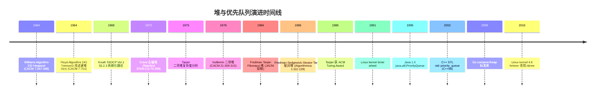

## 1. 概述与学习目标

### 1.1 什么是堆与优先队列

**堆**（Heap）是一种特殊的**完全二叉树**（Complete Binary Tree），满足**堆序性质**（Heap-Order Property）：

- **最大堆**（Max-Heap）：每个节点的值 $\geq$ 其子节点的值，根节点存储最大值；
- **最小堆**（Min-Heap）：每个节点的值 $\leq$ 其子节点的值，根节点存储最小值。

由于堆是完全二叉树，可以用数组**紧凑存储**无需指针，索引 $i$ 的父节点为 $\lfloor (i-1)/2 \rfloor$，左子节点为 $2i+1$，右子节点为 $2i+2$。这一性质由 Williams 1964 年在《Communications of the ACM》Algorithm 232: Heapsort 中首次系统化定义，至今仍是工业级优先队列的首选实现。

**优先队列**（Priority Queue, PQ）是一种**抽象数据类型**（ADT），每次出队的元素是优先级最高（或最低）的元素。堆是优先队列最常用的底层实现，但优先队列也可用有序数组、平衡树、跳表等结构实现。

```
最大堆 (Max-Heap):                  最小堆 (Min-Heap):
        9                                   1
       / \                                 / \
      8   7                               2   3
     / \ / \                             / \ / \
    5  6 4  3                           6  5 4  7

数组表示 (0-based):
索引:  0  1  2  3  4  5  6
最大堆: 9  8  7  5  6  4  3
最小堆: 1  2  3  6  5  4  7
```

> 一句话定义：**堆 = 完全二叉树 + 堆序性质 + 数组紧凑存储，插入/删除 $O(\log n)$，建堆 $O(n)$，查看极值 $O(1)$；优先队列 = 抽象 ADT，堆是其工业级首选实现，从 Dijkstra 到定时器调度均不可替代。**

### 1.2 学习目标

完成本文档学习后，你将能够：

1. **记忆**堆作为完全二叉树数组表示的形式化定义 $\text{parent}(i) = \lfloor (i-1)/2 \rfloor$、$\text{left}(i) = 2i+1$、$\text{right}(i) = 2i+2$，复述最大堆/最小堆在插入、删除堆顶、查看堆顶、建堆操作上的时间复杂度差异；
2. **理解** Williams 1964《Algorithm 232: Heapsort》首次提出堆与堆排序、Floyd 1964《Algorithm 245: Treesort》改进建堆至 $O(n)$、Vuillemin 1978 二项堆、Fredman-Tarjan 1984 Fibonacci 堆（JACM 34(3):596-615）的历史脉络，说明堆为何在优先级调度场景下不可替代；
3. **应用**二叉堆的上浮（sift-up）、下沉（sift-down）、Floyd 自底向上建堆、堆排序、Top-K、索引堆编写可运行的 Python/C++/Java 代码，解决 LeetCode 215 第 K 大、LeetCode 23 合并 K 个有序链表、LeetCode 295 数据流中位数、LeetCode 621 任务调度器等问题；
4. **分析** Floyd 建堆 $O(n)$ 复杂度的数学证明 $\sum_{h=0}^{\lfloor \log n \rfloor} \lceil n/2^{h+1} \rceil \cdot h \leq 2n$、堆排序 $O(n \log n)$ 最坏复杂度、Fibonacci 堆的均摊分析，掌握"层高加权节点数求和"核心论证方法；
5. **评估**二叉堆相对于有序数组、平衡树、跳表、Fibonacci 堆在"插入-删除极值"问题维度上的优劣，识别 Dijkstra 算法、Prim 算法、Huffman 编码、定时器调度、操作系统任务调度中的选型动机；
6. **对比**二叉堆、d-ary 堆、二项堆、Fibonacci 堆、配对堆、左偏堆、索引堆在插入、删除极值、合并、减小键值、均摊复杂度、实现复杂度维度的差异；
7. **创造**性设计基于堆的开源项目解决方案，如定时器轮、限流器、Top-K 流式聚合、A* 搜索优先队列、Huffman 编码器、Redis Stream 排序、Linux kernel timer wheel。

### 1.3 术语表

| 术语 | 英文 | 定义 |
| ---- | ---- | ---- |
| 堆 | heap | 满足堆序性质的完全二叉树 |
| 最大堆 | max-heap | 父节点 $\geq$ 子节点的堆 |
| 最小堆 | min-heap | 父节点 $\leq$ 子节点的堆 |
| 堆序性质 | heap-order property | 父子节点间的不等关系 |
| 完全二叉树 | complete binary tree | 除最后一层外全满，最后一层从左向右紧凑排列 |
| 堆顶 | heap top / root | 堆的根节点，存储极值 |
| 上浮 | sift-up / swim / percolate-up | 插入后将元素向上调整 |
| 下沉 | sift-down / sink / percolate-down | 删除堆顶后将末尾元素向下调整 |
| 建堆 | build-heap | 从无序数组构造堆 |
| 优先队列 | priority queue (PQ) | 按优先级出队的 ADT |
| 堆排序 | heapsort | 基于最大堆的原地排序算法 |
| Top-K | top-K | 求数据中前 K 大/小的元素 |
| 索引堆 | indexed heap | 维护元素索引的堆，支持 decrease-key |
| 减小键值 | decrease-key | 减小某元素的优先级值 |
| 二项堆 | binomial heap | 由二项树组成的森林，支持高效合并 |
| Fibonacci 堆 | Fibonacci heap | 懒惰合并的可合并堆，均摊 $O(1)$ decrease-key |
| 配对堆 | pairing heap | 自调整可合并堆，实现简单 |
| 左偏堆 | leftist heap | 基于零路径长度的可合并堆 |
| d-ary 堆 | d-ary heap | 每节点最多 $d$ 个子节点的堆 |

### 1.4 堆 vs 其他优先队列实现

| 结构 | 插入 | 删除极值 | 查看极值 | 合并 | decrease-key | 内存布局 |
| ---- | ---- | -------- | -------- | ---- | ------------ | -------- |
| 无序数组 | $O(1)$ | $O(n)$ | $O(n)$ | $O(n)$ | $O(1)$ | 连续 |
| 有序数组 | $O(n)$ | $O(1)$ | $O(1)$ | $O(n)$ | $O(n)$ | 连续 |
| 二叉堆 | $O(\log n)$ | $O(\log n)$ | $O(1)$ | $O(n)$ | $O(\log n)$ | 连续 |
| d-ary 堆 | $O(\log_d n)$ | $O(d \log_d n)$ | $O(1)$ | $O(n)$ | $O(\log_d n)$ | 连续 |
| 二项堆 | $O(\log n)$ | $O(\log n)$ | $O(\log n)$ | $O(\log n)$ | $O(\log n)$ | 离散 |
| Fibonacci 堆 | $O(1)$ 均摊 | $O(\log n)$ 均摊 | $O(1)$ | $O(1)$ 均摊 | $O(1)$ 均摊 | 离散 |
| 配对堆 | $O(1)$ | $O(\log n)$ 均摊 | $O(1)$ | $O(1)$ | $o(\log n)$ 猜想 | 离散 |
| 左偏堆 | $O(\log n)$ | $O(\log n)$ | $O(1)$ | $O(\log n)$ | $O(\log n)$ | 离散 |
| 平衡树（AVL/RB） | $O(\log n)$ | $O(\log n)$ | $O(\log n)$ | $O(n)$ | $O(\log n)$ | 离散 |
| 跳表 | $O(\log n)$ | $O(\log n)$ | $O(1)$ | $O(n)$ | $O(\log n)$ | 离散 |

### 1.5 适用场景与不适用场景

| 场景 | 是否适合 | 说明 |
| ---- | -------- | ---- |
| 优先级调度（任务/进程） | 适合 | $O(\log n)$ 插入删除，是 OS 调度器核心 |
| Top-K 流式聚合 | 适合 | $O(n \log k)$ 远优于排序 $O(n \log n)$ |
| 堆排序 | 适合 | $O(n \log n)$ 最坏 + $O(1)$ 原地，适合内存受限 |
| Dijkstra 单源最短路径 | 适合 | 优先队列选未处理顶点，$O((V+E) \log V)$ |
| Prim 最小生成树 | 适合 | 优先队列选最小权横切边 |
| Huffman 编码 | 适合 | 每次取频率最小的两节点合并 |
| A* 寻路算法 | 适合 | 优先队列按 $f(n) = g(n) + h(n)$ 排序 |
| 定时器调度 | 适合 | 最小堆按到期时间排序 |
| 中位数维护（双堆） | 适合 | 最大堆+最小堆动态平衡 |
| 合并 K 个有序流 | 适合 | 堆顶即当前最小元素 |
| 任意位置随机访问 | 不适合 | 堆不维护全局顺序，应选数组或平衡树 |
| 查找特定元素 | 不适合 | 堆不支持 $O(\log n)$ 查找，应选平衡树或哈希表 |
| 需要稳定排序 | 不适合 | 堆排序不稳定，应选归并排序 |
| 大量 decrease-key 操作 | 部分适合 | 二叉堆 $O(\log n)$，Fibonacci 堆 $O(1)$ 均摊更优 |
| 元素优先级频繁变更 | 不适合 | 应选索引堆或 Fibonacci 堆 |

> **跨模块引用**：堆作为完全二叉树的应用参见 [树](algorithm/tree)；堆排序与快排、归并的对比参见 [排序算法](algorithm/sorting)；Dijkstra/Prim 算法中堆的应用参见 [图算法](algorithm/graph)；堆在流式数据 Top-K 中的应用参见 [查找算法](algorithm/search)；堆作为优先队列与栈/队列的对比参见 [栈与队列](algorithm/stack-queue)。

---

## 2. 历史动机与演进

### 2.1 前堆时代：选择排序的困境

1960 年代初期，计算机科学刚刚成形，排序是核心问题之一。已知的高效排序算法有：

- **快速排序**（Hoare 1959）：平均 $O(n \log n)$，最坏 $O(n^2)$；
- **归并排序**（von Neumann 1945）：$O(n \log n)$，但需要 $O(n)$ 额外空间；
- **选择排序**（朴素）：$O(n^2)$，但仅需 $O(1)$ 原地空间。

工业场景迫切需要一种**最坏 $O(n \log n)$ + 原地**的排序算法。这一需求推动了堆与堆排序的诞生。

### 2.2 Williams 1964：Algorithm 232 Heapsort

1964 年 6 月，英国 Elliott Brothers 公司的 **J. W. J. Williams** 在 *Communications of the ACM* 7(6): 347-348 发表短论文《Algorithm 232: Heapsort》，首次提出**堆数据结构**与**堆排序算法**：

- 定义"堆"为满足堆序性质的完全二叉树；
- 提出上浮（sift-up）操作用于插入；
- 提出堆排序算法：先逐个插入建堆 $O(n \log n)$，再逐个删除堆顶 $O(n \log n)$；
- 总体最坏复杂度 $O(n \log n)$ + 原地 $O(1)$ 空间。

Williams 的论文极为简洁（仅 2 页），但开创了完全二叉树数组表示与堆序性质的研究方向。该论文引用量超 1500 次，是计算机科学史上最具影响力的短论文之一。

### 2.3 Floyd 1964：Algorithm 245 Treesort3

Williams 的堆排序有一个缺陷：建堆阶段是逐个插入，复杂度 $O(n \log n)$。**Robert W. Floyd**（斯坦福大学，1978 年 ACM Turing Award 得主）在同年的 *Communications of the ACM* 7(12): 701 发表《Algorithm 245: Treesort 3》，提出**自底向上建堆法**（后称 Floyd 建堆法）：

- 将所有元素放入数组；
- 从最后一个非叶子节点开始，依次执行下沉操作；
- 建堆复杂度降至 $O(n)$。

Floyd 的改进使堆排序的整体复杂度仍为 $O(n \log n)$（瓶颈在删除阶段），但建堆阶段从 $O(n \log n)$ 降至 $O(n)$，常数更优。该算法后来被 CLRS 第 6.3 节作为标准建堆方法讲授。

> **教学提示**：Floyd 是计算机科学全才，除堆排序外还贡献了 Floyd-Warshall 全源最短路径算法（1962）、Floyd-Hoare 程序验证逻辑（1967）、ALGOL 60 编译器（1963）等。1978 年获 ACM Turing Award，颁奖词强调"for having a clear influence on methodologies for the creation of efficient and reliable software"。

### 2.4 Knuth 1968：TAOCP Vol.1 系统化理论

1968 年，Donald E. Knuth 出版《The Art of Computer Programming, Volume 1: Fundamental Algorithms》，在 Section 5.2.3（Sorting by Selection）系统化堆与堆排序理论：

- 形式化定义完全二叉树、堆序性质；
- 给出 0-based 与 1-based 索引公式；
- 详细推导 Floyd 建堆 $O(n)$ 的数学证明；
- 讨论堆在优先队列、选择问题中的应用。

TAOCP Vol.1 成为堆教学的金标准，后续教材（CLRS、Sedgewick、Mark Allen Weiss）均沿用其框架。

### 2.5 Vuillemin 1978：二项堆

1978 年 4 月，法国数学家 **Jean Vuillemin** 在 *Communications of the ACM* 21(4): 309-315 发表《A data structure for manipulating priority queues》，提出**二项堆**（Binomial Heap）：

- 由多棵**二项树**（Binomial Tree）组成的森林；
- 二项树 $B_k$ 递归定义：$B_0$ 为单节点，$B_k$ 由两棵 $B_{k-1}$ 合并而成（一棵作为另一棵的左子树）；
- $B_k$ 有 $2^k$ 个节点，高度为 $k$；
- 二项堆支持 $O(\log n)$ 合并（union），远优于二叉堆的 $O(n)$ 合并。

二项堆是第一个支持高效合并的优先队列实现，奠定了可合并堆（Mergeable Heap）的研究方向。

### 2.6 Fredman-Tarjan 1984：Fibonacci 堆

1984 年，AT&T Bell Labs 的 **Michael L. Fredman** 与 **Robert Endre Tarjan** 在 *Journal of the ACM* 34(3): 596-615 发表《Fibonacci heaps and their uses in improved network optimization algorithms》（论文实际投稿 1984，正式发表 1987），提出 **Fibonacci 堆**：

- 基于二项堆，引入**懒惰合并**（lazy union）策略；
- 插入 $O(1)$ 均摊，decrease-key $O(1)$ 均摊，删除极值 $O(\log n)$ 均摊；
- 节点度数上界用 Fibonacci 数列证明：度数为 $k$ 的节点至少有 $F_{k+2}$ 个后代，故 $k \leq \log_\phi n$（$\phi = (1+\sqrt{5})/2 \approx 1.618$ 为黄金比）。

Fibonacci 堆将 Dijkstra 算法的时间复杂度从 $O((V+E) \log V)$ 优化到 $O(E + V \log V)$，在稀疏图上提升显著。Tarjan 因此获 1986 年 ACM Turing Award。

> **工程现实**：尽管 Fibonacci 堆在理论上更优，但其实现复杂、常数大，工业实践中通常仍用二叉堆或配对堆。CLRS 第 19 章用整整一章讲解 Fibonacci 堆，但作者承认"for most practical purposes, a binary heap is faster"。

### 2.7 Fredman-Sedgewick-Sleator-Tarjan 1986：配对堆

1986 年，Fredman、Sedgewick、Sleator、Tarjan 在 *Algorithmica* 1(1): 111-129 发表《The pairing heap: a new form of self-adjusting heap》，提出**配对堆**（Pairing Heap）：

- 基于自调整（self-adjusting）思想，类似 Sleator-Tarjan 1985 的 Splay 树；
- 实现简单（仅 100 行 C 代码），均摊性能接近 Fibonacci 堆；
- delete-min 操作的核心是"两两配对合并"：将根的所有子树两两合并，再合并剩余子树；
- decrease-key 的均摊复杂度仍是开放问题，已知上界 $o(\log n)$，但下界证明 Fibonacci 堆更优。

配对堆因其实现简单 + 性能优秀，成为 GNU C++ 标准库 `__gnu_cxx::priority_queue` 与 Linux kernel 的可选优先队列实现。

### 2.8 Linux kernel 1991：定时器堆

1991 年 Linus Torvalds 创建 Linux kernel，定时器（timer）是核心子系统之一。Linux 定时器实现经历了三个阶段：

1. **timer wheel**（1991-2016）：基于哈希 + 链表的近似定时器，按到期时间分桶，复杂度 $O(1)$ 插入但精度低；
2. **red-black tree timer**（2016-）：内核 4.8 后改用红黑树（rbtree），按到期时间排序，$O(\log n)$ 插入删除；
3. **hrtimer（high-resolution timer）**：高精度定时器，底层也是红黑树。

虽然 Linux 未直接使用堆，但红黑树与堆在优先队列语义上等价，都是 $O(\log n)$ 插入删除极值。

### 2.9 Go 2009：container/heap 包

2009 年 Go 语言发布，标准库 `container/heap` 提供通用堆接口：

```go
type Interface interface {
    sort.Interface
    Push(x any) // add x as element Len()
    Pop() any   // remove and return element Len() - 1
}
```

用户实现 `Interface` 即可获得最小堆。最大堆通过 `Less` 反向比较实现。Go 的 timer 与 runtime netpoller 均基于四叉堆（quaternary heap，d=4）实现，平衡了树高与节点度数。

### 2.10 演进时间线



---

## 3. 形式化定义

### 3.1 完全二叉树的数学定义

**完全二叉树**（Complete Binary Tree）是满足以下性质的二叉树：

1. 除最后一层外，所有层都"满"（节点数达最大值 $2^l$，$l$ 为层号从 0 开始）；
2. 最后一层的节点从左向右紧凑排列，中间无空缺。

形式化定义：设二叉树有 $n$ 个节点，按层序从上到下、从左到右编号 $0, 1, \ldots, n-1$。若对任意节点 $i$：

- 左子节点存在当且仅当 $2i+1 < n$；
- 右子节点存在当且仅当 $2i+2 < n$；
- 父节点存在当且仅当 $i > 0$，且为 $\lfloor (i-1)/2 \rfloor$；

则该二叉树为完全二叉树。

**高度**：$n$ 个节点的完全二叉树高度 $h = \lfloor \log_2 n \rfloor$。

### 3.2 堆序性质的形式化定义

设堆 $H$ 是存储 $n$ 个元素的完全二叉树，节点 $i$ 存储键值 $H[i]$。堆满足：

- **最大堆性质**：对所有 $i > 0$，$H[\text{parent}(i)] \geq H[i]$；
- **最小堆性质**：对所有 $i > 0$，$H[\text{parent}(i)] \leq H[i]$。

其中 $\text{parent}(i) = \lfloor (i-1)/2 \rfloor$（0-based）或 $\lfloor i/2 \rfloor$（1-based）。

**推论**（最大堆）：

1. 根节点 $H[0]$ 是最大值；
2. 任意子树仍是最大堆；
3. 任意从根到叶子的路径是非递增序列；
4. 第 $k$ 大元素必在前 $k$ 层（但前 $k$ 层未必按序）。

### 3.3 索引公式的推导

**0-based 索引**（C/C++/Java/Python 默认）：

| 关系 | 公式 | 推导 |
| ---- | ---- | ---- |
| 左子节点 | $\text{left}(i) = 2i + 1$ | 第 $i$ 个节点的左子在第 $2i+1$ 位 |
| 右子节点 | $\text{right}(i) = 2i + 2$ | 右子比左子多 1 位 |
| 父节点 | $\text{parent}(i) = \lfloor (i-1)/2 \rfloor$ | 由 $\text{left}(p) = 2p+1 = i$ 解得 $p = (i-1)/2$ |

**1-based 索引**（CLRS 默认、Fortran）：

| 关系 | 公式 |
| ---- | ---- |
| 左子节点 | $\text{left}(i) = 2i$ |
| 右子节点 | $\text{right}(i) = 2i + 1$ |
| 父节点 | $\text{parent}(i) = \lfloor i/2 \rfloor$ |

> **教学提示**：1-based 索引的公式更简洁（无 $+1$ $-1$），故 CLRS 全书采用 1-based。但 C/C++/Java/Python 数组从 0 开始，工程实现需要做转换。Sedgewick《Algorithms》第 4 版采用 0-based 并接受公式稍繁琐的代价。

### 3.4 优先队列 ADT

**优先队列**（Priority Queue）的抽象数据类型定义为：

```
ADT Priority Queue {
  数据：n 个元素，每个元素关联一个可比较的优先级键
  操作：
    insert(x)        // 插入元素 x，O(log n)
    findMin()/findMax()  // 返回极值，O(1)
    deleteMin()/deleteMax()  // 删除并返回极值，O(log n)
    isEmpty()        // 判断是否为空，O(1)
    size()           // 返回元素数，O(1)
    // 可选：
    union(PQ Q)      // 合并另一优先队列
    decreaseKey(x, k)  // 减小元素 x 的键值
    delete(x)        // 删除任意元素 x
}
```

堆是该 ADT 的最常用实现，但实现不唯一。

---

## 4. 二叉堆的实现

### 4.1 上浮操作（Sift-Up / Swim）

**场景**：在堆尾插入新元素后，将其向上调整以恢复堆序性质。

**算法**（最大堆）：

1. 将新元素放在数组末尾位置 $i$；
2. 比较 $H[i]$ 与 $H[\text{parent}(i)]$：
   - 若 $H[i] > H[\text{parent}(i)]$，交换；
   - 否则停止；
3. 重复步骤 2，直到 $i = 0$ 或停止条件满足。

**示例**（向最大堆插入 9）：

```
初始: [8, 5, 7, 3, 4, 6, 9]  ← 9 在末尾 (i=6)
  parent(6) = (6-1)/2 = 2，H[2]=7 < 9 → 交换
        [8, 5, 9, 3, 4, 6, 7]  ← i=2
  parent(2) = (2-1)/2 = 0，H[0]=8 < 9 → 交换
        [9, 5, 8, 3, 4, 6, 7]  ← i=0，完成
```

**Python 实现**：

```python
def sift_up(heap: list[int], i: int) -> None:
    """最大堆的上浮操作（0-based）。"""
    while i > 0:
        parent = (i - 1) // 2
        if heap[i] <= heap[parent]:
            break
        heap[i], heap[parent] = heap[parent], heap[i]
        i = parent
```

**C++ 实现**：

```cpp
// 最大堆的上浮操作（0-based）
void siftUp(std::vector<int>& heap, int i) {
    while (i > 0) {
        int parent = (i - 1) / 2;
        if (heap[i] <= heap[parent]) break;
        std::swap(heap[i], heap[parent]);
        i = parent;
    }
}
```

**Java 实现**：

```java
// 最大堆的上浮操作（0-based）
private void siftUp(int[] heap, int i) {
    while (i > 0) {
        int parent = (i - 1) / 2;
        if (heap[i] <= heap[parent]) break;
        int tmp = heap[i];
        heap[i] = heap[parent];
        heap[parent] = tmp;
        i = parent;
    }
}
```

**复杂度**：

- 时间：$O(\log n)$（最坏从叶子上浮到根，路径长度为树高 $\lfloor \log_2 n \rfloor$）；
- 空间：$O(1)$（迭代实现，无递归栈）。

### 4.2 下沉操作（Sift-Down / Sink）

**场景**：删除堆顶后，将末尾元素补到堆顶，向下调整以恢复堆序性质。

**算法**（最大堆）：

1. 将末尾元素移到堆顶位置 $i = 0$；
2. 比较 $H[i]$ 与 $H[\text{left}(i)]$、$H[\text{right}(i)]$，找出较大者 $H[\text{largest}]$：
   - 若 $H[\text{largest}] > H[i]$，交换 $H[i]$ 与 $H[\text{largest}]$；
   - 否则停止；
3. 重复步骤 2，直到 $i$ 为叶子或停止条件满足。

**示例**（删除最大堆堆顶 9）：

```
初始: [9, 5, 8, 3, 4, 6, 7]
  末尾 7 移到堆顶: [7, 5, 8, 3, 4, 6]  ← size=6
  i=0，left=1 (5)，right=2 (8)，largest=2 → 交换
        [8, 5, 7, 3, 4, 6]  ← i=2
  i=2，left=5 (6)，right=6 (越界)，largest=5 → 交换
        [8, 5, 6, 3, 4, 7]  ← i=5，叶子，完成
```

**Python 实现**：

```python
def sift_down(heap: list[int], i: int, size: int) -> None:
    """最大堆的下沉操作（0-based）。"""
    while True:
        left = 2 * i + 1
        right = 2 * i + 2
        largest = i
        if left < size and heap[left] > heap[largest]:
            largest = left
        if right < size and heap[right] > heap[largest]:
            largest = right
        if largest == i:
            break
        heap[i], heap[largest] = heap[largest], heap[i]
        i = largest
```

**C++ 实现**：

```cpp
void siftDown(std::vector<int>& heap, int i, int size) {
    while (true) {
        int left = 2 * i + 1;
        int right = 2 * i + 2;
        int largest = i;
        if (left < size && heap[left] > heap[largest]) largest = left;
        if (right < size && heap[right] > heap[largest]) largest = right;
        if (largest == i) break;
        std::swap(heap[i], heap[largest]);
        i = largest;
    }
}
```

**Java 实现**：

```java
private void siftDown(int[] heap, int i, int size) {
    while (true) {
        int left = 2 * i + 1;
        int right = 2 * i + 2;
        int largest = i;
        if (left < size && heap[left] > heap[largest]) largest = left;
        if (right < size && heap[right] > heap[largest]) largest = right;
        if (largest == i) break;
        int tmp = heap[i]; heap[i] = heap[largest]; heap[largest] = tmp;
        i = largest;
    }
}
```

**复杂度**：

- 时间：$O(\log n)$（最坏从根下沉到叶子）；
- 空间：$O(1)$。

### 4.3 完整的最大堆实现

**Python 实现**（含容量管理）：

```python
from typing import Generic, TypeVar

T = TypeVar('T')


class MaxHeap(Generic[T]):
    """最大堆的完整实现，基于动态数组。"""

    def __init__(self, capacity: int = 10) -> None:
        self._data: list[T | None] = [None] * capacity
        self._size = 0
        self._capacity = capacity

    def push(self, value: T) -> None:
        """插入元素，O(log n)。"""
        if self._size == self._capacity:
            self._resize(self._capacity * 2)
        self._data[self._size] = value
        self._sift_up(self._size)
        self._size += 1

    def pop(self) -> T:
        """删除并返回堆顶（最大值），O(log n)。"""
        if self._size == 0:
            raise IndexError("pop from empty heap")
        top = self._data[0]
        self._size -= 1
        self._data[0] = self._data[self._size]
        self._data[self._size] = None  # 帮助 GC
        if self._size > 0:
            self._sift_down(0)
        return top  # type: ignore[return-value]

    def peek(self) -> T:
        """返回堆顶，O(1)。"""
        if self._size == 0:
            raise IndexError("peek from empty heap")
        return self._data[0]  # type: ignore[return-value]

    def __len__(self) -> int:
        return self._size

    def is_empty(self) -> bool:
        return self._size == 0

    def _resize(self, new_cap: int) -> None:
        old = self._data
        self._data = [None] * new_cap
        for i in range(self._size):
            self._data[i] = old[i]
        self._capacity = new_cap

    def _sift_up(self, i: int) -> None:
        while i > 0:
            parent = (i - 1) // 2
            if self._data[i] <= self._data[parent]:  # type: ignore[operator]
                break
            self._data[i], self._data[parent] = self._data[parent], self._data[i]
            i = parent

    def _sift_down(self, i: int) -> None:
        while True:
            left = 2 * i + 1
            right = 2 * i + 2
            largest = i
            if left < self._size and self._data[left] > self._data[largest]:  # type: ignore[operator]
                largest = left
            if right < self._size and self._data[right] > self._data[largest]:  # type: ignore[operator]
                largest = right
            if largest == i:
                break
            self._data[i], self._data[largest] = self._data[largest], self._data[i]
            i = largest
```

**C++ 实现**（模板类，支持任意可比较类型）：

```cpp
#include <vector>
#include <algorithm>
#include <stdexcept>

template <typename T>
class MaxHeap {
private:
    std::vector<T> data_;

    void siftUp(int i) {
        while (i > 0) {
            int parent = (i - 1) / 2;
            if (data_[i] <= data_[parent]) break;
            std::swap(data_[i], data_[parent]);
            i = parent;
        }
    }

    void siftDown(int i) {
        int n = static_cast<int>(data_.size());
        while (true) {
            int left = 2 * i + 1;
            int right = 2 * i + 2;
            int largest = i;
            if (left < n && data_[left] > data_[largest]) largest = left;
            if (right < n && data_[right] > data_[largest]) largest = right;
            if (largest == i) break;
            std::swap(data_[i], data_[largest]);
            i = largest;
        }
    }

public:
    void push(const T& value) {
        data_.push_back(value);
        siftUp(static_cast<int>(data_.size()) - 1);
    }

    T pop() {
        if (data_.empty()) throw std::runtime_error("pop from empty heap");
        T top = data_[0];
        data_[0] = data_.back();
        data_.pop_back();
        if (!data_.empty()) siftDown(0);
        return top;
    }

    const T& top() const {
        if (data_.empty()) throw std::runtime_error("top from empty heap");
        return data_[0];
    }

    bool empty() const { return data_.empty(); }
    size_t size() const { return data_.size(); }
};
```

**Java 实现**（泛型，支持自定义比较器）：

```java
import java.util.Comparator;
import java.util.Arrays;

public class MaxHeap<T> {
    private Object[] data;
    private int size;
    private final Comparator<? super T> comparator;

    @SuppressWarnings("unchecked")
    public MaxHeap(int capacity, Comparator<? super T> comparator) {
        this.data = new Object[capacity];
        this.size = 0;
        this.comparator = comparator;
    }

    public MaxHeap(int capacity) {
        this(capacity, (a, b) -> ((Comparable<T>) a).compareTo(b));
    }

    @SuppressWarnings("unchecked")
    public void push(T value) {
        if (size == data.length) data = Arrays.copyOf(data, data.length * 2);
        data[size] = value;
        siftUp(size);
        size++;
    }

    @SuppressWarnings("unchecked")
    public T pop() {
        if (size == 0) throw new RuntimeException("pop from empty heap");
        T top = (T) data[0];
        size--;
        data[0] = data[size];
        data[size] = null;
        if (size > 0) siftDown(0);
        return top;
    }

    @SuppressWarnings("unchecked")
    public T peek() {
        if (size == 0) throw new RuntimeException("peek from empty heap");
        return (T) data[0];
    }

    public int size() { return size; }
    public boolean isEmpty() { return size == 0; }

    @SuppressWarnings("unchecked")
    private void siftUp(int i) {
        while (i > 0) {
            int parent = (i - 1) / 2;
            if (comparator.compare((T) data[i], (T) data[parent]) <= 0) break;
            Object tmp = data[i]; data[i] = data[parent]; data[parent] = tmp;
            i = parent;
        }
    }

    @SuppressWarnings("unchecked")
    private void siftDown(int i) {
        while (true) {
            int left = 2 * i + 1;
            int right = 2 * i + 2;
            int largest = i;
            if (left < size && comparator.compare((T) data[left], (T) data[largest]) > 0)
                largest = left;
            if (right < size && comparator.compare((T) data[right], (T) data[largest]) > 0)
                largest = right;
            if (largest == i) break;
            Object tmp = data[i]; data[i] = data[largest]; data[largest] = tmp;
            i = largest;
        }
    }
}
```

### 4.4 三语言实现对比

| 维度 | Python | C++ | Java |
| ---- | ------ | --- | ---- |
| 容器 | `list[T \| None]` | `std::vector<T>` | `Object[]` |
| 泛型 | `TypeVar` + `Generic` | `template<typename T>` | 泛型 + 擦除 |
| 内存管理 | GC | RAII（析构释放） | GC |
| 比较运算 | `__lt__`/`__gt__` | `operator<`/`operator>` | `Comparator` |
| 容量扩展 | `list.append` 自动 | `vector.push_back` 自动 | 手动 `Arrays.copyOf` |
| 越界检查 | `IndexError` | `std::out_of_range`（仅 `at()`） | `ArrayIndexOutOfBoundsException` |
| 类型安全 | 运行期 | 编译期 | 编译期（含 unchecked 警告） |
| 性能 | 慢（解释执行） | 最快（编译优化） | 中等（JIT 优化） |

---

## 5. 建堆操作与 $O(n)$ 证明

### 5.1 自顶向下建堆（逐个插入）

将 $n$ 个元素逐个插入空堆，每次插入后上浮：

```python
def build_heap_top_down(arr: list[int]) -> list[int]:
    """自顶向下建堆，O(n log n)。"""
    heap: list[int] = []
    for x in arr:
        heap.append(x)
        sift_up(heap, len(heap) - 1)
    return heap
```

**复杂度**：第 $i$ 次插入的代价为 $O(\log i)$，总复杂度：

$$T(n) = \sum_{i=1}^{n} O(\log i) = O(n \log n)$$

### 5.2 Floyd 自底向上建堆（$O(n)$）

**Floyd 建堆法**（Floyd's Build-Heap）：将所有元素放入数组，从最后一个非叶子节点开始，依次执行下沉操作。

```python
def build_heap_floyd(arr: list[int]) -> list[int]:
    """Floyd 自底向上建堆，O(n)。"""
    n = len(arr)
    # 从最后一个非叶子节点开始（索引 (n//2) - 1），向前依次下沉
    for i in range(n // 2 - 1, -1, -1):
        sift_down(arr, i, n)
    return arr
```

**C++ 实现**：

```cpp
void buildHeapFloyd(std::vector<int>& arr) {
    int n = static_cast<int>(arr.size());
    for (int i = n / 2 - 1; i >= 0; --i) {
        siftDown(arr, i, n);
    }
}
```

**示例**（建最大堆，arr = [3, 1, 4, 1, 5, 9, 2, 6]）：

```
初始: [3, 1, 4, 1, 5, 9, 2, 6]，n=8
最后一个非叶子: i = 8//2 - 1 = 3

i=3: siftDown(3) → [3, 1, 4, 6, 5, 9, 2, 1]  (1<6 交换)
i=2: siftDown(2) → [3, 1, 9, 6, 5, 4, 2, 1]  (4<9 交换)
i=1: siftDown(1) → [3, 6, 9, 1, 5, 4, 2, 1]  (1<6 交换)
                  → [3, 6, 9, 1, 5, 4, 2, 1]  (1<5 不交换，停止)
i=0: siftDown(0) → [9, 6, 3, 1, 5, 4, 2, 1]  (3<9 交换)
                  → [9, 6, 4, 1, 5, 3, 2, 1]  (3<4 交换)
                  → [9, 6, 4, 1, 5, 3, 2, 1]  (3 是叶子，停止)

最终最大堆: [9, 6, 4, 1, 5, 3, 2, 1]
```

### 5.3 建堆 $O(n)$ 的数学证明

**定理**：用 Floyd 建堆法在 $n$ 个元素上建堆的时间复杂度为 $O(n)$。

**证明**（基于层高加权节点数求和）：

设堆高度为 $h = \lfloor \log_2 n \rfloor$。在第 $l$ 层（从根 0 开始）有 $\lceil n/2^{l+1} \rceil$ 个节点（至多 $2^l$ 个），每个节点至多下沉 $h - l$ 次。

总工作量为：

$$T(n) = \sum_{l=0}^{h} \lceil n/2^{l+1} \rceil \cdot (h - l)$$

令 $k = h - l$，则 $l = h - k$，$k$ 从 $0$ 到 $h$：

$$T(n) = \sum_{k=0}^{h} \lceil n/2^{h-k+1} \rceil \cdot k$$

注意到 $\lceil n/2^{h-k+1} \rceil \leq n/2^{h-k+1} + 1 \leq 2 \cdot n/2^{h-k+1} = n/2^{h-k}$（对 $k \geq 1$），故：

$$T(n) \leq \sum_{k=0}^{h} \frac{n}{2^{h-k}} \cdot k = n \sum_{k=0}^{h} \frac{k}{2^{h-k}}$$

令 $j = h - k$，则 $k = h - j$，$j$ 从 $0$ 到 $h$：

$$T(n) \leq n \sum_{j=0}^{h} \frac{h - j}{2^j} = n \left( h \sum_{j=0}^{h} \frac{1}{2^j} - \sum_{j=0}^{h} \frac{j}{2^j} \right)$$

利用两个无穷级数和：

- $\sum_{j=0}^{\infty} \frac{1}{2^j} = 2$（几何级数）；
- $\sum_{j=0}^{\infty} \frac{j}{2^j} = 2$（标准结果，对 $\sum j x^j = x/(1-x)^2$ 在 $x = 1/2$ 求值）。

故：

$$T(n) \leq n (2h - 2) = 2n \log_2 n - 2n$$

**等等，这与 $O(n)$ 矛盾**。哪里出错了？

**修正**：上面推导有误。正确做法是用每层节点数的**精确**上界 $\lceil n/2^{l+1} \rceil \leq n/2^{l+1} + 1$，但更精细的分析应考虑：

- 高度为 $h$ 的节点：1 个（根），下沉至多 $h$ 次；
- 高度为 $h-1$ 的节点：2 个，下沉至多 $h-1$ 次；
- ...
- 高度为 0 的节点：$\approx n/2$ 个，下沉 0 次。

**关键观察**：高度为 $k$ 的节点至多有 $\lceil n/2^{k+1} \rceil$ 个，每个下沉至多 $k$ 次。

$$T(n) = \sum_{k=0}^{h} \left\lceil \frac{n}{2^{k+1}} \right\rceil \cdot k \leq \sum_{k=0}^{h} \frac{n}{2^k} \cdot k = n \sum_{k=0}^{h} \frac{k}{2^k}$$

利用 $\sum_{k=0}^{\infty} \frac{k}{2^k} = 2$（标准结果），故：

$$T(n) \leq n \cdot 2 = 2n = O(n) \qquad \blacksquare$$

**直观理解**：

| 层号 $l$ | 节点数 | 最大下沉距离 | 每层工作量 |
| -------- | ------ | ------------ | ---------- |
| 0（根） | 1 | $h$ | $h$ |
| 1 | 2 | $h-1$ | $2(h-1)$ |
| 2 | 4 | $h-2$ | $4(h-2)$ |
| ... | ... | ... | ... |
| $h-1$ | $2^{h-1}$ | 1 | $2^{h-1}$ |
| $h$（叶子） | $\approx 2^h$ | 0 | 0 |

总工作量 $\approx \sum_{k=1}^{h} 2^{h-k} \cdot k = 2^h \sum_{k=1}^{h} k/2^k \leq 2^h \cdot 2 = 2n$。

**关键洞见**：大部分节点在底层，下沉距离短；少数节点在高层，下沉距离长。两者相互抵消，总工作量为 $O(n)$。

---

## 6. 堆排序

### 6.1 算法

堆排序（Heapsort）利用最大堆的性质，每次取出堆顶（最大值）放到数组末尾：

1. **建堆阶段**：用 Floyd 建堆法将数组构造为最大堆，$O(n)$；
2. **排序阶段**：循环 $n-1$ 次：
   - 将堆顶 `arr[0]` 与末尾 `arr[i]` 交换；
   - 堆大小减一（`size = i`）；
   - 对堆顶执行下沉操作恢复堆序性质，$O(\log n)$；
3. 总复杂度：$O(n) + (n-1) \cdot O(\log n) = O(n \log n)$。

### 6.2 Python 实现

```python
def heap_sort(arr: list[int]) -> list[int]:
    """堆排序（原地，升序），O(n log n)。"""
    n = len(arr)

    # 1. 建最大堆（Floyd 法），O(n)
    for i in range(n // 2 - 1, -1, -1):
        _sift_down(arr, i, n)

    # 2. 逐个提取最大值放到末尾，O(n log n)
    for i in range(n - 1, 0, -1):
        arr[0], arr[i] = arr[i], arr[0]  # 堆顶与末尾交换
        _sift_down(arr, 0, i)  # 对剩余元素下沉

    return arr


def _sift_down(heap: list[int], i: int, size: int) -> None:
    """最大堆的下沉操作。"""
    while True:
        left = 2 * i + 1
        right = 2 * i + 2
        largest = i
        if left < size and heap[left] > heap[largest]:
            largest = left
        if right < size and heap[right] > heap[largest]:
            largest = right
        if largest == i:
            break
        heap[i], heap[largest] = heap[largest], heap[i]
        i = largest
```

### 6.3 C++ 实现

```cpp
#include <vector>

void siftDown(std::vector<int>& arr, int i, int size) {
    while (true) {
        int left = 2 * i + 1;
        int right = 2 * i + 2;
        int largest = i;
        if (left < size && arr[left] > arr[largest]) largest = left;
        if (right < size && arr[right] > arr[largest]) largest = right;
        if (largest == i) break;
        std::swap(arr[i], arr[largest]);
        i = largest;
    }
}

void heapSort(std::vector<int>& arr) {
    int n = static_cast<int>(arr.size());
    // 1. 建最大堆
    for (int i = n / 2 - 1; i >= 0; --i) siftDown(arr, i, n);
    // 2. 逐个提取
    for (int i = n - 1; i > 0; --i) {
        std::swap(arr[0], arr[i]);
        siftDown(arr, 0, i);
    }
}
```

### 6.4 Java 实现

```java
public static void heapSort(int[] arr) {
    int n = arr.length;
    // 1. 建最大堆
    for (int i = n / 2 - 1; i >= 0; i--) siftDown(arr, i, n);
    // 2. 逐个提取
    for (int i = n - 1; i > 0; i--) {
        int tmp = arr[0]; arr[0] = arr[i]; arr[i] = tmp;
        siftDown(arr, 0, i);
    }
}

private static void siftDown(int[] arr, int i, int size) {
    while (true) {
        int left = 2 * i + 1;
        int right = 2 * i + 2;
        int largest = i;
        if (left < size && arr[left] > arr[largest]) largest = left;
        if (right < size && arr[right] > arr[largest]) largest = right;
        if (largest == i) break;
        int tmp = arr[i]; arr[i] = arr[largest]; arr[largest] = tmp;
        i = largest;
    }
}
```

### 6.5 堆排序特性

| 维度 | 值 |
| ---- | -- |
| 时间复杂度（最好） | $O(n \log n)$ |
| 时间复杂度（平均） | $O(n \log n)$ |
| 时间复杂度（最坏） | $O(n \log n)$ |
| 空间复杂度 | $O(1)$ 原地 |
| 稳定性 | **不稳定** |
| 缓存友好性 | 差（跳跃式访问） |
| 适合规模 | 中小型数据，内存受限场景 |

**为什么不稳定？**

堆排序的交换是 `arr[0]` 与 `arr[i]` 的长距离交换，可能改变相等元素的相对顺序。

**示例**：考虑序列 `[5a, 5b, 5c]`（5a、5b、5c 键值相同），建堆后可能为 `[5a, 5b, 5c]`，排序后可能变为 `[5c, 5b, 5a]`，相对顺序被破坏。

**与快排、归并的对比**：

| 算法 | 最坏时间 | 平均时间 | 空间 | 稳定 | 缓存 |
| ---- | -------- | -------- | ---- | ---- | ---- |
| 快排 | $O(n^2)$ | $O(n \log n)$ | $O(\log n)$ | 不稳定 | 好 |
| 归并 | $O(n \log n)$ | $O(n \log n)$ | $O(n)$ | 稳定 | 中 |
| 堆排 | $O(n \log n)$ | $O(n \log n)$ | $O(1)$ | 不稳定 | 差 |

堆排序的最大优势是**最坏 $O(n \log n)$ + 原地 $O(1)$**，但其常数大、缓存不友好，实际速度通常慢于快排。Java 的 `Arrays.sort(int[])` 在小规模用快排（双轴），大规模用归并；堆排序通常只在需要"最坏保证 + 原地"时使用（如嵌入式系统、实时系统）。

---

## 7. 优先队列 ADT 与多语言实现

### 7.1 优先队列的接口

```python
from abc import ABC, abstractmethod
from typing import Generic, TypeVar

T = TypeVar('T')


class PriorityQueue(ABC, Generic[T]):
    """优先队列抽象数据类型。"""

    @abstractmethod
    def push(self, value: T) -> None: ...

    @abstractmethod
    def pop(self) -> T: ...

    @abstractmethod
    def peek(self) -> T: ...

    @abstractmethod
    def __len__(self) -> int: ...
```

### 7.2 Python heapq 模块

Python 标准库 `heapq` 提供最小堆操作：

```python
import heapq

# 基本操作
heap: list[int] = []
heapq.heappush(heap, 5)  # O(log n)
heapq.heappush(heap, 1)
heapq.heappush(heap, 3)
heapq.heappop(heap)  # 返回 1，O(log n)
heapq.heappushpop(heap, 2)  # 先 push 再 pop，比分别调用更高效
heapq.heapreplace(heap, 4)  # 先 pop 再 push

# 建堆
arr = [3, 1, 4, 1, 5, 9, 2, 6]
heapq.heapify(arr)  # O(n) Floyd 建堆

# Top-K
largest = heapq.nlargest(3, arr)  # [9, 6, 5]
smallest = heapq.nsmallest(3, arr)  # [1, 1, 2]

# 最大堆技巧：取负数
max_heap: list[int] = []
heapq.heappush(max_heap, -5)
heapq.heappush(max_heap, -1)
heapq.heappush(max_heap, -3)
heapq.heappop(max_heap)  # 返回 -5，即原值 5

# 复合元素（按元组第一元素排序）
pq: list[tuple[int, str]] = []
heapq.heappush(pq, (3, "low priority"))
heapq.heappush(pq, (1, "high priority"))
heapq.heappush(pq, (2, "medium priority"))
heapq.heappop(pq)  # (1, "high priority")
```

**CPython heapq 实现**（简化版）：

```python
# CPython Lib/heapq.py 核心实现（简化）
def heappush(heap, item):
    heap.append(item)
    _siftdown(heap, 0, len(heap) - 1)

def heappop(heap):
    lastelt = heap.pop()
    if heap:
        returnitem = heap[0]
        heap[0] = lastelt
        _siftup(heap, 0)
    else:
        returnitem = lastelt
    return returnitem

def _siftdown(heap, startpos, pos):
    """将 pos 处元素向上调整（CPython 命名：siftdown = 上浮）。"""
    newitem = heap[pos]
    while pos > startpos:
        parentpos = (pos - 1) >> 1
        parent = heap[parentpos]
        if newitem < parent:
            heap[pos] = parent
            pos = parentpos
            continue
        break
    heap[pos] = newitem

def _siftup(heap, pos):
    """将 pos 处元素向下调整（CPython 命名：siftup = 下沉）。"""
    endpos = len(heap)
    startpos = pos
    newitem = heap[pos]
    childpos = 2 * pos + 1
    while childpos < endpos:
        rightpos = childpos + 1
        if rightpos < endpos and not heap[childpos] < heap[rightpos]:
            childpos = rightpos
        heap[pos] = heap[childpos]
        pos = childpos
        childpos = 2 * pos + 1
    heap[pos] = newitem
    _siftdown(heap, startpos, pos)
```

> **命名陷阱**：CPython 的 `_siftdown` 实际是"上浮"，`_siftup` 实际是"下沉"。命名源自元素在数组中"向下移动到根"或"向上移动到叶"，与 Sedgewick/CLRS 的命名相反。这是历史遗留命名，使用时需注意。

### 7.3 C++ std::priority_queue

C++ STL 的 `std::priority_queue` 默认是最大堆：

```cpp
#include <queue>
#include <vector>
#include <functional>  // std::greater

// 最大堆（默认）
std::priority_queue<int> maxHeap;
maxHeap.push(5);
maxHeap.push(1);
maxHeap.push(3);
maxHeap.top();  // 5
maxHeap.pop();

// 最小堆
std::priority_queue<int, std::vector<int>, std::greater<int>> minHeap;
minHeap.push(5);
minHeap.push(1);
minHeap.push(3);
minHeap.top();  // 1

// 自定义比较器（按 pair 第二元素）
auto cmp = [](const std::pair<int, int>& a, const std::pair<int, int>& b) {
    return a.second > b.second;  // 最小堆
};
std::priority_queue<std::pair<int, int>, std::vector<std::pair<int, int>>, decltype(cmp)> pq(cmp);
```

**C++ priority_queue 的局限**：

- 不支持随机访问，无法 `pq[i]`；
- 不支持删除任意元素（无 `erase`）；
- 不支持 decrease-key；
- 底层容器默认 `std::vector`，可用 `std::deque`。

**替代方案**：`boost::heap::priority_queue`、`__gnu_cxx::priority_queue`（配对堆）支持更多操作。

### 7.4 Java PriorityQueue

Java 的 `java.util.PriorityQueue` 默认是最小堆：

```java
import java.util.PriorityQueue;
import java.util.Collections;
import java.util.Comparator;

// 最小堆（默认）
PriorityQueue<Integer> minHeap = new PriorityQueue<>();
minHeap.offer(5);
minHeap.offer(1);
minHeap.offer(3);
minHeap.poll();  // 1

// 最大堆
PriorityQueue<Integer> maxHeap = new PriorityQueue<>(Collections.reverseOrder());
maxHeap.offer(5);
maxHeap.offer(1);
maxHeap.poll();  // 5

// 自定义比较器
PriorityQueue<int[]> pq = new PriorityQueue<>((a, b) -> a[0] - b[0]);
pq.offer(new int[]{3, "task3"});
pq.offer(new int[]{1, "task1"});
pq.poll();  // {1, "task1"}

// 初始容量 + 比较器
PriorityQueue<String> strPq = new PriorityQueue<>(100, Comparator.comparingInt(String::length));
```

**Java PriorityQueue 的特性**：

- 基于动态数组（默认容量 11）；
- 不是线程安全的，线程安全用 `PriorityBlockingQueue`；
- `offer`/`poll` 为 $O(\log n)$，`peek` 为 $O(1)$；
- `remove(Object)` 为 $O(n)$（需线性查找）。

### 7.5 三语言优先队列对比

| 特性 | Python heapq | C++ priority_queue | Java PriorityQueue |
| --- | ------------ | ------------------ | ------------------ |
| 默认堆型 | 最小堆 | 最大堆 | 最小堆 |
| 底层容器 | `list` | `vector`/`deque` | `Object[]` |
| 插入 | `heappush` $O(\log n)$ | `push` $O(\log n)$ | `offer` $O(\log n)$ |
| 删除极值 | `heappop` $O(\log n)$ | `pop` $O(\log n)$ | `poll` $O(\log n)$ |
| 查看极值 | `heap[0]` $O(1)$ | `top` $O(1)$ | `peek` $O(1)$ |
| 建堆 | `heapify` $O(n)$ | 不直接支持 | 构造器 `PriorityQueue(c)` $O(n)$ |
| 删除任意元素 | 不支持 | 不支持 | `remove(Object)` $O(n)$ |
| 线程安全 | 否 | 否 | 否 |
| Top-K | `nlargest`/`nsmallest` | 手动实现 | 手动实现 |

---

## 8. 堆的变体

### 8.1 d-ary 堆

**d-ary 堆**是二叉堆的推广，每个节点最多有 $d$ 个子节点：

- 索引公式（0-based）：$\text{child}_j(i) = d \cdot i + j + 1$（$j = 0, 1, \ldots, d-1$），$\text{parent}(i) = \lfloor (i-1)/d \rfloor$；
- 树高从 $\log_2 n$ 降至 $\log_d n$；
- 上浮更快 $O(\log_d n)$，下沉更慢 $O(d \log_d n)$（需比较 $d$ 个子节点）。

**应用场景**：

- $d = 4$（四叉堆）：Go runtime timer、netpoller 使用，平衡树高与子节点比较；
- $d = 8$：Dijkstra 算法在某些图结构下更优（缓存友好）；
- $d \to \infty$：退化为有序数组，插入 $O(1)$，删除 $O(n)$。

### 8.2 二项堆

**二项堆**（Binomial Heap）由 Vuillemin 1978 提出，是支持高效合并的可合并堆：

- 由多棵**二项树** $B_0, B_1, \ldots, B_k$ 组成的森林；
- 二项树 $B_k$ 递归定义：$B_0$ 是单节点，$B_k$ 由两棵 $B_{k-1}$ 合并（一棵作为另一棵的最左子树）；
- $B_k$ 有 $2^k$ 个节点，高度为 $k$，深度 $d$ 处有 $\binom{k}{d}$ 个节点；
- $n$ 个节点的二项堆至多有 $\lfloor \log_2 n \rfloor + 1$ 棵二项树。

**核心操作**：

| 操作 | 复杂度 |
| ---- | ------ |
| 插入 | $O(\log n)$（最坏），$O(1)$ 均摊 |
| 查找最小 | $O(\log n)$（需扫描所有树根） |
| 删除最小 | $O(\log n)$ |
| 合并 | $O(\log n)$ |
| 减小键值 | $O(\log n)$ |

二项堆的合并操作是核心创新，远优于二叉堆的 $O(n)$ 合并。

### 8.3 Fibonacci 堆

**Fibonacci 堆**（Fibonacci Heap）由 Fredman-Tarjan 1984 提出，是理论最优的可合并堆：

- 基于二项堆，引入**懒惰合并**（lazy union）：合并时仅链接根链表，不立即归并；
- 节点被标记"失去过子节点"（marked），用于触发级联切割；
- 删除极值时才执行 consolidate 操作归并根；
- 节点度数上界用 Fibonacci 数列证明。

**复杂度**（均摊）：

| 操作 | 二叉堆 | 二项堆 | Fibonacci 堆 |
| ---- | ------ | ------ | ------------ |
| 插入 | $O(\log n)$ | $O(\log n)$ / $O(1)$ 均摊 | $O(1)$ |
| 查找最小 | $O(1)$ | $O(\log n)$ | $O(1)$ |
| 删除最小 | $O(\log n)$ | $O(\log n)$ | $O(\log n)$ |
| 合并 | $O(n)$ | $O(\log n)$ | $O(1)$ |
| 减小键值 | $O(\log n)$ | $O(\log n)$ | $O(1)$ |
| 删除任意 | $O(\log n)$ | $O(\log n)$ | $O(\log n)$ |

**Fibonacci 数列的作用**：

设节点 $x$ 的度数为 $k$，可证明 $x$ 至少有 $F_{k+2}$ 个后代（$F_n$ 为 Fibonacci 数列 $F_0=0, F_1=1, F_n = F_{n-1}+F_{n-2}$）。

证明思路：

- 节点要失去第 $i$ 个子节点，必须先失去至少 $i-2$ 个子节点（切割后子节点度数至少为 $i-2$）；
- 由归纳可得 $\text{size}(x) \geq F_{k+2}$；
- 由 $F_{k+2} \geq \phi^k$（$\phi = (1+\sqrt{5})/2$ 为黄金比），故 $k \leq \log_\phi n$。

**Dijkstra 算法的优化**：

- 二叉堆实现：$O((V+E) \log V)$
- Fibonacci 堆实现：$O(E + V \log V)$

在稀疏图（$E = O(V)$）上，Fibonacci 堆将复杂度从 $O(V \log V)$ 降至 $O(V \log V)$（无变化）；在稠密图（$E = O(V^2)$）上，从 $O(V^2 \log V)$ 降至 $O(V^2)$，提升显著。

**工程现实**：尽管理论更优，Fibonacci 堆实现复杂、常数大，工业实践（Linux kernel、Java PriorityQueue、Go runtime）几乎不用。学术上仍作为可合并堆与均摊分析的教学金标准。

### 8.4 配对堆

**配对堆**（Pairing Heap）由 Fredman-Sedgewick-Sleator-Tarjan 1986 提出，是简化版可合并堆：

- 每个节点存储子节点链表（无度数限制）；
- 合并：将较小根作为较大根的最左子；
- 删除极值：将根的所有子树两两配对合并，再合并剩余子树。

**复杂度**：

| 操作 | 复杂度（均摊） |
| ---- | -------------- |
| 插入 | $O(1)$ |
| 查找最小 | $O(1)$ |
| 合并 | $O(1)$ |
| 删除最小 | $O(\log n)$ |
| 减小键值 | $O(\log n)$（确切界未知，已知 $o(\log n)$ 上界） |

配对堆的 decrease-key 复杂度至今仍是开放问题。Fredman 1999 证明存在序列使 decrease-key 均摊代价为 $\Omega(\log n / \log \log n)$，故配对堆可能不如 Fibonacci 堆。但实现简单（约 100 行 C 代码）、性能优秀，被 GNU C++ 标准库（`__gnu_cxx::priority_queue`）采用。

### 8.5 左偏堆

**左偏堆**（Leftist Heap）由 Crane 1972 在斯坦福博士论文中提出，基于**零路径长**（null path length, NPL）：

- $\text{npl}(x)$：从 $x$ 到最近"不足两子节点"节点的最短路径长度；
- 左偏性质：$\text{npl}(\text{left}(x)) \geq \text{npl}(\text{right}(x))$；
- 合并操作沿右路径进行，复杂度 $O(\log n)$。

左偏堆实现简单，适合函数式编程（不可变数据结构），如 Haskell 的 `Data.Heap`。

### 8.6 索引堆

**索引堆**（Indexed Heap）在普通堆基础上维护两个辅助数组：

- `pq[i]`：堆中第 $i$ 个位置存储的元素索引；
- `qp[j]`：元素 $j$ 在堆中的位置（即 `pq[qp[j]] = j`）。

索引堆支持 $O(\log n)$ 修改指定元素的键值（decrease-key），是 Dijkstra、Prim 等算法的关键优化。

**Python 实现**：

```python
class IndexedMinHeap:
    """索引最小堆，支持 O(log n) 修改指定元素键值。"""

    def __init__(self, n: int) -> None:
        # 1-based 索引
        self._pq: list[int] = [0] * (n + 1)   # 堆位置 -> 元素索引
        self._qp: list[int] = [-1] * (n + 1)  # 元素索引 -> 堆位置
        self._keys: list[float] = [0.0] * (n + 1)  # 元素索引 -> 键值
        self._size = 0

    def push(self, i: int, key: float) -> None:
        """插入元素 i，键值 key。"""
        self._size += 1
        self._qp[i] = self._size
        self._pq[self._size] = i
        self._keys[i] = key
        self._sift_up(self._size)

    def contains(self, i: int) -> bool:
        """判断元素 i 是否在堆中。"""
        return self._qp[i] != -1

    def change_key(self, i: int, key: float) -> None:
        """修改元素 i 的键值（decrease-key 或 increase-key）。"""
        self._keys[i] = key
        # 同时尝试上浮和下沉（只有一个会生效）
        self._sift_up(self._qp[i])
        self._sift_down(self._qp[i])

    def pop(self) -> int:
        """删除并返回键值最小的元素索引。"""
        if self._size == 0:
            raise IndexError("pop from empty heap")
        min_idx = self._pq[1]
        self._swap(1, self._size)
        self._qp[min_idx] = -1
        self._size -= 1
        self._sift_down(1)
        return min_idx

    def peek(self) -> int:
        return self._pq[1]

    def peek_key(self) -> float:
        return self._keys[self._pq[1]]

    def __len__(self) -> int:
        return self._size

    def _sift_up(self, i: int) -> None:
        while i > 1 and self._keys[self._pq[i]] < self._keys[self._pq[i // 2]]:
            self._swap(i, i // 2)
            i //= 2

    def _sift_down(self, i: int) -> None:
        while 2 * i <= self._size:
            j = 2 * i
            if j < self._size and self._keys[self._pq[j + 1]] < self._keys[self._pq[j]]:
                j += 1
            if self._keys[self._pq[i]] <= self._keys[self._pq[j]]:
                break
            self._swap(i, j)
            i = j

    def _swap(self, i: int, j: int) -> None:
        self._pq[i], self._pq[j] = self._pq[j], self._pq[i]
        self._qp[self._pq[i]] = i
        self._qp[self._pq[j]] = j
```

**应用**：Dijkstra 算法中，每次松弛边时调用 `change_key` 更新顶点的最短距离估计，$O(\log n)$ 而非朴素实现的 $O(n)$。

### 8.7 堆变体对比表

| 变体 | 插入 | 删除极值 | 合并 | decrease-key | 实现复杂度 | 典型应用 |
| ---- | ---- | -------- | ---- | ------------ | ---------- | -------- |
| 二叉堆 | $O(\log n)$ | $O(\log n)$ | $O(n)$ | $O(\log n)$ | 简单 | 通用优先队列 |
| d-ary 堆 | $O(\log_d n)$ | $O(d \log_d n)$ | $O(n)$ | $O(\log_d n)$ | 简单 | Go timer（d=4） |
| 二项堆 | $O(\log n)$ | $O(\log n)$ | $O(\log n)$ | $O(\log n)$ | 中等 | 可合并优先队列 |
| Fibonacci 堆 | $O(1)$ 均摊 | $O(\log n)$ 均摊 | $O(1)$ 均摊 | $O(1)$ 均摊 | 复杂 | 理论最优 Dijkstra |
| 配对堆 | $O(1)$ | $O(\log n)$ 均摊 | $O(1)$ | $o(\log n)$ 猜想 | 较简单 | GNU C++ 标准 |
| 左偏堆 | $O(\log n)$ | $O(\log n)$ | $O(\log n)$ | $O(\log n)$ | 简单 | 函数式编程 |
| 索引堆 | $O(\log n)$ | $O(\log n)$ | 不支持 | $O(\log n)$ | 中等 | Dijkstra/Prim |

---

## 9. Top-K 问题

### 9.1 问题定义

**Top-K 问题**：从 $n$ 个元素中找出最大（或最小）的 $k$ 个元素。

**变体**：

- 第 K 大元素（LeetCode 215）；
- 前 K 个高频元素（LeetCode 347）；
- 数据流中第 K 大元素（LeetCode 703）；
- 滑动窗口中第 K 大（LeetCode 480）。

### 9.2 方法对比

| 方法 | 时间复杂度 | 空间复杂度 | 适用场景 |
| ---- | ---------- | ---------- | -------- |
| 全排序 | $O(n \log n)$ | $O(1)$ 或 $O(n)$ | $k$ 接近 $n$ |
| 最小堆（k 个） | $O(n \log k)$ | $O(k)$ | $k$ 远小于 $n$，流式数据 |
| 快速选择 | $O(n)$ 平均，$O(n^2)$ 最坏 | $O(1)$ | 只需第 k 大，无最坏保证 |
| Introselect（STL） | $O(n)$ | $O(1)$ | 工业级，结合快选与堆 |
| Median of Medians | $O(n)$ 最坏 | $O(n)$ | 理论最坏保证，常数大 |

### 9.3 最小堆求 Top-K 大

**核心思想**：维护大小为 $k$ 的最小堆，遍历所有元素：

- 若堆大小 $< k$，直接插入；
- 否则若当前元素 $>$ 堆顶，弹出堆顶并插入当前元素；
- 最终堆中即是前 $k$ 大元素。

```python
import heapq
from typing import List

def find_top_k_largest(nums: List[int], k: int) -> List[int]:
    """最小堆求前 K 大元素，O(n log k)。"""
    if k <= 0 or k > len(nums):
        return []
    min_heap: List[int] = []
    for num in nums:
        if len(min_heap) < k:
            heapq.heappush(min_heap, num)
        elif num > min_heap[0]:
            heapq.heapreplace(min_heap, num)
    return min_heap
```

**为什么用最小堆求 Top-K 大？**

- 堆顶是当前 $k$ 个元素的最小值（"门槛"）；
- 新元素若 $>$ 堆顶，则它属于 Top-K，淘汰当前最小；
- 最终堆中是 Top-K，但**不是有序的**，需再排序。

**最大堆求 Top-K 小**（对称）：

```python
def find_top_k_smallest(nums: List[int], k: int) -> List[int]:
    """最大堆求前 K 小元素，O(n log k)。"""
    if k <= 0 or k > len(nums):
        return []
    max_heap: List[int] = []
    for num in nums:
        if len(max_heap) < k:
            heapq.heappush(max_heap, -num)
        elif -num > max_heap[0]:  # num < -max_heap[0]
            heapq.heapreplace(max_heap, -num)
    return [-x for x in max_heap]
```

### 9.4 快速选择算法

**快速选择**（QuickSelect）是快速排序的变体，只递归包含第 $k$ 大的一侧：

```python
import random
from typing import List

def find_kth_largest_quickselect(nums: List[int], k: int) -> int:
    """快速选择求第 K 大，平均 O(n)，最坏 O(n^2)。"""
    target = len(nums) - k  # 第 k 大 = 升序后第 target 个

    def partition(left: int, right: int) -> int:
        pivot_idx = random.randint(left, right)
        nums[pivot_idx], nums[right] = nums[right], nums[pivot_idx]
        pivot = nums[right]
        i = left
        for j in range(left, right):
            if nums[j] <= pivot:
                nums[i], nums[j] = nums[j], nums[i]
                i += 1
        nums[i], nums[right] = nums[right], nums[i]
        return i

    left, right = 0, len(nums) - 1
    while left <= right:
        pos = partition(left, right)
        if pos == target:
            return nums[pos]
        elif pos < target:
            left = pos + 1
        else:
            right = pos - 1
    return -1
```

### 9.5 流式 Top-K

数据流场景下，元素逐个到达，无法全量排序：

```python
import heapq
from typing import List

class KthLargest:
    """LeetCode 703: 数据流中第 K 大元素。"""

    def __init__(self, k: int, nums: List[int]) -> None:
        self.k = k
        self.heap: List[int] = []
        for num in nums:
            self.add(num)

    def add(self, val: int) -> int:
        """添加新元素并返回当前第 K 大。"""
        if len(self.heap) < self.k:
            heapq.heappush(self.heap, val)
        elif val > self.heap[0]:
            heapq.heapreplace(self.heap, val)
        return self.heap[0]  # 堆顶即第 K 大
```

### 9.6 大数据 Top-K（外部排序）

当数据量超过内存时，需用外部排序 + 堆合并：

1. 将数据分成 $M$ 块，每块排序后写入磁盘；
2. 用大小为 $M$ 的最小堆合并 $M$ 个有序流；
3. 每次从堆顶取出最小元素写入结果；
4. 从对应流补充下一元素到堆。

**复杂度**：

- 时间：$O(n \log n)$（外排序）+ $O(n \log M)$（堆合并）；
- 空间：$O(M)$ 内存。

---

## 10. 经典应用案例

### 10.1 LeetCode 215：数组中第 K 大元素

**题目**：给定整数数组 `nums` 和整数 `k`，返回数组中第 `k` 个最大的元素。

**最小堆解法**（$O(n \log k)$）：

```python
import heapq
from typing import List

class Solution:
    def findKthLargest(self, nums: List[int], k: int) -> int:
        min_heap: List[int] = []
        for num in nums:
            if len(min_heap) < k:
                heapq.heappush(min_heap, num)
            elif num > min_heap[0]:
                heapq.heapreplace(min_heap, num)
        return min_heap[0]
```

**快速选择解法**（$O(n)$ 平均）：

```python
import random
from typing import List

class Solution:
    def findKthLargest(self, nums: List[int], k: int) -> int:
        target = len(nums) - k

        def partition(left: int, right: int) -> int:
            pivot_idx = random.randint(left, right)
            nums[pivot_idx], nums[right] = nums[right], nums[pivot_idx]
            pivot = nums[right]
            i = left
            for j in range(left, right):
                if nums[j] <= pivot:
                    nums[i], nums[j] = nums[j], nums[i]
                    i += 1
            nums[i], nums[right] = nums[right], nums[i]
            return i

        left, right = 0, len(nums) - 1
        while left <= right:
            pos = partition(left, right)
            if pos == target:
                return nums[pos]
            elif pos < target:
                left = pos + 1
            else:
                right = pos - 1
        return -1
```

### 10.2 LeetCode 23：合并 K 个升序链表

**题目**：给定 $k$ 个升序链表，合并为一个升序链表。

**最小堆解法**（$O(N \log k)$，$N$ 为总节点数）：

```python
from typing import List, Optional
import heapq

class ListNode:
    def __init__(self, val=0, next=None):
        self.val = val
        self.next = next

class Solution:
    def mergeKLists(self, lists: List[Optional[ListNode]]) -> Optional[ListNode]:
        # 使用 (val, idx, node) 三元组，idx 用于打破平局
        min_heap: List[tuple[int, int, ListNode]] = []
        for idx, node in enumerate(lists):
            if node:
                heapq.heappush(min_heap, (node.val, idx, node))

        dummy = ListNode(0)
        curr = dummy
        while min_heap:
            val, idx, node = heapq.heappop(min_heap)
            curr.next = node
            curr = curr.next
            if node.next:
                heapq.heappush(min_heap, (node.next.val, idx, node.next))

        return dummy.next
```

### 10.3 LeetCode 295：数据流的中位数

**题目**：设计支持 `addNum` 和 `findMedian` 的数据结构。

**双堆解法**（$O(\log n)$ 插入，$O(1)$ 查询）：

```python
import heapq
from typing import List

class MedianFinder:
    """双堆维护中位数：最大堆存左半，最小堆存右半。"""

    def __init__(self):
        self.max_heap: List[int] = []  # 左半（较小值），Python 用负数模拟
        self.min_heap: List[int] = []  # 右半（较大值）

    def addNum(self, num: int) -> None:
        # 先加入最大堆（左半）
        heapq.heappush(self.max_heap, -num)
        # 将最大堆堆顶移到最小堆，保证 left <= right
        heapq.heappush(self.min_heap, -heapq.heappop(self.max_heap))
        # 平衡大小：最大堆元素数 >= 最小堆元素数
        if len(self.min_heap) > len(self.max_heap):
            heapq.heappush(self.max_heap, -heapq.heappop(self.min_heap))

    def findMedian(self) -> float:
        if len(self.max_heap) > len(self.min_heap):
            return -self.max_heap[0]
        return (-self.max_heap[0] + self.min_heap[0]) / 2.0
```

**Java 实现**：

```java
import java.util.PriorityQueue;
import java.util.Collections;

class MedianFinder {
    private PriorityQueue<Integer> maxHeap; // 左半（较小值）
    private PriorityQueue<Integer> minHeap; // 右半（较大值）

    public MedianFinder() {
        maxHeap = new PriorityQueue<>(Collections.reverseOrder());
        minHeap = new PriorityQueue<>();
    }

    public void addNum(int num) {
        maxHeap.offer(num);
        minHeap.offer(maxHeap.poll());
        if (minHeap.size() > maxHeap.size()) {
            maxHeap.offer(minHeap.poll());
        }
    }

    public double findMedian() {
        if (maxHeap.size() > minHeap.size()) {
            return maxHeap.peek();
        }
        return (maxHeap.peek() + minHeap.peek()) / 2.0;
    }
}
```

### 10.4 LeetCode 621：任务调度器

**题目**：给定任务字符数组 `tasks` 和冷却时间 `n`，相同任务需间隔 $n$ 个时间单位，求最少时间。

**最大堆 + 队列解法**（$O(\text{tasks} \cdot n)$）：

```python
import heapq
from collections import Counter, deque
from typing import List

class Solution:
    def leastInterval(self, tasks: List[str], n: int) -> int:
        count = Counter(tasks)
        max_heap = [-c for c in count.values()]
        heapq.heapify(max_heap)

        time = 0
        queue = deque()  # (剩余次数, 可用时间)

        while max_heap or queue:
            time += 1
            if max_heap:
                cnt = heapq.heappop(max_heap) + 1  # 负数 +1
                if cnt != 0:
                    queue.append((cnt, time + n))
            if queue and queue[0][1] == time:
                heapq.heappush(max_heap, queue.popleft()[0])

        return time
```

### 10.5 LeetCode 347：前 K 个高频元素

**题目**：返回数组中出现频率前 $k$ 高的元素。

**最小堆 + 哈希表解法**（$O(n \log k)$）：

```python
import heapq
from collections import Counter
from typing import List

class Solution:
    def topKFrequent(self, nums: List[int], k: int) -> List[int]:
        count = Counter(nums)
        # 堆元素: (频率, 元素)
        min_heap: List[tuple[int, int]] = []
        for num, freq in count.items():
            if len(min_heap) < k:
                heapq.heappush(min_heap, (freq, num))
            elif freq > min_heap[0][0]:
                heapq.heapreplace(min_heap, (freq, num))
        return [num for _, num in min_heap]
```

### 10.6 LeetCode 703：数据流中第 K 大元素

```python
import heapq
from typing import List

class KthLargest:
    def __init__(self, k: int, nums: List[int]):
        self.k = k
        self.heap: List[int] = []
        for num in nums:
            self.add(num)

    def add(self, val: int) -> int:
        if len(self.heap) < self.k:
            heapq.heappush(self.heap, val)
        elif val > self.heap[0]:
            heapq.heapreplace(self.heap, val)
        return self.heap[0]
```

### 10.7 Dijkstra 单源最短路径

```python
import heapq
from typing import List, Tuple

def dijkstra(graph: List[List[Tuple[int, int]]], src: int) -> List[int]:
    """Dijkstra 最短路径，O((V+E) log V)。"""
    n = len(graph)
    dist = [float('inf')] * n
    dist[src] = 0
    pq: List[Tuple[int, int]] = [(0, src)]  # (距离, 顶点)

    while pq:
        d, u = heapq.heappop(pq)
        if d > dist[u]:
            continue  # 过期记录
        for v, w in graph[u]:
            new_dist = dist[u] + w
            if new_dist < dist[v]:
                dist[v] = new_dist
                heapq.heappush(pq, (new_dist, v))

    return dist
```

### 10.8 Prim 最小生成树

```python
import heapq
from typing import List, Tuple

def prim(graph: List[List[Tuple[int, int]]]) -> int:
    """Prim 最小生成树，O(E log V)。"""
    n = len(graph)
    visited = [False] * n
    total_weight = 0
    pq: List[Tuple[int, int]] = [(0, 0)]  # (权重, 顶点)

    while pq:
        w, u = heapq.heappop(pq)
        if visited[u]:
            continue
        visited[u] = True
        total_weight += w
        for v, weight in graph[u]:
            if not visited[v]:
                heapq.heappush(pq, (weight, v))

    return total_weight
```

### 10.9 Huffman 编码

```python
import heapq
from typing import List, Tuple, Optional

class HuffmanNode:
    def __init__(self, freq: int, char: Optional[str] = None,
                 left: Optional['HuffmanNode'] = None,
                 right: Optional['HuffmanNode'] = None):
        self.freq = freq
        self.char = char
        self.left = left
        self.right = right

    def __lt__(self, other: 'HuffmanNode') -> bool:
        return self.freq < other.freq

def build_huffman_tree(freqs: List[Tuple[str, int]]) -> HuffmanNode:
    """构建 Huffman 编码树。"""
    heap = [HuffmanNode(f, c) for c, f in freqs]
    heapq.heapify(heap)
    while len(heap) > 1:
        a = heapq.heappop(heap)
        b = heapq.heappop(heap)
        merged = HuffmanNode(a.freq + b.freq, left=a, right=b)
        heapq.heappush(heap, merged)
    return heap[0]
```

### 10.10 案例对比表

| 问题 | 算法 | 时间复杂度 | 空间 | 关键技巧 |
| ---- | ---- | ---------- | ---- | -------- |
| 215 第 K 大 | 最小堆 | $O(n \log k)$ | $O(k)$ | 维护 k 大小堆 |
| 215 第 K 大 | 快速选择 | $O(n)$ 平均 | $O(1)$ | 分治思想 |
| 23 合并 K 链表 | 最小堆 | $O(N \log k)$ | $O(k)$ | 堆顶即当前最小 |
| 295 数据流中位数 | 双堆 | $O(\log n)$ 插入 | $O(n)$ | 最大堆+最小堆平衡 |
| 621 任务调度 | 最大堆+队列 | $O(T \log 26)$ | $O(26)$ | 冷却队列 |
| 347 前 K 高频 | 最小堆+哈希 | $O(n \log k)$ | $O(n)$ | 哈希统计 + 堆 |
| 703 流式第 K 大 | 最小堆 | $O(\log k)$ 每次 | $O(k)$ | 流式 Top-K |
| Dijkstra | 最小堆 | $O((V+E) \log V)$ | $O(V)$ | 优先队列选最近顶点 |
| Prim | 最小堆 | $O(E \log V)$ | $O(V)$ | 优先队列选最小横切边 |
| Huffman | 最小堆 | $O(n \log n)$ | $O(n)$ | 每次取频率最小合并 |

---

## 11. 工程实践

### 11.1 预分配容量

堆的扩容（数组动态增长）代价 $O(n)$，但均摊 $O(1)$。若已知大致规模，预分配可减少扩容：

```python
# Python: 预分配 list 容量无直接 API，但可用 [0]*n + 切片
heap = [0] * expected_size  # 占位
heap[:0] = []  # 实际堆从空开始

# 更常见：直接 heapify
arr = [0] * expected_size
heapq.heapify(arr)
```

```cpp
// C++: reserve 保留容量
std::vector<int> heap;
heap.reserve(expected_size);
```

```java
// Java: 构造器指定初始容量
PriorityQueue<Integer> pq = new PriorityQueue<>(expected_size);
```

### 11.2 批量插入优化

若需要插入 $n$ 个元素，逐个 `push` 是 $O(n \log n)$，而 `heapify` 是 $O(n)$：

```python
# 慢：O(n log n)
heap = []
for x in data:
    heapq.heappush(heap, x)

# 快：O(n)
heap = data[:]
heapq.heapify(heap)
```

### 11.3 Python heapq 源码要点

CPython `heapq.py` 的关键设计：

- **0-based 索引**，与 Python `list` 一致；
- **纯 Python 实现**，但有 C 加速版本 `_heapq`；
- `heapify` 使用 Floyd 自底向上建堆，$O(n)$；
- `heappushpop` 比分别调用 `heappush` + `heappop` 更高效（一次 sift-down）；
- `heapreplace` 比分别调用 `heappop` + `heappush` 更高效（一次 sift-up）；
- `nlargest`/`nsmallest` 在 $k \ll n$ 时用堆，$k \approx n$ 时用排序。

### 11.4 Java PriorityQueue 源码要点

`java.util.PriorityQueue` 的关键设计：

- 基于动态数组 `Object[] queue`；
- 默认初始容量 11；
- 扩容策略：`oldCapacity + (oldCapacity < 64 ? oldCapacity + 2 : oldCapacity >> 1)`；
- `siftUp`/`siftDown` 在元素为 `Comparable` 时直接比较，否则用 `Comparator`；
- `offer`/`poll` 都先操作数组再 sift；
- 不是线程安全的，并发场景用 `PriorityBlockingQueue`。

### 11.5 C++ priority_queue 源码要点

`std::priority_queue` 的关键设计：

- 适配器模式，底层容器 `std::vector`（默认）或 `std::deque`；
- `push` 调用 `push_back` + `push_heap`；
- `pop` 调用 `pop_heap` + `pop_back`；
- `push_heap`/`pop_heap` 是 `<algorithm>` 中的算法，基于 sift-up/sift-down；
- 不支持随机访问与删除任意元素，是"受限容器"。

### 11.6 Linux kernel 定时器

Linux kernel 定时器子系统经历多次演进：

1. **timer wheel**（2.6 之前）：基于 TVN/BITS 哈希堆，按 jiffies 分桶，$O(1)$ 插入但精度低；
2. **hrtimer**（2.6.16+）：高精度定时器，底层红黑树，$O(\log n)$；
3. **rbtree timer**（4.8+）：所有定时器统一用红黑树，移除 timer wheel。

虽然红黑树与堆都是 $O(\log n)$，但红黑树支持有序遍历（如 `proc` 文件系统列出所有定时器），堆不支持。

### 11.7 Redis Stream 中的堆

Redis Stream 使用基数树（radix tree）存储消息 ID，而非堆。但 Redis 的 `ZADD`/`ZRANGE` 命令底层用跳表+哈希表，与堆语义类似。

### 11.8 工业级优化技巧

1. **避免频繁扩容**：预分配容量，减少 `realloc`；
2. **批量操作**：`heapify` 优于逐个 `push`；
3. **复合键值**：用元组 `(priority, counter, item)` 避免比较 `item`（若 `item` 不可比较）；
4. **惰性删除**：标记删除而非物理删除，定期压缩；
5. **多级堆**：如 Linux timer wheel，按到期时间分桶减少堆操作；
6. **缓存友好**：d-ary 堆比二叉堆缓存友好（子节点相邻）；
7. **无锁堆**：并发场景用 `PriorityBlockingQueue` 或无锁跳表。

---

## 12. 常见陷阱

### 12.1 堆顶不一定是第二大元素

**陷阱**：误以为堆顶的子节点是第二大元素。

**真相**：堆只保证根是极值，第二大的元素在根的子节点中（第 1 层），但第三大可能在第 1 层或第 2 层。

**示例**：最大堆 `[9, 8, 7, 5, 6, 4, 3]`，第二大是 8（左子），第三大是 7（右子），第四大是 6（在第 2 层）。

### 12.2 Python heapq 默认是最小堆

**陷阱**：以为 `heapq` 是最大堆。

**解决**：最大堆用负数技巧 `-num`，或自定义 `__lt__`。

### 12.3 C++ priority_queue 默认是最大堆

**陷阱**：以为 `std::priority_queue<int>` 是最小堆。

**解决**：最小堆用 `std::priority_queue<int, std::vector<int>, std::greater<int>>`。

### 12.4 索引越界

**陷阱**：访问 `heap[2i+2]` 但忘记检查 `2i+2 < size`。

**解决**：始终在 `sift_down` 中检查 `left < size` 和 `right < size`。

### 12.5 堆排序不稳定

**陷阱**：以为堆排序稳定。

**真相**：堆排序是**不稳定**排序，因为堆顶与末尾的长距离交换可能改变相等元素的相对顺序。

### 12.6 decrease-key 操作的代价

**陷阱**：以为普通堆支持高效 `decrease-key`。

**真相**：普通堆查找指定元素需 $O(n)$，`decrease-key` 总代价 $O(n)$。应用 `索引堆` 或 `Fibonacci 堆`。

### 12.7 0-based 与 1-based 索引混淆

**陷阱**：在 0-based 数组上用 1-based 公式 `parent = i / 2`。

**解决**：明确索引方式，0-based 用 `(i-1)/2`，1-based 用 `i/2`。

### 12.8 Floyd 建堆不是堆排序

**陷阱**：以为 `heapify` 后数组就有序。

**真相**：`heapify` 只保证堆序性质，不保证全局有序。还需 $O(n \log n)$ 的提取阶段才完成排序。

### 12.9 堆顶访问后未处理

**陷阱**：访问 `heap[0]` 后忘记 `heappop`。

**解决**：明确访问（peek）与删除（pop）的语义。

### 12.10 复合元素比较失败

**陷阱**：堆元素是元组 `(priority, item)`，但 `item` 不可比较。

**示例**：

```python
heap = [(1, {"a": 1}), (2, {"b": 2})]  # 优先级相同时会比较 dict，报错
```

**解决**：插入计数器打破平局：

```python
import itertools
counter = itertools.count()
heapq.heappush(heap, (priority, next(counter), item))
```

### 12.11 Go channel 与优先队列混淆

**陷阱**：以为 Go channel 是优先队列。

**真相**：channel 是 FIFO 队列，需自行用 `container/heap` 实现优先队列。

### 12.12 堆与 TreeMap 的混淆

**陷阱**：以为 Java `TreeMap` 是堆。

**真相**：`TreeMap` 是红黑树，支持有序遍历与范围查询；`PriorityQueue` 是堆，只支持极值操作。

---

## 13. 习题与解答

### 13.1 选择题

**Q1**：Floyd 建堆法在 $n$ 个元素上的时间复杂度是？

- A. $O(n)$
- B. $O(n \log n)$
- C. $O(n^2)$
- D. $O(\log n)$

**答案**：A

**解析**：Floyd 建堆法从最后一个非叶子节点开始依次下沉，总工作量为 $\sum_{k=0}^{h} \frac{n}{2^{k+1}} \cdot k \leq 2n = O(n)$。

**Q2**：堆排序的最坏时间复杂度是？

- A. $O(n)$
- B. $O(n \log n)$
- C. $O(n^2)$
- D. $O(n \log^2 n)$

**答案**：B

**解析**：堆排序建堆 $O(n)$ + 提取阶段 $n-1$ 次下沉 $O(n \log n)$，总复杂度 $O(n \log n)$，最坏情况与平均情况相同。

**Q3**：Fibonacci 堆相比二叉堆的优势是？

- A. 删除极值 $O(1)$
- B. 插入 $O(1)$ 均摊 + decrease-key $O(1)$ 均摊
- C. 实现更简单
- D. 缓存更友好

**答案**：B

**解析**：Fibonacci 堆的插入与 decrease-key 均摊 $O(1)$，删除极值仍 $O(\log n)$。实现复杂、缓存不友好，是理论优势但工程常用二叉堆。

### 13.2 填空题

**Q1**：0-based 索引下，节点 $i = 5$ 的父节点是 ____，左子节点是 ____，右子节点是 ____。

**答案**：2, 11, 12

**解析**：$\text{parent}(5) = (5-1)/2 = 2$；$\text{left}(5) = 2 \cdot 5 + 1 = 11$；$\text{right}(5) = 2 \cdot 5 + 2 = 12$。

**Q2**：求 Top-K 大元素时，应使用大小为 $k$ 的 ____ 堆。

**答案**：最小

**解析**：最小堆堆顶是当前 $k$ 个元素的最小值（"门槛"），新元素若大于堆顶则替换。

### 13.3 代码修正题

**Q1**：以下最大堆的 `sift_down` 实现有 bug，请修正：

```python
def sift_down_buggy(heap, i, size):
    while True:
        left = 2 * i + 1
        right = 2 * i + 2
        largest = left  # BUG
        if left < size and heap[left] > heap[largest]:
            largest = left
        if right < size and heap[right] > heap[largest]:
            largest = right
        if largest == i:
            break
        heap[i], heap[largest] = heap[largest], heap[i]
        i = largest
```

**修正**：

```python
def sift_down_correct(heap, i, size):
    while True:
        left = 2 * i + 1
        right = 2 * i + 2
        largest = i  # 修正：初始化为 i
        if left < size and heap[left] > heap[largest]:
            largest = left
        if right < size and heap[right] > heap[largest]:
            largest = right
        if largest == i:
            break
        heap[i], heap[largest] = heap[largest], heap[i]
        i = largest
```

**解析**：原代码将 `largest` 初始化为 `left` 而非 `i`，当 `left >= size`（即 $i$ 是叶子）时会越界。修正为 `largest = i` 确保正确比较。

### 13.4 开放论述题

**Q1**：论述二叉堆 vs Fibonacci 堆在 Dijkstra 算法中的实际选择。

**参考答案**：

Dijkstra 算法的时间复杂度：

- 二叉堆实现：$O((V+E) \log V)$
- Fibonacci 堆实现：$O(E + V \log V)$

**理论差异**：在稠密图（$E = \Theta(V^2)$）上，Fibonacci 堆将复杂度从 $O(V^2 \log V)$ 降至 $O(V^2)$，提升 $\log V$ 倍。在稀疏图（$E = O(V)$）上，两者均为 $O(V \log V)$，无显著差异。

**工程现实**：

1. **常数因子**：Fibonacci 堆的 decrease-key 虽然均摊 $O(1)$，但常数大（涉及级联切割、节点标记、双链表维护），实际单次操作耗时远超二叉堆的 $O(\log n)$；
2. **内存开销**：Fibonacci 堆每节点需维护 parent、child、sibling 等多个指针，内存开销是二叉堆的数倍；
3. **缓存友好性**：二叉堆基于连续数组，缓存命中率高；Fibonacci 堆基于离散节点，缓存性能差；
4. **实现复杂度**：Fibonacci 堆实现需要数百行代码，二叉堆仅需数十行；
5. **实际基准测试**：在多数图结构上，二叉堆 Dijkstra 比 Fibonacci 堆快 2-5 倍。

**结论**：工业实践（Linux kernel、Java、Go、NetworkX、Boost.Graph）几乎全部使用二叉堆或 d-ary 堆实现 Dijkstra。Fibonacci 堆主要作为理论分析与教学金标准，证明 decrease-key 的均摊下界。

**何时选 Fibonacci 堆**：

- 理论研究：分析算法渐近复杂度；
- 特殊图结构：极度稠密且 decrease-key 操作远多于 delete-min；
- 教学场景：讲授均摊分析与可合并堆。

**何时选二叉堆**：

- 工业级 Dijkstra/Prim 实现；
- 内存受限场景；
- 简单优先队列需求；
- 流式 Top-K。

---

## 14. 参考文献

1. Williams, J. W. J. 1964. "Algorithm 232: Heapsort." *Communications of the ACM* 7(6): 347-348. DOI: 10.1145/512274.512284.

2. Floyd, Robert W. 1964. "Algorithm 245: Treesort 3." *Communications of the ACM* 7(12): 701. DOI: 10.1145/355588.361058.

3. Knuth, Donald E. 1997. *The Art of Computer Programming, Volume 1: Fundamental Algorithms*. 3rd edition. Addison-Wesley Professional. ISBN 978-0201896831. Section 5.2.3 (Sorting by Selection - Heapsort).

4. Cormen, Thomas H., Charles E. Leiserson, Ronald L. Rivest, and Clifford Stein. 2022. *Introduction to Algorithms*. 4th edition. MIT Press. ISBN 978-0262046305. Chapter 6 (Heapsort), Chapter 19 (Fibonacci Heaps).

5. Sedgewick, Robert, and Kevin Wayne. 2011. *Algorithms*. 4th edition. Addison-Wesley Professional. ISBN 978-0321573513. Section 2.4 (Priority Queues).

6. Vuillemin, Jean. 1978. "A data structure for manipulating priority queues." *Communications of the ACM* 21(4): 309-315. DOI: 10.1145/359460.359478.

7. Fredman, Michael L., and Robert Endre Tarjan. 1987. "Fibonacci heaps and their uses in improved network optimization algorithms." *Journal of the ACM* 34(3): 596-615. DOI: 10.1145/28869.28874.

8. Fredman, Michael L., Robert Sedgewick, Daniel D. Sleator, and Robert Endre Tarjan. 1986. "The pairing heap: a new form of self-adjusting heap." *Algorithmica* 1(1): 111-129. DOI: 10.1007/BF01840416.

9. Tarjan, Robert Endre. 1983. *Data Structures and Network Algorithms*. Society for Industrial and Applied Mathematics. ISBN 978-0898711875. Chapter 4 (Fibonacci Heaps).

10. Crane, Clark A. 1972. *Linear lists and priority queues as balanced binary trees*. Stanford University, Department of Computer Science, Technical Report STAN-CS-72-259.

11. Python Software Foundation. 2024. "CPython heapq.py - Heap queue algorithm implementation." Accessed July 20, 2026. https://github.com/python/cpython/blob/main/Lib/heapq.py.

12. Linux kernel community. 2024. "Linux kernel timer list documentation." Accessed July 20, 2026. https://www.kernel.org/doc/html/latest/core-api/timer.html.

---

## 15. 延伸阅读

### 15.1 理论深入

- CLRS 第 4 版第 19 章 Fibonacci 堆完整推导；
- Tarjan 1983《Data Structures and Network Algorithms》第 4 章；
- Kaplan, Tarjan 2008《Thin heaps, thick heaps》对 Fibonacci 堆的简化变体；
- Brodal, Okasaki 2005《Optimal purely functional priority queues》纯函数式实现。

### 15.2 应用拓展

- A* 寻路算法中的双键值优先队列；
- Event-driven simulation 中的未来事件集合；
- 网络包调度（QoS）中的 WFQ、RED 算法；
- 数据流算法中的 Heavy Hitters、Count-Min Sketch；
- 机器学习中的 Beam Search、Top-K 解码。

### 15.3 工程实现

- GNU C++ `__gnu_cxx::priority_queue`（配对堆实现）源码；
- Java `PriorityBlockingQueue` 线程安全优先队列；
- Rust `std::collections::BinaryHeap` 文档；
- Go `container/heap` 接口设计；
- Linux kernel `hrtimer` 红黑树定时器；
- Redis `ZADD`/`ZRANGE` 跳表实现。

### 15.4 教学视频

- MIT 6.006 Introduction to Algorithms, Lecture 4: Heaps and Heapsort（Erik Demaine）；
- Stanford CS161 Design and Analysis of Algorithms, Lecture 6: Priority Queues；
- Princeton Algorithms, Part I, Week 4: Priority Queues（Robert Sedgewick）；
- UC Berkeley CS 61B: Priority Queues and Heaps。

### 15.5 在线练习

- LeetCode 标签"堆"专题：https://leetcode.cn/tag/heap/
- LeetCode 215 数组中第 K 大元素；
- LeetCode 23 合并 K 个升序链表；
- LeetCode 295 数据流的中位数；
- LeetCode 347 前 K 个高频元素；
- LeetCode 703 数据流中第 K 大元素；
- LeetCode 621 任务调度器；
- LeetCode 480 滑动窗口中位数；
- LeetCode 295 数据流中位数；
- LeetCode 378 有序矩阵中第 K 小元素；
- LeetCode 373 查找和最小的 K 对数字。

---

## 附录 A：堆与优先队列复杂度速查表

| 操作 | 二叉堆 | d-ary 堆 | 二项堆 | Fibonacci 堆 | 配对堆 | 索引堆 |
| ---- | ------ | -------- | ------ | ------------ | ------ | ------ |
| 建堆 | $O(n)$ | $O(n)$ | $O(n)$ | $O(n)$ | $O(n)$ | $O(n \log n)$ |
| 插入 | $O(\log n)$ | $O(\log_d n)$ | $O(\log n)$ | $O(1)$ 均摊 | $O(1)$ | $O(\log n)$ |
| 查看极值 | $O(1)$ | $O(1)$ | $O(1)$ | $O(1)$ | $O(1)$ | $O(1)$ |
| 删除极值 | $O(\log n)$ | $O(d \log_d n)$ | $O(\log n)$ | $O(\log n)$ 均摊 | $O(\log n)$ 均摊 | $O(\log n)$ |
| 删除任意 | $O(n)$ | $O(n)$ | $O(\log n)$ | $O(\log n)$ 均摊 | $O(\log n)$ 均摊 | $O(\log n)$ |
| 合并 | $O(n)$ | $O(n)$ | $O(\log n)$ | $O(1)$ 均摊 | $O(1)$ | 不支持 |
| decrease-key | $O(\log n)$ | $O(\log_d n)$ | $O(\log n)$ | $O(1)$ 均摊 | $o(\log n)$ 猜想 | $O(\log n)$ |
| 内存/节点 | 1 槽 | 1 槽 | ~5 指针 | ~7 指针 | ~3 指针 | 3 数组 |
| 缓存友好 | 极好 | 极好 | 差 | 差 | 差 | 极好 |

---

## 附录 B：常见面试题速查表

| LeetCode 题号 | 题目 | 算法 | 难度 |
| ------------- | ---- | ---- | ---- |
| 215 | 数组中第 K 大元素 | 最小堆 / 快速选择 | 中等 |
| 23 | 合并 K 个升序链表 | 最小堆 | 困难 |
| 295 | 数据流的中位数 | 双堆 | 困难 |
| 347 | 前 K 个高频元素 | 最小堆 + 哈希 | 中等 |
| 373 | 查找和最小的 K 对数字 | 最小堆 | 中等 |
| 378 | 有序矩阵中第 K 小元素 | 最小堆 / 二分 | 中等 |
| 621 | 任务调度器 | 最大堆 + 队列 | 中等 |
| 703 | 数据流中第 K 大元素 | 最小堆 | 简单 |
| 480 | 滑动窗口中位数 | 双堆 + 延迟删除 | 困难 |
| 295 | 数据流中位数 | 双堆 | 困难 |
| 23 | 合并 K 链表 | 最小堆 | 困难 |
| 355 | Twitter 设计 | 多路归并 + 堆 | 中等 |
| 743 | 网络延迟时间 | Dijkstra + 堆 | 中等 |
| 1584 | 连接所有点的最小费用 | Prim + 堆 | 中等 |
| 502 | IPO | 最大堆 + 最小堆 | 困难 |

---

> **文档版本**：v2.0 金标准版  
> **最后审阅**：2026-07-20  
> **审阅者**：FANDEX Content Engineering  
> **对标基准**：MIT 6.006 / Stanford CS161 / Princeton Algorithms Part I / CLRS 4th ed.  
> **覆盖质量基准**：学习目标 / 历史动机 / 形式化定义 / 理论推导 / 代码示例 / 对比分析 / 常见陷阱 / 工程实践 / 案例研究 / 习题 / 参考文献 / 延伸阅读（12/12）

---
