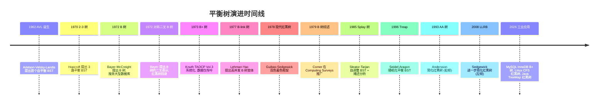

## 1. 概述与学习目标

**平衡树**（Balanced Tree）是通过对二叉搜索树（或更广义的搜索树）施加平衡条件，确保最坏情况下操作复杂度为 $O(\log n)$ 的数据结构家族。从 Adelson-Velsky-Landis 1962 提出 AVL 树起，平衡树经历了五十余年的演进，形成了覆盖内存索引（AVL、红黑树）、磁盘索引（B 树、B+ 树）、自适应访问（Splay 树）、随机化（Treap）等多个分支的庞大家族。

平衡树是现代计算机科学的基石之一。从操作系统调度器（Linux CFS 用红黑树管理进程）、数据库索引（MySQL InnoDB 用 B+ 树）、编程语言标准库（Java TreeMap、C++ std::map 用红黑树），到搜索引擎、文件系统、网络路由，平衡树无处不在。CLRS 第 12-13 章与第 18 章分别详述 BST、红黑树与 B 树，Knuth TAOCP Vol.3 §6.2 系统化搜索树理论。

本文档遵循 FANDEX 内容工程规范 12 项基准，对标 MIT 6.006 / Stanford CS161 / CMU 15-211 / Berkeley CS 61B 课程教材深度，系统化呈现：

1. **二叉搜索树**：基础结构与退化问题
2. **AVL 树**：严格平衡，查找性能最优
3. **红黑树**：近似平衡，修改性能最优，工业首选
4. **B 树 / B+ 树**：多路平衡，磁盘 I/O 友好，数据库标准
5. **Splay 树**：自调整，摊还 $O(\log n)$，无需平衡信息
6. **Treap**：随机化平衡，期望 $O(\log n)$
7. **AA 树 / LLRB**：红黑树的简化变体

### 1.1 文档结构

| 章节 | 内容 | Bloom 层级 |
| ---- | ---- | --------- |
| 历史 | AVL 1962 / 红黑 1972/1978 / B 树 1972 / Splay 1985 / Treap 1996 / AA 1993 / LLRB 2008 | 记忆、理解 |
| 形式化定义 | BST、AVL、红黑、B 树、Splay 的不变式 | 记忆、分析 |
| 理论推导 | 旋转不变式、高度上界证明、摊还分析 | 分析、评价 |
| 代码示例 | Python / C++ / Java 多语言实现 | 应用 |
| 对比分析 | 七种树多维度对比 | 分析、评价 |
| 常见陷阱 | 颜色翻转错误、平衡因子更新遗漏等 | 分析 |
| 工程实践 | MySQL / Linux CFS / Java TreeMap 案例 | 应用、综合 |
| 案例研究 | 真实开源项目片段 | 综合 |
| 习题 | 8+ 题覆盖四类题型 | 全部 |

---

## 2. 历史动机

### 2.1 二叉搜索树的退化问题

二叉搜索树的概念在 1950 年代末至 1960 年代初由多位研究者独立提出：Windley 1960、Booth-Laver 1960、Hibbard 1962《Some Combinatorial Properties of Certain Trees with Applications to Searching and Sorting》JACM 9(1):13-28。BST 的核心优势是动态维护有序集合，支持 $O(\log n)$ 平均复杂度的查找、插入、删除。但 BST 的性能高度依赖树的形状：

| 树形态 | 树高 | 查找复杂度 |
| ------ | ---- | --------- |
| 完全平衡 | $\lfloor \log_2 n \rfloor$ | $O(\log n)$ |
| 退化（链表） | $n$ | $O(n)$ |

当向 BST 顺序插入 $1, 2, 3, \ldots, n$ 时，每个新元素都进入右子树的最深处，最终退化为长度 $n$ 的链表。这一退化问题在 1960 年代初即被识别，但需要一种**自动维护平衡**的机制。

### 2.2 AVL 树的诞生（1962）

1962 年，苏联莫斯科国立大学的两位年轻数学家 **Georgy M. Adelson-Velsky**（Гео́ргий Ма́ркович Адельсо́н-Ве́льский，时年 40 岁）与 **Evgenii M. Landis**（Евге́ний Миха́йлович Ла́ндис，时年 41 岁）在苏联科学院院报（Doklady Akademii Nauk SSSR 146:263-266）发表论文《An algorithm for the organization of information》（Организации информации）。论文提出：

> 在 BST 的每个节点存储**平衡因子**（balance factor），定义为左右子树高度差。若平衡因子绝对值超过 1，通过**旋转**操作恢复平衡。

这是历史上第一个自平衡二叉搜索树。论文英译版同年发表于 Soviet Mathematics - Doklady 3:1259-1263。**AVL** 取自两位作者姓氏首字母。

Landis 后来回忆：他们的研究动机来自当时苏联的算法竞赛与信息检索需求，希望能设计一种自动保持平衡的搜索树，避免 BST 退化为链表。这一创新奠定了后续所有平衡树的设计范式——**通过维护某个不变式（invariant）来保证树高 $\leq c \log n$**。

### 2.3 B 树的诞生（1972）

1960 年代末至 1970 年代初，大型数据库开始兴起，磁盘成为主要存储介质。但磁盘与内存有根本性差异：

- **访问延迟**：磁盘约 5-10 ms，内存约 100 ns（差距 50000-100000 倍）
- **访问粒度**：磁盘按"块"（block，4KB-64KB）读写，内存按字节
- **随机访问成本**：磁盘随机访问需寻道+旋转延迟，顺序访问快得多

1970 年，Rudolf Bayer 在 **Boeing Scientific Research Laboratories**（波音科学研究实验室，位于西雅图）开始研究磁盘友好的索引结构。他与同事 Edward M. McCreight 在 1970 年 7 月首次流传出《Organization and Maintenance of Large Ordered Indices》初稿，最终发表于 1972 年 Acta Informatica 1(3):173-189, DOI: 10.1007/BF00288683。

B 树的核心创新：

1. **多路分支**：每个节点可包含 $m-1$ 个关键字，$m$ 个子节点
2. **节点大小匹配磁盘块**：一个节点恰好占用一个磁盘块
3. **高扇出低树高**：百万级数据仅需 3-4 层，磁盘 I/O 次数极少
4. **叶子同层**：所有叶子节点位于同一深度，保证查询路径长度一致

Bayer 从未公开解释 "B" 的含义，他在不同场合说过代表 Boeing、Bayer、Broad、Balanced。Comer 1979《The Ubiquitous B-Tree》Computing Surveys 11(2):121-137 综述了 B 树在数据库与文件系统的广泛应用，使其成为数据库索引的事实标准。

### 2.4 红黑树的演进（1972-1978）

红黑树的历史分为两阶段：

**阶段一：Bayer 1972 对称二叉 B 树**

Rudolf Bayer 在 B 树论文同期（1972《Symmetric binary B-trees: Data structure and maintenance algorithms》Acta Informatica 1(4):290-306, DOI: 10.1007/BF00289509）提出"对称二叉 B 树"——将多路 B 树的二叉表示。Bayer 引入"水平/垂直链接"区分不同节点关系。

**阶段二：Guibas-Sedgewick 1978 现代红黑树**

1978 年，斯坦福大学的 Leonidas J. Guibas 与 Robert Sedgewick 在 FOCS 19th Annual Symposium 发表《A Dichromatic Framework for Balanced Trees》pp.8-21, DOI: 10.1109/SFCS.1978.3。他们将 Bayer 的对称二叉 B 树、二叉 B 树等多种变体统一为**双色着色框架**：

- 每个节点被着色为红色或黑色
- 红色节点不能连续出现（红红约束）
- 任意节点到叶子节点的路径上黑色节点数量相同（黑高相同）

Sedgewick 在 2008 LLRB 论文中回忆：选择红色是因为 Xerox PARC（施乐帕罗奥图研究中心）的激光打印机输出的红色最显眼，效果好于蓝色和绿色。

### 2.5 Splay 树的诞生（1985）

1985 年，CMU 的 Daniel D. Sleator 与 Robert E. Tarjan 在 JACM 32(3):652-686 发表《Self-Adjusting Binary Search Trees》DOI: 10.1145/3828.3835。这篇论文引入：

1. **Splay 操作**：通过一系列旋转将访问节点移至根
2. **无需平衡信息**：不存储颜色、高度、平衡因子
3. **摊还分析**：$m$ 次操作总代价 $O(m \log n)$，单次摊还 $O(\log n)$
4. **静态最优**：对任意访问序列，Splay 树总代价不超过静态最优树的常数倍

Sleator-Tarjan 的贡献不仅在于数据结构本身，更在于**摊还分析**（amortized analysis）方法论的成熟——势能方法（potential method）成为分析自调整数据结构的标准工具。论文获 1986 JACM 年度最佳论文奖，Tarjan 凭此及并查集等贡献获 1986 Turing Award。

### 2.6 后续演进

| 年份 | 数据结构 | 提出者 | 论文 | 主要创新 |
| ---- | -------- | ------ | ---- | -------- |
| 1962 | AVL 树 | Adelson-Velsky, Landis | Dokl. Akad. Nauk SSSR 146:263-266 | 首个自平衡 BST |
| 1970 | 2-3 树 | Hopcroft | 未正式发表 | 三路平衡 BST |
| 1972 | B 树 | Bayer, McCreight | Acta Informatica 1(3):173-189 | 多路磁盘索引 |
| 1972 | 对称二叉 B 树 | Bayer | Acta Informatica 1(4):290-306 | B 树的二叉表示（红黑树前身） |
| 1973 | B+ 树 | Knuth | TAOCP Vol.3 §6.2.4 | 数据仅存叶，链表连接 |
| 1977 | B-link 树 | Lehman, Yao | TODS 6(4):650-670 | 高并发 B 树变体 |
| 1978 | 红黑树 | Guibas, Sedgewick | FOCS pp.8-21 | 双色着色框架 |
| 1979 | 综述 | Comer | Computing Surveys 11(2):121-137 | B 树工业化推广 |
| 1985 | Splay 树 | Sleator, Tarjan | JACM 32(3):652-686 | 自调整，摊还分析 |
| 1989 | Treap | Seidel, Aragon | Algorithmica 16(4-5):464-497 (1996) | 随机化平衡 |
| 1993 | AA 树 | Andersson | WADS 93, LNCS 709:60-71 | 红黑树简化（右倾） |
| 2008 | LLRB | Sedgewick | Princeton tech report | 红黑树简化（左倾） |



---

## 3. 形式化定义

### 3.1 二叉搜索树（BST）

**定义 3.1**（二叉搜索树）：

二叉搜索树是满足以下性质的二叉树：

1. 对任意节点 $v$，左子树 $L(v)$ 中所有节点关键字均**小于** $v$ 的关键字
2. 对任意节点 $v$，右子树 $R(v)$ 中所有节点关键字均**大于** $v$ 的关键字
3. 左右子树也分别是 BST

形式化地，若 $\text{key}(v)$ 表示节点 $v$ 的关键字，则：

$$
\forall v: \quad \forall u \in L(v): \text{key}(u) < \text{key}(v), \quad \forall w \in R(v): \text{key}(w) > \text{key}(v)
$$

**不变式 INV-BST**（中序遍历有序性）：

对任意 BST，中序遍历（左 → 根 → 右）按关键字严格递增输出节点序列。

### 3.2 AVL 树

**定义 3.2**（AVL 树）：

AVL 树是满足以下性质的 BST：

对任意节点 $v$，其**平衡因子**（balance factor）

$$
\text{BF}(v) = \text{height}(L(v)) - \text{height}(R(v))
$$

满足

$$
\text{BF}(v) \in \{-1, 0, 1\}
$$

其中 $\text{height}(\emptyset) = 0$，$\text{height}(v) = 1 + \max(\text{height}(L(v)), \text{height}(R(v)))$。

### 3.3 红黑树

**定义 3.3**（红黑树，Guibas-Sedgewick 1978）：

红黑树是满足以下五条性质的 BST：

1. **每个节点着色为红色或黑色**
2. **根节点为黑色**
3. **每个叶子节点（NIL 哨兵）为黑色**
4. **红色节点的两个子节点均为黑色**（红红约束：不能有连续两个红色节点）
5. **从任意节点到其每个叶子节点的所有路径包含相同数量的黑色节点**（黑高相同）

**定义 3.4**（黑高，black-height）：

节点 $v$ 的黑高 $\text{bh}(v)$ 定义为从 $v$ 到叶子节点路径上（不含 $v$ 自身）的黑色节点数：

$$
\text{bh}(v) = |\{u \in \text{path}(v, \text{leaf}) : \text{color}(u) = \text{black}\}|
$$

红黑树不变式 INV-RB 可简化为：

$$
\forall v: \text{bh}(\text{root}) = \text{bh}(v) \text{ on all root-to-leaf paths}
$$

### 3.4 B 树

**定义 3.5**（$m$ 阶 B 树，Bayer-McCreight 1972）：

$m$ 阶 B 树是满足以下性质的 $m$ 路搜索树：

1. 每个节点最多有 $m$ 个子节点，最多 $m-1$ 个关键字
2. 每个非根非叶节点至少有 $\lceil m/2 \rceil$ 个子节点（即至少 $\lceil m/2 \rceil - 1$ 个关键字）
3. 根节点至少有 2 个子节点（若非叶）
4. 所有叶子节点位于**同一层**
5. 节点内关键字**有序排列**，关键字 $k_i$ 的左子树所有元素 $< k_i$，右子树所有元素 $\geq k_i$

**节点结构**：

```
[key_1] [key_2] ... [key_{t-1}]
 /       \      ...     \
child_1  child_2 ...    child_t
```

### 3.5 B+ 树

**定义 3.6**（B+ 树）：

B+ 树是 B 树的变体，特征：

1. **所有数据记录仅存储在叶子节点**
2. **内部节点仅存储索引关键字**（关键字在叶子中重复出现）
3. **叶子节点通过链表连接**（双向链表，支持顺序遍历）
4. 其他性质同 B 树

### 3.6 Splay 树

**定义 3.7**（Splay 树）：

Splay 树是普通 BST，无任何显式平衡信息。核心操作是 **splay(x)**：将节点 $x$ 通过一系列旋转提升至根。

splay 操作包含三种情况（设 $p$ 为 $x$ 的父节点，$g$ 为 $p$ 的父节点）：

1. **Zig**：$p$ 是根节点。单旋 $x$ 与 $p$。
2. **Zig-Zig**：$x$ 与 $p$ 同为左孩子（或同为右孩子）。先旋 $p$ 与 $g$，再旋 $x$ 与 $p$。
3. **Zig-Zag**：$x$ 是 $p$ 的左孩子而 $p$ 是 $g$ 的右孩子（或对偶情况）。先旋 $x$ 与 $p$，再旋 $x$ 与 $g$。

### 3.7 Treap

**定义 3.8**（Treap，Seidel-Aragon 1996）：

Treap 是同时满足 BST 性质与堆性质的二叉树：

1. **BST 性质**：按关键字 $k$ 排序
2. **堆性质**：按优先级 $p$ 堆序（最大堆：父节点优先级大于子节点）

优先级 $p$ 在插入时**随机生成**（均匀分布于 $(0, 1)$），使期望树高为 $O(\log n)$。

---

## 4. 理论推导

### 4.1 BST 操作复杂度

**定理 4.1**（BST 期望复杂度）：

对 $n$ 个不同关键字随机插入形成的 BST（所有 $n!$ 种插入顺序等概率），期望树高为 $O(\log n)$，期望查找/插入/删除复杂度为 $O(\log n)$。

**证明**（Knuth 1973 TAOCP Vol.3 §6.2.2）：

设 $h(n)$ 为 $n$ 节点随机 BST 的期望高度。可证 $h(n) \approx 4.31107 \ln n$（精确常数为自然对数下约 4.31107，对应 $\log_2$ 下约 $2.99 \log_2 n$）。

但**最坏情况**：若按关键字有序插入，BST 退化为链表，高度 $n$，操作复杂度 $O(n)$。

$\square$

### 4.2 AVL 树高度上界

**定理 4.2**（AVL 高度上界，Adelson-Velsky-Landis 1962）：

含 $n$ 个节点的 AVL 树高度 $h$ 满足：

$$
h \leq 1.4405 \log_2(n + 2) - 0.3277 \approx 1.44 \log_2 n
$$

**证明思路**：

设 $N_h$ 为高度 $h$ 的最小 AVL 树的节点数。则：

- $N_0 = 1$（仅根）
- $N_1 = 2$
- $N_h = N_{h-1} + N_{h-2} + 1$（一棵子树高 $h-1$，另一棵高 $h-2$）

此递推与 Fibonacci 数列类似。可证 $N_h \geq F_{h+2} - 1$，其中 $F_k$ 为 Fibonacci 数。由 Fibonacci 渐近公式 $F_k \approx \varphi^k / \sqrt{5}$（$\varphi = (1+\sqrt{5})/2 \approx 1.618$）：

$$
n + 1 \geq N_h + 1 \geq F_{h+2} \approx \frac{\varphi^{h+2}}{\sqrt{5}}
$$

故 $h \leq \log_\varphi(\sqrt{5}(n+1)) - 2 = \log_\varphi(n+1) + O(1) \approx 1.4405 \log_2(n+1) - 0.3277$

$\square$

### 4.3 红黑树高度上界

**定理 4.3**（红黑树高度上界，Guibas-Sedgewick 1978）：

含 $n$ 个内部节点的红黑树高度 $h$ 满足：

$$
h \leq 2 \log_2(n + 1)
$$

**证明**：

**引理 4.1**：以节点 $v$ 为根的子树至少包含 $2^{\text{bh}(v)} - 1$ 个内部节点。

证明（归纳法）：
- 基础：$v$ 为叶子 NIL 时，$\text{bh}(v) = 0$，子树包含 $2^0 - 1 = 0$ 个内部节点。
- 归纳：$v$ 非叶，设子节点为 $v_1, v_2$。若 $v$ 为红，则 $\text{bh}(v_1) = \text{bh}(v_2) = \text{bh}(v) - 1$；若 $v$ 为黑，则 $\text{bh}(v_1) = \text{bh}(v_2) = \text{bh}(v) - 1$（仍相同）。由归纳，$v_i$ 子树至少 $2^{\text{bh}(v_i)} - 1 = 2^{\text{bh}(v)-1} - 1$ 个内部节点。$v$ 自身再加 1，总 $2 \cdot (2^{\text{bh}(v)-1} - 1) + 1 = 2^{\text{bh}(v)} - 1$。

**应用引理**：对根节点 $r$，$n \geq 2^{\text{bh}(r)} - 1$，即 $\text{bh}(r) \leq \log_2(n+1)$。

红黑树路径上红色节点不能连续（性质 4），故每条路径上红色节点数 $\leq$ 黑色节点数。即 $h \leq 2 \text{bh}(r) \leq 2 \log_2(n+1)$。

$\square$

### 4.4 B 树高度上界

**定理 4.4**（$m$ 阶 B 树高度上界，Bayer-McCreight 1972）：

含 $n$ 个关键字的 $m$ 阶 B 树高度 $h$ 满足：

$$
h \leq \log_{\lceil m/2 \rceil} \frac{n+1}{2}
$$

**证明**：

$m$ 阶 B 树的根节点至少 2 个子节点（除非整树仅根）。其余非叶节点至少 $\lceil m/2 \rceil$ 个子节点。故第 $k$ 层节点数：

- $k = 0$（根）：$\geq 1$
- $k = 1$：$\geq 2$
- $k = 2$：$\geq 2 \lceil m/2 \rceil$
- $k = i$（$i \geq 1$）：$\geq 2 \lceil m/2 \rceil^{i-1}$

第 $h$ 层（叶子层）至少 $2 \lceil m/2 \rceil^{h-1}$ 个叶子节点。每个叶子至少 1 个关键字，故 $n \geq 2 \lceil m/2 \rceil^{h-1} - 1$。解得 $h \leq 1 + \log_{\lceil m/2 \rceil} \frac{n+1}{2} = \log_{\lceil m/2 \rceil} \frac{n+1}{2} + 1$，等价于 $\log_{\lceil m/2 \rceil}(n+1)$。

$\square$

**数值示例**：$m = 200$, $n = 16 \times 10^9$（160 亿条记录），则 $h \leq \log_{100} 16 \times 10^9 \approx 4.95$，即仅需 5 次磁盘 I/O。

### 4.5 Splay 树摊还分析

**定理 4.5**（Sleator-Tarjan 1985）：

在 $n$ 节点 Splay 树上执行 $m$ 次操作的**总摊还代价**为 $O((m+n) \log n)$，单次摊还 $O(\log n)$。

**证明思路**（势能方法）：

定义势能函数 $\Phi(T) = \sum_{v \in T} \log_2 |T_v|$，其中 $|T_v|$ 为以 $v$ 为根的子树大小，$\log_2 |T_v|$ 称为节点 $v$ 的**秩**（rank）。

可证 splay 操作的摊还代价 $O(\log n)$，其中关键引理是：

**访问引理**（Access Lemma）：splay 节点 $x$ 的摊还代价不超过 $3(\text{rank}(\text{root}) - \text{rank}(x)) + 1 = O(\log n)$。

$\square$

### 4.6 旋转操作的不变式

**定理 4.6**（旋转保持 BST 性质）：

左旋（或右旋）操作不改变 BST 的中序遍历序列。

**证明**（以左旋为例）：

设旋转前节点 $x$ 为父，$y$ 为 $x$ 的右子节点。$y$ 的左子树为 $\beta$，$x$ 的左子树为 $\alpha$。

旋转前中序：$\alpha, x, \beta, y, \gamma$
旋转后中序：$\alpha, x, \beta, y, \gamma$（不变）

旋转操作仅改变 $\alpha, \beta, \gamma$ 三棵子树与 $x, y$ 的父子关系，不改变它们的中序相对位置。

$\square$

---

## 5. 代码示例

### 5.1 BST 基础实现（Python）

```python
# Python: 二叉搜索树基础实现
class BSTNode:
    """BST 节点"""
    def __init__(self, key):
        self.key = key
        self.left = None
        self.right = None


class BST:
    """二叉搜索树
    平均 O(log n), 最坏 O(n)（退化为链表）
    """
    
    def __init__(self):
        self.root = None
    
    def search(self, key):
        """查找键为 key 的节点"""
        node = self.root
        while node and node.key != key:
            if key < node.key:
                node = node.left
            else:
                node = node.right
        return node
    
    def insert(self, key):
        """插入键 key"""
        if not self.root:
            self.root = BSTNode(key)
            return
        node = self.root
        while True:
            if key < node.key:
                if not node.left:
                    node.left = BSTNode(key)
                    return
                node = node.left
            elif key > node.key:
                if not node.right:
                    node.right = BSTNode(key)
                    return
                node = node.right
            else:
                return  # 重复键, 不插入
    
    def delete(self, key):
        """删除键 key"""
        self.root = self._delete(self.root, key)
    
    def _delete(self, node, key):
        if not node:
            return None
        if key < node.key:
            node.left = self._delete(node.left, key)
        elif key > node.key:
            node.right = self._delete(node.right, key)
        else:
            # 找到目标节点
            if not node.left:
                return node.right
            if not node.right:
                return node.left
            # 两个子节点: 用后继替换
            succ = self._find_min(node.right)
            node.key = succ.key
            node.right = self._delete(node.right, succ.key)
        return node
    
    def _find_min(self, node):
        while node.left:
            node = node.left
        return node
    
    def inorder(self):
        """中序遍历(产生有序序列)"""
        result = []
        self._inorder(self.root, result)
        return result
    
    def _inorder(self, node, result):
        if node:
            self._inorder(node.left, result)
            result.append(node.key)
            self._inorder(node.right, result)


# 测试
bst = BST()
for k in [50, 30, 70, 20, 40, 60, 80]:
    bst.insert(k)
print(bst.inorder())  # 输出: [20, 30, 40, 50, 60, 70, 80]
bst.delete(30)
print(bst.inorder())  # 输出: [20, 40, 50, 60, 70, 80]
```

### 5.2 AVL 树完整实现（Python）

```python
# Python: AVL 树完整实现
class AVLNode:
    """AVL 节点, 含高度信息"""
    def __init__(self, key):
        self.key = key
        self.left = None
        self.right = None
        self.height = 1  # 叶子节点高度为 1


class AVLTree:
    """AVL 树: 自平衡 BST
    保证 h <= 1.44 log_2 n, 所有操作 O(log n)
    """
    
    def __init__(self):
        self.root = None
    
    def height(self, node):
        """获取节点高度（空节点高度为 0）"""
        return node.height if node else 0
    
    def balance_factor(self, node):
        """计算平衡因子 = 左子树高 - 右子树高"""
        if not node:
            return 0
        return self.height(node.left) - self.height(node.right)
    
    def update_height(self, node):
        """更新节点高度"""
        node.height = 1 + max(self.height(node.left), self.height(node.right))
    
    def rotate_left(self, x):
        """左旋
            x              y
             \            / 
              y    →     x
             /            \
            T2            T2
        """
        y = x.right
        T2 = y.left
        y.left = x
        x.right = T2
        self.update_height(x)
        self.update_height(y)
        return y  # 返回新的子树根
    
    def rotate_right(self, y):
        """右旋
              y          x
             /            \
            x      →       y
             \            /
              T2         T2
        """
        x = y.left
        T2 = x.right
        x.right = y
        y.left = T2
        self.update_height(y)
        self.update_height(x)
        return x
    
    def balance(self, node):
        """根据平衡因子执行再平衡"""
        self.update_height(node)
        bf = self.balance_factor(node)
        
        # LL 型: 左子树的左子树过深, 右旋
        if bf > 1 and self.balance_factor(node.left) >= 0:
            return self.rotate_right(node)
        # LR 型: 左子树的右子树过深, 先左旋左子树, 再右旋
        if bf > 1 and self.balance_factor(node.left) < 0:
            node.left = self.rotate_left(node.left)
            return self.rotate_right(node)
        # RR 型: 右子树的右子树过深, 左旋
        if bf < -1 and self.balance_factor(node.right) <= 0:
            return self.rotate_left(node)
        # RL 型: 右子树的左子树过深, 先右旋右子树, 再左旋
        if bf < -1 and self.balance_factor(node.right) > 0:
            node.right = self.rotate_right(node.right)
            return self.rotate_left(node)
        return node
    
    def insert(self, key):
        """插入键 key"""
        self.root = self._insert(self.root, key)
    
    def _insert(self, node, key):
        if not node:
            return AVLNode(key)
        if key < node.key:
            node.left = self._insert(node.left, key)
        elif key > node.key:
            node.right = self._insert(node.right, key)
        else:
            return node  # 不允许重复
        return self.balance(node)
    
    def delete(self, key):
        """删除键 key"""
        self.root = self._delete(self.root, key)
    
    def _delete(self, node, key):
        if not node:
            return None
        if key < node.key:
            node.left = self._delete(node.left, key)
        elif key > node.key:
            node.right = self._delete(node.right, key)
        else:
            if not node.left:
                return node.right
            if not node.right:
                return node.left
            succ = self._find_min(node.right)
            node.key = succ.key
            node.right = self._delete(node.right, succ.key)
        return self.balance(node)
    
    def _find_min(self, node):
        while node.left:
            node = node.left
        return node
    
    def search(self, key):
        node = self.root
        while node and node.key != key:
            if key < node.key:
                node = node.left
            else:
                node = node.right
        return node is not None


# 测试
avl = AVLTree()
for k in [10, 20, 30, 40, 50, 25]:  # 顺序插入, BST 会退化
    avl.insert(k)
print(avl.root.key)           # 输出: 30 (经过旋转, 树根为 30)
print(avl.search(40))         # 输出: True
```

### 5.3 红黑树实现（C++ 简化版）

```cpp
// C++: 红黑树简化实现
#include <iostream>
#include <memory>
using namespace std;

enum class Color { RED, BLACK };

template <typename K, typename V>
struct RBNode {
    K key;
    V value;
    Color color;
    shared_ptr<RBNode<K,V>> left, right, parent;
    
    RBNode(K k, V v) : key(k), value(v), color(Color::RED),
                       left(nullptr), right(nullptr), parent(nullptr) {}
};

template <typename K, typename V>
class RBTree {
    using NodePtr = shared_ptr<RBNode<K,V>>;
    NodePtr root;
    NodePtr NIL;  // 哨兵节点
    
public:
    RBTree() {
        NIL = make_shared<RBNode<K,V>>(K{}, V{});
        NIL->color = Color::BLACK;
        root = NIL;
    }
    
    // 左旋
    void rotateLeft(NodePtr x) {
        NodePtr y = x->right;
        x->right = y->left;
        if (y->left != NIL) y->left->parent = x;
        y->parent = x->parent;
        if (!x->parent) root = y;
        else if (x == x->parent->left) x->parent->left = y;
        else x->parent->right = y;
        y->left = x;
        x->parent = y;
    }
    
    // 右旋
    void rotateRight(NodePtr y) {
        NodePtr x = y->left;
        y->left = x->right;
        if (x->right != NIL) x->right->parent = y;
        x->parent = y->parent;
        if (!y->parent) root = x;
        else if (y == y->parent->right) y->parent->right = x;
        else y->parent->left = x;
        x->right = y;
        y->parent = x;
    }
    
    // 插入
    void insert(K key, V value) {
        NodePtr z = make_shared<RBNode<K,V>>(key, value);
        z->left = z->right = NIL;
        
        NodePtr y = nullptr;
        NodePtr x = root;
        while (x != NIL) {
            y = x;
            if (z->key < x->key) x = x->left;
            else x = x->right;
        }
        z->parent = y;
        if (!y) root = z;
        else if (z->key < y->key) y->left = z;
        else y->right = z;
        
        insertFixup(z);
    }
    
private:
    // 插入修复
    void insertFixup(NodePtr z) {
        while (z->parent && z->parent->color == Color::RED) {
            if (z->parent == z->parent->parent->left) {
                NodePtr y = z->parent->parent->right;  // 叔叔
                if (y->color == Color::RED) {
                    // Case 1: 叔叔红 -> 变色
                    z->parent->color = Color::BLACK;
                    y->color = Color::BLACK;
                    z->parent->parent->color = Color::RED;
                    z = z->parent->parent;
                } else {
                    if (z == z->parent->right) {
                        // Case 2: 叔叔黑, z 是右孩子 -> 左旋
                        z = z->parent;
                        rotateLeft(z);
                    }
                    // Case 3: 叔叔黑, z 是左孩子 -> 变色 + 右旋
                    z->parent->color = Color::BLACK;
                    z->parent->parent->color = Color::RED;
                    rotateRight(z->parent->parent);
                }
            } else {
                // 对称情况
                NodePtr y = z->parent->parent->left;
                if (y->color == Color::RED) {
                    z->parent->color = Color::BLACK;
                    y->color = Color::BLACK;
                    z->parent->parent->color = Color::RED;
                    z = z->parent->parent;
                } else {
                    if (z == z->parent->left) {
                        z = z->parent;
                        rotateRight(z);
                    }
                    z->parent->color = Color::BLACK;
                    z->parent->parent->color = Color::RED;
                    rotateLeft(z->parent->parent);
                }
            }
        }
        root->color = Color::BLACK;
    }
};
```

### 5.4 B 树查找（Java）

```java
// Java: B 树查找与插入
import java.util.ArrayList;
import java.util.List;

public class BTree {
    private static class Node {
        List<Integer> keys = new ArrayList<>();
        List<Node> children = new ArrayList<>();
        boolean isLeaf = false;
    }
    
    private Node root;
    private int t;  // 最小度数(minimum degree), 即 ⌈m/2⌉
    
    public BTree(int t) {
        this.t = t;
        root = new Node();
        root.isLeaf = true;
    }
    
    /** 查找键 key */
    public boolean search(int key) {
        return searchInternal(root, key);
    }
    
    private boolean searchInternal(Node node, int key) {
        int i = 0;
        // 在当前节点中找第一个 >= key 的位置
        while (i < node.keys.size() && key > node.keys.get(i)) {
            i++;
        }
        // 找到
        if (i < node.keys.size() && key == node.keys.get(i)) {
            return true;
        }
        // 叶子节点, 未找到
        if (node.isLeaf) {
            return false;
        }
        // 递归搜索子节点
        return searchInternal(node.children.get(i), key);
    }
    
    /** 插入键 key */
    public void insert(int key) {
        Node r = root;
        // 根节点已满, 需要分裂
        if (r.keys.size() == 2 * t - 1) {
            Node s = new Node();
            root = s;
            s.children.add(r);
            splitChild(s, 0);
            insertNonFull(s, key);
        } else {
            insertNonFull(r, key);
        }
    }
    
    private void insertNonFull(Node node, int key) {
        int i = node.keys.size() - 1;
        if (node.isLeaf) {
            // 叶子节点: 直接插入
            node.keys.add(0);
            while (i >= 0 && key < node.keys.get(i)) {
                node.keys.set(i + 1, node.keys.get(i));
                i--;
            }
            node.keys.set(i + 1, key);
        } else {
            // 内部节点: 找到合适的子节点
            while (i >= 0 && key < node.keys.get(i)) {
                i--;
            }
            i++;
            // 子节点已满, 先分裂
            if (node.children.get(i).keys.size() == 2 * t - 1) {
                splitChild(node, i);
                if (key > node.keys.get(i)) {
                    i++;
                }
            }
            insertNonFull(node.children.get(i), key);
        }
    }
    
    /** 分裂 node 的第 i 个子节点 */
    private void splitChild(Node parent, int i) {
        Node full = parent.children.get(i);
        Node newNode = new Node();
        newNode.isLeaf = full.isLeaf;
        
        // 中间关键字提升到父节点
        int midKey = full.keys.get(t - 1);
        
        // 后 t-1 个关键字移到新节点
        for (int j = 0; j < t - 1; j++) {
            newNode.keys.add(full.keys.remove(t));
        }
        
        // 如果不是叶子, 后 t 个子节点也移到新节点
        if (!full.isLeaf) {
            for (int j = 0; j < t; j++) {
                newNode.children.add(full.children.remove(t));
            }
        }
        
        // 删除中间关键字
        full.keys.remove(t - 1);
        
        // 在父节点中插入中间关键字与新子节点
        parent.keys.add(i, midKey);
        parent.children.add(i + 1, newNode);
    }
    
    public static void main(String[] args) {
        BTree bt = new BTree(3);  // 6 阶 B 树
        int[] keys = {10, 20, 5, 6, 12, 30, 7, 17};
        for (int k : keys) {
            bt.insert(k);
        }
        System.out.println(bt.search(17));  // 输出: true
        System.out.println(bt.search(15));  // 输出: false
    }
}
```

### 5.5 Splay 树核心操作（Python）

```python
# Python: Splay 树核心实现
class SplayNode:
    def __init__(self, key):
        self.key = key
        self.left = None
        self.right = None
        self.parent = None


class SplayTree:
    """Splay 树
    无显式平衡信息, 通过 splay 操作将访问节点移至根
    单次最坏 O(n), 摊还 O(log n)
    """
    
    def __init__(self):
        self.root = None
    
    def rotate_left(self, x):
        """左旋"""
        y = x.right
        x.right = y.left
        if y.left:
            y.left.parent = x
        y.parent = x.parent
        if not x.parent:
            self.root = y
        elif x == x.parent.left:
            x.parent.left = y
        else:
            x.parent.right = y
        y.left = x
        x.parent = y
    
    def rotate_right(self, x):
        """右旋"""
        y = x.left
        x.left = y.right
        if y.right:
            y.right.parent = x
        y.parent = x.parent
        if not x.parent:
            self.root = y
        elif x == x.parent.right:
            x.parent.right = y
        else:
            x.parent.left = y
        y.right = x
        x.parent = y
    
    def splay(self, x):
        """将节点 x 旋转至根"""
        while x.parent:
            if not x.parent.parent:
                # Zig: 父节点是根
                if x == x.parent.left:
                    self.rotate_right(x.parent)
                else:
                    self.rotate_left(x.parent)
            elif x == x.parent.left and x.parent == x.parent.parent.left:
                # Zig-Zig: x 与父同为左孩子
                self.rotate_right(x.parent.parent)
                self.rotate_right(x.parent)
            elif x == x.parent.right and x.parent == x.parent.parent.right:
                # Zig-Zig: x 与父同为右孩子
                self.rotate_left(x.parent.parent)
                self.rotate_left(x.parent)
            elif x == x.parent.right and x.parent == x.parent.parent.left:
                # Zig-Zag: x 是右孩子, 父是左孩子
                self.rotate_left(x.parent)
                self.rotate_right(x.parent)
            else:
                # Zig-Zag: x 是左孩子, 父是右孩子
                self.rotate_right(x.parent)
                self.rotate_left(x.parent)
    
    def search(self, key):
        """查找 key, 找到则 splay 到根"""
        node = self.root
        last = None
        while node and node.key != key:
            last = node
            if key < node.key:
                node = node.left
            else:
                node = node.right
        if node:
            self.splay(node)
            return True
        elif last:
            self.splay(last)  # 未找到, 仍 splay 最后访问节点
        return False
    
    def insert(self, key):
        """插入 key"""
        if not self.root:
            self.root = SplayNode(key)
            return
        node = self.root
        while True:
            if key < node.key:
                if not node.left:
                    node.left = SplayNode(key)
                    node.left.parent = node
                    self.splay(node.left)
                    return
                node = node.left
            elif key > node.key:
                if not node.right:
                    node.right = SplayNode(key)
                    node.right.parent = node
                    self.splay(node.right)
                    return
                node = node.right
            else:
                self.splay(node)  # 已存在, splay 到根
                return
```

### 5.6 Treap 实现（Python）

```python
# Python: Treap 树堆实现
import random


class TreapNode:
    def __init__(self, key):
        self.key = key
        self.priority = random.random()  # 随机优先级
        self.left = None
        self.right = None


class Treap:
    """Treap: BST + Heap
    按 key 满足 BST 性质, 按 priority 满足最大堆性质
    期望高度 O(log n), 单次操作期望 O(log n)
    """
    
    def __init__(self):
        self.root = None
    
    def rotate_right(self, y):
        """右旋"""
        x = y.left
        T2 = x.right
        x.right = y
        y.left = T2
        return x  # 返回新根
    
    def rotate_left(self, x):
        """左旋"""
        y = x.right
        T2 = y.left
        y.left = x
        x.right = T2
        return y
    
    def insert(self, key):
        """插入 key"""
        self.root = self._insert(self.root, key)
    
    def _insert(self, node, key):
        if not node:
            return TreapNode(key)
        if key < node.key:
            node.left = self._insert(node.left, key)
            # 堆性质: 子节点优先级大于父节点, 旋转修复
            if node.left.priority > node.priority:
                node = self.rotate_right(node)
        elif key > node.key:
            node.right = self._insert(node.right, key)
            if node.right.priority > node.priority:
                node = self.rotate_left(node)
        # 重复键不插入
        return node
    
    def delete(self, key):
        """删除 key"""
        self.root = self._delete(self.root, key)
    
    def _delete(self, node, key):
        if not node:
            return None
        if key < node.key:
            node.left = self._delete(node.left, key)
        elif key > node.key:
            node.right = self._delete(node.right, key)
        else:
            # 找到目标, 将其旋转到叶子
            if not node.left:
                return node.right
            if not node.right:
                return node.left
            # 两个子节点: 将优先级较大的子节点旋转上来
            if node.left.priority > node.right.priority:
                node = self.rotate_right(node)
                node.right = self._delete(node.right, key)
            else:
                node = self.rotate_left(node)
                node.left = self._delete(node.left, key)
        return node
    
    def inorder(self):
        result = []
        self._inorder(self.root, result)
        return result
    
    def _inorder(self, node, result):
        if node:
            self._inorder(node.left, result)
            result.append((node.key, round(node.priority, 3)))
            self._inorder(node.right, result)


# 测试
treap = Treap()
for k in [50, 30, 70, 20, 40, 60, 80]:
    treap.insert(k)
print(treap.inorder())  # 输出: 按 key 升序排列
```

---

## 6. 对比分析

### 6.1 七种平衡树综合对比

| 树类型 | 平衡标准 | 树高上界 | 查询 | 插入 | 删除 | 旋转次数（插入） | 旋转次数（删除） | 主要应用 |
| ------ | -------- | -------- | ---- | ---- | ---- | ---------------- | ---------------- | -------- |
| BST | 无 | $O(n)$ 最坏 | $O(h)$ | $O(h)$ | $O(h)$ | 0 | 0 | 教学 |
| AVL | $|\text{BF}| \leq 1$ | $1.44 \log_2 n$ | $O(\log n)$ | $O(\log n)$ | $O(\log n)$ | $O(\log n)$ | $O(\log n)$ | 查找密集场景 |
| 红黑树 | 黑高相同 + 无红红 | $2 \log_2(n+1)$ | $O(\log n)$ | $O(\log n)$ | $O(\log n)$ | $\leq 2$ | $\leq 3$ | 通用平衡树 |
| 2-3 树 | 叶子同层 | $\log_2 n$ ~ $\log_3 n$ | $O(\log n)$ | $O(\log n)$ | $O(\log n)$ | 分裂 | 合并 | 教学红黑树前身 |
| B 树 | 叶子同层, 多路 | $\log_{\lceil m/2 \rceil}(n+1)$ | $O(\log_m n)$ | $O(\log_m n)$ | $O(\log_m n)$ | 分裂 | 合并/借用 | 文件系统 |
| B+ 树 | 叶子同层 + 链表 | $\log_{\lceil m/2 \rceil}(n+1)$ | $O(\log_m n)$ | $O(\log_m n)$ | $O(\log_m n)$ | 分裂 | 合并/借用 | 数据库索引 |
| Splay 树 | 无（自调整） | 无上界（最坏 $O(n)$） | 摊还 $O(\log n)$ | 摊还 $O(\log n)$ | 摊还 $O(\log n)$ | 摊还 $O(\log n)$ | 摊还 $O(\log n)$ | 局部性强的缓存 |
| Treap | 随机优先级堆序 | 期望 $O(\log n)$ | 期望 $O(\log n)$ | 期望 $O(\log n)$ | 期望 $O(\log n)$ | 期望 $O(\log n)$ | 期望 $O(\log n)$ | 简单实现 |
| AA 树 | 红黑树 + 右倾 | $2 \log_2(n+1)$ | $O(\log n)$ | $O(\log n)$ | $O(\log n)$ | $\leq 2$ | $\leq 3$ | 红黑树简化 |
| LLRB | 红黑树 + 左倾 | $2 \log_2(n+1)$ | $O(\log n)$ | $O(\log n)$ | $O(\log n)$ | $\leq 2$ | $\leq 3$ | 教学红黑树 |

### 6.2 AVL vs 红黑树（核心对比）

| 维度 | AVL 树 | 红黑树 |
| --- | ------ | ------ |
| 平衡严格度 | 严格（高度差 $\leq 1$） | 宽松（黑高相同） |
| 树高 | $1.44 \log_2 n$ | $2 \log_2(n+1)$ |
| 查找效率 | 更优（更矮） | 略劣 |
| 插入旋转次数 | 最多 $O(\log n)$ 次 | 最多 2 次 |
| 删除旋转次数 | 最多 $O(\log n)$ 次 | 最多 3 次 |
| 修改效率 | 较差（频繁旋转） | 更优（旋转次数有上界） |
| 平衡信息存储 | 每节点 1 字节（平衡因子） | 每节点 1 位（颜色） |
| 实现复杂度 | 中等 | 较高（删除修复复杂） |
| 工业应用 | Windows 进程地址空间 | Java TreeMap、C++ std::map、Linux CFS |
| 适用场景 | 查找远多于修改 | 修改与查询均衡 |

### 6.3 B 树 vs B+ 树（数据库场景对比）

| 维度 | B 树 | B+ 树 |
| --- | ---- | ----- |
| 数据存储 | 所有节点存数据 | 仅叶子节点存数据 |
| 内部节点 | 关键字 + 数据 + 子指针 | 仅关键字 + 子指针 |
| 叶子链接 | 无 | 双向链表 |
| 范围查询 | 需要中序遍历整树 | 沿链表 $O(k)$ |
| 单点查询 | 可能在内部命中 | 必到叶子 |
| 关键字重复 | 不重复 | 内部关键字在叶重复 |
| 节点扇出 | 较小（数据占空间） | 较大（仅关键字） |
| 树高 | 略高 | 略低 |
| 数据库采用 | MongoDB（WiredTiger 旧版） | MySQL InnoDB、PostgreSQL、SQL Server |

### 6.4 Splay 树 vs 其他平衡树

| 维度 | Splay 树 | AVL / 红黑 |
| --- | -------- | ---------- |
| 显式平衡信息 | 无 | 有（高度/颜色） |
| 单次最坏复杂度 | $O(n)$ | $O(\log n)$ |
| 摊还复杂度 | $O(\log n)$ | $O(\log n)$ |
| 访问局部性 | 强（频繁访问元素靠近根） | 弱（与访问模式无关） |
| 静态最优性 | 是（接近静态最优树） | 否 |
| 实现复杂度 | 中等 | 较高 |
| 并发友好性 | 差（每次访问都修改树） | 好（读操作不修改树） |
| 工业应用 | Windows 内核缓存 | Linux CFS、Java TreeMap |

### 6.5 工业应用选型决策树

```mermaid
flowchart TD
    A[需要平衡搜索树?] --> B{数据规模与位置?}
    B -- 内存中小规模 --> C{修改频率?}
    C -- 查找远多于修改 --> D[AVL 树]
    C -- 修改频繁 --> E[红黑树]
    C -- 简单实现优先 --> F[Treap / AA 树]
    B -- 磁盘大规模 --> G{需要范围查询?}
    G -- 是 --> H[B+ 树]
    G -- 否 --> I[B 树]
    B -- 高并发 --> J{需要高并发?}
    J -- 是 --> K[B-link 树 (Lehman-Yao)]
    A -- 访问局部性强 --> L[Splay 树]
    A -- 教学用途 --> M{侧重?}
    M -- 工程实践 --> N[红黑树]
    M -- 概念清晰 --> O[2-3 树 / LLRB]
```

---

## 7. 常见陷阱

### 7.1 陷阱 1：AVL 树旋转后忘记更新高度

:::danger
**错误示例**（Python）：

```python
def rotate_left_buggy(self, x):
    y = x.right
    x.right = y.left
    y.left = x
    # 忘记更新 x 和 y 的高度!
    return y
```

**错误原因**：

旋转后，$x$ 与 $y$ 的高度都发生了变化（$x$ 的子树改变，$y$ 的子树改变）。若不更新高度，后续 `balance_factor` 计算将基于过期数据，导致错误判断失衡情况。
:::

**修正方案**：

```python
def rotate_left(self, x):
    y = x.right
    x.right = y.left
    y.left = x
    self.update_height(x)   # 先更新 x (现在 y 的子节点)
    self.update_height(y)   # 再更新 y (新的子树根)
    return y
```

### 7.2 陷阱 2：红黑树插入修复时忽略根节点颜色

:::danger
**错误示例**：

```python
def insert_fixup(self, z):
    while z.parent and z.parent.color == RED:
        # ... 修复逻辑 ...
    # 忘记将根节点染黑!
```

**错误原因**：

修复过程中可能将根节点染色为红色（Case 1 的传播）。但红黑树性质 2 要求根节点为黑色。若不显式染黑，破坏性质。
:::

**修正方案**：

```python
def insert_fixup(self, z):
    while z.parent and z.parent.color == RED:
        # ... 修复逻辑 ...
    self.root.color = BLACK  # 关键: 最后强制将根节点染黑
```

### 7.3 陷阱 3：B 树插入时未分裂已满子节点

:::danger
**错误示例**：

```python
def insert_non_full_buggy(node, key):
    i = len(node.keys) - 1
    if node.is_leaf:
        node.keys.insert(i + 1, key)
    else:
        while i >= 0 and key < node.keys[i]:
            i -= 1
        i += 1
        # 直接递归, 未检查子节点是否已满
        insert_non_full_buggy(node.children[i], key)  # 可能溢出!
```

**错误原因**：

B 树的递归插入要求**子节点未满**才能递归插入。若子节点已满（$2t-1$ 个关键字），递归插入会溢出。必须先分裂。
:::

**修正方案**：

```python
def insert_non_full(node, key):
    i = len(node.keys) - 1
    if node.is_leaf:
        node.keys.insert(i + 1, key)
    else:
        while i >= 0 and key < node.keys[i]:
            i -= 1
        i += 1
        # 关键: 检查子节点是否已满
        if len(node.children[i].keys) == 2 * t - 1:
            split_child(node, i)
            if key > node.keys[i]:
                i += 1
        insert_non_full(node.children[i], key)
```

### 7.4 陷阱 4：Splay 树 Zig-Zig 操作顺序错误

:::danger
**错误示例**：

```python
def splay_buggy(self, x):
    while x.parent:
        if x.parent.parent and x == x.parent.left and x.parent == x.parent.parent.left:
            # Zig-Zig 情况
            self.rotate_right(x)        # 错! 先旋 x
            self.rotate_right(x.parent)  # 顺序错误
```

**错误原因**：

Zig-Zig 情况的正确顺序是**先旋父节点与祖父节点，再旋当前节点与父节点**。若先旋当前节点，会破坏 Zig-Zig 结构。
:::

**修正方案**：

```python
def splay(self, x):
    while x.parent:
        if x.parent.parent and x == x.parent.left and x.parent == x.parent.parent.left:
            # Zig-Zig: 先旋 x.parent.parent 与 x.parent, 再旋 x.parent 与 x
            self.rotate_right(x.parent.parent)  # 先旋祖父-父
            self.rotate_right(x.parent)         # 再旋父-x
```

### 7.5 陷阱 5：BST 删除有两个子节点时未用后继

:::danger
**错误示例**：

```python
def _delete_buggy(node, key):
    if not node:
        return None
    if key == node.key:
        if node.left and node.right:
            # 错误: 直接用前驱(或任意子节点)替换
            node.key = node.left.key  # 这样会破坏 BST 性质
            node.left = self._delete_buggy(node.left, node.left.key)
```

**错误原因**：

直接用左子节点的值替换目标节点，但左子节点可能仍有自己的右子树，这会导致左子树的所有节点值都不大于新值，但**左子节点的右子树中可能存在比新值更大的节点**，破坏 BST 性质。

正确做法：用**中序后继**（右子树的最小值）或**中序前驱**（左子树的最大值）替换。
:::

**修正方案**：

```python
def _delete(self, node, key):
    if not node:
        return None
    if key < node.key:
        node.left = self._delete(node.left, key)
    elif key > node.key:
        node.right = self._delete(node.right, key)
    else:
        if not node.left:
            return node.right
        if not node.right:
            return node.left
        # 关键: 用中序后继(右子树的最小值)替换
        succ = self._find_min(node.right)
        node.key = succ.key
        node.right = self._delete(node.right, succ.key)
    return node
```

### 7.6 陷阱 6：Treap 删除时直接替换为子节点

:::danger
**错误示例**：

```python
def _delete_buggy(node, key):
    if not node:
        return None
    if key < node.key:
        node.left = self._delete_buggy(node.left, key)
    elif key > node.key:
        node.right = self._delete_buggy(node.right, key)
    else:
        # 直接返回任一子节点
        return node.left if node.left else node.right
```

**错误原因**：

Treap 同时满足 BST 与堆性质。若节点有两个子节点，直接返回其中一个会丢失另一子树，且破坏堆性质。

正确做法：将目标节点**沿优先级较大的子节点方向旋转下沉至叶子**，再删除。
:::

**修正方案**：

```python
def _delete(self, node, key):
    if not node:
        return None
    if key < node.key:
        node.left = self._delete(node.left, key)
    elif key > node.key:
        node.right = self._delete(node.right, key)
    else:
        if not node.left:
            return node.right
        if not node.right:
            return node.left
        # 关键: 沿优先级较大的子节点旋转下沉
        if node.left.priority > node.right.priority:
            node = self.rotate_right(node)
            node.right = self._delete(node.right, key)
        else:
            node = self.rotate_left(node)
            node.left = self._delete(node.left, key)
    return node
```

---

## 8. 工程实践

### 8.1 MySQL InnoDB B+ 树索引

MySQL InnoDB 存储引擎使用 B+ 树作为索引结构，是工业级 B+ 树应用的典型代表：

**聚簇索引（Clustered Index）**：
- 按主键构造 B+ 树
- 叶子节点存储**完整行数据**
- 一张表只有一个聚簇索引
- 查询主键时直接命中叶子，无需回表

**二级索引（Secondary Index）**：
- 按非主键列构造 B+ 树
- 叶子节点存储**主键值**（而非行数据）
- 查询需"回表"：通过主键值再到聚簇索引查找完整数据
- 一张表可有多个二级索引

**InnoDB B+ 树参数**：
- 页大小：默认 16KB（可配置 4KB / 8KB / 16KB / 32KB / 64KB）
- 主键 BIGINT（8 字节）+ 页指针（6 字节）= 14 字节
- 内部节点扇出：$16384 / 14 \approx 1170$ 个关键字
- 叶子节点：每条记录约 1KB，每页约 16 条记录
- 三层 B+ 树容量：$1170 \times 1170 \times 16 \approx 2190$ 万条记录
- 四层 B+ 树容量：$1170 \times 1170 \times 1170 \times 16 \approx 256$ 亿条记录

```sql
-- 创建表与索引
CREATE TABLE users (
    id BIGINT PRIMARY KEY,           -- 自动创建聚簇索引 (B+ 树)
    email VARCHAR(100),
    name VARCHAR(50),
    age INT,
    INDEX idx_email (email),         -- 二级索引 (B+ 树)
    INDEX idx_age (age)              -- 二级索引 (B+ 树)
);

-- 查询 1: 主键查询, 直接命中聚簇索引
-- B+ 树查找路径: 根 -> 内部 -> 叶子 (3 次 I/O)
SELECT * FROM users WHERE id = 12345;

-- 查询 2: 二级索引查询, 需要回表
-- 第一步: idx_email B+ 树查找 email 对应主键
-- 第二步: 聚簇索引 B+ 树查找完整行数据 (回表)
SELECT * FROM users WHERE email = 'user@example.com';

-- 覆盖索引优化: 若查询字段都在索引中, 无需回表
CREATE INDEX idx_email_name ON users(email, name);
SELECT email, name FROM users WHERE email = 'user@example.com';
```

### 8.2 Linux CFS 调度器红黑树

Linux 内核自 2.6.23 起，完全公平调度器（Completely Fair Scheduler, CFS）使用红黑树管理可运行进程：

**设计思路**：
- 每个进程有一个**虚拟运行时间**（vruntime）
- CFS 维护一棵按 vruntime 排序的红黑树
- **最左节点**（vruntime 最小）是下一个被调度的进程
- 调度：取最左节点 → 运行 → 更新 vruntime → 重新插入
- 进程阻塞 / 唤醒：从树中删除 / 插入

**为何选红黑树而非 AVL**：
1. **修改频繁**：进程切换每毫秒发生，频繁插入删除
2. **旋转次数有上界**：红黑树插入 ≤ 2 次旋转，删除 ≤ 3 次旋转，远优于 AVL 的 $O(\log n)$
3. **查询简单**：只需取最左节点 $O(\log n)$（也可缓存最左指针至 $O(1)$）
4. **非严格平衡**：内核性能关键路径，避免严格平衡的开销

```c
// Linux kernel: include/linux/sched.h (简化版)
struct sched_entity {
    struct load_weight load;        // 权重
    struct rb_node run_node;        // 红黑树节点
    unsigned int on_rq;            // 是否在运行队列
    u64 vruntime;                  // 虚拟运行时间
    // ...
};

// CFS 选择下一个运行的进程: 取红黑树最左节点
static struct sched_entity *pick_next_entity(struct cfs_rq *cfs_rq) {
    struct rb_node *left = rb_first_cached(&cfs_rq->tasks_timeline);
    if (!left) return NULL;
    return rb_entry(left, struct sched_entity, run_node);
}
```

### 8.3 Java TreeMap 红黑树实现

Java 标准库 `java.util.TreeMap` 使用红黑树实现有序映射：

```java
// Java: TreeMap 核心操作
import java.util.TreeMap;

public class TreeMapExample {
    public static void main(String[] args) {
        TreeMap<Integer, String> map = new TreeMap<>();
        
        // 插入: O(log n), 内部触发红黑树插入修复
        map.put(30, "thirty");
        map.put(10, "ten");
        map.put(20, "twenty");
        map.put(50, "fifty");
        map.put(40, "forty");
        
        // 查询: O(log n)
        System.out.println(map.get(20));  // 输出: twenty
        
        // 有序遍历: 中序遍历, O(n)
        for (var entry : map.entrySet()) {
            System.out.println(entry.getKey() + " = " + entry.getValue());
        }
        // 输出: 10=ten, 20=twenty, 30=thirty, 40=forty, 50=fifty
        
        // 范围查询: subMap(K fromKey, K toKey)
        System.out.println(map.subMap(15, 45));
        // 输出: {20=twenty, 30=thirty, 40=forty}
        
        // 第一个 / 最后一个键
        System.out.println(map.firstKey());  // 输出: 10
        System.out.println(map.lastKey());   // 输出: 50
    }
}
```

**Java 红黑树源码核心**（OpenJDK TreeMap.java 节选）：

```java
// OpenJDK: java.util.TreeMap 关键片段
private static final boolean RED = false;
private static final boolean BLACK = true;

static final class Entry<K,V> implements Map.Entry<K,V> {
    K key;
    V value;
    Entry<K,V> left;
    Entry<K,V> right;
    Entry<K,V> parent;
    boolean color = BLACK;
    // ...
}

// 红黑树插入修复
private void fixAfterInsertion(Entry<K,V> x) {
    x.color = RED;
    while (x != null && x != root && x.parent.color == RED) {
        if (parentOf(x) == leftOf(parentOf(parentOf(x)))) {
            Entry<K,V> y = rightOf(parentOf(parentOf(x)));
            if (colorOf(y) == RED) {
                setColor(parentOf(x), BLACK);
                setColor(y, BLACK);
                setColor(parentOf(parentOf(x)), RED);
                x = parentOf(parentOf(x));
            } else {
                if (x == rightOf(parentOf(x))) {
                    x = parentOf(x);
                    rotateLeft(x);
                }
                setColor(parentOf(x), BLACK);
                setColor(parentOf(parentOf(x)), RED);
                rotateRight(parentOf(parentOf(x)));
            }
        } else {
            // 对称情况
            // ...
        }
    }
    root.color = BLACK;
}
```

### 8.4 C++ std::map 红黑树

C++ 标准库 `std::map` / `std::set` / `std::multimap` / `std::multiset` 底层均使用红黑树：

```cpp
// C++: std::map 使用红黑树
#include <map>
#include <iostream>

int main() {
    std::map<int, std::string> m;
    
    // 插入: O(log n)
    m[30] = "thirty";
    m[10] = "ten";
    m[20] = "twenty";
    m[50] = "fifty";
    m[40] = "forty";
    
    // 查找: O(log n)
    auto it = m.find(20);
    if (it != m.end()) {
        std::cout << it->first << " = " << it->second << std::endl;
        // 输出: 20 = twenty
    }
    
    // 有序遍历: O(n), 中序遍历
    for (const auto& [k, v] : m) {
        std::cout << k << " = " << v << std::endl;
    }
    // 输出按 key 升序
    
    // 范围查询: lower_bound / upper_bound
    auto low = m.lower_bound(15);   // 指向 20
    auto high = m.upper_bound(45);  // 指向 50
    for (auto it = low; it != high; ++it) {
        std::cout << it->first << " ";
    }
    // 输出: 20 30 40
    
    return 0;
}
```

### 8.5 PostgreSQL B-tree 索引

PostgreSQL 使用 Lehman-Yao 1981 高并发 B 树变体（B-link 树），支持多核并发读写：

```sql
-- PostgreSQL: 创建 B-tree 索引
CREATE INDEX idx_users_email ON users(email);

-- 查询会使用索引
EXPLAIN SELECT * FROM users WHERE email = 'user@example.com';
-- 输出: Index Scan using idx_users_email on users

-- 范围查询
SELECT * FROM users WHERE email BETWEEN 'a' AND 'm';
-- 输出: 使用 B-tree 范围扫描
```

**Lehman-Yao B-link 树创新点**：
1. **链表链接**：每个内部节点有指向右兄弟的指针
2. **乐观锁**：读操作不加锁，写操作仅锁关键路径
3. **无回溯**：查找时若发现节点已分裂，沿右兄弟指针前进
4. **高并发**：支持多读多写，无需全树锁

---

## 9. 案例研究

### 9.1 案例一：MySQL InnoDB 索引设计实践

某电商网站用户表有 10 亿条记录，主键 BIGINT，需支持按 email / phone / id 高频查询：

```sql
-- 表设计
CREATE TABLE users (
    id BIGINT PRIMARY KEY AUTO_INCREMENT,  -- 聚簇索引 (B+ 树, 叶子存全行)
    email VARCHAR(100) NOT NULL,
    phone VARCHAR(20),
    name VARCHAR(50),
    age INT,
    created_at TIMESTAMP DEFAULT CURRENT_TIMESTAMP,
    
    -- 二级索引
    UNIQUE KEY uk_email (email),    -- B+ 树, 叶子存 id (需回表)
    INDEX idx_phone (phone),        -- B+ 树, 叶子存 id (需回表)
    INDEX idx_age_created (age, created_at)  -- 复合索引, 覆盖 age+created_at 查询
);

-- 查询 1: 按 email 查询 (二级索引 + 回表)
SELECT * FROM users WHERE email = 'a@b.com';
-- 执行: idx_email B+ 树 -> 获取 id -> 聚簇索引 B+ 树 -> 获取行数据
-- I/O: 3-4 次 (假设三层 B+ 树)

-- 查询 2: 按 age 范围查询 (覆盖索引)
SELECT age, created_at FROM users WHERE age BETWEEN 18 AND 30;
-- 执行: idx_age_created B+ 树 -> 沿叶子链表扫描 -> 直接返回
-- I/O: 2-3 次 (无需回表)

-- 查询 3: 按 age 统计数量 (索引扫描)
SELECT COUNT(*) FROM users WHERE age = 25;
-- 执行: idx_age_created B+ 树 -> 范围扫描
-- 优化: InnoDB 会缓存范围查询的中间结果
```

### 9.2 案例二：Linux CFS 调度器源码片段

Linux 内核 `kernel/sched/fair.c` 中 CFS 调度器使用红黑树：

```c
// Linux kernel: kernel/sched/fair.c (简化版)
struct cfs_rq {
    struct load_weight load;
    unsigned int nr_running;
    struct rb_root_cached tasks_timeline;  // 红黑树根 + 最左节点缓存
    u64 min_vruntime;
    // ...
};

// 进程加入运行队列: 插入红黑树
static void __enqueue_entity(struct cfs_rq *cfs_rq, struct sched_entity *se) {
    struct rb_node **link = &cfs_rq->tasks_timeline.rb_root.rb_node;
    struct rb_node *parent = NULL;
    struct sched_entity *entry;
    u64 vruntime = se->vruntime;
    
    // 按	vruntime	查找插入位置
    while (*link) {
        parent = *link;
        entry = rb_entry(parent, struct sched_entity, run_node);
        if (vruntime < entry->vruntime) {
            link = &parent->rb_left;
        } else {
            link = &parent->rb_right;
        }
    }
    
    // 插入并修复红黑树
    rb_link_node(&se->run_node, parent, link);
    rb_insert_color_cached(&se->run_node, &cfs_rq->tasks_timeline, true);
}

// 选择下一个运行的进程: 取最左节点
static struct sched_entity *pick_next_entity(struct cfs_rq *cfs_rq) {
    struct rb_node *left = rb_first_cached(&cfs_rq->tasks_timeline);
    if (!left) return NULL;
    return rb_entry(left, struct sched_entity, run_node);
}
```

### 9.3 案例三：Java TreeMap 应用场景

某排行榜系统需实时维护用户分数排名，使用 TreeMap 实现：

```java
import java.util.*;

public class Leaderboard {
    private TreeMap<Integer, Set<String>> scoreToUsers;
    private Map<String, Integer> userToScore;
    
    public Leaderboard() {
        // 用红黑树按分数排序, 同分数用 Set 存多个用户
        scoreToUsers = new TreeMap<>(Collections.reverseOrder());
        userToScore = new HashMap<>();
    }
    
    /** 添加/更新用户分数 */
    public void addScore(String user, int score) {
        // 移除旧分数
        if (userToScore.containsKey(user)) {
            int oldScore = userToScore.get(user);
            scoreToUsers.get(oldScore).remove(user);
            if (scoreToUsers.get(oldScore).isEmpty()) {
                scoreToUsers.remove(oldScore);
            }
        }
        // 添加新分数
        scoreToUsers.computeIfAbsent(score, k -> new HashSet<>()).add(user);
        userToScore.put(user, score);
    }
    
    /** 获取前 k 名 */
    public List<String> topK(int k) {
        List<String> result = new ArrayList<>();
        for (Map.Entry<Integer, Set<String>> entry : scoreToUsers.entrySet()) {
            for (String user : entry.getValue()) {
                result.add(user + "(" + entry.getKey() + ")");
                if (result.size() >= k) return result;
            }
        }
        return result;
    }
    
    /** 查询用户排名 */
    public int rank(String user) {
        if (!userToScore.containsKey(user)) return -1;
        int score = userToScore.get(user);
        int rank = 1;
        for (Map.Entry<Integer, Set<String>> entry : scoreToUsers.entrySet()) {
            if (entry.getKey() > score) {
                rank += entry.getValue().size();
            } else break;
        }
        return rank;
    }
    
    public static void main(String[] args) {
        Leaderboard lb = new Leaderboard();
        lb.addScore("alice", 100);
        lb.addScore("bob", 80);
        lb.addScore("carol", 120);
        lb.addScore("dave", 100);
        
        System.out.println(lb.topK(3));
        // 输出: [carol(120), alice(100), dave(100)]
        System.out.println(lb.rank("bob"));
        // 输出: 4
    }
}
```

### 9.4 案例四：PostgreSQL B-tree 索引调优

某 PostgreSQL 数据库有 1 亿订单记录，按 `created_at` 时间戳查询：

```sql
-- 原始查询: 全表扫描 (慢)
EXPLAIN SELECT * FROM orders WHERE created_at >= '2026-01-01';
-- Seq Scan on orders (cost=0.00..1543221.50)

-- 创建 B-tree 索引
CREATE INDEX idx_orders_created_at ON orders(created_at);

-- 优化后: 索引扫描
EXPLAIN SELECT * FROM orders WHERE created_at >= '2026-01-01';
-- Bitmap Heap Scan on orders
--   -> Bitmap Index Scan using idx_orders_created_at

-- 复合索引优化范围查询
CREATE INDEX idx_orders_status_created ON orders(status, created_at);
SELECT * FROM orders WHERE status = 'shipped' AND created_at >= '2026-01-01';
-- Index Scan using idx_orders_status_created
```

---

## 10. 习题

### 10.1 选择题

**Q1**（easy）下列关于 AVL 树的描述，错误的是：

A. AVL 树由 Adelson-Velsky 和 Landis 在 1962 年提出
B. AVL 树任意节点的平衡因子 $\in \{-1, 0, 1\}$
C. AVL 树的高度上界为 $2 \log_2(n+1)$
D. AVL 树插入最多需要 $O(\log n)$ 次旋转

**Q2**（medium）红黑树插入新节点时，若叔叔节点为红色，应执行：

A. 左旋
B. 右旋
C. 变色并将修复点上移
D. 不需修复

**Q3**（medium）$m$ 阶 B 树的根节点（非叶）至少有 ____ 个子节点：

A. 1
B. 2
C. $\lceil m/2 \rceil$
D. $m$

**Q4**（hard）关于 Splay 树的摊还复杂度，下列说法正确的是：

A. 单次最坏复杂度为 $O(\log n)$
B. $m$ 次操作总摊还代价为 $O(m \log n)$
C. 不需要任何显式平衡信息
D. B 和 C 都正确

### 10.2 填空题

**Q5**（easy）AVL 树由 ____ 与 ____ 在 ____ 年提出，发表于《____》。

**Q6**（medium）红黑树高度上界为 $h \leq $ ____，其中 $n$ 为节点数。

**Q7**（medium）$m$ 阶 B 树高度上界为 $h \leq $ ____。

**Q8**（hard）Splay 树 Zig-Zig 情况的正确旋转顺序是先旋 ____ 与 ____，再旋 ____ 与 ____。

### 10.3 代码修正题

**Q9**（medium）以下 AVL 树旋转代码缺少一步关键操作，请修正：

```python
def rotate_left_buggy(self, x):
    y = x.right
    x.right = y.left
    y.left = x
    return y  # 缺少什么?
```

**Q10**（hard）以下红黑树插入修复代码存在 bug：

```python
def insert_fixup_buggy(self, z):
    while z.parent and z.parent.color == RED:
        if z.parent == z.parent.parent.left:
            y = z.parent.parent.right
            if y.color == RED:
                z.parent.color = BLACK
                y.color = BLACK
                z.parent.parent.color = RED
                z = z.parent.parent
            else:
                if z == z.parent.right:
                    z = z.parent
                    self.rotate_left(z)
                z.parent.color = BLACK
                z.parent.parent.color = RED
                self.rotate_right(z.parent.parent)
    # 缺少什么?
```

### 10.4 开放论述题

**Q11**（medium）为什么 Linux CFS 调度器选择红黑树而非 AVL 树？请从修改频率、旋转次数、查询需求三方面分析。

**Q12**（hard）论证红黑树高度上界 $h \leq 2 \log_2(n+1)$。给出完整的证明步骤。

**Q13**（medium）B 树与 B+ 树有何区别？为什么 MySQL InnoDB 选择 B+ 树而非 B 树作为索引结构？

**Q14**（hard）Splay 树相比红黑树有哪些优势与劣势？在什么场景下应优先选择 Splay 树？

---

## 11. 参考答案

### 11.1 选择题答案

**A1**: **C**。AVL 树高度上界为 $1.4405 \log_2(n+2) - 0.3277 \approx 1.44 \log_2 n$，而非 $2 \log_2(n+1)$（后者为红黑树上界）。其余均正确。

**A2**: **C**。叔叔为红色时执行变色（父、叔叔变黑，祖父变红），并将修复点上移至祖父。无需旋转。

**A3**: **B**。$m$ 阶 B 树的根节点（非叶）至少 2 个子节点。其余非根非叶节点至少 $\lceil m/2 \rceil$ 个子节点。

**A4**: **D**。Splay 树单次最坏为 $O(n)$（A 错），但 $m$ 次操作总摊还代价 $O(m \log n)$（B 对），且不需要任何显式平衡信息（C 对）。

### 11.2 填空题答案

**A5**: Adelson-Velsky；Landis；1962；An algorithm for the organization of information（Doklady Akademii Nauk SSSR 146:263-266）

**A6**: $2 \log_2(n+1)$

**A7**: $\log_{\lceil m/2 \rceil} \frac{n+1}{2}$

**A8**: 祖父（grandparent）；父（parent）；父（parent）；当前节点（z）

### 11.3 代码修正题答案

**A9**：

```python
def rotate_left(self, x):
    y = x.right
    x.right = y.left
    y.left = x
    # 关键: 更新高度
    self.update_height(x)
    self.update_height(y)
    return y
```

修正说明：旋转后 $x$ 与 $y$ 的高度都发生变化，必须先更新子节点（$x$）再更新父节点（$y$）。

**A10**：

```python
def insert_fixup(self, z):
    while z.parent and z.parent.color == RED:
        # ... 修复逻辑 ...
    self.root.color = BLACK  # 关键: 最后强制将根节点染黑
```

修正说明：修复过程中可能将根节点染色为红色，违反红黑树性质 2。必须最后显式将根节点染黑。

### 11.4 开放论述题答案

**A11**（参考答案）：

Linux CFS 选择红黑树而非 AVL 树，原因：

1. **修改频率极高**：进程调度每毫秒发生，进程频繁加入 / 退出运行队列。红黑树插入 ≤ 2 次旋转、删除 ≤ 3 次旋转，远优于 AVL 树的 $O(\log n)$ 次旋转
2. **旋转次数有上界**：内核性能关键路径，红黑树的常数上界保证了响应时间的可预测性
3. **查询需求简单**：CFS 只需取最左节点（vruntime 最小），查询次数远少于修改次数，红黑树的略高树高不影响性能
4. **非严格平衡可接受**：红黑树黑高相同的不变式足以保证 $O(\log n)$ 高度，严格平衡的额外开销不必要

**A12**（参考答案）：

**引理**：以节点 $v$ 为根的子树至少包含 $2^{\text{bh}(v)} - 1$ 个内部节点。

**归纳证明**：
- 基础：$v$ 为叶子 NIL 时，$\text{bh}(v) = 0$，子树含 $2^0 - 1 = 0$ 个内部节点。
- 归纳：$v$ 非叶，设子节点为 $v_1, v_2$。
  - 若 $v$ 红：$\text{bh}(v_1) = \text{bh}(v_2) = \text{bh}(v) - 1$
  - 若 $v$ 黑：$\text{bh}(v_1) = \text{bh}(v_2) = \text{bh}(v) - 1$（仍相同，因为黑高不含自身）
  - 由归纳：$v_i$ 子树至少 $2^{\text{bh}(v_i)} - 1 = 2^{\text{bh}(v)-1} - 1$ 个内部节点
  - $v$ 自身 +1，总 $2 \cdot (2^{\text{bh}(v)-1} - 1) + 1 = 2^{\text{bh}(v)} - 1$

**应用**：对根 $r$，$n \geq 2^{\text{bh}(r)} - 1$，即 $\text{bh}(r) \leq \log_2(n+1)$。

红黑树路径上红节点不连续，故每条路径上红节点数 $\leq$ 黑节点数。即 $h \leq 2 \text{bh}(r) \leq 2 \log_2(n+1)$。

**A13**（参考答案）：

B 树与 B+ 树区别：

| 维度 | B 树 | B+ 树 |
| --- | --- | --- |
| 数据存储 | 所有节点存数据 | 仅叶子节点存数据 |
| 内部节点 | 关键字 + 数据 | 仅关键字（索引） |
| 叶子链接 | 无 | 双向链表 |
| 范围查询 | 中序遍历整树 | 沿链表 $O(k)$ |
| 单点查询 | 可能在内部命中 | 必到叶子 |
| 节点扇出 | 较小 | 较大 |

MySQL InnoDB 选 B+ 树的原因：
1. **范围查询高效**：数据库大量范围查询（WHERE between, ORDER BY），B+ 树叶子链表使范围扫描无需回溯上层
2. **节点扇出更大**：内部节点不存数据，同样磁盘块可存更多关键字，树更矮，I/O 更少
3. **查询性能稳定**：每次查询必到叶子，路径长度相同，性能可预测
4. **更适合磁盘**：B+ 树设计充分考虑磁盘块大小与顺序访问优势

**A14**（参考答案）：

Splay 树相比红黑树的优势：
1. **无需平衡信息**：不存储颜色 / 高度，节省内存
2. **访问局部性**：频繁访问的元素自动上浮至根，后续访问更快
3. **静态最优性**：对任意访问序列，总代价不超过静态最优树的常数倍
4. **实现简单**：核心操作只有三种旋转情况

Splay 树相比红黑树的劣势：
1. **单次最坏 $O(n)$**：极端情况下单次操作可能很慢
2. **修改树结构**：每次访问都修改树，不利于并发
3. **不适合只读场景**：查询也要写操作，缓存友好性差
4. **摊还分析较复杂**：理解成本高于红黑树

应优先选择 Splay 树的场景：
- 访问模式具有强局部性（Zipf 分布、二八定律）
- 内存受限，不愿存储平衡信息
- 写多读少，能容忍偶尔的高延迟
- 不需要并发安全

---

## 12. 参考文献

1. Adelson-Velsky, Georgy M. and Landis, Evgenii M. 1962. An algorithm for the organization of information. Doklady Akademii Nauk SSSR 146, 263-266. (English translation: Soviet Mathematics - Doklady 3, 1259-1263.)

2. Bayer, Rudolf and McCreight, Edward M. 1972. Organization and Maintenance of Large Ordered Indices. Acta Informatica 1(3), 173-189. DOI: 10.1007/BF00288683.

3. Bayer, Rudolf. 1972. Symmetric binary B-trees: Data structure and maintenance algorithms. Acta Informatica 1(4), 290-306. DOI: 10.1007/BF00289509.

4. Guibas, Leonidas J. and Sedgewick, Robert. 1978. A Dichromatic Framework for Balanced Trees. Proceedings of the 19th Annual Symposium on Foundations of Computer Science (FOCS 78), 8-21. DOI: 10.1109/SFCS.1978.3.

5. Comer, Douglas. 1979. The Ubiquitous B-Tree. ACM Computing Surveys 11(2), 121-137. DOI: 10.1145/356770.356776.

6. Sleator, Daniel D. and Tarjan, Robert E. 1985. Self-Adjusting Binary Search Trees. Journal of the ACM (JACM) 32(3), 652-686. DOI: 10.1145/3828.3835.

7. Andersson, Arne. 1993. Balanced search trees made simple. Proceedings of the Third Workshop on Algorithms and Data Structures (WADS 93), LNCS 709, 60-71. DOI: 10.1007/BFb0021337.

8. Sedgewick, Robert. 2008. Left-Leaning Red-Black Trees. Department of Computer Science, Princeton University. https://sedgewick.io/wp-content/uploads/2022/03/2008-09LLRB.pdf

9. Seidel, Raimund and Aragon, Cecilia R. 1996. Randomized Search Trees. Algorithmica 16(4-5), 464-497. DOI: 10.1007/BF01940876.

10. Cormen, Thomas H., Leiserson, Charles E., Rivest, Ronald L., and Stein, Clifford. 2022. Introduction to Algorithms (4th ed.). MIT Press. ISBN 978-0262046305.

11. Knuth, Donald E. 1998. The Art of Computer Programming, Volume 3: Sorting and Searching (2nd ed.). Addison-Wesley Professional. ISBN 978-0201896855.

12. Sedgewick, Robert and Wayne, Kevin. 2011. Algorithms (4th ed.). Addison-Wesley Professional. ISBN 978-0321573513.

13. Tarjan, Robert E. 1983. Data Structures and Network Algorithms. SIAM (Society for Industrial and Applied Mathematics). ISBN 978-0898711875.

14. Lehman, Philip L. and Yao, S. Bing. 1981. Efficient locking for concurrent operations on B-trees. ACM Transactions on Database Systems 6(4), 650-670. DOI: 10.1145/319628.319663.

15. Garcia-Molina, Hector, Ullman, Jeffrey D., and Widom, Jennifer. 2014. Database Systems: The Complete Book (2nd ed.). Pearson. ISBN 978-0131873254.

16. MySQL AB / Oracle. 2026. MySQL 8.0 InnoDB Storage Engine Architecture. https://dev.mysql.com/doc/refman/8.0/en/innodb-index-types.html (accessed July 20, 2026).

17. Linux Kernel Organization. 2026. Linux Kernel CFS Scheduler - Red-Black Tree Usage. https://www.kernel.org/doc/html/latest/scheduler/sched-design-CFS.html (accessed July 20, 2026).

18. Oracle Corporation. 2026. Java TreeMap Source Code. https://github.com/openjdk/jdk/blob/master/src/java.base/share/classes/java/util/TreeMap.java (accessed July 20, 2026).

19. PostgreSQL Global Development Group. 2026. PostgreSQL B-tree Index Implementation. https://www.postgresql.org/docs/current/btree.html (accessed July 20, 2026).

20. Hibbard, Thomas N. 1962. Some Combinatorial Properties of Certain Trees with Applications to Searching and Sorting. Journal of the ACM (JACM) 9(1), 13-28. DOI: 10.1145/321105.321108.

---

## 13. 延伸阅读

### 13.1 理论深入

- **Adelson-Velsky-Landis 1962 原始论文**：[Dokl. Akad. Nauk SSSR 146:263-266](https://www.scopus.com/record/display.uri?eid=2-s2.0-0035172718)，理解 AVL 树的原始动机
- **Bayer-McCreight 1972 B 树论文**：[Acta Informatica 1(3):173-189](https://link.springer.com/article/10.1007/BF00288683)，B 树的奠基之作
- **Guibas-Sedgewick 1978 红黑树论文**：[FOCS 1978 pp.8-21](https://ieeexplore.ieee.org/document/4568030)，现代红黑树的奠基
- **Sleator-Tarjan 1985 Splay 树论文**：[JACM 32(3):652-686](https://dl.acm.org/doi/10.1145/3828.3835)，自调整数据结构的开山之作
- **Comer 1979 综述**：[Computing Surveys 11(2):121-137](https://dl.acm.org/doi/10.1145/356770.356776)，B 树工业化推广
- **CLRS 第 12-13 章 + 第 18 章**：BST、红黑树、B 树标准教材
- **Knuth TAOCP Vol.3 §6.2**：搜索树的数学理论

### 13.2 应用拓展

- **数据库索引原理**：MySQL InnoDB、PostgreSQL、Oracle、SQL Server 的 B+ 树实现差异
- **文件系统**：ext4 / XFS / Btrfs 的 B+ 树 / B 树索引
- **路由表**：IP 路由的 Patricia Trie、Longest Prefix Match
- **内存数据库**：Redis、Memcached 的索引结构
- **图数据库**：Neo4j 的索引结构
- **搜索引擎**：Lucene 的倒排索引 + FST (Finite State Transducer)

### 13.3 工程练习

- **LeetCode 98**：验证二叉搜索树
- **LeetCode 108**：将有序数组转换为 BST
- **LeetCode 450**：删除 BST 中的节点
- **LeetCode 701**：BST 中的插入操作
- **LeetCode 1382**：将 BST 转换为平衡 BST
- **LeetCode 220**：存在重复元素 III（红黑树 / TreeMap 应用）
- **洛谷 P3369**：普通平衡树（Treap / Splay / 红黑树）
- **洛谷 P3391**：文艺平衡树（Splay 区间翻转）
- **洛谷 P3960**：列队（Splay 区间操作）

### 13.4 教学视频

- **MIT 6.006 Lecture 6**：[Binary Search Trees](https://ocw.mit.edu/courses/6-006-introduction-to-algorithms-spring-2020/)，BST 基础
- **MIT 6.006 Lecture 10**：[Balanced BSTs](https://ocw.mit.edu/courses/6-006-introduction-to-algorithms-spring-2020/)，平衡树
- **Stanford CS161**：[Algorithm Analysis](https://web.stanford.edu/class/cs161/)，平衡树理论
- **Berkeley CS 61B**：[Data Structures](https://datastructur.es/)，红黑树实现
- **Robert Sedgewick 红黑树讲解**：Princeton 算法课程
- **Ben Eater 红黑树可视化**：[YouTube](https://www.youtube.com/results?search_query=red+black+tree+visualization)

### 13.5 进阶主题

- **持久化数据结构**：持久化红黑树、Splay 树，参见 Tarjan 1989《Persistent Data Structures》
- **并发数据结构**：Lehman-Yao B-link 树、并发红黑树（ELL 树）
- **缓存优化数据结构**：B-tree with Cache (van Emde Boas layout)
- **GPU 加速树**：并行红黑树、并行 B 树
- **函数式数据结构**：Okasaki 1998《Purely Functional Data Structures》
- **跳表 vs 平衡树**：概率 vs 确定性平衡
- **LSM-Tree**：Google BigTable、LevelDB、RocksDB 使用的磁盘索引结构
- **B 树变体**：B* 树、B# 树、Fractal Tree、T 树

### 13.6 相关文档

- [树](./树.md)：基础树结构与遍历
- [树状数组](./树状数组.md)：另一种隐式树形结构
- [线段树](./线段树.md)：区间数据结构
- [堆与优先队列](./堆与优先队列.md)：另一种树形结构
- [跳跃表](./跳跃表.md)：概率性平衡树
- [算法分析基础与学习路线](./算法分析基础与学习路线.md)：摊还分析与势能方法

---

## 附录 A：七种平衡树速查表

| 树类型 | 平衡条件 | 高度上界 | 插入旋转 | 删除旋转 | 应用场景 |
| ------ | -------- | -------- | -------- | -------- | -------- |
| AVL | $|\text{BF}| \leq 1$ | $1.44 \log_2 n$ | $O(\log n)$ | $O(\log n)$ | 查找密集 |
| 红黑树 | 黑高相同 + 无红红 | $2 \log_2(n+1)$ | $\leq 2$ | $\leq 3$ | 通用 |
| B 树 | 叶子同层 | $\log_m n$ | 分裂 | 合并/借用 | 文件系统 |
| B+ 树 | 叶子同层 + 链表 | $\log_m n$ | 分裂 | 合并/借用 | 数据库索引 |
| Splay | 无 | 无（摊还 $O(\log n)$） | 摊还 $O(\log n)$ | 摊还 $O(\log n)$ | 局部性强 |
| Treap | 随机优先级堆序 | 期望 $O(\log n)$ | 期望 $O(\log n)$ | 期望 $O(\log n)$ | 简单实现 |
| AA | 红黑树 + 右倾 | $2 \log_2(n+1)$ | $\leq 2$ | $\leq 3$ | 红黑树简化 |
| LLRB | 红黑树 + 左倾 | $2 \log_2(n+1)$ | $\leq 2$ | $\leq 3$ | 教学红黑树 |

## 附录 B：旋转操作对照表

| 操作 | 描述 | 形式 | 复杂度 |
| ---- | ---- | ---- | ------ |
| 左旋 | $x$ 与右子 $y$ 旋转 | $\text{rotateLeft}(x)$ | $O(1)$ |
| 右旋 | $y$ 与左子 $x$ 旋转 | $\text{rotateRight}(y)$ | $O(1)$ |
| 双旋 (LR) | 先左旋子树, 再右旋根 | $\text{rotateLeft}(L); \text{rotateRight}(R)$ | $O(1)$ |
| 双旋 (RL) | 先右旋子树, 再左旋根 | $\text{rotateRight}(R); \text{rotateLeft}(L)$ | $O(1)$ |
| Splay Zig | $p$ 是根, 单旋 | $\text{rotate}(x, p)$ | $O(1)$ |
| Splay Zig-Zig | 同向情况, 先父后子 | $\text{rotate}(p, g); \text{rotate}(x, p)$ | $O(1)$ |
| Splay Zig-Zag | 异向情况, 先子后父 | $\text{rotate}(x, p); \text{rotate}(x, g)$ | $O(1)$ |

## 附录 C：工业应用对照表

| 系统 | 数据结构 | 应用 | 设计动机 |
| ---- | -------- | ---- | -------- |
| MySQL InnoDB | B+ 树 | 聚簇索引 + 二级索引 | 磁盘 I/O 优化, 范围查询 |
| PostgreSQL | B-link 树 (Lehman-Yao) | 高并发索引 | 高并发, 多核友好 |
| Linux CFS | 红黑树 | 进程调度器 | 频繁修改, 旋转次数有界 |
| Java TreeMap | 红黑树 | 有序映射 | 通用平衡树 |
| C++ std::map | 红黑树 | 有序映射 | 通用平衡树 |
| Redis ZSET | 跳跃表 + 哈希 | 排序集合 | 简单实现 + 范围查询 |
| MongoDB WiredTiger | B+ 树 | 文档索引 | 磁盘优化 |
| SQLite | B+ 树 | 表 + 索引 | 嵌入式数据库 |
| Linux ext4 | HTree (B+ 树变体) | 目录索引 | 大目录性能 |
| Lucene | FST + 倒排索引 | 全文检索 | 前缀压缩 |

---

**文档信息**：

- 最后更新：2026-07-20
- 审阅者：FANDEX Content Engineering
- 文档版本：v2.0（金标准版）
- 预计阅读时长：180 分钟
- 适用对象：计算机科学本科高年级、研究生、数据库工程师、后端工程师、操作系统开发者
