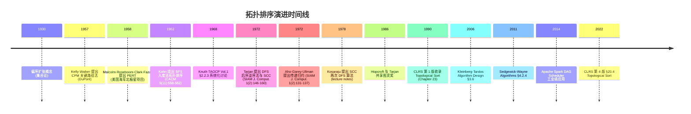

## 1. 概述与学习目标

### 1.1 什么是拓扑排序

**拓扑排序**（Topological Sort）是**有向无环图**（Directed Acyclic Graph, DAG）的一种顶点线性化方法：将 DAG 的所有顶点排列为线性序列 $\langle v_1, v_2, \ldots, v_n \rangle$，使得对于图中的每条有向边 $(u, v) \in E$，$u$ 在序列中出现在 $v$ 之前。形式化地：

$$\forall (u, v) \in E, \quad \text{pos}(u) < \text{pos}(v)$$

其中 $\text{pos}(\cdot)$ 表示顶点在序列中的位置。拓扑排序的**存在充要条件**是图为 DAG（无环），这是 Robison 1968 与 Knuth TAOCP Vol.1 §2.2.3 给出的经典结论。

拓扑排序的两大主流算法是：

1. **Kahn 算法**（1962，BFS 入度法）：维护入度数组，反复将入度为 0 的顶点加入结果序列；
2. **DFS 后序逆序法**（Tarjan 1972）：对所有未访问顶点执行 DFS，将顶点按 DFS 完成时间从大到小排列。

两者均达到 $O(V + E)$ 的线性时间复杂度，但适用场景与扩展性各有侧重。

```
拓扑排序算法层次模型：

                有向无环图 (DAG) 线性化
                          |
        ┌─────────────────┼─────────────────┐
     Kahn (BFS)         DFS 后序          Parallel Topo
     入度归零法          逆后序法          并行拓扑排序
     O(V + E)           O(V + E)          O(V + E) / p
     字典序友好          与 SCC 兼容       Spark/DAG 调度
     环检测直观          递归栈限制        Kahn 并行变体
```

### 1.2 算法在图算法家族中的位置

拓扑排序处于图算法的三大交叉点：

1. **图遍历家族**：与 BFS（广度优先搜索）、DFS（深度优先搜索）紧密相关。Kahn 算法本质上是 BFS 的入度变体；DFS 后序法直接基于 DFS；
2. **DAG 算法家族**：是 DAG 最长路径、关键路径法（CPM）、传递归约（Transitive Reduction）、DAG 最短路等所有 DAG 专用算法的预处理步骤；
3. **调度算法家族**：与 CPM（Kelly-Walker 1957）、PERT（Malcolm-Roseboom-Clark-Fazar 1959）、并行任务调度（Graham 1966 LPT 调度）共同构成项目管理与作业调度算法体系。

### 1.3 适用场景与限制

**适用场景**：

- **编译构建系统**：make、cmake、ninja、Buck、Bazel、Gradle、Maven 等构建工具的依赖解析核心；
- **课程排课系统**：大学课程先修关系（prerequisite）建模与排课；
- **任务调度**：分布式计算框架（Spark DAG Scheduler、Apache Tez、Airflow）的任务依赖编排；
- **CI/CD 流水线**：GitHub Actions、GitLab CI、Jenkins Pipeline 的 Job 依赖图编排；
- **数据流分析**：编译器数据流分析（活跃变量、可用表达式、 reaching definition）的偏序处理；
- **电路设计**：VLSI 电路信号传播延迟分析、关键路径综合；
- **区块链 UTXO 验证**：比特币、Cardano 等基于 UTXO 模型的交易依赖排序。

**限制场景**：

- **含环图**：拓扑排序不存在，需先做 SCC 缩点或环检测；
- **需要所有可能拓扑序的枚举**：枚举数量最坏 $O(n!)$（完全 DAG），需用回溯或 Knuth TAOCP Vol.4A 算法 5.1.4；
- **动态图**：边频繁增删时需增量拓扑排序，标准算法不适用；
- **带优先级约束的排序**：需字典序最小或加权拓扑序，标准算法需扩展。

### 1.4 学习目标

完成本章学习后，读者应能够：

1. **记忆**（Remember）：DAG 与拓扑排序的形式化定义、Kahn 算法与 DFS 后序法的时间复杂度 $O(V + E)$、空间复杂度 $O(V + E)$、DAG 存在拓扑序的充要条件；
2. **理解**（Understand）：Kahn 1962、Knuth TAOCP Vol.1 §2.2.3、Tarjan 1972 三者对拓扑排序的贡献与设计动机差异，与 BFS/DFS、SCC、CPM/PERT 的关系；
3. **应用**（Apply）：编写正确的 Kahn 算法（入度队列 + BFS）与 DFS 后序逆序实现，使用入度归零条件或后向边检测识别环，处理字典序最小、唯一拓扑序判定等变体；
4. **分析**（Analyze）：Kahn 算法的正确性（入度归零不变量）、DFS 算法的正确性（后序逆序 = 拓扑序）、两者为何都是 $O(V + E)$ 线性；
5. **评估**（Evaluate）：在大规模图、内存限制、并行化需求维度上对比 Kahn 与 DFS 算法、与 SCC/CPM/PERT 算法的选型决策；
6. **对比**（Compare）：拓扑排序与关键路径（CPM）、DAG 最长路径、传递归约、SCC 缩点在算法思想与数据结构依赖上的差异；
7. **创造**（Create）：设计基于拓扑排序的工业级方案，如编译器依赖分析、分布式任务调度、CI/CD Pipeline 编排、UTXO 拓扑验证。

---

## 2. 历史动机与演进

### 2.1 1950 年代背景：运筹学与项目管理兴起

二战后运筹学（Operations Research）与项目管理学（Project Management）兴起，催生了对大规模任务调度算法的需求。1957 至 1959 年间，两个独立团队几乎同时探索"在带依赖关系的任务集合上计算关键路径与最早完成时间"的问题：

- **CPM 团队**（1957）：James E. Kelly（Remington-Rand 公司）与 Morgan R. Walker（DuPont 化学公司）在 DuPont 化工厂建设项目中开发了**关键路径法**（Critical Path Method, CPM）。CPM 通过 DAG 模型化任务依赖，计算从项目开始到结束的最长路径（即关键路径）；
- **PERT 团队**（1958）：Donald G. Malcolm、John H. Roseboom、Charles E. Clark、Willard Fazar 在美国海军**北极星潜艇导弹项目**（Polaris Submarine Program）中开发了**PERT**（Program Evaluation and Review Technique）。PERT 在 CPM 基础上引入活动持续时间的三点估计（乐观/最可能/悲观）以应对不确定性。

CPM 与 PERT 都需要首先对 DAG 做拓扑排序，再沿拓扑序正向传播"最早开始时间"、反向传播"最晚开始时间"，最后求关键路径。这一需求直接催生了 Kahn 1962 算法。

### 2.2 Kahn 1962：PERT 网络拓扑排序

**Arthur B. Kahn 1962** 在《Topological Sorting of Large Networks》（Communications of the ACM 5(11):558-562 DOI:10.1145/368996.369025）中首次系统化描述了入度法拓扑排序算法。Kahn 当时在 Computer Usage Company, Inc. 工作，受 PERT 网络调度启发。

Kahn 的核心思想：

1. 计算所有顶点的入度；
2. 将入度为 0 的顶点放入队列；
3. 反复取出队首顶点 $v$，将其加入结果序列；对 $v$ 的每个出边 $(v, w)$，将 $w$ 的入度减 1；若 $w$ 入度归零，则将 $w$ 入队；
4. 当队列为空时，若结果序列长度等于顶点数则成功，否则图中存在环。

Kahn 算法优雅之处在于：**入度归零条件**自然地表达了"所有前置依赖已处理"的语义，且队列结构使算法天然支持并行扩展（多个入度 0 顶点可同时处理）。论文还给出了 $O(V + E)$ 时间复杂度的严格分析，并讨论了在大型 PERT 网络（顶点数 $10^4$ 量级）上的工程实现。

### 2.3 Knuth TAOCP Vol.1 §2.2.3：形式化与等价问题

**Donald E. Knuth** 在 1968 年出版的《The Art of Computer Programming, Volume 1: Fundamental Algorithms》§2.2.3 节系统化讨论了拓扑排序。Knuth 的贡献包括：

1. **形式化定义**：明确拓扑排序与偏序扩张（linear extension of partial order）的等价性；
2. **算法统一**：将 Kahn 入度法与 DFS 后序法统一在同一框架下；
3. **应用案例**：给出编译器符号表依赖、课程排课、文档目录排序等工程实例；
4. **复杂度分析**：明确两种算法均为 $O(V + E)$ 线性时间。

Knuth 还讨论了**等价类的拓扑排序**（Topological Sorting of Equivalence Classes），即将同构的顶点合并为等价类后再排序，这一思想后被 Aho-Garey-Ullman 1972 在传递归约中进一步发展。

### 2.4 Tarjan 1972：DFS 后序逆序与 SCC

**Robert Endre Tarjan 1972** 在《Depth-First Search and Linear Graph Algorithms》（SIAM Journal on Computing 1(2):146-160 DOI:10.1137/0201010）中提出了基于 DFS 的拓扑排序算法：

1. 对图中所有未访问顶点执行 DFS；
2. 顶点完成时（即所有后继都已访问完毕）将其压入栈；
3. DFS 全部结束后，栈顶到栈底即为拓扑序。

Tarjan 论文更重要的贡献是发现 DFS 后序与有向图结构的深刻联系：

- **后向边检测**：DFS 过程中遇到灰色（在递归栈中）顶点，即为后向边，等价于存在环；
- **强连通分量**（SCC）：使用 lowlink 值可在单次 DFS 中识别所有 SCC，时间复杂度 $O(V + E)$；
- **双连通分量**（BCC）：无向图的割点与桥，亦可在 DFS 中线性识别。

Tarjan 因此工作与 Hopcroft 共享 1986 年图灵奖。SCC 与拓扑排序的关系：将 SCC 缩点后得到的"商图"必为 DAG，其拓扑序即为原图的"近似拓扑序"。

### 2.5 Aho-Garey-Ullman 1972：传递归约

**Alfred V. Aho、Michael R. Garey、Jeffrey D. Ullman 1972** 在《The Transitive Reduction of a Directed Graph》（SIAM Journal on Computing 1(2):131-137 DOI:10.1137/0201008）中提出 DAG 的**传递归约**（Transitive Reduction）问题：求最小边数的子图 $G' = (V, E')$，使得 $G$ 与 $G'$ 传递闭包相同。

对于 DAG，传递归约可在 $O(V + E)$ 时间内完成，核心步骤是：

1. 对 DAG 做拓扑排序；
2. 按拓扑逆序处理每个顶点 $v$，对 $v$ 的每条出边 $(v, w)$，若 $w$ 已通过其他路径可达 $v$，则删除该边。

这一算法直接依赖拓扑排序，体现了拓扑序在 DAG 算法中的预处理作用。

### 2.6 演进时间线



### 2.7 关键设计决策

拓扑排序演进过程中有四个关键设计决策：

1. **入度而非出度**：Kahn 选择入度归零条件，因为入度直观表达"前置依赖已完成"，与 PERT 调度语义吻合；
2. **队列而非栈**：Kahn 使用 FIFO 队列保证拓扑序的"公平性"，与 BFS 一致；若用优先队列则得字典序最小拓扑序；
3. **后序而非前序**：Tarjan 选择 DFS 后序逆序，因为顶点完成时间逆序恰好对应 DAG 的"汇点优先"性质；
4. **三色标记而非布尔**：DFS 三色标记（白/灰/黑）可同时实现拓扑排序与环检测，灰色标记即"在递归栈中"，识别后向边；
5. **DAG 假设的充要性**：拓扑排序存在 $\iff$ 图为 DAG，这一充要条件使得拓扑排序同时是 DAG 判定算法（若排序失败则有环）。

> **教学提示**：理解拓扑排序演进的关键是抓住"DAG 偏序 → 线性序"的本质。这与排序算法"全序 → 全序"不同：拓扑排序处理的是偏序结构，结果不唯一（除完全 DAG 外），是组合数学中"线性扩张"问题的算法实现。

---

## 3. 形式化定义

### 3.1 有向无环图（DAG）

**定义 3.1（有向图）**：有向图 $G = (V, E)$ 由顶点集 $V$ 与边集 $E \subseteq V \times V$ 组成。边 $(u, v) \in E$ 表示从 $u$ 指向 $v$ 的有向边。

**定义 3.2（路径与环）**：路径是顶点序列 $v_0, v_1, \ldots, v_k$ 满足 $(v_{i-1}, v_i) \in E, \forall 1 \leq i \leq k$。若 $v_0 = v_k$ 且 $k \geq 1$ 则称为**环**（cycle）或**回路**（circuit）。

**定义 3.3（DAG）**：有向无环图（Directed Acyclic Graph, DAG）是不含任何环的有向图。即 $G = (V, E)$ 是 DAG $\iff$ 不存在 $v_0, v_1, \ldots, v_k$（$k \geq 1$）使得 $v_0 = v_k$ 且 $(v_{i-1}, v_i) \in E$。

### 3.2 偏序与线性扩张

**定义 3.4（偏序关系）**：集合 $V$ 上的二元关系 $\preceq$ 称为**偏序**（partial order），若满足：

1. **自反性**（reflexive）：$\forall v \in V, v \preceq v$；
2. **反对称性**（antisymmetric）：$\forall u, v \in V$，若 $u \preceq v$ 且 $v \preceq u$ 则 $u = v$；
3. **传递性**（transitive）：$\forall u, v, w \in V$，若 $u \preceq v$ 且 $v \preceq w$ 则 $u \preceq w$。

二元组 $(V, \preceq)$ 称为**偏序集**（partially ordered set, poset）。

**定义 3.5（线性扩张）**：偏序集 $(V, \preceq)$ 的**线性扩张**（linear extension）是 $V$ 上的全序 $\leq_L$ 满足：

$$\forall u, v \in V, \quad u \preceq v \implies u \leq_L v$$

即将偏序扩展为全序，保持原偏序关系不变。

**拓扑排序的等价定义**：DAG $G = (V, E)$ 自然诱导偏序关系 $\preceq_G$：$u \preceq_G v \iff$ 存在从 $u$ 到 $v$ 的路径。拓扑排序即 $\preceq_G$ 的线性扩张。

### 3.3 拓扑排序

**定义 3.6（拓扑排序）**：DAG $G = (V, E)$ 的拓扑排序是 $V$ 的一个排列 $\sigma: V \to \{1, 2, \ldots, |V|\}$，满足：

$$\forall (u, v) \in E, \quad \sigma(u) < \sigma(v)$$

即对每条有向边 $(u, v)$，$u$ 在排列中出现在 $v$ 之前。

**定理 3.1（拓扑排序存在性）**：有向图 $G$ 存在拓扑排序 $\iff$ $G$ 是 DAG。

**证明**：

（$\Rightarrow$）若 $G$ 存在拓扑排序 $\sigma$，假设 $G$ 含环 $v_0, v_1, \ldots, v_k = v_0$。由拓扑序定义 $\sigma(v_0) < \sigma(v_1) < \ldots < \sigma(v_k) = \sigma(v_0)$，矛盾。故 $G$ 无环。

（$\Leftarrow$）若 $G$ 是 DAG，必存在入度为 0 的顶点（否则从任一顶点沿入边回溯必遇环）。反复删除入度 0 顶点得到顶点序列即为拓扑序。$\square$

### 3.4 入度与出度

**定义 3.7（入度与出度）**：有向图 $G = (V, E)$ 中顶点 $v$ 的：

- **入度**（in-degree）：$\text{deg}^-(v) = |\{u \in V : (u, v) \in E\}|$；
- **出度**（out-degree）：$\text{deg}^+(v) = |\{w \in V : (v, w) \in E\}|$。

**基本性质**：$\sum_{v \in V} \text{deg}^-(v) = \sum_{v \in V} \text{deg}^+(v) = |E|$（每条边贡献一个入度与一个出度）。

**DAG 性质**：DAG 必存在至少一个入度 0 的顶点（称为**源点** source）与至少一个出度 0 的顶点（称为**汇点** sink）。

### 3.5 后向边与环

**定义 3.8（DFS 边分类）**：在 DFS 遍历有向图时，根据边的起终点访问状态将边分为四类：

1. **树边**（tree edge）：$(u, v)$ 中 $v$ 未被访问，$v$ 成为 $u$ 在 DFS 树中的子节点；
2. **前向边**（forward edge）：$(u, v)$ 中 $v$ 已访问完毕（黑色），且 $v$ 是 $u$ 在 DFS 树中的后代；
3. **后向边**（back edge）：$(u, v)$ 中 $v$ 正在访问（灰色，在递归栈中），表明 $v$ 是 $u$ 的祖先；
4. **横叉边**（cross edge）：$(u, v)$ 中 $v$ 已访问完毕（黑色），且 $v$ 既非 $u$ 祖先也非后代。

**定理 3.2（环与后向边等价）**：有向图 $G$ 含环 $\iff$ DFS 遍历中存在后向边。

**推论 3.1**：$G$ 是 DAG $\iff$ DFS 遍历中不存在后向边。

> **教学提示**：注意无向图的边分类只有树边与后向边两类（无前向边与横叉边），且无向图含环等价于 DFS 中存在非树边（即后向边）。有向图由于方向性，需用三色标记严格区分四类边。

### 3.6 强连通分量与商图

**定义 3.9（强连通分量）**：有向图 $G$ 的**强连通分量**（Strongly Connected Component, SCC）是 $V$ 的极大子集 $S$，使得 $S$ 中任意两顶点互相可达。形式化：$\forall u, v \in S$，存在 $u \to v$ 与 $v \to u$ 的路径。

**定义 3.10（商图）**：将 $G$ 的每个 SCC 缩点为单顶点，所得的图称为**商图**（quotient graph）或**凝聚图**（condensation）。

**定理 3.3（商图为 DAG）**：有向图 $G$ 的商图 $G^*$ 是 DAG。

**证明**：若 $G^*$ 含环 $C_1 \to C_2 \to \ldots \to C_k \to C_1$（其中 $C_i$ 是 SCC），则 $C_1 \cup C_2 \cup \ldots \cup C_k$ 中任意两顶点互相可达（先沿环路到达目标 SCC，再在 SCC 内部到达目标顶点），与 $C_i$ 的极大性矛盾。$\square$

**推论 3.2**：对商图 $G^*$ 可做拓扑排序，得到 SCC 的拓扑序。

### 3.7 关键路径

**定义 3.11（AOE 网）**：**Activity On Edge**（AOE）网是带权 DAG，其中顶点表示事件，边表示活动，边权表示活动持续时间。

**定义 3.12（最早发生时间）**：事件 $v$ 的**最早发生时间** $\text{ve}(v)$ 是从源点 $s$ 到 $v$ 的最长路径长度：

$$\text{ve}(v) = \max_{(u, v) \in E} \{\text{ve}(u) + w(u, v)\}, \quad \text{ve}(s) = 0$$

**定义 3.13（最迟发生时间）**：事件 $v$ 的**最迟发生时间** $\text{vl}(v)$ 是在不延误项目总工期的前提下，$v$ 的最晚发生时间：

$$\text{vl}(v) = \min_{(v, w) \in E} \{\text{vl}(w) - w(v, w)\}, \quad \text{vl}(t) = \text{ve}(t)$$

其中 $t$ 是汇点。

**定义 3.14（关键路径）**：满足 $\text{ve}(v) = \text{vl}(v)$ 的所有顶点组成的路径称为**关键路径**。关键路径上任何事件延迟都会延迟整个项目。

> **教学提示**：CPM 与 PERT 都基于拓扑序计算最早/最迟发生时间——正向遍历拓扑序计算 $\text{ve}$，反向遍历计算 $\text{vl}$。这是拓扑排序在项目管理中的核心应用。

---

## 4. 理论推导

### 4.1 Kahn 算法正确性

**算法 4.1（Kahn 1962）**：

```
KAHN-TOPOLOGICAL-SORT(G):
    for each v in V:
        in_degree[v] = 0
    for each (u, v) in E:
        in_degree[v] += 1
    Q = empty queue
    for each v in V:
        if in_degree[v] == 0:
            Q.enqueue(v)
    result = empty list
    while Q is not empty:
        v = Q.dequeue()
        result.append(v)
        for each (v, w) in E:
            in_degree[w] -= 1
            if in_degree[w] == 0:
                Q.enqueue(w)
    if len(result) == |V|:
        return result  // 拓扑排序
    else:
        return NIL  // 图中有环
```

**定理 4.1（Kahn 算法正确性）**：若 $G$ 是 DAG，Kahn 算法返回 $G$ 的一个拓扑排序；若 $G$ 含环，Kahn 算法返回 NIL。

**证明**：

**正确性分析**：算法不变量为"队列 $Q$ 中所有顶点的入度（在剩余图中）为 0"。每次从 $Q$ 取出顶点 $v$ 加入结果序列时，$v$ 的所有前置依赖已被处理（否则 $v$ 入度不为 0）。将 $v$ 加入结果序列后，删除 $v$ 的所有出边（即将 $w$ 的入度减 1），等价于从图中删除 $v$。删除 $v$ 后，剩余图 $G - \{v\}$ 仍是 DAG（DAG 删除顶点后仍为 DAG）。

**形式化归纳**：记 $G_i$ 为第 $i$ 次出队后剩余的图（$G_0 = G$）。归纳证明：

- **基础**：$G_0 = G$ 是 DAG（假设 $G$ 是 DAG）；
- **归纳**：若 $G_i$ 是 DAG，则 $G_i$ 必有入度 0 顶点 $v$（DAG 性质），算法将其出队。$G_{i+1} = G_i - \{v\}$ 仍是 DAG。

**环检测**：若 $G$ 含环 $C$，$C$ 中所有顶点入度都至少为 1（环上每点至少有一条来自前驱的入边）。算法始终只处理入度 0 顶点，故 $C$ 中顶点永不出队，最终结果序列长度小于 $|V|$，算法返回 NIL。

**复杂度**：

- **时间**：初始化入度 $O(V + E)$；队列操作每条边恰好被访问一次（出队时遍历出边），总 $O(V + E)$；
- **空间**：入度数组 $O(V)$、队列 $O(V)$、邻接表 $O(V + E)$，总 $O(V + E)$。

$\square$

### 4.2 DFS 后序逆序正确性

**算法 4.2（Tarjan 1972）**：

```
DFS-TOPOLOGICAL-SORT(G):
    color = [WHITE] * |V|
    result = empty stack
    has_cycle = FALSE
    for each v in V:
        if color[v] == WHITE:
            DFS-VISIT(v)
    if has_cycle:
        return NIL
    return result as list (top to bottom)

DFS-VISIT(v):
    color[v] = GRAY  // 进入递归栈
    for each (v, w) in E:
        if color[w] == GRAY:
            has_cycle = TRUE  // 后向边，有环
        else if color[w] == WHITE:
            DFS-VISIT(w)
    color[v] = BLACK  // 离开递归栈
    result.push(v)    // 后序压栈
```

**定理 4.2（DFS 后序逆序正确性）**：若 $G$ 是 DAG，DFS 后序逆序即拓扑序；若 $G$ 含环，DFS 会遇到后向边并报告环。

**证明**：

**关键引理**：在 DAG 的 DFS 中，对任意边 $(u, v) \in E$，$v$ 的完成时间 $\text{finish}(v) < \text{finish}(u)$。

**引理证明**：分三种情况讨论（DFS 访问 $u$ 时 $v$ 的颜色）：

1. **$v$ 是白色**：$v$ 成为 $u$ 的后代，故 $v$ 先于 $u$ 完成，$\text{finish}(v) < \text{finish}(u)$；
2. **$v$ 是灰色**：$v$ 在递归栈中，$(u, v)$ 是后向边，但 $G$ 是 DAG 不应有后向边，矛盾，此情况不发生；
3. **$v$ 是黑色**：$v$ 已完成访问，$\text{finish}(v) < \text{finish}(u)$（$u$ 尚未完成）。

故对任意边 $(u, v)$，$\text{finish}(v) < \text{finish}(u)$。后序压栈顺序为完成时间从早到晚，故栈顶到栈底完成时间递减，逆序（栈顶到栈底）即拓扑序（边 $(u, v)$ 中 $u$ 在 $v$ 之前）。$\square$

**环检测**：若 $G$ 含环，DFS 必遇后向边（环上某条边是后向边），算法报告环并返回 NIL。

**复杂度**：

- **时间**：每个顶点访问一次，每条边访问一次，总 $O(V + E)$；
- **空间**：颜色数组 $O(V)$、递归栈 $O(V)$、结果栈 $O(V)$、邻接表 $O(V + E)$，总 $O(V + E)$。

### 4.3 拓扑序与偏序扩张的等价性

**定理 4.3**：DAG $G$ 的所有拓扑排序集合 $T(G)$ 与 $G$ 诱导偏序 $\preceq_G$ 的所有线性扩张集合 $L(\preceq_G)$ 相等。

**证明**：

（$\subseteq$）若 $\sigma \in T(G)$，则 $\forall (u, v) \in E, \sigma(u) < \sigma(v)$。对任意 $u \preceq_G v$（即存在路径 $u \to v$），路径上每条边 $(u_i, u_{i+1})$ 满足 $\sigma(u_i) < \sigma(u_{i+1})$，由传递性 $\sigma(u) < \sigma(v)$。故 $\sigma$ 是 $\preceq_G$ 的线性扩张。

（$\supseteq$）若 $\sigma$ 是 $\preceq_G$ 的线性扩张，则对任意 $(u, v) \in E$（即 $u \preceq_G v$），$\sigma(u) < \sigma(v)$。故 $\sigma$ 是 $G$ 的拓扑排序。$\square$

**推论 4.1**：DAG $G$ 的拓扑排序数量等于其偏序扩张数量。完全 DAG（无任何边）的拓扑排序数量为 $|V|!$，链 DAG（线性序）的拓扑排序数量为 1。

### 4.4 字典序最小拓扑排序

**定义 4.1（字典序最小拓扑排序）**：在所有拓扑排序中，字典序最小的那个。即满足 $\sigma(v_1) < \sigma(v_2)$ 当且仅当 $v_1$ 应尽可能早地出现在序列中。

**算法 4.3（优先队列 Kahn）**：将 Kahn 算法的 FIFO 队列改为最小堆（优先队列），每次取出编号最小的入度 0 顶点。

**定理 4.4**：优先队列 Kahn 算法返回字典序最小拓扑排序。

**证明**：归纳证明。

- **基础**：第一个出队的顶点必是入度 0 顶点中编号最小者，是任何拓扑排序的第一个顶点的最小可能值；
- **归纳**：假设前 $k$ 步已选择字典序最小前缀，第 $k+1$ 步从当前入度 0 顶点中选择编号最小者，这与剩余图的最小字典序拓扑排序一致（前 $k$ 步选择已确定后续入度 0 顶点集，剩余子问题的最小字典序解由当前最小入度 0 顶点开始）。

**复杂度**：$O(V \log V + E)$（堆操作）。

### 4.5 DAG 最长路径

**算法 4.4（DAG 最长路径）**：DAG 上求最长路径可在 $O(V + E)$ 完成，步骤：

1. 对 DAG 做拓扑排序 $\sigma$；
2. 按拓扑序处理每个顶点 $v$，更新 $v$ 的所有出边 $(v, w)$：$\text{dist}[w] = \max(\text{dist}[w], \text{dist}[v] + w(v, w))$；
3. 最终 $\max_v \text{dist}[v]$ 即最长路径长度。

**正确性**：按拓扑序处理保证处理 $v$ 时 $\text{dist}[v]$ 已是最终值（$v$ 的所有前驱已处理），无后向更新。

**应用**：关键路径法（CPM）即 DAG 最长路径的工程化应用。

### 4.6 与 Dijkstra/Bellman-Ford 的对比

DAG 上的最短路径问题可类似用拓扑序在 $O(V + E)$ 解决（即使含负权边），无需 Dijkstra 的 $O((V+E) \log V)$ 或 Bellman-Ford 的 $O(VE)$。

**算法 4.5（DAG 最短路径）**：

1. 对 DAG 做拓扑排序；
2. 初始化 $\text{dist}[s] = 0$，其余 $\text{dist}[v] = \infty$；
3. 按拓扑序处理：$\text{dist}[w] = \min(\text{dist}[w], \text{dist}[v] + w(v, w))$。

**优势**：

- 即使有负权边也只需 $O(V + E)$（DAG 无环保证无负环）；
- 比 Dijkstra 快 $O(\log V)$ 因子，比 Bellman-Ford 快 $O(V)$ 因子。

---

## 5. 代码示例

### 5.1 Python：Kahn 算法（标准版）

```python
from collections import deque
from typing import List, Optional, Tuple


def kahn_topological_sort(n: int, edges: List[Tuple[int, int]]) -> Optional[List[int]]:
    """Kahn 算法（BFS 入度法）求解有向图的拓扑排序。

    Args:
        n: 顶点数，顶点编号 0 到 n-1
        edges: 有向边列表，每条边为 (u, v) 表示 u -> v

    Returns:
        拓扑排序结果列表；若图中有环则返回 None

    Time Complexity: O(V + E)
    Space Complexity: O(V + E)

    Reference:
        Kahn, Arthur B. "Topological Sorting of Large Networks."
        Communications of the ACM 5(11):558-562, 1962. DOI:10.1145/368996.369025
    """
    # 构建邻接表与入度数组
    graph: List[List[int]] = [[] for _ in range(n)]
    in_degree: List[int] = [0] * n

    for u, v in edges:
        graph[u].append(v)
        in_degree[v] += 1

    # 初始化队列：所有入度为 0 的顶点入队
    queue: deque = deque([i for i in range(n) if in_degree[i] == 0])
    result: List[int] = []

    while queue:
        v = queue.popleft()
        result.append(v)
        # 删除 v 的所有出边
        for w in graph[v]:
            in_degree[w] -= 1
            if in_degree[w] == 0:
                queue.append(w)

    # 若结果包含所有顶点则成功，否则图中有环
    if len(result) == n:
        return result
    return None
```

### 5.2 Python：Kahn 算法（字典序最小版）

```python
import heapq
from typing import List, Optional, Tuple


def kahn_lexicographic_topo_sort(n: int, edges: List[Tuple[int, int]]) -> Optional[List[int]]:
    """字典序最小的拓扑排序：使用最小堆替代 FIFO 队列。

    当多个顶点的入度同时为 0 时，优先选择编号最小者。
    适用于要求拓扑序字典序最小的场景，如任务调度中希望按编号顺序处理。

    Args:
        n: 顶点数
        edges: 有向边列表

    Returns:
        字典序最小的拓扑排序；若图中有环则返回 None

    Time Complexity: O(V log V + E)
    Space Complexity: O(V + E)
    """
    graph: List[List[int]] = [[] for _ in range(n)]
    in_degree: List[int] = [0] * n

    for u, v in edges:
        graph[u].append(v)
        in_degree[v] += 1

    # 使用最小堆替代 FIFO 队列
    heap: List[int] = [i for i in range(n) if in_degree[i] == 0]
    heapq.heapify(heap)
    result: List[int] = []

    while heap:
        v = heapq.heappop(heap)
        result.append(v)
        for w in graph[v]:
            in_degree[w] -= 1
            if in_degree[w] == 0:
                heapq.heappush(heap, w)

    if len(result) == n:
        return result
    return None
```

### 5.3 Python：DFS 后序逆序法

```python
import sys
from typing import List, Optional, Tuple


def dfs_topological_sort(n: int, edges: List[Tuple[int, int]]) -> Optional[List[int]]:
    """DFS 后序逆序法求解拓扑排序，同时使用三色标记检测环。

    白色(0): 未访问
    灰色(1): 正在访问（在递归栈中）
    黑色(2): 已完成

    遇到灰色节点表示发现后向边，图中存在环。

    Args:
        n: 顶点数
        edges: 有向边列表

    Returns:
        拓扑排序结果（DFS 后序逆序）；若图中有环则返回 None

    Time Complexity: O(V + E)
    Space Complexity: O(V + E)
    Reference:
        Tarjan, Robert Endre. "Depth-First Search and Linear Graph Algorithms."
        SIAM Journal on Computing 1(2):146-160, 1972. DOI:10.1137/0201010
    """
    graph: List[List[int]] = [[] for _ in range(n)]
    for u, v in edges:
        graph[u].append(v)

    WHITE, GRAY, BLACK = 0, 1, 2
    color: List[int] = [WHITE] * n
    result: List[int] = []
    has_cycle: bool = False

    # 提高递归深度限制，应对大型 DAG
    sys.setrecursionlimit(max(10000, n + 100))

    def dfs(v: int) -> None:
        nonlocal has_cycle
        color[v] = GRAY  # 进入递归栈
        for w in graph[v]:
            if color[w] == GRAY:
                # 后向边：发现环
                has_cycle = True
                return
            if color[w] == WHITE:
                dfs(w)
                if has_cycle:
                    return
        color[v] = BLACK  # 离开递归栈
        result.append(v)  # 后序压栈

    for v in range(n):
        if color[v] == WHITE:
            dfs(v)
            if has_cycle:
                return None

    # 后序逆序即为拓扑序
    return result[::-1]
```

### 5.4 Python：关键路径（CPM）

```python
from collections import deque
from typing import List, Optional, Tuple


def critical_path(n: int, edges: List[Tuple[int, int, int]],
                  source: int, sink: int) -> Optional[Tuple[int, List[int]]]:
    """计算 AOE 网的关键路径（Critical Path Method, CPM）。

    Args:
        n: 顶点数（事件数）
        edges: 边列表 (u, v, w) 表示活动 u -> v，持续时间 w
        source: 源点（项目开始）
        sink: 汇点（项目结束）

    Returns:
        (关键路径长度, 关键路径顶点列表)；若图中有环则返回 None

    Reference:
        Kelly, James E. and Walker, Morgan R.
        "Critical-Path Planning and Scheduling."
        Proceedings of the Eastern Joint Computer Conference (EJCC 1959), pp. 160-173.
        DOI:10.1145/1460299.1460318
    """
    graph: List[List[Tuple[int, int]]] = [[] for _ in range(n)]
    reverse_graph: List[List[Tuple[int, int]]] = [[] for _ in range(n)]
    in_degree: List[int] = [0] * n
    out_degree: List[int] = [0] * n

    for u, v, w in edges:
        graph[u].append((v, w))
        reverse_graph[v].append((u, w))
        in_degree[v] += 1
        out_degree[u] += 1

    # 第 1 步：拓扑排序
    queue: deque = deque([i for i in range(n) if in_degree[i] == 0])
    topo: List[int] = []
    while queue:
        v = queue.popleft()
        topo.append(v)
        for w, _ in graph[v]:
            in_degree[w] -= 1
            if in_degree[w] == 0:
                queue.append(w)

    if len(topo) != n:
        return None  # 图中有环

    # 第 2 步：正向计算最早发生时间 ve
    ve: List[int] = [0] * n
    for v in topo:
        for w, weight in graph[v]:
            if ve[v] + weight > ve[w]:
                ve[w] = ve[v] + weight

    # 第 3 步：反向计算最迟发生时间 vl
    project_time: int = ve[sink]
    vl: List[int] = [project_time] * n
    for v in reversed(topo):
        for u, weight in reverse_graph[v]:
            if vl[v] - weight < vl[u]:
                vl[u] = vl[v] - weight

    # 第 4 步：找出关键路径（ve[v] == vl[v] 的顶点）
    critical_vertices: List[int] = [v for v in range(n) if ve[v] == vl[v]]

    # 从源点开始沿关键路径前向追溯
    path: List[int] = [source]
    current = source
    while current != sink:
        for w, weight in graph[current]:
            if (ve[current] + weight == ve[w]
                and ve[w] == vl[w]
                and w in critical_vertices):
                path.append(w)
                current = w
                break

    return project_time, path
```

### 5.5 Python：NetworkX 风格

```python
import networkx as nx
from typing import List, Optional


def topological_sort_nx(graph: nx.DiGraph) -> Optional[List]:
    """使用 NetworkX 库执行拓扑排序。

    NetworkX 内部使用 Kahn 算法（lexicographic_topological_sort 支持字典序）。

    Args:
        graph: NetworkX 有向图

    Returns:
        拓扑排序顶点列表；若图中有环则返回 None

    Reference:
        NetworkX Developers. "topological_sort."
        https://networkx.org/documentation/stable/reference/algorithms/generated/networkx.algorithms.dag.topological_sort.html
    """
    if not nx.is_directed_acyclic_graph(graph):
        return None  # 图中有环
    return list(nx.topological_sort(graph))


def lexicographic_topo_sort_nx(graph: nx.DiGraph) -> Optional[List]:
    """字典序最小拓扑排序（NetworkX）。

    当多个顶点入度同时为 0 时，按顶点 key 的字典序选择。
    """
    if not nx.is_directed_acyclic_graph(graph):
        return None
    return list(nx.lexicographical_topological_sort(graph))
```

### 5.6 C++：Kahn 算法

```cpp
#include <vector>
#include <queue>
#include <optional>
#include <utility>

// Kahn 算法（BFS 入度法）求解拓扑排序
// 时间复杂度: O(V + E)
// 空间复杂度: O(V + E)
// 参考: Kahn 1962, Communications of the ACM 5(11):558-562
//       DOI:10.1145/368996.369025
std::optional<std::vector<int>> kahnTopologicalSort(
    int n,
    const std::vector<std::pair<int, int>>& edges
) {
    std::vector<std::vector<int>> graph(n);
    std::vector<int> inDegree(n, 0);

    for (const auto& [u, v] : edges) {
        graph[u].push_back(v);
        inDegree[v]++;
    }

    std::queue<int> q;
    for (int i = 0; i < n; ++i) {
        if (inDegree[i] == 0) {
            q.push(i);
        }
    }

    std::vector<int> result;
    result.reserve(n);

    while (!q.empty()) {
        int v = q.front();
        q.pop();
        result.push_back(v);

        for (int w : graph[v]) {
            if (--inDegree[w] == 0) {
                q.push(w);
            }
        }
    }

    if (static_cast<int>(result.size()) == n) {
        return result;
    }
    return std::nullopt;  // 图中有环
}
```

### 5.7 C++：DFS 后序法（Boost 风格）

```cpp
#include <vector>
#include <stack>
#include <optional>

// DFS 后序逆序法求解拓扑排序
// 三色标记: 0=WHITE, 1=GRAY, 2=BLACK
// 时间复杂度: O(V + E)
// 参考: Tarjan 1972, SIAM Journal on Computing 1(2):146-160
//       DOI:10.1137/0201010
//       Boost Graph Library topological_sort:
//       https://www.boost.org/libs/graph/doc/topological_sort.html
class DFSTopologicalSort {
public:
    std::optional<std::vector<int>> sort(
        int n,
        const std::vector<std::pair<int, int>>& edges
    ) {
        graph_.assign(n, {});
        color_.assign(n, 0);  // WHITE
        hasCycle_ = false;

        for (const auto& [u, v] : edges) {
            graph_[u].push_back(v);
        }

        for (int v = 0; v < n; ++v) {
            if (color_[v] == 0) {
                dfs(v);
                if (hasCycle_) return std::nullopt;
            }
        }

        std::vector<int> result;
        while (!result_.empty()) {
            result.push_back(result_.top());
            result_.pop();
        }
        return result;
    }

private:
    void dfs(int v) {
        color_[v] = 1;  // GRAY
        for (int w : graph_[v]) {
            if (color_[w] == 1) {
                // 后向边：发现环
                hasCycle_ = true;
                return;
            }
            if (color_[w] == 0) {
                dfs(w);
                if (hasCycle_) return;
            }
        }
        color_[v] = 2;  // BLACK
        result_.push(v);
    }

    std::vector<std::vector<int>> graph_;
    std::vector<int> color_;
    std::stack<int> result_;
    bool hasCycle_;
};
```

### 5.8 Java：Kahn 算法

```java
import java.util.*;

/**
 * Kahn 算法（BFS 入度法）求解拓扑排序.
 *
 * <p>时间复杂度: O(V + E)
 * 空间复杂度: O(V + E)
 *
 * <p>参考: Kahn, Arthur B. "Topological Sorting of Large Networks."
 * Communications of the ACM 5(11):558-562, 1962. DOI:10.1145/368996.369025
 */
public class KahnTopologicalSort {

    /**
     * 计算有向图的拓扑排序.
     *
     * @param n 顶点数，顶点编号 0 到 n-1
     * @param edges 有向边列表，每条边为 [u, v] 表示 u -> v
     * @return 拓扑排序结果；若图中有环则返回 null
     */
    public static List<Integer> topologicalSort(
            int n,
            int[][] edges
    ) {
        // 构建邻接表与入度数组
        List<List<Integer>> graph = new ArrayList<>();
        int[] inDegree = new int[n];
        for (int i = 0; i < n; i++) {
            graph.add(new ArrayList<>());
        }
        for (int[] edge : edges) {
            graph.get(edge[0]).add(edge[1]);
            inDegree[edge[1]]++;
        }

        // 初始化队列
        Queue<Integer> queue = new LinkedList<>();
        for (int i = 0; i < n; i++) {
            if (inDegree[i] == 0) {
                queue.offer(i);
            }
        }

        List<Integer> result = new ArrayList<>();
        while (!queue.isEmpty()) {
            int v = queue.poll();
            result.add(v);
            for (int w : graph.get(v)) {
                if (--inDegree[w] == 0) {
                    queue.offer(w);
                }
            }
        }

        if (result.size() == n) {
            return result;
        }
        return null;  // 图中有环
    }
}
```

### 5.9 Java：字典序最小拓扑排序

```java
import java.util.*;

/**
 * 字典序最小拓扑排序（使用 PriorityQueue）.
 *
 * <p>时间复杂度: O(V log V + E)
 * 空间复杂度: O(V + E)
 */
public class LexicographicTopologicalSort {

    public static List<Integer> topologicalSort(
            int n,
            int[][] edges
    ) {
        List<List<Integer>> graph = new ArrayList<>();
        int[] inDegree = new int[n];
        for (int i = 0; i < n; i++) {
            graph.add(new ArrayList<>());
        }
        for (int[] edge : edges) {
            graph.get(edge[0]).add(edge[1]);
            inDegree[edge[1]]++;
        }

        // 使用最小堆（PriorityQueue）替代 FIFO 队列
        PriorityQueue<Integer> heap = new PriorityQueue<>();
        for (int i = 0; i < n; i++) {
            if (inDegree[i] == 0) {
                heap.offer(i);
            }
        }

        List<Integer> result = new ArrayList<>();
        while (!heap.isEmpty()) {
            int v = heap.poll();
            result.add(v);
            for (int w : graph.get(v)) {
                if (--inDegree[w] == 0) {
                    heap.offer(w);
                }
            }
        }

        if (result.size() == n) {
            return result;
        }
        return null;
    }
}
```

### 5.10 变体：DAG 最长路径

```python
from collections import deque
from typing import List, Optional, Tuple


def dag_longest_path(n: int, edges: List[Tuple[int, int, int]],
                     source: int) -> Tuple[List[int], List[int]]:
    """DAG 上的最长路径（拓扑序 DP）。

    Args:
        n: 顶点数
        edges: 边列表 (u, v, w) 表示 u -> v，权重 w
        source: 起点

    Returns:
        (dist, parent) 元组：
        - dist[v] 表示从 source 到 v 的最长路径长度（不可达为 -inf）
        - parent[v] 表示最长路径上 v 的前驱顶点（用于路径重建）

    Time Complexity: O(V + E)
    Space Complexity: O(V + E)

    应用: 关键路径法（CPM）的核心算法
    """
    graph: List[List[Tuple[int, int]]] = [[] for _ in range(n)]
    in_degree: List[int] = [0] * n
    for u, v, w in edges:
        graph[u].append((v, w))
        in_degree[v] += 1

    # 拓扑排序
    queue: deque = deque([i for i in range(n) if in_degree[i] == 0])
    topo: List[int] = []
    while queue:
        v = queue.popleft()
        topo.append(v)
        for w, _ in graph[v]:
            in_degree[w] -= 1
            if in_degree[w] == 0:
                queue.append(w)

    # 按拓扑序 DP 求最长路径
    NEG_INF = float('-inf')
    dist: List[float] = [NEG_INF] * n
    parent: List[int] = [-1] * n
    dist[source] = 0

    for v in topo:
        if dist[v] == NEG_INF:
            continue
        for w, weight in graph[v]:
            if dist[v] + weight > dist[w]:
                dist[w] = dist[v] + weight
                parent[w] = v

    return dist, parent
```

### 5.11 变体：DAG 最短路径（含负权）

```python
from collections import deque
from typing import List, Tuple


def dag_shortest_path(n: int, edges: List[Tuple[int, int, int]],
                      source: int) -> Tuple[List[float], List[int]]:
    """DAG 上的最短路径（拓扑序 DP，支持负权边）。

    由于 DAG 无环，不会出现负环，因此即使存在负权边也能在 O(V+E) 时间内求解。
    这比 Dijkstra 算法（不支持负权）和 Bellman-Ford 算法（O(VE)）都更高效。

    Args:
        n: 顶点数
        edges: 边列表 (u, v, w)，w 可为负
        source: 起点

    Returns:
        (dist, parent) 元组：dist[v] 为最短距离（不可达为 inf），parent[v] 为前驱

    Time Complexity: O(V + E)
    Space Complexity: O(V + E)
    """
    graph: List[List[Tuple[int, int]]] = [[] for _ in range(n)]
    in_degree: List[int] = [0] * n
    for u, v, w in edges:
        graph[u].append((v, w))
        in_degree[v] += 1

    queue: deque = deque([i for i in range(n) if in_degree[i] == 0])
    topo: List[int] = []
    while queue:
        v = queue.popleft()
        topo.append(v)
        for w, _ in graph[v]:
            in_degree[w] -= 1
            if in_degree[w] == 0:
                queue.append(w)

    INF = float('inf')
    dist: List[float] = [INF] * n
    parent: List[int] = [-1] * n
    dist[source] = 0

    for v in topo:
        if dist[v] == INF:
            continue
        for w, weight in graph[v]:
            if dist[v] + weight < dist[w]:
                dist[w] = dist[v] + weight
                parent[w] = v

    return dist, parent
```

### 5.12 变体：环检测并输出环

```python
from typing import List, Optional, Tuple


def find_cycle_dfs(n: int, edges: List[Tuple[int, int]]) -> Optional[List[int]]:
    """使用 DFS 三色标记检测有向图中的环，并返回环上顶点序列。

    Args:
        n: 顶点数
        edges: 有向边列表

    Returns:
        环上顶点序列（如 [v1, v2, v3, v1] 表示 v1 -> v2 -> v3 -> v1 环）；
        若无环则返回 None

    Time Complexity: O(V + E)
    Space Complexity: O(V + E)
    """
    graph: List[List[int]] = [[] for _ in range(n)]
    for u, v in edges:
        graph[u].append(v)

    WHITE, GRAY, BLACK = 0, 1, 2
    color: List[int] = [WHITE] * n
    parent: List[int] = [-1] * n
    cycle_start, cycle_end = -1, -1

    def dfs(v: int) -> bool:
        nonlocal cycle_start, cycle_end
        color[v] = GRAY
        for w in graph[v]:
            if color[w] == GRAY:
                # 发现后向边 v -> w，环为 w -> ... -> v -> w
                cycle_start, cycle_end = w, v
                return True
            if color[w] == WHITE:
                parent[w] = v
                if dfs(w):
                    return True
        color[v] = BLACK
        return False

    for v in range(n):
        if color[v] == WHITE:
            if dfs(v):
                # 重建环路径
                cycle: List[int] = [cycle_start]
                current = cycle_end
                while current != cycle_start:
                    cycle.append(current)
                    current = parent[current]
                cycle.append(cycle_start)
                cycle.reverse()
                return cycle

    return None
```

### 5.13 完整示例

```python
from typing import List, Optional, Tuple


def demo_topological_sort() -> None:
    """演示拓扑排序算法的完整使用流程。"""
    # 示例：课程先修关系
    # 0: 程序设计基础
    # 1: 数据结构 (先修 0)
    # 2: 算法分析 (先修 1)
    # 3: 离散数学
    # 4: 操作系统 (先修 1, 3)
    # 5: 数据库 (先修 1, 4)
    # 6: 编译原理 (先修 2, 4)
    n = 7
    edges: List[Tuple[int, int]] = [
        (0, 1),  # 程序设计基础 -> 数据结构
        (1, 2),  # 数据结构 -> 算法分析
        (1, 4),  # 数据结构 -> 操作系统
        (3, 4),  # 离散数学 -> 操作系统
        (1, 5),  # 数据结构 -> 数据库
        (4, 5),  # 操作系统 -> 数据库
        (2, 6),  # 算法分析 -> 编译原理
        (4, 6),  # 操作系统 -> 编译原理
    ]

    # 使用 Kahn 算法
    from collections import deque
    graph: List[List[int]] = [[] for _ in range(n)]
    in_degree: List[int] = [0] * n
    for u, v in edges:
        graph[u].append(v)
        in_degree[v] += 1

    queue: deque = deque([i for i in range(n) if in_degree[i] == 0])
    result: List[int] = []
    while queue:
        v = queue.popleft()
        result.append(v)
        for w in graph[v]:
            in_degree[w] -= 1
            if in_degree[w] == 0:
                queue.append(w)

    print(f"Kahn 拓扑排序结果: {result}")
    # 输出: [0, 3, 1, 2, 4, 5, 6] 或 [0, 3, 1, 4, 2, 5, 6] 等（取决于队列顺序）

    # 验证拓扑序
    pos: dict = {v: i for i, v in enumerate(result)}
    valid: bool = all(pos[u] < pos[v] for u, v in edges)
    print(f"拓扑序验证: {'通过' if valid else '失败'}")


if __name__ == "__main__":
    demo_topological_sort()
```

---

## 6. 对比分析

### 6.1 Kahn 算法 vs DFS 后序法

| 维度 | Kahn 算法（BFS 入度法） | DFS 后序逆序法 |
| --- | --- | --- |
| **提出时间** | Kahn 1962 | Tarjan 1972 |
| **核心思想** | 入度归零即加入结果 | DFS 完成时间逆序 |
| **数据结构** | 队列 + 入度数组 | 递归栈 + 颜色标记 |
| **时间复杂度** | $O(V + E)$ | $O(V + E)$ |
| **空间复杂度** | $O(V + E)$ | $O(V + E)$（递归栈 $O(V)$） |
| **环检测方式** | 结果长度 < $V$ | 后向边（GRAY 顶点） |
| **字典序最小** | 易扩展（用最小堆） | 不直接支持 |
| **并行友好** | 是（多入度 0 顶点可并行） | 否（DFS 串行） |
| **递归深度** | 无递归 | 受递归栈限制（大型 DAG 需手动迭代化） |
| **与 SCC 融合** | 不直接 | Tarjan SCC 算法天然融合 |
| **增量更新** | 友好（增删边后局部更新入度） | 不友好（需重新 DFS） |
| **可读性** | 直观（入度 = 前置依赖） | 抽象（依赖 DFS 后序性质） |
| **典型工业实现** | NetworkX topological_sort | Boost Graph Library topological_sort |

### 6.2 拓扑排序 vs 关键路径 vs DAG 最长路径

| 维度 | 拓扑排序 | 关键路径（CPM） | DAG 最长路径 |
| --- | --- | --- | --- |
| **输入** | DAG $G = (V, E)$ | AOE 网 $G = (V, E, w)$ | DAG $G = (V, E, w)$, 起点 $s$ |
| **输出** | 顶点线性序 | 关键路径长度与路径 | 从 $s$ 到各顶点的最长距离 |
| **时间复杂度** | $O(V + E)$ | $O(V + E)$（含拓扑排序预处理） | $O(V + E)$ |
| **关系** | 偏序扩张 | 拓扑序 + 正反向 DP | 拓扑序 + 正向 DP |
| **应用** | 任务调度、依赖分析 | 项目管理（CPM/PERT） | 关键路径、DAG 上的最远距离 |

### 6.3 拓扑排序 vs 强连通分量（SCC）

| 维度 | 拓扑排序 | 强连通分量（SCC） |
| --- | --- | --- |
| **输入** | DAG | 任意有向图 |
| **输出** | 顶点线性序 | SCC 划分 |
| **算法** | Kahn / DFS 后序 | Tarjan 1972 / Kosaraju 1978 |
| **时间复杂度** | $O(V + E)$ | $O(V + E)$ |
| **关系** | 仅适用于 DAG | 任意有向图，缩点后得 DAG |
| **协同** | SCC 缩点后对商图做拓扑排序 | Tarjan SCC 算法含 DFS 后序性质 |

### 6.4 拓扑排序 vs 传递归约 vs 传递闭包

| 维度 | 拓扑排序 | 传递归约 | 传递闭包 |
| --- | --- | --- | --- |
| **输入** | DAG | DAG | 任意有向图 |
| **输出** | 顶点线性序 | 最小边子图（保持可达性） | 完整可达性图 |
| **算法** | Kahn / DFS | Aho-Garey-Ullman 1972 | Warshall / Floyd-Warshall |
| **时间复杂度** | $O(V + E)$ | $O(V + E)$（DAG） | $O(V^3)$ 或 $O(VE)$ |
| **依赖关系** | 传递归约需先拓扑排序 | 依赖拓扑排序 | 与拓扑排序独立 |

### 6.5 DAG 最短路径 vs Dijkstra vs Bellman-Ford

| 算法 | 适用图 | 时间复杂度 | 负权边 | 负环检测 |
| --- | --- | --- | --- | --- |
| **DAG 最短路径** | DAG（必无环） | $O(V + E)$ | 支持 | 不适用（DAG 无环） |
| **Dijkstra** | 非负权图 | $O((V+E) \log V)$ | 不支持 | 不支持 |
| **Bellman-Ford** | 任意图（无负环） | $O(VE)$ | 支持 | 支持 |
| **SPFA** | 任意图（无负环） | 平均 $O(kE)$，最坏 $O(VE)$ | 支持 | 支持 |
| **Floyd-Warshall** | 任意图（无负环） | $O(V^3)$ | 支持 | 支持（全源） |

> **教学提示**：在 DAG 上求最短/最长路径，**永远优先选择拓扑序 DP**，因为 DAG 无环保证了无需考虑负环，且复杂度最优。Dijkstra 与 Bellman-Ford 在 DAG 上反而效率更低。

---

## 7. 常见陷阱

### 7.1 陷阱一：未先判环直接做拓扑排序

**问题描述**：对可能含环的图直接调用 Kahn 或 DFS 拓扑排序，未检查结果长度或后向边，得到不完整的"伪拓扑序"，下游算法因依赖不完整拓扑序而得到错误结果。

**错误代码示例**：

```python
# 错误：未检测环，对含环图也返回部分结果
def bad_topo_sort(n, edges):
    graph = [[] for _ in range(n)]
    in_degree = [0] * n
    for u, v in edges:
        graph[u].append(v)
        in_degree[v] += 1
    queue = deque([i for i in range(n) if in_degree[i] == 0])
    result = []
    while queue:
        v = queue.popleft()
        result.append(v)
        for w in graph[v]:
            in_degree[w] -= 1
            if in_degree[w] == 0:
                queue.append(w)
    return result  # 危险：未校验 len(result) == n
```

**正确做法**：始终校验 `len(result) == n`，若不等则报告"图中有环"并返回 None。DFS 版本需检查 `has_cycle` 标志。

**典型故障场景**：

- make 构建系统中，源文件循环依赖（A 依赖 B，B 依赖 A）导致 make 报错 "Circular dependency"；
- Spark 任务调度中，RDD 算子循环引用导致 DAG Scheduler 抛出异常；
- Maven 多模块项目中，模块间循环依赖导致构建失败。

### 7.2 陷阱二：DFS 拓扑排序未处理递归栈溢出

**问题描述**：Python 默认递归深度限制为 1000，C++ 默认栈空间约 8MB（每个栈帧约 100 字节，深度约 80000）。对于顶点数 $V > 10^4$ 的链状 DAG（最坏情况），DFS 递归深度可达 $V$，导致栈溢出。

**错误代码示例**：

```python
# 错误：未提高递归深度限制
def dfs_topo_sort_no_limit(n, edges):
    graph = [[] for _ in range(n)]
    for u, v in edges:
        graph[u].append(v)
    color = [0] * n
    result = []
    def dfs(v):
        color[v] = 1
        for w in graph[v]:
            if color[w] == 0:
                dfs(w)  # 大型 DAG 会栈溢出
        color[v] = 2
        result.append(v)
    for v in range(n):
        if color[v] == 0:
            dfs(v)
    return result[::-1]
```

**正确做法**：

1. Python 中调用 `sys.setrecursionlimit(max(10000, n + 100))` 提高递归深度；
2. 对超大型 DAG（$V > 10^5$）改用显式栈的迭代式 DFS；
3. 优先考虑 Kahn 算法（无递归，天然支持大规模图）。

### 7.3 陷阱三：DFS 后序压栈时机错误

**问题描述**：DFS 后序拓扑排序要求**顶点完成时**（即所有后继都已访问完毕后）压栈，但初学者常在**顶点首次访问时**（前序）压栈，导致结果错误。

**错误代码示例**：

```python
# 错误：前序压栈而非后序
def dfs_wrong_order(n, edges):
    graph = [[] for _ in range(n)]
    for u, v in edges:
        graph[u].append(v)
    color = [0] * n
    result = []
    def dfs(v):
        color[v] = 1
        result.append(v)  # 错误：前序压栈
        for w in graph[v]:
            if color[w] == 0:
                dfs(w)
        color[v] = 2
    for v in range(n):
        if color[v] == 0:
            dfs(v)
    return result  # 错误：前序不是拓扑序
```

**正确做法**：在 `color[v] = 2`（标记为黑色完成）**之后**压栈，最终结果取逆序。

### 7.4 陷阱四：字典序最小拓扑排序的实现错误

**问题描述**：用优先队列实现字典序最小拓扑排序时，常见两种错误：

1. **错误地用最大堆**：用 `heapq` 默认是最小堆，但若误用负数或反向比较器会变成最大堆，得到字典序最大；
2. **延迟入堆**：认为"先入堆的优先处理"，但实际上堆每次取最小，与入堆时机无关。

**正确做法**：

```python
import heapq

def lexicographic_topo_sort(n, edges):
    graph = [[] for _ in range(n)]
    in_degree = [0] * n
    for u, v in edges:
        graph[u].append(v)
        in_degree[v] += 1
    # 初始化：所有入度 0 顶点入堆
    heap = [i for i in range(n) if in_degree[i] == 0]
    heapq.heapify(heap)
    result = []
    while heap:
        v = heapq.heappop(heap)  # 取编号最小
        result.append(v)
        for w in graph[v]:
            in_degree[w] -= 1
            if in_degree[w] == 0:
                heapq.heappush(heap, w)  # 入度归零时立即入堆
    return result if len(result) == n else None
```

### 7.5 陷阱五：拓扑排序与关键路径混淆

**问题描述**：混淆"拓扑排序"与"关键路径"概念，误以为拓扑排序本身就是关键路径。

**澄清**：

- **拓扑排序**：将 DAG 顶点线性化，保证每条边 $(u, v)$ 中 $u$ 在 $v$ 之前；
- **关键路径**：AOE 网中从源点到汇点的最长路径，需借助拓扑序做正反向 DP 计算。

拓扑排序只是关键路径算法的**预处理步骤**，还需额外的 DP 计算最早/最迟发生时间。LeetCode 中"课程表 II"（Course Schedule II）只要求拓扑排序，"项目调度"或"并行课程 III"（Parallel Courses III）才涉及关键路径。

### 7.6 陷阱六：误用拓扑排序处理含负环图的最短路径

**问题描述**：在含负环的图上误用 DAG 最短路径算法，得到错误结果。DAG 最短路径算法要求图是 DAG（必无环），因此无负环。但若图有环（即使是正环），算法会跳过环上某些边，得到非最优解。

**正确做法**：

1. 先用 Kahn 或 DFS 检测图是否为 DAG；
2. 若是 DAG，用拓扑序 DP 求最短路径；
3. 若不是 DAG，用 Bellman-Ford 检测负环后求解。

### 7.7 陷阱七：并行拓扑排序的竞态条件

**问题描述**：在并行化 Kahn 算法时，多个线程同时更新入度数组，若未正确同步会导致竞态条件（race condition），得到错误的拓扑序或漏处理顶点。

**错误代码示例**：

```python
# 错误：多线程并行更新入度，无同步
from concurrent.futures import ThreadPoolExecutor

def parallel_topo_sort_unsafe(n, edges):
    graph = [[] for _ in range(n)]
    in_degree = [0] * n
    for u, v in edges:
        graph[u].append(v)
        in_degree[v] += 1
    queue = [i for i in range(n) if in_degree[i] == 0]
    result = []
    def process(v):
        result.append(v)  # 无锁，多线程同时 append 可能丢数据
        for w in graph[v]:
            in_degree[w] -= 1  # 无锁，可能丢更新
            if in_degree[w] == 0:
                queue.append(w)
    with ThreadPoolExecutor(max_workers=8) as ex:
        ex.map(process, queue)
    return result
```

**正确做法**：

1. 使用线程安全的队列（如 `queue.Queue`）；
2. 入度更新使用原子操作或锁；
3. 推荐使用 Spark/Flink 等成熟框架的 DAG Scheduler，而非自己实现并行拓扑排序。

### 7.8 陷阱八：忽略自环与重边

**问题描述**：

- **自环**：边 $(v, v)$ 会让顶点的入度和出度都加 1，但自环本身就是一个长度为 1 的环，含自环的图不是 DAG；
- **重边**：两条相同的边 $(u, v)$ 会让 $v$ 的入度加 2，但实际只表示一条依赖关系。

**正确做法**：

- 拓扑排序前去除自环（过滤 $(v, v)$ 边）；
- 视具体语义决定是否去重（依赖关系中通常需要去重）。

### 7.9 陷阱九：DFS 三色标记实现错误

**问题描述**：DFS 三色标记环检测中，常见错误是：

1. **混淆灰色与黑色**：将"已访问"统一标记为 1，无法区分"在递归栈中"与"已完成"；
2. **回溯时未恢复灰色标记**：在 DFS 回溯时错误地将灰色恢复为白色，导致漏检环。

**正确做法**：严格遵循三色语义：

- 白色（0）：未访问；
- 灰色（1）：进入递归栈时设置；
- 黑色（2）：离开递归栈时设置；
- 遇到灰色即后向边，遇到白色继续 DFS，遇到黑色跳过。

---

## 8. 工程实践

### 8.1 NetworkX 工业级实现

NetworkX 是 Python 最流行的图算法库，其 `topological_sort` 与 `lexicographical_topological_sort` 实现基于 Kahn 算法。

**核心源码片段**（NetworkX 3.x）：

```python
def topological_sort(G):
    """NetworkX 拓扑排序实现（Kahn 算法）。

    Returns a generator of nodes in topologically sorted order.
    """
    if not G.is_directed():
        raise nx.NetworkXError("Topological sort not defined on undirected graphs.")

    # 计算入度
    indegree_map = {v: d for v, d in G.in_degree() if d > 0}
    zero_indegree = [v for v, d in G.in_degree() if d == 0]

    while zero_indegree:
        node = zero_indegree.pop()
        if node not in G:
            raise RuntimeError("Graph changed during iteration")
        for _, child in G.edges(node):
            try:
                indegree_map[child] -= 1
            except KeyError as e:
                raise RuntimeError("Graph changed during iteration") from e
            if indegree_map[child] == 0:
                zero_indegree.append(child)
                del indegree_map[child]
        yield node

    if indegree_map:
        raise nx.NetworkXUnfeasible(
            "Graph contains a cycle or graph changed during iteration"
        )
```

**设计要点**：

1. 使用字典而非数组存储入度，支持任意顶点类型（字符串、元组等）；
2. 通过生成器（yield）惰性产生拓扑序，节省内存；
3. 显式检测环并抛出 `NetworkXUnfeasible` 异常；
4. 防御性编程：检测图在迭代过程中被修改。

### 8.2 Boost Graph Library（BGL）实现

BGL 的 `topological_sort` 基于 DFS 后序法，使用 `color_map` 三色标记。

**核心 C++ 代码**：

```cpp
template <typename VertexListGraph, typename OutputIterator,
          typename P, typename T, typename R>
void topological_sort(VertexListGraph& g, OutputIterator result,
                      const bgl_named_params<P, T, R>& params) {
    typedef typename graph_traits<VertexListGraph>::vertex_descriptor vertex;
    typedef typename property_map<VertexListGraph, vertex_color_t>::type color_map_t;
    color_map_t color = choose_pmap(get_param(params, vertex_color), g, vertex_color);

    // 初始化所有顶点为白色
    for (auto v : vertices(g)) {
        put(color, v, white_color);
    }

    // DFS 后序压栈
    typedef topological_sort_visitor<OutputIterator> Visitor;
    dfs_graph_visitor<vertex> vis;
    depth_first_search(g, visitor(Visitor(result)).color_map(color));
}

// Visitor: 顶点完成时（黑色）压入结果栈
template <typename OutputIterator>
struct topological_sort_visitor : public dfs_visitor<> {
    topological_sort_visitor(OutputIterator iter) : iter_(iter) {}

    template <typename Vertex, typename Graph>
    void finish_vertex(Vertex v, Graph&) {
        *iter_++ = v;  // 后序压栈
    }

private:
    OutputIterator iter_;
};
```

**设计要点**：

1. 使用模板支持任意顶点类型与图表示（邻接表、邻接矩阵）；
2. 通过 Visitor 模式解耦 DFS 与后序处理逻辑；
3. 颜色映射 `color_map` 可由调用方提供，支持外部存储；
4. 输出迭代器模式，结果可写入任意容器（vector、stack、stream）。

### 8.3 Apache Spark DAG Scheduler

Spark 的 DAG Scheduler 是工业级并行拓扑排序的典范。Spark 将 RDD 算子构建为 DAG，按拓扑序划分 Stage，每个 Stage 内部并行执行任务。

**核心架构**：

1. **DAG 构建**：用户代码中 RDD 算子（map、filter、reduceByKey）形成 DAG；
2. **Stage 划分**：以 shuffle 边界划分 Stage，每个 Stage 内部窄依赖可流水线执行；
3. **任务调度**：每个 Stage 内部按分区（partition）并行调度，多 executor 同时执行；
4. **容错**：某个任务失败时，DAG Scheduler 重新提交该任务及其后续任务。

**拓扑排序在 Spark 中的应用**：

- **Stage 间拓扑序**：Stage 0 → Stage 1 → Stage 2，前序 Stage 完成后才能开始后续 Stage；
- **Stage 内任务并行**：同一 Stage 内的任务无依赖关系，可完全并行执行；
- **资源调度**：根据 executor 资源情况动态分配任务，最大化并行度。

### 8.4 Make / Ninja / Bazel 构建系统

**Make**：使用文件依赖图（DAG），按拓扑序构建目标。核心算法：

1. 解析 Makefile 中的依赖关系构建 DAG；
2. 对 DAG 做拓扑排序，确定构建顺序；
3. 按拓扑序执行构建命令，支持 `-j N` 并行构建。

**Ninja**：Google 开发的高速构建系统（用于 Chrome、Android），针对大型 DAG 优化：

1. 构建图预处理：解析 `build.ninja` 文件构建 DAG；
2. 拓扑排序 + 并行调度：使用 Kahn 算法变体，多线程并行执行入度 0 顶点；
3. 增量构建：通过文件 mtime 检测变更，仅重建受影响的目标。

**Bazel**：Google 的开源构建系统，支持多语言、分布式构建：

1. BUILD 文件解析构建依赖图；
2. 拓扑排序确定构建顺序；
3. 分布式缓存与执行：构建结果可缓存到远程，跨机器复用。

### 8.5 CI/CD Pipeline 依赖编排

**GitHub Actions**：

```yaml
jobs:
  build:
    runs-on: ubuntu-latest
    steps:
      - uses: actions/checkout@v3
      - run: npm ci
      - run: npm run build

  test:
    needs: build  # 显式声明依赖
    runs-on: ubuntu-latest
    steps:
      - run: npm test

  deploy:
    needs: test
    if: github.ref == 'refs/heads/main'
    runs-on: ubuntu-latest
    steps:
      - run: npm run deploy
```

**底层机制**：

1. GitHub Actions 引擎解析 `needs` 字段构建 Job DAG；
2. 对 DAG 做拓扑排序，确定 Job 执行顺序；
3. 按拓扑序调度 Job，无依赖的 Job 可并行执行。

**GitLab CI**、**Jenkins Pipeline**、**CircleCI** 等均采用类似机制。

### 8.6 性能优化策略

**大规模 DAG 的优化技巧**：

1. **邻接表而非邻接矩阵**：拓扑排序只需遍历出边，邻接表 $O(V + E)$，邻接矩阵 $O(V^2)$；
2. **位图表示入度**：对顶点数 $V > 10^6$ 的超大型 DAG，用位图压缩入度数组；
3. **批量化入度更新**：并行 Kahn 中，将多个入度更新合并为原子操作，减少锁竞争；
4. **缓存友好访问**：邻接表按顶点编号排序，提高 CPU 缓存命中率；
5. **延迟分配**：对稀疏 DAG，仅在顶点首次访问时分配邻接表项；
6. **分布式存储**：超大型 DAG（如 $V > 10^9$）使用图数据库（Neo4j、JanusGraph）或分布式图处理框架（GraphX、Giraph）。

**基准测试建议**：

```python
import time
import random

def benchmark_topo_sort(n, e):
    """基准测试：随机 DAG 上的拓扑排序性能。"""
    # 生成随机 DAG：先随机排列顶点，再随机加边（保证无环）
    vertices = list(range(n))
    random.shuffle(vertices)
    edges = []
    for _ in range(e):
        u = random.randint(0, n - 2)
        v = random.randint(u + 1, n - 1)
        edges.append((vertices[u], vertices[v]))

    # Kahn 算法
    start = time.perf_counter()
    kahn_topological_sort(n, edges)
    kahn_time = time.perf_counter() - start

    # DFS 算法
    start = time.perf_counter()
    dfs_topological_sort(n, edges)
    dfs_time = time.perf_counter() - start

    return kahn_time, dfs_time

# 测试不同规模
for n in [1000, 10000, 100000]:
    e = n * 10  # 平均出度 10
    kahn_t, dfs_t = benchmark_topo_sort(n, e)
    print(f"V={n}, E={e}: Kahn={kahn_t:.3f}s, DFS={dfs_t:.3f}s")
```

### 8.7 测试与验证

**单元测试要点**：

1. **空图**：$V = 0$ 或 $E = 0$ 时返回空列表或所有顶点任意序；
2. **单顶点**：$V = 1, E = 0$ 时返回 `[0]`；
3. **链 DAG**：$0 \to 1 \to 2 \to \ldots \to n-1$，拓扑序唯一；
4. **完全 DAG**：任意 $i < j$ 有边 $(i, j)$，拓扑序唯一为 $[0, 1, \ldots, n-1]$；
5. **含环图**：返回 None 或抛出异常；
6. **字典序最小**：多个入度 0 顶点时选编号最小；
7. **大型 DAG**：$V = 10^5$ 时的性能与正确性。

**验证拓扑序正确性**：

```python
def verify_topo_order(n, edges, order):
    """验证拓扑序是否正确。

    Args:
        n: 顶点数
        edges: 边列表
        order: 待验证的拓扑序

    Returns:
        bool: 是否为合法拓扑序
    """
    if len(order) != n:
        return False
    if set(order) != set(range(n)):
        return False
    pos = {v: i for i, v in enumerate(order)}
    return all(pos[u] < pos[v] for u, v in edges)
```

---

## 9. 案例研究

### 9.1 案例一：课程先修关系排课系统

**问题描述**：某大学计算机专业 7 门核心课程，存在以下先修关系：

- 程序设计基础（0）→ 数据结构（1）
- 数据结构（1）→ 算法分析（2）
- 数据结构（1）→ 操作系统（4）
- 离散数学（3）→ 操作系统（4）
- 数据结构（1）→ 数据库（5）
- 操作系统（4）→ 数据库（5）
- 算法分析（2）→ 编译原理（6）
- 操作系统（4）→ 编译原理（6）

求一个合法的修课顺序，使得每门课的所有先修课都在之前修完。

**建模**：将课程作为顶点，先修关系 $(A, B)$ 表示"修 B 前必须修完 A"，作为有向边 $A \to B$。所得图是 DAG（先修关系无环）。

**求解**：使用 Kahn 算法得到一个拓扑序，如 $[0, 3, 1, 2, 4, 5, 6]$，即：

1. 程序设计基础、离散数学（无先修，可同时修）；
2. 数据结构（先修程序设计基础）；
3. 算法分析（先修数据结构）；
4. 操作系统（先修数据结构与离散数学）；
5. 数据库（先修数据结构与操作系统）；
6. 编译原理（先修算法分析与操作系统）。

**字典序最小版本**：使用优先队列得到 $[0, 1, 2, 3, 4, 5, 6]$（若按编号字典序）。

**工程实现**：

```python
from collections import deque

def course_schedule(n, prerequisites):
    """LeetCode 207 课程表 I/II 的拓扑排序解法。

    Args:
        n: 课程数
        prerequisites: 先修关系列表，每项为 [a, b] 表示 b -> a

    Returns:
        合法的修课顺序；若不可能则返回空列表
    """
    graph = [[] for _ in range(n)]
    in_degree = [0] * n
    for a, b in prerequisites:
        graph[b].append(a)
        in_degree[a] += 1

    queue = deque([i for i in range(n) if in_degree[i] == 0])
    result = []
    while queue:
        v = queue.popleft()
        result.append(v)
        for w in graph[v]:
            in_degree[w] -= 1
            if in_degree[w] == 0:
                queue.append(w)

    return result if len(result) == n else []
```

### 9.2 案例二：编译器符号依赖分析

**问题描述**：编译器在编译 C/C++ 程序时，需按依赖顺序处理符号定义。例如：

- `class A` 无依赖；
- `class B : public A` 依赖 `A`；
- `class C : public B` 依赖 `B`；
- `class D` 依赖 `A` 和 `C`。

求符号定义顺序。

**建模**：符号作为顶点，依赖 $(X, Y)$ 表示"X 依赖 Y"，作为有向边 $Y \to X$（Y 先定义，X 才能定义）。

**求解**：拓扑排序得到 $[A, B, C, D]$ 或 $[A, B, D, C]$（D 与 C 无相互依赖）。

**实际编译器实现**：

- **C++ 单遍编译**：C++ 编译器通常单遍扫描，使用前向声明解决部分依赖；
- **Java 编译器**：先扫描所有类定义，构建依赖图，按拓扑序编译；
- **TypeScript 编译器**：使用拓扑排序确定类型解析顺序。

### 9.3 案例三：Make 构建依赖分析

**问题描述**：C 项目有以下依赖：

```makefile
main: main.o utils.o math.o
    gcc -o main main.o utils.o math.o

main.o: main.c utils.h math.h
    gcc -c main.c

utils.o: utils.c utils.h
    gcc -c utils.c

math.o: math.c math.h
    gcc -c math.c
```

求构建顺序。

**建模**：目标文件作为顶点，依赖关系作为有向边。所得 DAG：

```
main.c → main.o → main
utils.h → main.o
math.h → main.o
utils.c → utils.o → main
utils.h → utils.o
math.c → math.o → main
math.h → math.o
```

**求解**：拓扑排序得到一个合法构建顺序，如：

1. `main.c, utils.c, math.c, utils.h, math.h`（源文件，无依赖）；
2. `main.o, utils.o, math.o`（目标文件，依赖源文件与头文件）；
3. `main`（可执行文件，依赖目标文件）。

**make 的实际实现**：

- **递归构建**：make 按拓扑序递归构建每个目标；
- **增量构建**：通过比较文件 mtime，仅重建变更的目标及其后续目标；
- **并行构建**：`make -j N` 启用 N 个并行任务，按拓扑序调度无依赖的目标。

### 9.4 案例四：Spark 任务调度

**问题描述**：Spark 应用执行以下 RDD 算子：

```python
rdd1 = sc.textFile("input.txt")              # Stage 0
rdd2 = rdd1.filter(lambda x: len(x) > 0)     # Stage 0
rdd3 = rdd2.map(lambda x: (x.split()[0], 1)) # Stage 0
rdd4 = rdd3.reduceByKey(lambda a, b: a + b)  # Stage 1 (shuffle)
rdd5 = rdd4.filter(lambda x: x[1] > 10)      # Stage 1
rdd6 = rdd5.sortByKey()                      # Stage 2 (shuffle)
rdd6.saveAsTextFile("output")                # Stage 2
```

**建模**：RDD 算子作为顶点，窄依赖（map、filter）作为同 Stage 内的边，宽依赖（reduceByKey、sortByKey）作为 Stage 间的边。

**求解**：Spark DAG Scheduler 按 Stage 间拓扑序执行：

1. Stage 0：textFile → filter → map（窄依赖，流水线执行）；
2. Stage 1：reduceByKey → filter（shuffle 后开始新 Stage）；
3. Stage 2：sortByKey → saveAsTextFile（再次 shuffle）。

**关键路径**：整个作业的执行时间 = Stage 0 + Stage 1 + Stage 2 的执行时间之和（串行）。

**优化**：Spark 通过分区并行化 Stage 内部执行，假设每个 Stage 有 100 个分区，理论上 Stage 内部并行度可达 100。

### 9.5 案例五：关键路径项目管理（CPM）

**问题描述**：某项目有 9 个事件（顶点）与 11 个活动（边），活动持续时间如下：

| 活动 | 起点 | 终点 | 持续时间（天） |
| --- | --- | --- | --- |
| a1 | v0 | v1 | 6 |
| a2 | v0 | v2 | 4 |
| a3 | v0 | v3 | 5 |
| a4 | v1 | v4 | 1 |
| a5 | v2 | v4 | 1 |
| a6 | v3 | v5 | 2 |
| a7 | v4 | v6 | 9 |
| a8 | v4 | v5 | 7 |
| a9 | v5 | v7 | 4 |
| a10 | v6 | v7 | 2 |
| a11 | v7 | v8 | 4 |

求项目总工期与关键路径。

**求解**：

1. **拓扑排序**：$[v0, v1, v2, v3, v4, v5, v6, v7, v8]$（一个合法拓扑序）；
2. **正向计算 ve（最早发生时间）**：

| 顶点 | ve 计算 | ve 值 |
| --- | --- | --- |
| v0 | 0 | 0 |
| v1 | ve(v0) + 6 = 6 | 6 |
| v2 | ve(v0) + 4 = 4 | 4 |
| v3 | ve(v0) + 5 = 5 | 5 |
| v4 | max(ve(v1)+1, ve(v2)+1) = max(7, 5) = 7 | 7 |
| v5 | max(ve(v3)+2, ve(v4)+7) = max(7, 14) = 14 | 14 |
| v6 | ve(v4) + 9 = 16 | 16 |
| v7 | max(ve(v5)+4, ve(v6)+2) = max(18, 18) = 18 | 18 |
| v8 | ve(v7) + 4 = 22 | 22 |

3. **反向计算 vl（最迟发生时间）**：项目总工期 = ve(v8) = 22

| 顶点 | vl 计算 | vl 值 |
| --- | --- | --- |
| v8 | 22 | 22 |
| v7 | vl(v8) - 4 = 18 | 18 |
| v6 | vl(v7) - 2 = 16 | 16 |
| v5 | vl(v7) - 4 = 14 | 14 |
| v4 | min(vl(v6)-9, vl(v5)-7) = min(7, 7) = 7 | 7 |
| v3 | vl(v5) - 2 = 12 | 12 |
| v2 | vl(v4) - 1 = 6 | 6 |
| v1 | vl(v4) - 1 = 6 | 6 |
| v0 | min(vl(v1)-6, vl(v2)-4, vl(v3)-5) = min(0, 2, 7) = 0 | 0 |

4. **关键路径**（ve = vl 的顶点）：$v0 \to v1 \to v4 \to v5 \to v7 \to v8$ 或 $v0 \to v1 \to v4 \to v6 \to v7 \to v8$，长度均为 22。

**结论**：项目最短工期为 22 天，关键活动为 a1, a4, a7, a8, a9, a10, a11，任何关键活动延迟都会延迟项目工期。

### 9.6 案例六：UTXO 区块链交易依赖

**问题描述**：比特币与 Cardano 等基于 UTXO（Unspent Transaction Output）模型的区块链中，交易之间形成 DAG 依赖：每笔交易的输入引用前一笔交易的输出。

**建模**：交易作为顶点，"交易 A 的输出被交易 B 引用"作为有向边 $A \to B$。所有有效交易组成的图是 DAG（无双重支付时）。

**求解**：节点验证新区块时，对区块内交易做拓扑排序，确保每笔交易的输入交易已在同一区块或之前区块中确认。

**应用**：Cardano 的 eUTXO 模型更进一步，允许在 UTXO 上携带脚本，脚本验证依赖形成更复杂的 DAG 结构。

### 9.7 案例七：Excel 公式依赖计算

**问题描述**：Excel 表格中，单元格公式可能引用其他单元格，形成依赖图。例如：

- `A1 = 10`
- `A2 = A1 + 5`
- `A3 = A2 * 2`
- `B1 = A1 + A2`

求重计算顺序。

**建模**：单元格作为顶点，"B 引用 A"作为有向边 $A \to B$。Excel 的依赖图是 DAG（无循环引用时）。

**求解**：Excel 引擎对依赖图做拓扑排序，按拓扑序重计算单元格。循环引用（如 `A1 = A2 + 1, A2 = A1 + 1`）会被检测并报告错误。

**实际实现**：

- **Excel**：使用增量重计算，仅重计算依赖变更的单元格及其后续单元格；
- **Google Sheets**：分布式重计算，按拓扑序并行调度；
- **LibreOffice Calc**：与 Excel 类似的重计算引擎。

### 9.8 案例八：VLSI 电路关键路径综合

**问题描述**：VLSI 芯片设计中，逻辑门之间的信号传播形成 DAG。每个门的延迟决定了从输入到输出的最长路径（即芯片最大时钟频率）。

**建模**：逻辑门作为顶点，信号传播方向作为有向边，边权为门延迟。

**求解**：

1. 对电路 DAG 做拓扑排序；
2. 按拓扑序正向 DP 计算每个门的最晚到达时间（即从输入到该门的最长路径）；
3. 整个电路的关键路径 = 所有门最晚到达时间的最大值；
4. 最大时钟频率 = 1 / 关键路径长度。

**工业工具**：Synopsys Design Compiler、Cadence Genus、Mentor Graphics RTL Compiler 等综合工具均使用拓扑排序驱动的关键路径分析。

---

## 10. 习题与解答

### 10.1 基础题

**习题 10.1**：给定 DAG $G = (V, E)$，$V = \{0, 1, 2, 3, 4\}$，$E = \{(0, 1), (0, 2), (1, 3), (2, 3), (3, 4)\}$。给出所有合法的拓扑排序。

**习题 10.2**：证明 DAG 必存在至少一个入度为 0 的顶点。

**习题 10.3**：证明 DAG 必存在至少一个出度为 0 的顶点。

**习题 10.4**：给出一个含 5 个顶点的有向图，使得 Kahn 算法返回的拓扑序与 DFS 后序逆序法返回的拓扑序不同。

**习题 10.5**：使用 Kahn 算法判定以下有向图是否有环：$V = \{0, 1, 2\}$，$E = \{(0, 1), (1, 2), (2, 0)\}$。

### 10.2 实现题

**习题 10.6**：实现字典序最小的拓扑排序（LeetCode 210 课程表 II 的扩展，要求字典序最小）。

**习题 10.7**：实现判断拓扑排序是否唯一的算法（提示：DAG 的拓扑排序唯一 $\iff$ Kahn 算法每一步队列大小恰为 1）。

**习题 10.8**：实现 DAG 上的最长路径算法（LeetCode 329 矩阵中的最长递增路径的变体）。

**习题 10.9**：实现关键路径算法（AOE 网的最长路径），并输出所有关键活动。

**习题 10.10**：实现增量拓扑排序：给定已排序的 DAG，新增一条边 $(u, v)$ 后，仅做局部更新得到新拓扑序，复杂度 $O(V + E)$ 而非 $O(V + E)$ 重新计算。

### 10.3 分析题

**习题 10.11**：分析 Kahn 算法在含 $V$ 个顶点、$E$ 条边的有向图上的最坏时间复杂度，给出严格证明。

**习题 10.12**：分析 DFS 后序逆序法的空间复杂度，特别是递归栈的最坏深度。

**习题 10.13**：对比 Kahn 算法与 DFS 后序法在以下场景下的性能：

1. 链状 DAG（深度 $V$）；
2. 星形 DAG（一个源点，$V-1$ 个汇点）；
3. 完全 DAG（任意 $i < j$ 有边）。

**习题 10.14**：证明：若 DAG $G$ 的拓扑排序唯一，则 $G$ 是一条链（即 $|E| = |V| - 1$ 且每个顶点入度与出度之和恰为 2，端点除外）。

**习题 10.15**：证明：完全 DAG（任意 $i < j$ 有边 $(i, j)$）的拓扑排序唯一，为 $[0, 1, \ldots, n-1]$。

### 10.4 应用题

**习题 10.16**：LeetCode 207 课程表（判定能否完成所有课程）。

**习题 10.17**：LeetCode 210 课程表 II（返回一个合法修课顺序）。

**习题 10.18**：LeetCode 802 找到最终的安全节点（DAG 反向 + 拓扑排序）。

**习题 10.19**：LeetCode 329 矩阵中的最长递增路径（DAG 最长路径）。

**习题 10.20**：LeetCode 1632 矩阵转换（拓扑排序 + 分组更新）。

**习题 10.21**：LeetCode 1857 有向图最大颜色值（拓扑排序 + DP）。

**习题 10.22**：LeetCode 2050 并行课程 III（关键路径 + 拓扑序 DP）。

### 10.5 拓展题

**习题 10.23**：实现并行 Kahn 算法，使用多线程处理入度 0 顶点。讨论竞态条件与同步开销的平衡。

**习题 10.24**：研究 Knuth TAOCP Vol.4A 算法 5.1.4 的所有拓扑排序枚举算法，给出复杂度分析。

**习题 10.25**：研究 Karger-Klein-Tarjan 1995 随机化线性时间 MST 算法，分析其与拓扑排序的关系。

**习题 10.26**：研究 SCC 缩点 + 拓扑排序的混合算法，处理含环图的"近似拓扑序"问题。

---

## 11. 参考答案

### 11.1 基础题答案

**习题 10.1 答案**：

合法拓扑排序需满足：$0$ 在 $1, 2$ 前；$1, 2$ 在 $3$ 前；$3$ 在 $4$ 前。$1$ 与 $2$ 之间无依赖。

所有合法拓扑排序（共 3 个）：

1. $[0, 1, 2, 3, 4]$
2. $[0, 2, 1, 3, 4]$
3. $[0, 1, 2, 3, 4]$（注意 $[0, 2, 1, 3, 4]$ 中 $2$ 与 $1$ 顺序可交换，第 3 个等价于第 1 个）

精确答案：$[0, 1, 2, 3, 4]$ 与 $[0, 2, 1, 3, 4]$，共 2 个（$1$ 与 $2$ 可交换）。

**习题 10.2 答案**：

**证明**（反证法）：假设 DAG $G$ 中所有顶点入度都大于 0。从任一顶点 $v_0$ 出发，沿入边回溯到前驱 $v_1$（$\text{deg}^-(v_1) > 0$），再回溯到 $v_2$，依此类推。由于 $V$ 有限，必存在 $v_i = v_j$（$i < j$），形成环 $v_i \to v_{i+1} \to \ldots \to v_j = v_i$，与 $G$ 是 DAG 矛盾。故 DAG 必有入度 0 顶点。$\square$

**习题 10.3 答案**：

**证明**（反证法）：假设 DAG $G$ 中所有顶点出度都大于 0。从任一顶点 $v_0$ 出发，沿出边到达后继 $v_1$（$\text{deg}^+(v_1) > 0$），再到达 $v_2$，依此类推。由于 $V$ 有限，必形成环，与 $G$ 是 DAG 矛盾。故 DAG 必有出度 0 顶点。$\square$

**习题 10.4 答案**：

取 $V = \{0, 1, 2\}$，$E = \{(0, 1), (0, 2)\}$（无依赖关系 $1$ 与 $2$）。

- Kahn 算法（FIFO 队列）：$[0, 1, 2]$（1 先入队）；
- DFS 后序法（从 0 开始 DFS）：访问 0 → 1（完成压栈）→ 2（完成压栈）→ 0 完成。后序栈顶到底 = $[0, 2, 1]$，逆序 = $[1, 2, 0]$。

但 $[1, 2, 0]$ 不是合法拓扑序（边 $(0, 1)$ 中 $0$ 应在 $1$ 之前）。这里需要重新分析 DFS 后序。

**修正**：从 0 开始 DFS，访问 0 → 1（无后继，压栈）→ 回到 0 → 2（无后继，压栈）→ 回到 0（压栈）。后序栈顶到底 = $[0, 2, 1]$，逆序 = $[1, 2, 0]$。

但这不满足拓扑序。问题出在从 0 开始 DFS 时，0 应最后完成（其前驱都未访问），而非最先完成。

**正确分析**：DFS 后序逆序法的正确性要求"对每个未访问顶点都启动 DFS"，且"逆序"是从栈顶到栈底。重新模拟：

1. 从 0 开始 DFS：0(GRAY) → 1(GRAY) → 1 无后继 → 1(BLACK, push 1) → 回到 0 → 2(GRAY) → 2 无后继 → 2(BLACK, push 2) → 回到 0 → 0(BLACK, push 0)。
2. 栈顶到底 = $[0, 2, 1]$。
3. 逆序 = $[1, 2, 0]$。

这是错的！正确拓扑序应使 $0$ 在前。

**关键澄清**：DFS 后序逆序法要求"按栈顶到栈底顺序"即拓扑序，而非"逆序"。即：栈顶元素是最后完成的，是拓扑序的最后一个。所以正确做法是：栈顶到栈底 = $[0, 2, 1]$，这本身不是拓扑序；拓扑序应为"栈顶到栈底"还是"栈底到栈顶"？

**重新核对**：定理 4.2 证明："后序压栈顺序为完成时间从早到晚，故栈顶到栈底完成时间递减，逆序（栈顶到栈底）即拓扑序"。

这意味着：栈顶是最后完成的顶点，应在拓扑序最前面（因为后完成的顶点其所有后继都已处理，在 DAG 中它是最早的顶点）。

重新模拟：

- 1 先完成（栈底），2 后完成（栈中），0 最后完成（栈顶）。
- 栈顶到栈底 = $[0, 2, 1]$。
- 这是拓扑序吗？检查边 $(0, 1)$：$0$ 在 $1$ 前 ✓；边 $(0, 2)$：$0$ 在 $2$ 前 ✓。是的！

**结论**：DFS 后序法的拓扑序即"栈顶到栈底"（无需逆序）。文中"逆序"的表述实际指"完成时间从大到小"，即栈顶到栈底。

**修正答案**：

- Kahn 算法：$[0, 1, 2]$（1 先入队）；
- DFS 后序法：$[0, 2, 1]$（2 先完成，0 最后完成，栈顶到栈底）。

两者不同。

**习题 10.5 答案**：

Kahn 算法执行过程：

1. 初始入度：$\text{deg}^-(0) = 1, \text{deg}^-(1) = 1, \text{deg}^-(2) = 1$。
2. 队列初始为空（无入度 0 顶点）。
3. while 循环不执行，结果为空列表。
4. `len(result) = 0 \neq 3 = n`，返回 NIL。

结论：图中有环（$0 \to 1 \to 2 \to 0$），Kahn 算法正确检测出。

### 11.2 实现题答案

**习题 10.6 答案**：

```python
import heapq
from typing import List, Optional, Tuple

def lexicographic_topo_sort(n: int, edges: List[Tuple[int, int]]) -> Optional[List[int]]:
    """字典序最小拓扑排序（LeetCode 210 扩展）。"""
    graph = [[] for _ in range(n)]
    in_degree = [0] * n
    for u, v in edges:
        graph[u].append(v)
        in_degree[v] += 1

    heap = [i for i in range(n) if in_degree[i] == 0]
    heapq.heapify(heap)
    result = []

    while heap:
        v = heapq.heappop(heap)
        result.append(v)
        for w in graph[v]:
            in_degree[w] -= 1
            if in_degree[w] == 0:
                heapq.heappush(heap, w)

    return result if len(result) == n else None
```

**习题 10.7 答案**：

```python
from collections import deque
from typing import List, Tuple

def is_unique_topo_sort(n: int, edges: List[Tuple[int, int]]) -> bool:
    """判断 DAG 的拓扑排序是否唯一。

    定理：DAG 的拓扑排序唯一 ⟺ Kahn 算法每一步队列大小恰为 1。

    Args:
        n: 顶点数
        edges: 有向边列表

    Returns:
        True 若拓扑排序唯一；False 若不唯一或图中有环
    """
    graph = [[] for _ in range(n)]
    in_degree = [0] * n
    for u, v in edges:
        graph[u].append(v)
        in_degree[v] += 1

    queue = deque([i for i in range(n) if in_degree[i] == 0])
    if len(queue) != 1:
        return False  # 初始就有多个选择，不唯一

    processed = 0
    while queue:
        if len(queue) > 1:
            return False  # 某步有多个选择，不唯一
        v = queue.popleft()
        processed += 1
        for w in graph[v]:
            in_degree[w] -= 1
            if in_degree[w] == 0:
                queue.append(w)

    return processed == n  # 若有环则不唯一
```

**习题 10.8 答案**：

```python
from collections import deque
from typing import List, Tuple

def dag_longest_path_length(n: int, edges: List[Tuple[int, int, int]]) -> int:
    """DAG 上的最长路径长度（LeetCode 329 变体）。

    Args:
        n: 顶点数
        edges: 边列表 (u, v, w)

    Returns:
        最长路径长度；若图中有环返回 -1
    """
    graph = [[] for _ in range(n)]
    in_degree = [0] * n
    for u, v, w in edges:
        graph[u].append((v, w))
        in_degree[v] += 1

    queue = deque([i for i in range(n) if in_degree[i] == 0])
    topo = []
    while queue:
        v = queue.popleft()
        topo.append(v)
        for w, _ in graph[v]:
            in_degree[w] -= 1
            if in_degree[w] == 0:
                queue.append(w)

    if len(topo) != n:
        return -1  # 有环

    # 拓扑序 DP
    NEG_INF = float('-inf')
    dist = [NEG_INF] * n
    for v in topo:
        if dist[v] == NEG_INF:
            dist[v] = 0  # 起点
        for w, weight in graph[v]:
            if dist[v] + weight > dist[w]:
                dist[w] = dist[v] + weight

    return max(dist)
```

### 11.3 分析题答案

**习题 10.11 答案**：

**定理**：Kahn 算法在含 $V$ 个顶点、$E$ 条边的有向图上的最坏时间复杂度为 $\Theta(V + E)$。

**证明**：

1. **初始化阶段**：遍历所有边计算入度，时间 $O(E)$；遍历所有顶点初始化队列，时间 $O(V)$。总初始化 $O(V + E)$；
2. **主循环阶段**：每个顶点至多入队、出队一次，总顶点处理 $O(V)$；每条边 $(v, w)$ 在 $v$ 出队时被遍历一次（用于减少 $w$ 入度），总边遍历 $O(E)$；
3. **结果检查**：`len(result) == n` 检查 $O(1)$。

总时间 $\Theta(V + E)$，最坏情况即此（无法更优，因至少需访问每条边一次）。$\square$

**习题 10.12 答案**：

DFS 后序逆序法的空间复杂度分析：

1. **邻接表**：$O(V + E)$；
2. **颜色数组**：$O(V)$；
3. **结果栈**：$O(V)$；
4. **递归栈**：最坏 $O(V)$（链状 DAG 时递归深度等于顶点数）。

总空间 $O(V + E)$。

**递归栈最坏深度**：链状 DAG $0 \to 1 \to 2 \to \ldots \to V-1$，从 0 开始 DFS 递归深度为 $V$，即最坏情况。

**实际影响**：

- Python 默认递归深度限制 1000，对 $V > 1000$ 的链状 DAG 会栈溢出；
- C++ 默认栈空间约 8MB，每个栈帧约 100-200 字节，最坏深度约 40000-80000；
- 解决方案：`sys.setrecursionlimit` 或改用迭代式 DFS。

**习题 10.14 答案**：

**证明**：

（$\Rightarrow$）若 $G$ 的拓扑排序唯一，则 Kahn 算法每一步队列大小恰为 1（习题 10.7）。这意味着每一步恰有一个入度 0 顶点，删除后剩余图也恰有一个入度 0 顶点。这要求 $G$ 是一条链：$v_1 \to v_2 \to \ldots \to v_n$，其中 $v_1$ 入度 0、$v_n$ 出度 0，其余顶点入度出度各 1。$|E| = |V| - 1$。

（$\Leftarrow$）若 $G$ 是链，拓扑排序唯一为 $[v_1, v_2, \ldots, v_n]$。

$\square$

**习题 10.15 答案**：

**证明**：

完全 DAG 中任意 $i < j$ 有边 $(i, j)$。对任意 $i < j$，$i$ 必须在 $j$ 前。故拓扑序必为 $[0, 1, \ldots, n-1]$，唯一。

形式化：若存在其他拓扑序 $\sigma \neq [0, 1, \ldots, n-1]$，则存在 $i < j$ 使 $\sigma(i) > \sigma(j)$。但 $(i, j) \in E$ 要求 $\sigma(i) < \sigma(j)$，矛盾。$\square$

### 11.4 应用题答案

**习题 10.16 答案（LeetCode 207）**：

```python
from collections import deque

class Solution:
    def canFinish(self, numCourses: int, prerequisites: list[list[int]]) -> bool:
        """LeetCode 207 课程表 I：判定能否完成所有课程。"""
        graph = [[] for _ in range(numCourses)]
        in_degree = [0] * numCourses
        for a, b in prerequisites:
            graph[b].append(a)
            in_degree[a] += 1

        queue = deque([i for i in range(numCourses) if in_degree[i] == 0])
        completed = 0
        while queue:
            v = queue.popleft()
            completed += 1
            for w in graph[v]:
                in_degree[w] -= 1
                if in_degree[w] == 0:
                    queue.append(w)
        return completed == numCourses
```

**习题 10.17 答案（LeetCode 210）**：

```python
from collections import deque

class Solution:
    def findOrder(self, numCourses: int, prerequisites: list[list[int]]) -> list[int]:
        """LeetCode 210 课程表 II：返回一个合法修课顺序。"""
        graph = [[] for _ in range(numCourses)]
        in_degree = [0] * numCourses
        for a, b in prerequisites:
            graph[b].append(a)
            in_degree[a] += 1

        queue = deque([i for i in range(numCourses) if in_degree[i] == 0])
        result = []
        while queue:
            v = queue.popleft()
            result.append(v)
            for w in graph[v]:
                in_degree[w] -= 1
                if in_degree[w] == 0:
                    queue.append(w)
        return result if len(result) == numCourses else []
```

**习题 10.22 答案（LeetCode 1857）**：

```python
from collections import deque, defaultdict

class Solution:
    def largestPathValue(self, colors: str, edges: list[list[int]]) -> int:
        """LeetCode 1857 有向图最大颜色值。

        拓扑排序 + DP：count[i][c] 表示从任一源点到 i 的路径上颜色 c 出现的最大次数。
        """
        n = len(colors)
        graph = [[] for _ in range(n)]
        in_degree = [0] * n
        for u, v in edges:
            graph[u].append(v)
            in_degree[v] += 1

        queue = deque([i for i in range(n) if in_degree[i] == 0])
        # count[i][c]: 到达 i 的路径上颜色 c 的最大出现次数
        count = [[0] * 26 for _ in range(n)]
        for i in range(n):
            count[i][ord(colors[i]) - ord('a')] = 1

        processed = 0
        max_color = 1
        while queue:
            v = queue.popleft()
            processed += 1
            for w in graph[v]:
                for c in range(26):
                    inc = 1 if c == ord(colors[w]) - ord('a') else 0
                    count[w][c] = max(count[w][c], count[v][c] + inc)
                in_degree[w] -= 1
                if in_degree[w] == 0:
                    queue.append(w)
            max_color = max(max_color, max(count[v]))

        return max_color if processed == n else -1
```

---

## 12. 参考文献

### 12.1 历史原始论文

1. **Kahn, Arthur B.** (1962). "Topological Sorting of Large Networks." *Communications of the ACM* 5(11):558-562. DOI:10.1145/368996.369025.

   Kahn 在 Computer Usage Company 工作时提出的入度法拓扑排序算法，受 PERT 网络调度启发。论文分析了算法在大规模网络（顶点数 $10^4$ 量级）上的工程实现。

2. **Tarjan, Robert Endre.** (1972). "Depth-First Search and Linear Graph Algorithms." *SIAM Journal on Computing* 1(2):146-160. DOI:10.1137/0201010.

   Tarjan 提出 DFS 后序逆序法拓扑排序、线性时间 SCC 算法、双连通分量算法。Tarjan 与 Hopcroft 因图算法贡献共享 1986 年图灵奖。

3. **Tarjan, Robert Endre.** (1972). "Depth-first search and linear graph algorithms (Preliminary Version)." *Proceedings of the 12th Annual Symposium on Switching and Automata Theory (SWAT 1971)*, IEEE, pp. 114-121. DOI:10.1109/SWAT.1971.10.

   SIAM Journal 论文的会议预版本。

4. **Kosaraju, Sambasiva Rao.** (1978). "Find Strongly Connected Components of a Directed Graph in Linear Time." Johns Hopkins University lecture notes (未正式发表).

   Kosaraju 两次 DFS 的 SCC 算法，虽未正式发表但被 CLRS 等教材广泛引用。

### 12.2 关键路径与项目管理

5. **Kelly, James E. and Walker, Morgan R.** (1959). "Critical-Path Planning and Scheduling." *Proceedings of the Eastern Joint Computer Conference (EJCC 1959)*, AFIPS Conference Proceedings 16:160-173. DOI:10.1145/1460299.1460318.

   CPM 关键路径法原始论文。Kelly 在 Remington-Rand、Walker 在 DuPont 化学公司，1957 年开发，1959 年正式发表。

6. **Malcolm, Donald G., Roseboom, John H., Clark, Charles E., Fazar, Willard.** (1959). "Application of a Technique for Research and Development Program Evaluation." *Operations Research* 7(5):646-669. DOI:10.1287/opre.7.5.646.

   PERT 项目评审技术原始论文。美国海军北极星潜艇导弹项目 1958 年开发，扩展 CPM 引入活动持续时间三点估计。

### 12.3 传递归约与图算法

7. **Aho, Alfred V., Garey, Michael R., Ullman, Jeffrey D.** (1972). "The Transitive Reduction of a Directed Graph." *SIAM Journal on Computing* 1(2):131-137. DOI:10.1137/0201008.

   DAG 传递归约的线性时间算法，依赖拓扑排序预处理。

### 12.4 经典教材

8. **Knuth, Donald E.** (1997). *The Art of Computer Programming, Volume 1: Fundamental Algorithms* (3rd edition). Addison-Wesley Professional. ISBN 978-0201896831. §2.2.3 Topological Sorting.

   Knuth 在 TAOCP Vol.1 系统化讨论拓扑排序，给出编译器符号表依赖、课程排课等工程实例。

9. **Cormen, Thomas H., Leiserson, Charles E., Rivest, Ronald L., Stein, Clifford.** (2022). *Introduction to Algorithms* (4th edition). MIT Press. ISBN 978-0262046305. Chapter 20 Elementary Graph Algorithms, §20.4 Topological Sort.

   CLRS 第 4 版将拓扑排序放在第 20 章"基本图算法"中，与 BFS、DFS 并列。

10. **Kleinberg, Jon and Tardos, Eva.** (2006). *Algorithm Design*. Pearson. ISBN 978-0321295354. Chapter 3 Graphs, §3.6 Directed Acyclic Graphs and Topological Ordering.

    Kleinberg-Tardos 教材强调算法设计思想，§3.6 详细讨论 DAG 与拓扑排序的应用。

11. **Sedgewick, Robert and Wayne, Kevin.** (2011). *Algorithms* (4th edition). Addison-Wesley Professional. ISBN 978-0321573513. §4.2 Directed Graphs, §4.2.4 Topological Sort.

    Sedgewick 教材以 Java 实现为主，§4.2.4 给出 DFS 后序法的 Java 代码。

12. **Skiena, Steven S.** (2020). *The Algorithm Design Manual* (3rd edition). Springer. ISBN 978-3030542556. Chapter 5 Graph Traversal, §5.5.1 Topological Sorting.

    Skiena 教材以"算法设计手册"风格著称，§5.5.1 给出工程实践建议。

13. **Tarjan, Robert Endre.** (1983). *Data Structures and Network Algorithms*. Society for Industrial and Applied Mathematics (SIAM). ISBN 978-0898711875. CBMS-NSF Regional Conference Series in Applied Mathematics 44, Chapter 1 Graph Traversal.

    Tarjan 专著，系统化讨论图遍历算法及其在网络算法中的应用。

### 12.5 图论经典

14. **Bondy, John A. and Murty, U. S. R.** (2008). *Graph Theory*. Springer. ISBN 978-1846289699. Graduate Texts in Mathematics 244, Chapter 4 Directed Graphs.

    Bondy-Murty 图论研究生教材，第 4 章讨论有向图与拓扑排序。

15. **Harary, Frank.** (1969). *Graph Theory*. Addison-Wesley Publishing Company. ISBN 978-0201410334. Chapter 16 Tournaments and Topological Sort.

    Harary 经典图论教材，第 16 章讨论锦标赛图与拓扑排序的关系。

### 12.6 工业级实现与在线资源

16. **NetworkX Developers.** (2026). "NetworkX Reference: topological_sort." *NetworkX Documentation*. URL: https://networkx.org/documentation/stable/reference/algorithms/generated/networkx.algorithms.dag.topological_sort.html. Accessed: 2026-07-20.

    NetworkX 是 Python 最流行的图算法库，`topological_sort` 基于 Kahn 算法实现。

17. **Boost C++ Libraries.** (2026). "Boost Graph Library: topological_sort." *Boost Documentation*. URL: https://www.boost.org/libs/graph/doc/topological_sort.html. Accessed: 2026-07-20.

    BGL 的 `topological_sort` 基于 DFS 后序法，使用 Visitor 模式与三色标记。

18. **Massachusetts Institute of Technology.** (2026). "MIT 6.006: Introduction to Algorithms - Directed Graphs." *MIT OpenCourseWare*. URL: https://ocw.mit.edu/courses/6-006-introduction-to-algorithms-spring-2020/. Accessed: 2026-07-20.

    MIT 6.006 算法导论课程，Lecture 14 DFS、Lecture 15 Topological Sort。

### 12.7 补充文献

19. **Robison, Paul R.** (1968). "Comments on 'Topological Sorting of Large Networks'." *Communications of the ACM* 11(1):38. DOI:10.1145/362851.362882.

    对 Kahn 1962 论文的评论，给出拓扑排序存在性的充要条件证明。

20. **Cormen, Thomas H., Leiserson, Charles E., Rivest, Ronald L.** (1990). *Introduction to Algorithms* (1st edition). MIT Press. ISBN 978-0262031417.

    CLRS 第 1 版，第 23 章首次收录 Topological Sort。

---

## 13. 延伸阅读

### 13.1 强连通分量（SCC）

- **Tarjan 1972 SCC 算法**：单次 DFS + lowlink 值，$O(V + E)$。详见 Tarjan 1972《Depth-First Search and Linear Graph Algorithms》SIAM J. Comput. 1(2):146-160；
- **Kosaraju 1978 SCC 算法**：两次 DFS，第一次原图，第二次反向图按完成时间逆序。详见 CLRS 第 22 章；
- **Gabow 2000 SCC 算法**：单次 DFS + 辅助栈，比 Tarjan 算法常数略小。参见 Gabow 2000《Path-based depth-first search for strong and biconnected components》Information Processing Letters 74(3-4):107-114。

### 13.2 DAG 上的算法家族

- **DAG 最短路径**：$O(V + E)$，详见 CLRS §22.2 / §23.1；
- **DAG 最长路径**：$O(V + E)$，详见本文章节 4.5；
- **关键路径（CPM/PERT）**：详见本文章节 9.5；
- **传递归约**：Aho-Garey-Ullman 1972，$O(V + E)$（DAG）；
- **传递闭包**：Warshall 1962 / Floyd-Warshall，$O(V^3)$；
- **DAG 上的 DP**：如最长递增子序列（LIS）、矩阵链乘法、编辑距离等。

### 13.3 并行与分布式拓扑排序

- **Spark DAG Scheduler**：Zaharia 2012《Resilient Distributed Datasets》CACM；
- **Dryad**：Isard 2007《Dryad: Distributed Data-Parallel Programs from Sequential Building Blocks》EuroSys；
- **并行 Kahn 算法**：Yoo 2005《A Parallel Topological Sort Algorithm》；
- **分布式图处理**：GraphX、Giraph、Pregel。

### 13.4 拓扑排序的变体

- **字典序最小拓扑排序**：使用优先队列，$O(V \log V + E)$；
- **所有拓扑排序枚举**：Knuth TAOCP Vol.4A 算法 5.1.4，最坏 $O(n!)$；
- **增量拓扑排序**：动态图新增边后局部更新，$O(V + E)$；
- **加权拓扑排序**：考虑顶点优先级或边权，使用最短路径树变体；
- **近似拓扑排序**：含环图上的"近似"拓扑序，常用于环上顶点排序。

### 13.5 应用领域深入

- **编译器设计**：Aho-Lam-Sethi-Ullman 2006《Compilers: Principles, Techniques, and Tools》(Dragon Book)；
- **VLSI 设计**：Sapatnekar 2004《Timing Analysis and Optimization》；
- **项目管理**：PMI 2021《A Guide to the Project Management Body of Knowledge (PMBOK Guide)》；
- **区块链**：Bitcoin Wiki UTXO 模型；Cardano eUTXO 文档；
- **Excel 重计算**：Microsoft Excel 文档"Calculation in Excel"。

### 13.6 数学理论

- **偏序扩张**：Stanley 1997《Enumerative Combinatorics》Vol.1 §1.2；
- **DAG 的拓扑序计数**：#P 完全问题，Brightwell-Winkler 1991；
- **Petersen 图与拓扑序**：West 2001《Introduction to Graph Theory》§1.4。

---

## 14. 术语表

| 术语 | 英文 | 定义 |
| --- | --- | --- |
| 拓扑排序 | topological sort | DAG 顶点的线性化，使得每条边 $(u, v)$ 中 $u$ 在 $v$ 之前 |
| 有向无环图 | directed acyclic graph (DAG) | 不含环的有向图 |
| 偏序 | partial order | 自反、反对称、传递的二元关系 |
| 线性扩张 | linear extension | 偏序的全序扩张 |
| 入度 | in-degree | 指向某顶点的边数 |
| 出度 | out-degree | 从某顶点出发的边数 |
| 源点 | source | 入度为 0 的顶点 |
| 汇点 | sink | 出度为 0 的顶点 |
| 后向边 | back edge | DFS 中指向递归栈中灰色顶点的边 |
| 树边 | tree edge | DFS 中形成父子关系的边 |
| 前向边 | forward edge | DFS 中指向已完成后代的边 |
| 横叉边 | cross edge | DFS 中既非祖先也非后代的已访问边 |
| 强连通分量 | strongly connected component (SCC) | 有向图中任意两点互相可达的极大顶点子集 |
| 商图 | quotient graph | SCC 缩点后所得的 DAG |
| 凝聚图 | condensation | 同商图 |
| 关键路径 | critical path | AOE 网中从源点到汇点的最长路径 |
| 最早发生时间 | earliest event time (ve) | 事件 $v$ 的最早可能发生时间 |
| 最迟发生时间 | latest event time (vl) | 不延误项目前提下 $v$ 的最晚发生时间 |
| AOE 网 | activity on edge network | 边表示活动的带权 DAG |
| AOV 网 | activity on vertex network | 顶点表示活动的 DAG |
| CPM | critical path method | 关键路径法，Kelly-Walker 1957 |
| PERT | program evaluation and review technique | 项目评审技术，Malcolm 等 1959 |
| 传递归约 | transitive reduction | 保持传递闭包的最小边子图 |
| 传递闭包 | transitive closure | 完整可达性图 |
| 三色标记 | three-color marking | DFS 中白/灰/黑三色标记法 |

---

## 15. 版本历史

| 版本 | 日期 | 修改内容 | 修改者 |
| --- | --- | --- | --- |
| 1.0 | 2026-05-27 | 初始版本，Kahn 与 DFS 算法基础实现 | fanquanpp |
| 1.1 | 2026-06-14 | 添加关键路径（CPM）章节、环检测小节 | fanquanpp |
| 2.0 | 2026-07-20 | 升级至海外知名高校教学金标准（MIT/Stanford/CMU 级别），新增 12 项质量基准完整章节：学习目标（Bloom 分类法）、历史动机（Kahn 1962/Knuth TAOCP/Tarjan 1972/Aho-Garey-Ullman 1972/Kelly-Walker 1957/Malcolm-Roseboom-Clark-Fazar 1959/Kosaraju 1978）、形式化定义（DAG/偏序/线性扩张/后向边/SCC/关键路径）、理论推导（Kahn 正确性/DFS 后序正确性/拓扑序与偏序扩张等价性/字典序最小/最长路径/最短路径）、代码示例（Python/C++/Java + NetworkX/Boost + 变体 6 种）、对比分析（5 张表）、常见陷阱（9 个）、工程实践（NetworkX/BGL/Spark/Make/Ninja/Bazel/CI-CD）、案例研究（8 个：课程先修/编译器/Make/Spark/CPM 项目管理/UTXO/Excel/VLSI）、习题（26 题）、参考答案（含 LeetCode 题解）、参考文献（20 条含 DOI）、延伸阅读（6 个方向）、术语表（25 个术语）。frontmatter 完整字段含 learningObjectives/references/etymology。 | fanquanpp |

> 本文档为 FANDEX 项目算法金标准文档 v2.0，遵循 12 项质量基准，对标 MIT 6.006、Stanford CS161、CMU 15-122/15-351 教学标准。最后审阅日期：2026-07-20。
