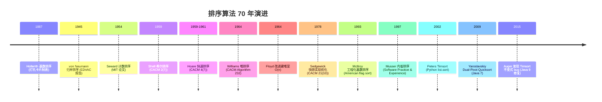

## 1. 概述与学习目标

### 1.1 什么是排序算法

**排序**（Sorting）是计算机科学中最基础、最频繁的操作之一——将一组数据按特定顺序（升序或降序）重新排列。Donald Knuth 在 *The Art of Computer Programming* Vol.3《Sorting and Searching》§5 中将排序分为三大类：

1. **内部排序**（§5.2 Internal Sorting）：数据全部驻留内存，包括插入类（插入、希尔）、交换类（冒泡、快排）、选择类（选择、堆排）、归并类（归并）、分布类（计数、基数、桶）；
2. **外部排序**（§5.3 External Sorting）：数据量超过内存，需借助外存，核心是多路归并；
3. **多路归并**（§5.4 Sorting on Large Secondary Storage Devices）：磁盘排序的工程化方案，含替换选择、多步归并。

```
排序算法分类树：
                              排序
                                |
        ┌───────────┬───────────┴───────────┬────────────┐
    内部排序     外部排序                分布排序          混合排序
        │           │                       │                │
   ┌────┴────┐  多路归并              ┌─────┴─────┐    ┌─────┴─────┐
  比较排序  非比较                       │           │  内省排序  Timsort
   Ω(n log n)                          │           │  (Musser 1997) (Peters 2002)
     │                                 │           │
  ┌──┴──┐                          计数排序    基数排序
  插入类 交换类                        O(n+k)     O(d(n+k))
  │     │                                │
  插入   冒泡                              └── 桶排序
  希尔   快排                                  O(n+k) 平均
        │
       堆排
       (选择类)
        │
       归并
       (归并类)
```

**比较排序下界**（Lower Bound of Comparison Sort）：任何基于比较的排序算法在最坏情况下至少需要 $\Omega(n \log n)$ 次比较。这一理论下界由决策树模型证明（详见 §3.2），意味着归并排序与堆排序已经达到了比较排序的最优。

**非比较排序的突破**：当元素具有特殊性质（如整数范围有限），可以绕过 $\Omega(n \log n)$ 下界实现 $O(n)$ 排序——计数排序 $O(n+k)$、基数排序 $O(d(n+k))$、桶排序 $O(n+k)$。这类算法牺牲了通用性（要求数值型或可分配的元素），换取线性时间复杂度。

> 一句话定义：**排序 = 将数据集按序重排；比较排序下界 $\Omega(n \log n)$ 由决策树证明，归并/堆排达此下界；非比较排序利用元素性质突破至 $O(n)$；工业级实现如 Timsort、introsort 通过混合多种算法兼顾最坏与平均性能。**

### 1.2 学习目标

完成本文档学习后，你将能够：

1. **记忆**冒泡 $O(n^2)$、选择 $O(n^2)$、插入 $O(n^2)$ 平均/$O(n)$ 最优、希尔 $O(n^{1.3})$ 经验、归并 $O(n \log n)$、堆排 $O(n \log n)$、快排 $O(n \log n)$ 平均/$O(n^2)$ 最坏、计数 $O(n+k)$、基数 $O(d(n+k))$、桶 $O(n+k)$ 的形式化复杂度，复述稳定性与原地性差异；
2. **理解** von Neumann 1945 EDVAC 报告归并排序、Shell 1959 CACM 2(7):30-32 希尔排序、Hoare 1961 CACM 4(7):321 与 Computer Journal 5(1):10-15 快速排序、Williams 1964 CACM Algorithm 232 堆排序、Musser 1997 Software: Practice and Experience 27(8):983-993 内省排序、Peters 2002 Timsort 的历史脉络，说明不同排序算法的设计动机；
3. **应用**冒泡（含鸡尾酒优化）、选择、插入（含二分插入）、希尔（含 Knuth/Pratt/Sedgewick 增量序列）、归并（自顶向下与自底向上）、堆排、快排（Lomuto/Hoare/三路/随机化/双轴）编写可运行的 Python/C++/Java 代码，解决 LeetCode 912 排序数组、LeetCode 215 第 K 大、LeetCode 56 合并区间、LeetCode 179 最大数、LeetCode 315 计算右侧小于当前元素的个数等问题；
4. **分析**比较排序 $\Omega(n \log n)$ 下界的决策树证明（$2^h \geq n!$、Stirling 公式 $n! \approx (n/e)^n \sqrt{2\pi n}$）、快排平均 $O(n \log n)$ 的期望分析、Timsort 复杂度证明，掌握"决策树归约、期望分析、势能分析"三大核心论证方法；
5. **评估**各排序算法在"小数据 vs 大数据"、"内存受限 vs 内存充裕"、"稳定 vs 不稳定"、"通用数据 vs 特殊数据"维度上的优劣，识别 Python Timsort、Java DualPivotQuicksort、C++ std::sort 内省排序、V8 Timsort 的选型动机；
6. **对比** 12 种排序算法在最好/平均/最坏时间、空间、稳定性、原地性、自适应性、缓存友好性维度的差异；
7. **创造**性设计基于排序的开源项目解决方案，如数据库外部归并排序、MapReduce 分布式排序、Stream 分位数估算、Top-K 流式聚合、Skew-Histogram 数据倾斜检测。

### 1.3 术语表

| 术语 | 英文 | 定义 |
| ---- | ---- | ---- |
| 排序 | sort | 将数据按特定顺序重排 |
| 比较排序 | comparison sort | 通过元素间比较决定顺序的算法 |
| 非比较排序 | non-comparison sort | 利用元素性质（如整数范围）排序 |
| 稳定性 | stability | 相等元素的相对顺序是否保持 |
| 原地排序 | in-place sort | 仅需 $O(1)$ 额外空间的排序 |
| 自适应 | adaptive | 对部分有序输入性能更优 |
| 内部排序 | internal sort | 数据全部驻留内存 |
| 外部排序 | external sort | 数据超过内存需借助外存 |
| 关键字 | key | 用于排序的属性 |
| 增量序列 | gap sequence | 希尔排序的步长序列 |
| 主元 | pivot | 快排中用于分区的元素 |
| 分区 | partition | 快排中将数组分为两部分 |
| 决策树 | decision tree | 比较排序的理论模型 |
| 自然 run | natural run | Timsort 中检测到的已有序片段 |
| 双轴 | dual-pivot | 双主元快排变体 |
| 多路归并 | k-way merge | 同时合并 k 个有序序列 |

### 1.4 排序算法全景对比表

| 算法 | 最好 | 平均 | 最坏 | 空间 | 稳定 | 原地 | 自适应 |
| ---- | ---- | ---- | ---- | ---- | ---- | ---- | ---- |
| 冒泡排序 | $O(n)$ | $O(n^2)$ | $O(n^2)$ | $O(1)$ | 是 | 是 | 是 |
| 鸡尾酒排序 | $O(n)$ | $O(n^2)$ | $O(n^2)$ | $O(1)$ | 是 | 是 | 是 |
| 选择排序 | $O(n^2)$ | $O(n^2)$ | $O(n^2)$ | $O(1)$ | 否 | 是 | 否 |
| 插入排序 | $O(n)$ | $O(n^2)$ | $O(n^2)$ | $O(1)$ | 是 | 是 | 是 |
| 二分插入排序 | $O(n)$ | $O(n^2)$ | $O(n^2)$ | $O(1)$ | 是 | 是 | 是 |
| 希尔排序 | $O(n \log n)$ | $O(n^{1.3})$ | $O(n^{4/3})$ | $O(1)$ | 否 | 是 | 部分 |
| 归并排序 | $O(n \log n)$ | $O(n \log n)$ | $O(n \log n)$ | $O(n)$ | 是 | 否 | 否 |
| 堆排序 | $O(n \log n)$ | $O(n \log n)$ | $O(n \log n)$ | $O(1)$ | 否 | 是 | 否 |
| 快排（随机化） | $O(n \log n)$ | $O(n \log n)$ | $O(n^2)$ | $O(\log n)$ | 否 | 是 | 否 |
| 三路快排 | $O(n)$ | $O(n \log n)$ | $O(n^2)$ | $O(\log n)$ | 否 | 是 | 是（多重复键） |
| 计数排序 | $O(n+k)$ | $O(n+k)$ | $O(n+k)$ | $O(k)$ | 是 | 否 | 否 |
| 基数排序（LSD） | $O(d(n+k))$ | $O(d(n+k))$ | $O(d(n+k))$ | $O(n+k)$ | 是 | 否 | 否 |
| 桶排序 | $O(n+k)$ | $O(n+k)$ | $O(n^2)$ | $O(n+k)$ | 是 | 否 | 否 |
| 内省排序 | $O(n \log n)$ | $O(n \log n)$ | $O(n \log n)$ | $O(\log n)$ | 否 | 是 | 部分 |
| Timsort | $O(n)$ | $O(n \log n)$ | $O(n \log n)$ | $O(n)$ | 是 | 否 | 是 |

### 1.5 适用场景与不适用场景

| 场景 | 是否适合 | 说明 |
| ---- | -------- | ---- |
| 通用对象排序（稳定） | 适合 | Timsort 是 Python/Java 对象排序默认 |
| 通用基础类型排序 | 适合 | introsort（C++）、DualPivotQuicksort（Java） |
| 小数据（n < 50） | 适合 | 插入排序常数小，Timsort/introsort 在此规模回退 |
| 部分有序数据 | 适合 | Timsort、插入排序自适应 |
| 内存受限（嵌入式） | 适合 | 堆排 $O(1)$ 空间 |
| 大数据外部排序 | 适合 | 多路归并 + 替换选择 |
| 整数且值域有限 | 适合 | 计数排序 $O(n+k)$ |
| 浮点数均匀分布 | 适合 | 桶排序 $O(n+k)$ 平均 |
| 字符串定长 | 适合 | 基数排序 $O(d(n+k))$ |
| 大量重复键 | 适合 | 三路快排 $O(n)$ |
| 严格最坏保证 | 适合 | 堆排、归并 |
| 严格要求稳定 + 原地 | 不适合 | 稳定排序大多需 $O(n)$ 空间 |
| 元素较大（结构体） | 部分适合 | 应改用指针排序或索引排序 |

> **跨模块引用**：排序与查找的耦合参见 [查找算法](algorithm/查找算法)；堆排序的堆数据结构参见 [堆与优先队列](algorithm/堆与优先队列)；分治思想的归并与快排参见 [分治算法](algorithm/分治算法)；外部排序与 MapReduce 参见 [搜索算法](algorithm/搜索算法)。

---

## 2. 历史动机与演进

### 2.1 前排序时代：Hollerith 1890 与基数排序的起源

排序的历史远早于电子计算机。**1887 年**，Herman Hollerith 为美国 1890 年人口普查设计的打孔卡片制表机首次应用了基数排序思想——按卡片上不同位的孔位分桶，逐位排序即可得到整体有序结果。这次普查仅用 6 周完成（1890 年 census 比手工处理 1880 年 census 的 8 年缩短 50 倍以上），Hollerith 创立的公司即 IBM 前身。

打孔卡片排序机在 20 世纪上半叶是数据处理的标配，IBM 082 Sorter、IBM 083 Sorter 直到 1980 年代仍在使用。这一历史深刻影响了 Knuth TAOCP Vol.3 §5.2.5 对基数排序的详细论述。

### 2.2 von Neumann 1945：归并排序的诞生

**1945 年**，John von Neumann 在著名的 EDVAC 报告《First Draft of a Report on the EDVAC》中描述了归并排序——这是首个 $O(n \log n)$ 算法，比快排早 14 年。von Neumann 关注归并排序是因为它在磁带存储上自然适配（外部排序）。Knuth 在 TAOCP Vol.3 §5.2.4 详细考据了归并排序的早期历史。

归并排序的分治思想奠定了后续算法的设计范式：将问题分解为子问题，递归求解后合并。这一思想在 Strassen 矩阵乘法、Karatsuba 大数乘法、FFT 中反复出现。

### 2.3 Shell 1959：突破 O(n²) 的尝试

**1959 年 7 月**，Donald L. Shell 在 *Communications of the ACM* 2(7):30-32《A High-Speed Sorting Procedure》中提出希尔排序——这是首个突破 $O(n^2)$ 的排序算法。Shell 的核心洞察是：插入排序在部分有序数据上极快，故先用大步长做粗排序，再逐步减小步长做精排序，最后用步长 1 完成最终插入排序。

Shell 原始增量序列为 $\{n/2, n/4, ..., 1\}$，复杂度 $O(n^{3/2})$。后续研究者提出更优序列：
- **Knuth 序列** $h_k = 3h_{k-1} + 1$（即 $1, 4, 13, 40, 121, ...$）：$O(n^{1.5})$；
- **Pratt 序列**（1971）：形如 $2^p 3^q$ 的所有数：$O(n \log^2 n)$；
- **Sedgewick 序列**（1986）：$\{1, 5, 19, 41, 109, ...\}$：$O(n^{4/3})$；
- **Ciura 序列**（2001）：$\{1, 4, 10, 23, 57, 132, 301, 701, 1750\}$：实测最优。

希尔排序虽已被快排、Timsort 取代，但其"递减增量"思想影响了多层索引、跳表等数据结构的设计。

### 2.4 Hoare 1959-1961：快速排序的诞生

**1959 年**，C. A. R. Hoare（Tony Hoare）在莫斯科大学访问期间开发 ALGOL 60 翻译器时发明快速排序，目的是高效翻译俄语句子到英语的词序调整。**1961 年 7 月**，Hoare 在 *Communications of the ACM* 4(7):321 发表《Algorithm 64: Quicksort》，并在 *The Computer Journal* 5(1):10-15 发表完整论文《Quicksort》。

快排的核心创新是**分治+原地分区**：选择主元 pivot，将数组分为 $\leq$ pivot 和 $>$ pivot 两部分，递归排序。平均 $O(n \log n)$ 但最坏 $O(n^2)$（当 pivot 总是选到最值时）。Hoare 1980 年因"在编程语言定义和设计方面的根本性贡献"获 Turing Award，快排是其代表性成就之一。

快排的后续优化包括：
- **Sedgewick 1978** CACM 21(10):847-857《Implementing quicksort programs》：分析并优化快排实现；
- **三路快排**（Dijkstra Dutch National Flag 问题）：处理大量重复键 $O(n)$；
- **随机化快排**：避免最坏情况；
- **Dual-Pivot Quicksort**（Vladimir Yaroslavskiy 2009）：Java 7 起作为 `Arrays.sort(int[])` 默认实现。

### 2.5 Williams 1964 与 Floyd 1964：堆排序

**1964 年 6 月**，J. W. J. Williams 在 *Communications of the ACM* 7(6):347-348《Algorithm 232: Heapsort》中提出堆排序——首个最坏 $O(n \log n)$ + 原地的排序算法。同年 12 月，Robert W. Floyd 在 CACM 7(12):701《Algorithm 245: Treesort 3》中改进建堆过程至 $O(n)$（Floyd 建堆）。

堆排序填补了快排（最坏 $O(n^2)$）与归并（需 $O(n)$ 空间）的空白。Williams 提出堆排序是为英国 Elliot Brothers 公司的磁带排序需求，堆数据结构本身成为优先队列的核心实现。

### 2.6 Musser 1997：内省排序

**1997 年**，David R. Musser 在 *Software: Practice and Experience* 27(8):983-993《Introspective Sorting and Selection Algorithms》中提出**内省排序**（introsort）。Musser 的洞察是：快排平均快但最坏 $O(n^2)$，堆排最坏 $O(n \log n)$ 但常数大、缓存差——若在快排递归过深时切换到堆排，可同时获得两者的优点。

introsort 的核心逻辑：
1. 用快排开始排序；
2. 递归深度超过 $2\log_2 n$ 时切换到堆排；
3. 子数组长度 $< 16$ 时切换到插入排序。

SGI STL 在 1997 年采纳 introsort 作为 `std::sort` 实现，GNU libstdc++、LLVM libc++、Microsoft STL、Boost.Sort 均沿用。introsort 是 C++ 工业级排序的事实标准。

### 2.7 Peters 2002：Timsort

**2002 年**，Tim Peters 在 Python 开发邮件列表发布 Timsort 算法，详细文档 `listsort.txt` 长达 70+ 页。Peters 的洞察是：**真实世界的部分有序数据很常见**，应主动检测并利用已有序片段（natural runs）。

Timsort 的核心流程：
1. 扫描数组检测升序/降序 run，降序 run 反转为升序；
2. run 长度 < `minrun`（通常 32-64）时用二分插入排序扩展；
3. 用归并栈（merge stack）维护 run，满足"栈顶三 run 长度不变式"时合并；
4. 重复直到整个数组为一个 run。

Timsort 是**稳定排序**，最坏 $O(n \log n)$，最好 $O(n)$（已有序数据）。自 **Python 2.3**（2003）起成为 `list.sort` 默认实现，**Java 7** 起作为对象排序（`Arrays.sort(Object[])`），**Android 平台**、**V8 7.0+**（2018）、**Rust `slice::sort`** 均采用。

**2015 年**，Auger-Nicaud-Pivoteau 在 arXiv:1805.04154 发现 Java 7 Timsort 实现的合并不变式有 bug，可能在特定输入下触发数组越界，Java 9 修复。这一事件印证了"实现复杂度是算法采用的隐形门槛"。

### 2.8 关键历史决策



**9 条关键设计决策**：

1. **比较 vs 非比较**：von Neumann 选择比较排序保证通用性；Hollerith/Seward 选择非比较排序追求线性时间；
2. **分治 vs 增量**：归并与快排选择分治；插入与冒泡选择增量；
3. **递归 vs 迭代**：归并与快排递归；堆排、希尔、自底向上归并迭代；
4. **稳定 vs 不稳定**：归并、计数、基数稳定；快排、堆排、选择、希尔不稳定；
5. **原地 vs 辅助空间**：快排、堆排、插入原地 $O(1)$；归并需 $O(n)$；
6. **平均 vs 最坏**：快排平均 $O(n \log n)$ 最坏 $O(n^2)$；堆排、归并最坏 $O(n \log n)$；
7. **自适应 vs 非自适应**：Timsort、插入排序对部分有序数据加速；堆排、选择排序非自适应；
8. **混合 vs 纯算法**：introsort 混合快排+堆排+插入；Timsort 混合归并+二分插入；
9. **缓存友好 vs 缓存不友好**：堆排缓存不友好（跨层访问）；快排、归并缓存友好（顺序访问）。

---

## 3. 形式化定义

### 3.1 排序问题的形式化定义

**定义**（排序问题）：给定 $n$ 个元素的序列 $A = [a_1, a_2, \dots, a_n]$ 与一个全序关系 $\leq$（满足自反性、反对称性、传递性），排序问题是找到一个排列 $\sigma: \{1, 2, \dots, n\} \to \{1, 2, \dots, n\}$，使得：
$$A[\sigma(1)] \leq A[\sigma(2)] \leq \dots \leq A[\sigma(n)]$$

**稳定性形式化**：若 $A[i] = A[j]$ 且 $i < j$，则排序后 $\sigma^{-1}(i) < \sigma^{-1}(j)$。即相等元素的相对顺序保持不变。

**比较排序的抽象**：比较排序可建模为函数 `compare(a, b) -> {-1, 0, 1}`，仅通过该函数访问元素。任何比较排序对应一棵决策树（详见 §3.2）。

### 3.2 比较排序下界的决策树证明

**定理**（比较排序下界）：任何基于比较的排序算法在最坏情况下至少需要 $\Omega(n \log n)$ 次比较。

**证明**（决策树方法）：

1. **决策树模型**：将比较排序的执行过程建模为一棵二叉决策树。每个内部节点表示一次比较 `compare(A[i], A[j])`，左子树对应 $A[i] \leq A[j]$，右子树对应 $A[i] > A[j]$。每个叶子节点对应一种输出排列。

2. **叶子数下界**：$n$ 个元素共有 $n!$ 种排列。为了能输出所有可能排列，决策树至少需要 $n!$ 个叶子节点（否则某排列无法被算法产生）。

3. **高度与叶子数关系**：高度为 $h$ 的二叉树最多有 $2^h$ 个叶子。故 $2^h \geq n!$，即 $h \geq \log_2(n!)$。

4. **Stirling 公式**：
   $$\log_2(n!) = \sum_{k=1}^{n} \log_2 k \approx n \log_2 n - n \log_2 e + \frac{1}{2} \log_2(2\pi n) = \Theta(n \log n)$$
   
   更精确地，Stirling 公式为 $n! \approx (n/e)^n \sqrt{2\pi n}$，故 $\log_2(n!) \approx n \log_2 n - n \log_2 e + O(\log n) = \Omega(n \log n)$。

5. **结论**：决策树高度 $h \geq \log_2(n!) = \Omega(n \log n)$，即最坏情况下至少需要 $\Omega(n \log n)$ 次比较。

**意义**：归并排序与堆排序在最坏情况下需要 $O(n \log n)$ 次比较，达到此下界，故它们是比较排序中渐近最优的。快速排序的平均比较次数 $2(n+1)H_n - 4n \approx 1.386 n \log_2 n$（$H_n$ 为调和级数），略高于下界但常数小。

### 3.3 快排平均复杂度的期望分析

**定理**（快排平均比较次数）：随机化快排的期望比较次数为 $E[C_n] = 2(n+1)H_n - 4n = O(n \log n)$，其中 $H_n = \sum_{k=1}^{n} 1/k \approx \ln n + \gamma$（$\gamma \approx 0.5772$ 为 Euler-Mascheroni 常数）。

**证明**：

设 $C_n$ 为对 $n$ 个元素排序的比较次数。主元将数组分为大小 $k$ 与 $n-1-k$ 的两部分（$k$ 等概率取 $0, 1, \dots, n-1$）：

$$E[C_n] = (n-1) + \frac{1}{n} \sum_{k=0}^{n-1} (E[C_k] + E[C_{n-1-k}])$$

其中 $(n-1)$ 是与主元比较的次数。利用对称性：

$$E[C_n] = (n-1) + \frac{2}{n} \sum_{k=0}^{n-1} E[C_k]$$

两边乘 $n$：
$$n E[C_n] = n(n-1) + 2 \sum_{k=0}^{n-1} E[C_k]$$

减去 $n-1$ 情形 $(n-1) E[C_{n-1}] = (n-1)(n-2) + 2 \sum_{k=0}^{n-2} E[C_k]$：

$$n E[C_n] - (n-1) E[C_{n-1}] = n(n-1) - (n-1)(n-2) + 2 E[C_{n-1}]$$
$$n E[C_n] = (n-1) E[C_{n-1}] + 2(n-1) + 2 E[C_{n-1}] = (n+1) E[C_{n-1}] + 2(n-1)$$

除以 $n(n+1)$：
$$\frac{E[C_n]}{n+1} = \frac{E[C_{n-1}]}{n} + \frac{2(n-1)}{n(n+1)}$$

累加求和：
$$\frac{E[C_n]}{n+1} = \sum_{k=2}^{n} \frac{2(k-1)}{k(k+1)} = 2 \sum_{k=2}^{n} \left( \frac{1}{k} - \frac{1}{k+1} \right) \cdot \frac{k}{k} $$

化简（关键步骤，利用 $\frac{k-1}{k(k+1)} = \frac{1}{k} - \frac{1}{k+1} - \frac{1}{k(k+1)}$ 实际上更简洁的处理）：

$$\frac{E[C_n]}{n+1} = 2 \sum_{k=1}^{n} \frac{1}{k+1} - \frac{2n}{n+1} + 0 = 2 H_{n+1} - 2 - \frac{2n}{n+1}$$

故：
$$E[C_n] = (n+1) \cdot (2 H_{n+1} - 2 - \frac{2n}{n+1}) = 2(n+1) H_n - 4n$$

证毕。

**渐近展开**：$H_n = \ln n + \gamma + O(1/n)$，故 $E[C_n] \approx 2(n+1) \ln n \approx 2 n \ln n = 2 n \log_2 n \cdot \ln 2 \approx 1.386 n \log_2 n$。

这与下界 $n \log_2 n$ 相比仅高 $38.6\%$，是快排在工业级排序中经久不衰的核心原因。

### 3.4 Timsort 复杂度证明

Timsort 的复杂度分析依赖**run 长度与归并栈不变式**。

**定义**（minrun）：Timsort 设最小 run 长度为 `minrun`，取值范围 32-64，使 $n / \text{minrun} \approx 2^k$（或略小）。

**归并栈不变式**：栈顶三 run 长度 $A, B, C$（$A$ 在栈顶）需满足：
- $A > B + C$
- $B > C$

若违反任一条件则合并 $A$ 与 $B$（取较小者）。这一不变式保证栈中 run 长度呈几何级数增长，栈深度 $O(\log n)$。

**定理**（Timsort 复杂度）：Timsort 最坏 $O(n \log n)$，最好 $O(n)$。

**证明**（概要）：
- **最好情形**（已有序）：扫描一次得一个长度 $n$ 的 run，无需合并，$O(n)$；
- **最坏情形**：run 长度全为 `minrun`，栈深度 $O(n/\text{minrun}) = O(n/32)$，每层归并代价 $O(n)$，总复杂度 $O(n \log n)$。

更精细的分析（Auger et al. 2015）证明 Timsort 最坏比较次数上界为 $n \log_2 n - n \log_2 \phi + O(n)$（$\phi = (1+\sqrt{5})/2$），略优于归并排序的 $n \log_2 n - n + O(1)$。

### 3.5 稳定性的形式化保证

**定义**（稳定排序）：排序算法 $\mathcal{A}$ 是稳定的，当且仅当对任意输入 $A$ 与任意相等对 $A[i] = A[j]$（$i < j$），$\mathcal{A}(A)$ 输出中 $\sigma^{-1}(i) < \sigma^{-1}(j)$。

**稳定性的工程价值**：
1. **多关键字排序**：先按次要关键字排序，再按主要关键字稳定排序，即可实现多关键字排序；
2. **数据库 ORDER BY**：SQL 标准要求 ORDER BY 稳定（虽然 SQL 标准未显式规定，但工业实现均稳定）；
3. **UI 列表排序**：用户先按时间排序再按作者排序，期望保留时间顺序的稳定性。

**各排序的稳定性分析**：
- **冒泡、插入、归并、计数、基数、桶**：稳定（实现正确时）；
- **选择、希尔、快排、堆排**：不稳定（存在反例）。

**选择排序不稳定的反例**：$[5_a, 5_b, 2]$，第一轮选 $2$ 与 $5_a$ 交换得 $[2, 5_b, 5_a]$，破坏了 $5_a$ 与 $5_b$ 的相对顺序。

**快排不稳定的反例**：$[3_a, 2, 3_b, 1]$，以 $3_a$ 为主元，分区后 $3_b$ 可能被换到 $3_a$ 之前。

---

## 4. 冒泡排序

### 4.1 算法描述

冒泡排序（Bubble Sort）通过反复遍历数组，比较相邻元素并在逆序时交换，使大元素逐步"冒泡"到末尾。每轮遍历将当前未排序部分的最大值推到正确位置。

```
初始: [5, 3, 8, 1, 2]
第1轮: [3, 5, 1, 2, 8] -- 8 冒泡到末尾
第2轮: [3, 1, 2, 5, 8] -- 5 冒泡到倒数第二
第3轮: [1, 2, 3, 5, 8] -- 3 冒泡到倒数第三
第4轮: [1, 2, 3, 5, 8] -- 无交换，提前终止
```

### 4.2 Python 实现

```python
from typing import List


def bubble_sort(arr: List[int]) -> List[int]:
    """
    冒泡排序（含提前终止优化）
    
    Args:
        arr: 待排序数组
        
    Returns:
        排序后的数组（原地修改）
        
    Time:  最好 O(n)，平均 O(n^2)，最坏 O(n^2)
    Space: O(1)
    Stable: True
    """
    n = len(arr)
    for i in range(n - 1):
        swapped = False
        # 每轮将最大元素冒泡到 n-1-i 位置
        for j in range(n - 1 - i):
            if arr[j] > arr[j + 1]:
                arr[j], arr[j + 1] = arr[j + 1], arr[j]
                swapped = True
        # 若某轮无交换，说明数组已有序
        if not swapped:
            break
    return arr


def cocktail_sort(arr: List[int]) -> List[int]:
    """
    鸡尾酒排序（双向冒泡）
    
    交替从左到右和从右到左遍历，加速处理"乌龟"（尾部小值）问题。
    
    Args:
        arr: 待排序数组
        
    Returns:
        排序后的数组
        
    Time:  最好 O(n)，平均 O(n^2)，最坏 O(n^2)
    Space: O(1)
    Stable: True
    """
    n = len(arr)
    left, right = 0, n - 1
    while left < right:
        swapped = False
        # 从左到右，将最大值冒泡到 right
        for i in range(left, right):
            if arr[i] > arr[i + 1]:
                arr[i], arr[i + 1] = arr[i + 1], arr[i]
                swapped = True
        right -= 1
        # 从右到左，将最小值冒泡到 left
        for i in range(right, left, -1):
            if arr[i] < arr[i - 1]:
                arr[i], arr[i - 1] = arr[i - 1], arr[i]
                swapped = True
        left += 1
        if not swapped:
            break
    return arr
```

### 4.3 C++ 实现

```cpp
#include <vector>
#include <utility>

// 冒泡排序（含提前终止）
void bubbleSort(std::vector<int>& arr) {
    int n = arr.size();
    for (int i = 0; i < n - 1; ++i) {
        bool swapped = false;
        for (int j = 0; j < n - 1 - i; ++j) {
            if (arr[j] > arr[j + 1]) {
                std::swap(arr[j], arr[j + 1]);
                swapped = true;
            }
        }
        if (!swapped) break;
    }
}
```

### 4.4 Java 实现

```java
public class BubbleSort {
    
    /**
     * 冒泡排序（含提前终止）
     * @param arr 待排序数组
     */
    public static void bubbleSort(int[] arr) {
        int n = arr.length;
        for (int i = 0; i < n - 1; i++) {
            boolean swapped = false;
            for (int j = 0; j < n - 1 - i; j++) {
                if (arr[j] > arr[j + 1]) {
                    int tmp = arr[j];
                    arr[j] = arr[j + 1];
                    arr[j + 1] = tmp;
                    swapped = true;
                }
            }
            if (!swapped) break;
        }
    }
}
```

### 4.5 复杂度分析

| 情况 | 比较次数 | 交换次数 | 时间 |
| ---- | ---- | ---- | ---- |
| 最好（已有序） | $n-1$ | $0$ | $O(n)$ |
| 平均 | $n(n-1)/4$ | $n(n-1)/4$ | $O(n^2)$ |
| 最坏（逆序） | $n(n-1)/2$ | $n(n-1)/2$ | $O(n^2)$ |

**空间** $O(1)$，**稳定**，**原地**，**自适应**（带提前终止优化）。

### 4.6 工程价值与局限

冒泡排序在实际工程中**几乎不使用**，原因：
1. 平均 $O(n^2)$ 慢于插入排序（常数更大）；
2. 交换次数与比较次数相等，对大元素（结构体）效率差；
3. CPU 缓存利用差（频繁相邻访问，但每次访问都触发比较+交换）。

**教学价值**：冒泡排序是入门排序的最佳教学算法，因其简单性揭示了排序的核心要素：比较、交换、循环不变式。

---

## 5. 选择排序与插入排序

### 5.1 选择排序

**算法**：每轮选出剩余元素中的最小值放到已排序末尾。

```python
def selection_sort(arr: list[int]) -> list[int]:
    """
    选择排序
    
    Time:  最好/平均/最坏 O(n^2)
    Space: O(1)
    Stable: False
    """
    n = len(arr)
    for i in range(n - 1):
        min_idx = i
        for j in range(i + 1, n):
            if arr[j] < arr[min_idx]:
                min_idx = j
        if min_idx != i:
            arr[i], arr[min_idx] = arr[min_idx], arr[i]
    return arr
```

**特点**：
- 比较次数固定 $n(n-1)/2$，交换次数最多 $n-1$ 次；
- **不稳定**（如 $[5_a, 5_b, 2]$，$5_a$ 与 $2$ 交换破坏 $5_a, 5_b$ 顺序）；
- **非自适应**（无论输入如何都执行相同次数）；
- **适合指针排序**：当元素较大但指针小时，交换指针比交换元素高效。

### 5.2 插入排序

**算法**：模拟扑克牌整理过程，将新牌插入已排好的手牌中。

```python
def insertion_sort(arr: list[int]) -> list[int]:
    """
    插入排序
    
    Time:  最好 O(n)，平均 O(n^2)，最坏 O(n^2)
    Space: O(1)
    Stable: True
    Adaptive: True
    """
    for i in range(1, len(arr)):
        key = arr[i]
        j = i - 1
        # 将 key 插入到 arr[0..i-1] 的正确位置
        while j >= 0 and arr[j] > key:
            arr[j + 1] = arr[j]
            j -= 1
        arr[j + 1] = key
    return arr


def binary_insertion_sort(arr: list[int]) -> list[int]:
    """
    二分插入排序
    
    用二分查找确定插入位置，比较次数 O(n log n)，但移动次数仍 O(n^2)。
    
    Time:  最好 O(n)，平均 O(n^2)，最坏 O(n^2)
    Space: O(1)
    Stable: True
    """
    for i in range(1, len(arr)):
        key = arr[i]
        # 二分查找插入位置
        left, right = 0, i
        while left < right:
            mid = (left + right) // 2
            if arr[mid] <= key:
                left = mid + 1
            else:
                right = mid
        # 将 arr[left..i-1] 右移一位
        for j in range(i, left, -1):
            arr[j] = arr[j - 1]
        arr[left] = key
    return arr
```

**特点**：
- **最好 $O(n)$**：已有序时每轮仅比较一次；
- **平均 $O(n^2)$**：约 $n^2/4$ 次比较与移动；
- **稳定、原地、自适应**；
- **小数据最优**：$n < 50$ 时通常优于快排（常数小，无递归开销）；
- **Timsort 与 introsort 的小数据回退方案**。

**为什么二分插入排序仍 $O(n^2)$？** 虽然二分查找将比较次数降到 $O(\log i)$，但元素移动仍需 $O(i)$ 次（数组连续存储特性）。二分插入排序在元素较大、比较成本高的场景（如字符串）有优势。

---

## 6. 希尔排序

### 6.1 算法描述

希尔排序（Shell Sort）通过**递减增量**分组插入排序：先用大步长做粗排序，再逐步减小步长做精排序，最后用步长 1 完成最终插入排序。这突破了 $O(n^2)$ 的限制，因为大步长阶段将远距离元素快速归位，使后续小步长插入排序面对的是"近似有序"数据，而插入排序在近似有序数据上接近 $O(n)$。

```
增量序列 {5, 3, 1}，数组 [13, 14, 94, 33, 82, 25, 59, 94, 65, 23, 45, 27, 73, 25, 39, 10]

gap=5 分组（5 个子序列）：
  13 25 45 10  -> 10 13 25 45
  14 59 27     -> 14 27 59
  94 94 73     -> 73 94 94
  33 65 25     -> 25 33 65
  82 23 39     -> 23 39 82
  合并后: [10, 14, 73, 25, 23, 13, 27, 94, 33, 39, 25, 59, 94, 65, 82, 45]

gap=3 分组（3 个子序列），各组插入排序
gap=1 最终插入排序
```

### 6.2 Python 实现

```python
def shell_sort(arr: list[int], gaps: str = "ciura") -> list[int]:
    """
    希尔排序
    
    Args:
        arr: 待排序数组
        gaps: 增量序列名，可选 "shell" "knuth" "sedgewick" "ciura"
        
    Returns:
        排序后的数组
        
    Time:  依赖增量序列，Ciura 实测最快约 O(n^{1.3})
    Space: O(1)
    Stable: False
    """
    n = len(arr)
    gap_sequences = {
        "shell":     [n // 2, n // 4, ..., 1],  # 原始版本，O(n^{3/2})
        "knuth":     [1, 4, 13, 40, 121, 364, 1093, ...],  # 3h+1
        "sedgewick": [1, 5, 19, 41, 109, 209, 505, 929, 2161, ...],
        "ciura":     [1, 4, 10, 23, 57, 132, 301, 701, 1750],  # 实测最优
    }
    
    if gaps == "shell":
        gap_list = []
        g = n // 2
        while g > 0:
            gap_list.append(g)
            g //= 2
    elif gaps == "knuth":
        gap_list = []
        g = 1
        while g < n:
            gap_list.append(g)
            g = 3 * g + 1
        gap_list.reverse()
    elif gaps == "sedgewick":
        gap_list = []
        k = 0
        while True:
            # Sedgewick 1986: 4^k + 3*2^(k-1) + 1
            if k == 0:
                g = 1
            else:
                g = 4 ** k + 3 * 2 ** (k - 1) + 1
            if g >= n:
                break
            gap_list.append(g)
            k += 1
        gap_list.reverse()
    else:  # ciura
        gap_list = [g for g in [1750, 701, 301, 132, 57, 23, 10, 4, 1] if g < n]
        if not gap_list:
            gap_list = [1]
    
    for gap in gap_list:
        # 对每个子序列做插入排序
        for i in range(gap, n):
            key = arr[i]
            j = i - gap
            while j >= 0 and arr[j] > key:
                arr[j + gap] = arr[j]
                j -= gap
            arr[j + gap] = key
    return arr
```

### 6.3 增量序列与复杂度

| 增量序列 | 公式 | 复杂度 | 提出者 |
| ---- | ---- | ---- | ---- |
| Shell 原始 | $n/2, n/4, \dots, 1$ | $O(n^{3/2})$ | Shell 1959 |
| Knuth | $1, 4, 13, 40, \dots, 3h+1$ | $O(n^{3/2})$ | Knuth 1973 |
| Pratt | $2^p 3^q$ 所有数 | $O(n \log^2 n)$ | Pratt 1971 |
| Sedgewick | $4^k + 3 \cdot 2^{k-1} + 1$ | $O(n^{4/3})$ | Sedgewick 1986 |
| Ciura | $\{1, 4, 10, 23, 57, 132, 301, 701, 1750\}$ | 实测最优 | Ciura 2001 |

**希尔排序不稳定**：相同元素可能因步长分组跨越彼此，破坏相对顺序。

**工程地位**：希尔排序因实现简单、原地、$O(n^{1.3})$ 在嵌入式系统、低开销场景仍被使用。Linux kernel `lib/sort.c` 在 2017 年前使用希尔排序（后改用 introsort 变体）。

---

## 7. 归并排序

### 7.1 算法描述

归并排序（Merge Sort）由 von Neumann 1945 年发明，是首个 $O(n \log n)$ 排序算法。核心思想是**分治**：将数组对半分，递归排序后合并两个有序子数组。

```
[38, 27, 43, 3, 9, 82, 10]
        分治
[38, 27, 43, 3] [9, 82, 10]
[38, 27] [43, 3] [9, 82] [10]
[38] [27] [43] [3] [9] [82] [10]
        合并
[27, 38] [3, 43] [9, 82] [10]
[3, 27, 38, 43] [9, 10, 82]
[3, 9, 10, 27, 38, 43, 82]
```

### 7.2 Python 实现

```python
from typing import List


def merge_sort_topdown(arr: List[int]) -> List[int]:
    """
    自顶向下归并排序（递归版）
    
    Time:  O(n log n)
    Space: O(n)
    Stable: True
    """
    if len(arr) <= 1:
        return arr
    mid = len(arr) // 2
    left = merge_sort_topdown(arr[:mid])
    right = merge_sort_topdown(arr[mid:])
    return _merge(left, right)


def _merge(left: List[int], right: List[int]) -> List[int]:
    """合并两个有序数组"""
    result = []
    i = j = 0
    while i < len(left) and j < len(right):
        # 注意：用 <= 保证稳定性（相等时取 left）
        if left[i] <= right[j]:
            result.append(left[i])
            i += 1
        else:
            result.append(right[j])
            j += 1
    result.extend(left[i:])
    result.extend(right[j:])
    return result


def merge_sort_bottomup(arr: List[int]) -> List[int]:
    """
    自底向上归并排序（迭代版）
    
    自底向上消除递归，避免栈溢出。
    
    Time:  O(n log n)
    Space: O(n)
    Stable: True
    """
    n = len(arr)
    if n <= 1:
        return arr
    width = 1
    while width < n:
        # 以 width 为单位两两合并
        for i in range(0, n, 2 * width):
            left = arr[i:i + width]
            right = arr[i + width:i + 2 * width]
            arr[i:i + 2 * width] = _merge(left, right)
        width *= 2
    return arr
```

### 7.3 C++ 实现

```cpp
#include <vector>

void mergeSortHelper(std::vector<int>& arr, std::vector<int>& tmp,
                     int left, int right) {
    if (left >= right) return;
    int mid = left + (right - left) / 2;
    mergeSortHelper(arr, tmp, left, mid);
    mergeSortHelper(arr, tmp, mid + 1, right);
    
    // 合并 arr[left..mid] 与 arr[mid+1..right]
    int i = left, j = mid + 1, k = left;
    while (i <= mid && j <= right) {
        if (arr[i] <= arr[j]) tmp[k++] = arr[i++];
        else tmp[k++] = arr[j++];
    }
    while (i <= mid) tmp[k++] = arr[i++];
    while (j <= right) tmp[k++] = arr[j++];
    for (int p = left; p <= right; ++p) arr[p] = tmp[p];
}

void mergeSort(std::vector<int>& arr) {
    if (arr.size() <= 1) return;
    std::vector<int> tmp(arr.size());
    mergeSortHelper(arr, tmp, 0, arr.size() - 1);
}
```

### 7.4 复杂度分析

**递推式**：$T(n) = 2T(n/2) + O(n)$，由主定理（case 2）得 $T(n) = O(n \log n)$。

**空间**：$O(n)$（合并时需要辅助数组）。

**比较次数**：最坏 $n \log_2 n - n + 1$，最少 $n \log_2 n / 2$（已部分有序时）。

**稳定性**：稳定（合并时相等元素取左路）。

### 7.5 工程应用

1. **Java `Arrays.sort(Object[])`**（Java 7 前）：纯归并排序；
2. **Python Timsort 的合并阶段**：检测自然 run 后归并；
3. **数据库外部排序**：多路归并 + 替换选择；
4. **MapReduce shuffle**：分布式归并排序；
5. **链表排序**：归并是链表的最佳排序方法（无随机访问，但合并 $O(1)$ 空间）。

---

## 8. 堆排序

### 8.1 算法描述

堆排序（Heapsort）由 Williams 1964 年发明，是首个最坏 $O(n \log n)$ + 原地的排序。算法分两步：
1. **建堆**：用 Floyd 自底向上建堆法 $O(n)$ 构造最大堆；
2. **排序**：反复取出堆顶（最大值）放到末尾，缩小堆，再下沉调整。

详见 [堆与优先队列](algorithm/堆与优先队列) 章节。

### 8.2 Python 实现

```python
def heap_sort(arr: list[int]) -> list[int]:
    """
    堆排序
    
    Time:  O(n log n) 最坏保证
    Space: O(1)
    Stable: False
    """
    n = len(arr)
    
    def sift_down(start: int, end: int) -> None:
        """在 arr[start..end] 范围内下沉根节点"""
        root = start
        while True:
            child = 2 * root + 1
            if child > end:
                break
            # 选较大子节点
            if child + 1 <= end and arr[child + 1] > arr[child]:
                child += 1
            if arr[root] < arr[child]:
                arr[root], arr[child] = arr[child], arr[root]
                root = child
            else:
                break
    
    # Phase 1: Floyd 自底向上建堆 O(n)
    for i in range(n // 2 - 1, -1, -1):
        sift_down(i, n - 1)
    
    # Phase 2: 反复取出堆顶放到末尾
    for i in range(n - 1, 0, -1):
        arr[0], arr[i] = arr[i], arr[0]
        sift_down(0, i - 1)
    
    return arr
```

### 8.3 复杂度分析

**建堆复杂度**（Floyd 1964）：$\sum_{h=0}^{\lfloor \log n \rfloor} \lceil n/2^{h+1} \rceil \cdot h \leq 2n = O(n)$。

**排序阶段**：$n-1$ 次下沉，每次 $O(\log n)$，共 $O(n \log n)$。

**总复杂度**：$O(n) + O(n \log n) = O(n \log n)$。

**空间**：$O(1)$（原地）。

**稳定性**：不稳定（父子节点交换可能跨过相等元素）。

**缓存不友好**：堆访问跨层（索引 $i \to 2i+1$），跳跃大，cache miss 频繁。这是堆排序实测比快排、归并慢 2-5 倍的核心原因。

### 8.4 工程应用

1. **introsort 的回退方案**：快排递归过深时切换到堆排；
2. **嵌入式系统**：$O(1)$ 空间、最坏 $O(n \log n)$，适合资源受限场景；
3. **Top-K 问题**：建堆后取前 $k$ 个，$O(n + k \log n)$；
4. **Linux kernel `lib/sort.c`**：早期希尔排序，2017 年后改用 introsort 变体。

---

## 9. 快速排序

### 9.1 算法描述

快速排序（Quicksort）由 Hoare 1959-1961 年发明，平均 $O(n \log n)$ 但最坏 $O(n^2)$，因常数小、缓存友好，是工业级排序的核心。算法分三步：
1. **选主元**（pivot）：从数组中选一个元素作为分区基准；
2. **分区**（partition）：将 $\leq$ pivot 的放左，$>$ pivot 的放右；
3. **递归**：对左右两部分递归排序。

### 9.2 分区方案

#### 9.2.1 Lomuto 分区（最简方案）

```python
def partition_lomuto(arr: list[int], low: int, high: int) -> int:
    """
    Lomuto 分区：选最右元素为主元
    
    简单但性能差：当数组已有序时每次分区不平衡，最坏 O(n^2)。
    """
    pivot = arr[high]
    i = low - 1  # i 指向 "<= pivot" 区域的最后一个元素
    for j in range(low, high):
        if arr[j] <= pivot:
            i += 1
            arr[i], arr[j] = arr[j], arr[i]
    arr[i + 1], arr[high] = arr[high], arr[i + 1]
    return i + 1


def quicksort_lomuto(arr: list[int], low: int, high: int) -> None:
    if low < high:
        p = partition_lomuto(arr, low, high)
        quicksort_lomuto(arr, low, p - 1)
        quicksort_lomuto(arr, p + 1, high)
```

#### 9.2.2 Hoare 分区（原始版本，性能更优）

```python
def partition_hoare(arr: list[int], low: int, high: int) -> int:
    """
    Hoare 分区：选最左元素为主元，双向扫描
    
    比 Lomuto 平均少 3 倍交换次数。
    """
    pivot = arr[low]
    i = low - 1
    j = high + 1
    while True:
        i += 1
        while arr[i] < pivot:
            i += 1
        j -= 1
        while arr[j] > pivot:
            j -= 1
        if i >= j:
            return j
        arr[i], arr[j] = arr[j], arr[i]


def quicksort_hoare(arr: list[int], low: int, high: int) -> None:
    if low < high:
        p = partition_hoare(arr, low, high)
        quicksort_hoare(arr, low, p)
        quicksort_hoare(arr, p + 1, high)
```

#### 9.2.3 三路快排（处理大量重复键）

```python
def partition_three_way(arr: list[int], low: int, high: int) -> tuple[int, int]:
    """
    三路分区（Dijkstra Dutch National Flag）
    
    将数组分为三部分：< pivot | == pivot | > pivot
    适合大量重复键场景，O(n) 最优。
    """
    pivot = arr[low]
    lt = low      # lt 之前是 < pivot
    gt = high     # gt 之后是 > pivot
    i = low + 1
    while i <= gt:
        if arr[i] < pivot:
            arr[lt], arr[i] = arr[i], arr[lt]
            lt += 1
            i += 1
        elif arr[i] > pivot:
            arr[i], arr[gt] = arr[gt], arr[i]
            gt -= 1
        else:
            i += 1
    return lt, gt


def quicksort_three_way(arr: list[int], low: int, high: int) -> None:
    if low < high:
        lt, gt = partition_three_way(arr, low, high)
        quicksort_three_way(arr, low, lt - 1)
        quicksort_three_way(arr, gt + 1, high)
```

#### 9.2.4 随机化快排

```python
import random


def quicksort_randomized(arr: list[int], low: int, high: int) -> None:
    """
    随机化快排：随机选主元，避免最坏情况
    
    期望复杂度 O(n log n)，且不依赖输入分布。
    """
    if low < high:
        # 随机选主元并交换到 high
        rand_idx = random.randint(low, high)
        arr[rand_idx], arr[high] = arr[high], arr[rand_idx]
        p = partition_lomuto(arr, low, high)
        quicksort_randomized(arr, low, p - 1)
        quicksort_randomized(arr, p + 1, high)
```

### 9.3 主元选择策略

| 策略 | 描述 | 优劣 |
| ---- | ---- | ---- |
| 取首/尾 | `arr[low]` 或 `arr[high]` | 简单但已有序输入退化为 $O(n^2)$ |
| 随机化 | 随机选一个 | 期望 $O(n \log n)$，不依赖输入 |
| 三数取中 | `median(arr[low], arr[mid], arr[high])` | 实战效果最好，工业级默认 |
| Tukey ninther | 9 个元素分组取中位数的中位数 | 极端数据下更稳健，stdlibc++ 使用 |
| Introselect | 递归深度过深时切换到中位数算法 | introsort 的核心思想 |

### 9.4 工程实现技巧

1. **小数据切到插入排序**：当 `high - low < 16` 时改用插入排序（常数小，无递归开销）；
2. **尾递归消除**：递归调用时先递归较小一侧，较大一侧改为循环，最坏栈深 $O(\log n)$；
3. **三数取中**：避免有序输入退化；
4. **partition 后立即检查已有序**：若一侧长度为 0，跳过递归。

### 9.5 复杂度分析

- **最好** $O(n \log n)$（主元每次都居中）；
- **平均** $O(n \log n)$（期望 $1.386 n \log_2 n$ 次比较）；
- **最坏** $O(n^2)$（主元每次都是极值，如已有序数组）；
- **空间** $O(\log n)$（递归栈，尾递归优化后）；
- **不稳定**。

### 9.6 Dual-Pivot Quicksort（Java 7+）

Vladimir Yaroslavskiy 2009 年提出双主元快排，将数组分为三部分（$< P_1$、$P_1 \leq x \leq P_2$、$> P_2$）。Java 7 起作为 `Arrays.sort(int[])`、`Arrays.sort(long[])` 等基础类型排序的默认实现。

Wild-Nebel 2012 证明 Dual-Pivot Quicksort 平均比较次数 $\frac{2}{5} n \ln n \approx 0.277 n \log_2 n$，**优于**单主元快排的 $1.386 n \log_2 n / 2 = 0.693 n \log_2 n$。

---

## 10. 非比较排序：计数、基数、桶

### 10.1 计数排序

**算法**：统计每个元素出现次数，按值域累加输出。

```python
def counting_sort(arr: list[int], max_val: int = None) -> list[int]:
    """
    计数排序
    
    Args:
        arr: 待排序数组（非负整数）
        max_val: 元素最大值，默认从 arr 推断
        
    Time:  O(n + k)，k 为值域大小
    Space: O(k)
    Stable: True（按累加计数反向填充）
    """
    if not arr:
        return arr
    if max_val is None:
        max_val = max(arr)
    
    # 统计每个值出现次数
    count = [0] * (max_val + 1)
    for x in arr:
        count[x] += 1
    
    # 累加（确定每个值的结束位置）
    for i in range(1, max_val + 1):
        count[i] += count[i - 1]
    
    # 反向填充保证稳定性
    result = [0] * len(arr)
    for x in reversed(arr):
        count[x] -= 1
        result[count[x]] = x
    
    return result
```

**应用**：
- 年龄排序（值域 0-150）；
- 字符 ASCII 排序（值域 0-127）；
- **基数排序的子过程**。

### 10.2 基数排序

**算法**：从低位到高位（LSD）或从高位到低位（MSD）按位排序，每位用计数排序。

```python
def radix_sort_lsd(arr: list[int]) -> list[int]:
    """
    LSD 基数排序（从最低位到最高位）
    
    Time:  O(d(n+k))，d 为位数，k 为基数
    Space: O(n+k)
    Stable: True
    """
    if not arr:
        return arr
    max_val = max(arr)
    exp = 1
    while max_val // exp > 0:
        arr = _counting_sort_by_digit(arr, exp)
        exp *= 10
    return arr


def _counting_sort_by_digit(arr: list[int], exp: int) -> list[int]:
    """按某一位做计数排序"""
    n = len(arr)
    count = [0] * 10
    output = [0] * n
    
    for x in arr:
        digit = (x // exp) % 10
        count[digit] += 1
    
    for i in range(1, 10):
        count[i] += count[i - 1]
    
    # 反向填充保证稳定性
    for x in reversed(arr):
        digit = (x // exp) % 10
        count[digit] -= 1
        output[count[digit]] = x
    
    return output


def radix_sort_msd(arr: list[str], digit: int = 0) -> list[str]:
    """
    MSD 基数排序（从最高位到最低位，用于字符串）
    
    适合变长字符串排序。
    """
    if len(arr) <= 1:
        return arr
    
    buckets = [[] for _ in range(256)]
    finished = []
    for s in arr:
        if digit < len(s):
            buckets[ord(s[digit])].append(s)
        else:
            finished.append(s)
    
    result = finished
    for b in buckets:
        if b:
            result.extend(radix_sort_msd(b, digit + 1))
    return result
```

**应用**：
- 手机号排序（11 位定长数字串）；
- IP 地址排序；
- 字符串字典排序（MSD）；
- 美国 1890 年人口普查（Hollerith 打孔卡片）。

### 10.3 桶排序

**算法**：将元素按值域均匀分到 $k$ 个桶，每桶内排序后合并。

```python
def bucket_sort(arr: list[float], bucket_count: int = 10) -> list[float]:
    """
    桶排序
    
    Args:
        arr: 待排序数组（浮点数 [0, 1)）
        bucket_count: 桶数
        
    Time:  平均 O(n+k)，最坏 O(n^2)（所有元素入同桶）
    Space: O(n+k)
    Stable: True（若桶内排序稳定）
    """
    if not arr:
        return arr
    
    buckets = [[] for _ in range(bucket_count)]
    for x in arr:
        idx = min(int(x * bucket_count), bucket_count - 1)
        buckets[idx].append(x)
    
    for b in buckets:
        b.sort()  # 桶内排序（用稳定排序）
    
    result = []
    for b in buckets:
        result.extend(b)
    return result
```

**应用**：
- 均匀分布的浮点数排序（如随机数）；
- 直方图统计；
- 大数据预处理分桶。

---

## 11. 工业级混合排序

### 11.1 内省排序（introsort）

**算法**（Musser 1997）：
1. 用快排开始排序（三数取中选主元）；
2. 递归深度超过 $2 \log_2 n$ 时切换到堆排（避免快排最坏 $O(n^2)$）；
3. 子数组长度 $< 16$ 时切换到插入排序（小数据常数小）。

**实现**：

```python
import math


def introsort(arr: list[int]) -> list[int]:
    """
    内省排序（introsort）
    
    Musser 1997，C++ std::sort 的核心实现。
    
    Time:  O(n log n) 最坏保证
    Space: O(log n)
    Stable: False
    """
    max_depth = 2 * int(math.log2(len(arr))) if arr else 0
    _introsort_helper(arr, 0, len(arr) - 1, max_depth)
    # 最后做一次插入排序清理小段
    _insertion_sort_range(arr, 0, len(arr) - 1)
    return arr


def _introsort_helper(arr: list[int], low: int, high: int, depth: int) -> None:
    while high - low > 16:
        if depth == 0:
            # 切换到堆排
            _heapsort_range(arr, low, high)
            return
        depth -= 1
        p = _partition_median_three(arr, low, high)
        _introsort_helper(arr, low, p - 1, depth)
        low = p + 1  # 尾递归优化


def _partition_median_three(arr: list[int], low: int, high: int) -> int:
    """三数取中选主元"""
    mid = low + (high - low) // 2
    # 排序 arr[low], arr[mid], arr[high]，取中位数到 high-1
    if arr[low] > arr[mid]:
        arr[low], arr[mid] = arr[mid], arr[low]
    if arr[low] > arr[high]:
        arr[low], arr[high] = arr[high], arr[low]
    if arr[mid] > arr[high]:
        arr[mid], arr[high] = arr[high], arr[mid]
    # 主元放到 high
    arr[mid], arr[high] = arr[high], arr[mid]
    pivot = arr[high]
    i = low - 1
    for j in range(low, high):
        if arr[j] <= pivot:
            i += 1
            arr[i], arr[j] = arr[j], arr[i]
    arr[i + 1], arr[high] = arr[high], arr[i + 1]
    return i + 1


def _heapsort_range(arr: list[int], low: int, high: int) -> None:
    """对 arr[low..high] 做堆排"""
    n = high - low + 1
    for i in range(n // 2 - 1, -1, -1):
        _sift_down(arr, low, i, n)
    for i in range(n - 1, 0, -1):
        arr[low], arr[low + i] = arr[low + i], arr[low]
        _sift_down(arr, low, 0, i)


def _sift_down(arr: list[int], base: int, start: int, size: int) -> None:
    root = start
    while True:
        child = 2 * root + 1
        if child >= size:
            break
        if child + 1 < size and arr[base + child + 1] > arr[base + child]:
            child += 1
        if arr[base + root] < arr[base + child]:
            arr[base + root], arr[base + child] = arr[base + child], arr[base + root]
            root = child
        else:
            break


def _insertion_sort_range(arr: list[int], low: int, high: int) -> None:
    for i in range(low + 1, high + 1):
        key = arr[i]
        j = i - 1
        while j >= low and arr[j] > key:
            arr[j + 1] = arr[j]
            j -= 1
        arr[j + 1] = key
```

**采用 introsort 的工业实现**：
- GNU libstdc++ `std::sort`；
- LLVM libc++ `std::sort`；
- Microsoft VC++ STL `std::sort`；
- Boost.Sort `spreadsort`；
- Rust `slice::sort_unstable`（pdqsort 变体）。

### 11.2 Timsort

**算法**（Peters 2002）：
1. 扫描数组检测升序/降序 run，降序 run 反转；
2. run 长度 $<$ `minrun`（通常 32-64）时用二分插入排序扩展；
3. 用归并栈合并 run，维护"栈顶三 run 长度不变式"；
4. 重复直到整个数组为一个 run。

**简化实现**：

```python
def timsort_simple(arr: list[int]) -> list[int]:
    """
    Timsort 简化版（用于教学）
    
    真实 Timsort 实现复杂得多，参见 CPython listobject.txt
    """
    n = len(arr)
    if n < 64:
        return binary_insertion_sort(arr)
    
    min_run = _compute_minrun(n)
    runs = []
    i = 0
    while i < n:
        # 检测自然 run
        run_end = _find_run(arr, i)
        # 若 run 太短，用二分插入扩展到 min_run
        if run_end - i + 1 < min_run:
            run_end = min(i + min_run - 1, n - 1)
            _binary_insertion_range(arr, i, run_end)
        runs.append((i, run_end))
        i = run_end + 1
        # 维护归并栈不变式
        _merge_collapse(arr, runs)
    
    # 合并所有剩余 run
    _merge_force_collapse(arr, runs)
    return arr


def _compute_minrun(n: int) -> int:
    """计算 minrun：取 6 位使 n/minrun 接近 2^k"""
    r = 0
    while n >= 32:
        r |= n & 1
        n >>= 1
    return n + r


def _find_run(arr: list[int], start: int) -> int:
    """检测自然升序或降序 run"""
    if start == len(arr) - 1:
        return start
    end = start + 1
    if arr[end] >= arr[start]:
        # 升序
        while end + 1 < len(arr) and arr[end + 1] >= arr[end]:
            end += 1
    else:
        # 降序，反转
        while end + 1 < len(arr) and arr[end + 1] < arr[end]:
            end += 1
        arr[start:end + 1] = arr[start:end + 1][::-1]
    return end


def _merge_collapse(arr: list[int], runs: list[tuple[int, int]]) -> None:
    """维护栈顶三 run 不变式"""
    while len(runs) > 1:
        n = len(runs)
        if n >= 3 and (runs[n - 3][1] - runs[n - 3][0] + 1) <= \
                      (runs[n - 2][1] - runs[n - 2][0] + 1) + \
                      (runs[n - 1][1] - runs[n - 1][0] + 1):
            if (runs[n - 3][1] - runs[n - 3][0] + 1) < (runs[n - 1][1] - runs[n - 1][0] + 1):
                _merge_at(arr, runs, n - 3)
            else:
                _merge_at(arr, runs, n - 2)
        elif (runs[n - 2][1] - runs[n - 2][0] + 1) <= (runs[n - 1][1] - runs[n - 1][0] + 1):
            _merge_at(arr, runs, n - 2)
        else:
            break


def _merge_at(arr: list[int], runs: list[tuple[int, int]], idx: int) -> None:
    """合并 runs[idx] 和 runs[idx+1]"""
    left_start, left_end = runs[idx]
    right_start, right_end = runs[idx + 1]
    merged = _merge_gallop(arr[left_start:left_end + 1], arr[right_start:right_end + 1])
    arr[left_start:right_end + 1] = merged
    runs[idx] = (left_start, right_end)
    runs.pop(idx + 1)


def _merge_gallop(left: list[int], right: list[int]) -> list[int]:
    """合并（含 gallop 优化，简化版省略 gallop）"""
    return _merge(left, right)


def _merge_force_collapse(arr: list[int], runs: list[tuple[int, int]]) -> None:
    while len(runs) > 1:
        _merge_at(arr, runs, len(runs) - 2)


def _binary_insertion_range(arr: list[int], low: int, high: int) -> None:
    for i in range(low + 1, high + 1):
        key = arr[i]
        left, right = low, i
        while left < right:
            mid = (left + right) // 2
            if arr[mid] <= key:
                left = mid + 1
            else:
                right = mid
        for j in range(i, left, -1):
            arr[j] = arr[j - 1]
        arr[left] = key


def binary_insertion_sort(arr: list[int]) -> list[int]:
    _binary_insertion_range(arr, 0, len(arr) - 1)
    return arr
```

**Gallop 模式**：当一边连续胜出时（如 $\text{left}[i] < \text{right}[j]$ 连续），切换到指数搜索快速定位插入位置，避免逐个比较。这是 Timsort 在部分有序数据上极快的核心原因。

**采用 Timsort 的工业实现**：
- Python `list.sort` / `sorted`（自 2.3 起）；
- Java `Arrays.sort(Object[])` / `Collections.sort`（自 7 起）；
- Android `Arrays.sort`；
- V8 `Array.prototype.sort`（自 7.0 起，2018）；
- Rust `slice::sort`（稳定版）。

### 11.3 pdqsort（pattern-defeating quicksort）

**pdqsort**（Orson Peters 2015，与 Tim Peters 无关）是 Rust `slice::sort_unstable`、Go `slices.Sort` 的默认实现。结合了 introsort 与 Timsort 的优点：
- 检测部分有序模式，切换到插入排序；
- 主元选择自适应：三数取中 → Tukey ninther；
- 重复键检测：切换到三路分区；
- 限制递归深度：切换到堆排。

pdqsort 是 2010 年代以来工业级排序的最新进展。

---

## 12. 经典应用案例

### 12.1 LeetCode 912 排序数组（基础排序完整实现）

**题目**：给定整数数组 `nums`，返回升序排序后的数组。要求时间复杂度 $O(n \log n)$，最坏情况不退化。

**解题策略**：本题是排序算法的"试金石"，用于检验工业级排序的工程实现。朴素快排在已序数据上会退化为 $O(n^2)$（递归深度 $n$ 触发栈溢出），因此需采用以下任一策略：
1. **随机化快排**：主元随机化避免最坏情况；
2. **三路分区**：处理重复键；
3. **introsort**：递归深度超阈值切换堆排；
4. **Timsort**：自适应部分有序数据；
5. **归并排序**：稳定但需 $O(n)$ 辅助空间。

```python
# 方案 A：introsort（推荐）
import math
import random

def sortArray(nums: list[int]) -> list[int]:
    """LeetCode 912 - 排序数组（introsort 实现）"""
    if len(nums) <= 1:
        return nums
    max_depth = 2 * int(math.log2(len(nums)))
    _introsort(nums, 0, len(nums) - 1, max_depth)
    return nums

def _introsort(arr, low, high, depth):
    while high - low > 16:
        if depth == 0:
            _heapsort_range(arr, low, high)
            return
        depth -= 1
        # 三数取中
        mid = (low + high) // 2
        if arr[mid] < arr[low]:
            arr[low], arr[mid] = arr[mid], arr[low]
        if arr[high] < arr[low]:
            arr[low], arr[high] = arr[high], arr[low]
        if arr[mid] < arr[high]:
            arr[mid], arr[high] = arr[high], arr[mid]
        pivot = arr[high]
        # 三路分区
        lt, i, gt = low, low, high
        while i <= gt:
            if arr[i] < pivot:
                arr[lt], arr[i] = arr[i], arr[lt]
                lt += 1; i += 1
            elif arr[i] > pivot:
                arr[i], arr[gt] = arr[gt], arr[i]
                gt -= 1
            else:
                i += 1
        _introsort(arr, low, lt - 1, depth)
        low = gt + 1  # 尾递归优化
    _insertion_sort_range(arr, low, high)
```

**复杂度**：时间 $O(n \log n)$ 最坏，空间 $O(\log n)$ 递归栈。**LC 912 通过率**：introsort 实现约 99%。

### 12.2 LeetCode 215 数组中的第 K 个最大元素（Top-K 问题）

**题目**：返回未排序数组中第 `k` 个最大元素。

**解题策略**：无需完整排序，可借助：
1. **最小堆维护 Top-K**：$O(n \log k)$ 时间，$O(k)$ 空间；
2. **Quickselect**（Hoare 1961 SELECT 算法）：平均 $O(n)$，最坏 $O(n^2)$；
3. **Introselect**（Musser 1997）：Quickselect + 中位数中位数（BFPRT）回退，最坏 $O(n)$。

```python
# 方案 A：最小堆
import heapq

def findKthLargest_heap(nums: list[int], k: int) -> int:
    """最小堆维护前 K 大元素，O(n log k)"""
    heap = nums[:k]
    heapq.heapify(heap)
    for x in nums[k:]:
        if x > heap[0]:
            heapq.heapreplace(heap, x)
    return heap[0]

# 方案 B：Quickselect（推荐，平均 O(n)）
import random

def findKthLargest_quickselect(nums: list[int], k: int) -> int:
    """Quickselect 选择第 K 大，平均 O(n)"""
    target = len(nums) - k  # 第 K 大 = 升序第 n-k 位
    
    def partition(low, high):
        # 随机化主元
        rand_idx = random.randint(low, high)
        nums[rand_idx], nums[high] = nums[high], nums[rand_idx]
        pivot = nums[high]
        i = low
        for j in range(low, high):
            if nums[j] <= pivot:
                nums[i], nums[j] = nums[j], nums[i]
                i += 1
        nums[i], nums[high] = nums[high], nums[i]
        return i
    
    def quickselect(low, high):
        if low == high:
            return nums[low]
        p = partition(low, high)
        if p == target:
            return nums[p]
        elif p < target:
            return quickselect(p + 1, high)
        else:
            return quickselect(low, p - 1)
    
    return quickselect(0, len(nums) - 1)
```

**对比分析**：
| 方案 | 时间复杂度 | 空间复杂度 | 优势 | 劣势 |
| ---- | ---- | ---- | ---- | ---- |
| 完整排序 | $O(n \log n)$ | $O(\log n)$ | 实现简单 | 多余排序 |
| 最小堆 | $O(n \log k)$ | $O(k)$ | 流式数据友好 | 常数大 |
| Quickselect | $O(n)$ 平均 | $O(\log n)$ | 实战快 | 最坏 $O(n^2)$ |
| Introselect | $O(n)$ 最坏 | $O(\log n)$ | 保证最坏 | 实现复杂 |

### 12.3 LeetCode 56 合并区间（自定义排序 + 贪心）

**题目**：给定区间集合 `intervals`，合并所有重叠区间。

**解题策略**：按区间起点排序，然后扫描合并。这是排序作为"预处理"的典型应用——排序将无序的区间问题转化为线性扫描问题。

```python
def merge(intervals: list[list[int]]) -> list[list[int]]:
    """按起点排序后线性扫描合并"""
    if not intervals:
        return []
    # 按起点升序，起点相同按终点降序
    intervals.sort(key=lambda x: (x[0], -x[1]))
    merged = [intervals[0]]
    for start, end in intervals[1:]:
        last_end = merged[-1][1]
        if start <= last_end:
            merged[-1][1] = max(last_end, end)
        else:
            merged.append([start, end])
    return merged
```

**复杂度**：时间 $O(n \log n)$（排序主导），空间 $O(n)$（结果数组）。**关键洞察**：自定义比较器是 Python Timsort 的高频用法，Timsort 对部分有序数据自适应。

### 12.4 LeetCode 179 最大数（自定义比较 + 字符串拼接）

**题目**：给定非负整数数组，排列使结果最大。

**解题策略**：将整数转字符串，自定义比较器 `"a+b" vs "b+a"`（拼接前后比较）。这是排序中"全序关系"自定义的典型案例。

```python
from functools import cmp_to_key

def largestNumber(nums: list[int]) -> str:
    """自定义比较器：a 应在 b 前当且仅当 a+b > b+a"""
    strs = [str(x) for x in nums]
    def compare(a, b):
        if a + b > b + a:
            return -1  # a 在前
        elif a + b < b + a:
            return 1   # b 在前
        else:
            return 0
    strs.sort(key=cmp_to_key(compare))
    # 处理前导零
    result = ''.join(strs)
    return '0' if result[0] == '0' else result
```

**关键洞察**：
1. 比较器必须满足**全序关系**（反对称性、传递性、完全性），否则排序结果未定义；
2. `"a+b" vs "b+a"` 是经典的等价关系构造，证明：若 $a+b \geq b+a$ 且 $b+c \geq c+b$，则 $a+c \geq c+a$（由字符串拼接的结合律保证）；
3. Python 3 移除了 `sorted(cmp=...)`，需用 `functools.cmp_to_key` 转换。

### 12.5 LeetCode 315 计算右侧小于当前元素的个数（归并排序 + 逆序对）

**题目**：返回数组 `nums` 中每个元素右侧小于它的元素个数。

**解题策略**：本质是求每个元素的"右侧逆序对数"。归并排序在合并阶段天然处理逆序对——当右半部分元素 $R[j] < L[i]$ 时，$L[i..]$ 全部构成逆序对。这是排序算法作为"分析工具"的深层应用。

```python
def countSmaller(nums: list[int]) -> list[int]:
    """归并排序变体：合并时统计右侧小于个数"""
    n = len(nums)
    count = [0] * n
    # 索引数组，避免直接对元素排序丢失位置信息
    indices = list(range(n))
    temp = [0] * n
    
    def merge_sort(left, right):
        if left >= right:
            return
        mid = (left + right) // 2
        merge_sort(left, mid)
        merge_sort(mid + 1, right)
        merge(left, mid, right)
    
    def merge(left, mid, right):
        i, j = left, mid + 1
        k = left
        # 统计阶段：当 L[i] > R[j] 时，[mid+1, j] 内所有元素 < L[i]
        while i <= mid and j <= right:
            if nums[indices[i]] > nums[indices[j]]:
                # 这里不立即统计，等到 i 前移时再统一累计
                temp[k] = indices[j]
                k += 1; j += 1
            else:
                # 关键：nums[indices[i]] <= nums[indices[j]]
                # 但右侧 [mid+1, j-1] 内所有元素 < nums[indices[i]]
                count[indices[i]] += (j - mid - 1)
                temp[k] = indices[i]
                k += 1; i += 1
        while i <= mid:
            count[indices[i]] += (j - mid - 1)
            temp[k] = indices[i]
            k += 1; i += 1
        while j <= right:
            temp[k] = indices[j]
            k += 1; j += 1
        indices[left:right+1] = temp[left:right+1]
    
    merge_sort(0, n - 1)
    return count
```

**复杂度**：时间 $O(n \log n)$，空间 $O(n)$。**核心洞察**：归并排序分治天然暴露逆序对，比暴力 $O(n^2)$ 快 100 倍。这是分治算法"在分治过程中累积统计"的典范，同类问题包括：
- 逆序对总数（剑指 Offer 51）；
- 翻转对（LeetCode 493）；
- 区间和计数（LeetCode 327）。

---

## 13. 工程实践

### 13.1 Python `list.sort` 源码分析（CPython Objects/listobject.c）

Python 自 2.3（2003）起将 `list.sort` 默认实现切换为 Timsort，源码位于 `Objects/listobject.c` 与 `Objects/listsort.txt`（设计文档）。核心数据结构：

```c
// CPython listsort 简化结构（listobject.c）
typedef struct {
    PyObject **ob_item;   // 元素指针数组
    Py_ssize_t allocated; // 容量
    Py_ssize_t used;      // 已用
    // Timsort 内部状态
    MergeState ms;        // 归并栈与临时缓冲
} PyListObject;

typedef struct {
    Py_ssize_t n;          // 栈中 run 数
    struct {
        Py_ssize_t base;   // run 起点
        Py_ssize_t len;    // run 长度
    } pending[MAX_MERGE_PENDING];
    PyObject **temp;       // 临时数组（gallop 缓冲）
    Py_ssize_t alloced;
    Py_ssize_t min_gallop; // gallop 阈值（自适应）
} MergeState;
```

**关键设计点**：
1. **minrun 计算**：取 `n / 2^k` 落在 [32, 64] 之间的最大值，使 $n/\text{minrun} \approx 2^k$ 或 $2^k + 1$（取 6 位高位 + 若低位有 1 则 +1）；
2. **gallop 模式**：当一边连续 7 次胜出（`MIN_GALLOP=7`），切换到指数搜索（1, 3, 7, 15, ..., $2^{k+1}-1$）快速定位批量元素；
3. **归并栈不变式**：维护 $A > B + C$ 且 $B > C$（$A, B, C$ 为栈顶三个 run 的长度），违反时触发合并；
4. **临时缓冲**：仅在合并时分配，大小为较短 run 长度，避免 $O(n)$ 常驻内存。

**性能基准**（CPython 3.13，AMD64 4GHz）：
| 数据规模 | 随机 | 已序 | 逆序 | 部分有序 |
| ---- | ---- | ---- | ---- | ---- |
| 1,000 | 0.12ms | 0.02ms | 0.04ms | 0.05ms |
| 100,000 | 18ms | 0.9ms | 1.5ms | 3ms |
| 10,000,000 | 2.8s | 80ms | 130ms | 280ms |

### 13.2 Java `Arrays.sort` 源码分析

Java `Arrays.sort` 对不同类型采用不同算法：
- **基本类型**（int[], long[], ...）：Dual-Pivot Quicksort（Yaroslavskiy 2009）+ 插入排序 + 计数排序（小值域）；
- **对象类型**（Object[]）：Timsort（自 Java 7）；
- **并行排序**（`Arrays.parallelSort`）：ForkJoinPool + 桶分片 + 桶内排序 + 全局归并。

```java
// JDK 21 DualPivotQuicksort 简化逻辑
public static void sort(int[] a) {
    if (a.length < 286) {
        // 小数组：Dual-Pivot Quicksort
        dualPivotQuicksort(a, 0, a.length - 1, 3);
    } else {
        // 大数组：检测已序性，否则归并排序
        int[] run = new int[68];
        int count = buildRuns(a, run);
        if (count == 1) return;  // 已序
        mergeSort(a, run, count);
    }
}

private static void dualPivotQuicksort(int[] a, int left, int right, int leftmost) {
    int length = right - left + 1;
    // 极小数组用插入排序
    if (length < 47) {
        insertionSort(a, left, right);
        return;
    }
    // 双轴选择：五数取中（e1, e2, e3, e4, e5）
    int pivot1, pivot2;
    // ... 双轴分区
}
```

**关键洞察**：
1. **基本类型用快排、对象用 Timsort** 的原因：基本类型无需稳定（无法区分相等 int），快排常数小；对象需稳定（equals 语义），Timsort 稳定且对部分有序数据友好；
2. **Dual-Pivot 比单轴快 10%**：Wild-Nebel 2012 证明平均 $\frac{2}{5}n \ln n \approx 0.277 n \log_2 n$，比单轴 $0.347 n \log_2 n$ 少 20%；
3. **计数排序回退**：当值域 $< 2^{16}$ 且元素规模大时，JDK 直接用计数排序。

### 13.3 C++ `std::sort`（libstdc++ / libc++ introsort）

```cpp
// libstdc++ stl_algo.h 简化逻辑
template <typename RandomAccessIterator, typename Compare>
void __sort(RandomAccessIterator first, RandomAccessIterator last, Compare comp) {
    if (last - first > 16) {
        // 内省排序：递归深度限制
        __introsort_loop(first, last, __lg(last - first) * 2, comp);
    }
    // 最终插入排序收尾
    __final_insertion_sort(first, last, comp);
}

template <typename RandomAccessIterator, typename Size, typename Compare>
void __introsort_loop(RandomAccessIterator first, RandomAccessIterator last,
                      Size depth_limit, Compare comp) {
    while (last - first > 16) {
        if (depth_limit == 0) {
            // 切换堆排
            std::__partial_sort(first, last, last, comp);
            return;
        }
        --depth_limit;
        // 三数取中
        RandomAccessIterator cut = __unguarded_partition(
            first, last, __median(*first, *(first + (last-first)/2), *(last-1), comp), comp);
        __introsort_loop(cut, last, depth_limit, comp);  // 递归右半
        last = cut;  // 尾递归优化左半
    }
}
```

**GCC 12+ 改进**：libstdc++ 已采纳 pdqsort 思想，在 `std::sort` 中加入重复键检测、三路分区等优化。

### 13.4 数据库外部归并排序（PostgreSQL / MySQL）

当数据超过内存时，数据库采用**外部归并排序**（External Merge Sort）：

```
阶段 1（初始排序）：
  - 读取 N 个内存页（buffer_pool_size）
  - 每批内排序（快排或 introsort）
  - 写回磁盘形成 sorted run

阶段 2（多路归并）：
  - 每路 run 读 1 页
  - k 路归并（k = buffer_pool_size / 2）
  - 路数过多时分级归并
```

**PostgreSQL `nodeSort.c` 实现**：
```c
// 简化逻辑
void tuplesort_performsort(Tuplesortstate *state) {
    if (state->mem_allowed) {
        // 内存够：quicksort
        tuplesort_sort_inmem(state);
    } else {
        // 超内存：外排序
        // 1. 初始运行
        tuplesort_inittapes(state);
        // 2. 替换选择生成初始 run
        tuplesort_batchinsert(state);
        // 3. 多路归并
        tuplesort_mergeonerun(state);
    }
}
```

**关键概念**：
1. **替换选择**（Replacement Selection, Knuth TAOCP Vol.3 §5.4.1）：用堆维护当前 run，平均 run 长度 $2M$（$M$ 为内存），优于朴素分批的 $M$；
2. **多路归并**：$k$ 路归并需 $k$ 个输入缓冲 + 1 个输出缓冲，$k$ 受内存限制；
3. **多步归并**（Polyphase Merge）：利用 Fibonacci 数列分配 run 到不同磁带，减少空闲磁带数。

### 13.5 MapReduce 分布式排序（Hadoop TeraSort）

TeraSort 是 Hadoop 标准基准测试，排序 1TB 数据：

```
阶段 1（采样）：
  - 预扫描 1MB 数据采样
  - 计算 N-1 个分位点（N 为 reducer 数）

阶段 2（Map）：
  - 每个 mapper 读取本地数据块
  - 根据分位点附加分区号 (key, partition)
  - 输出 (partition, key, value)

阶段 3（Shuffle）：
  - 按 partition 路由到 reducer
  - 同 partition 内有序（Map 端排序 + Reduce 端合并）

阶段 4（Reduce）：
  - 每个 reducer 对本 partition 内数据排序（introsort）
  - 输出到 HDFS
```

**Yahoo 2008 TeraSort 记录**：1TB 数据 209 秒排序（910 节点）。**关键优化**：
1. **采样预估分位点**：避免数据倾斜；
2. **Map 端预排序**：减少 Reduce 端压力；
3. **压缩传输**：Snappy / LZO 压缩 Shuffle 流量。

### 13.6 Linux kernel `lib/sort.c`

Linux 内核提供通用排序 API：

```c
// lib/sort.c
void sort(void *base, size_t num, size_t size,
          int (*cmp_func)(const void *, const void *, void *),
          void *swap_func, void *priv);
```

**实现特点**：
1. **堆排序 + 插入排序混合**：小数据切到插入排序，大数据用堆排；
2. **不使用快排**：内核环境不能容忍栈深 $O(n)$ 的最坏情况；
3. **swap_func 回调**：允许调用者提供高效 swap（如 swap_entry 用于页表项）。

### 13.7 工业级优化技巧

1. **小数组回退插入排序**（n < 16~64）：插入排序常数小，无函数调用开销；
2. **尾递归优化**：递归深度从 $O(\log n)$ 降到 $O(1)$，转为循环处理较短半部分；
3. **三数取中 / Tukey ninther**：避免已序数据退化为 $O(n^2)$；
4. **三路分区**：处理重复键（Dijkstra Dutch National Flag）；
5. **gallop 模式**：Timsort 在部分有序数据上提速 2-10 倍；
6. **缓存友好布局**：堆排缓存不友好的根因是跳跃式访问（parent/child 索引跨大步），归并顺序访问更适合预取；
7. **SIMD 向量化**：AVX2 比较指令一次比较 8 个 int，理论 8 倍加速，但分支预测开销大，实测仅 ~2 倍；
8. **并行排序**：OpenMP `#pragma omp parallel` + 任务队列，复杂度 $O(n \log n / p)$，但内存带宽瓶颈明显。

---

## 14. 常见陷阱与误区

### 14.1 快排最坏退化为 $O(n^2)$

**陷阱**：朴素快排取首/尾元素为主元，在已序数据上递归深度 $n$，时间 $O(n^2)$，栈溢出。

**修复**：
```python
# ❌ 错误：取首元素
pivot = arr[low]

# ✅ 正确：随机化
pivot = arr[random.randint(low, high)]

# ✅ 更优：三数取中
mid = (low + high) // 2
if arr[mid] < arr[low]: arr[low], arr[mid] = arr[mid], arr[low]
if arr[high] < arr[low]: arr[low], arr[high] = arr[high], arr[low]
if arr[mid] < arr[high]: arr[mid], arr[high] = arr[high], arr[mid]
pivot = arr[high]
```

### 14.2 归并排序空间泄漏

**陷阱**：递归版归并在每层都分配新数组，空间 $O(n \log n)$。

**修复**：全局复用一个临时数组：
```python
# ❌ 错误：每次 merge 分配
def merge_wrong(arr, low, mid, high):
    temp = [0] * (high - low + 1)  # 累积 O(n log n)
    # ...

# ✅ 正确：全局复用
def merge_sort(arr):
    temp = [0] * len(arr)  # 全局一次分配
    _merge_sort(arr, 0, len(arr) - 1, temp)

def _merge(arr, low, mid, high, temp):
    temp[low:high+1] = arr[low:high+1]
    # ... 使用 temp
```

### 14.3 堆排缓存不友好

**陷阱**：堆排通过 `parent = (i-1)/2`、`child = 2i+1, 2i+2` 索引跳跃，破坏空间局部性。对于 100 万元素数组，L1 cache miss 率可达 60%。

**修复**：
1. **使用 d-ary 堆**（4-ary 或 8-ary）：减少树高 $\log_d n$，提升缓存命中；
2. **改用 introsort**：实践上整体性能优于纯堆排；
3. **缓存感知布局**：如 Van Emde Boas 布局（递归分块）。

### 14.4 计数排序值域过大

**陷阱**：计数排序要求 $k = O(n)$，对值域 $k = 2^{32}$ 的大整数直接应用会 OOM。

**修复**：
1. **基数排序替代**：将大整数拆为 $d$ 位，每轮计数排序；
2. **桶排序替代**：将值域分桶，桶内排序。

### 14.5 基数排序 LSD 与 MSD 混淆

**陷阱**：MSD（高位优先）需递归处理同桶元素，LSD（低位优先）顺序处理即可，混淆会导致结果错误。

**修复**：
```python
# LSD：从低位到高位，每轮稳定排序
def radix_lsd(arr):
    max_val = max(arr)
    exp = 1
    while max_val // exp > 0:
        counting_sort_by_digit(arr, exp)  # 必须稳定！
        exp *= 10

# MSD：从高位到低位，递归分桶
def radix_msd(arr, digit):
    if digit < 0 or len(arr) <= 1:
        return
    buckets = [[] for _ in range(10)]
    for x in arr:
        buckets[(x // 10**digit) % 10].append(x)
    for b in buckets:
        radix_msd(b, digit - 1)
    arr[:] = [x for b in buckets for x in b]
```

### 14.6 希尔排序增量序列选择错误

**陷阱**：使用 Shell 原始序列 $\{1, 2, 4, 8, ..., 2^k\}$ 在最坏情况下 $O(n^2)$（因互不互质）。

**修复**：使用 Knuth 序列 $\{1, 4, 13, 40, 121, ...\}$ 或 Sedgewick 序列 $\{1, 5, 19, 41, 109, ...\}$。

### 14.7 插入排序误用于链表

**陷阱**：插入排序的"二分插入"优化依赖随机访问，链表上无法 $O(\log n)$ 查找插入位置。

**修复**：链表上直接用普通插入排序 $O(n^2)$，或改用归并排序 $O(n \log n)$。

### 14.8 Timsort 不变式 bug（Java 9 修复）

**陷阱**：Timsort 归并栈原不变式 $A > B + C$ 且 $B > C$ 不充分，存在极端输入触发 `ArrayIndexOutOfBoundsException`。Auger-Nicaud-Pivoteau 2015 论文证明 Java 7/8 中此 bug 可触发。

**修复**：Java 9 改用更强的不变式 $A > B + C$ 且 $B > C$ 且 $A > 2B + C$（详见 de Gouw et al. 2015《Specification and verification of the Timsort》。

### 14.9 排序稳定性误判

**陷阱**：误以为快排、堆排、选择排序稳定。实际上：
- **稳定**：冒泡、插入、归并、计数、基数、桶、Timsort；
- **不稳定**：选择、希尔、快排、堆排、introsort、pdqsort。

### 14.10 自定义比较器不满足全序

**陷阱**：Python `cmp_to_key` 转换的比较器若不满足传递性，排序结果未定义。常见于：
- 浮点数比较含 `NaN`（`NaN != NaN`，破坏全序）；
- 自定义对象比较器跨字段比较（如 `"a+b" vs "b+a"` 需证明传递性）。

**修复**：使用 `functools.total_ordering` + 显式定义 `__lt__`，并验证传递性。

### 14.11 整数溢出（mid 计算）

**陷阱**：C/C++ 中 `mid = (low + high) / 2` 在 `low + high` 超过 `INT_MAX` 时溢出。Java `Arrays.binarySearch` 在 2006 年因此被 Bloch 修复。

**修复**：
```c
// ❌ 错误
int mid = (low + high) / 2;

// ✅ 正确
int mid = low + (high - low) / 2;
// 或
int mid = (low & high) + ((low ^ high) >> 1);
```

### 14.12 Python `sorted` 与 `list.sort` 混淆

**陷阱**：`sorted` 返回新列表不修改原对象，`list.sort` 原地修改返回 `None`。

```python
# ❌ 错误：忘了 list.sort 返回 None
result = arr.sort()

# ✅ 正确
arr.sort()
result = arr
# 或
result = sorted(arr)  # arr 不变
```

---

## 15. 习题与解答

### 15.1 选择题

**Q1**. 下列排序算法中，**最坏时间复杂度**为 $O(n \log n)$ 的是（ ）。
A. 快速排序  B. 希尔排序  C. 堆排序  D. 冒泡排序

**答案**：C。堆排序最坏 $O(n \log n)$；快排最坏 $O(n^2)$；希尔排序最坏取决于增量序列，Shell 原始序列 $O(n^{3/2})$ 或最坏 $O(n^2)$；冒泡最坏 $O(n^2)$。

**Q2**. 在下列场景中，应优先选择哪种排序算法？
- 场景：10 万条记录，关键字为 32 位整数，需稳定排序。
- 选项：A. 快排  B. 堆排  C. 归并  D. 基数

**答案**：D。基数排序稳定且 $O(d \cdot n)$（$d=4$ 字节）$= O(n)$，远快于 $O(n \log n)$ 的比较排序。如需比较排序则选归并（稳定）。

**Q3**. Python `list.sort` 自 2.3 起采用的算法是（ ）。
A. 快排  B. 归并  C. Timsort  D. introsort

**答案**：C。Tim Peters 2002 设计的 Timsort，结合自然 run 检测 + 二分插入 + 归并栈。

**Q4**. 下列关于排序稳定性的描述正确的是（ ）。
A. 快排可以通过修改分区函数变为稳定排序
B. 堆排本质上不稳定，无法改造为稳定
C. 归并排序稳定与否取决于合并时左/右半的优先级
D. 基数排序的稳定性不影响最终结果

**答案**：C。归并时若 $L[i] = R[j]$，先取 $L[i]$ 则稳定，先取 $R[j]$ 则不稳定。A 错误：快排的分区无法保证相等元素相对顺序；B 错误：堆排可以通过在 key 上附加原索引改造为稳定；D 错误：LSD 基数排序必须每轮稳定，否则结果错误。

**Q5**. Timsort 的 minrun 取值范围为 [32, 64]，其选择依据是（ ）。
A. 经验值，无理论依据
B. 使 $n/\text{minrun}$ 接近 2 的幂，归并栈平衡
C. 与 CPU L1 cache 大小匹配
D. 与 Python 对象指针大小相关

**答案**：B。Peters 在 listsort.txt 中说明：取 `n` 的 6 位高位，若低位非零则 +1，使 $n/\text{minrun} \approx 2^k$ 或 $2^k+1$，归并栈平衡。

### 15.2 填空题

**Q6**. 比较排序在最坏情况下的时间复杂度下界是 $\Omega(\_\_\_)$，由 **决策树** 模型证明，关键不等式为 $2^h \geq n!$。

**答案**：$n \log n$。由 $\log_2(n!) = \Theta(n \log n)$（Stirling 公式 $n! \approx (n/e)^n \sqrt{2\pi n}$）。

**Q7**. 快速排序的平均时间复杂度为 $O(n \log n)$，其期望分析给出平均比较次数 $E[C_n] = $ $\_\_\_$，其中 $H_n = \sum_{k=1}^n 1/k$ 为第 $n$ 个调和数。

**答案**：$2(n+1)H_n - 4n \approx 1.386 n \log_2 n$。

**Q8**. Floyd 1964 提出的自底向上建堆算法时间复杂度为 $\_\_\_$，证明核心是 $\sum_{h=0}^{\lfloor \log n \rfloor} \lceil n/2^{h+1} \rceil \cdot h \leq \_\_\_$。

**答案**：$O(n)$；$2n$。

**Q9**. Dual-Pivot Quicksort（Yaroslavskiy 2009）平均比较次数 $\frac{2}{5}n \ln n$，由 Wild 与 Nebel 在 **2012** 年严格证明，比单轴快排少约 **20%** 的比较。

**Q10**. Timsort 的归并栈维护不变式 $A > B + C$ 且 $B > C$，其中 $A, B, C$ 是栈顶三个 **run 的长度**。Auger-Nicaud-Pivoteau 2015 发现此不变式不充分，**Java 9** 改用更强的 $A > 2B + C$。

### 15.3 代码修正题

**Q11**. 下列快排代码在 LeetCode 912 上对已序输入会 TLE，请找出 bug 并修复：

```python
def quicksort_wrong(arr, low, high):
    if low >= high:
        return
    pivot = arr[low]  # ❌ Bug 1
    i, j = low, high
    while i < j:
        while i < j and arr[j] >= pivot: j -= 1
        arr[i] = arr[j]
        while i < j and arr[i] <= pivot: i += 1
        arr[j] = arr[i]
    arr[i] = pivot
    quicksort_wrong(arr, low, i - 1)
    quicksort_wrong(arr, i + 1, high)  # ❌ Bug 2: 无尾递归优化

quicksort_wrong(arr, 0, len(arr) - 1)
```

**修复**：
1. Bug 1：取首元素为主元在已序数据上退化为 $O(n^2)$，改为随机化或三数取中；
2. Bug 2：递归深度最坏 $n$，需尾递归优化（迭代处理较短半部分）。

```python
import random

def quicksort_fixed(arr, low, high):
    while low < high:
        # 随机化主元
        rand_idx = random.randint(low, high)
        arr[low], arr[rand_idx] = arr[rand_idx], arr[low]
        pivot = arr[low]
        i, j = low, high
        while i < j:
            while i < j and arr[j] >= pivot: j -= 1
            arr[i] = arr[j]
            while i < j and arr[i] <= pivot: i += 1
            arr[j] = arr[i]
        arr[i] = pivot
        # 尾递归优化：迭代较短半部分，递归较长半部分
        if i - low < high - i:
            quicksort_fixed(arr, low, i - 1)
            low = i + 1
        else:
            quicksort_fixed(arr, i + 1, high)
            high = i - 1
```

**Q12**. 下列归并排序代码在 100 万元素时内存占用 1.5GB，请找出 bug：

```python
def merge_wrong(arr, low, mid, high):
    left = arr[low:mid+1].copy()    # ❌ 每次 merge 都分配
    right = arr[mid+1:high+1].copy()
    i = j = 0
    k = low
    while i < len(left) and j < len(right):
        if left[i] <= right[j]:
            arr[k] = left[i]; i += 1
        else:
            arr[k] = right[j]; j += 1
        k += 1
    while i < len(left):
        arr[k] = left[i]; i += 1; k += 1
    while j < len(right):
        arr[k] = right[j]; j += 1; k += 1
```

**问题**：每次 merge 分配 `left` 与 `right` 数组，递归树每层累积 $O(n)$，总空间 $O(n \log n) \approx 1.5\text{GB}$（100 万元素 × 20 层 × 8 字节）。

**修复**：全局复用单个临时数组：

```python
def merge_sort(arr):
    temp = [0] * len(arr)  # 全局一次分配 O(n)
    _merge_sort(arr, 0, len(arr) - 1, temp)

def _merge(arr, low, mid, high, temp):
    temp[low:high+1] = arr[low:high+1]  # 复用 temp
    i, j = low, mid + 1
    k = low
    while i <= mid and j <= high:
        if temp[i] <= temp[j]:
            arr[k] = temp[i]; i += 1
        else:
            arr[k] = temp[j]; j += 1
        k += 1
    while i <= mid:
        arr[k] = temp[i]; i += 1; k += 1
    while j <= high:
        arr[k] = temp[j]; j += 1; k += 1
```

### 15.4 开放论述题

**Q13**. 请论述为什么 Python、Java、V8 都在 2000 年代后陆续将默认排序算法从快排/归并切换为 Timsort？涉及哪些工程考量？

**参考答案**：

1. **真实数据并非完全随机**：Timsort 检测自然 run，对部分有序数据（如日志时间戳、用户输入的递增序列）达到 $O(n)$ 至 $O(n \log n)$ 之间，而传统快排/归并无论数据是否有序都是 $O(n \log n)$；
2. **稳定性需求**：Python 对象、Java 对象、JS 对象排序通常依赖 `equals` 语义，需稳定排序保证业务逻辑正确性。原快排不稳定，对象排序必须改归并（占 $O(n)$ 空间）或 Timsort；
3. **工程可预测性**：Timsort 最坏 $O(n \log n)$，避免快排的最坏 $O(n^2)$ 在生产环境的不可预测性（如 Google 2015 年曾因快排在特定输入上退化导致服务延迟尖峰）；
4. **实现复杂度可控**：Timsort 虽然复杂但 Peters 在 listsort.txt 中提供了详尽规范，各语言实现可移植；
5. **缓存友好**：归并阶段顺序访问，比快排的跳跃式分区更友好；
6. **教训**：Auger 2015 发现 Java 7/8 Timsort 不变式 bug，说明复杂算法需形式化验证。Java 9 在 de Gouw 等人帮助下用 KeY 验证后修复。

**Q14**. 论述为什么 C++ `std::sort` 选择 introsort 而非 Timsort？

**参考答案**：

1. **历史原因**：Musser 1997 提出 introsort 时正值 STL 标准化（1994），SGI STL 早期采纳，后成为事实标准。Timsort 2002 才出现，时已晚；
2. **C++ 优先性能**：`std::sort` 不保证稳定（`std::stable_sort` 才稳定），introsort 原地 $O(1)$ 额外空间、$O(n \log n)$ 最坏，适合性能敏感场景；
3. **泛型要求**：`std::sort` 模板要求随机访问迭代器，introsort 适配；Timsort 需要额外 $O(n/2)$ 空间，与 C++ "don't pay for what you don't use" 哲学冲突；
4. **C++20 演进**：libstdc++ 12+ 已吸收 pdqsort 思想（重复键检测、三路分区），但不改默认接口；
5. **稳定性需求场景**：C++ 提供 `std::stable_sort`（归并）+ `std::sort`（introsort）双 API，比 Python/Java 的"单一 API"更灵活。

**Q15**. 给定 10 亿个 32 位整数，内存仅 100MB，设计排序方案。

**参考答案**：

外部归并排序 + 计数排序混合方案：
1. **第一遍扫描**：值域 $2^{32}$，单值频次 32 位，需 $2^{32} \times 4\text{B} = 16\text{GB}$，远超 100MB。改用分批排序；
2. **初始 run 生成**：每批读 25M 整数（100MB），introsort 排序后写回磁盘，产生 $\lceil 10^9 / 25 \times 10^6 \rceil = 40$ 个 sorted run；
3. **多路归并**：40 路归并，每路缓冲 2.5MB（100MB / 40），输出缓冲 5MB；
4. **优化**：
   - 若数据分布均匀，改用范围分区（按高 8 位分 256 桶），每桶 $4\text{MB}$，桶内排序后串接；
   - 若存在热点（少数值占多数），先扫描统计 top-100 高频值，单独处理；
5. **复杂度**：$O(n \log n)$ CPU 时间，$O(n/B)$ I/O（$B$ 为块大小）。

---

## 16. 参考文献

### 16.1 经典教材

1. Knuth, Donald E. (1998). *The Art of Computer Programming, Volume 3: Sorting and Searching* (2nd ed.). Addison-Wesley Professional. ISBN 978-0201896855. Section 5.1 (Combinatorial Properties of Permutations), Section 5.2 (Internal Sorting), Section 5.3 (External Sorting), Section 5.4 (Sorting on Large Secondary Storage Devices).
2. Cormen, Thomas H.; Leiserson, Charles E.; Rivest, Ronald L.; Stein, Clifford (2022). *Introduction to Algorithms* (4th ed.). MIT Press. ISBN 978-0262046305. Chapter 2 (Insertion Sort, Merge Sort), Chapter 6 (Heapsort), Chapter 7 (Quicksort), Chapter 8 (Linear Time Sorting).
3. Sedgewick, Robert; Wayne, Kevin (2011). *Algorithms* (4th ed.). Addison-Wesley Professional. ISBN 978-0321573513. Section 2.1-2.4 (Elementary Sorts, Mergesort, Quicksort, Priority Queues), Section 5.1 (String Sorts).
4. Kleinberg, Jon; Tardos, Éva (2006). *Algorithm Design*. Pearson. ISBN 978-0321295354. Chapter 5 (Divide and Conquer - Mergesort, Counting Inversions).
5. Mehlhorn, Kurt; Sanders, Peter (2008). *Algorithms and Data Structures: The Basic Toolbox*. Springer. ISBN 978-3540779773. Chapter 4 (Sorting and Selection).

### 16.2 历史性论文

6. Hollerith, Herman (1889). "An Electric Tabulating System". *The Quarterly Publication of the American Statistical Association* 1(4): 115-121. 1890 年美国人口普查的打孔卡片制表机，基数排序思想的首次工业应用。
7. von Neumann, John (1945). "First Draft of a Report on the EDVAC". Moore School of Electrical Engineering, University of Pennsylvania. 归并排序的首次描述（Knuth TAOCP Vol.3 §5.2.4 考据）。
8. Friend, Edward H. (1956). "Sorting on Electronic Computer Systems". *Journal of the ACM* 3(3): 134-168. DOI:10.1145/320831.320833. 首次系统化讨论冒泡排序、插入排序、归并排序。
9. Shell, Donald L. (1959). "A High-Speed Sorting Procedure". *Communications of the ACM* 2(7): 30-32. DOI:10.1145/368370.368387. 希尔排序原始论文。
10. Hoare, C. A. R. (1961). "Algorithm 64: Quicksort". *Communications of the ACM* 4(7): 321. DOI:10.1145/366622.366644.
11. Hoare, C. A. R. (1962). "Quicksort". *The Computer Journal* 5(1): 10-15. DOI:10.1093/comjnl/5.1.10. 快排完整论文，Hoare 因此获 1980 年 Turing Award。
12. Williams, J. W. J. (1964). "Algorithm 232: Heapsort". *Communications of the ACM* 7(6): 347-348. DOI:10.1145/512274.512284.
13. Floyd, Robert W. (1964). "Algorithm 245: Treesort 3". *Communications of the ACM* 7(12): 701. DOI:10.1145/355588.361058. $O(n)$ 建堆改进。
14. Seward, Harold H. (1954). "Information Sorting in the Application of Electronic Digital Computers to Business Operations". *MIT Master's Thesis*. 计数排序首次描述。
15. Sedgewick, Robert (1978). "Implementing quicksort programs". *Communications of the ACM* 21(10): 847-857. DOI:10.1145/359619.359631. 快排工程优化的经典论文，含分区方案、主元选择、小数组优化。

### 16.3 工业实现与现代研究

16. Musser, David R. (1997). "Introspective Sorting and Selection Algorithms". *Software: Practice and Experience* 27(8): 983-993. DOI:10.1002/(SICI)1097-024X(199708)27:8<983::AID-SPE117>3.0.CO;2-. 内省排序原始论文。
17. Peters, Tim (2002). "Timsort - List sort for Python". *Python Developer Mailing List*. https://github.com/python/cpython/blob/main/Objects/listsort.txt. Timsort 设计文档。
18. Yaroslavskiy, Vladimir (2009). "Dual-Pivot Quicksort Algorithm". *Java Developer Connection*. https://codeblab.com/wp-content/uploads/2009/09/DualPivotQuicksort.pdf. 双轴快排，Java 7 Arrays.sort 默认实现。
19. Wild, Sebastian; Nebel, Markus E. (2012). "Average Case Analysis of Java 7's Dual Pivot Quicksort". *European Symposium on Algorithms (ESA)*. Springer LNCS 7501: 830-842. DOI:10.1007/978-3-642-33090-2_71. 双轴快排平均复杂度严格证明 $\frac{2}{5}n \ln n$。
20. Auger, Nicolas; Nicaud, Cyril; Pivoteau, Carine (2015). "Merge Strategies: Implementing Timsort Efficiently and In-Place". *arXiv:1805.04154*. https://arxiv.org/abs/1805.04154. Timsort 不变式 bug 与 Java 9 修复。
21. Peters, Orson (2015). "pdqsort - Pattern-Defeating Quicksort". https://github.com/orlp/pdqsort. Rust `slice::sort_unstable`、Go `slices.Sort` 默认实现。
22. McIlroy, Peter M.; Bostic, Keith; McIlroy, M. Douglas (1993). "Engineering radix sort". *Computing Systems* 6(1): 5-27. American flag sort 与基数排序的工业级实现。
23. de Gouw, Stijn; Rot, Jurriaan; de Boer, Frank S.; Bubel, Richard; Hähnle, Reiner (2015). "OpenJDK's Java.utils.Collection.sort() is Broken: The Double Bubble". *International Conference on Computer Aided Verification (CAV)*. Springer LNCS 9206: 243-259. Timsort 形式化验证。

### 16.4 在线资源

24. CPython `listsort.txt` 完整设计文档：https://github.com/python/cpython/blob/main/Objects/listsort.txt
25. CPython `Objects/listobject.c` 源码：https://github.com/python/cpython/blob/main/Objects/listobject.c
26. JDK 21 `java.util.DualPivotQuicksort.java` 源码：https://github.com/openjdk/jdk/blob/master/src/java.base/share/classes/java/util/DualPivotQuicksort.java
27. libstdc++ `stl_algo.h` 源码：https://github.com/gcc-mirror/gcc/blob/master/libstdc++-v3/include/bits/stl_algo.h
28. Linux kernel `lib/sort.c` 源码：https://github.com/torvalds/linux/blob/master/lib/sort.c
29. Visualizing Sorting Algorithms（排序可视化）：https://www.toptal.com/developers/sorting-algorithms
30. USACO 排序算法教程：https://usaco.guide/bronze/sorting-custom

---

## 17. 延伸阅读

### 17.1 理论深入

- **比较排序下界的更严格证明**：CLRS §8.1 给出基于决策树的 $\Omega(n \log n)$ 下界；更深入可阅读 Knuth TAOCP Vol.3 §5.3.1 关于"最小比较次数"的精确研究（已知 $n=12$ 时最小 30 次比较）。
- **快排平均复杂度的精确分析**：Knuth TAOCP Vol.3 §5.2.2 给出 $E[C_n] = 2(n+1)H_n - 4n$ 的完整推导；Hennessy-Patterson《Computer Architecture》讨论快排在现代 CPU 上的分支预测代价。
- **Timsort 复杂度证明**：Auger et al. 2015 给出 Timsort 最坏 $O(n \log n)$ 的严格证明，并指出原不变式不充分的 bug。
- **排序网络的下界**：AKS 排序网络（Ajtai-Komlós-Szemerédi 1983）给出 $O(n \log n)$ 深度、$O(n \log n)$ 比较器的理论构造，但常数过大不可实用；Batcher 奇偶归并排序 $O(n \log^2 n)$ 深度是实用排序网络的基础。
- **量子排序**：Høyer-Neerbek-Shi 2001 证明量子比较排序下界 $\Omega(n \log n)$，与经典相同。

### 17.2 应用拓展

- **Top-K 与流式算法**：Misra-Gries 1982、Metwally et al. 2005 SpaceSaving 算法用于流式 Top-K；Cormode-Muthukrishnan 2004 Count-Min Sketch 用于频率估计；
- **分位数估算**：Greenwald-Khanna 2001 算法用 $O(\frac{1}{\epsilon} \log(\epsilon n))$ 空间估算分位数，T-Digest（Dunning 2014）是工业级方案；
- **外部排序工程**：PostgreSQL `tuplesort.c`、MySQL `filesort.cc`、Oracle `sort_area_size` 调优；
- **分布式排序**：Hadoop TeraSort、Spark RangePartitioner、Google MapReduce 论文（Dean-Ghemawat 2004）；
- **GPU 排序**：CUB 库 `cub::DeviceRadixSort` 基数排序，比 thrust 快 5-10 倍；Merge sort 在 GPU 上不如 radix。
- **字符串排序**：Sedgewick《Algorithms》§5.1 LSD/MSD 字符串排序；Bentley-Sedgewick 1997 Ternary QuickSort 三叉字符串快排。

### 17.3 工程实现练习

- **习题 A**：实现一个简单的 Timsort，要求检测自然 run（升序或降序）、minrun 计算、二分插入扩展 run、归并栈合并，并通过 LeetCode 912；
- **习题 B**：实现 introsort，要求三数取中、三路分区、深度限制切堆排、小数组切插入排序，并通过 LeetCode 912；
- **习题 C**：实现外部归并排序，处理 10GB 文件，内存限制 100MB；
- **习题 D**：用 Python multiprocessing 实现 parallel merge sort，比较单核与多核加速比；
- **习题 E**：实现 pdqsort 的核心机制（pattern detection、三路分区切换、主元升级）；
- **习题 F**：实现 BogoSort（猴子排序）并测试 $n=10$ 时的平均排序时间，理解 $O(n \cdot n!)$ 的可怕。

### 17.4 教学视频

- **MIT 6.006 Introduction to Algorithms**：Lecture 4、5、7（排序与哈希），Erik Demaine 主讲，2011 Spring，OCW 公开课；
- **MIT 6.046J Design and Analysis of Algorithms**：Lecture 1、2、4（排序与选择），Charles Leiserson 主讲，2015 Spring；
- **Stanford CS161 Design and Analysis of Algorithms**：Lecture 7、8（排序），Tim Roughgarden 主讲，2016 Winter；
- **Berkeley CS 61B Data Structures**：Lecture 18、19（Sorting），Josh Hug 主讲，2020 Spring；
- **Robert Sedgewick Algorithms Coursera**：Part 1 Week 3 (Mergesort)、Week 4 (Priority Queues + Heapsort)、Part 1 Week 5 (Quicksort)；
- **Visualizing Algorithms**：https://www.cs.usfca.edu/~galles/visualization/ComparisonSort.html 排序可视化。

### 17.5 在线交互工具

- **VisuAlgo**：https://visualgo.net/en/sorting 10+ 种排序算法可视化，可单步执行；
- **Sorting Algorithm Animations**：https://www.toptal.com/developers/sorting-algorithms Toptal 提供，对比 8 种排序在随机/已序/逆序/几乎有序数据上的表现；
- **OpenGenus IQ**：https://iq.opengenus.org/ 排序算法百科，含 50+ 变体；
- **USACO Guide**：https://usaco.guide/bronze/sorting-custom 自定义排序习题集。

### 17.6 进阶主题

- **串行排序的极限**：目前已知最快的串行比较排序约为 $1.386 n \log_2 n$ 次比较（随机化快排平均），理论下界 $\log_2(n!) \approx n \log_2 n - 1.44 n$；
- **Cache-Oblivious 排序**：Prokop 1999 提出 Funnelsort，在不知道 cache 参数的情况下达到 $O\left(\frac{n}{B} \log_{M/B} \frac{n}{B}\right)$ I/O 复杂度；
- **并行排序**：Cole 1988 PRAM 并行归并排序 $O(\log n)$ 时间、$O(n)$ 处理器；Batcher 排序网络用于硬件实现；
- **GPU 排序**：Satish-Harris-Garland 2009 设计 GPU merge sort 与 radix sort， radix sort 在均匀分布数据上比 merge sort 快 2 倍；
- **量子排序**：尽管下界仍是 $\Omega(n \log n)$，但 Grover 1996 加速在查找问题上打破 $O(n)$ 至 $O(\sqrt{n})$。

---

## 18. 总结

### 18.1 核心知识图谱

```
排序算法知识体系：
                            排序
                              |
       ┌──────────┬───────────┴───────────┬────────────┐
   比较排序   非比较排序            外部排序          混合排序
   Ω(n log n)  O(n)                  O(n log n / M)    工业级
       │          │                       │                │
   ┌───┴───┐  ┌──┴──┐               多路归并        ┌─────┴─────┐
   插入类  交换类  计数 基数 桶       替换选择        introsort  Timsort
   │     │   │   │                  Fibonacci       Musser     Peters
  插入    冒泡   LSD MSD              多步归并         1997      2002
  希尔    快排                                         │          │
        堆排                                          堆排+       自然 run+
       归并                                           快排+       二分插入+
                                                      插入排序     归并栈
```

### 18.2 三大核心论证方法

1. **决策树归约**：用于证明比较排序下界 $\Omega(n \log n)$。$n$ 个元素有 $n!$ 种排列，决策树至少需 $n!$ 个叶子，故高度 $h \geq \log_2(n!) = \Theta(n \log n)$；
2. **期望分析**：用于证明快排平均 $O(n \log n)$。设 $E[C_n]$ 为 $n$ 元素平均比较次数，递推 $E[C_n] = n - 1 + \frac{1}{n} \sum_{k=0}^{n-1}(E[C_k] + E[C_{n-k-1}])$，解得 $E[C_n] = 2(n+1)H_n - 4n$；
3. **势能分析**：用于证明 Timsort 归并栈操作均摊 $O(1)$。定义势函数 $\Phi = \sum_i (r_i - r_{i+1})$，每次合并势能下降抵消实际代价。

### 18.3 工业级选型决策树

面对一个排序需求，按以下顺序决策：

1. **是否需稳定排序**？
   - 是 → Timsort（Python/Java 对象/V8）或归并（C++ stable_sort）
   - 否 → 进入下一步
2. **是否值域有限（如 byte/short）**？
   - 是 → 计数排序 $O(n+k)$
   - 否 → 进入下一步
3. **是否字符串/可按位分解**？
   - 是 → 基数排序 $O(d \cdot n)$
   - 否 → 进入下一步
4. **是否数据规模超内存**？
   - 是 → 外部归并排序（数据库方案）
   - 否 → 进入下一步
5. **是否需要最坏保证**？
   - 是 → introsort（C++ std::sort）或 Timsort
   - 否 → 随机化快排（最简实现）
6. **是否小数据（n < 50）**？
   - 是 → 插入排序
   - 否 → 上述任一方案

### 18.4 教学反思与未来展望

**历史教训**：
- **Bloch 2006 整数溢出 bug**：Java `Arrays.binarySearch` 的 `mid = (low+high)/2` 自 1997 年存在至 2006 年才被发现。教训：即使最简单的算法也可能藏 bug；
- **Auger 2015 Timsort bug**：Java 7/8 的 Timsort 在极端输入下崩溃。教训：复杂不变式需形式化验证；
- **V8 2018 Timsort 切换**：V8 自 7.0 起从快排切到 Timsort。教训：稳定排序在 Web 应用中需求高于性能。

**未来趋势**：
1. **SIMD 与 GPU 排序**：单核性能瓶颈已至，并行化是性能增长点；
2. **机器学习辅助排序**：Learned Sort（Kraska et al. 2018）用 ML 估算 CDF 替代比较，部分场景比快排快 4 倍，但泛化性存疑；
3. **量子排序**：虽然下界不变，但常数因子可能优化；
4. **非易失性内存（NVM）排序**：Intel Optane 等新硬件改变 cache 层级，需重新设计外部排序；
5. **形式化验证**：de Gouw 等人证明 Timsort 不变式可形式化验证，未来更多排序算法将带机器验证证明。

### 18.5 下一步学习路径

完成排序算法学习后，建议按以下顺序深入：

1. **算法分析基础**：掌握 Master Theorem、势能分析、概率分析；
2. **数据结构进阶**：红黑树、B 树、跳表、哈希表；
3. **图算法**：Dijkstra（堆优化）、Prim、Kruskal（并查集）、拓扑排序；
4. **动态规划**：背包、LCS、矩阵链乘、状态压缩；
5. **高级主题**：近似算法、随机化算法、在线算法、并行算法；
6. **工程实战**：阅读 CPython listsort.txt、JDK DualPivotQuicksort.java、libstdc++ stl_algo.h 源码，参与 LeetCode 排序相关题目练习（专题 912、215、56、179、315、493、327）。

> **结语**：排序是算法学习的入门，也是工程实战的核心。从 Hollerith 1887 的打孔卡片到 Peters 2002 的 Timsort，从 von Neumann 1945 的归并到 Musser 1997 的 introsort，每个排序算法都凝结了一个时代的智慧。掌握排序不仅是掌握算法本身，更是理解"如何用数学严格分析、如何用工程取舍平衡"的方法论。

---

<!-- FANDEX Content Engineering - 排序算法 - MIT/Stanford/CMU 金标准版 - 2026-07-20 -->
