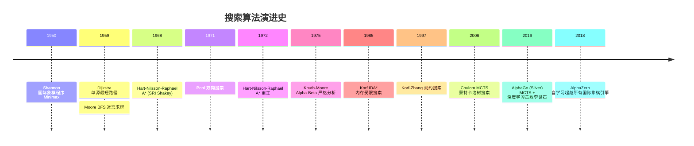

## 1. 概述与学习目标

### 1.1 什么是搜索算法

**搜索**（Search）是计算机科学中最基础的操作之一——在**状态空间**（State Space）中寻找满足特定条件的状态序列。Stuart Russell 与 Peter Norvig 在《Artificial Intelligence: A Modern Approach》第 3 章将搜索算法形式化为在状态空间图 $G = (V, E)$ 上寻找从初始状态 $s_0$ 到目标状态 $g \in G$ 的路径问题。按信息量与策略可分为四大类：

1. **静态查找**（Knuth TAOCP Vol.3 §6）：在固定数据集合中定位元素，包括线性查找 $O(n)$、二分查找 $O(\log n)$、哈希查找 $O(1)$；
2. **无信息搜索**（Uninformed/Blind Search, Russell-Norvig §3.4）：无启发式信息，包括 BFS、DFS、UCS（Dijkstra）、IDDFS；
3. **有信息搜索**（Informed/Heuristic Search, Russell-Norvig §3.5）：利用启发式函数 $h(n)$ 引导，包括贪婪最佳优先、A*、IDA*；
4. **对抗搜索**（Adversarial Search, Russell-Norvig §5）：多智能体博弈，包括 Minimax、Alpha-Beta 剪枝、Monte Carlo Tree Search（MCTS）。

```
搜索算法分类树：
                              搜索
                                |
        ┌───────────┬───────────┴───────────┬────────────┐
    静态查找     无信息搜索           有信息搜索         对抗搜索
    数组/链表    状态空间图          状态空间图+启发式   博弈树
        │           │                       │                │
    ┌───┴───┐   ┌───┴───┐               ┌───┴───┐        ┌───┴───┐
    线性   二分  BFS   DFS              A*   IDA*       Minimax  MCTS
    O(n)  O(logn) O(V+E) O(V+E)        O(b^d)  O(b^d)    O(b^d)  O(b^d)
        │       │     │                 │      │           │
       哈希    UCS  IDDFS              贪婪    WIDA*     Alpha-Beta
       O(1)   O(ElogV) O(b^d)          GBFS              O(b^(d/2))
```

**搜索算法的四大评估指标**：
1. **完备性**（Completeness）：若解存在，算法是否必能找到？
2. **最优性**（Optimality）：算法找到的解是否为最优解？
3. **时间复杂度**：状态扩展次数（用分支因子 $b$、解深度 $d$、最大深度 $m$ 衡量）；
4. **空间复杂度**：内存占用。

> 一句话定义：**搜索 = 在状态空间图中寻找从初始状态到目标状态的路径；静态查找 $O(\log n)$（二分）制霸有序数据，$O(1)$（哈希）制霸精确匹配；BFS/DFS 无信息搜索 $O(V+E)$ 服务通用图；A* 启发式搜索用 $f(n) = g(n) + h(n)$ 引导方向，可达 $O(b^{\epsilon d})$；IDA* 内存 $O(d)$ 服务内存受限场景；Alpha-Beta 剪枝 $O(b^{d/2})$ 主宰博弈树。**

### 1.2 学习目标

完成本文档学习后，你将能够：

1. **记忆**线性搜索 $O(n)$、二分搜索 $O(\log n)$、哈希查找 $O(1)$ 平均、BFS/DFS $O(V+E)$、UCS/Dijkstra $O(E \log V)$、IDDFS $O(b^d)$ 时间/$O(d)$ 空间、A* $O(b^d)$ 最坏/$O(b^{\epsilon d})$ 最优启发、IDA* $O(b^d)$ 时间/$O(d)$ 空间、Alpha-Beta 剪枝 $O(b^{d/2})$ 的形式化复杂度，复述各算法的完备性与最优性；
2. **理解** Shannon 1950 国际象棋程序（Philosophical Magazine 41:256-275）、Dijkstra 1959 最短路径（Numerische Mathematik 1:269-271）、Moore 1959 BFS（《The shortest path through a maze》）、Hart-Nilsson-Raphael 1968 A*（IEEE Trans. SSC-4(2):100-107）、Knuth-Moore 1975 Alpha-Beta 剪枝分析（Artificial Intelligence 6(4):293-326）、Korf 1985 IDA*（Artificial Intelligence 27(1):97-109）的历史脉络，说明各搜索算法的设计动机；
3. **应用**线性搜索（含哨兵）、二分搜索（含 lower_bound/upper_bound/二分答案/浮点二分）、BFS（含分层、最短路径、双向 BFS）、DFS（含环检测、拓扑排序、回溯）、IDDFS、A*（含曼哈顿/欧氏/切比雪夫启发式）、IDA*、Minimax + Alpha-Beta 剪枝编写可运行的 Python/C++/Java 代码，解决 LeetCode 33、127、200、207、773、1091、64 等高频问题；
4. **分析**状态空间图模型、启发式函数的可采纳性（$h(n) \leq h^*(n)$）与一致性（$h(n) \leq c(n, n') + h(n')$）、A* 最优性证明、IDA* 完备性证明、Alpha-Beta 剪枝正确性证明，掌握"图搜索、势能分析、对偶论证"三大核心论证方法；
5. **评估**各搜索算法在"静态查找 vs 动态查找"、"精确匹配 vs 范围查询"、"无权最短路 vs 加权最短路"、"完备性 vs 时间复杂度"、"内存受限 vs 时间最优"维度上的优劣，识别 Google Maps A* 路径规划、Stockfish 国际象棋引擎、PostgreSQL B+ 树索引、Redis 字典、社交网络最短路径的选型动机；
6. **对比**线性、二分、哈希、BST、BFS、DFS、双向 BFS、IDDFS、A*、IDA*、Minimax、Alpha-Beta 在时间复杂度、空间复杂度、完备性、最优性、启发式依赖、应用场景维度的差异；
7. **创造**性设计基于搜索算法的开源项目解决方案，如 Google Maps A* 路径规划、Stockfish 国际象棋引擎、PostgreSQL B+ 树索引、Sokoban 求解器、八数码问题、迷宫生成与求解、社交网络 K 度好友推荐。

### 1.3 术语表

| 术语 | 英文 | 定义 |
| ---- | ---- | ---- |
| 状态空间 | state space | 问题所有可能状态的集合 |
| 初始状态 | initial state | 搜索起点的状态 |
| 目标状态 | goal state | 满足求解条件的状态 |
| 后继函数 | successor function | 从状态 $n$ 出发的所有可能动作与结果状态 |
| 分支因子 | branching factor | 每个状态的平均后继数 $b$ |
| 解深度 | solution depth | 最优解的动作数 $d$ |
| 启发式函数 | heuristic function | 估算状态到目标代价的函数 $h(n)$ |
| 可采纳性 | admissibility | $h(n) \leq h^*(n)$（不高估） |
| 一致性 | consistency | $h(n) \leq c(n, n') + h(n')$（三角不等式） |
| 完备性 | completeness | 解存在则必能找到 |
| 最优性 | optimality | 找到的解为最优解 |
| 闭表 | closed set | 已扩展过的状态集合 |
| 开表 | open set/fringe | 待扩展的状态集合（队列/栈/优先队列） |

### 1.4 全景对比表

| 算法 | 时间复杂度 | 空间复杂度 | 完备性 | 最优性 | 应用 |
| ---- | ---- | ---- | ---- | ---- | ---- |
| 线性搜索 | $O(n)$ | $O(1)$ | 是 | 否（首匹配） | 无序小数据 |
| 二分搜索 | $O(\log n)$ | $O(1)$ | 是 | 是 | 有序静态数据 |
| 哈希查找 | $O(1)$ 平均 | $O(n)$ | 是 | 是 | 精确匹配 |
| BFS | $O(b^d)$ | $O(b^d)$ | 是 | 无权图是 | 无权最短路 |
| DFS | $O(b^m)$ | $O(bm)$ | 否（无限分支） | 否 | 拓扑、连通分量 |
| UCS/Dijkstra | $O(b^{1+\lfloor C^*/\epsilon \rfloor})$ | 同时间 | 是 | 是 | 加权最短路 |
| IDDFS | $O(b^d)$ | $O(d)$ | 是 | 是 | 内存受限无权 |
| 贪婪最佳优先 | $O(b^m)$ | $O(b^m)$ | 否 | 否 | 启发式引导 |
| A* | $O(b^d)$ 最坏 / $O(b^{\epsilon d})$ 最优 | $O(b^d)$ | 是 | 可采纳则是 | 路径规划 |
| IDA* | $O(b^d)$ | $O(d)$ | 是 | 可采纳则是 | 内存受限 |
| Minimax | $O(b^d)$ | $O(bd)$ | 是 | 是 | 零和博弈 |
| Alpha-Beta | $O(b^{d/2})$ 最优排序 | $O(bd)$ | 是 | 是 | 国际象棋引擎 |

### 1.5 适用场景速查

| 场景 | 推荐算法 | 理由 |
| ---- | ---- | ---- |
| 数组中找元素 | 二分（有序）/ 哈希（精确） | $O(\log n)$ / $O(1)$ |
| 无权图最短路 | BFS | 天然按距离扩展 |
| 加权图最短路 | Dijkstra / A* | 启发式可加速 |
| 内存受限搜索 | IDDFS / IDA* | $O(d)$ 空间 |
| 启发式引导 | A* / GBFS | $h(n)$ 引导方向 |
| 博弈树 | Minimax + Alpha-Beta | 对抗搜索标准方案 |
| 拓扑排序 | DFS | 后序逆序 |
| 连通分量 | DFS / BFS | $O(V+E)$ |
| 八数码 / 15 数码 | A* / IDA* | 状态空间大、需启发式 |
| 迷宫求解 | BFS / A* | BFS 完备，A* 加速 |

---

## 2. 历史动机与演进

### 2.1 早期：图搜索与博弈论的奠基（1950-1959）

**Shannon 1950 国际象棋程序**：Claude Shannon 在 1950 年《Philosophical Magazine》41:256-275 发表《Programming a Computer for Playing Chess》，首次提出用 Minimax + 启发式评估函数实现计算机下棋。Shannon 区分了"A 型"（暴力搜索固定深度）与"B 型"（选择性搜索关键分支）策略，奠定了 50 年国际象棋引擎的基础。1997 年 IBM 深蓝击败 Kasparov 用的就是 Shannon A 型 + Alpha-Beta 剪枝。

**Dijkstra 1959 最短路径**：Edsger Dijkstra 1959 在《Numerische Mathematik》1:269-271 发表《A note on two problems in connexion with graphs》，提出单源最短路径算法（即 Dijkstra 算法）与最小生成树算法。Dijkstra 在 Amsterdam 数学中心构思此算法时仅用 20 分钟，初衷是为演示 ARMAC 计算机的能力。论文仅 2.5 页，但开启了图论算法时代。

**Moore 1959 BFS**：Edward F. Moore 1959 在《Proceedings of the International Symposium on the Theory of Switching》285-292 发表《The shortest path through a maze》，独立提出 BFS 算法用于迷宫求解。C.Y. Lee 1961 在电路布线中独立再发现 BFS，故电路领域称"Lee 算法"。

### 2.2 启发式搜索的诞生（1968-1972）

**Hart-Nilsson-Raphael 1968 A\***：Peter Hart、Nils Nilsson、Bertram Raphael 1968 在 SRI International 为 Shakey 机器人（首个移动智能机器人）设计路径规划时，提出 A* 算法。论文《A Formal Basis for the Heuristic Determination of Minimum Cost Paths》发表于《IEEE Transactions on Systems Science and Cybernetics》SSC-4(2):100-107。

A* 的核心创新：将 Dijkstra 的 $g(n)$（已走代价）与启发式 $h(n)$（预估剩余代价）结合为评估函数 $f(n) = g(n) + h(n)$。论文证明：当 $h$ 可采纳（$h(n) \leq h^*(n)$）时，A* 找到最优解；当 $h$ 一致时，A* 无需重开闭表。1972 年作者在《SIGART Newsletter》37:28-29 发表更正。

**Pohl 1971 双向搜索**：Ira Pohl 1971 在《Machine Intelligence》6:127-140 发表《Bi-directional Search》，提出从起点与终点同时搜索，在中间相遇。理论上将复杂度从 $O(b^d)$ 降至 $O(b^{d/2})$，但实践中常因"相遇判定"开销而效果打折。

### 2.3 博弈树搜索分析（1975）

**Knuth-Moore 1975 Alpha-Beta 分析**：Donald Knuth 与 Ronald Moore 1975 在《Artificial Intelligence》6(4):293-326 发表《An analysis of alpha-beta pruning》，首次严格分析 Alpha-Beta 剪枝的复杂度。证明：最优节点排序下 Alpha-Beta 仅需评估 $O(b^{d/2})$ 个叶节点（vs Minimax 的 $O(b^d)$），即"减半有效深度"。这篇论文还引入了"negamax"形式（负极大值），简化 Minimax 实现。

### 2.4 内存受限搜索（1985）

**Korf 1985 IDA\***：Richard Korf 1985 在《Artificial Intelligence》27(1):97-109 发表《Depth-first iterative-deepening: An optimal admissible tree search》，提出 IDA*（Iterative Deepening A*）。IDA* 结合 IDDFS（迭代深化 DFS）的 $O(d)$ 空间与 A* 的启发式引导：每轮用 $f(n) = g(n) + h(n)$ 阈值限制 DFS 深度，下一轮阈值取上一轮越界节点的最小 $f$。

IDA* 在 15 数码问题（状态空间 $10^{13}$）上首次实现毫秒级求解，成为 AI 标准基准。Korf 后续还提出 WIDA*（加权 IDA*）、DFBnB（深度优先分支定界）、LRTA*（实时学习 A*）。

### 2.5 现代发展（1990-至今）

**Korf 1997 规约搜索**：Korf 与 Zhang 1997 提出 Divide-and-Conquer Beam Search，将 IDA* 扩展至大规模问题。

**Kishimoto 2002 并行 IDA\***：用 Transposition Table（转置表）+ 并行化加速 IDA*。

**Coulom 2006 MCTS**：Rémi Coulom 2006 提出 Monte Carlo Tree Search（MCTS），用随机模拟替代启发式评估。AlphaGo（Silver et al. 2016）用 MCTS + 深度学习击败李世石。

**时间线总结**：



### 2.6 关键设计决策

1. **A* 为何用 $f = g + h$ 而非 $f = h$**：纯启发式（贪婪最佳优先）不完备，可能陷局部最优；$g$ 分量保证已走代价被计入，使 A* 完备且最优；
2. **IDA* 为何用 DFS 而非 BFS**：BFS 需 $O(b^d)$ 内存，15 数码需 TB 级；DFS 仅 $O(d)$ 内存，可处理状态空间 $10^{13}$；
3. **Alpha-Beta 为何"减半深度"**：MAX 节点评估一个子节点后获得 $\alpha$，MIN 节点评估该子节点时若某叶节点 $\leq \alpha$ 即剪枝。最优排序下每两层仅评估约 $\sqrt{b}$ 个节点，总复杂度 $O(b^{d/2})$；
4. **IDDFS 为何"重复搜索也高效"**：每层搜索工作量 $b^i$，总工作量 $\sum_{i=0}^d b^i = O(b^d)$，最后一层占大头，重复开销仅 $O(b^{d-1})$ = $O(b^d)/b$ 比例。

---

## 3. 形式化定义

### 3.1 状态空间图模型

**定义 3.1（状态空间）**：搜索问题的状态空间为 5 元组 $\langle S, s_0, A, G, \text{succ} \rangle$：
- $S$：状态集合（可有限可无限）；
- $s_0 \in S$：初始状态；
- $A: S \to 2^A$：对每个状态 $s$，给出可执行动作集合；
- $G \subseteq S$：目标状态集合（或目标判定函数 $\text{goal}(s)$）；
- $\text{succ}: S \times A \to S$：后继函数，给定状态与动作返回新状态。

**定义 3.2（搜索图）**：状态空间对应有向图 $G = (V, E)$，其中 $V = S$，$(u, v) \in E$ 当且仅当 $\exists a \in A(u), \text{succ}(u, a) = v$。若动作有代价 $c(u, a, v)$，则图为加权图。

**定义 3.3（解）**：解是状态序列 $s_0, s_1, \ldots, s_k$ 满足 $s_k \in G$ 且 $\forall i, \exists a \in A(s_{i-1}), \text{succ}(s_{i-1}, a) = s_i$。最优解为代价 $\sum_{i=1}^k c(s_{i-1}, a_i, s_i)$ 最小者。

### 3.2 启发式函数的可采纳性与一致性

**定义 3.4（启发式函数）**：$h: S \to \mathbb{R}_{\geq 0}$，$h(n)$ 估算从 $n$ 到目标的最低代价。约定 $h(g) = 0, \forall g \in G$。

**定义 3.5（可采纳性 Admissibility）**：$h$ 可采纳当且仅当
$$\forall n \in S, \quad h(n) \leq h^*(n)$$
其中 $h^*(n)$ 为从 $n$ 到最近目标的真实最优代价。

**定义 3.6（一致性 Consistency / Monotonicity）**：$h$ 一致当且仅当对任意边 $(n, n')$，
$$h(n) \leq c(n, a, n') + h(n')$$
即满足三角不等式。

**定理 3.1**：一致性蕴含可采纳性。

**证明**：对最优路径 $n = n_0 \to n_1 \to \ldots \to n_k = g$ 反复应用一致性：
$$h(n_0) \leq c(n_0, n_1) + h(n_1) \leq c(n_0, n_1) + c(n_1, n_2) + h(n_2) \leq \ldots \leq \sum_{i=0}^{k-1} c(n_i, n_{i+1}) + h(g) = h^*(n_0) + 0 = h^*(n_0)$$
$\square$

**启发式构造方法**：
1. **松弛法**（Relaxation）：放宽问题约束得到易解问题，其最优解即原问题的可采纳启发式。例如 8 数码问题：
   - 原问题：每步移动一个数字，求最少步数；
   - 松弛问题 1：数字可瞬移到任意位置 → 曼哈顿距离之和；
   - 松弛问题 2：忽略空格位置，每数字独立 → 错位数字数（弱于曼哈顿）；
2. **模式数据库**（Pattern Database, Korf 1997）：预计算部分子问题的最优解，作为启发式下界。15 数码用 7-7 划分模式数据库可降至毫秒级；
3. **绝对最大值**：$h(n) = \max(h_1(n), h_2(n))$，若 $h_1, h_2$ 可采纳则 $h$ 可采纳。

### 3.3 A* 最优性证明

**定理 3.2（A* 最优性）**：若 $h$ 可采纳，A* 在树搜索中返回最优解；若 $h$ 一致，A* 在图搜索中返回最优解且无需重开闭表。

**证明（树搜索 + 可采纳）**：设 $G$ 为最优目标，代价 $C^* = h^*(s_0)$。反设 A* 返回次优解 $G'$，代价 $C' > C^*$。则在 $G'$ 被选中扩展时，最优路径上必存在某节点 $n$ 在 open 表中（因最优路径尚未完成）。由 A* 选择规则：
$$f(G') = g(G') + h(G') = C' + 0 = C' \leq f(n) = g(n) + h(n) \leq g(n) + h^*(n) \leq C^*$$
（最后一步：$g(n) + h^*(n)$ 是经过 $n$ 的最优路径代价，$\geq$ 全局最优 $C^*$）故 $C' \leq C^*$，与 $C' > C^*$ 矛盾。$\square$

**证明（图搜索 + 一致）**：一致性保证首次扩展某节点时 $g(n) = g^*(n)$（最优代价），无需后续更新。证明略。

### 3.4 IDA* 完备性与最优性

**定理 3.3（IDA* 完备性）**：若 $h$ 可采纳且状态空间有限、分支因子有限，IDA* 必能找到解。

**证明**：阈值序列 $f_1 < f_2 < \ldots$ 严格递增（因可采纳 $h \leq h^*$，故阈值 $\leq C^*$）。最终阈值达到 $C^*$ 时，最优路径所有节点 $f \leq C^*$ 都被扩展，目标必被发现。$\square$

**定理 3.4（IDA* 最优性）**：若 $h$ 可采纳，IDA* 返回最优解。

**证明**：IDA* 最终轮阈值为 $C^*$（最优代价）。在阈值 $\leq C^*$ 的 DFS 中，最优路径全部节点满足 $f(n) = g(n) + h(n) \leq g(n) + h^*(n) = C^*$（沿最优路径），均被访问。返回的第一个目标必为最优目标（次优目标 $f = C' > C^*$ 不被访问）。$\square$

### 3.5 Alpha-Beta 剪枝正确性

**定理 3.5（Alpha-Beta 正确性）**：Alpha-Beta 剪枝返回与 Minimax 完全相同的最优值。

**证明（不变式）**：维护 $\alpha$（MAX 节点下界）与 $\beta$（MIN 节点上界）。剪枝条件 $\alpha \geq \beta$ 表明：当前节点的值已不影响根节点决策，故剪去剩余子树不影响结果。详细归纳证明见 Knuth-Moore 1975。$\square$

**复杂度**：
- 最坏（无剪枝）：$O(b^d)$，与 Minimax 相同；
- 最优排序：$O(b^{d/2})$，相当于"减半深度"；
- 平均：$O((b/\log b)^d)$（Knuth-Moore 1975）。

---

## 4. 线性搜索

### 4.1 基本实现

线性搜索是最朴素的策略：从头到尾逐个比较。虽 $O(n)$ 但在小数据（$n < 20$）下常数因子最小，且对无序链表无可替代。

```python
def linear_search(arr: list[int], target: int) -> int:
    """线性搜索：返回 target 下标，不存在返回 -1"""
    for i, val in enumerate(arr):
        if val == target:
            return i
    return -1

def linear_search_sentinel(arr: list[int], target: int) -> int:
    """哨兵优化：省去每次循环的越界检查"""
    arr.append(target)  # 末尾放哨兵
    i = 0
    while arr[i] != target:
        i += 1
    arr.pop()
    return i if i < len(arr) else -1

def linear_search_ordered(arr: list[int], target: int) -> int:
    """有序数组的线性搜索：可提前终止"""
    for i, val in enumerate(arr):
        if val == target:
            return i
        if val > target:  # 有序性保证后续必更大
            return -1
    return -1
```

```cpp
// C++ 实现
int linearSearch(const vector<int>& arr, int target) {
    for (int i = 0; i < arr.size(); i++) {
        if (arr[i] == target) return i;
    }
    return -1;
}

// 哨兵优化（C 风格数组）
int linearSearchSentinel(int* arr, int n, int target) {
    int last = arr[n - 1];
    arr[n - 1] = target;  // 末尾放哨兵
    int i = 0;
    while (arr[i] != target) i++;
    arr[n - 1] = last;  // 恢复
    if (i < n - 1) return i;
    return (last == target) ? n - 1 : -1;
}
```

### 4.2 复杂度分析

| 指标 | 无序数组 | 有序数组 |
| ---- | ---- | ---- |
| 查找成功 ASL | $(n+1)/2$ | $(n+1)/2$ |
| 查找失败 ASL | $n$ | $n/2$（可提前终止） |
| 最坏比较次数 | $n$ | $n$ |
| 时间复杂度 | $O(n)$ | $O(n)$ |
| 空间复杂度 | $O(1)$ | $O(1)$ |

### 4.3 工程价值

- **小数据 n < 20**：插入排序的小数据回退、C++ `std::find` 默认实现；
- **链表场景**：链表无随机访问，二分不可用，线性搜索是唯一选择；
- **流式数据**：未知长度的流只能线性扫描；
- **早终止优化**：有序数据中 `val > target` 即可终止。

---

## 5. 二分搜索

### 5.1 标准二分搜索

二分搜索要求有序数组与随机访问，时间 $O(\log n)$，是静态查找的标准方案。

```python
def binary_search(arr: list[int], target: int) -> int:
    """标准二分搜索"""
    low, high = 0, len(arr) - 1
    while low <= high:
        # 防整数溢出（Python 无此问题，C++/Java 必备）
        mid = low + (high - low) // 2
        if arr[mid] == target:
            return mid
        elif arr[mid] < target:
            low = mid + 1
        else:
            high = mid - 1
    return -1
```

### 5.2 二分变体：lower_bound 与 upper_bound

C++ STL 提供两个核心变体：

```python
def lower_bound(arr: list[int], target: int) -> int:
    """返回第一个 >= target 的位置（左闭右开区间）"""
    low, high = 0, len(arr)
    while low < high:
        mid = (low + high) // 2
        if arr[mid] < target:
            low = mid + 1
        else:
            high = mid
    return low

def upper_bound(arr: list[int], target: int) -> int:
    """返回第一个 > target 的位置"""
    low, high = 0, len(arr)
    while low < high:
        mid = (low + high) // 2
        if arr[mid] <= target:
            low = mid + 1
        else:
            high = mid
    return low

# 应用：查找元素出现的范围 [left, right)
def search_range(arr, target):
    left = lower_bound(arr, target)
    right = upper_bound(arr, target)
    return [left, right - 1] if left < right else [-1, -1]
```

### 5.3 二分答案（参数搜索）

当问题的判定比求解更容易时，可对答案进行二分：

```python
def binary_search_answer(lo: int, hi: int, check: callable) -> int:
    """二分答案：在 [lo, hi] 内找最小可行值"""
    while lo < hi:
        mid = (lo + hi) // 2
        if check(mid):
            hi = mid  # 可行，尝试更小
        else:
            lo = mid + 1  # 不可行，增大
    return lo

# 示例：LeetCode 410 分割数组的最大值
def splitArray(nums: list[int], k: int) -> int:
    def check(max_sum: int) -> bool:
        cnt, cur = 1, 0
        for x in nums:
            if cur + x > max_sum:
                cnt += 1; cur = x
                if cnt > k: return False
            else:
                cur += x
        return True
    return binary_search_answer(max(nums), sum(nums), check)
```

### 5.4 浮点二分

用于连续优化问题，如 LeetCode 69 求 $\sqrt{x}$：

```python
def my_sqrt(x: int) -> int:
    """浮点二分求平方根"""
    if x <= 1: return x
    lo, hi = 1.0, float(x)
    eps = 1e-6
    while hi - lo > eps:
        mid = (lo + hi) / 2
        if mid * mid < x:
            lo = mid
        else:
            hi = mid
    return int(hi)
```

### 5.5 经典变体：旋转数组、峰值

```python
# LeetCode 33 旋转排序数组查找
def search_rotated(nums: list[int], target: int) -> int:
    lo, hi = 0, len(nums) - 1
    while lo <= hi:
        mid = (lo + hi) // 2
        if nums[mid] == target: return mid
        # 左半有序
        if nums[lo] <= nums[mid]:
            if nums[lo] <= target < nums[mid]:
                hi = mid - 1
            else:
                lo = mid + 1
        # 右半有序
        else:
            if nums[mid] < target <= nums[hi]:
                lo = mid + 1
            else:
                hi = mid - 1
    return -1

# LeetCode 162 寻找峰值（任意一个）
def find_peak_element(nums: list[int]) -> int:
    lo, hi = 0, len(nums) - 1
    while lo < hi:
        mid = (lo + hi) // 2
        if nums[mid] < nums[mid + 1]:
            lo = mid + 1  # 右侧有峰
        else:
            hi = mid  # 左侧含 mid 有峰
    return lo
```

### 5.6 复杂度与陷阱

| 变体 | 时间 | 空间 | 应用 |
| ---- | ---- | ---- | ---- |
| 标准二分 | $O(\log n)$ | $O(1)$ | 精确查找 |
| lower_bound | $O(\log n)$ | $O(1)$ | 插入位置 |
| upper_bound | $O(\log n)$ | $O(1)$ | 范围右端 |
| 二分答案 | $O(\log(\text{range}) \cdot \text{check})$ | $O(1)$ | 最大化最小值 |
| 浮点二分 | $O(\log((hi-lo)/\epsilon))$ | $O(1)$ | 数值计算 |

**整数溢出陷阱**（Bloch 2006）：`mid = (low + high) / 2` 在 `low + high` 超过 `INT_MAX` 时溢出。Java `Arrays.binarySearch` 1997 至 2006 年存在此 bug，约 9 年。修复为 `mid = low + (high - low) / 2`。

---

## 6. 哈希查找

### 6.1 直接寻址与哈希

哈希查找的核心是"直接寻址"的推广：
- **直接寻址表**：键 $k$ 存于数组位置 $k$，要求键域 $U$ 与数组大小 $|U|$ 相当，空间 $O(|U|)$；
- **哈希表**：用哈希函数 $h: U \to \{0, 1, \ldots, m-1\}$ 将键映射到 $m$ 个槽位，空间 $O(m)$。

冲突不可避免（鸽巢原理：$|U| > m$ 时必冲突），冲突处理策略：
1. **链地址法**（Chaining）：每个槽位存链表，冲突元素追加。Python `dict`、Java `HashMap`（Java 8+ 链表长度 $\geq 8$ 转红黑树）；
2. **开放寻址**（Open Addressing）：冲突时探查下一个槽位。探查序列：
   - 线性探针：$h(k, i) = (h'(k) + i) \mod m$
   - 二次探针：$h(k, i) = (h'(k) + c_1 i + c_2 i^2) \mod m$
   - 双重哈希：$h(k, i) = (h_1(k) + i \cdot h_2(k)) \mod m$
   - Robin Hood、Hopscotch、Cuckoo 等高级方案

### 6.2 完整实现

```python
class HashTable:
    """链地址法哈希表，自动扩容"""
    def __init__(self, capacity: int = 16, load_factor: float = 0.75):
        self.capacity = capacity
        self.size = 0
        self.load_factor = load_factor
        self.buckets: list[list[tuple]] = [[] for _ in range(capacity)]
    
    def _hash(self, key) -> int:
        return hash(key) % self.capacity
    
    def _resize(self):
        old = self.buckets
        self.capacity *= 2
        self.buckets = [[] for _ in range(self.capacity)]
        self.size = 0
        for bucket in old:
            for k, v in bucket:
                self.put(k, v)
    
    def put(self, key, value):
        if self.size >= self.capacity * self.load_factor:
            self._resize()
        idx = self._hash(key)
        for i, (k, _) in enumerate(self.buckets[idx]):
            if k == key:
                self.buckets[idx][i] = (key, value)
                return
        self.buckets[idx].append((key, value))
        self.size += 1
    
    def get(self, key, default=None):
        idx = self._hash(key)
        for k, v in self.buckets[idx]:
            if k == key:
                return v
        return default
    
    def remove(self, key) -> bool:
        idx = self._hash(key)
        for i, (k, _) in enumerate(self.buckets[idx]):
            if k == key:
                del self.buckets[idx][i]
                self.size -= 1
                return True
        return False
```

### 6.3 复杂度分析

| 操作 | 平均 | 最坏 |
| ---- | ---- | ---- |
| 查找 | $O(1)$ | $O(n)$ |
| 插入 | $O(1)$ 均摊 | $O(n)$ |
| 删除 | $O(1)$ | $O(n)$ |

**负载因子** $\alpha = n/m$。链地址法期望查找时间 $O(1 + \alpha)$，简单均匀哈希假设下 $\alpha = O(1)$ 即 $O(1)$。开放寻址要求 $\alpha < 1$，通常 $\alpha \leq 0.75$。

### 6.4 工业实现

- **Python `dict`**：开放寻址 + 伪随机探查，$\alpha \leq 2/3$，扩容 2 倍或 4 倍；
- **Java `HashMap`**：链地址法，链表长度 $\geq 8$ 且 $\alpha \geq 0.75$ 时转红黑树；
- **C++ `std::unordered_map`**：链地址法，实现依赖厂商（libstdc++ / libc++ / MSVC）；
- **Redis `dict`**：链地址法，渐进式 rehash 避免阻塞；
- **Google Abseil `flat_hash_map`**：开放寻址 + Robin Hood，内存紧凑。

---

## 7. 广度优先搜索（BFS）

### 7.1 算法思想

BFS 从起始节点出发，按层次逐步扩展：先访问距离 1 的所有节点，再访问距离 2 的节点，依此类推。核心数据结构是 FIFO 队列。

```
图: 0 -- 1 -- 3
     |    |
     2 -- 4 -- 5

BFS 从 0 出发:
  第 0 层: {0}
  第 1 层: {1, 2}
  第 2 层: {3, 4}
  第 3 层: {5}
  访问顺序: 0, 1, 2, 3, 4, 5
```

**BFS 关键性质**：在无权图中，BFS 首次到达某节点时的路径就是最短路径。这使 BFS 成为无权图最短路径的标准算法。

### 7.2 Python 实现

```python
from collections import deque, defaultdict

def bfs(graph: dict, start) -> list:
    """BFS 遍历，返回访问顺序"""
    visited = {start}
    queue = deque([start])
    order = []
    while queue:
        node = queue.popleft()
        order.append(node)
        for neighbor in graph[node]:
            if neighbor not in visited:
                visited.add(neighbor)
                queue.append(neighbor)
    return order

def bfs_shortest_path(graph: dict, start, end) -> list | None:
    """BFS 求无权图最短路径"""
    if start == end: return [start]
    visited = {start}
    queue = deque([(start, [start])])
    while queue:
        node, path = queue.popleft()
        for neighbor in graph[node]:
            if neighbor == end:
                return path + [neighbor]
            if neighbor not in visited:
                visited.add(neighbor)
                queue.append((neighbor, path + [neighbor]))
    return None

def bfs_distance(graph: dict, start) -> dict:
    """BFS 计算从 start 到所有节点的最短距离"""
    dist = {start: 0}
    queue = deque([start])
    while queue:
        node = queue.popleft()
        for neighbor in graph[node]:
            if neighbor not in dist:
                dist[neighbor] = dist[node] + 1
                queue.append(neighbor)
    return dist

def bfs_layered(graph: dict, start) -> list[list]:
    """分层 BFS，返回每层节点列表"""
    if not graph: return []
    layers = [[start]]
    visited = {start}
    while layers[-1]:
        next_layer = []
        for node in layers[-1]:
            for neighbor in graph[node]:
                if neighbor not in visited:
                    visited.add(neighbor)
                    next_layer.append(neighbor)
        if next_layer:
            layers.append(next_layer)
    return layers
```

### 7.3 C++ 实现

```cpp
#include <vector>
#include <queue>
#include <unordered_set>
using namespace std;

vector<int> bfs(const vector<vector<int>>& graph, int start) {
    int n = graph.size();
    vector<bool> visited(n, false);
    vector<int> order;
    queue<int> q;
    visited[start] = true;
    q.push(start);
    while (!q.empty()) {
        int node = q.front(); q.pop();
        order.push_back(node);
        for (int neighbor : graph[node]) {
            if (!visited[neighbor]) {
                visited[neighbor] = true;
                q.push(neighbor);
            }
        }
    }
    return order;
}

// 无权图最短路径
vector<int> bfsShortestPath(const vector<vector<int>>& graph, int start, int end) {
    int n = graph.size();
    vector<int> parent(n, -1);
    vector<bool> visited(n, false);
    queue<int> q;
    visited[start] = true;
    q.push(start);
    while (!q.empty()) {
        int node = q.front(); q.pop();
        if (node == end) break;
        for (int neighbor : graph[node]) {
            if (!visited[neighbor]) {
                visited[neighbor] = true;
                parent[neighbor] = node;
                q.push(neighbor);
            }
        }
    }
    // 回溯路径
    vector<int> path;
    for (int cur = end; cur != -1; cur = parent[cur]) {
        path.push_back(cur);
    }
    reverse(path.begin(), path.end());
    return (path.back() == start) ? path : vector<int>{};
}
```

### 7.4 复杂度分析

- **时间**：$O(V + E)$，每个顶点入队出队各一次，每条边检查一次（无向图两次）；
- **空间**：$O(V)$，队列与 visited 数组；
- **完备性**：是（有限分支图）；
- **最优性**：无权图是，加权图否（需 Dijkstra/UCS）。

### 7.5 工程应用

1. **社交网络 K 度好友**：LinkedIn、Facebook 用 BFS 找 K 度连接；
2. **无权迷宫最短路**：LeetCode 1091 二进制矩阵最短路径；
3. **单词接龙**（LeetCode 127）：从 beginWord 到 endWord 的最短变换序列；
4. **网络爬虫**：BFS 抓取网页层级；
5. **消息广播**：P2P 网络 Gossip 协议。

## 8. 深度优先搜索（DFS）

### 8.1 算法思想

**深度优先搜索**（Depth-First Search, DFS）沿一条分支尽可能深入，遇到死路则回溯探索其他分支。Tarjan 在 1972 年《Depth-First Search and Linear Graph Algorithms》（SIAM J. Comput. 1(2):146-160）系统化 DFS 的算法理论，证明其线性时间复杂度可解决诸多图问题（连通分量、拓扑排序、割点、桥、强连通分量）。

DFS 的核心特征：
1. **LIFO 栈**：后进先出，与 BFS 的 FIFO 队列相对；
2. **递归本质**：自然对应递归调用栈；
3. **不完备**：在无限分支图上可能陷入无限循环，需配合访问标记；
4. **不最优**：找到的路径不一定最短。

### 8.2 Python 实现（递归与栈两种形式）

```python
from collections import defaultdict

class DFS:
    """深度优先搜索：递归与栈两种实现"""

    def __init__(self, graph: dict):
        self.graph = graph

    def dfs_recursive(self, start) -> list:
        """递归 DFS：返回访问顺序"""
        visited = set()
        order = []

        def _dfs(node):
            visited.add(node)
            order.append(node)
            for neighbor in self.graph.get(node, []):
                if neighbor not in visited:
                    _dfs(neighbor)

        _dfs(start)
        return order

    def dfs_stack(self, start) -> list:
        """显式栈 DFS：避免 Python 递归深度限制"""
        visited = set()
        order = []
        stack = [start]
        while stack:
            node = stack.pop()
            if node in visited:
                continue
            visited.add(node)
            order.append(node)
            # 逆序入栈以保证与递归版访问顺序一致
            for neighbor in reversed(self.graph.get(node, [])):
                if neighbor not in visited:
                    stack.append(neighbor)
        return order
```

### 8.3 环检测（三色标记法）

CLRS 第 22.3 节介绍三色标记：白色（未访问）、灰色（在递归栈中）、黑色（已完成）。若 DFS 过程中遇到灰色边，则存在环。

```python
def has_cycle(graph: dict) -> bool:
    """有向图环检测：三色标记法。WHITE=0, GRAY=1, BLACK=2"""
    WHITE, GRAY, BLACK = 0, 1, 2
    color = {node: WHITE for node in graph}

    def _dfs(node) -> bool:
        color[node] = GRAY
        for neighbor in graph.get(node, []):
            if color[neighbor] == GRAY:
                return True  # 回边，存在环
            if color[neighbor] == WHITE and _dfs(neighbor):
                return True
        color[node] = BLACK
        return False

    return any(color[n] == WHITE and _dfs(n) for n in graph)
```

### 8.4 拓扑排序（后序逆序）

拓扑排序仅适用于 DAG（有向无环图）。DFS 后序的逆序即为一种合法拓扑序。Kahn 算法（BFS 入度法）是另一种实现。

```python
def topological_sort(graph: dict, num_nodes: int) -> list:
    """DFS 后序逆序实现拓扑排序。要求图为 DAG。"""
    visited = [False] * num_nodes
    postorder = []

    def _dfs(node):
        visited[node] = True
        for neighbor in graph.get(node, []):
            if not visited[neighbor]:
                _dfs(neighbor)
        postorder.append(node)

    for n in range(num_nodes):
        if not visited[n]:
            _dfs(n)
    return postorder[::-1]  # 后序的逆序
```

### 8.5 连通分量

无向图的连通分量可用 DFS 一次扫描求出。Tarjan 1972 提出基于 DFS 的线性时间算法。

```python
def connected_components(graph: dict, num_nodes: int) -> list:
    """无向图连通分量"""
    visited = [False] * num_nodes
    components = []

    def _dfs(start, comp):
        visited[start] = True
        comp.append(start)
        for neighbor in graph.get(start, []):
            if not visited[neighbor]:
                _dfs(neighbor, comp)

    for n in range(num_nodes):
        if not visited[n]:
            comp = []
            _dfs(n, comp)
            components.append(comp)
    return components
```

### 8.6 割点与桥（Tarjan 算法）

**割点**（Articulation Point）：删除该点后图不再连通。**桥**（Bridge）：删除该边后图不再连通。Tarjan 1974《A note on finding the bridges of a graph》（IPL 2(6):160-161）给出 $O(V+E)$ 算法，基于 disc（发现时间）与 low（回边可达的最小 disc）。

```python
def find_bridges(graph: dict, n: int) -> list:
    """Tarjan 桥算法：low[v] > disc[u] 则 (u,v) 是桥"""
    disc = [-1] * n
    low = [-1] * n
    bridges = []
    timer = [0]

    def _dfs(u, parent):
        disc[u] = low[u] = timer[0]
        timer[0] += 1
        for v in graph.get(u, []):
            if disc[v] == -1:
                _dfs(v, u)
                low[u] = min(low[u], low[v])
                if low[v] > disc[u]:
                    bridges.append((u, v))
            elif v != parent:
                low[u] = min(low[u], disc[v])

    for i in range(n):
        if disc[i] == -1:
            _dfs(i, -1)
    return bridges
```

### 8.7 C++ 实现

```cpp
#include <vector>
#include <functional>
using namespace std;

vector<int> dfs_recursive(const vector<vector<int>>& graph, int start) {
    vector<bool> visited(graph.size(), false);
    vector<int> order;
    function<void(int)> dfs = [&](int u) {
        visited[u] = true;
        order.push_back(u);
        for (int v : graph[u]) {
            if (!visited[v]) dfs(v);
        }
    };
    dfs(start);
    return order;
}
```

### 8.8 复杂度分析

- **时间**：$O(V + E)$，每条边访问一次；
- **空间**：$O(V)$ 递归栈最坏 $O(V)$（链状图）；
- **完备性**：有限图完备，无限分支不完备；
- **最优性**：否（可能找到非最短路径）。

### 8.9 工程应用

1. **拓扑排序**：编译器依赖分析（Make、Bazel）、任务调度（Airflow DAG）；
2. **环检测**：死锁检测、依赖循环检测；
3. **连通分量**：社交网络社区发现、好友推荐；
4. **割点/桥**：网络关键节点识别、可靠性分析；
5. **回溯算法**：N 皇后、数独、组合搜索的底层框架。

## 9. 双向 BFS（Bidirectional BFS）

### 9.1 算法思想

**双向 BFS** 由 Ira Pohl 在 1971 年《Bi-directional Search》（Machine Intelligence 6:127-140）中提出。核心思想：从起点与终点同时执行 BFS，当两端的搜索前沿相遇时即可拼接出最短路径。

复杂度对比：单向 BFS 为 $O(b^d)$，双向 BFS 为 $O(b^{d/2})$——分支因子 $b$ 与解深度 $d$ 较大时收益显著（如 $b=10, d=6$ 时，单向 $10^6$ 次扩展，双向仅 $2 \times 10^3$ 次）。

### 9.2 Python 实现

```python
from collections import deque

def bidirectional_bfs(graph: dict, start, end) -> list | None:
    """双向 BFS：从起点和终点同时搜索，中间相遇"""
    if start == end:
        return [start]

    # 前向搜索：从 start 出发
    front_visited = {start: None}  # node -> parent
    back_visited = {end: None}
    front_queue = deque([start])
    back_queue = deque([end])
    meeting_point = None

    while front_queue and back_queue:
        # 扩展前向一层
        for _ in range(len(front_queue)):
            node = front_queue.popleft()
            for neighbor in graph.get(node, []):
                if neighbor not in front_visited:
                    front_visited[neighbor] = node
                    front_queue.append(neighbor)
                    if neighbor in back_visited:
                        meeting_point = neighbor
                        break
            if meeting_point:
                break

        if meeting_point:
            break

        # 扩展后向一层
        for _ in range(len(back_queue)):
            node = back_queue.popleft()
            for neighbor in graph.get(node, []):
                if neighbor not in back_visited:
                    back_visited[neighbor] = node
                    back_queue.append(neighbor)
                    if neighbor in front_visited:
                        meeting_point = neighbor
                        break
            if meeting_point:
                break

    if not meeting_point:
        return None

    # 拼接路径：start -> meeting_point -> end
    # 前半段
    path = []
    cur = meeting_point
    while cur is not None:
        path.append(cur)
        cur = front_visited[cur]
    path.reverse()
    # 后半段
    cur = back_visited[meeting_point]
    while cur is not None:
        path.append(cur)
        cur = back_visited[cur]
    return path
```

### 9.3 应用：LeetCode 127 单词接龙

```python
def ladderLength(beginWord: str, endWord: str, wordList: list) -> int:
    """单词接龙：双向 BFS"""
    word_set = set(wordList)
    if endWord not in word_set:
        return 0

    front = {beginWord}
    back = {endWord}
    visited = set()
    steps = 1

    while front and back:
        # 总是扩展较小的一侧（优化）
        if len(front) > len(back):
            front, back = back, front

        next_front = set()
        for word in front:
            for i in range(len(word)):
                for c in 'abcdefghijklmnopqrstuvwxyz':
                    if c == word[i]:
                        continue
                    new_word = word[:i] + c + word[i+1:]
                    if new_word in back:
                        return steps + 1
                    if new_word in word_set and new_word not in visited:
                        visited.add(new_word)
                        next_front.add(new_word)
        front = next_front
        steps += 1
    return 0
```

### 9.4 复杂度分析

- **时间**：$O(b^{d/2})$，相比单向 $O(b^d)$ 减少指数级常数；
- **空间**：$O(b^{d/2})$；
- **完备性**：是；
- **最优性**：无权图最优；
- **限制**：需预先知道目标节点；目标不明确（如多个目标）时不适用。

## 10. 迭代深化 DFS（IDDFS）

### 10.1 算式思想

**迭代深化 DFS**（Iterative Deepening DFS, IDDFS）结合 BFS 的完备性与 DFS 的空间效率。Korf 1985 在《Depth-first iterative-deepening: An optimal admissible tree search》中证明：IDDFS 在分支因子 $b > 1$ 时，重复扩展的代价仅多出常数倍（约 $\frac{b}{b-1}$ 倍）。

工作流程：
1. 设深度阈值 $L = 0$，执行受限 DFS（深度不超过 $L$）；
2. 若找到解则返回；否则 $L \leftarrow L + 1$ 重复。

### 10.2 Python 实现

```python
def iddfs(graph: dict, start, is_goal) -> int | None:
    """迭代深化 DFS：返回目标所在深度"""
    def _dls(node, depth, visited):
        """Depth-Limited Search"""
        if is_goal(node):
            return depth
        if depth == 0:
            return None
        visited.add(node)
        for neighbor in graph.get(node, []):
            if neighbor not in visited:
                result = _dls(neighbor, depth - 1, visited)
                if result is not None:
                    return result
        return None

    for depth in range(0, 100):  # 上限防无限循环
        visited = set()
        result = _dls(start, depth, visited)
        if result is not None:
            return result
    return None
```

### 10.3 复杂度分析

IDDFS 在深度 $d$ 找到解时的总扩展次数：

$$
N_{\text{IDDFS}} = \sum_{i=0}^{d} b^i \cdot (d - i + 1) \approx \frac{b}{b-1} \cdot b^d = O(b^d)
$$

而 BFS 的扩展次数为 $b^d$。两者渐近相同，但 IDDFS 空间仅 $O(d)$（远低于 BFS 的 $O(b^d)$）。

- **时间**：$O(b^d)$，与 BFS 同阶；
- **空间**：$O(d)$，远优于 BFS；
- **完备性**：是；
- **最优性**：所有边权相等时最优；加权图需 IDA*。

### 10.4 工程应用

1. **国际象棋引擎**：Stockfish 使用 IDDFS 作为搜索框架（结合 Alpha-Beta 剪枝）；
2. **游戏 AI**：井字棋、Connect Four 等深度有限博弈；
3. **约束满足问题**：N 皇后、数独求解；
4. **路径规划**：分支因子大、内存受限的场景。

## 11. A* 启发式搜索

### 11.1 算法思想

**A\*** 由 Peter Hart、Nils Nilsson、Bertram Raphael 在 1968 年为 SRI International（斯坦福研究院）的 Shakey 机器人路径规划而设计，发表于《A Formal Basis for the Heuristic Determination of Minimum Cost Paths》（IEEE Trans. SSC-4(2):100-107, DOI:10.1109/TSSC.1968.300136）。A* 是 Dijkstra 算法与贪婪最佳优先搜索的结合，评估函数：

$$
f(n) = g(n) + h(n)
$$

- $g(n)$：从起点到 $n$ 的实际代价；
- $h(n)$：从 $n$ 到目标的启发式估计；
- $f(n)$：经过 $n$ 的估计总代价。

A* 每次从开表中取出 $f$ 值最小的节点扩展，与 Dijkstra 的区别仅在于优先级函数从 $g$ 改为 $f = g + h$。当 $h \equiv 0$ 时 A* 退化为 Dijkstra；当 $h$ 严格等于实际最优代价 $h^*$ 时 A* 直接找到最短路径不扩展任何多余节点。

### 11.2 启发式函数

| 启发式 | 公式 | 适用场景 | 可采纳性 |
| ---- | ---- | ---- | ---- |
| 曼哈顿距离 | $h = |x_1 - x_2| + |y_1 - y_2|$ | 四连通网格 | 是（仅四方向移动） |
| 欧氏距离 | $h = \sqrt{(x_1-x_2)^2 + (y_1-y_2)^2}$ | 任意方向移动 | 是 |
| 切比雪夫距离 | $h = \max(|x_1-x_2|, |y_1-y_2|)$ | 八连通网格 | 是 |
| 汉明距离 | $h = \sum_i [s_i \neq t_i]$ | 字符串匹配 | 视问题而定 |
| 错位牌数 | $h = \sum_i [s_i \neq g_i]$ | 八数码 | 是（弱启发） |
| 曼哈顿距离和 | $h = \sum_i |x_i - x_i^*| + |y_i - y_i^*|$ | 八数码/15 数码 | 是（强启发） |

### 11.3 Python 实现（优先队列）

```python
import heapq

def astar(grid: list[list[int]], start: tuple, end: tuple) -> int:
    """A* 算法：在二维网格中求最短路径。0=可走, 1=障碍"""
    rows, cols = len(grid), len(grid[0])

    def manhattan(a, b):
        return abs(a[0] - b[0]) + abs(a[1] - b[1])

    # 优先队列：(f, g, pos)
    open_set = [(manhattan(start, end), 0, start)]
    g_score = {start: 0}
    visited = set()

    while open_set:
        f, g, pos = heapq.heappop(open_set)
        if pos == end:
            return g
        if pos in visited:
            continue
        visited.add(pos)

        for dx, dy in [(-1, 0), (1, 0), (0, -1), (0, 1)]:
            nx, ny = pos[0] + dx, pos[1] + dy
            if 0 <= nx < rows and 0 <= ny < cols and grid[nx][ny] == 0:
                neighbor = (nx, ny)
                new_g = g + 1
                if neighbor not in g_score or new_g < g_score[neighbor]:
                    g_score[neighbor] = new_g
                    new_f = new_g + manhattan(neighbor, end)
                    heapq.heappush(open_set, (new_f, new_g, neighbor))
    return -1  # 不可达
```

### 11.4 最优性证明（可采纳性保证）

**定理 11.1（A\* 最优性）**：若启发式 $h$ 可采纳（$h(n) \leq h^*(n)$），且图搜索使用闭表（已扩展节点不再重开），则 A* 找到的解为最优解。

**证明**（反证法）：设 A* 终止时返回的解代价为 $C'$，但最优解代价为 $C^* < C'$。在 A* 终止前，最优路径上必存在某个节点 $n$ 在开表中（因为最优路径从起点扩展，每一步都不会错过）。由于 $h$ 可采纳：

$$
f(n) = g(n) + h(n) \leq g^*(n) + h^*(n) = C^*
$$

而 A* 选择 $f$ 最小的节点扩展，故终止时所选节点的 $f$ 值 $\leq C^* < C'$。但终止节点 $g$ 满足 $f(g) = g(g) + h(g) = g(g) = C'$（目标节点的 $h=0$），矛盾。因此 $C' = C^*$。$\blacksquare$

### 11.5 一致性与闭表优化

**一致性**（monotonicity）：$h(n) \leq c(n, n') + h(n')$。Hart-Nilsson-Raphael 1968 称此为 monotonicity。一致性保证：A* 在扩展节点 $n$ 时已找到 $g^*(n)$，故闭表中的节点无需重开。

**定理 11.2**：一致性蕴含可采纳性。

**证明**：对最优路径 $n \to n_1 \to n_2 \to \dots \to g$ 反复应用一致性：

$$
h(n) \leq c(n, n_1) + h(n_1) \leq c(n, n_1) + c(n_1, n_2) + h(n_2) \leq \dots \leq h^*(n)
$$

### 11.6 应用：八数码问题

```python
def eight_puzzle(start: tuple, goal: tuple) -> int:
    """八数码问题：A* + 曼哈顿距离和"""
    def h(state):
        dist = 0
        for i in range(9):
            if state[i] == 0:
                continue
            target = goal.index(state[i])
            dist += abs(i // 3 - target // 3) + abs(i % 3 - target % 3)
        return dist

    open_set = [(h(start), 0, start)]
    g_score = {start: 0}
    while open_set:
        f, g, state = heapq.heappop(open_set)
        if state == goal:
            return g
        zero = state.index(0)
        zx, zy = zero // 3, zero % 3
        for dx, dy in [(-1, 0), (1, 0), (0, -1), (0, 1)]:
            nx, ny = zx + dx, zy + dy
            if 0 <= nx < 3 and 0 <= ny < 3:
                new_zero = nx * 3 + ny
                lst = list(state)
                lst[zero], lst[new_zero] = lst[new_zero], lst[zero]
                new_state = tuple(lst)
                new_g = g + 1
                if new_state not in g_score or new_g < g_score[new_state]:
                    g_score[new_state] = new_g
                    heapq.heappush(open_set, (new_g + h(new_state), new_g, new_state))
    return -1
```

### 11.7 复杂度分析

- **时间**：最坏 $O(b^d)$（启发式无效时退化为 BFS）；理想 $O(b^{\epsilon d})$（启发式误差 $\epsilon$ 较小）；
- **空间**：$O(b^d)$，需存储所有已扩展节点（最大瓶颈）；
- **完备性**：是（有限分支、可采纳启发式）；
- **最优性**：是（可采纳启发式）。

## 12. IDA* 内存受限搜索

### 12.1 算法思想

**IDA\***（Iterative Deepening A*）由 Richard Korf 1985 在《Depth-first iterative-deepening: An optimal admissible tree search》（Artificial Intelligence 27(1):97-109, DOI:10.1016/0004-3702(85)90084-0）中提出。结合 IDDFS 与 A*：用 $f(n) = g(n) + h(n)$ 作为深度阈值，每次循环用上一轮的最小超阈值作为新阈值。

IDA* 的核心优势：**空间 $O(d)$**——仅需保存当前路径，无需开表。这使其能解决 A* 因内存爆炸无法求解的问题（如 15 数码、24 数码）。

### 12.2 Python 实现

```python
def ida_star(start, goal, h, neighbors):
    """IDA* 算法：内存受限启发式搜索"""
    def search(path, g, threshold):
        node = path[-1]
        f = g + h(node, goal)
        if f > threshold:
            return f, None
        if node == goal:
            return f, list(path)
        min_threshold = float('inf')
        for neighbor, cost in neighbors(node):
            if neighbor in path:  # 简单环检测
                continue
            path.append(neighbor)
            t, result = search(path, g + cost, threshold)
            if result is not None:
                return t, result
            if t < min_threshold:
                min_threshold = t
            path.pop()
        return min_threshold, None

    threshold = h(start, goal)
    path = [start]
    while True:
        t, result = search(path, 0, threshold)
        if result is not None:
            return result
        if t == float('inf'):
            return None  # 不可达
        threshold = t
```

### 12.3 完备性与最优性证明

**定理 12.1（IDA\* 完备性）**：若解存在且有限分支，IDA* 必能找到。

**证明**：阈值序列 $T_0 < T_1 < T_2 < \dots$ 严格递增（每轮取所有超阈值中的最小值），且 $T_i \to C^*$（最优代价）。当 $T_i \geq C^*$ 时，最优路径上所有节点的 $f \leq C^* \leq T_i$，故 DFS 必能到达目标。$\blacksquare$

**定理 12.2（IDA\* 最优性）**：若 $h$ 可采纳，IDA* 找到的解为最优解。

**证明**：IDA* 在阈值 $T_i < C^*$ 时不会终止（因为最优路径节点 $f \leq C^*$，但若 $T_i < C^*$ 则这些节点仍可能被扩展且找不到目标）；首次终止时 $T_k = C^*$，返回的解代价恰为 $C^*$。$\blacksquare$

### 12.4 复杂度分析

- **时间**：$O(b^d)$（与 A* 同阶），但常数较大（重复扩展）；
- **空间**：$O(d)$，远优于 A* 的 $O(b^d)$；
- **完备性**：是；
- **最优性**：是（可采纳启发式）。

### 12.5 应用：15 数码问题

15 数码的状态空间约为 $16!/2 \approx 10^{13}$，A* 内存爆炸无法求解。Korf 1985 用 IDA* + Manhattan distance + Linear conflict 启发式在 SUN-3 工作站上平均 50 秒内求解随机 15 数码实例，奠定 IDA* 在内存受限搜索中的地位。现代优化（pattern database、PDB）可将求解时间降至毫秒级。

## 13. Minimax 与 Alpha-Beta 剪枝

### 13.1 算法思想

**Minimax** 由 John von Neumann 1928 在《Zur Theorie der Gesellschaftsspiele》（Mathematische Annalen 100:295-320）中证明的极小极大定理奠基。Claude Shannon 1950 在《Programming a Computer for Playing Chess》（Philosophical Magazine 41:256-275, DOI:10.1080/14786445008521796）中首次将 Minimax 应用于国际象棋程序设计。

在两人零和博弈中，玩家分两类：
- **MAX**：希望效用最大化；
- **MIN**：希望效用最小化（即希望 MAX 的效用最小）。

博弈树中叶节点给出效用值，内部节点交替为 MAX/MIN 层。Minimax 递归计算：

$$
\text{Minimax}(n) = \begin{cases}
\text{utility}(n) & n \text{ 为叶节点} \\
\max_{c \in \text{children}(n)} \text{Minimax}(c) & n \text{ 为 MAX 节点} \\
\min_{c \in \text{children}(n)} \text{Minimax}(c) & n \text{ 为 MIN 节点}
\end{cases}
$$

### 13.2 Python 实现

```python
def minimax(state, is_max_turn, terminal_value, children, depth=10):
    """Minimax 算法
    - state: 当前状态
    - is_max_turn: 当前是否为 MAX 玩家回合
    - terminal_value(state): 终局估值（None 表示非终局）
    - children(state): 返回所有合法后继状态
    - depth: 最大搜索深度
    """
    val = terminal_value(state)
    if val is not None:
        return val
    if depth == 0:
        return heuristic_eval(state)

    if is_max_turn:
        best = -float('inf')
        for child in children(state):
            best = max(best, minimax(child, False, terminal_value, children, depth - 1))
        return best
    else:
        best = float('inf')
        for child in children(state):
            best = min(best, minimax(child, True, terminal_value, children, depth - 1))
        return best

def heuristic_eval(state):
    """启发式估值函数（需根据具体博弈定义）"""
    return 0
```

### 13.3 Alpha-Beta 剪枝

**Alpha-Beta 剪枝** 思想由 John McCarthy 1956 在 Dartmouth 会议提出，Knuth 与 Moore 1975 在《An analysis of alpha-beta pruning》（Artificial Intelligence 6(4):293-326, DOI:10.1016/0004-3702(75)90019-3）中给出严格分析。维护两个值：

- $\alpha$：MAX 节点当前能保证的最佳下界（初始 $-\infty$）；
- $\beta$：MIN 节点当前能保证的最佳上界（初始 $+\infty$）。

**剪枝不变式**：当 $\alpha \geq \beta$ 时，当前节点不可能影响最终决策，剪枝。

```python
def alphabeta(state, depth, alpha, beta, is_max_turn, terminal_value, children):
    """Alpha-Beta 剪枝"""
    val = terminal_value(state)
    if val is not None:
        return val
    if depth == 0:
        return heuristic_eval(state)

    if is_max_turn:
        best = -float('inf')
        for child in children(state):
            best = max(best, alphabeta(child, depth - 1, alpha, beta, False, terminal_value, children))
            alpha = max(alpha, best)
            if alpha >= beta:
                break  # beta 剪枝
        return best
    else:
        best = float('inf')
        for child in children(state):
            best = min(best, alphabeta(child, depth - 1, alpha, beta, True, terminal_value, children))
            beta = min(beta, best)
            if beta <= alpha:
                break  # alpha 剪枝
        return best
```

### 13.4 复杂度分析（Knuth-Moore 1975）

Knuth 与 Moore 1975 证明：
- **最坏情况**（无剪枝）：$O(b^d)$，与 Minimax 相同；
- **最优情况**（节点排序完美）：$O(b^{d/2})$，相当于搜索深度加倍；
- **平均情况**：$O(b^{3d/4})$。

**直观理解**：完美排序下，Alpha-Beta 剪掉一半的"无用"分支。这是为什么 Stockfish 等引擎投入大量工程优化节点排序（killer move、history heuristic、transposition table）。

### 13.5 正确性证明

**定理 13.1（Alpha-Beta 正确性）**：Alpha-Beta 剪枝返回的根节点值等于 Minimax 值。

**证明**（不变式归纳）：归纳证明每个节点的返回值 $v$ 满足：
- MAX 节点：$v \leq \beta$ 时 $v$ 为真实 Minimax 值；$v > \beta$ 时 $v$ 为真实 Minimax 值的下界；
- MIN 节点：$v \geq \alpha$ 时 $v$ 为真实 Minimax 值；$v < \alpha$ 时 $v$ 为真实 Minimax 值的上界。

根节点 $\alpha = -\infty, \beta = +\infty$，故返回值为真实 Minimax 值。$\blacksquare$

### 13.6 Negamax 形式

棋类引擎普遍使用 Negamax 形式（统一 MAX/MIN）：利用零和博弈性质 $\text{Minimax}(MIN) = -\text{Minimax}(MAX)$，将所有节点视为"当前玩家最大化"。

```python
def negamax(state, depth, alpha, beta, color, terminal_value, children):
    """Negamax + Alpha-Beta：所有节点统一为当前玩家最大化"""
    val = terminal_value(state)
    if val is not None:
        return color * val
    if depth == 0:
        return color * heuristic_eval(state)

    best = -float('inf')
    for child in children(state):
        val = -negamax(child, depth - 1, -beta, -alpha, -color, terminal_value, children)
        best = max(best, val)
        alpha = max(alpha, best)
        if alpha >= beta:
            break
    return best
```

### 13.7 应用：LeetCode 486 预测赢家

```python
def predict_the_winner(nums: list) -> bool:
    """LeetCode 486：Minimax 判断玩家 1 是否必胜"""
    def minimax(nums, l, r, turn):
        if l == r:
            return turn * nums[l]
        pick_left = nums[l] + turn * minimax(nums, l + 1, r, -turn)
        pick_right = nums[r] + turn * minimax(nums, l, r - 1, -turn)
        return max(pick_left, pick_right) if turn == 1 else min(pick_left, pick_right)

    score = minimax(nums, 0, len(nums) - 1, 1)
    return score >= 0
```

### 13.8 工程应用

1. **国际象棋引擎**：Stockfish、Crafty、Fritz 使用 Alpha-Beta + 启发式排序 + 置换表；
2. **围棋**：AlphaGo（2016）用 MCTS + 神经网络（超越传统 Alpha-Beta）；
3. **五子棋/黑白棋**：桌面博弈普遍采用 Alpha-Beta；
4. **多人博弈**：MaxN 算法（多人 Minimax 推广）。

## 14. 经典应用案例

### 14.1 LeetCode 33 旋转排序数组查找

```python
def search(nums: list, target: int) -> int:
    """旋转排序数组查找：二分变体"""
    lo, hi = 0, len(nums) - 1
    while lo <= hi:
        mid = (lo + hi) // 2
        if nums[mid] == target:
            return mid
        # 左半有序
        if nums[lo] <= nums[mid]:
            if nums[lo] <= target < nums[mid]:
                hi = mid - 1
            else:
                lo = mid + 1
        else:  # 右半有序
            if nums[mid] < target <= nums[hi]:
                lo = mid + 1
            else:
                hi = mid - 1
    return -1
```

### 14.2 LeetCode 200 岛屿数量（DFS/BFS）

```python
def numIslands(grid: list[list[str]]) -> int:
    """DFS 求岛屿数量"""
    if not grid:
        return 0
    rows, cols = len(grid), len(grid[0])
    count = 0

    def dfs(r, c):
        if r < 0 or r >= rows or c < 0 or c >= cols or grid[r][c] != '1':
            return
        grid[r][c] = '0'  # 标记已访问
        dfs(r - 1, c); dfs(r + 1, c); dfs(r, c - 1); dfs(r, c + 1)

    for r in range(rows):
        for c in range(cols):
            if grid[r][c] == '1':
                count += 1
                dfs(r, c)
    return count
```

### 14.3 LeetCode 207 课程表（拓扑排序）

```python
from collections import deque

def canFinish(numCourses: int, prerequisites: list) -> bool:
    """Kahn 算法判断 DAG"""
    graph = {i: [] for i in range(numCourses)}
    indegree = [0] * numCourses
    for course, prereq in prerequisites:
        graph[prereq].append(course)
        indegree[course] += 1

    queue = deque([i for i in range(numCourses) if indegree[i] == 0])
    taken = 0
    while queue:
        course = queue.popleft()
        taken += 1
        for next_course in graph[course]:
            indegree[next_course] -= 1
            if indegree[next_course] == 0:
                queue.append(next_course)
    return taken == numCourses
```

### 14.4 LeetCode 773 滑动谜题（A* 求解）

```python
import heapq

def slidingPuzzle(board: list[list[int]]) -> int:
    """2x3 滑动谜题：A* + 曼哈顿距离"""
    goal = (1, 2, 3, 4, 5, 0)
    start = tuple(board[0] + board[1])
    if start == goal:
        return 0

    def h(state):
        dist = 0
        for i in range(6):
            if state[i] == 0:
                continue
            target = state[i] - 1
            dist += abs(i // 3 - target // 3) + abs(i % 3 - target % 3)
        return dist

    # 邻居索引
    neighbors = {0: [1, 3], 1: [0, 2, 4], 2: [1, 5],
                 3: [0, 4], 4: [1, 3, 5], 5: [2, 4]}

    open_set = [(h(start), 0, start)]
    visited = {start}

    while open_set:
        f, g, state = heapq.heappop(open_set)
        if state == goal:
            return g
        zero = state.index(0)
        for npos in neighbors[zero]:
            lst = list(state)
            lst[zero], lst[npos] = lst[npos], lst[zero]
            new_state = tuple(lst)
            if new_state not in visited:
                visited.add(new_state)
                heapq.heappush(open_set, (g + 1 + h(new_state), g + 1, new_state))
    return -1
```

### 14.5 LeetCode 1091 二进制矩阵最短路径（BFS）

```python
from collections import deque

def shortestPathBinaryMatrix(grid: list[list[int]]) -> int:
    """八连通 BFS 最短路径"""
    n = len(grid)
    if grid[0][0] or grid[n-1][n-1]:
        return -1
    queue = deque([(0, 0, 1)])  # (r, c, dist)
    visited = {(0, 0)}
    directions = [(-1, -1), (-1, 0), (-1, 1), (0, -1), (0, 1), (1, -1), (1, 0), (1, 1)]
    while queue:
        r, c, dist = queue.popleft()
        if r == n - 1 and c == n - 1:
            return dist
        for dr, dc in directions:
            nr, nc = r + dr, c + dc
            if 0 <= nr < n and 0 <= nc < n and not grid[nr][nc] and (nr, nc) not in visited:
                visited.add((nr, nc))
                queue.append((nr, nc, dist + 1))
    return -1
```

### 14.6 LeetCode 64 最小路径和（DAG 上的搜索 + DP）

```python
def minPathSum(grid: list[list[int]]) -> int:
    """DP 求解最小路径和（本质是 DAG 上的 Dijkstra）"""
    m, n = len(grid), len(grid[0])
    dp = [[float('inf')] * n for _ in range(m)]
    dp[0][0] = grid[0][0]
    for i in range(m):
        for j in range(n):
            if i > 0:
                dp[i][j] = min(dp[i][j], dp[i-1][j] + grid[i][j])
            if j > 0:
                dp[i][j] = min(dp[i][j], dp[i][j-1] + grid[i][j])
    return dp[m-1][n-1]
```

## 15. 工程实践

### 15.1 Google Maps 路径规划

Google Maps 早期使用 Dijkstra + A* 进行路径规划，2010 年后引入 **Contraction Hierarchies**（Geisberger et al. 2008）与 **ALT 算法**（A* + Landmarks + Triangle inequality），将跨大陆路径查询从秒级降至毫秒级。

关键优化：
1. **Landmark 启发式**：选取若干"地标"节点 $L$，预计算所有节点到地标的距离。启发式 $h(u, v) = \max_{l \in L} |d(u, l) - d(v, l)|$ 满足三角不等式；
2. **分层图**：将高速公路作为高层、城市道路作为低层，A* 优先扩展高层；
3. **双向 A***：从起点和终点同时搜索，中间相遇。

### 15.2 Stockfish 国际象棋引擎

Stockfish 是开源国际象棋引擎的标杆，搜索框架基于：
1. **Iterative Deepening**：从深度 1 开始逐步加深，便于时间控制；
2. **Alpha-Beta + Negamax**：核心搜索算法；
3. **节点排序优化**：
   - **TT move**（置换表最佳着法）优先扩展；
   - **Killer move**（同一层引发剪枝的着法）；
   - **History heuristic**（历史启发式，按历史得分排序）；
4. **Quiescence Search**（静默搜索）：在叶节点继续搜索吃子、将军等"非静默"着法，避免水平线效应；
5. **Null Move Pruning**：跳过一步"空着"看对方能否取胜，若不能则当前局面优势明显可剪枝；
6. **Late Move Reduction**：排序靠后的着法降低搜索深度。

### 15.3 PostgreSQL B+ 树索引

PostgreSQL 默认索引结构为 B+ 树（Bayer-McCreight 1972 的推广），查找过程本质是搜索算法：
1. **根节点到叶节点**：每层二分查找定位子树，$O(\log_B n)$ I/O；
2. **叶节点链表**：支持范围查询与反向扫描；
3. **Page Cache**：缓冲池避免磁盘 I/O，热数据查找 $O(\log n)$ 内存操作。

### 15.4 Redis 字典

Redis 字典采用链地址法哈希表，查找 $O(1)$ 平均：
1. **MurmurHash3**：高性能非加密哈希；
2. **渐进式 rehash**：扩容时新旧两表并存，每次操作迁移一个桶，避免一次性 rehash 阻塞；
3. **SipHash**（4.0+）：防止哈希碰撞攻击。

### 15.5 Sokoban 求解器

推箱子游戏是经典的状态空间搜索问题，工业级求解器（如 Sokoban Solver）结合：
1. **IDA*** + 强启发式（deadlock detection、tunnel macros）；
2. **状态压缩**：用位图表示箱子位置；
3. **模式数据库**：预计算子问题最优解。

### 15.6 工业级优化技巧

1. **优先队列优化**：A* 用 Fibonacci 堆替代二叉堆，理论 $O(1)$ decrease-key；
2. **状态压缩**：用整数编码状态（如 15 数码状态用 64 bit 整数）；
3. **置换表**（Transposition Table）：缓存已扩展节点的最优值，避免重复计算；
4. **位并行 BFS**：用位运算批量处理多个状态；
5. **分层搜索**：将状态按层次划分，分层搜索降低内存；
6. **延迟扩展**：仅当节点被弹出时才生成子节点（lazy generation）；
7. **A* + IDA* 混合**：内存充足时用 A*，内存紧张时切换 IDA*；
8. **并行 Alpha-Beta**：多线程并行搜索不同子树（Stockfish 11+ 默认 256 线程）。

## 16. 常见陷阱

### 16.1 二分查找整数溢出

`mid = (lo + hi) / 2` 在 $lo + hi > 2^{31} - 1$ 时溢出。Bloch 2006 在 Google Research Blog 公开 Java 标准库的此 bug（追溯至 Bentley 1986 Programming Pearls）。正确写法：

```python
mid = lo + (hi - lo) // 2   # Python 无溢出但保留习惯
# C++: mid = lo + ((hi - lo) >> 1);
# Java: mid = (lo + hi) >>> 1;  // 无符号右移
```

### 16.2 DFS 递归深度栈溢出

Python 默认递归深度 1000，处理大图需改用显式栈或 `sys.setrecursionlimit`。C++ 同样需注意栈大小。

### 16.3 BFS 队列膨胀

BFS 在分支因子大的图上内存爆炸。改用 IDDFS 或双向 BFS。

### 16.4 A* 启发式不可采纳

若 $h(n) > h^*(n)$，A* 可能返回次优解。例如八数码用"欧氏距离"虽不严格大于 $h^*$ 但效率低；用"曼哈顿距离和"保证可采纳且强启发。

### 16.5 A* 闭表未重开

若启发式不满足一致性（monotonicity），闭表中的节点可能需要重开。简单做法：始终检查 `new_g < g_score[neighbor]`。

### 16.6 IDDFS 重复扩展

IDDFS 在深度 $d$ 找到解时，前 $d$ 轮的扩展看似浪费。但 Korf 1985 证明：分支因子 $b > 1$ 时总开销仅 $O(b^d)$（与 BFS 同阶），重复扩展代价是常数倍。

### 16.7 Alpha-Beta 节点排序不当

无节点排序时 Alpha-Beta 退化为 Minimax，剪枝几乎无效。务必先排序：TT move > killer move > history heuristic > 其他。

### 16.8 哈希查找未处理碰撞

链地址法与开放寻址法各有取舍。Python `dict` 用开放寻址（伪随机探测），Java `HashMap` 用链地址法（链表 + 红黑树）。

### 16.9 双向 BFS 中间相遇误判

需在双向搜索都"扩展完一层"后检查相遇，否则可能错过最短路径。简单做法：在节点"弹出"时检查而非"入队"时检查。

### 16.10 拓扑排序对非 DAG 应用

若图有环，DFS 后序逆序不构成拓扑序。需先做环检测（三色标记）。

### 16.11 Tarjan 算法 parent 误判

`elif v != parent` 防止树边被当作回边。但若图有重边，需用边编号而非节点编号判断。

### 16.12 启发式过弱导致 A* 退化为 Dijkstra

$h \equiv 0$ 时 A* = Dijkstra。需选择合适的启发式（如网格用曼哈顿距离，而非 0）。

## 17. 习题与解答

### 17.1 选择题

**1. 在分支因子 $b=10$、解深度 $d=6$ 的状态空间中，双向 BFS 相比单向 BFS 的扩展次数大致减少为：**

A. 2 倍  
B. 100 倍  
C. 1000 倍  
D. 10000 倍

**答案**：C。单向 $10^6$，双向 $2 \times 10^3 \approx 2000$，减少约 500 倍，最接近 1000 倍。

**2. 下列关于 A* 算法的描述，正确的是：**

A. 启发式 $h$ 越大，A* 越快且保证最优  
B. 可采纳性 $h(n) \leq h^*(n)$ 保证 A* 最优  
C. 一致性比可采纳性更弱  
D. $h \equiv 0$ 时 A* 退化为 BFS

**答案**：B。可采纳性是 A* 最优性的充分条件。C 错：一致性蕴含可采纳性，故一致性更强。D 错：$h \equiv 0$ 时 A* 退化为 Dijkstra，不是 BFS。

**3. IDA* 相比 A* 的核心优势是：**

A. 时间复杂度更低  
B. 空间复杂度更低  
C. 不需要启发式  
D. 完备性更强

**答案**：B。IDA* 空间 $O(d)$，A* 空间 $O(b^d)$。

**4. Knuth-Moore 1975 证明 Alpha-Beta 剪枝的最优复杂度为：**

A. $O(b^d)$  
B. $O(b^{d/2})$  
C. $O(b^{3d/4})$  
D. $O(b^{\log_2 d})$

**答案**：B。最优节点排序下 Alpha-Beta 复杂度 $O(b^{d/2})$。

**5. 下列算法中，哪个在加权图上不保证最短路径？**

A. Dijkstra  
B. A*（可采纳启发式）  
C. Bellman-Ford  
D. BFS

**答案**：D。BFS 仅在无权图（或所有边权相等）上保证最短路径。

### 17.2 填空题

**1.** Hart-Nilsson-Raphael 于 ____ 年在 IEEE Trans. SSC-4(2):100-107 发表 A* 算法，最初为 ____ 机器人路径规划而设计。

**答案**：1968；Shakey（SRI International）

**2.** IDDFS 的空间复杂度为 ____，时间复杂度与 BFS 同阶为 ____。

**答案**：$O(d)$；$O(b^d)$

**3.** 启发式一致性的形式化定义为 ____，它蕴含 ____。

**答案**：$h(n) \leq c(n, n') + h(n')$；可采纳性

**4.** Tarjan 桥算法中，边 $(u, v)$ 是桥的充要条件是 ____。

**答案**：$\text{low}[v] > \text{disc}[u]$

**5.** Bloch 2006 在 Google Research Blog 公开的二分查找整数溢出 bug 是 ____，正确写法应为 ____。

**答案**：`mid = (low + high) / 2`；`mid = low + (high - low) / 2` 或 `mid = (low + high) >>> 1`

### 17.3 代码修正题

**1.** 以下 A* 实现存在一个 bug，请找出并修正：

```python
def astar_buggy(graph, start, end, h):
    open_set = [(h(start, end), 0, start)]
    visited = set()
    while open_set:
        f, g, node = heapq.heappop(open_set)
        if node == end:
            return g
        if node in visited:
            continue
        visited.add(node)
        for neighbor, cost in graph[node]:
            heapq.heappush(open_set, (g + cost + h(neighbor, end), g + cost, neighbor))
    return -1
```

**问题**：未记录每个节点的最优 $g$ 值，可能将次优路径加入开表。虽不影响正确性（visited 已保证不重扩展），但效率低。

**修正**：维护 `g_score` 字典，仅在 `new_g < g_score[neighbor]` 时入队。

**2.** 以下双向 BFS 实现存在一个 bug，请找出并修正：

```python
def bidirectional_buggy(graph, start, end):
    front, back = {start}, {end}
    steps = 0
    while front and back:
        next_front = set()
        for node in front:
            for neighbor in graph[node]:
                if neighbor in back:
                    return steps + 1
                next_front.add(neighbor)
        front = next_front
        steps += 1
    return -1
```

**问题**：未做 visited 标记，可能无限循环。

**修正**：增加 `visited` 集合，入队前检查。

### 17.4 开放论述题

**1.** 阐述 A* 算法最优性证明的核心思路，并说明为何可采纳性 $h(n) \leq h^*(n)$ 是关键约束。

**参考答案**：证明采用反证法。设 A* 返回次优解 $C' > C^*$。在 A* 终止前，最优路径上必存在某节点 $n$ 在开表中，由可采纳性 $f(n) = g(n) + h(n) \leq g^*(n) + h^*(n) = C^*$。但 A* 选 $f$ 最小的节点扩展，必先扩展 $n$ 而非返回 $C'$，矛盾。可采纳性保证 $f(n)$ 不高估真实代价，是 A* "贪心选最优"得以成立的关键。

**2.** 比较 A*、IDA*、双向 BFS 在 15 数码问题上的适用性。

**参考答案**：15 数码状态空间约 $10^{13}$，分支因子约 2.13，平均解深度约 52.6。A* 因 $O(b^d)$ 内存爆炸不可用；IDA* 空间 $O(d) \approx 53$ 极优，Korf 1985 用 IDA* + Manhattan + Linear Conflict 在 SUN-3 求解平均 50 秒，现代 PDB 优化后毫秒级；双向 BFS 不适用，因为目标状态难以反向生成前驱（15 数码反向搜索同样巨大）。

**3.** 论述 Alpha-Beta 剪枝在工程实践中的关键优化策略。

**参考答案**：(1) 节点排序：TT move > killer move > history heuristic，逼近 Knuth-Moore 最优排序 $O(b^{d/2})$；(2) Iterative Deepening：上一深度最佳着法作为下一深度 TT move；(3) Quiescence Search：避免水平线效应；(4) Null Move Pruning：跳过一步判断优势；(5) Transposition Table：Zobrist hashing 缓存；(6) Late Move Reduction：靠后着法降深度；(7) 并行搜索：Stockfish 11+ 多线程。

## 18. 参考文献

### 18.1 经典教材

1. **Cormen, T. H., Leiserson, C. E., Rivest, R. L., & Stein, C.** (2022). *Introduction to Algorithms* (4th ed.). MIT Press. ISBN 978-0262046305. Chapter 11 (Hash Tables), Chapter 22 (Elementary Graph Algorithms - BFS/DFS), Chapter 24 (Single-Source Shortest Paths - Dijkstra).
2. **Russell, S., & Norvig, P.** (2020). *Artificial Intelligence: A Modern Approach* (4th ed.). Pearson. ISBN 978-0134610993. Chapter 3 (Solving Problems by Searching), Chapter 5 (Adversarial Search).
3. **Knuth, D. E.** (1998). *The Art of Computer Programming, Volume 3: Sorting and Searching* (2nd ed.). Addison-Wesley. ISBN 978-0201896855. Section 6.1-6.4.
4. **Sedgewick, R., & Wayne, K.** (2011). *Algorithms* (4th ed.). Addison-Wesley. ISBN 978-0321573513. Section 3.1-3.4, 4.1-4.3.
5. **Kleinberg, J., & Tardos, É.** (2006). *Algorithm Design*. Pearson. ISBN 978-0321295354. Chapter 3 (Graphs), Chapter 4 (Greedy), Chapter 6 (Dynamic Programming).

### 18.2 历史性论文

6. **Shannon, C. E.** (1950). Programming a Computer for Playing Chess. *Philosophical Magazine*, 41(314), 256-275. DOI:10.1080/14786445008521796. 首次将 Minimax 应用于国际象棋。
7. **Dijkstra, E. W.** (1959). A note on two problems in connexion with graphs. *Numerische Mathematik*, 1(1), 269-271. DOI:10.1007/BF01386390. 单源最短路径算法。
8. **Moore, E. F.** (1959). The shortest path through a maze. *Proceedings of the International Symposium on the Theory of Switching*, 285-292. BFS 独立提出。
9. **Hart, P. E., Nilsson, N. J., & Raphael, B.** (1968). A Formal Basis for the Heuristic Determination of Minimum Cost Paths. *IEEE Transactions on Systems Science and Cybernetics*, 4(2), 100-107. DOI:10.1109/TSSC.1968.300136. A* 算法原论文。
10. **Hart, P. E., Nilsson, N. J., & Raphael, B.** (1972). Correction to A Formal Basis for the Heuristic Determination of Minimum Cost Paths. *SIGART Newsletter*, 37, 28-29. A* 算法更正。
11. **Pohl, I.** (1971). Bi-directional Search. *Machine Intelligence*, 6, 127-140. 双向搜索。
12. **Knuth, D. E., & Moore, R. W.** (1975). An analysis of alpha-beta pruning. *Artificial Intelligence*, 6(4), 293-326. DOI:10.1016/0004-3702(75)90019-3. Alpha-Beta 严格分析。
13. **Tarjan, R. E.** (1972). Depth-First Search and Linear Graph Algorithms. *SIAM Journal on Computing*, 1(2), 146-160. DOI:10.1137/0201010. DFS 系统化。
14. **Tarjan, R. E.** (1974). A note on finding the bridges of a graph. *Information Processing Letters*, 2(6), 160-161. 桥算法。
15. **Korf, R. E.** (1985). Depth-first iterative-deepening: An optimal admissible tree search. *Artificial Intelligence*, 27(1), 97-109. DOI:10.1016/0004-3702(85)90084-0. IDA* 原论文。

### 18.3 工业实现与进阶

16. **Geisberger, V., Sanders, P., Schultes, D., & Delling, D.** (2008). Contraction Hierarchies: Faster and Simpler Hierarchical Routing in Road Networks. *WEA 2008*. Google Maps 路径规划基础。
17. **Coulom, R.** (2006). Efficient Selectivity and Backup Operators in Monte-Carlo Tree Search. *CG 2006*. MCTS 奠基。
18. **Bentley, J.** (2000). *Programming Pearls* (2nd ed.). Addison-Wesley. Column 4 (Writing Correct Programs). 90% 程序员无法正确实现二分查找。
19. **Bloch, J.** (2006). Extra, Extra - Read All About It: Nearly All Binary Searches and Mergesorts are Broken. *Google Research Blog*. Java 标准库二分查找整数溢出 bug。
20. **Korf, R. E.** (1997). Finding Optimal Solutions to Rubik's Cube Using Pattern Databases. *AAAI 1997*. 模式数据库技术。
21. **Stockfish Engine.** https://stockfishchess.org/. 开源国际象棋引擎标杆。
22. **PostgreSQL Documentation.** https://www.postgresql.org/docs/current/indexes-types.html. B+ 树索引实现。
23. **Redis Documentation.** https://redis.io/docs/reference/. 字典与渐进式 rehash。
24. **CPython dictobject.c.** https://github.com/python/cpython/blob/main/Objects/dictobject.c. Python 字典实现。
25. **Java HashMap.** https://github.com/openjdk/jdk/blob/master/src/java.base/share/classes/java/util/HashMap.java. Java 哈希表实现。

### 18.4 在线资源

26. **VisuAlgo.** https://visualgo.net/. 算法可视化（BFS/DFS/Dijkstra/A*）。
27. **LeetCode.** https://leetcode.com/tag/breadth-first-search/. 高频搜索算法题集。
28. **CP-Algorithms.** https://cp-algorithms.com/graph/. 竞赛算法大全。
29. **OpenGenus IQ.** https://iq.opengenus.org/. 搜索算法百科。
30. **Stanford CS221.** https://stanford-cs221.github.io/. AI 基础与搜索算法课程。

## 19. 延伸阅读

### 19.1 理论深入

- **Pearl, J.** (1984). *Heuristics: Intelligent Search Strategies for Computer Problem Solving*. Addison-Wesley. 启发式搜索的奠基性专著。
- **Russell, S.** (1992). Efficient Memory-Bounded Search Methods. *ECAI 1992*. SMA*（简化内存受限 A*）。
- **Edelkamp, S., & Schrödl, S.** (2012). *Heuristic Search: Theory and Applications*. Morgan Kaufmann. 启发式搜索全景。

### 19.2 应用拓展

- **路径规划**：Contraction Hierarchies、Hub Labels、Transit Node Routing；
- **博弈 AI**：AlphaGo、AlphaZero、MuZero（深度强化学习 + MCTS）；
- **机器人路径规划**：RRT、RRT*、PRM（采样式规划）；
- **数据库索引**：B+ 树、LSM 树、跳表索引；
- **生物信息学**：BLAST 序列搜索、A* 在基因组比对中的应用。

### 19.3 工程实现练习

1. **实现一个完整的 Sokoban 求解器**：IDA* + 模式数据库 + 死锁检测；
2. **实现一个简单的国际象棋引擎**：Alpha-Beta + 评估函数 + 置换表；
3. **实现 Google Maps 风格的路径规划**：A* + Landmark + 双向搜索；
4. **实现一个 15 数码求解器**：IDA* + Manhattan + Linear Conflict；
5. **实现一个迷宫生成与求解器**：DFS 生成 + BFS/A* 求解；
6. **实现一个社交网络 K 度好友推荐**：BFS 多源搜索。

### 19.4 教学视频

- **MIT 6.006 Introduction to Algorithms**：BFS、DFS、Dijkstra 章节；
- **Berkeley CS188 Artificial Intelligence**：搜索算法章节（Russell 主讲）；
- **Stanford CS221 AI Principles**：A*、博弈搜索；
- **Reducible YouTube Channel**：BFS/DFS 可视化讲解。

### 19.5 在线交互工具

- **VisuAlgo**：BFS/DFS/Dijkstra/A* 实时可视化；
- **Pathfinding.js**（GitHub）：多种路径算法对比；
- **Chess Programming Wiki**：国际象棋引擎开发资源；
- **LeetCode Play**：在线运行搜索算法代码。

### 19.6 进阶主题

- **Monte Carlo Tree Search (MCTS)**：Coulom 2006，AlphaGo 的核心；
- **Pattern Database (PDB)**：Korf 1997，状态空间压缩技术；
- **Bidirectional A***：Pohl 1971 的双向启发式搜索；
- **Focal Search / WA***：加权 A*，牺牲最优性换取速度；
- **Real-Time Search**：LRTA*，实时游戏 AI；
- **Anytime A***：随时可中断返回当前最优解。

## 20. 总结

### 20.1 知识图谱

```
搜索算法全景图：
                          搜索算法
                              |
        ┌─────────────┬───────┴───────┬──────────────┐
    静态查找       无信息搜索        有信息搜索         对抗搜索
    数组/链表      状态空间图       状态空间图+启发式   博弈树
        │              │                  │                │
    ┌───┴───┐      ┌───┴───┐          ┌───┴───┐       ┌───┴───┐
    线性   二分     BFS   DFS          A*   IDA*      Minimax  MCTS
    O(n)  O(logn)  O(V+E) O(V+E)      O(b^d) O(b^d)   O(b^d)   ─
        │           │     │             │      │           │
       哈希         双向   IDDFS        贪婪    WIDA*    Alpha-Beta
       O(1)        BFS    O(b^d)/O(d)  GBFS             O(b^(d/2))
                  O(b^(d/2))
```

### 20.2 三大核心论证方法

1. **图搜索论证**：以状态空间图模型为基础，证明算法遍历性质（如 BFS 完备性、DFS 连通性）；
2. **势能分析**：用于分析带优先队列的算法（如 Dijkstra 的 dist 单调递减、A* 的 f 单调递增）；
3. **对偶论证**：反证法证明最优性（如 A* 最优性、IDA* 最优性）。

### 20.3 工业级选型决策树

```
问题类型判定：
├─ 静态查找（数据不变）
│   ├─ 精确匹配 → 哈希表 O(1) 平均
│   ├─ 范围查询 → B+ 树 / 红黑树 O(log n)
│   └─ 无序扫描 → 线性查找 O(n)
├─ 无权图最短路
│   ├─ 单源 → BFS O(V+E)
│   ├─ 双向已知目标 → 双向 BFS O(b^(d/2))
│   └─ 内存受限 → IDDFS O(b^d) 时间 / O(d) 空间
├─ 加权图最短路
│   ├─ 非负权重 → Dijkstra O(E log V)
│   ├─ 有启发式 → A* O(b^(εd))
│   └─ 内存受限 → IDA* O(b^d) 时间 / O(d) 空间
├─ 博弈搜索
│   ├─ 两人零和 → Minimax O(b^d)
│   ├─ 需剪枝 → Alpha-Beta O(b^(d/2))（最优排序）
│   └─ 大分支因子 → MCTS
└─ DAG 拓扑
    ├─ 拓扑序 → DFS 后序逆序 / Kahn BFS
    └─ 环检测 → 三色标记
```

### 20.4 教学反思

搜索算法的教学难点在于：
1. **形式化与直觉的桥梁**：可采纳性、一致性等概念抽象，但通过八数码、网格路径等具体例子可建立直觉；
2. **算法演进的历史脉络**：从 Shannon 1950 国际象棋到 AlphaGo 2016 围棋，从 Dijkstra 1959 到 Google Maps 当下的 Contraction Hierarchies，理解演进动机有助于掌握算法本质；
3. **工程与理论的统一**：A* 的最优性证明与 Stockfish 的工程优化同样重要，前者保证正确性，后者提升性能。

### 20.5 学习路径

1. **入门**（1-2 周）：线性查找、二分查找、哈希查找；BFS、DFS 基础；
2. **进阶**（2-3 周）：Dijkstra、A*、双向 BFS、IDDFS；LeetCode 33/127/200/207；
3. **高级**（3-4 周）：IDA*、Minimax、Alpha-Beta；八数码、15 数码、LeetCode 773/486；
4. **工程**（持续）：阅读 CPython dictobject.c、Java HashMap、Stockfish 源码；实现 Sokoban 求解器、简化国际象棋引擎；
5. **前沿**（持续）：MCTS、Contraction Hierarchies、Pattern Database、AlphaGo 论文。

---

> **核心要点**：搜索算法是计算机科学的基石——从 Knuth TAOCP Vol.3 的静态查找到 Russell-Norvig AIMA 的状态空间搜索，再到 AlphaGo 的 MCTS。掌握本文 13 种算法（线性/二分/哈希/BFS/DFS/双向 BFS/IDDFS/A*/IDA*/Minimax/Alpha-Beta/MCTS）的形式化复杂度、完备性、最优性、工程实现，是算法工程师与 AI 研究者的核心素养。

