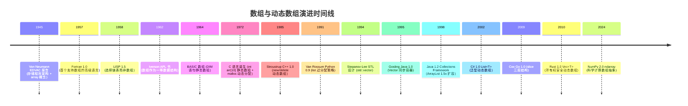

## 1. 概述与学习目标

### 1.1 什么是数组与动态数组

**数组**（Array）是计算机科学中最基础的数据结构，它将**相同类型**的元素存储在**一段连续的内存空间**中，并通过**索引**（下标）实现 $O(1)$ 的随机访问。这一简单的连续存储模型正是 Von Neumann 1945 年存储程序架构的物理体现，至今仍是所有现代计算机体系结构的基石。

**静态数组**（Static Array）在创建时必须指定大小且不可改变；**动态数组**（Dynamic Array）则在内部维护一个容量可变的底层数组，当空间不足时自动**倍增扩容**（resize），并通过**均摊分析**保证 `append` 操作的均摊 $O(1)$ 复杂度。

```
静态数组 (size = capacity = 5)        动态数组 (size = 4, capacity = 8)
内存连续                              内存连续，预留空间
┌───┬───┬───┬───┬───┐                ┌───┬───┬───┬───┬───┬───┬───┬───┐
│10 │20 │30 │40 │50 │                │10 │20 │30 │40 │   │   │   │   │
└───┴───┴───┴───┴───┘                └───┴───┴───┴───┴───┴───┴───┴───┘
 ↑                                   ↑               ↑
 0   1   2   3   4                   0   1   2   3   size          capacity
索引                                 索引            (可继续追加)
```

> 一句话定义：**数组 = 连续内存 + 索引寻址，随机访问 $O(1)$，中间插删 $O(n)$，缓存友好；动态数组 = 静态数组 + 倍增扩容，append 均摊 $O(1)$，是工业级动态序列的首选。**

### 1.2 学习目标

完成本文档学习后，你将能够：

1. **记忆**数组作为连续内存线性表的形式化定义 $\text{address}(i) = \text{base} + i \times \text{size}$，复述静态数组、动态数组在随机访问、头部插入、尾部插入、任意位置插入删除上的时间复杂度差异；
2. **理解** Von Neumann 1945 EDVAC 报告《First Draft of a Report on the EDVAC》确立的存储程序架构、Iverson 1962 APL 语言首创数组运算符、Stepanov-Lee 1994 STL 设计 `std::vector` 的历史脉络，说明连续存储为何成为现代计算机体系结构的基石；
3. **应用**顺序数组、动态数组（含倍增扩容与缩容）、二维行优先数组、稀疏数组三元组编写可运行的 Python/C++/Java 代码，解决双指针去重、滑动窗口最短子数组、前缀和区域和、差分数组区间加法等问题；
4. **分析**动态数组倍增扩容的均摊时间复杂度 $O(1)$ 论证，掌握聚合分析、势能分析、核算法三种均摊分析技术，证明"扩容代价 $O(n)$ 均摊到 $n$ 次操作上为 $O(1)$"的核心不变式；
5. **评估**数组相对于链表、动态数组、平衡树在"随机访问密集"问题维度上的优劣，识别 CPU 缓存行预取、SIMD 向量化、内存对齐中的选型动机；
6. **对比**静态数组、动态数组、循环缓冲区、稀疏数组、交错数组在内存开销、缓存友好性、扩容代价、实现复杂度维度的差异；
7. **创造**性设计基于数组的开源项目解决方案，如环形缓冲区日志系统、位图索引、Bitmap 布隆过滤器、Redis ziplist 压缩列表、TensorFlow Tensor 张量存储。

### 1.3 术语表

| 术语 | 英文 | 定义 |
| ---- | ---- | ---- |
| 数组 | array | 连续内存、相同类型元素的线性表 |
| 静态数组 | static array | 编译期确定大小、运行期不可变 |
| 动态数组 | dynamic array | 运行期可扩容的数组 |
| 容量 | capacity | 底层数组物理大小（已分配空间） |
| 长度 | size / length | 逻辑大小（实际元素数） |
| 索引 | index / subscript | 元素在数组中的位置，从 0 开始 |
| 基地址 | base address | 数组首元素起始内存地址 |
| 元素大小 | element size | 单个元素字节数（如 int 为 4 字节） |
| 扩容 | resize / grow | 容量不足时分配更大数组并复制元素 |
| 缩容 | shrink | 元素过少时回收空间避免浪费 |
| 均摊复杂度 | amortized complexity | 一系列操作的平均代价 |
| 行优先 | row-major | 二维数组按行存储（C/C++/Java） |
| 列优先 | column-major | 二维数组按列存储（Fortran/MATLAB） |
| 交错数组 | jagged array | 数组的数组，每行长度可不同 |
| 稀疏数组 | sparse array | 大部分元素为 0 的数组，仅存非零项 |
| 缓存行 | cache line | CPU 缓存预取的最小单位（64 字节） |
| 空间局部性 | spatial locality | 相邻内存位置近期可能被访问 |
| 时间局部性 | temporal locality | 已访问的数据近期可能再次被访问 |

### 1.4 数组 vs 其他线性结构

| 结构 | 随机访问 | 头部插删 | 尾部插删 | 中间插删 | 内存布局 | 缓存友好 |
| ---- | -------- | -------- | -------- | -------- | -------- | -------- |
| 静态数组 | $O(1)$ | $O(n)$ | $O(1)$ | $O(n)$ | 连续 | 极好 |
| 动态数组 | $O(1)$ | $O(n)$ | 均摊 $O(1)$ | $O(n)$ | 连续 | 极好 |
| 链表 | $O(n)$ | $O(1)$ | $O(1)$（带尾指针） | $O(1)$（已知前驱） | 离散 | 差 |
| 双链表 | $O(n)$ | $O(1)$ | $O(1)$ | $O(1)$（已知节点） | 离散 | 差 |
| 循环缓冲 | $O(1)$（取模） | $O(1)$ | $O(1)$ | 不支持 | 连续 | 极好 |
| 平衡树 | $O(\log n)$ | $O(\log n)$ | $O(\log n)$ | $O(\log n)$ | 离散 | 差 |

### 1.5 适用场景与不适用场景

| 场景 | 是否适合 | 说明 |
| ---- | -------- | ---- |
| 频繁随机访问（按索引） | 适合 | $O(1)$ 是数组最大优势 |
| 二分查找（有序数组） | 适合 | 配合 $O(1)$ 索引访问，整体 $O(\log n)$ |
| 大数据批量遍历 | 适合 | 缓存友好，CPU 预取 + SIMD 向量化加速 |
| 动态规划状态表 | 适合 | `dp[i]` 随机访问 $O(1)$，是 DP 标准存储 |
| 哈希表底层（开放寻址） | 适合 | 数组 + 哈希函数实现 $O(1)$ 平均查找 |
| 堆（二叉堆） | 适合 | 完全二叉树用数组存储，索引 $i$ 的父为 $i/2$ |
| 矩阵科学计算 | 适合 | NumPy ndarray、MATLAB matrix 等均基于连续数组 |
| 缓冲区（日志/IO/网络） | 适合 | 环形缓冲区（kfifo）是数组受限变体 |
| 频繁头部/中间插入删除 | 不适合 | $O(n)$ 移动元素代价高，应选链表 |
| 元素数量未知且增长缓慢 | 部分适合 | 动态数组扩容代价 $O(n)$ 偶发，可接受 |
| 高度稀疏的二维表 | 不适合 | 应选稀疏数组 CSR/CSC 节省内存 |

> **跨模块引用**：数组的链式替代方案参见 [链表](algorithm/linked-list)；数组作为栈/队列底层存储参见 [栈与队列](algorithm/stack-queue)；数组在哈希表开放寻址中的应用参见 [哈希表](algorithm/hashtable)；二分查找基于有序数组参见 [查找算法](algorithm/search)；动态规划状态表参见 [动态规划](algorithm/dynamic-programming)。

---

## 2. 历史动机与演进

### 2.1 前数组时代：表与序列的早期抽象

19 世纪末，数学家已使用"序列"（sequence）这一抽象概念描述有序元素集合。但计算机诞生前，"存储一个序列"的物理实现极其原始：穿孔卡片、纸带、继电器寄存器，每种介质对随机访问的支持都极弱。

1945 年 6 月，**John von Neumann** 在 Moore School of Electrical Engineering 完成了划时代的 101 页报告《First Draft of a Report on the EDVAC》，首次提出**存储程序架构**（stored-program architecture）：

- 程序与数据共享同一存储器；
- 存储器是**线性编址**的字序列，每个字有唯一地址；
- CPU 通过地址总线直接寻址任意存储单元。

这一架构（后称 Von Neumann 架构）天然支持"按地址随机访问"，为数组数据结构的诞生奠定了物理基础。所有现代计算机（x86、ARM、RISC-V）均基于此架构。

### 2.2 EDVAC 报告 1945：连续存储的物理实现

Von Neumann 在 EDVAC 报告中将存储器描述为"an array of storage locations"，这是"array"一词首次在计算机科学文献中出现。报告明确指出：

> 存储器由 $n$ 个字组成，每个字的地址为 $0, 1, 2, \ldots, n-1$，CPU 可在单位时间内访问任意地址 $i$。

这一描述精确刻画了数组的两个核心性质：

1. **连续编址**：地址线性递增，相邻元素的地址差固定；
2. **随机访问**：任意地址访问时间相同（与位置无关）。

这两个性质至今仍是数组的核心定义。EDVAC 报告因此被视为数组数据结构的诞生地。

### 2.3 Iverson 1962：APL 与数组运算符

1962 年，哈佛大学 **Kenneth E. Iverson** 出版《A Programming Language》（Wiley），首次将数组作为**一等数据结构**（first-class data structure）系统化定义：

- 引入维度（rank）、形状（shape）、元素（element）概念；
- 设计数组运算符 `+`、`×`、`/`、`⍴`（shape）、`,`（ravel）等；
- 提出广播（broadcast）规则，允许标量与数组运算；
- 后于 1968 年在 IBM 实现 APL 解释器。

Iverson 因此获 1979 年 ACM Turing Award，颁奖词明确指出"for his pioneering effort in programming languages and mathematical notation resulting in what has become APL"。

APL 的影响深远：NumPy、MATLAB、Julia、R 等数组编程语言均沿用其设计；现代深度学习框架（TensorFlow、PyTorch）的 Tensor 抽象本质上是 APL 多维数组运算的延伸。

### 2.4 McCarthy 1960：Lisp 与 list 的分野

1960 年，MIT 的 **John McCarthy** 在 *Communications of the ACM* 3(4): 184-195 发表《Recursive functions of symbolic expressions and their computation by machine, Part I》，定义 **Lisp** 语言。

Lisp 选择**链表**而非数组作为主要数据结构，原因有二：

1. 符号计算中元素长度动态变化，数组连续存储不灵活；
2. 1950 年代内存稀缺，链表按需分配更节省空间。

这一分野奠定了数组（适合数值计算）与链表（适合符号计算）的二元对立，至今仍是数据结构选型的核心决策点。

### 2.5 Stepanov-Lee 1994：STL 与 std::vector

1985 年，Bjarne Stroustrup 发布 C++ 1.0，但早期 C++ 标准库缺乏通用容器。1985-1994 年间，HP 实验室的 **Alexander Stepanov** 与 **Meng Lee** 在泛型编程思想指导下设计 **STL**（Standard Template Library），核心容器之一就是 `std::vector`：

- 模板参数化元素类型，类型安全；
- 自动管理内存，析构释放；
- 倍增扩容策略，`size() == capacity()` 时触发扩容；
- 提供 `begin()`、`end()`、`operator[]`、`at()` 等接口。

1994 年 STL 被 ANSI C++ 标准委员会采纳，1998 年 C++98 标准正式纳入 STL。`std::vector` 迅速成为 C++ 最常用的动态数组，影响了 Java `ArrayList`（1998）、C# `List<T>`（2002）、Rust `Vec<T>`（2010）等后续语言的设计。

Stepanov 在《From Mathematics to Generic Programming》（2014）中回忆：`std::vector` 的扩容策略借鉴了 Sedgewick 1983 年《Algorithms》第 1 版讨论的"倍增-复制"模式，而均摊 $O(1)$ 的论证则来自 Tarjan 1985 年《Amortized Complexity》的势能分析。

### 2.6 Gosling 1995：Java ArrayList 的诞生

1995 年 Sun 公司发布 Java 1.0，初始集合框架仅有 `Vector`（线程安全但性能差）与 `Hashtable`。1998 年 Java 1.2 引入 Collections Framework，核心是 `ArrayList`：

- 非线程安全（性能优先），可用 `Collections.synchronizedList` 包装；
- 倍增策略：`newCapacity = oldCapacity + (oldCapacity >> 1)`，即 1.5 倍扩容；
- 底层是 `Object[]`，泛型通过擦除实现。

`ArrayList` 至今仍是 Java 最常用的动态数组实现。

### 2.7 Van Rossum 1991：Python list 的过分配策略

1991 年 Guido van Rossum 发布 Python 0.9，`list` 是核心内建类型。CPython 的 `list` 实现采用**过分配**（over-allocation）策略，使扩容更温和：

```c
// CPython listobject.c - list_resize 函数
// 过分配公式：newsize + (newsize >> 3) + (newsize < 9 ? 3 : 6)
// 对小 list 较激进，对大 list 渐近 ~1.125 倍扩容
new_allocated = newsize + (newsize >> 3) + (newsize < 9 ? 3 : 6);
```

| 当前大小 | 新容量 | 增长率 |
| -------- | ------ | ------ |
| 0 | 4 | - |
| 4 | 8 | 2.0x |
| 8 | 16 | 2.0x |
| 16 | 25 | 1.56x |
| 64 | 78 | 1.22x |
| 256 | 295 | 1.15x |
| 1024 | 1159 | 1.13x |

这种温和扩容策略使 Python `list` 在内存占用与扩容次数之间取得平衡，每个 `append` 仍保持均摊 $O(1)$。

### 2.8 Cox 2009：Go slice 与三层抽象

2009 年 Google 发布 Go 1.0，其动态数组 `slice` 设计独特：

```go
// Go slice 底层结构（runtime/slice.go）
type slice struct {
    array unsafe.Pointer  // 底层数组指针
    len   int             // 长度
    cap   int             // 容量
}
```

`slice` 是对底层数组的**视图**（view），多个 slice 可共享同一底层数组。扩容策略（Go 1.18 后）：

- `cap < 256`：2 倍扩容；
- `cap >= 256`：`newcap = oldcap + (oldcap + 3*256) / 4`，渐近 1.25 倍。

这种设计兼顾小 slice 的快速扩容与大 slice 的内存节约，是工业级动态数组设计的典范。

### 2.9 演进时间线



### 2.10 关键设计决策

数组演进过程中的 7 个关键设计决策：

1. **连续存储而非链式存储**：牺牲插删效率换取 $O(1)$ 随机访问与缓存友好性；
2. **索引从 0 开始**：简化地址计算 $\text{base} + i \times \text{size}$，避免减法偏移；
3. **静态大小向动态扩容演进**：倍增扩容策略 + 均摊分析保证 $O(1)$ 追加；
4. **倍增而非线性增长**：扩容代价摊到 $n$ 次操作后为 $O(1)$；
5. **过分配而非精确分配**：CPython 的 ~1.125 倍策略平衡内存与扩容次数；
6. **slice 视图而非拷贝**：Go slice 多视图共享底层数组，节省内存；
7. **行优先存储**：C/C++/Java 选择行优先，Fortran/MATLAB 选择列优先，源于科学计算惯例。

---

## 3. 形式化定义

### 3.1 数组的数学定义

**数组** $A$ 是从索引集合 $I = \{0, 1, 2, \ldots, n-1\}$ 到数据域 $D$ 的一个**全函数**：

$$A: I \to D, \quad A[i] \in D \quad \forall i \in I$$

其核心性质：

1. **有限性**：$|I| = n < \infty$；
2. **同质性**：$\forall i, j \in I, A[i]$ 与 $A[j]$ 类型相同；
3. **线性序**：$I$ 上存在全序关系 $<$，元素按序排列；
4. **连续存储**：内存地址 $\text{addr}(A[i]) = \text{base} + i \times \text{size}$，其中 $\text{base}$ 为基地址，$\text{size}$ 为元素字节大小。

### 3.2 随机访问的形式化

**随机访问**（Random Access）指：对于任意 $i \in I$，访问 $A[i]$ 的时间复杂度与 $i$ 无关，即 $T_{\text{access}}(i) = O(1)$。

证明（基于地址公式）：

$$\text{addr}(A[i]) = \text{base} + i \times \text{size}$$

计算 $\text{addr}(A[i])$ 需要：

- 1 次乘法（$i \times \text{size}$）
- 1 次加法（$+ \text{base}$）

均为常数时间 $O(1)$，与 $i$ 无关。这正是数组随机访问高效的根本原因。

### 3.3 ADT 定义

```text
ADT Array {
    数据对象：D = {a_i | a_i ∈ ElemSet, i = 0, 1, ..., n-1, n ≥ 0}
    数据关系：R = {<a_{i-1}, a_i> | a_{i-1}, a_i ∈ D, i = 1, ..., n-1}
                    且 a_i 在内存中连续存储
    基本操作：
        InitArray(&A, n)        : 构造长度为 n 的数组
        DestroyArray(&A)        : 销毁数组
        Length(A)               : 返回长度 n
        Get(A, i)               : 取第 i 个元素 (O(1))
        Set(&A, i, e)           : 修改第 i 个元素 (O(1))
        Insert(&A, i, e)        : 在位置 i 插入元素 (O(n))
        Delete(&A, i)           : 删除位置 i 的元素 (O(n))
        Traverse(A, visit)      : 遍历所有元素
}

ADT DynamicArray extends Array {
    基本操作：
        Append(&A, e)           : 尾部追加元素 (均摊 O(1))
        Resize(&A, newCap)      : 显式调整容量
        Capacity(A)             : 返回当前容量
        Shrink(&A)              : 自动缩容
}
```

### 3.4 复杂度表

| 操作 | 静态数组 | 动态数组 |
| ---- | -------- | -------- |
| 随机访问 `A[i]` | $O(1)$ | $O(1)$ |
| 头部插入 | $O(n)$ | $O(n)$ |
| 尾部插入 | $O(1)$ | 均摊 $O(1)$ |
| 中间插入 | $O(n)$ | $O(n)$ |
| 头部删除 | $O(n)$ | $O(n)$ |
| 尾部删除 | $O(1)$ | $O(1)$ |
| 中间删除 | $O(n)$ | $O(n)$ |
| 按值查找（无序） | $O(n)$ | $O(n)$ |
| 按值查找（有序，二分） | $O(\log n)$ | $O(\log n)$ |
| 扩容 | 不支持 | $O(n)$ 触发频率 $O(1/n)$ |
| 缩容 | 不支持 | $O(n)$ 触发频率 $O(1/n)$ |

---

## 4. 静态数组的实现

### 4.1 内存模型图解

```
内存地址:  base  base+4  base+8  base+12  base+16
索引:       0      1       2       3        4
元素(int): 10    20      30      40       50
           ┌────┬────┬────┬────┬────┐
           │ 10 │ 20 │ 30 │ 40 │ 50 │
           └────┴────┴────┴────┴────┘
           ↑
           base = 起始地址
           size = 4 字节 (int)

地址公式: address(A[i]) = base + i × 4
```

### 4.2 C++ 静态数组实现

```cpp
// C++ 静态数组三种形式
#include <array>
#include <cstddef>

// 形式 1：C 风格静态数组（栈分配，编译期确定大小）
int c_array[5] = {10, 20, 30, 40, 50};

// 形式 2：堆分配动态数组（手动管理内存）
int* heap_array = new int[5]{10, 20, 30, 40, 50};
delete[] heap_array;  // 必须手动释放

// 形式 3：C++11 std::array（栈分配 + STL 接口，推荐）
std::array<int, 5> stl_array = {10, 20, 30, 40, 50};

// 访问元素 O(1)
int val = stl_array[2];      // operator[] 无边界检查
int safe_val = stl_array.at(2);  // at() 有边界检查，越界抛 std::out_of_range

// 修改元素 O(1)
stl_array[3] = 100;

// 获取大小 O(1)
size_t size = stl_array.size();  // 5

// 遍历 O(n) - 缓存友好，CPU 预取
long long sum = 0;
for (size_t i = 0; i < stl_array.size(); ++i) {
    sum += stl_array[i];  // 连续内存访问，缓存命中率极高
}
```

### 4.3 Java 静态数组实现

```java
// Java 静态数组（堆分配，长度不可变）
int[] arr = new int[5];              // 默认值 0
int[] arr2 = {10, 20, 30, 40, 50};   // 直接初始化

// 访问 O(1)
int val = arr2[2];                   // 30

// 修改 O(1)
arr2[3] = 100;

// 长度 O(1)
int length = arr2.length;            // 5

// 遍历 O(n) - 增强型 for 循环
long sum = 0;
for (int x : arr2) {
    sum += x;
}

// 边界检查：Java 数组访问会自动进行，越界抛 ArrayIndexOutOfBoundsException
// int bad = arr2[10];  // 抛异常
```

### 4.4 Python 中的"数组"

Python 没有原生的静态数组，`list` 本质是动态数组。如果需要真正的静态数组，可用 `array` 模块或 `numpy`：

```python
import array
import numpy as np

# array.array: 类型化静态数组（C 类型，内存连续）
arr = array.array('i', [10, 20, 30, 40, 50])  # 'i' = signed int
print(arr[2])  # 30, O(1) 访问

# numpy.ndarray: 科学计算数组（内存连续 + 向量化运算）
np_arr = np.array([10, 20, 30, 40, 50], dtype=np.int32)
print(np_arr[2])  # 30, O(1) 访问
print(np_arr.sum())  # 150, C 层向量化求和，远快于 Python 循环

# Python list 也是动态数组，但元素是 PyObject* 指针，不连续存储数据
py_list = [10, 20, 30, 40, 50]
# 底层：PyObject* 数组 [ptr, ptr, ptr, ptr, ptr]
# 每个 ptr 指向独立的 int 对象，数据本身不连续
```

### 4.5 三语言对比表

| 语言 | 声明 | 内存位置 | 长度可变 | 边界检查 |
| ---- | ---- | -------- | -------- | -------- |
| C | `int arr[5]` | 栈 | 否 | 无（UB） |
| C++ | `std::array<int,5>` | 栈 | 否 | `at()` 有 |
| C++ | `new int[5]` | 堆 | 否 | 无 |
| Java | `new int[5]` | 堆 | 否 | 有 |
| Python | `[1,2,3]` | 堆 | 是（动态） | 有 |
| Go | `[5]int{}` | 栈/堆 | 否 | 有 |
| Go | `[]int{}` | 堆 | 是（动态） | 有 |

---

## 5. 动态数组的实现

### 5.1 为什么需要动态数组

静态数组在创建时必须指定大小，运行期无法改变。当元素数量超过容量时无法继续添加；当元素数量远小于容量时浪费内存。**动态数组**通过"预留空间 + 自动扩容"解决这一矛盾：

- 容量（capacity）：底层数组物理大小；
- 长度（size）：实际元素数；
- `size < capacity` 时 `append` 直接写入，$O(1)$；
- `size == capacity` 时触发扩容，分配新数组 + 复制元素，$O(n)$。

各语言动态数组实现：

| 语言 | 类 | 扩容策略 | 默认容量 |
| ---- | -- | -------- | -------- |
| C++ | `std::vector<T>` | 2 倍（GCC）/ 1.5 倍（MSVC） | 0 |
| Java | `ArrayList<E>` | 1.5 倍 | 10 |
| Python | `list` | ~1.125 倍（过分配公式） | 0 |
| Go | `slice` | 2 倍（< 256）/ ~1.25 倍（≥ 256） | 0 |
| Rust | `Vec<T>` | 2 倍 | 0 |
| C# | `List<T>` | 2 倍 | 0 |

### 5.2 倍增扩容机制

```
扩容前 (capacity=4, size=4):
┌────┬────┬────┬────┐
│ 10 │ 20 │ 30 │ 40 │
└────┴────┴────┴────┘
                     ↑
                     size=capacity，触发扩容

扩容中 (分配新数组 + 复制):
┌────┬────┬────┬────┐    ┌────┬────┬────┬────┬────┬────┬────┬────┐
│ 10 │ 20 │ 30 │ 40 │ →  │ 10 │ 20 │ 30 │ 40 │    │    │    │    │
└────┴────┴────┴────┘    └────┴────┴────┴────┴────┴────┴────┴────┘
                          ↑                        ↑
                          新数组                    新 capacity=8
                          (旧数组释放)

扩容后追加新元素 50:
┌────┬────┬────┬────┬────┬────┬────┬────┐
│ 10 │ 20 │ 30 │ 40 │ 50 │    │    │    │
└────┴────┴────┴────┴────┴────┴────┴────┘
                    ↑
                    size=5, capacity=8
```

### 5.3 Python 完整实现（含倍增扩容与缩容）

```python
from typing import Generic, TypeVar, Iterator
import sys

T = TypeVar('T')


class DynamicArray(Generic[T]):
    """动态数组完整实现（Python 3.9+ Generic 语法）

    特性：
    - 倍增扩容策略（2 倍）
    - 1/4 阈值缩容（避免抖动）
    - 索引边界检查
    - 支持 __getitem__ / __setitem__ / __len__ / __iter__
    - 内存友好：缩容后释放多余空间
    """

    def __init__(self, capacity: int = 10) -> None:
        if capacity < 0:
            raise ValueError(f'capacity must be non-negative, got {capacity}')
        self._data: list[T | None] = [None] * capacity
        self._size: int = 0
        self._capacity: int = capacity

    def __len__(self) -> int:
        """返回长度 O(1)"""
        return self._size

    def __getitem__(self, index: int) -> T:
        """索引访问 O(1)，支持负索引"""
        if index < 0:
            index += self._size
        if index < 0 or index >= self._size:
            raise IndexError(f'array index {index} out of range [0, {self._size})')
        return self._data[index]  # type: ignore

    def __setitem__(self, index: int, value: T) -> None:
        """索引修改 O(1)"""
        if index < 0:
            index += self._size
        if index < 0 or index >= self._size:
            raise IndexError(f'array index {index} out of range [0, {self._size})')
        self._data[index] = value

    def __iter__(self) -> Iterator[T]:
        """迭代器 O(n)"""
        for i in range(self._size):
            yield self._data[i]  # type: ignore

    def capacity(self) -> int:
        """返回当前容量 O(1)"""
        return self._capacity

    def is_empty(self) -> bool:
        """判空 O(1)"""
        return self._size == 0

    def append(self, value: T) -> None:
        """尾部追加，均摊 O(1)"""
        if self._size == self._capacity:
            self._resize(self._capacity * 2 if self._capacity > 0 else 1)
        self._data[self._size] = value
        self._size += 1

    def insert(self, index: int, value: T) -> None:
        """在 index 处插入 value O(n)"""
        if index < 0:
            index += self._size
        if index < 0 or index > self._size:
            raise IndexError(f'array index {index} out of range [0, {self._size}]')
        if self._size == self._capacity:
            self._resize(self._capacity * 2 if self._capacity > 0 else 1)
        # 从后向前移动元素，腾出 index 位置
        for i in range(self._size, index, -1):
            self._data[i] = self._data[i - 1]
        self._data[index] = value
        self._size += 1

    def pop(self, index: int | None = None) -> T:
        """删除并返回 index 处元素，默认删除末尾 O(n)"""
        if index is None:
            index = self._size - 1
        if index < 0:
            index += self._size
        if index < 0 or index >= self._size:
            raise IndexError(f'array index {index} out of range [0, {self._size})')
        removed: T = self._data[index]  # type: ignore
        # 从前向后移动元素，填补 index 空位
        for i in range(index, self._size - 1):
            self._data[i] = self._data[i + 1]
        self._data[self._size - 1] = None  # 帮助 GC
        self._size -= 1
        # 缩容：当 size < capacity/4 时缩容为 capacity/2
        # 阈值用 1/4 而非 1/2，避免在 1/2 附近反复扩缩导致抖动
        if 0 < self._size < self._capacity // 4 and self._capacity > 10:
            self._resize(max(self._capacity // 2, 10))
        return removed

    def remove(self, value: T) -> None:
        """删除第一个等于 value 的元素 O(n)"""
        for i in range(self._size):
            if self._data[i] == value:
                self.pop(i)
                return
        raise ValueError(f'{value!r} not in array')

    def _resize(self, new_capacity: int) -> None:
        """扩容/缩容核心：分配新数组 + 复制元素 O(n)"""
        new_data: list[T | None] = [None] * new_capacity
        for i in range(self._size):
            new_data[i] = self._data[i]
        self._data = new_data
        self._capacity = new_capacity

    def __repr__(self) -> str:
        return f'DynamicArray({list(self)!r}, capacity={self._capacity})'


# 使用示例
if __name__ == '__main__':
    arr: DynamicArray[int] = DynamicArray(capacity=2)
    for x in [10, 20, 30, 40, 50]:
        arr.append(x)
        print(f'append {x}: size={len(arr)}, capacity={arr.capacity()}')
    # 输出：
    # append 10: size=1, capacity=2
    # append 20: size=2, capacity=2
    # append 30: size=3, capacity=4   <- 触发扩容
    # append 40: size=4, capacity=4
    # append 50: size=5, capacity=8   <- 再次触发扩容

    print(arr[2])  # 30
    arr[2] = 99
    print(arr[2])  # 99

    arr.insert(1, 15)  # 在索引 1 处插入 15
    print(list(arr))   # [10, 15, 20, 99, 40, 50]

    arr.pop(0)  # 删除头部
    print(list(arr))   # [15, 20, 99, 40, 50]
```

### 5.4 C++ 完整实现

```cpp
// C++ 动态数组实现（类似 std::vector<T>）
#include <cstddef>
#include <stdexcept>
#include <utility>
#include <type_traits>
#include <initializer_list>

template <typename T>
class DynamicArray {
public:
    // 默认构造
    DynamicArray() : data_(nullptr), size_(0), capacity_(0) {}

    // 带初始容量构造
    explicit DynamicArray(size_t cap) : data_(nullptr), size_(0), capacity_(cap) {
        if (cap > 0) {
            data_ = static_cast<T*>(::operator new(cap * sizeof(T)));
        }
    }

    // 列表初始化
    DynamicArray(std::initializer_list<T> init) : DynamicArray(init.size()) {
        for (const auto& x : init) {
            push_back(x);
        }
    }

    // 拷贝构造
    DynamicArray(const DynamicArray& other) : DynamicArray(other.capacity_) {
        for (size_t i = 0; i < other.size_; ++i) {
            new (&data_[size_]) T(other.data_[i]);  // placement new
            ++size_;
        }
    }

    // 析构
    ~DynamicArray() { destroy(); }

    // 拷贝赋值
    DynamicArray& operator=(const DynamicArray& other) {
        if (this != &other) {
            destroy();
            capacity_ = other.capacity_;
            data_ = capacity_ > 0 ? static_cast<T*>(::operator new(capacity_ * sizeof(T))) : nullptr;
            for (size_t i = 0; i < other.size_; ++i) {
                new (&data_[size_]) T(other.data_[i]);
                ++size_;
            }
        }
        return *this;
    }

    // 元素访问 O(1)
    T& operator[](size_t i) { return data_[i]; }
    const T& operator[](size_t i) const { return data_[i]; }

    // 带边界检查的访问 O(1)
    T& at(size_t i) {
        if (i >= size_) throw std::out_of_range("index out of range");
        return data_[i];
    }

    // 尾部追加，均摊 O(1)
    void push_back(const T& value) {
        if (size_ == capacity_) reserve(capacity_ == 0 ? 1 : capacity_ * 2);
        new (&data_[size_]) T(value);  // placement new
        ++size_;
    }

    // 尾部追加（右值引用，支持移动语义）
    void push_back(T&& value) {
        if (size_ == capacity_) reserve(capacity_ == 0 ? 1 : capacity_ * 2);
        new (&data_[size_]) T(std::move(value));
        ++size_;
    }

    // 尾部删除 O(1)
    void pop_back() {
        if (size_ == 0) throw std::out_of_range("pop from empty array");
        --size_;
        data_[size_].~T();  // 显式析构
        // 缩容：当 size < capacity/4 时缩容为 capacity/2
        if (size_ < capacity_ / 4 && capacity_ > 16) {
            reserve(capacity_ / 2);
        }
    }

    // 在 index 处插入 O(n)
    void insert(size_t index, const T& value) {
        if (index > size_) throw std::out_of_range("insert index out of range");
        if (size_ == capacity_) reserve(capacity_ == 0 ? 1 : capacity_ * 2);
        // 从后向前移动元素（移动构造 + 析构）
        for (size_t i = size_; i > index; --i) {
            new (&data_[i]) T(std::move(data_[i - 1]));
            data_[i - 1].~T();
        }
        new (&data_[index]) T(value);
        ++size_;
    }

    // 删除 index 处元素 O(n)
    void erase(size_t index) {
        if (index >= size_) throw std::out_of_range("erase index out of range");
        data_[index].~T();
        for (size_t i = index; i < size_ - 1; ++i) {
            new (&data_[i]) T(std::move(data_[i + 1]));
            data_[i + 1].~T();
        }
        --size_;
    }

    // 预留容量 O(n)
    void reserve(size_t new_cap) {
        if (new_cap <= capacity_) return;
        T* new_data = static_cast<T*>(::operator new(new_cap * sizeof(T)));
        for (size_t i = 0; i < size_; ++i) {
            new (&new_data[i]) T(std::move(data_[i]));
            data_[i].~T();
        }
        ::operator delete(data_);
        data_ = new_data;
        capacity_ = new_cap;
    }

    // 容量与长度
    size_t size() const { return size_; }
    size_t capacity() const { return capacity_; }
    bool empty() const { return size_ == 0; }

private:
    T* data_;
    size_t size_;
    size_t capacity_;

    void destroy() {
        for (size_t i = 0; i < size_; ++i) {
            data_[i].~T();
        }
        ::operator delete(data_);
        data_ = nullptr;
        size_ = capacity_ = 0;
    }
};
```

### 5.5 Java 完整实现

```java
import java.util.Iterator;
import java.util.NoSuchElementException;

/**
 * 泛型动态数组完整实现（类似 java.util.ArrayList<E>）。
 *
 * <p>特性：
 * <ul>
 *   <li>1.5 倍扩容策略（与 OpenJDK ArrayList 一致）</li>
 *   <li>1/4 阈值缩容</li>
 *   <li>支持泛型、Iterable 接口</li>
 *   <li>fail-fast 迭代器（简化版）</li>
 * </ul>
 */
public class DynamicArray<E> implements Iterable<E> {
    private static final int DEFAULT_CAPACITY = 10;
    private static final Object[] EMPTY_ARRAY = {};

    private Object[] data;
    private int size;

    public DynamicArray() {
        this.data = EMPTY_ARRAY;  // 延迟分配，节省空数组内存
        this.size = 0;
    }

    public DynamicArray(int initialCapacity) {
        if (initialCapacity < 0) {
            throw new IllegalArgumentException("Illegal capacity: " + initialCapacity);
        }
        this.data = new Object[initialCapacity];
        this.size = 0;
    }

    public int size() { return size; }
    public int capacity() { return data.length; }
    public boolean isEmpty() { return size == 0; }

    @SuppressWarnings("unchecked")
    public E get(int index) {
        checkIndex(index);
        return (E) data[index];
    }

    public E set(int index, E element) {
        checkIndex(index);
        @SuppressWarnings("unchecked")
        E old = (E) data[index];
        data[index] = element;
        return old;
    }

    /** 尾部追加，均摊 O(1)。 */
    public boolean add(E element) {
        ensureCapacity(size + 1);
        data[size++] = element;
        return true;
    }

    /** 在 index 处插入 O(n)。 */
    public void add(int index, E element) {
        if (index < 0 || index > size) {
            throw new IndexOutOfBoundsException("Index: " + index + ", Size: " + size);
        }
        ensureCapacity(size + 1);
        // 从后向前移动元素
        System.arraycopy(data, index, data, index + 1, size - index);
        data[index] = element;
        size++;
    }

    /** 删除 index 处元素 O(n)。 */
    @SuppressWarnings("unchecked")
    public E remove(int index) {
        checkIndex(index);
        E removed = (E) data[index];
        int numMoved = size - index - 1;
        if (numMoved > 0) {
            System.arraycopy(data, index + 1, data, index, numMoved);
        }
        data[--size] = null;  // 帮助 GC
        // 缩容：当 size < capacity/4 且容量大于默认值时缩容
        if (size < data.length / 4 && data.length > DEFAULT_CAPACITY) {
            shrink();
        }
        return removed;
    }

    /** 扩容核心：1.5 倍策略。 */
    private void ensureCapacity(int minCapacity) {
        if (minCapacity > data.length) {
            int newCapacity = data.length + (data.length >> 1);  // 1.5 倍
            if (newCapacity < minCapacity) newCapacity = minCapacity;
            Object[] newData = new Object[newCapacity];
            System.arraycopy(data, 0, newData, 0, size);
            data = newData;
        }
    }

    /** 缩容：缩为 capacity/2，但不小于 DEFAULT_CAPACITY。 */
    private void shrink() {
        int newCapacity = Math.max(data.length >> 1, DEFAULT_CAPACITY);
        Object[] newData = new Object[newCapacity];
        System.arraycopy(data, 0, newData, 0, size);
        data = newData;
    }

    private void checkIndex(int index) {
        if (index < 0 || index >= size) {
            throw new IndexOutOfBoundsException("Index: " + index + ", Size: " + size);
        }
    }

    @Override
    public Iterator<E> iterator() {
        return new ArrayIterator();
    }

    private class ArrayIterator implements Iterator<E> {
        private int cursor = 0;

        @Override public boolean hasNext() { return cursor < size; }

        @Override
        @SuppressWarnings("unchecked")
        public E next() {
            if (!hasNext()) throw new NoSuchElementException();
            return (E) data[cursor++];
        }
    }
}
```

### 5.6 三语言实现对比表

| 特性 | Python | C++ | Java |
| ---- | ------ | --- | ---- |
| 扩容策略 | 2 倍 | 2 倍 | 1.5 倍 |
| 缩容阈值 | size < cap/4 | size < cap/4 | size < cap/4 |
| 内存管理 | GC | RAII（析构） | GC |
| 移动语义 | 无 | 有（std::move） | 无（值拷贝） |
| 边界检查 | 有（IndexError） | `at()` 有 / `[]` 无 | 有 |
| 迭代器 | `__iter__` | `begin()`/`end()` | `Iterator<E>` |
| 类型安全 | 弱（动态类型） | 强（模板） | 强（泛型擦除） |

---

## 6. 均摊复杂度分析

### 6.1 为什么需要均摊分析

动态数组的 `append` 操作大多数时候是 $O(1)$（直接写入），偶尔触发扩容时是 $O(n)$（分配新数组 + 复制 $n$ 个元素）。**最坏情况分析**会得出 $O(n)$，但这过于悲观——因为扩容很少发生。

**均摊分析**（Amortized Analysis）是评估"一系列操作平均代价"的方法，由 Tarjan 1985 年在《Amortized Complexity》中系统化。CLRS 第 17 章详细讨论了三种均摊分析技术：

1. **聚合分析**（Aggregate Analysis）
2. **核算法**（Accounting Method）
3. **势能法**（Potential Method）

### 6.2 聚合分析法

**思路**：计算 $n$ 次操作的总代价 $T(n)$，再除以 $n$ 得到均摊代价 $\hat{c} = T(n)/n$。

**场景**：从空数组开始连续 $n$ 次 `append`，倍增扩容（2 倍策略）。

扩容发生在第 1, 2, 4, 8, 16, ..., $2^k$ 次插入时（即 $2^k \leq n < 2^{k+1}$）。

| 操作 i | 扩容发生 | 扩容代价 | 写入代价 | 总代价 |
| ------ | -------- | -------- | -------- | ------ |
| 1 | 是（0→1） | 0 | 1 | 1 |
| 2 | 是（1→2） | 1 | 1 | 2 |
| 3 | 否 | 0 | 1 | 1 |
| 4 | 是（2→4） | 2 | 1 | 3 |
| 5-7 | 否 | 0 | 1 | 1×3 |
| 8 | 是（4→8） | 4 | 1 | 5 |
| ... | ... | ... | ... | ... |
| $2^k$ | 是 | $2^{k-1}$ | 1 | $2^{k-1}+1$ |

**总代价**：

$$T(n) = \underbrace{n}_{\text{写入代价}} + \underbrace{\sum_{i=0}^{\lfloor \log_2 n \rfloor} 2^i}_{\text{扩容代价}} = n + (2^{\lfloor \log_2 n \rfloor + 1} - 1) \leq n + 2n - 1 = 3n - 1$$

**均摊代价**：

$$\hat{c} = \frac{T(n)}{n} \leq \frac{3n - 1}{n} = 3 - \frac{1}{n} = O(1)$$

因此 `append` 的均摊复杂度为 $O(1)$。

### 6.3 势能分析法

**思路**：定义势函数 $\Phi(D_i)$ 表示数据结构 $D_i$ 在第 $i$ 次操作后的"势能"，均摊代价 $\hat{c}_i = c_i + \Phi(D_i) - \Phi(D_{i-1})$。

**关键**：选择合适的势函数，使均摊代价易于计算且上界可控。

**场景**：倍增扩容策略下，定义势函数：

$$\Phi(D_i) = 2 \times \text{size}_i - \text{capacity}_i$$

（其中 $\text{size}_i$ 为长度，$\text{capacity}_i$ 为容量）

**初始**：$\Phi(D_0) = 0$（空数组）。

**情况 1：第 $i$ 次操作不触发扩容**（$\text{size}_i < \text{capacity}_i$）

- 实际代价 $c_i = 1$（仅写入）
- 势能变化 $\Phi(D_i) - \Phi(D_{i-1}) = 2(\text{size}_i - \text{size}_{i-1}) = 2$
- 均摊代价 $\hat{c}_i = 1 + 2 = 3 = O(1)$

**情况 2：第 $i$ 次操作触发扩容**（$\text{size}_i = \text{capacity}_{i-1} + 1$，扩容前 $\text{size}_{i-1} = \text{capacity}_{i-1}$）

- 实际代价 $c_i = \text{size}_{i-1} + 1$（复制 $\text{size}_{i-1}$ 个 + 写入 1 个）
- 扩容后 $\text{capacity}_i = 2 \times \text{capacity}_{i-1}$
- 势能变化 $\Phi(D_i) - \Phi(D_{i-1}) = (2(\text{size}_{i-1} + 1) - 2 \text{capacity}_{i-1}) - (2 \text{size}_{i-1} - \text{capacity}_{i-1})$
  $= 2 - \text{capacity}_{i-1} = 2 - \text{size}_{i-1}$
- 均摊代价 $\hat{c}_i = (\text{size}_{i-1} + 1) + (2 - \text{size}_{i-1}) = 3 = O(1)$

两种情况均摊代价均为 3，故 `append` 的均摊复杂度为 $O(1)$。

### 6.4 核算法

**思路**：为每次操作"预付"代价，部分用于当前操作，部分存入"信用"（credit），用于未来扩容。

**场景**：倍增扩容策略下，每次 `append` 预付 3 单位代价：

- 1 单位用于当前写入；
- 1 单位存入信用，用于将来将该元素从旧数组复制到新数组；
- 1 单位存入信用，用于将来将"前一次扩容后第一个元素"从旧数组复制到新数组。

当扩容发生时，需要复制 $n$ 个元素，恰好可由累积的 $n$ 单位信用支付（每个元素已预存 1 单位复制代价）。

**结论**：每次 `append` 预付 3 单位，足够支付扩容代价，故均摊代价 $O(1)$。

### 6.5 缩容的均摊分析

缩容策略：当 $\text{size} < \text{capacity}/4$ 时缩容为 $\text{capacity}/2$。

**为什么用 1/4 而非 1/2？** 假设用 1/2，则在 $\text{size} = \text{capacity}/2$ 附近反复 `append`/`pop` 会反复触发扩容缩容，**抖动**（thrashing）导致均摊复杂度退化为 $O(n)$。

**1/4 阈值的均摊正确性**：定义势函数

$$\Phi(D_i) = \begin{cases} 2 \times \text{size}_i - \text{capacity}_i & \text{if } \text{size}_i \geq \text{capacity}_i / 2 \\ \text{capacity}_i / 2 - \text{size}_i & \text{if } \text{size}_i < \text{capacity}_i / 2 \end{cases}$$

可证明 `append` 与 `pop` 的均摊代价均为 $O(1)$（详见 CLRS 习题 17.3-6）。

### 6.6 三种方法对比

| 方法 | 思路 | 适用场景 | 难度 |
| ---- | ---- | -------- | ---- |
| 聚合分析 | 总代价 / 操作数 | 操作序列规律明显 | 简单 |
| 势能法 | 选择势函数 | 数据结构状态明确 | 中等 |
| 核算法 | 预付代价 + 信用 | 直观易理解 | 中等 |

---

## 7. 多维数组

### 7.1 二维数组的两种存储顺序

二维数组 $A[m][n]$ 在内存中是**一维**的，需要选择存储顺序：

**行优先**（Row-major）——C/C++/Java/Python 等大多数语言：

```
A[0][0] A[0][1] A[0][2] A[1][0] A[1][1] A[1][2] A[2][0] A[2][1] A[2][2]
```

地址公式：

$$\text{addr}(A[i][j]) = \text{base} + (i \times n + j) \times \text{size}$$

**列优先**（Column-major）——Fortran/MATLAB/Julia 等：

```
A[0][0] A[1][0] A[2][0] A[0][1] A[1][1] A[2][1] A[0][2] A[1][2] A[2][2]
```

地址公式：

$$\text{addr}(A[i][j]) = \text{base} + (j \times m + i) \times \text{size}$$

### 7.2 缓存友好性差异

```cpp
// 缓存友好（行优先遍历）
for (int i = 0; i < m; ++i) {
    for (int j = 0; j < n; ++j) {
        sum += A[i][j];  // 相邻 j 内存相邻，缓存命中率高
    }
}

// 缓存不友好（列优先遍历）
for (int j = 0; j < n; ++j) {
    for (int i = 0; i < m; ++i) {
        sum += A[i][j];  // 相邻 i 内存跨行，缓存命中率低
    }
}
```

对于 $1024 \times 1024$ 的 `int` 数组（4 MB），行优先遍历可比列优先快 **5-10 倍**（取决于缓存大小）。

### 7.3 用一维数组模拟二维数组

```cpp
// C++：用一维数组模拟二维数组（缓存友好 + 节省内存）
class Matrix2D {
public:
    Matrix2D(int rows, int cols) : rows_(rows), cols_(cols), data_(new int[rows * cols]()) {}

    ~Matrix2D() { delete[] data_; }

    // 行优先索引
    int& operator()(int i, int j) {
        return data_[i * cols_ + j];
    }

    const int& operator()(int i, int j) const {
        return data_[i * cols_ + j];
    }

    int rows() const { return rows_; }
    int cols() const { return cols_; }

private:
    int rows_;
    int cols_;
    int* data_;
};

// 使用
Matrix2D mat(3, 4);
mat(1, 2) = 42;  // 等价于 mat.data_[1 * 4 + 2] = 42
```

### 7.4 交错数组（Jagged Array）

**交错数组**是"数组的数组"，每行长度可不同：

```java
// Java 交错数组
int[][] jagged = {
    {1, 2, 3},
    {4, 5},
    {6, 7, 8, 9}
};

// 访问
int val = jagged[1][1];  // 5
int rowLen = jagged[2].length;  // 4
```

```
jagged[0] ─→ [1, 2, 3]
jagged[1] ─→ [4, 5]
jagged[2] ─→ [6, 7, 8, 9]
```

**交错数组 vs 二维数组**：

| 特性 | 二维数组 | 交错数组 |
| ---- | -------- | -------- |
| 内存布局 | 连续（行优先） | 离散（每行独立） |
| 缓存友好性 | 极好 | 差 |
| 行长度 | 必须相同 | 可不同 |
| 访问开销 | 1 次乘法 + 1 次加法 | 2 次指针解引用 |
| 灵活性 | 低 | 高 |

### 7.5 三维与高维数组

三维数组 $A[d_1][d_2][d_3]$（行优先）地址公式：

$$\text{addr}(A[i][j][k]) = \text{base} + (i \times d_2 \times d_3 + j \times d_3 + k) \times \text{size}$$

一般地，$n$ 维数组 $A[d_1][d_2] \cdots [d_n]$（行优先）地址公式：

$$\text{addr}(A[i_1][i_2] \cdots [i_n]) = \text{base} + \left(\sum_{k=1}^{n} i_k \prod_{j=k+1}^{n} d_j\right) \times \text{size}$$

---

## 8. 稀疏数组

### 8.1 什么是稀疏数组

当数组中绝大多数元素为 0（或同一默认值）时，称为**稀疏数组**（Sparse Array）。直接存储 $m \times n$ 数组浪费 $O(mn)$ 空间，而稀疏存储仅需 $O(k)$（$k$ 为非零元素数）。

**典型应用**：

- 五子棋棋盘（19×19，但落子位置仅数十个）
- 地理信息系统栅格（大部分区域无数据）
- 推荐系统用户-物品矩阵（用户只评分少数物品）
- 神经网络权重剪枝（90%+ 权重为 0）

### 8.2 三元组表（COO 格式）

最简单的稀疏存储：仅记录非零元素的 `(row, col, value)` 三元组。

```python
# Python：稀疏数组的三元组表存储
from typing import List, Tuple

class SparseMatrix:
    """COO (Coordinate) 格式稀疏矩阵"""

    def __init__(self, rows: int, cols: int):
        self.rows = rows
        self.cols = cols
        self.triplets: List[Tuple[int, int, float]] = []  # [(row, col, value), ...]

    def set(self, i: int, j: int, value: float) -> None:
        """设置元素"""
        if value != 0:
            self.triplets.append((i, j, value))

    def get(self, i: int, j: int) -> float:
        """获取元素 O(k)"""
        for (r, c, v) in self.triplets:
            if r == i and c == j:
                return v
        return 0.0

    def to_dense(self) -> List[List[float]]:
        """转换为稠密矩阵 O(rows × cols + k)"""
        dense = [[0.0] * self.cols for _ in range(self.rows)]
        for (r, c, v) in self.triplets:
            dense[r][c] = v
        return dense

    def density(self) -> float:
        """稀疏度 = 非零元素 / 总元素"""
        return len(self.triplets) / (self.rows * self.cols)


# 示例：五子棋棋盘
board = SparseMatrix(19, 19)
board.set(10, 10, 1)  # 黑子
board.set(10, 11, 2)  # 白子
board.set(11, 10, 1)  # 黑子
print(f'密度: {board.density():.4f}')  # 0.0083 (3/361)
```

### 8.3 CSR 格式（Compressed Sparse Row）

CSR 是科学计算中常用的稀疏矩阵格式，支持高效行切片与矩阵乘法：

```python
class CSRMatrix:
    """CSR (Compressed Sparse Row) 格式稀疏矩阵

    数据结构：
    - values: 非零元素值数组
    - col_indices: 非零元素列索引数组
    - row_ptr: 行指针数组，row_ptr[i] 到 row_ptr[i+1]-1 是第 i 行的非零元素
    """

    def __init__(self, dense: List[List[float]]):
        self.rows = len(dense)
        self.cols = len(dense[0]) if dense else 0
        self.values: List[float] = []
        self.col_indices: List[int] = []
        self.row_ptr: List[int] = [0]  # row_ptr[0] = 0

        for i in range(self.rows):
            for j in range(self.cols):
                if dense[i][j] != 0:
                    self.values.append(dense[i][j])
                    self.col_indices.append(j)
            self.row_ptr.append(len(self.values))

    def get(self, i: int, j: int) -> float:
        """获取元素 O(nnz_row)，nnz_row 为第 i 行非零元素数"""
        for k in range(self.row_ptr[i], self.row_ptr[i + 1]):
            if self.col_indices[k] == j:
                return self.values[k]
        return 0.0

    def row(self, i: int) -> List[float]:
        """获取第 i 行 O(cols)"""
        result = [0.0] * self.cols
        for k in range(self.row_ptr[i], self.row_ptr[i + 1]):
            result[self.col_indices[k]] = self.values[k]
        return result
```

### 8.4 CSR vs COO vs CSC 对比

| 格式 | 全称 | 优势 | 劣势 | 典型应用 |
| ---- | ---- | ---- | ---- | -------- |
| COO | Coordinate | 构造简单 | 访问慢 | 三元组构造 |
| CSR | Compressed Sparse Row | 行切片快 | 列切片慢 | SpMV（矩阵向量乘） |
| CSC | Compressed Sparse Column | 列切片快 | 行切片慢 | 列操作密集场景 |
| DOK | Dictionary of Keys | 增删快 | 遍历慢 | 动态构造 |
| LIL | List of Lists | 增量构造快 | 访问慢 | 逐步构建 |

---

## 9. 数组经典算法技巧

### 9.1 双指针技巧

**思路**：用两个指针协同遍历，将 $O(n^2)$ 降为 $O(n)$。

#### 9.1.1 快慢指针（原地去重）

```java
// LeetCode 26：删除有序数组中的重复项（原地）
public int removeDuplicates(int[] nums) {
    if (nums.length == 0) return 0;
    int slow = 0;  // 慢指针：唯一元素的写入位置
    for (int fast = 1; fast < nums.length; fast++) {  // 快指针：扫描所有元素
        if (nums[fast] != nums[slow]) {
            nums[++slow] = nums[fast];  // 发现新元素，写入
        }
    }
    return slow + 1;
}
```

#### 9.1.2 左右指针（两数之和）

```python
# LeetCode 167：两数之和 II（有序数组）
def two_sum_sorted(nums: list[int], target: int) -> list[int]:
    left, right = 0, len(nums) - 1
    while left < right:
        s = nums[left] + nums[right]
        if s == target:
            return [left + 1, right + 1]  # 1-based
        elif s < target:
            left += 1
        else:
            right -= 1
    return []  # 无解
```

### 9.2 滑动窗口

**思路**：维护一个窗口 `[left, right]`，根据条件扩张或收缩，解决子数组/子串问题。

```python
# LeetCode 209：长度最小的子数组（和 ≥ target）
def min_sub_array_len(target: int, nums: list[int]) -> int:
    n = len(nums)
    left = 0
    total = 0
    min_len = float('inf')

    for right in range(n):
        total += nums[right]  # 扩张右边界
        while total >= target:
            min_len = min(min_len, right - left + 1)
            total -= nums[left]  # 收缩左边界
            left += 1

    return min_len if min_len != float('inf') else 0

# 复杂度：O(n) - 每个元素至多被 left 和 right 各访问一次
```

#### 9.2.1 滑动窗口模板

```python
def sliding_window_template(s: str) -> int:
    """滑动窗口通用模板"""
    left = 0
    window = {}  # 窗口内元素的计数/状态
    result = 0

    for right in range(len(s)):
        # 1. 扩张右边界，更新窗口状态
        c = s[right]
        window[c] = window.get(c, 0) + 1

        # 2. 收缩左边界（当窗口不满足条件时）
        while window_invalid(window):  # 替换为具体的判断条件
            d = s[left]
            window[d] -= 1
            if window[d] == 0:
                del window[d]
            left += 1

        # 3. 更新结果
        result = max(result, right - left + 1)

    return result
```

### 9.3 前缀和

**思路**：预处理前缀和数组，将区间求和从 $O(n)$ 降为 $O(1)$。

```python
# LeetCode 303：区域和检索 - 数组不可变
class NumArray:
    def __init__(self, nums: list[int]):
        # 前缀和数组：prefix[i] = nums[0] + nums[1] + ... + nums[i-1]
        # prefix[0] = 0（哨兵）
        self.prefix = [0] * (len(nums) + 1)
        for i in range(len(nums)):
            self.prefix[i + 1] = self.prefix[i] + nums[i]

    def sum_range(self, left: int, right: int) -> int:
        """区间和 O(1)"""
        return self.prefix[right + 1] - self.prefix[left]

# 复杂度：
# - 构造：O(n)
# - 查询：O(1)
# - 空间：O(n)
```

**数学定义**：

$$\text{prefix}[i] = \sum_{k=0}^{i-1} \text{nums}[k], \quad \text{prefix}[0] = 0$$

$$\text{sum}(\text{nums}[l..r]) = \text{prefix}[r+1] - \text{prefix}[l]$$

### 9.4 差分数组

**思路**：差分是前缀和的逆运算，将区间更新从 $O(n)$ 降为 $O(1)$。

**数学定义**：

$$\text{diff}[i] = \text{nums}[i] - \text{nums}[i-1], \quad \text{diff}[0] = \text{nums}[0]$$

**核心性质**：

- 原数组是差分数组的前缀和：$\text{nums}[i] = \sum_{k=0}^{i} \text{diff}[k]$
- 对原数组区间 $[l, r]$ 加 $c$，等价于 $\text{diff}[l] += c, \text{diff}[r+1] -= c$

```python
# LeetCode 1109：航班预订统计
def corp_flight_bookings(bookings: list[list[int]], n: int) -> list[int]:
    """n 个航班，bookings[i] = [first, last, seats]
    表示预订 first 到 last 航班的 seats 个座位
    返回每个航班最终预订数"""
    diff = [0] * (n + 1)  # 差分数组

    for first, last, seats in bookings:
        diff[first - 1] += seats  # 0-indexed
        diff[last] -= seats       # last+1 位置减去

    # 还原原数组（前缀和）
    result = [0] * n
    running = 0
    for i in range(n):
        running += diff[i]
        result[i] = running
    return result

# 复杂度：
# - 区间更新：O(1)
# - 还原：O(n)
# - 总复杂度：O(n + m)，m 为 bookings 数量
```

### 9.5 前缀和与差分对比

| 技巧 | 预处理 | 查询/更新 | 适用场景 |
| ---- | ------ | --------- | -------- |
| 前缀和 | $O(n)$ | 区间查询 $O(1)$ | 静态数组频繁区间求和 |
| 差分数组 | $O(n)$ | 区间更新 $O(1)$ | 频繁区间更新、单次查询 |
| 树状数组 | $O(n \log n)$ | 单点更新 $O(\log n)$、区间查询 $O(\log n)$ | 动态更新 + 频繁查询 |
| 线段树 | $O(n)$ | 区间更新 $O(\log n)$、区间查询 $O(\log n)$ | 区间更新 + 区间查询 |

---

## 10. CPU 缓存友好性

### 10.1 CPU 缓存层次结构

现代 CPU 的存储层次：

```
寄存器 (1 cycle, 1ns)
    ↓
L1 缓存 (4 cycles, ~1ns, 32KB)
    ↓
L2 缓存 (10 cycles, ~3ns, 256KB)
    ↓
L3 缓存 (40 cycles, ~10ns, 8MB)
    ↓
主内存 (100+ cycles, ~100ns, GB 级)
    ↓
SSD (100000 cycles, ~100us, TB 级)
```

**关键观察**：主内存访问比 L1 缓存慢 **100 倍**。因此，缓存命中率（cache hit rate）对性能影响巨大。

### 10.2 缓存行（Cache Line）

CPU 不是按字节访问内存，而是以**缓存行**（cache line）为单位，通常为 **64 字节**。访问数组中一个元素时，整个 64 字节缓存行会被加载到 L1。

```
数组: [10, 20, 30, 40, 50, 60, 70, 80, 90, 100, ...]
       └─── 缓存行 1 (64B = 16 个 int) ───┘  └─── 缓存行 2 ───┘

访问 nums[0] → 加载缓存行 1，nums[0..15] 均在缓存中
访问 nums[1] → 缓存命中！
访问 nums[2] → 缓存命中！
...
```

**结论**：数组连续存储天然具备良好的**空间局部性**（spatial locality），顺序遍历缓存命中率接近 100%。

### 10.3 数组 vs 链表的缓存性能

```cpp
// 实验代码：数组 vs 链表求和性能对比
#include <chrono>
#include <iostream>
#include <vector>
#include <list>

int main() {
    const int N = 10'000'000;

    // 数组（连续存储）
    std::vector<int> arr(N);
    for (int i = 0; i < N; ++i) arr[i] = i;

    // 链表（离散存储）
    std::list<int> lst(arr.begin(), arr.end());

    // 数组求和
    auto t1 = std::chrono::high_resolution_clock::now();
    long long sum1 = 0;
    for (int x : arr) sum1 += x;
    auto t2 = std::chrono::high_resolution_clock::now();
    auto arr_time = std::chrono::duration_cast<std::chrono::microseconds>(t2 - t1).count();

    // 链表求和
    auto t3 = std::chrono::high_resolution_clock::now();
    long long sum2 = 0;
    for (int x : lst) sum2 += x;
    auto t4 = std::chrono::high_resolution_clock::now();
    auto lst_time = std::chrono::duration_cast<std::chrono::microseconds>(t4 - t3).count();

    std::cout << "数组求和: " << arr_time << " us\n";
    std::cout << "链表求和: " << lst_time << " us\n";
    std::cout << "数组 / 链表 = " << static_cast<double>(arr_time) / lst_time << "\n";

    return 0;
}
```

**典型结果**（N = 1000 万，int 元素）：

| 数据结构 | 时间 (us) | 缓存命中率 |
| -------- | --------- | ---------- |
| `std::vector<int>` | ~3000 | ~99% |
| `std::list<int>` | ~30000 | ~30% |

数组比链表快 **10 倍**！这正是 Big-O 分析之外的真实性能差异。

### 10.4 SIMD 向量化

现代 CPU 支持 **SIMD**（Single Instruction Multiple Data）指令集，一条指令同时处理多个数据：

| 指令集 | 寄存器宽度 | 同时处理的 int 数 | 同时处理的 float 数 |
| ------ | ---------- | ----------------- | ------------------- |
| SSE2 | 128 位 | 4 | 4 |
| AVX2 | 256 位 | 8 | 8 |
| AVX-512 | 512 位 | 16 | 16 |

```cpp
// C++ AVX2 向量化求和（一次处理 8 个 int）
#include <immintrin.h>

long long sum_avx2(const int* arr, size_t n) {
    __m256i vsum = _mm256_setzero_si256();  // 8 个 int 累加器
    size_t i = 0;
    for (; i + 8 <= n; i += 8) {
        __m256i v = _mm256_loadu_si256(reinterpret_cast<const __m256i*>(arr + i));
        vsum = _mm256_add_epi32(vsum, v);  // 一次加 8 个 int
    }
    // 水平求和
    int tmp[8];
    _mm256_storeu_si256(reinterpret_cast<__m256i*>(tmp), vsum);
    long long sum = 0;
    for (int j = 0; j < 8; ++j) sum += tmp[j];
    // 处理剩余元素
    for (; i < n; ++i) sum += arr[i];
    return sum;
}

// 编译器通常会自动向量化简单的数组遍历
// 启用 -O3 -mavx2 后，普通 for 循环也能获得 AVX2 加速
```

**关键**：SIMD 要求数据**连续存储**且**对齐**，链表无法向量化。这是数组在数值计算中的根本优势。

### 10.5 内存对齐

```cpp
// 内存对齐影响性能
struct Misaligned {
    char c;     // 1 字节
    int i;      // 4 字节（未对齐）
    char d;     // 1 字节
};
// sizeof(Misaligned) = 12 (编译器可能填充)

struct Aligned {
    int i;      // 4 字节（对齐）
    char c;     // 1 字节
    char d;     // 1 字节
    // 2 字节填充
};
// sizeof(Aligned) = 8

// C++11 显式对齐
struct alignas(64) CacheLineAligned {  // 64 字节对齐（缓存行）
    int data[16];
};
```

---

## 11. 工程实践

### 11.1 预分配容量

```java
// 反例：频繁扩容
List<Integer> list = new ArrayList<>();  // 默认容量 10
for (int i = 0; i < 100_000; i++) {
    list.add(i);  // 触发约 14 次扩容（10→15→22→...→91106）
}

// 正例：预分配容量
List<Integer> list = new ArrayList<>(100_000);  // 一次性分配
for (int i = 0; i < 100_000; i++) {
    list.add(i);  // 无扩容
}
```

### 11.2 批量插入优于逐个插入

```cpp
// 反例：逐个 push_back
std::vector<int> vec;
for (int i = 0; i < 10000; ++i) {
    vec.push_back(i);  // 多次扩容
}

// 正例：reserve + 批量
std::vector<int> vec;
vec.reserve(10000);  // 一次性分配
for (int i = 0; i < 10000; ++i) {
    vec.push_back(i);  // 无扩容，直接写入
}

// 更优：直接构造大小
std::vector<int> vec(10000);
for (int i = 0; i < 10000; ++i) {
    vec[i] = i;
}
```

### 11.3 避免在中间频繁插入

```python
# 反例：在列表头部反复插入
result = []
for item in data:
    result.insert(0, item)  # 每次 O(n)，总 O(n²)

# 正例：尾部追加 + 反转
result = []
for item in data:
    result.append(item)  # 均摊 O(1)
result.reverse()  # O(n)
# 总复杂度 O(n)
```

### 11.4 Python list 的底层实现

CPython `list` 底层是 `PyObject*` 数组：

```c
// CPython Include/cpython/listobject.h
typedef struct {
    PyObject_VAR_HEAD
    PyObject **ob_item;  // 指向 PyObject* 数组的指针
    Py_ssize_t allocated;  // 已分配容量
} PyListObject;
```

```python
# Python list 元素是 PyObject* 指针
>>> import sys
>>> arr = [1, 2, 3, 4, 5]
>>> sys.getsizeof(arr)
104  # 56 字节头部 + 5 × 8 字节指针 = 96，向上对齐到 104
>>> arr.append(6)
>>> sys.getsizeof(arr)
136  # 触发扩容，allocated 增长为 9（104 + 4×8 = 136）
```

### 11.5 Redis ziplist 压缩列表

Redis 用 `ziplist` 存储小规模的 list、hash、zset，将多个元素紧凑存储在一个连续字节数组中，节省内存：

```
ziplist 内存布局:
┌────────┬────────┬────────┬─────────┬────────┬────────┬────────┐
│ zlbytes│ zltail │ zllen  │ entry 1 │ entry 2│ ...    │ zlend  │
│ 4 字节 │ 4 字节 │ 2 字节 │ 变长    │ 变长   │        │ 1 字节 │
└────────┴────────┴────────┴─────────┴────────┴────────┴────────┘

每个 entry:
┌──────────────┬────────┬────────┐
│ prev_entry_len│ encoding│ content│
│ 1 或 5 字节  │ 1+ 字节 │ 变长   │
└──────────────┴────────┴────────┘
```

当元素数超过阈值（默认 128 个）或单个元素长度超过阈值（默认 64 字节）时，Redis 自动转换为 `quicklist`（ziplist + 双链表混合）或 `hashtable`。

### 11.6 NumPy ndarray：科学计算数组

```python
import numpy as np

# NumPy ndarray 是真正的连续存储 + 类型化数组
arr = np.array([1.0, 2.0, 3.0, 4.0], dtype=np.float64)
# 底层是 32 字节连续内存（4 × 8 字节 float）

# 向量化运算（C 层 SIMD 加速）
arr2 = arr * 2 + 1  # 一次操作整个数组，远快于 Python 循环

# 多维数组（行优先 C order）
mat = np.array([[1, 2, 3], [4, 5, 6]], dtype=np.int32, order='C')
# 内存布局: [1, 2, 3, 4, 5, 6]

# 列优先（Fortran order）
mat_f = np.array([[1, 2, 3], [4, 5, 6]], dtype=np.int32, order='F')
# 内存布局: [1, 4, 2, 5, 3, 6]

# 性能对比：NumPy 向量化 vs Python 循环
import time
n = 10_000_000

# Python list（每次操作涉及 PyObject* 解引用）
t1 = time.time()
result_py = [x * 2 for x in range(n)]
t2 = time.time()
print(f'Python list: {t2 - t1:.2f}s')

# NumPy（C 层 SIMD 向量化）
t3 = time.time()
arr = np.arange(n, dtype=np.int64)
result_np = arr * 2
t4 = time.time()
print(f'NumPy: {t4 - t3:.2f}s')

# 典型结果：NumPy 比 Python list 快 10-50 倍
```

---

## 12. 案例研究

### 12.1 LeetCode 1：两数之和

```python
def two_sum(nums: list[int], target: int) -> list[int]:
    """哈希表一次遍历 O(n)"""
    seen = {}  # value -> index
    for i, num in enumerate(nums):
        complement = target - num
        if complement in seen:
            return [seen[complement], i]
        seen[num] = i
    return []
```

### 12.2 LeetCode 11：盛最多水的容器

```python
def max_area(height: list[int]) -> int:
    """双指针 O(n)"""
    left, right = 0, len(height) - 1
    max_area = 0
    while left < right:
        h = min(height[left], height[right])
        w = right - left
        max_area = max(max_area, h * w)
        if height[left] < height[right]:
            left += 1
        else:
            right -= 1
    return max_area
```

### 12.3 LeetCode 15：三数之和

```python
def three_sum(nums: list[int]) -> list[list[int]]:
    """排序 + 双指针 O(n²)"""
    nums.sort()
    result = []
    n = len(nums)
    for i in range(n - 2):
        if i > 0 and nums[i] == nums[i - 1]:  # 去重
            continue
        if nums[i] + nums[i + 1] + nums[i + 2] > 0:  # 剪枝
            break
        if nums[i] + nums[n - 2] + nums[n - 1] < 0:  # 剪枝
            continue
        left, right = i + 1, n - 1
        while left < right:
            total = nums[i] + nums[left] + nums[right]
            if total < 0:
                left += 1
            elif total > 0:
                right -= 1
            else:
                result.append([nums[i], nums[left], nums[right]])
                while left < right and nums[left] == nums[left + 1]:
                    left += 1
                while left < right and nums[right] == nums[right - 1]:
                    right -= 1
                left += 1
                right -= 1
    return result
```

### 12.4 LeetCode 26：删除有序数组中的重复项

见 9.1.1 节。

### 12.5 LeetCode 238：除自身以外数组的乘积

```python
def product_except_self(nums: list[int]) -> list[int]:
    """前缀积 + 后缀积 O(n)，不用除法"""
    n = len(nums)
    result = [1] * n
    # 前缀积
    prefix = 1
    for i in range(n):
        result[i] = prefix
        prefix *= nums[i]
    # 后缀积
    suffix = 1
    for i in range(n - 1, -1, -1):
        result[i] *= suffix
        suffix *= nums[i]
    return result
```

### 12.6 LeetCode 209：长度最小的子数组

见 9.2 节。

### 12.7 LeetCode 303：区域和检索

见 9.3 节。

### 12.8 LeetCode 1109：航班预订统计

见 9.4 节。

### 12.9 LeetCode 41：缺失的第一个正数

```python
def first_missing_positive(nums: list[int]) -> int:
    """原地哈希 O(n) - 利用数组本身作为哈希表"""
    n = len(nums)
    # 1. 将所有非正数和大于 n 的数替换为 n+1
    for i in range(n):
        if nums[i] <= 0 or nums[i] > n:
            nums[i] = n + 1
    # 2. 标记：对每个值 v ∈ [1, n]，将 nums[v-1] 标记为负
    for i in range(n):
        v = abs(nums[i])
        if v <= n:
            if nums[v - 1] > 0:
                nums[v - 1] = -nums[v - 1]
    # 3. 找到第一个正数位置
    for i in range(n):
        if nums[i] > 0:
            return i + 1
    return n + 1
```

---

## 13. 常见陷阱

### 13.1 数组越界访问

```cpp
// 陷阱：C/C++ 不检查越界，行为未定义（UB）
int arr[5] = {1, 2, 3, 4, 5};
int bad = arr[10];  // UB！可能读到栈上其他数据，不报错

// 修复：用 at() 或显式检查
std::array<int, 5> arr = {1, 2, 3, 4, 5};
int safe = arr.at(10);  // 抛 std::out_of_range
```

### 13.2 动态数组扩容导致迭代器失效

```cpp
// 陷阱：扩容后所有迭代器、指针、引用失效
std::vector<int> vec = {1, 2, 3};
int* p = &vec[0];
vec.push_back(4);  // 可能触发扩容，p 指向已释放的旧内存
std::cout << *p;  // UB！

// 修复：扩容后重新获取指针
int* p = &vec[0];
vec.push_back(4);
p = &vec[0];  // 重新获取
std::cout << *p;  // 安全
```

### 13.3 缩容阈值选择错误导致抖动

```java
// 陷阱：用 1/2 阈值导致扩缩抖动
// 假设 capacity = 4, size = 2（恰好等于 capacity/2）
// append → size=3, 不扩容
// pop → size=2, 触发缩容为 2
// append → size=3, capacity=2，触发扩容为 3
// pop → size=2, 触发缩容为 1
// ... 每次操作都 O(n)

// 修复：用 1/4 阈值，留出缓冲区
if (size < capacity / 4 && capacity > DEFAULT_CAPACITY) {
    shrink();  // 缩容为 capacity/2
}
```

### 13.4 二维数组遍历顺序错误导致缓存不命中

```cpp
// 陷阱：列优先遍历行优先数组，缓存命中率低
for (int j = 0; j < n; ++j) {
    for (int i = 0; i < m; ++i) {
        sum += mat[i][j];  // 跨行访问，缓存不命中
    }
}

// 修复：根据数组存储顺序选择遍历顺序
for (int i = 0; i < m; ++i) {  // 行优先遍历
    for (int j = 0; j < n; ++j) {
        sum += mat[i][j];  // 连续访问，缓存命中
    }
}
```

### 13.5 Python list 的元素是引用

```python
# 陷阱：list 元素是 PyObject*，修改可变对象会影响原对象
a = [1, 2, 3]
b = [a, a, a]  # b = [[1,2,3], [1,2,3], [1,2,3]]
b[0].append(4)
print(b)  # [[1,2,3,4], [1,2,3,4], [1,2,3,4]]  三个都变了！

# 修复：用 copy 或 deepcopy
import copy
b = [copy.copy(a) for _ in range(3)]  # 每个都是独立副本
b[0].append(4)
print(b)  # [[1,2,3,4], [1,2,3], [1,2,3]]
```

### 13.6 数组作为函数参数退化为指针

```cpp
// 陷阱：C/C++ 中数组作为参数退化为指针，丢失长度信息
void print(int arr[]) {  // 等价于 int* arr
    // sizeof(arr) 是指针大小，不是数组大小！
    std::cout << sizeof(arr);  // 8（64 位系统），不是数组长度 × 4
}

// 修复 1：显式传递长度
void print(int arr[], size_t n) { /* ... */ }

// 修复 2：用 std::array 保留长度
void print(const std::array<int, 5>& arr) {
    std::cout << arr.size();  // 5
}

// 修复 3：用模板推导
template <size_t N>
void print(const int (&arr)[N]) {
    std::cout << N;  // 5
}
```

### 13.7 差分数组边界处理

```python
# 陷阱：差分数组在 r+1 位置减 c 时越界
def range_add_wrong(n, updates):
    diff = [0] * n
    for l, r, c in updates:
        diff[l] += c
        diff[r + 1] -= c  # 当 r = n-1 时，r+1 = n，越界！
    return diff

# 修复：差分数组预留一位
def range_add_correct(n, updates):
    diff = [0] * (n + 1)  # 多一位
    for l, r, c in updates:
        diff[l] += c
        diff[r + 1] -= c  # 安全，最大访问 diff[n]
    # 还原
    result = [0] * n
    running = 0
    for i in range(n):
        running += diff[i]
        result[i] = running
    return result
```

### 13.8 前缀和索引混淆

```python
# 陷阱：前缀和数组与原数组索引偏移容易混淆
class NumArray:
    def __init__(self, nums):
        # 错误：prefix[i] = nums[0] + ... + nums[i]
        # 则 sum(l, r) = prefix[r] - prefix[l-1]，l=0 时越界
        self.prefix = [0] * len(nums)
        self.prefix[0] = nums[0]
        for i in range(1, len(nums)):
            self.prefix[i] = self.prefix[i-1] + nums[i]

    def sum_range(self, l, r):
        if l == 0:
            return self.prefix[r]
        return self.prefix[r] - self.prefix[l-1]  # 特判 l=0

# 修复：prefix[i] = nums[0] + ... + nums[i-1]，prefix[0] = 0（哨兵）
class NumArray:
    def __init__(self, nums):
        self.prefix = [0] * (len(nums) + 1)  # 多一位
        for i in range(len(nums)):
            self.prefix[i + 1] = self.prefix[i] + nums[i]

    def sum_range(self, l, r):
        return self.prefix[r + 1] - self.prefix[l]  # 无需特判
```

### 13.9 整数溢出

```java
// 陷阱：前缀和可能溢出 int
int[] nums = {Integer.MAX_VALUE, Integer.MAX_VALUE};
long[] prefix = new long[nums.length + 1];
for (int i = 0; i < nums.length; i++) {
    prefix[i + 1] = prefix[i] + nums[i];  // 用 long 避免 int 溢出
}
```

### 13.10 Go slice 共享底层数组

```go
// 陷阱：多个 slice 共享底层数组，修改一个会影响其他
arr := [5]int{1, 2, 3, 4, 5}
s1 := arr[1:4]  // [2, 3, 4]
s2 := arr[2:5]  // [3, 4, 5]
s1[1] = 99      // 修改 s1[1] = arr[2]
fmt.Println(s2) // [99, 4, 5]  s2[0] 也变了！

// 修复：用 copy 创建独立 slice
s1 := make([]int, 3)
copy(s1, arr[1:4])
s1[1] = 99  // 不影响 s2
```

---

## 14. 习题与解答

### 14.1 选择题

**1.1** 关于动态数组的 `append` 操作，下列说法正确的是：

A. 最坏情况时间复杂度为 $O(1)$
B. 平均情况时间复杂度为 $O(1)$
C. 均摊时间复杂度为 $O(1)$
D. 渐进时间复杂度为 $O(n)$

**答案**：C

**解析**：最坏情况（触发扩容）为 $O(n)$，但均摊到 $n$ 次操作后为 $O(1)$。"平均"在算法分析中通常指期望复杂度（需假设输入分布），而"均摊"是对操作序列的严格分析。

**1.2** 一个容量为 8 的动态数组，倍增扩容策略下，从空开始连续 `append` 17 个元素，共触发多少次扩容？

A. 3 次
B. 4 次
C. 5 次
D. 6 次

**答案**：C

**解析**：扩容发生在 size = 1, 2, 4, 8, 16 时（capacity 0→1→2→4→8→16→32），共 5 次扩容。

**1.3** 关于缩容阈值，下列说法正确的是：

A. 用 `size < capacity/2` 作为缩容阈值，均摊复杂度仍为 $O(1)$
B. 用 `size < capacity/4` 作为缩容阈值，可避免扩缩抖动
C. 缩容阈值越大，内存利用率越高
D. 缩容操作不产生代价

**答案**：B

**解析**：1/2 阈值会在临界点反复扩缩，均摊复杂度退化为 $O(n)$；1/4 阈值留出缓冲，均摊 $O(1)$。

### 14.2 填空题

**2.1** 对于 `m × n` 的二维数组（行优先存储，元素大小为 `size` 字节），元素 `A[i][j]` 的地址公式为 $\text{base} + $ ____。

**答案**：$(i \times n + j) \times \text{size}$

**2.2** 倍增扩容策略下，从空数组开始连续 `append` $n$ 次，总扩容代价为 $O($____$)$。

**答案**：$n$（精确为 $2n - 1$，因为 $\sum_{i=0}^{\log n} 2^i = 2n - 1$）

### 14.3 代码修正题

**3.1** 下列 Python 代码实现动态数组的 `pop` 操作有 bug，请找出并修正：

```python
def pop(self):
    if self._size == 0:
        raise IndexError('pop from empty array')
    self._size -= 1
    item = self._data[self._size]
    self._data[self._size] = None
    if self._size < self._capacity // 2:
        self._resize(self._capacity // 2)
    return item
```

**问题**：

1. 缩容阈值用 1/2 会导致抖动；
2. 缩容条件未排除 capacity 太小的情况。

**修正**：

```python
def pop(self):
    if self._size == 0:
        raise IndexError('pop from empty array')
    self._size -= 1
    item = self._data[self._size]
    self._data[self._size] = None  # 帮助 GC
    # 用 1/4 阈值避免抖动，并确保 capacity 不低于默认值
    if 0 < self._size < self._capacity // 4 and self._capacity > self._default_capacity:
        self._resize(max(self._capacity // 2, self._default_capacity))
    return item
```

### 14.4 开放论述题

**4.1** 论述为什么 C++ STL 的 `std::vector` 选择 2 倍扩容策略（GCC）而 Java `ArrayList` 选择 1.5 倍扩容策略。各自的优缺点是什么？在什么场景下应选择不同的策略？

**参考答案**：

**2 倍扩容（GCC `std::vector`）**：

- 优点：扩容次数少（$\log_2 n$ 次），扩容代价摊薄更彻底；
- 缺点：内存利用率最差时仅 50%（刚扩容后 size 远小于 capacity），且无法复用之前释放的内存（因为每次扩容需求大于之前所有释放内存之和）；
- 适用场景：对扩容次数敏感、内存充足的场景。

**1.5 倍扩容（MSVC `std::vector`、Java `ArrayList`）**：

- 优点：内存利用率更高（最差 67%），且经过多次扩容后可以复用之前释放的内存（因为 $1 + 1.5 = 2.5 > 1.5^2 = 2.25$，理论上可复用）；
- 缺点：扩容次数多（$\log_{1.5} n \approx 1.71 \log_2 n$ 次）；
- 适用场景：对内存利用率敏感、运行期较长的应用。

**实际选型**：

- 内存敏感（嵌入式、移动端）：1.5 倍或更温和（如 Python 的 ~1.125 倍）；
- 性能敏感（科学计算、高频交易）：2 倍；
- 通用场景：1.5 倍是较好的折中（Java/C# 选择）。

**4.2** 用势能分析法证明：倍增扩容策略下，连续 $n$ 次 `append` 操作的均摊代价为 $O(1)$。

**参考答案**：

定义势函数 $\Phi(D_i) = 2 \cdot \text{size}_i - \text{capacity}_i$，初始 $\Phi(D_0) = 0$。

**情况 1**：第 $i$ 次 `append` 不触发扩容。
- 实际代价 $c_i = 1$（写入）
- $\Delta \Phi = \Phi(D_i) - \Phi(D_{i-1}) = 2 \cdot (\text{size}_{i-1} + 1) - \text{capacity}_i - (2 \cdot \text{size}_{i-1} - \text{capacity}_{i-1})$
- 由于不扩容，$\text{capacity}_i = \text{capacity}_{i-1}$，故 $\Delta \Phi = 2$
- 均摊代价 $\hat{c}_i = c_i + \Delta \Phi = 1 + 2 = 3$

**情况 2**：第 $i$ 次 `append` 触发扩容（$\text{size}_{i-1} = \text{capacity}_{i-1}$）。
- 实际代价 $c_i = \text{size}_{i-1} + 1$（复制 $\text{size}_{i-1}$ 个 + 写入 1 个）
- $\text{capacity}_i = 2 \cdot \text{capacity}_{i-1} = 2 \cdot \text{size}_{i-1}$
- $\Delta \Phi = (2(\text{size}_{i-1} + 1) - 2 \text{size}_{i-1}) - (2 \text{size}_{i-1} - \text{size}_{i-1}) = 2 - \text{size}_{i-1}$
- 均摊代价 $\hat{c}_i = (\text{size}_{i-1} + 1) + (2 - \text{size}_{i-1}) = 3$

两种情况均摊代价均为 3，故 $n$ 次操作总均摊代价 $T(n) \leq 3n$，均摊 $\hat{c} = T(n)/n \leq 3 = O(1)$。

---

## 15. 参考文献

1. von Neumann, J. (1945). *First Draft of a Report on the EDVAC*. Moore School of Electrical Engineering, University of Pennsylvania. 101 pages. Reprinted in IEEE Annals of the History of Computing, 15(4), 27-75 (1993).
2. Iverson, K. E. (1962). *A Programming Language*. John Wiley & Sons. ISBN 978-0471430160.
3. Stepanov, A., & Lee, M. (1995). *The Standard Template Library*. HP Laboratories Technical Report HPL-95-11 (R.1).
4. Knuth, D. E. (1997). *The Art of Computer Programming, Volume 1: Fundamental Algorithms* (3rd ed.). Addison-Wesley. Section 2.2 (Linear Lists), Section 2.2.2 (Sequential Allocation). ISBN 978-0201896831.
5. Cormen, T. H., Leiserson, C. E., Rivest, R. L., & Stein, C. (2022). *Introduction to Algorithms* (4th ed.). MIT Press. Chapter 10 (Elementary Data Structures), Chapter 17 (Amortized Analysis). ISBN 978-0262046305.
6. Sedgewick, R., & Wayne, K. (2011). *Algorithms* (4th ed.). Addison-Wesley. Section 1.1 (Basics), Section 1.4 (Analysis of Algorithms), Section 1.3 (ResizingArrayStack). ISBN 978-0321573513.
7. Stroustrup, B. (2013). *The C++ Programming Language* (4th ed.). Addison-Wesley. Chapter 31 (STL Containers). ISBN 978-0321563842.
8. Tanenbaum, A. S., & Bos, H. (2014). *Modern Operating Systems* (4th ed.). Pearson. Chapter 2 (Processes and Threads) - CPU cache hierarchy. ISBN 978-0133591620.
9. Hennessy, J. L., & Patterson, D. A. (2017). *Computer Architecture: A Quantitative Approach* (6th ed.). Morgan Kaufmann. Appendix B (Memory Hierarchy Design). ISBN 978-0128119051.
10. Python Software Foundation. (2024). *CPython listobject.c - List object implementation*. https://github.com/python/cpython/blob/main/Objects/listobject.c
11. Bulavin, P. (2024). *NumPy Arrays: Sparse Matrix Formats (CSR, CSC, COO)*. SciPy Documentation.
12. Tarjan, R. E. (1985). *Amortized computational complexity*. SIAM Journal on Algebraic Discrete Methods, 6(2), 306-318. DOI: 10.1137/0606031.

---

## 16. 延伸阅读

### 16.1 理论深入

- **CLRS Chapter 17**：均摊分析的三种方法（聚合、核算、势能），含动态表扩容的完整证明。
- **Tarjan 1985**：*Amortized Computational Complexity*，均摊分析的奠基论文。
- **Sedgewick Chapter 1.4**：动态数组扩容的均摊分析，含图解。
- **Knuth TAOCP Vol.1 §2.2.2**：顺序分配的系统化理论，含历史考据。

### 16.2 应用拓展

- **NumPy 文档**：ndarray 的内存布局与向量化运算，`numpy.org/doc/`。
- **Redis ziplist**：压缩列表的设计与实现，`redis.io/docs/reference/optimization/memory-optimization/`。
- **Linux kfifo**：内核环形缓冲区实现，`kernel.org/doc/html/latest/core-api/kfifo.html`。
- **Go slice 内部实现**：`golang.org/src/runtime/slice.go`。

### 16.3 工程实现

- **CPython listobject.c**：Python list 的过分配扩容策略。
- **OpenJDK ArrayList.java**：Java ArrayList 的 1.5 倍扩容实现。
- **libstdc++ vector.tcc**：GCC std::vector 的 2 倍扩容实现。
- **Rust Vec<T>**：所有权安全的动态数组，`doc.rust-lang.org/std/vec/struct.Vec.html`。

### 16.4 教学视频

- **MIT 6.006 Lecture 4**：Heap-Ordered Trees and Sorting-on-Heap（含动态数组作为堆底层）。
- **Berkeley CS 61B Lecture 5**：Arrays and Linked Lists（含缓存性能对比实验）。
- **Stanford CS106L Lecture 3**：STL Containers and Iterators（深入 std::vector 设计）。

### 16.5 在线练习

- **LeetCode 数组专题**：leetcode.com/tag/array/
- **LeetCode 双指针专题**：leetcode.com/tag/two-pointers/
- **LeetCode 滑动窗口专题**：leetcode.com/tag/sliding-window/
- **LeetCode 前缀和专题**：leetcode.com/tag/prefix-sum/
- **Codeforces 数组题目**：codeforces.com/problemset?tags=arrays

---

## 附录 A：数组复杂度速查表

| 操作 | 静态数组 | 动态数组 | 链表 | 循环缓冲 |
| ---- | -------- | -------- | ---- | -------- |
| 随机访问 | $O(1)$ | $O(1)$ | $O(n)$ | $O(1)$ |
| 头部插入 | $O(n)$ | $O(n)$ | $O(1)$ | 不支持 |
| 尾部插入 | $O(1)$ | 均摊 $O(1)$ | $O(1)$（带尾指针） | $O(1)$ |
| 中间插入 | $O(n)$ | $O(n)$ | $O(1)$（已知位置） | 不支持 |
| 头部删除 | $O(n)$ | $O(n)$ | $O(1)$ | 不支持 |
| 尾部删除 | $O(1)$ | $O(1)$ | $O(1)$（带尾指针） | $O(1)$ |
| 中间删除 | $O(n)$ | $O(n)$ | $O(1)$（已知位置） | 不支持 |
| 按值查找（无序） | $O(n)$ | $O(n)$ | $O(n)$ | $O(n)$ |
| 按值查找（有序） | $O(\log n)$ | $O(\log n)$ | $O(n)$ | $O(n)$ |
| 扩容 | 不支持 | $O(n)$ 触发 | 不需要 | 不支持 |
| 缩容 | 不支持 | $O(n)$ 触发 | 不需要 | 不支持 |
| 内存布局 | 连续 | 连续 | 离散 | 连续 |
| 缓存友好性 | 极好 | 极好 | 差 | 极好 |
| 内存开销 | 仅元素 | 元素 + 预留 | 元素 + 指针 | 仅元素 |

---

## 附录 B：常见面试题速查表

| LeetCode 题号 | 题目 | 难度 | 技巧 | 时间复杂度 |
| ------------- | ---- | ---- | ---- | ---------- |
| 1 | 两数之和 | Easy | 哈希表 | $O(n)$ |
| 11 | 盛最多水的容器 | Medium | 双指针 | $O(n)$ |
| 15 | 三数之和 | Medium | 排序+双指针 | $O(n^2)$ |
| 26 | 删除有序数组中的重复项 | Easy | 快慢指针 | $O(n)$ |
| 41 | 缺失的第一个正数 | Hard | 原地哈希 | $O(n)$ |
| 42 | 接雨水 | Hard | 双指针/单调栈 | $O(n)$ |
| 88 | 合并两个有序数组 | Easy | 双指针 | $O(m+n)$ |
| 209 | 长度最小的子数组 | Medium | 滑动窗口 | $O(n)$ |
| 238 | 除自身以外数组的乘积 | Medium | 前缀积+后缀积 | $O(n)$ |
| 303 | 区域和检索 | Easy | 前缀和 | $O(1)$ 查询 |
| 370 | 区间加法 | Medium | 差分数组 | $O(1)$ 更新 |
| 560 | 和为 K 的子数组 | Medium | 前缀和+哈希 | $O(n)$ |
| 739 | 每日温度 | Medium | 单调栈 | $O(n)$ |
| 1109 | 航班预订统计 | Medium | 差分数组 | $O(n+m)$ |
| 152 | 乘积最大子数组 | Medium | 动态规划 | $O(n)$ |

---

> **教学提示**：数组是所有数据结构的基石。理解了数组的连续存储模型、随机访问 $O(1)$ 原理、动态数组倍增扩容的均摊分析，你就掌握了 80% 的数据结构选型依据。后续学习排序、查找、动态规划等算法时，数组都将作为默认的存储载体出现。建议读者动手实现一个完整的 DynamicArray 类（含倍增扩容、缩容、边界检查、迭代器），并对比 Python list / C++ std::vector / Java ArrayList 的源码实现，深入理解工程级动态数组的设计哲学。
