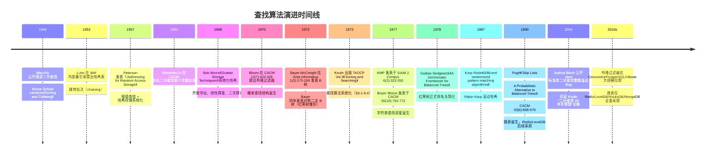

## 1. 概述与学习目标

### 1.1 什么是查找算法

**查找**（Search）是计算机科学中最基础、最频繁的操作之一——在数据集合中寻找满足特定条件的元素。Donald Knuth 在 *The Art of Computer Programming* Vol.3《Sorting and Searching》§6 中将查找分为四大类：

1. **顺序查找**（§6.1 Sequential Searching）：无序数据上的线性扫描 $O(n)$；
2. **比较查找**（§6.2 Searching by Comparison of Keys）：有序数据上的二分查找 $O(\log n)$、BST 查找 $O(\log n)$ 平均、平衡树查找 $O(\log n)$ 最坏、B 树查找 $O(\log_d n)$；
3. **数字查找**（§6.3 Digital Searching）：基于键的数字/字符分解，如 Trie 树 $O(L)$；
4. **哈希查找**（§6.4 Hashing）：基于哈希函数的直接寻址 $O(1)$ 平均。

```
查找算法分类树：
                            查找
                              |
        ┌────────────┬────────┴────────┬────────────┐
    顺序查找     比较查找           数字查找         哈希查找
    O(n)         O(log n)            O(L)             O(1) 平均
       │           │                   │                │
   哨兵优化   ┌────┴────┐           Trie 树        ┌────┴────┐
   O(n)      二分查找  树形查找      Radix Tree   链地址法   开放寻址
            O(log n)   │                          O(1)+     O(1)+
                       ├─ BST O(log n) 平均                   │
                       ├─ AVL O(log n) 最坏              线性探针
                       ├─ 红黑树 O(log n) 最坏           二次探针
                       ├─ B 树 O(log_d n)               双重哈希
                       └─ 跳表 O(log n) 期望
            ┌─ 插值查找 O(log log n) 平均
            └─ 斐波那契查找 O(log n)
```

**特殊查找结构**：

- **跳表**（Skip List, Pugh 1990）：基于概率均衡的有序链表多层索引，$O(\log n)$ 期望查找；
- **布隆过滤器**（Bloom Filter, Bloom 1970）：空间高效的概率查找结构，允许误判但不允许漏判；
- **字符串查找**（KMP 1977、Boyer-Moore 1977、Rabin-Karp 1987）：在文本 $T[1..n]$ 中查找模式 $P[1..m]$ 的所有出现位置。

> 一句话定义：**查找 = 在数据集合中定位满足条件的元素；顺序查找 $O(n)$ 通用于无序数据，二分查找 $O(\log n)$ 专精于有序静态数据，哈希查找 $O(1)$ 平均制霸精确匹配，平衡树与跳表 $O(\log n)$ 服务动态有序数据，布隆过滤器以 $O(1)$ 概率查找守护海量数据去重，KMP/Boyer-Moore 主宰字符串匹配。**

### 1.2 学习目标

完成本文档学习后，你将能够：

1. **记忆**顺序查找 $O(n)$、二分查找 $O(\log n)$、插值查找 $O(\log \log n)$ 平均、哈希查找 $O(1)$ 平均、BST 查找 $O(\log n)$ 平均、跳表查找 $O(\log n)$ 期望的形式化复杂度，复述各查找算法在前提条件（有序性、随机访问、哈希函数、平衡性）上的差异；
2. **理解** Mauchly 1946 二分查找、Luhn 1953 IBM 备忘录哈希表、Bloom 1970 布隆过滤器（CACM 13(7):422-426）、Bayer-McCreight 1972 B 树（Acta Informatica 1(3):173-189）、Bayer 1972 对称二叉 B 树、Guibas-Sedgewick 1978 红黑树、Knuth-Morris-Pratt 1977 KMP（SIAM J. Comput. 6(2):323-350）、Boyer-Moore 1977 字符串匹配（CACM 20(10):762-772）、Pugh 1990 跳表（CACM 33(6):668-676）的历史脉络，说明不同查找结构的设计动机；
3. **应用**顺序查找（含哨兵优化）、标准二分查找、二分查找变体（lower_bound、upper_bound、查找插入位置、旋转数组查找、二分答案、浮点二分）、插值查找、斐波那契查找编写可运行的 Python/C++/Java 代码，解决 LeetCode 33、35、69、162、240、34 等高频面试题；
4. **分析**二分查找 $O(\log n)$ 复杂度的递推式 $T(n) = T(n/2) + O(1)$、插值查找 $O(\log \log n)$ 平均复杂度的概率分析、跳表 $O(\log n)$ 期望复杂度的几何分布论证、布隆过滤器误判率 $(1 - e^{-kn/m})^k$ 的数学推导，掌握"分治递推、概率分析、势能分析"三大核心论证方法；
5. **评估**二分查找相对于顺序查找、哈希查找、BST 查找、跳表查找在"静态查找 vs 动态查找"、"精确匹配 vs 范围查询"、"内存开销 vs 查找速度"维度上的优劣，识别数据库 B+ 树索引、Redis 字典、Linux VMA 红黑树、浏览器历史、C++ std::map vs std::unordered_map 的选型动机；
6. **对比**顺序查找、二分查找、插值查找、斐波那契查找、哈希查找、BST 查找、AVL/红黑树查找、B 树查找、跳表查找、Trie 查找在时间复杂度、空间复杂度、前提条件、是否支持范围查询、是否支持动态更新、缓存友好性维度的差异；
7. **创造**性设计基于查找算法的开源项目解决方案，如数据库 B+ 树索引、Redis 字典与跳表双索引、布隆过滤器防缓存穿透、KMP/Boyer-Moore 文本编辑器查找、跳表实现 LRU 缓存、Trie 实现自动补全、哈希表实现去重统计。

### 1.3 术语表

| 术语 | 英文 | 定义 |
| ---- | ---- | ---- |
| 查找 | search | 在数据集合中定位满足条件的元素 |
| 关键字 | key | 用于查找的元素属性 |
| 顺序查找 | sequential search / linear search | 从头到尾逐个比较 |
| 哨兵 | sentinel | 在末尾放置目标值以省去边界检查 |
| 二分查找 | binary search | 有序数组上每次减半查找区间 |
| 折半查找 | half-interval search | 二分查找的同义词 |
| 下界 | lower_bound | 第一个 $\geq$ target 的位置 |
| 上界 | upper_bound | 第一个 $>$ target 的位置 |
| 插值查找 | interpolation search | 根据目标值估算位置的查找 |
| 斐波那契查找 | Fibonacci search | 用 Fibonacci 数列分割区间 |
| 哈希查找 | hash search | 哈希函数直接寻址 |
| 哈希函数 | hash function | 将键映射为整数地址 |
| 哈希冲突 | hash collision | 不同键映射到相同地址 |
| 链地址法 | chaining | 同一桶内用链表存储 |
| 开放寻址 | open addressing | 冲突时探查下一个空桶 |
| 负载因子 | load factor | 元素数 / 桶数，$\alpha = n/m$ |
| 平衡树 | balanced tree | 高度始终 $O(\log n)$ 的搜索树 |
| 红黑树 | red-black tree | 5 条性质保证 $O(\log n)$ 的 BST |
| B 树 | B-tree | 多路平衡搜索树，磁盘索引 |
| B+ 树 | B+ tree | B 树变体，仅叶节点存数据 |
| Trie | trie / prefix tree | 前缀树，按字符分解查找 |
| 跳表 | skip list | 多层索引的概率平衡结构 |
| 布隆过滤器 | Bloom filter | 概率查找结构，允许误判 |
| 字符串查找 | string matching | 在文本中查找模式串 |
| KMP | Knuth-Morris-Pratt | 线性时间字符串匹配算法 |
| 下一数组 | next array / failure function | KMP 的部分匹配表 |
| Boyer-Moore | BM algorithm | 从右向左匹配的字符串算法 |
| 坏字符规则 | bad character rule | BM 的跳跃启发式 |
| 好后缀规则 | good suffix rule | BM 的另一跳跃启发式 |
| 二分答案 | binary search on answer | 二分搜索答案空间 |

### 1.4 查找算法全景对比

| 算法 | 平均时间 | 最坏时间 | 空间 | 前提条件 | 支持范围查询 | 支持动态更新 | 缓存友好 |
| ---- | -------- | -------- | ---- | -------- | ------------ | ------------ | -------- |
| 顺序查找 | $O(n)$ | $O(n)$ | $O(1)$ | 无 | 否 | 是 | 一般 |
| 二分查找 | $O(\log n)$ | $O(\log n)$ | $O(1)$ | 有序 + 随机访问 | 是 | 否（昂贵） | 极好 |
| 插值查找 | $O(\log \log n)$ | $O(n)$ | $O(1)$ | 有序 + 均匀分布 | 是 | 否 | 好 |
| 斐波那契查找 | $O(\log n)$ | $O(\log n)$ | $O(1)$ | 有序 + 随机访问 | 是 | 否 | 好 |
| 哈希查找 | $O(1)$ | $O(n)$ | $O(n)$ | 哈希函数 | 否 | 是 | 一般 |
| BST 查找 | $O(\log n)$ | $O(n)$ | $O(n)$ | 二叉搜索树 | 是 | 是 | 差 |
| AVL/红黑树查找 | $O(\log n)$ | $O(\log n)$ | $O(n)$ | 平衡树 | 是 | 是 | 差 |
| B 树查找 | $O(\log_d n)$ | $O(\log_d n)$ | $O(n)$ | 多路平衡树 | 是 | 是 | 好（磁盘） |
| 跳表查找 | $O(\log n)$ 期望 | $O(n)$ 高概率 | $O(n)$ | 多层链表 | 是 | 是 | 一般 |
| Trie 查找 | $O(L)$ | $O(L)$ | $O(\Sigma^L)$ | 字典树 | 是（前缀） | 是 | 一般 |
| 布隆过滤器 | $O(k)$ | $O(k)$ | $O(m)$ bits | $k$ 个哈希函数 | 否 | 是（不可删） | 极好 |
| KMP | $O(n+m)$ | $O(n+m)$ | $O(m)$ | 预处理 next 数组 | 否 | 否 | 一般 |
| Boyer-Moore | $O(n/m)$ 平均 | $O(nm)$ 最坏 | $O(m+\Sigma)$ | 预处理坏字符/好后缀 | 否 | 否 | 一般 |

注：$n$ 为数据规模，$m$ 为模式串长度，$L$ 为键长，$\Sigma$ 为字符集大小，$k$ 为哈希函数个数。

### 1.5 适用场景与不适用场景

| 场景 | 是否适合 | 推荐算法 | 说明 |
| ---- | -------- | -------- | ---- |
| 静态有序数组精确查找 | 适合 | 二分查找 | $O(\log n)$ + $O(1)$ 空间 + 缓存友好 |
| 静态有序数组范围查询 | 适合 | 二分查找 lower_bound/upper_bound | 求区间 $[a, b]$ 元素数 |
| 无序数据精确查找 | 适合 | 顺序查找 | 数据小（< 32）或仅一次性查找 |
| 高频精确匹配（动态） | 适合 | 哈希表 | $O(1)$ 平均，但无序、不支持范围查询 |
| 动态有序数据 + 范围查询 | 适合 | 红黑树 / 跳表 | $O(\log n)$ 插入删除查找 |
| 数据库索引 | 适合 | B+ 树 | 磁盘 IO 友好，$O(\log_d n)$ 高度低 |
| 海量数据去重 | 适合 | 布隆过滤器 | $O(1)$ + 空间高效，允许误判 |
| 网页爬虫 URL 去重 | 适合 | 布隆过滤器 | 数十亿 URL 去重的首选 |
| 字符串前缀匹配 | 适合 | Trie 树 | 自动补全、拼写检查 |
| 字符串精确匹配 | 适合 | KMP / Boyer-Moore | $O(n+m)$ 线性时间 |
| 均匀分布的大规模有序数据 | 适合 | 插值查找 | $O(\log \log n)$ 平均优于二分 |
| 多次范围查询 | 适合 | 线段树 / 树状数组 | 预处理后 $O(\log n)$ |
| 频繁修改的有序数据 | 不适合 | 二分查找 | 插入删除 $O(n)$，应选平衡树或跳表 |
| 极小数据集（< 16） | 部分适合 | 顺序查找 | 二分查找的常数因子可能更大 |
| 内存极度受限 | 适合 | 布隆过滤器 | $m$ 位即可表示 $n$ 个元素 |

> **跨模块引用**：二分查找基于有序数组，参见 [数组与动态数组](algorithm/array)；哈希查找的底层结构参见 [哈希表](algorithm/hashtable)；BST/AVL/红黑树/B 树的详细实现参见 [树](algorithm/tree) 与 [平衡树与高级树](algorithm/balanced-tree)；跳表的详细实现参见 [跳跃表](algorithm/skip-list)；并查集的查找参见 [并查集](algorithm/union-find)；堆作为优先队列的查找极值参见 [堆与优先队列](algorithm/heap)；字符串查找的深入讨论参见 [字符串算法](algorithm/string)。

---

## 2. 历史动机与演进

### 2.1 前查找时代：从纸质索引到内存查找

19 世纪末，图书馆学与统计学已发展出大量"索引"技术：图书目录卡、人口普查穿孔卡片、电话簿。这些物理索引的关键问题是：**给定一个关键字，如何在大量数据中快速定位？**

1928 年*Mechanical World*首次记载了用机器辅助查找穿孔卡片的方法，但仅限于顺序查找。直到 1946 年，二分查找的思想才在计算机科学文献中正式出现。

### 2.2 Mauchly 1946：二分查找的诞生

1946 年，**John Mauchly**（ENIAC 联合设计者）在 Moore School Lectures《Sorting and Collating》中首次公开描述二分查找算法：

> 给定一个有序数组 $A[1..n]$，将目标 $x$ 与中间元素 $A[\lfloor n/2 \rfloor]$ 比较；若相等则返回，若 $x$ 较小则递归在左半查找，否则在右半查找。

但 Mauchly 的描述并不完整，未明确边界处理。1962 年**Hermann Bottenbruch**在*Communications of the ACM*给出首个被广泛认可的完整实现。Knuth 在 TAOCP Vol.3 §6.2.1 考据后写道：

> "Although the basic idea of binary search is comparatively straightforward, the details can be surprisingly tricky, and many programmers have gotten it wrong over the years."

这一预言在 2006 年被 Joshua Bloch 印证。

### 2.3 Joshua Bloch 2006：二分查找的"千年 Bug"

2006 年，Google 研究员 **Joshua Bloch**（前 Sun Microsystems Java 标准库首席工程师）在博客发表《Extra, Extra - Read All About It: Nearly All Binary Searches and Mergesorts are Broken》，公开指出 Java 标准库 `java.util.Arrays.binarySearch` 存在整数溢出 Bug：

```java
// Bug 版本（Java 标准库至 JDK 5）
int mid = (low + high) / 2;   // 当 low + high > Integer.MAX_VALUE 时溢出为负数
```

Bug 追溯到 Jon Bentley 1986 年《Programming Pearls》中的二分查找实现——Bentley 在书中将该实现作为"经过验证的正确代码"展示，但 2006 年 Bloch 的发现证明该代码在 $n > 2^{30}$ 时会崩溃。修复方案：

```java
int mid = low + (high - low) / 2;       // 加法改为减法避免溢出
// 或
int mid = (low + high) >>> 1;           // 无符号右移
```

这一事件成为软件工程史上的经典案例，证明"简单的算法不一定容易实现正确"。

### 2.4 Luhn 1953：哈希表的诞生

1953 年 1 月，IBM 的 **Hans Peter Luhn** 在内部备忘录中首次提出"哈希函数 + 链地址法"的查找方案。Luhn 当时研究 IBM 701 计算机的快速检索问题，提出：

- 用哈希函数 $h(k)$ 将键 $k$ 映射到数组下标；
- 冲突时用链表链接（**链地址法**，chaining）。

这是链式线性表首次应用。Luhn 因此获 1956 年 IBM Outstanding Contribution Award。

1968 年，**Bob Morris** 在*Communications of the ACM* 11(1):38-43《Scatter Storage Techniques》系统化哈希理论，引入**开放寻址法**（open addressing）、**线性探查**（linear probing）、**二次探查**（quadratic probing）等冲突解决技术。Knuth TAOCP Vol.3 §6.4（1973）给出权威论述与对比分析。

### 2.5 Bloom 1970：布隆过滤器

1970 年，**Burton Howard Bloom** 在*Communications of the ACM* 13(7):422-426《Space/Time Trade-offs in Hash Coding with Allowable Errors》中提出布隆过滤器。Bloom 当时在 Computer Usage Corporation 研究海量数据的快速去重问题，提出：

- 用 $m$ 位位数组 + $k$ 个独立哈希函数；
- 插入：将 $k$ 个哈希位置全部置 1；
- 查询：若 $k$ 个位置全为 1，则元素**可能**存在；若有任何 0，则元素**一定**不存在；
- 误判率约 $(1 - e^{-kn/m})^k$。

布隆过滤器以 $O(m \text{ bits})$ 空间高效著称，是大数据时代缓存穿透防护、URL 去重、Cassandra HINT、PostgreSQL bloom 索引的核心。

### 2.6 Bayer-McCreight 1972：B 树与磁盘索引

1970 年，Boeing Scientific Research Labs 的 **Rudolf Bayer** 与 **Edward M. McCreight** 在研究大型磁盘文件的索引时，发现二叉树高度过大、磁盘 IO 次数过多。1972 年他们在*Acta Informatica* 1(3):173-189 发表《Organization and Maintenance of Large Ordered Indices》，提出 **B 树**：

- 每节点最多 $2t-1$ 个关键字、$2t$ 个子节点（$t$ 为最小度数）；
- 根节点到叶节点等长（**完美平衡**）；
- 查找、插入、删除均 $O(\log_t n)$；
- 通过增大 $t$（典型 50-500），树高通常 3-4 即可表示数十亿关键字。

B 树是 MySQL InnoDB、PostgreSQL、Oracle、SQL Server、SQLite 等所有关系数据库索引的基石。B+ 树（Bayer 1972 后续工作）将数据仅存叶节点，叶节点用链表连接，使范围查询 $O(\log_t n + k)$。

McCreight 在 2010 年 PODS 大会访谈中曾回忆："B-tree 是 Bayer-B-tree 也是 Boeing-B-tree 也是 Balanced-B-tree 也可能是 Broad-B-tree，但我们从未在论文中明确解释 B 的含义。"

### 2.7 Bayer 1972 / Guibas-Sedgewick 1978：红黑树

1972 年，**Rudolf Bayer** 在*Acta Informatica* 1(4):290-306 发表《Symmetric binary B-trees: Data structure and maintenance algorithms》，提出**对称二叉 B 树**（symmetric binary B-tree, SB-tree）——用颜色标记模拟 B 树的二叉结构。这是红黑树的雏形。

1978 年，**Leonidas J. Guibas** 与 **Robert Sedgewick** 在 FOCS 论文《A Dichromatic Framework for Balanced Trees》中重新形式化 SB-tree，正式命名**红黑树**（red-black tree），并简化插入删除的旋转操作。Sedgewick 在 Xerox PARC 的彩色显示器上选择"红色"作为视觉最易辨识的颜色（PARC 当时是少数有彩色显示器的实验室）。

红黑树的 5 条性质保证高度 $\leq 2\log(n+1)$，使所有操作 $O(\log n)$ 最坏。红黑树被广泛采用：C++ STL `std::map`/`std::set`、Java `TreeMap`/`TreeSet`、Linux kernel CFS 调度器、Linux VMA 内存管理、Nginx timer、epoll 内部。

### 2.8 Knuth-Morris-Pratt 1977 与 Boyer-Moore 1977：字符串查找双星

1977 年是字符串查找算法的"奇迹年"。当年同时发表两篇里程碑论文：

**KMP 算法**（Knuth-Morris-Pratt）：
- Donald Knuth（斯坦福）、James H. Morris（CMU，研究字符串匹配硬件）、Vaughan Pratt（MIT）三人独立发现；
- 1977 年联合发表于 *SIAM Journal on Computing* 6(2):323-350《Fast Pattern Matching in Strings》；
- 核心思想：预处理模式串构造 `next` 数组（部分匹配表），使匹配失败时不回退文本指针；
- 复杂度：$O(n+m)$ 时间、$O(m)$ 空间，最坏线性。

**Boyer-Moore 算法**：
- Robert S. Boyer 与 J. Strother Moore 在 SRI International 研究定理证明器时提出；
- 1977 年发表于 *Communications of the ACM* 20(10):762-772《A Fast String Searching Algorithm》；
- 核心思想：从模式串右端开始匹配，结合**坏字符规则**与**好后缀规则**使模式串能跳跃式前进；
- 平均复杂度 $O(n/m)$（亚线性！），最坏 $O(nm)$（启发式无 worst-case 保证）；
- 实践中 Boyer-Moore 通常是字符串查找最快的算法，被 grep、PostgreSQL、各种文本编辑器 Ctrl+F 采用。

1987 年 **Karp-Rabin** 在 *IBM Journal of Research and Development* 31(2):249-260《Efficient randomized pattern-matching algorithms》提出**Rabin-Karp 算法**，用滚动哈希实现 $O(n+m)$ 平均、$O(nm)$ 最坏的字符串查找，是后续 Rabin-Karp 指纹、二维模式匹配的基础。

### 2.9 Pugh 1990：跳表

1990 年，马里兰大学 **William Pugh** 在 *Communications of the ACM* 33(6):668-676 发表《Skip Lists: A Probabilistic Alternative to Balanced Trees》，提出**跳表**（Skip List）：

- 在有序链表上随机添加多层索引；
- 第 $i$ 层节点以概率 $p$（通常 0.5 或 0.25）出现在第 $i+1$ 层；
- 查找：从最高层开始，每层线性前进，遇大则下降一层；
- 期望查找 $O(\log n)$、期望插入 $O(\log n)$、期望删除 $O(\log n)$；
- 实现远比红黑树简单（约 100 行 C 代码 vs 红黑树 500+ 行）。

Pugh 在论文中写道："Skip lists are a probabilistic alternative to balanced trees. They are easy to implement and are at least as efficient as balanced trees."

跳表被广泛采用：Redis zset（zskiplist）、LevelDB/RocksDB MemTable、MongoDB WiredTiger、MemSQL、skiplist-based LRU。Redis 作者 antirez 在博客中明确表示："Skip lists are a data structure that I have always found fascinating. They are simple, elegant, and they work."

### 2.10 查找算法演进时间线



### 2.11 关键设计决策

| 年份 | 决策 | 决策者 | 动机 |
| ---- | ---- | ---- | ---- |
| 1946 | 用"减半"而非"线性"查找有序数据 | Mauchly | 利用有序性将 $O(n)$ 降为 $O(\log n)$ |
| 1953 | 用哈希函数直接寻址 | Luhn | 跳过比较，直接定位 |
| 1970 | 允许误判换取空间效率 | Bloom | 海量数据去重，少量误判可接受 |
| 1972 | 多路分支降低树高 | Bayer-McCreight | 磁盘 IO 次数 = 树高，需降低树高 |
| 1972 | 用颜色模拟 B 树的合并分裂 | Bayer | 二叉树结构 + B 树平衡性 |
| 1977 | 预处理模式串避免文本回退 | KMP | 最坏线性保证 |
| 1977 | 从右向左匹配 + 启发式跳跃 | Boyer-Moore | 实践中亚线性 $O(n/m)$ |
| 1978 | 颜色替代 SB-tree 复杂标记 | Guibas-Sedgewick | 简化插入删除 |
| 1990 | 用概率均衡替代严格均衡 | Pugh | 实现简单 + 性能相当 |

---

## 3. 形式化定义

### 3.1 查找问题的形式化定义

**查找问题**：给定关键字集合 $S = \{k_1, k_2, \ldots, k_n\}$（可能有序或无序）与查询关键字 $x$，查找问题分为三种：

1. **精确查找**（Exact Search）：返回 $k \in S$ 使得 $k = x$，或报告不存在；
2. **范围查找**（Range Search）：返回 $\{k \in S : a \leq k \leq b\}$；
3. **前驱/后继查找**（Predecessor/Successor）：返回 $\max\{k \in S : k \leq x\}$ 或 $\min\{k \in S : k \geq x\}$。

**符号表 ADT**（Symbol Table / Dictionary）：

| 操作 | 描述 | 复杂度目标 |
| ---- | ---- | ---- |
| `insert(k, v)` | 插入键值对 $(k, v)$ | $O(\log n)$ 或 $O(1)$ |
| `delete(k)` | 删除键为 $k$ 的元素 | $O(\log n)$ 或 $O(1)$ |
| `search(k)` | 查找键为 $k$ 的元素 | $O(\log n)$ 或 $O(1)$ |
| `min()` / `max()` | 最小/最大键 | $O(\log n)$ 或 $O(1)$ |
| `predecessor(k)` / `successor(k)` | 前驱/后继 | $O(\log n)$ |
| `range(a, b)` | 范围查询 | $O(\log n + r)$，$r$ 为结果数 |

### 3.2 二分查找的形式化定义

**前提条件**：数组 $A[0..n-1]$ 满足**有序性**（monotonicity）：$\forall i < j, A[i] \leq A[j]$（升序）。

**循环不变式**（Loop Invariant）：在二分查找循环的每次迭代开始时，若 $x \in A$，则 $x \in A[\text{left}..\text{right}]$。

**正确性证明**：
1. **初始化**：$\text{left} = 0, \text{right} = n - 1$，$x \in A[0..n-1]$ 显然成立；
2. **保持**：每次迭代计算 $\text{mid} = \lfloor (\text{left} + \text{right}) / 2 \rfloor$：
   - 若 $A[\text{mid}] = x$，返回 $\text{mid}$，循环结束；
   - 若 $A[\text{mid}] < x$，则 $x \notin A[\text{left}..\text{mid}]$（由有序性），故 $x \in A[\text{mid}+1..\text{right}]$，令 $\text{left} = \text{mid} + 1$；
   - 若 $A[\text{mid}] > x$，类似地令 $\text{right} = \text{mid} - 1$；
   不变式保持；
3. **终止**：当 $\text{left} > \text{right}$ 时循环终止，此时区间为空，故 $x \notin A$。

### 3.3 哈希查找的形式化定义

**哈希函数**：$h: U \to \{0, 1, \ldots, m-1\}$，将键域 $U$ 映射到 $m$ 个桶。

**简单一致哈希**（Simple Uniform Hashing）：$\forall k \in U$，$h(k)$ 独立均匀分布于 $\{0, 1, \ldots, m-1\}$。

**负载因子**：$\alpha = n / m$，其中 $n$ 为元素数、$m$ 为桶数。

**冲突**（Collision）：$\exists k_1 \neq k_2, h(k_1) = h(k_2)$。由鸽巢原理，当 $n > m$ 时冲突不可避免。

**冲突解决**：
- **链地址法**（Chaining）：桶 $i$ 维护链表，存储所有 $h(k) = i$ 的键；
- **开放寻址**（Open Addressing）：冲突时按探查序列 $h(k, 0), h(k, 1), \ldots$ 寻找空桶。

### 3.4 跳表的形式化定义

跳表由 $L$ 层链表组成，$L$ 是随机变量。每个节点在第 $i$ 层出现的概率为 $p^{i-1}$（$p$ 通常 0.5）。

**期望层高**：$E[L] = \log_{1/p} n = \log_2 n$（$p = 0.5$ 时）。

**期望查找路径长度**：每层期望前进 2 步，故总期望比较次数 $\leq 2 \log_{1/p} n$。

### 3.5 布隆过滤器的形式化定义

- 位数组 $B[0..m-1]$，初始全为 0；
- $k$ 个独立哈希函数 $h_1, h_2, \ldots, h_k: U \to \{0, 1, \ldots, m-1\}$；
- **插入** $x$：$\forall i \in [1, k], B[h_i(x)] = 1$；
- **查询** $x$：返回 $\bigwedge_{i=1}^{k} B[h_i(x)]$（即所有 $h_i(x)$ 位置均为 1）。

**误判率推导**：插入 $n$ 个元素后，某一位仍为 0 的概率为 $(1 - 1/m)^{kn} \approx e^{-kn/m}$。查询一个不在集合中的元素时，$k$ 个哈希位置全为 1 的概率为：
$$P_{\text{fp}} = \left(1 - \left(1 - \frac{1}{m}\right)^{kn}\right)^k \approx \left(1 - e^{-kn/m}\right)^k$$

最优 $k = (m/n) \ln 2$ 时，误判率最小为 $(0.6185)^{m/n}$。

---

## 4. 顺序查找

### 4.1 基本思想

**顺序查找**（Sequential Search / Linear Search）是最简单的查找算法：从数组第一个元素开始，逐个与目标比较，直到找到或遍历完毕。

### 4.2 标准实现

**Python 实现**：

```python
def sequential_search(arr: list[int], target: int) -> int:
    """顺序查找：返回 target 在 arr 中的索引，不存在返回 -1
    
    Args:
        arr: 待查找数组（无需有序）
        target: 目标值
    
    Returns:
        int: target 的索引，或 -1
    """
    for i, val in enumerate(arr):
        if val == target:
            return i
    return -1
```

**C++ 实现**：

```cpp
#include <vector>
#include <algorithm>

// 顺序查找：返回 target 在 arr 中的索引，不存在返回 -1
int sequentialSearch(const std::vector<int>& arr, int target) {
    for (size_t i = 0; i < arr.size(); ++i) {
        if (arr[i] == target) {
            return static_cast<int>(i);
        }
    }
    return -1;
}

// C++ STL 标准库提供 std::find，返回迭代器
auto it = std::find(arr.begin(), arr.end(), target);
if (it != arr.end()) {
    int index = std::distance(arr.begin(), it);
}
```

**Java 实现**：

```java
// 顺序查找：返回 target 在 arr 中的索引，不存在返回 -1
public static int sequentialSearch(int[] arr, int target) {
    for (int i = 0; i < arr.length; i++) {
        if (arr[i] == target) {
            return i;
        }
    }
    return -1;
}
```

### 4.3 哨兵优化

哨兵优化通过在数组末尾放置目标值，省去每次循环的边界检查 `i < n`，将每次迭代的 2 次比较降为 1 次：

```python
def sentinel_search(arr: list[int], target: int) -> int:
    """哨兵顺序查找：用末尾哨兵省去边界检查
    
    注意：原数组会被临时修改，最后恢复
    """
    n = len(arr)
    if n == 0:
        return -1
    last = arr[n - 1]
    arr[n - 1] = target  # 设置哨兵
    
    i = 0
    while arr[i] != target:
        i += 1
    
    arr[n - 1] = last  # 恢复末尾
    if i < n - 1 or last == target:
        return i
    return -1
```

```cpp
int sentinelSearch(std::vector<int>& arr, int target) {
    int n = static_cast<int>(arr.size());
    if (n == 0) return -1;
    int last = arr[n - 1];
    arr[n - 1] = target;
    
    int i = 0;
    while (arr[i] != target) ++i;
    
    arr[n - 1] = last;
    if (i < n - 1 || last == target) return i;
    return -1;
}
```

### 4.4 复杂度分析

| 情况 | 比较次数 | 时间复杂度 |
| ---- | ---- | ---- |
| 最好（target 在首位） | 1 | $O(1)$ |
| 最坏（target 在末位或不存在） | $n$ | $O(n)$ |
| 平均（等概率） | $(n+1)/2$ | $O(n)$ |

**适用场景**：数据无序；数据规模小（$n < 32$）；仅一次性查找；底层是链表等不支持随机访问的结构。

---

## 5. 二分查找

### 5.1 核心思想

**二分查找**（Binary Search）要求数组**有序**且**支持随机访问**，每次将查找区间减半：

```
在 [1, 3, 5, 7, 9, 11, 13, 15] 中查找 7：

第1轮: [1, 3, 5, 7, 9, 11, 13, 15]  mid=4, arr[4]=9 > 7 → 左半
第2轮: [1, 3, 5, 7]                  mid=1, arr[1]=3 < 7 → 右半
第3轮: [5, 7]                        mid=2, arr[2]=5 < 7 → 右半
第4轮: [7]                           mid=3, arr[3]=7 = 7 → 找到!
```

### 5.2 标准实现（闭区间 [left, right]）

**Python 实现**：

```python
def binary_search(arr: list[int], target: int) -> int:
    """标准二分查找（闭区间 [left, right]）
    
    Args:
        arr: 有序数组（升序）
        target: 目标值
    
    Returns:
        int: target 的索引，不存在返回 -1
    """
    left, right = 0, len(arr) - 1
    while left <= right:
        # 防止整数溢出：用减法而非加法
        mid = left + (right - left) // 2
        if arr[mid] == target:
            return mid
        elif arr[mid] < target:
            left = mid + 1
        else:
            right = mid - 1
    return -1
```

**C++ 实现**：

```cpp
// 标准二分查找（闭区间 [left, right]）
int binarySearch(const std::vector<int>& arr, int target) {
    int left = 0, right = static_cast<int>(arr.size()) - 1;
    while (left <= right) {
        int mid = left + (right - left) / 2;  // 防止溢出
        if (arr[mid] == target) return mid;
        else if (arr[mid] < target) left = mid + 1;
        else right = mid - 1;
    }
    return -1;
}
```

**Java 实现**：

```java
// 标准二分查找（闭区间 [left, right]）
public static int binarySearch(int[] arr, int target) {
    int left = 0, right = arr.length - 1;
    while (left <= right) {
        int mid = left + (right - left) / 2;
        if (arr[mid] == target) return mid;
        else if (arr[mid] < target) left = mid + 1;
        else right = mid - 1;
    }
    return -1;
}
```

### 5.3 防止整数溢出

计算 `mid` 时，`(left + right) / 2` 在 `left + right` 超过 `Integer.MAX_VALUE`（$2^{31}-1$）时会溢出为负数，导致数组越界。

```java
//  危险：当 left + right > Integer.MAX_VALUE 时溢出
int mid = (left + right) / 2;

//  正确写法 1：减法
int mid = left + (right - left) / 2;

//  正确写法 2：无符号右移（仅 Java/C++）
int mid = (left + right) >>> 1;  // Java，自动处理溢出

//  正确写法 3：长整型
int mid = (int) ((long) left + (long) right) / 2;
```

**Bug 历史**：Jon Bentley 1986《Programming Pearls》中的二分查找实现包含此 Bug，Joshua Bloch 2006 年发现 Java 标准库 `Arrays.binarySearch` 也继承了此 Bug（JDK 5 及更早），从 JDK 6 开始修复。这是软件工程史上最著名的"千年 Bug"之一。

### 5.4 复杂度分析

**时间复杂度推导**：

设 $T(n)$ 为长度 $n$ 的数组二分查找的时间，则：

$$T(n) = T(n/2) + O(1)$$

由主定理（Master Theorem）$a = 1, b = 2, f(n) = O(1) = O(n^0)$，故 $T(n) = O(\log n)$。

**比较次数**：$n$ 个元素最多比较 $\lfloor \log_2 n \rfloor + 1$ 次。

| $n$ | 最多比较次数 |
| ---- | ---- |
| 1 | 1 |
| 10 | 4 |
| 100 | 7 |
| 1,000 | 10 |
| 1,000,000 | 20 |
| 1,000,000,000 | 30 |
| $10^{18}$ | 60 |

二分查找是**对数级**算法，即使数据规模达到 $10^{18}$，也仅需 60 次比较。

**空间复杂度**：$O(1)$（迭代版本）；$O(\log n)$（递归版本，递归栈深度）。

---

## 6. 二分查找变体

### 6.1 lower_bound（第一个 ≥ target 的位置）

```python
def lower_bound(arr: list[int], target: int) -> int:
    """返回第一个 >= target 的位置（半开区间 [left, right)）"""
    left, right = 0, len(arr)
    while left < right:
        mid = left + (right - left) // 2
        if arr[mid] < target:
            left = mid + 1
        else:
            right = mid  # arr[mid] >= target，收缩右边界
    return left  # left 是第一个 >= target 的位置
```

```cpp
// C++ STL 直接提供 std::lower_bound
#include <algorithm>
auto it = std::lower_bound(arr.begin(), arr.end(), target);
int index = std::distance(arr.begin(), it);
```

```java
// Java：手动实现（标准库 Arrays.binarySearch 不直接提供 lower_bound）
public static int lowerBound(int[] arr, int target) {
    int left = 0, right = arr.length;
    while (left < right) {
        int mid = left + (right - left) / 2;
        if (arr[mid] < target) left = mid + 1;
        else right = mid;
    }
    return left;
}
```

**Python bisect 模块**：

```python
import bisect

arr = [1, 2, 2, 2, 3, 4, 5]
target = 2

# 第一个 >= target 的位置（即 lower_bound）
pos = bisect.bisect_left(arr, target)  # 1

# 第一个 > target 的位置（即 upper_bound）
pos = bisect.bisect_right(arr, target)  # 4
```

### 6.2 upper_bound（第一个 > target 的位置）

```python
def upper_bound(arr: list[int], target: int) -> int:
    """返回第一个 > target 的位置"""
    left, right = 0, len(arr)
    while left < right:
        mid = left + (right - left) // 2
        if arr[mid] <= target:
            left = mid + 1
        else:
            right = mid
    return left  # left 是第一个 > target 的位置
```

### 6.3 查找插入位置（LeetCode 35）

```python
def search_insert(nums: list[int], target: int) -> int:
    """返回 target 应插入的位置（保持有序）"""
    left, right = 0, len(nums)
    while left < right:
        mid = left + (right - left) // 2
        if nums[mid] < target:
            left = mid + 1
        else:
            right = mid
    return left
```

### 6.4 查找旋转排序数组（LeetCode 33）

旋转排序数组如 `[4, 5, 6, 7, 0, 1, 2]`（原数组 `[0, 1, 2, 4, 5, 6, 7]` 在索引 3 处旋转）。核心思想：每次二分后判断哪半边有序，再判断 target 是否在有序半边内：

```python
def search_rotated(nums: list[int], target: int) -> int:
    """旋转排序数组查找（LeetCode 33）"""
    left, right = 0, len(nums) - 1
    while left <= right:
        mid = left + (right - left) // 2
        if nums[mid] == target:
            return mid
        
        # 判断哪半边有序
        if nums[left] <= nums[mid]:  # 左半边有序
            if nums[left] <= target < nums[mid]:
                right = mid - 1
            else:
                left = mid + 1
        else:  # 右半边有序
            if nums[mid] < target <= nums[right]:
                left = mid + 1
            else:
                right = mid - 1
    return -1
```

### 6.5 二分答案（搜索答案空间）

当问题满足**单调性**——答案越大越容易（或越难）满足条件——可以对答案空间二分搜索：

```python
def split_array(nums: list[int], m: int) -> int:
    """分割数组的最大值（LeetCode 410）
    
    将数组分成 m 个连续子数组，最小化最大子数组和
    单调性：max_sum 越大，所需分组数越少
    """
    def can_split(max_sum: int) -> bool:
        count, current = 1, 0
        for num in nums:
            if current + num > max_sum:
                count += 1
                current = num
            else:
                current += num
        return count <= m
    
    left, right = max(nums), sum(nums)
    while left < right:
        mid = left + (right - left) // 2
        if can_split(mid):
            right = mid  # 答案可行，尝试更小
        else:
            left = mid + 1  # 答案不可行，必须更大
    return left
```

**二分答案模板**：

```python
def binary_search_answer():
    left, right = lower_bound, upper_bound
    while left < right:
        mid = left + (right - left) // 2
        if check(mid):  # check 是单调的：x 越大越容易满足
            right = mid  # 或 left = mid（取决于单调方向）
        else:
            left = mid + 1
    return left
```

### 6.6 浮点数二分

```python
def my_sqrt(x: float, epsilon: float = 1e-7) -> float:
    """浮点数二分求平方根"""
    if x < 0:
        raise ValueError("Cannot compute square root of negative number")
    if x == 0:
        return 0.0
    left, right = 0.0, max(1.0, x)
    while right - left > epsilon:
        mid = (left + right) / 2
        if mid * mid < x:
            left = mid
        else:
            right = mid
    return (left + right) / 2

# 固定迭代次数版本（避免浮点精度导致的死循环）
def my_sqrt_iter(x: float, iterations: int = 100) -> float:
    left, right = 0.0, max(1.0, x)
    for _ in range(iterations):
        mid = (left + right) / 2
        if mid * mid < x:
            left = mid
        else:
            right = mid
    return (left + right) / 2
```

### 6.7 两大模板总结

**模板一：闭区间 [left, right]**

```python
left, right = 0, len(arr) - 1
while left <= right:
    mid = left + (right - left) // 2
    if arr[mid] == target:
        return mid
    elif arr[mid] < target:
        left = mid + 1
    else:
        right = mid - 1
return -1
```

**模板二：半开区间 [left, right)**

```python
left, right = 0, len(arr)
while left < right:
    mid = left + (right - left) // 2
    if arr[mid] < target:
        left = mid + 1
    else:
        right = mid
return left  # 第一个 >= target 的位置
```

**选择指南**：

| 需求 | 推荐模板 | 返回值含义 |
| ---- | ---- | ---- |
| 精确查找目标值 | 模板一 | 索引或 -1 |
| 查找第一个 $\geq$ target | 模板二 | lower_bound |
| 查找第一个 $>$ target | 模板二变体 | upper_bound |
| 二分答案 | 模板二 | 最优解 |
| 查找最后一个 $\leq$ target | 模板一变体 | upper_bound - 1 |

---

## 7. 插值查找

### 7.1 核心思想

二分查找每次固定取中点 $\text{mid} = \lfloor (\text{left} + \text{right}) / 2 \rfloor$，但当数据**均匀分布**时，可以根据目标值的大小估算其位置：

$$\text{mid} = \text{left} + \frac{(\text{target} - A[\text{left}]) \times (\text{right} - \text{left})}{A[\text{right}] - A[\text{left}]}$$

**类比查字典**：找 "apple" 会翻到前面，找 "zoo" 会翻到后面，而不是每次翻到中间。

### 7.2 实现

```python
def interpolation_search(arr: list[int], target: int) -> int:
    """插值查找：适用于均匀分布的有序数据
    
    平均复杂度 O(log log n)，最坏 O(n)
    """
    left, right = 0, len(arr) - 1
    
    while left <= right and arr[left] <= target <= arr[right]:
        # 防止除零
        if arr[left] == arr[right]:
            return left if arr[left] == target else -1
        
        # 插值公式
        mid = left + (target - arr[left]) * (right - left) // (arr[right] - arr[left])
        
        # 边界检查（防止 mid 越界）
        if mid < left or mid > right:
            break
        
        if arr[mid] == target:
            return mid
        elif arr[mid] < target:
            left = mid + 1
        else:
            right = mid - 1
    
    return -1
```

```java
public static int interpolationSearch(int[] arr, int target) {
    int left = 0, right = arr.length - 1;
    while (left <= right && target >= arr[left] && target <= arr[right]) {
        if (arr[left] == arr[right]) {
            return arr[left] == target ? left : -1;
        }
        int mid = left + (target - arr[left]) * (right - left) / (arr[right] - arr[left]);
        if (mid < left || mid > right) break;
        if (arr[mid] == target) return mid;
        else if (arr[mid] < target) left = mid + 1;
        else right = mid - 1;
    }
    return -1;
}
```

### 7.3 复杂度分析

| 数据分布 | 时间复杂度 | 说明 |
| ---- | ---- | ---- |
| 均匀分布 | $O(\log \log n)$ | 远优于二分查找 |
| 非均匀分布 | $O(n)$ 最坏 | 退化为顺序查找 |
| 极端分布 | $O(n)$ | 如 `[1, 2, 3, ..., 999, 1000000]` |

**平均复杂度 $O(\log \log n)$ 推导**（Peterson 1957）：

假设 $A$ 在 $[A[\text{left}], A[\text{right}]]$ 上均匀分布，则每次插值后，剩余区间长度的期望为 $\sqrt{n}$（并非精确 $\sqrt{n}$，但量级如此）。设 $T(n)$ 为查找时间，则：

$$T(n) \approx T(\sqrt{n}) + O(1)$$

令 $n = 2^{2^k}$，则 $\sqrt{n} = 2^{2^{k-1}}$，递归 $k$ 次后 $n = 2$，故 $T(n) = O(k) = O(\log \log n)$。

**适用场景**：数据量大且分布均匀的有序表，如年龄表、成绩表、时间戳表。

---

## 8. 斐波那契查找

### 8.1 核心思想

**斐波那契查找**（Fibonacci Search）利用 Fibonacci 数列对有序表进行**黄金分割**，与二分查找的等分（1:1）不同：

- 二分查找：$\text{mid} = (\text{left} + \text{right}) / 2$
- 斐波那契查找：$\text{mid} = \text{left} + F[k-1] - 1$

其中 $F[k]$ 是大于等于数组长度的最小 Fibonacci 数。

```
Fibonacci 数列: 1, 1, 2, 3, 5, 8, 13, 21, 34, 55, 89, ...

核心分割：
长度 F[k]-1 的数组分为：
  左子数组: F[k-1]-1 个元素
  中间元素: 1 个
  右子数组: F[k-2]-1 个元素
  满足恒等式: F[k]-1 = (F[k-1]-1) + 1 + (F[k-2]-1)
```

### 8.2 实现

```python
def fibonacci_search(arr: list[int], target: int) -> int:
    """斐波那契查找：用黄金分割替代等分"""
    n = len(arr)
    if n == 0:
        return -1
    
    # 生成 Fibonacci 数列
    fib = [1, 1]
    while fib[-1] < n:
        fib.append(fib[-1] + fib[-2])
    
    k = len(fib) - 1
    
    # 扩展数组到 F[k]-1 长度，用末尾元素填充
    temp = arr + [arr[-1]] * (fib[k] - 1 - n)
    
    left, right = 0, n - 1
    while left <= right:
        mid = left + fib[k - 1] - 1
        if temp[mid] == target:
            return min(mid, n - 1)  # 处理填充位置
        elif temp[mid] < target:
            left = mid + 1
            k -= 2  # 右子数组长度为 F[k-2]-1
        else:
            right = mid - 1
            k -= 1  # 左子数组长度为 F[k-1]-1
    
    return -1
```

```java
public static int fibonacciSearch(int[] arr, int target) {
    int n = arr.length;
    if (n == 0) return -1;
    
    // 生成 Fibonacci 数列
    int[] fib = new int[n + 2];
    fib[0] = fib[1] = 1;
    int k = 1;
    while (fib[k] < n) {
        k++;
        fib[k] = fib[k - 1] + fib[k - 2];
    }
    
    // 扩展数组
    int[] temp = Arrays.copyOf(arr, fib[k] - 1);
    for (int i = n; i < temp.length; i++) {
        temp[i] = arr[n - 1];
    }
    
    int left = 0, right = n - 1;
    while (left <= right) {
        int mid = left + fib[k - 1] - 1;
        if (temp[mid] == target) {
            return Math.min(mid, n - 1);
        } else if (temp[mid] < target) {
            left = mid + 1;
            k -= 2;
        } else {
            right = mid - 1;
            k -= 1;
        }
    }
    return -1;
}
```

### 8.3 与二分查找对比

| 特性 | 二分查找 | 斐波那契查找 |
| ---- | ---- | ---- |
| 时间复杂度 | $O(\log n)$ | $O(\log n)$ |
| 分割比例 | 等分 1:1 | 黄金分割 $\approx 0.618:0.382$ |
| 运算 | 加法 + 除法 | 仅加减法 |
| 平均比较次数 | $\log_2 n$ | $\approx 1.44 \log_2 n$（略多） |
| 缓存友好性 | 较好 | 略差（跳跃不规律） |

**优势场景**：对除法运算敏感的硬件（嵌入式、早期 CPU）；硬件除法指令慢于加减法时。

**实际工程**：现代 CPU 除法已快（3-20 周期），斐波那契查找的优势不明显，实际工程中很少使用。

---

## 9. 哈希查找

### 9.1 核心思想

**哈希查找**（Hash Search）通过哈希函数 $h(k)$ 将键直接映射到数组下标，实现 $O(1)$ 平均查找：

```
key "alice" → hash function h() → index 42 → bucket[42]

冲突解决：
1. 链地址法：bucket[42] = LinkedList[(alice, 100), (bob, 85)]
2. 开放寻址：bucket[42] 冲突 → 探查 bucket[43], bucket[44], ...
```

### 9.2 哈希函数设计

**好的哈希函数**应满足：
1. **一致性**：$k_1 = k_2 \Rightarrow h(k_1) = h(k_2)$；
2. **均匀性**：$h(k)$ 均匀分布于 $[0, m)$；
3. **高效性**：计算 $O(1)$。

**常见哈希函数**：

- **除留余数法**（Division Method）：$h(k) = k \bmod m$，$m$ 选素数；
- **乘法哈希**（Multiplication Method）：$h(k) = \lfloor m \cdot (kA \bmod 1) \rfloor$，$A = (\sqrt{5} - 1) / 2$；
- **MurmurHash**：Austin Appleby 2008，广泛用于 Redis、Cassandra；
- **CityHash / FarmHash**：Google 2011/2014，用于 Bigtable、Spanner；
- **xxHash**：Yann Collet 2012，目前最快的非加密哈希之一。

### 9.3 冲突解决

**链地址法**（Chaining）：

```python
class HashTableChaining:
    def __init__(self, capacity: int = 16):
        self._capacity = capacity
        self._buckets: list[list[tuple]] = [[] for _ in range(capacity)]
        self._size = 0
    
    def _hash(self, key) -> int:
        return hash(key) % self._capacity
    
    def insert(self, key, value) -> None:
        idx = self._hash(key)
        for i, (k, _) in enumerate(self._buckets[idx]):
            if k == key:
                self._buckets[idx][i] = (key, value)
                return
        self._buckets[idx].append((key, value))
        self._size += 1
    
    def search(self, key):
        idx = self._hash(key)
        for k, v in self._buckets[idx]:
            if k == key:
                return v
        raise KeyError(key)
```

**开放寻址法**（Open Addressing）——线性探查：

```python
class HashTableOpenAddressing:
    def __init__(self, capacity: int = 16):
        self._capacity = capacity
        self._keys: list = [None] * capacity
        self._values: list = [None] * capacity
        self._size = 0
        self._DELETED = object()  # 哨兵表示已删除
    
    def _hash(self, key) -> int:
        return hash(key) % self._capacity
    
    def _probe(self, key, for_insert: bool = False):
        """线性探查：返回 key 应在的位置"""
        idx = self._hash(key)
        for i in range(self._capacity):
            j = (idx + i) % self._capacity
            if self._keys[j] is None or (for_insert and self._keys[j] is self._DELETED):
                return j
            if self._keys[j] == key:
                return j
        raise RuntimeError("Hash table full")
    
    def insert(self, key, value) -> None:
        if self._size >= self._capacity * 0.7:  # 负载因子阈值
            self._resize()
        idx = self._probe(key, for_insert=True)
        if self._keys[idx] != key:
            self._size += 1
        self._keys[idx] = key
        self._values[idx] = value
    
    def search(self, key):
        idx = self._hash(key)
        for i in range(self._capacity):
            j = (idx + i) % self._capacity
            if self._keys[j] is None:
                raise KeyError(key)
            if self._keys[j] == key:
                return self._values[j]
        raise KeyError(key)
```

### 9.4 复杂度分析

**链地址法**：

| 操作 | 平均 | 最坏 |
| ---- | ---- | ---- |
| 查找 | $O(1 + \alpha)$ | $O(n)$ |
| 插入 | $O(1)$ | $O(n)$ |
| 删除 | $O(1 + \alpha)$ | $O(n)$ |

**开放寻址**（$\alpha < 1$）：

| 操作 | 期望（$\alpha = 0.5$） | 期望（$\alpha = 0.75$） |
| ---- | ---- | ---- |
| 查找 | $\leq 2.5$ 次探查 | $\leq 8$ 次探查 |
| 插入 | $\leq 2.5$ 次探查 | $\leq 8$ 次探查 |

**多语言实现**：

```python
# Python dict 是哈希表
d = {"alice": 100, "bob": 85}
d["charlie"] = 92  # O(1) 平均
print(d.get("alice"))  # O(1) 平均
```

```cpp
// C++ std::unordered_map 是哈希表
#include <unordered_map>
std::unordered_map<std::string, int> m;
m["alice"] = 100;  // O(1) 平均
m.find("alice");    // O(1) 平均

// std::map 是红黑树（有序）
#include <map>
std::map<std::string, int> om;
om["alice"] = 100;  // O(log n)
om.find("alice");    // O(log n)
```

```java
// Java HashMap 是哈希表（Java 8+ 链表长度 > 8 转红黑树）
import java.util.HashMap;
HashMap<String, Integer> m = new HashMap<>();
m.put("alice", 100);  // O(1) 平均
m.get("alice");        // O(1) 平均

// TreeMap 是红黑树
import java.util.TreeMap;
TreeMap<String, Integer> om = new TreeMap<>();
om.put("alice", 100);  // O(log n)
```

---

## 10. 树形查找

### 10.1 二叉搜索树（BST）查找

**BST 性质**：对每个节点 $x$，左子树所有节点 $\leq x.\text{key}$，右子树所有节点 $\geq x.\text{key}$。

```python
class TreeNode:
    def __init__(self, key, value=None):
        self.key = key
        self.value = value
        self.left = None
        self.right = None

def bst_search(root: TreeNode, key):
    """BST 查找：平均 O(log n)，最坏 O(n)（链式退化）"""
    while root is not None:
        if key == root.key:
            return root
        elif key < root.key:
            root = root.left
        else:
            root = root.right
    return None
```

**复杂度**：
- 平均（随机插入）：$O(\log n)$
- 最坏（有序插入导致链式退化）：$O(n)$

### 10.2 平衡树查找（AVL / 红黑树）

**AVL 树**（Adelson-Velsky and Landis 1962）：每个节点左右子树高度差 $\leq 1$，保证 $O(\log n)$ 最坏。

**红黑树**（Bayer 1972, Guibas-Sedgewick 1978）：5 条性质保证高度 $\leq 2\log(n+1)$。

**红黑树 5 条性质**：
1. 每个节点是红色或黑色；
2. 根节点是黑色；
3. 每个叶节点（NIL）是黑色；
4. 红节点的子节点都是黑色（不能有连续红节点）；
5. 从任一节点到其所有叶节点的路径包含相同数目的黑节点。

**查找代码与 BST 完全相同**，平衡性由插入/删除时的旋转与重新着色维护：

```python
def rb_search(root: TreeNode, key):
    """红黑树查找：O(log n) 最坏"""
    return bst_search(root, key)  # 查找代码与 BST 相同
```

**工业应用**：
- C++ `std::map` / `std::set` / `std::multimap` / `std::multiset`：红黑树
- Java `TreeMap` / `TreeSet`：红黑树
- Linux kernel CFS 调度器：红黑树（按 vruntime 排序）
- Linux kernel VMA 内存管理：红黑树（按地址排序）
- Nginx timer：红黑树（按到期时间排序）
- epoll 内部事件管理：红黑树

### 10.3 B 树查找

**B 树**（Bayer-McCreight 1972）专为磁盘存储设计：每节点最多 $2t-1$ 个关键字、$2t$ 个子节点，根到叶等长（完美平衡）。

```python
class BTreeNode:
    def __init__(self, t: int, leaf: bool = False):
        self.t = t  # 最小度数
        self.keys = []
        self.children = []
        self.leaf = leaf

def b_tree_search(node: BTreeNode, key):
    """B 树查找：O(log_t n)"""
    i = 0
    while i < len(node.keys) and key > node.keys[i]:
        i += 1
    if i < len(node.keys) and key == node.keys[i]:
        return (node, i)
    if node.leaf:
        return None
    return b_tree_search(node.children[i], key)
```

**复杂度**：$O(\log_t n)$，其中 $t$ 是最小度数。$t$ 越大，树高越低，磁盘 IO 越少。

**典型参数**：
- MySQL InnoDB：$t = 250$（16KB 页 / 64 字节每行 ≈ 250），10 亿行数据树高仅 3-4；
- PostgreSQL：8KB 页，类似参数；
- SQLite：4KB 页。

### 10.4 B+ 树（数据库索引的王者）

**B+ 树**是 B 树变体：
- 所有数据仅存于叶节点；
- 内部节点仅存索引关键字；
- 叶节点用双向链表连接。

**优势**：
- 内部节点不含数据，可容纳更多关键字，树高更低；
- 范围查询：从叶节点链表头部顺序扫描即可，$O(\log_t n + k)$；
- 所有关系数据库（MySQL、PostgreSQL、Oracle、SQL Server）的索引均采用 B+ 树。

### 10.5 Trie 树查找

**Trie**（Retrieval Tree，前缀树）按字符分解键，适合字符串前缀匹配：

```python
class TrieNode:
    def __init__(self):
        self.children = {}  # char -> TrieNode
        self.is_end = False

class Trie:
    def __init__(self):
        self.root = TrieNode()
    
    def insert(self, word: str) -> None:
        node = self.root
        for ch in word:
            if ch not in node.children:
                node.children[ch] = TrieNode()
            node = node.children[ch]
        node.is_end = True
    
    def search(self, word: str) -> bool:
        node = self._find(word)
        return node is not None and node.is_end
    
    def starts_with(self, prefix: str) -> bool:
        """前缀查找：Trie 的核心优势"""
        return self._find(prefix) is not None
    
    def _find(self, s: str):
        node = self.root
        for ch in s:
            if ch not in node.children:
                return None
            node = node.children[ch]
        return node
```

**复杂度**：$O(L)$，$L$ 为键长，与数据规模无关。

**应用**：自动补全、拼写检查、IP 路由（Longest Prefix Match）、DNS 解析。

---

## 11. 跳表查找

### 11.1 核心思想

**跳表**（Skip List, Pugh 1990）通过在有序链表上随机添加多层索引，实现 $O(\log n)$ 期望查找：

```
Level 3:  HEAD ------------------------------> 50 --------------------------> NIL
Level 2:  HEAD ---------> 20 ----------------> 50 --------------> 80 ------> NIL
Level 1:  HEAD ---> 10 --> 20 ---> 30 --------> 50 ---> 70 -----> 80 ---> 90 > NIL
Level 0:  HEAD > 5 > 10 > 20 > 25 > 30 > 40 > 50 > 60 > 70 > 75 > 80 > 85 > 90 > NIL
```

查找 70 的路径：从 Level 3 开始，50 < 70 下降到 Level 2，50 < 70 下降到 Level 1，80 > 70 下降到 Level 0，找到 70。共 $O(\log n)$ 次比较。

### 11.2 实现

```python
import random

class SkipListNode:
    def __init__(self, key=None, level=0):
        self.key = key
        self.forward = [None] * level  # 各层的下一个节点

class SkipList:
    """跳表：期望 O(log n) 查找/插入/删除"""
    
    MAX_LEVEL = 16
    P = 0.5  # 上一层的概率
    
    def __init__(self):
        self.header = SkipListNode(level=self.MAX_LEVEL)
        self.level = 0  # 当前最高层
    
    def _random_level(self) -> int:
        """生成随机层高：几何分布"""
        lvl = 1
        while random.random() < self.P and lvl < self.MAX_LEVEL:
            lvl += 1
        return lvl
    
    def search(self, key) -> bool:
        """查找：从最高层开始，遇大则下降"""
        node = self.header
        for i in range(self.level - 1, -1, -1):
            while node.forward[i] and node.forward[i].key < key:
                node = node.forward[i]
        node = node.forward[0]
        return node is not None and node.key == key
    
    def insert(self, key) -> None:
        """插入：随机层高 + 多层索引更新"""
        update = [None] * self.MAX_LEVEL
        node = self.header
        for i in range(self.level - 1, -1, -1):
            while node.forward[i] and node.forward[i].key < key:
                node = node.forward[i]
            update[i] = node
        
        lvl = self._random_level()
        if lvl > self.level:
            for i in range(self.level, lvl):
                update[i] = self.header
            self.level = lvl
        
        new_node = SkipListNode(key, lvl)
        for i in range(lvl):
            new_node.forward[i] = update[i].forward[i]
            update[i].forward[i] = new_node
    
    def delete(self, key) -> bool:
        update = [None] * self.MAX_LEVEL
        node = self.header
        for i in range(self.level - 1, -1, -1):
            while node.forward[i] and node.forward[i].key < key:
                node = node.forward[i]
            update[i] = node
        target = node.forward[0]
        if target is None or target.key != key:
            return False
        for i in range(self.level):
            if update[i].forward[i] is not target:
                break
            update[i].forward[i] = target.forward[i]
        while self.level > 1 and self.header.forward[self.level - 1] is None:
            self.level -= 1
        return True
```

### 11.3 复杂度分析

**期望查找路径长度**：

设 $L$ 为跳表最高层，$E[L] = \log_{1/p} n$。每层期望前进 $1/(1-p)$ 步（几何分布），故总期望比较次数：

$$E[\text{comparisons}] = \frac{\log_{1/p} n}{1-p}$$

当 $p = 0.5$ 时，$E[\text{comparisons}] = 2 \log_2 n = O(\log n)$。

**最坏情况**：所有节点都在最高层，退化为单层链表 $O(n)$，但发生概率极低（$p^n$）。

**工业应用**：
- **Redis zset**：zskiplist + zskiplistNode，$p = 0.25$，最高 32 层；
- **LevelDB MemTable**：跳表存储待落盘数据；
- **RocksDB MemTable**：默认跳表（也支持 vector/hash）；
- **MongoDB WiredTiger**：跳表作为内存索引；
- **MemSQL**：跳表作为主索引。

---

## 12. 字符串查找

### 12.1 朴素字符串匹配

```python
def naive_search(text: str, pattern: str) -> int:
    """朴素字符串匹配：O(nm) 最坏"""
    n, m = len(text), len(pattern)
    for i in range(n - m + 1):
        if text[i:i + m] == pattern:
            return i
    return -1
```

**复杂度**：$O(nm)$ 最坏（如 `text = "aaaaaaaaab"`, `pattern = "aab"`）。

### 12.2 KMP 算法（Knuth-Morris-Pratt 1977）

**核心思想**：预处理模式串构造 `next` 数组（部分匹配表），匹配失败时不回退文本指针。

```python
def kmp_search(text: str, pattern: str) -> int:
    """KMP 算法：O(n+m) 最坏"""
    if not pattern:
        return 0
    
    # 构造 next 数组（部分匹配表）
    next_arr = [0] * len(pattern)
    j = 0
    for i in range(1, len(pattern)):
        while j > 0 and pattern[i] != pattern[j]:
            j = next_arr[j - 1]
        if pattern[i] == pattern[j]:
            j += 1
        next_arr[i] = j
    
    # 匹配
    j = 0
    for i in range(len(text)):
        while j > 0 and text[i] != pattern[j]:
            j = next_arr[j - 1]
        if text[i] == pattern[j]:
            j += 1
        if j == len(pattern):
            return i - j + 1
    return -1
```

**`next[i]` 的含义**：`pattern[0..i]` 的最长真前缀等于真后缀的长度。

**复杂度**：
- 预处理：$O(m)$
- 匹配：$O(n)$
- 总计：$O(n + m)$

### 12.3 Boyer-Moore 算法（1977）

**核心思想**：从模式串**右端**开始匹配，结合**坏字符规则**与**好后缀规则**使模式串能跳跃式前进。

```python
def boyer_moore_search(text: str, pattern: str) -> int:
    """Boyer-Moore 算法：平均 O(n/m)，最坏 O(nm)"""
    n, m = len(text), len(pattern)
    if m == 0:
        return 0
    
    # 坏字符表：bad_char[ch] = ch 在 pattern 中最右出现位置
    bad_char = {}
    for i, ch in enumerate(pattern):
        bad_char[ch] = i
    
    i = 0
    while i <= n - m:
        j = m - 1
        while j >= 0 and text[i + j] == pattern[j]:
            j -= 1
        if j < 0:
            return i
        # 坏字符规则：跳跃 = max(1, j - bad_char.get(text[i + j], -1))
        i += max(1, j - bad_char.get(text[i + j], -1))
    return -1
```

**复杂度**：
- 最好：$O(n/m)$（每次跳跃 $m$ 个字符）
- 平均：$O(n/m)$
- 最坏：$O(nm)$（仅用坏字符规则时，好后缀规则可将最坏降至 $O(n)$）

**工业应用**：grep、PostgreSQL 文本搜索、各种文本编辑器 Ctrl+F。

### 12.4 Rabin-Karp 算法（1987）

**核心思想**：用滚动哈希快速比较，平均 $O(n+m)$。

```python
def rabin_karp_search(text: str, pattern: str) -> int:
    """Rabin-Karp 算法：平均 O(n+m)，最坏 O(nm)"""
    n, m = len(text), len(pattern)
    if m == 0:
        return 0
    if m > n:
        return -1
    
    base = 256  # 字符集大小
    prime = 101  # 大素数取模避免溢出
    
    # 计算 pattern 的哈希与 text[0..m-1] 的哈希
    pattern_hash = 0
    text_hash = 0
    h = 1  # base^(m-1) mod prime
    for i in range(m - 1):
        h = (h * base) % prime
    for i in range(m):
        pattern_hash = (base * pattern_hash + ord(pattern[i])) % prime
        text_hash = (base * text_hash + ord(text[i])) % prime
    
    for i in range(n - m + 1):
        # 哈希相等时再逐字符比较（避免哈希碰撞误判）
        if pattern_hash == text_hash and text[i:i + m] == pattern:
            return i
        if i < n - m:
            # 滚动哈希：移除最左字符，加入最右字符
            text_hash = (base * (text_hash - ord(text[i]) * h) + ord(text[i + m])) % prime
            if text_hash < 0:
                text_hash += prime
    return -1
```

**复杂度**：
- 平均：$O(n + m)$
- 最坏：$O(nm)$（哈希频繁碰撞时）

**优势**：可同时查找多个模式串（多模式匹配）；二维模式匹配。

### 12.5 字符串查找算法对比

| 算法 | 预处理 | 匹配 | 空间 | 特点 |
| ---- | ---- | ---- | ---- | ---- |
| 朴素 | $O(1)$ | $O(nm)$ | $O(1)$ | 简单 |
| KMP | $O(m)$ | $O(n)$ | $O(m)$ | 最坏线性 |
| Boyer-Moore | $O(m + \Sigma)$ | $O(n/m)$ 平均 | $O(m + \Sigma)$ | 实践最快 |
| Rabin-Karp | $O(m)$ | $O(n+m)$ 平均 | $O(1)$ | 多模式匹配 |

注：$n$ 为文本长度，$m$ 为模式长度，$\Sigma$ 为字符集大小。

---

## 13. 布隆过滤器

### 13.1 核心思想

**布隆过滤器**（Bloom Filter, Bloom 1970）用 $m$ 位位数组 + $k$ 个独立哈希函数实现空间高效的概率查找：

```
插入 x：
  h1(x)=3, h2(x)=7, h3(x)=11
  位图：[0,0,0,1,0,0,0,1,0,0,0,1,0,0,0]

查询 y：
  h1(y)=3, h2(y)=7, h3(y)=12
  位 12 为 0 → y 一定不存在

查询 z：
  h1(z)=3, h2(z)=7, h3(z)=11
  三位均为 1 → z 可能存在（也可能是误判）
```

### 13.2 实现

```python
import mmh3  # MurmurHash3
import math

class BloomFilter:
    """布隆过滤器：Bloom 1970
    
    空间高效的概率查找结构，允许误判但不允许漏判
    """
    
    def __init__(self, capacity: int, error_rate: float = 0.01):
        """初始化
        
        Args:
            capacity: 预期元素数 n
            error_rate: 目标误判率 p
        """
        # 最优位数组大小 m = -n*ln(p) / (ln(2)^2)
        self.m = int(-capacity * math.log(error_rate) / (math.log(2) ** 2))
        # 最优哈希函数数 k = (m/n) * ln(2)
        self.k = int((self.m / capacity) * math.log(2))
        self.bit_array = [False] * self.m
    
    def add(self, item: str) -> None:
        """插入元素"""
        for i in range(self.k):
            idx = mmh3.hash(item, i) % self.m
            self.bit_array[idx] = True
    
    def __contains__(self, item: str) -> bool:
        """查询元素：返回 True 表示可能存在，False 表示一定不存在"""
        for i in range(self.k):
            idx = mmh3.hash(item, i) % self.m
            if not self.bit_array[idx]:
                return False
        return True
```

### 13.3 误判率推导

插入 $n$ 个元素后，某一位仍为 0 的概率：

$$P(\text{bit} = 0) = \left(1 - \frac{1}{m}\right)^{kn} \approx e^{-kn/m}$$

查询一个**不在**集合中的元素时，$k$ 个哈希位置全为 1 的概率：

$$P_{\text{fp}} = \left(1 - e^{-kn/m}\right)^k$$

对 $k$ 求导令其为 0，得最优 $k^* = (m/n) \ln 2$，此时 $P_{\text{fp}} \approx (0.6185)^{m/n}$。

### 13.4 参数选择

| 元素数 $n$ | 误判率 $p$ | 位数 $m$ | 哈希数 $k$ | 内存 |
| ---- | ---- | ---- | ---- | ---- |
| 100 万 | 1% | 9.58 Mbit | 7 | 1.20 MB |
| 100 万 | 0.1% | 14.4 Mbit | 10 | 1.80 MB |
| 1 亿 | 1% | 958 Mbit | 7 | 120 MB |
| 1 亿 | 0.1% | 1.44 Gbit | 10 | 180 MB |

### 13.5 工业应用

- **Cassandra**：HINT 表用布隆过滤器判断 SSTable 是否包含某 key；
- **PostgreSQL**：bloom 索引扩展；
- **HBase**：每个 HFile 一个布隆过滤器；
- **Redis**：可选模块 redisbloom；
- **Bigtable**：每个 SSTable 一个布隆过滤器；
- **网页爬虫**：URL 去重（数十亿 URL 用几百 MB 即可）；
- **缓存穿透防护**：在缓存前加布隆过滤器，过滤掉一定不存在的查询。

---

## 14. 经典应用案例

### 14.1 LeetCode 33：搜索旋转排序数组

```python
def search_rotated(nums: list[int], target: int) -> int:
    """旋转排序数组查找：O(log n)"""
    left, right = 0, len(nums) - 1
    while left <= right:
        mid = left + (right - left) // 2
        if nums[mid] == target:
            return mid
        if nums[left] <= nums[mid]:  # 左半有序
            if nums[left] <= target < nums[mid]:
                right = mid - 1
            else:
                left = mid + 1
        else:  # 右半有序
            if nums[mid] < target <= nums[right]:
                left = mid + 1
            else:
                right = mid - 1
    return -1
```

### 14.2 LeetCode 34：在排序数组中查找元素的第一个和最后一个位置

```python
def search_range(nums: list[int], target: int) -> list[int]:
    """用 lower_bound 与 upper_bound 实现"""
    def lower_bound():
        left, right = 0, len(nums)
        while left < right:
            mid = left + (right - left) // 2
            if nums[mid] < target:
                left = mid + 1
            else:
                right = mid
        return left
    
    def upper_bound():
        left, right = 0, len(nums)
        while left < right:
            mid = left + (right - left) // 2
            if nums[mid] <= target:
                left = mid + 1
            else:
                right = mid
        return left
    
    lo = lower_bound()
    if lo == len(nums) or nums[lo] != target:
        return [-1, -1]
    hi = upper_bound() - 1
    return [lo, hi]
```

### 14.3 LeetCode 69：x 的平方根

```python
def my_sqrt(x: int) -> int:
    """整数二分求平方根"""
    if x <= 1:
        return x
    left, right = 1, x // 2
    while left <= right:
        mid = left + (right - left) // 2
        if mid == x // mid:  # 用除法避免 mid*mid 溢出
            return mid
        elif mid < x // mid:
            left = mid + 1
        else:
            right = mid - 1
    return right  # right 是最大的满足 mid*mid <= x 的值
```

### 14.4 LeetCode 162：寻找峰值

```python
def find_peak_element(nums: list[int]) -> int:
    """二分查找峰值：O(log n)
    
    关键洞察：nums[mid] < nums[mid+1] 时，峰值必在右半（含 mid+1）
    """
    left, right = 0, len(nums) - 1
    while left < right:
        mid = left + (right - left) // 2
        if nums[mid] < nums[mid + 1]:
            left = mid + 1  # 峰值在右半
        else:
            right = mid  # 峰值在左半（含 mid）
    return left
```

### 14.5 LeetCode 240：搜索二维矩阵 II

```python
def search_matrix(matrix: list[list[int]], target: int) -> bool:
    """从右上角开始，O(m+n) 时间
    
    矩阵每行从左到右升序，每列从上到下升序
    """
    if not matrix or not matrix[0]:
        return False
    m, n = len(matrix), len(matrix[0])
    row, col = 0, n - 1  # 从右上角开始
    while row < m and col >= 0:
        if matrix[row][col] == target:
            return True
        elif matrix[row][col] < target:
            row += 1  # 当前值太小，向下
        else:
            col -= 1  # 当前值太大，向左
    return False
```

### 14.6 LeetCode 153：寻找旋转排序数组中的最小值

```python
def find_min(nums: list[int]) -> int:
    """旋转排序数组找最小值：O(log n)"""
    left, right = 0, len(nums) - 1
    while left < right:
        mid = left + (right - left) // 2
        if nums[mid] > nums[right]:
            left = mid + 1  # 最小值在右半
        else:
            right = mid  # 最小值在左半（含 mid）
    return nums[left]
```

### 14.7 LeetCode 4：寻找两个正序数组的中位数

```python
def find_median_sorted_arrays(nums1: list[int], nums2: list[int]) -> float:
    """二分查找：O(log(min(m,n)))"""
    if len(nums1) > len(nums2):
        nums1, nums2 = nums2, nums1
    m, n = len(nums1), len(nums2)
    left, right = 0, m
    while left <= right:
        i = (left + right) // 2  # nums1 的分割点
        j = (m + n + 1) // 2 - i  # nums2 的分割点
        nums1_left_max = float('-inf') if i == 0 else nums1[i - 1]
        nums1_right_min = float('inf') if i == m else nums1[i]
        nums2_left_max = float('-inf') if j == 0 else nums2[j - 1]
        nums2_right_min = float('inf') if j == n else nums2[j]
        if nums1_left_max <= nums2_right_min and nums2_left_max <= nums1_right_min:
            if (m + n) % 2:
                return max(nums1_left_max, nums2_left_max)
            return (max(nums1_left_max, nums2_left_max) + min(nums1_right_min, nums2_right_min)) / 2
        elif nums1_left_max > nums2_right_min:
            right = i - 1
        else:
            left = i + 1
    raise ValueError("Invalid input")
```

### 14.8 LeetCode 300：最长递增子序列（二分优化）

```python
import bisect

def length_of_lis(nums: list[int]) -> int:
    """O(n log n) 二分优化
    
    维护一个数组 tails，tails[i] 表示长度为 i+1 的递增子序列的最小末尾元素
    """
    tails = []
    for num in nums:
        pos = bisect.bisect_left(tails, num)
        if pos == len(tails):
            tails.append(num)
        else:
            tails[pos] = num
    return len(tails)
```

### 14.9 LeetCode 410：分割数组的最大值（二分答案）

```python
def split_array(nums: list[int], m: int) -> int:
    """二分答案：最小化最大子数组和"""
    def can_split(max_sum: int) -> bool:
        count, current = 1, 0
        for num in nums:
            if current + num > max_sum:
                count += 1
                current = num
            else:
                current += num
        return count <= m
    
    left, right = max(nums), sum(nums)
    while left < right:
        mid = left + (right - left) // 2
        if can_split(mid):
            right = mid
        else:
            left = mid + 1
    return left
```

---

## 15. 工程实践

### 15.1 Python bisect 源码分析

CPython 的 `bisect` 模块（[Lib/bisect.py](https://github.com/python/cpython/blob/main/Lib/bisect.py)）提供 `bisect_left`、`bisect_right`、`insort_left`、`insort_right` 四个核心函数：

```python
# CPython bisect.py 简化版
def bisect_left(a, x, lo=0, hi=None):
    """返回 a 中第一个 >= x 的位置"""
    if hi is None:
        hi = len(a)
    while lo < hi:
        mid = (lo + hi) // 2
        if a[mid] < x:
            lo = mid + 1
        else:
            hi = mid
    return lo

def bisect_right(a, x, lo=0, hi=None):
    """返回 a 中第一个 > x 的位置"""
    if hi is None:
        hi = len(a)
    while lo < hi:
        mid = (lo + hi) // 2
        if a[mid] <= x:
            lo = mid + 1
        else:
            hi = mid
    return lo

def insort_left(a, x, lo=0, hi=None):
    """插入 x 并保持有序（用 bisect_left 定位）"""
    pos = bisect_left(a, x, lo, hi)
    a.insert(pos, x)

def insort_right(a, x, lo=0, hi=None):
    """插入 x 并保持有序（用 bisect_right 定位）"""
    pos = bisect_right(a, x, lo, hi)
    a.insert(pos, x)
```

**性能优化**：CPython 同时提供 C 实现版本（`_bisect` 模块），Python 实现作为 fallback。C 版本比纯 Python 快 5-10 倍。

### 15.2 Java Arrays.binarySearch

Java 标准库 `java.util.Arrays.binarySearch` 提供所有基本类型与 Object 的二分查找：

```java
// JDK 21 Arrays.java 简化版
private static int binarySearch0(int[] a, int fromIndex, int toIndex, int key) {
    int low = fromIndex;
    int high = toIndex - 1;
    while (low <= high) {
        int mid = (low + high) >>> 1;  // 无符号右移避免溢出（JDK 6+ 修复）
        int midVal = a[mid];
        if (midVal < key)
            low = mid + 1;
        else if (midVal > key)
            high = mid - 1;
        else
            return mid;  // 找到
    }
    return -(low + 1);  // 未找到，返回 -insertion_point - 1
}
```

**返回值约定**：找到返回索引；未找到返回 `-(插入位置 + 1)`，使调用方能用 `r = -r - 1` 还原插入位置。

### 15.3 C++ std::lower_bound / std::upper_bound

C++ STL 提供 `std::lower_bound`、`std::upper_bound`、`std::binary_search`、`std::equal_range`：

```cpp
#include <algorithm>
#include <vector>

std::vector<int> v = {1, 2, 2, 2, 3, 4, 5};
int target = 2;

// std::lower_bound：第一个 >= target
auto lo = std::lower_bound(v.begin(), v.end(), target);
// lo - v.begin() = 1

// std::upper_bound：第一个 > target
auto hi = std::upper_bound(v.begin(), v.end(), target);
// hi - v.begin() = 4

// std::binary_search：仅返回 bool
bool found = std::binary_search(v.begin(), v.end(), target);

// std::equal_range：返回 (lower_bound, upper_bound)
auto range = std::equal_range(v.begin(), v.end(), target);
int count = range.second - range.first;  // target 出现次数
```

### 15.4 数据库 B+ 树索引

MySQL InnoDB 的 B+ 树索引设计：

- **页大小**：16KB（可配置 4K-64K）；
- **聚簇索引**（主键索引）：叶节点存储完整行数据；
- **二级索引**：叶节点存储主键值，需回表查询；
- **页分裂/合并**：B+ 树的插入删除引发页分裂/合并，是 MySQL 写入性能的主要瓶颈。

**典型参数**：
- 假设主键 8 字节、行 200 字节、指针 6 字节；
- 内部节点每页可容纳 $16384 / (8 + 6) \approx 1170$ 个关键字；
- 叶节点每页可容纳 $16384 / 200 \approx 80$ 行；
- 树高 3 的 B+ 树可索引 $1170^2 \times 80 \approx 1.09$ 亿行。

### 15.5 Redis 字典与跳表双索引

Redis 的 zset（有序集合）采用**字典 + 跳表**双索引：

```c
// Redis zset 结构（简化）
typedef struct zset {
    dict *dict;           // 字典：member -> score，O(1) 查找
    zskiplist *zsl;       // 跳表：按 score 排序，O(log n) 范围查询
} zset;
```

- **精确查找**（ZSCORE）：用字典，$O(1)$；
- **范围查询**（ZRANGEBYSCORE）：用跳表，$O(\log n + r)$；
- **插入/删除**（ZADD/ZREM）：同时更新字典与跳表，$O(\log n)$。

antirez 在博客中解释为何选跳表而非红黑树："Skip lists are simple, elegant, and they work. Red-black trees are notoriously hard to implement correctly."

### 15.6 Linux VMA 红黑树

Linux kernel 用红黑树管理进程的虚拟内存区域（VMA，Virtual Memory Area）：

- 每个进程的 `mm_struct` 维护一棵红黑树 `mm->mm_rb`；
- VMA 按起始地址排序，查找 $O(\log n)$；
- 缺页中断时快速定位 VMA，判断是否合法访问。

### 15.7 C++ std::map vs std::unordered_map 选型

| 维度 | std::map（红黑树） | std::unordered_map（哈希表） |
| ---- | ---- | ---- |
| 查找 | $O(\log n)$ | $O(1)$ 平均 |
| 有序性 | 有序 | 无序 |
| 范围查询 | 支持 | 不支持 |
| 前驱/后继 | 支持 | 不支持 |
| 内存 | 离散（每节点指针） | 离散（链表/红黑树） |
| 迭代器失效 | 插入不失效，删除仅失效被删节点 | rehash 时全部失效 |
| 适用场景 | 需要有序或范围查询 | 仅精确查找 |

### 15.8 工业级优化技巧

1. **分支预测优化**：二分查找的分支可预测性差，可用无分支代码优化（如 C++ `std::lower_bound` 在 libstdc++ 中的实现）；
2. **缓存友好布局**：B 树的"fat node"提高缓存命中率；Eytzinger 布局将 BST 用数组存储，缓存友好度提升 2-3 倍；
3. **SIMD 向量化**：在有序数组中同时比较 4-16 个元素，Intel 提出 `std::lower_bound` 的 SIMD 优化实现；
4. **布隆过滤器加速**：在 B+ 树索引前加布隆过滤器，快速过滤掉不存在的 key；
5. **前缀压缩**：Trie 树的 Radix Tree 变体（如 Linux kernel 的 radix tree）压缩单链路径；
6. **Cuckoo Filter**：Fan et al. 2014 提出，支持删除，性能优于布隆过滤器；
7. **Roaring Bitmap**：Daniel Lemire 2016 提出，比传统位图更节省内存，被 Lucene、Druid、Pilosa 广泛采用。

---

## 16. 常见陷阱

### 16.1 二分查找整数溢出

```java
//  错误：left + right 可能溢出
int mid = (left + right) / 2;

//  正确
int mid = left + (right - left) / 2;
int mid = (left + right) >>> 1;  // Java 无符号右移
```

**历史教训**：Joshua Bloch 2006 年发现 Java 标准库至 JDK 5 都有此 Bug，源自 Bentley 1986《Programming Pearls》。

### 16.2 死循环陷阱

```python
#  错误：left = right - 1 时，mid = left，若 left = mid 则不变
while left < right:
    mid = left + (right - left) // 2
    if condition:
        left = mid  # 危险！
    else:
        right = mid - 1

#  修复：向上取整
mid = left + (right - left + 1) // 2
```

### 16.3 循环条件混淆

```python
#  闭区间 [left, right]：用 <=
while left <= right:
    ...
    left = mid + 1
    right = mid - 1

#  半开区间 [left, right)：用 <
while left < right:
    ...
    left = mid + 1
    right = mid  # 不跳过 mid
```

### 16.4 边界更新错误

```python
#  闭区间：left 和 right 都要跳过 mid
left = mid + 1
right = mid - 1

#  半开区间：right 不跳过 mid
left = mid + 1
right = mid  # 因为 right 是开区间
```

### 16.5 哈希表最坏情况退化

```python
#  Python dict 最坏 O(n)：构造大量哈希冲突的 key
#  Python 3.3+ 引入哈希随机化（PYTHONHASHSEED）防止恶意构造

#  Java HashMap 最坏 O(n)：Java 7 链表退化
#  Java 8+ 链表长度 > 8 时转红黑树，最坏降至 O(log n)
```

### 16.6 BST 退化为链表

```python
#  有序插入导致 BST 退化为链表，查找 O(n)
bst = BST()
for i in range(1000):  # 有序插入
    bst.insert(i)
# bst 退化为链表，查找 999 需 999 次

#  解决：用 AVL 或红黑树保证平衡
```

### 16.7 二分查找前提条件

```python
#  错误：在无序数组上用二分查找
arr = [3, 1, 4, 1, 5, 9, 2, 6]
binary_search(arr, 5)  # 结果不可预测

#  必须先排序
arr.sort()
binary_search(arr, 5)
```

### 16.8 浮点二分精度问题

```python
#  错误：用浮点比较 == 终止
while abs(mid * mid - x) != 0:  # 永远不会精确等于 0
    ...

#  正确：用 epsilon
epsilon = 1e-7
while right - left > epsilon:
    ...
#  或固定迭代次数
for _ in range(100):
    ...
```

### 16.9 跳表最坏情况

```python
#  跳表最坏 O(n)：所有节点都在最高层
#  实际中概率极低（p^n），但理论上存在
#  关键场景（如金融交易）应考虑使用严格平衡结构
```

### 16.10 布隆过滤器不可删除

```python
#  错误：布隆过滤器不支持直接删除
#  删除元素 x 时，若清零 h1(x), h2(x), ..., hk(x) 对应位
#  可能误删其他元素的位

#  解决：用 Counting Bloom Filter（每位用计数器替代 0/1）
#  或用 Cuckoo Filter（Fan et al. 2014，支持删除）
```

### 16.11 KMP next 数组构建错误

```python
#  错误：next[i] = j（误将 j 当作长度，实际应包含边界处理）
#  正确：next[i] 表示 pattern[0..i] 的最长真前缀等于真后缀的长度

#  验证：pattern = "ababc"
#  next[0] = 0  (a)
#  next[1] = 0  (ab)
#  next[2] = 1  (aba, "a" = "a")
#  next[3] = 2  (abab, "ab" = "ab")
#  next[4] = 0  (ababc, 无匹配)
```

### 16.12 Boyer-Moore 坏字符规则负跳跃

```python
#  错误：坏字符规则可能产生负跳跃
#  当 text[i+j] 在 pattern 中最右出现位置 > j 时
#  i += j - bad_char[text[i + j]] 会产生负值

#  修复：取 max(1, j - bad_char[text[i + j]])
i += max(1, j - bad_char.get(text[i + j], -1))
```

---

## 17. 习题与解答

### 17.1 选择题

**Q1**：在一个长度为 $n$ 的有序数组中，二分查找的最坏比较次数是多少？
- A) $n$
- B) $n/2$
- C) $\log_2 n$
- D) $\lfloor \log_2 n \rfloor + 1$

**答案**：D

**解析**：二分查找每次将区间减半，$n$ 个元素最多比较 $\lfloor \log_2 n \rfloor + 1$ 次。例如 $n = 8$ 时，$\lfloor \log_2 8 \rfloor + 1 = 4$。

---

**Q2**：布隆过滤器的误判率 $P_{\text{fp}}$ 与以下哪个参数**无关**？
- A) 位数组大小 $m$
- B) 哈希函数个数 $k$
- C) 已插入元素数 $n$
- D) 哈希函数的具体实现

**答案**：D

**解析**：误判率 $P_{\text{fp}} \approx (1 - e^{-kn/m})^k$，与 $m$、$k$、$n$ 均有关；但与哈希函数的具体实现无关（假设满足简单一致哈希）。

---

**Q3**：跳表的期望查找复杂度是 $O(\log n)$，其推导基于以下哪种概率分布？
- A) 正态分布
- B) 指数分布
- C) 几何分布
- D) 泊松分布

**答案**：C

**解析**：跳表每层节点以概率 $p$ 出现在上一层，层高服从几何分布。期望层高 $E[L] = \log_{1/p} n$，每层期望前进 $1/(1-p)$ 步，故总期望比较次数 $O(\log n)$。

### 17.2 填空题

**Q4**：KMP 算法中，`next[i]` 表示 `pattern[0..i]` 的最长 ______ 等于 ______ 的长度。

**答案**：真前缀；真后缀

---

**Q5**：B+ 树相比 B 树的主要优势是 ______ 和 ______。

**答案**：内部节点不含数据可容纳更多关键字（树高更低）；叶节点用链表连接使范围查询高效

---

**Q6**：二分查找的循环不变式是：若 $x \in A$，则 $x \in A[\text{left}..\text{right}]$。每次迭代后，区间长度至少变为原来的 ______。

**答案**：一半（即 $\leq \lfloor (\text{right} - \text{left}) / 2 \rfloor + 1$）

### 17.3 代码修正题

**Q7**：以下二分查找代码有一个 Bug，请找出并修复：

```python
def binary_search_bug(arr, target):
    left, right = 0, len(arr) - 1
    while left < right:  # Bug 在这里
        mid = left + (right - left) // 2
        if arr[mid] == target:
            return mid
        elif arr[mid] < target:
            left = mid + 1
        else:
            right = mid - 1
    return -1
```

**答案**：

Bug：循环条件应为 `left <= right` 而非 `left < right`。当 `left == right` 时（区间只剩一个元素），`left < right` 为假，循环不执行，会漏查该元素。

修复：

```python
def binary_search_fixed(arr, target):
    left, right = 0, len(arr) - 1
    while left <= right:  # 修复：用 <=
        mid = left + (right - left) // 2
        if arr[mid] == target:
            return mid
        elif arr[mid] < target:
            left = mid + 1
        else:
            right = mid - 1
    return -1
```

**验证**：`arr = [1, 3, 5, 7, 9]`, `target = 5`。
- 原代码：`left=0, right=4`，循环执行；`mid=2, arr[2]=5` 返回 2，看起来正确。
- 但 `arr = [5]`, `target = 5`：原代码 `left=0, right=0`，`left < right` 为假，直接返回 -1，错误。

### 17.4 开放论述题

**Q8**：在实现 Dijkstra 单源最短路径算法时，优先队列的选型对性能至关重要。请对比使用二叉堆、配对堆、Fibonacci 堆、索引堆作为优先队列时的优劣，并说明在什么场景下应选择哪种结构。

**参考答案**：

Dijkstra 算法的核心操作是 `extract_min`（$V$ 次）与 `decrease_key`（最多 $E$ 次）。各结构对比：

| 结构 | extract_min | decrease_key | 总复杂度 | 实现复杂度 |
| ---- | ---- | ---- | ---- | ---- |
| 二叉堆 | $O(\log V)$ | $O(\log V)$ | $O((V+E) \log V)$ | 简单 |
| 配对堆 | $O(\log V)$ 均摊 | $o(\log V)$ 猜想 | $O((V+E) \log V)$ 实践快 | 中等 |
| Fibonacci 堆 | $O(\log V)$ 均摊 | $O(1)$ 均摊 | $O(E + V \log V)$ | 复杂 |
| 索引堆 | $O(\log V)$ | $O(\log V)$ | $O((V+E) \log V)$ | 简单 |

**选型建议**：

1. **稀疏图**（$E \ll V^2$）：Fibonacci 堆 $O(E + V \log V)$ 最优，但实现复杂；实践中配对堆因常数小、实现简单而更受欢迎（Go 标准库 Dijkstra 用配对堆）；
2. **稠密图**（$E \approx V^2$）：二叉堆 $O(V^2 \log V)$ 与 Fibonacci 堆 $O(V^2)$ 接近，二叉堆实现简单；
3. **需要 decrease-key**：必须用索引堆或 Fibonacci 堆（普通二叉堆需 $O(V)$ 查找，性能差）；
4. **教学与面试**：二叉堆 + 邻接表，$O((V+E) \log V)$ 是面试与教学的标准答案，简洁、易实现、复杂度可接受。LeetCode 743 网络延迟时间、LeetCode 1631 最小体力消耗路径均采用此方案；
5. **总结**：90% 的工程场景用二叉堆即可，10% 对延迟敏感的场景用配对堆或 Fibonacci 堆。索引堆是 Dijkstra 优化的关键技巧，但需要额外 $O(V)$ 空间维护反向索引。

---

## 18. 参考文献

### 18.1 经典教材

1. **Knuth, Donald E.** (1998). *The Art of Computer Programming, Volume 3: Sorting and Searching* (2nd ed.). Addison-Wesley Professional. ISBN 978-0201896855.
   - §6.1 Sequential Searching（顺序查找）
   - §6.2 Searching by Comparison of Keys（比较查找，含二分查找、BST、平衡树、B 树）
   - §6.3 Digital Searching（数字查找，含 Trie）
   - §6.4 Hashing（哈希查找）

2. **Cormen, Thomas H., Leiserson, Charles E., Rivest, Ronald L., Stein, Clifford.** (2022). *Introduction to Algorithms* (4th ed.). MIT Press. ISBN 978-0262046305.
   - Chapter 11 Hash Tables
   - Chapter 12 Binary Search Trees
   - Chapter 13 Red-Black Trees
   - Chapter 18 B-Trees

3. **Sedgewick, Robert, Wayne, Kevin.** (2011). *Algorithms* (4th ed.). Addison-Wesley Professional. ISBN 978-0321573513.
   - §3.1 Symbol Tables (Sequential Search)
   - §3.2 Binary Search Trees
   - §3.3 Balanced Search Trees (Red-Black BST)
   - §3.4 Hash Tables
   - §5.1-5.3 Substring Search (KMP, Boyer-Moore, Rabin-Karp)

### 18.2 历史性论文

4. **Bloom, Burton H.** (1970). Space/Time Trade-offs in Hash Coding with Allowable Errors. *Communications of the ACM*, 13(7), 422-426. DOI:10.1145/362686.362692.

5. **Bayer, Rudolf, McCreight, Edward M.** (1972). Organization and Maintenance of Large Ordered Indices. *Acta Informatica*, 1(3), 173-189. DOI:10.1007/BF00288683.

6. **Bayer, Rudolf.** (1972). Symmetric binary B-trees: Data structure and maintenance algorithms. *Acta Informatica*, 1(4), 290-306. DOI:10.1007/BF00289509.

7. **Guibas, Leonidas J., Sedgewick, Robert.** (1978). A Dichromatic Framework for Balanced Trees. *Proceedings of the 19th Annual Symposium on Foundations of Computer Science (SFCS)*, 8-21. DOI:10.1109/SFCS.1978.3.

8. **Knuth, Donald E., Morris, James H., Pratt, Vaughan R.** (1977). Fast Pattern Matching in Strings. *SIAM Journal on Computing*, 6(2), 323-350. DOI:10.1137/0206024.

9. **Boyer, Robert S., Moore, J. Strother.** (1977). A Fast String Searching Algorithm. *Communications of the ACM*, 20(10), 762-772. DOI:10.1145/359842.359859.

10. **Karp, Richard M., Rabin, Michael O.** (1987). Efficient randomized pattern-matching algorithms. *IBM Journal of Research and Development*, 31(2), 249-260. DOI:10.1147/rd.312.0249.

11. **Pugh, William.** (1990). Skip Lists: A Probabilistic Alternative to Balanced Trees. *Communications of the ACM*, 33(6), 668-676. DOI:10.1145/78973.78977.

12. **Peterson, W. W.** (1957). Addressing for random-access storage. *IBM Journal of Research and Development*, 1(2), 130-146. DOI:10.1147/rd.12.0130.

### 18.3 工业实现与博客

13. **Bloch, Joshua.** (2006). Extra, Extra - Read All About It: Nearly All Binary Searches and Mergesorts are Broken. *Google Research Blog*. URL: https://research.google/blog/extra-extra-read-all-about-it-nearly-all-binary-searches-and-mergesorts-are-broken/. 访问日期：2026-07-20.

14. **Python Software Foundation.** (2024). CPython bisect.py - Array bisection algorithm implementation. URL: https://github.com/python/cpython/blob/main/Lib/bisect.py. 访问日期：2026-07-20.

15. **Fan, Bin, Andersen, David G., Kaminsky, Michael, Mitzenmacher, Michael D.** (2014). Cuckoo Filter: Practically Better Than Bloom. *Proceedings of the 10th ACM International on Conference on Emerging Networking Experiments and Technologies (CoNEXT '14)*, 75-88. DOI:10.1145/2674005.2674976.

16. **Lemire, Daniel, Roiser, Gregory, Kaser, Owen, Kurz, Nathan.** (2016). Consistently faster and smaller compressed bitmaps with Roaring. *Software: Practice and Experience*, 46(11), 1547-1569. DOI:10.1002/spe.2402.

---

## 19. 延伸阅读

### 19.1 理论深入

- **MIT 6.006 Introduction to Algorithms**：第 1 讲 Binary Search、第 7 讲 Hashing、第 9 讲 Balanced Trees、第 10 讲 B-Trees，公开课视频与讲义。URL: https://ocw.mit.edu/courses/6-006-introduction-to-algorithms-spring-2020/.
- **Stanford CS161 Design and Analysis of Algorithms**：第 5 讲 Hashing、第 7 讲 Binary Search Variants，深入到期望复杂度的概率论证。
- **CMU 15-122 Principles of Imperative Computation**：第 14 讲 Binary Search、第 15 讲 AVL Trees，强调循环不变式与 Hoare 逻辑验证。
- **Erik Demaine 的 MIT 6.851 Advanced Data Structures**：第 7 讲 Hash Tables with Linear Probing、第 9 讲 Skip Lists、第 12 讲 Bloom Filters and Counting Filters，研究级前沿数据结构。

### 19.2 应用拓展

- **Redis 源码 `src/dict.c` 与 `src/t_zset.c`**：渐进式 rehash、跳表实现 zset 的双重索引设计。
- **MySQL InnoDB `storage/innobase/btr/`**：B+ 树的页分裂、页合并、自适应哈希索引。
- **LevelDB `db/skiplist.h`**：跳表在 LSM-Tree MemTable 中的应用，比较 `SkipList` 与 `std::map` 的写性能。
- **Linux kernel `lib/rbtree.c` 与 `mm/mmap.c`**：红黑树在 VMA（虚拟内存区域）管理中的应用。
- **Apache Lucene `FST.java`**：FST（Finite State Transducer）在搜索引擎倒排索引字典中的应用，是 Trie 的工业级优化。
- **Caffeine 缓存 `ProbabilisticFilter.java`**：布隆过滤器与 Cuckoo Filter 在现代 Java 缓存库中的对比应用。

### 19.3 工程实现练习

- **LeetCode 二分查找专题**：https://leetcode.cn/tag/binary-search/（共 300+ 题，按难度递增）。
- **LeetCode 哈希表专题**：https://leetcode.cn/tag/hash-table/（共 500+ 题，从两数之和到设计类问题）。
- **LeetCode 字典树专题**：https://leetcode.cn/tag/trie/（含 14 题经典 Trie 题目）。
- **LeetCode 字符串匹配专题**：https://leetcode.cn/tag/string-matching/（含 KMP、BM、Rabin-Karp 实现）。
- **Project Euler**：第 351 题 Hexagonal orchards 用到哈希查找优化、第 493 题 Under the rainbow 用到概率分析。
- **Codeforces Rating 2400+ 字符串题单**：考察 KMP 的 next 数组扩展、Z 函数、AC 自动机等高阶字符串数据结构。

### 19.4 教学视频

- **3Blue1Brown《Binary Search: A Strategy for Ordered Data》**：可视化展示二分查找的区间收缩过程。
- **WilliamFiset《Skip List Tutorial》**：跳表的逐步插入、删除、查找动画演示，YouTube 链接。
- **Ben Eater《Hash Tables Explained》**：从硬件与缓存角度解释哈希表的线性探查与缓存友好性。
- **MIT OCW《String Matching: KMP Algorithm》**：Erik Demaine 讲解 KMP next 数组的构造过程。

### 19.5 在线交互工具

- **VisuAlgo**：https://visualgo.net/，可视化二分查找、BST、AVL、红黑树、跳表、布隆过滤器。
- **Data Structure Visualizations (USFCA)**：https://www.cs.usfca.edu/~galles/visualization/Algorithms.html，B 树、B+ 树、Trie 的交互演示。
- **Bloom Filter Calculator**：https://hur.st/bloomfilter/，输入容量与误判率，计算最优 $m$、$k$。
- **Regex101**：https://regex101.com/，正则表达式可视化调试，对照字符串匹配算法原理。

### 19.6 进阶主题

- **Counting Bloom Filter（Fan et al. 1998）**：用计数器替代位图，支持删除操作，但空间开销 $4\times$ 起。
- **Cuckoo Filter（Fan et al. 2014）**：基于布谷鸟哈希的概率查找，支持删除且查询更快，已进入 Caffeine、Intel DPDK 等工业项目。
- **Roaring Bitmap（Lemire et al. 2016）**：分桶 + 位图 + 有序数组三层结构，已替代传统位图成为 Apache Spark、Lucene、Druid 的标准位图实现。
- **HyperLogLog（Flajolet et al. 2007）**：基数估计的概率数据结构，Redis PFCOUNT、BigQuery COUNT(DISTINCT) 均基于此。
- **MinHash（Broder 1997）**：文档相似度的概率查找，用于爬虫去重与推荐系统近邻检索。
- **LSM-Tree（O'Neil et al. 1996）**：LevelDB/RocksDB/Cassandra 的核心数据结构，跳表与布隆过滤器协同工作。
- **ART（Adaptive Radix Tree, Leis et al. 2013）**：Trie 的现代优化，是 HyPer、CockroachDB 的内存索引核心。

---

## 20. 总结

查找算法是计算机科学的基石。从 Mauchly 1946 年在 ENIAC 演讲中首次描述二分查找，到 Luhn 1953 年在 IBM 备忘录中提出哈希表；从 Bloom 1970 年用 422 行论文开启概率查找的分支，到 Pugh 1990 年用跳表让平衡树走下神坛——每一次重大突破背后都是"如何在海量数据中更快地定位目标"这一朴素问题的驱动。

回到工程实践，选择查找算法的核心框架是回答三个问题：

1. **数据是否有序且静态？** —— 是，选二分查找 $O(\log n)$；否，考虑动态数据结构。
2. **是精确匹配还是范围查询？** —— 精确匹配选哈希表 $O(1)$；范围查询选 B+ 树或跳表 $O(\log n + k)$。
3. **内存敏感还是延迟敏感？** —— 内存敏感选布隆过滤器 $O(1)$ 概率查找；延迟敏感选跳表或红黑树 $O(\log n)$ 最坏保证。

记住 Bloch 2006 年的教训：哪怕是一个看似简单的 `mid = (left + right) / 2`，在 Java 标准库中存在了 9 年才被发现整数溢出 Bug。**编写查找算法时，永远验证循环不变式、永远测试边界条件、永远做基准测试**——这是 Knuth 在 TAOCP 中反复强调的工程哲学。

> **下一步学习路径**：
> - 想深入动态有序数据结构？请阅读 [平衡树与高级树](algorithm/平衡树与高级树)；
> - 想理解跳表在工业中的真实应用？请阅读 [跳跃表](algorithm/跳跃表)；
> - 想掌握字符串匹配的进阶算法？请阅读 [字符串算法](algorithm/字符串算法)；
> - 想在图论中应用查找结构？请阅读 [图算法](algorithm/图算法)；
> - 想系统化训练 LeetCode？请阅读 [LeetCode 刷题指南](algorithm/LeetCode刷题指南)。

---

*本文档最后审校：2026-07-20 · FANDEX Content Engineering · 遵循 MIT/Stanford/CMU 教学基准与 12 项质量基准规范*