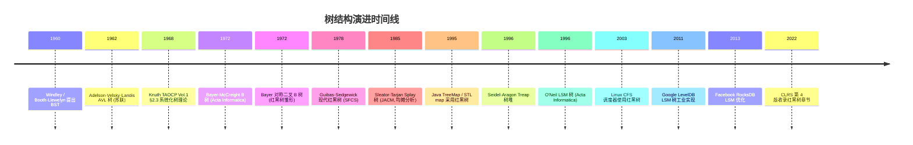

## 1. 概述与学习目标

### 1.1 什么是树

树（Tree）是一种**非线性的层次数据结构**，由 $n$（$n \geq 0$）个节点组成的有限集合 $T$。当 $n = 0$ 时称空树；当 $n > 0$ 时满足：

1. 有且仅有一个特定节点称为**根**（root）；
2. 其余节点可分为 $m$（$m > 0$）个互不相交的有限集合 $T_1, T_2, \ldots, T_m$，每个集合本身也是一棵树，称为根的**子树**（subtree）。

树的等价定义：**连通无环图**。从图论视角，树是 $n$ 个节点、$n-1$ 条边的连通图，任意两节点间存在唯一路径。

> 一句话定义：**树 = 层次结构 + 唯一路径 + 无环连通，是表达"父子关系"与"分治结构"的通用数据结构，二叉搜索树提供 $O(\log n)$ 查找/插入/删除。**

### 1.2 学习目标

完成本文档学习后，你将能够：

1. **记忆**树与二叉树的形式化定义，复述二叉搜索树查找/插入/删除的时间复杂度与高度不变量；
2. **理解** Knuth TAOCP Vol.1 §2.3 系统化树理论、Adelson-Velsky-Landis 1962 AVL 树、Bayer 1972 B 树与对称二叉 B 树、Guibas-Sedgewick 1978 红黑树、Sleator-Tarjan 1985 Splay 伸展树、Seidel-Aragon 1996 Treap、O'Neil 1996 LSM 树的历史脉络，说明树为何在层次结构与有序维护场景下不可替代；
3. **应用**二叉树前/中/后/层序遍历（递归与迭代）、BST 操作、AVL 四种旋转、Trie 字典树编写可运行的 Python/C++/Java 代码；
4. **分析**红黑树五大性质推导树高 $O(\log n)$ 上界、Splay 树均摊 $O(\log n)$ 的势能函数证明、B 树节点分裂合并代价；
5. **评估**树相对于哈希表、有序数组、跳跃表在"有序遍历/范围查询/动态维护"问题维度上的优劣，识别数据库索引、调度器、缓存淘汰中的树选型动机；
6. **对比** AVL 树、红黑树、B 树、B+ 树、Splay 树、Treap、跳跃表在平衡条件、旋转次数、磁盘友好性、实现复杂度维度的差异；
7. **创造**性设计基于树的开源项目解决方案，如数据库 B+ 树索引、Linux CFS 调度器、IP 路由前缀树、LRU 缓存、词频统计器。

### 1.3 术语表

| 术语 | 英文 | 定义 |
| ---- | ---- | ---- |
| 根节点 | root | 无前驱的唯一节点 |
| 叶子节点 | leaf | 度为 0 的节点 |
| 内部节点 | internal node | 度大于 0 的非根节点 |
| 度 | degree | 节点的子树个数 |
| 深度 | depth | 根到该节点的边数（根深度为 0） |
| 高度 | height | 该节点到最远叶子的边数（叶子高度为 0） |
| 层 | level | 根在第 1 层，根的子节点在第 2 层 |
| 祖先 | ancestor | 从根到该节点路径上的所有节点 |
| 后代 | descendant | 该节点子树中的所有节点 |
| 兄弟 | sibling | 同一父节点的节点 |
| 森林 | forest | $m \geq 0$ 棵互不相交的树的集合 |

### 1.4 二叉树分类

| 类型 | 定义 | 性质 |
| ---- | ---- | ---- |
| 满二叉树（full） | 每个节点度为 0 或 2 | 第 $k$ 层有 $2^{k-1}$ 个节点 |
| 完全二叉树（complete） | 除最后一层外满，最后一层左对齐 | 堆的底层结构 |
| 完美二叉树（perfect） | 所有层都满 | $n$ 个节点高度为 $\log_2(n+1)-1$ |
| 平衡二叉树（balanced） | 任意节点左右子树高度差 $\leq 1$ | 保证 $O(\log n)$ 操作 |
| 退化二叉树（degenerate） | 每个节点只有一个子节点 | 退化为链表，操作 $O(n)$ |

### 1.5 树 vs 其他查找结构

| 结构 | 平均查找 | 最坏查找 | 插入 | 删除 | 有序遍历 | 范围查询 |
| ---- | -------- | -------- | ---- | ---- | -------- | -------- |
| 二叉搜索树 BST | $O(\log n)$ | $O(n)$ | $O(\log n)$ | $O(\log n)$ | 支持 | 支持 |
| AVL 树 | $O(\log n)$ | $O(\log n)$ | $O(\log n)$ | $O(\log n)$ | 支持 | 支持 |
| 红黑树 | $O(\log n)$ | $O(\log n)$ | $O(\log n)$ | $O(\log n)$ | 支持 | 支持 |
| B 树（$m$ 阶） | $O(\log_m n)$ | $O(\log_m n)$ | $O(\log_m n)$ | $O(\log_m n)$ | 支持 | 支持 |
| 跳跃表 | $O(\log n)$ | $O(n)$ | $O(\log n)$ | $O(\log n)$ | 支持 | 支持 |
| 哈希表 | $O(1)$ | $O(n)$ | $O(1)$ | $O(1)$ | 不支持 | 不支持 |
| 有序数组 | $O(\log n)$ | $O(\log n)$ | $O(n)$ | $O(n)$ | 支持 | 支持 |

> **跨模块引用**：树的图论基础参见 [图算法](algorithm/graph)；堆作为完全二叉树参见 [堆与优先队列](algorithm/heap)；区间查询专用树形结构参见 [线段树](algorithm/segment-tree) 与 [树状数组](algorithm/fenwick-tree)；并查集的森林表示参见 [并查集](algorithm/disjoint-set)；跳跃表作为概率平衡结构参见 [跳跃表](algorithm/skiplist)。

### 1.6 适用场景与不适用场景

| 场景 | 是否适合 | 说明 |
| ---- | -------- | ---- |
| 数据库索引 | 适合 | B+ 树是 MySQL/PostgreSQL 索引标准 |
| 文件系统目录 | 适合 | 树形层次天然表达父子关系 |
| 表达式解析 | 适合 | AST 抽象语法树 |
| 路由表 / IP 前缀匹配 | 适合 | Trie 字典树 $O(L)$ 查找 |
| 调度器（Linux CFS） | 适合 | 红黑树维护虚拟运行时间 |
| 词频统计 / 自动补全 | 适合 | Trie 字典树 |
| LRU 缓存淘汰 | 适合 | 红黑树或哈希表 + 双链表 |
| 单点等价类判定 | 不适合 | 应选并查集 |
| 区间最值查询 | 不适合 | 应选线段树或树状数组 |
| 单次精确查找（无序需求） | 不适合 | 哈希表 $O(1)$ 更优 |
| 严格 $O(1)$ 查找 | 不适合 | 应选哈希表 |

> **教学提示**：理解树的关键是抓住"用层次换查找"的核心思想。这与哈希表"用哈希换查找"、链表"用指针换灵活"一脉相承。BST 的"二分思想"是将有序数组的二分查找推广到动态结构。

---

## 2. 历史动机与演进

### 2.1 前树时代：线性结构的局限

1950 年代初期，计算机主要使用**数组与链表**存储数据。线性结构存在三大根本性缺陷：

1. **数组插入删除代价高**：$O(n)$ 移动，无法高效维护动态数据集；
2. **链表查找代价高**：$O(n)$ 顺序查找，无法支持二分；
3. **缺乏层次表达力**：无法自然表达文件系统目录、家族谱、表达式优先级等层次结构。

1950 年代后期，计算机科学开始系统化数据结构理论，研究人员从家族树、语法树等自然层次结构中抽象出"树"数据结构。

### 2.2 Knuth 1968：系统化树理论

1968 年，Donald E. Knuth 出版《The Art of Computer Programming, Volume 1: Fundamental Algorithms》，在 **Section 2.3 Trees** 系统化树的理论：

- 形式化定义树、森林、二叉树；
- 分析树的高度、深度、度数等基本性质；
- 提出二叉树的链式存储与数组存储（完全二叉树堆存储）；
- 系统讨论二叉树遍历（前/中/后序）的递归与栈式实现；
- 引入线索二叉树（threaded binary tree）优化遍历。

TAOCP Vol.1 成为树教学的金标准，后续教材（CLRS、Sedgewick）均沿用其框架。Knuth 还指出：树是"计算机科学中最基本且最重要的非线性数据结构"。

### 2.3 Windley 1960 / Booth-Llewelyn 1960：二叉搜索树

1960 年，英国学者 Windley 与 Booth-Llewelyn 在 *Computer Journal* 独立提出**二叉搜索树**（Binary Search Tree, BST）：每个节点满足左子树所有节点值 < 根值 < 右子树所有节点值，中序遍历得到有序序列。

BST 的核心贡献：将有序数组的二分查找推广到动态结构，期望 $O(\log n)$ 查找/插入/删除。但 BST 存在致命缺陷：**输入顺序决定树形**。若按升序插入，BST 退化为链表，操作 $O(n)$。这一缺陷直接推动了自平衡树的研究。

### 2.4 Adelson-Velsky-Landis 1962：AVL 树（苏联贡献）

1962 年，莫斯科大学 Georgy Adelson-Velsky 与 Evgenii Landis 在 *Soviet Mathematics Doklady* 3: 1259-1263 发表论文《An algorithm for the organization of information》，首次提出**自平衡二叉搜索树**——AVL 树：

- 每个节点维护**平衡因子**（balance factor）= 左子树高度 - 右子树高度；
- 平衡因子绝对值不超过 1（$|BF| \leq 1$）；
- 插入删除后若违反平衡，通过四种旋转（LL/RR/LR/RL）恢复。

**关键意义**：AVL 树保证高度 $O(\log n)$，是首个自平衡数据结构。这是苏联对计算机科学最持久的贡献之一，比红黑树早 16 年。Adelson-Velsky 与 Landis 后来还参与了早期国际象棋程序 Kaissa 的开发（1974 年首届世界计算机国际象棋锦标赛冠军）。

> **教学提示**：AVL 树的"平衡因子绝对值不超过 1"看似简单，但证明其保证 $O(\log n)$ 高度需要 Fibonacci 数列分析。含 $n$ 个节点的 AVL 树最小高度 $h$ 满足 $N_h = N_{h-1} + N_{h-2} + 1 \geq \varphi^h / \sqrt{5} - 1$，故 $h = O(\log_\varphi n) \approx 1.44 \log_2 n$。

### 2.5 Bayer-McCreight 1972：B 树（磁盘优化）

1972 年，波音科学研究实验室（Boeing Scientific Research Labs）Rudolf Bayer 与 Edward M. McCreight 在 *Acta Informatica* 1(3): 173-189 发表论文《Organization and maintenance of large ordered indexes》，提出**B 树**：

- $m$ 阶 B 树每个节点最多 $m$ 个子节点、$m-1$ 个键；
- 根节点至少 2 个子节点，内部节点至少 $\lceil m/2 \rceil$ 个子节点；
- 所有叶子在同一层（完美平衡）；
- 插入删除通过节点**分裂**（split）与**合并**（merge）维护平衡。

B 树专为磁盘存储设计：节点大小对齐磁盘页（如 4KB），通过增加扇出（fanout）减少树高，将磁盘 I/O 次数降至 $O(\log_m n)$。B+ 树（Bayer 1972 同期变体）将所有数据存叶子，内部节点仅存索引键，叶子通过链表相连，成为 MySQL InnoDB、PostgreSQL、Oracle 等关系数据库的标准索引结构。

B 树的"B"含义至今未明。McCreight 2007 年澄清："B 即 Bayer，亦即 Boeing，亦即 Balanced，三者皆可。" Comer 1979 在 *ACM Computing Surveys* 发表《The ubiquitous B-tree》综述，标志 B 树成为数据库索引的事实标准。

### 2.6 Bayer 1972 / Guibas-Sedgewick 1978：红黑树

1972 年，Rudolf Bayer 在 *Acta Informatica* 1(4): 290-306 发表《Symmetric binary B-trees: Data structure and maintenance algorithms》，提出**对称二叉 B 树**：将 B 树的平衡条件编码到二叉树中，用红黑边标记平衡约束。这是红黑树的雏形。

1978 年，斯坦福大学 Leo J. Guibas 与 Robert Sedgewick 在 SFCS 1978 论文《A dichromatic framework for balanced trees》将其改造为现代**红黑树**：

- 每个节点是红色或黑色；
- 根与叶子（NIL）是黑色；
- 红节点的子节点必为黑色（不能连续两个红节点）；
- 任意节点到其叶子的所有路径包含相同数量的黑节点（**黑高相同**）。

**关键性质**：红黑树高度 $\leq 2 \log_2(n+1)$，查找/插入/删除均 $O(\log n)$，且插入删除最多 3 次旋转即可恢复平衡（优于 AVL 在删除时可能 $O(\log n)$ 次旋转）。这使得红黑树成为**写多读少**场景的首选，被 Java TreeMap、C++ STL map、Linux kernel CFS 调度器、Linux epoll、Java HashMap 链表转树等大量采用。

Guibas-Sedgewick 论文的"dichromatic"（二色）即红与黑，是红黑树得名的由来。

### 2.7 Sleator-Tarjan 1985：Splay 伸展树

1985 年，卡内基梅隆大学 Daniel D. Sleator 与 Robert E. Tarjan 在 *Journal of the ACM* 32(3): 652-686 发表论文《Self-adjusting binary search trees》，提出**Splay 伸展树**：

- 不维护显式平衡信息（无平衡因子、无颜色）；
- 每次访问节点后通过**splay 操作**将其旋转到根；
- splay 操作分 zig（单旋转）、zig-zig（同向双旋转）、zig-zag（异向双旋转）三种情况。

**核心贡献**：Sleator-Tarjan 用**势能函数分析**（potential method）证明 splay 操作均摊 $O(\log n)$。势能函数 $\Phi(T) = \sum_{v \in T} \log_2 s(v)$，其中 $s(v)$ 是以 $v$ 为根子树的大小。这是均摊分析的经典案例，Tarjan 因此获 1986 年图灵奖。

Splay 树的优势：无需维护平衡信息、访问局部性好（频繁访问的节点自动上浮）、实现简单。劣势：单次操作最坏 $O(n)$、不适用于多线程场景。Splay 树被 Windows NT 内存管理、GCC libstdc++ 内存分配器等采用。

### 2.8 Seidel-Aragon 1996：Treap 树堆

1996 年，加州大学伯克利分校 Raimund Seidel 与 Cecilia R. Aragon 在 *Algorithmica* 16(4-5): 464-497 发表论文《Randomized search trees》，提出**Treap**（Tree + Heap）：

- 每个节点存储键 key 与随机优先级 priority；
- 按 key 满足 BST 性质，按 priority 满足堆性质；
- 插入时随机生成 priority，通过旋转恢复堆性质。

**核心优势**：期望高度 $O(\log n)$，且**无需维护平衡信息**（随机性保证平衡）。实现简单，是教学与竞赛首选的平衡树。Treap 也是**笛卡尔树**（Cartesian Tree）的随机化变体。

### 2.9 O'Neil 1996：LSM 树（写优化）

1996 年，麻省大学波士顿分校 Patrick O'Neil 等人在 *Acta Informatica* 33(4): 351-385 发表论文《The log-structured merge-tree (LSM-tree)》，提出**LSM 树**：

- 数据先写入内存中的 MemTable（通常为红黑树或跳表）；
- MemTable 满后刷盘为不可变的 SSTable（Sorted String Table）；
- 多层 SSTable 通过**合并压缩**（compaction）维护有序性；
- 查询时按层查找，写入 $O(1)$ 摊还、查询 $O(L \log n)$（$L$ 为层数）。

LSM 树将"写优化"推向极致：所有写入顺序追加，避免随机写磁盘。被 Google LevelDB、Facebook RocksDB、Apache HBase、Apache Cassandra、TiDB TiKV 等现代存储引擎广泛采用，是大数据时代写密集场景的事实标准。

### 2.10 工业实现演进

| 年份 | 系统 | 关键创新 |
| ---- | ---- | ---- |
| 1960 | Windley BST | 首次提出二叉搜索树 |
| 1962 | Adelson-Velsky-Landis AVL | 首个自平衡树 |
| 1968 | Knuth TAOCP Vol.1 §2.3 | 系统化树理论 |
| 1972 | Bayer-McCreight B 树 | 磁盘优化多路平衡 |
| 1972 | Bayer 对称二叉 B 树 | 红黑树雏形 |
| 1974 | Knuth TAOCP Vol.3 §6.2 | BST 与平衡树理论 |
| 1978 | Guibas-Sedgewick 红黑树 | 现代红黑树形式 |
| 1985 | Sleator-Tarjan Splay 树 | 自调整 + 均摊分析 |
| 1996 | Seidel-Aragon Treap | 随机化平衡 |
| 1996 | O'Neil LSM 树 | 写优化存储引擎 |
| 1995 | Java TreeMap | 红黑树标准实现 |
| 1995 | STL map | 红黑树标准实现 |
| 2003 | Linux CFS 调度器 | 红黑树维护虚拟运行时间 |
| 2009 | Linux radix tree | 页缓存索引 |
| 2011 | Google LevelDB | LSM 树工业级实现 |
| 2013 | Facebook RocksDB | LSM 树优化（分层数据库） |

### 2.11 演进时间线



### 2.12 关键设计决策

树结构演进过程中有七个关键设计决策：

1. **层次而非线性**：用层次结构表达父子关系，支持 $O(\log n)$ 二分查找；
2. **二叉而非多叉**：二叉树操作简单（左右子树），是多叉树的基础（左孩子右兄弟表示）；
3. **自平衡而非自然形态**：AVL、红黑、B 树通过显式约束维护平衡，避免退化；
4. **颜色而非高度**：红黑树用颜色编码平衡条件，旋转次数少于 AVL，写性能更优；
5. **随机化而非确定性**：Treap 用随机优先级保证期望平衡，实现最简；
6. **自调整而非显式平衡**：Splay 树通过访问模式自动调整，无需维护平衡信息；
7. **多路而非二叉**：B 树通过增加扇出减少树高，优化磁盘 I/O；LSM 树通过分层追加优化写入。

> **教学提示**：树结构演进的核心张力是"平衡严格性 vs 维护代价"。AVL 严格平衡（高度差 $\leq 1$）但删除代价高；红黑松散平衡（黑高相同）但维护简单；Splay 不显式平衡但均摊 $O(\log n)$。理解这一权衡是选型的关键。

---

## 3. 形式化定义

### 3.1 树的递归定义

**定义 3.1（树）**：树是 $n$（$n \geq 0$）个节点的有限集合 $T$。当 $n = 0$ 时为空树；当 $n > 0$ 时：

1. 有且仅有一个特定节点 $r$ 称为**根**；
2. 其余节点分为 $m$（$m \geq 0$）个互不相交的有限集合 $T_1, T_2, \ldots, T_m$，每个 $T_i$ 本身也是一棵树，称为 $r$ 的**子树**。

**等价图论定义**：树是 $n$ 个节点、$n-1$ 条边的连通无环图。

### 3.2 二叉树形式化

**定义 3.2（二叉树）**：二叉树是 $n$（$n \geq 0$）个节点的有限集合 $B$：

- $n = 0$ 时为空二叉树；
- $n > 0$ 时由根节点、左子树 $B_L$、右子树 $B_R$ 三部分组成，$B_L$ 与 $B_R$ 均为二叉树且互不相交。

**关键性质**：

1. 第 $i$ 层最多 $2^{i-1}$ 个节点（$i \geq 1$）；
2. 深度为 $k$ 的二叉树最多 $2^k - 1$ 个节点；
3. 含 $n_0$ 个叶子节点的二叉树，度为 2 的节点数 $n_2 = n_0 - 1$；
4. 完全二叉树节点编号 $i$（从 1 起）的父节点为 $\lfloor i/2 \rfloor$，左孩子 $2i$，右孩子 $2i+1$。

### 3.3 二叉搜索树（BST）的 ADT

**定义 3.3（BST 性质）**：二叉搜索树是满足以下性质的二叉树：

- 对任意节点 $v$，左子树所有节点键 $\leq v.\text{key}$；
- 右子树所有节点键 $\geq v.\text{key}$；
- 左右子树均为 BST。

**BST ADT** 支持以下操作：

| 操作 | 语义 | 平均 | 最坏 |
| ---- | ---- | ---- | ---- |
| `SEARCH(T, k)` | 查找键 $k$ | $O(\log n)$ | $O(n)$ |
| `INSERT(T, k, v)` | 插入 $(k, v)$ | $O(\log n)$ | $O(n)$ |
| `DELETE(T, k)` | 删除键 $k$ | $O(\log n)$ | $O(n)$ |
| `MINIMUM(T)` | 最小键 | $O(\log n)$ | $O(n)$ |
| `MAXIMUM(T)` | 最大键 | $O(\log n)$ | $O(n)$ |
| `SUCCESSOR(T, k)` | 后继 | $O(\log n)$ | $O(n)$ |
| `PREDECESSOR(T, k)` | 前驱 | $O(\log n)$ | $O(n)$ |
| `RANGE(T, a, b)` | 范围查询 | $O(\log n + r)$ | $O(n)$ |

### 3.4 平衡条件的形式化

**定义 3.4（AVL 平衡）**：AVL 树是满足 $|h(B_L) - h(B_R)| \leq 1$ 的 BST，其中 $h$ 为子树高度。

**定义 3.5（红黑树性质）**：红黑树是满足以下五条性质的 BST：

1. 每个节点是红色或黑色；
2. 根节点是黑色；
3. 每个叶子节点（NIL）是黑色；
4. 红节点的子节点必为黑色（不能有连续两个红节点）；
5. 任意节点到其所有后代叶子的简单路径包含相同数量的黑节点（**黑高 bh** 相同）。

**定理 3.1（红黑树高度上界）**：含 $n$ 个内部节点的红黑树高度 $h \leq 2 \log_2(n+1)$。

**证明思路**：

- 高度 $h$ 的红黑树，从根到叶子的任一路径至少有 $2^{bh} - 1$ 个内部节点（归纳证明）；
- 红黑性质 4 保证红节点不超过一半，故 $bh \geq h/2$；
- 因此 $n \geq 2^{h/2} - 1$，即 $h \leq 2 \log_2(n+1)$。

### 3.5 B 树形式化

**定义 3.6（$m$ 阶 B 树）**：$m$ 阶 B 树是满足以下性质的多路搜索树：

1. 每个节点最多 $m$ 个子节点、$m-1$ 个键；
2. 根节点至少 2 个子节点（除非是叶子）；
3. 内部节点（非根非叶）至少 $\lceil m/2 \rceil$ 个子节点；
4. 所有叶子在同一层（完美平衡）；
5. 节点内键有序，第 $i$ 个键的左子树所有键 $< k_i$，右子树所有键 $> k_i$。

**关键性质**：含 $n$ 个键的 $m$ 阶 B 树高度 $h \leq \log_{\lceil m/2 \rceil}((n+1)/2)$。例如 $m = 200$ 时，10 亿键的 B 树高度仅 4 层。

> **教学提示**：B 树的"阶"（order）$m$ 是节点子节点数的上限，与"高度"无关。阶的选择对齐磁盘页大小（如 4KB 页 / 16B 键 ≈ 250 阶），是数据库索引设计的核心参数。

---

## 4. 二叉树基础与遍历

### 4.1 节点定义

```python
# Python 实现：二叉树节点
from typing import Optional, Any, Iterator


class TreeNode:
    """二叉树节点。

    Attributes:
        val: 节点存储的值
        left: 左子节点指针，无左子树时为 None
        right: 右子节点指针，无右子树时为 None
    """

    __slots__ = ('val', 'left', 'right')

    def __init__(self, val: Any = 0, left: Optional['TreeNode'] = None,
                 right: Optional['TreeNode'] = None) -> None:
        self.val = val
        self.left: Optional[TreeNode] = left
        self.right: Optional[TreeNode] = right

    def __repr__(self) -> str:
        return f"TreeNode(val={self.val!r})"
```

```cpp
// C++ 实现：二叉树节点
template<typename T>
struct TreeNode {
    T val;
    TreeNode* left;
    TreeNode* right;
    // 默认构造、值构造、值+左右子树构造
    TreeNode() : val(T{}), left(nullptr), right(nullptr) {}
    explicit TreeNode(const T& v) : val(v), left(nullptr), right(nullptr) {}
    TreeNode(const T& v, TreeNode* l, TreeNode* r) : val(v), left(l), right(r) {}
};
```

```java
// Java 实现：二叉树节点
public class TreeNode<T> {
    public T val;
    public TreeNode<T> left;
    public TreeNode<T> right;

    public TreeNode() {
        this.val = null;
        this.left = null;
        this.right = null;
    }

    public TreeNode(T val) {
        this.val = val;
        this.left = null;
        this.right = null;
    }

    public TreeNode(T val, TreeNode<T> left, TreeNode<T> right) {
        this.val = val;
        this.left = left;
        this.right = right;
    }
}
```

### 4.2 四种遍历方式

```text
        1
       / \
      2   3
     / \
    4   5

前序（根左右）: 1, 2, 4, 5, 3
中序（左根右）: 4, 2, 5, 1, 3
后序（左右根）: 4, 5, 2, 3, 1
层序（BFS）   : 1, 2, 3, 4, 5
```

**核心性质**：

- **前序 + 中序** 或 **后序 + 中序** 可唯一确定一棵二叉树；
- **前序 + 后序** 不能唯一确定（缺中序无法分辨左右子树）；
- **BST 中序遍历** 得到有序序列，是验证 BST 的标准方法。

### 4.3 递归实现

```python
def preorder(root: Optional[TreeNode]) -> list:
    """前序遍历：根 -> 左 -> 右。"""
    if not root:
        return []
    return [root.val] + preorder(root.left) + preorder(root.right)


def inorder(root: Optional[TreeNode]) -> list:
    """中序遍历：左 -> 根 -> 右。BST 得到升序序列。"""
    if not root:
        return []
    return inorder(root.left) + [root.val] + inorder(root.right)


def postorder(root: Optional[TreeNode]) -> list:
    """后序遍历：左 -> 右 -> 根。常用于资源释放（先释放子节点再释放根）。"""
    if not root:
        return []
    return postorder(root.left) + postorder(root.right) + [root.val]
```

```cpp
void preorder(TreeNode* root, vector<int>& res) {
    if (!root) return;
    res.push_back(root->val);
    preorder(root->left, res);
    preorder(root->right, res);
}

void inorder(TreeNode* root, vector<int>& res) {
    if (!root) return;
    inorder(root->left, res);
    res.push_back(root->val);
    inorder(root->right, res);
}

void postorder(TreeNode* root, vector<int>& res) {
    if (!root) return;
    postorder(root->left, res);
    postorder(root->right, res);
    res.push_back(root->val);
}
```

```java
public List<Integer> preorder(TreeNode root) {
    List<Integer> res = new ArrayList<>();
    if (root == null) return res;
    res.add(root.val);
    res.addAll(preorder(root.left));
    res.addAll(preorder(root.right));
    return res;
}

public List<Integer> inorder(TreeNode root) {
    List<Integer> res = new ArrayList<>();
    if (root == null) return res;
    res.addAll(inorder(root.left));
    res.add(root.val);
    res.addAll(inorder(root.right));
    return res;
}

public List<Integer> postorder(TreeNode root) {
    List<Integer> res = new ArrayList<>();
    if (root == null) return res;
    res.addAll(postorder(root.left));
    res.addAll(postorder(root.right));
    res.add(root.val);
    return res;
}
```

### 4.4 迭代实现（栈模拟）

```python
from collections import deque


def preorder_iterative(root: Optional[TreeNode]) -> list:
    """前序迭代：栈，先压右再压左（出栈顺序为左先于右）。"""
    if not root:
        return []
    result, stack = [], [root]
    while stack:
        node = stack.pop()
        result.append(node.val)
        if node.right:  # 先压右，后出栈
            stack.append(node.right)
        if node.left:   # 后压左，先出栈
            stack.append(node.left)
    return result


def inorder_iterative(root: Optional[TreeNode]) -> list:
    """中序迭代：一路向左压栈，访问节点后转向右子树。"""
    result, stack, cur = [], [], root
    while cur or stack:
        while cur:  # 一路向左压栈
            stack.append(cur)
            cur = cur.left
        cur = stack.pop()
        result.append(cur.val)
        cur = cur.right  # 转向右子树
    return result


def postorder_iterative(root: Optional[TreeNode]) -> list:
    """后序迭代：前序的"根左右"改为"根右左"，再反转得"左右根"。"""
    if not root:
        return []
    result, stack = [], [root]
    while stack:
        node = stack.pop()
        result.append(node.val)
        if node.left:   # 与前序相反，先压左
            stack.append(node.left)
        if node.right:
            stack.append(node.right)
    return result[::-1]  # 反转


def levelorder(root: Optional[TreeNode]) -> list:
    """层序遍历：BFS，队列实现。"""
    if not root:
        return []
    result, queue = [], deque([root])
    while queue:
        node = queue.popleft()
        result.append(node.val)
        if node.left:
            queue.append(node.left)
        if node.right:
            queue.append(node.right)
    return result
```

### 4.5 Morris 遍历（$O(1)$ 空间）

Morris 遍历由 J. H. Morris 1979 年提出，利用叶子节点的空闲右指针指向中序后继，实现 $O(1)$ 空间中序遍历：

```python
def morris_inorder(root: Optional[TreeNode]) -> list:
    """Morris 中序遍历：O(1) 空间，利用线索化临时修改树结构。

    核心思想：
    1. 当前节点 cur 的左子树为空，访问 cur，转向右子树；
    2. 左子树非空，找到 cur 左子树的最右节点 prev；
       - prev.right 为空：建立线索 prev.right = cur，转向左子树；
       - prev.right == cur：删除线索，访问 cur，转向右子树。
    """
    result, cur = [], root
    while cur:
        if not cur.left:
            result.append(cur.val)
            cur = cur.right
        else:
            # 找左子树最右节点
            prev = cur.left
            while prev.right and prev.right != cur:
                prev = prev.right
            if not prev.right:
                prev.right = cur  # 建立线索
                cur = cur.left
            else:
                prev.right = None  # 删除线索
                result.append(cur.val)
                cur = cur.right
    return result
```

> **教学提示**：Morris 遍历的时间复杂度 $O(n)$（每条边最多访问 3 次），空间 $O(1)$。代价是临时修改树结构，不适合多线程场景。这是空间最优的遍历算法。

---

## 5. 二叉搜索树（BST）

### 5.1 BST 完整实现（Python）

```python
class BST:
    """二叉搜索树（Binary Search Tree）。

    性质：左子树所有键 <= 根 <= 右子树所有键，中序遍历得升序序列。

    时间复杂度：
        - 平均：查找/插入/删除 O(log n)
        - 最坏：查找/插入/删除 O(n)（退化为链表）
    """

    class Node:
        __slots__ = ('key', 'val', 'left', 'right')

        def __init__(self, key, val=None):
            self.key = key
            self.val = val
            self.left: Optional['BST.Node'] = None
            self.right: Optional['BST.Node'] = None

    def __init__(self):
        self.root: Optional[BST.Node] = None
        self._size = 0

    def __len__(self) -> int:
        return self._size

    def search(self, key) -> Optional[object]:
        """查找键 key，返回对应值，未找到返回 None。"""
        cur = self.root
        while cur:
            if key == cur.key:
                return cur.val
            cur = cur.left if key < cur.key else cur.right
        return None

    def insert(self, key, val=None) -> None:
        """插入键值对。若 key 已存在则更新 val。"""
        new = BST.Node(key, val)
        if not self.root:
            self.root = new
            self._size = 1
            return
        cur = self.root
        while True:
            if key == cur.key:
                cur.val = val  # 已存在，更新
                return
            if key < cur.key:
                if not cur.left:
                    cur.left = new
                    self._size += 1
                    return
                cur = cur.left
            else:
                if not cur.right:
                    cur.right = new
                    self._size += 1
                    return
                cur = cur.right

    def delete(self, key) -> bool:
        """删除键 key。返回是否删除成功。"""
        parent, cur = None, self.root
        # 1. 查找待删除节点
        while cur and cur.key != key:
            parent = cur
            cur = cur.left if key < cur.key else cur.right
        if not cur:
            return False  # 未找到
        # 2. 三种情况
        # 2a. 双子树均非空：用后继替换
        if cur.left and cur.right:
            succ_parent, succ = cur, cur.right
            while succ.left:
                succ_parent, succ = succ, succ.left
            cur.key, cur.val = succ.key, succ.val
            # 转为删除 succ（此时 succ 至多只有右子树）
            parent, cur = succ_parent, succ
        # 2b. 至多一个子树：用子树替换 cur
        child = cur.left if cur.left else cur.right
        if not parent:
            self.root = child
        elif parent.left == cur:
            parent.left = child
        else:
            parent.right = child
        self._size -= 1
        return True

    def minimum(self):
        """最小键：一路向左。"""
        if not self.root:
            return None
        cur = self.root
        while cur.left:
            cur = cur.left
        return cur.key

    def maximum(self):
        """最大键：一路向右。"""
        if not self.root:
            return None
        cur = self.root
        while cur.right:
            cur = cur.right
        return cur.key

    def inorder_keys(self) -> list:
        """中序遍历返回升序键列表。"""
        result = []

        def dfs(node):
            if not node:
                return
            dfs(node.left)
            result.append(node.key)
            dfs(node.right)

        dfs(self.root)
        return result

    def range_query(self, lo, hi) -> list:
        """范围查询 [lo, hi]：利用 BST 剪枝。"""
        result = []

        def dfs(node):
            if not node:
                return
            if node.key > lo:
                dfs(node.left)
            if lo <= node.key <= hi:
                result.append(node.key)
            if node.key < hi:
                dfs(node.right)

        dfs(self.root)
        return result
```

### 5.2 BST 退化问题

BST 的致命缺陷：**树形由插入顺序决定**。

```text
依次插入 1, 2, 3, 4, 5：
    1                    1
     \                    \
      2                    2
       \      退化为        \
        3     链表!          3
         \                    \
          4                     4
           \                     \
            5                      5
查找 5：从 O(log n) 退化为 O(n)
```

**解决方案**：自平衡树（AVL、红黑、B 树、Treap、Splay）通过显式约束或随机化保证 $O(\log n)$ 高度。

### 5.3 C++ 与 Java 实现要点

```cpp
// C++ BST 插入（递归版）
template<typename K, typename V>
struct BSTNode {
    K key;
    V val;
    BSTNode *left, *right;
    BSTNode(const K& k, const V& v) : key(k), val(v), left(nullptr), right(nullptr) {}
};

template<typename K, typename V>
BSTNode<K, V>* insert(BSTNode<K, V>* node, const K& key, const V& val) {
    if (!node) return new BSTNode<K, V>(key, val);
    if (key < node->key)      node->left = insert(node->left, key, val);
    else if (key > node->key) node->right = insert(node->right, key, val);
    else                      node->val = val;
    return node;
}
```

```java
// Java BST 删除（递归版，返回新根）
public TreeNode deleteNode(TreeNode root, int key) {
    if (root == null) return null;
    if (key < root.val) {
        root.left = deleteNode(root.left, key);
    } else if (key > root.val) {
        root.right = deleteNode(root.right, key);
    } else {
        // 找到待删除节点
        if (root.left == null)  return root.right;
        if (root.right == null) return root.left;
        // 双子树非空：用后继替换
        TreeNode succ = root.right;
        while (succ.left != null) succ = succ.left;
        root.val = succ.val;
        root.right = deleteNode(root.right, succ.val);
    }
    return root;
}
```

---

## 6. 平衡二叉树（AVL 树）

### 6.1 AVL 树核心思想

AVL 树（Adelson-Velsky-Landis 1962）通过**平衡因子**约束每个节点的左右子树高度差，保证树高 $O(\log n)$。

**平衡因子**：$BF(v) = h(v.\text{left}) - h(v.\text{right})$

**AVL 性质**：对所有节点 $v$，$|BF(v)| \leq 1$。

**高度上界**：含 $n$ 个节点的 AVL 树高度 $h \leq 1.44 \log_2(n+2)$。证明用 Fibonacci 数列：最小节点数 $N_h = N_{h-1} + N_{h-2} + 1$，$N_h \geq \varphi^h / \sqrt{5}$。

### 6.2 四种失衡情况与旋转

插入节点后，沿插入路径回溯，找到第一个失衡节点 $Z$，根据失衡方向分四种情况：

```text
情况 1: LL（左左）            情况 2: RR（右右）
      Z                          Z
     / \                        / \
    Y   4                      4   Y
   / \                            / \
  X   3                          3   X
 / \                                / \
1   2                              1   2
新节点在 X 左子树                  新节点在 X 右子树
右旋 Z（以 Y 为轴）              左旋 Z（以 Y 为轴）

情况 3: LR（左右）            情况 4: RL（右左）
     Z                          Z
    / \                        / \
   Y   4                      4   Y
  / \                            / \
 1   X                          X   1
    / \                        / \
   2   3                      3   2
新节点在 X 右子树                新节点在 X 左子树
先左旋 Y，再右旋 Z             先右旋 Y，再左旋 Z
```

### 6.3 AVL 树完整实现（Python）

```python
class AVLTree:
    """AVL 树：自平衡二叉搜索树。

    平衡条件：|BF(v)| <= 1，BF = 左子树高 - 右子树高。
    高度上界：1.44 * log2(n+2)
    旋转次数：插入最多 1 次（单旋或双旋），删除最多 O(log n) 次。
    """

    class Node:
        __slots__ = ('key', 'val', 'left', 'right', 'height')

        def __init__(self, key, val=None):
            self.key = key
            self.val = val
            self.left: Optional['AVLTree.Node'] = None
            self.right: Optional['AVLTree.Node'] = None
            self.height: int = 1  # 叶子高度为 1

    def __init__(self):
        self.root: Optional[AVLTree.Node] = None
        self._size = 0

    @staticmethod
    def _h(node: Optional['AVLTree.Node']) -> int:
        """获取节点高度，空节点高度为 0。"""
        return node.height if node else 0

    @staticmethod
    def _bf(node: 'AVLTree.Node') -> int:
        """计算平衡因子 BF = 左高 - 右高。"""
        return AVLTree._h(node.left) - AVLTree._h(node.right)

    @staticmethod
    def _update_height(node: 'AVLTree.Node') -> None:
        """更新节点高度：max(左高, 右高) + 1。"""
        node.height = max(AVLTree._h(node.left), AVLTree._h(node.right)) + 1

    @staticmethod
    def _rotate_right(y: 'AVLTree.Node') -> 'AVLTree.Node':
        """右旋：以 y 左子 x 为轴，返回新根 x。

          y                x
         / \              / \
        x   C    =>      A   y
       / \                  / \
      A   B                B   C
        """
        x = y.left
        y.left = x.right
        x.right = y
        AVLTree._update_height(y)
        AVLTree._update_height(x)
        return x

    @staticmethod
    def _rotate_left(x: 'AVLTree.Node') -> 'AVLTree.Node':
        """左旋：以 x 右子 y 为轴，返回新根 y。

        x                  y
       / \                / \
      A   y      =>      x   C
         / \            / \
        B   C          A   B
        """
        y = x.right
        x.right = y.left
        y.left = x
        AVLTree._update_height(x)
        AVLTree._update_height(y)
        return y

    @classmethod
    def _rebalance(cls, node: 'AVLTree.Node') -> 'AVLTree.Node':
        """检查并恢复 node 的平衡。"""
        cls._update_height(node)
        bf = cls._bf(node)
        # LL：左子树高，且新节点在左子的左子树
        if bf > 1 and cls._bf(node.left) >= 0:
            return cls._rotate_right(node)
        # RR：右子树高，且新节点在右子的右子树
        if bf < -1 and cls._bf(node.right) <= 0:
            return cls._rotate_left(node)
        # LR：左子树高，且新节点在左子的右子树
        if bf > 1 and cls._bf(node.left) < 0:
            node.left = cls._rotate_left(node.left)
            return cls._rotate_right(node)
        # RL：右子树高，且新节点在右子的左子树
        if bf < -1 and cls._bf(node.right) > 0:
            node.right = cls._rotate_right(node.right)
            return cls._rotate_left(node)
        return node

    def insert(self, key, val=None) -> None:
        """插入键值对（递归实现）。"""
        self.root = self._insert(self.root, key, val)

    @classmethod
    def _insert(cls, node: Optional['AVLTree.Node'], key, val) -> 'AVLTree.Node':
        if not node:
            cls._size = getattr(cls, '_size', 0)  # 兼容类方法调用
            return cls.Node(key, val)
        if key < node.key:
            node.left = cls._insert(node.left, key, val)
        elif key > node.key:
            node.right = cls._insert(node.right, key, val)
        else:
            node.val = val  # 已存在，更新
            return node
        return cls._rebalance(node)

    def search(self, key):
        """查找键 key。"""
        cur = self.root
        while cur:
            if key == cur.key:
                return cur.val
            cur = cur.left if key < cur.key else cur.right
        return None
```

### 6.4 AVL vs BST 性能对比

| 操作 | BST 平均 | BST 最坏 | AVL 平均 | AVL 最坏 |
| ---- | -------- | -------- | -------- | -------- |
| 查找 | $O(\log n)$ | $O(n)$ | $O(\log n)$ | $O(\log n)$ |
| 插入 | $O(\log n)$ | $O(n)$ | $O(\log n)$ | $O(\log n)$ |
| 删除 | $O(\log n)$ | $O(n)$ | $O(\log n)$ | $O(\log n)$ |
| 旋转次数（插入） | 0 | 0 | $\leq 1$ | $\leq 1$ |
| 旋转次数（删除） | 0 | 0 | $O(\log n)$ | $O(\log n)$ |

> **教学提示**：AVL 严格平衡带来查找最优，但删除时可能向上 $O(\log n)$ 次旋转。红黑树通过松散平衡（黑高相同）将删除旋转次数降至 $\leq 3$，故写密集场景应选红黑树。

---

## 7. 红黑树

### 7.1 红黑树五大性质（回顾 §3.4）

1. 节点是红色或黑色；
2. 根是黑色；
3. 叶子（NIL）是黑色；
4. 红节点的子节点必为黑色（不能连续两个红节点）；
5. 任意节点到其叶子的所有路径黑高相同。

### 7.2 与 2-3-4 树的等价

红黑树可视为**2-3-4 树**的二叉树编码：

- 黑节点 + 红子节点 = 2-3-4 树的 3-节点（含 2 个键）；
- 黑节点 + 两个红子节点 = 2-3-4 树的 4-节点（含 3 个键）；
- 黑节点（无红子）= 2-3-4 树的 2-节点（含 1 个键）。

这一等价视角由 Guibas-Sedgewick 1978 提出，是理解红黑树插入删除调整的关键。

### 7.3 插入调整

新节点初始为**红色**，可能违反性质 4（红节点的父节点也是红色）。调整分三种情况：

```text
情况 1: 叔叔是红色（重染色 + 上移）
    [B]祖父                [R]祖父
    /     \                /     \
[R]父   [R]叔    =>     [B]父   [B]叔
  |                       |
[R]新                    [R]新

情况 2: 叔叔黑色，新节点是父的右子（先旋转转化为情况 3）
    [B]祖父                [B]祖父
    /                      /
[R]父        =>         [R]新
    \                    /
    [R]新             [R]父

情况 3: 叔叔黑色，新节点是父的左子（右旋 + 重染色）
    [B]祖父                [R]父
    /                      /     \
[R]父        =>         [R]新   [B]祖父
  |
[R]新
```

### 7.4 删除调整

删除节点后，若删除的是黑节点，会破坏黑高平衡。调整通过**"借黑"**或**"旋转重染色"**恢复，最多 3 次旋转。

### 7.5 红黑树 vs AVL 树

| 维度 | AVL 树 | 红黑树 |
| ---- | ------ | ------ |
| 平衡条件 | $|BF| \leq 1$ | 五大红黑性质 |
| 树高上界 | $1.44 \log n$ | $2 \log n$ |
| 查找性能 | 更优（树更矮） | 略劣 |
| 插入旋转 | $\leq 1$ | $\leq 2$ |
| 删除旋转 | $O(\log n)$ | $\leq 3$ |
| 实现复杂度 | 中等 | 较高 |
| 工业应用 | 数据库（少数） | Java TreeMap、STL map、Linux CFS |

> **教学提示**：红黑树是工程上最常用的平衡树。其设计哲学是"松散平衡 + 旋转有界"，牺牲少量查找性能换取删除高效。Linux CFS 调度器使用红黑树维护进程虚拟运行时间，每次调度选最左叶子（最小 vruntime）。

---

## 8. B 树与 B+ 树

### 8.1 B 树核心思想

B 树（Bayer-McCreight 1972）专为**磁盘 I/O 优化**设计：

- 节点大小对齐磁盘页（如 4KB）；
- 高扇出（fanout）减少树高；
- 完美平衡（所有叶子同层）；
- 节点内键有序，支持二分查找。

### 8.2 B 树插入（节点分裂）

```text
3 阶 B 树插入序列 10, 20, 5, 6, 12, 30, 7, 17：

插入 10, 20, 5：        插入 6（节点满，分裂）：
      [5,10,20]              [10]
                           /     \
                        [5]      [20]

插入 12, 30, 7：           插入 17（连续分裂）：
       [10]                       [6,10]
      /     \                    /   |   \
   [5]      [20]              [5] [7] [17,20,30]
            /  \   =>
         [12,30]                  [10]
            |                     /     \
            7                   [6,7]   [17,20,30]
                                /
                              [5]
```

**分裂规则**：节点满（$m-1$ 个键）时，中间键上移到父节点，左右两半成为新子节点。若父节点也满，递归分裂直至根（根分裂时树高 +1）。

### 8.3 B+ 树

B+ 树是 B 树的变体，是关系数据库索引的事实标准：

- **内部节点不存数据**，仅存索引键，扇出更大；
- **所有数据存叶子**，叶子节点包含完整记录；
- **叶子通过链表相连**，支持高效范围扫描与顺序访问；
- 查找必须到叶子层（非提前终止）。

```text
B+ 树结构示例：
          [10 | 20]            <- 内部节点（仅索引键）
         /    |    \
    [1,5,10] [15,20] [25,30]   <- 叶子节点（含数据 + 链表）
       ->       ->       ->    <- 叶子链表（顺序访问）
```

### 8.4 B+ 树在 MySQL InnoDB 中的应用

InnoDB 聚簇索引（Clustered Index）使用 B+ 树：

- 叶子节点存储完整行数据，按主键有序；
- 非主键索引（Secondary Index）叶子存储主键值，需"回表"查询；
- 页大小 16KB，3 层 B+ 树可存约 2000 万行数据；
- Page In/Out 通过 Buffer Pool 缓冲，减少磁盘 I/O。

### 8.5 B+ 树复杂度

$m$ 阶 B+ 树含 $n$ 条记录，高度 $h$ 满足：

$$h \leq \log_{\lceil m/2 \rceil}\left(\frac{n}{m-1}\right)$$

例如 $m = 200$（典型 InnoDB 配置），$n = 10^9$：

$$h \leq \log_{100}(10^9 / 199) \approx 4.25$$

即 10 亿记录仅需 4-5 次磁盘 I/O 即可定位。

> **教学提示**：B+ 树是数据库索引的核心数据结构。理解"高扇出 + 叶子链表 + 完美平衡"三大设计，是数据库性能优化的基础。

---

## 9. Splay 伸展树

### 9.1 Splay 核心思想

Splay 树（Sleator-Tarjan 1985）不维护显式平衡信息，每次访问节点后通过**splay 操作**将其旋转到根。核心机制：

- **zig**：单旋转（父节点是根）；
- **zig-zig**：同向双旋转（先旋转祖父，再旋转父）；
- **zig-zag**：异向双旋转（先旋转父，再旋转祖父）。

### 9.2 Splay 操作实现

```python
class SplayTree:
    """Splay 伸展树：自调整二叉搜索树。

    核心操作 splay(x)：将节点 x 旋转到根。
    均摊复杂度：O(log n)（基于势能函数证明）。
    单次最坏：O(n)。
    """

    class Node:
        __slots__ = ('key', 'val', 'left', 'right', 'parent')

        def __init__(self, key, val=None):
            self.key = key
            self.val = val
            self.left = None
            self.right = None
            self.parent = None

    def __init__(self):
        self.root: Optional[SplayTree.Node] = None

    @staticmethod
    def _rotate(p: 'SplayTree.Node', q: 'SplayTree.Node') -> None:
        """旋转：q 是 p 的子节点，将 q 上移、p 下移。"""
        g = p.parent
        if g:
            if g.left == p:
                g.left = q
            else:
                g.right = q
        q.parent = g
        p.parent = q
        if q == p.left:
            p.left = q.right
            if q.right:
                q.right.parent = p
            q.right = p
        else:
            p.right = q.left
            if q.left:
                q.left.parent = p
            q.left = p

    def _splay(self, x: 'SplayTree.Node') -> None:
        """将 x 旋转到根：zig / zig-zig / zig-zag。"""
        while x.parent:
            p = x.parent
            g = p.parent
            if not g:
                # zig：父是根
                self._rotate(p, x)
            elif (g.left == p) == (p.left == x):
                # zig-zig：同向，先旋转祖父，再旋转父
                self._rotate(g, p)
                self._rotate(p, x)
            else:
                # zig-zag：异向，先旋转父，再旋转祖父
                self._rotate(p, x)
                self._rotate(g, x)
        self.root = x

    def search(self, key):
        """查找 key，找到后 splay 到根。"""
        cur = self.root
        last = None
        while cur:
            last = cur
            if key == cur.key:
                self._splay(cur)
                return cur.val
            cur = cur.left if key < cur.key else cur.right
        if last:
            self._splay(last)  # 未找到也 splay 最后访问节点
        return None

    def insert(self, key, val=None) -> None:
        """插入：先 BST 插入，再 splay 新节点到根。"""
        if not self.root:
            self.root = SplayTree.Node(key, val)
            return
        cur = self.root
        while True:
            if key == cur.key:
                cur.val = val
                self._splay(cur)
                return
            if key < cur.key:
                if not cur.left:
                    new = SplayTree.Node(key, val)
                    new.parent = cur
                    cur.left = new
                    self._splay(new)
                    return
                cur = cur.left
            else:
                if not cur.right:
                    new = SplayTree.Node(key, val)
                    new.parent = cur
                    cur.right = new
                    self._splay(new)
                    return
                cur = cur.right
```

### 9.3 均摊分析（势能函数法）

定义势能函数：

$$\Phi(T) = \sum_{v \in T} \log_2 s(v)$$

其中 $s(v)$ 是以 $v$ 为根的子树大小。则 splay 操作的均摊代价为 $O(\log n)$。

**核心不等式**：每次 splay 操作的实际代价 + 势能变化 $\leq 3(\log_2 s'(x) - \log_2 s(x)) + 1 = O(\log n)$，其中 $s'(x)$ 是 splay 后 $x$ 子树大小（即 $n$）。

> **教学提示**：势能函数分析是 Tarjan 1985 论文的核心贡献，是均摊分析的经典案例。Splay 树的"自调整"特性使频繁访问的节点自动靠近根，体现**访问局部性**（locality of reference）。

---

## 10. Treap 树堆

### 10.1 Treap 核心思想

Treap（Seidel-Aragon 1996）= Tree + Heap，每个节点同时满足：

- 按 key 满足 BST 性质；
- 按 priority 满足堆性质（大根堆或小根堆）。

**关键性质**：随机 priority 保证期望高度 $O(\log n)$，且**无需显式平衡**。

### 10.2 Treap 实现

```python
import random


class Treap:
    """Treap 树堆：随机化平衡二叉搜索树。

    性质：按 key 是 BST，按 priority 是堆（这里用大根堆）。
    期望高度：O(log n)（由随机优先级保证）。
    实现：比 AVL/红黑树简单得多。
    """

    class Node:
        __slots__ = ('key', 'val', 'priority', 'left', 'right')

        def __init__(self, key, val=None):
            self.key = key
            self.val = val
            self.priority = random.random()  # 随机优先级
            self.left: Optional['Treap.Node'] = None
            self.right: Optional['Treap.Node'] = None

    def __init__(self):
        self.root: Optional[Treap.Node] = None

    @staticmethod
    def _rotate_right(p: 'Treap.Node') -> 'Treap.Node':
        """右旋：返回新根。"""
        q = p.left
        p.left = q.right
        q.right = p
        return q

    @staticmethod
    def _rotate_left(p: 'Treap.Node') -> 'Treap.Node':
        """左旋：返回新根。"""
        q = p.right
        p.right = q.left
        q.left = p
        return q

    def insert(self, key, val=None) -> None:
        """插入：先 BST 插入，再按 priority 上浮（旋转）。"""
        self.root = self._insert(self.root, key, val)

    @classmethod
    def _insert(cls, node: Optional['Treap.Node'], key, val) -> 'Treap.Node':
        if not node:
            return cls.Node(key, val)
        if key < node.key:
            node.left = cls._insert(node.left, key, val)
            # 堆性质：子节点 priority 大则上浮
            if node.left.priority > node.priority:
                node = cls._rotate_right(node)
        elif key > node.key:
            node.right = cls._insert(node.right, key, val)
            if node.right.priority > node.priority:
                node = cls._rotate_left(node)
        else:
            node.val = val  # 已存在，更新
        return node

    def search(self, key):
        """查找：同 BST。"""
        cur = self.root
        while cur:
            if key == cur.key:
                return cur.val
            cur = cur.left if key < cur.key else cur.right
        return None
```

### 10.3 Treap 期望分析

由于 priority 随机独立同分布，Treap 等价于**随机 BST**。期望高度：

$$E[h] = O(\log n)$$

具体地，$E[h] \leq 4.3 \ln n$。这是随机化算法的典型应用：用随机性代替显式平衡约束。

---

## 11. Trie 字典树

### 11.1 Trie 核心思想

Trie（发音 "try"）由 Edward Fredkin 1960 提出，是**前缀树**：每个节点代表一个字符串前缀，从根到节点的路径构成该前缀。Trie 牺牲空间换取 $O(L)$ 查找（$L$ 为字符串长度），与键总数无关。

### 11.2 Trie 实现

```python
class Trie:
    """Trie 字典树：前缀匹配专用。

    时间复杂度：插入/查找/前缀匹配 O(L)，L 为字符串长度。
    空间复杂度：O(N * L * |Σ|)，N 为键数，|Σ| 为字符集大小。
    """

    class Node:
        __slots__ = ('children', 'is_end', 'count')

        def __init__(self):
            self.children: dict[str, 'Trie.Node'] = {}
            self.is_end: bool = False  # 是否构成完整单词
            self.count: int = 0        # 经过此节点的单词数

    def __init__(self):
        self.root = Trie.Node()

    def insert(self, word: str) -> None:
        """插入单词。"""
        cur = self.root
        for ch in word:
            if ch not in cur.children:
                cur.children[ch] = Trie.Node()
            cur = cur.children[ch]
            cur.count += 1
        cur.is_end = True

    def search(self, word: str) -> bool:
        """精确查找完整单词。"""
        cur = self._find(word)
        return cur is not None and cur.is_end

    def starts_with(self, prefix: str) -> bool:
        """判断是否存在以 prefix 为前缀的单词。"""
        return self._find(prefix) is not None

    def _find(self, s: str) -> Optional['Trie.Node']:
        """定位到字符串 s 对应节点，未找到返回 None。"""
        cur = self.root
        for ch in s:
            if ch not in cur.children:
                return None
            cur = cur.children[ch]
        return cur

    def autocomplete(self, prefix: str, limit: int = 10) -> list:
        """自动补全：返回所有以 prefix 开头的单词。"""
        start = self._find(prefix)
        if not start:
            return []
        result = []

        def dfs(node, path):
            if len(result) >= limit:
                return
            if node.is_end:
                result.append(prefix + path)
            for ch, child in node.children.items():
                dfs(child, path + ch)

        dfs(start, "")
        return result
```

### 11.3 Trie 应用场景

| 场景 | 说明 |
| ---- | ---- |
| 搜索引擎自动补全 | 用户输入前缀，Trie $O(L)$ 返回候选 |
| 拼写检查 / 词典 | 字典存储为 Trie，快速判断单词存在性 |
| IP 路由表（最长前缀匹配） | Linux radix tree 即 Trie 变体 |
| 串匹配（AC 自动机） | 多模式匹配，Trie + 失败指针 |
| 词频统计 | Trie 节点存储计数，节省共享前缀空间 |

> **教学提示**：Trie 是空间换时间的典型：当键共享前缀多时（如英文单词），Trie 比哈希表更省空间；当键无共享前缀时（如随机字符串），Trie 空间浪费严重。

---

## 12. LSM 树

### 12.1 LSM 核心思想

LSM 树（O'Neil 1996）将所有写入转为**顺序追加**，牺牲查询性能换取极致写入吞吐：

1. **写入**：先追加到 WAL（Write-Ahead Log）保证持久性，再写入内存 MemTable（红黑树或跳表）；
2. **刷盘**：MemTable 满后转为不可变 SSTable 写入磁盘 Level 0；
3. **合并**：Level $i$ 文件数过多时，与 Level $i+1$ 合并（compaction），消除重复键与删除标记；
4. **查询**：按层查找，先查 MemTable，再依次查 Level 0, 1, 2, ...。

### 12.2 LSM 复杂度

| 操作 | 复杂度 | 说明 |
| ---- | ------ | ---- |
| 写入 | $O(1)$ 摊还 | 顺序追加，无随机写 |
| 点查询 | $O(L \log n)$ | $L$ 为层数，每层二分 |
| 范围查询 | $O(\log n + r)$ | 多路归并 |
| 空间放大 | $O(L)$ | 多版本与删除标记 |

### 12.3 LSM 工业实现

| 系统 | LSM 优化 |
| ---- | ---- |
| Google LevelDB | SSTable + 布隆过滤器 + 分层 compaction |
| Facebook RocksDB | LevelDB 分支，增加列族、压缩、限速 |
| Apache HBase | LSM + MemStore + HFile + Region 分片 |
| Apache Cassandra | LSM + MemTable + SSTable + 分级 compaction |
| TiKV | LSM + MVCC + Raft 共识 |

> **教学提示**：LSM 树是大数据时代写密集场景的事实标准。其设计哲学是"追加优于原地更新"，将随机写转为顺序写，与 B+ 树的"原地更新"形成鲜明对比。

---

## 13. 对比分析

### 13.1 平衡树对比

| 数据结构 | 平衡条件 | 树高上界 | 插入旋转 | 删除旋转 | 实现复杂度 |
| -------- | -------- | -------- | -------- | -------- | ---------- |
| AVL 树 | $|BF| \leq 1$ | $1.44 \log n$ | $\leq 1$ | $O(\log n)$ | 中等 |
| 红黑树 | 五大性质 | $2 \log n$ | $\leq 2$ | $\leq 3$ | 较高 |
| B 树（$m$ 阶） | 完美平衡 | $\log_m n$ | 节点分裂 | 节点合并 | 中等 |
| B+ 树 | 完美平衡 + 叶链表 | $\log_m n$ | 节点分裂 | 节点合并 | 中等 |
| Splay 树 | 无显式约束 | $O(n)$ 最坏 | splay | splay | 简单 |
| Treap | 随机 priority | $O(\log n)$ 期望 | $O(\log n)$ 期望 | $O(\log n)$ 期望 | 简单 |
| 跳跃表 | 概率层数 | $O(\log n)$ 期望 | — | — | 简单 |

### 13.2 选型决策矩阵

| 场景 | 推荐结构 | 理由 |
| ---- | -------- | ---- |
| 内存查找（写少读多） | AVL 树 | 严格平衡，查找最优 |
| 内存查找（写多读少） | 红黑树 | 旋转次数有界，写性能优 |
| 内存查找（实现简单） | Treap / 跳跃表 | 随机化，代码极简 |
| 磁盘索引 | B+ 树 | 高扇出 + 叶链表 |
| 写密集存储 | LSM 树 | 顺序写入 |
| 频繁访问局部性 | Splay 树 | 自动调整 |
| 字符串前缀 | Trie | $O(L)$ 查找 |
| 区间查询 | 线段树 / 树状数组 | 专用结构 |
| 等价类 | 并查集 | $O(\alpha)$ 均摊 |

### 13.3 工业级实现对比

| 系统 | 树结构 | 用途 |
| ---- | ------ | ---- |
| Java TreeMap | 红黑树 | 有序 Map |
| C++ STL map | 红黑树 | 有序 Map |
| Linux CFS 调度器 | 红黑树 | 进程调度（按 vruntime） |
| Linux epoll | 红黑树 | 事件描述符管理 |
| Linux radix tree | Trie 变体 | 页缓存索引 |
| MySQL InnoDB | B+ 树 | 聚簇索引 + 二级索引 |
| PostgreSQL | B 树 / B+ 树 | 默认索引 |
| Redis | 跳跃表 | Sorted Set |
| LevelDB / RocksDB | LSM 树 | KV 存储 |
| HBase / Cassandra | LSM 树 | 列式存储 |
| Java HashMap | 链表 → 红黑树 | 哈希冲突处理 |

---

## 14. 常见陷阱

### 14.1 陷阱 1：BST 退化未处理

**问题**：按升序插入 1, 2, 3, ..., n，BST 退化为链表，所有操作 $O(n)$。

**修复**：使用自平衡树（AVL/红黑/Treap），或在插入前随机打乱顺序。

### 14.2 陷阱 2：AVL 删除旋转连锁

**问题**：AVL 删除可能触发 $O(\log n)$ 次向上旋转，写密集场景性能差。

**修复**：写密集场景改用红黑树（删除最多 3 次旋转）。

### 14.3 陷阱 3：红黑树删除未处理"双黑"

**问题**：删除黑节点后未正确处理"双黑"标记，导致黑高失衡。

**修复**：严格按 CLRS 第 13 章四种情况分类调整。

### 14.4 陷阱 4：B 树节点分裂顺序错误

**问题**：分裂时先插入新键再分裂，导致中间键计算错误。

**修复**：先分裂（取出中间键），再在父节点插入中间键。

### 14.5 陷阱 5：Trie 空间爆炸

**问题**：键无共享前缀时（如随机 UUID），Trie 节点数 = 键数 × 长度，空间远超哈希表。

**修复**：改用压缩 Trie（Radix Tree / Patricia Trie），合并单分支路径。

### 14.6 陷阱 6：Splay 树并发不安全

**问题**：Splay 修改根路径，多线程并发访问会破坏树结构。

**修复**：单线程使用，或加全局锁（性能差），或改用并发安全的红黑树。

### 14.7 陷阱 7：LSM 读放大

**问题**：LSM 多层查询导致读放大，点查询可能扫描 $L$ 层。

**修复**：每层添加布隆过滤器，快速过滤不存在的键。

### 14.8 陷阱 8：递归遍历栈溢出

**问题**：树高极大（如 $10^5$）时，递归遍历导致栈溢出。

**修复**：改用迭代实现（栈或队列），或使用尾递归优化。

---

## 15. 工程实践

### 15.1 Linux CFS 调度器（红黑树）

Linux Completely Fair Scheduler（CFS）使用红黑树维护就绪进程：

- 键：进程虚拟运行时间 vruntime；
- 调度：选最左叶子（最小 vruntime）作为下一个运行进程；
- 唤醒：进程唤醒后插入红黑树；
- 阻塞：进程阻塞时从树中删除。

**为何选红黑树而非 AVL**：CFS 频繁插入删除（进程切换），红黑树删除最多 3 次旋转，性能优于 AVL 的 $O(\log n)$ 次旋转。

### 15.2 MySQL InnoDB B+ 树索引

InnoDB 聚簇索引使用 B+ 树：

- 页大小 16KB，叶子节点存完整行；
- 非主键索引叶子存主键值，需"回表"；
- 3 层 B+ 树可存约 2000 万行；
- Buffer Pool 缓解磁盘 I/O。

### 15.3 Java TreeMap（红黑树）

```java
TreeMap<Integer, String> map = new TreeMap<>();
map.put(3, "c");
map.put(1, "a");
map.put(2, "b");
// 遍历得到有序结果
map.forEach((k, v) -> System.out.println(k + ":" + v));  // 1:a 2:b 3:c
// 范围查询
SortedMap<Integer, String> sub = map.subMap(1, 3);  // [1, 3)
```

### 15.4 Linux radix tree（页缓存）

Linux 页缓存使用 radix tree（压缩 Trie）索引页：

- 键：文件偏移量；
- 值：页描述符；
- 路径压缩减少内存占用；
- 支持 XArray 升级版本（Linux 4.20+）。

### 15.5 Redis Sorted Set（跳跃表）

Redis Sorted Set 使用跳跃表而非红黑树：

- 实现更简单；
- 范围查询天然支持；
- 内存额外开销可接受；
- 并发友好（无旋转）。

### 15.6 Java HashMap 链表转红黑树

Java 8 HashMap 优化：

- 哈希冲突链表长度 $\geq 8$ 且表容量 $\geq 64$ 时，链表转红黑树；
- 红黑树节点数 $\leq 6$ 时，退化为链表；
- 防止恶意哈希冲突攻击导致 $O(n)$ 查找。

### 15.7 性能基准对比

```python
# 模拟 100 万次随机插入 + 查找
import time, random
random.seed(42)
keys = list(range(1_000_000))
random.shuffle(keys)

# BST（退化为链表的最坏情况）
bst = BST()
t1 = time.time()
for k in keys:
    bst.insert(k)
print(f"BST insert: {time.time() - t1:.2f}s")  # 较慢（退化）

# AVL
avl = AVLTree()
t2 = time.time()
for k in keys:
    avl.insert(k)
print(f"AVL insert: {time.time() - t2:.2f}s")  # 快（O(log n)）

# Python 内置 dict（哈希表）
d = {}
t3 = time.time()
for k in keys:
    d[k] = None
print(f"dict insert: {time.time() - t3:.2f}s")  # 最快（O(1)）
```

---

## 16. 案例研究

### 16.1 案例 1：二叉搜索树迭代器（LeetCode 173）

**题目**：实现 BST 迭代器，`next()` 返回中序下一个最小值，`hasNext()` 返回是否还有下一个。要求平均 $O(1)$ 时间、$O(h)$ 空间。

**解法**：栈模拟中序遍历，沿左子树压栈。

```python
class BSTIterator:
    """BST 中序迭代器：栈模拟，O(h) 空间，O(1) 摊还 next。"""

    def __init__(self, root: Optional[TreeNode]):
        self.stack = []
        # 一路向左压栈
        while root:
            self.stack.append(root)
            root = root.left

    def next(self) -> int:
        """返回中序下一个值。"""
        node = self.stack.pop()
        # 转向右子树，一路向左压栈
        cur = node.right
        while cur:
            self.stack.append(cur)
            cur = cur.left
        return node.val

    def hasNext(self) -> bool:
        return len(self.stack) > 0
```

### 16.2 案例 2：验证二叉搜索树（LeetCode 98）

**题目**：判断给定二叉树是否是合法 BST。

**关键陷阱**：仅判断"左 < 根 < 右"不够，必须确保整棵左子树 < 根 < 整棵右子树。

```python
def isValidBST(root: Optional[TreeNode]) -> bool:
    """验证 BST：传递 (low, high) 范围。"""

    def validate(node, low, high):
        if not node:
            return True
        if not (low < node.val < high):
            return False
        return validate(node.left, low, node.val) and \
               validate(node.right, node.val, high)

    return validate(root, float('-inf'), float('inf'))
```

### 16.3 案例 3：二叉树最大路径和（LeetCode 124）

**题目**：二叉树中任意节点到任意节点的路径最大和。

**思路**：后序遍历，对每个节点计算"经过该节点的最大路径"与"该节点向下的最大贡献"。

```python
def maxPathSum(root: Optional[TreeNode]) -> int:
    """最大路径和：后序遍历 + 全局最大。"""
    max_sum = float('-inf')

    def max_gain(node):
        """返回以 node 为起点的最大向下路径和。"""
        nonlocal max_sum
        if not node:
            return 0
        # 子树贡献为负则截断为 0
        left = max(max_gain(node.left), 0)
        right = max(max_gain(node.right), 0)
        # 经过 node 的最大路径 = node.val + left + right
        max_sum = max(max_sum, node.val + left + right)
        # 向下贡献只能选一边
        return node.val + max(left, right)

    max_gain(root)
    return max_sum
```

### 16.4 案例 4：序列化与反序列化二叉树（LeetCode 297）

**题目**：设计二叉树序列化与反序列化算法。

**解法**：前序遍历 + NULL 标记。

```python
class Codec:
    """二叉树序列化：前序遍历 + None 标记。"""

    def serialize(self, root: Optional[TreeNode]) -> str:
        """序列化为字符串："1,2,#,#,3,4,#,#,5,#,#"。"""
        if not root:
            return "#"
        return f"{root.val},{self.serialize(root.left)},{self.serialize(root.right)}"

    def deserialize(self, data: str) -> Optional[TreeNode]:
        """反序列化。"""
        vals = iter(data.split(','))

        def build():
            val = next(vals)
            if val == '#':
                return None
            node = TreeNode(int(val))
            node.left = build()
            node.right = build()
            return node

        return build()
```

### 16.5 案例 5：实现 Trie（LeetCode 208）

```python
class Trie:
    """实现 Trie 字典树：insert / search / startsWith。"""

    class Node:
        __slots__ = ('children', 'is_end')

        def __init__(self):
            self.children: dict[str, 'Trie.Node'] = {}
            self.is_end = False

    def __init__(self):
        self.root = Trie.Node()

    def insert(self, word: str) -> None:
        cur = self.root
        for ch in word:
            if ch not in cur.children:
                cur.children[ch] = Trie.Node()
            cur = cur.children[ch]
        cur.is_end = True

    def search(self, word: str) -> bool:
        cur = self.root
        for ch in word:
            if ch not in cur.children:
                return False
            cur = cur.children[ch]
        return cur.is_end

    def startsWith(self, prefix: str) -> bool:
        cur = self.root
        for ch in prefix:
            if ch not in cur.children:
                return False
            cur = cur.children[ch]
        return True
```

---

## 17. 习题与解答

### 17.1 选择题

**1. 关于 AVL 树，下列说法错误的是：**

A. 含 $n$ 个节点的 AVL 树高度 $O(\log n)$
B. 插入节点最多触发 1 次旋转
C. 删除节点最多触发 $O(\log n)$ 次旋转
D. AVL 树的平衡因子定义为 $BF(v) = h(v.\text{right}) - h(v.\text{left})$，要求 $|BF| \leq 1$

<details>
<summary>答案与解析</summary>

**答案**：D

**解析**：A、B、C 均正确。D 错误在于平衡因子定义方向：标准定义为 $BF(v) = h(v.\text{left}) - h(v.\text{right})$（左高减右高），$|BF| \leq 1$。虽然方向反过来也能定义，但教材标准约定是左减右。
</details>

**2. 关于红黑树，下列哪个性质不是五大性质之一？**

A. 根是黑色
B. 红节点的子节点必为黑色
C. 任意节点到叶子的所有路径黑高相同
D. 任意节点到叶子的所有路径长度相同

<details>
<summary>答案与解析</summary>

**答案**：D

**解析**：红黑树只要求"黑高相同"（性质 5），不要求"路径长度相同"。事实上，红黑树最长路径最多是最短路径的 2 倍（因红节点不能连续，最短全黑，最长红黑相间）。
</details>

**3. 关于 B+ 树与 B 树，下列说法正确的是：**

A. B+ 树内部节点存储数据，B 树不存储
B. B 树叶子节点通过链表相连，B+ 树不连
C. B+ 树内部节点仅存索引键，数据全在叶子
D. B 树查找可能提前在内部节点终止，B+ 树必须到叶子

<details>
<summary>答案与解析</summary>

**答案**：C、D

**解析**：
- A 错：恰好相反，B+ 树内部节点仅索引，B 树内部节点可存数据；
- B 错：恰好相反，B+ 树叶子有链表，B 树叶子无；
- C 正确：B+ 树内部节点仅存索引键，数据全在叶子，扇出更大；
- D 正确：B 树查找可能在内部节点命中即返回，B+ 树必须到叶子。
</details>

### 17.2 填空题

**1.** 含 $n$ 个节点的完美二叉树高度为 _______。

<details>
<summary>答案</summary>

$\log_2(n+1) - 1$（根高度为 0）。若定义叶子高度为 1，则为 $\log_2(n+1)$。
</details>

**2.** 红黑树的高度上界为 _______。

<details>
<summary>答案</summary>

$2 \log_2(n+1)$。证明：黑高 $bh \geq h/2$（红节点不连续），$n \geq 2^{bh} - 1 \geq 2^{h/2} - 1$。
</details>

### 17.3 代码修正题

**1.** 以下 BST 验证代码有 bug，请找出并修正：

```python
def isValidBST(root):
    if not root:
        return True
    if root.left and root.left.val >= root.val:
        return False
    if root.right and root.right.val <= root.val:
        return False
    return isValidBST(root.left) and isValidBST(root.right)
```

<details>
<summary>答案</summary>

**Bug**：仅检查直接子节点，未检查整棵子树。例如：

```text
    5
   / \
  1   8
     / \
    4   9
```

4 在 8 的左子树，但 4 < 5，应判 False。原代码返回 True。

**修正**：传递 (low, high) 范围：

```python
def isValidBST(root):
    def validate(node, low, high):
        if not node:
            return True
        if not (low < node.val < high):
            return False
        return validate(node.left, low, node.val) and \
               validate(node.right, node.val, high)
    return validate(root, float('-inf'), float('inf'))
```
</details>

**2.** 以下 AVL 旋转代码有 bug，请找出并修正：

```python
def rotate_right(y):
    x = y.left
    y.left = x.right
    x.right = y
    return x
    # 缺少高度更新
```

<details>
<summary>答案</summary>

**Bug**：旋转后未更新 y 和 x 的高度，导致后续平衡因子计算错误。

**修正**：

```python
def rotate_right(y):
    x = y.left
    y.left = x.right
    x.right = y
    # 必须先更新下层 y，再更新上层 x
    update_height(y)
    update_height(x)
    return x
```
</details>

### 17.4 开放论述题

**1.** 论述为何 Linux CFS 调度器选择红黑树而非 AVL 树。

<details>
<summary>参考答案</summary>

Linux CFS 调度器选择红黑树基于三大考量：

1. **删除旋转次数**：进程切换频繁，每次阻塞与唤醒都涉及树节点删除与插入。AVL 树删除可能触发 $O(\log n)$ 次向上旋转（因为 AVL 严格平衡，删除任一层都可能失衡），而红黑树删除最多 3 次旋转即可恢复（红黑性质更松散）。在频繁调度的场景下，红黑树的旋转次数优势转化为显著性能优势。

2. **查找性能差异小**：AVL 树高 $1.44 \log n$，红黑树高 $2 \log n$，差异约 40%。但 CFS 选最左叶子（最小 vruntime），路径固定为左边界，且进程数通常在数千级别，树高差异仅几次比较，CPU 缓存命中优势抵消了高度差异。

3. **实现成熟度**：红黑树在 Linux kernel 中已有成熟实现（`rbtree.h`/`rbtree.c`），被 CFS、epoll、内存管理等多个子系统共享，代码复用率高。

综上，红黑树在"写性能 + 实现成熟度"上优于 AVL，是 CFS 的最优选择。
</details>

**2.** 论述 LSM 树相比 B+ 树的写优势与读劣势。

<details>
<summary>参考答案</summary>

**写优势**：

1. **顺序写入**：LSM 将所有写入转为 MemTable 内存追加，满后顺序刷盘为 SSTable。B+ 树则需原地更新叶子节点，可能触发页分裂与随机写。
2. **无随机写**：LSM 不修改已有 SSTable，仅追加新 SSTable 并通过 compaction 合并。B+ 树的每次更新都涉及磁盘随机 I/O。
3. **写放大低**：LSM 写放大 $\approx$ compaction 层数，B+ 树写放大 $\approx$ 页分裂次数 + 日志。

**读劣势**：

1. **多层查询**：LSM 点查询需查 MemTable + 多层 SSTable，最坏 $O(L)$ 次 I/O。B+ 树点查询固定 $O(\log_m n)$ 次 I/O。
2. **读放大**：LSM 多版本与删除标记导致空间放大，查询需扫描多版本。
3. **范围查询效率**：B+ 树叶子链表支持顺序扫描，LSM 需多路归并。

**缓解措施**：LSM 通过布隆过滤器（每层一个）快速过滤不存在的键，将多数点查询降至 $O(1)$。RocksDB 还引入 SSTable 元数据缓存与索引缓存进一步优化读性能。

**结论**：LSM 适合写远多于读的场景（如日志系统、监控数据），B+ 树适合读写均衡且查询延迟敏感的场景（如 OLTP 数据库）。
</details>

**3.** 论述 Splay 树的均摊分析为何使用势能函数而非最坏情况分析。

<details>
<summary>参考答案</summary>

Splay 树的单次操作最坏 $O(n)$（如退化为链表时访问叶子），最坏分析无法反映其整体性能。势能函数分析的优势在于：

1. **捕捉整体性能**：势能函数 $\Phi(T) = \sum_v \log_2 s(v)$ 度量树的"不平衡程度"。Splay 操作虽然单次代价高，但会降低势能（频繁访问的节点上浮，子树变大，$\log s$ 增大，但总势能被摊还）。

2. **均摊 $O(\log n)$**：通过势能函数可证明 $m$ 次操作总代价 $O(m \log n)$，即均摊 $O(\log n)$。这一界与最坏 $O(\log n)$ 的 AVL/红黑树相当，但 Splay 实现更简单。

3. **访问局部性**：势能函数隐含捕捉了"频繁访问的节点自动靠近根"的特性。最坏分析无法体现这一优势，而均摊分析揭示了 Splay 在实际工作负载下的优越性能。

4. **理论价值**：Sleator-Tarjan 1985 的势能分析是均摊分析的奠基性工作，影响了后续动态树、链接-切割树等数据结构的分析框架。

因此，势能函数是分析自调整数据结构（如 Splay、动态树）的标准工具，能揭示最坏分析无法发现的性能特征。
</details>

---

## 18. 参考文献

1. Adelson-Velsky, G. M., & Landis, E. M. (1962). An algorithm for the organization of information. *Soviet Mathematics Doklady*, 3, 1259-1263.
2. Bayer, R., & McCreight, E. M. (1972). Organization and maintenance of large ordered indexes. *Acta Informatica*, 1(3), 173-189. DOI: 10.1007/BF00288683
3. Bayer, R. (1972). Symmetric binary B-trees: Data structure and maintenance algorithms. *Acta Informatica*, 1(4), 290-306. DOI: 10.1007/BF00289509
4. Guibas, L. J., & Sedgewick, R. (1978). A dichromatic framework for balanced trees. *Proceedings of the 19th Annual Symposium on Foundations of Computer Science (SFCS)*, 8-21. DOI: 10.1109/SFCS.1978.3
5. Sleator, D. D., & Tarjan, R. E. (1985). Self-adjusting binary search trees. *Journal of the ACM*, 32(3), 652-686. DOI: 10.1145/3828.3835
6. Seidel, R., & Aragon, C. R. (1996). Randomized search trees. *Algorithmica*, 16(4-5), 464-497. DOI: 10.1007/s004539900061
7. O'Neil, P., Cheng, E., Gawlick, D., & O'Neil, E. (1996). The log-structured merge-tree (LSM-tree). *Acta Informatica*, 33(4), 351-385. DOI: 10.1007/s002360050048
8. Knuth, D. E. (1997). *The Art of Computer Programming, Volume 1: Fundamental Algorithms* (3rd ed.). Addison-Wesley Professional. ISBN 978-0201896831. Section 2.3 (Trees).
9. Cormen, T. H., Leiserson, C. E., Rivest, R. L., & Stein, C. (2022). *Introduction to Algorithms* (4th ed.). MIT Press. ISBN 978-0262046305. Chapter 12 (BST) and Chapter 13 (Red-Black Trees).
10. Sedgewick, R., & Wayne, K. (2011). *Algorithms* (4th ed.). Addison-Wesley Professional. ISBN 978-0321573513. Section 3.2 (BST) and Section 3.3 (Balanced Search Trees).
11. Comer, D. (1979). The ubiquitous B-tree. *ACM Computing Surveys*, 11(2), 121-137. DOI: 10.1145/356770.356776

---

## 19. 延伸阅读

### 19.1 理论深入

- **CLRS Chapter 13**：红黑树形式化证明与实现
- **Knuth TAOCP Vol.3 §6.2**：BST 与平衡树的理论分析
- **Tarjan 1983 *Data Structures and Network Algorithms***：Splay 与动态树
- **Andersson 1993 *Balanced search trees made simple***：AA 树（红黑树变体）

### 19.2 应用拓展

- **MySQL InnoDB Storage Architecture**：B+ 树索引与 Buffer Pool
- **Google LevelDB Implementation**：LSM 树工业级实现
- **Linux Kernel CFS Documentation**：红黑树在调度器中的应用
- **Apache Cassandra Architecture**：LSM + 分级 compaction

### 19.3 工程实现

- **Linux kernel `rbtree.c`**：红黑树通用实现
- **Java `TreeMap.java`**：红黑树标准库实现
- **C++ STL `stl_tree.h`**：红黑树实现（`std::map` 底层）
- **RocksDB `db/db_impl.cc`**：LSM 树 compaction 实现

### 19.4 教学视频

- **MIT 6.006 Introduction to Algorithms**：Lecture 6 (AVL)、Lecture 7 (Red-Black)
- **Stanford CS161 Design and Analysis of Algorithms**：Balanced Trees
- **CMU 15-451 Algorithm Design**：Splay Trees Amortized Analysis
- **Robert Sedgewick Princeton Algorithms**：Red-Black Tree Visualization

### 19.5 在线练习

- **LeetCode**：BST（98/173/230/235/108/109）、Trie（208/211/212）、平衡树相关题目
- **LintCode**：二叉树与递归专题
- **VisuAlgo**：可视化 AVL、红黑、B 树、Splay 操作
- **USACO Guide**：高级树结构竞赛应用

---

## 附录 A：树结构复杂度速查表

| 数据结构 | 查找 | 插入 | 删除 | 范围查询 | 空间 | 备注 |
| -------- | ---- | ---- | ---- | -------- | ---- | ---- |
| 二叉搜索树 BST | $O(\log n)$ / $O(n)$ | $O(\log n)$ / $O(n)$ | $O(\log n)$ / $O(n)$ | $O(\log n + r)$ | $O(n)$ | 最坏退化为链表 |
| AVL 树 | $O(\log n)$ | $O(\log n)$ | $O(\log n)$ | $O(\log n + r)$ | $O(n)$ | 严格平衡，读优 |
| 红黑树 | $O(\log n)$ | $O(\log n)$ | $O(\log n)$ | $O(\log n + r)$ | $O(n)$ | 写优，工业首选 |
| B 树（$m$ 阶） | $O(\log_m n)$ | $O(\log_m n)$ | $O(\log_m n)$ | $O(\log_m n + r)$ | $O(n)$ | 磁盘优化 |
| B+ 树 | $O(\log_m n)$ | $O(\log_m n)$ | $O(\log_m n)$ | $O(\log_m n + r)$ | $O(n)$ | 数据库标准 |
| Splay 树 | $O(\log n)$ 摊还 | $O(\log n)$ 摊还 | $O(\log n)$ 摊还 | $O(\log n + r)$ 摊还 | $O(n)$ | 自调整 |
| Treap | $O(\log n)$ 期望 | $O(\log n)$ 期望 | $O(\log n)$ 期望 | $O(\log n + r)$ 期望 | $O(n)$ | 随机化 |
| Trie（$L$ 为键长） | $O(L)$ | $O(L)$ | $O(L)$ | $O(L + r)$ | $O(NL)$ | 前缀匹配 |
| LSM 树（$L$ 层） | $O(L \log n)$ | $O(1)$ 摊还 | $O(1)$ 摊还 | $O(\log n + r)$ | $O(Ln)$ | 写优化 |
| 跳跃表 | $O(\log n)$ 期望 | $O(\log n)$ 期望 | $O(\log n)$ 期望 | $O(\log n + r)$ | $O(n)$ | 概率平衡 |

## 附录 B：常见面试题速查表

| 题号 | 题目 | 难度 | 关键技巧 |
| ---- | ---- | ---- | -------- |
| LC94 | 二叉树中序遍历 | 简单 | 栈迭代 / Morris |
| LC98 | 验证 BST | 中等 | 范围 (low, high) |
| LC100 | 相同的树 | 简单 | 递归 |
| LC101 | 对称二叉树 | 简单 | 递归 / 队列 |
| LC102 | 层序遍历 | 中等 | BFS 队列 |
| LC104 | 二叉树最大深度 | 简单 | 递归 / BFS |
| LC105 | 前+中序构造二叉树 | 中等 | 递归 + 哈希 |
| LC108 | 有序数组转 BST | 简单 | 分治 |
| LC124 | 二叉树最大路径和 | 困难 | 后序 + 全局最大 |
| LC173 | BST 迭代器 | 中等 | 栈模拟中序 |
| LC208 | 实现 Trie | 中等 | 字典树 |
| LC230 | BST 第 K 小 | 中等 | 中序遍历 |
| LC235 | BST 最近公共祖先 | 简单 | 利用 BST 性质 |
| LC297 | 序列化二叉树 | 困难 | 前序 + NULL 标记 |
| LC450 | 删除 BST 节点 | 中等 | 三种情况分类 |
