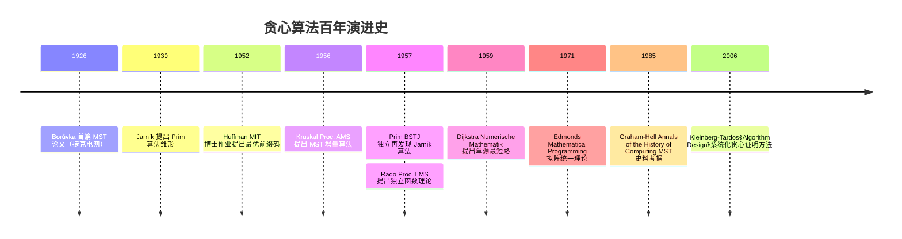

## 1. 概述与学习目标

### 1.1 什么是贪心算法

**贪心算法**（Greedy Algorithm）是一类在每一步决策中都选择当前看起来最优的选项的算法——不回头、不撤销、不重新考虑。Thomas H. Cormen 等在《Introduction to Algorithms》（CLRS）第 16 章将贪心算法定义为："在每一步都做出当时看起来最优的选择，期望通过局部最优达到全局最优"。

贪心算法的正确性依赖于两大关键性质：

1. **贪心选择性质**（Greedy Choice Property）：存在一个最优解包含了贪心策略在第一步所做的选择；
2. **最优子结构**（Optimal Substructure）：做出贪心选择后，剩余子问题的最优解与贪心选择组合，构成原问题的最优解。

Jack Edmonds 在 1971 年《Matroids and the greedy algorithm》（Mathematical Programming 1:127-136, DOI:10.1007/BF01584082）中证明：**拟阵**（Matroid）结构上的贪心算法必得最优解。这为贪心算法提供了统一的正确性判据——一个问题能用贪心最优求解当且仅当其可行解空间构成拟阵（或其变体如 greedoid）。

```
贪心算法分类树：
                          贪心算法
                              |
        ┌─────────────┬───────┴───────┬──────────────┐
    图论贪心        编码压缩         调度问题         背包问题
        │              │                │                │
    ┌───┴───┐     ┌────┴────┐       ┌───┴───┐        ┌───┴───┐
   Kruskal Prim  Huffman  Shannon 活动选择 区间调度  分数背包 任务调度
   1956    1957  1952     1948       O(nlogn)          O(nlogn)
```

**贪心与动态规划的本质区别**：

| 维度 | 贪心 | 动态规划 |
| ---- | ---- | ---- |
| 决策方式 | 每步取局部最优，不回头 | 考虑所有可能的子问题解 |
| 子问题关系 | 做出选择后只剩一个子问题 | 需要比较多个子问题的解 |
| 正确性保证 | 需证明贪心选择性质 | 最优子结构即可保证 |
| 时间复杂度 | 通常 $O(n \log n)$ | 通常 $O(n^2)$ 或更高 |
| 适用范围 | 较窄，需特殊性质 | 较广，通用性强 |
| 经典对比 | 分数背包 $O(n \log n)$ | 0-1 背包 $O(nW)$ |
| 经典对比 | 区间调度 $O(n \log n)$ | 加权区间调度 $O(n \log n)$ DP |

> 一句话定义：**贪心 = 每步选当前最优；正确性靠贪心选择性质 + 最优子结构保证；Edmonds 1971 拟阵理论统一判据；活动选择 $O(n \log n)$、哈夫曼编码 $O(n \log n)$、Kruskal $O(E \log E)$、Prim $O(E \log V)$、Dijkstra $O((V+E) \log V)$、分数背包 $O(n \log n)$ 是六大经典贪心算法。**

### 1.2 学习目标

完成本文档学习后，你将能够：

1. **记忆**活动选择 $O(n \log n)$、哈夫曼编码 $O(n \log n)$、Kruskal $O(E \log E)$、Prim $O(E \log V)$（二叉堆）/$O(E + V \log V)$（Fibonacci 堆）、Dijkstra $O((V+E) \log V)$、分数背包 $O(n \log n)$ 的形式化复杂度，复述各贪心算法的贪心选择性质与最优子结构；
2. **理解** Huffman 1952 MIT 博士课程作业、Kruskal 1956 Proc. AMS 7(1):48-50、Prim 1957 BSTJ 36(6):1389-1401、Dijkstra 1959 Numerische Mathematik 1:269-271、Rado 1957 Proc. London Math. Soc. 7:300-320、Edmonds 1971 Mathematical Programming 1:127-136 拟阵统一理论的历史脉络，说明各贪心算法的设计动机；
3. **应用**活动选择（按结束时间排序）、哈夫曼编码（优先队列构建）、Kruskal（并查集+排序）、Prim（优先队列）、Dijkstra（优先队列+松弛）、分数背包（按单位价值排序）、区间调度编写可运行的 Python/C++/Java 代码，解决 LeetCode 55、134、406、452、621、763 等高频问题；
4. **分析**贪心选择性质与最优子结构的形式化定义、拟阵 $(E, \mathcal{I})$ 三公理（遗传性/扩张性/空集性）、Edmonds 定理（拟阵上贪心最优）、交换论证/保持领先/势能下降三大正确性证明方法，掌握"交换论证、归纳证明、拟阵归约"三大核心论证方法；
5. **评估**各贪心算法在"贪心选择性质是否满足"、"最优子结构是否成立"、"0-1 背包 vs 分数背包"、"区间调度 vs 加权区间调度"维度上的优劣，识别 Huffman 编码、网络设计 MST、Google Maps 最短路、JPEG/zip 压缩、任务调度的选型动机；
6. **对比**活动选择、哈夫曼编码、Kruskal、Prim、Dijkstra、分数背包、任务调度、区间调度在贪心策略、排序键、数据结构、时间复杂度、正确性证明方法维度的差异；
7. **创造**性设计基于贪心算法的开源项目解决方案，如 Huffman 压缩器、Kruskal 网络拓扑设计、Dijkstra 路径规划、Prim 网络广播、加油站路径优化、任务调度器。

### 1.3 术语表

| 术语 | 英文 | 定义 |
| ---- | ---- | ---- |
| 贪心选择性质 | greedy choice property | 存在最优解包含贪心第一步选择 |
| 最优子结构 | optimal substructure | 原问题最优解包含子问题最优解 |
| 拟阵 | matroid | $(E, \mathcal{I})$ 满足遗传/扩张/空集三公理 |
| 遗传性 | hereditary property | 独立集的子集仍是独立集 |
| 扩张性 | augmentation property | 较小独立集可扩张到较大独立集 |
| 交换论证 | exchange argument | 通过交换最优解元素证明贪心正确 |
| 保持领先 | stay ahead | 证明贪心每步不劣于最优解 |
| 势能下降 | potential decrease | 用势能函数证明贪心收敛 |
| 前缀码 | prefix code | 任意码字不是另一码字前缀 |
| 生成树 | spanning tree | 连通图的所有顶点的极小连通子图 |

### 1.4 全景对比表

| 算法 | 贪心策略 | 排序键 | 数据结构 | 时间 | 正确性证明 |
| ---- | ---- | ---- | ---- | ---- | ---- |
| 活动选择 | 选结束最早 | end time | 排序 | $O(n \log n)$ | 交换论证 |
| 哈夫曼编码 | 合并频率最小 | frequency | 优先队列 | $O(n \log n)$ | 交换论证 + 最优子结构 |
| Kruskal MST | 选最短边不构成环 | edge weight | 并查集 | $O(E \log E)$ | 交换论证 / 拟阵 |
| Prim MST | 选最近顶点扩展 | edge weight | 优先队列 | $O(E \log V)$ | 切割性质 |
| Dijkstra | 选最近未确定顶点 | distance | 优先队列 | $O((V+E) \log V)$ | 交换论证 |
| 分数背包 | 选单位价值最高 | value/weight | 排序 | $O(n \log n)$ | 交换论证 |
| 区间调度 | 选结束最早 | end time | 排序 | $O(n \log n)$ | 保持领先 |
| 任务调度 | 选频率最高 | frequency | 优先队列 | $O(n \log n)$ | 交换论证 |

## 2. 历史动机与演进

### 2.1 时间线



### 2.2 关键人物与决策

1. **Borůvka 1926**（捷克电网设计）：Otakar Borůvka 为捷克摩拉维亚地区电网设计首次研究 MST，论文《On a certain minimum problem》《O jistém problému minimálním》。Graham-Hell 1985 考据指出这是 MST 研究的开端；
2. **Huffman 1952**（MIT 博士作业）：David A. Huffman 在 Robert Fano 教授的信息论课程作业中提出"自底向上"的最优前缀码构造法，比 Fano-Shannon 自顶向下分割更优。论文《A Method for the Construction of Minimum-Redundancy Codes》Proc. IRE 40(9):1098-1101，DOI:10.1109/JRPROC.1952.273898。Huffman 编码至今是 JPEG、MP3、zip、gzip 的核心；
3. **Kruskal 1956**（普林斯顿大学）：Joseph B. Kruskal 在普林斯顿读博时研究旅行商问题，提出 MST 的"按边排序增量"算法。论文《On the shortest spanning subtree of a graph and the traveling salesman problem》Proc. AMS 7(1):48-50, DOI:10.1090/S0002-9939-1956-0078686-7；
4. **Prim 1957**（贝尔实验室）：Robert C. Prim 在贝尔实验室研究网络设计时独立再发现 Jarník 1930 的算法（Jarník 论文用捷克语发表，长期被忽视）。论文《Shortest connection networks and some generalizations》BSTJ 36(6):1389-1401, DOI:10.1002/j.1538-7305.1957.tb01515.x；
5. **Dijkstra 1959**（阿姆斯特丹数学中心）：Edsger W. Dijkstra 为展示 ARMAC 计算机性能，设计单源最短路算法。论文《A note on two problems in connexion with graphs》Numerische Mathematik 1:269-271, DOI:10.1007/BF01386390。原文仅 3 页，是计算机科学被引用最多的论文之一；
6. **Rado 1957**（伦敦皇家学院）：Richard Rado 在《Note on independence functions》Proc. LMS 7:300-320 提出独立函数理论，为拟阵理论奠基；
7. **Edmonds 1971**（加拿大滑铁卢大学）：Jack Edmonds 在《Matroids and the greedy algorithm》Mathematical Programming 1:127-136 证明"拟阵上的贪心算法必得最优解"，统一了 Kruskal MST、任务调度等算法的正确性证明。Edmonds 还以匹配算法（Edmonds 1965 Blossom 算法）闻名。

### 2.3 关键设计决策

- **Huffman 选择"自底向上合并"**：Fano-Shannon 编码采用自顶向下分割，无法保证最优；Huffman 反向思考，从频率最小的两个节点合并，构造二叉树，证明此构造达到最小加权路径长度；
- **Kruskal 选择"按边排序增量"**：相比 Prim 的"从一个点扩展"，Kruskal 全局排序所有边，逐条加入不构成环的边。并查集（Disjoint Set Union, DSU）使环检测 $O(\alpha(V))$；
- **Prim 选择"按顶点扩展"**：从任一顶点出发，每次加入距离当前树最近的顶点。优先队列优化至 $O(E \log V)$，Fibonacci 堆进一步至 $O(E + V \log V)$；
- **Dijkstra 选择"贪心松弛"**：每次选距离源点最近的未确定顶点，对其所有出边做松弛操作。优先队列保证 $O((V+E) \log V)$；
- **Edmonds 选择"拟阵统一"**：观察到 Kruskal 的"按边排序+无环检查"本质是在图拟阵（Graphic Matroid）上的贪心。Edmonds 证明任何拟阵上的贪心都最优，将零散的贪心算法纳入统一理论。

## 3. 形式化定义与拟阵理论

### 3.1 贪心选择性质与最优子结构

**定义 3.1（贪心选择性质）**：设问题 $P$ 的贪心策略在第一步选择元素 $e^*$。若存在 $P$ 的一个最优解 $S^*$ 使得 $e^* \in S^*$，则称 $P$ 满足贪心选择性质。

**定义 3.2（最优子结构）**：设问题 $P$ 的贪心策略选择 $e^*$ 后剩余子问题为 $P'$。若 $S^*$ 是 $P$ 的最优解当且仅当 $S^* \setminus \{e^*\}$ 是 $P'$ 的最优解，则称 $P$ 满足最优子结构。

**定理 3.1（贪心最优性）**：若问题 $P$ 同时满足贪心选择性质与最优子结构，则贪心算法返回 $P$ 的最优解。

**证明**（数学归纳法）：
- 基础（$n=1$）：单个元素时，贪心选择即最优；
- 归纳：设贪心在规模 $n-1$ 上最优。对规模 $n$，由贪心选择性质，存在最优解 $S^* \ni e^*$。由最优子结构，$S^* \setminus \{e^*\}$ 是子问题 $P'$ 的最优解。由归纳假设，贪心在 $P'$ 上返回最优解 $S' = S^* \setminus \{e^*\}$。故贪心返回 $\{e^*\} \cup S' = S^*$，为最优解。$\blacksquare$

### 3.2 拟阵理论（Matroid Theory）

**定义 3.3（拟阵）**：拟阵是二元组 $M = (E, \mathcal{I})$，其中 $E$ 是有限集（"基础集"），$\mathcal{I} \subseteq 2^E$ 是 $E$ 的子集族（"独立集族"），满足三公理：

1. **空集性**：$\emptyset \in \mathcal{I}$；
2. **遗传性**：若 $A \in \mathcal{I}$ 且 $B \subseteq A$，则 $B \in \mathcal{I}$；
3. **扩张性**：若 $A, B \in \mathcal{I}$ 且 $|A| < |B|$，则存在 $e \in B \setminus A$ 使得 $A \cup \{e\} \in \mathcal{I}$。

**典型拟阵实例**：

| 拟阵 | $E$ | $\mathcal{I}$ | 对应贪心算法 |
| ---- | ---- | ---- | ---- |
| 图拟阵 | 图 $G$ 的边集 | 无环边集（森林） | Kruskal MST |
| 矩阵拟阵 | 矩阵列向量 | 线性无关列向量组 | 线性无关最大化 |
| 均匀拟阵 | 任意有限集 | 基数 $\leq k$ 的子集 | Top-K 选择 |
| 划分拟阵 | 按类别划分的元素 | 每类至多 $k_i$ 个 | 任务调度 |
| 横截拟阵 | 二部图一侧顶点 | 可匹配顶点集 | 二部图匹配 |

**定理 3.2（Edmonds 1971 拟阵贪心定理）**：设 $M = (E, \mathcal{I})$ 是拟阵，$w: E \to \mathbb{R}^+$ 是非负权重函数。如下贪心算法返回最大权重独立集：

```
GREEDY-MATROID(E, I, w):
    将 E 按 w 降序排序
    S = ∅
    for e in E:
        if S ∪ {e} ∈ I:
            S = S ∪ {e}
    return S
```

**证明**（反证法 + 扩张性）：设贪心返回 $S = \{e_1, e_2, \dots, e_k\}$（按加入顺序），权重 $w(e_1) \geq w(e_2) \geq \dots \geq w(e_k)$。设 $S^* = \{f_1, f_2, \dots, f_m\}$ 是任意最大权重独立集，$w(f_1) \geq w(f_2) \geq \dots \geq w(f_m)$。

由拟阵的"所有极大独立集等基数"性质（拟阵的秩），$k = m$。

反证：设 $S \neq S^*$，令 $i$ 为首个 $e_i \neq f_i$ 的下标。考虑 $A = \{e_1, \dots, e_{i-1}\}$，$B = \{f_1, \dots, f_i\}$。$|A| = i - 1 < i = |B|$，由扩张性存在 $f_j \in B \setminus A$（$j \geq i$）使得 $A \cup \{f_j\} \in \mathcal{I}$。

由于贪心选择 $e_i$ 而非 $f_j$，且 $w(e_i) \geq w(f_j)$（贪心按权重降序）——这里需 $w(e_i) \geq w(f_j) \geq w(f_i)$（$j \geq i$）。但 $e_i \neq f_i$，故 $w(e_i) \geq w(f_i)$。

将 $S^*$ 中的 $f_i$ 替换为 $e_i$ 得到 $S' = (S^* \setminus \{f_i\}) \cup \{e_i\}$，$S' \in \mathcal{I}$（因 $A \cup \{e_i\} \in \mathcal{I}$ 且 ...）。$w(S') = w(S^*) - w(f_i) + w(e_i) \geq w(S^*)$。重复替换直至 $S^* = S$，故 $w(S) \geq w(S^*)$。又 $S^*$ 最大，$w(S) = w(S^*)$。$\blacksquare$

### 3.3 贪心正确性证明三大方法

#### 3.3.1 交换论证（Exchange Argument）

**核心思想**：取任意最优解 OPT，逐步将其"交换"为贪心解 GREEDY，证明每步交换不破坏最优性。

**步骤**：
1. 设 OPT 为任意最优解；
2. 证明 OPT 可被修改为包含贪心选择的解 OPT'，且 $\text{cost}(\text{OPT}') \leq \text{cost}(\text{OPT})$；
3. 对子问题递归应用，最终 OPT 被完全替换为 GREEDY。

**适用场景**：活动选择、哈夫曼编码、Kruskal MST、Dijkstra。

#### 3.3.2 保持领先（Stay Ahead）

**核心思想**：证明贪心算法在每一步都"领先于"或"不落后于"最优解，最终必不劣于最优解。

**步骤**：
1. 设贪心解为 $G = (g_1, g_2, \dots, g_k)$，最优解为 $O = (o_1, o_2, \dots, o_m)$；
2. 证明 $\forall i, g_i \text{ 不落后于 } o_i$（用具体指标如结束时间）；
3. 推出 $k \geq m$，又 $m$ 是最优，故 $k = m$。

**适用场景**：区间调度、活动选择、Dijkstra。

#### 3.3.3 势能下降（Potential Decrease）

**核心思想**：定义势能函数 $\Phi$，证明每次贪心选择使 $\Phi$ 严格下降，故贪心必终止于最优解。

**适用场景**：哈夫曼编码（树深度势能）、Dijkstra（距离势能）。

## 4. 活动选择问题

### 4.1 问题描述

设有 $n$ 个活动 $A = \{a_1, a_2, \dots, a_n\}$，每个活动有开始时间 $s_i$ 和结束时间 $f_i$。两活动兼容当且仅当时间不重叠（$f_i \leq s_j$ 或 $f_j \leq s_i$）。目标是选出最大兼容活动子集。

### 4.2 贪心策略

**贪心选择**：按结束时间 $f_i$ 升序排序，每次选择结束最早且与已选活动兼容的活动。

### 4.3 Python 实现

```python
def activity_selection(activities: list[tuple]) -> list:
    """活动选择：按结束时间排序贪心。
    activities: [(start, end), ...]
    返回最大兼容子集
    """
    if not activities:
        return []
    # 按结束时间排序
    sorted_acts = sorted(activities, key=lambda x: x[1])
    selected = [sorted_acts[0]]
    last_end = sorted_acts[0][1]
    for start, end in sorted_acts[1:]:
        if start >= last_end:
            selected.append((start, end))
            last_end = end
    return selected
```

### 4.4 正确性证明（交换论证）

**定理 4.1**：贪心策略返回最大兼容子集。

**证明**：设贪心选择 $G = (g_1, g_2, \dots, g_k)$，任意最优解 $O = (o_1, o_2, \dots, o_m)$，两者按结束时间升序。

**归纳基础**：$g_1$ 是结束最早的活动，故 $f(g_1) \leq f(o_1)$。若 $o_1 \neq g_1$，将 $O$ 中 $o_1$ 替换为 $g_1$：因 $f(g_1) \leq f(o_1) \leq s(o_2)$，故 $g_1$ 与 $o_2, \dots, o_m$ 兼容，$O' = (g_1, o_2, \dots, o_m)$ 仍为最优解。

**归纳步骤**：设 $O$ 前 $i$ 个已替换为 $g_1, \dots, g_i$，即 $O = (g_1, \dots, g_i, o_{i+1}, \dots, o_m)$。由贪心定义 $f(g_{i+1}) \leq f(o_{i+1})$（因 $g_{i+1}$ 是与 $g_1, \dots, g_i$ 兼容且结束最早的活动）。替换 $o_{i+1}$ 为 $g_{i+1}$，$O'$ 仍最优。

**结论**：经 $k$ 步替换后 $O$ 前 $k$ 个变为 $g_1, \dots, g_k$。若 $m > k$，则 $O$ 第 $k+1$ 个活动 $o_{k+1}$ 与 $g_1, \dots, g_k$ 兼容，但贪心应选它而未选，矛盾。故 $m = k$，贪心最优。$\blacksquare$

### 4.5 复杂度

- **时间**：$O(n \log n)$（排序）+ $O(n)$（贪心扫描）= $O(n \log n)$；
- **空间**：$O(1)$ 额外（不计排序）。

## 5. 哈夫曼编码

### 5.1 问题描述

给定字符集 $C = \{c_1, \dots, c_n\}$，频率 $f: C \to \mathbb{Z}^+$，构造二进制前缀码 $\text{code}: C \to \{0, 1\}^*$，使得 $\sum_{c \in C} f(c) \cdot |\text{code}(c)|$ 最小。

### 5.2 贪心策略

**Huffman 1952 算法**：
1. 为每个字符创建单节点树，权重为频率；
2. 重复：选择权重最小的两棵树合并为新树，根权重为子树权重之和；
3. 直至只剩一棵树，即为哈夫曼树。叶子到根的路径给出编码（左 0 右 1）。

### 5.3 Python 实现

```python
import heapq

class HuffmanNode:
    def __init__(self, char=None, freq=0, left=None, right=None):
        self.char = char
        self.freq = freq
        self.left = left
        self.right = right

    def __lt__(self, other):
        return self.freq < other.freq

def huffman_build(char_freq: dict) -> HuffmanNode:
    """构建哈夫曼树"""
    heap = [HuffmanNode(char=c, freq=f) for c, f in char_freq.items()]
    heapq.heapify(heap)
    while len(heap) > 1:
        left = heapq.heappop(heap)
        right = heapq.heappop(heap)
        merged = HuffmanNode(freq=left.freq + right.freq, left=left, right=right)
        heapq.heappush(heap, merged)
    return heap[0]

def huffman_codes(root: HuffmanNode) -> dict:
    """生成哈夫曼编码"""
    codes = {}
    def dfs(node, code):
        if node.char is not None:
            codes[node.char] = code or '0'  # 单字符边界
            return
        dfs(node.left, code + '0')
        dfs(node.right, code + '1')
    dfs(root, '')
    return codes

# 使用示例
freq = {'a': 45, 'b': 13, 'c': 12, 'd': 16, 'e': 9, 'f': 5}
root = huffman_build(freq)
print(huffman_codes(root))
# 输出: {'a': '0', 'c': '100', 'f': '1010', 'e': '1011', 'b': '110', 'd': '111'}
```

### 5.4 正确性证明（交换论证 + 最优子结构）

**引理 5.1（贪心选择性质）**：设 $c_1, c_2$ 是频率最小的两个字符，则存在最优前缀码使 $c_1, c_2$ 在哈夫曼树中处于最深且为兄弟。

**证明**：取任意最优树 $T$。设 $x, y$ 是 $T$ 中最深的两个兄弟叶子，频率 $f(x), f(y)$。若 $x \neq c_1$，则 $f(c_1) \leq f(x)$。交换 $c_1$ 与 $x$ 得 $T'$：

$$
w(T') - w(T) = [f(c_1) \cdot d(x) + f(x) \cdot d(c_1)] - [f(c_1) \cdot d(c_1) + f(x) \cdot d(x)]
$$

其中 $d$ 为深度。化简得 $= (f(c_1) - f(x))(d(x) - d(c_1)) \leq 0$（因 $f(c_1) \leq f(x)$ 且 $d(x) \geq d(c_1)$）。故 $T'$ 不劣于 $T$。同理交换 $c_2$ 与 $y$。$\blacksquare$

**引理 5.2（最优子结构）**：设 $T$ 是 $C$ 的最优树，$c_1, c_2$ 是最深兄弟。将 $c_1, c_2$ 合并为虚拟节点 $z$（频率 $f(z) = f(c_1) + f(c_2)$）得树 $T'$，则 $T'$ 是 $C' = (C \setminus \{c_1, c_2\}) \cup \{z\}$ 的最优树。

**证明**：反证。设 $T''$ 是 $C'$ 的更优树，$w(T'') < w(T')$。将 $T''$ 中 $z$ 拆为 $c_1, c_2$ 子树得 $C$ 上的树 $\hat{T}$，$w(\hat{T}) = w(T'') + f(c_1) + f(c_2) < w(T') + f(c_1) + f(c_2) = w(T)$。与 $T$ 最优矛盾。$\blacksquare$

### 5.5 复杂度

- **时间**：$O(n \log n)$，$n-1$ 次合并，每次 $O(\log n)$；
- **空间**：$O(n)$。

### 5.6 应用

1. **JPEG 图像压缩**：DCT 后的系数用哈夫曼编码；
2. **MP3 音频**：MDCT 系数哈夫曼编码；
3. **DEFLATE**（zip、gzip、PNG）：LZ77 + 哈夫曼；
4. **哈夫曼编码的工业优化**：Canonical Huffman（码字按字典序分配）、Length-Limited Huffman（限制码长上限）。

## 6. Kruskal 最小生成树

### 6.1 问题描述

给定连通加权无向图 $G = (V, E, w)$，求生成树 $T$ 使 $\sum_{e \in T} w(e)$ 最小。

### 6.2 贪心策略（Kruskal 1956）

1. 将所有边按权重升序排序；
2. 初始化并查集 $DSU(V)$；
3. 按顺序考察每条边 $(u, v)$：若 $u, v$ 不在同一集合（加入后不构成环），加入 $T$ 并合并集合；
4. 直至 $|T| = |V| - 1$。

### 6.3 Python 实现

```python
class DSU:
    """并查集（Disjoint Set Union），带路径压缩与按秩合并"""
    def __init__(self, n):
        self.parent = list(range(n))
        self.rank = [0] * n

    def find(self, x):
        if self.parent[x] != x:
            self.parent[x] = self.find(self.parent[x])  # 路径压缩
        return self.parent[x]

    def union(self, x, y):
        px, py = self.find(x), self.find(y)
        if px == py:
            return False
        if self.rank[px] < self.rank[py]:
            px, py = py, px
        self.parent[py] = px
        if self.rank[px] == self.rank[py]:
            self.rank[px] += 1
        return True

def kruskal(n: int, edges: list) -> list:
    """Kruskal MST
    n: 顶点数
    edges: [(u, v, w), ...]
    返回 MST 的边集
    """
    edges.sort(key=lambda e: e[2])  # 按权重排序
    dsu = DSU(n)
    mst = []
    for u, v, w in edges:
        if dsu.union(u, v):
            mst.append((u, v, w))
            if len(mst) == n - 1:
                break
    return mst
```

### 6.4 正确性证明（拟阵 + 交换论证）

**拟阵视角**：图 $G$ 的森林集合 $\mathcal{I}$（无环边集）构成**图拟阵**（Graphic Matroid）$(E, \mathcal{I})$：
- 空集性：空边集无环；
- 遗传性：森林的子集仍是森林；
- 扩张性：较小森林可加边扩张（连通图必有生成树）。

由 Edmonds 1971 定理 3.2，Kruskal 在图拟阵上的贪心返回最大权重独立集（即 MST）。

**交换论证证明**：设 $T$ 为 Kruskal 输出，$T^*$ 为任意 MST。设 $e$ 为 Kruskal 加入但 $T^*$ 没有的第一条边。$T^* \cup \{e\}$ 含环 $C$，$C$ 中必有边 $e' \notin T$（因 $T$ 无环）。$w(e) \leq w(e')$（Kruskal 按序选 $e$ 而非 $e'$，必因 $e'$ 与已选边构成环，但 $e$ 不构成环）。$T^{**} = T^* \setminus \{e'\} \cup \{e\}$ 仍是生成树且权重不增。重复替换得 $T^* = T$。

### 6.5 复杂度

- **时间**：$O(E \log E)$（排序）+ $O(E \alpha(V))$（DSU）= $O(E \log E)$；
- **空间**：$O(V)$（DSU）。

### 6.6 C++ 实现

```cpp
#include <vector>
#include <algorithm>
using namespace std;

struct DSU {
    vector<int> parent, rank_;
    DSU(int n) : parent(n), rank_(n, 0) {
        for (int i = 0; i < n; ++i) parent[i] = i;
    }
    int find(int x) {
        return parent[x] == x ? x : parent[x] = find(parent[x]);
    }
    bool unite(int x, int y) {
        int px = find(x), py = find(y);
        if (px == py) return false;
        if (rank_[px] < rank_[py]) swap(px, py);
        parent[py] = px;
        if (rank_[px] == rank_[py]) rank_[px]++;
        return true;
    }
};

vector<tuple<int,int,int>> kruskal(int n, vector<tuple<int,int,int>>& edges) {
    sort(edges.begin(), edges.end(),
         [](auto& a, auto& b){ return get<2>(a) < get<2>(b); });
    DSU dsu(n);
    vector<tuple<int,int,int>> mst;
    for (auto& [u, v, w] : edges) {
        if (dsu.unite(u, v)) {
            mst.push_back({u, v, w});
            if (mst.size() == n - 1) break;
        }
    }
    return mst;
}
```

## 7. Prim 最小生成树

### 7.1 贪心策略（Prim 1957 / Jarník 1930）

1. 从任一顶点 $r$ 出发，加入树 $T$；
2. 重复：在所有 $u \in T$、$v \notin T$ 的边 $(u, v)$ 中选权重最小的，加入 $T$；
3. 直至 $|T| = |V|$。

### 7.2 Python 实现

```python
import heapq

def prim(n: int, adj: list) -> int:
    """Prim MST
    n: 顶点数
    adj: 邻接表 adj[u] = [(v, w), ...]
    返回 MST 总权重
    """
    visited = [False] * n
    heap = [(0, 0, -1)]  # (weight, vertex, parent)
    total = 0
    while heap:
        w, u, p = heapq.heappop(heap)
        if visited[u]:
            continue
        visited[u] = True
        total += w
        for v, weight in adj[u]:
            if not visited[v]:
                heapq.heappush(heap, (weight, v, u))
    return total
```

### 7.3 正确性证明（切割性质）

**定理 7.1（切割性质）**：设 $S$ 是 $V$ 的任意非空真子集，$e$ 是跨越 $S$ 与 $V \setminus S$ 的最小权重边，则 $e$ 必在某棵 MST 中。

**证明**：设 $T$ 是 MST 且 $e \notin T$。$T \cup \{e\}$ 含环 $C$，$C$ 必含另一跨越边 $e'$，$w(e') \geq w(e)$。$T' = T \setminus \{e'\} \cup \{e}$ 仍是生成树且 $w(T') \leq w(T)$。若 $T$ 最优则 $T'$ 也最优，$e \in T'$。

Prim 每步都选当前切割的最小跨越边，由切割性质必在 MST 中。

### 7.4 复杂度

- **二叉堆**：$O((V + E) \log V) = O(E \log V)$；
- **Fibonacci 堆**：$O(E + V \log V)$（decrease-key $O(1)$ 摊还）；
- **邻接矩阵**：$O(V^2)$（稠密图最优）。

### 7.5 Kruskal vs Prim

| 维度 | Kruskal | Prim |
| ---- | ---- | ---- |
| 数据结构 | 并查集 | 优先队列 |
| 适用图 | 稀疏图 $E \ll V^2$ | 稠密图 $E \approx V^2$ |
| 时间（二叉堆） | $O(E \log E)$ | $O(E \log V)$ |
| 时间（Fib 堆） | - | $O(E + V \log V)$ |
| 时间（邻接矩阵） | $O(V^2 \log V)$ | $O(V^2)$ |
| 并行性 | 高（边排序可并行） | 低（依赖当前树） |
| 实现 | 边排序 + DSU | 优先队列 + 松弛 |

## 8. Dijkstra 单源最短路

### 8.1 贪心策略（Dijkstra 1959）

1. 初始化 $d[s] = 0$，其他 $d[v] = \infty$；
2. 重复：从未确定顶点中选 $d$ 最小的 $u$，标记 $u$ 为已确定；
3. 对 $u$ 的所有出边 $(u, v, w)$ 松弛：$d[v] = \min(d[v], d[u] + w)$；
4. 直至所有顶点确定。

### 8.2 Python 实现

```python
import heapq

def dijkstra(n: int, adj: list, src: int) -> list:
    """Dijkstra 单源最短路（非负边权）
    返回 src 到各顶点的最短距离
    """
    dist = [float('inf')] * n
    dist[src] = 0
    heap = [(0, src)]
    while heap:
        d, u = heapq.heappop(heap)
        if d > dist[u]:
            continue
        for v, w in adj[u]:
            nd = d + w
            if nd < dist[v]:
                dist[v] = nd
                heapq.heappush(heap, (nd, v))
    return dist
```

### 8.3 正确性证明（交换论证 / 保持领先）

**定理 8.1**：若所有边权非负，Dijkstra 返回正确的最短路径。

**证明**（反证法）：设 Dijkstra 第一次错误确定 $u$ 的距离 $d[u] > d^*(u)$（实际最短距离）。则存在路径 $s \to \dots \to x \to y \to \dots \to u$，其中 $y$ 是路径上第一个未确定的顶点（$x$ 已确定）。由 $x$ 已确定，$d[x] = d^*(x)$。松弛后 $d[y] \leq d^*(x) + w(x, y) \leq d^*(u)$（边权非负）。但 Dijkstra 选 $u$ 而非 $y$，故 $d[u] \leq d[y] \leq d^*(u)$，矛盾。$\blacksquare$

### 8.4 复杂度

- **二叉堆**：$O((V + E) \log V)$；
- **Fibonacci 堆**：$O(E + V \log V)$；
- **数组**：$O(V^2)$（稠密图）。

### 8.5 限制

**不能处理负边权**：Dijkstra 的"已确定顶点不再更新"前提依赖非负边权。负边时需用 Bellman-Ford $O(VE)$ 或 SPFA。

## 9. 分数背包

### 9.1 问题描述

$n$ 个物品，重量 $w_i$，价值 $v_i$，背包容量 $W$。物品可分割（如金砂、液体）。求装入背包的最大价值。

### 9.2 贪心策略

按单位价值 $v_i / w_i$ 降序排序，依次装入；最后一件装不下时按比例填入。

### 9.3 Python 实现

```python
def fractional_knapsack(items: list, capacity: float) -> float:
    """分数背包
    items: [(value, weight), ...]
    返回最大价值
    """
    # 按单位价值降序排序
    items.sort(key=lambda x: x[0] / x[1], reverse=True)
    total_value = 0.0
    remaining = capacity
    for value, weight in items:
        if remaining <= 0:
            break
        take = min(weight, remaining)
        total_value += value * (take / weight)
        remaining -= take
    return total_value
```

### 9.4 正确性证明（交换论证）

设贪心解 $G$，最优解 $O$。若 $G \neq O$，设首个不同物品 $i$：$G$ 按 $v/w$ 顺序选 $i$ 而 $O$ 选 $j$（$v_i/w_i > v_j/w_j$）。将 $O$ 中部分 $j$ 替换为 $i$，价值增加 $(v_i/w_i - v_j/w_j) \cdot \Delta w > 0$。矛盾，故 $G = O$。

### 9.5 与 0-1 背包对比

| 维度 | 分数背包 | 0-1 背包 |
| ---- | ---- | ---- |
| 物品可分 | 是 | 否 |
| 算法 | 贪心 | 动态规划 |
| 时间 | $O(n \log n)$ | $O(nW)$ |
| 正确性 | 拟阵保证 | 最优子结构 |
| 经典反例 | 金砂 | 古董瓷器 |

**0-1 背包反例**：3 件物品 $(v, w) = (60, 10), (100, 20), (120, 30)$，$W = 50$。分数背包取全部前两件 + 第三件 2/3，总价值 $60 + 100 + 80 = 240$。0-1 背包应取第二、三件，总价值 $100 + 120 = 220$（而非贪心的 $60 + 100 = 160$）。

## 10. 区间调度与 Dilworth 定理

### 10.1 区间调度（最大兼容子集）

**问题**：$n$ 个区间 $[s_i, f_i)$，求最大不重叠子集。

**贪心策略**：按 $f_i$ 升序排序，每次选结束最早且与已选不重叠的区间。

**正确性**：保持领先法（见 §3.3.2）。设贪心选 $g_1, \dots, g_k$，最优 $o_1, \dots, o_m$。归纳证明 $f(g_i) \leq f(o_i)$。若 $k < m$，$o_{k+1}$ 与 $g_1, \dots, g_k$ 不重叠（$f(g_k) \leq f(o_k) \leq s(o_{k+1})$），贪心应选，矛盾。

### 10.2 区间划分（最少会议室）

**问题**：$n$ 个区间，求最少划分使每个划分内区间不重叠（即最少会议室数）。

**贪心策略**：按 $s_i$ 升序排序，对每个区间分配一个最早可用的会议室（用优先队列维护会议室的结束时间）。

```python
import heapq

def min_meeting_rooms(intervals: list) -> int:
    """最少会议室"""
    if not intervals:
        return 0
    intervals.sort()
    heap = [intervals[0][1]]  # 结束时间堆
    for s, f in intervals[1:]:
        if heap[0] <= s:
            heapq.heappop(heap)
        heapq.heappush(heap, f)
    return len(heap)
```

### 10.3 Dilworth 定理（链分解）

**Dilworth 定理**：偏序集 $(P, \leq)$ 的最大反链大小等于最小链划分数。

**贪心应用**：求最长上升子序列（LIS）的长度等价于最小下降子序列划分数。Patience Sorting 算法 $O(n \log n)$ 求解。

## 11. 经典应用案例

### 11.1 LeetCode 55 跳跃游戏

```python
def canJump(nums: list) -> bool:
    """贪心：维护当前最远可达位置"""
    max_reach = 0
    for i, jump in enumerate(nums):
        if i > max_reach:
            return False
        max_reach = max(max_reach, i + jump)
        if max_reach >= len(nums) - 1:
            return True
    return True
```

### 11.2 LeetCode 134 加油站

```python
def canCompleteCircuit(gas: list, cost: list) -> int:
    """贪心：若总油量 >= 总耗量，必有解；从0扫描找起点"""
    total = 0
    tank = 0
    start = 0
    for i in range(len(gas)):
        diff = gas[i] - cost[i]
        total += diff
        tank += diff
        if tank < 0:
            start = i + 1
            tank = 0
    return start if total >= 0 else -1
```

### 11.3 LeetCode 406 根据身高重建队列

```python
def reconstructQueue(people: list) -> list:
    """贪心：身高降序、k 升序，逐个插入"""
    people.sort(key=lambda x: (-x[0], x[1]))
    result = []
    for p in people:
        result.insert(p[1], p)
    return result
```

### 11.4 LeetCode 452 用最少数量箭引爆气球

```python
def findMinArrowShots(points: list) -> int:
    """区间调度变体：按结束升序，贪心射箭"""
    if not points:
        return 0
    points.sort(key=lambda x: x[1])
    arrows = 1
    end = points[0][1]
    for s, e in points[1:]:
        if s > end:
            arrows += 1
            end = e
    return arrows
```

### 11.5 LeetCode 621 任务调度器

```python
def leastInterval(tasks: list, n: int) -> int:
    """贪心：最高频任务决定框架"""
    from collections import Counter
    freq = Counter(tasks).values()
    max_freq = max(freq)
    max_count = list(freq).count(max_freq)
    return max(len(tasks), (max_freq - 1) * (n + 1) + max_count)
```

### 11.6 LeetCode 763 划分字母区间

```python
def partitionLabels(s: str) -> list:
    """贪心：每个字母最后出现位置决定边界"""
    last = {c: i for i, c in enumerate(s)}
    start = end = 0
    result = []
    for i, c in enumerate(s):
        end = max(end, last[c])
        if i == end:
            result.append(end - start + 1)
            start = i + 1
    return result
```

## 12. 工程实践

### 12.1 JPEG 图像压缩

JPEG 标准使用哈夫曼编码作为熵编码阶段：
1. **DCT 变换**：8x8 块离散余弦变换；
2. **量化**：按量化表丢弃高频信息；
3. **Zig-Zag 扫描**：将 2D 系数转 1D 序列；
4. **游程编码 + 哈夫曼**：DC 系数用差分 + 哈夫曼；AC 系数用游程 + 哈夫曼。

JPEG 标准允许自定义哈夫曼表（最优），或使用标准表（兼容）。

### 12.2 DEFLATE 压缩（zip/gzip/PNG）

DEFLATE = LZ77 + 哈夫曼：
1. **LZ77**：滑动窗口找重复字符串，输出 (距离, 长度, 下一字符)；
2. **哈夫曼**：对 LZ77 输出的字面量与匹配长度/距离分别哈夫曼编码；
3. **动态哈夫曼表**：每块数据使用专门的哈夫曼表，最大化压缩率。

zlib 库实现 DEFLATE；gzip 在 DEFLATE 基础上加文件头/校验；zip 是容器格式可包含多个 DEFLATE 压缩文件。

### 12.3 网络设计 MST

电信网络设计：用 Kruskal 或 Prim 求网络骨干 MST，所有节点连通且成本最低。
- **限制**：现实网络有容量约束、可靠性约束（需冗余），故实际用"带约束 MST"或 Steiner 树；
- **OSPF 协议**：开放最短路径优先协议用 Dijkstra 计算路由表。

### 12.4 Google Maps 路径规划

Google Maps 早期用 Dijkstra，后引入 A* + Landmark（见 §搜索算法 §15.1）。Dijkstra 的"逐层扩展"特性适合并行化与缓存。

### 12.5 任务调度器

操作系统进程调度、Kubernetes Pod 调度、CI/CD 流水线调度都用贪心思想：
- **最短作业优先**（SJF）：平均等待时间最小；
- **多级反馈队列**：动态调整优先级；
- **Kubernetes bin-packing**：节点资源利用率最大化。

### 12.6 工业级优化技巧

1. **Fibonacci 堆**：Prim 与 Dijkstra 的 decrease-key $O(1)$ 摊还；
2. **优先队列延迟删除**：Dijkstra 中过期节点留在堆中，弹出时跳过；
3. **双向 Dijkstra**：从源和汇同时搜索，中间相遇；
4. **A* 启发式**：Dijkstra + 启发式，降低扩展数；
5. **分层图**：高速公路层 + 城市道路层，加速路径查询；
6. ** contraction Hierarchies**：预处理缩短查询时间至毫秒级；
7. **并行 Kruskal**：边排序与 DSU 可并行化；
8. **Canonical Huffman**：码字按字典序分配，便于硬件解码。

## 13. 常见陷阱

### 13.1 0-1 背包误用贪心

0-1 背包（物品不可分）贪心不最优。如 §9.5 反例，应使用动态规划 $O(nW)$ 或分支定界。

### 13.2 加权区间调度误用贪心

普通区间调度（最大兼容子集）贪心最优；加权区间调度（每个区间有权重，求最大权重兼容子集）贪心不最优，需 DP $O(n \log n)$。

### 13.3 Dijkstra 处理负边

Dijkstra 假设非负边权，负边时已确定顶点可能被更新，算法失效。需用 Bellman-Ford 或 Johnson 算法。

### 13.4 哈夫曼编码单字符边界

单个字符时哈夫曼树仅一个叶子，编码为空。需特殊处理（分配 '0'）。

### 13.5 活动选择起始时间排序

按起始时间排序贪心不最优。如 $[(1, 10), (2, 3), (4, 5)]$，按起始选 $(1, 10)$ 后只剩它，但最优是 $(2, 3), (4, 5)$。必须按结束时间排序。

### 13.6 Kruskal 忽略重边

Kruskal 对重边无影响（按权重排序后重边按任意顺序处理），但 Prim 邻接表实现需保留最短重边。

### 13.7 Prim 邻接矩阵 vs 邻接表

稠密图（$E \approx V^2$）邻接矩阵 $O(V^2)$ 优于邻接表 $O(E \log V) = O(V^2 \log V)$。

### 13.8 分数背包单位价值相等

若所有物品 $v_i/w_i$ 相等，分数背包退化为"重量小的先装"。

### 13.9 区间划分与区间调度混淆

区间调度（最大不重叠子集）按结束时间排序；区间划分（最少会议室）按起始时间排序 + 优先队列。

### 13.10 任务调度器忽略冷却

LeetCode 621 中冷却 $n$ 表示同类任务间至少 $n$ 个间隔，非总间隔。

## 14. 习题与解答

### 14.1 选择题

**1. 下列问题中，能用贪心算法最优求解的是：**

A. 0-1 背包  
B. 旅行商问题  
C. 分数背包  
D. 加权区间调度

**答案**：C。分数背包满足贪心选择性质；0-1 背包需 DP；TSP NP-hard；加权区间调度需 DP。

**2. Kruskal 算法的时间复杂度（并查集 + 排序）为：**

A. $O(V^2)$  
B. $O(E \log V)$  
C. $O(E \log E)$  
D. $O(V + E)$

**答案**：C。排序 $O(E \log E)$，DSU $O(E \alpha(V))$，总和 $O(E \log E)$。

**3. 下列关于拟阵的描述，错误的是：**

A. 图拟阵的独立集是森林  
B. 拟阵上贪心必最优  
C. 拟阵满足遗传性、扩张性、空集性  
D. 0-1 背包可行解集构成拟阵

**答案**：D。0-1 背包可行解集不满足扩张性（添物品可能超重），不构成拟阵。

**4. Dijkstra 算法在何种情况下失效：**

A. 边权为 0  
B. 边权为正  
C. 存在负边  
D. 图不连通

**答案**：C。Dijkstra 假设非负边权，负边时已确定顶点可能被更新。

**5. Huffman 编码的正确性证明使用的主要方法是：**

A. 保持领先  
B. 交换论证 + 最优子结构  
C. 势能下降  
D. 拟阵归约

**答案**：B。Huffman 通过交换论证证明贪心选择性质（最深兄弟是频率最小的两个），再用最优子结构归纳。

### 14.2 填空题

**1.** Kruskal 算法使用 ____ 数据结构检测环，复杂度近似 ____。

**答案**：并查集（DSU）；$O(\alpha(V))$（Ackermann 反函数）

**2.** Huffman 编码是 ____ 码，保证解码无歧义。其贪心策略是 ____。

**答案**：前缀；每次合并频率最小的两棵子树

**3.** Prim 算法的正确性证明基于 ____ 性质：跨越切割的最小边必在某 MST 中。

**答案**：切割

**4.** Edmonds 1971 证明拟阵上的贪心必最优，论文发表于 ____ 期刊。

**答案**：Mathematical Programming

**5.** 分数背包时间复杂度 ____, 0-1 背包时间复杂度 ____。

**答案**：$O(n \log n)$；$O(nW)$

### 14.3 代码修正题

**1.** 以下活动选择实现有 bug，请修正：

```python
def activity_buggy(activities):
    activities.sort()  # 按起始时间排序
    selected = [activities[0]]
    for s, e in activities[1:]:
        if s >= selected[-1][1]:
            selected.append((s, e))
    return selected
```

**问题**：按起始时间排序贪心不最优。

**修正**：`activities.sort(key=lambda x: x[1])`（按结束时间）。

**2.** 以下 Dijkstra 实现有 bug，请修正：

```python
def dijkstra_buggy(adj, src):
    n = len(adj)
    dist = [float('inf')] * n
    dist[src] = 0
    visited = [False] * n
    for _ in range(n):
        u = min(range(n), key=lambda i: dist[i] if not visited[i] else float('inf'))
        visited[u] = True
        for v, w in adj[u]:
            if w < 0:  # 处理负边
                dist[v] = min(dist[v], dist[u] + w)
            else:
                dist[v] = min(dist[v], dist[u] + w)
    return dist
```

**问题**：Dijkstra 不能处理负边。

**修正**：去除 `if w < 0` 分支，使用 Bellman-Ford 处理负边。

### 14.4 开放论述题

**1.** 论述拟阵理论如何统一 Kruskal MST 与任务调度等贪心算法的正确性。

**参考答案**：Edmonds 1971 证明拟阵 $(E, \mathcal{I})$ 上的贪心（按权重降序加入独立集）必返回最大权重独立集。Kruskal 对应图拟阵（独立集=森林），任务调度对应划分拟阵（独立集=每类至多 $k_i$ 个）。两者都满足三公理（遗传性、扩张性、空集性），故贪心最优。0-1 背包不构成拟阵（扩张性失败：添重物可能超容量），故贪心不最优。

**2.** 比较交换论证与保持领先两种正确性证明方法的适用场景。

**参考答案**：交换论证通用性强，适用于哈夫曼编码、Kruskal、Dijkstra、分数背包等；保持领先适用于"贪心在每步都领先"明显的问题，如区间调度、活动选择。交换论证需构造"将 OPT 逐步替换为 GREEDY"的过程；保持领先需找到合适的"领先指标"（如结束时间）。

**3.** 比较 Kruskal 与 Prim 在稀疏图与稠密图上的性能，并解释原因。

**参考答案**：稀疏图（$E \approx V$）：Kruskal $O(E \log E) = O(V \log V)$ 优于 Prim $O(E \log V) = O(V \log V)$（相当）或 $O(V^2)$（邻接矩阵）。稠密图（$E \approx V^2$）：Prim 邻接矩阵 $O(V^2)$ 优于 Kruskal $O(V^2 \log V)$。原因：Kruskal 全局排序边，稠密图排序成本高；Prim 顶点扩展，邻接矩阵直接遍历邻居 $O(V)$，总 $O(V^2)$。

## 15. 参考文献

### 15.1 经典教材

1. **Cormen, T. H., Leiserson, C. E., Rivest, R. L., & Stein, C.** (2022). *Introduction to Algorithms* (4th ed.). MIT Press. ISBN 978-0262046305. Chapter 16 (Greedy Algorithms), Chapter 23 (MST), Chapter 24 (Dijkstra).
2. **Kleinberg, J., & Tardos, É.** (2006). *Algorithm Design*. Pearson. ISBN 978-0321295354. Chapter 4 (Greedy Algorithms).
3. **Knuth, D. E.** (1998). *TAOCP Vol. 3: Sorting and Searching* (2nd ed.). Addison-Wesley. ISBN 978-0201896855.
4. **Sedgewick, R., & Wayne, K.** (2011). *Algorithms* (4th ed.). Addison-Wesley. ISBN 978-0321573513. Section 4.3 (MST), 5.5 (Compression).

### 15.2 历史性论文

5. **Huffman, D. A.** (1952). A Method for the Construction of Minimum-Redundancy Codes. *Proc. IRE*, 40(9), 1098-1101. DOI:10.1109/JRPROC.1952.273898.
6. **Kruskal, J. B.** (1956). On the shortest spanning subtree of a graph and the traveling salesman problem. *Proc. AMS*, 7(1), 48-50. DOI:10.1090/S0002-9939-1956-0078686-7.
7. **Prim, R. C.** (1957). Shortest connection networks and some generalizations. *Bell System Technical Journal*, 36(6), 1389-1401. DOI:10.1002/j.1538-7305.1957.tb01515.x.
8. **Dijkstra, E. W.** (1959). A note on two problems in connexion with graphs. *Numerische Mathematik*, 1(1), 269-271. DOI:10.1007/BF01386390.
9. **Rado, R.** (1957). Note on independence functions. *Proc. London Math. Soc.*, 7(1), 300-320. DOI:10.1112/plms/s3-7.1.300.
10. **Edmonds, J.** (1971). Matroids and the greedy algorithm. *Mathematical Programming*, 1(1), 127-136. DOI:10.1007/BF01584082.
11. **Jarník, V.** (1930). O jistém problému minimálním. *Práce Moravské Přírodovědecké Společnosti*, 6, 57-63.
12. **Graham, R. L., & Hell, P.** (1985). On the history of the minimum spanning tree problem. *Annals of the History of Computing*, 7(1), 43-57. DOI:10.1109/MAHC.1985.10011.

### 15.3 工业实现与进阶

13. **DEFLATE Specification.** RFC 1951. PKZIP Application Note.
14. **JPEG Standard.** ISO/IEC 10918-1:1994.
15. **zlib Library.** https://www.zlib.net/.
16. **OSPF Version 2.** RFC 2328. 网络路由协议用 Dijkstra。
17. **Kubernetes Scheduler.** https://kubernetes.io/docs/concepts/scheduling-eviction/.
18. **CPython heapq.** https://github.com/python/cpython/blob/main/Lib/heapq.py.

### 15.4 在线资源

19. **VisuAlgo.** https://visualgo.net/. MST 与 Dijkstra 可视化。
20. **LeetCode Greedy.** https://leetcode.com/tag/greedy/.
21. **CP-Algorithms.** https://cp-algorithms.com/graph/mst_kruskal.html.
22. **CMU 15-211 Lecture Notes.** Greedy Correctness Proofs.
23. **Stanford CS161.** Design and Analysis of Algorithms.

## 16. 延伸阅读

### 16.1 理论深入

- **Lawler, E. L.** (1976). *Combinatorial Optimization: Networks and Matroids*. Holt, Rinehart and Winston. 拟阵优化经典；
- **Korte, B., & Vygen, J.** (2018). *Combinatorial Optimization* (6th ed.). Springer. 含拟阵、greedoid 理论；
- **Oxley, J. G.** (2011). *Matroid Theory* (2nd ed.). Oxford University Press. 拟阵理论权威教材。

### 16.2 应用拓展

- **网络设计**：Steiner 树、带容量约束 MST、可靠性约束 MST；
- **近似算法**：贪心作为 NP-hard 问题的近似策略（集合覆盖、TSP）；
- **在线算法**：贪心在线决策（缓存替换 LRU/K-LRU）；
- **子模优化**：子模函数最大化的贪心 $(1-1/e)$ 近似（Nemhauser 1978）；
- **机器学习**：决策树 ID3/C4.5 用信息增益贪心选择特征。

### 16.3 工程实现练习

1. **实现一个完整的 Huffman 压缩/解压器**：含文件 I/O、规范化哈夫曼、自适应哈夫曼；
2. **实现 Kruskal + 并查集**：含路径压缩、按秩合并；
3. **实现 Dijkstra + Fibonacci 堆**：达到 $O(E + V \log V)$；
4. **实现一个 OSPF 路由模拟器**：Dijkstra 计算路由表；
5. **实现 Kubernetes 风格的 bin-packing 调度器**：贪心装箱；
6. **实现一个 JPEG 简化版**：DCT + 量化 + Huffman。

### 16.4 教学视频

- **MIT 6.006 Lecture 9-11**：贪心、MST、Dijkstra；
- **Stanford CS161 Lecture 12-15**：贪心证明方法；
- **CMU 15-211 Lecture 21-23**：贪心正确性证明；
- **Berkeley CS170 Lecture 14-16**：贪心与拟阵。

### 16.5 进阶主题

- **Greedoid**：拟阵的推广，允许更灵活的贪心；
- **Submodular Function Maximization**：子模函数最大化 $(1-1/e)$ 近似；
- **Matroid Intersection**：两拟阵交最大独立集，Edmonds 多项式时间算法；
- **Online Greedy**：在线场景下的贪心，competitive ratio 分析；
- **Parallel Greedy**：并行 Kruskal、并行 Dijkstra；
- **Quantum Greedy**：量子算法中的贪心思想（如 Grover 搜索变体）。

## 17. 总结

### 17.1 知识图谱

```
贪心算法全景图：
                          贪心算法
                              |
        ┌─────────────┬───────┴───────┬──────────────┐
    图论贪心        编码压缩         调度问题         背包问题
        │              │                │                │
    ┌───┴───┐     ┌────┴────┐       ┌───┴───┐        ┌───┴───┐
   Kruskal Prim  Huffman  Shannon 活动选择 区间调度  分数背包 任务调度
   1956    1957  1952     1948       O(nlogn)  Dilworth O(nlogn) SJF
       │      │       │
       └──MST──┘       └─DEFLATE/JPEG
              │
         Dijkstra 1959
         O((V+E)logV)
              │
         Google Maps
```

### 17.2 三大核心论证方法

1. **交换论证**：将最优解逐步替换为贪心解，证明不破坏最优性。适用 Huffman、Kruskal、Dijkstra、分数背包；
2. **保持领先**：证明贪心每步不劣于最优解。适用区间调度、活动选择；
3. **拟阵归约**：将问题归约到拟阵，套用 Edmonds 定理。适用 Kruskal、任务调度。

### 17.3 工业级选型决策树

```
问题类型判定：
├─ 编码压缩 → Huffman 编码 O(n log n)
├─ 网络设计 / 连通性
│   ├─ 稀疏图 → Kruskal O(E log E)
│   ├─ 稠密图 → Prim 邻接矩阵 O(V^2)
│   └─ 含约束 → Steiner 树 / 启发式
├─ 最短路径
│   ├─ 单源非负 → Dijkstra O((V+E) log V)
│   ├─ 单源含负 → Bellman-Ford O(VE)
│   └─ 全源 → Floyd-Warshall O(V^3) / Johnson
├─ 背包
│   ├─ 物品可分 → 分数背包 O(n log n) 贪心
│   └─ 物品不可分 → 0-1 背包 O(nW) DP
├─ 调度
│   ├─ 兼容子集 → 区间调度 O(n log n)
│   ├─ 会议室数 → 区间划分 O(n log n)
│   └─ 加权 → DP O(n log n)
└─ 拟阵结构 → 直接贪心（Edmonds 定理保证）
```

### 17.4 教学反思

贪心算法的教学难点在于：
1. **正确性证明的抽象性**：交换论证与保持领先需构造性证明，学生易"会用不会证"；
2. **贪心与 DP 的边界**：分数背包 vs 0-1 背包、区间调度 vs 加权区间调度是经典对比，需通过反例建立直觉；
3. **拟阵理论的统一性**：Edmonds 1971 的拟阵理论将零散贪心算法统一，但抽象代数背景对学生是挑战。教学应从图拟阵与 Kruskal 切入，逐步推广。

### 17.5 学习路径

1. **入门**（1-2 周）：活动选择、分数背包、区间调度；学会贪心基本框架；
2. **进阶**（2-3 周）：Huffman 编码、Kruskal、Prim、Dijkstra；学会交换论证与保持领先；
3. **高级**（3-4 周）：拟阵理论、Edmonds 定理、Matroid Intersection；学会拟阵归约；
4. **工程**（持续）：阅读 zlib、JPEG 标准、OSPF 协议；实现 Huffman 压缩器、Kubernetes 调度器；
5. **前沿**（持续）：子模优化、在线贪心、量子贪心、并行 MST 算法。

---

> **核心要点**：贪心算法通过局部最优达到全局最优，正确性靠贪心选择性质 + 最优子结构保证。Edmonds 1971 拟阵理论提供统一判据。六大经典贪心算法（活动选择、Huffman 编码、Kruskal、Prim、Dijkstra、分数背包）覆盖压缩、网络设计、最短路、调度四大应用领域。掌握交换论证、保持领先、拟阵归约三大证明方法，是算法工程师的核心素养。