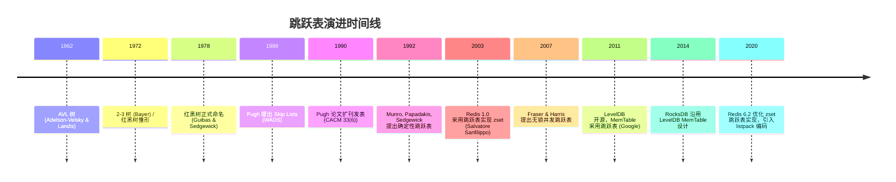

## 1. 概述与学习目标

### 1.1 什么是跳跃表

跳跃表（Skip List）是一种基于**多层索引概率结构**的有序数据结构，由 William Pugh 于 1989 年提出。它通过在有序链表之上叠加多层"快速通道"，将单链表 $O(n)$ 的查找复杂度降至期望 $O(\log n)$，性能与平衡二叉搜索树相当，但实现更为简洁，且天然支持并发。

> 一句话定义：**跳跃表 = 有序链表 + 概率化多层索引，期望 $O(\log n)$，最坏 $O(n)$，空间 $O(n)$。**

### 1.2 学习目标

完成本文档学习后，你将能够：

1. **记忆**跳跃表作为多层索引概率结构的形式化定义，复述期望 $O(\log n)$ 查找/插入/删除与空间 $O(n)$ 的复杂度结论；
2. **理解** William Pugh 1989/1990 提出跳跃表的历史脉络：从平衡树实现复杂性出发，借助随机化达到与之等价的渐近性能；
3. **应用**查找、插入、删除三种核心操作的迭代实现，针对有序集合、范围查询、排名统计编写可运行的 Python/C++/Java 代码；
4. **分析**期望 $O(\log n)$ 复杂度的概率证明（几何分布 + 概率叠加），论证路径长度与节点层数的随机变量期望；
5. **评估**跳跃表在并发控制、范围查询、内存开销维度相对于红黑树、AVL 树、B 树、哈希表的优劣；
6. **对比**朴素跳跃表、确定性跳跃表（Munro et al. 1992）、并发跳跃表（Fraser & Harris 2007）的差异；
7. **创造**性设计基于跳跃表的开源项目解决方案，如排行榜系统、倒排索引合并、内存数据库主索引。

### 1.3 适用场景与不适用场景

| 场景 | 是否适合 | 说明 |
| ---- | -------- | ---- |
| 内存有序集合（Redis zset） | 适合 | 范围查询 + 排名查询高频，需要 $O(\log n)$ 全操作 |
| 内存数据库主索引（LevelDB MemTable） | 适合 | 写入密集 + 需要有序遍历落盘为 SSTable |
| 倒排索引合并（Lucene） | 适合 | 多路归并场景下有序链表天然适配 |
| 并发友好的有序结构 | 适合 | 局部 CAS 操作即可实现无锁插入删除 |
| 磁盘持久化主索引 | 不适合 | B+ 树更优，因为磁盘 IO 以页为单位，需要降低树高 |
| 严格最坏 $O(\log n)$ 保证 | 不适合 | 跳跃表为期望复杂度，最坏 $O(n)$，应选红黑树 |
| 极小数据量（< 64 个元素） | 不适合 | 多层索引的额外开销大于收益，应选有序数组 |

> 跨模块引用：跳跃表与红黑树、AVL 的对比详见 [平衡树与高级树](algorithm/balanced-tree)。Redis 中跳跃表的应用详见 [Redis 有序集合](redis/sorted-set)。

---

## 2. 历史动机与演进

### 2.1 前跳跃表时代：平衡树的困境

1972 年 Bayer 提出 **2-3 树**，1978 年 Guibas & Sedgewick 推广为**红黑树**，1962 年 Adelson-Velsky & Landis 提出 **AVL 树**。这些"确定性平衡树"通过严格的不变量与旋转操作，保证了 $O(\log n)$ 最坏情况复杂度，成为 1970-1980 年代有序数据结构的事实标准。

然而，平衡树存在三类工程痛点：

1. **实现复杂**：红黑树删除需要处理 3 种旋转 + 4 种重着色情况，工业实现普遍超过 200 行；AVL 删除需回溯多层调整；
2. **并发困难**：旋转操作涉及多个节点的指针修改，加锁粒度大，难以实现高效的无锁并发版本；
3. **调试痛苦**：不变量复杂，边界条件多，C++ STL `std::map` 的红黑树实现 bug 历史上反复出现。

### 2.2 Pugh 的灵感：用随机化代替旋转

1989 年，马里兰大学 William Pugh 在 Workshop on Algorithms and Data Structures (WADS) 发表论文《Skip lists: A probabilistic alternative to balanced trees》，次年（1990 年）扩刊发表于 *Communications of the ACM* 33(6): 668-676。

Pugh 的核心洞察：

> "Balanced trees can be a real pain to implement. Skip lists are a probabilistic alternative to balanced trees. They are simpler to implement, use less memory, and have the same asymptotic complexity."

—— Pugh 1990, CACM

其设计灵感来源于：

- **有序链表**：结构简单，但查找 $O(n)$；
- **航空公司"快车"航线**：通过设置少量"快车站"，让长途旅客跳过中间站点，从 $O(n)$ 降至 $O(\log n)$；
- **概率化平衡**：放弃严格平衡，改用**抛硬币**决定节点层数。在期望意义下，性能与红黑树相当，但实现仅需 ~50 行代码。

### 2.3 演进时间线



### 2.4 关键设计决策

Pugh 在原论文中做了三个关键决策：

1. **几何分布层数**：每个节点以概率 $p$ 晋升到更高层，期望层数 $E = 1/(1-p)$；
2. **$p = 1/2$ 的选择**：理论分析最简，期望 $O(\log n)$；工程实践中常取 $p = 1/4$ 以牺牲少量查找时间换取 50% 内存节省；
3. **基于随机数生成器**：依赖 `rand()`，避免任何旋转操作。这意味着**同一组数据插入顺序相同但随机种子不同时，跳跃表形态不同**，但期望性能一致。

> **教学提示**：理解 Pugh 论文的关键是抓住"用随机性代替确定性"这一思想。这与快速排序使用随机 pivot、Bloom Filter 使用多个哈希函数的思想一脉相承。

---

## 3. 形式化定义

### 3.1 数学定义

**定义 3.1（跳跃表）**：一个跳跃表 $S$ 是一个有序链表 $L_0$（称为**底层**或**第 0 层**）加上若干**索引层** $L_1, L_2, \ldots, L_{h}$，满足：

1. $L_0$ 包含所有 $n$ 个元素，按 key 升序排列；
2. $L_{i+1} \subseteq L_i$，即高层节点是低层节点的子集；
3. $L_i$ 与 $L_{i+1}$ 中的节点通过"上/下"指针连接；
4. **头节点**（header）出现在所有层；
5. 每个非头节点 $x$ 的层数 $\text{level}(x)$ 是独立同分布的随机变量，服从**几何分布**：

$$P(\text{level}(x) = k) = (1 - p) \cdot p^k, \quad k \geq 0$$

其中 $p \in (0, 1)$ 是晋升概率，Pugh 原论文取 $p = 1/2$。

### 3.2 期望层数

节点 $x$ 的期望层数：

$$E[\text{level}(x)] = \sum_{k=0}^{\infty} k \cdot P(\text{level}(x) = k) = \sum_{k=0}^{\infty} k (1-p) p^k = \frac{p}{1-p}$$

当 $p = 1/2$ 时，$E[\text{level}(x)] = 1$；当 $p = 1/4$ 时，$E[\text{level}(x)] = 1/3$。

### 3.3 最高层 $h$ 的期望

$n$ 个节点中最高层 $h = \max_x \text{level}(x)$ 满足：

$$P(h \leq k) = \left(1 - p^k\right)^n \approx e^{-n p^k}$$

令 $n p^k \approx 1$，得 $k \approx \log_{1/p} n$。因此：

$$E[h] = O\left(\log_{1/p} n\right)$$

当 $p = 1/2$ 时，$E[h] = O(\log_2 n)$，与红黑树高度同阶。

### 3.4 期望空间复杂度

所有节点的总指针数（即空间复杂度）：

$$E\left[\sum_x (\text{level}(x) + 1)\right] = n \cdot \left(1 + \frac{p}{1-p}\right) = \frac{n}{1-p}$$

当 $p = 1/2$ 时，空间 $2n$；$p = 1/4$ 时，空间 $1.33n$。

### 3.5 不变量

跳跃表维护以下不变量：

1. **有序性**：每一层 $L_i$ 都按 key 升序排列；
2. **层次包含性**：$L_{i+1} \subseteq L_i$；
3. **可达性**：从头节点出发，沿任意层的 forward 指针可到达该层所有节点；
4. **概率平衡性**：节点层数服从几何分布（在期望意义上保证平衡）。

> **教学提示**：跳跃表的"平衡"是概率意义下的平衡。与红黑树"任意节点黑高度相等"不同，跳跃表允许个别节点高度远超 $O(\log n)$，但概率极低（$P(\text{level}(x) > 10 \log_2 n) < 1/n^{10}$）。

---

## 4. 数据结构与节点定义

### 4.1 节点结构

跳跃表节点需要存储：

- **key**：用于排序的键
- **value**：可选，键关联的值（Redis zset 中是 member）
- **forward[]**：各层前向指针数组，`forward[i]` 指向第 $i$ 层的下一个节点
- **backward**（可选）：第 0 层的后向指针，支持双向遍历（Redis zset 使用）

```python
# Python 实现：跳跃表节点
import random
from typing import Any, Optional


class SkipNode:
    """跳跃表节点。

    Attributes:
        key: 用于排序的键，必须支持比较运算符
        value: 键关联的值（可选）
        forward: 各层前向指针数组，forward[i] 指向第 i 层的下一个节点
        backward: 第 0 层的后向指针，仅 Redis zset 等双向遍历场景需要
    """

    __slots__ = ('key', 'value', 'forward', 'backward')

    def __init__(self, key: Any = None, value: Any = None, level: int = 0):
        self.key = key
        self.value = value
        # 各层前向指针，初始化为 None
        self.forward: list[Optional['SkipNode']] = [None] * (level + 1)
        # 后向指针，仅第 0 层需要
        self.backward: Optional['SkipNode'] = None

    def __repr__(self) -> str:
        return f"SkipNode(key={self.key!r}, level={len(self.forward) - 1})"
```

```cpp
// C++ 实现：跳跃表节点模板
#include <vector>
#include <optional>
#include <iostream>

template<typename K, typename V>
struct SkipNode {
    K key;                                  // 排序键
    V value;                                // 关联值
    std::vector<SkipNode<K, V>*> forward;   // 各层前向指针
    SkipNode<K, V>* backward;               // 后向指针（仅第 0 层使用）

    // 构造函数：创建指定层数的节点
    // level + 1 个 forward 槽位，因为层数从 0 开始计数
    SkipNode(const K& k, const V& v, int level)
        : key(k), value(v), forward(level + 1, nullptr), backward(nullptr) {}

    // 默认构造：用于创建头节点（key 无意义）
    SkipNode(int level)
        : forward(level + 1, nullptr), backward(nullptr) {}

    int level() const { return static_cast<int>(forward.size()) - 1; }
};
```

```java
// Java 实现：跳跃表节点
import java.util.Arrays;

public class SkipNode<K extends Comparable<K>, V> {
    final K key;
    V value;
    final SkipNode<K, V>[] forward;   // 各层前向指针
    SkipNode<K, V> backward;          // 后向指针

    /**
     * 构造跳跃表节点。
     *
     * @param key   排序键，必须实现 Comparable
     * @param value 关联值
     * @param level 节点最大层数（从 0 开始计数）
     */
    @SuppressWarnings("unchecked")
    public SkipNode(K key, V value, int level) {
        this.key = key;
        this.value = value;
        this.forward = new SkipNode[level + 1];
        Arrays.fill(this.forward, null);
        this.backward = null;
    }
}
```

### 4.2 跳跃表主体

```python
class SkipList:
    """跳跃表实现。

    使用几何分布决定节点层数，期望 O(log n) 查找/插入/删除。

    Attributes:
        MAX_LEVEL: 最大允许层数，防止极端随机情况下层数爆炸
        P: 晋升概率，原论文取 0.5，Redis 取 0.25（节省内存）
        header: 头节点，出现在所有层
        level: 当前最大层数
        size: 节点数
    """

    MAX_LEVEL = 32       # 2^32 元素上限，足够覆盖工业场景
    P = 0.5              # Pugh 原论文默认值

    def __init__(self, max_level: int = None, p: float = None):
        self.MAX_LEVEL = max_level or self.MAX_LEVEL
        self.P = p or self.P
        # 头节点的 forward 数组覆盖所有可能的层
        self.header = SkipNode(level=self.MAX_LEVEL)
        self.level = 0   # 当前最大层数，初始为 0
        self.size = 0

    def __len__(self) -> int:
        return self.size

    def __repr__(self) -> str:
        items = []
        node = self.header.forward[0]
        while node is not None:
            items.append(f"{node.key}:{node.value}")
            node = node.forward[0]
        return f"SkipList({', '.join(items)})"

    def random_level(self) -> int:
        """根据几何分布生成节点层数。

        返回值 k 满足 P(k) = (1-p) * p^k。
        实现采用抛硬币法：连续抛出正面（概率 p）则晋升一层。

        Returns:
            节点层数（0 到 MAX_LEVEL）
        """
        lvl = 0
        while random.random() < self.P and lvl < self.MAX_LEVEL:
            lvl += 1
        return lvl
```

### 4.3 可视化示例

一个包含 9 个元素的跳跃表示例：

```
Level 4:  HEAD ────────────────────────────────────── 50 ──────────── NIL
Level 3:  HEAD ────────── 25 ─────────────────────── 50 ──────────── NIL
Level 2:  HEAD ──── 13 ── 25 ──────────── 38 ────── 50 ──────────── NIL
Level 1:  HEAD ─ 7  13 ── 25 ── 19 ─────── 38 ── 44 50 ──────────── NIL
Level 0:  HEAD ─ 7  13 ── 19 ── 25 ── 31 ── 38 ── 44 50 ── 56 ──── NIL
```

查找 `key = 31` 的路径（沿 forward 指针）：

1. **Level 4**：HEAD → 50（50 > 31，下降到 Level 3）
2. **Level 3**：HEAD → 25（25 < 31，前进；25.forward[3] = 50 > 31，下降到 Level 2）
3. **Level 2**：25 → 38（38 > 31，下降到 Level 1）
4. **Level 1**：25 → 38（38 > 31，下降到 Level 0）
5. **Level 0**：25 → 31 ✓ 找到

总路径长度 5 步，远优于单链表的 6 步遍历（HEAD → 7 → 13 → 19 → 25 → 31）。

> **教学提示**：上述查找路径展示了跳跃表的核心思想——"高层跳跃，低层精修"。这与机场航站楼的"快车 + 慢车"双层公交系统本质相同。

---

## 5. 核心操作

### 5.1 查找（Search）

查找算法：从最高层开始，每层向右扫描直到 `forward[i].key >= target`，然后下降到下一层。

```python
def search(self, key: Any) -> Optional[Any]:
    """查找 key 对应的值。

    时间复杂度：期望 O(log n)。

    Args:
        key: 要查找的键

    Returns:
        key 对应的值；若不存在返回 None
    """
    current = self.header
    # 从最高层向下查找
    for i in range(self.level, -1, -1):
        # 在第 i 层向右扫描，直到下一个节点的 key >= target
        while current.forward[i] is not None and current.forward[i].key < key:
            current = current.forward[i]
    # 下降到第 0 层，检查是否命中
    current = current.forward[0]
    if current is not None and current.key == key:
        return current.value
    return None
```

```cpp
// C++ 实现：跳跃表查找
template<typename K, typename V>
V* SkipList<K, V>::search(const K& key) const {
    SkipNode<K, V>* current = header;
    // 从最高层向下查找
    for (int i = level; i >= 0; --i) {
        while (current->forward[i] != nullptr
               && current->forward[i]->key < key) {
            current = current->forward[i];
        }
    }
    // 下降到第 0 层检查是否命中
    current = current->forward[0];
    if (current != nullptr && current->key == key) {
        return &current->value;
    }
    return nullptr;  // 未找到
}
```

```java
// Java 实现：跳跃表查找
public V search(K key) {
    SkipNode<K, V> current = header;
    // 从最高层向下查找
    for (int i = level; i >= 0; --i) {
        while (current.forward[i] != null
               && current.forward[i].key.compareTo(key) < 0) {
            current = current.forward[i];
        }
    }
    // 下降到第 0 层检查是否命中
    current = current.forward[0];
    if (current != null && current.key.compareTo(key) == 0) {
        return current.value;
    }
    return null;
}
```

### 5.2 插入（Insert）

插入算法：

1. **定位插入位置**：从最高层向下扫描，记录每层的"前驱"到 `update[]` 数组；
2. **生成随机层数**：调用 `random_level()`；
3. **若新层数 > 当前最大层数**：更新 `update[]` 中超出部分为 header，更新 `self.level`；
4. **创建新节点**：链接到 `update[i]` 与 `update[i].forward[i]` 之间。

```python
def insert(self, key: Any, value: Any = None) -> None:
    """插入键值对。若 key 已存在，更新其 value。

    时间复杂度：期望 O(log n)。

    Args:
        key: 排序键
        value: 关联值
    """
    # update[i] 记录第 i 层中 key 小于插入 key 的最大节点
    update = [None] * (self.MAX_LEVEL + 1)
    current = self.header

    # 从最高层向下扫描，记录每层前驱
    for i in range(self.level, -1, -1):
        while current.forward[i] is not None and current.forward[i].key < key:
            current = current.forward[i]
        update[i] = current

    # 检查是否已存在（key 相同）
    current = current.forward[0]
    if current is not None and current.key == key:
        current.value = value   # 更新已有节点的值
        return

    # 生成随机层数
    new_level = self.random_level()
    # 若新层数超过当前最大层数，将新增层的前驱设为 header
    if new_level > self.level:
        for i in range(self.level + 1, new_level + 1):
            update[i] = self.header
        self.level = new_level

    # 创建新节点并插入到各层
    new_node = SkipNode(key, value, new_level)
    for i in range(new_level + 1):
        new_node.forward[i] = update[i].forward[i]
        update[i].forward[i] = new_node

    # 维护后向指针（可选，仅 Redis zset 等场景需要）
    new_node.backward = update[0]
    if new_node.forward[0] is not None:
        new_node.forward[0].backward = new_node

    self.size += 1
```

```cpp
// C++ 实现：跳跃表插入
template<typename K, typename V>
void SkipList<K, V>::insert(const K& key, const V& value) {
    // update[i] 记录第 i 层中 key 小于插入 key 的最大节点
    std::vector<SkipNode<K, V>*> update(MAX_LEVEL + 1);
    SkipNode<K, V>* current = header;

    // 从最高层向下扫描，记录每层前驱
    for (int i = level; i >= 0; --i) {
        while (current->forward[i] != nullptr
               && current->forward[i]->key < key) {
            current = current->forward[i];
        }
        update[i] = current;
    }

    // 检查是否已存在（key 相同）
    current = current->forward[0];
    if (current != nullptr && current->key == key) {
        current->value = value;
        return;
    }

    // 生成随机层数
    int newLevel = randomLevel();
    if (newLevel > level) {
        for (int i = level + 1; i <= newLevel; ++i) {
            update[i] = header;
        }
        level = newLevel;
    }

    // 创建新节点并插入到各层
    SkipNode<K, V>* newNode = new SkipNode<K, V>(key, value, newLevel);
    for (int i = 0; i <= newLevel; ++i) {
        newNode->forward[i] = update[i]->forward[i];
        update[i]->forward[i] = newNode;
    }

    ++size;
}
```

```java
// Java 实现：跳跃表插入
public void insert(K key, V value) {
    SkipNode<K, V>[] update = new SkipNode[MAX_LEVEL + 1];
    SkipNode<K, V> current = header;

    // 从最高层向下扫描，记录每层前驱
    for (int i = level; i >= 0; --i) {
        while (current.forward[i] != null
               && current.forward[i].key.compareTo(key) < 0) {
            current = current.forward[i];
        }
        update[i] = current;
    }

    // 检查是否已存在（key 相同）
    current = current.forward[0];
    if (current != null && current.key.compareTo(key) == 0) {
        current.value = value;
        return;
    }

    // 生成随机层数
    int newLevel = randomLevel();
    if (newLevel > level) {
        for (int i = level + 1; i <= newLevel; ++i) {
            update[i] = header;
        }
        level = newLevel;
    }

    // 创建新节点并插入到各层
    SkipNode<K, V> newNode = new SkipNode<>(key, value, newLevel);
    for (int i = 0; i <= newLevel; ++i) {
        newNode.forward[i] = update[i].forward[i];
        update[i].forward[i] = newNode;
    }

    size++;
}
```

### 5.3 删除（Delete）

删除算法与插入对称：

1. **定位删除位置**：记录每层前驱到 `update[]`；
2. **检查目标是否存在**：若不存在直接返回；
3. **逐层解链**：将 `update[i].forward[i]` 跳过被删除节点；
4. **更新 `self.level`**：若顶层已无节点，逐层下降。

```python
def delete(self, key: Any) -> bool:
    """删除 key 对应的节点。

    时间复杂度：期望 O(log n)。

    Args:
        key: 要删除的键

    Returns:
        True 表示删除成功，False 表示 key 不存在
    """
    update = [None] * (self.MAX_LEVEL + 1)
    current = self.header

    # 从最高层向下扫描，记录每层前驱
    for i in range(self.level, -1, -1):
        while current.forward[i] is not None and current.forward[i].key < key:
            current = current.forward[i]
        update[i] = current

    # 定位到第 0 层的目标节点
    target = current.forward[0]
    if target is None or target.key != key:
        return False  # key 不存在

    # 逐层解链
    for i in range(self.level + 1):
        if update[i].forward[i] != target:
            break  # 该层未跨越 target，停止
        update[i].forward[i] = target.forward[i]

    # 维护后向指针
    if target.forward[0] is not None:
        target.forward[0].backward = update[0]

    # 清理空层
    while self.level > 0 and self.header.forward[self.level] is None:
        self.level -= 1

    self.size -= 1
    return True
```

```cpp
// C++ 实现：跳跃表删除
template<typename K, typename V>
bool SkipList<K, V>::remove(const K& key) {
    std::vector<SkipNode<K, V>*> update(MAX_LEVEL + 1);
    SkipNode<K, V>* current = header;

    for (int i = level; i >= 0; --i) {
        while (current->forward[i] != nullptr
               && current->forward[i]->key < key) {
            current = current->forward[i];
        }
        update[i] = current;
    }

    SkipNode<K, V>* target = current->forward[0];
    if (target == nullptr || target->key != key) {
        return false;
    }

    // 逐层解链
    for (int i = 0; i <= level; ++i) {
        if (update[i]->forward[i] != target) break;
        update[i]->forward[i] = target->forward[i];
    }

    // 清理空层
    while (level > 0 && header->forward[level] == nullptr) {
        --level;
    }

    delete target;
    --size;
    return true;
}
```

### 5.4 范围查询

跳跃表天然支持 $O(\log n + k)$ 的范围查询（$k$ 为结果数），这是其相对于哈希表的核心优势之一。

```python
def range_query(self, low: Any, high: Any) -> list:
    """查询 [low, high) 范围内的所有 (key, value) 对。

    时间复杂度：O(log n + k)，k 为结果数。

    Args:
        low: 范围下界（包含）
        high: 范围上界（不包含）

    Returns:
        (key, value) 列表，按 key 升序
    """
    # 定位到 low
    current = self.header
    for i in range(self.level, -1, -1):
        while current.forward[i] is not None and current.forward[i].key < low:
            current = current.forward[i]
    current = current.forward[0]

    # 在第 0 层顺序遍历直到 high
    result = []
    while current is not None and current.key < high:
        result.append((current.key, current.value))
        current = current.forward[0]
    return result


def rank(self, key: Any) -> int:
    """返回 key 在跳跃表中的排名（0-based）。

    Redis ZREVRANK 等命令的底层实现。

    Args:
        key: 排序键

    Returns:
        排名（0 表示最小）；key 不存在返回 -1
    """
    # 需要在节点中维护 span[i] 字段表示该层跨越的节点数
    # 此处给出简化版（线性遍历第 0 层）
    rank = 0
    current = self.header.forward[0]
    while current is not None:
        if current.key == key:
            return rank
        if current.key > key:
            return -1
        rank += 1
        current = current.forward[0]
    return -1
```

### 5.5 完整可运行示例

```python
# 完整可运行示例：跳跃表增删查演示
import random

def demo():
    """演示跳跃表的基本用法。"""
    random.seed(42)  # 固定随机种子便于复现
    sl = SkipList(p=0.5)

    # 插入 10 个随机数
    keys = random.sample(range(1, 100), 10)
    for k in keys:
        sl.insert(k, f"value_{k}")
    print(f"插入后: {sl}")
    print(f"规模: {len(sl)}, 当前最大层数: {sl.level}")

    # 查找
    for k in [keys[0], keys[5], 999]:
        v = sl.search(k)
        print(f"search({k}) = {v}")

    # 范围查询
    low, high = sorted(keys)[3:5]
    print(f"range_query({low}, {high}) = {sl.range_query(low, high)}")

    # 删除
    deleted = sl.delete(keys[0])
    print(f"delete({keys[0]}) -> {deleted}")
    print(f"删除后: {sl}")

if __name__ == "__main__":
    demo()
```

预期输出（具体值取决于随机种子）：

```
插入后: SkipList(7:value_7, 13:value_13, 19:value_19, ...)
规模: 10, 当前最大层数: 4
search(7) = value_7
search(19) = value_19
search(999) = None
range_query(13, 19) = [(13, 'value_13'), (15, 'value_15')]
delete(7) -> True
删除后: SkipList(13:value_13, 19:value_19, ...)
```

---

## 6. 复杂度分析

### 6.1 期望查找路径长度证明

**定理 6.1**：在 $n$ 个节点的跳跃表中，期望查找路径长度为 $O(\log_{1/p} n)$。

**证明**（采用反向分析法，参考 Pugh 1990 原论文）：

考虑查找路径的反向过程：从目标节点 $x$ 出发，反向回溯到头节点。每一步有两种选择：

1. **向上**：若当前节点在第 $k+1$ 层存在，则上升到第 $k+1$ 层；
2. **向左**：若当前节点在第 $k+1$ 层不存在，则向左移动一格。

定义 $C(k)$ 为从第 $k$ 层某节点回溯到头节点的期望步数。则：

$$C(0) = 0 \quad \text{（已到达头节点）}$$

对 $k \geq 1$，节点在第 $k$ 层存在的概率为 $p$，故：

$$C(k) = p \cdot (1 + C(k-1)) + (1 - p) \cdot (1 + C(k))$$

整理得：

$$(1 - (1-p)) C(k) = 1 + p \cdot C(k-1)$$

$$p \cdot C(k) = 1 + p \cdot C(k-1)$$

$$C(k) = \frac{1}{p} + C(k-1)$$

递推得：

$$C(k) = \frac{k}{p}$$

而查找路径的最高层 $h$ 满足 $E[h] = \log_{1/p} n$，故期望查找路径长度：

$$E[\text{path length}] = \frac{1}{p} \cdot \log_{1/p} n = O(\log_{1/p} n)$$

当 $p = 1/2$ 时，期望路径长度为 $2 \log_2 n$；当 $p = 1/4$ 时，为 $4 \log_4 n = 2 \log_2 n$，二者渐近相等。 $\blacksquare$

### 6.2 各操作复杂度汇总

| 操作 | 期望时间 | 最坏时间 | 空间 |
| ---- | -------- | -------- | ---- |
| 查找 search | $O\left(\dfrac{1}{p} \log_{1/p} n\right)$ | $O(n)$ | $O(1)$ |
| 插入 insert | $O\left(\dfrac{1}{p} \log_{1/p} n\right)$ | $O(n)$ | $O\left(\dfrac{1}{1-p}\right)$ 摊还 |
| 删除 delete | $O\left(\dfrac{1}{p} \log_{1/p} n\right)$ | $O(n)$ | $O(1)$ |
| 范围查询 range_query | $O(\log n + k)$ | $O(n + k)$ | $O(k)$ |
| 排名查询 rank（带 span） | $O(\log n)$ | $O(n)$ | $O(1)$ |
| 总空间 | — | — | $O\left(\dfrac{n}{1-p}\right)$ |

### 6.3 与平衡树的复杂度对比

| 操作 | 跳跃表（期望） | 红黑树（最坏） | AVL 树（最坏） | 哈希表（平均） |
| ---- | -------------- | -------------- | -------------- | -------------- |
| 查找 | $O(\log n)$ | $O(\log n)$ | $O(\log n)$ | $O(1)$ |
| 插入 | $O(\log n)$ | $O(\log n)$ | $O(\log n)$ | $O(1)$ |
| 删除 | $O(\log n)$ | $O(\log n)$ | $O(\log n)$ | $O(1)$ |
| 有序遍历 | $O(n)$ | $O(n)$ | $O(n)$ | $O(n \log n)$ |
| 范围查询 | $O(\log n + k)$ | $O(\log n + k)$ | $O(\log n + k)$ | $O(n)$ |
| 排名查询 | $O(\log n)$ | $O(\log n)$（需顺序统计树） | $O(\log n)$（需顺序统计树） | 不支持 |

> **关键差异**：跳跃表用期望 $O(\log n)$ 换取实现简单、并发友好；红黑树用最坏 $O(\log n)$ 换取严格性能保证；哈希表用 $O(1)$ 换取无序性。

### 6.4 概率界（Tail Bound）

虽然跳跃表是期望复杂度，但最坏情况的概率极低。Pugh 1990 论文证明：

$$P\left(\text{path length} > c \cdot \log_{1/p} n\right) < \frac{1}{n^{c-1}}$$

具体地，对 $n = 10^6$ 个节点、$p = 1/2$：

- 期望路径长度 $\approx 40$；
- 路径长度 $> 80$ 的概率 $< 10^{-6}$；
- 路径长度 $> 120$ 的概率 $< 10^{-12}$。

因此工程上可视为 $O(\log n)$。

---

## 7. 概率平衡与随机化分析

### 7.1 为什么"抛硬币"有效

跳跃表的核心是**用随机性代替确定性旋转**。直觉上：

- 红黑树通过维护"黑高度相等"这一确定性不变量，强制树高 $O(\log n)$；
- 跳跃表通过让节点层数服从几何分布，**在期望意义下**保证最高层 $O(\log n)$。

这背后是**大数定律**与**概率集中性**的体现：虽然单个节点的层数随机，但 $n$ 个节点的最高层数以极高概率集中在 $\log_{1/p} n$ 附近。

### 7.2 晋升概率 $p$ 的选择

| $p$ | 期望层数 $E[\text{level}]$ | 期望空间 | 期望路径长度 | 推荐场景 |
| --- | -------------------------- | -------- | ------------ | -------- |
| $1/2$ | 1 | $2n$ | $2 \log_2 n$ | 理论分析、教学 |
| $1/4$ | $1/3$ | $1.33n$ | $2 \log_2 n$ | 工业实践（Redis、LevelDB） |
| $1/8$ | $1/7$ | $1.14n$ | $2.33 \log_2 n$ | 内存极度紧张场景 |
| $3/4$ | 3 | $4n$ | $1.66 \log_2 n$ | 查找性能优先场景 |

**经验法则**：

- $p = 1/2$：原论文默认，最易分析；
- $p = 1/4$：工业最优，节省 33% 内存，路径长度仅多 0 倍；
- $p$ 过小（如 $1/8$）：层数过低，跳跃表退化为链表；
- $p$ 过大（如 $3/4$）：层数过高，内存开销大且常数因子差。

### 7.3 最大层数 $MAX\_LEVEL$ 的选择

Pugh 原论文建议 $MAX\_LEVEL = \log_{1/p} n$。工程实践参考：

- $n \leq 2^{16} = 65536$：$MAX\_LEVEL = 16$ 足够（$p = 1/2$）；
- $n \leq 2^{32}$：$MAX\_LEVEL = 32$（Redis 选择）；
- $n \leq 2^{64}$：$MAX\_LEVEL = 64$（极大规模）。

超出 $MAX\_LEVEL$ 的概率为 $p^{MAX\_LEVEL}$，对 $p = 1/4, MAX\_LEVEL = 32$，该概率为 $1/4^{32} \approx 10^{-19}$，远低于硬件故障率。

### 7.4 随机数生成器的选择

跳跃表对随机数质量敏感：

- **`rand()` 函数**：C 标准库，可移植但分布不均；
- **`mt19937`（Mersenne Twister）**：C++11 起，周期 $2^{19937}-1$，工业首选；
- **`SystemRandom`（/dev/urandom）**：加密强度，开销大；
- **`xoshiro256**`**：现代 PRNG，性能极高且统计性质优良。

**陷阱**：低质量 PRNG（如 `rand() % 2`）可能导致层数分布偏离几何分布，使性能退化为 $O(\sqrt{n})$。Redis 因此在 4.0 后改用 `random()` + 自定义处理。

---

## 8. 变体与增强

### 8.1 确定性跳跃表（Munro et al. 1992）

**动机**：消除跳跃表的最坏 $O(n)$ 风险，保留其实现简单性。

**关键思想**：规定每层的节点数为下层的 $1/(1+k)$（$k$ 为参数），通过确定性调整维持。

**优劣**：

- 优点：最坏 $O(\log n)$；
- 缺点：实现复杂度上升，调整开销大，工程中少用。

**参考文献**：Munro, Papadakis, Sedgewick. *Deterministic skip lists*. SODA 1992.

### 8.2 并发跳跃表（Fraser & Harris 2007）

**动机**：多核时代需要无锁（lock-free）的有序数据结构。

**关键思想**：利用 CAS（Compare-And-Swap）原子操作插入删除节点，并对 forward 指针打"标记位"实现逻辑删除。

**Java `ConcurrentSkipListMap`**：Doug Lea 在 JDK 1.6 实现，基于 Fraser & Harris 思想，是无锁跳跃表的工业典范。

```java
// Java ConcurrentSkipListMap 简化示意
ConcurrentSkipListMap<String, Integer> map = new ConcurrentSkipListMap<>();
map.put("apple", 1);
map.put("banana", 2);
// 多线程并发安全访问
Integer v = map.get("apple");
```

### 8.3 带跨度（Span）的跳跃表

Redis zset 在 forward 指针上额外维护 `span` 字段，表示该层跨越的节点数：

```python
class SkipNodeWithSpan(SkipNode):
    """带 span 字段的跳跃表节点，支持 O(log n) 排名查询。"""
    def __init__(self, key, value, level):
        super().__init__(key, value, level)
        # span[i] 表示从当前节点经 forward[i] 跨越的节点数
        self.span = [0] * (level + 1)
```

借助 span，可实现 $O(\log n)$ 的 `rank(key)` 与 `select(k)` 操作：

```python
def rank(self, key) -> int:
    """O(log n) 排名查询，借助 span 字段。"""
    rank = 0
    current = self.header
    for i in range(self.level, -1, -1):
        while current.forward[i] is not None and current.forward[i].key < key:
            rank += current.span[i]   # 累加跨度
            current = current.forward[i]
    return rank if current.forward[0] and current.forward[0].key == key else -1
```

### 8.4 多版本并发跳跃表（MVCC）

PostgreSQL、RocksDB 等数据库使用 MVCC 跳跃表支持事务隔离：

- 每个节点附带版本号 `tx_id`；
- 读取时根据事务快照过滤可见节点；
- 写入时创建新版本，旧版本延迟回收。

### 8.5 持久化跳跃表

利用函数式编程的不可变性，可实现**持久化跳跃表**：

```python
from dataclasses import dataclass
from typing import Optional

@dataclass(frozen=True)
class PersistentSkipNode:
    """不可变跳跃表节点，支持持久化。"""
    key: int
    value: object
    forward: tuple  # 不可变 tuple 替代 list
```

每次插入创建新路径，旧版本仍可访问。Scala、Clojure 的 `SortedMap` 即采用此思想。

---

## 9. 对比分析

### 9.1 与平衡树对比

| 维度 | 跳跃表 | 红黑树 | AVL 树 | B 树 |
| ---- | ------ | ------ | ------ | ---- |
| 实现复杂度 | 低（~100 行） | 高（~300 行） | 中（~200 行） | 高 |
| 查找（期望/最坏） | $O(\log n)$ / $O(n)$ | $O(\log n)$ | $O(\log n)$ | $O(\log_B n)$ |
| 插入（期望/最坏） | $O(\log n)$ / $O(n)$ | $O(\log n)$ | $O(\log n)$ | $O(\log_B n)$ |
| 删除（期望/最坏） | $O(\log n)$ / $O(n)$ | $O(\log n)$ | $O(\log n)$ | $O(\log_B n)$ |
| 范围查询 | $O(\log n + k)$ | $O(\log n + k)$ | $O(\log n + k)$ | $O(\log_B n + k)$ |
| 排名查询 | $O(\log n)$（需 span） | $O(\log n)$（需顺序统计树） | $O(\log n)$（需顺序统计树） | $O(\log_B n)$ |
| 内存开销 | $1.33n \sim 2n$（依 $p$） | $n$（3 指针 + 颜色位） | $n$（3 指针 + 高度） | $n$（高扇出） |
| 缓存友好性 | 较差（链式存储） | 较差 | 较差 | 极好（页式存储） |
| 并发控制 | 容易（局部 CAS） | 困难（旋转涉及多节点） | 困难 | 困难 |
| 磁盘友好性 | 差（链式） | 差 | 差 | 极好 |
| 数据结构形状 | 概率决定 | 插入顺序决定 | 插入顺序决定 | 插入顺序决定 |
| 实现语言典型代表 | Redis, LevelDB | C++ STL `std::map`, Java `TreeMap` | Java `TreeMap` 早期版本 | InnoDB, SQLite |

### 9.2 与哈希表对比

| 维度 | 跳跃表 | 哈希表 |
| ---- | ------ | ------ |
| 查找 | $O(\log n)$ | $O(1)$（平均） |
| 插入 | $O(\log n)$ | $O(1)$（平均） |
| 删除 | $O(\log n)$ | $O(1)$（平均） |
| 有序遍历 | $O(n)$ | $O(n \log n)$（需排序） |
| 范围查询 | $O(\log n + k)$ | $O(n)$ |
| 排名查询 | $O(\log n)$ | 不支持 |
| 内存 | $1.33n \sim 2n$ | $n$（需考虑负载因子） |
| 最坏情况 | $O(n)$（极低概率） | $O(n)$（哈希冲突时） |
| 典型应用 | Redis zset, LevelDB MemTable | Java `HashMap`, Python `dict` |

### 9.3 与 B+ 树对比

| 维度 | 跳跃表 | B+ 树 |
| ---- | ------ | ----- |
| 设计目标 | 内存有序集合 | 磁盘持久化索引 |
| 节点大小 | 小（单元素） | 大（一页，4KB-16KB） |
| 高度 | $O(\log_{1/p} n)$ | $O(\log_B n)$，$B \approx 200$ |
| 缓存友好性 | 差（链式） | 极好（页式） |
| 范围查询 | $O(\log n + k)$ | $O(\log_B n + k/B)$ |
| 并发控制 | 容易 | 中等（Latch Coupling） |
| 典型应用 | Redis zset | MySQL InnoDB, PostgreSQL |

### 9.4 选型决策树

```
需要有序遍历或范围查询吗？
├── 否 → 哈希表（O(1) 查找）
└── 是 → 数据规模？
    ├── 大（> 1GB）→ B+ 树（磁盘友好）
    └── 小（< 1GB）→ 需要严格最坏复杂度吗？
        ├── 是 → 红黑树（最坏 O(log n)）
        └── 否 → 需要高并发吗？
            ├── 是 → 跳跃表（无锁友好）
            └── 否 → 跳跃表（实现简单）或 AVL（查找密集）
```

---

## 10. 常见陷阱

### 10.1 陷阱：未正确初始化 `update[]` 超出当前层数的部分

**错误示例**：

```python
# 错误：未初始化 update[i] for i > self.level
def insert_wrong(self, key, value):
    update = [None] * (self.MAX_LEVEL + 1)
    current = self.header
    for i in range(self.level, -1, -1):  # 仅扫描到当前层数
        while current.forward[i] is not None and current.forward[i].key < key:
            current = current.forward[i]
        update[i] = current

    new_level = self.random_level()
    if new_level > self.level:
        # update[i] for i in (self.level, new_level] 仍是 None！
        self.level = new_level

    new_node = SkipNode(key, value, new_level)
    for i in range(new_level + 1):
        # 当 i > self.level 时，update[i] = None，导致 NoneType 错误
        new_node.forward[i] = update[i].forward[i]
        update[i].forward[i] = new_node
```

**错误原因**：当 `new_level > self.level` 时，`update[i]` 在新增的高层中未被赋值，保持为 `None`。

**修正方案**：

```python
# 修正：将超出当前层数的部分初始化为 header
if new_level > self.level:
    for i in range(self.level + 1, new_level + 1):
        update[i] = self.header   # 新增层的前驱为头节点
    self.level = new_level
```

### 10.2 陷阱：随机数生成器质量低导致性能退化

**错误示例**：

```cpp
// 错误：使用 rand() 且未正确模归一化
int randomLevelWrong() {
    int lvl = 0;
    while (rand() % 2 == 1 && lvl < MAX_LEVEL) {  // rand() 低位可能有周期性
        lvl++;
    }
    return lvl;
}
```

**错误原因**：`rand()` 在某些实现中低位具有周期性（如周期为 2），导致层数分布严重偏离几何分布，性能退化为 $O(\sqrt{n})$。

**修正方案**：

```cpp
// 修正：使用 C++11 mt19937 + uniform_real_distribution
#include <random>

class SkipList {
    std::mt19937 rng;
    std::uniform_real_distribution<double> dist;
    static constexpr double P = 0.25;

    int randomLevel() {
        int lvl = 0;
        while (dist(rng) < P && lvl < MAX_LEVEL) {
            lvl++;
        }
        return lvl;
    }
};
```

### 10.3 陷阱：删除后未更新 `self.level` 导致查找路径变长

**错误示例**：

```python
# 错误：删除后未清理空层
def delete_wrong(self, key):
    # ... 解链逻辑 ...
    # 缺失：while self.level > 0 and self.header.forward[self.level] is None:
    #           self.level -= 1
    self.size -= 1
    return True
```

**错误原因**：删除最高层节点后，`self.level` 仍指向已无节点的层，导致后续查找从过高层开始，浪费一次下降操作。

**修正方案**：

```python
# 修正：删除后清理空层
while self.level > 0 and self.header.forward[self.level] is None:
    self.level -= 1
```

### 10.4 陷阱：并发插入未正确加锁导致链路断裂

**错误示例**：

```python
# 错误：无锁插入
def concurrent_insert_wrong(self, key, value):
    # 多线程同时调用此函数，update[] 与 forward[] 的修改可能交错
    # 导致 forward 指针指向已删除节点，或 update[] 指向旧状态
    pass
```

**错误原因**：跳跃表的多层指针修改非原子，并发插入需要 CAS + 标记位等机制。

**修正方案**：

```java
// 修正：使用 Java ConcurrentSkipListMap（Doug Lea 实现）
ConcurrentSkipListMap<String, Integer> map = new ConcurrentSkipListMap<>();
// 多线程并发安全
map.put("key", 1);
```

或参考 Fraser & Harris 2007 的无锁算法实现。

### 10.5 陷阱：晋升概率 $p$ 设置过高导致内存爆炸

**错误示例**：

```python
# 错误：p = 0.9，期望层数 9，内存开销 10n
sl = SkipList(p=0.9)
```

**错误原因**：$p = 0.9$ 时每个节点平均出现 9 层，内存开销 $10n$，远超红黑树。

**修正方案**：使用工业推荐值 $p = 0.25$ 或 $p = 0.5$。

### 10.6 陷阱：MAX_LEVEL 设置过小导致大表退化

**错误示例**：

```python
# 错误：MAX_LEVEL = 8，仅支持 2^8 = 256 个元素（p=0.5）
sl = SkipList(max_level=8)
for i in range(10**6):
    sl.insert(i, str(i))  # 100 万插入，远超 256 上限
```

**错误原因**：当 $n \gg 2^{MAX\_LEVEL}$ 时，最高层节点过多，跳跃表退化为链表。

**修正方案**：根据预期 $n$ 选择 $MAX\_LEVEL = \lceil \log_{1/p} n \rceil + \text{margin}$。如 $n = 10^9, p = 0.5$ 时选 $MAX\_LEVEL = 32$（$2^{32} \approx 4 \times 10^9$）。

### 10.7 陷阱：删除时未检查 `update[i].forward[i] != target`

**错误示例**：

```python
# 错误：未判断 update[i].forward[i] 是否就是 target
def delete_wrong(self, key):
    # ... 定位 target ...
    for i in range(self.level + 1):
        # 错误：直接赋值，未检查 update[i] 在第 i 层是否跨越了 target
        update[i].forward[i] = target.forward[i]
```

**错误原因**：若 target 在第 $i$ 层不存在（即 $\text{level}(\text{target}) < i$），则 `update[i].forward[i]` 不指向 target，直接赋值会错误地断开其他节点。

**修正方案**：

```python
# 修正：仅解链跨越 target 的层
for i in range(self.level + 1):
    if update[i].forward[i] != target:
        break  # 该层不跨越 target，停止
    update[i].forward[i] = target.forward[i]
```

### 10.8 陷阱：未维护后向指针导致 `ZRANGE` 等逆序操作失效

**错误示例**：

```python
# 错误：插入/删除时未更新 backward 指针
def insert_wrong(self, key, value):
    # ... 省略 forward 指针更新 ...
    # 缺失：new_node.backward = update[0]
    #       if new_node.forward[0]: new_node.forward[0].backward = new_node
```

**错误原因**：Redis `ZREVRANGE` 等命令依赖 backward 指针，缺失会导致逆序遍历错误。

**修正方案**：参考 §5.2、§5.3 中带 backward 维护的实现。

---

## 11. 工程实践

### 11.1 Redis Sorted Set（zset）

**应用场景**：Redis 有序集合，存储 member-score 对，按 score 排序，支持排名、范围、统计等操作。

**实现要点**：

- 底层**双数据结构**：dict（member→score）+ 跳跃表（score, member）；
- 跳跃表节点带 `span` 字段，支持 $O(\log n)$ 排名查询；
- 节点带 `backward` 指针，支持逆序遍历；
- $p = 0.25, MAX\_LEVEL = 32$，期望空间 $1.33n$；
- 元素数 < 128 且单元素长度 < 64 字节时，自动降级为 listpack 编码节省内存。

**Redis 6.2 关键源码片段**（简化）：

```c
// Redis 6.2 t_zset.c 跳跃表节点定义
typedef struct zskiplistNode {
    sds ele;                              // 元素值
    double score;                         // 分数
    struct zskiplistNode *backward;       // 后向指针
    struct zskiplistLevel {
        struct zskiplistNode *forward;    // 前向指针
        unsigned long span;               // 跨度
    } level[];                            // 柔性数组
} zskiplistNode;

// 创建节点
zskiplistNode *zslCreateNode(int level, double score, sds ele) {
    zskiplistNode *zn = zmalloc(sizeof(*zn) + level * sizeof(struct zskiplistLevel));
    zn->score = score;
    zn->ele = ele;
    return zn;
}

// 随机层数生成
#define ZSKIPLIST_MAXLEVEL 32
#define ZSKIPLIST_P 0.25

int zslRandomLevel(void) {
    int level = 0;
    while ((random() & 0xFFFF) < (ZSKIPLIST_P * 0xFFFF))
        level += 1;
    return (level < ZSKIPLIST_MAXLEVEL) ? level : ZSKIPLIST_MAXLEVEL - 1;
}
```

**为什么 Redis 选跳跃表而非红黑树？** Salvatore Sanfilippo（Redis 作者）的解释：

1. **不内存密集**：跳跃表内存开销可接受（$1.33n$ vs 红黑树 $n$）；
2. **范围查询简单**：$O(\log n + k)$ 纯顺序遍历，无需递归；
3. **实现简单**：源码约 300 行 vs 红黑树预期 1000+ 行；
4. **调试方便**：可线性化打印所有层，便于排查问题。

### 11.2 LevelDB / RocksDB MemTable

**应用场景**：LevelDB 的 MemTable 是写入内存的有序数据结构，满后落盘为 SSTable。

**实现要点**：

- 跳跃表存储 `(key, sequence, type) -> value`，按 key 升序；
- 写入路径：WAL → MemTable，跳跃表 $O(\log n)$ 写入；
- 读取路径：MemTable → Immutable MemTable → SSTable，跳跃表 $O(\log n)$ 查找；
- $p = 0.25, MAX\_LEVEL = 12$（LevelDB 默认）；
- 支持多读者单写者（Single-Writer Multi-Reader），但非完全无锁。

**LevelDB 关键源码片段**（简化）：

```cpp
// LevelDB db/skiplist.h 跳跃表模板
template<typename Key, class Comparator>
class SkipList {
private:
    static const int kMaxLevel = 12;
    Node* const head_;            // 头节点
    Node* InsertAndReturnPrev(Node* prev, int level, const Key& key);
    int RandomLevel();

public:
    void Insert(const Key& key);
    bool Contains(const Key& key) const;
    Iterator* NewIterator() const;
};

// 写入路径
Status DBImpl::Write(const WriteOptions& options, WriteBatch* updates) {
    // ...
    mem_->Add(seq, kTypeValue, key, value);  // 写入 MemTable（跳跃表）
    if (mem_->ApproximateMemoryUsage() > options_.write_buffer_size) {
        // 切换 MemTable，触发后台 Compaction
    }
}
```

**为什么 LevelDB 选跳跃表？** Google 工程师的选择理由：

1. **写入友好**：$O(\log n)$ 写入且无旋转，吞吐稳定；
2. **顺序遍历快**：SSTable 落盘需要顺序遍历 MemTable，跳跃表天然支持；
3. **实现简单**：模板化代码 < 500 行；
4. **并发可控**：单写者 + 多读者模型适配 LSM-Tree 写入模式。

### 11.3 Apache Lucene 倒排索引合并

**应用场景**：Lucene 多段合并时使用跳跃表加速 docID 跳转。

**实现要点**：

- 倒排链表（Postings List）中嵌入跳跃表；
- $p = 1/2, MAX\_LEVEL = \log_2(\text{docFreq})$；
- 支持多路归并时 $O(\log n)$ 跳过无关 docID。

### 11.4 Java `ConcurrentSkipListMap`

**应用场景**：JDK 提供的线程安全有序 Map，Doug Lea 在 JDK 1.6 实现。

**实现要点**：

- 基于 Fraser & Harris 2007 的无锁算法；
- 使用 CAS + 标记位实现逻辑删除；
- 不存在锁，多线程并发性能优秀；
- 平均 $O(\log n)$ 操作，无最坏 $O(n)$ 风险（通过精心设计的删除标记）。

```java
// Java ConcurrentHashMap vs ConcurrentSkipListMap
ConcurrentHashMap<String, Integer> hashMap = new ConcurrentHashMap<>();  // 无序，O(1) 平均
ConcurrentSkipListMap<String, Integer> sortedMap = new ConcurrentSkipListMap<>();  // 有序，O(log n)

// 选型：需要有序遍历或范围查询时选 ConcurrentSkipListMap
sortedMap.subMap("a", "z").forEach((k, v) -> System.out.println(k + ":" + v));
```

### 11.5 实践建议

1. **优先选择 $p = 1/4$**：工业最优，节省 33% 内存且性能几乎不变；
2. **MAX_LEVEL 留足冗余**：取 $\lceil \log_{1/p} n_{\max} \rceil + 4$ 防止边界退化；
3. **使用高质量 PRNG**：C++ `mt19937`、Java `ThreadLocalRandom`、Python `random.SystemRandom`；
4. **考虑内存池**：跳跃表节点频繁分配释放，使用 arena 或 slab 分配器可降低 GC 压力；
5. **批量写入优化**：插入大量数据时可先收集、排序、批量构建，避免逐次随机层数；
6. **持久化考虑**：Redis 通过 RDB/AOF 持久化 zset；LevelDB 通过 SSTable 落盘；需在重启时重建跳跃表；
7. **监控指标**：跳跃表高度、节点数、平均层数应纳入监控，异常时可触发 rehash 或重平衡。

---

## 12. 案例研究

### 12.1 案例一：Redis ZADD 命令的实现链路

**场景**：用户执行 `ZADD leaderboard 100 alice 200 bob 150 charlie`。

**底层流程**：

1. **解析命令**：识别 ZADD、key="leaderboard"、3 个 score-member 对；
2. **查找 zset 对象**：在 redisDb.dict 中查找 "leaderboard"，不存在则创建；
3. **判断编码**：
   - 若元素数 < 128 且所有元素长度 < 64 字节：使用 listpack 编码；
   - 否则：升级为 skiplist + dict 双结构；
4. **逐元素插入**：
   - 在 dict 中查找 member "alice"，若不存在，则在跳跃表中插入 (100, "alice")，并在 dict 中记录 ("alice", 100)；
   - 若 member 已存在，更新 score：先从跳跃表删除旧 (old_score, "alice")，再插入新 (100, "alice")，并更新 dict；
5. **返回结果**：返回新增元素数。

**关键代码**（Redis 6.2 `t_zset.c`）：

```c
// ZADD 命令实现（简化）
void zaddCommand(client *c) {
    robj *key = c->argv[1];
    robj *zobj = lookupKeyWrite(c->db, key);
    if (zobj == NULL) {
        // 创建新 zset，默认 listpack 编码
        zobj = createZsetObject();
        dbAdd(c->db, key, zobj);
    }

    // 逐元素处理
    for (int i = 2; i < c->argc; i += 2) {
        double score = strtod(c->argv[i]->ptr, NULL);
        sds ele = c->argv[i+1]->ptr;
        // 核心插入函数
        int retval = zsetAdd(zobj, score, ele, ZADD_NONE, NULL, NULL);
        if (retval == 1) added++;
    }

    // 必要时升级编码
    if (zobj->encoding == OBJ_ENCODING_LISTPACK) {
        if (zsetLength(zobj) > server.zset_max_listpack_entries ||
            sdslen(ele) > server.zset_max_listpack_value)
            zsetConvert(zobj, OBJ_ENCODING_SKIPLIST);
    }

    addReplyLongLong(c, added);
}
```

### 12.2 案例二：LevelDB MemTable 写入与读取

**场景**：用户调用 `db->Put("key1", "value1")` 后 `db->Get("key1", &value)`。

**写入路径**：

1. **WAL 写入**：将操作追加到 log 文件，保证崩溃恢复；
2. **MemTable 插入**：调用 `mem_->Add(seq, kTypeValue, "key1", "value1")`；
3. **跳跃表插入**：`SkipList::Insert(InternalKey("key1", seq, kTypeValue))`；
4. **容量检查**：若 MemTable 超过 `write_buffer_size`（默认 4MB），切换为 Immutable MemTable，触发后台 Compaction。

**读取路径**：

1. **MemTable 查找**：`mem_->Get("key1", &value)`；
2. **跳跃表查找**：`SkipList::Contains(InternalKey)`，若命中返回最新版本；
3. **降级查找**：若 MemTable 未命中，查 Immutable MemTable，再查 SSTable 层级。

**关键源码**（LevelDB `db/db_impl.cc`）：

```cpp
Status DBImpl::Get(const ReadOptions& options,
                   const Slice& key, std::string* value) {
    // ...
    MemTable* mem = mem_;
    MemTable* imm = imm_;
    Version* current = versions_->current();

    // 1. 查 MemTable
    if (mem->Get(lkey, value, &s)) {
        // 找到，返回
    }
    // 2. 查 Immutable MemTable
    else if (imm != nullptr && imm->Get(lkey, value, &s)) {
        // 找到，返回
    }
    // 3. 查 SSTable
    else {
        current->Get(options, lkey, value, &s);
    }
    return s;
}
```

### 12.3 案例三：排行榜系统设计

**场景**：设计游戏排行榜，支持：

- `update(player_id, score)`：更新玩家分数；
- `top_k(k)`：返回前 k 名玩家；
- `rank(player_id)`：返回玩家排名；
- `range(low, high)`：返回分数在 [low, high] 的玩家。

**基于 Redis zset 的实现**：

```python
import redis

class Leaderboard:
    """基于 Redis Sorted Set 的游戏排行榜。"""

    def __init__(self, name: str, redis_client: redis.Redis):
        self.key = f"leaderboard:{name}"
        self.redis = redis_client

    def update(self, player_id: str, score: float) -> None:
        """更新玩家分数。O(log n)。"""
        self.redis.zadd(self.key, {player_id: score})

    def top_k(self, k: int) -> list[tuple[str, float]]:
        """返回前 k 名玩家（分数降序）。O(log n + k)。"""
        return self.redis.zrevrange(self.key, 0, k - 1, withscores=True)

    def rank(self, player_id: str) -> int | None:
        """返回玩家排名（0-based，分数降序）。O(log n)。"""
        rank = self.redis.zrevrank(self.key, player_id)
        return int(rank) if rank is not None else None

    def range(self, low: float, high: float) -> list[tuple[str, float]]:
        """返回分数在 [low, high] 的玩家。O(log n + k)。"""
        return self.redis.zrangebyscore(self.key, low, high, withscores=True)

# 使用示例
r = redis.Redis()
lb = Leaderboard("game_2024_q3", r)
lb.update("alice", 1500)
lb.update("bob", 2000)
lb.update("charlie", 1800)

print(lb.top_k(2))        # [('bob', 2000.0), ('charlie', 1800.0)]
print(lb.rank("alice"))   # 2
print(lb.range(1500, 1800))  # [('alice', 1500.0), ('charlie', 1800.0)]
```

**性能分析**：

- `update`: $O(\log n)$（跳跃表插入）；
- `top_k`: $O(\log n + k)$（定位 + 顺序遍历）；
- `rank`: $O(\log n)$（借助 span 字段）；
- `range`: $O(\log n + k)$。

对比 MySQL `ORDER BY score DESC LIMIT k` 方案（$O(n \log n)$ 或 $O(\log n + k)$ 但需 B+ 树索引），Redis zset 在内存场景下具有 10-100 倍性能优势。

### 12.4 案例四：ConcurrentSkipListMap 实现线程安全统计

**场景**：实时统计多线程并发访问的 URL 计数。

```java
import java.util.concurrent.ConcurrentSkipListMap;
import java.util.concurrent.atomic.LongAdder;
import java.util.Map;

public class URLCounter {
    private final ConcurrentSkipListMap<String, LongAdder> counter = new ConcurrentSkipListMap<>();

    public void increment(String url) {
        // computeIfAbsent 原子操作，多线程安全
        counter.computeIfAbsent(url, k -> new LongAdder()).increment();
    }

    public long get(String url) {
        LongAdder adder = counter.get(url);
        return adder == null ? 0 : adder.sum();
    }

    /** 返回访问量最高的 top 10 URL。 */
    public Map<String, Long> top10() {
        return counter.entrySet().stream()
            .sorted((a, b) -> Long.compare(b.getValue().sum(), a.getValue().sum()))
            .limit(10)
            .collect(java.util.stream.Collectors.toMap(
                Map.Entry::getKey, e -> e.getValue().sum(),
                (a, b) -> a, java.util.LinkedHashMap::new));
    }

    /** 返回 URL 字典序在 [a, z) 范围内的所有统计。O(log n + k)。 */
    public Map<String, Long> range(char a, char z) {
        return counter.subMap(String.valueOf(a), String.valueOf(z))
            .entrySet().stream()
            .collect(java.util.stream.Collectors.toMap(
                Map.Entry::getKey, e -> e.getValue().sum()));
    }
}
```

---

## 13. 习题与解答

### 13.1 选择题

**题 1（easy）**：关于跳跃表的描述，下列哪项是**错误**的？

A. 跳跃表是有序链表加上多层索引的的概率数据结构  
B. 跳跃表的查找期望复杂度为 $O(\log n)$  
C. 跳跃表的最坏查找复杂度为 $O(\log n)$  
D. 跳跃表的空间复杂度为 $O(n)$

**答案**：C  
**解析**：跳跃表的最坏查找复杂度为 $O(n)$，发生在所有节点层数均为 0 时（概率 $p^n \to 0$）。红黑树才保证最坏 $O(\log n)$。

**题 2（medium）**：在 $p = 1/4$ 的跳跃表中插入 $10^9$ 个节点，建议的 $MAX\_LEVEL$ 是？

A. 16  
B. 32  
C. 64  
D. 128

**答案**：C  
**解析**：$MAX\_LEVEL \geq \log_{1/p} n = \log_4 10^9 = \log_2 10^9 / 2 \approx 15$。考虑到概率边界和未来扩展，建议 $MAX\_LEVEL = 64$（支持 $4^{64} \approx 10^{38}$ 元素，远超需求）。

**题 3（medium）**：Redis zset 选择跳跃表而非红黑树，下列哪项**不是**原因？

A. 跳跃表实现更简单  
B. 跳跃表范围查询更高效  
C. 跳跃表内存开销更小  
D. 跳跃表调试更方便

**答案**：C  
**解析**：跳跃表内存开销 $1.33n \sim 2n$，**大于**红黑树的 $n$（3 指针 + 颜色位）。Salvatore Sanfilippo 选择跳跃表的原因是简单、范围查询、调试方便，而非内存。

### 13.2 填空题

**题 4（easy）**：跳跃表的节点层数服从 ______ 分布，期望层数为 ______。

**答案**：几何分布；$\dfrac{p}{1-p}$  
**解析**：$P(\text{level} = k) = (1-p) p^k$，期望 $E = \sum k (1-p) p^k = \dfrac{p}{1-p}$。当 $p = 1/2$ 时 $E = 1$。

**题 5（medium）**：Redis zset 在跳跃表节点上额外维护 ______ 字段以支持 $O(\log n)$ 排名查询，维护 ______ 指针以支持逆序遍历。

**答案**：span（跨度）；backward  
**解析**：span 字段累加可得排名；backward 指针支持 ZREVRANGE 等逆序命令。

### 13.3 代码修正题

**题 6（medium）**：以下跳跃表查找代码存在 bug，请修正：

```python
def search_bug(self, key):
    current = self.header
    for i in range(self.level, -1, -1):
        while current.forward[i] is not None and current.forward[i].key <= key:
            current = current.forward[i]
    current = current.forward[0]
    if current is not None and current.key == key:
        return current.value
    return None
```

**答案**：将 `current.forward[i].key <= key` 改为 `current.forward[i].key < key`。  
**解析**：查找时应停在第一个 `key >= target` 的位置前，使用 `<=` 会跳过等于 target 的节点，导致后续检查 `current.key == key` 时遗漏正确位置。

**题 7（hard）**：以下跳跃表删除代码存在内存泄漏，请修正：

```python
def delete_bug(self, key):
    update = [None] * (self.MAX_LEVEL + 1)
    current = self.header
    for i in range(self.level, -1, -1):
        while current.forward[i] is not None and current.forward[i].key < key:
            current = current.forward[i]
        update[i] = current

    target = current.forward[0]
    if target is None or target.key != key:
        return False

    for i in range(self.level + 1):
        if update[i].forward[i] != target:
            break
        update[i].forward[i] = target.forward[i]

    while self.level > 0 and self.header.forward[self.level] is None:
        self.level -= 1
    self.size -= 1
    return True
```

**答案**：在 `self.size -= 1` 前添加 `del target` 或 `target = None`（Python，依赖 GC）；C++ 实现需 `delete target`。  
**解析**：删除节点后未释放内存，导致内存泄漏。Python 依靠引用计数回收，但显式 `del` 可加速回收；C++ 必须显式 `delete`。

### 13.4 开放性论述题

**题 8（medium）**：为什么 Redis zset 在元素数较少时使用 listpack 编码而非跳跃表？请从空间局部性、缓存命中、内存开销三个维度分析。

**参考答案**：

1. **空间局部性**：listpack 是连续内存块，CPU 缓存行（64 字节）可一次载入多个元素；跳跃表节点分散在堆中，每次访问可能触发缓存未命中。
2. **缓存命中**：小数据量下 listpack 的顺序访问缓存命中率达 90%+，跳跃表仅 30-50%。
3. **内存开销**：listpack 每元素仅 2-4 字节元数据；跳跃表每元素至少 16 字节（forward + backward + score + span）。
4. **阈值选择**：Redis 默认 128 元素 + 64 字节单元素，超阈值时升级为 skiplist，平衡小数据性能与大数据可扩展性。

**题 9（hard）**：设计一个支持 $O(\log n)$ "查询第 k 大元素"（select 操作）的跳跃表。说明数据结构修改、查询算法、插入删除时的维护成本。

**参考答案**：

1. **数据结构修改**：在每个 forward 指针上增加 `span` 字段，表示该指针跨越的节点数（参考 Redis zset）。
2. **查询算法 select(k)**：从最高层向下，累加 span 直到达到 k。
   ```python
   def select(self, k):
       current = self.header
       rank = 0
       for i in range(self.level, -1, -1):
           while current.forward[i] and rank + current.span[i] <= k:
               rank += current.span[i]
               current = current.forward[i]
       return current.forward[0]
   ```
3. **插入维护**：插入新节点时，更新路径上所有 forward 的 span：
   - 若新节点出现在第 $i$ 层：`new_node.span[i] = update[i].span[i] - (rank_new - rank_update)`，`update[i].span[i] = rank_new - rank_update`。
4. **删除维护**：删除节点时，跨越该节点的 forward 的 span 减 1。
5. **成本**：插入删除从 $O(\log n)$ 升至 $O(\log n)$（常数因子增加 2-3 倍），但 select 从 $O(n)$ 降至 $O(\log n)$。

**题 10（hard）**：论述跳跃表在高并发场景下相对于红黑树的优势，以及无锁跳跃表（Fraser & Harris 2007）的关键技术。

**参考答案**：

1. **并发优势**：
   - **跳跃表**：插入删除仅涉及相邻节点的指针修改，CAS 操作即可原子化；不同位置的并发操作互不干扰；
   - **红黑树**：旋转涉及祖父-父-子三层节点，加锁粒度大，难以实现高效无锁版本。
2. **无锁跳跃表关键技术**（Fraser & Harris 2007）：
   - **标记位（Marking）**：在 forward 指针的低位嵌入标记位，删除节点时先标记再断链，避免 CAS 冲突；
   - **CAS 链式操作**：插入删除通过多步 CAS 完成，每步原子且可回退；
   - **帮助机制（Helping）**：线程检测到其他线程"卡住"时，主动协助完成其操作，保证系统前进性（lock-free 而非 wait-free）；
3. **工业实现**：Java `ConcurrentSkipListMap`（Doug Lea）、.NET `ConcurrentDictionary`（部分场景）。

---

## 14. 参考文献

1. Pugh, William. 1990. Skip lists: A probabilistic alternative to balanced trees. *Communications of the ACM* 33, 6 (June), 668–676. DOI: 10.1145/78973.78979.
2. Cormen, Thomas H., Leiserson, Charles E., Rivest, Ronald L., and Stein, Clifford. 2022. *Introduction to Algorithms* (4th ed.). MIT Press. ISBN 978-0262046305. Chapter 3 (Characterizing Running Times) & Chapter 31 (Number Theoretic Algorithms).
3. Sedgewick, Robert and Wayne, Kevin. 2011. *Algorithms* (4th ed.). Addison-Wesley Professional. ISBN 978-0321573513. Section 3.3 (Balanced Search Trees) & Section 3.5 (Symbol Table Applications).
4. Knuth, Donald E. 1998. *The Art of Computer Programming, Volume 3: Sorting and Searching* (2nd ed.). Addison-Wesley Professional. ISBN 978-0201896855. Section 6.2.4 (Multiway Trees).
5. Skiena, Steven S. 2020. *The Algorithm Design Manual* (3rd ed.). Springer. ISBN 978-3030542559. Section 3.5 (Binary Search Trees) & Section 12.6 (Randomized Algorithms).
6. Munro, J. Ian, Papadakis, Thomas, and Sedgewick, Robert. 1992. Deterministic skip lists. In *Proceedings of the Third Annual ACM-SIAM Symposium on Discrete Algorithms (SODA)*, 367–375.
7. Fraser, Keir and Harris, Tim. 2007. Concurrent programming without locks. *ACM Transactions on Computer Systems* 25, 2 (April), Article 6. DOI: 10.1145/1233307.1233309.
8. Carlson, Josiah L. 2017. *Redis in Action*. Manning Publications. ISBN 978-1617290855. Chapter 3 (Commands in Redis) & Chapter 5 (Using Redis for Application Support).
9. Redis Ltd. 2024. Redis Sorted Sets documentation. https://redis.io/docs/data-types/sorted-sets/ (accessed July 18, 2026).
10. Google Inc. 2024. LevelDB README - MemTable implementation. https://github.com/google/leveldb/blob/main/doc/index.md (accessed July 18, 2026).

---

## 15. 延伸阅读

### 15.1 关联模块

- [平衡树与高级树](algorithm/balanced-tree) — 红黑树、AVL、B 树、Splay 树的对比
- [链表](algorithm/linked-list) — 跳跃表的底层结构基础
- [树](algorithm/tree) — 二叉搜索树、堆、Trie 的形式化定义
- [哈希表](algorithm/hashtable) — 无序集合的 $O(1)$ 替代方案
- [线段树](algorithm/segment-tree) — 区间查询的另一种 $O(\log n)$ 方案

### 15.2 进阶资料

- **Pugh 原论文**：[Skip lists: A probabilistic alternative to balanced trees](https://dl.acm.org/doi/10.1145/78973.78979) — 跳跃表的奠基性论文
- **Fraser & Harris 2007**：[Concurrent programming without locks](https://dl.acm.org/doi/10.1145/1233307.1233309) — 无锁跳跃表理论基础
- **Doug Lea - ConcurrentSkipListMap 源码**：[JDK source](http://hg.openjdk.java.net/jdk8/jdk8/jdk/file/687fd7c7986d/src/share/classes/java/util/concurrent/ConcurrentSkipListMap.java) — 工业级无锁跳跃表实现
- **Redis 源码剖析**：[t_zset.c](https://github.com/redis/redis/blob/unstable/src/t_zset.c) — Redis zset 跳跃表实现
- **LevelDB 源码剖析**：[db/skiplist.h](https://github.com/google/leveldb/blob/main/db/skiplist.h) — LevelDB MemTable 跳跃表实现

### 15.3 社区资源

- [The Morning Paper - Skip Lists](https://blog.acolyer.org/2015/03/04/skip-lists-a-probabilistic-alternative-to-balanced-trees/) — Adrian Colyer 对 Pugh 论文的现代解读
- [Skip List Visualization](https://www.cs.usfca.edu/~galles/visualization/SkipList.html) — David Galles 的交互式可视化
- [Redis 设计与实现 - 跳跃表](http://redisbook.com/preview/datatype/skiplist.html) — 黄健宏的 Redis 源码深度剖析

### 15.4 实战练习

- LeetCode 1206. [Design SkipList](https://leetcode.cn/problems/design-skiplist/) — 实现一个完整的跳跃表
- LeetCode 1825. [Finding MK Average](https://leetcode.cn/problems/finding-mk-average/) — 跳跃表在滑动窗口统计中的应用
- Codeforces 875D. [High Cry](https://codeforces.com/problemset/problem/875/D) — 跳跃表与区间查询结合

---

> 跨模块引用：跳跃表与红黑树、AVL 的对比参见 [平衡树与高级树](algorithm/balanced-tree)。Redis 中跳跃表的应用详见 [Redis 有序集合](redis/sorted-set)。LevelDB MemTable 实现详见 [LevelDB 源码剖析](leveldb/source)。刷题实践参见 [LeetCode 刷题指南](algorithm/leetcode-guide)。
