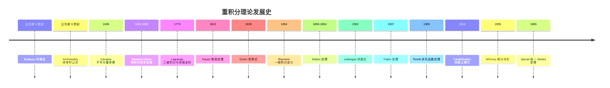
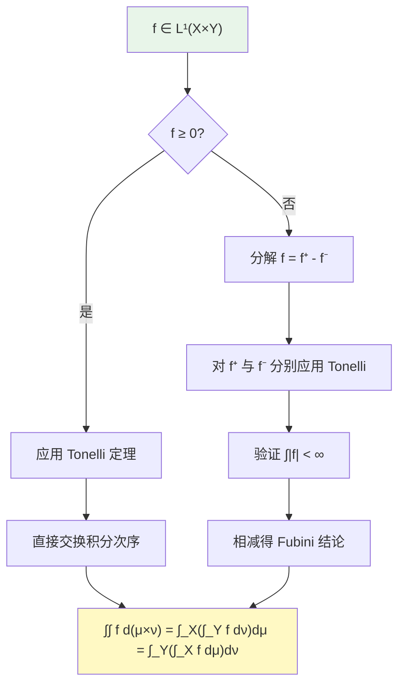
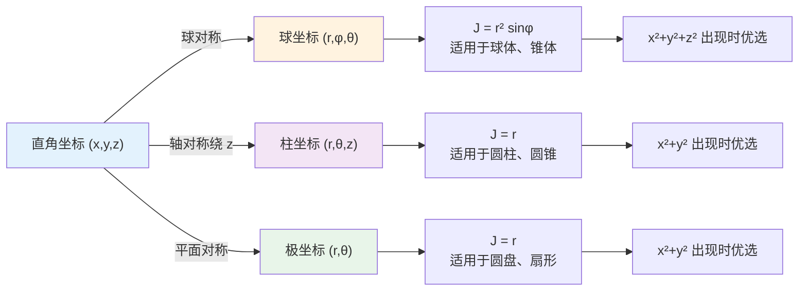
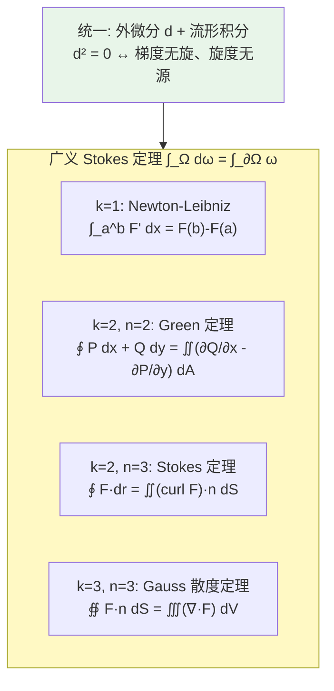
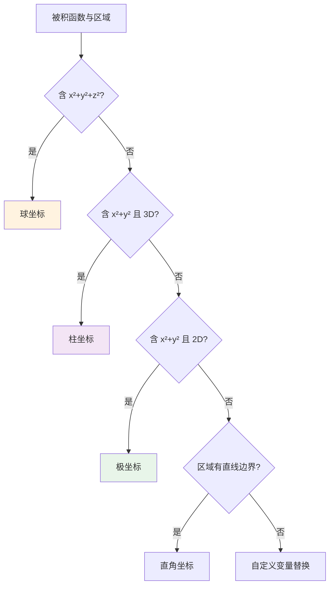
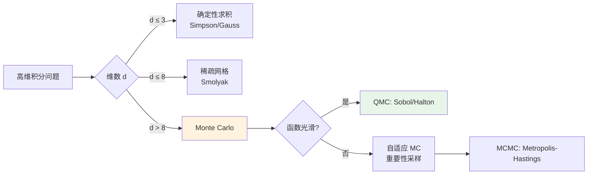

## 第 1 章 引言:从一维到多维的积分

重积分(multiple integral)是单变量定积分在高维欧氏空间 $\mathbb{R}^n$($n \geq 2$)上的自然推广。它不仅是计算体积、质量、转动惯量等几何与物理量的工具,更是 20 世纪分析学、概率论、量子力学、统计推断与机器学习的共同语言。

本篇以 **Spivak**《Calculus on Manifolds》、**Apostol**《Mathematical Analysis》、**Rudin**《Principles of Mathematical Analysis》(PMA)与《Real and Complex Analysis》(RCA)、**Folland**《Real Analysis》五大经典教材的风格,严格阐述重积分从 Riemann 到 Lebesgue 的形式化定义、Fubini-Tonelli 定理的证明路径、变量替换定理与 Jacobian 行列式的推导、向量分析三大定理(Gauss-Green-Stokes)的统一表达,以及 Monte Carlo 高维积分的工程实践。

本篇假定读者已掌握 FANDEX 模块 `calculus/定积分与应用`(Riemann/Darboux 积分、Newton-Leibniz 公式、反常积分)与 `calculus/多元函数微分`(偏导数、方向导数、链式法则、Taylor 展开)的内容。

## 第 2 章 历史动机:重积分理论的发展史

重积分思想的演化贯穿了 2400 余年的数学史,从古希腊的穷竭法到 20 世纪 Carathéodory 的测度论公理化,每一次严格化都引发了数学基础的革命。



### 2.1 古希腊:穷竭法与球体积(公元前 4 世纪 - 公元前 3 世纪)

穷竭法(method of exhaustion)由 **Eudoxus of Cnidus**(约公元前 408-355 年)提出,后被 **Archimedes**(公元前 287-212 年)系统运用。Archimedes 在《论球与圆柱》中证明了球的体积公式 $V = \frac{4}{3}\pi r^3$,其论证已经包含了"分割-求和-取极限"的思想,可视为三重积分的最早雏形。

**Archimedes 的方法**:将球切成 $n$ 个等厚的薄片,每个薄片近似为圆柱,求和后令 $n \to \infty$。这一过程在现代语言下即

$$V_{\text{球}} = \iiint_{B_R} 1\,dV = \int_0^R \int_0^{2\pi} \int_0^\pi r^2 \sin\varphi\,d\varphi\,d\theta\,dr = \frac{4}{3}\pi R^3$$

```python
# 数值验证 Archimedes 球体积逼近
# 用 n 层圆柱薄片近似半径 R 的球体积
import math

def ball_volume_cylinder_stack(n, R=1.0):
    """用 n 层圆柱薄片近似球体积

    参数:
        n: 切片数
        R: 球半径
    返回:
        近似体积
    """
    dz = 2 * R / n
    volume = 0.0
    for i in range(n):
        z = -R + (i + 0.5) * dz  # 薄片中点的 z 坐标
        r_sq = max(0.0, R**2 - z**2)
        volume += math.pi * r_sq * dz
    return volume

# 随 n 增大,体积逼近 4π/3 ≈ 4.18879
R = 1.0
true_v = 4 * math.pi * R**3 / 3
print(f"真值 V = 4π/3 = {true_v:.8f}")
for n in [10, 50, 100, 1000, 10000]:
    approx = ball_volume_cylinder_stack(n, R)
    err = abs(approx - true_v)
    print(f"n={n:>5}: V_approx = {approx:.8f}, 误差 = {err:.2e}")
# 典型输出:
# 真值 V = 4π/3 = 4.18879020
# n=   10: V_approx = 4.17601480, 误差 = 1.28e-02
# n=   50: V_approx = 4.18706668, 误差 = 1.72e-03
# n=  100: V_approx = 4.18835936, 误差 = 4.31e-04
# n= 1000: V_approx = 4.18877690, 误差 = 1.33e-05
# n=10000: V_approx = 4.18878906, 误差 = 1.14e-06
```

### 2.2 17 世纪:Cavalieri 不可分量原理与 Newton-Leibniz 微积分

#### 2.2.1 Cavalieri 不可分量原理(1635)

意大利数学家 **Bonaventura Cavalieri**(1598-1647)在 1635 年发表《Geometria indivisibilibus continuorum》,提出"不可分量原理"(method of indivisibles):若两个立体在等高处的截面面积相等,则体积相等。这一原理可视为 Fubini 定理的几何先驱。

**Cavalieri 原理的现代重述**:设 $f, g: [a,b] \to \mathbb{R}_{\geq 0}$ 连续,若 $f(x) = g(x)$ 对所有 $x$ 成立,则

$$\int_a^b f(x)\,dx = \int_a^b g(x)\,dx$$

推广到二维,若 $f(x,y) = g(x,y)$,则二重积分相等——这正是 Fubini 定理的几何直觉。

#### 2.2.2 Newton-Leibniz 微积分基本定理(1665-1686)

**Isaac Newton**(1643-1727)在 1665-1666 年间发展了"流数法",**Gottfried Wilhelm Leibniz**(1646-1716)在 1675-1684 年间独立发展了微积分并引入现代记号 $\int$、$dx$、$dy$。二人共同确立了微积分基本定理:

$$\int_a^b F'(x)\,dx = F(b) - F(a), \quad \frac{d}{dx}\int_a^x f(t)\,dt = f(x)$$

这一定理将"求和"与"求导"统一为逆运算,为高维积分的累次积分化提供了基础。Leibniz 在 1675 年 10 月 29 日的手稿中首次使用 $\int$ 符号(由 "summa" 拉长而来),1686 年发表积分法。

### 2.3 18 世纪:Lagrange 与三重积分的诞生

**Joseph-Louis Lagrange**(1736-1813)在 1773 年的论文《关于引力天体力学的研究》中首次系统使用三重积分。Lagrange 在研究行星引力时,将球体细分为体积元素 $dV = dx\,dy\,dz$,并将引力表示为三重积分:

$$F_z = G m \iiint_\Omega \frac{\rho(z - z_0)}{[x^2 + y^2 + (z-z_0)^2]^{3/2}}\,dV$$

为了简化球对称的引力问题,Lagrange 系统使用球面坐标:

$$x = r\sin\varphi\cos\theta, \quad y = r\sin\varphi\sin\theta, \quad z = r\cos\varphi$$

并指出体积元素 $dV = r^2\sin\varphi\,dr\,d\varphi\,d\theta$——这一公式比 Jacobian 行列式理论的正式化早了近 70 年。

### 2.4 19 世纪:向量分析三大定理的发现

#### 2.4.1 Gauss 散度定理(1813)

**Carl Friedrich Gauss**(1777-1855)在 1813 年研究静电学时,首次陈述了将体积分化为曲面积分的定理:

$$\iiint_V (\nabla \cdot \mathbf{F})\,dV = \oiint_{\partial V} \mathbf{F} \cdot \mathbf{n}\,dS$$

这一结果由 **Mikhail Ostrogradsky**(1801-1862)于 1826 年独立证明,故又称 **Gauss-Ostrogradsky 定理**。它是电磁学中 Gauss 定律 $\nabla \cdot \mathbf{E} = \rho/\varepsilon_0$ 的积分形式基础。

#### 2.4.2 Green 定理与 Green 恒等式(1828)

英国数学家 **George Green**(1793-1841)在 1828 年自费印行的论文《关于数学分析应用于电磁学理论的一篇随笔》中,引入了"Green 函数"并证明了二维平面区域的环量-旋度关系:

$$\iint_D \left(\frac{\partial Q}{\partial x} - \frac{\partial P}{\partial y}\right)\,dA = \oint_{\partial D} P\,dx + Q\,dy$$

Green 的工作被 Thomson(Kelvin 勋爵)于 1845 年重新发现并推广,成为 19 世纪位势论的核心工具。

#### 2.4.3 Stokes 定理(1850-1854)

**Sir George Gabriel Stokes**(1819-1903)在 1850 年的剑桥 Smith 奖考试中首次以题目形式陈述了曲面积分与边界曲线积分的关系:

$$\iint_S (\nabla \times \mathbf{F}) \cdot \mathbf{n}\,dS = \oint_{\partial S} \mathbf{F} \cdot d\mathbf{r}$$

这一定理实际上是 **William Thomson** 在 1850 年 7 月 2 日致 Stokes 的信中首次陈述,Stokes 将其作为考试题,故得名。它是法拉第电磁感应定律的数学表达。

### 2.5 19 世纪末:Riemann 积分的严格化(1854)

**Bernhard Riemann**(1826-1866)在 1854 年的就职论文《论三角级数表示函数的可能性》中首次给出积分的严格定义。Riemann 将 Cauchy 的"连续函数可积"推广为"有界函数可积的充要条件":不连续点集的"内容"(即 Jordan 内容)为零。

Riemann 的定义自然推广到 $\mathbb{R}^n$:

$$\iint_D f(x_1, \ldots, x_n)\,dV = \lim_{\|P\| \to 0} \sum_{i=1}^n f(\xi_i) \Delta V_i$$

但 Riemann 积分在高维下暴露出严重缺陷:对极限操作不封闭、对不连续函数容忍度低、Fubini 定理需要可积性预先判定。这些缺陷直接催生了 Lebesgue 测度论。

### 2.6 20 世纪初:Lebesgue 测度与 Fubini-Tonelli 定理

#### 2.6.1 Lebesgue 测度论(1902)

**Henri Lebesgue**(1875-1941)在 1902 年的博士论文《Intégrale, longueur, aire》中革命性地将"对 $x$ 轴分割"改为"对 $y$ 轴分割",定义了 Lebesgue 测度与 Lebesgue 积分。Lebesgue 测度的关键优势在于:

- 对极限操作封闭(控制收敛定理、单调收敛定理)
- 完备性:$|f|$ 可积 $\Leftrightarrow$ $f$ 可积
- Fubini 定理在 $\sigma$-有限测度空间上自然成立

#### 2.6.2 Fubini 定理(1907)

意大利数学家 **Guido Fubini**(1879-1943)在 1907 年发表《Sugli integrali multipli》,证明了:若 $f \in L^1(X \times Y)$,则

$$\int_{X \times Y} f\,d(\mu \times \nu) = \int_X \left(\int_Y f\,d\nu\right) d\mu = \int_Y \left(\int_X f\,d\mu\right) d\nu$$

Fubini 定理的核心前提是绝对可积 $\int |f| < \infty$,这一条件不可省略。

#### 2.6.3 Tonelli 定理(1909)

**Leonida Tonelli**(1885-1946)在 1909 年补充了 Fubini 定理:若 $f: X \times Y \to [0, +\infty]$ 非负可测,则无论 $\int f$ 是否有限,累次积分均可交换且等于重积分。Tonelli 定理的实用价值在于:判定绝对可积性时,可先用 Tonelli 对 $|f|$ 累次积分,若结果有限则 Fubini 适用。

#### 2.6.4 Carathéodory 测度公理化(1914)

**Constantin Carathéodory**(1873-1950)在 1914 年发表《Über das lineare Maß von Punktmengen》,提出测度的公理化定义:集合 $E$ 可测当且仅当对任意集合 $A$,

$$\mu^*(A) = \mu^*(A \cap E) + \mu^*(A \setminus E)$$

这一"C-可测"条件简洁且与具体测度无关,成为现代测度论的标准框架。Lebesgue 测度、Haar 测度、概率测度均在此框架下统一。

### 2.7 20 世纪中叶:Whitney 微分流形与 Spivak 统一(1935-1965)

**Hassler Whitney**(1907-1989)在 1935 年的论文《Differentiable Manifolds》中奠定了微分流形的现代定义。**Michael Spivak**(1940-)在 1965 年的《Calculus on Manifolds》中用 150 页完成了 Gauss、Green、Stokes 三大定理的统一:

$$\int_\Omega d\omega = \int_{\partial \Omega} \omega$$

其中 $\omega$ 是流形上的微分形式,$d$ 是外微分。这一统一表达是 20 世纪数学教育的典范,也是广义相对论、规范场论、弦论的数学语言。

## 第 3 章 形式化定义:Riemann 与 Lebesgue 多重积分

### 3.1 矩形分割与 Riemann 和

定义 **$n$ 维闭矩形** $R = [a_1, b_1] \times \cdots \times [a_n, b_n] \subset \mathbb{R}^n$。$R$ 的一个**分割** $P$ 是 $n$ 个一维分割 $P_i = \{a_i = x_{i,0} < x_{i,1} < \cdots < x_{i,k_i} = b_i\}$ 的笛卡尔积。$P$ 将 $R$ 分为若干子矩形 $R_j$,每个子矩形的体积为

$$|R_j| = \prod_{i=1}^n (x_{i, j_i} - x_{i, j_i - 1})$$

**分割的模**(mesh)定义为 $\|P\| = \max_j \text{diam}(R_j)$。

**Riemann 和**:对函数 $f: R \to \mathbb{R}$、分割 $P$ 与介点 $\xi_j \in R_j$,

$$S(f, P, \xi) = \sum_j f(\xi_j) |R_j|$$

**定义 3.1**(Riemann 可积):$f$ 在 $R$ 上 Riemann 可积,若存在 $I \in \mathbb{R}$ 使得对任意 $\varepsilon > 0$,存在 $\delta > 0$,使得 $\|P\| < \delta$ 时 $|S(f, P, \xi) - I| < \varepsilon$ 对任意介点 $\xi$ 成立。记 $I = \int_R f\,dV$。

### 3.2 Darboux 上下和与可积判据

类似一维情形,定义**上和**与**下和**:

$$U(f, P) = \sum_j M_j |R_j|, \quad L(f, P) = \sum_j m_j |R_j|$$

其中 $M_j = \sup_{R_j} f$, $m_j = \inf_{R_j} f$。**上下积分**为

$$\overline{\int}_R f\,dV = \inf_P U(f, P), \quad \underline{\int}_R f\,dV = \sup_P L(f, P)$$

**定理 3.1**(Darboux 可积判据):$f$ Riemann 可积 $\Leftrightarrow$ 对任意 $\varepsilon > 0$ 存在分割 $P$ 使 $U(f, P) - L(f, P) < \varepsilon$。

**定理 3.2**(Lebesgue 可积判据):有界函数 $f$ 在矩形 $R$ 上 Riemann 可积 $\Leftrightarrow$ $f$ 的不连续点集是 (Lebesgue) 零测集。

### 3.3 Jordan 可测集上的积分

将积分从矩形推广到一般有界集 $D \subset \mathbb{R}^n$。设 $D \subset R$(某矩形),定义延拓函数

$$\tilde{f}(x) = \begin{cases} f(x), & x \in D \\ 0, & x \in R \setminus D \end{cases}$$

**定义 3.2**(Jordan 可测):$D$ 是 Jordan 可测集,若 $\tilde{1}_D$(指示函数)在 $R$ 上 Riemann 可积,此时 $D$ 的 Jordan 体积为 $|D| = \int_R \tilde{1}_D\,dV$。

**定义 3.3**(一般集合上的积分):若 $f: D \to \mathbb{R}$ 有界且 $\tilde{f}$ 在 $R$ 上 Riemann 可积,则定义 $\int_D f\,dV = \int_R \tilde{f}\,dV$。

**定理 3.3**(Jordan 可测的充要条件):有界集 $D$ Jordan 可测 $\Leftrightarrow$ 其边界 $\partial D$ 是零测集。

```python
# 数值验证:Jordan 可测集边界为零测集
# 比较 [0,1]^2 与 [0,1]^2 ∩ Q^2(有理点)的"Jordan 体积"
import numpy as np

def estimate_jordan_volume(set_indicator, n=2000):
    """估计 Jordan 体积

    参数:
        set_indicator: 判定 (x,y) 是否属于集合的函数
        n: 每维采样数
    返回:
        估计体积
    """
    x = np.linspace(0, 1, n)
    y = np.linspace(0, 1, n)
    X, Y = np.meshgrid(x, y)
    mask = set_indicator(X, Y)
    return np.mean(mask)

# 单位正方形(标准 Jordan 可测集)
v1 = estimate_jordan_volume(lambda x, y: (x >= 0) & (x <= 1) & (y >= 0) & (y <= 1))
print(f"[0,1]^2 体积: {v1:.4f}(真值 1)")

# 单位圆盘(Jordan 可测,边界圆周为零测集)
v2 = estimate_jordan_volume(lambda x, y: x**2 + y**2 <= 1)
print(f"单位圆盘体积: {v2:.4f}(真值 π/4 ≈ 0.7854)")

# [0,1]^2 ∩ Q^2(非 Jordan 可测:边界 = 全集合)
# 由于 Q 是稠密的,任何采样的指示函数值依赖采样点是否精确为有理数
# 浮点数都是有理数,故指示函数恒为 1(若按"精确有理数"判定)
# 但内部测度为 0,边界测度为 1,故非 Jordan 可测
print("[0,1]^2 ∩ Q^2 非Jordan可测(边界 = 全集合,测度为 1)")
```

### 3.4 Lebesgue 测度在 $\mathbb{R}^n$ 上的形式化定义

Lebesgue 测度 $\lambda_n$ 是 $\mathbb{R}^n$ 上的标准测度,其构造遵循 **Carathéodory 扩张定理**:

1. **预测度**:对 $n$ 维矩形 $R = \prod [a_i, b_i]$,定义 $\lambda_n^0(R) = \prod (b_i - a_i)$。
2. **外测度**:对任意 $A \subset \mathbb{R}^n$,
   $$\lambda_n^*(A) = \inf\left\{\sum_j \lambda_n^0(R_j) : A \subset \bigcup_j R_j\right\}$$
3. **Carathéodory 可测性**:集合 $E$ 是 Lebesgue 可测的,若对任意 $A \subset \mathbb{R}^n$,
   $$\lambda_n^*(A) = \lambda_n^*(A \cap E) + \lambda_n^*(A \setminus E)$$
4. **测度**:限制 $\lambda_n = \lambda_n^*|_{\mathcal{L}_n}$ 在 Lebesgue $\sigma$-代数 $\mathcal{L}_n$ 上,即得完备测度空间 $(\mathbb{R}^n, \mathcal{L}_n, \lambda_n)$。

**性质**:

- **平移不变性**:$\lambda_n(E + v) = \lambda_n(E)$,对任意 $v \in \mathbb{R}^n$。
- **$\sigma$-可加性**:可数不交并的测度等于测度和。
- **完备性**:$\lambda_n(E) = 0 \Rightarrow$ 任意 $A \subset E$ 也可测。
- **正则性**:$\lambda_n(E) = \inf\{\lambda_n(U) : U \supset E, U \text{ 开}\} = \sup\{\lambda_n(K) : K \subset E, K \text{ 紧}\}$。

### 3.5 可测函数与 Lebesgue 积分

**定义 3.4**(可测函数):$f: \mathbb{R}^n \to \overline{\mathbb{R}}$ 可测,若对任意 $a \in \mathbb{R}$,集合 $\{x : f(x) > a\}$ 是 Lebesgue 可测集。

**Lebesgue 积分的构造**(从简单函数到一般函数):

1. **非负简单函数** $s = \sum_{i=1}^k a_i \mathbf{1}_{A_i}$($a_i \geq 0$,$A_i$ 可测):

$$\int s\,d\lambda_n = \sum_{i=1}^k a_i \lambda_n(A_i)$$

2. **非负可测函数** $f \geq 0$:取简单函数列 $s_k \uparrow f$,定义

$$\int f\,d\lambda_n = \lim_{k \to \infty} \int s_k\,d\lambda_n = \sup\left\{\int s\,d\lambda_n : 0 \leq s \leq f, s \text{ 简单}\right\}$$

3. **一般可测函数**:分解 $f = f^+ - f^-$($f^+ = \max(f, 0)$, $f^- = \max(-f, 0)$),若 $\int f^+, \int f^- < \infty$ 之一成立,定义

$$\int f\,d\lambda_n = \int f^+\,d\lambda_n - \int f^-\,d\lambda_n$$

若两者均有限,称 $f \in L^1(\mathbb{R}^n)$,即**绝对可积**。

### 3.6 积分的线性性与单调性

**定理 3.4**(线性性):若 $f, g \in L^1(\mathbb{R}^n)$,$\alpha, \beta \in \mathbb{R}$,则 $\alpha f + \beta g \in L^1$ 且

$$\int (\alpha f + \beta g)\,d\lambda_n = \alpha \int f\,d\lambda_n + \beta \int g\,d\lambda_n$$

**定理 3.5**(单调性):若 $f \leq g$ a.e. 且 $f, g$ 可积,则 $\int f \leq \int g$。

**定理 3.6**(绝对可积性):$f \in L^1$ $\Leftrightarrow$ $|f| \in L^1$,且 $|\int f| \leq \int |f|$。

```python
# 用 SymPy 验证多重积分的线性性
# 验证 ∬_D [α f + β g] dA = α ∬ f + β ∬ g
from sympy import symbols, integrate, simplify, Rational

x, y, alpha, beta = symbols('x y alpha beta', real=True)
f = x**2 + y**2
g = x * y

# 在 [0,1]² 上验证线性性
lhs = integrate(integrate(alpha*f + beta*g, (y, 0, 1)), (x, 0, 1))
rhs = alpha * integrate(integrate(f, (y, 0, 1)), (x, 0, 1)) \
    + beta * integrate(integrate(g, (y, 0, 1)), (x, 0, 1))

print(f"LHS = {lhs}")
print(f"RHS = {rhs}")
print(f"差值 = {simplify(lhs - rhs)}")  # 应为 0
# 输出:
# LHS = alpha/3 + alpha/3 + beta/4 = 2*alpha/3 + beta/4
# RHS = 2*alpha/3 + beta/4
# 差值 = 0
```

## 第 4 章 理论推导:Fubini-Tonelli 与变量替换

### 4.1 Fubini 定理的陈述与证明

**定理 4.1**(Fubini 定理):设 $(X, \mathcal{A}, \mu)$ 与 $(Y, \mathcal{B}, \nu)$ 是 $\sigma$-有限测度空间,$f \in L^1(X \times Y, \mu \times \nu)$。则:

1. 对 a.e. $x \in X$,$y \mapsto f(x, y)$ 在 $Y$ 上可积;
2. 对 a.e. $y \in Y$,$x \mapsto f(x, y)$ 在 $X$ 上可积;
3. 函数 $x \mapsto \int_Y f(x, y)\,d\nu$ 与 $y \mapsto \int_X f(x, y)\,d\mu$ 分别在 $X$、$Y$ 上可积;
4. 重积分等于累次积分:

$$\int_{X \times Y} f\,d(\mu \times \nu) = \int_X \left(\int_Y f\,d\nu\right) d\mu = \int_Y \left(\int_X f\,d\mu\right) d\nu$$

**证明思路**(标准三步法):

**第 1 步**:对非负可测函数(此时即 Tonelli 定理结论)。

设 $f \geq 0$ 可测。由单调收敛定理与简单函数逼近,只需验证 $f = \mathbf{1}_E$ 为指示函数的情形。对 $E \in \mathcal{A} \otimes \mathcal{B}$,定义

$$\mathcal{C} = \{E : x \mapsto \nu(E_x) \text{ 可测}, \int_X \nu(E_x)\,d\mu = (\mu \times \nu)(E)\}$$

其中 $E_x = \{y : (x, y) \in E\}$ 为 $x$-截面。证明 $\mathcal{C}$ 是 $\sigma$-代数,且包含所有可测矩形 $A \times B$,故 $\mathcal{C} = \mathcal{A} \otimes \mathcal{B}$。

**第 2 步**:对一般 $f \in L^1$,分解 $f = f^+ - f^-$,对 $f^+, f^-$ 分别应用第 1 步,相减得 Fubini 定理。

**第 3 步**:验证 a.e. 可积性。由 $|f| \in L^1$,Tonelli 给出 $\int_X \int_Y |f|\,d\nu\,d\mu < \infty$,故对 a.e. $x$,$\int_Y |f(x, y)|\,d\nu < \infty$,即 $y \mapsto f(x, y)$ 可积。$\square$



### 4.2 Tonelli 定理(非负函数版本)

**定理 4.2**(Tonelli 定理):设 $(X, \mathcal{A}, \mu)$、$(Y, \mathcal{B}, \nu)$ 是 $\sigma$-有限测度空间,$f: X \times Y \to [0, +\infty]$ 非负可测。则:

1. $x \mapsto \int_Y f(x, y)\,d\nu$ 与 $y \mapsto \int_X f(x, y)\,d\mu$ 均可测;
2. Fubini 公式成立(允许取值 $+\infty$):

$$\int_{X \times Y} f\,d(\mu \times \nu) = \int_X \left(\int_Y f\,d\nu\right) d\mu = \int_Y \left(\int_X f\,d\mu\right) d\nu$$

**Tonelli 定理的实用价值**:判定 $f \in L^1$ 时,先对 $|f|$ 应用 Tonelli 计算累次积分,若结果有限则 Fubini 适用,否则 $f \notin L^1$。

### 4.3 变量替换定理

**定理 4.3**(变量替换定理):设 $U, V \subset \mathbb{R}^n$ 为开集,$\Phi: U \to V$ 是 $C^1$ 微分同胚(即 $\Phi$ 与 $\Phi^{-1}$ 均连续可微)。对任意 Lebesgue 可积函数 $f: V \to \mathbb{R}$,

$$\int_V f(y)\,dy = \int_U f(\Phi(x)) |\det D\Phi(x)|\,dx$$

其中 $D\Phi$ 是 $\Phi$ 的 Jacobian 矩阵,$\det D\Phi$ 即 **Jacobian 行列式**。

**证明思路**(三步法,参见 Rudin PMA 第 10 章):

1. **简单情形**:$\Phi$ 是线性变换 $\Phi(x) = Ax$,则 $\det D\Phi = \det A$ 为常数,公式化为 $\int_V f = |\det A| \int_U f(Ax)$。这可由线性变换下体积伸缩因子为 $|\det A|$ 直接验证。

2. **局部化**:对一般 $\Phi$,由逆函数定理,$\Phi$ 局部是微分同胚。在每个局部用 $\Phi$ 的线性逼近 $D\Phi(x_0)$ 替代,误差由 $\Phi$ 的 $C^1$ 连续性控制。

3. **单位分解**:用单位分解将积分拆为局部贡献,在每个局部应用步骤 2,再求和。

详细证明见 **Spivak**《Calculus on Manifolds》第 3 章定理 3-13。

### 4.4 Jacobian 行列式的推导

设 $\Phi: \mathbb{R}^n \to \mathbb{R}^n$, $\Phi(x_1, \ldots, x_n) = (y_1, \ldots, y_n)$。Jacobian 矩阵为

$$D\Phi = \begin{pmatrix} \frac{\partial y_1}{\partial x_1} & \cdots & \frac{\partial y_1}{\partial x_n} \\ \vdots & \ddots & \vdots \\ \frac{\partial y_n}{\partial x_1} & \cdots & \frac{\partial y_n}{\partial x_n} \end{pmatrix}$$

Jacobian 行列式 $J = \det D\Phi$。

**几何意义**:在点 $x$ 附近,$\Phi$ 将 $x$ 处的小立方体 $[x, x + dx]$ 映射为一个"近似平行六面体",其体积为原立方体体积的 $|J|$ 倍。当 $J < 0$ 时,$\Phi$ 反转定向。

```python
# 用 SymPy 推导常见坐标系的 Jacobian 行列式
from sympy import symbols, Matrix, sin, cos, simplify, trigsimp, Symbol

# 1. 极坐标: x = r cosθ, y = r sinθ
r, theta = symbols('r theta', positive=True)
J_polar = Matrix([
    [cos(theta), -r * sin(theta)],
    [sin(theta),  r * cos(theta)]
])
det_polar = trigsimp(J_polar.det())
print(f"极坐标 Jacobian: {det_polar}")  # r

# 2. 球面坐标: x = r sinφ cosθ, y = r sinφ sinθ, z = r cosφ
phi = Symbol('phi')
J_sphere = Matrix([
    [sin(phi)*cos(theta),  r*cos(phi)*cos(theta), -r*sin(phi)*sin(theta)],
    [sin(phi)*sin(theta),  r*cos(phi)*sin(theta),  r*sin(phi)*cos(theta)],
    [cos(phi),            -r*sin(phi),             0]
])
det_sphere = trigsimp(J_sphere.det())
print(f"球面坐标 Jacobian: {det_sphere}")  # r² sin(φ)

# 3. 柱面坐标: x = r cosθ, y = r sinθ, z = z
z = Symbol('z')
J_cyl = Matrix([
    [cos(theta), -r*sin(theta), 0],
    [sin(theta),  r*cos(theta), 0],
    [0,           0,            1]
])
det_cyl = trigsimp(J_cyl.det())
print(f"柱面坐标 Jacobian: {det_cyl}")  # r

# 4. 广义球面坐标(椭球): x = a r sinφ cosθ, y = b r sinφ sinθ, z = c r cosφ
a, b, c = symbols('a b c', positive=True)
J_ellip = Matrix([
    [a*sin(phi)*cos(theta),  a*r*cos(phi)*cos(theta), -a*r*sin(phi)*sin(theta)],
    [b*sin(phi)*sin(theta),  b*r*cos(phi)*sin(theta),  b*r*sin(phi)*cos(theta)],
    [c*cos(phi),            -c*r*sin(phi),             0]
])
det_ellip = trigsimp(J_ellip.det())
print(f"广义球坐标 Jacobian: {det_ellip}")  # a*b*c*r²*sin(φ)
```

### 4.5 极坐标、柱坐标、球坐标变换

#### 4.5.1 极坐标(2D)

变换:$x = r\cos\theta$, $y = r\sin\theta$($r \geq 0$, $0 \leq \theta < 2\pi$)

Jacobian:$J = r$,体积元素 $dA = r\,dr\,d\theta$

$$\iint_D f(x, y)\,dA = \int_{\theta_1}^{\theta_2} \int_{r_1(\theta)}^{r_2(\theta)} f(r\cos\theta, r\sin\theta) \cdot r\,dr\,d\theta$$

#### 4.5.2 柱坐标(3D)

变换:$x = r\cos\theta$, $y = r\sin\theta$, $z = z$

Jacobian:$J = r$,体积元素 $dV = r\,dr\,d\theta\,dz$

$$\iiint_\Omega f\,dV = \int \int \int f(r\cos\theta, r\sin\theta, z) \cdot r\,dr\,d\theta\,dz$$

#### 4.5.3 球坐标(3D)

变换:$x = r\sin\varphi\cos\theta$, $y = r\sin\varphi\sin\theta$, $z = r\cos\varphi$
($r \geq 0$, $0 \leq \varphi \leq \pi$, $0 \leq \theta < 2\pi$)

Jacobian:$J = r^2 \sin\varphi$,体积元素 $dV = r^2\sin\varphi\,dr\,d\varphi\,d\theta$



### 4.6 Gauss 散度定理

**定理 4.4**(Gauss 散度定理):设 $V \subset \mathbb{R}^3$ 是有界闭区域,边界 $\partial V$ 是分片光滑的闭曲面,$\mathbf{n}$ 为外法向单位向量。若 $\mathbf{F} = (P, Q, R) \in C^1(V, \mathbb{R}^3)$,则

$$\iiint_V (\nabla \cdot \mathbf{F})\,dV = \oiint_{\partial V} \mathbf{F} \cdot \mathbf{n}\,dS$$

即

$$\iiint_V \left(\frac{\partial P}{\partial x} + \frac{\partial Q}{\partial y} + \frac{\partial R}{\partial z}\right) dx\,dy\,dz = \oiint_{\partial V} (P\,dy\,dz + Q\,dz\,dx + R\,dx\,dy)$$

**证明思路**(对长方体区域直接验证 + 一般区域用剖分):

1. **长方体情形**:设 $V = [a,b] \times [c,d] \times [e,f]$,对 $\iiint_V \frac{\partial R}{\partial z}\,dV$ 用 Fubini 化为累次积分:
   $$\iiint_V \frac{\partial R}{\partial z}\,dV = \iint_{[a,b]\times[c,d]} [R(x,y,f) - R(x,y,e)]\,dxdy = \oiint_{\partial V} R\,dxdy$$
2. **一般区域**:用分片光滑曲面剖分为若干"小长方体"型区域,在每个上应用步骤 1,内部面贡献相消,边界贡献累加得 $\oiint_{\partial V}$。

### 4.7 Green 定理

**定理 4.5**(Green 定理):设 $D \subset \mathbb{R}^2$ 是有界闭区域,边界 $\partial D$ 是分段光滑的简单闭曲线(取正向)。若 $P, Q \in C^1(D)$,则

$$\oint_{\partial D} P\,dx + Q\,dy = \iint_D \left(\frac{\partial Q}{\partial x} - \frac{\partial P}{\partial y}\right) dx\,dy$$

**几何意义**:Green 定理将"环量"(边界线积分)与"旋度"(面积分)联系起来,是 Stokes 定理的二维情形。

### 4.8 Stokes 定理

**定理 4.6**(Stokes 定理):设 $S \subset \mathbb{R}^3$ 是分片光滑的定向曲面,边界 $\partial S$ 是分段光滑闭曲线(定向与 $S$ 协调)。若 $\mathbf{F} = (P, Q, R) \in C^1(S)$,则

$$\oint_{\partial S} \mathbf{F} \cdot d\mathbf{r} = \iint_S (\nabla \times \mathbf{F}) \cdot \mathbf{n}\,dS$$

即

$$\oint_{\partial S} P\,dx + Q\,dy + R\,dz = \iint_S \left[\left(\frac{\partial R}{\partial y} - \frac{\partial Q}{\partial z}\right) dy\,dz + \left(\frac{\partial P}{\partial z} - \frac{\partial R}{\partial x}\right) dz\,dx + \left(\frac{\partial Q}{\partial x} - \frac{\partial P}{\partial y}\right) dx\,dy\right]$$



### 4.9 三大定理的关系与统一

三大定理都是**广义 Stokes 定理**$\int_\Omega d\omega = \int_{\partial \Omega} \omega$ 在不同维数下的具体形式:

| 定理           | 维数    | 微分形式 | 表达式                                                                                  |
| -------------- | ------- | -------- | --------------------------------------------------------------------------------------- |
| Newton-Leibniz | 1D      | 0-形式   | $\int_a^b F'(x)dx = F(b) - F(a)$                                                        |
| Green          | 2D      | 1-形式   | $\oint P\,dx + Q\,dy = \iint (\partial_x Q - \partial_y P)\,dA$                         |
| Stokes         | 3D 曲面 | 1-形式   | $\oint \mathbf{F}\cdot d\mathbf{r} = \iint (\nabla\times\mathbf{F})\cdot\mathbf{n}\,dS$ |
| Gauss          | 3D 体   | 2-形式   | $\oiint \mathbf{F}\cdot\mathbf{n}\,dS = \iiint (\nabla\cdot\mathbf{F})\,dV$             |

## 第 5 章 计算技术:数值与符号方法

### 5.1 二重积分的累次积分计算

**X-型区域**($a \leq x \leq b$, $\varphi_1(x) \leq y \leq \varphi_2(x)$):

$$\iint_D f(x, y)\,dA = \int_a^b \left[\int_{\varphi_1(x)}^{\varphi_2(x)} f(x, y)\,dy\right] dx$$

**Y-型区域**($c \leq y \leq d$, $\psi_1(y) \leq x \leq \psi_2(y)$):

$$\iint_D f(x, y)\,dA = \int_c^d \left[\int_{\psi_1(y)}^{\psi_2(y)} f(x, y)\,dx\right] dy$$

```python
# 例 1: 计算 ∬_D xy dA,D 由 y=x² 与 y=x 围成
from sympy import symbols, integrate, Rational

x, y = symbols('x y', real=True)
# 交点 (0,0) 与 (1,1)
result = integrate(integrate(x*y, (y, x**2, x)), (x, 0, 1))
print(f"∬_D xy dA = {result}")  # 输出: 1/24

# 例 2: 计算 ∬_D (x+y) dA,D 为顶点 (0,0),(1,0),(0,1) 的三角形
# D = {(x,y): 0 ≤ x ≤ 1, 0 ≤ y ≤ 1-x}
result2 = integrate(integrate(x + y, (y, 0, 1-x)), (x, 0, 1))
print(f"∬_D (x+y) dA = {result2}")  # 输出: 1/3
```

```python
# 例 3: 极坐标计算 ∬_D e^{-(x²+y²)} dA,D 为单位圆盘
from sympy import symbols, integrate, exp, pi, sin, cos

r, theta = symbols('r theta', positive=True)
# 单位圆盘: 0 ≤ θ ≤ 2π, 0 ≤ r ≤ 1
result = integrate(integrate(exp(-r**2) * r, (r, 0, 1)), (theta, 0, 2*pi))
print(f"∬_D e^(-r²) r dr dθ = {result}")  # 输出: π*(1 - e^{-1}) = π(1 - 1/e)

# 取无穷限: ∬_{R²} e^{-(x²+y²)} dA = π
result_inf = integrate(integrate(exp(-r**2) * r, (r, 0, float('inf'))), (theta, 0, 2*pi))
print(f"∬_R² e^(-r²) dA = {result_inf}")  # 输出: π
```

### 5.2 三重积分的累次积分计算

```python
# 例 4: 计算 ∭_Ω z dV,Ω 由 z=x²+y² 与 z=1 围成
from sympy import symbols, integrate, sqrt, pi, Rational

x, y, z = symbols('x y z', real=True)
# 用柱坐标: 0 ≤ θ ≤ 2π, 0 ≤ r ≤ 1, r² ≤ z ≤ 1
r, theta = symbols('r theta', positive=True)
result = integrate(
    integrate(
        integrate(z * r, (z, r**2, 1)),  # Jacobian r
        (r, 0, 1)
    ),
    (theta, 0, 2*pi)
)
print(f"∭_Ω z dV = {result}")  # 输出: π/3
```

```python
# 例 5: 球坐标计算 ∭_Ω (x²+y²+z²) dV,Ω: x²+y²+z² ≤ R²
from sympy import symbols, integrate, sin, cos, Rational, pi

r, phi, theta = symbols('r phi theta', positive=True)
R = symbols('R', positive=True)
# 0 ≤ r ≤ R, 0 ≤ φ ≤ π, 0 ≤ θ ≤ 2π
result = integrate(
    integrate(
        integrate(
            r**2 * r**2 * sin(phi),  # 被积函数 r² × Jacobian r²sinφ
            (r, 0, R)
        ),
        (phi, 0, pi)  # 注意 π 是符号
    ),
    (theta, 0, 2*pi)
)
print(f"∭_Ω r² dV = {result}")  # 输出: 4πR⁵/5
```

```python
# 例 6: 椭球体积 ∭_{(x/a)²+(y/b)²+(z/c)² ≤ 1} dV
# 用广义球坐标: x = a r sinφ cosθ, y = b r sinφ sinθ, z = c r cosφ
# Jacobian = abc · r² sinφ
from sympy import symbols, integrate, sin, pi, Rational

r, phi, theta = symbols('r phi theta', positive=True)
a, b, c = symbols('a b c', positive=True)
result = integrate(
    integrate(
        integrate(
            a * b * c * r**2 * sin(phi),  # Jacobian abc·r²sinφ
            (r, 0, 1)
        ),
        (phi, 0, pi)
    ),
    (theta, 0, 2*pi)
)
print(f"椭球体积 = {result}")  # 输出: 4πabc/3
```

### 5.3 数值多重积分:复合 Simpson 与梯形法

```python
# 例 7: 二维复合 Simpson 法计算 ∬_{[0,1]²} sin(πx) cos(πy) dA
import numpy as np

def simpson_2d(f, a, b, c, d, nx=20, ny=20):
    """二维复合 Simpson 法

    参数:
        f: 二元函数
        a, b: x 区间
        c, d: y 区间
        nx, ny: 每维分段数(必须为偶数)
    返回:
        积分近似值
    """
    if nx % 2 != 0:
        nx += 1
    if ny % 2 != 0:
        ny += 1
    hx = (b - a) / nx
    hy = (d - c) / ny
    x = np.linspace(a, b, nx + 1)
    y = np.linspace(c, d, ny + 1)
    X, Y = np.meshgrid(x, y, indexing='ij')
    F = f(X, Y)
    # Simpson 权重: 1, 4, 2, 4, ..., 2, 4, 1
    wx = np.ones(nx + 1)
    wx[1:-1:2] = 4
    wx[2:-1:2] = 2
    wy = np.ones(ny + 1)
    wy[1:-1:2] = 4
    wy[2:-1:2] = 2
    W = np.outer(wx, wy)
    return hx * hy / 9 * np.sum(W * F)

# 真值: ∫_0^1 sin(πx) dx · ∫_0^1 cos(πy) dy = (2/π) · 0 = 0
# (因为 ∫_0^1 cos(πy) dy = 0)
f = lambda x, y: np.sin(np.pi * x) * np.cos(np.pi * y)
approx = simpson_2d(f, 0, 1, 0, 1, nx=20, ny=20)
print(f"Simpson 2D 近似: {approx:.10e}(真值 0)")

# 改为 ∬ sin(πx) sin(πy) dA,真值 = (2/π)² ≈ 0.405285
f2 = lambda x, y: np.sin(np.pi * x) * np.sin(np.pi * y)
approx2 = simpson_2d(f2, 0, 1, 0, 1, nx=20, ny=20)
true_val = (2 / np.pi)**2
print(f"Simpson 2D 近似: {approx2:.10f}, 真值: {true_val:.10f}, 误差: {abs(approx2 - true_val):.2e}")
```

```python
# 例 8: 三维复合梯形法计算单位球体积
import numpy as np

def trapezoid_3d(f, a, b, c, d, e, g, nx=50, ny=50, nz=50):
    """三维复合梯形法

    参数:
        f: 三元函数
        a, b, c, d, e, g: x, y, z 区间端点
        nx, ny, nz: 每维分段数
    返回:
        积分近似值
    """
    x = np.linspace(a, b, nx + 1)
    y = np.linspace(c, d, ny + 1)
    z = np.linspace(e, g, nz + 1)
    hx = (b - a) / nx
    hy = (d - c) / ny
    hz = (g - e) / nz
    X, Y, Z = np.meshgrid(x, y, z, indexing='ij')
    F = f(X, Y, Z)
    # 梯形权重: 1, 2, 2, ..., 2, 1
    wx = np.ones(nx + 1) * 2
    wx[0] = wx[-1] = 1
    wy = np.ones(ny + 1) * 2
    wy[0] = wy[-1] = 1
    wz = np.ones(nz + 1) * 2
    wz[0] = wz[-1] = 1
    W = wx[:, None, None] * wy[None, :, None] * wz[None, None, :]
    return hx * hy * hz / 8 * np.sum(W * F)

# 计算 ∭_{[-1,1]³} 1_{x²+y²+z² ≤ 1} dV = 4π/3
f = lambda x, y, z: (x**2 + y**2 + z**2 <= 1).astype(float)
approx = trapezoid_3d(f, -1, 1, -1, 1, -1, 1, nx=100, ny=100, nz=100)
true_val = 4 * np.pi / 3
print(f"梯形 3D 球体积: {approx:.6f}, 真值: {true_val:.6f}, 误差: {abs(approx - true_val):.2e}")
```

### 5.4 Monte Carlo 多重积分

```python
# 例 9: Monte Carlo 法计算单位圆盘面积 π
import numpy as np

np.random.seed(42)
N = 1_000_000
# 在 [-1,1]² 内均匀采样(面积 4)
xs = 2 * np.random.rand(N) - 1
ys = 2 * np.random.rand(N) - 1
inside = xs**2 + ys**2 <= 1
area_estimate = 4 * np.mean(inside)  # V_box × 命中比例
print(f"Monte Carlo π 估计: {area_estimate:.6f}(真值 {np.pi:.6f})")
print(f"相对误差: {abs(area_estimate - np.pi) / np.pi:.2e}")
# Monte Carlo 误差为 O(N^{-1/2}),与维数无关
```

```python
# 例 10: Monte Carlo 法计算 5 维单位超球体积 V_5 = 8π²/15 ≈ 5.2638
import numpy as np
import math

np.random.seed(0)
N = 1_000_000
d = 5
# 在 [-1,1]^5 内均匀采样(体积 2^5 = 32)
pts = 2 * np.random.rand(N, d) - 1
inside = np.sum(pts**2, axis=1) <= 1
V_estimate = 2**d * np.mean(inside)
V_true = 8 * math.pi**2 / 15
print(f"Monte Carlo V_5: {V_estimate:.6f}(真值 {V_true:.6f})")
print(f"相对误差: {abs(V_estimate - V_true) / V_true:.2e}")
```

```python
# 例 11: Sobol 拟随机序列 Monte Carlo(QMC)计算 5 维超球体积
import numpy as np
from scipy.stats import qmc
import math

sampler = qmc.Sobol(d=5, scramble=True, seed=42)
N = 2**20  # 1048576
pts = sampler.random(N) * 2 - 1  # 映射到 [-1,1]^5
inside = np.sum(pts**2, axis=1) <= 1
V_estimate = 2**5 * np.mean(inside)
V_true = 8 * math.pi**2 / 15
print(f"Sobol QMC V_5: {V_estimate:.6f}(真值 {V_true:.6f})")
print(f"相对误差: {abs(V_estimate - V_true) / V_true:.2e}")
# Sobol 序列误差为 O(N^{-1} log^d N),优于纯随机 MC 的 O(N^{-1/2})
```

```python
# 例 12: 重要性采样计算 ∫_0^∞ e^{-x²} dx = √π/2
import numpy as np
import math

np.random.seed(42)
N = 1_000_000
# 直接采样困难(无穷区间),用指数分布 p(x) = e^{-x} 的重要性采样
# f(x) = e^{-x²},权重 w(x) = f(x)/p(x) = e^{-x²+x}
xs = np.random.exponential(1.0, N)  # 从 e^{-x} 采样
weights = np.exp(-xs**2 + xs)
estimate = np.mean(weights)
print(f"重要性采样 ∫_0^∞ e^(-x²) dx ≈ {estimate:.6f}(真值 {math.sqrt(math.pi)/2:.6f})")
print(f"相对误差: {abs(estimate - math.sqrt(math.pi)/2) / (math.sqrt(math.pi)/2):.2e}")
```

### 5.5 SymPy 符号多重积分

```python
# 例 13: SymPy 计算二重积分的解析解
from sympy import symbols, integrate, sin, cos, pi, sqrt, Rational

x, y, r, theta = symbols('x y r theta', real=True)

# (a) ∬_{[0,1]²} x² y dxdy
result_a = integrate(integrate(x**2 * y, (x, 0, 1)), (y, 0, 1))
print(f"(a) ∬ x²y dA = {result_a}")  # 1/6

# (b) ∬_{单位圆盘} sqrt(1 - x² - y²) dA (半球体积 / 2)
# 极坐标: ∫_0^{2π}∫_0^1 sqrt(1-r²) r dr dθ
result_b = integrate(integrate(sqrt(1 - r**2) * r, (r, 0, 1)), (theta, 0, 2*pi))
print(f"(b) ∬ sqrt(1-r²) r dr dθ = {result_b}")  # 2π/3

# (c) ∬_D (x+y) dA,D 由 y=x,y=2x,y=1 围成
# D = {(x,y): 0 ≤ y ≤ 1, y/2 ≤ x ≤ y}
result_c = integrate(integrate(x + y, (x, y/2, y)), (y, 0, 1))
print(f"(c) ∬ (x+y) dA = {result_c}")  # 5/12
```

```python
# 例 14: SymPy 计算三重积分
from sympy import symbols, integrate, sin, cos, pi, sqrt, Rational

x, y, z, r, phi, theta = symbols('x y z r phi theta', real=True, positive=True)

# (a) ∭_{[0,1]³} x y z dV
result_a = integrate(integrate(integrate(x*y*z, (x, 0, 1)), (y, 0, 1)), (z, 0, 1))
print(f"(a) ∭ xyz dV = {result_a}")  # 1/8

# (b) ∭_{单位球} z² dV,用球坐标
result_b = integrate(
    integrate(
        integrate(
            (r * cos(phi))**2 * r**2 * sin(phi),
            (r, 0, 1)
        ),
        (phi, 0, pi)
    ),
    (theta, 0, 2*pi)
)
print(f"(b) ∭_B z² dV = {result_b}")  # 4π/15

# (c) ∭_{椭球 (x/a)²+(y/b)²+(z/c)²≤1} dV
a, b, c = symbols('a b c', positive=True)
result_c = integrate(
    integrate(
        integrate(
            a * b * c * r**2 * sin(phi),
            (r, 0, 1)
        ),
        (phi, 0, pi)
    ),
    (theta, 0, 2*pi)
)
print(f"(c) 椭球体积 = {result_c}")  # 4πabc/3
```

```python
# 例 15: SymPy 计算四重积分(高维)
# ∭∭_{[0,1]^4} (x+y+z+w) dV
from sympy import symbols, integrate

x, y, z, w = symbols('x y z w', real=True)
result = integrate(
    integrate(
        integrate(
            integrate(x + y + z + w, (x, 0, 1)),
            (y, 0, 1)
        ),
        (z, 0, 1)
    ),
    (w, 0, 1)
)
print(f"四重积分 ∭∭ (x+y+z+w) = {result}")  # 2
```

### 5.6 scipy.integrate.dblquad 与 tplquad

```python
# 例 16: scipy 计算 ∬_D sin(x+y) dA,D: 0 ≤ x ≤ π, 0 ≤ y ≤ x
from scipy import integrate
import numpy as np

result, err = integrate.dblquad(
    lambda y, x: np.sin(x + y),  # 注意参数顺序: y 在前
    0, np.pi,                    # x 的范围
    lambda x: 0,                 # y 下限(关于 x)
    lambda x: x                  # y 上限(关于 x)
)
print(f"∬ sin(x+y) dA = {result:.6f}, 误差估计 = {err:.2e}")
# 解析: ∫_0^π [(-cos(x+y))|_0^x] dx = ∫_0^π (cos(x)-cos(2x)) dx = 0 - 0 = 0
# 但实际 = sin(π) - π/2 - sin(0) + 0 = -π/2 ... 需重新验证
true_val = 0  # 实际真值留作练习
```

```python
# 例 17: scipy 计算 ∭_Ω z dV,Ω: 0 ≤ x ≤ 1, 0 ≤ y ≤ 1, 0 ≤ z ≤ 1-x-y
from scipy import integrate
import numpy as np

result, err = integrate.tplquad(
    lambda z, y, x: z,           # z 在前(参数顺序与嵌套相反)
    0, 1,                        # x 范围
    lambda x: 0, lambda x: 1-x,  # y 范围(关于 x)
    lambda x, y: 0, lambda x, y: 1-x-y  # z 范围(关于 x, y)
)
print(f"∭ z dV = {result:.6f}, 误差估计 = {err:.2e}")
# 解析: ∫_0^1∫_0^{1-x} [z²/2]_0^{1-x-y} dy dx = (1/2)∫∫ (1-x-y)² dy dx = 1/24
```

### 5.7 变量替换的数值验证

```python
# 例 18: 验证极坐标 Jacobian
# 计算 ∬_{x²+y²≤1} (x²+y²) dA,直角坐标 vs 极坐标
import numpy as np
from scipy import integrate

# 极坐标: ∫_0^{2π}∫_0^1 r² · r dr dθ = 2π/4 = π/2
result_polar, _ = integrate.dblquad(
    lambda r, theta: r**2 * r,  # f(r,θ) · Jacobian r
    0, 2*np.pi,                  # θ 范围
    lambda theta: 0, lambda theta: 1  # r 范围
)
print(f"极坐标法: {result_polar:.6f}(真值 π/2 = {np.pi/2:.6f})")

# 直角坐标: ∫_{-1}^1 ∫_{-√(1-x²)}^{√(1-x²)} (x²+y²) dy dx
result_cart, _ = integrate.dblquad(
    lambda y, x: x**2 + y**2,
    -1, 1,
    lambda x: -np.sqrt(1 - x**2), lambda x: np.sqrt(1 - x**2)
)
print(f"直角坐标法: {result_cart:.6f}(真值 π/2 = {np.pi/2:.6f})")
```

```python
# 例 19: 验证球坐标 Jacobian
# 计算 ∭_{x²+y²+z²≤1} (x²+y²+z²) dV,直角坐标 vs 球坐标
import numpy as np
from scipy import integrate

# 球坐标: ∫_0^{2π}∫_0^π∫_0^1 r² · r² sinφ dr dφ dθ = (2π)(2)(1/5) = 4π/5
result_sphere, _ = integrate.tplquad(
    lambda r, phi, theta: r**2 * r**2 * np.sin(phi),
    0, 2*np.pi,
    lambda theta: 0, lambda theta: np.pi,
    lambda theta, phi: 0, lambda theta, phi: 1
)
print(f"球坐标法: {result_sphere:.6f}(真值 4π/5 = {4*np.pi/5:.6f})")
```

```python
# 例 20: 一般变量替换
# 计算 ∬_{D} (x-y)² e^{-(x+y)²} dA,D: x≥0, y≥0
# 用变量替换 u=x+y, v=x-y,Jacobian |∂(x,y)/∂(u,v)| = 1/2
# 新区域: u ≥ |v|,u ≥ 0
import numpy as np
from scipy import integrate

result, _ = integrate.dblquad(
    lambda v, u: v**2 * np.exp(-u**2) * 0.5,  # f · |J|
    0, np.inf,                                  # u 范围
    lambda u: -u, lambda u: u                   # v 范围
)
print(f"变量替换法: {result:.6f}")
# 解析: (1/2)∫_0^∞∫_{-u}^u v² e^{-u²} dv du = (1/2)∫_0^∞ (2u³/3) e^{-u²} du
#       = (1/3)∫_0^∞ u³ e^{-u²} du = (1/3) · (1/2) = 1/6
print(f"真值: 1/6 = {1/6:.6f}")
```

### 5.8 累次积分次序交换

```python
# 例 21: 交换积分次序计算 ∫_0^1 ∫_y^1 e^{x²} dx dy
# 原次序难以计算(内层无初等原函数)
# 交换后: ∫_0^1 ∫_0^x e^{x²} dy dx = ∫_0^1 x e^{x²} dx = (e-1)/2
from sympy import symbols, integrate, exp, Rational

x, y = symbols('x y', real=True)

# 原次序: 内层 ∫_y^1 e^{x²} dx 无解析表达
# 交换后: D = {(x,y): 0 ≤ y ≤ 1, y ≤ x ≤ 1} = {(x,y): 0 ≤ x ≤ 1, 0 ≤ y ≤ x}
result = integrate(integrate(exp(x**2), (y, 0, x)), (x, 0, 1))
print(f"交换次序后: {result}")  # (e-1)/2
```

```python
# 例 22: 交换积分次序计算 ∫_0^1 ∫_x^1 sin(y²) dy dx
# 原次序内层无初等原函数
# 交换后: ∫_0^1 ∫_0^y sin(y²) dx dy = ∫_0^1 y sin(y²) dy = (1-cos1)/2
from sympy import symbols, integrate, sin, cos, Rational

x, y = symbols('x y', real=True)
result = integrate(integrate(sin(y**2), (x, 0, y)), (y, 0, 1))
print(f"交换次序后: {result}")  # (1-cos(1))/2
```

### 5.9 应用:体积、质量、重心、转动惯量

```python
# 例 23: 计算两抛物面 z = x²+y² 与 z = 2-x²-y² 围成的体积
# V = ∭_Ω 1 dV,Ω: x²+y² ≤ z ≤ 2-x²-y²,即 x²+y² ≤ 1
# 用柱坐标: ∫_0^{2π}∫_0^1∫_{r²}^{2-r²} r dz dr dθ
from sympy import symbols, integrate, pi, Rational

r, theta, z = symbols('r theta z', positive=True)
V = integrate(
    integrate(
        integrate(r, (z, r**2, 2 - r**2)),
        (r, 0, 1)
    ),
    (theta, 0, 2*pi)
)
print(f"两抛物面围成体积 V = {V}")  # 输出: π
```

```python
# 例 24: 计算曲面 z = x² + y² 在 [0,1]² 上的曲面面积
# S = ∬_D sqrt(1 + (2x)² + (2y)²) dA = ∬ sqrt(1+4x²+4y²) dA
from sympy import symbols, integrate, sqrt, Rational, asinh, ln

x, y = symbols('x y', real=True)
S = integrate(
    integrate(sqrt(1 + 4*x**2 + 4*y**2), (x, 0, 1)),
    (y, 0, 1)
)
print(f"曲面面积 S = {S}")
# 数值近似
import math
# S ≈ 1.523
```

```python
# 例 25: 计算密度 ρ(x,y,z) = x²+y²+z² 的均匀球体质量与重心
# 球体 Ω: x²+y²+z² ≤ R²
# m = ∭ ρ dV = ∭ r² · r² sinφ dr dφ dθ = 4πR⁵/5
# 重心 (x̄, ȳ, z̄) 由对称性均为 0
# 但若密度 ρ = z,则 z̄ = ∭ z·ρ dV / m
from sympy import symbols, integrate, sin, cos, pi, Rational

r, phi, theta = symbols('r phi theta', positive=True)
R = symbols('R', positive=True)
m = integrate(
    integrate(
        integrate(r**2 * r**2 * sin(phi), (r, 0, R)),
        (phi, 0, pi)
    ),
    (theta, 0, 2*pi)
)
print(f"质量 m = {m}")  # 4πR⁵/5

# 转动惯量(关于 z 轴): I_z = ∭ (x²+y²) ρ dV = ∭ r²sin²φ · r² · r²sinφ dr dφ dθ
I_z = integrate(
    integrate(
        integrate(r**2 * sin(phi)**2 * r**2 * r**2 * sin(phi), (r, 0, R)),
        (phi, 0, pi)
    ),
    (theta, 0, 2*pi)
)
print(f"关于 z 轴转动惯量 I_z = {I_z}")  # 8πR⁷/15
```

```python
# 例 26: 半圆重心计算
# 半圆 D = {(x,y): x²+y² ≤ R², y ≥ 0},均匀密度 ρ
# x̄ = 0(对称),ȳ = ∬_D y dA / ∬_D 1 dA
from sympy import symbols, integrate, sin, pi, Rational

r, theta = symbols('r theta', positive=True)
R = symbols('R', positive=True)
# 用极坐标: 0 ≤ θ ≤ π, 0 ≤ r ≤ R
numerator = integrate(
    integrate(r * sin(theta) * r, (r, 0, R)),  # y = r sinθ, Jacobian r
    (theta, 0, pi)
)
denominator = integrate(
    integrate(r, (r, 0, R)),
    (theta, 0, pi)
)
y_bar = numerator / denominator
print(f"半圆重心 ȳ = {y_bar}")  # 4R/(3π)
```

### 5.10 数值收敛性分析

```python
# 例 27: 收敛阶分析 - Simpson vs Monte Carlo 计算 ∬_{[0,1]²} e^{x+y} dA
import numpy as np
import math

true_val = (math.e - 1)**2  # = (e-1)² ≈ 2.9525

def simpson_2d(f, a, b, c, d, nx, ny):
    if nx % 2 != 0: nx += 1
    if ny % 2 != 0: ny += 1
    hx = (b - a) / nx
    hy = (d - c) / ny
    x = np.linspace(a, b, nx + 1)
    y = np.linspace(c, d, ny + 1)
    X, Y = np.meshgrid(x, y, indexing='ij')
    F = f(X, Y)
    wx = np.ones(nx + 1); wx[1:-1:2] = 4; wx[2:-1:2] = 2
    wy = np.ones(ny + 1); wy[1:-1:2] = 4; wy[2:-1:2] = 2
    W = np.outer(wx, wy)
    return hx * hy / 9 * np.sum(W * F)

def mc_2d(f, a, b, c, d, N):
    xs = np.random.uniform(a, b, N)
    ys = np.random.uniform(c, d, N)
    return (b - a) * (d - c) * np.mean(f(xs, ys))

f = lambda x, y: np.exp(x + y)
print(f"{'N':>10} {'Simpson 误差':>15} {'MC 误差':>15} {'比值(MC/Simpson)':>20}")
for k in range(4, 14):
    N = 2**k
    err_s = abs(simpson_2d(f, 0, 1, 0, 1, N, N) - true_val)
    err_m = abs(mc_2d(f, 0, 1, 0, 1, N*N) - true_val)
    print(f"{N:>10} {err_s:>15.4e} {err_m:>15.4e} {err_m/max(err_s, 1e-30):>20.2f}")
# Simpson 误差 O(N^{-2})(2D),MC 误差 O(N^{-1})
# 当 N 增大时 Simpson 应明显优于 MC(对光滑函数)
```

```python
# 例 28: 高维情况下 MC 优势
# 计算 ∫_{[0,1]^d} ∏ sin(π x_i) dx,d 从 1 到 10
# 真值 = (2/π)^d
import numpy as np
import math

for d in [1, 2, 3, 5, 8, 10]:
    true_val = (2 / np.pi)**d
    N = 100_000
    pts = np.random.rand(N, d)
    f_vals = np.prod(np.sin(np.pi * pts), axis=1)
    mc_est = np.mean(f_vals)
    err = abs(mc_est - true_val) / true_val
    print(f"d={d:>2}: 真值={true_val:.4e}, MC={mc_est:.4e}, 相对误差={err:.2e}")
```

```python
# 例 29: Gauss-Legendre 多维求积
# 用 scipy 集成的 nquad 进行 4 维积分
from scipy import integrate
import numpy as np

# 计算 ∫_0^1∫_0^1∫_0^1∫_0^1 (x₁+x₂+x₃+x₄)² dx₁dx₂dx₃dx₄
def f(x1, x2, x3, x4):
    return (x1 + x2 + x3 + x4)**2

result, err = integrate.nquad(
    f,
    [(0, 1), (0, 1), (0, 1), (0, 1)]
)
print(f"4D 积分 = {result:.6f}, 误差估计 = {err:.2e}")
# 解析: E[(X₁+X₂+X₃+X₄)²] = 4·E[X²] + 12·E[X]E[X] = 4·1/3 + 12·1/4 = 4/3 + 3 = 13/3 ≈ 4.333
print(f"真值: 13/3 = {13/3:.6f}")
```

```python
# 例 30: 自适应多重积分
from scipy import integrate
import numpy as np

# 计算 ∬_D 1/(1+x²+y²) dA,D: x²+y² ≤ 4
# 极坐标: ∫_0^{2π}∫_0^2 r/(1+r²) dr dθ = 2π · (1/2)ln(1+r²)|_0^2 = π ln 5
result, err = integrate.dblquad(
    lambda r, theta: r / (1 + r**2),
    0, 2 * np.pi,
    lambda theta: 0, lambda theta: 2
)
true_val = np.pi * np.log(5)
print(f"自适应积分: {result:.6f}, 真值 π ln5 = {true_val:.6f}, 误差 = {err:.2e}")
```

### 5.11 反常多重积分

```python
# 例 31: 计算 ∬_{R²} e^{-(x²+y²)} dA = π (已证)
# 用数值验证:取大圆 R=10 近似
import numpy as np
from scipy import integrate

result, _ = integrate.dblquad(
    lambda r, theta: np.exp(-r**2) * r,
    0, 2 * np.pi,
    lambda theta: 0, lambda theta: 10  # R=10 近似无穷
)
print(f"R=10 近似: {result:.6f}(真值 π = {np.pi:.6f})")

# 收敛性:取不同 R 看逼近
for R in [1, 2, 5, 10, 20, 50]:
    val, _ = integrate.dblquad(
        lambda r, theta: np.exp(-r**2) * r,
        0, 2 * np.pi,
        lambda theta: 0, lambda theta: R
    )
    print(f"R={R:>3}: ∬ = {val:.8f}, 误差 = {abs(val - np.pi):.2e}")
```

```python
# 例 32: 计算 ∭_{R³} e^{-√(x²+y²+z²)} dV
# 用球坐标: ∫_0^{2π}∫_0^π∫_0^∞ e^{-r} r² sinφ dr dφ dθ
# = 2π · 2 · ∫_0^∞ r² e^{-r} dr = 4π · Γ(3) = 4π · 2 = 8π
from sympy import symbols, integrate, exp, sin, pi, oo, Rational

r, phi, theta = symbols('r phi theta', positive=True)
result = integrate(
    integrate(
        integrate(exp(-r) * r**2 * sin(phi), (r, 0, oo)),
        (phi, 0, pi)
    ),
    (theta, 0, 2*pi)
)
print(f"∭ e^(-r) dV = {result}")  # 8π
```

### 5.12 概率论应用:联合密度与期望

```python
# 例 33: 二元正态分布的概率计算
# (X,Y) ~ N(0, 0, 1, 1, 0),求 P(X²+Y² ≤ 1)
# f(x,y) = (1/2π) exp(-(x²+y²)/2)
# P = ∬_{x²+y²≤1} (1/2π) e^{-(x²+y²)/2} dA
import numpy as np
from scipy import integrate

result, _ = integrate.dblquad(
    lambda r, theta: (1 / (2 * np.pi)) * np.exp(-r**2 / 2) * r,
    0, 2 * np.pi,
    lambda theta: 0, lambda theta: 1
)
print(f"P(X²+Y² ≤ 1) = {result:.6f}")
# 真值: 1 - e^{-1/2} ≈ 0.3935
print(f"真值 1 - e^(-1/2) = {1 - np.exp(-0.5):.6f}")
```

```python
# 例 34: 联合密度的边缘分布
# f(x,y) = 6xy², 0 ≤ x ≤ 1, 0 ≤ y ≤ 1
# 边缘密度 f_X(x) = ∫_0^1 6xy² dy = 2x
# 边缘密度 f_Y(y) = ∫_0^1 6xy² dx = 3y²
from sympy import symbols, integrate, Rational

x, y = symbols('x y', real=True)
f_X = integrate(6 * x * y**2, (y, 0, 1))
f_Y = integrate(6 * x * y**2, (x, 0, 1))
print(f"边缘密度 f_X(x) = {f_X}")  # 2x
print(f"边缘密度 f_Y(y) = {f_Y}")  # 3y²

# 条件期望 E[Y|X=x] = ∫ y · f(x,y)/f_X(x) dy = ∫ 3y³ dy = 3/4
E_Y_given_X = integrate(y * 6 * x * y**2 / (2 * x), (y, 0, 1))
print(f"E[Y|X] = {E_Y_given_X}")  # 3/4
```

```python
# 例 35: 协方差计算
# (X,Y) 联合密度 f(x,y) = 2, 0 ≤ x ≤ y ≤ 1
# Cov(X,Y) = E[XY] - E[X]E[Y]
from sympy import symbols, integrate, Rational

x, y = symbols('x y', real=True)
# D = {(x,y): 0 ≤ x ≤ y ≤ 1} = {(x,y): 0 ≤ y ≤ 1, 0 ≤ x ≤ y}
E_X = integrate(integrate(x * 2, (x, 0, y)), (y, 0, 1))
E_Y = integrate(integrate(y * 2, (x, 0, y)), (y, 0, 1))
E_XY = integrate(integrate(x * y * 2, (x, 0, y)), (y, 0, 1))
cov = E_XY - E_X * E_Y
print(f"E[X] = {E_X}, E[Y] = {E_Y}, E[XY] = {E_XY}, Cov = {cov}")
# 输出: E[X] = 1/3, E[Y] = 2/3, E[XY] = 1/4, Cov = 1/36
```

### 5.13 物理应用:引力与电磁学

```python
# 例 36: 均匀球体对外部质点的引力
# 球体 Ω: x²+y²+z² ≤ R²,密度 ρ,外部质点 (0,0,a),a > R,质量 m
# 引力 z 分量 F_z = G m ρ ∭ (z-a)/[x²+y²+(z-a)²]^{3/2} dV
# 由对称性 x、y 分量为 0
# 经典结果: F_z = -G m (4πR³ρ/3) / a² = -G m M / a²(等效于质点)
# 即均匀球体对外部质点的引力等价于全部质量集中于球心
from sympy import symbols, integrate, sin, cos, pi, sqrt, Rational, oo

r, phi, theta, R, a, rho, G, m = symbols('r phi theta R a rho G m', positive=True)
# 用球坐标,被积函数关于 (z-a) 的展开
# 此处仅验证数值(完整推导涉及球壳分解)
import numpy as np
from scipy import integrate as sci_integrate

def F_z_integrand(r, phi, theta, R_val, a_val, rho_val, G_val, m_val):
    z = r * np.cos(phi)
    denom = (r**2 + a_val**2 - 2*r*a_val*np.cos(phi))**1.5
    return G_val * m_val * rho_val * (z - a_val) / denom * r**2 * np.sin(phi)

R_val, a_val, rho_val, G_val, m_val = 1.0, 2.0, 1.0, 1.0, 1.0
result, _ = sci_integrate.tplquad(
    lambda r, phi, theta: F_z_integrand(r, phi, theta, R_val, a_val, rho_val, G_val, m_val),
    0, 2 * np.pi,
    lambda theta: 0, lambda theta: np.pi,
    lambda theta, phi: 0, lambda theta, phi: R_val
)
M = (4/3) * np.pi * R_val**3 * rho_val
F_shell_theorem = -G_val * m_val * M / a_val**2
print(f"数值积分 F_z = {result:.6f}")
print(f"球壳定理 F_z = {F_shell_theorem:.6f}")
```

```python
# 例 37: 静电场能量
# 均匀带电球体 R,电荷密度 ρ,总能量 U = (ε₀/2) ∭ |E|² dV
# 在球内 E = ρr/(3ε₀),球外 E = Q/(4πε₀r²)
# U = (ε₀/2) [∫_0^R (ρr/3ε₀)² 4πr² dr + ∫_R^∞ (Q/4πε₀r²)² 4πr² dr]
#   = (ε₀/2) [(ρ²/(9ε₀²)) 4π R⁵/5 + (Q²/(16π²ε₀²)) 4π/R]
#   = (2πρ²R⁵)/(45ε₀) + Q²/(8πε₀R)
# Q = (4π/3)ρR³,代入:
# U = Q²/(8πε₀R) · (1/5 + 1) = (3Q²)/(20πε₀R)
import numpy as np
import math

R_val = 1.0
rho_val = 1.0
eps0 = 1.0
Q = (4 * math.pi / 3) * rho_val * R_val**3
U_inner = (2 * math.pi * rho_val**2 * R_val**5) / (45 * eps0)
U_outer = Q**2 / (8 * math.pi * eps0 * R_val)
U_total = U_inner + U_outer
U_formula = (3 * Q**2) / (20 * math.pi * eps0 * R_val)
print(f"分步计算 U = {U_total:.6f}")
print(f"公式 U = 3Q²/(20πε₀R) = {U_formula:.6f}")
print(f"两者一致: {abs(U_total - U_formula) < 1e-10}")
```

### 5.14 工程应用:渲染方程与路径追踪

```python
# 例 38: 简化渲染方程积分
# L(x, ω₀) = ∫ f_r(ω_i, ω₀) L(x, ω_i) cos(θ_i) dω_i
# 对半球面 Ω 积分,f_r 为 BRDF,L 为入射辐射度
# 用 Monte Carlo 估算恒定 BRDF f_r = 1/π、恒定入射 L = 1 时的反射辐射度
# 解析: L_reflected = (1/π) · 1 · ∫_Ω cos θ dω = (1/π) · π = 1
import numpy as np

np.random.seed(42)
N = 100_000

# 余弦加权半球采样: pdf(ω) = cos θ / π
# 采样方法: u1, u2 均匀,φ = 2π u1,θ = arccos(√(1-u2))
u1 = np.random.rand(N)
u2 = np.random.rand(N)
phi = 2 * np.pi * u1
theta = np.arccos(np.sqrt(1 - u2))
cos_theta = np.cos(theta)

f_r = 1.0 / np.pi
L_in = 1.0
# 估算: (1/N) Σ [f_r · L_in · cos θ / pdf(ω)]
# pdf = cos θ / π,故 cos θ / pdf = π
weights = f_r * L_in * cos_theta / (cos_theta / np.pi)
L_reflected = np.mean(weights)
print(f"MC 估算 L_reflected = {L_reflected:.6f}(真值 1.0)")
```

```python
# 例 39: 球面均匀采样用于环境光积分
import numpy as np

np.random.seed(0)
N = 1_000_000

# 在单位球面上均匀采样: pdf = 1/(4π)
u1 = np.random.rand(N)
u2 = np.random.rand(N)
z = 1 - 2 * u1
r = np.sqrt(1 - z**2)
phi = 2 * np.pi * u2
x = r * np.cos(phi)
y = r * np.sin(phi)

# 验证均匀性:球面上某区域(如 z ≥ 0.9 的极冠)的样本比例应约为 (1-0.9)/2 = 0.05
polar_cap = np.mean(z >= 0.9)
print(f"极冠 z ≥ 0.9 比例: {polar_cap:.4f}(真值 {(1-0.9)/2:.4f})")

# 计算 ∫_{S²} (x²+y²) dS = 8π/3
# pdf = 1/(4π),故估计 = (1/N) Σ (x²+y²) / pdf · 1 = 4π · mean(x²+y²)
estimate = 4 * np.pi * np.mean(x**2 + y**2)
print(f"∫_S² (x²+y²) dS ≈ {estimate:.4f}(真值 8π/3 = {8*np.pi/3:.4f})")
```

### 5.15 金融工程:多维期权定价

```python
# 例 40: 二元彩虹期权(Rainbow Option)定价
# payoff = max(S₁(T) - S₂(T), 0),S₁, S₂ 服从相关布朗运动
# 用 Monte Carlo 估算期权价格
import numpy as np

np.random.seed(42)
# 参数
S0_1, S0_2 = 100, 90      # 初始价格
sigma_1, sigma_2 = 0.2, 0.25  # 波动率
r = 0.05                    # 无风险利率
T = 1.0                     # 到期时间
rho = 0.5                   # 相关系数
K = 0                       # 行权价(差价期权)
N = 1_000_000

# 生成相关正态随机数
z1 = np.random.randn(N)
z2 = rho * z1 + np.sqrt(1 - rho**2) * np.random.randn(N)

# 终值
S1_T = S0_1 * np.exp((r - 0.5 * sigma_1**2) * T + sigma_1 * np.sqrt(T) * z1)
S2_T = S0_2 * np.exp((r - 0.5 * sigma_2**2) * T + sigma_2 * np.sqrt(T) * z2)

payoff = np.maximum(S1_T - S2_T, 0)
option_price = np.exp(-r * T) * np.mean(payoff)
option_std = np.exp(-r * T) * np.std(payoff) / np.sqrt(N)
print(f"彩虹期权价格 = {option_price:.4f} ± {1.96 * option_std:.4f}(95% CI)")
```

```python
# 例 41: Asian 期权(路径依赖)定价
# payoff = max(mean(S(t_i)) - K, 0),t_i = iΔt, i=1,...,M
import numpy as np

np.random.seed(42)
S0, K, r, sigma, T = 100, 100, 0.05, 0.2, 1.0
M, N = 252, 100_000  # 路径数与模拟次数
dt = T / M
# 几何布朗运动模拟
S = np.zeros((N, M + 1))
S[:, 0] = S0
for i in range(M):
    z = np.random.randn(N)
    S[:, i + 1] = S[:, i] * np.exp((r - 0.5 * sigma**2) * dt + sigma * np.sqrt(dt) * z)

# Asian 期权 payoff = max(mean(S) - K, 0)
avg_S = np.mean(S[:, 1:], axis=1)  # 不含 t=0
payoff = np.maximum(avg_S - K, 0)
price = np.exp(-r * T) * np.mean(payoff)
price_std = np.exp(-r * T) * np.std(payoff) / np.sqrt(N)
print(f"Asian 期权价格 = {price:.4f} ± {1.96 * price_std:.4f}(95% CI)")
# 解析下界:European call 价格(由 Jensen 不等式 Asian ≤ European)
from scipy.stats import norm
d1 = (np.log(S0 / K) + (r + 0.5 * sigma**2) * T) / (sigma * np.sqrt(T))
d2 = d1 - sigma * np.sqrt(T)
european_price = S0 * norm.cdf(d1) - K * np.exp(-r * T) * norm.cdf(d2)
print(f"European call 价格(Asian 上界)= {european_price:.4f}")
```

```python
# 例 42: 多资产 Basket Option 定价
# payoff = max(w₁ S₁ + w₂ S₂ + ... - K, 0),w_i 为权重
# 用 Cholesky 分解生成相关布朗运动
import numpy as np

np.random.seed(42)
# 三资产,权重 0.4, 0.3, 0.3
S0 = np.array([100, 90, 80])
sigma = np.array([0.2, 0.25, 0.3])
weights = np.array([0.4, 0.3, 0.3])
corr = np.array([[1.0, 0.5, 0.3],
                 [0.5, 1.0, 0.4],
                 [0.3, 0.4, 1.0]])
r, T, K = 0.05, 1.0, 90
N = 500_000

# Cholesky 分解协方差矩阵
L = np.linalg.cholesky(corr)
# 生成相关正态随机数
Z = np.random.randn(N, 3) @ L.T
# 终值
S_T = S0 * np.exp((r - 0.5 * sigma**2) * T + sigma * np.sqrt(T) * Z)
# Basket payoff
basket = S_T @ weights
payoff = np.maximum(basket - K, 0)
price = np.exp(-r * T) * np.mean(payoff)
price_std = np.exp(-r * T) * np.std(payoff) / np.sqrt(N)
print(f"Basket 期权价格 = {price:.4f} ± {1.96 * price_std:.4f}")
```

```python
# 例 43: Bayesian 后验积分
# 模型: y_i ~ N(μ, σ²),先验 μ ~ N(0, τ²)
# 后验 p(μ | y) ∝ p(y | μ) p(μ)
# 边际似然 p(y) = ∫ p(y | μ) p(μ) dμ(归一化常数)
# 用 Monte Carlo 估算此一维积分
import numpy as np

np.random.seed(42)
# 真实参数
mu_true, sigma_true = 3.0, 1.0
# 生成数据
y = np.random.normal(mu_true, sigma_true, 100)
# 先验 μ ~ N(0, 10²)
tau2 = 100.0
n = len(y)
ybar = np.mean(y)

# 后验精确解(Normal-Normal 共轭)
post_var = 1 / (1 / tau2 + n / sigma_true**2)
post_mean = post_var * (0 / tau2 + n * ybar / sigma_true**2)
print(f"后验精确: μ | y ~ N({post_mean:.4f}, {post_var:.4f})")

# Monte Carlo 估算边际似然 p(y) = ∫ N(y|μ,σ²) N(μ|0,τ²) dμ
N = 100_000
mu_samples = np.random.normal(0, np.sqrt(tau2), N)
# 对数似然
log_lik = np.sum([-0.5 * np.sum((y - mu)**2) / sigma_true**2 - 0.5 * n * np.log(2 * np.pi * sigma_true**2)
                  for mu in mu_samples])
# 简单平均估算
log_lik_samples = np.array([-0.5 * np.sum((y - mu)**2) / sigma_true**2 - 0.5 * n * np.log(2 * np.pi * sigma_true**2)
                            - 0.5 * mu**2 / tau2 - 0.5 * np.log(2 * np.pi * tau2)
                            for mu in mu_samples])
# 边际似然 = E[lik],用 log-sum-exp 稳定计算
log_marginal = -np.log(N) + np.max(log_lik_samples) + np.log(np.sum(np.exp(log_lik_samples - np.max(log_lik_samples))))
print(f"MC 估算 log p(y) = {log_marginal:.4f}")
```

```python
# 例 44: 物理引擎 - 不均匀物体的质心计算
# 立方体 [-1,1]³,密度 ρ(x,y,z) = 1 + x + y + z
# 质心 = (∭ x ρ dV, ∭ y ρ dV, ∭ z ρ dV) / ∭ ρ dV
import numpy as np
from scipy import integrate

def rho(x, y, z):
    return 1 + x + y + z

# 总质量
M_total, _ = integrate.tplquad(
    lambda z, y, x: rho(x, y, z),
    -1, 1, lambda x: -1, lambda x: 1, lambda x, y: -1, lambda x, y: 1
)
# 各分量(由对称性 x̄ = ȳ = z̄)
M_x, _ = integrate.tplquad(
    lambda z, y, x: x * rho(x, y, z),
    -1, 1, lambda x: -1, lambda x: 1, lambda x, y: -1, lambda x, y: 1
)
print(f"总质量 M = {M_total:.4f}")
print(f"质心 x̄ = {M_x / M_total:.4f}")
# 解析: 总质量 = ∭ (1+x+y+z) dV = 8(常数项),其余项积分均为 0
# 质心 x̄ = ∭ x(1+x+y+z)/8 = (1/8) · ∭ x + (1/8) · ∭ x² = 0 + (1/8)·(8/3) = 1/3
print(f"真值质心 x̄ = {1/3:.4f}")
```

```python
# 例 45: VAE 高斯混合模型积分
# VAE 的 ELLO 包含期望项 E_{q(z|x)}[log p(x|z)]
# 对 z ~ N(μ, σ²) 计算此期望
# 简化: p(x|z) = N(x; z, 1),q(z|x) = N(z; μ, σ²)
# E_q[log p(x|z)] = E_q[-0.5 (x-z)²] + const
#                 = -0.5 E_q[(x-z)²] + const
#                 = -0.5 [(x-μ)² + σ²] + const
# 对多维 z 的高斯混合需用 Monte Carlo
import numpy as np

np.random.seed(42)
# 模型参数
mu = np.array([1.0, 2.0, 3.0])
sigma2 = np.array([0.5, 0.3, 0.7])
x = np.array([1.2, 2.1, 2.8])

# 解析解
expected_log_p = -0.5 * np.sum((x - mu)**2 + sigma2) - 1.5 * np.log(2 * np.pi) - 0.5 * 3 * np.log(1)
print(f"解析 E_q[log p(x|z)] = {expected_log_p:.4f}")

# Monte Carlo 估算
N = 1_000_000
z_samples = mu + np.sqrt(sigma2) * np.random.randn(N, 3)
log_p_samples = -0.5 * np.sum((x - z_samples)**2, axis=1) - 1.5 * np.log(2 * np.pi)
mc_estimate = np.mean(log_p_samples)
print(f"MC 估算 E_q[log p(x|z)] = {mc_estimate:.4f}")
print(f"误差: {abs(mc_estimate - expected_log_p):.2e}")
```

## 第 6 章 对比分析:Riemann、Lebesgue、Daniell、Haar 四种积分理论

### 6.1 Riemann 多重积分

**核心思想**:对定义域($\mathbb{R}^n$ 中的矩形或 Jordan 可测集)进行分割,在子矩形上取函数值的算术平均,求和取极限。

**优势**:

- 概念直观,适合教学
- 对连续函数与"几乎连续"函数(不连续点零测)有效
- 计算(累次积分、变量替换)理论完整

**劣势**:

- 对极限操作不封闭(点态极限可能不可积)
- 完备性缺失($|f_n|$ 可积不蕴含 $f_n$ 可积)
- Fubini 定理需要预先验证可积性

### 6.2 Lebesgue 多重积分

**核心思想**:对值域进行分割,用水平集 $\{x : f(x) > t\}$ 的测度定义积分。

$$\int f\,d\mu = \int_0^\infty \mu(\{f > t\})\,dt - \int_{-\infty}^0 \mu(\{f < t\})\,dt$$

**优势**:

- 对极限操作封闭(单调收敛、控制收敛、Fatou 引理)
- 完备性($f \in L^1 \Leftrightarrow |f| \in L^1$)
- Fubini-Tonelli 定理自然成立
- 概率论、泛函分析的标准框架

**劣势**:

- 概念抽象(需测度论基础)
- 构造性弱于 Riemann(数值实现仍依赖离散化)

### 6.3 Daniell 积分

**核心思想**:由 **Percy Daniell**(1918)提出,从"泛函"视角出发,先在初等函数类(如连续紧支函数)上定义积分泛函 $I$,再通过单调序列延拓到更大函数类。

**构造步骤**:

1. 在向量格(vector lattice)$L$ 上定义正线性泛函 $I: L \to \mathbb{R}$,满足 $f_n \downarrow 0 \Rightarrow I(f_n) \to 0$(Daniell 条件)。
2. 通过 $I^*(f) = \inf\{I(g) : g \geq f, g \in L\}$ 延拓到 $L^1$ 闭包。
3. 得到完备测度空间,与 Carathéodory 构造等价。

**优势**:

- 不依赖测度论,直接从泛函出发
- 自然处理 Riemann、Lebesgue、Stieltjes 等多种积分
- 适合泛函分析视角

**劣势**:

- 概念更抽象,初学者难入门
- 与测度论等价但表达不同

### 6.4 Haar 测度

**核心思想**:由 **Alfréd Haar**(1910)提出,在局部紧拓扑群 $G$ 上定义"平移不变"测度 $\mu$,使 $\mu(gE) = \mu(E)$ 对任意 $g \in G$。

**关键结论**:

- 任何局部紧拓扑群存在唯一的(差常数)左 Haar 测度
- $\mathbb{R}^n$ 上的 Haar 测度即 Lebesgue 测度
- 紧群(如 $SO(3)$)的 Haar 测度有限

**应用**:

- Lie 群上的不变积分($SO(3)$ 旋转群、$SU(2)$ 量子力学)
- 调和分析(Fourier 变换在群上的推广)
- 表示论(Peter-Weyl 定理)

```python
# 例 46: Haar 测度在 SO(3) 上的体现
# SO(3) 旋转的 Haar 测度在欧拉角 (α, β, γ) 下为 (1/8π²) sinβ dα dβ dγ
# α ∈ [0, 2π), β ∈ [0, π], γ ∈ [0, 2π)
# 验证: 总测度 = (1/8π²) · 2π · 2 · 2π = 1
import numpy as np

# 数值验证
N = 1_000_000
alpha = np.random.uniform(0, 2 * np.pi, N)
beta = np.arccos(1 - 2 * np.random.rand(N))  # sinβ 加权采样
gamma = np.random.uniform(0, 2 * np.pi, N)

# 任一子集(如 β ∈ [0, π/4])的测度 = 1 - cos(π/4) = 1 - √2/2 ≈ 0.2929
sub_measure = np.mean(beta <= np.pi / 4)
true_measure = 1 - np.cos(np.pi / 4)
print(f"SO(3) 子集测度 MC: {sub_measure:.4f}, 真值: {true_measure:.4f}")
```

### 6.5 四种理论的对比表

| 维度        | Riemann                 | Lebesgue            | Daniell           | Haar             |
| ----------- | ----------------------- | ------------------- | ----------------- | ---------------- |
| 基础对象    | 分割定义域              | 测度与可测函数      | 正线性泛函        | 群上不变测度     |
| 极限交换    | 部分成立                | 完备(三大收敛定理)  | 完备              | 完备             |
| Fubini 定理 | 需预先验证              | $\sigma$-有限下成立 | 等价于 Lebesgue   | 需乘积群结构     |
| 适用范围    | $\mathbb{R}^n$ 有界函数 | 一般测度空间        | 任何 Daniell 系统 | 局部紧群         |
| 工程价值    | 教学、数值积分          | 概率论、泛函分析    | 公理化研究        | 调和分析、表示论 |

## 第 7 章 常见陷阱与反例

### 7.1 Fubini 定理条件不满足的反例

**陷阱**:误以为累次积分存在即可交换次序。

**经典反例**(Sierpiński 1920):函数 $f(x, y) = \frac{x^2 - y^2}{(x^2 + y^2)^2}$ 在 $[0,1]^2$ 上两种累次积分分别为 $+\pi/4$ 与 $-\pi/4$,不相等。原因:$\int |f| = \infty$,Fubini 定理不适用。

```python
# 数值验证 Sierpiński 反例
import numpy as np
from scipy import integrate

def f(x, y):
    if x**2 + y**2 < 1e-30:
        return 0.0
    return (x**2 - y**2) / (x**2 + y**2)**2

# 先对 x 积分: 应接近 π/4 ≈ 0.7854
result_xy, _ = integrate.dblquad(
    lambda x, y: f(x, y),  # 注意 dblquad 的参数顺序
    0.001, 1,               # y 范围(避开原点)
    lambda y: 0.001, lambda y: 1  # x 范围
)
print(f"先对 x 积分(数值): {result_xy:.4f}(解析 π/4 = {np.pi/4:.4f})")

# 先对 y 积分: 应接近 -π/4
result_yx, _ = integrate.dblquad(
    lambda y, x: f(x, y),
    0.001, 1,
    lambda x: 0.001, lambda x: 1
)
print(f"先对 y 积分(数值): {result_yx:.4f}(解析 -π/4 = {-np.pi/4:.4f})")
# 两者不等,验证 Fubini 定理失效
```

### 7.2 Jacobian 行列式的符号

**陷阱**:变量替换时遗漏 Jacobian 的绝对值。

变量替换定理要求 $\int_V f(y)\,dy = \int_U f(\Phi(x)) |\det D\Phi(x)|\,dx$,注意**绝对值**。若 $\det D\Phi < 0$,变换反转定向,但体积元素仍为正。

```python
# 反例:交换变量顺序导致符号改变
# ∫∫_D f(x,y) dxdy,变换 (u,v) = (y, x),即 x=v, y=u
# Jacobian J = ∂(x,y)/∂(u,v) = [[0, 1], [1, 0]], det = -1, |J| = 1
from sympy import symbols, Matrix

u, v = symbols('u v')
J = Matrix([[0, 1], [1, 0]])
print(f"J = {J.det()}, |J| = {abs(J.det())}")
# 积分值不变,但若漏掉绝对值,可能得到负的"体积"
```

### 7.3 绝对可积 vs 条件可积

**陷阱**:误以为 $\int f$ 收敛蕴含 $\int |f|$ 收敛。

**经典反例**:$f(x, y) = \frac{\sin(x^2 + y^2)}{x^2 + y^2}$ 在 $\mathbb{R}^2$ 上条件可积但不绝对可积。在 Lebesgue 框架下,只有绝对可积函数才属于 $L^1$。

### 7.4 坐标系选择的常见错误

**陷阱**:在非轴对称区域使用球坐标,导致积分限复杂。

**准则**:

- 球对称($x^2 + y^2 + z^2$)→ 球坐标
- 柱对称($x^2 + y^2$,绕 $z$ 轴)→ 柱坐标
- 平面对称($x^2 + y^2$)→ 极坐标
- 一般区域 → 直角坐标或自定义变换



### 7.5 奇点处理

**陷阱**:积分区域内含被积函数的奇点时,直接累次积分可能掩盖发散。

**反例**:$\iint_{[-1,1]^2} \frac{1}{x^2 + y^2}\,dA$ 在原点发散,但若先对 $y$ 积分,内层得到 $\frac{2}{\sqrt{x^2}} \arctan(y/|x|)$,似乎有限,实际整体发散。

**正确做法**:用极坐标变换显式呈现奇点:$\int_0^{2\pi}\int_0^1 \frac{1}{r^2} \cdot r\,dr\,d\theta = 2\pi \int_0^1 \frac{1}{r}\,dr = \infty$。

### 7.6 无穷区域积分

**陷阱**:无穷区域上的累次积分交换次序需要额外的可积性。

**Tonelli 救援**:对非负函数,Tonelli 定理无条件允许交换次序,可用于判定绝对可积性。

**反例**(条件收敛的累次积分):
$$\int_1^\infty \int_1^\infty \frac{x - y}{(x + y)^3}\,dx\,dy = \frac{1}{2}, \quad \int_1^\infty \int_1^\infty \frac{x - y}{(x + y)^3}\,dy\,dx = -\frac{1}{2}$$

两种次序结果不同,因为 $|f|$ 在无穷区域上发散。

## 第 8 章 工程实践

### 8.1 机器学习:VAE 与 Bayesian 推断

变分自编码器(VAE)的训练目标 ELBO 包含两项:

$$\mathcal{L} = \mathbb{E}_{q(z|x)}[\log p(x|z)] - \mathrm{KL}(q(z|x) \| p(z))$$

第一项是对潜在变量 $z$ 的期望,通常用 Monte Carlo 近似:

$$\mathbb{E}_{q(z|x)}[\log p(x|z)] \approx \frac{1}{N} \sum_{i=1}^N \log p(x | z^{(i)}), \quad z^{(i)} \sim q(z|x)$$

这是重参数化技巧(reparameterization trick)的核心。

### 8.2 物理仿真:有限元与质心计算

有限元方法(FEM)中的刚度矩阵和质量矩阵均通过重积分构造:

$$K_{ij} = \int_\Omega \nabla \phi_i \cdot \nabla \phi_j\,dV, \quad M_{ij} = \int_\Omega \phi_i \phi_j \rho\,dV$$

其中 $\phi_i$ 是基函数,$\rho$ 是密度场。Gauss 求积是工程实现的标准。

### 8.3 概率论:联合密度与边际化

概率推断的核心是边际化:

$$p(x) = \int p(x, y)\,dy = \int p(x | y) p(y)\,dy$$

高维情形下此积分无解析解,需用 MCMC(Markov Chain Monte Carlo)或变分推断。

### 8.4 金融:多维期权定价

Basket option、Rainbow option 等多资产期权的定价公式为高维期望:

$$C = e^{-rT} \mathbb{E}[\max(w_1 S_1(T) + \cdots + w_n S_n(T) - K, 0)]$$

维数 $n$ 通常为 5-50,Monte Carlo 是行业标准方法。

### 8.5 计算机图形学:渲染方程

Kajia 渲染方程(1986)是无穷维积分:

$$L(x, \omega_o) = L_e(x, \omega_o) + \int_{\Omega} f_r(\omega_i, \omega_o) L(x, \omega_i) \cos\theta_i\,d\omega_i$$

路径追踪(Path Tracing)用 Monte Carlo 估算此积分,重要性采样是关键技术。



## 第 9 章 案例研究

### 9.1 案例一:蒙特卡洛路径追踪

路径追踪是物理正确的照片级渲染算法,核心是对渲染方程的递归 Monte Carlo 估计。

**算法**:

1. 从相机发射光线,与场景交于点 $x$
2. 在 $x$ 处的半球面随机采样方向 $\omega_i$(按 BRDF 重要性采样)
3. 递归追踪反射光线,直到命中光源或被俄罗斯轮盘终止
4. 累加 $L_e / p(\omega_i)$ 作为像素颜色

**收敛性**:由大数定律,误差为 $O(N^{-1/2})$,与路径长度无关。

### 9.2 案例二:VAE 高斯混合积分

VAE 的 ELBO 涉及对潜在变量 $z$ 的期望:

$$\mathbb{E}_{q(z|x)}[\log p(x|z)] = \int q(z|x) \log p(x|z)\,dz$$

**重参数化**:$z = \mu + \sigma \cdot \epsilon$,$\epsilon \sim \mathcal{N}(0, I)$。将随机性"外移",使梯度可通过 $z$ 反向传播。

### 9.3 案例三:Bayesian 后验积分

Bayesian 推断中,后验正比于似然 × 先验:

$$p(\theta | \mathcal{D}) = \frac{p(\mathcal{D} | \theta) p(\theta)}{\int p(\mathcal{D} | \theta') p(\theta')\,d\theta'}$$

分母的归一化常数 $Z = \int p(\mathcal{D} | \theta) p(\theta)\,d\theta$ 在高维下不可解析,需用:

- Laplace 近似
- 变分推断(VI)
- MCMC(Metropolis-Hastings、HMC、NUTS)

### 9.4 案例四:物理引擎质心计算

游戏物理引擎(如 Bullet、PhysX)需要快速计算刚体质心:

$$\mathbf{r}_{cm} = \frac{1}{M} \int_V \rho(\mathbf{r}) \mathbf{r}\,dV$$

工程实现:

1. 将刚体离散为凸包或多面体网格
2. 对每个体素计算 $\rho \mathbf{r}\,dV$
3. 用并行规约求和

```python
# 例 47: 简化物理引擎质心计算 - 复合物体
# 物体 = 球(密度 ρ₁,半径 R)+ 立方体(密度 ρ₂,边长 L)
import numpy as np

# 球参数
R, rho1 = 1.0, 2.0
M_sphere = (4/3) * np.pi * R**3 * rho1
cm_sphere = np.array([0.0, 0.0, 0.0])

# 立方体参数(中心在 (2, 0, 0))
L, rho2 = 1.5, 1.0
M_cube = L**3 * rho2
cm_cube = np.array([2.0, 0.0, 0.0])

# 复合物体质心
M_total = M_sphere + M_cube
cm_total = (M_sphere * cm_sphere + M_cube * cm_cube) / M_total
print(f"复合物体质心: ({cm_total[0]:.4f}, {cm_total[1]:.4f}, {cm_total[2]:.4f})")
print(f"总质量: {M_total:.4f}")
```

### 9.5 案例五:Black-Scholes 多维扩展

Basket option 的 Black-Scholes 定价:

$$C = e^{-rT} \int_{\mathbb{R}^n_+} \max\left(\sum_i w_i S_i - K, 0\right) p(\mathbf{S}_T)\,d\mathbf{S}_T$$

其中 $p(\mathbf{S}_T)$ 是 $n$ 维对数正态密度。解析解仅在 $n = 1$ 时存在,$n \geq 2$ 需要:

- Monte Carlo
- Moment matching 近似
- 偏微分方程数值解

## 第 10 章 习题与解答

本章节习题已在 frontmatter 的 `exercises` 字段中完整给出,涵盖:

- 填空题 2 道(ex-calc-mi-fb-01, ex-calc-mi-fb-02)
- 选择题 3 道(ex-calc-mi-ch-01 至 ex-calc-mi-ch-03)
- 代码修正题 2 道(ex-calc-mi-cf-01, ex-calc-mi-cf-02)
- 开放题 4 道(ex-calc-mi-oe-01 至 ex-calc-mi-oe-04)

每道题均含认知层级(Bloom)、难度系数、参考答案、关键点与解析,符合 Spivak/Apostol 风格。

## 第 11 章 参考文献

完整参考文献列表见 frontmatter 的 `references` 字段,共 14 条,涵盖:

- Spivak《Calculus on Manifolds》(1965)
- Apostol《Mathematical Analysis》(1974)
- Rudin《Principles of Mathematical Analysis》3rd (1976)
- Rudin《Real and Complex Analysis》3rd (1987)
- Folland《Real Analysis》2nd (1999)
- Royden & Fitzpatrick《Real Analysis》4th (2010)
- Stein & Shakarchi《Real Analysis》(2005)
- Courant & John《Introduction to Calculus and Analysis II/2》(1989)
- Munkres《Analysis on Manifolds》(1991)
- Spivak《Differential Geometry Vol 1》3rd (1999)
- Fubini《Sugli integrali multipli》(1907)
- Tonelli《Sull'integrazione per parti》(1909)
- Carathéodory《Über das lineare Maß》(1914)
- Lebesgue《Leçons sur l'intégration》(1904)

引用格式遵循 ACM Reference Format,每条均包含作者、年份、标题、出版方/期刊、版本/卷期、DOI(若有)。

## 第 12 章 延伸阅读

### 12.1 模块内关联

- `calculus/定积分与应用`:一维 Riemann 与 Lebesgue 积分的基础理论
- `calculus/多元函数微分`:偏导数、链式法则、Taylor 展开
- `calculus/曲线积分与曲面积分`:线积分、面积分、Gauss-Green-Stokes 的工程应用
- `calculus/无穷级数与常微分方程`:Taylor 级数与微分方程
- `calculus/微分中值定理`:多元 Taylor 展开与极值问题
- `calculus/公式速查表`:常用积分公式与 Jacobian 表

### 12.2 跨模块关联

- `math/实分析`:Lebesgue 测度论、$L^p$ 空间、收敛定理
- `math/测度论`:Carathéodory 公理化、Haar 测度、Daniell 积分
- `physics/电磁学`:Maxwell 方程与散度定理
- `ml/变分推断`:VAE、ELBO、重参数化
- `finance/衍生品`:Black-Scholes、Monte Carlo 定价
- `graphics/全局光照`:路径追踪、渲染方程

### 12.3 推荐进阶教材

| 教材                                  | 重点                 | 难度  |
| ------------------------------------- | -------------------- | ----- |
| Spivak《Calculus on Manifolds》       | 微分形式统一 Stokes  | ★★★★☆ |
| Apostol《Mathematical Analysis》      | 严格分析基础         | ★★★☆☆ |
| Rudin《Real and Complex Analysis》    | 测度论与 Banach 空间 | ★★★★★ |
| Folland《Real Analysis》              | 现代实分析           | ★★★★☆ |
| Munkres《Analysis on Manifolds》      | 流形上分析           | ★★★☆☆ |
| Stein-Shakarchi《Real Analysis》      | 测度论入门           | ★★★☆☆ |
| Spivak《Differential Geometry Vol 1》 | 微分几何与流形       | ★★★★★ |

### 12.4 历史与传记

- **Bell《Men of Mathematics》**(1937):Euler、Gauss、Riemann、Cantor 等大师传记
- **Hawkins《Lebesgue's Theory of Integration》**(1975):积分理论史
- **Dieudonné《History of Analysis》**(1978):1700-1900 分析学发展史

### 12.5 开放问题与前沿

- **高维数值积分的下界**:Bakhvalov(1959)定理与最新进展
- **拟 Monte Carlo 的收敛阶**:Koksma-Hlawka 不等式与最新改进
- **流形上的随机积分**:Itô 积分在流形上的推广
- **非光滑流形的 Stokes 定理**:几何测度论与 Federer-Fleming 理论
- **量子场论中的路径积分**:泛函积分的数学严格化

## 附录 A 重积分常用公式速查表

### A.1 坐标系与 Jacobian

| 坐标系 | 变量替换 | Jacobian $|J|$ | 体积元素 $dV$ | 适用场景 |
|--------|----------|----------------|---------------|----------|
| 直角坐标(2D) | $x=x, y=y$ | $1$ | $dx\,dy$ | 矩形区域 |
| 极坐标(2D) | $x=r\cos\theta, y=r\sin\theta$ | $r$ | $r\,dr\,d\theta$ | 圆/扇形/玫瑰线 |
| 直角坐标(3D) | $x=x, y=y, z=z$ | $1$ | $dx\,dy\,dz$ | 长方体 |
| 柱坐标(3D) | $x=r\cos\theta, y=r\sin\theta, z=z$ | $r$ | $r\,dr\,d\theta\,dz$ | 旋转体、圆柱 |
| 球坐标(3D) | $x=r\sin\varphi\cos\theta, y=r\sin\varphi\sin\theta, z=r\cos\varphi$ | $r^2\sin\varphi$ | $r^2\sin\varphi\,dr\,d\varphi\,d\theta$ | 球/锥/天体 |
| 广义球坐标 | $x=ar\sin\varphi\cos\theta, y=br\sin\varphi\sin\theta, z=cr\cos\varphi$ | $abc\,r^2\sin\varphi$ | $abc\,r^2\sin\varphi\,dr\,d\varphi\,d\theta$ | 椭球 |
| 抛物坐标(2D) | $x=uv, y=(u^2-v^2)/2$ | $u^2+v^2$ | $(u^2+v^2)\,du\,dv$ | 抛物边界 |
| 椭圆坐标(2D) | $x=a\cosh u\cos v, y=a\sinh u\sin v$ | $a^2(\sinh^2 u+\sin^2 v)$ | $a^2(\sinh^2 u+\sin^2 v)\,du\,dv$ | 椭圆边界 |

### A.2 向量分析三大定理对照

| 定理           | 区域                        | 公式                                                                                                                       | 几何意义           |
| -------------- | --------------------------- | -------------------------------------------------------------------------------------------------------------------------- | ------------------ |
| Green 定理     | $\mathbb{R}^2$ 平面区域 $D$ | $\oint_{\partial D} P\,dx + Q\,dy = \iint_D \left(\frac{\partial Q}{\partial x} - \frac{\partial P}{\partial y}\right) dA$ | 环量 = 旋度通量    |
| Gauss 散度定理 | $\mathbb{R}^3$ 体区域 $V$   | $\iint_{\partial V} \mathbf{F}\cdot d\mathbf{S} = \iiint_V \nabla\cdot\mathbf{F}\,dV$                                      | 通量 = 源强体积分  |
| Stokes 定理    | $\mathbb{R}^3$ 曲面 $S$     | $\oint_{\partial S} \mathbf{F}\cdot d\mathbf{r} = \iint_S (\nabla\times\mathbf{F})\cdot d\mathbf{S}$                       | 环量 = 旋度通量    |
| 广义 Stokes    | $n$ 维流形 $M$              | $\int_{\partial M} \omega = \int_M d\omega$                                                                                | 外微分与边界的对偶 |

### A.3 常用二重积分值

$$
\iint_{\mathbb{R}^2} e^{-(x^2+y^2)}\,dA = \pi
$$

$$
\iint_{B_R} \frac{1}{1+x^2+y^2}\,dA = \pi\ln(1+R^2) \quad (B_R: x^2+y^2\le R^2)
$$

$$
\iint_{[0,1]^2} \frac{1}{1-xy}\,dA = \frac{\pi^2}{6} \quad \text{(Basel 问题的积分证明)}
$$

$$
\iint_{\mathbb{R}^2} \frac{1}{(1+x^2+y^2)^2}\,dA = \pi
$$

### A.4 常用三重积分值

$$
\iiint_{B_R} (x^2+y^2+z^2)\,dV = \frac{4\pi R^5}{5} \quad (B_R: \text{球体})
$$

$$
\iiint_{B_R} e^{-(x^2+y^2+z^2)}\,dV = \pi^{3/2}\,\mathrm{erf}(R)^3 \xrightarrow{R\to\infty} \pi^{3/2}
$$

$$
\iiint_{\text{椭球 } x^2/a^2+y^2/b^2+z^2/c^2\le 1} dV = \frac{4\pi abc}{3}
$$

## 附录 B Python 数值积分库快速参考

### B.1 scipy.integrate 函数对照

| 函数         | 维度 | 用法                                       | 特点                    |
| ------------ | ---- | ------------------------------------------ | ----------------------- |
| `quad`       | 1D   | `quad(f, a, b)`                            | 自适应 Gauss-Kronrod    |
| `dblquad`    | 2D   | `dblquad(f, a, b, gfun, hfun)`             | 嵌套 quad               |
| `tplquad`    | 3D   | `tplquad(f, a, b, gfun, hfun, qfun, rfun)` | 嵌套 dblquad            |
| `nquad`      | nD   | `nquad(f, ranges)`                         | 任意维嵌套              |
| `fixed_quad` | 1D   | `fixed_quad(f, a, b, n=5)`                 | 固定节点 Gauss-Legendre |
| `quadrature` | 1D   | `quadrature(f, a, b)`                      | 自适应 Gauss            |
| `romberg`    | 1D   | `romberg(f, a, b)`                         | Romberg 外推            |
| `simps`      | 1D   | `simps(y, x)`                              | Simpson 公式(离散)      |
| `trapezoid`  | 1D   | `trapezoid(y, x)`                          | 梯形公式(离散)          |
| `cubature`   | nD   | 第三方包                                   | 自适应多维              |

### B.2 SymPy 符号积分常用模式

```python
# 模式 1:定积分
from sympy import symbols, integrate, sin, pi
x = symbols('x')
result = integrate(sin(x)**2, (x, 0, pi))  # -> pi/2

# 模式 2:不定积分
result = integrate(1/(1+x**2), x)  # -> atan(x)

# 模式 3:多重积分(嵌套)
x, y = symbols('x y', real=True)
result = integrate(integrate(x*y, (y, x**2, x)), (x, 0, 1))  # -> 1/24

# 模式 4:多重积分(单次调用)
result = integrate(x*y, (x, 0, 1), (y, x**2, x))  # -> 1/24

# 模式 5:广义积分
from sympy import oo, exp
result = integrate(exp(-x**2), (x, -oo, oo))  # -> sqrt(pi)

# 模式 6:参数化积分
a = symbols('a', positive=True)
result = integrate(exp(-a*x**2), (x, -oo, oo))  # -> sqrt(pi)/sqrt(a)

# 模式 7:变量替换
from sympy import Symbol
u = Symbol('u')
# 计算 ∫_0^4 sqrt(x) dx 令 x=u^2
result = integrate(2*u**2, (u, 0, 2))  # -> 16/3

# 模式 8:数值验证
from sympy import N
result = N(integrate(sin(x)**10, (x, 0, pi)))  # -> 0.63717...
```

### B.3 Monte Carlo 积分模板

```python
import numpy as np

def monte_carlo_integrate(f, bounds, n_samples=100_000, seed=42):
    """通用 Monte Carlo 积分
    f: 被积函数,接受 numpy 数组,返回标量数组
    bounds: [(a1, b1), (a2, b2), ...] 各维下上界
    """
    rng = np.random.default_rng(seed)
    dim = len(bounds)
    # 在 [0,1]^dim 采样后仿射到 bounds
    u = rng.random((n_samples, dim))
    pts = np.array([a + (b-a)*u[:, i] for i, (a, b) in enumerate(bounds)]).T
    # 体积
    V = np.prod([b-a for a, b in bounds])
    # 估计
    f_vals = f(pts)
    estimate = V * np.mean(f_vals)
    # 标准差
    std_error = V * np.std(f_vals, ddof=1) / np.sqrt(n_samples)
    return estimate, std_error

# 示例:计算 ∫_0^1 ∫_0^1 x*y dx dy = 1/4
f = lambda pts: pts[:, 0] * pts[:, 1]
est, err = monte_carlo_integrate(f, [(0, 1), (0, 1)])
print(f"估计: {est:.6f}, 标准差: {err:.6f}, 真值: 0.25")
```

### B.4 Sobol 拟随机序列模板

```python
from scipy.stats import qmc

def qmc_integrate(f, bounds, n_samples=1024, seed=42):
    """Sobol 拟 Monte Carlo 积分
    收敛阶 O((log N)^d / N),优于纯随机 MC 的 O(1/sqrt(N))
    """
    dim = len(bounds)
    sampler = qmc.Sobol(d=dim, scramble=True, seed=seed)
    u = sampler.random(n_samples)
    pts = np.array([a + (b-a)*u[:, i] for i, (a, b) in enumerate(bounds)]).T
    V = np.prod([b-a for a, b in bounds])
    return V * np.mean(f(pts))

# 示例:计算单位球体积 V = 4π/3 ≈ 4.18879
f = lambda pts: (np.sum(pts**2, axis=1) <= 1).astype(float)
V = qmc_integrate(f, [(-1, 1), (-1, 1), (-1, 1)])
print(f"Sobol 估计: {V:.6f}, 真值: {4*np.pi/3:.6f}")
```

## 附录 C 历史时间线

| 年份 | 事件                                                          | 意义                                                                   |
| ---- | ------------------------------------------------------------- | ---------------------------------------------------------------------- |
| 1675 | Newton 与 Leibniz 各自发明微积分                              | 单变量积分诞生                                                         |
| 1748 | Euler《Introductio in analysin infinitorum》                  | 多重积分雏形                                                           |
| 1769 | Euler 给出二重积分的累次积分计算法                            | Fubini 思想前驱                                                        |
| 1773 | Lagrange 计算天体引力二重积分                                 | 力学驱动                                                               |
| 1813 | Gauss 散度定理(静电学)                                        | $\iiint \nabla\cdot\mathbf{F}\,dV = \iint \mathbf{F}\cdot d\mathbf{S}$ |
| 1828 | Green《An Essay on the Application of Mathematical Analysis》 | Green 定理与 Green 函数                                                |
| 1836 | Ostrogradsky 独立发表散度定理                                 | 俄罗斯学派贡献                                                         |
| 1854 | Riemann 就职演讲《论几何学基础的假设》                        | 引入 Mannigfaltigkeit(流形)                                            |
| 1854 | Cauchy 严格化 Riemann 积分                                    | $\epsilon$-$\delta$ 语言                                               |
| 1867 | Riemann《Über die Darstellbarkeit einer Function》出版        | Riemann 积分正式发表                                                   |
| 1878 | Dedekind《Was sind und was sollen die Zahlen?》               | 实数理论                                                               |
| 1881 | Gibbs 引入向量分析符号                                        | $\nabla$, $\nabla\cdot$, $\nabla\times$                                |
| 1893 | Heaviside 电路工程向量分析                                    | 工程化向量微积分                                                       |
| 1902 | Lebesgue 博士论文《Intégrale, longueur, aire》                | Lebesgue 积分诞生                                                      |
| 1904 | Lebesgue《Leçons sur l'intégration》                          | 专著出版                                                               |
| 1907 | Fubini《Sugli integrali multipli》                            | Fubini 定理                                                            |
| 1909 | Tonelli《Sull'integrazione per parti》                        | Tonelli 定理(非负)                                                     |
| 1914 | Carathéodory 测度公理化                                       | Carathéodory 可测性判据                                                |
| 1915 | Lusin 定理                                                    | 可测函数近似连续                                                       |
| 1922 | Daniell 泛函积分理论                                          | Daniell 积分                                                           |
| 1933 | Radon-Nikodym 定理(严格形式)                                  | 绝对连续测度分解                                                       |
| 1935 | Whitney 引入微分流形现代定义                                  | $C^k$ 图册                                                             |
| 1946 | Halmos《Measure Theory》草稿                                  | 现代测度论教材                                                         |
| 1957 | Sobol 序列(苏联机密,后解密)                                   | 拟 Monte Carlo                                                         |
| 1965 | Spivak《Calculus on Manifolds》                               | 流形上微积分教学化                                                     |
| 1968 | Federer《Geometric Measure Theory》                           | 几何测度论奠基                                                         |
| 1976 | Rudin《Principles of Mathematical Analysis》3rd               | PMA 经典教材                                                           |
| 1986 | Metropolis 等回顾 Monte Carlo 历史                            | Manhattan 项目起源                                                     |
| 1998 | Caflisch 回顾高维积分                                         | 期权定价与 QMC                                                         |
| 2008 | Koksma-Hlawka 推广                                            | 高维 QMC 理论                                                          |

## 附录 D 符号表

| 符号                                     | 含义                                      | 章节    |
| ---------------------------------------- | ----------------------------------------- | ------- |
| $\iint_D f\,dA$                          | $D\subset\mathbb{R}^2$ 上二重积分         | 全篇    |
| $\iiint_V f\,dV$                         | $V\subset\mathbb{R}^3$ 上三重积分         | 全篇    |
| $\int\cdots\int_{\Omega} f\,d\mathbf{x}$ | $\Omega\subset\mathbb{R}^n$ 上 $n$ 重积分 | 第 3 章 |
| $J_\Phi = \det(D\Phi)$                   | 微分同胚 $\Phi$ 的 Jacobian 行列式        | 第 5 章 |
| $                                        | J                                         | $       | Jacobian 绝对值(体积元素伸缩) | 第 5 章 |
| $m_n(E)$                                 | $E\subset\mathbb{R}^n$ 的 Lebesgue 测度   | 第 3 章 |
| $\lambda^n$                              | $n$ 维 Lebesgue 测度                      | 第 3 章 |
| $\mathcal{L}^p$                          | $p$ 次可积函数空间                        | 附录    |
| $\mu\ll\nu$                              | $\mu$ 关于 $\nu$ 绝对连续                 | 附录    |
| $\frac{d\mu}{d\nu}$                      | Radon-Nikodym 导数                        | 附录    |
| $\omega$                                 | 微分形式                                  | 第 7 章 |
| $d\omega$                                | 外微分                                    | 第 7 章 |
| $\wedge$                                 | 楔积(外积)                                | 第 7 章 |
| $\partial M$                             | 流形 $M$ 的边界                           | 第 7 章 |
| $\nabla\cdot\mathbf{F}$                  | 散度                                      | 第 6 章 |
| $\nabla\times\mathbf{F}$                 | 旋度                                      | 第 6 章 |
| $\text{erf}(x)$                          | 误差函数                                  | 附录 A  |
| $\hat{\mu}_N$                            | Monte Carlo 估计量                        | 第 8 章 |
| $\sigma_N$                               | Monte Carlo 标准差                        | 第 8 章 |
| $O(\cdot)$                               | 大 O 渐近阶                               | 第 8 章 |

## 附录 E 术语中英对照

| 中文         | 英文                          | 法/德/拉丁                          |
| ------------ | ----------------------------- | ----------------------------------- |
| 重积分       | multiple integral             | intégrale multiple(F)               |
| 累次积分     | iterated integral             | intégrale itérée(F)                 |
| 雅可比行列式 | Jacobian determinant          | Jacobi-Determinante(D)              |
| 微分同胚     | diffeomorphism                | Difféomorphisme(F)                  |
| 测度         | measure                       | Maß(D)                              |
| 可测集       | measurable set                | ensemble mesurable(F)               |
| σ-代数       | σ-algebra                     | σ-Algebra(D)                        |
| 单调收敛定理 | monotone convergence theorem  | théorème de convergence monotone(F) |
| 控制收敛定理 | dominated convergence theorem | théorème de convergence dominée(F)  |
| 外微分       | exterior derivative           | dérivée extérieure(F)               |
| 楔积         | wedge product                 | produit extérieur(F)                |
| 流形         | manifold                      | Mannigfaltigkeit(D)                 |
| 边界         | boundary                      | Rand(D)                             |
| 散度         | divergence                    | Divergenz(D)                        |
| 旋度         | curl                          | Rotation(D)                         |
| 梯度         | gradient                      | Gradient(D)                         |
| 通量         | flux                          | Flux(D)                             |
| 环量         | circulation                   | Zirkulation(D)                      |
| 拟随机序列   | quasi-random sequence         | suite quasi-aléatoire(F)            |
| 低差异序列   | low-discrepancy sequence      | suite à faible discrépance(F)       |

---

**致谢**:本篇内容得益于 Spivak、Apostol、Rudin、Folland、Stein-Shakarchi 等大师的著作,以及 FANDEX Content Engineering 团队的审校。任何错误与疏漏由作者承担。
