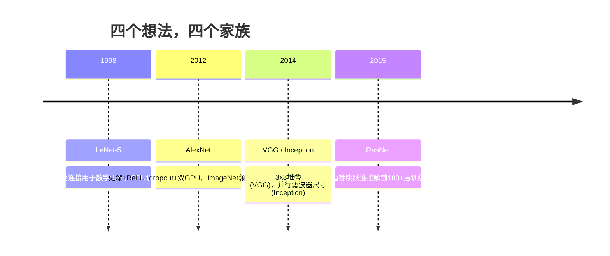
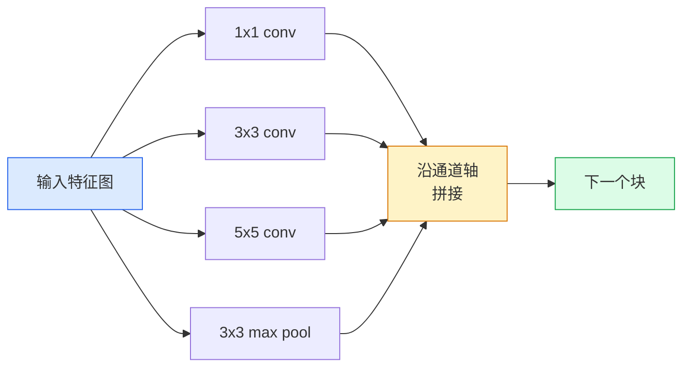
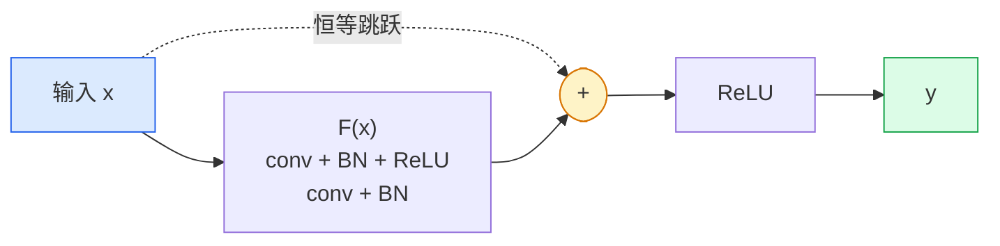

# CNN从LeNet到ResNet

> 过去三十年的每个主要CNN都是相同的卷积-非线性-下采样配方加上一个新想法。按顺序学习这些想法。

**类型:** 学习+构建
**语言:** Python
**前置知识:** Phase 3 Lesson 11 (PyTorch), Phase 4 Lesson 01 (图像基础), Phase 4 Lesson 02 (卷积从零实现)
**时间:** 约75分钟

## 学习目标

- 追溯架构谱系 LeNet-5 -> AlexNet -> VGG -> Inception -> ResNet，并陈述每个家族贡献的单一新想法
- 在PyTorch中实现LeNet-5、VGG风格的块和ResNet BasicBlock，每个不超过40行
- 解释为什么残差连接将1000层网络从不可训练变为最先进
- 阅读现代骨干网络（ResNet-18、ResNet-50）并在查看源码之前预测其输出形状、感受野和参数量

## 问题所在

2011年，最好的ImageNet分类器得分约74% top-5准确率。2012年AlexNet得分85%。2015年ResNet得分96%。没有新数据。没有新GPU代际。收益来自架构想法。一个工作的视觉工程师必须知道哪个想法来自哪篇论文，因为你在2026年发布的每个生产骨干都是那些相同片段的重组——而且因为这些想法持续迁移：分组卷积从CNN到了transformer，残差连接从ResNet到了每个存在的LLM，批归一化存在于扩散模型中。

按顺序学习这些网络也使你免受一个常见错误：在LeNet大小的网络就能解决问题时去使用最大的可用模型。MNIST不需要ResNet。了解每个家族的缩放曲线告诉你应该坐在哪里。

## 核心概念

### 改变视觉的四个想法



经典视觉中没有其他东西像这四个跳跃一样重要。

### LeNet-5 (1998)

Yann LeCun的数字识别器。60,000个参数。两个卷积-池化块，两个全连接层，tanh激活。它定义了每个CNN继承的模板：

```
输入 (1, 32, 32)
  conv 5x5 -> (6, 28, 28)
  avg pool 2x2 -> (6, 14, 14)
  conv 5x5 -> (16, 10, 10)
  avg pool 2x2 -> (16, 5, 5)
  flatten -> 400
  dense -> 120
  dense -> 84
  dense -> 10
```

现代世界称之为CNN的一切——交替的卷积和下采样馈入小型分类器头——就是有更多层、更大通道和更好激活的LeNet。

### AlexNet (2012)

三个一起打破ImageNet的变化：

1. **ReLU**替代tanh。梯度停止消失。训练速度提高六倍。
2. **Dropout**在全连接头中。正则化变成了一层，不是技巧。
3. **深度和宽度**。五个卷积层，三个全连接层，60M参数，在两个GPU上训练，模型跨GPU分割。

论文的图2仍然显示GPU分割为两条并行流。那种并行性是硬件权宜之计，不是架构洞见——但上面的三个想法仍然在你使用的每个模型中。

### VGG (2014)

VGG问：如果只使用3x3卷积并加深会怎样？

```
堆叠:   conv 3x3 -> conv 3x3 -> pool 2x2
重复:   16 或 19 个卷积层
```

两个3x3卷积看到与一个5x5卷积相同的5x5输入区域，但参数更少（2*9*C^2 = 18C^2 vs 25\*C^2），中间多一个ReLU。VGG将这个观察变成了整个架构。简单性——一种块类型，重复——使其成为之后一切的参考点。

代价：138M参数，训练慢，推理昂贵。

### Inception (2014，同一年)

Google对"我应该用什么核尺寸？"的回答是：全部，并行。



每个分支专门化——1x1用于通道混合，3x3用于局部纹理，5x5用于更大模式，池化用于平移不变特征——拼接让下一层选择有用的分支。Inception v1在每个分支内部使用1x1卷积作为瓶颈以保持参数量合理。

### 退化问题

到2015年，VGG-19可以工作，VGG-32不行。深度本应帮助，但超过约20层后训练和测试损失都变差了。那不是过拟合。那是优化器因为梯度通过每层乘性缩小而找不到有用的权重。

```
普通深度网络：
  y = f_L( f_{L-1}( ... f_1(x) ... ) )

对早期层的梯度：
  dL/dW_1 = dL/dy * df_L/df_{L-1} * ... * df_2/df_1 * df_1/dW_1

每个乘性项的幅度大约为 (权重幅度) * (激活增益)。
堆叠100个增益 < 1 的项，梯度实际上为零。
```

VGG在19层可以工作是因为批归一化（同时发表）保持了激活的良好缩放。但即使批归一化也无法拯救超过30层的深度。

### ResNet (2015)

He, Zhang, Ren, Sun提出了一个修复一切的改动：

```
标准块:   y = F(x)
残差块:   y = F(x) + x
```

`+ x`意味着层总是可以选择什么都不做，通过将`F(x)`驱动为零。1000层的ResNet现在最多和1层网络一样差，因为每个额外的块都有一个简单的逃生出口。有了这个保证，优化器愿意让每个块*稍微有用*——稍微有用，堆叠100次，就是最先进。



块的两种变体随处可见：

- **BasicBlock** (ResNet-18, ResNet-34)：两个3x3卷积，跳过两者。
- **Bottleneck** (ResNet-50, -101, -152)：1x1降维，3x3中间，1x1升维，跳过三者。通道数高时更便宜。

当跳跃连接需要跨越下采样（stride=2）时，恒等路径被1x1 stride=2卷积替换以匹配形状。

### 为什么残差在视觉之外也重要

这个想法其实不是关于图像分类的。它是关于将深度网络从"祈祷梯度存活"变成可靠、可扩展的工程工具。你下一阶段将读到的每个transformer在每个块中都有完全相同的跳跃连接。没有ResNet，就没有GPT。

## 构建它

### 步骤1：LeNet-5

一个最小、忠实的LeNet。Tanh激活，平均池化。对现代性的唯一让步是我们下游使用`nn.CrossEntropyLoss`而不是原始的高斯连接。

```python
import torch
import torch.nn as nn
import torch.nn.functional as F

class LeNet5(nn.Module):
    def __init__(self, num_classes=10):
        super().__init__()
        self.conv1 = nn.Conv2d(1, 6, kernel_size=5)
        self.conv2 = nn.Conv2d(6, 16, kernel_size=5)
        self.pool = nn.AvgPool2d(2)
        self.fc1 = nn.Linear(16 * 5 * 5, 120)
        self.fc2 = nn.Linear(120, 84)
        self.fc3 = nn.Linear(84, num_classes)

    def forward(self, x):
        x = self.pool(torch.tanh(self.conv1(x)))
        x = self.pool(torch.tanh(self.conv2(x)))
        x = torch.flatten(x, 1)
        x = torch.tanh(self.fc1(x))
        x = torch.tanh(self.fc2(x))
        return self.fc3(x)

net = LeNet5()
x = torch.randn(1, 1, 32, 32)
print(f"output: {net(x).shape}")
print(f"params: {sum(p.numel() for p in net.parameters()):,}")
```

预期输出：`output: torch.Size([1, 10])`，`params: 61,706`。这就是启动现代视觉的整个数字分类器。

### 步骤2：VGG块

一个可复用的块：两个3x3卷积，ReLU，批归一化，最大池化。

```python
class VGGBlock(nn.Module):
    def __init__(self, in_c, out_c):
        super().__init__()
        self.conv1 = nn.Conv2d(in_c, out_c, kernel_size=3, padding=1)
        self.bn1 = nn.BatchNorm2d(out_c)
        self.conv2 = nn.Conv2d(out_c, out_c, kernel_size=3, padding=1)
        self.bn2 = nn.BatchNorm2d(out_c)
        self.pool = nn.MaxPool2d(2)

    def forward(self, x):
        x = F.relu(self.bn1(self.conv1(x)))
        x = F.relu(self.bn2(self.conv2(x)))
        return self.pool(x)

class MiniVGG(nn.Module):
    def __init__(self, num_classes=10):
        super().__init__()
        self.stack = nn.Sequential(
            VGGBlock(3, 32),
            VGGBlock(32, 64),
            VGGBlock(64, 128),
        )
        self.head = nn.Sequential(
            nn.AdaptiveAvgPool2d(1),
            nn.Flatten(),
            nn.Linear(128, num_classes),
        )

    def forward(self, x):
        return self.head(self.stack(x))

net = MiniVGG()
x = torch.randn(1, 3, 32, 32)
print(f"output: {net(x).shape}")
print(f"params: {sum(p.numel() for p in net.parameters()):,}")
```

CIFAR尺寸输入上的三个VGG块，自适应池化，一个线性层。约290k参数。CIFAR-10足够了。

### 步骤3：ResNet BasicBlock

ResNet-18和ResNet-34的核心构建块。

```python
class BasicBlock(nn.Module):
    def __init__(self, in_c, out_c, stride=1):
        super().__init__()
        self.conv1 = nn.Conv2d(in_c, out_c, kernel_size=3, stride=stride, padding=1, bias=False)
        self.bn1 = nn.BatchNorm2d(out_c)
        self.conv2 = nn.Conv2d(out_c, out_c, kernel_size=3, stride=1, padding=1, bias=False)
        self.bn2 = nn.BatchNorm2d(out_c)
        if stride != 1 or in_c != out_c:
            self.shortcut = nn.Sequential(
                nn.Conv2d(in_c, out_c, kernel_size=1, stride=stride, bias=False),
                nn.BatchNorm2d(out_c),
            )
        else:
            self.shortcut = nn.Identity()

    def forward(self, x):
        out = F.relu(self.bn1(self.conv1(x)))
        out = self.bn2(self.conv2(out))
        out = out + self.shortcut(x)
        return F.relu(out)
```

卷积层上`bias=False`是批归一化的约定——BN的beta参数已经处理了偏置，所以同时携带卷积偏置是浪费。`shortcut`只在步幅或通道数变化时需要真正的卷积；否则它是无操作的恒等。

### 步骤4：一个微型ResNet

堆叠四组BasicBlock以获得CIFAR尺寸输入的工作ResNet。

```python
class TinyResNet(nn.Module):
    def __init__(self, num_classes=10):
        super().__init__()
        self.stem = nn.Sequential(
            nn.Conv2d(3, 32, kernel_size=3, stride=1, padding=1, bias=False),
            nn.BatchNorm2d(32),
            nn.ReLU(inplace=True),
        )
        self.layer1 = self._make_group(32, 32, num_blocks=2, stride=1)
        self.layer2 = self._make_group(32, 64, num_blocks=2, stride=2)
        self.layer3 = self._make_group(64, 128, num_blocks=2, stride=2)
        self.layer4 = self._make_group(128, 256, num_blocks=2, stride=2)
        self.head = nn.Sequential(
            nn.AdaptiveAvgPool2d(1),
            nn.Flatten(),
            nn.Linear(256, num_classes),
        )

    def _make_group(self, in_c, out_c, num_blocks, stride):
        blocks = [BasicBlock(in_c, out_c, stride=stride)]
        for _ in range(num_blocks - 1):
            blocks.append(BasicBlock(out_c, out_c, stride=1))
        return nn.Sequential(*blocks)

    def forward(self, x):
        x = self.stem(x)
        x = self.layer1(x)
        x = self.layer2(x)
        x = self.layer3(x)
        x = self.layer4(x)
        return self.head(x)

net = TinyResNet()
x = torch.randn(1, 3, 32, 32)
print(f"output: {net(x).shape}")
print(f"params: {sum(p.numel() for p in net.parameters()):,}")
```

四组，每组两个块。第2、3、4组开始处步幅为2。每次下采样通道数翻倍。约2.8M参数。这是可以干净扩展到ResNet-152的标准配方。

### 步骤5：比较参数到特征效率

将相同输入通过所有三个网络并比较参数量。

```python
def summary(name, net, x):
    y = net(x)
    params = sum(p.numel() for p in net.parameters())
    print(f"{name:12s}  input {tuple(x.shape)} -> output {tuple(y.shape)}  params {params:>10,}")

x = torch.randn(1, 3, 32, 32)
summary("LeNet5",     LeNet5(),       torch.randn(1, 1, 32, 32))
summary("MiniVGG",    MiniVGG(),      x)
summary("TinyResNet", TinyResNet(),   x)
```

三个模型，三个时代，参数量三个数量级。对于CIFAR-10准确率，你大约需要：LeNet 60%，MiniVGG 89%，TinyResNet 93%（几个epoch训练后）。

## 使用它

`torchvision.models`给你所有上述的预训练版本。调用签名在家族间完全相同，这正是骨干抽象的意义。

```python
from torchvision.models import resnet18, ResNet18_Weights, vgg16, VGG16_Weights

r18 = resnet18(weights=ResNet18_Weights.IMAGENET1K_V1)
r18.eval()

print(f"ResNet-18 params: {sum(p.numel() for p in r18.parameters()):,}")
print(r18.layer1[0])
print()

v16 = vgg16(weights=VGG16_Weights.IMAGENET1K_V1)
v16.eval()
print(f"VGG-16   params: {sum(p.numel() for p in v16.parameters()):,}")
```

ResNet-18有11.7M参数。VGG-16有138M。相似的ImageNet top-1准确率（69.8% vs 71.6%）。残差连接给你12倍的参数效率优势。这就是ResNet变体从2016年主导到2021年ViT出现的原因——并且仍然主导计算是约束的现实世界部署。

对于迁移学习，方案总是一样的：加载预训练，冻结骨干，替换分类器头。

```python
for p in r18.parameters():
    p.requires_grad = False
r18.fc = nn.Linear(r18.fc.in_features, 10)
```

三行。你现在有一个10类CIFAR分类器，继承了ImageNet付费获得的表示。

## 发布它

本课产出：

- `outputs/prompt-backbone-selector.md` — 一个提示，根据任务、数据集大小和计算预算选择正确的CNN家族（LeNet/VGG/ResNet/MobileNet/ConvNeXt）。
- `outputs/skill-residual-block-reviewer.md` — 一个技能，读取PyTorch模块并标记跳跃连接错误（步幅变化时缺少快捷方式、快捷方式激活顺序、BN相对于加法的位置）。

## 练习

1. **(简单)** 逐层手工计算`TinyResNet`的参数量。与`sum(p.numel() for p in net.parameters())`比较。参数预算的大部分花在哪里——卷积、BN还是分类器头？
2. **(中等)** 实现Bottleneck块（1x1 -> 3x3 -> 1x1带跳跃）并用它构建CIFAR的ResNet-50风格网络。与`TinyResNet`比较参数量。
3. **(困难)** 从`BasicBlock`中移除跳跃连接，在CIFAR-10上训练34块的"普通"网络和34块ResNet各10个epoch。绘制两者的训练损失vs epoch。复现He等人图1的结果，其中普通深度网络收敛到比其更浅双胞胎更高的损失。

## 关键术语

| 术语       | 人们怎么说              | 实际含义                                                                              |
| ---------- | ----------------------- | ------------------------------------------------------------------------------------- |
| 骨干       | "模型"                  | 产生馈入任务头的特征图的卷积块堆叠                                                    |
| 残差连接   | "跳跃连接"              | `y = F(x) + x`；让优化器通过将F设为零来学习恒等，使任意深度可训练                     |
| BasicBlock | "两个3x3卷积带跳跃"     | ResNet-18/34的构建块：conv-BN-ReLU-conv-BN-add-ReLU                                   |
| Bottleneck | "1x1降维，3x3，1x1升维" | ResNet-50/101/152的块；通道数高时便宜因为3x3在缩减宽度上运行                          |
| 退化问题   | "更深更差"              | 超过约20个普通卷积层后训练和测试误差都增加；由残差连接解决，而非更多数据              |
| Stem       | "第一层"                | 将3通道输入转换为基础特征宽度的初始卷积；ImageNet通常7x7 stride 2，CIFAR 3x3 stride 1 |
| Head       | "分类器"                | 最终骨干块之后的层：自适应池化、展平、线性层                                          |
| 迁移学习   | "预训练权重"            | 加载在ImageNet上训练的骨干，仅在你的任务上微调头                                      |

## 延伸阅读

- [Deep Residual Learning for Image Recognition (He et al., 2015)](https://arxiv.org/abs/1512.03385) — ResNet论文；每张图都值得研究
- [Very Deep Convolutional Networks (Simonyan & Zisserman, 2014)](https://arxiv.org/abs/1409.1556) — VGG论文；仍然是"为什么3x3"的最佳参考
- [ImageNet Classification with Deep CNNs (Krizhevsky et al., 2012)](https://papers.nips.cc/paper_files/paper/2012/hash/c399862d3b9d6b76c8436e924a68c45b-Abstract.html) — AlexNet；终结手工特征时代的论文
- [Going Deeper with Convolutions (Szegedy et al., 2014)](https://arxiv.org/abs/1409.4842) — Inception v1；仍出现在视觉transformer中的并行滤波器想法
