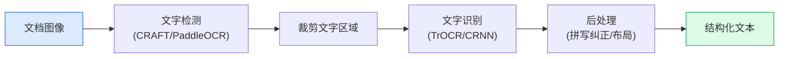

# OCR与文档理解

> OCR将图像中的文字转换为机器可读文本。文档理解在OCR之上添加布局分析和语义理解。

**类型:** 学习+构建
**语言:** Python
**前置知识:** Phase 4 Lesson 07 (U-Net), Phase 4 Lesson 14 (ViT)
**时间:** 约60分钟

## 学习目标

- 解释OCR管线：文字检测、文字识别、后处理
- 使用Tesseract和TrOCR进行文字识别
- 理解文档理解：布局分析、表格提取、关键信息抽取
- 使用LayoutLM和Donut进行端到端文档理解

## 问题所在

世界上大部分信息存储在文档中——发票、合同、表格、收据、身份证。这些文档的数字版本是图像，其中的文字不能直接搜索、编辑或分析。OCR（光学字符识别）将这些图像中的文字转换为机器可读文本。

传统OCR（Tesseract）在印刷体上工作良好，但在手写体、复杂布局、低质量扫描上表现差。现代OCR使用深度学习（TrOCR、PaddleOCR）显著提升了鲁棒性。文档理解更进一步：不仅识别文字，还理解文档结构（标题、段落、表格）和语义（发票号、日期、金额）。

## 核心概念

### OCR管线



### 文字检测

定位图像中的文字区域：

- **CRAFT** — 检测字符级别的区域，适合弯曲文字
- **PaddleOCR DB** — 可微二值化，快速且准确
- **EAST** — 任意方向文字检测

### 文字识别

将裁剪的文字图像转换为文本：

- **CRNN** — CNN特征提取 + LSTM序列建模 + CTC解码
- **TrOCR** — Transformer编码器（ViT）+ Transformer解码器，最先进
- **PaddleOCR SVTR** — 纯Transformer，快速

### 文档理解

超越OCR，理解文档结构：

- **LayoutLM** — 在文本、布局和图像上进行多模态预训练
- **LayoutLMv3** — 统一文本、图像和布局
- **Donut** — 端到端文档理解，无需OCR
- **Nougat** — 学术文档解析，输出Markdown

## 构建它

### 步骤1：使用Tesseract

```python
import pytesseract
from PIL import Image

image = Image.open("document.png")
text = pytesseract.image_to_string(image, lang="chi_sim+eng")
print(text)
```

### 步骤2：使用TrOCR

```python
from transformers import TrOCRProcessor, VisionEncoderDecoderModel

processor = TrOCRProcessor.from_pretrained("microsoft/trocr-base-handwritten")
model = VisionEncoderDecoderModel.from_pretrained("microsoft/trocr-base-handwritten")

image = Image.open("handwriting.png").convert("RGB")
pixel_values = processor(image, return_tensors="pt").pixel_values
generated = model.generate(pixel_values)
text = processor.batch_decode(generated, skip_special_tokens=True)[0]
```

## 使用它

生产OCR选择：

- **Tesseract** — 印刷体，免费，多语言
- **PaddleOCR** — 中文最佳，端到端
- **TrOCR** — 手写体最佳
- **Donut** — 端到端文档理解

## 发布它

本课产出：

- `outputs/prompt-ocr-pipeline-picker.md` — 一个提示，根据文档类型和质量选择OCR方案。
- `outputs/skill-document-layout-analyzer.md` — 一个技能，分析文档布局并提取结构化信息。

## 练习

1. **(简单)** 用Tesseract和TrOCR分别识别同一文档，比较结果。
2. **(中等)** 构建发票信息提取管线：OCR + 正则表达式提取发票号、日期、金额。
3. **(困难)** 微调Donut在自定义文档格式上进行关键信息抽取。

## 关键术语

| 术语     | 人们怎么说   | 实际含义                               |
| -------- | ------------ | -------------------------------------- |
| OCR      | "文字识别"   | 光学字符识别，将图像中的文字转换为文本 |
| 文字检测 | "找文字在哪" | 定位图像中的文字区域                   |
| 文字识别 | "读文字内容" | 将文字图像转换为文本                   |
| 文档理解 | "理解文档"   | 不仅识别文字，还理解布局和语义         |
| CTC      | "序列对齐"   | 连接时序分类，处理变长序列的对齐问题   |

## 延伸阅读

- [TrOCR (Li et al., 2022)](https://arxiv.org/abs/2109.10282) — Transformer OCR
- [PaddleOCR](https://github.com/PaddlePaddle/PaddleOCR) — 中文OCR最佳实践
- [Donut (Kim et al., 2022)](https://arxiv.org/abs/2111.15664) — 端到端文档理解
