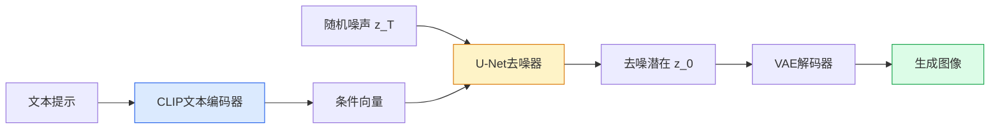

# StableDiffusion

> Stable Diffusion在潜在空间而非像素空间中运行扩散，使高质量图像生成在消费级GPU上可行。

**类型:** 学习+构建
**语言:** Python
**前置知识:** Phase 4 Lesson 10 (Diffusion基础)
**时间:** 约75分钟

## 学习目标

- 解释潜在扩散模型（LDM）架构：VAE编码器、U-Net去噪器、CLIP文本编码器、VAE解码器
- 理解为什么在潜在空间而非像素空间运行扩散节省10-100倍计算
- 使用HuggingFace Diffusers进行文本到图像生成、图像到图像翻译和inpainting
- 应用classifier-free guidance和负面提示控制生成质量

## 问题所在

DDPM在像素空间运行扩散。512x512 RGB图像有786,432个维度。每步去噪需要处理这个巨大的张量，1000步意味着1000次前向传播。在2020年，生成一张512x512图像需要几分钟和高端GPU。

Stable Diffusion（Rombach et al., 2022）的关键洞察：不需要在像素空间做扩散。先用VAE将图像编码到低维潜在空间（64x64x4而非512x512x3），在潜在空间运行扩散，最后用VAE解码回像素空间。计算量减少约48倍，使512x512图像生成在消费级GPU上实时可行。

Stable Diffusion还引入了CLIP文本条件——用预训练的CLIP文本编码器将文本提示转换为条件向量——使文本到图像生成成为可能。这个组合（潜在空间 + 文本条件 + 开源权重）引发了2022-2023年的AI图像生成革命。

## 核心概念

### 潜在扩散架构



四个组件，每个都有明确职责：

1. **VAE编码器** — 将512x512x3图像压缩到64x64x4潜在空间（48倍压缩）
2. **CLIP文本编码器** — 将文本提示转换为77x768条件向量
3. **U-Net去噪器** — 在潜在空间运行扩散，以文本条件为引导
4. **VAE解码器** — 将64x64x4潜在表示解码回512x512x3图像

### 为什么潜在空间有效

VAE学习了一个信息密集的潜在表示。64x64x4 = 16,384维足以重建512x512x3 = 786,432维图像，因为自然图像高度结构化——大部分像素信息是冗余的。潜在空间丢弃了高频噪声但保留了语义内容，这正是扩散需要操作的东西。

```
像素空间扩散:
  每步处理: 512 x 512 x 3 = 786,432 值
  1000步 x 786K = 巨大计算量

潜在空间扩散:
  每步处理: 64 x 64 x 4 = 16,384 值
  50步 x 16K = 可在消费级GPU上运行
```

48倍空间压缩乘以20步减少（1000到50）= 约1000倍总计算节省。

### CLIP文本条件

CLIP文本编码器将文本提示转换为条件向量，注入U-Net的每一层：

```
"a cat sitting on a windowsill"
  |
  v
CLIP文本编码器 (ViT-L/14)
  |
  v
77个token x 768维 = 条件向量
  |
  v
交叉注意力注入U-Net每一层
```

交叉注意力让U-Net在去噪时"看到"文本提示。每个空间位置可以关注文本的不同部分——左上角关注"cat"，右下角关注"windowsill"。

### Classifier-Free Guidance (CFG)

CFG是控制生成质量-多样性权衡的关键技术：

```
训练时: 10%概率丢弃文本条件（用空字符串替代）
推理时:
  epsilon_cond = model(x_t, t, text)      # 有条件预测
  epsilon_uncond = model(x_t, t, "")      # 无条件预测
  epsilon_guided = epsilon_uncond + s * (epsilon_cond - epsilon_uncond)

  s = guidance_scale (通常7.5)
```

guidance_scale控制模型多大程度遵循文本提示：

- s = 1：不引导，多样性高但可能不遵循提示
- s = 7.5：标准值，质量和遵循度的良好平衡
- s = 15+：强烈遵循提示，但图像可能过度饱和/不自然

### 负面提示

在CFG基础上，负面提示让你指定"不想要什么"：

```
正面提示: "a beautiful landscape"
负面提示: "blurry, low quality, watermark"

epsilon_pos = model(x_t, t, positive)
epsilon_neg = model(x_t, t, negative)
epsilon_uncond = model(x_t, t, "")

epsilon_final = epsilon_uncond + s_pos * (epsilon_pos - epsilon_uncond) - s_neg * (epsilon_neg - epsilon_uncond)
```

### 采样器

Stable Diffusion支持多种采样器，速度-质量权衡不同：

| 采样器    | 步数 | 质量 | 速度 | 备注           |
| --------- | ---- | ---- | ---- | -------------- |
| DDPM      | 1000 | 高   | 慢   | 原始方法       |
| DDIM      | 50   | 高   | 中   | 确定性         |
| Euler     | 20   | 好   | 快   | 简单ODE求解器  |
| Euler a   | 20   | 好   | 快   | 带各向异性噪声 |
| DPM++ 2M  | 20   | 高   | 快   | 2026年最常用   |
| DPM++ SDE | 10   | 高   | 中   | 高质量少步     |
| UniPC     | 10   | 好   | 快   | 统一预测校正   |

DPM++ 2M Karras是2026年社区默认采样器。

### SD版本演进

| 版本   | 年份 | 分辨率    | 关键改进               |
| ------ | ---- | --------- | ---------------------- |
| SD 1.4 | 2022 | 512x512   | 首个开源版本           |
| SD 1.5 | 2022 | 512x512   | 最广泛微调的基础       |
| SD 2.1 | 2022 | 768x768   | 更大分辨率，OpenCLIP   |
| SDXL   | 2023 | 1024x1024 | 双文本编码器，精炼器   |
| SD3    | 2024 | 1024x1024 | MMDiT，整流流          |
| SD3.5  | 2024 | 1024x1024 | 更大模型，更好文本渲染 |

## 构建它

### 步骤1：使用Diffusers加载SD管线

```python
from diffusers import StableDiffusionPipeline
import torch

pipe = StableDiffusionPipeline.from_pretrained(
    "runwayml/stable-diffusion-v1-5",
    torch_dtype=torch.float16,
).to("cuda")

image = pipe(
    "a photograph of an astronaut riding a horse on mars",
    num_inference_steps=20,
    guidance_scale=7.5,
).images[0]
image.save("astronaut.png")
```

三行代码生成图像。`num_inference_steps=20`使用DPM++采样器，`guidance_scale=7.5`是标准CFG值。

### 步骤2：探索管线组件

```python
print(f"VAE: {type(pipe.vae).__name__}")
print(f"UNet: {type(pipe.unet).__name__}")
print(f"Text encoder: {type(pipe.text_encoder).__name__}")
print(f"Tokenizer: {type(pipe.tokenizer).__name__}")

# 检查潜在空间尺寸
print(f"VAE latent channels: {pipe.vae.config.latent_channels}")
print(f"VAE scaling factor: {pipe.vae.config.scaling_factor}")
```

VAE将512x512x3压缩到64x64x4。scaling_factor将潜在值归一化到约[-1, 1]范围。

### 步骤3：手动实现CFG采样

```python
@torch.no_grad()
def custom_sample(pipe, prompt, negative_prompt="", steps=20, guidance_scale=7.5):
    # 编码文本
    text_inputs = pipe.tokenizer(prompt, return_tensors="pt").to("cuda")
    text_emb = pipe.text_encoder(**text_inputs).last_hidden_state

    uncond_inputs = pipe.tokenizer(negative_prompt, return_tensors="pt").to("cuda")
    uncond_emb = pipe.text_encoder(**uncond_inputs).last_hidden_state

    text_embeddings = torch.cat([uncond_emb, text_emb])

    # 初始化噪声
    latents = torch.randn(1, 4, 64, 64, device="cuda")
    latents = latents * pipe.scheduler.init_noise_sigma

    pipe.scheduler.set_timesteps(steps)

    for t in pipe.scheduler.timesteps:
        latent_input = torch.cat([latents] * 2)
        noise_pred = pipe.unet(latent_input, t, encoder_hidden_states=text_embeddings).sample

        noise_uncond, noise_cond = noise_pred.chunk(2)
        noise_guided = noise_uncond + guidance_scale * (noise_cond - noise_uncond)

        latents = pipe.scheduler.step(noise_guided, t, latents).prev_sample

    # 解码
    latents = latents / pipe.vae.config.scaling_factor
    image = pipe.vae.decode(latents).sample
    return image
```

### 步骤4：图像到图像翻译

```python
from diffusers import StableDiffusionImg2ImgPipeline
from PIL import Image

pipe_img2img = StableDiffusionImg2ImgPipeline.from_pretrained(
    "runwayml/stable-diffusion-v1-5",
    torch_dtype=torch.float16,
).to("cuda")

init_image = Image.open("sketch.png").resize((512, 512))

image = pipe_img2img(
    prompt="a detailed oil painting of a mountain landscape",
    image=init_image,
    strength=0.7,  # 0=保持原图，1=完全重绘
    num_inference_steps=20,
).images[0]
```

`strength`控制保留多少原始图像。0.3-0.5用于微调，0.7-0.9用于大幅修改。

### 步骤5：Inpainting

```python
from diffusers import StableDiffusionInpaintPipeline

pipe_inpaint = StableDiffusionInpaintPipeline.from_pretrained(
    "runwayml/stable-diffusion-inpainting",
    torch_dtype=torch.float16,
).to("cuda")

image = Image.open("photo.png").resize((512, 512))
mask = Image.open("mask.png").resize((512, 512))  # 白色=重绘区域

result = pipe_inpaint(
    prompt="a fluffy cat",
    image=image,
    mask_image=mask,
    num_inference_steps=20,
).images[0]
```

## 使用它

2026年生产Stable Diffusion使用模式：

- **SDXL + DPM++ 2M Karras** — 标准高质量生成
- **SD3 + 28步整流流** — 最新质量，更好文本渲染
- **LCM-LoRA** — 4步快速生成，实时应用
- **ControlNet** — 精确空间控制（边缘、深度、姿态）
- **IP-Adapter** — 图像作为条件，风格迁移

## 发布它

本课产出：

- `outputs/prompt-sd-pipeline-builder.md` — 一个提示，根据需求构建SD管线（采样器、CFG、步数、ControlNet）。
- `outputs/skill-sd-sampler-tuner.md` — 一个技能，调整采样参数以在质量和速度之间找到最佳平衡。

## 练习

1. **(简单)** 用SD 1.5生成10张图像，guidance_scale从3到15。比较图像质量和提示遵循度。
2. **(中等)** 实现图像到图像翻译：将素描转换为油画风格。测试不同strength值（0.3, 0.5, 0.7, 0.9）并比较结果。
3. **(困难)** 使用ControlNet Canny边缘条件：输入图像提取边缘，用边缘+文本提示生成新图像。比较有和没有ControlNet的生成精度。

## 关键术语

| 术语       | 人们怎么说       | 实际含义                                                         |
| ---------- | ---------------- | ---------------------------------------------------------------- |
| 潜在扩散   | "压缩空间扩散"   | 在VAE潜在空间而非像素空间运行扩散，48倍计算节省                  |
| VAE        | "压缩器"         | 变分自编码器；将图像编码到低维潜在空间并解码回来                 |
| CLIP条件   | "文本引导"       | 用CLIP文本编码器将文本提示注入U-Net的交叉注意力层                |
| CFG        | "guidance scale" | Classifier-Free Guidance；混合有条件和无条件预测以控制提示遵循度 |
| 负面提示   | "不想要什么"     | 指定要从生成中移除的属性                                         |
| 潜在空间   | "压缩表示"       | VAE编码的低维空间（64x64x4），扩散在此运行                       |
| 采样器     | "去噪算法"       | 从噪声到图像的数值积分方法（DDIM、DPM++、Euler等）               |
| ControlNet | "空间控制"       | 额外网络提供精确空间条件（边缘、深度、姿态）                     |

## 延伸阅读

- [High-Resolution Image Synthesis with Latent Diffusion Models (Rombach et al., 2022)](https://arxiv.org/abs/2112.10752) — SD原始论文
- [HuggingFace Diffusers 文档](https://huggingface.co/docs/diffusers) — 生产扩散模型库
- [Stable Diffusion Wiki](https://stable-diffusion-art.com/) — 社区最佳实践
- [Classifier-Free Guidance (Ho & Salimans, 2022)](https://arxiv.org/abs/2207.12598) — CFG原始论文
