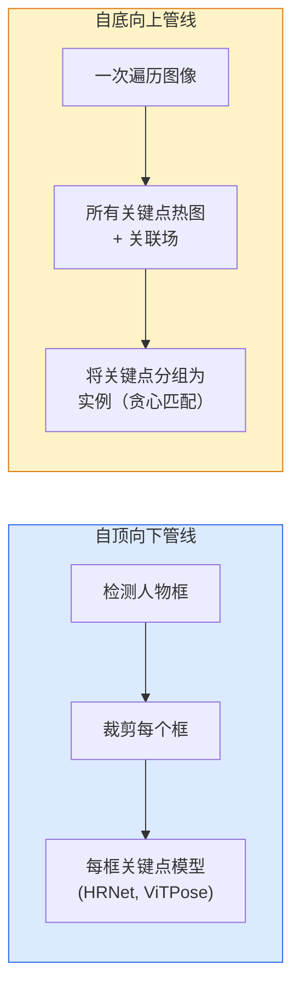

# 关键点与姿态

> 姿态是一组有序的关键点。关键点检测器是热图回归器。其他都是簿记。

**类型:** 构建
**语言:** Python
**前置知识:** Phase 4 Lesson 06 (检测), Phase 4 Lesson 07 (U-Net)
**时间:** 约45分钟

## 学习目标

- 区分自顶向下和自底向上姿态估计，并说明各自使用场景
- 用高斯热图目标回归K个关键点，并在推理时提取关键点坐标
- 解释Part Affinity Fields (PAFs)以及自底向上管线如何将关键点关联到实例
- 使用MediaPipe Pose或MMPose进行生产关键点估计

## 问题所在

关键点任务隐藏在许多名称下：人体姿态（17个身体关节）、人脸关键点（68或478个点）、手部（21个点）、动物姿态、机器人物体姿态、医学解剖关键点。每一个都共享相同结构：检测物体上的K个离散点并输出它们的(x, y)坐标。

姿态估计是动作捕捉、健身应用、运动分析、手势控制、动画、AR试穿和机器人抓取的基础。2D情况已经成熟；3D姿态（从单相机估计世界坐标中的关节位置）是当前研究前沿。

工程问题是规模。单图像单人的姿态是20ms的问题。30fps下人群中的多人姿态是具有不同架构的不同问题。

## 核心概念

### 自顶向下 vs 自底向上



- **自顶向下** — 先检测人，然后对每个裁剪运行每人关键点模型。最高准确率；随人数线性扩展。
- **自底向上** — 一次前向传播预测所有关键点加关联场；分组。与人群规模无关的常数时间。

自顶向下（HRNet, ViTPose）是准确率领导者；自底向上（OpenPose, HigherHRNet）是拥挤场景的吞吐量领导者。

### 热图回归

不直接回归(x, y)，而是预测每个关键点的H x W热图，在真实位置中心有高斯斑点：

```
target[k, y, x] = exp(-((x - cx_k)^2 + (y - cy_k)^2) / (2 sigma^2))
```

推理时，每个热图的argmax是预测的关键点位置。

热图比直接回归效果更好的原因：网络的空间结构（卷积特征图）与空间输出自然对齐。高斯目标也正则化——小的定位误差产生小的损失，而不是零。

### 亚像素定位

Argmax给出整数坐标。亚像素精度通过在argmax及其邻居上拟合抛物线来细化，或使用众所周知的偏移`(dx, dy) = 0.25 * (heatmap[y, x+1] - heatmap[y, x-1], ...)`方向。

### Part Affinity Fields (PAFs)

OpenPose的自底向上关联技巧。对于每对连接的关键点（如左肩到左肘），预测一个2通道场，编码从一个指向另一个的单位向量。要将肩膀与其肘部关联，沿连接候选对的线积分PAF；积分最高的对匹配。

### COCO关键点

标准身体姿态数据集：每人17个关键点，PCK（正确关键点百分比）和OKS（物体关键点相似度）作为指标。OKS是关键点版的IoU，COCO mAP@OKS报告的就是它。

## 构建它

### 步骤1：高斯热图目标

```python
import numpy as np
import torch

def gaussian_heatmap(size, cx, cy, sigma=2.0):
    yy, xx = np.meshgrid(np.arange(size), np.arange(size), indexing="ij")
    return np.exp(-((xx - cx) ** 2 + (yy - cy) ** 2) / (2 * sigma ** 2)).astype(np.float32)
```

### 步骤2：微型关键点头

```python
import torch.nn as nn

class TinyKeypointNet(nn.Module):
    def __init__(self, num_keypoints=4, base=16):
        super().__init__()
        self.down1 = nn.Sequential(nn.Conv2d(3, base, 3, 2, 1), nn.ReLU(inplace=True))
        self.down2 = nn.Sequential(nn.Conv2d(base, base * 2, 3, 2, 1), nn.ReLU(inplace=True))
        self.mid = nn.Sequential(nn.Conv2d(base * 2, base * 2, 3, 1, 1), nn.ReLU(inplace=True))
        self.up1 = nn.ConvTranspose2d(base * 2, base, 2, 2)
        self.up2 = nn.ConvTranspose2d(base, num_keypoints, 2, 2)

    def forward(self, x):
        h1 = self.down1(x)
        h2 = self.down2(h1)
        h3 = self.mid(h2)
        u1 = self.up1(h3)
        return self.up2(u1)
```

### 步骤3：推理——提取关键点坐标

```python
def heatmap_to_coords(heatmaps):
    N, K, H, W = heatmaps.shape
    hm = heatmaps.reshape(N, K, -1)
    idx = hm.argmax(dim=-1)
    ys = (idx // W).float()
    xs = (idx % W).float()
    return torch.stack([xs, ys], dim=-1)
```

### 步骤4：合成关键点数据集

```python
def make_synthetic_sample(size=64):
    img = np.ones((3, size, size), dtype=np.float32)
    rng = np.random.default_rng()
    kps = rng.integers(8, size - 8, size=(4, 2))
    for cx, cy in kps:
        img[:, cy - 2:cy + 2, cx - 2:cx + 2] = 0.0
    hms = np.stack([gaussian_heatmap(size, cx, cy) for cx, cy in kps])
    return img, hms, kps
```

### 步骤5：训练

```python
model = TinyKeypointNet(num_keypoints=4)
opt = torch.optim.Adam(model.parameters(), lr=3e-3)

for step in range(200):
    batch = [make_synthetic_sample() for _ in range(16)]
    imgs = torch.from_numpy(np.stack([b[0] for b in batch]))
    hms = torch.from_numpy(np.stack([b[1] for b in batch]))
    pred = model(imgs)
    pred = F.interpolate(pred, size=hms.shape[-2:], mode="bilinear", align_corners=False)
    loss = F.mse_loss(pred, hms)
    opt.zero_grad(); loss.backward(); opt.step()
```

## 使用它

- **MediaPipe Pose** — Google的生产姿态估计器；提供WebGL+移动端运行时，亚10ms延迟。
- **MMPose** (OpenMMLab) — 全面的研究代码库；每个SOTA架构都有预训练权重。
- **YOLOv8-pose** — 最快的实时多人姿态，单次前向传播。

## 发布它

本课产出：

- `outputs/prompt-pose-stack-picker.md` — 一个提示，根据延迟、人群规模和2D/3D需求选择姿态方案。
- `outputs/skill-heatmap-to-coords.md` — 一个技能，编写生产姿态模型使用的亚像素热图到坐标转换。

## 练习

1. **(简单)** 在合成4点数据集上训练微型关键点模型。报告200步后预测与真实关键点的平均L2误差。
2. **(中等)** 添加亚像素细化：给定argmax位置，从邻居像素沿x和y拟合1D抛物线。报告与整数argmax相比的精度提升。
3. **(困难)** 构建2人合成数据集，每张图像显示4关键点模式的两个实例。训练带PAF的自底向上管线，预测哪个关键点属于哪个实例，评估OKS。

## 关键术语

| 术语     | 人们怎么说            | 实际含义                                              |
| -------- | --------------------- | ----------------------------------------------------- |
| 关键点   | "一个特征点"          | 物体上的特定有序点（关节、角点、特征）                |
| 姿态     | "骨架"                | 属于一个实例的有序关键点集合                          |
| 自顶向下 | "先检测再姿态"        | 两阶段管线：人物检测器+每裁剪关键点模型；最高准确率   |
| 自底向上 | "先姿态再分组"        | 单次全关键点预测+分组；与人群规模无关的常数时间       |
| 热图     | "高斯目标"            | 每关键点的H x W张量，在真实位置有峰值；首选回归目标   |
| PAF      | "Part Affinity Field" | 编码肢体方向的2通道单位向量场；用于将关键点分组为实例 |
| OKS      | "关键点IoU"           | 物体关键点相似度；COCO的姿态指标                      |
| HRNet    | "高分辨率网络"        | 主导的自顶向下关键点架构；全程保持高分辨率特征        |

## 延伸阅读

- [OpenPose (Cao et al., 2017)](https://arxiv.org/abs/1812.08008) — 带PAF的自底向上方法
- [HRNet (Sun et al., 2019)](https://arxiv.org/abs/1902.09212) — 自顶向下参考架构
- [ViTPose (Xu et al., 2022)](https://arxiv.org/abs/2204.12484) — 纯ViT作为姿态骨干
- [MediaPipe Pose](https://developers.google.com/mediapipe/solutions/vision/pose_landmarker) — 生产实时姿态
