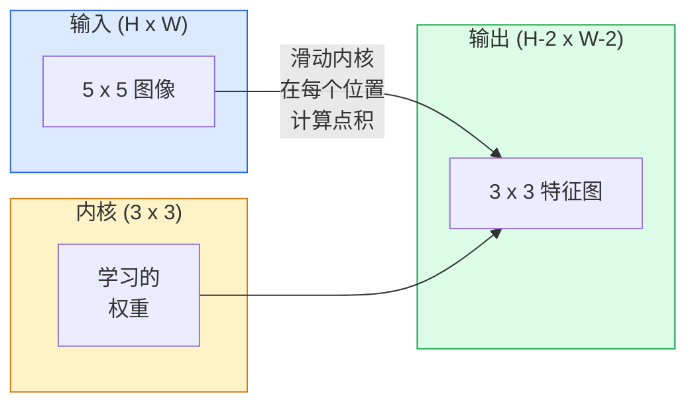
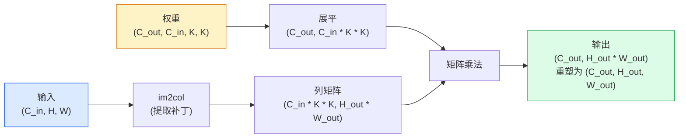

# 卷积从零实现

> 卷积是一个微小的全连接层，你在图像上滑动它，在每个位置共享相同的权重。

**类型:** 构建
**语言:** Python
**前置知识:** Phase 3 (深度学习核心), Phase 4 Lesson 01 (图像基础)
**时间:** 约75分钟

## 学习目标

- 仅使用NumPy从零实现2D卷积，包括嵌套循环版本和向量化的`im2col`版本
- 对任意输入尺寸、核尺寸、填充和步幅组合计算输出空间尺寸，并解释`(H - K + 2P) / S + 1`公式
- 手工设计内核（边缘、模糊、锐化、Sobel）并解释每个内核为何产生其激活模式
- 将卷积堆叠为特征提取器，并将堆叠深度与感受野大小联系起来

## 问题所在

224x224 RGB图像上的全连接层每个神经元需要224 _ 224 _ 3 = 150,528个输入权重。一个1,000个单元的隐藏层已经是1.5亿参数——在你学到任何有用的东西之前。更糟的是，该层没有概念认为左上角的狗和右下角的狗是相同的模式。它将每个像素位置视为独立的，这对图像来说完全错误：将猫平移三个像素不应该迫使网络重新学习这个概念。

图像模型需要的两个属性是**平移等变性**（输入移位时输出也移位）和**参数共享**（相同的特征检测器在所有位置运行）。全连接层两者都不给。卷积免费给你两者。

卷积不是为深度学习发明的。它驱动JPEG压缩、Photoshop中的高斯模糊、工业视觉中的边缘检测，以及有史以来发布的每个音频滤波器。CNN从2012年到2020年主导ImageNet的原因是卷积是邻近值相关且相同模式可出现在任何位置的数据的正确先验。

## 核心概念

### 一个内核，滑动

2D卷积取一个称为内核（或滤波器）的小权重矩阵，在输入上滑动它，并在每个位置计算逐元素乘积之和。该和成为一个输出像素。



5x5输入上的具体3x3示例（无填充，步幅1）：

```
输入 X (5 x 5):                内核 W (3 x 3):

  1  2  0  1  2                   1  0 -1
  0  1  3  1  0                   2  0 -2
  2  1  0  2  1                   1  0 -1
  1  0  2  1  3
  2  1  1  0  1

内核在每个有效的3 x 3窗口上滑动。输出 Y 为 3 x 3：

 Y[0,0] = sum( W * X[0:3, 0:3] )
 Y[0,1] = sum( W * X[0:3, 1:4] )
 Y[0,2] = sum( W * X[0:3, 2:5] )
 Y[1,0] = sum( W * X[1:4, 0:3] )
 ... 以此类推
```

那一个公式——**共享权重、局部性、滑动窗口**——就是整个思想。其他一切都是簿记。

### 输出尺寸公式

给定输入空间尺寸`H`、核尺寸`K`、填充`P`、步幅`S`：

```
H_out = floor( (H - K + 2P) / S ) + 1
```

记住这个。你在每个架构中会计算它几十次。

| 场景               | H   | K   | P   | S   | H_out |
| ------------------ | --- | --- | --- | --- | ----- |
| 有效卷积，无填充   | 32  | 3   | 0   | 1   | 30    |
| 同卷积（保持尺寸） | 32  | 3   | 1   | 1   | 32    |
| 2倍下采样          | 32  | 3   | 1   | 2   | 16    |
| 2x2池化            | 32  | 2   | 0   | 2   | 16    |
| 大感受野           | 32  | 7   | 3   | 2   | 16    |

"相同填充"意味着选择P使得S==1时H_out == H。对于奇数K，即P = (K - 1) / 2。这就是3x3内核占主导的原因——它们是最小的仍有中心的奇数核。

### 填充

没有填充，每次卷积都会缩小特征图。堆叠20个，你的224x224图像变成184x184，这在边界上浪费计算，并使需要匹配形状的残差连接复杂化。

```
零填充 (P = 1) 在 5 x 5 输入上：

  0  0  0  0  0  0  0
  0  1  2  0  1  2  0
  0  0  1  3  1  0  0
  0  2  1  0  2  1  0       现在内核可以居中在像素
  0  1  0  2  1  3  0       (0, 0) 上，仍然有三行和
  0  2  1  1  0  1  0       三列的值可以相乘。
  0  0  0  0  0  0  0
```

实践中遇到的模式：`zero`（最常见），`reflect`（镜像边缘，生成模型中避免硬边界），`replicate`（复制边缘），`circular`（环绕，用于环面问题）。

### 步幅

步幅是滑动的步长。`stride=1`是默认值。`stride=2`将空间维度减半，是CNN内部不用单独池化层进行下采样的经典方式——每个现代架构（ResNet、ConvNeXt、MobileNet）都在某处用步幅卷积代替最大池化。

```
5 x 5 输入上的步幅 1，3 x 3 内核：

  起始位置: (0,0) (0,1) (0,2)        -> 输出行 0
            (1,0) (1,1) (1,2)        -> 输出行 1
            (2,0) (2,1) (2,2)        -> 输出行 2

  输出: 3 x 3

相同输入上的步幅 2：

  起始位置: (0,0) (0,2)              -> 输出行 0
            (2,0) (2,2)              -> 输出行 1

  输出: 2 x 2
```

### 多输入通道

真实图像有三个通道。RGB输入上的3x3卷积实际上是一个3x3x3的体积：每个输入通道一个3x3切片。在每个空间位置，你跨所有三个切片相乘并求和，然后加上偏置。

```
输入:   (C_in,  H,  W)        3 x 5 x 5
内核:   (C_in,  K,  K)        3 x 3 x 3 (一个内核)
输出:   (1,     H', W')       2D 特征图

对于产生 C_out 个输出通道的层，你堆叠 C_out 个内核：

权重:   (C_out, C_in, K, K)   例如 64 x 3 x 3 x 3
输出:   (C_out, H', W')       64 x 3 x 3

参数量: C_out * C_in * K * K + C_out   (+ C_out 是偏置)
```

最后一行是你在规划模型时要计算的。3通道输入上的64通道3x3卷积有`64 * 3 * 3 * 3 + 64 = 1,792`个参数。很便宜。

### im2col技巧

嵌套循环易读但慢。GPU想要大型矩阵乘法。技巧：将输入的每个感受野窗口展平为大矩阵的一列，将内核展平为一行，整个卷积变成一次矩阵乘法。



每个生产卷积实现都是这个的某种变体加上缓存分块技巧（直接卷积、Winograd、大核FFT卷积）。理解im2col你就理解了核心。

### 感受野

单个3x3卷积看9个输入像素。堆叠两个3x3卷积，第二层的神经元看5x5个输入像素。三个3x3卷积给出7x7。一般地：

```
L个堆叠的 K x K 卷积 (步幅1) 之后的 RF = 1 + L * (K - 1)

有步幅时：RF 随每层的步幅乘性增长。
```

"3x3一路到底"（VGG、ResNet、ConvNeXt）有效的全部原因是两个3x3卷积看到与一个5x5卷积相同的输入区域，但参数更少，中间多了一个非线性。

## 构建它

### 步骤1：填充数组

从最小的原语开始：一个在H x W数组周围填充零的函数。

```python
import numpy as np

def pad2d(x, p):
    if p == 0:
        return x
    h, w = x.shape[-2:]
    out = np.zeros(x.shape[:-2] + (h + 2 * p, w + 2 * p), dtype=x.dtype)
    out[..., p:p + h, p:p + w] = x
    return out

x = np.arange(9).reshape(3, 3)
print(x)
print()
print(pad2d(x, 1))
```

尾轴技巧`x.shape[:-2]`意味着同一个函数无需修改就能在`(H, W)`、`(C, H, W)`或`(N, C, H, W)`上工作。

### 步骤2：嵌套循环的2D卷积

参考实现——慢，但毫不含糊。这就是`torch.nn.functional.conv2d`原则上做的事情。

```python
def conv2d_naive(x, w, b=None, stride=1, padding=0):
    c_in, h, w_in = x.shape
    c_out, c_in_w, kh, kw = w.shape
    assert c_in == c_in_w

    x_pad = pad2d(x, padding)
    h_out = (h + 2 * padding - kh) // stride + 1
    w_out = (w_in + 2 * padding - kw) // stride + 1

    out = np.zeros((c_out, h_out, w_out), dtype=np.float32)
    for oc in range(c_out):
        for i in range(h_out):
            for j in range(w_out):
                hs = i * stride
                ws = j * stride
                patch = x_pad[:, hs:hs + kh, ws:ws + kw]
                out[oc, i, j] = np.sum(patch * w[oc])
        if b is not None:
            out[oc] += b[oc]
    return out
```

四个嵌套循环（输出通道、行、列，加上对C_in、kh、kw的隐式求和）。这是你将检查每个更快实现的基准真相。

### 步骤3：用手工设计的内核验证

构建一个垂直Sobel内核，将其应用于合成的阶跃图像，观察垂直边缘亮起。

```python
def synthetic_step_image():
    img = np.zeros((1, 16, 16), dtype=np.float32)
    img[:, :, 8:] = 1.0
    return img

sobel_x = np.array([
    [[-1, 0, 1],
     [-2, 0, 2],
     [-1, 0, 1]]
], dtype=np.float32)[None]

x = synthetic_step_image()
y = conv2d_naive(x, sobel_x, padding=1)
print(y[0].round(1))
```

预期在第7列有大正值（从左到右亮度增加），其他地方为零。那个单次打印就是数学是否正确的健全性检查。

### 步骤4：im2col

将输入中每个核大小的窗口转换为矩阵的一列。对于`C_in=3, K=3`，每列是27个数字。

```python
def im2col(x, kh, kw, stride=1, padding=0):
    c_in, h, w = x.shape
    x_pad = pad2d(x, padding)
    h_out = (h + 2 * padding - kh) // stride + 1
    w_out = (w + 2 * padding - kw) // stride + 1

    cols = np.zeros((c_in * kh * kw, h_out * w_out), dtype=x.dtype)
    col = 0
    for i in range(h_out):
        for j in range(w_out):
            hs = i * stride
            ws = j * stride
            patch = x_pad[:, hs:hs + kh, ws:ws + kw]
            cols[:, col] = patch.reshape(-1)
            col += 1
    return cols, h_out, w_out
```

它仍然是Python循环，但现在繁重的工作将是一次向量化的矩阵乘法。

### 步骤5：通过im2col + matmul的快速卷积

用一次矩阵乘法替换四重循环。

```python
def conv2d_im2col(x, w, b=None, stride=1, padding=0):
    c_out, c_in, kh, kw = w.shape
    cols, h_out, w_out = im2col(x, kh, kw, stride, padding)
    w_flat = w.reshape(c_out, -1)
    out = w_flat @ cols
    if b is not None:
        out += b[:, None]
    return out.reshape(c_out, h_out, w_out)
```

正确性检查：运行两个实现并比较。

```python
rng = np.random.default_rng(0)
x = rng.normal(0, 1, (3, 16, 16)).astype(np.float32)
w = rng.normal(0, 1, (8, 3, 3, 3)).astype(np.float32)
b = rng.normal(0, 1, (8,)).astype(np.float32)

y_naive = conv2d_naive(x, w, b, padding=1)
y_im2col = conv2d_im2col(x, w, b, padding=1)

print(f"max abs diff: {np.max(np.abs(y_naive - y_im2col)):.2e}")
```

`max abs diff`应该在`1e-5`左右——差异是浮点累加顺序，不是bug。

### 步骤6：一组手工设计的内核

五个滤波器展示单个卷积层在训练之前能表达什么。

```python
KERNELS = {
    "identity": np.array([[0, 0, 0], [0, 1, 0], [0, 0, 0]], dtype=np.float32),
    "blur_3x3": np.ones((3, 3), dtype=np.float32) / 9.0,
    "sharpen": np.array([[0, -1, 0], [-1, 5, -1], [0, -1, 0]], dtype=np.float32),
    "sobel_x": np.array([[-1, 0, 1], [-2, 0, 2], [-1, 0, 1]], dtype=np.float32),
    "sobel_y": np.array([[-1, -2, -1], [0, 0, 0], [1, 2, 1]], dtype=np.float32),
}

def apply_kernel(img2d, kernel):
    x = img2d[None].astype(np.float32)
    w = kernel[None, None]
    return conv2d_im2col(x, w, padding=1)[0]
```

应用于任何灰度图像，模糊使图像柔和，锐化使边缘清晰，Sobel-x点亮垂直边缘，Sobel-y点亮水平边缘。这些正是AlexNet和VGG中第一个训练的卷积层最终学到的模式——因为一个好的图像模型无论后续任务是什么都需要边缘和斑点检测器。

## 使用它

PyTorch的`nn.Conv2d`用autograd、CUDA内核和cuDNN优化封装了相同的操作。形状语义完全相同。

```python
import torch
import torch.nn as nn

conv = nn.Conv2d(in_channels=3, out_channels=64, kernel_size=3, stride=1, padding=1)
print(conv)
print(f"weight shape: {tuple(conv.weight.shape)}   # (C_out, C_in, K, K)")
print(f"bias shape:   {tuple(conv.bias.shape)}")
print(f"param count:  {sum(p.numel() for p in conv.parameters())}")

x = torch.randn(8, 3, 224, 224)
y = conv(x)
print(f"\ninput  shape: {tuple(x.shape)}")
print(f"output shape: {tuple(y.shape)}")
```

将`padding=1`换成`padding=0`，输出降到222x222。将`stride=1`换成`stride=2`，降到112x112。同样的公式。

## 发布它

本课产出：

- `outputs/prompt-cnn-architect.md` — 一个提示，给定输入尺寸、参数预算和目标感受野，设计一栈具有正确K/S/P的`Conv2d`层。
- `outputs/skill-conv-shape-calculator.md` — 一个技能，逐层遍历网络规格并返回每块的输出形状、感受野和参数量。

## 练习

1. **(简单)** 给定128x128灰度输入和`[Conv3x3(s=1,p=1), Conv3x3(s=2,p=1), Conv3x3(s=1,p=1), Conv3x3(s=2,p=1)]`的堆叠，手工计算每层的输出空间尺寸和感受野。用PyTorch的`nn.Sequential`虚拟卷积验证。
2. **(中等)** 扩展`conv2d_naive`和`conv2d_im2col`以接受`groups`参数。展示`groups=C_in=C_out`复现了深度卷积，其参数量为`C * K * K`而非`C * C * K * K`。
3. **(困难)** 手动实现`conv2d_im2col`的反向传播：给定输出的梯度，计算`x`和`w`的梯度。对相同输入和权重用`torch.autograd.grad`验证。技巧：im2col的梯度是`col2im`，它需要累加重叠窗口。

## 关键术语

| 术语        | 人们怎么说       | 实际含义                                                                                |
| ----------- | ---------------- | --------------------------------------------------------------------------------------- |
| 卷积        | "滑动滤波器"     | 在每个空间位置应用共享权重的可学习点积；数学上是互相关，但所有人都叫它卷积              |
| 内核/滤波器 | "特征检测器"     | 形状为(C_in, K, K)的小权重张量，其与输入窗口的点积产生一个输出像素                      |
| 步幅        | "跳多远"         | 连续内核放置之间的步长；步幅2将每个空间维度减半                                         |
| 填充        | "边缘补零"       | 在输入周围添加额外值使内核能居中在边界像素上；`same`填充保持输出尺寸等于输入尺寸        |
| 感受野      | "神经元看到多少" | 给定输出激活所依赖的原始输入区域，随深度和步幅增长                                      |
| im2col      | "GEMM技巧"       | 将每个感受野窗口重排为列，使卷积变成一次大矩阵乘法——每个快速卷积内核的核心              |
| 深度卷积    | "每通道一个内核" | `groups == C_in`的卷积，每个输出通道仅从其匹配的输入通道计算；MobileNet和ConvNeXt的骨干 |
| 平移等变性  | "移入移出"       | 输入平移k像素则输出平移k像素的属性；共享权重自带                                        |

## 延伸阅读

- [A guide to convolution arithmetic for deep learning (Dumoulin & Visin, 2016)](https://arxiv.org/abs/1603.07285) — 填充/步幅/膨胀的权威图解，每门课程都在悄悄复制
- [CS231n: Convolutional Neural Networks for Visual Recognition](https://cs231n.github.io/convolutional-networks/) — 经典讲义，包含原始im2col解释
- [The Annotated ConvNet (fast.ai)](https://nbviewer.org/github/fastai/fastbook/blob/master/13_convolutions.ipynb) — 从手动卷积到训练好的数字分类器的笔记本
- [Receptive Field Arithmetic for CNNs (Dang Ha The Hien)](https://distill.pub/2019/computing-receptive-fields/) — 论文质量的感受野计算交互式解释器
