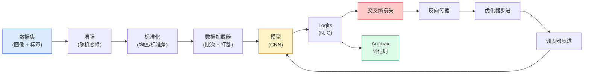

# 图像分类

> 分类器是从像素到类别概率分布的函数。其他都是管道工程。

**类型:** 构建
**语言:** Python
**前置知识:** Phase 2 Lesson 09 (模型评估), Phase 3 Lesson 10 (迷你框架), Phase 4 Lesson 03 (CNN)
**时间:** 约75分钟

## 学习目标

- 在CIFAR-10上构建端到端图像分类管线：数据集、增强、模型、训练循环、评估
- 解释每个组件（数据加载器、损失、优化器、调度器、增强）的作用，并预测破坏其中任何一个如何在损失曲线上表现
- 从零实现mixup、cutout和标签平滑，并说明何时值得添加每个
- 读取混淆矩阵和每类精确率/召回率表，以诊断超出总体准确率的数据集和模型问题

## 问题所在

每个发布的视觉任务在某种程度上都归结为图像分类。检测分类区域。分割分类像素。检索按与类别中心的相似度排序。把分类做对——数据集循环、增强策略、损失、评估——是迁移到本阶段其他每个任务的技能。

大多数分类bug不在模型中。它们存在于管线中：损坏的归一化、未打乱的训练集、扭曲标签的增强、被训练数据污染的验证集、在第30个epoch后静默发散的学习率。一个在正确设置下能达到93% CIFAR-10准确率的CNN，在损坏的设置下通常只有70-75%，而损失曲线看起来一直很正常。

本课手动连接整个管线，使每个部分都可检查。你不会使用`torchvision.datasets`中任何可能隐藏bug的东西。

## 核心概念

### 分类管线



这个循环中的每一行都是bug可能存在的地方。交叉熵接收原始logits，不是softmax输出，所以任何在损失之前的`model(x).softmax()`会静默计算错误的梯度。增强只应用于输入，不应用于标签——除了mixup，它混合两者。`optimizer.zero_grad()`必须每步执行一次；跳过它会累积梯度，看起来像极不稳定的学习率。这些bug中的每一个都会压扁学习曲线而不抛出错误。

### 交叉熵、Logits和Softmax

分类器为每张图像产生C个数字，称为logits。应用softmax将它们转换为概率分布：

```
softmax(z)_i = exp(z_i) / sum_j exp(z_j)
```

交叉熵衡量正确类别的负对数概率：

```
CE(z, y) = -log( softmax(z)_y )
        = -z_y + log( sum_j exp(z_j) )
```

右侧形式是数值稳定的（log-sum-exp）。PyTorch的`nn.CrossEntropyLoss`在一个操作中融合softmax + NLL，直接接收原始logits。先自己应用softmax几乎总是一个bug——你计算了log(softmax(softmax(z)))，一个无意义的量。

### 为什么增强有效

CNN具有平移的归纳偏置（来自权重共享），但对裁剪、翻转、颜色抖动或遮挡没有内置不变性。教会它这些不变性的唯一方法是展示它锻炼这些不变性的像素。训练期间的每个随机变换都是在说："这两张图像有相同的标签；学习忽略差异的特征。"

```
原始裁剪:  "面朝左的狗"
翻转:      "面朝右的狗"       <- 相同标签，不同像素
旋转(+15): "狗，轻微倾斜"
颜色抖动:  "暖光下的狗"
随机擦除:  "缺失一块的狗"
```

规则：增强必须保持标签。数字上的Cutout和旋转可以将"6"翻转为"9"；对于该数据集，你使用较小的旋转范围并选择尊重数字特定不变性的增强。

### Mixup和CutMix

普通增强变换像素但保持标签为one-hot。**Mixup**和**CutMix**通过插值两者来打破这一点。

```
Mixup:
  lambda ~ Beta(a, a)
  x = lambda * x_i + (1 - lambda) * x_j
  y = lambda * y_i + (1 - lambda) * y_j

CutMix:
  将 x_j 的随机矩形粘贴到 x_i 中
  y = 面积加权的 y_i 和 y_j 混合
```

为什么有帮助：模型停止记忆尖锐的one-hot目标，学习在类别之间插值。训练损失上升，测试准确率上升。这是任何分类器最便宜的鲁棒性升级。

### 标签平滑

Mixup的表亲。不再对`[0, 0, 1, 0, 0]`训练，而是对`[eps/C, eps/C, 1-eps, eps/C, eps/C]`训练，eps为0.1等小值。阻止模型产生任意尖锐的logits，几乎无成本地改善校准。自PyTorch 1.10起内置在`nn.CrossEntropyLoss(label_smoothing=0.1)`中。

### 超越准确率的评估

总体准确率隐藏了不平衡。一个90-10的二分类器如果总是预测多数类，得分为90%。实际告诉你发生了什么的工具：

- **每类准确率** — 每个类别一个数字；立即暴露表现不佳的类别。
- **混淆矩阵** — C x C网格，行i列j = 真实类别i被预测为j的数量；对角线是正确的，非对角线是你的模型出错的地方。
- **Top-1 / Top-5** — 正确类别是否在前1或前5预测中；Top-5对ImageNet很重要，因为像"诺维奇梗"vs"诺福克梗"这样的类别确实有歧义。
- **校准 (ECE)** — 0.8置信度的预测是否在80%的时候是对的？现代网络系统性地过度自信；用温度缩放或标签平滑修复。

## 构建它

### 步骤1：确定性合成数据集

CIFAR-10在磁盘上。为了使本课可复现且快速，我们构建一个看起来像CIFAR的合成数据集——32x32 RGB图像，带有模型必须学习的类别特定结构。完全相同的管线在真实CIFAR-10上不变工作。

```python
import numpy as np
import torch
from torch.utils.data import Dataset


def synthetic_cifar(num_per_class=1000, num_classes=10, seed=0):
    rng = np.random.default_rng(seed)
    X = []
    Y = []
    for c in range(num_classes):
        centre = rng.uniform(0, 1, (3,))
        freq = 2 + c
        for _ in range(num_per_class):
            yy, xx = np.meshgrid(np.linspace(0, 1, 32), np.linspace(0, 1, 32), indexing="ij")
            r = np.sin(xx * freq) * 0.5 + centre[0]
            g = np.cos(yy * freq) * 0.5 + centre[1]
            b = (xx + yy) * 0.5 * centre[2]
            img = np.stack([r, g, b], axis=-1)
            img += rng.normal(0, 0.08, img.shape)
            img = np.clip(img, 0, 1)
            X.append(img.astype(np.float32))
            Y.append(c)
    X = np.stack(X)
    Y = np.array(Y)
    idx = rng.permutation(len(X))
    return X[idx], Y[idx]


class ArrayDataset(Dataset):
    def __init__(self, X, Y, transform=None):
        self.X = X
        self.Y = Y
        self.transform = transform

    def __len__(self):
        return len(self.X)

    def __getitem__(self, i):
        img = self.X[i]
        if self.transform is not None:
            img = self.transform(img)
        img = torch.from_numpy(img).permute(2, 0, 1)
        return img, int(self.Y[i])
```

每个类别有自己的调色板和频率模式，加上高斯噪声迫使模型学习信号而非记忆像素。十个类别，每个一千张图像，打乱。

### 步骤2：标准化和增强

每个视觉管线都有的两个变换。

```python
def standardize(mean, std):
    mean = np.array(mean, dtype=np.float32)
    std = np.array(std, dtype=np.float32)
    def _fn(img):
        return (img - mean) / std
    return _fn


def random_hflip(p=0.5):
    def _fn(img):
        if np.random.random() < p:
            return img[:, ::-1, :].copy()
        return img
    return _fn


def random_crop(pad=4):
    def _fn(img):
        h, w = img.shape[:2]
        padded = np.pad(img, ((pad, pad), (pad, pad), (0, 0)), mode="reflect")
        y = np.random.randint(0, 2 * pad)
        x = np.random.randint(0, 2 * pad)
        return padded[y:y + h, x:x + w, :]
    return _fn


def compose(*fns):
    def _fn(img):
        for fn in fns:
            img = fn(img)
        return img
    return _fn
```

裁剪前反射填充而非零填充，因为黑色边框是模型会以非有用方式学会忽略的信号。

### 步骤3：Mixup

在训练步骤内部混合两张图像和两个标签。实现为批次变换，所以它位于前向传播旁边而非数据集内部。

```python
def mixup_batch(x, y, num_classes, alpha=0.2):
    if alpha <= 0:
        return x, torch.nn.functional.one_hot(y, num_classes).float()
    lam = float(np.random.beta(alpha, alpha))
    idx = torch.randperm(x.size(0), device=x.device)
    x_mixed = lam * x + (1 - lam) * x[idx]
    y_onehot = torch.nn.functional.one_hot(y, num_classes).float()
    y_mixed = lam * y_onehot + (1 - lam) * y_onehot[idx]
    return x_mixed, y_mixed


def soft_cross_entropy(logits, soft_targets):
    log_probs = torch.log_softmax(logits, dim=-1)
    return -(soft_targets * log_probs).sum(dim=-1).mean()
```

`soft_cross_entropy`是对软标签分布的交叉熵。当目标恰好是one-hot时，它退化为通常的one-hot情况。

### 步骤4：训练循环

完整方案：一遍数据，每批次一次梯度，每epoch一次调度器步进。

```python
import torch
import torch.nn as nn
from torch.utils.data import DataLoader
from torch.optim import SGD
from torch.optim.lr_scheduler import CosineAnnealingLR

def train_one_epoch(model, loader, optimizer, device, num_classes, use_mixup=True):
    model.train()
    total, correct, loss_sum = 0, 0, 0.0
    for x, y in loader:
        x, y = x.to(device), y.to(device)
        if use_mixup:
            x_m, y_soft = mixup_batch(x, y, num_classes)
            logits = model(x_m)
            loss = soft_cross_entropy(logits, y_soft)
        else:
            logits = model(x)
            loss = nn.functional.cross_entropy(logits, y, label_smoothing=0.1)
        optimizer.zero_grad()
        loss.backward()
        optimizer.step()
        loss_sum += loss.item() * x.size(0)
        total += x.size(0)
        with torch.no_grad():
            pred = logits.argmax(dim=-1)
            correct += (pred == y).sum().item()
    return loss_sum / total, correct / total


@torch.no_grad()
def evaluate(model, loader, device, num_classes):
    model.eval()
    total, correct = 0, 0
    loss_sum = 0.0
    cm = torch.zeros(num_classes, num_classes, dtype=torch.long)
    for x, y in loader:
        x, y = x.to(device), y.to(device)
        logits = model(x)
        loss = nn.functional.cross_entropy(logits, y)
        pred = logits.argmax(dim=-1)
        for t, p in zip(y.cpu(), pred.cpu()):
            cm[t, p] += 1
        loss_sum += loss.item() * x.size(0)
        total += x.size(0)
        correct += (pred == y).sum().item()
    return loss_sum / total, correct / total, cm
```

每次编写训练循环时检查的五个不变量：

1. 训练前`model.train()`，评估前`model.eval()` — 切换dropout和batchnorm行为。
2. `.backward()`之前`.zero_grad()`。
3. 累积指标时`.item()`，使计算图不被保持存活。
4. 评估期间`@torch.no_grad()` — 节省内存和时间，防止微妙事故。
5. 对原始logits做argmax，不是softmax — 相同结果，少一个操作。

### 步骤5：组合起来

使用上一课的`TinyResNet`，训练几个epoch，评估。

```python
from main import synthetic_cifar, ArrayDataset
from main import standardize, random_hflip, random_crop, compose
from main import mixup_batch, soft_cross_entropy
from main import train_one_epoch, evaluate
from cnns_lenet_to_resnet import TinyResNet  # 示例占位符

X, Y = synthetic_cifar(num_per_class=500)
split = int(0.9 * len(X))
X_train, Y_train = X[:split], Y[:split]
X_val, Y_val = X[split:], Y[split:]

mean = [0.5, 0.5, 0.5]
std = [0.25, 0.25, 0.25]
train_tf = compose(random_hflip(), random_crop(pad=4), standardize(mean, std))
eval_tf = standardize(mean, std)

train_ds = ArrayDataset(X_train, Y_train, transform=train_tf)
val_ds = ArrayDataset(X_val, Y_val, transform=eval_tf)

train_loader = DataLoader(train_ds, batch_size=128, shuffle=True, num_workers=0)
val_loader = DataLoader(val_ds, batch_size=256, shuffle=False, num_workers=0)

device = "cuda" if torch.cuda.is_available() else "cpu"
model = TinyResNet(num_classes=10).to(device)
optimizer = SGD(model.parameters(), lr=0.1, momentum=0.9, weight_decay=5e-4, nesterov=True)
scheduler = CosineAnnealingLR(optimizer, T_max=10)

for epoch in range(10):
    tr_loss, tr_acc = train_one_epoch(model, train_loader, optimizer, device, 10, use_mixup=True)
    va_loss, va_acc, _ = evaluate(model, val_loader, device, 10)
    scheduler.step()
    print(f"epoch {epoch:2d}  lr {scheduler.get_last_lr()[0]:.4f}  "
          f"train {tr_loss:.3f}/{tr_acc:.3f}  val {va_loss:.3f}/{va_acc:.3f}")
```

在合成数据集上，这在五个epoch内达到近乎完美的验证准确率，这正是要点：管线是正确的，模型可以学习可学习的东西。将数据集换成真实CIFAR-10，同样的循环无需更改即可训练到约90%。

### 步骤6：读取混淆矩阵

仅凭准确率永远不能告诉你模型在哪里失败。混淆矩阵可以。

```python
def print_confusion(cm, labels=None):
    c = cm.shape[0]
    labels = labels or [str(i) for i in range(c)]
    print(f"{'':>6}" + "".join(f"{l:>5}" for l in labels))
    for i in range(c):
        row = cm[i].tolist()
        print(f"{labels[i]:>6}" + "".join(f"{v:>5}" for v in row))
    print()
    tp = cm.diag().float()
    fp = cm.sum(dim=0).float() - tp
    fn = cm.sum(dim=1).float() - tp
    prec = tp / (tp + fp).clamp_min(1)
    rec = tp / (tp + fn).clamp_min(1)
    f1 = 2 * prec * rec / (prec + rec).clamp_min(1e-9)
    for i in range(c):
        print(f"{labels[i]:>6}  prec {prec[i]:.3f}  rec {rec[i]:.3f}  f1 {f1[i]:.3f}")

_, _, cm = evaluate(model, val_loader, device, 10)
print_confusion(cm)
```

行是真实类别，列是预测。类别3和5之间的一簇非对角线计数意味着模型混淆了这两个类别，为你提供了有针对性的数据收集或类别特定增强的起点。

## 使用它

`torchvision`将上述所有内容封装为惯用组件。对于真实CIFAR-10，完整管线是四行加一个训练循环。

```python
from torchvision.datasets import CIFAR10
from torchvision.transforms import Compose, RandomCrop, RandomHorizontalFlip, ToTensor, Normalize

mean = (0.4914, 0.4822, 0.4465)
std = (0.2470, 0.2435, 0.2616)
train_tf = Compose([
    RandomCrop(32, padding=4, padding_mode="reflect"),
    RandomHorizontalFlip(),
    ToTensor(),
    Normalize(mean, std),
])
eval_tf = Compose([ToTensor(), Normalize(mean, std)])

train_ds = CIFAR10(root="./data", train=True,  download=True, transform=train_tf)
val_ds   = CIFAR10(root="./data", train=False, download=True, transform=eval_tf)
```

注意两点：均值/标准差是**数据集特定的**——在CIFAR-10训练集上计算，不是ImageNet——反射填充是社区默认的裁剪策略。在这里复制粘贴ImageNet统计量是约1%的准确率泄漏，直到有人分析模型才会发现。

## 发布它

本课产出：

- `outputs/prompt-classifier-pipeline-auditor.md` — 一个提示，审计训练脚本是否违反上述五个不变量并暴露第一个违规。
- `outputs/skill-classification-diagnostics.md` — 一个技能，给定混淆矩阵和类名列表，总结每类失败并提出最有影响力的修复建议。

## 练习

1. **(简单)** 在合成数据集上用和不用mixup训练相同模型五个epoch。绘制两者的训练和验证损失。解释为什么mixup的训练损失更高但验证准确率相似或更好。
2. **(中等)** 实现Cutout — 在每张训练图像中零化一个随机8x8方块 — 并运行消融实验：无增强、hflip+crop、hflip+crop+cutout、hflip+crop+mixup。报告每种的验证准确率。
3. **(困难)** 构建CIFAR-100管线（100类，相同输入尺寸）并复现ResNet-34训练运行至与发布准确率1%以内。额外：扫描三个学习率和两个权重衰减，记录到本地CSV，生成最终混淆矩阵-最混淆表。

## 关键术语

| 术语           | 人们怎么说     | 实际含义                                                                                |
| -------------- | -------------- | --------------------------------------------------------------------------------------- |
| Logits         | "原始输出"     | 每张图像C个数字的预softmax向量；交叉熵期望这些，不是softmax后的值                       |
| 交叉熵         | "损失"         | 正确类别的负对数概率；在一个稳定操作中结合log-softmax和NLL                              |
| DataLoader     | "批处理器"     | 用打乱、批处理和（可选）多工作器加载包装数据集；被归咎为训练bug的一半来源               |
| 增强           | "随机变换"     | 训练时保持标签的任何像素级变换；教授CNN本身不具备的不变性                               |
| Mixup / CutMix | "混合两张图像" | 混合输入和标签，使分类器学习平滑插值而非硬边界                                          |
| 标签平滑       | "更软的目标"   | 将one-hot替换为(1-eps, eps/(C-1), ...)；改善校准并略微提升准确率                        |
| Top-k准确率    | "Top-5"        | 正确类别在k个最高概率预测中；用于有真正歧义类别的数据集                                 |
| 混淆矩阵       | "错误在哪里"   | C x C表，条目(i, j)计算真实类别i被预测为j的图像数；对角线是对的，非对角线告诉你修复什么 |

## 延伸阅读

- [CS231n: Training Neural Networks](https://cs231n.github.io/neural-networks-3/) — 仍然是训练管线最清晰的导览，一页纸
- [Bag of Tricks for Image Classification (He et al., 2019)](https://arxiv.org/abs/1812.01187) — 每个小技巧加起来为ResNet在ImageNet上提升3-4%
- [mixup: Beyond Empirical Risk Minimization (Zhang et al., 2017)](https://arxiv.org/abs/1710.09412) — 原始mixup论文；三页理论加令人信服的实验
- [Why temperature scaling matters (Guo et al., 2017)](https://arxiv.org/abs/1706.04599) — 证明现代网络校准不良并用一个标量参数修复的论文
