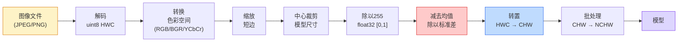
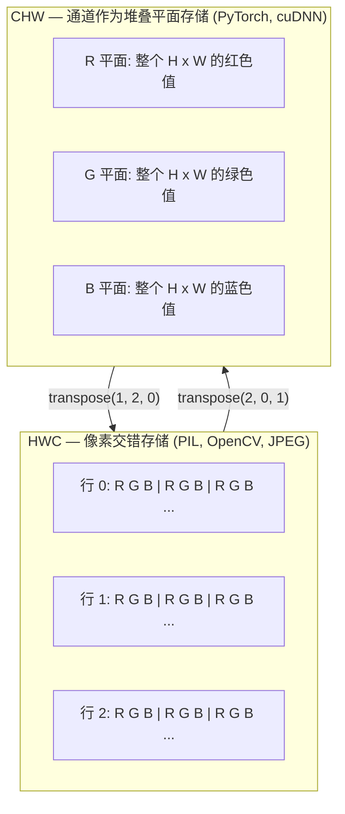

# 图像基础 — 像素、通道、色彩空间

> 图像是光样本的张量。你将使用的每个视觉模型都从这个事实出发。

**类型:** 构建
**语言:** Python
**前置知识:** Phase 1 Lesson 12 (张量操作), Phase 3 Lesson 11 (PyTorch入门)
**时间:** 约45分钟

## 学习目标

- 解释连续场景如何被离散化为像素，以及采样/量化决策为何决定了每个下游模型的上限
- 读取、切片和检查图像作为NumPy数组，并在HWC和CHW布局之间流畅切换
- 在RGB、灰度、HSV和YCbCr之间转换，并解释每种色彩空间存在的原因
- 应用像素级预处理（归一化、标准化、缩放、通道优先），严格按照torchvision的要求

## 问题所在

你将阅读的每篇论文、下载的每个预训练权重、调用的每个视觉API都假设输入有特定的编码。传入`uint8`图像而模型期望`float32`，它仍然会运行——并静默地产生垃圾输出。将BGR喂给在RGB上训练的网络，准确率会下降十个百分点。给期望通道优先的模型传入通道后置的输入，第一个卷积层会将高度当作特征通道。这些都不会抛出错误。它只会毁掉你的指标，然后你花一周时间寻找一个存在于文件加载方式中的bug。

一旦你知道卷积在什么上面滑动，它并不复杂。困难的部分是"图像"对相机、JPEG解码器、PIL、OpenCV、torchvision和CUDA内核意味着不同的东西。每个技术栈都有自己的轴顺序、字节范围和通道约定。一个不能理清这些的视觉工程师会发布有问题的管线。

本课修复基础，以便后续课程可以在此基础上构建。到最后你将知道像素是什么、为什么每个像素有三个数字而不是一个、"用ImageNet统计量标准化"到底做了什么，以及如何在本阶段其他课程假设的两种或三种布局之间切换。

## 核心概念

### 完整预处理管线一览

每个生产视觉系统都是相同序列的可逆变换。弄错一步，模型看到的输入就与训练时不同。



红色和蓝色两个方框是80%静默失败的来源：缺失的标准化和错误的布局。

### 像素是样本，不是方块

相机传感器计算落在微小探测器网格上的光子。每个探测器在几分之一秒内积分光线并发出与击中光子数成正比的电压。传感器然后将该电压离散化为整数。一个探测器变成一个像素。

```
连续场景                 传感器网格                     数字图像
(无限细节)              (H x W 探测器)                (H x W 整数)

    ~~~~~                        +--+--+--+--+--+                 210 198 180 155 120
   ~   ~   ~                     |  |  |  |  |  |                 205 195 178 152 118
  ~ 光线 ~      ---->           +--+--+--+--+--+     ---->       200 190 175 150 115
   ~~~~~                         |  |  |  |  |  |                 195 185 170 148 112
                                 +--+--+--+--+--+                 188 180 165 145 108
```

在这一步发生两个选择，它们固定了所有下游的上限：

- **空间采样**决定每度场景有多少探测器。太少，边缘会呈锯齿状（混叠）。太多，存储和计算会爆炸。
- **强度量化**决定电压被分桶的精细程度。8位给出256个级别，是显示的标准。10、12、16位给出更平滑的梯度，对医学成像、HDR和原始传感器管线很重要。

像素不是有面积的彩色方块。它是一个单一测量值。当你缩放或旋转时，你是在重新采样那个测量网格。

### 为什么有三个通道

一个探测器计算整个可见光谱中的光子——那就是灰度。为了获得颜色，传感器在网格上覆盖红、绿、蓝滤镜的马赛克。去马赛克后，每个空间位置有三个整数：附近红色滤镜探测器、绿色滤镜探测器和蓝色滤镜探测器的响应。这三个整数就是像素的RGB三元组。

```
内存中的一个像素：

    (R, G, B) = (210, 140, 30)   <- 红橙色

一张 H x W RGB 图像：

    形状 (H, W, 3)     存储为   H 行 W 像素 3 个值
                                    每个在 [0, 255] 范围内 (uint8)
```

三不是魔法。深度相机添加Z通道。卫星添加红外和紫外波段。医学扫描通常有一个通道（X光、CT）或多个通道（高光谱）。通道数是最后一个轴；卷积层学习跨通道混合。

### 两种布局约定：HWC和CHW

相同的张量，两种排序。每个库选择一种。

```
HWC (高度, 宽度, 通道)           CHW (通道, 高度, 宽度)

   W ->                                    H ->
  +-----+-----+-----+                     +-----+-----+
H |R G B|R G B|R G B|                   C |R R R R R R|
| +-----+-----+-----+                   | +-----+-----+
v |R G B|R G B|R G B|                   v |G G G G G G|
  +-----+-----+-----+                     +-----+-----+
                                          |B B B B B B|
                                          +-----+-----+

   PIL, OpenCV, matplotlib,              PyTorch, 大多数深度学习
   几乎磁盘上的每个图像文件              框架, cuDNN内核
```

CHW存在是因为卷积核在H和W上滑动。保持通道轴在前面意味着每个核看到每个通道的一个连续2D平面，这可以干净地向量化。磁盘格式保持HWC因为那匹配传感器扫描线的输出方式。

你将输入一千次的单行转换：

```
img_chw = img_hwc.transpose(2, 0, 1)      # NumPy
img_chw = img_hwc.permute(2, 0, 1)        # PyTorch 张量
```

内存布局可视化：



### 字节范围和数据类型

三种约定占主导地位：

| 约定   | dtype     | 范围          | 出现位置                           |
| ------ | --------- | ------------- | ---------------------------------- |
| 原始   | `uint8`   | [0, 255]      | 磁盘文件, PIL, OpenCV输出          |
| 归一化 | `float32` | [0.0, 1.0]    | `img.astype('float32') / 255` 之后 |
| 标准化 | `float32` | 大约 [-2, +2] | 减去均值并除以标准差之后           |

卷积网络在标准化输入上训练。ImageNet统计量 `mean=[0.485, 0.456, 0.406]`，`std=[0.229, 0.224, 0.225]` 是整个ImageNet训练集三个通道在[0, 1]归一化像素上计算的算术平均值和标准差。将原始`uint8`输入期望标准化浮点数的模型是应用视觉中最常见的静默失败。

### 色彩空间及其存在的原因

RGB是捕获格式，但不总是模型最有用的表示。

```
 RGB               HSV                       YCbCr / YUV

 R 红色            H 色相 (角度 0-360)        Y 亮度
 G 绿色            S 饱和度 (0-1)             Cb 蓝色色度
 B 蓝色            V 明度/亮度 (0-1)          Cr 红色色度

 线性对应          分离颜色与                  分离亮度与
 传感器输出        亮度。适用于                颜色。JPEG和大多数视频
                   颜色阈值化、UI              编解码器更重地压缩色度
                   滑块、简单滤镜              通道，因为人眼对色度
                                              细节不如对Y敏感。
```

对于大多数现代CNN，你输入RGB。你在以下场景遇到其他空间：

- **HSV** — 经典CV代码、基于颜色的分割、白平衡。
- **YCbCr** — 读取JPEG内部结构、视频管线、仅在Y上操作的超分辨率模型。
- **灰度** — OCR、文档模型、颜色是干扰变量而非信号的任何情况。

从RGB到灰度是加权和，不是平均值，因为人眼对绿色比对红色或蓝色更敏感：

```
Y = 0.299 R + 0.587 G + 0.114 B       (ITU-R BT.601, 经典权重)
```

### 宽高比、缩放和插值

每个模型都有固定输入尺寸（大多数ImageNet分类器为224x224，现代检测器为384x384或512x512）。你的图像很少匹配。三个重要的缩放选择：

- **缩放短边，然后中心裁剪** — 标准ImageNet方案。保持宽高比，丢弃一条边缘像素。
- **缩放并填充** — 保持宽高比和每个像素，添加黑边。检测和OCR的标准。
- **直接缩放到目标尺寸** — 拉伸图像。便宜，扭曲几何，对许多分类任务足够。

插值方法决定当新网格与旧网格不对齐时如何计算中间像素：

```
最近邻              最快，块状，掩码/标签的唯一选择
双线性              快速，平滑，大多数图像缩放的默认
双三次              较慢，上采样时更锐利
Lanczos             最慢，最佳质量，用于最终显示
```

经验法则：训练用双线性，你要查看的素材用双三次或Lanczos，包含整数类ID的任何内容用最近邻。

## 构建它

### 步骤1：加载图像并检查其形状

使用Pillow加载任何JPEG或PNG，转换为NumPy，并打印你得到的内容。为了一个可离线运行的确定性示例，合成一个。

```python
import numpy as np
from PIL import Image

def synthetic_rgb(h=128, w=192, seed=0):
    rng = np.random.default_rng(seed)
    yy, xx = np.meshgrid(np.linspace(0, 1, h), np.linspace(0, 1, w), indexing="ij")
    r = (np.sin(xx * 6) * 0.5 + 0.5) * 255
    g = yy * 255
    b = (1 - yy) * xx * 255
    rgb = np.stack([r, g, b], axis=-1) + rng.normal(0, 6, (h, w, 3))
    return np.clip(rgb, 0, 255).astype(np.uint8)

arr = synthetic_rgb()
# 或从磁盘加载：
# arr = np.asarray(Image.open("your_image.jpg").convert("RGB"))

print(f"type:   {type(arr).__name__}")
print(f"dtype:  {arr.dtype}")
print(f"shape:  {arr.shape}     # (H, W, C)")
print(f"min:    {arr.min()}")
print(f"max:    {arr.max()}")
print(f"pixel at (0, 0): {arr[0, 0]}")
```

预期输出：`shape: (H, W, 3)`，`dtype: uint8`，范围`[0, 255]`。无论字节来自相机、JPEG解码器还是合成生成器，这都是规范的磁盘表示。

### 步骤2：分离通道并重新排列布局

分别提取R、G、B，然后从HWC转换为CHW以供PyTorch使用。

```python
R = arr[:, :, 0]
G = arr[:, :, 1]
B = arr[:, :, 2]
print(f"R shape: {R.shape}, mean: {R.mean():.1f}")
print(f"G shape: {G.shape}, mean: {G.mean():.1f}")
print(f"B shape: {B.shape}, mean: {B.mean():.1f}")

arr_chw = arr.transpose(2, 0, 1)
print(f"\nHWC shape: {arr.shape}")
print(f"CHW shape: {arr_chw.shape}")
```

三个灰度平面，每个通道一个。CHW只是重新排序轴；当内存布局允许时，严格来说不需要数据复制。

### 步骤3：灰度和HSV转换

加权和灰度，然后手动RGB转HSV。

```python
def rgb_to_grayscale(rgb):
    weights = np.array([0.299, 0.587, 0.114], dtype=np.float32)
    return (rgb.astype(np.float32) @ weights).astype(np.uint8)

def rgb_to_hsv(rgb):
    rgb_f = rgb.astype(np.float32) / 255.0
    r, g, b = rgb_f[..., 0], rgb_f[..., 1], rgb_f[..., 2]
    cmax = np.max(rgb_f, axis=-1)
    cmin = np.min(rgb_f, axis=-1)
    delta = cmax - cmin

    h = np.zeros_like(cmax)
    mask = delta > 0
    rmax = mask & (cmax == r)
    gmax = mask & (cmax == g)
    bmax = mask & (cmax == b)
    h[rmax] = ((g[rmax] - b[rmax]) / delta[rmax]) % 6
    h[gmax] = ((b[gmax] - r[gmax]) / delta[gmax]) + 2
    h[bmax] = ((r[bmax] - g[bmax]) / delta[bmax]) + 4
    h = h * 60.0

    s = np.where(cmax > 0, delta / cmax, 0)
    v = cmax
    return np.stack([h, s, v], axis=-1)

gray = rgb_to_grayscale(arr)
hsv = rgb_to_hsv(arr)
print(f"gray shape: {gray.shape}, range: [{gray.min()}, {gray.max()}]")
print(f"hsv   shape: {hsv.shape}")
print(f"hue range: [{hsv[..., 0].min():.1f}, {hsv[..., 0].max():.1f}] degrees")
print(f"sat range: [{hsv[..., 1].min():.2f}, {hsv[..., 1].max():.2f}]")
print(f"val range: [{hsv[..., 2].min():.2f}, {hsv[..., 2].max():.2f}]")
```

色相以度为单位输出，饱和度和明度在[0, 1]范围内。这匹配OpenCV的`hsv_full`约定。

### 步骤4：归一化、标准化和反向操作

从原始字节到预训练ImageNet模型期望的精确张量，然后返回。

```python
mean = np.array([0.485, 0.456, 0.406], dtype=np.float32)
std = np.array([0.229, 0.224, 0.225], dtype=np.float32)

def preprocess_imagenet(rgb_uint8):
    x = rgb_uint8.astype(np.float32) / 255.0
    x = (x - mean) / std
    x = x.transpose(2, 0, 1)
    return x

def deprocess_imagenet(chw_float32):
    x = chw_float32.transpose(1, 2, 0)
    x = x * std + mean
    x = np.clip(x * 255.0, 0, 255).astype(np.uint8)
    return x

x = preprocess_imagenet(arr)
print(f"preprocessed shape: {x.shape}     # (C, H, W)")
print(f"preprocessed dtype: {x.dtype}")
print(f"preprocessed mean per channel:  {x.mean(axis=(1, 2)).round(3)}")
print(f"preprocessed std  per channel:  {x.std(axis=(1, 2)).round(3)}")

roundtrip = deprocess_imagenet(x)
max_diff = np.abs(roundtrip.astype(int) - arr.astype(int)).max()
print(f"roundtrip max pixel diff: {max_diff}    # 应该是0或1")
```

每通道均值应接近零，标准差接近一。preprocess/deprocess对正是每个torchvision `transforms.Normalize`调用在底层做的事情。

### 步骤5：三种插值方法缩放

比较最近邻、双线和双三次在上采样时的差异，使差异可见。

```python
target = (arr.shape[0] * 3, arr.shape[1] * 3)

nearest = np.asarray(Image.fromarray(arr).resize(target[::-1], Image.NEAREST))
bilinear = np.asarray(Image.fromarray(arr).resize(target[::-1], Image.BILINEAR))
bicubic = np.asarray(Image.fromarray(arr).resize(target[::-1], Image.BICUBIC))

def local_roughness(x):
    gy = np.diff(x.astype(float), axis=0)
    gx = np.diff(x.astype(float), axis=1)
    return float(np.abs(gy).mean() + np.abs(gx).mean())

for name, out in [("nearest", nearest), ("bilinear", bilinear), ("bicubic", bicubic)]:
    print(f"{name:>8}  shape={out.shape}  roughness={local_roughness(out):6.2f}")
```

最近邻在粗糙度上得分最高，因为它保持硬边缘。双线性最平滑。双三次居中，保持感知锐度而没有阶梯伪影。

## 使用它

`torchvision.transforms`将上述所有内容捆绑到一个可组合的管线中。以下代码精确复现了`preprocess_imagenet`的功能，加上缩放和裁剪。

```python
import torch
from torchvision import transforms
from PIL import Image

img = Image.fromarray(synthetic_rgb(256, 256))

pipeline = transforms.Compose([
    transforms.Resize(256),
    transforms.CenterCrop(224),
    transforms.ToTensor(),
    transforms.Normalize(mean=[0.485, 0.456, 0.406], std=[0.229, 0.224, 0.225]),
])

x = pipeline(img)
print(f"tensor type:  {type(x).__name__}")
print(f"tensor dtype: {x.dtype}")
print(f"tensor shape: {tuple(x.shape)}      # (C, H, W)")
print(f"per-channel mean: {x.mean(dim=(1, 2)).tolist()}")
print(f"per-channel std:  {x.std(dim=(1, 2)).tolist()}")

batch = x.unsqueeze(0)
print(f"\nbatched shape: {tuple(batch.shape)}   # (N, C, H, W) — 准备输入模型")
```

四步，按此精确顺序：`Resize(256)`将短边缩放到256；`CenterCrop(224)`从中间取224x224的块；`ToTensor()`除以255并将HWC转为CHW；`Normalize`减去ImageNet均值并除以标准差。反转该顺序会静默改变到达模型的内容。

## 发布它

本课产出：

- `outputs/prompt-vision-preprocessing-audit.md` — 一个提示，将任何模型卡或数据集卡转换为团队必须遵守的精确预处理不变量检查清单。
- `outputs/skill-image-tensor-inspector.md` — 一个技能，给定任何图像形状的张量或数组，报告dtype、布局、范围，以及它看起来是原始的、归一化的还是标准化的。

## 练习

1. **(简单)** 用OpenCV (`cv2.imread`)和Pillow加载一张JPEG。打印两者的形状和`(0, 0)`处的像素。解释通道顺序差异，然后写一行转换使OpenCV数组与Pillow的相同。
2. **(中等)** 编写`standardize(img, mean, std)`及其逆函数，两者一起在任何uint8图像上通过`roundtrip_max_diff <= 1`测试。你的函数必须在单张HWC图像和NCHW批次上用同一次调用工作。
3. **(困难)** 取一个3通道ImageNet标准化张量，通过一个1x1卷积运行它，该卷积学习RGB到单个灰度通道的加权混合。将权重初始化为`[0.299, 0.587, 0.114]`，冻结它们，并验证输出与手动`rgb_to_grayscale`在浮点误差范围内匹配。还有哪些经典色彩空间变换可以写成1x1卷积？

## 关键术语

| 术语      | 人们怎么说       | 实际含义                                                                           |
| --------- | ---------------- | ---------------------------------------------------------------------------------- |
| 像素      | "一个彩色方块"   | 一个网格位置上光强度的一个样本——彩色时三个数字，灰度时一个                         |
| 通道      | "颜色"           | 堆叠到图像张量中的并行空间网格之一；HWC中为最后轴，CHW中为第一轴                   |
| HWC / CHW | "形状"           | 图像张量的轴顺序；磁盘和PIL使用HWC，PyTorch和cuDNN使用CHW                          |
| 归一化    | "缩放图像"       | 除以255使像素在[0, 1]范围内——必要但不充分                                          |
| 标准化    | "零中心化"       | 每通道减去均值并除以标准差，使输入分布与模型训练时的匹配                           |
| 灰度转换  | "平均通道"       | 系数为0.299/0.587/0.114的加权和，匹配人眼亮度感知                                  |
| 插值      | "缩放如何选像素" | 当新网格与旧网格不对齐时决定输出值的规则——标签用最近邻，训练用双线性，显示用双三次 |
| 宽高比    | "宽除以高"       | 区分"缩放并填充"与"缩放并拉伸"的比率                                               |

## 延伸阅读

- [Charles Poynton — A Guided Tour of Color Space](https://poynton.ca/PDFs/Guided_tour.pdf) — 关于为什么有这么多色彩空间以及何时使用每种色彩空间的最清晰技术论述
- [PyTorch Vision Transforms 文档](https://pytorch.org/vision/stable/transforms.html) — 你在生产中实际组合的完整变换管线
- [How JPEG Works (Colt McAnlis)](https://www.youtube.com/watch?v=F1kYBnY6mwg) — 色度子采样、DCT以及为什么JPEG编码YCbCr而非RGB的精彩视觉导览
- [ImageNet预处理约定 (torchvision models)](https://pytorch.org/vision/stable/models.html) — `mean=[0.485, 0.456, 0.406]`的权威来源以及为什么模型库中的每个模型都期望它
