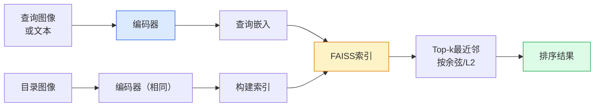

# 图像检索

> 检索系统按嵌入空间中的距离排序候选。度量学习是塑造该空间使距离含义符合需求的方法。

**类型:** 构建
**语言:** Python
**前置知识:** Phase 4 Lesson 14 (ViT), Phase 4 Lesson 18 (CLIP)
**时间:** 约45分钟

## 学习目标

- 解释三元组、对比和基于代理的度量学习损失，并为给定数据集选择正确的损失
- 正确实现L2归一化和余弦相似度，审计"相同物品"和"相同类别"检索的区别
- 构建FAISS索引，通过文本和图像查询，报告保留查询集的recall@K
- 使用DINOv2、CLIP和SigLIP作为现成的嵌入骨干，知道各自何时胜出

## 问题所在

检索在生产视觉中无处不在：重复检测、反向图像搜索、视觉搜索（"找相似产品"）、人脸重识别、行人重识别、电商实例级匹配。产品问题总是相同的："给定这张查询图像，对我的目录排序。"

两个设计决策塑造整个系统。嵌入——什么模型产生向量。索引——如何大规模找到最近邻。两者在2026年都是商品化的（DINOv2用于嵌入，FAISS用于索引），这提高了门槛：困难的部分是定义*什么算相似*，然后塑造嵌入空间使距离匹配。

那种塑造就是度量学习。它是一个小但高杠杆的学科。

## 核心概念

### 检索一览



### 四种损失家族

| 损失                    | 需要                    | 优点                   | 缺点                     |
| ----------------------- | ----------------------- | ---------------------- | ------------------------ |
| **对比**                | (锚点, 正样本) + 负样本 | 简单，适用于任何对标签 | 没有大量负样本时收敛慢   |
| **三元组**              | (锚点, 正样本, 负样本)  | 直观；直接边际控制     | 困难三元组挖掘昂贵       |
| **NT-Xent / InfoNCE**   | 对 + 批内负样本         | 扩展到大批量           | 需要大批量或动量队列     |
| **基于代理 (ProxyNCA)** | 仅类别标签              | 快速，稳定，无需挖掘   | 小数据集上可能过拟合代理 |

对于大多数生产用例，从预训练骨干开始，只有当现成嵌入在测试集上表现不足时才添加度量学习微调。

### 三元组损失

```
L = max(0, ||f(a) - f(p)||^2 - ||f(a) - f(n)||^2 + margin)
```

将锚点`a`拉近正样本`p`，推远负样本`n`，`margin`确保间隔。三图像结构推广到任何相似度排序。

挖掘很重要：简单三元组（`n`已经远离`a`）贡献零损失；只有困难三元组教会网络。半困难挖掘（`n`比`p`远但在margin内）是2016年FaceNet的配方，仍然占主导。

### 余弦相似度 vs L2

两个度量，两个约定：

- **余弦**：向量间角度。需要L2归一化嵌入。
- **L2**：欧几里得距离。适用于原始或归一化嵌入，但通常与L2归一化+平方L2配对。

对于大多数现代网络两者等价：当`||a|| = ||b|| = 1`时，`||a - b||^2 = 2 - 2 cos(a, b)`。选择与嵌入训练匹配的约定；混用会静默改变"最近"的含义。

### Recall@K

标准检索指标：

```
recall@K = top K结果中至少有一个正确匹配的查询比例
```

同时报告recall@1、@5、@10。recall@10高于0.95但recall@1低于0.5意味着嵌入空间结构正确但排序有噪声——尝试更长微调或重排序步骤。

### FAISS一段话介绍

Facebook AI Similarity Search。最近邻搜索的事实标准库。三种索引选择：

- `IndexFlatIP` / `IndexFlatL2` — 暴力搜索，精确，无需训练。约100万向量以下使用。
- `IndexIVFFlat` — 分区为K个单元，只搜索最近的几个单元。近似，快速，需要训练数据。
- `IndexHNSW` — 基于图，大量查询时最快，索引大小较大。

10万向量你可能想用`IndexFlatIP`做余弦相似度。1000万用`IndexIVFFlat`。1亿以上结合乘积量化（`IndexIVFPQ`）。

### 实例级 vs 类别级检索

两个非常不同的问题共用同一个名字：

- **类别级** — "在我的目录中找猫"。类条件相似度；现成CLIP/DINOv2嵌入效果好。
- **实例级** — "在我的目录中找这个确切产品"。需要同类视觉相似物体之间的细粒度区分；现成嵌入表现不足；度量学习微调很重要。

在选择模型之前，始终先问你在解决哪一个。

## 构建它

### 步骤1：三元组损失

```python
import torch
import torch.nn.functional as F

def triplet_loss(anchor, positive, negative, margin=0.2):
    d_ap = F.pairwise_distance(anchor, positive, p=2)
    d_an = F.pairwise_distance(anchor, negative, p=2)
    return F.relu(d_ap - d_an + margin).mean()
```

### 步骤2：半困难挖掘

```python
def semi_hard_negatives(emb, labels, margin=0.2):
    dist = torch.cdist(emb, emb)
    same_class = labels[:, None] == labels[None, :]
    diff_class = ~same_class
    N = emb.size(0)

    positives = dist.clone()
    positives[~same_class] = float("-inf")
    positives.fill_diagonal_(float("-inf"))
    pos_idx = positives.argmax(dim=1)

    semi_hard = dist.clone()
    semi_hard[same_class] = float("inf")
    d_ap = dist[torch.arange(N), pos_idx].unsqueeze(1)
    semi_hard[dist <= d_ap] = float("inf")
    neg_idx = semi_hard.argmin(dim=1)

    fallback_mask = semi_hard[torch.arange(N), neg_idx] == float("inf")
    if fallback_mask.any():
        hardest = dist.clone()
        hardest[same_class] = float("inf")
        neg_idx = torch.where(fallback_mask, hardest.argmin(dim=1), neg_idx)
    return pos_idx, neg_idx
```

### 步骤3：Recall@K

```python
def recall_at_k(query_emb, gallery_emb, query_labels, gallery_labels, k=1):
    sim = query_emb @ gallery_emb.T
    _, top_k = sim.topk(k, dim=-1)
    matches = (gallery_labels[top_k] == query_labels[:, None]).any(dim=-1)
    return matches.float().mean().item()
```

### 步骤4：组合训练

```python
class Encoder(nn.Module):
    def __init__(self, in_dim=128, emb_dim=64):
        super().__init__()
        self.net = nn.Sequential(
            nn.Linear(in_dim, 128), nn.ReLU(),
            nn.Linear(128, emb_dim),
        )

    def forward(self, x):
        return F.normalize(self.net(x), dim=-1)

torch.manual_seed(0)
num_classes = 6
protos = F.normalize(torch.randn(num_classes, 128), dim=-1)

def sample_batch(bs=32):
    labels = torch.randint(0, num_classes, (bs,))
    x = protos[labels] + 0.15 * torch.randn(bs, 128)
    return x, labels

enc = Encoder()
opt = torch.optim.Adam(enc.parameters(), lr=3e-3)

for step in range(200):
    x, y = sample_batch(32)
    emb = enc(x)
    pos_idx, neg_idx = semi_hard_negatives(emb, y)
    loss = triplet_loss(emb, emb[pos_idx], emb[neg_idx])
    opt.zero_grad(); loss.backward(); opt.step()
```

## 使用它

2026年生产栈：

- **DINOv2 + FAISS** — 通用视觉检索。开箱即用。
- **CLIP + FAISS** — 查询是文本时。
- **微调DINOv2 + FAISS** — 实例级检索、人脸重识别、时尚、电商。
- **Milvus / Weaviate / Qdrant** — FAISS或HNSW周围的托管向量数据库包装器。

## 发布它

本课产出：

- `outputs/prompt-retrieval-loss-picker.md` — 一个提示，为给定检索问题选择三元组/InfoNCE/ProxyNCA。
- `outputs/skill-recall-at-k-runner.md` — 一个技能，编写带有训练/验证/画廊分割的recall@K评估工具。

## 练习

1. **(简单)** 运行上面的玩具示例。用PCA可视化训练前后的嵌入，看到6个聚类形成。
2. **(中等)** 添加ProxyNCA损失实现：每个类别一个学习的"代理"，余弦相似度上的标准交叉熵。比较与三元组损失的收敛速度。
3. **(困难)** 取1000张ImageNet验证图像，用DINOv2通过HuggingFace嵌入，构建FAISS平面索引，报告recall@{1, 5, 10}。

## 关键术语

| 术语           | 人们怎么说       | 实际含义                                               |
| -------------- | ---------------- | ------------------------------------------------------ |
| 度量学习       | "塑造空间"       | 训练编码器使其输出空间中的距离反映目标相似度           |
| 三元组损失     | "拉近推远"       | L = max(0, d(a,p) - d(a,n) + margin)；经典度量学习损失 |
| 半困难挖掘     | "有用的负样本"   | 比锚点远离正样本但在margin内的负样本；经验上最有信息量 |
| 基于代理的损失 | "类原型"         | 每类一个学习代理；相似度-代理的交叉熵；无需对挖掘      |
| Recall@K       | "Top-K命中率"    | top K结果中至少有一个正确结果的查询比例                |
| 实例检索       | "找这个确切东西" | 细粒度匹配；现成特征通常表现不足                       |
| FAISS          | "NN库"           | Facebook的最近邻库；支持精确和近似索引                 |

## 延伸阅读

- [FaceNet (Schroff et al., 2015)](https://arxiv.org/abs/1503.03832) — 三元组损失/半困难挖掘论文
- [In Defense of the Triplet Loss (Hermans et al., 2017)](https://arxiv.org/abs/1703.07737) — 三元组微调实用指南
- [FAISS 文档](https://github.com/facebookresearch/faiss/wiki) — 每种索引，每个权衡
