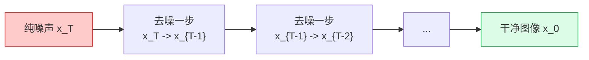

# 图像生成Diffusion

> 扩散模型通过学习逆转逐步加噪过程来生成图像。训练稳定，生成质量超越GAN。

**类型:** 构建
**语言:** Python
**前置知识:** Phase 3 (深度学习核心), Phase 4 Lesson 09 (GAN)
**时间:** 约90分钟

## 学习目标

- 解释前向扩散过程（逐步加噪）和反向去噪过程（逐步去噪）
- 实现DDPM（去噪扩散概率模型）的训练和采样
- 理解噪声调度、重参数化技巧和预测噪声vs预测图像的区别
- 使用DDIM加速采样从1000步减少到50步

## 问题所在

GAN训练不稳定——模式崩溃、超参数敏感、判别器-生成器平衡难以维持。扩散模型用一种完全不同的方法避免了这些问题：不对抗训练，而是训练一个网络预测添加到图像中的噪声，然后迭代去噪生成新图像。

扩散模型（DDPM, Ho et al., 2020）在2020年出现，到2022年在图像质量上超越GAN，成为Stable Diffusion、DALL-E和Midjourney的基础。核心思想简单：如果你能从纯噪声中逐步去除噪声，你就能从噪声生成任何图像。

代价是速度：标准DDPM需要1000步去噪，每步一次网络前向传播。GAN需要1步。DDIM、DPM-Solver和一致性模型将扩散采样加速到10-50步，缩小了差距。

## 核心概念

### 前向过程：加噪

从干净图像x_0开始，在T步中逐步添加高斯噪声：

```
q(x_t | x_{t-1}) = N(x_t; sqrt(1 - beta_t) * x_{t-1}, beta_t * I)

直接从 x_0 采样任意步 t:
q(x_t | x_0) = N(x_t; sqrt(alpha_bar_t) * x_0, (1 - alpha_bar_t) * I)

其中:
  alpha_t = 1 - beta_t
  alpha_bar_t = prod_{s=1}^{t} alpha_s
```

beta_t是方差调度——小值加少量噪声，大值加大量噪声。线性调度从1e-4到0.02，余弦调度更平滑。

关键性质：当t足够大时，x_t几乎是纯高斯噪声。前向过程将任何图像分布变成标准高斯。

### 反向过程：去噪

反向过程学习逆转每一步加噪：

```
p_theta(x_{t-1} | x_t) = N(x_{t-1}; mu_theta(x_t, t), sigma_t^2 * I)

其中 mu_theta 由神经网络参数化
```

训练目标：预测添加到图像中的噪声。

```
L = E[||epsilon - epsilon_theta(x_t, t)||^2]

epsilon: 实际添加的噪声
epsilon_theta: 网络预测的噪声
x_t = sqrt(alpha_bar_t) * x_0 + sqrt(1 - alpha_bar_t) * epsilon
```

网络输入是噪声图像x_t和时间步t，输出是预测的噪声epsilon。训练简单：采样图像、采样噪声、采样时间步、计算预测误差。

### 采样：从噪声生成图像



DDPM采样（1000步）：

```
for t = T, T-1, ..., 1:
    epsilon_pred = model(x_t, t)
    x_{t-1} = (1/sqrt(alpha_t)) * (x_t - (beta_t/sqrt(1-alpha_bar_t)) * epsilon_pred) + sigma_t * z

其中 z ~ N(0, I) 当 t > 1，z = 0 当 t = 1
```

每步使用网络预测噪声，计算去噪后的图像，添加少量随机噪声（除了最后一步）。

### 噪声调度

两种常用调度：

```
线性调度:  beta_t 线性从 beta_min 到 beta_max
余弦调度:  alpha_bar_t = cos^2((t/T + s)/(1 + s) * pi/2)

余弦调度更平滑，避免在早期时间步信息破坏过快
```

### DDIM：加速采样

DDIM（Denoising Diffusion Implicit Models，Song et al., 2020）将扩散过程解释为非马尔可夫过程，允许跳步：

```
DDIM 采样（50步）:
  选择时间步子集: tau = [0, 20, 40, ..., 1000]
  for each consecutive pair (tau_i, tau_{i+1}):
      epsilon_pred = model(x_{tau_{i+1}}, tau_{i+1})
      x_{tau_i} = deterministic_update(x_{tau_{i+1}}, epsilon_pred, tau_i, tau_{i+1})
```

DDIM是确定性的（eta=0时无随机噪声），允许从1000步减少到50步而质量损失很小。Stable Diffusion默认使用DDIM或DPM-Solver采样。

### 预测目标

三种选择：

| 目标           | 网络预测     | 优点           | 缺点         |
| -------------- | ------------ | -------------- | ------------ |
| epsilon (噪声) | 添加的噪声   | 最稳定，最常用 | 间接         |
| x_0 (图像)     | 去噪后的图像 | 直观           | 高t时不稳定  |
| v-prediction   | 速度场       | 理论最优       | 需要特殊调度 |

epsilon预测是DDPM和Stable Diffusion的默认选择。v-prediction（Progressive Distillation，Salimans & Ho, 2022）用于快速采样蒸馏。

## 构建它

### 步骤1：噪声调度

```python
import torch
import numpy as np

def linear_schedule(T=1000, beta_start=1e-4, beta_end=0.02):
    betas = torch.linspace(beta_start, beta_end, T)
    alphas = 1.0 - betas
    alpha_bars = torch.cumprod(alphas, dim=0)
    return betas, alphas, alpha_bars

def cosine_schedule(T=1000, s=0.008):
    steps = torch.arange(T + 1)
    alpha_bars = torch.cos(((steps / T) + s) / (1 + s) * torch.pi / 2) ** 2
    alpha_bars = alpha_bars / alpha_bars[0]
    betas = 1.0 - (alpha_bars[1:] / alpha_bars[:-1])
    betas = torch.clamp(betas, 0.0001, 0.999)
    alphas = 1.0 - betas
    return betas, alphas, alpha_bars[1:]
```

余弦调度在几乎所有情况下都更优——信息破坏更均匀，不需要手动调整beta范围。

### 步骤2：前向过程（加噪）

```python
def q_sample(x_0, t, alpha_bars, noise=None):
    """在时间步t给x_0加噪"""
    if noise is None:
        noise = torch.randn_like(x_0)

    alpha_bar_t = alpha_bars[t][:, None, None, None]
    return torch.sqrt(alpha_bar_t) * x_0 + torch.sqrt(1 - alpha_bar_t) * noise
```

一行代码实现前向过程。重参数化技巧使得可以直接从x_0采样任意时间步x_t，无需逐步迭代。

### 步骤3：简单U-Net去噪网络

```python
import torch.nn as nn
import torch.nn.functional as F

class SinusoidalPositionEmbeddings(nn.Module):
    def __init__(self, dim):
        super().__init__()
        self.dim = dim

    def forward(self, t):
        half_dim = self.dim // 2
        emb = torch.exp(-torch.arange(half_dim) * (np.log(10000) / half_dim))
        emb = t[:, None].float() @ emb[None, :]
        return torch.cat([torch.sin(emb), torch.cos(emb)], dim=-1)

class SimpleDenoiser(nn.Module):
    def __init__(self, in_ch=3, base=64):
        super().__init__()
        self.time_mlp = nn.Sequential(
            SinusoidalPositionEmbeddings(base),
            nn.Linear(base, base * 4),
            nn.GELU(),
            nn.Linear(base * 4, base * 4),
        )

        # 简化的U-Net
        self.conv_in = nn.Conv2d(in_ch, base, 3, padding=1)

        self.down1 = nn.Conv2d(base, base * 2, 4, 2, 1)
        self.down2 = nn.Conv2d(base * 2, base * 4, 4, 2, 1)

        self.mid = nn.Conv2d(base * 4, base * 4, 3, padding=1)

        self.up2 = nn.ConvTranspose2d(base * 4, base * 2, 2, 2)
        self.up1 = nn.ConvTranspose2d(base * 2, base, 2, 2)

        self.conv_out = nn.Conv2d(base, in_ch, 3, padding=1)

        # 时间嵌入投影
        self.t_proj1 = nn.Linear(base * 4, base * 2)
        self.t_proj2 = nn.Linear(base * 4, base * 4)

    def forward(self, x, t):
        t_emb = self.time_mlp(t)

        h = self.conv_in(x)
        h1 = F.silu(self.down1(h) + self.t_proj1(t_emb)[:, :, None, None])
        h2 = F.silu(self.down2(h1) + self.t_proj2(t_emb)[:, :, None, None])

        h = F.silu(self.mid(h2))

        h = F.silu(self.up2(h))
        h = F.silu(self.up1(h + h1[:, :, :h.shape[2], :h.shape[3]]))

        return self.conv_out(h)
```

时间嵌入是扩散模型区别于普通U-Net的关键：网络需要知道当前时间步来决定去噪多少。正弦位置编码将标量时间步转换为高维向量。

### 步骤4：训练

```python
def train_step(model, x_0, alpha_bars, T, device):
    """单步DDPM训练"""
    batch_size = x_0.size(0)
    t = torch.randint(0, T, (batch_size,), device=device)
    noise = torch.randn_like(x_0)

    x_t = q_sample(x_0, t, alpha_bars.to(device), noise)
    noise_pred = model(x_t, t)

    loss = F.mse_loss(noise_pred, noise)
    return loss
```

训练极其简单：采样随机时间步，加噪，预测噪声，计算MSE。没有对抗训练的平衡问题。

### 步骤5：DDPM采样

```python
@torch.no_grad()
def ddpm_sample(model, shape, betas, alphas, alpha_bars, T, device):
    """完整DDPM采样循环"""
    x = torch.randn(shape, device=device)

    for t_idx in reversed(range(T)):
        t = torch.full((shape[0],), t_idx, device=device, dtype=torch.long)
        noise_pred = model(x, t)

        alpha_t = alphas[t][:, None, None, None]
        alpha_bar_t = alpha_bars[t][:, None, None, None]
        beta_t = betas[t][:, None, None, None]

        # 计算去噪后的x_{t-1}
        x = (1 / torch.sqrt(alpha_t)) * (
            x - (beta_t / torch.sqrt(1 - alpha_bar_t)) * noise_pred
        )

        # 添加噪声（除了t=0）
        if t_idx > 0:
            sigma_t = torch.sqrt(beta_t)
            x = x + sigma_t * torch.randn_like(x)

    return x
```

### 步骤6：DDIM采样（更快）

```python
@torch.no_grad()
def ddim_sample(model, shape, alpha_bars, timesteps, device):
    """DDIM采样——跳步，确定性"""
    x = torch.randn(shape, device=device)

    for i in reversed(range(1, len(timesteps))):
        t = torch.full((shape[0],), timesteps[i], device=device, dtype=torch.long)
        t_prev = torch.full((shape[0],), timesteps[i-1], device=device, dtype=torch.long)

        noise_pred = model(x, t)

        alpha_bar_t = alpha_bars[t][:, None, None, None]
        alpha_bar_prev = alpha_bars[t_prev][:, None, None, None]

        # 预测x_0
        x0_pred = (x - torch.sqrt(1 - alpha_bar_t) * noise_pred) / torch.sqrt(alpha_bar_t)

        # 计算x_{t_prev}
        x = torch.sqrt(alpha_bar_prev) * x0_pred + torch.sqrt(1 - alpha_bar_prev) * noise_pred

    return x
```

DDIM跳步采样：选择50个时间步而非1000个，20倍加速。确定性（无随机噪声）意味着相同输入总是产生相同输出。

## 使用它

对于生产扩散模型，使用HuggingFace Diffusers：

```python
from diffusers import DDPMPipeline, DDIMPipeline, UNet2DModel

# 加载预训练DDPM
pipeline = DDPMPipeline.from_pretrained("google/ddpm-cifar10-32")
images = pipeline(batch_size=4).images

# 使用DDIM加速
ddim_pipeline = DDIMPipeline.from_pretrained("google/ddpm-cifar10-32")
images = ddim_pipeline(num_inference_steps=50).images
```

## 发布它

本课产出：

- `outputs/prompt-diffusion-debugger.md` — 一个提示，诊断扩散模型训练问题（收敛慢、生成模糊、颜色偏移）并推荐修复。
- `outputs/skill-schedule-picker.md` — 一个技能，根据图像分辨率和训练预算选择噪声调度和采样策略。

## 练习

1. **(简单)** 在CIFAR-10的一个类别上训练DDPM 50个epoch。用DDPM和DDIM采样比较生成质量和速度。
2. **(中等)** 实现余弦噪声调度，与线性调度比较训练稳定性和生成质量。
3. **(困难)** 实现classifier-free guidance：训练条件扩散模型（带类别标签），在采样时使用guidance scale控制生成质量-多样性权衡。

## 关键术语

| 术语        | 人们怎么说 | 实际含义                                 |
| ----------- | ---------- | ---------------------------------------- |
| 前向过程    | "加噪"     | 逐步向图像添加高斯噪声，最终变成纯噪声   |
| 反向过程    | "去噪"     | 学习逆转加噪过程，从噪声逐步生成图像     |
| DDPM        | "扩散模型" | 去噪扩散概率模型；逐步去噪的生成模型     |
| 噪声调度    | "beta调度" | 控制每步添加噪声量的时间表；线性或余弦   |
| DDIM        | "快速采样" | 非马尔可夫扩散采样，允许跳步，20倍加速   |
| epsilon预测 | "预测噪声" | 网络预测添加的噪声而非去噪后的图像       |
| alpha_bar   | "累积乘积" | 噪声水平的累积度量；控制信号-噪声比      |
| 重参数化    | "直接采样" | 从x_0直接采样任意时间步x_t，无需逐步迭代 |

## 延伸阅读

- [Denoising Diffusion Probabilistic Models (Ho et al., 2020)](https://arxiv.org/abs/2006.11239) — DDPM原始论文
- [DDIM (Song et al., 2020)](https://arxiv.org/abs/2010.02502) — 加速扩散采样
- [Improved DDPM (Nichol & Dhariwal, 2021)](https://arxiv.org/abs/2102.09672) — 余弦调度和学习方差
- [What are Diffusion Models? (Lilian Weng)](https://lilianweng.github.io/posts/2021-07-11-diffusion-models/) — 最佳博客导览
