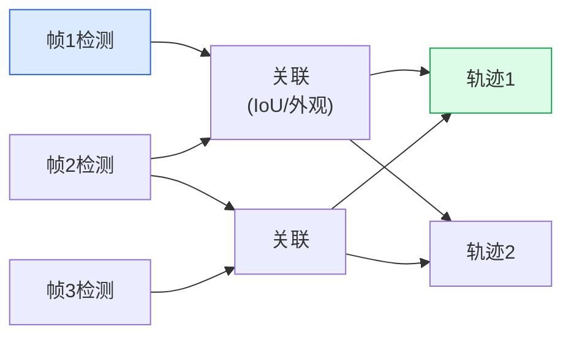

# 多目标跟踪

> 跟踪是在帧之间链接检测。SORT用IoU做。ByteTrack用置信度做。BoT-SORT用外观+运动做。

**类型:** 构建
**语言:** Python
**前置知识:** Phase 4 Lesson 06 (目标检测YOLO)
**时间:** 约45分钟

## 学习目标

- 解释跟踪范式：检测跟踪（TBD）vs 联合检测跟踪（JDT）
- 从零实现SORT：卡尔曼滤波器+匈牙利匹配+IoU关联
- 理解ByteTrack和BoT-SORT如何改进SORT
- 使用HOTA、MOTA和IDF1评估跟踪性能

## 问题所在

检测告诉你每帧中有什么。跟踪告诉你帧与帧之间哪个检测是同一个物体。没有跟踪，你不知道汽车是否停下了还是只是被遮挡了一帧。你不知道行人往哪个方向走。你无法计数——10帧中的1个人和1帧中的10个人对检测器看起来一样。

多目标跟踪（MOT）是视频分析的基础：交通计数、人群分析、运动统计、安防监控、机器人导航。

## 核心概念

### 检测跟踪范式



每帧：检测物体 -> 与现有轨迹关联 -> 创建新轨迹 / 更新现有轨迹 / 删除丢失轨迹。

### SORT（简单在线实时跟踪）

SORT（Bewley et al., 2016）是MOT的基础算法：

1. **卡尔曼滤波器** — 预测每个轨迹在下一帧的位置
2. **匈牙利算法** — 基于IoU将检测分配给预测
3. **轨迹管理** — 新检测创建新轨迹；未匹配轨迹在N帧后删除

SORT只用运动（IoU），不用外观。快速、简单、在运动可预测的场景中效果好。

### ByteTrack

ByteTrack（Zhang et al., 2021）的关键洞察：低置信度检测不是噪声——它们是被遮挡的物体。

```
标准SORT: 丢弃低于置信度阈值的检测
ByteTrack:
  1. 高置信度检测与轨迹匹配（第一轮）
  2. 未匹配轨迹与低置信度检测匹配（第二轮）
  3. 仍然未匹配的轨迹保留N帧
```

第二轮"拯救"被遮挡物体的轨迹，因为遮挡的检测通常有低置信度但仍然有合理的IoU。

### BoT-SORT

BoT-SORT（Aharon et al., 2022）结合运动和外观：

- **卡尔曼滤波器 + IoU** — 运动关联（如SORT）
- **ReID特征** — 外观关联（余弦相似度）
- **相机运动补偿** — 补偿相机移动
- **融合** — 运动和外观分数的加权组合

BoT-SORT是2026年MOT挑战赛的默认跟踪器。

### 评估指标

- **MOTA** — 多目标跟踪准确率：`1 - (FN + FP + IDSW) / GT`。惩罚漏检、误检和ID切换。
- **IDF1** — 身份F1：正确ID分配的F1分数。衡量身份保持。
- **HOTA** — 高阶跟踪准确率：平衡检测和关联质量。2026年首选指标。
- **IDSW** — ID切换次数：轨迹ID改变的次数。越低越好。

## 构建它

### 步骤1：卡尔曼滤波器

```python
import numpy as np
from scipy.linalg import block_diag

class KalmanBoxTracker:
    count = 0

    def __init__(self, bbox):
        self.id = KalmanBoxTracker.count
        KalmanBoxTracker.count += 1
        self.x = np.array([bbox[0], bbox[1], bbox[2] - bbox[0], bbox[3] - bbox[1], 0, 0, 0, 0], dtype=np.float64)
        self.F = block_diag(np.eye(4), np.eye(4))
        self.F[:4, 4:] = np.eye(4)
        self.H = np.eye(4, 8)
        self.P = np.eye(8) * 10
        self.P[4:, 4:] *= 100
        self.R = np.eye(4) * 1
        self.Q = np.eye(8)
        self.Q[:4, :4] *= 1
        self.Q[4:, 4:] *= 0.01
        self.time_since_update = 0
        self.hits = 1

    def predict(self):
        self.x = self.F @ self.x
        self.P = self.F @ self.P @ self.F.T + self.Q
        self.time_since_update += 1
        return self.x[:4]

    def update(self, bbox):
        z = np.array([bbox[0], bbox[1], bbox[2] - bbox[0], bbox[3] - bbox[1]])
        y = z - self.H @ self.x
        S = self.H @ self.P @ self.H.T + self.R
        K = self.P @ self.H.T @ np.linalg.inv(S)
        self.x = self.x + K @ y
        self.P = (np.eye(8) - K @ self.H) @ self.P
        self.time_since_update = 0
        self.hits += 1

    def get_state(self):
        return [self.x[0], self.x[1], self.x[0] + self.x[2], self.x[1] + self.x[3]]
```

### 步骤2：IoU匹配

```python
from scipy.optimize import linear_sum_assignment

def iou_batch(bb_test, bb_gt):
    bb_test = np.array(bb_test)
    bb_gt = np.array(bb_gt)
    xx1 = np.maximum(bb_test[:, 0], bb_gt[:, 0])
    yy1 = np.maximum(bb_test[:, 1], bb_gt[:, 1])
    xx2 = np.minimum(bb_test[:, 2], bb_gt[:, 2])
    yy2 = np.minimum(bb_test[:, 3], bb_gt[:, 3])
    w = np.maximum(0., xx2 - xx1)
    h = np.maximum(0., yy2 - yy1)
    inter = w * h
    area_test = (bb_test[:, 2] - bb_test[:, 0]) * (bb_test[:, 3] - bb_test[:, 1])
    area_gt = (bb_gt[:, 2] - bb_gt[:, 0]) * (bb_gt[:, 3] - bb_gt[:, 1])
    return inter / (area_test + area_gt - inter + 1e-6)

def associate_detections_to_trackers(detections, trackers, iou_threshold=0.3):
    if len(trackers) == 0:
        return np.empty((0, 2), dtype=int), np.arange(len(detections)), np.empty((0,), dtype=int)
    iou_matrix = np.zeros((len(detections), len(trackers)))
    for d, det in enumerate(detections):
        iou_matrix[d] = iou_batch([det], trackers)
    row_ind, col_ind = linear_sum_assignment(-iou_matrix)
    matched, unmatched_dets, unmatched_trks = [], [], []
    for d, t in zip(row_ind, col_ind):
        if iou_matrix[d, t] < iou_threshold:
            unmatched_dets.append(d)
            unmatched_trks.append(t)
        else:
            matched.append([d, t])
    unmatched_dets.extend(set(range(len(detections))) - set(row_ind))
    unmatched_trks.extend(set(range(len(trackers))) - set(col_ind))
    return np.array(matched), np.array(unmatched_dets), np.array(unmatched_trks)
```

### 步骤3：SORT跟踪器

```python
class SORT:
    def __init__(self, max_age=30, min_hits=3, iou_threshold=0.3):
        self.max_age = max_age
        self.min_hits = min_hits
        self.iou_threshold = iou_threshold
        self.trackers = []

    def update(self, detections):
        # 预测
        predicted = [t.predict() for t in self.trackers]
        matched, unmatched_dets, unmatched_trks = associate_detections_to_trackers(
            detections, predicted, self.iou_threshold
        )
        # 更新匹配的跟踪器
        for d, t in matched:
            self.trackers[t].update(detections[d])
        # 创建新跟踪器
        for d in unmatched_dets:
            self.trackers.append(KalmanBoxTracker(detections[d]))
        # 删除旧跟踪器
        self.trackers = [t for t in self.trackers if t.time_since_update < self.max_age]
        # 返回活跃轨迹
        results = []
        for t in self.trackers:
            if t.hits >= self.min_hits or t.time_since_update == 0:
                results.append(t.get_state() + [t.id])
        return results
```

## 使用它

生产跟踪器：

- **ByteTrack** — YOLO检测 + ByteTrack关联，MOT默认
- **BoT-SORT** — 外观+运动关联，高IDF1
- **DeepSORT** — ReID外观特征，经典方法
- **OC-SORT** — 观测中心SORT，更好的遮挡处理

## 发布它

本课产出：

- `outputs/prompt-mot-picker.md` — 根据场景选择跟踪器。
- `outputs/skill-mot-evaluator.md` — 计算HOTA/MOTA/IDF1的评估工具。

## 练习

1. **(简单)** 在合成视频上运行SORT，可视化轨迹ID。
2. **(中等)** 实现ByteTrack的两轮匹配：高置信度检测先匹配，低置信度检测第二轮匹配。
3. **(困难)** 添加ReID外观特征到SORT，实现简化BoT-SORT。比较与纯IoU SORT的IDF1。

## 关键术语

| 术语       | 人们怎么说   | 实际含义                           |
| ---------- | ------------ | ---------------------------------- |
| MOT        | "多目标跟踪" | 在视频中跨帧跟踪多个物体           |
| SORT       | "IoU跟踪"    | 用卡尔曼滤波+IoU关联的简单在线跟踪 |
| ByteTrack  | "低分也用"   | 用低置信度检测拯救被遮挡物体的轨迹 |
| 卡尔曼滤波 | "运动预测"   | 预测轨迹在下一帧的位置             |
| 匈牙利算法 | "最优匹配"   | 基于IoU矩阵将检测分配给轨迹        |
| IDSW       | "ID切换"     | 同一物体的轨迹ID改变的次数         |
| HOTA       | "跟踪准确率" | 高阶跟踪准确率，平衡检测和关联     |

## 延伸阅读

- [SORT (Bewley et al., 2016)](https://arxiv.org/abs/1602.00763)
- [ByteTrack (Zhang et al., 2021)](https://arxiv.org/abs/2110.06864)
- [BoT-SORT (Aharon et al., 2022)](https://arxiv.org/abs/2206.14606)
