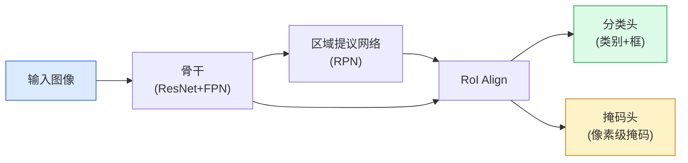

# 实例分割MaskRCNN

> 实例分割为每个像素分配类别标签和实例ID。Mask R-CNN在检测之上添加一个分割掩码头。

**类型:** 学习+构建
**语言:** Python
**前置知识:** Phase 4 Lesson 06 (目标检测YOLO), Phase 4 Lesson 07 (语义分割UNet)
**时间:** 约75分钟

## 学习目标

- 区分语义分割、实例分割和全景分割，并说明何时使用每种
- 解释Mask R-CNN的架构：骨干+RPN+RoI Align+双头（检测+掩码）
- 实现RoI Align，理解它为何取代RoI Pooling
- 使用Detectron2或MMDetection进行生产实例分割

## 问题所在

语义分割告诉你"这些像素是猫"。检测告诉你"这里有一只猫"。实例分割告诉你"这些像素是猫1，这些像素是猫2"。当你需要区分同一类的不同实例时——计算人群、操作单个物体、跟踪特定车辆——你需要实例级分割。

Mask R-CNN（He et al., 2017）是实例分割的奠基工作。它在Faster R-CNN检测器之上添加一个小的分割头，为每个检测到的物体生成像素级掩码。核心洞察：检测和分割可以端到端联合训练，检测质量驱动分割质量。

## 核心概念

### 从检测到实例分割



Mask R-CNN = Faster R-CNN + 掩码头。检测管线找到物体，掩码头为每个物体生成二值分割掩码。

### RoI Align vs RoI Pooling

Faster R-CNN使用RoI Pooling将不同大小的特征图区域量化为固定大小。量化引入了不对齐，对分类无害但对分割有害（像素级精度需要精确对齐）。

RoI Align移除了所有量化：

```
RoI Pooling:
  1. 将RoI坐标量化到特征图网格
  2. 将池化bin量化到整数位置
  3. 每个bin内最大池化

RoI Align:
  1. 不量化RoI坐标
  2. 在每个bin内采样4个等间距点
  3. 双线性插值计算每个采样点的值
  4. 每个bin内平均池化
```

RoI Align的精确对齐将掩码AP提高了约2-3个百分点。看似小的工程细节，对分割质量有显著影响。

### 掩码头

掩码头是一个小型FCN（全卷积网络），应用于每个RoI：

```
输入: RoI Align输出 (K, K, C)
  -> Conv 3x3, 256ch, ReLU  x4
  -> ConvTranspose 2x2, 256ch, stride 2
  -> Conv 1x1, num_classes
  -> Sigmoid
输出: (K*2, K*2, num_classes) 每类掩码
```

关键设计选择：掩码头为每个类别独立预测掩码，然后由检测分类结果选择正确的掩码。这解耦了分类和分割，使每个任务更容易学习。

### 训练损失

Mask R-CNN的总损失是三个组件的和：

```
L = L_cls + L_box + L_mask

L_cls: 分类交叉熵（每个RoI的类别）
L_box: 边界框回归损失（Smooth L1）
L_mask: 每像素二元交叉熵（仅对正确类别）
```

L_mask仅对正确类别的掩码计算，不是所有类别。这是解耦设计的关键——掩码头不需要解决分类问题，只需要为给定类别分割正确区域。

### 全景分割

全景分割（Kirillov et al., 2019）结合语义分割和实例分割：

```
语义分割:  [天空, 天空, 树, 树, 人, 人]
实例分割:  [背景, 背景, 物体1, 物体1, 物体2, 物体2]
全景分割:  [天空, 天空, 树1, 树1, 人1, 人1]
```

Panoptic FPN（Panoptic Feature Pyramid Network）是标准方法：语义分割头和实例分割头共享同一个骨干，输出合并为全景预测。

## 构建它

### 步骤1：RoI Align实现

```python
import torch
import torch.nn.functional as F

def roi_align(feature_map, rois, output_size, spatial_scale):
    """简化的RoI Align实现。
    feature_map: (B, C, H, W)
    rois: (N, 5) [batch_idx, x1, y1, x2, y2] 原始图像坐标
    output_size: (oh, ow) 输出尺寸
    spatial_scale: feature_map / image 的比例
    """
    B, C, H, W = feature_map.shape
    oh, ow = output_size
    outputs = []

    for roi in rois:
        batch_idx = int(roi[0])
        x1, y1, x2, y2 = roi[1:] * spatial_scale

        # 在输出网格上采样点
        grid_y = torch.linspace(y1, y2, oh, device=feature_map.device)
        grid_x = torch.linspace(x1, x2, ow, device=feature_map.device)
        gy, gx = torch.meshgrid(grid_y, grid_x, indexing="ij")

        # 归一化到 [-1, 1] 用于 grid_sample
        gx_norm = 2.0 * gx / (W - 1) - 1.0
        gy_norm = 2.0 * gy / (H - 1) - 1.0
        grid = torch.stack([gx_norm, gy_norm], dim=-1).unsqueeze(0)

        feat = feature_map[batch_idx:batch_idx+1]
        sampled = F.grid_sample(feat, grid, align_corners=True, mode="bilinear")
        outputs.append(sampled.squeeze(0))

    return torch.stack(outputs)
```

`grid_sample`在PyTorch中高效实现了双线性插值，避免了手动采样循环。

### 步骤2：掩码头

```python
class MaskHead(nn.Module):
    def __init__(self, in_channels=256, num_classes=10, hidden=256):
        super().__init__()
        self.conv = nn.Sequential(
            nn.Conv2d(in_channels, hidden, 3, padding=1),
            nn.ReLU(inplace=True),
            nn.Conv2d(hidden, hidden, 3, padding=1),
            nn.ReLU(inplace=True),
            nn.Conv2d(hidden, hidden, 3, padding=1),
            nn.ReLU(inplace=True),
            nn.Conv2d(hidden, hidden, 3, padding=1),
            nn.ReLU(inplace=True),
        )
        self.deconv = nn.ConvTranspose2d(hidden, hidden, 2, stride=2)
        self.pred = nn.Conv2d(hidden, num_classes, 1)

    def forward(self, x):
        x = self.conv(x)
        x = self.deconv(x)
        x = F.relu(x)
        return self.pred(x).sigmoid()
```

四层3x3卷积提取RoI特征，转置卷积上采样2倍，1x1卷积产生每类掩码。

### 步骤3：掩码损失

```python
def mask_loss(pred_masks, gt_masks, target_classes):
    """pred_masks: (N, C, H, W), gt_masks: (N, H, W), target_classes: (N,)"""
    N = pred_masks.size(0)
    losses = []
    for i in range(N):
        cls = target_classes[i]
        pred = pred_masks[i, cls]  # 选择正确类别的掩码
        gt = gt_masks[i].float()
        losses.append(F.binary_cross_entropy(pred, gt, reduction="mean"))
    return torch.stack(losses).mean()
```

仅对正确类别计算损失。这是Mask R-CNN解耦设计的关键——掩码头不需要解决分类问题。

## 使用它

对于生产实例分割，使用Detectron2或MMDetection：

```python
# Detectron2 示例
from detectron2.config import get_cfg
from detectron2 import model_zoo
from detectron2.engine import DefaultPredictor

cfg = get_cfg()
cfg.merge_from_file(model_zoo.get_config_file("COCO-InstanceSegmentation/mask_rcnn_R_50_FPN_3x.yaml"))
cfg.MODEL.WEIGHTS = model_zoo.get_checkpoint_url("COCO-InstanceSegmentation/mask_rcnn_R_50_FPN_3x.yaml")
cfg.MODEL.ROI_HEADS.NUM_CLASSES = 10  # 你的类别数

predictor = DefaultPredictor(cfg)
outputs = predictor(image)

# 提取结果
instances = outputs["instances"]
boxes = instances.pred_boxes
masks = instances.pred_masks
classes = instances.pred_classes
scores = instances.scores
```

## 发布它

本课产出：

- `outputs/prompt-instance-seg-picker.md` — 一个提示，根据物体尺寸、实例密度和延迟需求选择实例分割方法。
- `outputs/skill-roi-align-debugger.md` — 一个技能，验证RoI Align实现是否正确对齐，通过检查掩码-框一致性。

## 练习

1. **(简单)** 可视化COCO实例分割标注：绘制边界框和每实例掩码叠加在图像上。
2. **(中等)** 在合成数据（随机形状）上训练Mask R-CNN。报告检测AP和掩码AP。
3. **(困难)** 实现Panoptic FPN：在共享骨干上组合语义分割头和实例分割头，合并输出为全景预测。

## 关键术语

| 术语       | 人们怎么说         | 实际含义                                    |
| ---------- | ------------------ | ------------------------------------------- |
| 实例分割   | "每个物体一个掩码" | 为每个检测到的物体生成独立的像素级掩码      |
| Mask R-CNN | "检测加掩码"       | 在Faster R-CNN之上添加掩码头的实例分割架构  |
| RoI Align  | "精确裁剪"         | 无量化的区域特征提取，保证像素级对齐        |
| RPN        | "提议网络"         | 区域提议网络，生成候选物体区域              |
| 掩码头     | "分割FCN"          | 应用于每个RoI的小型全卷积网络，生成每类掩码 |
| 全景分割   | "语义加实例"       | 结合语义分割和实例分割的统一框架            |
| FPN        | "特征金字塔"       | 特征金字塔网络，多尺度特征提取              |

## 延伸阅读

- [Mask R-CNN (He et al., 2017)](https://arxiv.org/abs/1703.06870) — 原始论文
- [Detectron2](https://github.com/facebookresearch/detectron2) — Facebook的检测和分割框架
- [Panoptic Segmentation (Kirillov et al., 2019)](https://arxiv.org/abs/1801.00868) — 全景分割定义
- [MMDetection](https://github.com/open-mmlab/mmdetection) — OpenMMLab的检测和分割工具箱
