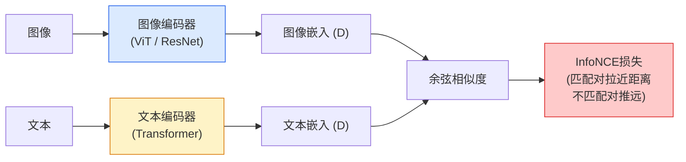

# 开放词汇CLIP

> CLIP通过对比学习将图像和文本映射到共享嵌入空间，实现零样本分类和跨模态检索。

**类型:** 学习+构建
**语言:** Python
**前置知识:** Phase 4 Lesson 14 (ViT), Phase 4 Lesson 17 (自监督视觉)
**时间:** 约60分钟

## 学习目标

- 解释CLIP的对比学习框架：图像编码器、文本编码器、InfoNCE损失
- 使用CLIP进行零样本分类、图像-文本检索和零样本检测
- 理解CLIP的局限性：分布偏移、细粒度分类、空间推理
- 使用SigLIP和EVA-CLIP作为CLIP的改进变体

## 问题所在

传统分类器只能识别训练时见过的类别。添加新类别需要重新训练。CLIP（Contrastive Language-Image Pre-training，Radford et al., 2021）打破了这一限制：通过在4亿图像-文本对上训练，CLIP学会了将图像和文本映射到同一嵌入空间。

零样本分类变得简单：给定图像，计算其嵌入与所有类别文本嵌入的相似度，选择最相似的类别。不需要任何训练数据。CLIP在ImageNet上达到76%零样本准确率——与有监督ResNet-50相当。

## 核心概念

### CLIP架构



### InfoNCE损失

对于N个图像-文本对，CLIP最大化匹配对的相似度，最小化不匹配对的相似度：

```
对角线是正样本对（匹配的图像-文本）
非对角线是负样本对（不匹配的）

L = -1/N * sum_i [log(exp(sim(i,i)/tau) / sum_j exp(sim(i,j)/tau))
                + log(exp(sim(i,i)/tau) / sum_j exp(sim(j,i)/tau))]
```

tau是可学习的温度参数。大批量（32768）提供大量负样本，是CLIP成功的关键。

### 零样本分类

```python
# 传统分类器：固定类别
model = ResNet50(num_classes=1000)

# CLIP：任意类别
class_names = ["cat", "dog", "car", "tree", ...]  # 任何你想要的类别
text_embeddings = clip.encode_text(class_names)
image_embedding = clip.encode_image(image)
probs = (image_embedding @ text_embeddings.T).softmax(dim=-1)
```

类别名称可以更描述性：`"a photo of a cat"`比`"cat"`效果更好，因为CLIP在类似描述上训练。

### 零样本检测

CLIP本身不做检测，但可以与检测器组合：

1. 检测器（YOLO）生成候选区域
2. 每个区域裁剪后通过CLIP编码
3. 与文本提示比较，分配类别

Grounding DINO和YOLO-World将这个流程端到端化。

### CLIP的局限性

- **分布偏移** — 在训练分布外的图像上性能下降（如MNIST手写数字）
- **细粒度分类** — 难以区分相似子类别（如不同品种的狗）
- **空间推理** — 无法理解"左边"vs"右边"、"上面"vs"下面"
- **计数** — 无法可靠地数物体数量
- **组合性** — 难以理解"红色的球在蓝色的盒子上面"

## 构建它

### 步骤1：使用CLIP

```python
import torch
from transformers import CLIPModel, CLIPProcessor

model = CLIPModel.from_pretrained("openai/clip-vit-base-patch32")
processor = CLIPProcessor.from_pretrained("openai/clip-vit-base-patch32")

from PIL import Image
image = Image.open("photo.jpg")
texts = ["a photo of a cat", "a photo of a dog", "a photo of a car"]

inputs = processor(text=texts, images=image, return_tensors="pt", padding=True)
with torch.no_grad():
    outputs = model(**inputs)

logits = outputs.logits_per_image
probs = logits.softmax(dim=-1)
print(f"probabilities: {probs[0].tolist()}")
```

### 步骤2：零样本分类管线

```python
def zero_shot_classify(image, class_names, template="a photo of a {}"):
    texts = [template.format(name) for name in class_names]
    inputs = processor(text=texts, images=image, return_tensors="pt", padding=True)
    with torch.no_grad():
        outputs = model(**inputs)
    probs = outputs.logits_per_image.softmax(dim=-1)
    return {name: prob.item() for name, prob in zip(class_names, probs[0])}
```

## 使用它

CLIP变体和改进：

- **SigLIP** — 用Sigmoid损失替换Softmax，支持更小批量
- **EVA-CLIP** — 更大的ViT骨干，更高准确率
- **DFN** — 数据过滤网络，更高质量的训练数据
- **MobileCLIP** — 移动端优化

## 发布它

本课产出：

- `outputs/prompt-clip-prompt-engineer.md` — 一个提示，为CLIP零样本分类设计最优文本提示。
- `outputs/skill-clip-retrieval-index.md` — 一个技能，构建CLIP图像检索索引。

## 练习

1. **(简单)** 用CLIP对10张图像进行零样本分类，比较不同提示模板的效果。
2. **(中等)** 构建图像检索系统：用CLIP编码图像库，通过文本查询检索最相似的图像。
3. **(困难)** 实现零样本检测：用滑动窗口生成候选区域，用CLIP分类每个区域。

## 关键术语

| 术语       | 人们怎么说      | 实际含义                                           |
| ---------- | --------------- | -------------------------------------------------- |
| CLIP       | "对比语言-图像" | 将图像和文本映射到共享嵌入空间的对比学习模型       |
| 零样本分类 | "不用训练数据"  | 不需要任何训练样本即可分类新类别                   |
| InfoNCE    | "对比损失"      | 最大化匹配对相似度、最小化不匹配对相似度的损失函数 |
| 提示模板   | "描述性类别名"  | 将类别名转换为描述性文本（如"a photo of a cat"）   |
| 跨模态检索 | "文本找图像"    | 用文本查询检索最相似的图像，或反之                 |

## 延伸阅读

- [CLIP (Radford et al., 2021)](https://arxiv.org/abs/2103.00020) — 原始论文
- [SigLIP (Zhai et al., 2023)](https://arxiv.org/abs/2303.15343) — Sigmoid损失改进
- [OpenCLIP](https://github.com/mlfoundations/open_clip) — 开源CLIP实现
