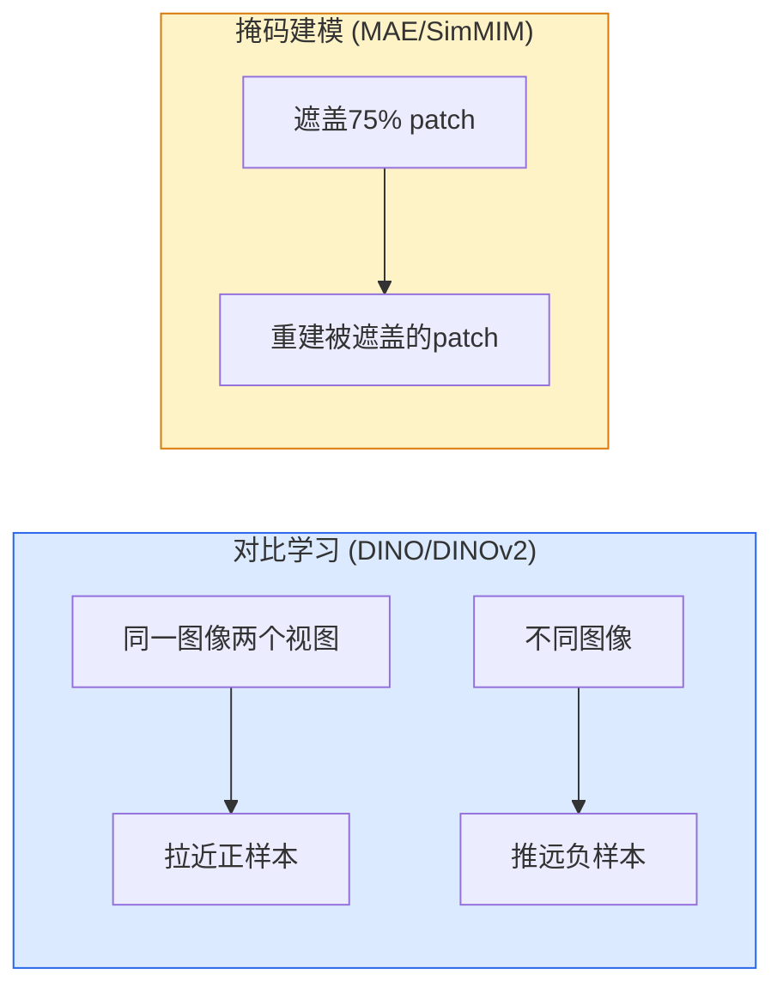

# 自监督视觉

> 自监督学习从图像本身生成标签，无需人工标注。DINO和MAE是2026年视觉预训练的两大范式。

**类型:** 学习+构建
**语言:** Python
**前置知识:** Phase 4 Lesson 14 (ViT), Phase 3 (深度学习核心)
**时间:** 约60分钟

## 学习目标

- 解释自监督预训练的两种主要范式：对比学习（DINO/DINOv2）和掩码建模（MAE/SimMIM）
- 理解为什么DINOv2特征在下游任务上优于有监督预训练
- 实现简化的MAE预训练循环
- 使用DINOv2作为通用视觉特征提取器

## 问题所在

有监督预训练需要标注数据。ImageNet有1000类、120万张标注图像，花费数百万美元标注。医学影像、卫星图像、工业检测等领域没有这样的标注资源。

自监督学习从数据本身生成训练信号：同一图像的两个增强视图应该有相似的表示（对比学习），或从部分输入重建完整输入（掩码建模）。不需要任何人工标签。

2026年，DINOv2特征在大多数下游任务上优于有监督ImageNet预训练，成为默认的视觉骨干初始化方式。

## 核心概念

### 两种范式



### DINO/DINOv2

DINO（Distillation with NO labels）使用教师-学生框架：

- 学生网络处理图像的局部裁剪
- 教师网络处理图像的全局裁剪
- 学生的输出分布应匹配教师的输出分布
- 教师参数是学生参数的指数移动平均（EMA）

DINOv2扩展了DINO：更大的数据（LVD-142M）、更好的增强、iBOT损失（结合DINO和掩码建模）。DINOv2特征在分类、分割、检索和深度估计上都表现优异。

### MAE（掩码自编码器）

MAE随机遮盖75%的图像patch，训练ViT重建被遮盖的像素：

```
1. 将图像分割为patch
2. 随机遮盖75%的patch
3. 只将25%可见patch输入ViT编码器
4. 解码器重建被遮盖的patch
5. 损失 = 重建像素与原始像素的MSE
```

75%遮盖率迫使模型学习全局语义而非局部插值。只处理25%的patch使编码器计算量减少4倍。

### 为什么自监督特征更好

有监督预训练学习区分类别的特征——对分类有用但对其他任务可能不够。自监督预训练学习通用视觉结构：边缘、纹理、形状、空间关系。这些特征在所有下游任务上都有用。

DINOv2特征的特殊性质：

- 自动的语义分割（特征聚类产生物体部分）
- 零样本分类（通过特征最近邻）
- 跨域泛化（自然图像预训练适用于医学、卫星等）

## 构建它

### 步骤1：简化的MAE

```python
import torch
import torch.nn as nn
import torch.nn.functional as F

class SimpleMAE(nn.Module):
    def __init__(self, img_size=32, patch_size=4, in_channels=3, embed_dim=192, depth=6, heads=6, mask_ratio=0.75):
        super().__init__()
        self.patch_size = patch_size
        self.num_patches = (img_size // patch_size) ** 2
        self.mask_ratio = mask_ratio

        # 编码器
        self.patch_embed = nn.Conv2d(in_channels, embed_dim, patch_size, patch_size)
        self.pos_embed = nn.Parameter(torch.zeros(1, self.num_patches, embed_dim))
        self.encoder = nn.TransformerEncoder(
            nn.TransformerEncoderLayer(embed_dim, heads, embed_dim * 4, batch_first=True),
            num_layers=depth,
        )

        # 解码器
        self.decoder_embed = nn.Linear(embed_dim, embed_dim // 2)
        self.mask_token = nn.Parameter(torch.zeros(1, 1, embed_dim // 2))
        self.decoder_pos = nn.Parameter(torch.zeros(1, self.num_patches, embed_dim // 2))
        self.decoder = nn.TransformerEncoder(
            nn.TransformerEncoderLayer(embed_dim // 2, heads, embed_dim * 2, batch_first=True),
            num_layers=4,
        )
        self.head = nn.Linear(embed_dim // 2, patch_size * patch_size * in_channels)

    def forward(self, x):
        B, C, H, W = x.shape
        patches = self.patch_embed(x).flatten(2).transpose(1, 2)
        num_patches = patches.shape[1]

        # 随机遮盖
        num_mask = int(num_patches * self.mask_ratio)
        ids = torch.randperm(num_patches, device=x.device)
        visible_ids = ids[:num_patches - num_mask]
        mask_ids = ids[num_patches - num_mask:]

        # 编码可见patch
        visible = patches[:, visible_ids] + self.pos_embed[:, visible_ids]
        encoded = self.encoder(visible)

        # 解码
        decoder_input = self.decoder_embed(encoded)
        mask_tokens = self.mask_token.expand(B, num_mask, -1)
        full_tokens = torch.zeros(B, num_patches, decoder_input.shape[-1], device=x.device)
        full_tokens[:, visible_ids] = decoder_input
        full_tokens[:, mask_ids] = mask_tokens
        full_tokens = full_tokens + self.decoder_pos

        decoded = self.decoder(full_tokens)
        pred = self.head(decoded)

        # 计算损失（只在遮盖patch上）
        target = x.reshape(B, C, H // self.patch_size, self.patch_size, W // self.patch_size, self.patch_size)
        target = target.permute(0, 2, 4, 1, 3, 5).reshape(B, num_patches, -1)
        loss = F.mse_loss(pred[:, mask_ids], target[:, mask_ids])

        return loss
```

## 使用它

DINOv2作为通用特征提取器：

```python
import torch
from transformers import AutoModel, AutoImageProcessor

processor = AutoImageProcessor.from_pretrained("facebook/dinov2-base")
model = AutoModel.from_pretrained("facebook/dinov2-base")

from PIL import Image
image = Image.open("photo.jpg")
inputs = processor(images=image, return_tensors="pt")
with torch.no_grad():
    features = model(**inputs).last_hidden_state
print(f"features shape: {features.shape}  # (1, N+1, 768)")
```

DINOv2的[CLS] token可以直接用于分类、检索和零样本评估。

## 发布它

本课产出：

- `outputs/prompt-ssl-method-picker.md` — 一个提示，根据数据类型和下游任务选择自监督方法。
- `outputs/skill-dinov2-feature-extractor.md` — 一个技能，使用DINOv2提取特征用于下游任务。

## 练习

1. **(简单)** 在CIFAR-10上训练简化MAE 50个epoch。可视化重建结果。
2. **(中等)** 用DINOv2特征训练线性探针：冻结骨干，只训练线性分类器。与有监督预训练比较。
3. **(困难)** 实现DINO的自蒸馏训练：教师-学生框架，EMA更新教师。在小型数据集上验证特征质量。

## 关键术语

| 术语       | 人们怎么说     | 实际含义                                     |
| ---------- | -------------- | -------------------------------------------- |
| 自监督学习 | "无标签训练"   | 从数据本身生成训练信号，无需人工标注         |
| DINO       | "自蒸馏"       | 教师网络（EMA）指导学生网络学习表示          |
| MAE        | "遮盖重建"     | 遮盖大部分patch，训练模型重建                |
| 对比学习   | "拉近推远"     | 拉近相似样本的表示，推远不同样本的表示       |
| 线性探针   | "冻结评估"     | 冻结预训练骨干，只训练线性分类器评估特征质量 |
| EMA        | "指数移动平均" | 教师网络参数是学生参数的缓慢平均             |

## 延伸阅读

- [DINO (Caron et al., 2021)](https://arxiv.org/abs/2104.14294) — 自蒸馏视觉Transformer
- [DINOv2 (Oquab et al., 2023)](https://arxiv.org/abs/2304.07193) — 扩展DINO到大规模数据
- [MAE (He et al., 2022)](https://arxiv.org/abs/2111.06377) — 掩码自编码器
